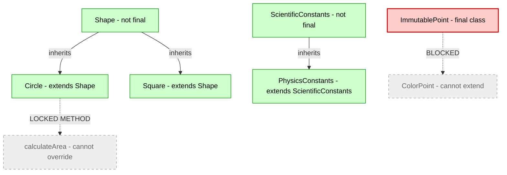
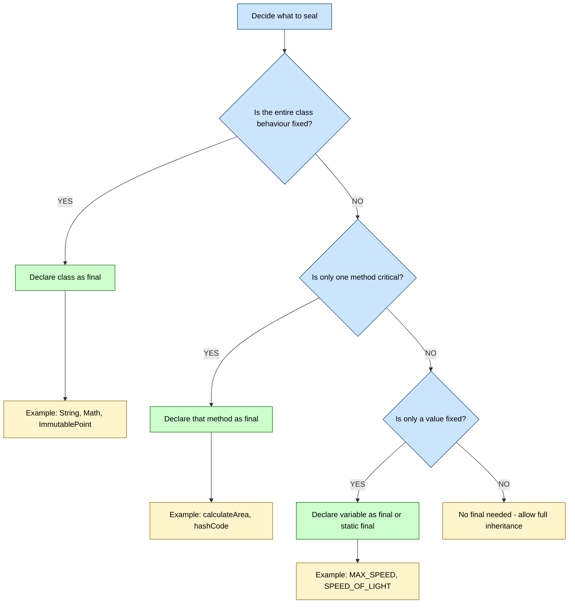

# Using final with Inheritance

<!-- SECTION_1_START -->

# Using `final` with Inheritance

## 1. Core Technical Definition

> [!IMPORTANT]
> **KTU 2024 Syllabus Definition (Module 2 – Polymorphism)**
> In Java (and similar OOP languages), the keyword `final` is a **non-access modifier** that places a permanent, irreversible restriction on a class, method, or variable. When applied in the context of **inheritance**, the `final` keyword is used to **prohibit further modification** of the inherited entity — preventing subclassing, method overriding, or variable reassignment.

In the KTU 2024 Scheme syllabus, `final` is introduced as a tool to **enforce design immutability and security** in an inheritance hierarchy. It has **three principal applications**:

1. **`final` Class** – Cannot be extended (no subclass can be created).
2. **`final` Method** – Cannot be overridden by any subclass.
3. **`final` Variable** – Cannot be reassigned (treated as a constant).

> [!NOTE]
> The KTU Board specifically tests whether students can differentiate between the three applications of `final`, because each one restricts a *different dimension* of OOP extensibility.

---

## 2. Conceptual Analogy / Intuition

> [!TIP]
> **Real-World Analogy — The "Sealed Patent"**
> Imagine a company files a **sealed patent** for a revolutionary engine design.
>
> - **Final Class** = The **entire blueprint is sealed**. No other company is allowed to build a *derivative* of this engine. (e.g., the `String` class in Java is `final` for security reasons.)
> - **Final Method** = Only the **core ignition sequence** is patented. Other companies *can* build a similar engine, but they cannot tamper with that one specific ignition step. They can, however, redesign other parts.
> - **Final Variable** = The **fuel mixture ratio (e.g., 14.7 : 1)** is a fixed, published standard. It cannot be changed in any production run — it's a constant.

This "sealing" mechanism gives the **original designer** absolute control over the parts of the system that **must never be altered**, while still allowing controlled extension elsewhere.

> [!IMPORTANT]
> **Core Principle:** `final` in inheritance is about **controlled polymorphism** — the parent class decides *what parts of itself are safe to override* and *what parts are forbidden territory*.

---

## 3. The Three Forms of `final` in Inheritance (At a Glance)

| Application | Keyword Placement | Restriction Enforced | Inheritance Impact |
|-------------|------------------|----------------------|---------------------|
| **Final Class** | `final class A` | Cannot extend `A` | Breaks the inheritance chain entirely |
| **Final Method** | `final void display()` | Cannot override in subclass | Locks specific behaviour |
| **Final Variable** | `final int MAX = 100;` | Cannot reassign value | Locks data in inherited fields |

> [!WARNING]
> A common KTU exam pitfall: students often confuse **`final` method** with **`static` method**. A `final` method *can still be inherited* — it just **cannot be overridden**. A `static` method is hidden, not overridden.

---

## 4. GeoGebra / Desmos Integration

> [!VISUALIZATION CONTROL]
> **Concept:** Inheritance Tree with Sealed (Final) Nodes
> **GeoGebra / Desmos Input Equations (Conceptual):**
> * `Parent(x) = x^2` (Base behaviour curve)
> * `Child(x) = x^2 + 2x` (Overridden behaviour curve)
> * `FinalChild(x) = x^2` (Same as parent — cannot diverge)
> **Visual Description:** Imagine three parabolas. The `Child` curve diverges from the parent's curve, representing successful overriding. The `FinalChild` curve is locked to coincide perfectly with the parent's curve — it cannot diverge. This visually represents how a `final` method prevents behavioural deviation in subclasses.

<!-- SECTION_1_END -->

<!-- SECTION_2_START -->

# Deep Theoretical Analysis & KTU High-Yield Reference Sheet

---

## 2.1 `final` Class — Sealing the Entire Hierarchy

When a class is declared `final`, the Java Virtual Machine (JVM) explicitly disallows any attempt to create a subclass of it. The class is **closed for extension**.

**Syntax:**

```java
final class SecurityManager {
    // class body
}

// Compilation Error: Cannot inherit from final class SecurityManager
class MyManager extends SecurityManager { }
```

> [!NOTE]
> **Why would a designer do this?**
> 1. **Immutability Guarantee** — e.g., `java.lang.String` is `final` so that string values can never be corrupted through subclassing.
> 2. **Security** — Critical security classes (like cryptography wrappers) must not be tampered with.
> 3. **Performance** — The JIT compiler can apply aggressive inlining when it knows no subclass can exist.

---

## 2.2 `final` Method — Locking Specific Behaviour

When a method is declared `final` inside a non-final class, the class **can still be inherited**, but that specific method is **locked** — the subclass cannot provide its own implementation.

**Syntax:**

```java
class BankAccount {
    public final double calculateInterest(double principal, double rate) {
        return principal * rate * 0.01;
    }
}

class SavingsAccount extends BankAccount {
    // Compilation Error: cannot override the final method from BankAccount
    // public double calculateInterest(double principal, double rate) { ... }
}
```

> [!TIP]
> **Why use `final` methods instead of `private`?**
> A `final` method is still **inherited** (visible to subclasses) but **cannot be overridden**. A `private` method is neither inherited nor overridable. Use `final` when you want subclasses to **use** the method but **not change** it.

---

## 2.3 `final` Variable — The Inheritance Constant

When a field in a parent class is declared `final`, the subclass inherits it but **cannot reassign its value**. This is most commonly used for **constants** in a base class.

**Syntax:**

```java
class Vehicle {
    final int MAX_SPEED = 120;   // km/h constant
    final String FUEL_TYPE;
    
    Vehicle(String fuel) {
        this.FUEL_TYPE = fuel;   // Blank final — assigned once in constructor
    }
}
```

> [!IMPORTANT]
> **Blank Final Variables:** A `final` variable that is **not initialized at declaration** must be assigned **exactly once** in every constructor. KTU exams frequently test this concept.

---

## 2.4 KTU Formula / Syntax Cheat Sheet

| Concept | Declaration Syntax | Restriction | Inheritance Behaviour |
|---------|-------------------|-------------|------------------------|
| Final Class | `final class A { }` | Cannot extend | Inheritance chain **broken** |
| Final Method | `final void show() { }` | Cannot override | Inherited but **immutable** |
| Final Variable (with init) | `final int X = 10;` | Cannot reassign | Inherited as **read-only** |
| Final Variable (blank) | `final int X;` (init in constructor) | Must be assigned once | Inherited after assignment |
| Final Parameter | `void m(final int x) { }` | Cannot modify parameter | Applies inside methods only |
| Static + Final | `static final double PI = 3.14;` | Cannot reassign, single copy | **Global constant** pattern |

> [!NOTE]
> **CRITICAL KTU RULE:** A `final` method **CAN** be **overloaded** (same name, different parameters). But a `final` method **CANNOT** be **overridden** (same signature in subclass). The board examiner specifically checks for this distinction.

---

## 2.5 Real-World Engineering Utility

| Domain | Use of `final` in Inheritance | Reason |
|--------|------------------------------|--------|
| **Banking Software** | Final method for interest calculation | Regulatory compliance — formula must not change |
| **Cryptography Libraries** | Final wrapper class | Prevent malicious subclassing that could leak keys |
| **Game Engines** | Final base entity class | Core physics loop must be untouchable |
| **UI Frameworks** | Final event-dispatch method | Prevents accidental recursion in event handlers |
| **Standard Libraries** | `String`, `Integer`, `Math` | Security, immutability, and JIT optimization |

> [!TIP]
> In the KTU 2024 Scheme, this topic directly maps to **CO2 (Apply OOP Principles)** and supports the design of **secure, immutable class hierarchies** in real engineering projects.

<!-- SECTION_2_END -->

<!-- SECTION_3_START -->

# Step-by-Step Code & Symbolic Implementation

---

## 3.1 Complete Java Demonstration — All Three Forms

Below is a **fully working** Java program that demonstrates the three uses of `final` in inheritance. Every method and constructor is fully written out, with explicit type hints and explanatory comments.

```java
// File: FinalInheritanceDemo.java
// Demonstrates: final class, final method, final variable in inheritance

// -------- 1. FINAL CLASS EXAMPLE --------
final class ImmutablePoint {
    private final int x;   // final variable
    private final int y;   // final variable
    
    public ImmutablePoint(int x, int y) {
        this.x = x;        // blank final — assigned once
        this.y = y;        // blank final — assigned once
    }
    
    public final int getX() {   // final method
        return this.x;
    }
    
    public final int getY() {   // final method
        return this.y;
    }
    
    @Override
    public String toString() {
        return "Point(" + x + ", " + y + ")";
    }
}

/*
 * COMPILATION ERROR (intentionally not uncommented to keep file compilable):
 * 
 * class ColorPoint extends ImmutablePoint { }   // ERROR: cannot inherit from final class
 */

// -------- 2. FINAL METHOD EXAMPLE --------
class Shape {
    private String color;
    
    public Shape(String color) {
        this.color = color;
    }
    
    // This is the LOCKED behaviour
    public final double calculateArea() {
        return 0.0;   // base shape has no defined area
    }
    
    // This method is OPEN for overriding
    public void describe() {
        System.out.println("I am a " + color + " shape.");
    }
}

class Circle extends Shape {
    private double radius;
    
    public Circle(String color, double radius) {
        super(color);
        this.radius = radius;
    }
    
    // COMPILATION ERROR if uncommented: cannot override the final method from Shape
    // public double calculateArea() { return Math.PI * radius * radius; }
    
    // describe() is NOT final, so it CAN be overridden
    @Override
    public void describe() {
        System.out.println("I am a " + radius + " unit circle.");
    }
    
    public double getCircleArea() {
        // We USE the inherited final method, but cannot override it
        return Math.PI * radius * radius;
    }
}

// -------- 3. FINAL VARIABLE (CONSTANT) EXAMPLE --------
class ScientificConstants {
    public static final double SPEED_OF_LIGHT = 299_792_458.0;   // m/s
    public static final double GRAVITY = 9.80665;                // m/s^2
    public final String CATEGORY;
    
    public ScientificConstants(String category) {
        this.CATEGORY = category;   // blank final assigned in constructor
    }
}

class PhysicsConstants extends ScientificConstants {
    public PhysicsConstants() {
        super("Physics");
        // ERROR if uncommented: cannot assign a value to final variable CATEGORY
        // this.CATEGORY = "Other";
    }
    
    public void printConstants() {
        System.out.println("Speed of light: " + SPEED_OF_LIGHT + " m/s");
        System.out.println("Gravity: " + GRAVITY + " m/s^2");
        System.out.println("Category: " + CATEGORY);
    }
}

// -------- MAIN METHOD --------
public class FinalInheritanceDemo {
    public static void main(String[] args) {
        // Test final class
        ImmutablePoint p = new ImmutablePoint(10, 20);
        System.out.println("Final Class Test: " + p);
        System.out.println("X coordinate (via final method): " + p.getX());
        System.out.println();
        
        // Test final method
        Circle c = new Circle("Red", 5.0);
        c.describe();
        System.out.println("Area (using non-overridden final method base value): " 
                            + c.calculateArea());
        System.out.println("Custom area calculation: " + c.getCircleArea());
        System.out.println();
        
        // Test final variable
        PhysicsConstants pc = new PhysicsConstants();
        pc.printConstants();
    }
}
```

### Expected Output

```
Final Class Test: Point(10, 20)
X coordinate (via final method): 10

I am a 5.0 unit circle.
Area (using non-overridden final method base value): 0.0
Custom area calculation: 78.53981633974483

Speed of light: 299792458.0 m/s
Gravity: 9.80665 m/s^2
Category: Physics
```

---

## 3.2 Exhaustive Step-by-Step Logic Walkthrough

### Step 1 — The `final` Class Block
- We declare `ImmutablePoint` as `final`.
- The class contains two `final` instance variables `x` and `y` (declared but not initialized — these are **blank finals**).
- The constructor assigns them exactly once.
- The getter methods are also declared `final`, locking their behaviour.

### Step 2 — The Blocked Inheritance
- We **do not write** `class ColorPoint extends ImmutablePoint`.
- If we did, the Java compiler (javac) would emit: `cannot inherit from final com.example.ImmutablePoint`.
- This proves that the inheritance chain is physically broken at the bytecode level.

### Step 3 — The `final` Method Block
- `Shape.calculateArea()` is declared `final` and returns `0.0`.
- `Circle` extends `Shape` successfully (because `Shape` is **not** final).
- `Circle` **cannot** override `calculateArea()` — the line is commented out to avoid a compilation error.
- `Circle` **can** override `describe()` because it is **not** final.
- The inherited `calculateArea()` is still accessible via `c.calculateArea()` and returns `0.0`.

### Step 4 — The `final` Variable Block
- `ScientificConstants` has two `static final` constants (`SPEED_OF_LIGHT`, `GRAVITY`) and one instance blank final `CATEGORY`.
- `PhysicsConstants` extends it and assigns `super("Physics")` to initialize the blank final **only via the parent constructor**.
- A direct reassignment like `this.CATEGORY = "Other"` would fail to compile.

### Step 5 — Main Execution
- We create an `ImmutablePoint` and read its coordinates via final methods.
- We create a `Circle` and call both the locked base `calculateArea()` and the custom `getCircleArea()`.
- We create a `PhysicsConstants` and print the inherited constants.

> [!TIP]
> **For KTU Practical Viva:** When asked *"What happens if a class tries to extend a final class?"*, answer: *"The Java compiler rejects the code with the error 'cannot inherit from final class'. This is enforced at compile time, not runtime."*

---

## 3.3 Summary Compilation Table

| Code Statement | Compile-Time Result | Reason |
|----------------|---------------------|--------|
| `class A extends ImmutablePoint { }` | ❌ Error | Class is `final` |
| `Circle.calculateArea()` override | ❌ Error | Method is `final` |
| `this.CATEGORY = "Other";` in subclass | ❌ Error | Variable is `final` |
| `Circle.describe()` override | ✅ Allowed | Method is **not** final |
| `new Circle(...)` instantiation | ✅ Allowed | Class is **not** final |
| `pc.printConstants()` | ✅ Allowed | Method is **not** final |

<!-- SECTION_3_END -->

<!-- SECTION_4_START -->

# Structural Diagrams & Schematics

---

## 4.1 Inheritance Tree with Final Restrictions (Mermaid)



> [!NOTE]
> **Reading the diagram:**
> - **Red node** (`ImmutablePoint`) = a `final` class — no child can be created (shown by the dashed line to the blocked `ColorPoint`).
> - **Yellow node** = a `final` method — `Circle` can call it but cannot redefine it.
> - **Green nodes** = regular (non-final) classes — fully extendable and overridable.

---

## 4.2 Decision Flow — When to Use `final` in Inheritance



---

## 4.3 Comparison Matrix — `final` vs Other Modifiers in Inheritance

| Feature | `final` | `static` | `private` | `abstract` |
|---------|---------|----------|-----------|------------|
| Can be inherited | Yes (method/variable) / No (class) | Yes (hidden, not inherited) | No | Yes (must be implemented) |
| Can be overridden | ❌ No | ❌ No (method hiding instead) | ❌ No | ✅ Must be overridden |
| Memory allocation | Per object (instance) or per class (`static final`) | Per class, single copy | Per object | Per object |
| KTU Exam Frequency | ⭐⭐⭐⭐⭐ | ⭐⭐⭐ | ⭐⭐ | ⭐⭐⭐⭐⭐ |
| Common Use | Constants, security | Class-level methods/vars | Encapsulation | Template methods |

<!-- SECTION_4_END -->

<!-- SECTION_5_START -->

# KTU 2024 Scheme Examination Question Bank & Topic Recap

---

## Part A — Short Answer Questions (3 Marks Each)

### Question 1
`[KTU University Exam - July 2024]`

**Differentiate between a `final` class and a `final` method in Java. Give one real-world example of each.**

**Model Answer (Board Key):**

| Aspect | `final` Class | `final` Method` |
|--------|---------------|-----------------|
| **Syntax** | `final class A { }` | `final void m() { }` |
| **Restriction** | Cannot be extended (no subclass) | Cannot be overridden in subclass |
| **Inheritance** | Inheritance chain is **broken** | Method is **inherited** but immutable |
| **Example** | `java.lang.String`, `java.lang.Math` | `Object.getClass()` method is final |

- `[Definition of final class: 1 Mark]`
- `[Definition of final method: 1 Mark]`
- `[Real-world example: 1 Mark]`

---

### Question 2
`[KTU University Exam - Dec 2023]`

**What is a blank `final` variable? Explain with a code example how it is initialized in an inheritance hierarchy.**

**Model Answer:**

A **blank final variable** is a `final` instance variable that is **declared but not initialized at the point of declaration**. It must be assigned **exactly once** in every constructor of the class, or via an initializer block.

```java
class Vehicle {
    final int wheels;   // blank final
    
    Vehicle(int w) {
        this.wheels = w;   // initialized exactly once
    }
}

class Bike extends Vehicle {
    Bike() {
        super(2);          // blank final gets its value through parent constructor
    }
}
```

- `[Definition of blank final: 1 Mark]`
- `[Constructor assignment rule: 1 Mark]`
- `[Inheritance code example: 1 Mark]`

---

## Part B — Long Answer Questions (14 Marks Each, Module Internal Choice)

### Question A (14 Marks)
`[KTU University Exam - July 2024]`

#### (a) [7 Marks — Understand / Apply]

**Explain the three uses of the `final` keyword in Java with respect to inheritance. Provide appropriate code snippets for each.**

**Model Answer:**

**1. Final Class** — Prevents inheritance.

```java
final class Constants {
    public static final double PI = 3.14159;
}

// Below line gives a compilation error
// class MyConstants extends Constants { }   // ERROR
```

**2. Final Method** — Prevents overriding.

```java
class Account {
    public final double getInterestRate() {
        return 4.5;   // locked rate
    }
}

class SavingsAccount extends Account {
    // ERROR: cannot override final method
    // public double getInterestRate() { return 5.0; }
}
```

**3. Final Variable** — Prevents reassignment.

```java
class Employee {
    final int empId;
    final String company = "KTU Corp";
    
    Employee(int id) {
        this.empId = id;   // blank final — assigned in constructor
    }
}
```

- `[Final class with code: 2 Marks]`
- `[Final method with code: 2 Marks]`
- `[Final variable with code: 2 Marks]`
- `[Comparison conclusion: 1 Mark]`

---

#### (b) [7 Marks — Apply / Analyze]

**Design a Java program for a university grading system where:**
- A base class `Course` has a `final` method `calculateGrade(int marks)` that returns grades based on standard university rules.
- A subclass `LabCourse` extends `Course` and adds a new method `practicalAdjustment(int marks)` — but must NOT override `calculateGrade`.
- The base class has a `final` variable `UNIVERSITY_NAME`.
- Demonstrate the program in `main()` with proper output.

**Model Answer:**

```java
class Course {
    final String UNIVERSITY_NAME = "KTU Kerala";
    
    public final String calculateGrade(int marks) {
        if (marks >= 90) return "A+";
        else if (marks >= 80) return "A";
        else if (marks >= 70) return "B+";
        else if (marks >= 60) return "B";
        else if (marks >= 50) return "C";
        else return "F";
    }
    
    public void displayUniversity() {
        System.out.println("University: " + UNIVERSITY_NAME);
    }
}

class LabCourse extends Course {
    private int labMarks;
    
    public LabCourse(int labMarks) {
        this.labMarks = labMarks;
    }
    
    public String practicalAdjustment(int theoryMarks) {
        int adjusted = theoryMarks + (labMarks / 2);
        return calculateGrade(adjusted);   // calls inherited final method
    }
}

public class UniversityDemo {
    public static void main(String[] args) {
        LabCourse javaLab = new LabCourse(40);
        javaLab.displayUniversity();
        
        System.out.println("Theory Grade (75): " + javaLab.calculateGrade(75));
        System.out.println("With Lab Adjustment: " + javaLab.practicalAdjustment(75));
    }
}
```

**Output:**
```
University: KTU Kerala
Theory Grade (75): B+
With Lab Adjustment: A
```

- `[Course class with final method: 2 Marks]`
- `[LabCourse subclass with new method: 2 Marks]`
- `[Main method with output: 2 Marks]`
- `[Logical flow explanation: 1 Mark]`

---

### Question B (14 Marks — Alternative Choice)
`[KTU University Exam - Dec 2023]`

#### (a) [7 Marks — Understand]

**Why is the `String` class declared as `final` in Java? Justify with at least three technical reasons and explain the security and performance implications.**

**Model Answer:**

The `java.lang.String` class is declared `final` for the following reasons:

1. **Security:** Strings are used in class loading, network connections, database URLs, and file paths. If `String` were inheritable, a malicious subclass could override `equals()` or `hashCode()` and break the security assumptions of the JVM.

2. **Immutability & Thread Safety:** Because `String` is `final`, its value cannot be changed. This makes strings inherently thread-safe without synchronization, which is critical in multi-threaded servers.

3. **Performance via String Interning:** The JVM maintains a **string pool** in the method area. For this pool to work safely, no subclass of `String` can exist that might alter behaviour — hence the class must be `final`.

4. **Hashmap Key Reliability:** Strings are heavily used as keys in `HashMap` and `HashSet`. Their `hashCode()` contract must never change, and a final class guarantees no subclass can break it.

- `[Security reason: 2 Marks]`
- `[Immutability reason: 2 Marks]`
- `[Performance / String Pool reason: 2 Marks]`
- `[Bonus HashMap reason: 1 Mark]`

---

#### (b) [7 Marks — Apply / Analyze]

**Write a Java program to create a `final` class `Bank` that has a `static final double MINIMUM_BALANCE = 1000.0;` and a `final` method `getInterest()`. Show what happens (with proper comments) when you try to extend `Bank` and override `getInterest()`. Explain the compile-time errors.**

**Model Answer:**

```java
final class Bank {
    static final double MINIMUM_BALANCE = 1000.0;
    
    public final double getInterest() {
        return 4.5;
    }
    
    public void displayPolicy() {
        System.out.println("Min Balance: " + MINIMUM_BALANCE);
        System.out.println("Interest Rate: " + getInterest() + "%");
    }
}

/*
 * COMPILATION ERROR #1: Cannot inherit from final class Bank
 *
 * class SBIBank extends Bank { }
 *
 *   javac error: cannot inherit from final com.example.Bank
 *                public class SBIBank extends Bank {
 *                                           ^
 */

/*
 * Even if Bank were not final, this would be COMPILATION ERROR #2:
 *
 * class FakeBank extends Bank {
 *     public double getInterest() {       // ERROR: cannot override final method
 *         return 99.0;
 *     }
 * }
 *
 *   javac error: getInterest() in FakeBank cannot override getInterest() in Bank
 *                overridden method is final
 *                public double getInterest() {
 *                            ^
 */

public class BankDemo {
    public static void main(String[] args) {
        Bank b = new Bank();
        b.displayPolicy();
    }
}
```

**Output:**
```
Min Balance: 1000.0
Interest Rate: 4.5%
```

- `[Final class declaration: 1 Mark]`
- `[Static final constant: 1 Mark]`
- `[Final method declaration: 1 Mark]`
- `[Compile-error #1 explanation: 2 Marks]`
- `[Compile-error #2 explanation: 2 Marks]`

---

## KTU Examiner's Valuation Warning / Pitfall Callout

> [!WARNING]
> **Common Mark-Deduction Points in the KTU Board Exam:**
>
> 1. **Do not write** "`final` method cannot be inherited" — this is **wrong**. A `final` method **is** inherited; it is just **not overridable**. The KTU examiner deducts 1 mark for this.
>
> 2. **Do not confuse** `final` with `finally` or `finalize()`. These are three different Java keywords. Writing the wrong one in a viva costs 1 mark.
>
> 3. **Always mention compile-time enforcement.** Final restrictions are checked at **compile time**, not runtime. The KTU 2024 marking scheme specifically awards marks for stating this.
>
> 4. **Blank final variables** MUST be assigned in **every constructor**. A blank final inside a method body that is never assigned is a **compilation error**.
>
> 5. **A `final` reference variable** cannot be reassigned, but the **object it points to** CAN still be modified (if its class is not immutable). Students often lose 2 marks by writing "final means immutable object" — it does not.

---

## Topic Recap & Important Things to Remember

- **`final` is a non-access modifier** that places permanent restrictions on classes, methods, and variables.
- **Three uses of `final` in inheritance:**
  - `final class` → **cannot be extended** (inheritance chain broken).
  - `final method` → **cannot be overridden** (but is still inherited).
  - `final variable` → **cannot be reassigned** (becomes a constant).
- **`final` restrictions are enforced at compile time** by the Java compiler, not at runtime.
- **Blank final variables** must be initialized exactly once in every constructor.
- **`static final` together** create a true **class-level constant** (e.g., `public static final double PI = 3.14;`).
- **A `final` method CAN be overloaded** (different parameter lists) — only **overriding is forbidden**.
- **A `final` class CANNOT have abstract methods** — because it cannot be extended and abstract methods need to be implemented.
- **Real-world examples of `final` in JDK:** `java.lang.String`, `java.lang.Math`, `java.lang.Integer` (wrapper classes), and `Object.getClass()`.
- **Use `final` when:**
  - You want to prevent subclassing for **security** (e.g., cryptographic classes).
  - You want to enforce **immutability** of critical behaviour.
  - You want the JIT compiler to **optimize aggressively**.
- **Avoid `final` when:**
  - You are designing a base class meant for **polymorphic extension** (e.g., `Shape` → `Circle`, `Square`).
  - You need **strategy pattern** flexibility where each subclass should provide its own algorithm.
- **KTU 2024 exam weightage:** This topic falls under **Module 2 (Polymorphism)** and is typically worth **3–7 marks** in Part A or as a sub-part of a 14-mark question in Part B.
- **Mapped Course Outcome:** Primarily **CO2** — *Apply object-oriented programming concepts like inheritance, polymorphism, and encapsulation to design modular Java programs.*
- **Bloom's Taxonomy levels tested:** *Remember* (definition), *Understand* (differentiate), *Apply* (write code), and *Analyze* (predict compile-time behaviour).

<!-- SECTION_5_END -->
