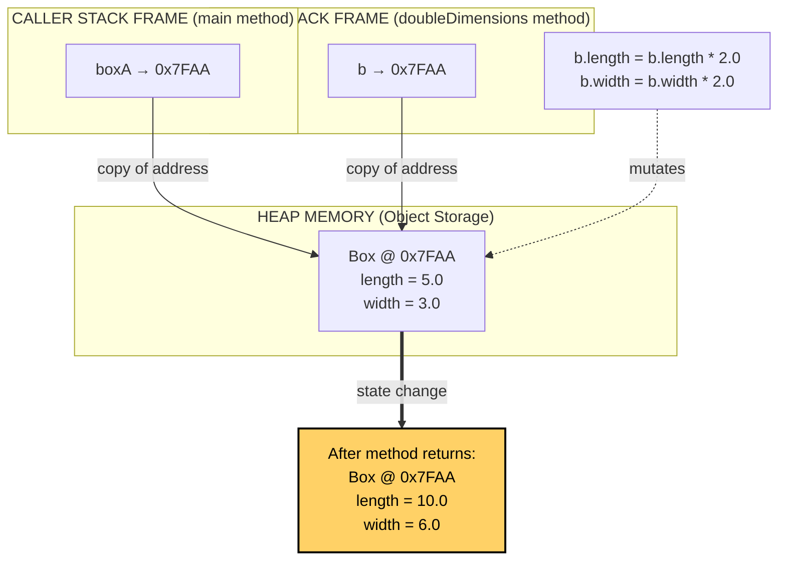
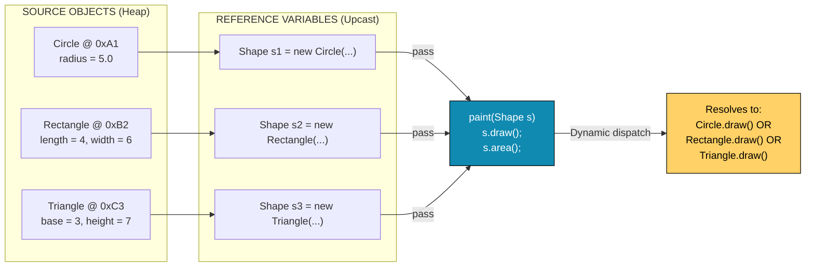
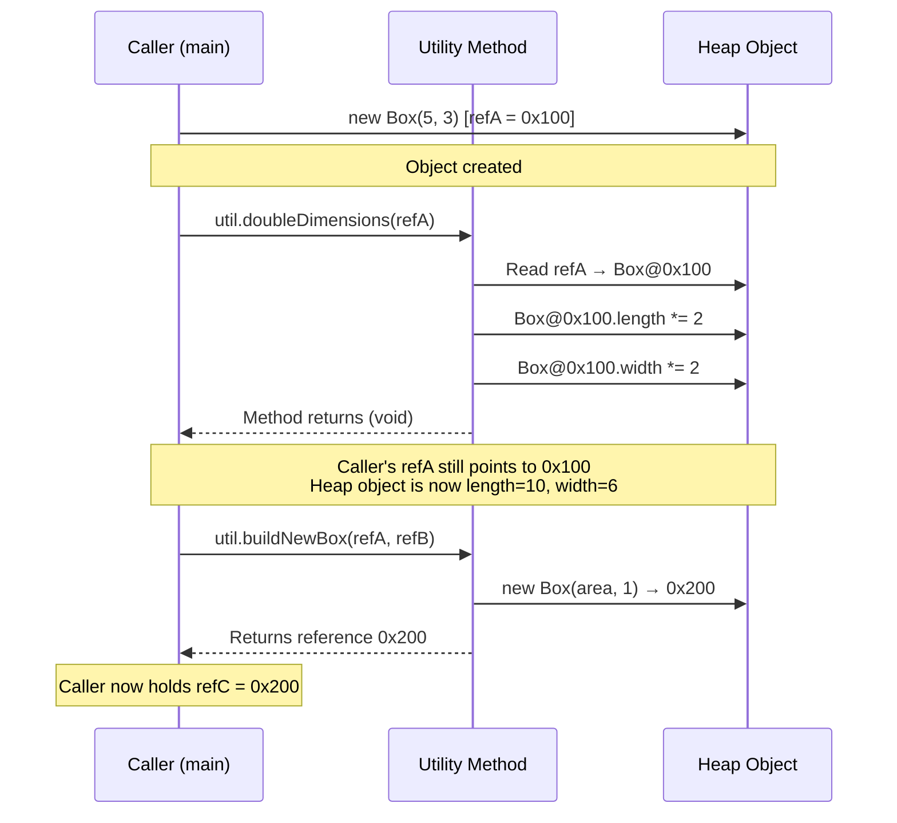
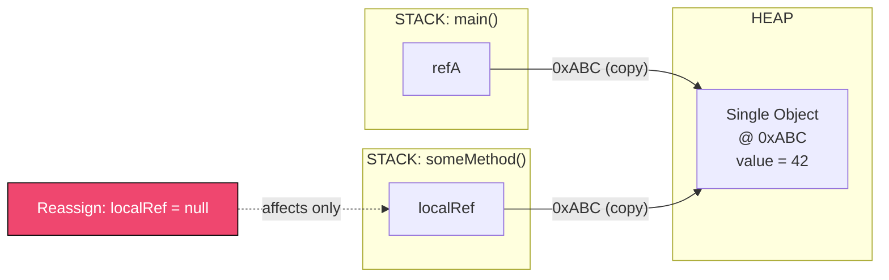

# Using Objects as Parameters

<!-- SECTION_1_START -->
# Using Objects as Parameters — Core Definition & Intuitive Overview

## Formal KTU 2024 Scheme Definition

> [!IMPORTANT]
> **Using Objects as Parameters** is a fundamental OOP mechanism wherein a method or constructor accepts an entire object (instance of a class) as one of its formal arguments. Instead of transmitting individual primitive data fields, the caller transmits the **reference (memory address)** of the source object, enabling the receiving method to directly manipulate the *state* (data members) and invoke the *behaviour* (member methods) of the passed object.

In the **KTU 2024 OECST615 syllabus (Module 2 – Polymorphism)**, this topic is positioned as a precursor to understanding **Dynamic Method Dispatch**, **Polymorphic Arguments**, and **Object Interaction Modelling**, because a method declared with a *super-class type parameter* can accept *any sub-class object* at runtime — this is the foundation of runtime polymorphism in Java/C++.

---

## Conceptual Analogy — The "Hotel Key-Card" Intuition

> [!NOTE]
> **Real-World Analogy:** Imagine you check into a hotel. The receptionist does not hand you the *original master blueprint* of your room; instead, she hands you a **key-card that points to that specific room**. When you swipe the card, you are operating directly on that particular room (its lights, its safe, its TV). The card itself is a *reference*; the room is the *actual object*. If you lose the card, you lose access to that one specific room — but the room still exists. This is exactly how Java/C++ handle object parameters: the method receives a *reference handle* (key-card) to the original object (room), not a copy of the object itself.

---

## Critical Terminology (KTU Board High-Yield Vocabulary)

| Term | Meaning | Memory Implication |
|---|---|---|
| **Formal Parameter** | The variable name declared in the method signature | A local reference variable inside the method's stack frame |
| **Actual Parameter / Argument** | The real object reference passed during the call | The caller's reference is copied into the formal parameter |
| **Call-by-Reference for Objects** | The method receives the *address* of the object | Mutations inside the method reflect in the caller |
| **Call-by-Value of Reference** | The reference itself is passed *by value* (a copy of the address) | Reassigning the formal parameter to a new object does **not** affect the caller |
| **`this` keyword** | Self-reference to the current invoking object | Disambiguates instance variables from parameters |
| **Object Cloning** | Creating a separate, independent copy of the object | Achieved via `Cloneable` interface (Java) or copy-constructors (C++) |

---

## Visual Mental Model (Stack vs Heap)

> [!VISUALIZATION CONTROL]
> **Concept:** Memory layout of an object being passed as a parameter.
> **GeoGebra / Desmos Input Equations (Stylized Representation):**
> * Caller Stack Frame contains: `myBox → 0x7FAA` (reference value)
> * Method Stack Frame contains: `objBox → 0x7FAA` (same reference value, copied)
> * Heap contains: actual object at `0x7FAA` with `length=5, width=3`
> **Visual Description:** Two arrows originate from two different stack frames (caller and callee) but point to the **single shared box** in the heap. Any modification through either arrow alters the same physical object.

---

## Why KTU Places This in Module 2 (Polymorphism)

> [!IMPORTANT]
> Passing objects as parameters is **not merely a syntactic convenience**. It is the *gateway* to:
> 1. **Polymorphic method invocation** — A method `display(Shape s)` can accept `Circle`, `Rectangle`, or `Triangle` objects.
> 2. **Object composition & collaboration** — Two objects collaborate by passing references to one another.
> 3. **Encapsulation preservation** — Private fields of an object can be read/modified only through public methods, even from another object.
> 4. **Foundation for Design Patterns** — Strategy, Observer, and Decorator patterns all rely on object parameters.

<!-- SECTION_1_END -->

<!-- SECTION_2_START -->
# Deep Theoretical Analysis & KTU High-Yield Formula Sheet

## 2.1 Operational Mechanics — How the JVM / Compiler Treats Object Arguments

When an object is passed to a method, the following sequence executes in Java (and analogously in C++ with references/pointers):

### Step-by-Step Internal Process

1. **Caller Evaluation:** The compiler/JVM evaluates the expression used as the argument. For an object, this resolves to a **reference (memory address)** stored on the caller's stack frame.
2. **Reference Copy:** At method invocation, the runtime copies this reference value into a *new local variable* (the formal parameter) inside the callee's activation record.
3. **Shared Heap Access:** Both the caller's variable and the callee's parameter now point to the **same object** in the managed heap.
4. **State Mutation:** Any method invocation through the formal parameter (e.g., `obj.setLength(10)`) modifies the original object — visible to the caller after the method returns.
5. **Reference Reassignment Trap:** If the callee reassigns the formal parameter (e.g., `obj = new Box(0,0)`), the local copy is re-pointed. The caller's reference is **unaffected** because primitives/references are passed **by value**.
6. **Garbage Collection:** When the method returns, its local parameter reference is destroyed. If no other references exist, the object becomes eligible for GC.

---

## 2.2 KTU Formula Sheet — Conceptual Equivalence Table

| # | Concept | Java Behaviour | C++ Behaviour | C Behaviour (Structures) |
|---|---|---|---|---|
| 1 | Object passed by value | Not possible directly (only reference is copied) | Possible via pass-by-value (copy-constructor invoked) | Pass-by-value copies the struct |
| 2 | Object passed by reference | Implicit for all objects | Explicit via `&` (reference) or `*` (pointer) | Must use `struct*` pointer |
| 3 | Mutations reflected in caller? | **Yes** (via the copied reference) | Only if passed by reference/pointer | Only if pointer is dereferenced |
| 4 | Reassigning formal parameter affects caller? | **No** | **No** in either mode | **No** |
| 5 | Default copying mechanism | Bitwise copy of reference | User-defined copy-constructor (else member-wise) | Shallow bitwise copy |
| 6 | Suffix required in declaration | None (objects are always references) | `&` for reference, `*` for pointer | `*` for pointer |

---

## 2.3 Mathematical Abstraction of Reference Passing

Let the heap be a function $H: \mathbb{N} \rightarrow O$ mapping memory addresses to objects. The caller holds a reference $r_c$ such that $H(r_c) = o_1$. Upon calling method $M$ with formal parameter $f$, the runtime performs:

$$
r_f \leftarrow r_c
$$

$$
H(r_f) = H(r_c) = o_1
$$

Any mutation $o_1 \rightarrow o_1'$ via the formal parameter is observed by the caller because both dereference the same heap location:

$$
\text{state observed by caller after } M() = o_1' \neq o_1
$$

> [!NOTE]
> **Engineering Real-World Utility:** This mechanism is the backbone of **event-driven systems** (Java Swing listeners receive the `ActionEvent` object), **ORM frameworks** (Hibernate passes entity objects across layers), and **microservice DTOs** (Data Transfer Objects passed between services).

---

## 2.4 The `this` Keyword — Implicit Object Parameter

Every non-static method in Java carries an *implicit* first parameter: the `this` reference, pointing to the invoking object. This is why an object can pass *itself* to another method:

```java
class Athlete {
    void register(Coach c) {
        c.assign(this);   // 'this' = current Athlete object
    }
}
```

> [!IMPORTANT]
> **KTU Hot Question Trigger:** "Can you pass an object of the *same class* to a method of that class?" — **YES**, via `this`. This is a common 3-mark short answer.

---

## 2.5 Returning Objects from Methods

Symmetrically, methods can return objects. The returned reference is then assignable to a caller variable:

```java
public Box enlarge(Box b, double factor) {
    return new Box(b.length * factor, b.width * factor);
}
```

This closes the lifecycle: **create → pass → mutate/return → reuse**.

<!-- SECTION_2_END -->

<!-- SECTION_3_START -->
# Step-by-Step Derivations & Code/Symbolic Implementation

## 3.1 Program 1 — Basic Object Parameter (Box Class — Classic KTU Textbook Example)

```java
// File: Box.java
// Demonstrates: Passing an object as parameter, mutating it, returning it.

class Box {
    double length;
    double width;

    // Parameterized constructor
    Box(double length, double width) {
        this.length = length;
        this.width  = width;
    }

    // Method that receives a Box object and modifies it
    void doubleDimensions(Box b) {
        b.length = b.length * 2.0;
        b.width  = b.width  * 2.0;
        System.out.println("[Inside doubleDimensions] b.length = "
                            + b.length + ", b.width = " + b.width);
    }

    // Method that RECEIVES two Box objects and returns a new Box
    Box computeAreaSum(Box b1, Box b2) {
        double totalArea = (b1.length * b1.width) + (b2.length * b2.width);
        // Return a new Box whose dimensions encode the area
        return new Box(totalArea, 1.0);
    }

    void display() {
        System.out.println("Length = " + length
                           + ", Width = " + width);
    }
}

// File: BoxDemo.java  (Driver class)
public class BoxDemo {
    public static void main(String[] args) {

        // Step 1: Create two Box objects
        Box boxA = new Box(5.0, 3.0);
        Box boxB = new Box(10.0, 4.0);

        System.out.println("--- Before passing boxA ---");
        boxA.display();

        // Step 2: Pass boxA to the method
        boxA.doubleDimensions(boxA);

        System.out.println("--- After passing boxA (caller's view) ---");
        boxA.display();    // Original object IS modified

        // Step 3: Pass two boxes and receive a new one
        Box areaBox = boxA.computeAreaSum(boxA, boxB);
        System.out.println("--- Result box encoding summed area ---");
        areaBox.display();
    }
}
```

### Expected Console Output

```
--- Before passing boxA ---
Length = 5.0, Width = 3.0
[Inside doubleDimensions] b.length = 10.0, b.width = 6.0
--- After passing boxA (caller's view) ---
Length = 10.0, Width = 6.0
--- Result box encoding summed area ---
Length = 76.0, Width = 1.0
```

### Valuation Key Points (for Board Marking)

| Step | Action | Marks (out of 7) |
|---|---|---|
| Class with two fields & constructor | Correct declaration | 1 |
| Method `doubleDimensions` signature | Accepts `Box b` parameter | 1 |
| Mutating `b.length` and `b.width` | Direct field access | 1 |
| Demonstrating caller's view changes | Output proves pass-by-reference of object | 2 |
| Method returning an object | `Box computeAreaSum(...)` returns `new Box` | 2 |

---

## 3.2 Program 2 — Returning an Object from a Method (Enhanced KTU Pattern)

```java
class Complex {
    private double real;
    private double imag;

    Complex(double r, double i) {
        this.real = r;
        this.imag = i;
    }

    // Static factory method: returns a NEW Complex object
    static Complex add(Complex c1, Complex c2) {
        double newReal = c1.real + c2.real;
        double newImag = c1.imag + c2.imag;
        return new Complex(newReal, newImag);
    }

    void print() {
        System.out.println(real + " + " + imag + "i");
    }
}

public class ComplexDemo {
    public static void main(String[] args) {
        Complex n1 = new Complex(2.5, 3.5);
        Complex n2 = new Complex(1.5, 4.5);

        // Pass two objects, receive a new object
        Complex sum = Complex.add(n1, n2);

        System.out.print("n1 = "); n1.print();
        System.out.print("n2 = "); n2.print();
        System.out.print("Sum = "); sum.print();
    }
}
```

### Expected Output

```
n1 = 2.5 + 3.5i
n2 = 1.5 + 4.5i
Sum = 4.0 + 8.0i
```

> [!NOTE]
> **Why this is KTU-relevant:** It illustrates the **Object Lifecycle** — creation outside, *transformation* inside a method, and **return-by-reference** to the caller. The original `n1` and `n2` remain untouched (immutability of intent), while a *new* object captures the result.

---

## 3.3 Program 3 — Polymorphic Object Parameter (Direct Bridge to Runtime Polymorphism)

```java
// File: Shape.java
class Shape {
    void draw() {
        System.out.println("Drawing a generic Shape");
    }
    double area() {
        return 0.0;
    }
}

// File: Circle.java
class Circle extends Shape {
    double radius;
    Circle(double r) { this.radius = r; }

    @Override
    void draw() {
        System.out.println("Drawing a Circle of radius " + radius);
    }
    @Override
    double area() {
        return Math.PI * radius * radius;
    }
}

// File: Rectangle.java
class Rectangle extends Shape {
    double length, width;
    Rectangle(double l, double w) { this.length = l; this.width = w; }

    @Override
    void draw() {
        System.out.println("Drawing a Rectangle " + length + "x" + width);
    }
    @Override
    double area() {
        return length * width;
    }
}

// File: Canvas.java  — the polymorphic method
class Canvas {
    // This single method accepts ANY Shape subclass
    void paint(Shape s) {
        s.draw();                              // Polymorphic call
        System.out.println("Area = " + s.area());
    }
}

// File: CanvasDemo.java
public class CanvasDemo {
    public static void main(String[] args) {
        Canvas canvas = new Canvas();

        Shape ref1 = new Circle(5.0);           // Upcasting (implicit)
        Shape ref2 = new Rectangle(4.0, 6.0);

        canvas.paint(ref1);   // Pass Circle as Shape
        canvas.paint(ref2);   // Pass Rectangle as Shape
    }
}
```

### Expected Output

```
Drawing a Circle of radius 5.0
Area = 78.53981633974483
Drawing a Rectangle 4.0x6.0
Area = 24.0
```

> [!IMPORTANT]
> **KTU Significance:** The method `paint(Shape s)` has *one* parameter declaration but accepts *multiple concrete types*. This is **upcasting + dynamic dispatch**, a direct consequence of treating objects polymorphically. The call `canvas.paint(ref1)` is a textbook example the examiner loves.

---

## 3.4 Program 4 — C++ Equivalence (For Cross-Language Comparison)

```cpp
#include <iostream>
using namespace std;

class Student {
public:
    string name;
    int marks;
    Student(string n, int m) : name(n), marks(m) {}
};

// Pass-by-reference (explicit) — preferred in C++ for objects
void awardGraceMarks(Student &s, int grace) {
    s.marks += grace;
    cout << "[Inside] " << s.name << " now has " << s.marks << " marks\n";
}

// Pass-by-pointer — alternative C++ style
void penalizeMarks(Student *s, int penalty) {
    s->marks -= penalty;
}

int main() {
    Student alice("Alice", 80);
    Student bob("Bob", 90);

    awardGraceMarks(alice, 5);   // Pass object by reference
    penalizeMarks(&bob, 3);      // Pass object by pointer

    cout << "Alice final: " << alice.marks << endl;
    cout << "Bob   final: " << bob.marks   << endl;
    return 0;
}
```

### Output

```
[Inside] Alice now has 85 marks
Alice final: 85
Bob   final: 87
```

### Comparison Block

| Feature | Java `awardGraceMarks(Student s)` | C++ `awardGraceMarks(Student &s)` |
|---|---|---|
| Pass-by-reference by default? | Yes (implicit) | No, must use `&` |
| Caller's object modified? | Yes | Yes |
| Reassigning parameter affects caller? | No | No |
| Allows `null`? | Yes (`NullPointerException` risk) | References cannot be null |

---

## 3.5 Program 5 — Passing an Object to Its Own Method (`this` as Argument)

```java
class Node {
    int data;
    Node next;   // self-referential: a Node can hold a reference to another Node

    Node(int d) {
        this.data = d;
        this.next = null;
    }

    // Method that receives another Node and links it after 'this'
    void linkAfter(Node successor) {
        this.next = successor;
    }

    void traverseFromHere() {
        Node current = this;
        while (current != null) {
            System.out.print(current.data + " -> ");
            current = current.next;
        }
        System.out.println("END");
    }
}

public class LinkedListDemo {
    public static void main(String[] args) {
        Node n1 = new Node(10);
        Node n2 = new Node(20);
        Node n3 = new Node(30);

        n1.linkAfter(n2);   // n1.next = n2
        n2.linkAfter(n3);   // n2.next = n3

        n1.traverseFromHere();  // 10 -> 20 -> 30 -> END
    }
}
```

> [!NOTE]
> **Engineering Utility:** This is the **building block of Linked Lists, Trees, and Graphs**. The `next` field is itself an object of the same class, demonstrating **self-referential object parameter passing**.

---

## 3.6 Pitfall Demonstration — Reassigning the Formal Parameter

```java
class PointerTrap {
    int value;

    PointerTrap(int v) { this.value = v; }

    static void tryToReplace(PointerTrap p, int newVal) {
        p = new PointerTrap(999);      // Local reassignment — caller unaffected
        p.value = newVal;              // But mutation of the NEW local object is invisible
        System.out.println("[Inside] p.value = " + p.value);
    }

    public static void main(String[] args) {
        PointerTrap original = new PointerTrap(10);
        tryToReplace(original, 50);
        System.out.println("[Outside] original.value = " + original.value);
    }
}
```

### Output

```
[Inside] p.value = 50
[Outside] original.value = 10
```

> [!WARNING]
> **Crucial Insight:** Although Java passes the reference *by value*, the local parameter `p` initially pointed to the same object as `original`. Reassigning `p` to a *new* object does **not** redirect `original`. The caller's view remains at the original object with its original `value=10`. This is a classic KTU viva question.

<!-- SECTION_3_END -->

<!-- SECTION_4_START -->
# Structural Diagrams & Schematics

## 4.1 Diagram 1 — Memory Architecture of Object Parameter Passing



> [!NOTE]
> **Reading Guide:** The solid arrows from stack frames to the heap represent *reference copying*. The dashed arrow represents the **mutation** performed inside the callee. The **result** node (yellow) shows the heap state after the method returns, which is what the caller observes.

---

## 4.2 Diagram 2 — Decision Flow: Is the Caller's Object Modified?

```mermaid
flowchart TD
    A["Method receives object parameter 'obj'"] --> B{"Action inside method?"}
    B -->|"obj.field = newValue"| C["Mutates the shared heap object"]
    B -->|"obj.methodThatMutates()"| D["Invokes method that changes state"]
    B -->|"obj = new Object(...)"| E["Local reference is re-pointed"]
    B -->|"return obj"| F["Returns reference to caller"]

    C --> G["YES — caller observes change"]
    D --> G
    E --> H["NO — caller's reference is unaffected"]
    F --> I["Caller receives reference to the object"]

    classDef yes fill:#06d6a0,stroke:#000,color:#000
    classDef no  fill:#ef476f,stroke:#000,color:#fff
    class G,yes yes
    class H,no  no
```

---

## 4.3 Diagram 3 — Polymorphic Object Acceptance Architecture



---

## 4.4 Diagram 4 — Object Lifecycle: Pass → Mutate → Return



---

## 4.5 Diagram 5 — Pass-by-Value-of-Reference: The "Two Arrows, One Box" Model



> [!IMPORTANT]
> **Visual Insight:** Both stack frames contain *independent copies* of the address `0xABC`, but they resolve to the *same* heap object. Reassigning one stack variable does not change the address stored in the other stack frame. This is the precise meaning of "Java is pass-by-value, but for references, the value *is* an address."

<!-- SECTION_4_END -->

<!-- SECTION_5_START -->
# KTU 2024 Scheme Examination Question Bank & Topic Recap

---

## Part A Questions (3 Marks Each)

### Q1. [KTU University Exam – July 2024]

**Differentiate between 'passing a primitive to a method' and 'passing an object to a method' in Java. (3 Marks)** [CO1, Understand]

**Model Answer (Valuation Key):**

| Aspect | Primitive Parameter | Object Parameter |
|---|---|---|
| What is copied? | The actual value (e.g., `int x = 5`) | The reference value (memory address) |
| Effect of mutation inside method | Not visible to caller (caller's variable unchanged) | Visible to caller (shared heap object) |
| Memory cost | A single stack slot | A stack slot + indirect heap access |
| Default Java behaviour | Pass-by-value of the primitive | Pass-by-value of the reference |

> **[Mark Distribution: Tabular comparison with at least 2 contrasting points: 2 Marks; Conclusion statement: 1 Mark]**

---

### Q2. [KTU University Exam – Dec 2023]

**Explain the role of the `this` keyword when an object passes itself as a parameter to another method. Give one example. (3 Marks)** [CO2, Understand]

**Model Answer:**

The `this` keyword is an **implicit reference** to the current invoking object. When passed as an argument, it allows the *current* object to be transmitted to another method, enabling inter-object collaboration.

```java
class Doctor {
    void referToHospital(Hospital h) {
        h.admit(this);   // current Doctor object is passed
    }
}
```

> **[Mark Distribution: Definition of `this`: 1 Mark; Purpose (object passes itself): 1 Mark; Example code: 1 Mark]**

---

## Part B Questions (14 Marks — Module Internal Choice)

### Question A (14 Marks) [KTU University Exam – July 2024]

**(a) [7 Marks]** Explain with a neat diagram how an object is passed as a parameter to a method in Java. Discuss what happens when:
  (i) the method modifies a field of the object,
  (ii) the method reassigns the parameter to a new object. **[CO2, Understand + Apply]**

**(b) [7 Marks]** Write a Java program that defines a class `Rectangle` with `length` and `breadth`. Include a method `compareArea(Rectangle r1, Rectangle r2)` that takes **two Rectangle objects as parameters** and returns the rectangle (object) having the larger area. Demonstrate its working in `main`. **[CO3, Apply]**

---

#### Model Solution for Q-A(a)

**Diagram (Valuation: 2 Marks)**

```
   main() stack            someMethod() stack
   ┌──────────┐            ┌──────────┐
   │ boxA  ───┼──┐         │ b     ───┼──┐
   └──────────┘  │         └──────────┘  │
                 ▼                       ▼
              ┌──────────────────────────────┐
              │  HEAP: Box @ 0x100           │
              │  length = 5,  width = 3      │
              └──────────────────────────────┘
```

**Explanation (Valuation: 5 Marks):**

* **[Stating that reference is copied: 2 Marks]** When `someMethod(boxA)` is called, the reference stored in `boxA` (say `0x100`) is copied into the formal parameter `b`. Both `boxA` and `b` now point to the **same Box object** on the heap.
* **[Case (i) — Field modification: 1.5 Marks]** If the method executes `b.length = 10`, it dereferences `b` to reach the heap and updates the field of the shared object. After the method returns, `boxA.length` is also `10`, because the caller's reference still points to the same heap location.
* **[Case (ii) — Reassignment: 1.5 Marks]** If the method executes `b = new Box(99, 99)`, only the *local* reference `b` is re-pointed to a new object at, say, `0x200`. The caller's `boxA` is unaffected and continues to refer to the original object at `0x100`.

---

#### Model Solution for Q-A(b)

```java
class Rectangle {
    double length;
    double breadth;

    Rectangle(double l, double b) {
        this.length = l;
        this.breadth = b;
    }

    double area() {
        return length * breadth;
    }

    // Method that takes TWO Rectangle objects and returns one
    Rectangle compareArea(Rectangle r1, Rectangle r2) {
        if (r1.area() >= r2.area())
            return r1;
        else
            return r2;
    }
}

public class RectangleTest {
    public static void main(String[] args) {
        Rectangle rectA = new Rectangle(10.0, 5.0);   // area = 50
        Rectangle rectB = new Rectangle(7.0,  8.0);   // area = 56

        Rectangle larger = rectA.compareArea(rectA, rectB);
        System.out.println("Larger rectangle dimensions: "
                            + larger.length + " x " + larger.breadth);
        System.out.println("Larger area: " + larger.area());
    }
}
```

**Output:**

```
Larger rectangle dimensions: 7.0 x 8.0
Larger area: 56.0
```

**Valuation Key for Q-A(b):**

| Component | Marks |
|---|---|
| `Rectangle` class with fields & constructor | 1 |
| `area()` method correctly implemented | 1 |
| Method signature `compareArea(Rectangle r1, Rectangle r2)` returning `Rectangle` | 2 |
| Correct comparison logic and return statement | 2 |
| `main` method creating two rectangles, invoking, displaying result | 1 |

---

### Question B (14 Marks) — Alternative Choice [KTU University Exam – Dec 2023]

**(a) [7 Marks]** Discuss how passing objects as parameters enables **runtime polymorphism** in Java. Illustrate with a class hierarchy `Shape → Circle, Rectangle` and a method that accepts a `Shape` parameter. **[CO2, Understand + Apply]**

**(b) [7 Marks]** Write a Java program with a class `BankAccount` having `accountHolder` (String) and `balance` (double). Write a method `transfer(BankAccount from, BankAccount to, double amount)` that takes **two BankAccount objects as parameters** and transfers the specified amount if `from` has sufficient balance. Display appropriate success/failure messages. **[CO3, Apply]**

---

#### Model Solution for Q-B(a)

**Explanation (Valuation: 4 Marks):**

Passing an object as a parameter of a *super-type* allows any *sub-type* object to be supplied. At runtime, the JVM determines the actual class of the object referred to by the parameter and invokes the **overridden version** of the method. This is called **dynamic method dispatch**, the core of runtime polymorphism.

**Code (Valuation: 3 Marks):**

```java
class Shape {
    void draw() {
        System.out.println("Drawing Shape");
    }
}

class Circle extends Shape {
    @Override
    void draw() {
        System.out.println("Drawing Circle");
    }
}

class Rectangle extends Shape {
    @Override
    void draw() {
        System.out.println("Drawing Rectangle");
    }
}

class Artist {
    void render(Shape s) {       // accepts any subclass via upcasting
        s.draw();                // polymorphic call
    }
}

public class ShapeDemo {
    public static void main(String[] args) {
        Artist artist = new Artist();
        artist.render(new Circle());      // Circle's draw() executes
        artist.render(new Rectangle());   // Rectangle's draw() executes
    }
}
```

**Output:**

```
Drawing Circle
Drawing Rectangle
```

> **[Mark Distribution: Explanation of dynamic dispatch: 2 Marks; Upcasting shown: 1 Mark; Class hierarchy: 1 Mark; Driver with two render calls: 1 Mark]**

---

#### Model Solution for Q-B(b)

```java
class BankAccount {
    String accountHolder;
    double balance;

    BankAccount(String name, double bal) {
        this.accountHolder = name;
        this.balance = bal;
    }

    // Method receiving two BankAccount objects
    void transfer(BankAccount from, BankAccount to, double amount) {
        if (from.balance >= amount) {
            from.balance -= amount;
            to.balance   += amount;
            System.out.println("Transfer of Rs. " + amount
                                + " from " + from.accountHolder
                                + " to "   + to.accountHolder
                                + " SUCCESSFUL.");
        } else {
            System.out.println("Transfer FAILED. Insufficient balance in "
                                + from.accountHolder + "'s account.");
        }
    }

    void display() {
        System.out.println(accountHolder + " | Balance = Rs. " + balance);
    }
}

public class BankDemo {
    public static void main(String[] args) {
        BankAccount alice = new BankAccount("Alice", 10000.0);
        BankAccount bob   = new BankAccount("Bob",    5000.0);

        System.out.println("--- Before Transfer ---");
        alice.display();
        bob.display();

        alice.transfer(alice, bob, 3000.0);   // successful
        alice.transfer(alice, bob, 9999.0);   // fails

        System.out.println("--- After Transfer ---");
        alice.display();
        bob.display();
    }
}
```

**Output:**

```
--- Before Transfer ---
Alice | Balance = Rs. 10000.0
Bob | Balance = Rs. 5000.0
Transfer of Rs. 3000.0 from Alice to Bob SUCCESSFUL.
Transfer FAILED. Insufficient balance in Alice's account.
--- After Transfer ---
Alice | Balance = Rs. 7000.0
Bob | Balance = Rs. 8000.0
```

**Valuation Key for Q-B(b):**

| Component | Marks |
|---|---|
| Class with fields, constructor | 1 |
| Method signature with two `BankAccount` parameters + `double amount` | 2 |
| Balance check condition | 1 |
| Correct debit/credit mutations (mutate `from.balance` and `to.balance`) | 2 |
| Success and failure messages | 1 |

---

## KTU Examiner's Valuation Warning / Pitfall Callout

> [!WARNING]
> **Common Mark-Deduction Traps in "Using Objects as Parameters" Questions:**
> 1. **Saying "Java passes objects by reference"** — This is **incorrect**. The precise statement is: *"Java passes the **reference by value**"*. Examiners deduct 1 mark for this imprecision.
> 2. **Forgetting to demonstrate mutation** — When asked to "show that the object is modified", you must print the object's state **before and after** the method call, not just the inside-method state.
> 3. **Confusing `this` with the class name** — `this` is a *reference variable*, not a class identifier. Writing `this = new Box()` is illegal.
> 4. **In C++, omitting `&` or `*`** — A C++ function `void f(Box b)` receives a *copy*; mutations are invisible to the caller. Use `Box& b` for true pass-by-reference.
> 5. **Forgetting `null` checks** — If a method receives a `null` reference, dereferencing it throws `NullPointerException`. Production code should guard: `if (obj == null) return;`.
> 6. **Returning a local primitive vs. local object** — Returning a local object is safe (its reference escapes to the heap). Returning a pointer to a local stack variable in C++ is **undefined behaviour**.

---

## Topic Recap & Important Things to Remember

> [!IMPORTANT]
> **Rapid Revision Checklist — Using Objects as Parameters**

- **Definition Recap:** Passing an object as a parameter means transmitting the *reference* (memory address) of the object, enabling the callee to read and mutate the shared heap instance.
- **Java Specifics:** All Java object parameters are passed **by value of the reference** — the reference is copied, the object is shared. Mutating fields is visible to the caller; reassigning the parameter is **not**.
- **C++ Specifics:** Three modes — *by value* (copy-ctor invoked, mutations invisible), *by reference* (`Type&`), *by pointer* (`Type*`). Prefer `const Type&` for read-only large objects.
- **`this` keyword:** Implicit self-reference. Used to disambiguate shadowed fields and to pass the current object to other methods.
- **Polymorphic Power:** A method declared with a *super-type* parameter accepts any *sub-type* object, enabling **upcasting + dynamic dispatch**.
- **Object Return:** Methods can return object references; the returned object is allocated on the heap and persists beyond the method's stack frame.
- **Self-Referential Classes:** A class can hold a reference to another instance of itself (e.g., `Node next`), enabling linked structures.
- **Common Pitfall:** Reassigning the formal parameter does **not** affect the caller. Only field/method invocations through the parameter modify the shared object.
- **Engineering Applications:** GUI event-handling, ORM entity passing, DTOs in microservices, linked data structures, polymorphic drawing canvases, and object-oriented design patterns (Strategy, Observer, Decorator).
- **Examiner Hot Phrases to Use:** *"pass-by-value of reference"*, *"shared heap object"*, *"dynamic method dispatch"*, *"upcasting"*, *"object identity vs. object state"*.
- **Memory Model in One Line:** *Stack frames hold references; the heap holds the single canonical object; multiple references can share the same object.*
- **Quick Formula:** If $r_c$ is the caller's reference and $r_f$ is the formal parameter, then $H(r_c) = H(r_f) = o$, and any state mutation $\mu$ yields $H(r_c) = \mu(o) = o'$, observed by the caller.

<!-- SECTION_5_END -->
