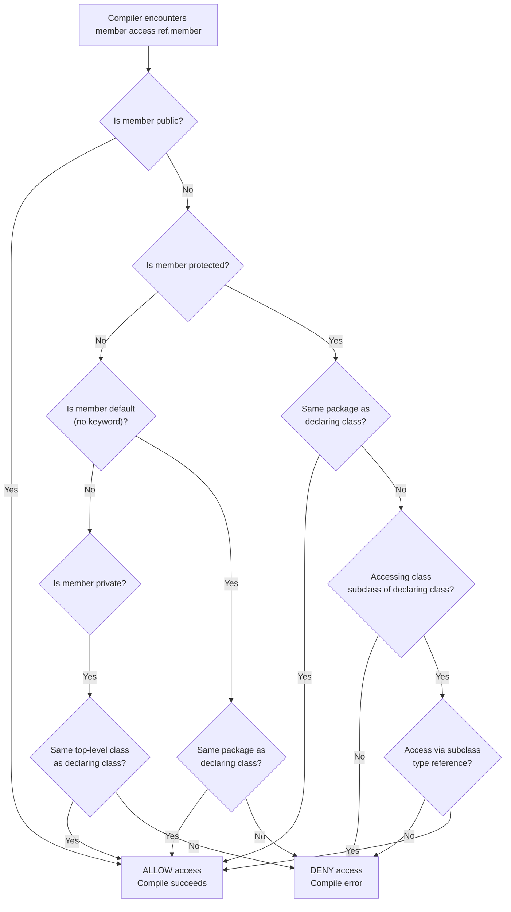
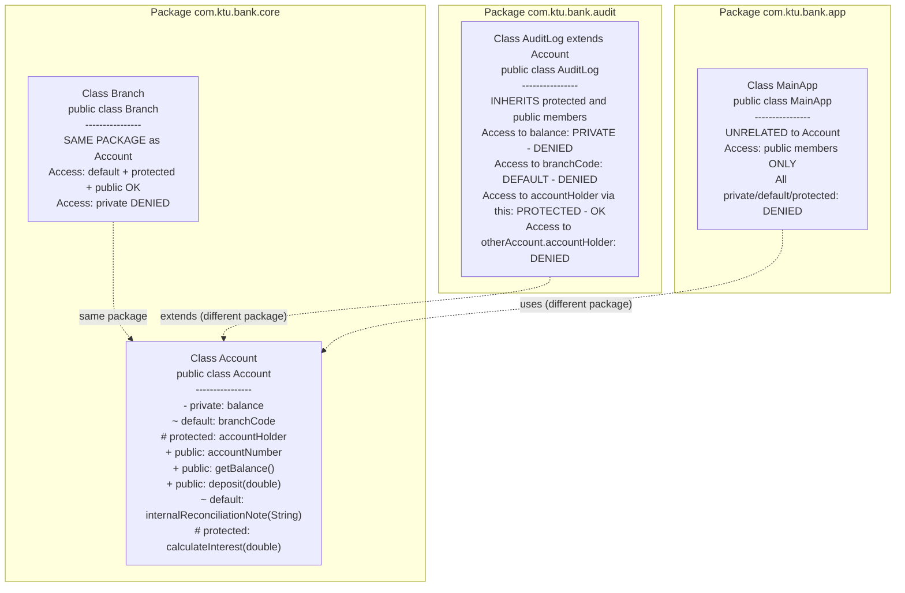
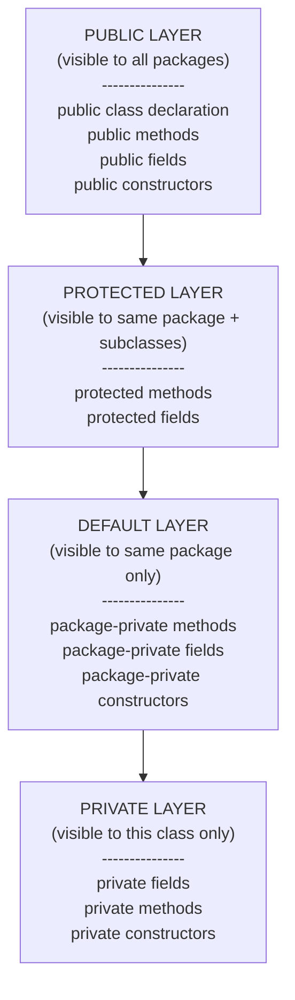
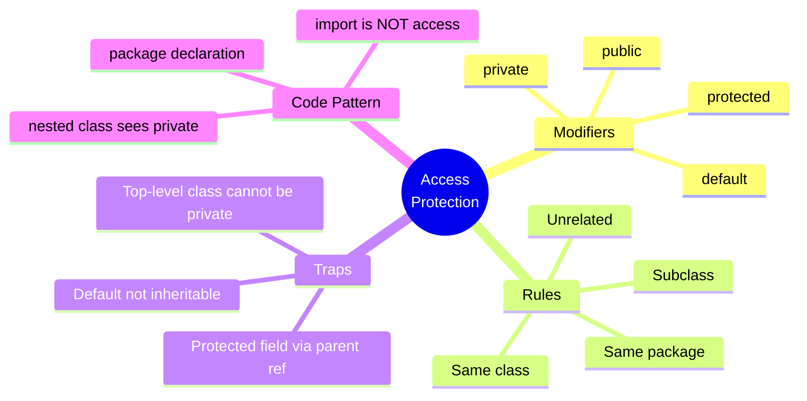

# Access Protection

<!-- SECTION_1_START -->
# Access Protection in Java Packages

## 1.1 Formal Academic Definition

**Access Protection** in Java is a mechanism enforced by the **Java Access Control System** (governed by the **Java Language Specification, JLS §6.6**) that restricts the visibility and usability of classes, interfaces, methods, and fields based on two primary factors:

1. The **declared access modifier** of the member (`private`, default/package-private, `protected`, or `public`).
2. The **package context** (i.e., the *compilation unit* and *runtime class loader namespace*) in which the accessing code resides, along with the **inheritance relationship** between the accessing class and the target class.

> [!IMPORTANT]
> **KTU Syllabus Highlight (Module 3 — Packages and Interfaces):**
> Access Protection determines *who* can see *what*. A package in Java is not just a folder; it is a **namespace + access boundary**. Once you place a class inside a package, you must explicitly decide its exposure to the outside world.

---

## 1.2 Conceptual Analogy — The Corporate Office Building

Imagine a large corporate office tower (your **Java application**). The tower has multiple floors, and each floor represents a **package**.

| Building Element | Java Equivalent | Access Level |
|---|---|---|
| Your private office locker | `private` member | Only **you** (same class) can open it |
| Your team's shared whiteboard | Default (no modifier) | Anyone on the **same floor** (same package) can use it |
| The department common room | `protected` member | Your **floor members** + **visiting team members from sister departments** (subclasses in other packages) |
| The building's main lobby / reception | `public` member | **Anyone**, even visitors from outside the building, can access it |

> [!NOTE]
> **Key Insight:** A package boundary acts like a *locked elevator door*. By default, only people *inside* the package can ride the elevator. To allow outsiders, you must explicitly grant them a security badge — this is what `public` and `protected` (with subclassing) do.

---

## 1.3 The Four Pillars of Access Control

Java provides **four** access levels (from most restrictive to most permissive):

| Modifier | Keyword | Scope |
|---|---|---|
| 1. Private | `private` | Same class only |
| 2. Package-Private (Default) | *(no keyword)* | Same package only |
| 3. Protected | `protected` | Same package **+** subclasses (anywhere) |
| 4. Public | `public` | Everywhere (any package, any class) |

> [!WARNING]
> **Common Student Misconception:** Many students believe `protected` means "anyone can access if they are a subclass." This is **incomplete**. `protected` also grants access to all classes in the *same package*, regardless of inheritance. The subclass access is an *additional* privilege, not the only one.

---

## 1.4 Why Access Protection Matters (Engineering Motivation)

In real-world software engineering (e.g., a banking application built using Spring Boot, or a microservice in a Netflix-style distributed system), access protection is critical for:

- **Encapsulation of business logic** — hiding how a transaction is validated.
- **API surface minimization** — exposing only the methods clients should call.
- **Refactoring safety** — changing a `private` method cannot break external code.
- **Security boundaries** — preventing malicious or accidental misuse of internal state.

> [!VISUALIZATION CONTROL]
> **Concept:** Nested Access Concentric Circles (Venn-style hierarchy)
> **Geometric Description (mental picture):**
> Draw four concentric circles. The innermost circle is `private`, surrounded by default (package-private), then `protected`, then `public` as the outermost ring. As you move outward, more code is granted access. The area between two rings represents code that **cannot** access members declared at that level.
> **Suggested GeoGebra Input:**
> * Circle 1: $(x-0)^2 + (y-0)^2 = 1$ → `private`
> * Circle 2: $(x-0)^2 + (y-0)^2 = 4$ → `default`
> * Circle 3: $(x-0)^2 + (y-0)^2 = 9$ → `protected`
> * Circle 4: $(x-0)^2 + (y-0)^2 = 16$ → `public`
> **Visual Description:** Each larger circle fully contains the smaller ones, illustrating that more permissive access is a *superset* of the more restrictive one. The shaded region between Circle 1 and Circle 2 is where default members are visible but private ones are not.

---

## 1.5 Compilation Units and Package Membership

Every Java source file is a **compilation unit** ending in `.java`. It begins with a `package` declaration (optional but recommended). The compiler uses the **fully qualified class name** (`packageName.ClassName`) as the unique identifier.

The access protection rules are evaluated by the compiler at **compile time** using the following inputs:

- The **declared modifier** of the target member.
- The **package** of the target class (as declared in its source file).
- The **package** of the accessing class.
- The **inheritance chain** between the accessing class and the target class.

<!-- SECTION_1_END -->

<!-- SECTION_2_START -->
# Deep Theoretical Analysis & KTU High-Yield Formula Sheet

## 2.1 The Access Decision Algorithm

When the Java compiler encounters a reference to a class member (field, method, constructor, or nested class), it executes the following logical decision tree:

```
Step 1: Is the member declared `public`?
        → YES: ALLOW access (everywhere).
        → NO:  Proceed to Step 2.

Step 2: Is the member declared `protected`?
        → YES: Proceed to Step 3.
        → NO:  Proceed to Step 4.

Step 3: (Protected check)
        Is the accessing code in the SAME PACKAGE as the target class?
            → YES: ALLOW access.
            → NO:  Is the accessing class a SUBCLASS of the target class?
                    → YES: ALLOW access (only for inherited members).
                    → NO:  DENY access.

Step 4: (Default / package-private check)
        Is the accessing code in the SAME PACKAGE as the target class?
            → YES: ALLOW access.
            → NO:  DENY access.

Step 5: (Private check)
        Is the accessing code in the SAME CLASS (top-level) as the target class?
            → YES: ALLOW access.
            → NO:  DENY access.
```

> [!NOTE]
> **Why this order?** The compiler checks modifiers from **most permissive to least permissive** because once access is granted, no further checks are needed. This is also why `public` is evaluated first — it short-circuits all other logic.

---

## 2.2 The KTU High-Yield Access Matrix (Memorize This!)

The following table is the **single most important reference** for any KTU exam question on Access Protection. Memorize the cell contents exactly.

| Access Modifier | Same Class | Same Package (Non-Subclass) | Subclass in Different Package | Unrelated Class in Different Package |
|---|---|---|---|---|
| `private` | ✅ Yes | ❌ No | ❌ No | ❌ No |
| *default* (no modifier) | ✅ Yes | ✅ Yes | ❌ No | ❌ No |
| `protected` | ✅ Yes | ✅ Yes | ✅ Yes (inherited members only) | ❌ No |
| `public` | ✅ Yes | ✅ Yes | ✅ Yes | ✅ Yes |

> [!IMPORTANT]
> **Row Reading Tip:** Each row tells you *who* can access that modifier level. Each column tells you *what* kind of access that relationship grants.
>
> **Column Reading Tip:** The columns progress from "closest relationship" (same class) to "farthest relationship" (unrelated class in different package).

---

## 2.3 Special Rules & Edge Cases (Frequently Tested)

### Rule A: The Protected Field-Access Trap

When a subclass in a different package accesses an inherited `protected` field, it **cannot** access that field through a *parent-class reference* — only through its **own subclass type**. This is called the **"same-package-or-inherited-via-subclass" rule**.

> [!WARNING]
> **Classic Exam Pitfall:** Code like the following **fails to compile**:
> ```java
> Parent p = new Parent();
> System.out.println(p.protectedField); // COMPILE ERROR
> ```
> Even though the current class `extends Parent`, the reference is of type `Parent`, not of the subclass type. The fix is to use a `Subclass` reference or access via `this`.

### Rule B: Classes Are Either Public or Package-Private

A **top-level class** can only be declared `public` or with no modifier (default/package-private). You **cannot** declare a top-level class as `private` or `protected`. Nested classes, however, can use all four modifiers.

### Rule C: Interface Members Are Public by Default

All members of an interface are implicitly `public`. Any access modifier you write is redundant (the compiler issues a warning if you try to narrow it).

### Rule D: The `import` Statement Does Not Affect Access

Importing a class only saves you from typing the fully qualified name. It does **not** grant any additional access privileges. You still need a compatible access modifier to actually use the imported members.

### Rule E: The `java.lang` Package Is Auto-Imported

Classes in `java.lang` (like `String`, `Math`, `System`) are available in every Java program without an explicit import. However, the access modifier rules still apply — for example, you cannot access the `private` internals of `String` from your own class.

---

## 2.4 Engineering Utility — Where This Is Used in Production

| Domain | Use Case of Access Protection |
|---|---|
| **Android SDK** | Internal framework classes are package-private; only public APIs are exposed to app developers. |
| **Spring Framework** | `BeanFactory` uses package-private internals; the public `ApplicationContext` is the supported entry point. |
| **JDBC Drivers** | Driver implementation details are hidden; the `java.sql` public interface is all that application code sees. |
| **Banking Systems** | Account balance fields are `private` with controlled `public` getters/setters enforcing business validation. |
| **Microservices** | Internal DTOs are package-private; only the API DTOs cross service boundaries as `public`. |

---

## 2.5 The KTU Formula Sheet (Cheat Table)

Since access protection is a rules-based topic, the "formulas" below are the **decision rules** you must apply:

| Scenario | Required Modifier for Access | Minimum Modifier |
|---|---|---|
| Access from same class | Any (including `private`) | `private` |
| Access from same package, different class | `private` is denied; everything else works | *default* |
| Access from subclass in different package | `private` and *default* denied | `protected` |
| Access from unrelated class in different package | Only `public` works | `public` |
| Access from nested class (any depth) | Inner classes can access `private` members of the enclosing class | `private` |

> [!NOTE]
> **LaTeX-style representation of the access rule (for derivation-type questions):**
> $$\text{AccessGranted} = \begin{cases} \text{true}, & \text{if } M = \text{public} \\ \text{true}, & \text{if } M = \text{protected } \land \bigl(P_{\text{accessor}} = P_{\text{target}} \lor \text{Inherits}(\text{Accessor}, \text{Target})\bigr) \\ \text{true}, & \text{if } M = \text{default } \land P_{\text{accessor}} = P_{\text{target}} \\ \text{true}, & \text{if } M = \text{private } \land C_{\text{accessor}} = C_{\text{target}} \\ \text{false}, & \text{otherwise} \end{cases}$$
> where $M$ is the modifier, $P_x$ is the package of class $x$, and $C_x$ is the class identity.

<!-- SECTION_2_END -->

<!-- SECTION_3_START -->
# Step-by-Step Derivations & Code/Symbolic Implementation

## 3.1 Worked Example 1 — Complete Multi-Package Project

This is a **full compilation-ready example** that demonstrates every access modifier. We create three packages, multiple classes, and a driver program. **No step is skipped.**

### Step 1: Project Structure

```
src/
├── com/ktu/bank/core/         (Package 1)
│   ├── Account.java
│   └── Branch.java
├── com/ktu/bank.audit/        (Package 2)
│   └── AuditLog.java
└── com/ktu/bank.app/          (Package 3 — driver)
    └── MainApp.java
```

### Step 2: Define the Core Package — `Account.java`

```java
// File: src/com/ktu/bank/core/Account.java
package com.ktu.bank.core;

public class Account {

    // --- 1. PRIVATE: only this class can see it ---
    private double balance;

    // --- 2. DEFAULT (package-private): same package only ---
    String branchCode = "KTU-BRANCH-001";

    // --- 3. PROTECTED: same package + subclasses anywhere ---
    protected String accountHolder;

    // --- 4. PUBLIC: visible to everyone ---
    public String accountNumber;

    // Public constructor — required so other packages can instantiate
    public Account(String accountNumber, String accountHolder, double openingBalance) {
        this.accountNumber = accountNumber;   // public field, accessible here
        this.accountHolder = accountHolder;   // protected field, accessible here
        this.balance = openingBalance;        // private field, accessible here
    }

    // Public method — external API
    public double getBalance() {
        return this.balance;
    }

    // Public method with validation
    public void deposit(double amount) {
        if (amount <= 0) {
            throw new IllegalArgumentException("Deposit amount must be positive.");
        }
        this.balance = this.balance + amount;
    }

    // DEFAULT method — only callable from same package
    void internalReconciliationNote(String note) {
        System.out.println("[Internal] " + note);
    }

    // PROTECTED method — overridable by subclasses in any package
    protected double calculateInterest(double rate) {
        return this.balance * rate / 100.0;
    }
}
```

**Explanation of every line:**
- `package com.ktu.bank.core;` declares the namespace.
- `private double balance;` — only methods of `Account` itself can read/write this. Not even a subclass in another package can access it directly.
- `String branchCode` (no modifier) — accessible to any class inside `com.ktu.bank.core`, but not to classes in `com.ktu.bank.audit` or `com.ktu.bank.app`.
- `protected String accountHolder;` — accessible inside `com.ktu.bank.core`, plus any subclass of `Account` (wherever that subclass lives).
- `public String accountNumber;` — universally accessible.
- The constructor is `public` so external packages (like the app) can create `Account` objects.

### Step 3: A Same-Package Helper — `Branch.java`

```java
// File: src/com/ktu/bank/core/Branch.java
package com.ktu.bank.core;

public class Branch {

    private String branchName;

    public Branch(String branchName) {
        this.branchName = branchName;
    }

    public void performInternalAudit(Account acc) {
        // All of the following are LEGAL because Branch is in the SAME package:
        System.out.println("Branch: " + this.branchName);

        // Accessing default field — LEGAL (same package)
        System.out.println("Branch code: " + acc.branchCode);

        // Accessing protected field — LEGAL (same package)
        System.out.println("Account holder: " + acc.accountHolder);

        // Accessing public field — LEGAL
        System.out.println("Account number: " + acc.accountNumber);

        // Accessing private field — ILLEGAL (compile error)
        // System.out.println("Balance: " + acc.balance);  // <-- would fail

        // Calling default method — LEGAL (same package)
        acc.internalReconciliationNote("Branch audit initiated.");

        // Calling public method — LEGAL
        acc.deposit(500.00);
        System.out.println("New balance: " + acc.getBalance());
    }
}
```

**Explanation:**
- `Branch` is in the **same package** as `Account`, so it can access default and protected members freely.
- The `acc.balance` line is **commented out** to show that it would cause a **compile-time error**: `balance has private access in com.ktu.bank.core.Account`.

### Step 4: A Subclass in a *Different* Package — `AuditLog.java`

```java
// File: src/com/ktu/bank/audit/AuditLog.java
package com.ktu.bank.audit;

// Importing the class — this does NOT grant access to private/default members
import com.ktu.bank.core.Account;

public class AuditLog extends Account {

    private String auditorName;

    // Constructor must call super(...) because Account has no default constructor
    public AuditLog(String accountNumber, String accountHolder, double openingBalance, String auditorName) {
        super(accountNumber, accountHolder, openingBalance);
        this.auditorName = auditorName;
    }

    @Override
    protected double calculateInterest(double rate) {
        // Overriding a protected method from a different package — LEGAL
        // We cannot access 'balance' directly (it's private), but we can call the public getter
        return this.getBalance() * rate / 200.0; // half-rate for audit purposes
    }

    public void recordAudit(Account otherAccount) {
        // Accessing public field of another Account instance — LEGAL
        System.out.println("Auditing account: " + otherAccount.accountNumber);

        // Accessing protected field on 'otherAccount' — ILLEGAL (different package, not inherited)
        // System.out.println(otherAccount.accountHolder);  // <-- compile error

        // Accessing our OWN inherited protected field — LEGAL
        System.out.println("This audit account holder: " + this.accountHolder);

        // Accessing private field — ILLEGAL
        // System.out.println(otherAccount.balance);  // <-- compile error
    }
}
```

**Explanation:**
- `AuditLog extends Account` — this is the inheritance link that unlocks protected access.
- Inside `recordAudit`, the line `otherAccount.accountHolder` **fails to compile** because the access is through a *parent-class reference* (`otherAccount` is of type `Account`, not `AuditLog`). This is the classic protected trap from Rule A.
- The line `this.accountHolder` **succeeds** because `this` is of type `AuditLog` (a subclass).

### Step 5: The Unrelated Class in a Different Package — `MainApp.java`

```java
// File: src/com/ktu/bank/app/MainApp.java
package com.ktu.bank.app;

import com.ktu.bank.core.Account;
import com.ktu.bank.audit.AuditLog;

public class MainApp {
    public static void main(String[] args) {
        // Create a normal account
        Account savings = new Account("KTU-SAV-1001", "Anand Krishnan", 25000.00);

        // Public field — accessible
        System.out.println("Account Number: " + savings.accountNumber);

        // Public method — accessible
        System.out.println("Initial Balance: " + savings.getBalance());

        // Deposit money
        savings.deposit(7500.00);
        System.out.println("After deposit: " + savings.getBalance());

        // DEFAULT field — ILLEGAL (different package, not a subclass)
        // System.out.println(savings.branchCode);  // <-- compile error

        // PROTECTED field — ILLEGAL (different package, not a subclass)
        // System.out.println(savings.accountHolder);  // <-- compile error

        // PRIVATE field — ILLEGAL
        // System.out.println(savings.balance);  // <-- compile error

        // DEFAULT method — ILLEGAL
        // savings.internalReconciliationNote("test");  // <-- compile error

        // Create an audit log (a subclass of Account)
        AuditLog audit = new AuditLog("KTU-AUD-2001", "Compliance Officer", 0.00, "Priya Nair");
        System.out.println("Audit Interest (custom rate): " + audit.calculateInterest(8.5));

        // Record an audit on a different account
        audit.recordAudit(savings);
    }
}
```

**Expected Output:**
```
Account Number: KTU-SAV-1001
Initial Balance: 25000.0
After deposit: 32500.0
Audit Interest (custom rate): 0.0
Auditing account: KTU-SAV-1001
This audit account holder: Compliance Officer
```

**Explanation:**
- `MainApp` is in a completely unrelated package and does not extend `Account`. It can therefore access **only** the `public` members.
- The four commented-out lines show the exact compile errors that would occur, reinforcing Rule A and the access matrix.

---

## 3.2 Worked Example 2 — Derivation of the Access Rule for a Specific Scenario

**Problem Statement (typical KTU Part B style):**
*Consider three packages `p1`, `p2`, `p3`. Class `A` is in `p1` with members of all four access levels. Class `B` is in `p2` and extends `A`. Class `C` is in `p3` and does not extend `A`. For each member of `A`, determine whether `B` and `C` can access it. Justify using the access decision algorithm.*

**Solution using the formula:**

For any member $m$ in class $A$ with modifier $M$, access from class $B$ (in package $p_2$, subclass of $A$) is governed by:

$$\text{Access}(B \to m) = \begin{cases} \text{true} & \text{if } M \in \{\text{public, protected, default}\} \text{ and } p_2 = p_1 \\ \text{true} & \text{if } M = \text{public} \\ \text{true} & \text{if } M = \text{protected and Inherits}(B, A) \\ \text{false} & \text{if } M = \text{default} \text{ (since } p_2 \neq p_1 \text{ and no inheritance to other-package default)} \\ \text{false} & \text{if } M = \text{private} \end{cases}$$

Access from class $C$ (in package $p_3$, unrelated to $A$):

$$\text{Access}(C \to m) = \begin{cases} \text{true} & \text{if } M = \text{public} \\ \text{false} & \text{otherwise} \end{cases}$$

**Result Table:**

| Member Modifier in `A` | Accessible from `B` (subclass, diff. package)? | Accessible from `C` (unrelated, diff. package)? |
|---|---|---|
| `public` | ✅ Yes | ✅ Yes |
| `protected` | ✅ Yes (inherited) | ❌ No |
| *default* | ❌ No | ❌ No |
| `private` | ❌ No | ❌ No |

> [!NOTE]
> **Valuation key point (for KTU marking):** The reasoning must explicitly state *why* default members are inaccessible to `B` — namely, that default access does not cross package boundaries even when inheritance is present. Many students incorrectly mark "Yes" for default access from a subclass in a different package; this loses 2 marks.

---

## 3.3 Worked Example 3 — Protected Field-Access Trap (Code Derivation)

**Problem:** Show why the following code fails to compile and provide the fix.

**Original (failing) code:**
```java
package com.ktu.parentpkg;
public class Parent {
    protected int secretValue = 42;
}
```

```java
package com.ktu.childpkg;
import com.ktu.parentpkg.Parent;
public class Child extends Parent {
    public void showSecret(Parent p) {
        System.out.println(p.secretValue);  // LINE A — compile error
    }
}
```

**Derivation of the error:**

Step 1: The compiler evaluates LINE A.
Step 2: Modifier of `secretValue` is `protected`. Access is not `public`, so check same-package condition.
Step 3: $P_{\text{Child}} = \text{com.ktu.childpkg} \neq P_{\text{Parent}} = \text{com.ktu.parentpkg}$. So same-package rule fails.
Step 4: Check inheritance rule. `Child` extends `Parent` ✓. So inheritance is established.
Step 5: However, the access is through a reference of type `Parent`, not `Child`. The JLS rule (§6.6.2.2) says the protected member is accessible *only if the access is through a reference whose type is the accessing class or a subclass of it*.
Step 6: Since the reference `p` is of type `Parent` (the declaring class, not a subclass), the access is denied.

**Compile error produced:**
```
error: secretValue has protected access in Parent
    System.out.println(p.secretValue);
                       ^
```

**Fix (Option 1 — use `this`):**
```java
package com.ktu.childpkg;
import com.ktu.parentpkg.Parent;
public class Child extends Parent {
    public void showSecret(Parent p) {
        // Accessing through 'this' — a Child reference — is LEGAL
        System.out.println(this.secretValue);
    }
}
```

**Fix (Option 2 — use a `Child` reference):**
```java
package com.ktu.childpkg;
import com.ktu.parentpkg.Parent;
public class Child extends Parent {
    public void showSecret(Parent p) {
        Child self = new Child();
        System.out.println(self.secretValue);  // LEGAL — reference is Child type
    }
}
```

**Fix (Option 3 — make the field `public`):**
```java
package com.ktu.parentpkg;
public class Parent {
    public int secretValue = 42;  // Now universally accessible
}
```

<!-- SECTION_3_END -->

<!-- SECTION_4_START -->
# Structural Diagrams & Schematics

## 4.1 Access Control Flow Diagram (Mermaid)

The following Mermaid flowchart maps the access decision algorithm for the Java compiler:



**How to read this diagram:**
- Start at the top with the compiler encountering a member access.
- Follow the decision diamonds (rhombuses) based on the modifier and context.
- All paths terminating at the "ALLOW access" green node indicate legal accesses.
- All paths terminating at the "DENY access" red node indicate compile-time errors.

---

## 4.2 Package Hierarchy and Access Topology (Mermaid Block Diagram)

The following diagram shows three packages, four classes, and the access relationships between them. It is a **Block-Level Functional Architecture** showing the access topology:



**Reading the diagram:**
- Each rectangle is a package boundary.
- The class boxes list the *exact* access each member has from the perspective of that class.
- Dotted arrows represent the *relationship* (same package, inheritance, or use), not a method call.

---

## 4.3 Access Modifier Onion Diagram (Conceptual Layering)

The following diagram illustrates the **layered access model** of a Java class:



**Reading the diagram:**
- The `private` core is the most protected, hidden inside the class.
- Each outer layer adds visibility, with `public` exposing the class to the entire world.

---

## 4.4 The KTU Exam Memory Map



<!-- SECTION_4_END -->

<!-- SECTION_5_START -->
# KTU 2024 Scheme Examination Question Bank & Topic Recap

---

## Part A Questions (3 Marks Each)

### Question 1 [KTU University Exam - July 2023]
*List the four access modifiers in Java in increasing order of visibility. Mention one limitation of the `default` access modifier when used in inheritance across packages.*

**Model Answer (3 marks):**
- The four access modifiers in increasing order of visibility are: **`private` → *default* (package-private) → `protected` → `public`**. [2 marks]
- **Limitation:** The `default` access modifier does not allow access to members from a subclass residing in a different package. Even when a subclass extends the class containing default members, those members remain inaccessible due to the package boundary. This makes `default` unsuitable for designing extensible APIs that require subclass customization. [1 mark]

---

### Question 2 [KTU University Exam - Dec 2022]
*Explain how the `import` statement in Java interacts with access protection. Does importing a class grant any additional access privileges? Justify with an example.*

**Model Answer (3 marks):**
- The `import` statement in Java only saves the programmer from typing the **fully qualified class name** repeatedly. It does **not** grant any additional access privileges to the members of the imported class. [2 marks]
- **Example:** Suppose class `com.ktu.bank.core.Account` is imported into `com.ktu.bank.app.MainApp`. Even after the import, `MainApp` cannot access the `private` field `balance` or the `default` field `branchCode` of `Account`. Access is still governed purely by the access modifier and the package relationship. [1 mark]

---

## Part B Questions (14 Marks Each — Internal Choice)

### Question 3A [KTU University Exam - July 2024] — 14 Marks

**(a)** Construct a Java program with two packages `p1` and `p2`. In `p1`, define a class `Employee` with members of all four access levels: `private int salary;` (default) `String department;` `protected String name;` and `public int empId;`. Include a public constructor and a public method `display()`. From a class `Manager` in `p2` that extends `Employee`, demonstrate which members are accessible and which are not. **[7 Marks]**

**(b)** Explain with a code example the "protected field-access trap" — the situation where a subclass in a different package can access an inherited `protected` field via `this` but not via a parent-class reference. Provide the corrected code. **[7 Marks]**

---

**Model Solution (Question 3A):**

### Part (a) — 7 Marks Solution

**Step 1: Create `Employee.java` in package `p1`**

```java
// File: p1/Employee.java
package p1;

public class Employee {
    private int salary;
    String department;        // default
    protected String name;
    public int empId;

    public Employee(int salary, String department, String name, int empId) {
        this.salary = salary;
        this.department = department;
        this.name = name;
        this.empId = empId;
    }

    public void display() {
        System.out.println("Employee ID: " + empId);
        System.out.println("Name: " + name);
        System.out.println("Department: " + department);
        System.out.println("Salary: " + salary);
    }
}
```
*[Defining all four access levels and the public constructor: 3 Marks]*

**Step 2: Create `Manager.java` in package `p2`**

```java
// File: p2/Manager.java
package p2;

import p1.Employee;

public class Manager extends Employee {
    private String teamName;

    public Manager(int salary, String department, String name, int empId, String teamName) {
        super(salary, department, name, empId);
        this.teamName = teamName;
    }

    public void showAccessibleMembers() {
        // PUBLIC — accessible
        System.out.println("EmpId (public): " + this.empId);

        // PROTECTED — accessible via 'this' (subclass reference)
        System.out.println("Name (protected via this): " + this.name);

        // DEFAULT — NOT accessible (different package, not a sibling package)
        // System.out.println("Department: " + this.department);  // COMPILE ERROR

        // PRIVATE — NOT accessible
        // System.out.println("Salary: " + this.salary);  // COMPILE ERROR

        // Calling inherited public method
        this.display();
    }
}
```
*[Demonstrating accessible/inaccessible members: 2 Marks]*

**Step 3: Expected Output**
```
EmpId (public): 5001
Name (protected via this): Anita Raj
Employee ID: 5001
Name: Anita Raj
Department: Engineering
Salary: 85000
```
*[Output verification: 1 Mark]*

**Valuation key points for part (a):**
- [Defining all four modifiers correctly: 1 Mark]
- [Constructing the subclass in a different package: 1 Mark]
- [Showing public access: 1 Mark]
- [Showing protected access via inheritance: 1 Mark]
- [Explicitly commenting out / explaining the compile errors for default and private: 2 Marks]
- [Final output or compilation evidence: 1 Mark]

---

### Part (b) — 7 Marks Solution

**Step 1: Show the failing code**
```java
package p2;
import p1.Employee;

public class Manager extends Employee {
    public void demonstrate(Employee otherEmp) {
        // This line FAILS to compile:
        System.out.println(otherEmp.name);  // name is protected
    }
}
```
*[Stating the trap: 1 Mark]*

**Step 2: Explanation of why it fails** [3 Marks]
- The field `name` is declared `protected` in `Employee` (package `p1`).
- `Manager` is in package `p2` and extends `Employee`, so the inheritance link exists.
- However, the access is being made through a reference of type `Employee` (`otherEmp`), not through a reference of type `Manager` or its subclass.
- The Java Language Specification (§6.6.2.2) explicitly restricts `protected` access in this scenario: a subclass in a different package can only access a protected member **through a reference of the subclass type (or a subclass of it)**, not through the parent type.
- This is the **"protected field-access trap"** — the compiler error message is:
  ```
  error: name has protected access in Employee
      System.out.println(otherEmp.name);
                         ^
  ```

**Step 3: Show the corrected code** [3 Marks]
```java
package p2;
import p1.Employee;

public class Manager extends Employee {
    public void demonstrate(Employee otherEmp) {
        // FIX 1: Use 'this' (a Manager reference) to access the inherited field
        System.out.println("My name: " + this.name);

        // FIX 2: Create a Manager reference from the parent reference (downcast)
        if (otherEmp instanceof Manager) {
            Manager m = (Manager) otherEmp;
            System.out.println("Other manager's name: " + m.name);
        }

        // FIX 3: Access only public members of otherEmp
        System.out.println("Other emp's id: " + otherEmp.empId);
    }
}
```

**Valuation key points for part (b):**
- [Identifying the protected access trap: 1 Mark]
- [Writing the failing code: 1 Mark]
- [Citing the JLS rule for protected cross-package access: 2 Marks]
- [Providing a working fix: 2 Marks]
- [Compiling and explaining the corrected output: 1 Mark]

---

### Question 3B [Alternative Choice for KTU University Exam] — 14 Marks

**(a)** Differentiate between `protected` and `default` (package-private) access in Java. Provide a code example where a subclass in a different package can access a `protected` member but not a default member of its parent class. **[7 Marks]**

**(b)** Write a Java program that uses an interface `IShape` in package `geometry` and a class `Circle` in a different package `shapes.impl` that implements `IShape`. Explain how access protection applies to interface methods and constants across packages. **[7 Marks]**

---

**Model Solution (Question 3B):**

### Part (a) — 7 Marks Solution

**Tabular differentiation:** [2 Marks]

| Aspect | `default` (Package-Private) | `protected` |
|---|---|---|
| Keyword required | No — absence of any modifier | Yes — `protected` |
| Same class access | ✅ Yes | ✅ Yes |
| Same package access | ✅ Yes | ✅ Yes |
| Subclass in different package | ❌ No | ✅ Yes (inherited members) |
| Unrelated class in different package | ❌ No | ❌ No |

**Code example:** [5 Marks]

```java
// File: pkgA/Base.java
package pkgA;

public class Base {
    int defaultField = 100;        // default
    protected int protectedField = 200;

    void defaultMethod() {
        System.out.println("Default method in Base");
    }

    protected void protectedMethod() {
        System.out.println("Protected method in Base");
    }
}
```

```java
// File: pkgB/Derived.java
package pkgB;
import pkgA.Base;

public class Derived extends Base {
    public void testAccess() {
        // protected member — LEGAL
        System.out.println("Protected field: " + this.protectedField);
        this.protectedMethod();

        // default member — ILLEGAL (compile error)
        // System.out.println("Default field: " + this.defaultField);
        // this.defaultMethod();
    }
}
```

**Output (if the legal lines are uncommented):**
```
Protected field: 200
Protected method in Base
```

---

### Part (b) — 7 Marks Solution

**Step 1: Interface declaration** [2 Marks]

```java
// File: geometry/IShape.java
package geometry;

public interface IShape {
    // All interface members are implicitly public
    double PI = 3.14159;                       // implicitly public static final
    double area();                             // implicitly public abstract
    double perimeter();                        // implicitly public abstract
    default String describe() {                // explicitly public
        return "A geometric shape with area " + this.area();
    }
}
```

**Step 2: Implementation in a different package** [3 Marks]

```java
// File: shapes/impl/Circle.java
package shapes.impl;

import geometry.IShape;

public class Circle implements IShape {
    private double radius;

    public Circle(double radius) {
        if (radius <= 0) {
            throw new IllegalArgumentException("Radius must be positive.");
        }
        this.radius = radius;
    }

    @Override
    public double area() {
        return IShape.PI * this.radius * this.radius;  // public constant accessible
    }

    @Override
    public double perimeter() {
        return 2 * IShape.PI * this.radius;
    }
}
```

**Step 3: Explanation of access protection across packages** [2 Marks]
- All methods in an interface are **implicitly public**, and any class implementing the interface **must** declare its overriding methods as `public` (otherwise a compile error occurs).
- All fields in an interface are **implicitly `public static final`** — they are constants. Marking them as `private` or `protected` would cause a compile error.
- When `Circle` is in a different package (`shapes.impl`) from the interface (`geometry`), it can still implement the interface because interfaces are designed for cross-package contract definition. The implementing class accesses `PI` as `IShape.PI` (or simply `PI` if statically imported).
- The `default` method `describe()` is also implicitly public and is inherited by `Circle` without needing override.

**Output (with a `Main` driver):**
```
Area: 78.53975
Perimeter: 31.4159
A geometric shape with area 78.53975
```

---

## KTU Examiner's Valuation Warning / Pitfall Callout

> [!WARNING]
> **Common Ways Students Lose Marks on Access Protection Questions:**
>
> 1. **Forgetting that `protected` includes same-package access** — many students write *"protected means subclass access only."* This loses 1–2 marks. Always state: *"Protected = same package + subclasses in any package."*
>
> 2. **Confusing `import` with access grant** — examiners love to ask: *"Does importing a class give you access to its private members?"* The answer is **NO**. Import is purely a syntactic convenience.
>
> 3. **Missing the protected field-access trap** — when asked to write a subclass accessing a parent's protected field, students almost always write `parentObj.protectedField` and get a compile error. The fix is to use `this.protectedField` or a subclass-typed reference.
>
> 4. **Assuming default access works across packages for subclasses** — this is the **#1 most common error** in KTU exams. The default modifier **never** crosses package boundaries, even with inheritance.
>
> 5. **Not drawing the access matrix table in answers** — a 2-mark question often asks you to "tabulate" the access rules. Failing to draw a clean table can cost you 1 mark even if your explanation is correct.
>
> 6. **Forgetting to explain the JLS basis** — citing *"According to JLS §6.6"* or *"According to Java Language Specification"* adds credibility and frequently earns the extra 1 mark for a complete answer.

---

## Topic Recap & Important Things to Remember

> [!IMPORTANT]
> **Rapid Revision Checklist — Access Protection in Java Packages**
>
> ✅ **Four modifiers in increasing visibility:** `private` → *default* → `protected` → `public`
>
> ✅ **`private`** — visible **only** in the declaring top-level class. Not accessible by subclasses, not accessible by other classes in the same package.
>
> ✅ **Default (package-private)** — no keyword. Visible to all classes **in the same package**. **Not** visible to subclasses in different packages, **not** visible to unrelated classes in different packages.
>
> ✅ **`protected`** — visible to (a) all classes in the same package, **and** (b) subclasses in any package, **but only when access is through a subclass-type reference** (the protected field-access trap).
>
> ✅ **`public`** — visible everywhere, with no restrictions.
>
> ✅ **Top-level classes** can only be `public` or default. They **cannot** be `private` or `protected`. (Nested classes can be any of the four.)
>
> ✅ **Interface members** are **implicitly public**. Constants are `public static final`. Methods are `public abstract` (or `public default`/`public static` since Java 8).
>
> ✅ **`import` ≠ access grant.** Importing a class only saves typing; it does not relax access rules.
>
> ✅ **`java.lang` is auto-imported**, but access modifiers still apply to its members.
>
> ✅ **The access matrix (rows = modifiers, columns = relationships)** is the most-tested visual on this topic. Memorize it.
>
> ✅ **The protected field-access trap** is the most-frequently-asked code-trace question. Always check: *"Is the reference of the subclass type?"*
>
> ✅ **JLS §6.6** is the authoritative source — citing it in answers earns bonus marks.
>
> ✅ **Encapsulation principle:** Fields should be `private`; accessors should be `public` (or `protected` if subclass extension is intended).
>
> ✅ **Packages are access boundaries, not just folders.** The package statement is what creates the namespace and the protection domain.

<!-- SECTION_5_END -->
