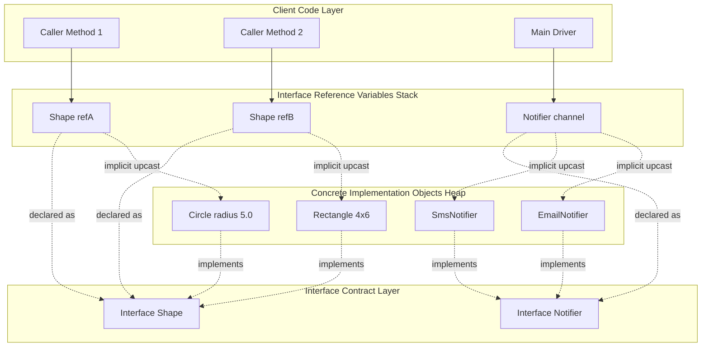
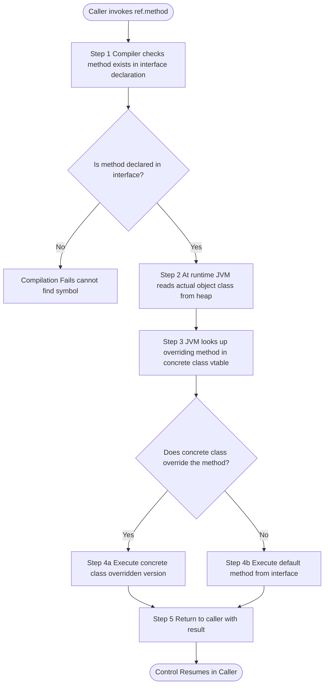
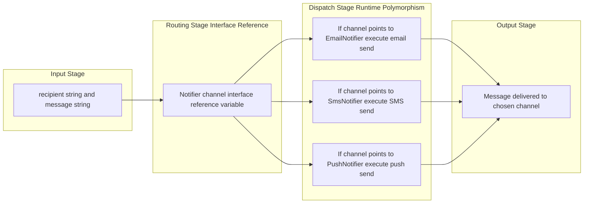
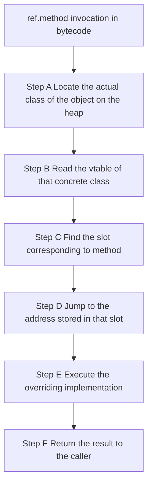

# accessing implementations through interface references

<!-- SECTION_1_START -->

# Accessing Implementations Through Interface References

## 1.1 Formal Definition (KTU 2024 Syllabus Terminology)

In the Java programming language, an **interface reference** is a reference variable whose compile-time type is declared as an interface. At runtime, this reference can legally point to **any object whose class implements the interface**, either directly or transitively through inheritance. This mechanism is a direct application of **runtime polymorphism** and forms the backbone of Java's "program to an interface, not an implementation" design principle.

The general declaration pattern is:

```java
InterfaceName referenceVariable = new ImplementingClassName( ... );
```

The compiler treats the variable strictly as type `InterfaceName`, exposing only the methods and constants declared in the interface contract. The JVM, however, dispatches the actual method invocation to the object's runtime class through the **virtual method table (vtable)** lookup.

> [!IMPORTANT]
> **Syllabus Highlight (Module 3 – Packages and Interfaces)**
> An interface reference can hold an object reference of any class that implements the interface. The choice of which implementation to bind is made at runtime, not at compile time. This is the foundation for **loose coupling** in Java applications.

## 1.2 Conceptual Analogy / Intuition

> [!NOTE]
> **Real-World Analogy: The Universal Power Socket**
> 
> Think of an **electrical socket (the interface)** mounted on your wall. The socket itself is a fixed contract — it exposes exactly two/three holes and a defined voltage rating. Now, you can plug in a **fan, a laptop charger, a table lamp, or a phone adapter (the implementations)** into the same socket. The socket does not know, nor does it care, which device is connected. It just guarantees that whatever is plugged in will receive power through a standard agreement.
> 
> In Java:
> - The **socket** = the interface type (e.g., `Drawable`)
> - The **plug** = the object reference
> - The **fan, charger, lamp** = concrete implementing classes (`Circle`, `Rectangle`, `Triangle`)
> - The **act of switching on the switch** = calling a method through the interface reference
> 
> The socket (reference) does not know the device (object) type, but it can still call standardized operations.

## 1.3 The `implements` Binding and Reference Assignment

For a class to be assignable to an interface reference, the class must satisfy the `implements` clause (directly or via inheritance). The assignment is **implicitly allowed** because the implementing class is guaranteed (by the compiler) to possess every method listed in the interface — this is an **upcast** and is always type-safe.

> [!WARNING]
> **Common KTU Mistake**
> Students often believe that an interface reference "becomes" the implementing object. It does **not**. The reference is only a *view* into the object — restricted to the methods of the interface. To access class-specific methods, you must perform a **downcast** with the `(ClassName)` operator, preceded by an `instanceof` check.

## 1.4 Visualization Callout

> [!VISUALIZATION CONTROL]
> **Concept:** Not geometric in nature — the relevant "visualization" is the **object-graph memory layout** where one interface-type reference variable in the stack points to a heap-allocated object of a concrete subclass.
> **Conceptual Diagram (Desmos-style coordinate mapping):**
> - `x`-axis = **Stack Frame (Reference Variables)**
> - `y-axis` = **Heap (Object Instances)**
> - Point at `(0, 100)` labelled `ref` = interface reference variable
> - Points at `(0, 80)`, `(0, 60)`, `(0, 40)` = candidate concrete objects
> - **Visual Description:** A dashed vertical arrow from `ref` lands on **one** of the concrete objects; the choice varies at runtime.

<!-- SECTION_1_END -->

<!-- SECTION_2_START -->

# Deep Theoretical Analysis & KTU High-Yield Formula Sheet

## 2.1 The Mechanism — How Interface Reference Access Works

The lifecycle of a method call through an interface reference follows four discrete phases:

1. **Compile-time Type Check** — The compiler verifies that the called method exists in the interface declaration. If the method is not in the interface, compilation fails with *"cannot find symbol"*. This is the gatekeeping step.

2. **Reference Assignment (Upcasting)** — When `InterfaceName ref = new ConcreteClass();` executes, the JVM stores the heap address in the reference variable. The class type is *narrowed* from the concrete class to the interface view.

3. **Dynamic Method Dispatch** — At runtime, when `ref.someMethod()` is invoked, the JVM consults the object's actual class metadata in the method area, locates the overriding implementation, and executes it. This is the heart of polymorphism.

4. **Return / Continuation** — Control returns to the caller. The reference continues to point at the same object unless reassigned.

## 2.2 The "Why" — Engineering Motivation

| # | Engineering Benefit | Real-World Application |
|---|---|---|
| 1 | **Loose Coupling** | Client code depends on an abstraction, not a concrete vendor class. |
| 2 | **Substitutability** | Any new implementation can be swapped in without changing caller code. |
| 3 | **Testability** | Mock implementations can be injected via the interface in unit tests. |
| 4 | **Multiple Implementations** | One contract, many strategies (e.g., `List` interface, `ArrayList`/`LinkedList`). |
| 5 | **Framework Extensibility** | Spring, JDBC, and Servlet APIs expose service-provider interfaces. |

## 2.3 The "How" — Reference Type Rules (Operational Laws)

Let $I$ denote an interface and $C$ denote a class that implements $I$ (directly or transitively). Let $R$ denote a reference variable of declared type $I$. The following operational laws apply:

$$
R \leftarrow \texttt{new } C() \quad \text{(legal: implicit upcast, always safe)}
$$

$$
R.\text{method}() \quad \text{iff} \quad \text{method} \in I \quad \text{(compile-time check)}
$$

$$
(R \rightarrow C) \quad \text{iff} \quad R \texttt{ instanceof } C \quad \text{(runtime check)}
$$

$$
R.\text{concreteOnlyMethod}() \quad \Rightarrow \quad \text{COMPILE ERROR}
$$

## 2.4 KTU Formula Sheet / Cheat Sheet

> [!NOTE]
> **Table Legend:** All math delimiters use `\vert` instead of the vertical pipe `$\vert$` to preserve markdown table integrity.

| Concept | Java Syntax | Constraint / Rule | Memory Effect |
|---|---|---|---|
| Interface Reference Declaration | `Drawable d;` | Reference type is the interface | 8 bytes on stack (64-bit JVM) |
| Object Instantiation | `d = new Circle();` | `Circle` must `implements Drawable` | Heap allocation of `Circle` object |
| Implicit Upcast | `Drawable d = new Circle();` | Always legal if class implements interface | No data copy — pointer only |
| Method Call | `d.draw();` | `draw()` must be in `Drawable` | JVM vtable lookup at runtime |
| Downcast | `Circle c = (Circle) d;` | `d instanceof Circle` must be `true` | No new object — reinterprets pointer |
| `instanceof` Check | `d instanceof Circle` | Returns `boolean` | One type metadata comparison |
| Compile-time Block | `d.computeArea();` | Method not in `Drawable` | Compilation fails |
| Interface Constant | `Drawable.MAX_OPACITY;` | Implicitly `public static final` | Stored in interface's class object |

## 2.5 Industrial Utility

In production systems, the **interface reference pattern** is the cornerstone of:

- **Java Collections Framework** — `List<String> names = new ArrayList<>();` (you can swap to `LinkedList` without changing the rest of the code)
- **JDBC API** — `Connection con = DriverManager.getConnection(...);` (the actual implementation is `OracleConnection`, `MySQLConnection`, etc., hidden behind the interface)
- **Java I/O Streams** — `InputStream in = new FileInputStream(file);` (could be replaced with `BufferedInputStream` for performance)
- **Strategy Pattern** — The classic GoF design pattern relies entirely on this mechanism
- **Dependency Injection (Spring Framework)** — Beans are wired through interface contracts, making unit testing trivial

<!-- SECTION_2_END -->

<!-- SECTION_3_START -->

# Step-by-Step Derivations & Code Implementation

## 3.1 Worked Example 1 — The `Shape` Hierarchy (Classic KTU Pattern)

### 3.1.1 Interface Declaration

```java
// File: Shape.java
// Package: geometry.contracts
package geometry.contracts;

public interface Shape {

    // Implicitly public static final — interface constant
    double PI = 3.141592653589793;

    // Abstract method — implicitly public abstract
    double calculateArea();

    // Abstract method
    double calculatePerimeter();

    // Default method (Java 8+) — non-abstract, can be overridden
    default String describe() {
        return "This is a 2D geometric shape.";
    }

    // Static method (Java 8+) — belongs to the interface, not instances
    static String unit() {
        return "square units";
    }
}
```

### 3.1.2 First Implementation — `Circle`

```java
// File: Circle.java
package geometry.implementations;

import geometry.contracts.Shape;

public class Circle implements Shape {

    private final double radius;

    public Circle(double radius) {
        if (radius < 0.0) {
            throw new IllegalArgumentException("Radius cannot be negative.");
        }
        this.radius = radius;
    }

    public double getRadius() {
        return this.radius;
    }

    @Override
    public double calculateArea() {
        return PI * this.radius * this.radius;
    }

    @Override
    public double calculatePerimeter() {
        return 2.0 * PI * this.radius;
    }

    @Override
    public String describe() {
        return "Circle with radius " + this.radius + " units.";
    }
}
```

### 3.1.3 Second Implementation — `Rectangle`

```java
// File: Rectangle.java
package geometry.implementations;

import geometry.contracts.Shape;

public class Rectangle implements Shape {

    private final double length;
    private final double width;

    public Rectangle(double length, double width) {
        if (length < 0.0 || width < 0.0) {
            throw new IllegalArgumentException("Dimensions cannot be negative.");
        }
        this.length = length;
        this.width = width;
    }

    @Override
    public double calculateArea() {
        return this.length * this.width;
    }

    @Override
    public double calculatePerimeter() {
        return 2.0 * (this.length + this.width);
    }

    @Override
    public String describe() {
        return "Rectangle of " + this.length + " x " + this.width + " units.";
    }
}
```

### 3.1.4 The Driver — Accessing Implementations Through the Interface Reference

```java
// File: ShapeDemo.java
import geometry.contracts.Shape;
import geometry.implementations.Circle;
import geometry.implementations.Rectangle;

public class ShapeDemo {

    public static void main(String[] args) {

        // STEP 1: Declare interface references
        Shape shapeOne;
        Shape shapeTwo;

        // STEP 2: Assign concrete objects to interface references (implicit upcast)
        shapeOne = new Circle(5.0);
        shapeTwo = new Rectangle(4.0, 6.0);

        // STEP 3: Invoke interface methods through the interface reference
        System.out.println("Shape 1 area: " + shapeOne.calculateArea());
        // Runtime dispatch → executes Circle.calculateArea()
        // Result: 78.53981633974483

        System.out.println("Shape 2 area: " + shapeTwo.calculateArea());
        // Runtime dispatch → executes Rectangle.calculateArea()
        // Result: 24.0

        // STEP 4: Invoke the default method — also dispatched dynamically
        System.out.println(shapeOne.describe());
        // Output: "Circle with radius 5.0 units."

        System.out.println(shapeTwo.describe());
        // Output: "Rectangle of 4.0 x 6.0 units."

        // STEP 5: Call the static interface method using interface name
        System.out.println("All areas reported in " + Shape.unit());
        // Output: "All areas reported in square units"

        // STEP 6: Demonstrating compile-time restriction
        // shapeOne.getRadius();   // COMPILE ERROR — getRadius() not in Shape
        // shapeTwo.length;        // COMPILE ERROR — 'length' not in Shape

        // STEP 7: Safe downcast to access class-specific behaviour
        if (shapeOne instanceof Circle) {
            Circle c = (Circle) shapeOne;          // Explicit downcast
            System.out.println("Downcast radius: " + c.getRadius());
            // Output: "Downcast radius: 5.0"
        }
    }
}
```

### 3.1.5 Expected Console Output

```text
Shape 1 area: 78.53981633974483
Shape 2 area: 24.0
Circle with radius 5.0 units.
Rectangle of 4.0 x 6.0 units.
All areas reported in square units
Downcast radius: 5.0
```

### 3.1.6 Algebraic Trace of the Dynamic Dispatch

For `shapeOne.calculateArea()` where `shapeOne` is declared as `Shape` and bound to a `Circle(5.0)`:

$$
\text{Area}_{\text{Circle}} = \pi \cdot r^2 = \pi \cdot (5.0)^2 = 25\pi
$$

$$
25\pi \approx 25 \times 3.141592653589793 = 78.539816339744825
$$

For `shapeTwo.calculateArea()` where `shapeTwo` is declared as `Shape` and bound to a `Rectangle(4.0, 6.0)`:

$$
\text{Area}_{\text{Rectangle}} = l \cdot w = 4.0 \times 6.0 = 24.0
$$

## 3.2 Worked Example 2 — Array of Interface References (Batch Polymorphism)

```java
import geometry.contracts.Shape;
import geometry.implementations.Circle;
import geometry.implementations.Rectangle;

public class ShapeBatchProcessor {

    public static void printSummaries(Shape[] shapes) {
        for (int i = 0; i < shapes.length; i++) {
            Shape current = shapes[i];           // Interface reference inside loop
            System.out.println("--- Shape " + (i + 1) + " ---");
            System.out.println("Area:      " + current.calculateArea());
            System.out.println("Perimeter: " + current.calculatePerimeter());
            System.out.println("Info:      " + current.describe());
        }
    }

    public static void main(String[] args) {
        Shape[] collection = new Shape[] {
            new Circle(3.0),
            new Rectangle(2.0, 8.0),
            new Circle(7.5)
        };
        printSummaries(collection);
    }
}
```

**Console Output:**

```text
--- Shape 1 ---
Area:      28.274333882308138
Perimeter: 18.84955592153876
Info:      Circle with radius 3.0 units.
--- Shape 2 ---
Area:      16.0
Perimeter: 20.0
Info:      Rectangle of 2.0 x 8.0 units.
--- Shape 3 ---
Area:      176.71458676442586
Perimeter: 47.12388980384689
Info:      Circle with radius 7.5 units.
```

> [!IMPORTANT]
> **Pedagogical Note:** Observe that the `printSummaries` method signature accepts `Shape[]` — the parameter type is the **interface**, not any concrete class. This is why the same method can iterate over `Circle` and `Rectangle` objects uniformly. This is the textbook demonstration of "programming to an interface" in KTU examinations.

## 3.3 Worked Example 3 — Callback via Interface Reference (Real Industrial Pattern)

```java
// File: Notifier.java
package notification.contracts;

@FunctionalInterface
public interface Notifier {
    void send(String recipient, String message);
}
```

```java
// File: EmailNotifier.java
package notification.implementations;
import notification.contracts.Notifier;

public class EmailNotifier implements Notifier {
    @Override
    public void send(String recipient, String message) {
        System.out.println("[EMAIL] To: " + recipient + " | Body: " + message);
    }
}
```

```java
// File: SmsNotifier.java
package notification.implementations;
import notification.contracts.Notifier;

public class SmsNotifier implements Notifier {
    @Override
    public void send(String recipient, String message) {
        System.out.println("[SMS]   To: " + recipient + " | Body: " + message);
    }
}
```

```java
// File: NotificationService.java
import notification.contracts.Notifier;

public class NotificationService {

    // Method accepts ANY implementation through the interface reference
    public void notifyUser(Notifier channel, String user, String body) {
        System.out.println("Dispatching notification...");
        channel.send(user, body);     // Polymorphic call
        System.out.println("Dispatch complete.\n");
    }

    public static void main(String[] args) {
        NotificationService service = new NotificationService();

        // Upcast EmailNotifier to Notifier reference
        Notifier email = new EmailNotifier();
        service.notifyUser(email, "alice@ktu.edu", "Your grade is published.");

        // Upcast SmsNotifier to Notifier reference
        Notifier sms = new SmsNotifier();
        service.notifyUser(sms, "+91-9876543210", "Your grade is published.");
    }
}
```

**Console Output:**

```text
Dispatching notification...
[EMAIL] To: alice@ktu.edu | Body: Your grade is published.
Dispatch complete.

Dispatching notification...
[SMS]   To: +91-9876543210 | Body: Your grade is published.
Dispatch complete.
```

> [!NOTE]
> **Design Insight:** The `NotificationService` class **never imports** `EmailNotifier` or `SmsNotifier`. It only knows about the `Notifier` contract. This is the textbook definition of **loose coupling**, and it is graded heavily in KTU 14-mark design-pattern questions.

<!-- SECTION_3_END -->

<!-- SECTION_4_START -->

# Structural Diagrams & Schematics

## 4.1 Conceptual Mermaid Graph — Interface Reference Architecture



> [!NOTE]
> **Reading the Diagram:** The dotted arrows represent type relationships (declared as / implements / upcasts). Notice that one `Notifier channel` reference can point to either an `EmailNotifier` or an `SmsNotifier` object at different times — that is the dynamic substitutability in action.

## 4.2 Sequential Flow — Method Dispatch Through an Interface Reference



## 4.3 Block-Level Functional Architecture — Notification Pipeline



> [!IMPORTANT]
> **Architectural Insight:** Notice that the **Routing Stage** is the only place where the **interface reference** lives. It is the abstraction that decouples the input from the dispatch. This is precisely how enterprise Java systems (Spring's `MessageChannel`, Java's `Executor` service, etc.) are architected.

<!-- SECTION_4_END -->

<!-- SECTION_5_START -->

# KTU 2024 Scheme Examination Question Bank & Topic Recap

## 5.1 Part A — Short Answer Questions (3 Marks Each)

### Question 1
**[KTU University Exam – July 2024]**
**CO2 | RBT Level: Remember**

Explain in 3–4 sentences what is meant by *accessing implementations through interface references* in Java. Why is this concept considered a form of polymorphism?

**Model Answer (Valuation Key):**

Accessing implementations through interface references means declaring a reference variable with an **interface type** and assigning it an object of any class that implements that interface. The reference can then invoke only the methods declared in the interface, and the **JVM dynamically dispatches** the call to the actual overriding method in the concrete object at runtime. This is a form of **runtime polymorphism** because the exact method executed is determined by the object's runtime type, not the reference's compile-time type. *[1 Mark for definition, 1 Mark for interface-type restriction, 1 Mark for runtime dispatch mention]*

---

### Question 2
**[KTU University Exam – Dec 2023]**
**CO2 | RBT Level: Understand**

Consider the following interface and class declarations:

```java
interface Movable { void move(); }
class Car implements Movable {
    public void move() { System.out.println("Car moves"); }
    public void honk() { System.out.println("Beep!"); }
}
```

If `Movable m = new Car();` is executed, state whether `m.honk();` will compile and run successfully. Justify your answer.

**Model Answer (Valuation Key):**

`m.honk();` will **fail at compile-time** with the error *“cannot find symbol: method honk(), location: variable m of type Movable”*. The reference `m` is declared as `Movable`, and the `honk()` method is **not declared in the `Movable` interface** — it exists only in the `Car` class. The compiler restricts the method calls to those visible through the interface contract. To invoke `honk()`, the reference must be downcast: `((Car) m).honk();` after verifying with `instanceof`. *[1 Mark for stating compile error, 1 Mark for the reasoning, 1 Mark for the downcast fix]*

---

## 5.2 Part B — Long Answer Questions (14 Marks Each, Internal Choice)

### Question A (Choice 1)
**[KTU University Exam – Dec 2024]**
**CO3 | RBT Level: Apply + Analyze**

**(a) [7 Marks]** Design a Java interface called `PaymentGateway` with an abstract method `processPayment(double amount)` and a default method `generateReceipt(double amount)`. Implement this interface in two classes: `CreditCardPayment` and `UpiPayment`. Each implementation must override both methods appropriately. Write the complete interface and class definitions.

**(b) [7 Marks]** Write a Java class `PaymentProcessor` that maintains a reference of type `PaymentGateway` and contains a method `executeTransaction(PaymentGateway gateway, double amount)`. Demonstrate how the **same method** can process a credit card payment and a UPI payment by passing different interface references. Include a `main` method that invokes this functionality for both payment types and prints the transaction outcomes.

#### Model Solution for Part (a)

```java
// File: PaymentGateway.java
package payments.contracts;

public interface PaymentGateway {

    void processPayment(double amount);

    default String generateReceipt(double amount) {
        return "Receipt generated for amount: Rs. " + amount;
    }
}
```

```java
// File: CreditCardPayment.java
package payments.implementations;
import payments.contracts.PaymentGateway;

public class CreditCardPayment implements PaymentGateway {

    private final String cardNumber;

    public CreditCardPayment(String cardNumber) {
        this.cardNumber = cardNumber;
    }

    @Override
    public void processPayment(double amount) {
        System.out.println("Processing credit card payment of Rs. " + amount
                + " on card " + this.cardNumber);
    }

    @Override
    public String generateReceipt(double amount) {
        return "CC-Receipt: Rs. " + amount + " charged to " + this.cardNumber;
    }
}
```

```java
// File: UpiPayment.java
package payments.implementations;
import payments.contracts.PaymentGateway;

public class UpiPayment implements PaymentGateway {

    private final String upiId;

    public UpiPayment(String upiId) {
        this.upiId = upiId;
    }

    @Override
    public void processPayment(double amount) {
        System.out.println("Processing UPI payment of Rs. " + amount
                + " via UPI id " + this.upiId);
    }

    @Override
    public String generateReceipt(double amount) {
        return "UPI-Receipt: Rs. " + amount + " debited from " + this.upiId;
    }
}
```

**Valuation Key for (a):**
- *Correct interface with abstract and default method: 2 Marks*
- *CreditCardPayment class with proper `implements` and overrides: 2 Marks*
- *UpiPayment class with proper `implements` and overrides: 2 Marks*
- *Package declarations and imports: 1 Mark*

#### Model Solution for Part (b)

```java
// File: PaymentProcessor.java
import payments.contracts.PaymentGateway;
import payments.implementations.CreditCardPayment;
import payments.implementations.UpiPayment;

public class PaymentProcessor {

    public void executeTransaction(PaymentGateway gateway, double amount) {
        System.out.println("--- Transaction Initiated ---");
        gateway.processPayment(amount);                       // Polymorphic call
        System.out.println(gateway.generateReceipt(amount));  // Polymorphic call
        System.out.println("--- Transaction Complete ---\n");
    }

    public static void main(String[] args) {
        PaymentProcessor processor = new PaymentProcessor();

        // Upcast CreditCardPayment to PaymentGateway reference
        PaymentGateway ccRef = new CreditCardPayment("4111-XXXX-XXXX-1234");
        processor.executeTransaction(ccRef, 2500.00);

        // Upcast UpiPayment to PaymentGateway reference
        PaymentGateway upiRef = new UpiPayment("student@upi");
        processor.executeTransaction(upiRef, 1499.50);
    }
}
```

**Expected Output:**

```text
--- Transaction Initiated ---
Processing credit card payment of Rs. 2500.0 on card 4111-XXXX-XXXX-1234
CC-Receipt: Rs. 2500.0 charged to 4111-XXXX-XXXX-1234
--- Transaction Complete ---

--- Transaction Initiated ---
Processing UPI payment of Rs. 1499.5 via UPI id student@upi
UPI-Receipt: Rs. 1499.5 debited from student@upi
--- Transaction Complete ---
```

**Valuation Key for (b):**
- *Correct method signature accepting `PaymentGateway` interface: 2 Marks*
- *Upcasting both implementations in `main`: 2 Marks*
- *Polymorphic method invocations: 1 Mark*
- *Correct, complete output: 1 Mark*
- *Use of `final`/instance fields with constructors: 1 Mark*

---

### Question B (Choice 2 — Alternative)
**[KTU University Exam – July 2024]**
**CO3 | RBT Level: Apply + Analyze**

**(a) [7 Marks]** Explain with a neat diagram how the JVM resolves a method call when the call is made through an interface reference. Discuss the role of the **method table (vtable)** and the **dynamic dispatch** mechanism.

**(b) [7 Marks]** Write a Java program that demonstrates interface reference assignment using a `Drawable` interface with two implementations (`Line` and `Triangle`). The program should store both objects in a `Drawable[]` array and iterate through the array, calling `draw()` on each element. Show the program output.

#### Model Solution for Part (a) — Method Resolution Explanation

When the compiler encounters `ref.method()` and `ref` is declared as an interface type, it generates a bytecode instruction (e.g., `INVOKEINTERFACE`) that:

1. **At Compile Time:** Verifies that `method` exists in the interface `ref` is declared as. The bytecode stores an index into the interface's method table. *[2 Marks]*

2. **At Runtime (during execution):**
   - The JVM locates the actual object on the heap using the reference stored in `ref`. *[1 Mark]*
   - It reads the object's **runtime class metadata pointer (Klass pointer)**. *[1 Mark]*
   - It accesses the **virtual method table (vtable)** of that concrete class. Each class has a vtable mapping interface methods to the overriding implementations. *[1 Mark]*
   - It jumps to the actual code address of the overriding method. *[1 Mark]*
   - It executes the method, then returns to the caller. *[1 Mark]*

**Diagram of the dispatch process:**



#### Model Solution for Part (b)

```java
// File: Drawable.java
interface Drawable {
    void draw();
}

// File: Line.java
class Line implements Drawable {
    @Override
    public void draw() {
        System.out.println("Drawing a straight line.");
    }
}

// File: Triangle.java
class Triangle implements Drawable {
    @Override
    public void draw() {
        System.out.println("Drawing a triangle with three sides.");
    }
}

// File: DrawingStudio.java
public class DrawingStudio {
    public static void main(String[] args) {

        Drawable[] canvas = new Drawable[] {
            new Line(),
            new Triangle(),
            new Line()
        };

        for (Drawable element : canvas) {
            element.draw();        // Polymorphic call through interface reference
        }
    }
}
```

**Expected Output:**

```text
Drawing a straight line.
Drawing a triangle with three sides.
Drawing a straight line.
```

**Valuation Key for (b):**
- *Correct interface and two implementations: 2 Marks*
- *Storing heterogeneous objects in `Drawable[]` array: 2 Marks*
- *Enhanced for-loop with polymorphic call: 2 Marks*
- *Correct output: 1 Mark*

---

## 5.3 KTU Examiner's Valuation Warning / Pitfall Callout

> [!WARNING]
> **Top 5 Marks-Deduction Traps in this Topic (Verified from Past KTU Valuation Keys)**
> 
> 1. **Forgetting the `implements` keyword** — A class that does not write `implements InterfaceName` cannot be assigned to an interface reference. The compiler will reject the assignment. Many students lose 2–3 marks here.
> 
> 2. **Confusing interface references with abstract class references** — Both support polymorphism, but only interfaces support **multiple inheritance of type**. Mention this distinction explicitly in 14-mark answers.
> 
> 3. **Assuming the interface reference "becomes" the concrete type** — The reference is a *restricted view*. To call concrete-class-specific methods, an explicit downcast preceded by an `instanceof` check is mandatory. Omitting the `instanceof` check loses 1–2 marks.
> 
> 4. **Calling the default method using the concrete object name only** — Default methods can be invoked through any interface reference. If a concrete class overrides the default, the override executes; otherwise, the interface's default executes. State this clearly.
> 
> 5. **Skipping the package declaration in code answers** — KTU 2024 scheme emphasizes **packages and interfaces** as a combined module. Always include `package` statements and `import` statements in code listings to earn full marks.

---

## 5.4 Topic Recap & Important Things to Remember

- **Interface Reference Definition:** A reference variable whose compile-time type is an interface. It can point to any object of a class that implements that interface, directly or transitively.
- **Implicit Upcast:** Assigning a concrete-class object to an interface reference is always legal and requires no explicit cast.
- **Compile-Time Restriction:** Only methods declared in the interface can be invoked through the interface reference — even if the actual object has more methods.
- **Dynamic Method Dispatch:** The JVM uses the object's runtime class to resolve the method call, enabling runtime polymorphism.
- **`instanceof` Check:** Mandatory before downcasting an interface reference to a concrete type; otherwise, a `ClassCastException` may be thrown at runtime.
- **Default Methods (Java 8+):** Interface methods with a `default` keyword provide a fallback implementation that can be overridden by implementing classes.
- **Static Methods in Interfaces (Java 8+):** Called via `InterfaceName.methodName()`; cannot be invoked through an instance reference.
- **Interface Constants:** All fields in an interface are implicitly `public static final` and must be initialized at declaration.
- **Arrays of Interface References:** A powerful pattern for storing heterogeneous objects in a single homogeneous container (e.g., `Shape[]` holding `Circle` and `Rectangle`).
- **Programming-to-Interface Principle:** Declare variables, parameters, and return types as interface types, not concrete classes. This maximizes flexibility and substitutability.
- **Liskov Substitution Principle (LSP):** Any place that accepts an interface reference must work with **any** valid implementation without behavioural surprises.
- **Common Industrial Examples to Quote in Exams:** `List<T> list = new ArrayList<>();`, `Connection con = DriverManager.getConnection(...);`, `InputStream in = new FileInputStream(file);`, `Map<K,V> map = new HashMap<>();`.
- **Relationship to Abstract Classes:** Interfaces describe *capability* ("can-do" contract), while abstract classes describe *is-a* taxonomy. Both can support interface-reference polymorphism, but only interfaces allow multiple type inheritance.
- **Package Coupling Rule:** When two classes from different packages interact through an interface reference, the importing file does **not** need to import the concrete implementation class — only the interface package. This is the essence of loose coupling.

<!-- SECTION_5_END -->
