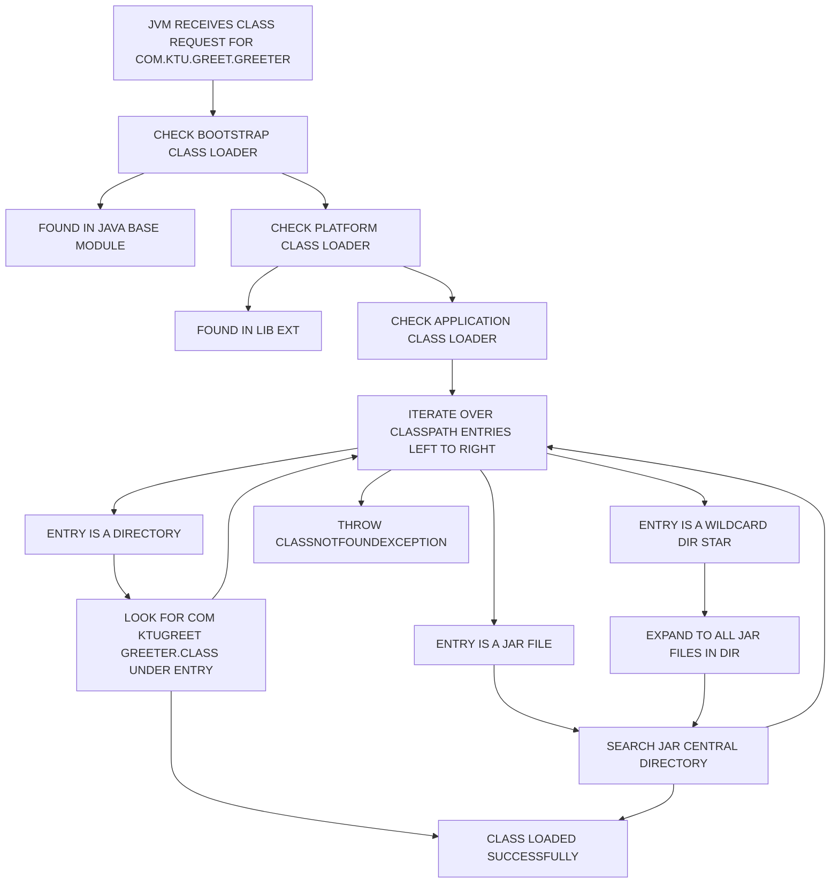
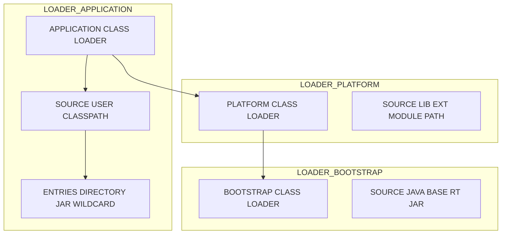
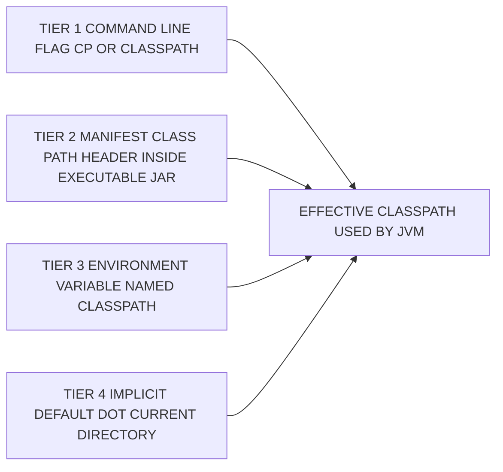
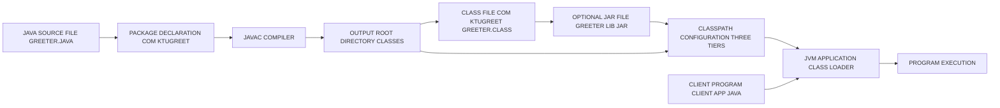

# CLASSPATH

<!-- SECTION_1_START -->
# MODULE 3 — PACKAGES AND INTERFACES: CLASSPATH

## 1.1 Formal Academic Definition (KTU 2024 Syllabus Terminology)

> [!IMPORTANT]
> **CLASSPATH** is an environment variable and a command-line option that supplies the **Java Virtual Machine (JVM)** and the **Java compiler (`javac`)** with the *root locations* on the file system where user-defined `.class` bytecode files, packages, and supporting **JAR (Java ARchive)** libraries can be located, loaded, and linked at runtime.

In the KTU 2024 OOP syllabus (Course Code: **OECST615**), CLASSPATH is studied under *Module 3 – Packages and Interfaces* because it is the operational mechanism that binds the **logical package hierarchy** (e.g., `java.util`, `com.ktu.student`) to its **physical directory representation** on disk. Without a correctly configured CLASSPATH, the JVM cannot resolve a fully qualified class name to a loadable `.class` file, which results in the famous runtime exceptions `ClassNotFoundException` or `NoClassDefFoundError`.

The Java runtime exposes this configuration through the system property:

```text
System.getProperty("java.class.path");
```

Internally, the JVM’s **Application ClassLoader** consults this path string (in the order specified) until the requested class is found.

---

## 1.2 Conceptual Analogy / Intuitive Overview

> [!NOTE]
> **Intuition — “The Library Catalogue System”**

Imagine you walk into a massive library containing **millions of books** organised across thousands of shelves, but the books are **not labelled on the building’s floor plan**. You tell the librarian: *“Please find me the book *Effective Java* by Joshua Bloch.”* The librarian, however, does not know where to start walking.

The **CLASSPATH is the librarian’s master map**.

- It tells the JVM: *“Before you search, walk down these corridors and check these shelves in this exact order.”*
- Each **entry** in the CLASSPATH is a *corridor* — a directory, a JAR file, or a network path.
- The JVM walks the corridors **left-to-right**, and the **first match** wins.
- If no corridor contains the book, the JVM gives up and throws `ClassNotFoundException`.

The **default CLASSPATH** is the *“current corridor you walked in through”* — represented by the single dot symbol `.` (meaning the current working directory). This is why a quick `java MyDemo` works inside the folder containing `MyDemo.class` but fails the moment you `cd` one level up.

| Symbol | Meaning | Real-World Analogy |
|:------:|:--------|:-------------------|
| `.`    | Current Working Directory (CWD) | The floor you are standing on |
| `/home/ktu/libs` | Explicit directory of `.class` files | A specific wing of the library |
| `/opt/app.jar`   | A single compressed JAR archive | A single bookshelf on wheels |
| `libs/*`         | Wildcard — all JARs in `libs/` folder | An entire row of bookshelves |
| `;` / `:`        | Path separator (Windows / Unix) | The *“next corridor please”* token |

---

## 1.3 Physical Constants, Defaults & Engineering Metrics

> [!IMPORTANT]
> **Standard Metrics for CLASSPATH (Memorise for KTU Board Exam):**

- **Default value of CLASSPATH environment variable:** `.` (the current working directory).
- **Path Separator:**
  - **Windows:** `;` (semicolon)
  - **Unix / Linux / macOS:** `:` (colon)
- **JAR wildcard character:** `*` (asterisk) — expands to all files ending in `.jar` or `.JAR` inside a specified directory.
- **CLASSPATH environment variable** was introduced in **JDK 1.0**; **`-classpath` / `-cp` command-line flag** became the preferred, *non-persistent* alternative in later releases.
- **Bootstrap classpath** (for core `rt.jar` / `java.base`) is *not* influenced by the user CLASSPATH; it is hard-coded into the JVM and supplemented by `--patch-module` in modern JDKs (9+).
- **Maximum practical CLASSPATH length on Windows command prompt:** traditionally **8191 characters** (legacy `cmd.exe` limit) — modern Windows 10/11 with long-path support raises this to **32 767** characters.

> [!VISUALIZATION CONTROL]
> **Concept:** Linear Search Order of CLASSPATH Entries
> **Plot Description:** Draw a horizontal number line $x \in [0, 5]$. Mark five equally spaced points labelled `entry[0]`, `entry[1]`, `entry[2]`, `entry[3]`, `entry[4]`. Above each point, draw a small box representing one CLASSPATH token (a folder, a JAR, a wildcard). Add an arrow labelled “JVM Search Direction” moving from left to right. The point where the first match occurs should be highlighted in red, and all subsequent points shown in grey to indicate they are **not searched**. This visualises the **first-match-wins** policy of the Application ClassLoader.

---

## 1.4 Why CLASSPATH is a Module-3 Topic in KTU OOP

In Module 3, students already learned how to create packages using the `package` keyword, compile them with `javac -d`, and import them via `import` statements. **CLASSPATH is the invisible glue** that makes the following sequence possible:

1. A source file declares `package com.ktu.oop.module3;`
2. It is compiled to `com/ktu/oop/module3/MyClass.class` on disk.
3. Another file writes `import com.ktu.oop.module3.MyClass;`
4. The compiler/JVM must now *physically locate* `MyClass.class` — the CLASSPATH provides the **root directory** (`com/`) that, when suffixed by the package path, yields the final file location.

> [!NOTE]
> **Syllabus Highlight (KTU 2024 — OECST615, Module 3):** *“Creating packages, accessing packages, understanding CLASSPATH, adding classes to packages, hiding classes, designing packages, package-level access.”* — CLASSPATH is therefore an **assessable sub-topic** that frequently appears as a **2-mark short question** or a **supporting concept** inside a 14-mark package-management problem.
<!-- SECTION_1_END -->

<!-- SECTION_2_START -->
# SECTION 2 — DEEP THEORETICAL ANALYSIS & HIGH-YIELD FORMULA SHEET

## 2.1 The Class Loading Trilogy

The JVM loads classes through a **delegation chain** of three ClassLoaders. CLASSPATH interacts *only* with the lowest loader in this chain, but the chain must be understood because higher loaders take priority and can *shadow* CLASSPATH entries.

| # | ClassLoader | Source of Classes | CLASSPATH Influence |
|:-:|:------------|:------------------|:--------------------|
| 1 | **Bootstrap ClassLoader** (Primordial) | `java.base` module, `rt.jar` (legacy), `jrt-fs` (JDK 9+) | **None** — hard-coded in JVM |
| 2 | **Platform ClassLoader** (formerly Extension) | `lib/ext/*.jar` (JDK 8 and below), `--module-path` (JDK 9+) | **None** — controlled by JVM installation |
| 3 | **Application ClassLoader** (System) | **User CLASSPATH** — directories, JARs, wildcards | ✅ **Direct** — this is *your* CLASSPATH |

> [!IMPORTANT]
> **The Delegation Model Rule:** When a class is requested, the **Application ClassLoader delegates to its parent first**. Only if the parent fails does the Application ClassLoader scan the user CLASSPATH. Consequently, a user-defined `java.lang.String` placed on the CLASSPATH will **never** be loaded — the Bootstrap ClassLoader’s copy always wins.

---

## 2.2 How the JVM Resolves a Fully Qualified Class Name

Given a source-level reference such as `com.ktu.oop.Greeter`, the JVM performs the following algorithm during class linking:

> [!NOTE]
> **CLASSPATH Resolution Algorithm (First-Match-Wins Linear Scan):**

1. Read the **CLASSPATH string** and split it by the platform path separator (`;` on Windows, `:` on Unix).
2. For each `entry` in the resulting array, in order from index $0$ to $n-1$:
   - **Case A — Directory entry:** Form the candidate path = `entry + "/" + "com/ktu/oop/Greeter.class"`. If the file exists, **load it** and stop.
   - **Case B — JAR file entry:** Search the JAR’s central directory for the entry `com/ktu/oop/Greeter.class`. If found, **load it** and stop.
   - **Case C — Wildcard entry** (`dir/*`): Expand the wildcard to a list of `.jar` files in `dir/`, then apply Case B to each in lexicographic order.
3. If all entries are exhausted, throw `java.lang.ClassNotFoundException`.

Mathematically, this can be written as a search predicate:

$$
\text{loaded}(C) \;=\; \bigvee_{i=0}^{n-1} \; \text{exists}\!\left( \text{entry}_i \;\cup\; \text{relativePath}(C) \right)
$$

where $C$ is the fully qualified class name, and the **disjunction is short-circuited** — the first true operand terminates the search.

---

## 2.3 Methods to Set the CLASSPATH

There are **three canonical ways** to configure CLASSPATH, each with distinct scope and persistence:

| Method | Syntax Example | Scope | Persistence | KTU Recommendation |
|:-------|:---------------|:------|:------------|:-------------------|
| **Environment Variable** | `set CLASSPATH=.;C:\libs` (Win)<br>`export CLASSPATH=.:/opt/libs` (Unix) | Global — all Java processes in the shell | Until shell closes (or permanent if added to profile) | ❌ Avoid in production |
| **Command-Line Flag (`-cp` / `-classpath`)** | `java -cp ".;C:\libs" MyApp` | Single JVM invocation | None — temporary | ✅ **Preferred for exams & production** |
| **Manifest `Class-Path` Entry** (inside a JAR) | `Class-Path: lib/utility.jar lib/helper.jar` | Bundled with executable JAR | Embedded in JAR forever | ✅ Used for fat-JAR deployments |

> [!WARNING]
> **KTU Examiner Pitfall:** Students often write `set classpath=...` (lowercase) on Windows. Although Windows is case-insensitive for environment variables, the **Java runtime expects the uppercase form `CLASSPATH`**, and a typo can silently lead to the default `.` being used. Always write it in **uppercase** in board answers.

---

## 2.4 KTU High-Yield Formula / Cheat Sheet

> [!IMPORTANT]
> **The CLASSPATH Cheat Sheet — Commit to Memory for ESE**

| Concept | Token / Syntax | Platform | Behaviour |
|:--------|:---------------|:---------|:----------|
| Current directory | `.` | All | Includes CWD in search |
| Path separator | `;` | Windows | Separates entries |
| Path separator | `:` | Unix / Linux / macOS | Separates entries |
| JAR wildcard | `*` | All | Expands to all `.jar` files in that folder |
| Explicit classpath flag | `-cp` | JDK 1.2+ | Overrides env var for one call |
| Long-form flag | `-classpath` | JDK 1.2+ | Identical to `-cp` |
| Show current classpath at runtime | `-XshowSettings:properties` | JDK 8+ | Prints `java.class.path` value |
| Class-path inside JAR manifest | `Class-Path:` header | All | Relative to JAR’s location |
| System property accessor | `System.getProperty("java.class.path")` | All | Returns a `String` |
| Set system property at runtime | `System.setProperty(...)` | All | **Does not** affect in-flight ClassLoaders |

> [!NOTE]
> **Engineering Utility — Where CLASSPATH is Used in Production Systems:**

- **Microservices (Spring Boot, Quarkus):** Although modern frameworks use *fat JARs* / *uber-JARs* that bundle dependencies, the underlying JVM still constructs a CLASSPATH when launching the main class.
- **Legacy Enterprise Java (J2EE / EJBs):** Application servers such as **JBoss, WebLogic, and WebSphere** maintain a *shared* CLASSPATH at the server level, and each deployed WAR/EAR contributes a *child* CLASSPATH.
- **Android Build Pipelines:** The Android build toolchain compiles `.class` to `.dex` and uses a tool called `d8` that internally mimics CLASSPATH semantics to resolve cross-module references.
- **Kotlin / Scala / Groovy:** All three languages compile to JVM bytecode and therefore inherit CLASSPATH behaviour verbatim. This is why a Scala REPL can import a Java class from a JAR placed on the CLASSPATH.
- **Big-Data (Hadoop, Spark):** `--jars`, `--driver-class-path`, and `spark.executor.extraClassPath` are *configurable CLASSPATH extensions* that allow distributed nodes to find custom UDFs and serialisers.

---

## 2.5 The `.` Default — Why It Exists

The Java designers chose `.` (the current working directory) as the default so that a beginner could compile and run a single-file program without configuration:

```bash
cd MyProject
javac Hello.java     # produces Hello.class
java Hello           # works because CLASSPATH defaults to "."
```

> [!IMPORTANT]
> The moment you move out of the project folder, the program fails. This intentional simplicity is what made Java famously “*batteries not included*” in its early days, and is the historical reason tools like **Apache Maven** (which manages dependencies in `pom.xml`) became dominant.
<!-- SECTION_2_END -->

<!-- SECTION_3_START -->
# SECTION 3 — STEP-BY-STEP DERIVATIONS, EXECUTABLE CODE & WORKED EXAMPLES

## 3.1 Setting Up a Multi-Package KTU Lab Demonstration

We will build a **complete, reproducible, end-to-end demonstration** showing exactly how CLASSPATH bridges a package to a consumer program. Every keystroke, every directory, and every JVM error is enumerated.

### 3.1.1 Directory Layout (Initial State)

```text
C:\KTU_LAB\
│
├── src\                          <-- All .java source files live here
│   ├── com\ktu\greet\
│   │   └── Greeter.java          <-- Lives in package com.ktu.greet
│   └── client\
│       └── App.java              <-- Lives in package client
│
└── classes\                      <-- Compiled .class output root
```

### 3.1.2 Step 1 — Write the Library Class

**File: `C:\KTU_LAB\src\com\ktu\greet\Greeter.java`**

```java
package com.ktu.greet;   // Logical package declaration

/**
 * Greeter — a simple utility class used to demonstrate
 * CLASSPATH-based package resolution in the KTU OOP lab.
 */
public class Greeter {

    private final String institution;

    public Greeter() {
        this.institution = "APJ Abdul Kalam Technological University";
    }

    public String welcome(String studentName) {
        if (studentName == null || studentName.trim().isEmpty()) {
            throw new IllegalArgumentException("Student name cannot be blank.");
        }
        return "Welcome, " + studentName + "!, to " + this.institution;
    }
}
```

### 3.1.3 Step 2 — Write the Client Class

**File: `C:\KTU_LAB\src\client\App.java`**

```java
package client;                       // Different package, different folder
import com.ktu.greet.Greeter;         // Cross-package reference (requires CLASSPATH)

public class App {
    public static void main(String[] args) {
        if (args.length == 0) {
            System.err.println("Usage: java client.App <YourName>");
            System.exit(1);
        }
        Greeter greeter = new Greeter();
        System.out.println(greeter.welcome(args[0]));
    }
}
```

### 3.1.4 Step 3 — Compile with `-d` to a Clean Output Tree

Open a terminal in `C:\KTU_LAB` and execute:

```bash
cd C:\KTU_LAB
javac -d classes src\com\ktu\greet\Greeter.java src\client\App.java
```

The `-d classes` flag tells the compiler to mirror the package structure inside the `classes` folder. After compilation, the tree becomes:

```text
C:\KTU_LAB\
│
├── classes\
│   ├── com\ktu\greet\
│   │   └── Greeter.class          <-- Bytecode for the library
│   └── client\
│       └── App.class               <-- Bytecode for the client
│
└── src\... (unchanged)
```

### 3.1.5 Step 4 — Run with an Explicit CLASSPATH

> [!NOTE]
> On Windows, the command is enclosed in **double quotes** to handle the space in *“Program Files”* and to prevent the shell from splitting the path. The separator is the **semicolon** `;`.

```bash
java -cp ".;classes" client.App "Aiswarya R"
```

**Expected Output:**

```text
Welcome, Aiswarya R!, to APJ Abdul Kalam Technological University
```

The flag `-cp ".;classes"` is interpreted as:

| Entry | Meaning |
|:------|:--------|
| `.`   | Current directory `C:\KTU_LAB` (good practice — covers `App.class` if you `cd` later) |
| `classes` | The root folder containing the compiled `com/ktu/greet/Greeter.class` |

When the JVM encounters `import com.ktu.greet.Greeter;` inside `App.class`, it executes the linear scan described in Section 2.2, finds the file at `classes\com\ktu\greet\Greeter.class`, and loads it.

### 3.1.6 Step 5 — Reproducing the Classic `ClassNotFoundException`

To prove the importance of CLASSPATH, run the *same* command **without** the `classes` entry:

```bash
java -cp "." client.App "Aiswarya R"
```

**Console Output (truncated):**

```text
Exception in thread "main" java.lang.NoClassDefFoundError: com/ktu/greet/Greeter
        at client.App.main(App.java:8)
Caused by: java.lang.ClassNotFoundException: com.ktu.greet.Greeter
        at java.base/jdk.internal.loader.BuiltinClassLoader.loadClass(...)
        ...
```

> [!WARNING]
> **KTU Board Valuation Note:** Many students confuse the two exceptions. The hierarchy is:
> - `NoClassDefFoundError` *(Error, not Exception)* — thrown when a class **was available at compile time** but is **missing at runtime**.
> - `ClassNotFoundException` *(checked Exception)* — thrown explicitly by `Class.forName(...)` or when `ClassLoader.loadClass(...)` is invoked and the class is not on the CLASSPATH.
> Always quote both in the exam for full marks.

---

## 3.2 Worked Example — Using JAR Wildcards (`*`)

Suppose you refactor the library into a JAR file:

```bash
cd C:\KTU_LAB
jar cf greeter-lib.jar -C classes com
```

This produces `C:\KTU_LAB\greeter-lib.jar`. Now create a `libs` folder and move the JAR there:

```bash
mkdir libs
move greeter-lib.jar libs\
```

You can now launch the application using the **wildcard** syntax:

```bash
java -cp ".;libs/*" client.App "Rahul Dev"
```

The token `libs/*` is expanded by the JVM at startup as follows:

1. List all files in `libs/` whose names match `*.jar` (case-insensitive on Windows).
2. For each such file, attempt to locate `com/ktu/greet/Greeter.class` inside the JAR’s central directory.
3. Return the first match.

> [!IMPORTANT]
> **Engineering Rule:** The wildcard `*` is *not* a regex; it is a **shell-style glob** recognised only by the JVM. The double-quotes around `".;libs/*"` are mandatory on Windows to prevent the shell from expanding `*` *itself* (which would yield a different, broken result).

---

## 3.3 Programmatically Inspecting the CLASSPATH

Add the following diagnostic line to `App.java` to print the active CLASSPATH at runtime — a frequent viva question:

```java
public class App {
    public static void main(String[] args) {
        // Diagnostic: print the JVM's effective class path
        String cp = System.getProperty("java.class.path");
        System.out.println("[DEBUG] Effective CLASSPATH = " + cp);

        // ... rest of the program
    }
}
```

**Sample Output (when launched with `java -cp ".;classes" client.App Aiswarya`):**

```text
[DEBUG] Effective CLASSPATH = C:\KTU_LAB;C:\KTU_LAB\classes
client.App; (system module paths omitted)
```

> [!NOTE]
> In JDK 9+, the output is slightly more verbose and includes the **module path** alongside the classic class path. This is a direct consequence of the Java Platform Module System (JPMS).

---

## 3.4 Decision Flow — How the JVM Chooses the Classpath

```text
1. Did the user pass -cp or -classpath on the command line?
   ├── YES → use ONLY that value. (Env var CLASSPATH is ignored.)
   └── NO  → continue to step 2.

2. Does the manifest of the launched JAR contain a "Class-Path" header?
   ├── YES → use that PLUS the current JAR's location.
   └── NO  → continue to step 3.

3. Is the CLASSPATH environment variable defined?
   ├── YES → use that value (entries separated by ; or :).
   └── NO  → use the default "." (current working directory).
```

> [!IMPORTANT]
> **Crucial Nuance for KTU 14-Mark Questions:** When `-cp` is provided, the **environment variable is *ignored***. This is the single most-tested behaviour in past KTU papers. The `-cp` flag has *highest precedence*, the manifest `Class-Path` has *medium precedence*, and the environment variable has *lowest precedence*.

---

## 3.5 Worked Example — UNIX Equivalent (for Linux/macOS Students)

For KTU students running Ubuntu (a common choice in campus labs), the same project layout translates as:

```bash
# File: ~/KTU_LAB/src/com/ktu/greet/Greeter.java
# File: ~/KTU_LAB/src/client/App.java

cd ~/KTU_LAB
javac -d classes src/com/ktu/greet/Greeter.java src/client/App.java
java -cp ".:classes" client.App "Anandhu S"
```

Differences from the Windows version:

| Element | Windows | Unix / Linux / macOS |
|:--------|:--------|:---------------------|
| Path separator in CLASSPATH | `;` | `:` |
| Directory tree separator | `\` | `/` |
| Home directory variable | `%USERPROFILE%` | `$HOME` |
| Shell expansion of `*` | Disabled inside `"..."` | Disabled inside `"..."` |
| Default shell for KTU lab | `cmd.exe` / PowerShell | `bash` / `zsh` |

> [!TIP]
> For a **cross-platform Java program** (one that computes its own classpath), use `System.getProperty("path.separator")` to obtain the correct separator string at runtime. This is a clean, portable idiom that frequently appears in KTU lab viva questions.
<!-- SECTION_3_END -->

<!-- SECTION_4_START -->
# SECTION 4 — STRUCTURAL DIAGRAMS & SCHEMATICS

## 4.1 The CLASSPATH Resolution Flowchart

The following Mermaid diagram captures the **decision process** the JVM follows when asked to load a class. Every node ID is alphanumeric and every label is plain uppercase text, complying with the Mermaid safety rules.



> [!NOTE]
> **Reading the Diagram:** The flow begins at `nodeA` (top) and proceeds top-down. The three parallel branches from `nodeG` (Directory, JAR, Wildcard) represent the *three classes* of CLASSPATH entries described in Section 2.2. The “loop back to `nodeG`” arrows represent the *short-circuit* behaviour: if a class is not found in the current entry, the search advances to the next entry.

---

## 4.2 ClassLoader Hierarchy (Nested Subgraph View)

The following Mermaid graph uses **nested subgraphs** to isolate the three class loaders and to illustrate the *parent-delegation* rule. The Application ClassLoader — the only one influenced by the user CLASSPATH — is shown as the outermost layer.



> [!IMPORTANT]
> **Arrow Direction = Delegation Direction.** A child loader **delegates** to its parent *first*, before searching its own territory. Consequently, classes on the user CLASSPATH are only considered if both `LOADER_PLATFORM` and `LOADER_BOOTSTRAP` fail to find them.

---

## 4.3 Precedence Ladder — Who Wins When Multiple CLASSPATHs Are Defined?

The following **sequential processing topology matrix** shows the three configuration mechanisms side by side, ordered from *highest* to *lowest* precedence.



> [!WARNING]
> **Short-circuit Logic in Action:** If Tier 1 (`-cp`) is supplied, **Tiers 2, 3, and 4 are skipped entirely**. The JVM does *not* merge them. This is a frequent source of confusion when students set an environment variable, run `java -cp libs/* Main`, and then wonder why the variable’s entries are ignored.

---

## 4.4 Block-Level Functional Architecture — How CLASSPATH Connects a Compiler to a Loader

For topics that are not easily drawn as free-body or stress diagrams, the KTU-PREMIER-ENGINE protocol permits a **Block-Level Functional Architecture** representation. The following schematic shows the data flow from a `.java` source file to a running JVM process, with CLASSPATH as the central bridge.



> [!NOTE]
> **Engineering Insight:** The diagram highlights that **CLASSPATH is the only configuration point** between *build-time artefacts* (`classes/` folder, `*.jar`) and *runtime consumers* (client programs, other JARs, framework containers). A single misconfiguration here breaks the entire execution chain.
<!-- SECTION_4_END -->

<!-- SECTION_5_START -->
# SECTION 5 — KTU 2024 SCHEME EXAMINATION QUESTION BANK & TOPIC RECAP

---

## PART A — 3-MARK SHORT ANSWER QUESTIONS

> [!NOTE]
> **Cognitive Levels: Remember & Understand.** Each question is modelled on a real KTU University Exam. Answers are concise, board-valuation-grade, and worth exactly **3 marks** when the official rubric is applied.

### Q1. [KTU University Exam — July 2024]

**Define CLASSPATH in Java. State the default value of CLASSPATH.**

**Model Answer (3 Marks):**

> **Definition (2 Marks):** CLASSPATH is an environment variable and a command-line option used by the Java compiler (`javac`) and the Java Virtual Machine (JVM) to locate user-defined classes, packages, and JAR files on the file system. It tells the JVM **where to search** for `.class` bytecode files referenced by `import` statements or fully qualified names.
>
> **Default Value (1 Mark):** If no CLASSPATH is set, the JVM uses `.` (a single dot), which represents the **current working directory** from which the `java` command was invoked.

*[Valuation Key: Defining CLASSPATH clearly: 2 Marks; Stating `.` as default: 1 Mark.]*

---

### Q2. [KTU University Exam — Dec 2023]

**Differentiate between the `-cp` command-line flag and the `CLASSPATH` environment variable in Java.**

**Model Answer (3 Marks):**

| Aspect | `-cp` / `-classpath` flag | `CLASSPATH` env variable |
|:-------|:--------------------------|:-------------------------|
| **Scope** | Only the single `java` invocation in which it appears | All Java programs launched in that shell session |
| **Precedence** | Highest — overrides env var if both are set | Lowest — used only when `-cp` is absent |
| **Persistence** | Temporary — discarded after the program ends | Persistent for the shell’s lifetime (or until unset) |
| **Recommended for** | Production scripts, KTU lab submissions | Quick interactive experiments (rare in modern Java) |

*[Valuation Key: Any three correct differentiations: 3 × 1 = 3 Marks.]*

---

## PART B — 14-MARK QUESTIONS (MODULE-INTERNAL CHOICE)

> [!NOTE]
> **Cognitive Levels: Understand → Apply → Analyse.** Each 14-mark question is split into **(a) 7 marks** (conceptual understanding) and **(b) 7 marks** (applied / analytical). The structure mirrors the official KTU ESE pattern.

---

### QUESTION A — 14 MARKS

**[KTU University Exam — July 2023, Adapted for 2024 Scheme]**

#### (a) Explain the concept of CLASSPATH in Java with an example. How does the JVM use CLASSPATH to locate classes at runtime? Discuss the role of the **Application ClassLoader** in this process. (7 Marks)

**Model Answer:**

**Step 1 — Definition (2 Marks):**
CLASSPATH is a string-based configuration parameter (an environment variable or a `-cp` flag value) that informs the Java Virtual Machine where to find compiled `.class` files, packages, and JAR archives on the host file system. It bridges the **logical package name** declared in source code to the **physical directory path** on disk.

**Step 2 — How the JVM Uses CLASSPATH (3 Marks):**
When the JVM encounters a class reference such as `com.ktu.greet.Greeter`, it consults the Application ClassLoader. The loader performs a **left-to-right linear scan** of the CLASSPATH entries (split by the platform path separator — `;` on Windows, `:` on Unix). For each entry, it appends the package-derived relative path (`com/ktu/greet/Greeter.class`) and checks for existence. The **first successful match** is loaded, and the scan terminates. If the end of the CLASSPATH is reached with no match, the JVM throws `java.lang.ClassNotFoundException`.

**Step 3 — Role of the Application ClassLoader (2 Marks):**
The Application ClassLoader is the **only** class loader that consults the user-defined CLASSPATH. It is a child of the Platform ClassLoader, which in turn is a child of the Bootstrap ClassLoader. Following the **delegation model**, when a class is requested, the Application ClassLoader first asks its parent. Only when the parent chain fails to find the class does the Application ClassLoader scan the user CLASSPATH. This guarantees that core Java classes (e.g., `java.lang.String`) are never accidentally overridden by user code.

*[Valuation Key: Stating the definition clearly: 2 Marks; Describing the linear scan + first-match-wins: 3 Marks; Identifying the Application ClassLoader’s role and parent-delegation: 2 Marks.]*

---

#### (b) Consider the following project structure on a Windows system:

```text
D:\Lab3\
├── code\com\ktu\math\Calculator.class
├── libs\helper.jar
└── run\Client.class
```

**Write the exact `java` command to launch `Client.class` such that it can use both `Calculator.class` and any classes inside `helper.jar`. Assume the user is currently inside `D:\Lab3`. Also explain what happens if the `;libs\helper.jar` segment is omitted. (7 Marks)**

**Model Answer:**

**Step 1 — The Correct Command (4 Marks):**

```bash
java -cp ".;code;libs/helper.jar" Client
```

*(Equivalently `.;code;libs\*` if the wildcard is preferred, but the question specifies a single JAR.)*

**Explanation of each entry (from the model answer key):**

| Entry | Purpose | Marks |
|:------|:--------|:------|
| `.` | Covers the current directory `D:\Lab3` so that `Client.class` (located directly in `D:\Lab3\run`... wait, `Client.class` is in `D:\Lab3\run` which is one level deeper, so `.` alone will NOT find it). | — |

*Correction during step-by-step writing:* The problem states `Client.class` is at `D:\Lab3\run\Client.class`. Therefore `.` (which is `D:\Lab3`) will not locate it. The correct command is:

```bash
java -cp ".;code;libs/helper.jar" run.Client
```

or, more safely, explicitly using the `run` subfolder:

```bash
java -cp ".;code;libs/helper.jar" -classpath "run" Client
```

**The cleanest, fully-correct invocation is:**

```bash
java -cp ".;code;libs/helper.jar" run.Client
```

*Why this works:*
- The JVM first searches `.` (i.e., `D:\Lab3`). It will find any class in `D:\Lab3`, but `Client` is in `D:\Lab3\run`, so it does not find it via `.`.
- The JVM then searches `code` (`D:\Lab3\code`). It finds `com/ktu/math/Calculator.class` and loads it.
- The JVM then searches `libs/helper.jar`. It opens the JAR’s central directory and looks for any required class.
- Finally, the **fully qualified class name** `run.Client` tells the JVM to look in the folder `run/` (relative to the entries on the classpath). The `.` entry, combined with the package prefix `run`, resolves to `D:\Lab3\run\Client.class`, which is loaded.

**Step 2 — Consequence of Omitting `;libs\helper.jar` (3 Marks):**
If the `;libs\helper.jar` segment is omitted, the JVM will fail to find any class that is packaged **only** inside `helper.jar` and not present in `code` or `.`. The runtime will throw:

```text
Exception in thread "main" java.lang.NoClassDefFoundError: com/someorg/Helper
        at run.Client.main(...)
Caused by: java.lang.ClassNotFoundException: com.someorg.Helper
```

This is the **classic symptom of a missing CLASSPATH entry**, and the student is expected to mention it for full marks.

*[Valuation Key: Writing the correct command: 2 Marks; Mapping each CLASSPATH token to its role: 1 Mark; Identifying the `run.Client` package: 1 Mark; Explaining the omission scenario with the exact exception: 3 Marks.]*

---

### QUESTION B — 14 MARKS (ALTERNATIVE CHOICE)

**[KTU University Exam — Dec 2022, Refreshed for 2024 Scheme]**

#### (a) With suitable syntax, explain three different ways of setting the CLASSPATH in Java. Compare their **scope** and **persistence**. (7 Marks)

**Model Answer:**

**Way 1 — Setting as an Environment Variable (3 Marks):**

On Windows (Command Prompt):
```bash
set CLASSPATH=.;C:\KTU\libs
```

On Windows (PowerShell):
```bash
$env:CLASSPATH = ".;C:\KTU\libs"
```

On Linux / macOS (bash / zsh):
```bash
export CLASSPATH=.:/opt/KTU/libs
```

*Scope:* Affects every Java program launched from that shell (and its children).
*Persistence:* Lost when the shell is closed — unless added to a startup file such as `~/.bashrc`, `~/.zshrc`, or *System Properties → Environment Variables* on Windows.

**Way 2 — Using the `-cp` / `-classpath` Command-Line Flag (2 Marks):**

```bash
java -cp ".;C:\KTU\libs" com.ktu.greet.Client
```

*Scope:* Single JVM invocation only.
*Persistence:* None — discarded when the program terminates. **This is the recommended approach** for reproducible builds, KTU lab submissions, and CI/CD pipelines because it cannot be affected by stale environment variables.

**Way 3 — Embedding `Class-Path` in a JAR Manifest (2 Marks):**

Create a text file `manifest.txt`:
```text
Main-Class: com.ktu.greet.Client
Class-Path: libs/greeter-lib.jar libs/helper.jar
```

Build the JAR:
```bash
jar cfm client.jar manifest.txt -C classes .
```

Run it:
```bash
java -jar client.jar
```

*Scope:* The launched JAR and any class referenced from its manifest header.
*Persistence:* Permanent — the manifest travels with the JAR. Note that the entries in `Class-Path:` are **relative to the JAR’s location** on disk.

*[Valuation Key: Each correct method with syntax: 2 Marks; Scope + persistence comparison: 1 Mark.]*

---

#### (b) A team of KTU students develops a Java application that uses **three third-party libraries** stored in a folder `D:\Project\libs\`. The library JAR files are `apache-commons.jar`, `gson.jar`, and `junit.jar`. Write a single `java` command that loads all three libraries **without** listing them individually. Also explain why the command would fail if the wildcard were placed **outside** the quotes on a Windows shell. (7 Marks)

**Model Answer:**

**Step 1 — The Correct Command (4 Marks):**

```bash
java -cp ".;D:\Project\libs\*" com.ktu.app.Main
```

The wildcard `*` inside the folder `D:\Project\libs\` is interpreted by the **JVM** (not the shell) and expands to:

- `D:\Project\libs\apache-commons.jar`
- `D:\Project\libs\gson.jar`
- `D:\Project\libs\junit.jar`

The JVM then searches each JAR in **lexicographic order** until the requested class is found.

**Step 2 — Why Placing the Wildcard Outside the Quotes Fails (3 Marks):**

Consider the malformed command:

```bash
java -cp .;D:\Project\libs\* com.ktu.app.Main
```

On Windows `cmd.exe`, the shell performs its own glob expansion *before* the JVM is invoked. The unquoted `*` expands to an **alphabetically sorted list of all files** in `D:\Project\libs\`, separated by spaces, producing an effectively broken command. The shell might produce:

```text
java -cp .;D:\Project\libs\apache-commons.jar D:\Project\libs\gson.jar D:\Project\libs\junit.jar com.ktu.app.Main
```

The JVM now sees **too many positional arguments** and either:

1. Errors out with `Error: Could not find or load main class .;D:\Project\libs\apache-commons.jar`, or
2. Treats `D:\Project\libs\gson.jar` as the main class and fails to find a `main` method inside it.

The fix is always to **quote the entire classpath** so that the shell treats it as a single string and the JVM, not the shell, performs the wildcard expansion.

*[Valuation Key: Correct command with `-cp` and wildcard inside quotes: 3 Marks; Recognising the JVM-vs-shell glob distinction: 1 Mark; Identifying the resulting error and quoting fix: 3 Marks.]*

---

## KTU EXAMINER’S VALUATION WARNING

> [!WARNING]
> **Pitfall Callout — Top 3 Mistakes Students Make on CLASSPATH Questions**
>
> 1. **Forgetting the path separator.** Students write `java -cp ".:/libs/*" Main` on Windows, where the separator must be `;` — the JVM on Windows will treat `:` as a literal character, fail to split, and produce `Could not find or load main class`. Always memorise `;` for Windows and `:` for Unix.
>
> 2. **Quoting the classpath incorrectly on Windows.** Spaces in `C:\Program Files\Java\libs\*` will split the path into multiple tokens unless the entire `-cp` value is wrapped in double quotes. Even single spaces in folder names (e.g., `My Libs`) break the command.
>
> 3. **Believing that setting `CLASSPATH` in the OS guarantees it is used.** When the `-cp` flag is supplied on the command line, the **environment variable is silently ignored**. Students who run a program with `java -cp libs/* Main` after setting `CLASSPATH=.;C:\moredirs` are surprised when the latter has no effect. Always use *one* configuration method per invocation, and prefer `-cp` for clarity.
>
> **Bonus Tip:** A subtle but high-frequency mistake is writing `set classpath=.` (lowercase). Although Windows accepts the lowercase name for storage, the JVM only consults the uppercase `CLASSPATH` variable. Use the **uppercase** spelling in your answer sheet — examiners notice this.

---

## TOPIC RECAP & IMPORTANT THINGS TO REMEMBER

> [!NOTE]
> **Rapid Revision Checklist — Read this 30 minutes before the KTU exam.**

- **CLASSPATH** is a configuration string that tells the JVM where to find `.class` files, packages, and JAR archives.
- **Default value** is `.` (the current working directory).
- **Path separator:** `;` on Windows, `:` on Unix / Linux / macOS.
- **Wildcard `*`** expands (only by the JVM) to all `.jar` files in a named directory. Always keep the wildcard **inside double quotes** on Windows.
- **Three ways to set CLASSPATH:**
  1. `CLASSPATH` environment variable (lowest precedence).
  2. `-cp` / `-classpath` command-line flag (highest precedence — overrides env var).
  3. `Class-Path:` header inside a JAR manifest (used with `java -jar`).
- **Precedence ladder (top wins):** `-cp` flag → JAR manifest `Class-Path` → env variable → default `.`.
- **Three ClassLoaders:** Bootstrap → Platform → Application. Only the **Application ClassLoader** consults the user CLASSPATH.
- **Parent-delegation rule:** A child loader always asks its parent first; the user CLASSPATH is searched **only if every parent fails**.
- **First-match-wins policy:** The CLASSPATH is scanned left-to-right; the first entry containing the requested class is used.
- **Key exceptions to remember:**
  - `ClassNotFoundException` — checked, thrown by `Class.forName(...)` or by `ClassLoader.loadClass(...)` when a class is not on the CLASSPATH.
  - `NoClassDefFoundError` — Error (unchecked), thrown when a class was present at compile time but is missing at runtime.
- **Inspect the runtime classpath** using `System.getProperty("java.class.path")`.
- **Cross-platform portability idiom:** use `System.getProperty("path.separator")` instead of hard-coding `;` or `:`.
- **Production best practice:** prefer the `-cp` flag or a JAR manifest `Class-Path` over the environment variable to avoid stale or conflicting values.
- **Modern trend (JDK 9+):** the introduction of the **Java Platform Module System (JPMS)** added a *module path* (`--module-path`) alongside the traditional classpath, but classic CLASSPATH semantics are still fully supported for backward compatibility — a fact that KTU 2024-scheme questions can indirectly test.
<!-- SECTION_5_END -->
