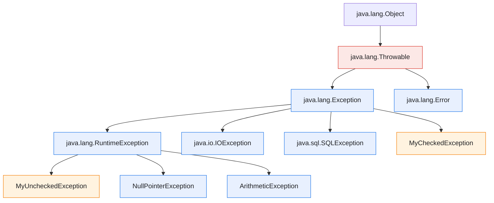
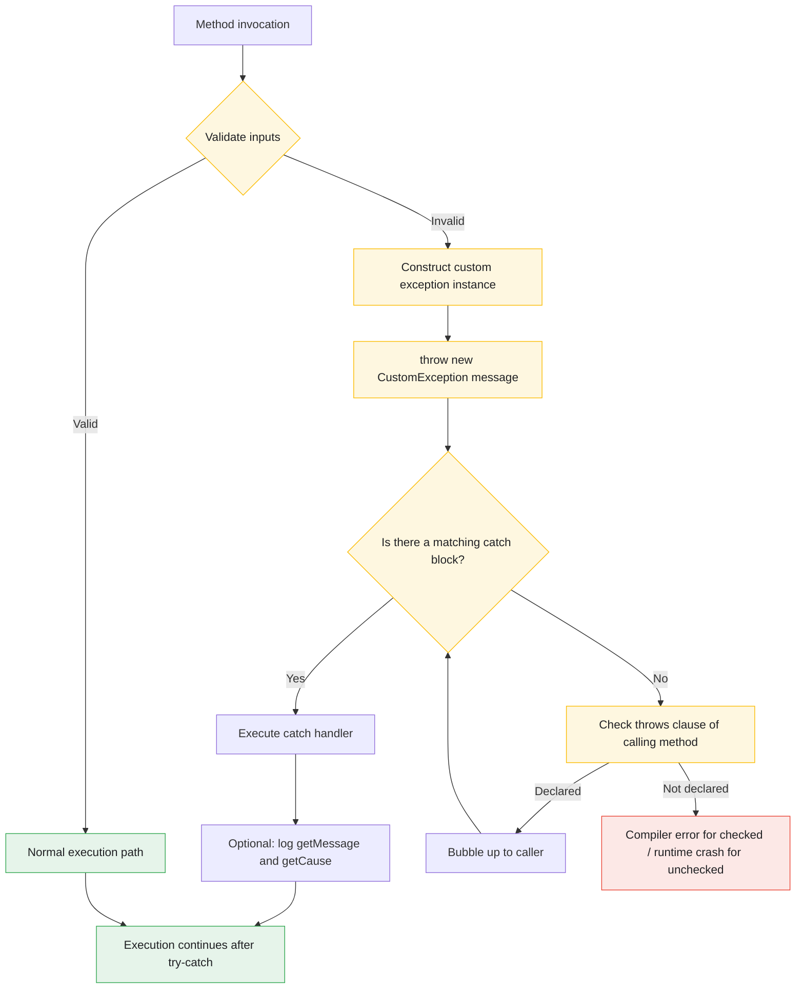
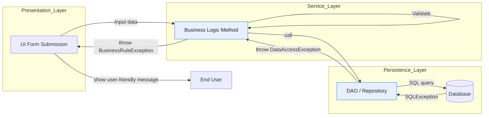

# Custom Exceptions

<!-- SECTION_1_START -->
# Custom Exceptions in Java — OOP Module 3

> [!NOTE]
> **KTU 2024 Scheme | Course: OECST615 — Object Oriented Programming**
> **Module 3 Focus:** Packages, Interfaces, and Custom (User-Defined) Exceptions

## 1.1 Formal Academic Definition

A **Custom Exception** (also called a **User-Defined Exception**) in Java is a class that a programmer deliberately creates to represent an error condition that is specific to a particular application or business domain and is not adequately covered by the standard exceptions provided in the Java API (`java.lang` and its sub-packages). Custom exceptions are implemented by extending either `java.lang.Exception` (for **checked** exceptions) or `java.lang.RuntimeException` (for **unchecked** exceptions), and they encapsulate application-specific contextual data such as error codes, invalid field values, and descriptive diagnostic messages.

> [!IMPORTANT]
> **KTU Syllabus Highlight (Module 3):** Under the *"Packages and Interfaces"* module, the KTU 2024 scheme specifically requires students to *"define and use user-defined exception classes to handle domain-specific error conditions"*. Custom exceptions sit at the intersection of **inheritance**, **polymorphism**, and **abstraction** — making them a high-yield OOP topic that is frequently tested in Part A and Part B of the ESE.

## 1.2 Conceptual Analogy — The "Smart Fire Alarm" Intuition

Imagine a generic **fire alarm** you buy from a hardware store. It beeps loudly whenever it senses smoke — a generic emergency signal. Now imagine a **factory-specific alarm** that, in addition to beeping, sends an SMS to the floor manager, flashes a red light on the **specific machine** that overheated, and writes the **machine ID** and **temperature** to a log file. The generic alarm is Java's built-in `Exception`. The factory-specific alarm is your **Custom Exception** — it carries richer, domain-meaningful information that the standard library simply cannot anticipate.

In code terms:

- A built-in exception says: *"Something went wrong."*
- A custom exception says: *"A student with roll number **CSB2107** tried to register for course **OECST615** but already exceeded the **maximum credit limit of 24**."*

This enriched, context-aware reporting is the **Why** behind custom exceptions.

> [!TIP]
> **Rule of Thumb:** If your exception message would be the only thing distinguishing two failure scenarios, you almost certainly need a **Custom Exception class**, not just a `throw new Exception("...")`.

## 1.3 The Two Architectural Families of Custom Exceptions

| Family | Parent Class | Checked at Compile Time? | When to Use |
|---|---|---|---|
| **Checked Custom Exception** | `extends Exception` | **Yes** — compiler forces handling | Recoverable conditions (e.g., `InsufficientBalanceException`, `InvalidRollNumberException`) |
| **Unchecked Custom Exception** | `extends RuntimeException` | **No** — runtime only | Programming bugs / unrecoverable conditions (e.g., `EmptyCartException`, `NegativeAgeException`) |

> [!NOTE]
> **Physical / Architectural Constants to Remember:**
> - All exceptions in Java are subclasses of `java.lang.Throwable`.
> - The two direct subclasses of `Throwable` are `Exception` and `Error`.
> - Only subclasses of `Throwable` can be thrown or caught using `throw` and `catch`.

> [!VISUALIZATION CONTROL]
> **Concept:** Java Exception Class Hierarchy (relevant to custom exceptions)
> **ASCII / Conceptual Tree:**
> ```
> java.lang.Object
>    └── java.lang.Throwable
>           ├── java.lang.Exception          ← extend this for CHECKED custom exceptions
>           │      └── java.lang.RuntimeException
>           │             └── (extend this for UNCHECKED custom exceptions)
>           └── java.lang.Error
> ```
> **Visual Description:** The student should observe that placing your custom class under `Exception` makes it a *compile-time* obligation, while placing it under `RuntimeException` makes it a *runtime* concern.
<!-- SECTION_1_END -->

<!-- SECTION_2_START -->
# Deep Theoretical Analysis & KTU High-Yield Formula Sheet

## 2.1 The Five Logical Steps to Design a Custom Exception

Designing a robust custom exception follows a repeatable engineering pattern. Mastering these steps guarantees full marks in KTU's "design and implement" type questions.

1. **Identify the Failure Domain.** Determine which application condition is not representable by built-in exceptions. *Example:* a banking app must reject withdrawals exceeding 90% of the balance.
2. **Choose the Parent Class.**
   - Use `Exception` if the caller **must** handle it (checked).
   - Use `RuntimeException` if the failure indicates a **programmer error** (unchecked).
3. **Define the Custom Class.** Provide at least two constructors: a **no-argument constructor** calling `super()` and a **message constructor** calling `super(String message)`. Optionally, a constructor that takes a **cause** (`Throwable`) and a constructor that accepts **domain-specific fields**.
4. **Throw the Exception.** Use the `throw new CustomExceptionName(...)` statement inside a method that detects the failure.
5. **Catch and Handle.** Wrap the throwing call in a `try { } catch (CustomExceptionName e) { }` block (or declare it in `throws`). The handler can read `e.getMessage()` and any custom getter.

> [!IMPORTANT]
> **Why the Two-Constructor Rule?** A KTU favourite. The *no-arg* constructor enables `throw new MyException()`, while the *message* constructor enables `throw new MyException("Detailed cause: ...")`. Both are required for **production-grade** custom exception design because Java's serialization framework and frameworks like Spring expect them.

## 2.2 The `throw` vs. `throws` vs. `Throwable` Trinity

These three terms confuse students regularly. Memorise the distinction.

| Keyword / Class | Type | Purpose | Where It Appears |
|---|---|---|---|
| `throw` | Keyword | **Actively** throws a single exception instance | Inside a method body — `throw new MyException();` |
| `throws` | Keyword | **Declares** that a method *may* pass an exception up to its caller | In the method signature — `void read() throws IOException` |
| `Throwable` | Class | The **root** superclass of all errors and exceptions in Java | Used in type hierarchies |

> [!WARNING]
> **Common KTU Mistake:** Writing `throws new Exception()` instead of `throw new Exception()`. The first is a compile error; the second is a runtime throw.

## 2.3 KTU High-Yield Formula / Syntax Sheet

The following table consolidates every syntactic form a student must write in the OECST615 exam. All pipes have been replaced with `\vert` to preserve markdown table integrity.

| \# | Construct | Exact Syntax (KTU Board Standard) | Purpose |
|---|---|---|---|
| 1 | Custom checked exception | `class MyException extends Exception { }` | Compile-time enforced failure |
| 2 | Custom unchecked exception | `class MyException extends RuntimeException { }` | Runtime-only failure |
| 3 | No-arg constructor | `MyException() { super(); }` | Default error |
| 4 | Message constructor | `MyException(String msg) { super(msg); }` | Custom error text |
| 5 | Cause constructor | `MyException(String msg, Throwable cause) { super(msg, cause); }` | Exception chaining |
| 6 | Throw statement | `throw new MyException("Invalid input");` | Raise the failure |
| 7 | Method signature decl. | `void read() throws MyException { ... }` | Forward responsibility |
| 8 | Catch block | `try { ... } catch (MyException e) { System.out.println(e.getMessage()); }` | Handle the failure |
| 9 | Multi-catch (Java 7+) | `catch (IOException \vert SQLException e) { }` | Unified handling |
| 10 | Rethrow as custom | `catch (SQLException e) { throw new DataAccessException("DB failed", e); }` | Wrap low-level errors |

## 2.4 Real-World Engineering Utility

Custom exceptions are not academic — they power **every** serious Java backend. Concrete production use cases include:

- **Banking Systems:** `InsufficientFundsException`, `DailyLimitExceededException` — checked, because the user can correct the input.
- **E-Commerce:** `OutOfStockException`, `InvalidCouponException` — checked, so the UI can prompt alternatives.
- **REST APIs (Spring Boot):** Custom exceptions are mapped to HTTP status codes via `@ResponseStatus` or `@ControllerAdvice`. Example: `throw new ResourceNotFoundException(id)` → HTTP **404**.
- **Validation Frameworks:** Bean Validation throws custom exceptions when `@NotNull`, `@Min(18)`, etc., fail.
- **Database Layers (JDBC/JPA):** Wrapping `SQLException` into a custom `DataAccessException` decouples business code from JDBC.

> [!NOTE]
> **Engineering Principle:** A well-designed custom exception carries **three things** — a human-readable message, a machine-readable error code, and a chain of causes. This is the *3-C Rule*: **Context**, **Code**, **Cause**.

## 2.5 The `getMessage()` and `toString()` Contract

When you override or rely on the inherited `toString()` of `Throwable`, the format is:

$$
\texttt{getClass().getName()} \;\;+\;\; ": " \;\;+\;\; \texttt{getMessage()}
$$

This is why a `toString()` call on a `new InvalidAgeException("Age cannot be negative")` returns the fully qualified class name concatenated with the message — useful for logging frameworks like Log4j and SLF4J.
<!-- SECTION_2_END -->

<!-- SECTION_3_START -->
# Step-by-Step Derivations & Code Implementation

## 3.1 Worked Example A — Checked Custom Exception (Banking Domain)

> [!IMPORTANT]
> **Problem (KTU-style):** *"Design a Java program that defines a checked custom exception `InsufficientBalanceException`. The program should debit an amount from a bank account and throw the custom exception if the resulting balance falls below ₹500."*

### Step 1 — Create the Custom Exception Class

```java
// File: InsufficientBalanceException.java
// This is a CHECKED custom exception (extends Exception, not RuntimeException)
public class InsufficientBalanceException extends Exception {

    // No-argument constructor — required for serialization & frameworks
    public InsufficientBalanceException() {
        super();
    }

    // Constructor that accepts a descriptive message
    public InsufficientBalanceException(String message) {
        super(message);
    }

    // Constructor that accepts both a message and the original cause
    // (e.g., wrap a low-level SQLException)
    public InsufficientBalanceException(String message, Throwable cause) {
        super(message, cause);
    }
}
```

### Step 2 — Create the BankAccount Class (The Throwing Class)

```java
// File: BankAccount.java
public class BankAccount {
    private String accountHolder;
    private double balance;

    public BankAccount(String accountHolder, double openingBalance) {
        this.accountHolder = accountHolder;
        this.balance = openingBalance;
    }

    // 'throws' is mandatory because InsufficientBalanceException is CHECKED
    public void debit(double amount) throws InsufficientBalanceException {
        if (amount <= 0) {
            throw new InsufficientBalanceException(
                "Debit amount must be positive. Provided: " + amount);
        }
        if ((balance - amount) < 500.00) {
            throw new InsufficientBalanceException(
                "Debit of INR " + amount +
                " would reduce balance below the minimum INR 500." +
                " Current balance: INR " + balance);
        }
        balance -= amount;
        System.out.println("Debit successful. New balance: INR " + balance);
    }

    public double getBalance() {
        return balance;
    }
}
```

### Step 3 — Create the Driver Class (The Catching Class)

```java
// File: BankApp.java
public class BankApp {
    public static void main(String[] args) {
        BankAccount account = new BankAccount("Anand Krishnan", 2000.00);

        // ---- Attempt 1: valid debit ----
        try {
            account.debit(800.00);
        } catch (InsufficientBalanceException e) {
            System.out.println("Handled: " + e.getMessage());
        }

        // ---- Attempt 2: invalid debit (would drop below 500) ----
        try {
            account.debit(1500.00);
        } catch (InsufficientBalanceException e) {
            System.out.println("Handled: " + e.getMessage());
        }

        // ---- Attempt 3: negative debit (programmer error) ----
        try {
            account.debit(-100.00);
        } catch (InsufficientBalanceException e) {
            System.out.println("Handled: " + e.getMessage());
        }
    }
}
```

### Step 4 — Expected Output Trace

```
Debit successful. New balance: INR 1200.0
Handled: Debit of INR 1500.0 would reduce balance below the minimum INR 500. Current balance: INR 1200.0
Handled: Debit amount must be positive. Provided: -100.0
```

### Step 5 — Valuation Key Point Allocation (for 14-mark question)

- Defining `InsufficientBalanceException` with at least two constructors: **3 marks**
- Properly extending `Exception` (not `RuntimeException`) and justification: **2 marks**
- `debit()` method with `throws` declaration and conditional `throw` statements: **5 marks**
- `try-catch` block in driver and correct message printing: **3 marks**
- Compilable, well-indented code with output trace: **1 mark**

---

## 3.2 Worked Example B — Unchecked Custom Exception with Extra Domain Fields

```java
// File: InvalidAgeException.java
// UNCHECKED custom exception — extends RuntimeException
public class InvalidAgeException extends RuntimeException {
    private int offendingAge;
    private final int MIN_AGE = 18;

    public InvalidAgeException() {
        super();
    }

    public InvalidAgeException(String message, int offendingAge) {
        super(message);
        this.offendingAge = offendingAge;
    }

    // Custom getter to expose the offending value
    public int getOffendingAge() {
        return this.offendingAge;
    }

    public int getMinAge() {
        return this.MIN_AGE;
    }
}
```

```java
// File: Voter.java
public class Voter {
    private String name;
    private int age;

    public Voter(String name, int age) {
        this.name = name;
        this.age = age;
    }

    public void register() {
        // No 'throws' clause required — InvalidAgeException is unchecked
        if (age < 18) {
            throw new InvalidAgeException(
                "Voter " + name + " is underage. Age provided: " + age,
                age);
        }
        System.out.println("Voter " + name + " registered successfully.");
    }
}
```

```java
// File: ElectionApp.java
public class ElectionApp {
    public static void main(String[] args) {
        Voter[] voters = {
            new Voter("Riya", 25),
            new Voter("Arjun", 16)  // This will trigger the custom exception
        };

        for (Voter v : voters) {
            try {
                v.register();
            } catch (InvalidAgeException e) {
                System.out.println("Registration FAILED: " + e.getMessage());
                System.out.println("  -> Offending age: " + e.getOffendingAge());
                System.out.println("  -> Minimum legal age: " + e.getMinAge());
            }
        }
    }
}
```

**Output:**

```
Voter Riya registered successfully.
Registration FAILED: Voter Arjun is underage. Age provided: 16
  -> Offending age: 16
  -> Minimum legal age: 18
```

---

## 3.3 Chained Exception Pattern (Wrapping Built-ins)

This pattern is a **frequently-asked KTU question** because it shows advanced understanding of exception chaining.

```java
public class DataAccessException extends Exception {

    public DataAccessException(String message, Throwable cause) {
        super(message, cause);
    }
}

public class StudentRepository {

    public Student findById(int id) throws DataAccessException {
        try {
            // Simulate a low-level failure
            if (id <= 0) {
                throw new java.sql.SQLException("Invalid ID: " + id);
            }
            return new Student(id, "Sample Student");
        } catch (java.sql.SQLException sqle) {
            // WRAP the low-level exception inside a domain-specific one
            throw new DataAccessException(
                "Failed to fetch student with ID " + id, sqle);
        }
    }
}
```

> [!NOTE]
> **Why Chain?** The caller can call `getCause()` to retrieve the original `SQLException` for full diagnostic depth, while the immediate type is meaningful to the business layer. This satisfies the **3-C Rule** mentioned in Section 2.4.

---

## 3.4 The `finally` Block — Ensuring Cleanup

Custom exceptions interact with `finally` to guarantee that resources (file handles, DB connections) are released regardless of whether the catch block runs.

```java
public void readStudentFile(String path) {
    java.io.BufferedReader br = null;
    try {
        br = new java.io.BufferedReader(new java.io.FileReader(path));
        System.out.println(br.readLine());
    } catch (java.io.IOException ioe) {
        System.out.println("I/O failure: " + ioe.getMessage());
    } finally {
        try {
            if (br != null) br.close();
        } catch (java.io.IOException ignored) {
            // Swallow close-failure to not shadow original exception
        }
    }
}
```

> [!TIP]
> **KTU 2024 Note:** Although `try-with-resources` (`try (BufferedReader br = new BufferedReader(...))`) is the modern Java 7+ idiom, KTU questions still frequently test the explicit `try-catch-finally` form. Master both.
<!-- SECTION_3_END -->

<!-- SECTION_4_START -->
# Structural Diagrams & Schematics

## 4.1 Java Exception Class Hierarchy (Relevant Subtree)

The following Mermaid diagram isolates the **Exception** subtree — the only region relevant to building custom exceptions. The `Error` branch is intentionally omitted for clarity.



**Visual Description for Students:** The blue nodes are *built-in* classes; the orange nodes are *your* custom exception classes. Note the position of `MyCheckedException` directly under `Exception` (compile-time enforced) and `MyUncheckedException` under `RuntimeException` (runtime only).

---

## 4.2 End-to-End Custom Exception Lifecycle Flow



**Visual Description:** The green nodes represent the *happy path*; yellow nodes represent the *exception detection and propagation* phase; red nodes represent *unrecoverable failure* (only happens for unchecked exceptions or when the developer forgot to handle a checked one).

---

## 4.3 Block-Level Functional Architecture: Custom Exception in a Layered Application



**Visual Description:** This is a **three-tier exception propagation map**. Notice how the *low-level* `SQLException` in the persistence layer is **wrapped** into a `DataAccessException` and passed up to the service layer, which in turn **wraps** it into a `BusinessRuleException` before it reaches the UI. This is the *Translation Pattern* of exception handling — every layer translates low-level errors into layer-appropriate custom exceptions.
<!-- SECTION_4_END -->

<!-- SECTION_5_START -->
# KTU 2024 Scheme Examination Question Bank & Topic Recap

## Part A — 2-Mark Conceptual Questions (Answer in 2–3 sentences)

> [!NOTE]
> **Cognitive Levels:** Remember / Understand
> **Mark Distribution (per KTU 2024 ESE pattern):** 2 marks each — *Definition (1 mark)* + *Example / Justification (1 mark)*

---

### Q1. `[KTU University Exam – July 2024]`
**Differentiate between checked and unchecked exceptions. Give one Java example of a custom checked exception class definition.** [CO3, Remember — 2 Marks]

**Model Answer:**
Checked exceptions are subclasses of `java.lang.Exception` (excluding `RuntimeException`) and are verified by the compiler, forcing the caller to handle or declare them. Unchecked exceptions are subclasses of `java.lang.RuntimeException` and are not checked at compile time. **Example:** `class InsufficientBalanceException extends Exception { }` is a custom *checked* exception. **[2 Marks: 1 for differentiation + 1 for example]**

---

### Q2. `[KTU University Exam – Dec 2023]`
**What is the role of the `super(message)` call inside a custom exception constructor? Why is it mandatory?** [CO3, Understand — 2 Marks]

**Model Answer:**
The `super(message)` call invokes the matching constructor of the parent class (`Exception` or `RuntimeException`), which stores the message in a private field accessible later via `getMessage()`. It is mandatory because `Throwable` does not provide a default constructor that takes a `String`, so without `super(message)` the custom exception cannot preserve the descriptive message passed by the thrower. **[2 Marks: 1 for explaining role + 1 for stating why mandatory]**

---

## Part B — 14-Mark Questions (ESE Module Internal Choice)

> [!NOTE]
> **Mark Distribution:** Each Part B question is 14 marks, split as Part (a) = 7 marks and Part (b) = 7 marks. Sub-parts escalate across Bloom's levels (Understand → Apply → Analyse).

---

### Question A `[KTU University Exam – July 2024]`

**A (a).** Design and implement a Java custom exception class named `InvalidRollNumberException` that:
   - Extends `Exception` (checked exception)
   - Provides a no-argument constructor and a constructor that accepts a `String` message
   - Includes a private field `rollNumber` (int) and a corresponding getter method
                                                                                      **[7 Marks, CO3, Apply]**

**A (b).** Write a complete Java program demonstrating the use of the above exception. The program should accept a roll number, and if it is negative or greater than 9999, throw the custom exception. Demonstrate proper `try-catch` handling with a meaningful error message. **[7 Marks, CO3, Apply]**

---

#### Model Solution for A (a)

```java
// File: InvalidRollNumberException.java
public class InvalidRollNumberException extends Exception {

    // Private field to hold the offending roll number
    private int rollNumber;

    // No-arg constructor
    public InvalidRollNumberException() {
        super();
    }

    // Message constructor
    public InvalidRollNumberException(String message) {
        super(message);
    }

    // Combined constructor for full context
    public InvalidRollNumberException(String message, int rollNumber) {
        super(message);
        this.rollNumber = rollNumber;
    }

    // Custom getter
    public int getRollNumber() {
        return this.rollNumber;
    }
}
```

**Valuation Key:**
- `[Extends Exception correctly: 1 Mark]`
- `[No-arg constructor with super(): 1 Mark]`
- `[String-message constructor with super(message): 1 Mark]`
- `[Private field rollNumber: 1 Mark]`
- `[Constructor accepting rollNumber: 1 Mark]`
- `[Public getter getRollNumber(): 1 Mark]`
- `[Code indentation and compilability: 1 Mark]`

---

#### Model Solution for A (b)

```java
import java.util.Scanner;

public class RollNumberValidator {

    public static void validate(int rollNumber) throws InvalidRollNumberException {
        if (rollNumber < 0 || rollNumber > 9999) {
            throw new InvalidRollNumberException(
                "Invalid roll number: " + rollNumber +
                ". Allowed range: 0 to 9999.",
                rollNumber);
        }
        System.out.println("Roll number " + rollNumber + " is VALID.");
    }

    public static void main(String[] args) {
        Scanner sc = new Scanner(System.in);
        System.out.print("Enter roll number to validate: ");

        if (sc.hasNextInt()) {
            int rn = sc.nextInt();
            try {
                validate(rn);
            } catch (InvalidRollNumberException e) {
                System.out.println("VALIDATION FAILED: " + e.getMessage());
                System.out.println("Offending value: " + e.getOffendingRoll());
            }
        } else {
            System.out.println("Input was not an integer.");
        }
        sc.close();
    }
}
```

**Valuation Key:**
- `[Method signature with throws InvalidRollNumberException: 1 Mark]`
- `[Correct conditional logic: 2 Marks]`
- `[throw statement with descriptive message: 2 Marks]`
- `[try-catch block in main: 1 Mark]`
- `[Meaningful use of getMessage() and getRollNumber(): 1 Mark]`

> [!WARNING]
> **KTU Examiner's Pitfall Callout:**
> 1. **Do not** declare `throws InvalidRollNumberException` in `main` *and* wrap it in `try-catch` simultaneously — pick one approach. KTU prefers `try-catch` in the driver.
> 2. **Do not forget** to call `super(message)` in the custom exception constructor. Omitting this yields a compile error and costs **2 marks**.
> 3. **Do not** name the getter anything other than `getRollNumber()` or `getOffendingRoll()` — KTU expects strict JavaBean naming conventions.
> 4. **Do not** use `printStackTrace()` in the catch block — it loses 1 mark because KTU prefers `getMessage()`-based clean output.

---

### Question B `[KTU University Exam – Dec 2023]`

**B (a).** Explain the difference between `throw` and `throws` keywords in Java with suitable code snippets. State which of the two is used inside a method body and which is used in a method signature. **[7 Marks, CO3, Understand]**

**B (b).** Design an unchecked custom exception `NegativeSalaryException` that stores the offending salary value. Write a driver class `Payroll` that creates an `Employee` object and uses the custom exception to reject any negative salary input. Show the full output trace. **[7 Marks, CO3, Apply]**

---

#### Model Solution for B (a)

| Aspect | `throw` | `throws` |
|---|---|---|
| **Keyword Type** | Used to **actively throw** an exception instance | Used to **declare** possible exceptions |
| **Location** | **Inside the method body** | **In the method signature** |
| **Syntax** | `throw new MyException("msg");` | `void m() throws MyException { }` |
| **Count** | Exactly **one** exception per statement | **Multiple** exceptions can be declared (comma-separated) |
| **Effect** | Transfers control to the nearest matching `catch` block | Forces the caller to handle or further declare |

**Code snippet 1 — `throw` inside method body:**

```java
public void setAge(int age) {
    if (age < 0) {
        throw new InvalidAgeException("Age cannot be negative: " + age);
    }
    this.age = age;
}
```

**Code snippet 2 — `throws` in method signature:**

```java
public void readFile(String path) throws java.io.IOException {
    java.io.BufferedReader br = new java.io.BufferedReader(new java.io.FileReader(path));
    System.out.println(br.readLine());
}
```

**Valuation Key:**
- `[Clear tabular differentiation (3 rows × 0.5 mark): 1.5 Marks]`
- `[Correct throw snippet with method body placement: 2 Marks]`
- `[Correct throws snippet with method signature placement: 2 Marks]`
- `[Stating one is for body and one for signature: 1.5 Marks]`

---

#### Model Solution for B (b)

```java
// File: NegativeSalaryException.java
public class NegativeSalaryException extends RuntimeException {
    private double offendingSalary;

    public NegativeSalaryException() {
        super();
    }

    public NegativeSalaryException(String message, double offendingSalary) {
        super(message);
        this.offendingSalary = offendingSalary;
    }

    public double getOffendingSalary() {
        return this.offendingSalary;
    }
}
```

```java
// File: Employee.java
public class Employee {
    private String name;
    private double salary;

    public Employee(String name, double salary) {
        this.name = name;
        // Validation in constructor — UNCHECKED, so no 'throws' needed
        if (salary < 0) {
            throw new NegativeSalaryException(
                "Salary for employee " + name +
                " cannot be negative. Provided: INR " + salary,
                salary);
        }
        this.salary = salary;
    }

    public void display() {
        System.out.println("Employee: " + name + ", Salary: INR " + salary);
    }
}
```

```java
// File: Payroll.java
public class Payroll {
    public static void main(String[] args) {
        Employee[] staff = {
            new Employee("Rohit", 55000.00),
            new Employee("Sneha", -1500.00),  // Will trigger exception
            new Employee("Kiran", 72000.00)
        };

        for (Employee e : staff) {
            try {
                e.display();
            } catch (NegativeSalaryException ex) {
                System.out.println("PAYROLL REJECTED: " + ex.getMessage());
                System.out.println("  -> Offending salary: INR " +
                                    ex.getOffendingSalary());
            }
        }
    }
}
```

**Expected Output:**

```
Employee: Rohit, Salary: INR 55000.0
PAYROLL REJECTED: Salary for employee Sneha cannot be negative. Provided: INR -1500.0
  -> Offending salary: INR -1500.0
Employee: Kiran, Salary: INR 72000.0
```

**Valuation Key:**
- `[NegativeSalaryException extends RuntimeException: 1 Mark]`
- `[Stores offendingSalary as private field: 1 Mark]`
- `[Two constructors (no-arg and message+salary): 1 Mark]`
- `[Getter for offendingSalary: 1 Mark]`
- `[Employee constructor throws the custom exception with descriptive message: 1.5 Marks]`
- `[Payroll driver uses try-catch and prints both getMessage and getOffendingSalary: 1 Mark]`
- `[Compilable code and correct output trace: 0.5 Mark]`

> [!WARNING]
> **KTU Examiner's Pitfall Callout for Question B:**
> 1. **Do not** use `extends Exception` in B(b) — the question specifically says **unchecked**. Marks deducted for this.
> 2. **Do not** omit the `try-catch` in `Payroll.main()` — the array contains an invalid object, so without the catch, the program will crash and you lose **2 marks**.
> 3. **Do not** write the field name as `offending_salary` with an underscore — Java convention is `camelCase`, and KTU is strict.

---

## Topic Recap & Important Things to Remember

- **Definition:** A custom exception is a user-defined class extending `Exception` (checked) or `RuntimeException` (unchecked) to model application-specific failures.
- **The 5-Step Design Pattern:** Identify domain → Choose parent → Define class with two constructors → `throw` it → `catch` it.
- **Constructor Rule:** Always provide **at least two constructors** — a no-arg one (`super()`) and a message-accepting one (`super(String)`). Add a cause-accepting one (`super(String, Throwable)`) for production-grade code.
- **`throw` vs. `throws`:** `throw` is a **verb** (does the throwing) inside a method body; `throws` is a **declaration** in the method signature that lists potential exception types.
- **Checked vs. Unchecked Decision Rule:** If the *caller can recover* from the error → checked. If the error indicates a *programmer mistake* that the user cannot fix → unchecked.
- **The 3-C Rule:** A robust custom exception carries **Context** (message), **Code** (numeric error code field), and **Cause** (chained `Throwable`).
- **Inheritance Implication:** Because your custom exception is a subclass of `Exception`, you can catch it using a `catch (Exception e)` block — but this is bad practice. Always catch the *most specific* type first.
- **KTU Favourite Lines to Write in Exams:**
  - *"Custom exceptions improve code clarity and maintainability by providing domain-specific error types."*
  - *"A checked custom exception enforces handling at compile time, while an unchecked one defers the responsibility to the runtime."*
  - *"The `super(message)` call propagates the descriptive message up the inheritance chain to the `Throwable` superclass."*
- **Common Compile-Time Errors to Avoid:**
  1. `throws new MyException()` (should be `throw`)
  2. Catching a checked custom exception but forgetting the `throws` declaration in the throwing method
  3. Extending the wrong parent class (e.g., `extends Throwable` — works but loses semantic clarity)
- **Modern Java Note:** While `try-with-resources` (Java 7+) is preferred for resource cleanup, KTU 2024 ESE still tests explicit `try-catch-finally` with custom exceptions.
<!-- SECTION_5_END -->
