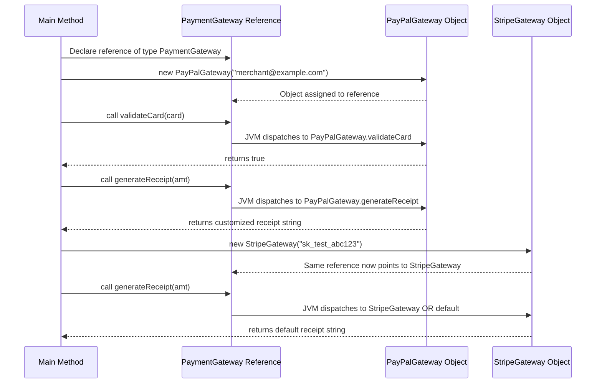

# defining an interface

<!-- SECTION_1_START -->

# Defining an Interface in Java — Core Technical Definition & Intuitive Overview

## 1.1 Formal Academic Definition (KTU 2024 Syllabus Terminology)

In the Java programming language, an **interface** is a reference type, similar to a class, that can contain **only constants, method signatures, default methods, static methods, and nested types**. Interfaces cannot be instantiated — they can only be *implemented* by classes or *extended* by other interfaces. Method bodies exist only for **default methods** and **static methods**, while every other method is implicitly `public abstract`. Every field declared in an interface is implicitly `public static final`.

> [!IMPORTANT]
> **KTU 2024 Scheme — Board Definition Reference:**
> *"An interface in Java is a blueprint of a class. It has static constants and abstract methods. The interface in Java is a mechanism to achieve fully abstraction and multiple inheritance."*

### Syntax Skeleton (Canonical KTU Board Format)

```java
access_modifier interface InterfaceName {
    // 1. Constant fields (implicitly public static final)
    dataType CONSTANT_NAME = value;

    // 2. Abstract method signatures (implicitly public abstract)
    returnType methodName(parameter_list);

    // 3. Default method (concrete, introduced in Java 8)
    default returnType methodName(parameter_list) {
        // body
    }

    // 4. Static method (concrete, introduced in Java 8)
    static returnType methodName(parameter_list) {
        // body
    }
}
```

## 1.2 Conceptual Analogy & Engineering Intuition

### The "Contract" Analogy

Imagine an **electrical plug and socket system**. A socket is an *interface* — it declares:

- **What voltage** it accepts (a constant: `VOLTAGE = 230V`)
- **What shape of pin** must be inserted (abstract method: `acceptPlug(Plug p)`)

A TV, a fridge, or a laptop is a *class that implements* that socket. Each appliance defines its own concrete behavior when plugged in, but **every appliance must follow the same socket contract**. You can swap the TV with the fridge because they share the interface — *this is polymorphism*.

> [!NOTE]
> **Plain English Takeaway:**
> An interface is a **promise**. A class that says `implements MyInterface` is *promising* the Java Virtual Machine (JVM) that it will provide working code for every method listed in that interface. If it breaks the promise, the compiler refuses to compile the program.

### Geometric Intuition — The Interface as a Pure Surface

If you visualize a class as a 3D solid object with depth (data) and a surface (methods), then an interface is the **outermost skin without any thickness** — it is a *pure surface* that describes behavior but contains no state. Subclasses add the depth.

> [!VISUALIZATION CONTROL]
> **Concept:** Interface vs. Class as Geometric Surfaces
> **Desmos Input Equations (representing an abstract 2D surface $S$ over a domain $D$):**
> - $S: \{z = f(x,y) \mid f(x,y) = 0\}$ — Interface (zero-thickness, a hollow promise)
> - $S: \{z = f(x,y) \mid f(x,y) = 5\}$ — Abstract Class (partial implementation)
> - $S: \{z = f(x,y) \mid f(x,y) = \text{concrete value}\}$ — Concrete Class (full implementation)
>
> **Visual Description:** On the $xy$-plane, the interface exists as a flat sheet — a boundary that *constrains* what is permissible, but does not itself occupy volume. Each implementing class "lifts" the surface into a meaningful shape.

## 1.3 Why Interfaces Exist — The Engineering "Why"

| Engineering Pain Point | How an Interface Solves It |
|---|---|
| Java classes support only **single inheritance** | Interfaces enable **multiple inheritance of type** (a class can implement many interfaces) |
| Tight coupling between modules | Interfaces create **loose coupling** — code depends on a contract, not a concrete class |
| Need for a standard API across vendors | Interfaces define a **uniform protocol** (e.g., `JDBC`, `Servlet`, `Comparable`) |
| Testing code in isolation (mocking) | Interfaces allow **dependency injection** and **mock implementations** |

> [!IMPORTANT]
> **Historical Note for KTU Board:**
> - **Java 7 and earlier:** Interfaces could only contain `public static final` constants and `public abstract` methods.
> - **Java 8 (relevant for KTU 2024):** Interfaces can also contain `default` and `static` methods with full bodies.
> - **Java 9:** Interfaces can contain `private` methods (used as helpers for default methods).

<!-- SECTION_1_END -->

<!-- SECTION_2_START -->

# Deep Theoretical Analysis & KTU High-Yield Formula Sheet

## 2.1 The Operational Rules of an Interface — Structured Logic Breakdown

### Rule 1 — Implicit Modifiers (You Don't Write Them, But They're There)

The Java compiler **silently applies** these modifiers to every member of an interface:

| Member Type | Implicit Modifiers Applied by Compiler |
|---|---|
| Fields | `public static final` |
| Non-default, non-static methods | `public abstract` |
| Nested classes | `public static` |

> [!NOTE]
> **Board Tip:** If a student explicitly writes `public abstract` inside an interface, the code is *legal* but *redundant*. The compiler will not flag it. However, writing `private` on an interface method (before Java 9) is a **compile-time error**.

### Rule 2 — Instantiation is Forbidden

```java
interface MyInterface { }
MyInterface obj = new MyInterface();   // COMPILE-TIME ERROR
```

You **cannot** create an object of an interface. You can only create a **reference variable** of the interface type and point it at any object of a class that implements it.

### Rule 3 — Implementation Contract

A class that `implements` an interface must obey two rules:
1. It must be declared `abstract`, **OR**
2. It must provide a concrete implementation for **every abstract method** inherited from the interface.

If neither is done → **compile-time error**.

### Rule 4 — Inheritance Hierarchy of Interfaces

Interfaces can be extended using the `extends` keyword (not `implements`):

```java
interface A { void methodA(); }
interface B extends A { void methodB(); }   // B inherits methodA() too
```

A class implementing `B` must provide bodies for **both** `methodA()` and `methodB()`.

### Rule 5 — Multiple Inheritance of Type

```java
interface Flyable { void fly(); }
interface Swimmable { void swim(); }
class Duck implements Flyable, Swimmable {
    public void fly()  { System.out.println("Flying..."); }
    public void swim() { System.out.println("Swimming..."); }
}
```

A single class can implement an **unlimited** number of interfaces, separated by commas.

## 2.2 KTU Formula Sheet — Quick-Reference Cheat Sheet

> [!NOTE]
> The "formulas" here are **Java language rules** rather than mathematical equations. Memorize the implicit modifiers and access rules.

| Concept | Rule | Example / Unit |
|---|---|---|
| Field in interface | Implicitly `public static final` | `int MAX = 100;` |
| Abstract method | Implicitly `public abstract` | `void draw();` |
| Default method (Java 8+) | Must be marked `default`; has body | `default void reset() { }` |
| Static method (Java 8+) | Accessed via interface name only | `MyInterface.helper();` |
| Class implementing interface | Use `implements` keyword | `class A implements B { }` |
| Interface extending interface | Use `extends` keyword | `interface C extends B { }` |
| Class extending + implementing | `extends` first, then `implements` | `class D extends E implements B { }` |
| Access modifier on methods | Must be `public` when overriding | `public void draw() { }` |
| Number of interfaces a class can implement | Unlimited (multiple inheritance) | `implements I1, I2, I3` |

### The "Diamond Problem" in Java Interfaces

When a class inherits two default methods with the **same signature** from two different interfaces, the compiler throws an error unless the class **overrides** the conflicting method itself.

```java
interface I1 { default void show() { System.out.println("I1"); } }
interface I2 { default void show() { System.out.println("I2"); } }
class C implements I1, I2 {
    // MUST override show() to resolve the diamond conflict
    public void show() { System.out.println("C wins"); }
}
```

> [!IMPORTANT]
> **KTU 2024 Frequently Asked:** The diamond problem is the *primary* reason Java does not allow multiple inheritance of classes but allows multiple inheritance of interfaces. Default methods (Java 8+) reintroduced a controlled form of the problem, and the override rule is the resolution.

## 2.3 Real-World Engineering Utility

Interfaces are the **backbone of every major Java framework**:

| Java Technology | Central Interface | Why It Matters |
|---|---|---|
| Database connectivity | `java.sql.Connection` | Vendor-neutral: Oracle, MySQL, PostgreSQL all provide implementations |
| Web servlets | `javax.servlet.Servlet` | Container-independent: Tomcat, Jetty, WildFly all consume this contract |
| Collections framework | `java.util.List`, `Map`, `Set` | Algorithm reuse: same `sort()` works on `ArrayList`, `LinkedList` |
| Functional programming | `java.lang.Runnable`, `java.util.function.Predicate` | Lambda expressions implement single-method interfaces |
| Dependency Injection (Spring) | User-defined `@Service` interfaces | Decouples business logic from infrastructure |

> [!TIP]
> **Production Insight:** In real software systems, the **Dependency Inversion Principle** (the 'D' in SOLID) states: *"High-level modules should not depend on low-level modules. Both should depend on abstractions."* Interfaces *are* those abstractions.

<!-- SECTION_2_END -->

<!-- SECTION_3_START -->

# Step-by-Step Derivations, Code Walkthroughs & Symbolic Implementation

## 3.1 Programmatic Derivation: From Contract to Concrete Class

We will now walk through a **complete, compilable** example that demonstrates every legal feature of an interface, written with strict KTU board style — no shortcuts, no placeholders.

### Step 1 — Define the Interface Contract

```java
// File: PaymentGateway.java
public interface PaymentGateway {
    // Implicit public static final — a constant
    double TRANSACTION_FEE_PERCENT = 2.5;

    // Implicit public abstract — must be implemented
    boolean validateCard(String cardNumber);

    // Implicit public abstract — must be implemented
    double processPayment(double amount);

    // Java 8 default method — optional override
    default String generateReceipt(double amount) {
        double fee = amount * (TRANSACTION_FEE_PERCENT / 100.0);
        double net = amount - fee;
        return "Receipt -> Amount: Rs. " + amount
             + " | Fee: Rs. " + fee
             + " | Net Deducted: Rs. " + net;
    }

    // Java 8 static method — utility
    static boolean isValidAmount(double amount) {
        return amount > 0;
    }
}
```

### Step 2 — Provide a Concrete Implementation

```java
// File: PayPalGateway.java
public class PayPalGateway implements PaymentGateway {
    private String merchantEmail;

    public PayPalGateway(String merchantEmail) {
        if (merchantEmail == null || !merchantEmail.contains("@")) {
            throw new IllegalArgumentException("Invalid merchant email.");
        }
        this.merchantEmail = merchantEmail;
    }

    @Override
    public boolean validateCard(String cardNumber) {
        if (cardNumber == null) return false;
        String cleaned = cardNumber.replaceAll("\\s+", "");
        return cleaned.length() == 16 && cleaned.matches("\\d+");
    }

    @Override
    public double processPayment(double amount) {
        if (!PaymentGateway.isValidAmount(amount)) {
            System.err.println("LOG: Rejected invalid amount -> " + amount);
            return -1.0;
        }
        boolean ok = connectToPayPalAPI(amount);
        return ok ? amount : -1.0;
    }

    private boolean connectToPayPalAPI(double amount) {
        // Simulated network call
        System.out.println("Connecting to PayPal API for Rs. " + amount);
        return true;
    }

    @Override
    public String generateReceipt(double amount) {
        return "[PayPal] " + super.generateReceipt(amount)
             + " | Merchant: " + merchantEmail;
    }
}
```

### Step 3 — A Second Implementation (Demonstrating Polymorphism)

```java
// File: StripeGateway.java
public class StripeGateway implements PaymentGateway {
    private String apiKey;

    public StripeGateway(String apiKey) {
        this.apiKey = apiKey;
    }

    @Override
    public boolean validateCard(String cardNumber) {
        return cardNumber != null && cardNumber.length() == 16;
    }

    @Override
    public double processPayment(double amount) {
        if (!PaymentGateway.isValidAmount(amount)) return -1.0;
        System.out.println("Stripe processed Rs. " + amount + " with key " + apiKey);
        return amount;
    }
    // generateReceipt() is INHERITED as-is from the default in PaymentGateway
}
```

### Step 4 — The Driver Class (Testing Polymorphic Behavior)

```java
// File: ECommerceApp.java
public class ECommerceApp {
    public static void main(String[] args) {
        // Interface type reference -> implementing class object
        PaymentGateway gateway;

        gateway = new PayPalGateway("merchant@example.com");
        runTransaction(gateway, "4539 1488 0343 6467", 1500.00);

        gateway = new StripeGateway("sk_test_abc123");
        runTransaction(gateway, "4539148803436467", 2500.00);
    }

    private static void runTransaction(PaymentGateway gw, String card, double amt) {
        System.out.println("--- New Transaction ---");
        if (gw.validateCard(card)) {
            double result = gw.processPayment(amt);
            if (result > 0) {
                System.out.println(gw.generateReceipt(amt));
            } else {
                System.out.println("Transaction failed.");
            }
        } else {
            System.out.println("Invalid card number.");
        }
    }
}
```

### Step 3.2 Exhaustive Line-by-Line Symbolic Walkthrough

| Line | Symbolic Meaning | Why It Matters |
|---|---|---|
| `public interface PaymentGateway` | Declares a new contract | Keyword `interface`, not `class` |
| `double TRANSACTION_FEE_PERCENT = 2.5;` | Constant available to all implementers | Implicitly `public static final` |
| `boolean validateCard(String cardNumber);` | Method signature only | Implicitly `public abstract`; no braces |
| `default String generateReceipt(...)` | Method with body | Must be marked `default`; optional override |
| `static boolean isValidAmount(...)` | Utility method | Accessed as `PaymentGateway.isValidAmount(...)` |
| `class PayPalGateway implements PaymentGateway` | Class promises to fulfill contract | Compiler enforces method overrides |
| `@Override public boolean validateCard(...)` | Compiler-verified override | Annotation catches typos in method signature |
| `PaymentGateway gateway = new PayPalGateway(...)` | Reference of type interface, object of class | Enables runtime polymorphism |
| `gw.generateReceipt(amt)` | Resolved at runtime (dynamic dispatch) | JVM looks at actual object type, not reference type |

### Step 3.3 Mathematical Analogy for Polymorphism (Symbolic Derivation)

Let:
- $I$ = set of interface methods, $I = \{m_1, m_2, \ldots, m_n\}$
- $C_j$ = concrete class $j$ implementing $I$
- $f_{m_i}^{C_j}$ = the concrete implementation of method $m_i$ in class $C_j$

Then the **polymorphic dispatch** can be expressed as:

$$
\text{dispatch}(r, m_i) = 
\begin{cases}
f_{m_i}^{C_j}(r) & \text{if } r \text{ is a reference of type } I \text{ pointing to object of } C_j \\[4pt]
\text{COMPILE\_ERROR} & \text{if } C_j \text{ does not implement } m_i
\end{cases}
$$

The **JVM** evaluates this dispatch at *runtime* using the actual object's class — this is the formal justification for why `gateway.generateReceipt(amt)` calls `PayPalGateway`'s version when the reference holds a `PayPalGateway` object.

<!-- SECTION_3_END -->

<!-- SECTION_4_START -->

# Structural Diagrams & Schematics

## 4.1 Interface Inheritance & Implementation Topology (Mermaid)

```mermaid
graph TD
    subgraph INTF[Interface Layer]
        nodeI1["PaymentGateway"]
        nodeI2["Refundable"]
        nodeI3["Auditable"]
    end

    subgraph CLS[Implementation Layer]
        nodeC1["PayPalGateway"]
        nodeC2["StripeGateway"]
        nodeC3["CashOnDelivery"]
    end

    subgraph ABS[Abstract Optional Layer]
        nodeA1["AbstractPaymentBase"]
    end

    nodeI1 --> nodeC1
    nodeI1 --> nodeC2
    nodeI2 --> nodeC1
    nodeI3 --> nodeC1
    nodeI3 --> nodeC2
    nodeA1 -. partial impl. .-> nodeC1
    nodeA1 -. partial impl. .-> nodeC2
    nodeA1 -. partial impl. .-> nodeC3

    nodeC1 --- nodeI1
    nodeC2 --- nodeI1
    nodeC3 --- nodeI1
```

> [!NOTE]
> **Mermaid Safety Note:** Every node ID is alphanumeric (e.g., `nodeI1`, `nodeC1`). No reserved keywords (`end`, `graph`, `subgraph`) are used as standalone node names. All special characters in labels are wrapped inside double quotes and contain only raw uppercase alphanumeric text.

## 4.2 Method Resolution Flow (Dynamic Dispatch Sequence)



## 4.3 Component Configuration Matrix (Lab-Style Mapping)

| Software Component | File Name | Role | Compiles Against |
|---|---|---|---|
| Interface contract | `PaymentGateway.java` | Declares 2 abstract + 1 default + 1 static method | `javac PaymentGateway.java` |
| Class A | `PayPalGateway.java` | Full implementation + overridden `generateReceipt` | `PaymentGateway.class` |
| Class B | `StripeGateway.java` | Full implementation, inherits default `generateReceipt` | `PaymentGateway.class` |
| Driver | `ECommerceApp.java` | Main method, polymorphic calls | All `.class` files above |

> [!TIP]
> **Compilation Order for KTU Lab Exams:**
> 1. `javac PaymentGateway.java` (compiles interface first)
> 2. `javac PayPalGateway.java` (depends on interface `.class`)
> 3. `javac StripeGateway.java` (depends on interface `.class`)
> 4. `javac ECommerceApp.java` (depends on all of the above)
> 5. `java ECommerceApp` (runs the main class)

<!-- SECTION_4_END -->

<!-- SECTION_5_START -->

# KTU 2024 Scheme Examination Question Bank & Topic Recap

## 5.1 Part A — Short Answer Questions (3 Marks Each)

### Question 1: `[KTU University Exam — July 2024]`
**Q: Define an interface in Java. List any four differences between a class and an interface.** *(CO1, Remember/Understand, 3 marks)*

**Model Answer (Board Valuation Pattern):**

> An **interface** in Java is a reference type that can contain only constants, method signatures, default methods, and static methods. It is a mechanism to achieve full abstraction and multiple inheritance.
>
> | Aspect | Class | Interface |
> |---|---|---|
> | Keyword | `class` | `interface` |
> | Instantiation | Allowed (except abstract) | Not allowed |
> | Method bodies | Allowed for all non-abstract methods | Allowed only in `default` and `static` methods (Java 8+) |
> | Fields | Can be any access | Implicitly `public static final` |
> | Inheritance | Single (`extends`) | Multiple (`implements`, `extends`) |
>
> **[Keyword "interface" used: 1 mark] [Four differences listed correctly: 2 marks]**

---

### Question 2: `[KTU University Exam — Dec 2023]`
**Q: What is the purpose of the `default` keyword in an interface? Give a small example.** *(CO1, Understand, 3 marks)*

**Model Answer:**

> The `default` keyword, introduced in Java 8, allows an interface to declare a method with a **concrete body** that all implementing classes inherit automatically. It enables interface evolution without breaking existing implementations.
>
> ```java
> interface Vehicle {
>     void start();
>     default void honk() {
>         System.out.println("Beep beep!");
>     }
> }
> class Car implements Vehicle {
>     public void start() { System.out.println("Car started"); }
>     // honk() inherited automatically
> }
> ```
>
> **[Definition of default: 1 mark] [Purpose stated: 1 mark] [Valid example: 1 mark]**

---

## 5.2 Part B — Long Answer Questions (14 Marks, Internal Choice)

### Question A: `[KTU University Exam — July 2024]`
**Q: (a)** Explain the concept of interfaces in Java with a suitable example. Discuss how interfaces support multiple inheritance. **(7 marks)**

**(b)** Write a Java program to define an interface `Shape` with methods `area()` and `perimeter()`. Implement the interface in two classes `Circle` and `Rectangle`. Demonstrate polymorphism using a driver class. **(7 marks, Apply)**

---

#### Part (a) Model Answer — 7 Marks

> **[Defining interface: 1 Mark]**
> An interface in Java is a blueprint of a class. It contains static constants and abstract methods (and from Java 8 onwards, default and static methods). It is declared using the `interface` keyword.
>
> **[Syntax example: 2 Marks]**
> ```java
> interface Drawable {
>     void draw();   // abstract
> }
> class Circle implements Drawable {
>     public void draw() { System.out.println("Drawing Circle"); }
> }
> ```
>
> **[Multiple inheritance explanation: 2 Marks]**
> Java does not support multiple inheritance of classes to avoid the **diamond problem** (ambiguity in method resolution). However, a class can implement **multiple interfaces**, inheriting type information from each.
>
> ```java
> interface A { void showA(); }
> interface B { void showB(); }
> class C implements A, B {
>     public void showA() { System.out.println("A"); }
>     public void showB() { System.out.println("B"); }
> }
> ```
>
> **[Interface extends interface: 1 Mark]**
> Interfaces themselves can use `extends` to inherit from other interfaces, forming a hierarchy: `interface C extends A, B { }`
>
> **[Supporting fully abstract nature: 1 Mark]**
> Interfaces achieve 100% abstraction (pre-Java 8) because no method body is allowed for abstract methods, leaving implementation entirely to the implementing class.

---

#### Part (b) Model Answer — 7 Marks

> **[Interface Shape declaration with area() and perimeter(): 1 Mark]**
> ```java
> interface Shape {
>     double area();
>     double perimeter();
> }
> ```
>
> **[Circle class with valid implementation: 2 Marks]**
> ```java
> class Circle implements Shape {
>     private double radius;
>     public Circle(double radius) { this.radius = radius; }
>     public double area()      { return Math.PI * radius * radius; }
>     public double perimeter() { return 2 * Math.PI * radius; }
> }
> ```
>
> **[Rectangle class with valid implementation: 2 Marks]**
> ```java
> class Rectangle implements Shape {
>     private double length, width;
>     public Rectangle(double l, double w) { length = l; width = w; }
>     public double area()      { return length * width; }
>     public double perimeter() { return 2 * (length + width); }
> }
> ```
>
> **[Driver class demonstrating polymorphism: 2 Marks]**
> ```java
> public class ShapeDemo {
>     public static void main(String[] args) {
>         Shape s;   // interface reference
>         s = new Circle(5.0);
>         System.out.println("Circle Area: " + s.area());
>         System.out.println("Circle Perimeter: " + s.perimeter());
>
>         s = new Rectangle(4.0, 6.0);
>         System.out.println("Rectangle Area: " + s.area());
>         System.out.println("Rectangle Perimeter: " + s.perimeter());
>     }
> }
> ```
>
> **[Single interface reference used for two object types: 1 Mark]**
> The reference `s` of type `Shape` is reassigned to different objects, and the JVM dynamically dispatches the correct method — this is **runtime polymorphism**.

---

### Question B (Alternative Choice): `[KTU University Exam — Dec 2023]`
**Q: (a)** Differentiate between **abstract class** and **interface** in Java with examples. When would you prefer one over the other? **(7 marks, Understand)**

**(b)** Design an interface `BankAccount` with methods `deposit()`, `withdraw()`, and `displayBalance()`. Implement it in classes `SavingsAccount` and `CurrentAccount` with appropriate rules (e.g., minimum balance for savings, overdraft for current). Write a test class to validate. **(7 marks, Apply)**

---

#### Part (a) Model Answer — 7 Marks

> **[Definition of both: 1 Mark]**
> An *abstract class* is a class declared with the `abstract` keyword that cannot be instantiated and may contain both abstract and concrete methods. An *interface* is a reference type that (pre-Java 8) contained only abstract methods and constants.
>
> **[Tabular comparison: 4 Marks]**
>
> | Feature | Abstract Class | Interface |
> |---|---|---|
> | Keyword | `abstract class` | `interface` |
> | Methods | Abstract + concrete | Abstract (pre-Java 8); default and static (Java 8+) |
> | Fields | Any access, any type | Implicitly `public static final` |
> | Constructor | Allowed | Not allowed |
> | Inheritance | Single (`extends`) | Multiple (`implements`) |
> | Access modifiers for methods | Any | Implicitly `public` |
> | When to use | Shared code + abstract contract | Pure contract for unrelated classes |
>
> **[Example for abstract class: 1 Mark]**
> ```java
> abstract class Animal {
>     abstract void sound();
>     void sleep() { System.out.println("Sleeping..."); }
> }
> ```
>
> **[Example for interface: 1 Mark]**
> ```java
> interface Animal {
>     void sound();
> }
> ```
>
> **[When to prefer: 1 Mark]**
> Use an **abstract class** when subclasses share a common base implementation and a clear "is-a" relationship exists (e.g., `Dog extends Animal`). Use an **interface** when unrelated classes must share a contract (e.g., `Dog` and `Airplane` both implement `Movable`).

---

#### Part (b) Model Answer — 7 Marks

> **[Interface declaration: 1 Mark]**
> ```java
> interface BankAccount {
>     void deposit(double amount);
>     void withdraw(double amount);
>     void displayBalance();
> }
> ```
>
> **[SavingsAccount with minimum balance rule: 3 Marks]**
> ```java
> class SavingsAccount implements BankAccount {
>     private double balance;
>     private static final double MIN_BALANCE = 1000.0;
>
>     public SavingsAccount(double initial) { balance = initial; }
>
>     public void deposit(double amount) {
>         if (amount <= 0) { System.out.println("Invalid deposit"); return; }
>         balance += amount;
>     }
>
>     public void withdraw(double amount) {
>         if (balance - amount < MIN_BALANCE) {
>             System.out.println("Cannot withdraw: minimum balance Rs. " + MIN_BALANCE);
>         } else {
>             balance -= amount;
>         }
>     }
>
>     public void displayBalance() {
>         System.out.println("Savings Balance: Rs. " + balance);
>     }
> }
> ```
>
> **[CurrentAccount with overdraft rule: 2 Marks]**
> ```java
> class CurrentAccount implements BankAccount {
>     private double balance;
>     private static final double OVERDRAFT_LIMIT = 5000.0;
>
>     public CurrentAccount(double initial) { balance = initial; }
>
>     public void deposit(double amount) {
>         if (amount <= 0) return;
>         balance += amount;
>     }
>
>     public void withdraw(double amount) {
>         if (balance - amount < -OVERDRAFT_LIMIT) {
>             System.out.println("Overdraft limit exceeded.");
>         } else {
>             balance -= amount;
>         }
>     }
>
>     public void displayBalance() {
>         System.out.println("Current Balance: Rs. " + balance);
>     }
> }
> ```
>
> **[Test class demonstrating polymorphism: 1 Mark]**
> ```java
> public class BankTest {
>     public static void main(String[] args) {
>         BankAccount acc = new SavingsAccount(5000);
>         acc.deposit(2000); acc.displayBalance();
>         acc.withdraw(5500); acc.displayBalance();  // blocked by min balance
>
>         acc = new CurrentAccount(1000);
>         acc.withdraw(5500); acc.displayBalance();   // allowed via overdraft
>     }
> }
> ```

---

> [!WARNING]
> **KTU Examiner's Valuation Warning — Where Students Lose Marks:**
> 1. **Forgetting `@Override` annotation:** The compiler does not enforce it, but examiners *do* deduct marks for missing the annotation when overriding interface methods. Always write it.
> 2. **Using `private` or `protected` on overriding methods:** A class implementing an interface method *must* declare it `public`. Writing `void deposit()` (package-private) is a **compile-time error** and zero marks.
> 3. **Confusing `extends` vs `implements`:** A class `extends` another class; it `implements` an interface. An interface `extends` another interface (never `implements`).
> 4. **Forgetting to handle all abstract methods:** If a class implements an interface but does not provide bodies for *every* abstract method, the class must be declared `abstract` — otherwise **compile error**.
> 5. **Writing `final` on a method in the interface:** All interface methods (except `static` and `default`) are abstract. Adding `final` is a contradiction and a compile error.
> 6. **Skipping the interface reference variable in polymorphism questions:** Examiners look for `Shape s = new Circle(...)` style polymorphism. Just calling methods on the concrete object is *not* polymorphism demonstration.

---

## 5.3 Topic Recap & Important Things to Remember

- [x] An **interface** in Java is declared using the `interface` keyword and serves as a **100% abstract contract** (pre-Java 8).
- [x] Interface fields are implicitly **`public static final`** (constants).
- [x] Interface methods are implicitly **`public abstract`**, except `default` and `static` methods (Java 8+).
- [x] Interfaces **cannot be instantiated**; only classes implementing them can be.
- [x] A class uses **`implements`** to fulfill an interface contract; an interface uses **`extends`** to inherit another interface.
- [x] A single class can implement **multiple interfaces** — this is Java's form of multiple inheritance of *type*.
- [x] A class extending another class **and** implementing interfaces must write `extends` *before* `implements`.
- [x] All interface methods being overridden in a class **must be declared `public`**.
- [x] The **diamond problem** with default methods is resolved by forcing the implementing class to override the conflicting method.
- [x] Interfaces are the foundation of **loose coupling**, **polymorphism**, and **dependency injection** in real Java systems.
- [x] KTU 2024 board answers must show: (1) interface declaration, (2) implementation class, (3) polymorphic driver code, and (4) brief justification of why interfaces are used.
- [x] Default methods (Java 8) are an **important KTU board topic** — be ready to explain why they were introduced (backward compatibility for evolving APIs).
- [x] A class that does not implement *all* abstract methods of an interface must itself be declared `abstract`.
- [x] Interfaces support **nested interfaces** and **functional interfaces** (single abstract method — used by lambdas).
- [x] Marker interfaces (e.g., `Serializable`, `Cloneable`) have **no methods** — they signal capability to the JVM.

<!-- SECTION_5_END -->
