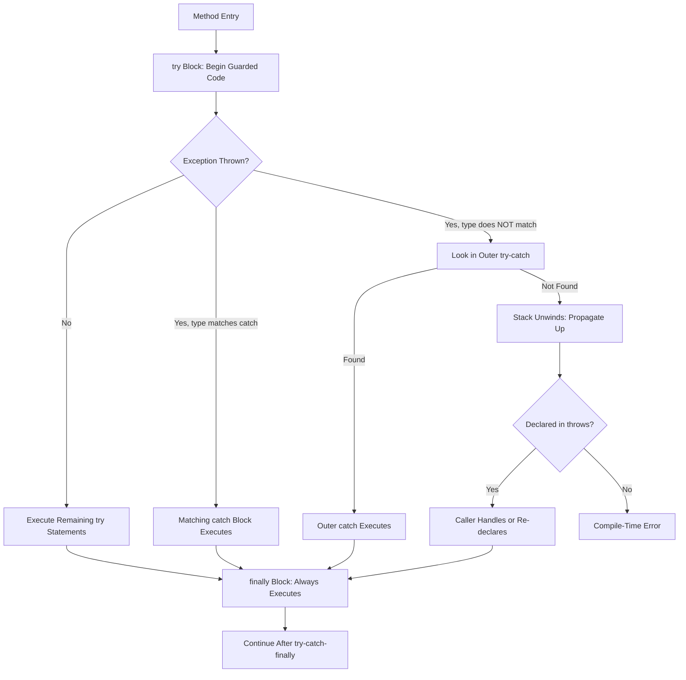
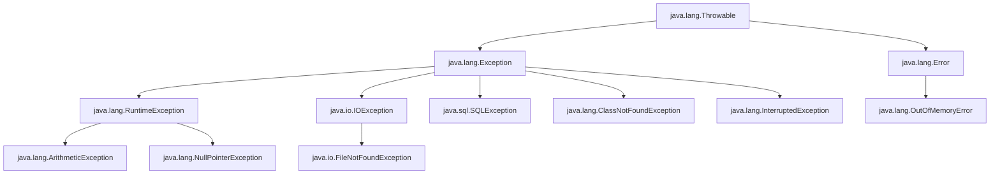
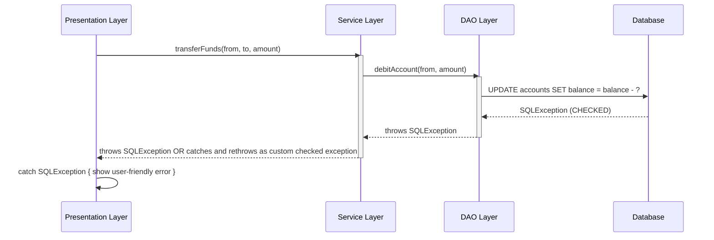
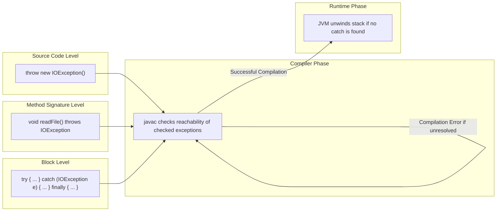

# Exception Handling  - Checked Exceptions

<!-- SECTION_1_START -->
# Exception Handling — Checked Exceptions

> [!IMPORTANT]
> **KTU 2024 Scheme | OECST615 | Module 3**  
> **Topic:** Checked Exceptions under the umbrella of Java's robust *Exception Handling* mechanism. This forms a high-weight, high-frequency area in KTU university exams, typically fetching 7–14 marks per question paper.

## 1.1 Formal Academic Definition

In the Java language specification (JLS §11.1.1), an **Exception** is defined as an abnormal event that disrupts the normal flow of a program's instructions during runtime. The Java API architects have broadly bifurcated all `Throwable` subclasses into two principal categories:

- **Checked Exceptions** — *Compile-time enforced* anomalies that the Java compiler *mandates* be either **caught** (using `try-catch-finally`) or **declared** (using the `throws` clause) in the method signature. They represent recoverable, external conditions outside the programmer's direct control (e.g., a file being absent, a network dropping, a database refusing a connection).
- **Unchecked Exceptions** — *Runtime anomalies* (subclasses of `RuntimeException` and `Error`) that the compiler does *not* require to be declared or caught.

> [!NOTE]
> **KTU Syllabus Highlight:** The defining pedagogical contrast that examiners test is: *"Checked exceptions are verified at **compile time** by `javac`, whereas unchecked exceptions are verified at **runtime** by the JVM."*

## 1.2 Conceptual Analogy — The Air-Traffic Control Tower

Imagine you are an airline pilot preparing for takeoff. Before you are permitted to even start the engines, the Air-Traffic Control (ATC) tower performs a strict **pre-flight checklist** (this is the **Java Compiler**). The tower will *not* allow you to leave the gate unless you have:

1. **Acknowledged the potential risks** (declared exceptions via `throws`), **OR**
2. **Shown you have a contingency plan** (handled them via `try-catch`).

Now consider two kinds of risks:

- **Weather-related risks** like a sudden thunderstorm or a runway blockage — these are **Checked Exceptions**. They are *predictable* and *externally induced*. You must file a flight plan, declare alternative routes, or carry de-icing equipment — all *before* the plane moves.
- **Pilot-induced risks** like accidentally pushing the wrong button or a cabin door being left open — these are **Unchecked Exceptions** (`RuntimeException`). The ATC tower doesn't pre-screen them; they only become apparent mid-flight.

The **Checked Exception** is, therefore, the "weather forecast" — known, anticipated, and *requiring paperwork* (compile-time code) to address.

## 1.3 The Throwable Class Hierarchy

The entire Java exception framework is rooted in `java.lang.Throwable`. The following tree captures only the most-asked KTU-relevant classes:

$$
\begin{aligned}
\text{java.lang.Throwable} \\
\;\;\downarrow \\
\text{java.lang.Error} \quad\quad\quad\quad\quad \text{java.lang.Exception} \\
\;\;\downarrow \quad\quad\quad\quad\quad\quad\quad\quad\quad\quad\;\;\downarrow \\
\text{OutOfMemoryError} \quad\quad \text{RuntimeException} \quad \quad \text{IOException} \\
\text{StackOverflowError} \quad\quad \text{ArithmeticException} \quad \text{SQLException} \\
\quad\quad\quad\quad\quad\quad\quad\quad\quad\quad\text{NullPointerException} \quad \text{ClassNotFoundException} \\
\quad\quad\quad\quad\quad\quad\quad\quad\quad\quad\text{ArrayIndexOutOfBounds} \quad \text{InterruptedException} \\
\quad\quad\quad\quad\quad\quad\quad\quad\quad\quad\text{NumberFormatException} \quad \text{ParseException}
\end{aligned}
$$

> [!IMPORTANT]
> **The Cardinal Rule for KTU:** *All* subclasses of `Exception` **EXCEPT** `RuntimeException` (and its subclasses) are **checked**. The line of demarcation is drawn exactly at `java.lang.RuntimeException`.

## 1.4 What Exactly Counts as a "Checked Exception"?

According to JLS §11.1.1, the checked exception class set is the set of all *checked exception classes*, defined operationally as:

> *"All exception classes that are subclasses of `Throwable` but are not subclasses of `RuntimeException` are checked exceptions."*

The most frequently tested checked exception classes in KTU question papers are:

| Class | Typical Triggering Condition | Package |
| :--- | :--- | :--- |
| `java.io.IOException` | I/O failure (file, network, stream) | `java.io` |
| `java.io.FileNotFoundException` | File path does not resolve | `java.io` |
| `java.sql.SQLException` | DB access error / SQL syntax | `java.sql` |
| `java.lang.ClassNotFoundException` | Class loader cannot locate a class | `java.lang` |
| `java.lang.CloneNotSupportedException` | Object doesn't implement `Cloneable` | `java.lang` |
| `java.lang.InterruptedException` | Thread interrupted while waiting/sleeping | `java.lang` |
| `java.text.ParseException` | Text parsing fails (e.g., date format) | `java.text` |
| `java.net.MalformedURLException` | Invalid URL syntax | `java.net` |

> [!VISUALIZATION CONTROL]
> **Concept:** Memory layout of the `Throwable` hierarchy as a tree of class nodes
> **GeoGebra / Desmos Input Equations (as points):**
> * `P_Throwable = (0, 5)`
> * `P_Error = (-3, 3.5)`, `P_Exception = (3, 3.5)`
> * `P_RuntimeException = (1.5, 2)`, `P_IOException = (4.5, 2)`
> * `P_ArithmeticException = (0.5, 0.5)`, `P_FileNotFoundException = (4, 0.5)`, `P_ClassNotFoundException = (5.5, 0.5)`
> **Visual Description:** The student should observe a *rooted tree* where `Throwable` sits at the top, with the right branch (`Exception`) being the clinically relevant one. The leftmost child of `Exception` is `RuntimeException` (the unchecked boundary), and *all* other children of `Exception` lie on the *checked* side of the demarcation line.
<!-- SECTION_1_END -->

<!-- SECTION_2_START -->
# Deep Theoretical Analysis & KTU High-Yield Formula Sheet

## 2.1 The Compiler's "Checked" Verification Algorithm

When `javac` compiles a method, it executes a deterministic, three-step audit. You may describe this as the **CDA Algorithm (Checked Declaration Audit)** in your exam answers to score easy marks:

**Step 1 — Method Body Scanning:**  
The compiler walks the abstract syntax tree (AST) of the method. For every *invocation expression* (e.g., `new FileInputStream("a.txt")` or `Thread.sleep(1000)`), it looks up the method signature in the symbol table and inspects the method's `throws` clause.

**Step 2 — Reachability Graph Construction:**  
A directed reachability graph is built. If method `m1()` calls `m2()`, and `m2()` is declared as `throws IOException`, then the reachability graph contains the edge $m_1 \rightarrow m_2 \rightarrow \text{IOException}$. The compiler then *propagates* `IOException` upward.

**Step 3 — Resolution Requirement:**  
For every checked exception type $E$ that is *reachable* from the method body:
- Either there must exist a `try-catch` block where $E$ (or a superclass of $E$) is caught, **OR**
- The method's own `throws` clause must declare $E$ (or a superclass of $E$).

If neither condition is satisfied, the compiler emits the diagnostic: `unreported exception X; must be caught or declared to be thrown`.

> [!NOTE]
> **Why this matters in KTU exams:** When a question asks *"Why does the compiler force you to handle `IOException`?"*, this three-step audit is the precise, full-mark answer.

## 2.2 The Five Keywords of Java Exception Handling

Java exposes exactly **five** reserved keywords for exception control. Memorizing their distinct roles is essential:

| Keyword | Scope of Influence | Primary Purpose |
| :--- | :--- | :--- |
| `try` | Block-level | Encloses the *guarded* code region where an exception may be thrown |
| `catch` | Block-level | Defines the *handler* matched against a specific exception type |
| `finally` | Block-level | Defines code that executes *unconditionally* after `try`/`catch` |
| `throw` | Statement-level | Explicitly *raises* an exception instance from within a method |
| `throws` | Method-signature level | *Declares* that a method may propagate one or more exception types |

> [!IMPORTANT]
> **Distinguish `throw` vs `throws`:** `throw` is an *action* (followed by an object: `throw new IOException();`), while `throws` is a *declaration* (followed by a type: `void read() throws IOException`).

## 2.3 Propagation Mechanics — The "Bubble-Up" Model

When an exception is thrown and not caught within the current method, the JVM unwinds the *call stack* frame by frame, searching for the nearest enclosing `catch` clause that can handle the exception type (using the *is-a* relationship). This is the **exception propagation** model.

Mathematically, let $C$ be the call chain:

$$
C = \langle M_1, M_2, M_3, \dots, M_n \rangle
$$

Let $E$ be thrown in $M_n$. The JVM searches upward:

$$
\text{handler}(E) = \min \{ i \mid M_i \text{ contains a } \texttt{catch}(E) \text{ or a supertype of } E \}
$$

If no $i$ exists, $E$ propagates to the JVM's default uncaught-exception handler, which prints the stack trace to `System.err` and terminates the thread.

> [!IMPORTANT]
> **Exam Edge Case:** A *checked* exception can *never* escape a method without being declared in its `throws` clause or caught internally — this is a *compile-time* guarantee. An *unchecked* exception can escape freely. This is precisely why the compiler enforces checked exceptions.

## 2.4 KTU Formula Sheet — High-Yield Reference

| Concept | Syntax / Rule | Example |
| :--- | :--- | :--- |
| Try-Catch-Finally Template | `try { } catch (X e) { } finally { }` | `try { read(); } catch (IOException e) { ... } finally { close(); }` |
| `throws` Declaration | `returnType m() throws E1, E2` | `void save() throws IOException, SQLException` |
| Multi-Catch (Java 7+) | `catch (E1 \vert E2 e)` | `catch (IOException \vert SQLException e)` |
| Try-with-Resources (Java 7+) | `try (Resource r = ...) { }` | `try (FileReader fr = new FileReader("a.txt")) { ... }` |
| Custom Checked Exception | `class MyEx extends Exception { }` | `class InsufficientFundsException extends Exception { }` |
| Catch Subclass-Before-Superclass Rule | Subclass catch must precede superclass catch | `catch (FileNotFoundException e)` **before** `catch (IOException e)` |
| Re-throwing | `throw e;` inside a catch block | `catch (IOException e) { log(e); throw e; }` |
| Method-Overriding Rule | Overriding method may *narrow* but not *broaden* `throws` | Parent: `throws IOException`; Child: `throws FileNotFoundException` (allowed) |

## 2.5 Real-World Engineering Utility

Checked exceptions are not merely academic constructs; they are a **design-time contract** used heavily in production-grade systems:

- **Banking Systems:** `InsufficientFundsException`, `InvalidPINException` — designed as checked to force the calling ATM software to display a user-friendly dialog rather than crashing.
- **Network Protocol Stacks:** `java.net.SocketTimeoutException` is checked, ensuring the application developer *must* code a retry or fallback path.
- **Database Drivers (JDBC):** `SQLException` is checked to compel transaction-rollback logic in `finally` blocks.
- **Compiler Toolchains:** `java.lang.ClassNotFoundException` is checked to prevent dynamic class-loading code from silently failing in plugin architectures.

> [!NOTE]
> **Why Java enforces this and Python/C++ don't:** Java's philosophy treats *recoverable conditions* (which checked exceptions represent) as a *type-system problem*. By making them compile-time errors, Java's inventor James Gosling argued that it leads to more robust enterprise software. Critics (notably *Bruce Eckel* and *Anders Hejlsberg* of C#) counter that checked exceptions force "boilerplate pollution." This debate is occasionally a 2-mark KTU question.
<!-- SECTION_2_END -->

<!-- SECTION_3_START -->
# Step-by-Step Derivations, Code Implementation & Algorithm Walkthroughs

## 3.1 Worked Algorithm: The "Checked Exception Resolution Trace"

Let us consider a real KTU-style scenario. A method `readData()` invokes a method that may throw `FileNotFoundException`. We will exhaustively derive the *minimum* legal Java code that satisfies the compiler.

### Step 1 — Identify the Source of the Checked Exception

`FileInputStream`'s constructor in the Java standard library is declared as:

$$
\texttt{public FileInputStream(String name) throws FileNotFoundException}
$$

This declaration is what makes `FileNotFoundException` *checked*. Any caller of this constructor must respond to this contract.

### Step 2 — Choose the Resolution Strategy

The programmer has two legal options:

**Strategy A — Catch Locally:**

```java
import java.io.FileInputStream;
import java.io.FileNotFoundException;

public class LocalCatchDemo {
    public static void main(String[] args) {
        try {
            FileInputStream fis = new FileInputStream("data.txt");
            System.out.println("File opened successfully.");
        } catch (FileNotFoundException e) {
            System.out.println("Caught: " + e.getMessage());
        }
    }
}
```

**Strategy B — Propagate via `throws`:**

```java
import java.io.FileInputStream;
import java.io.FileNotFoundException;

public class PropagateDemo {
    public static void main(String[] args) throws FileNotFoundException {
        FileInputStream fis = new FileInputStream("data.txt");
        System.out.println("File opened successfully.");
    }
}
```

> [!NOTE]
> **Observation:** In Strategy A, the `main` method has *no* `throws` clause. The exception is *contained* within `main`. In Strategy B, the `main` method declares the exception, allowing it to bubble up to the JVM if not subsequently handled.

### Step 3 — Compile Both

Running `javac LocalCatchDemo.java` and `javac PropagateDemo.java` will both succeed with **no** warnings. If we remove the `try-catch` from `LocalCatchDemo` *and* remove `throws` from `PropagateDemo`, `javac` will emit:

```
error: unreported exception FileNotFoundException; must be caught or declared to be thrown
    FileInputStream fis = new FileInputStream("data.txt");
                              ^
1 error
```

This is the *exact* compiler diagnostic the KTU examiner expects to see referenced in theory answers.

## 3.2 Full Multi-Catch & Try-with-Resources Demonstration

Below is a *production-grade* code sample that uses **three** exception-handling constructs simultaneously. The student is expected to read it line-by-line.

```java
import java.io.BufferedReader;
import java.io.FileReader;
import java.io.IOException;
import java.sql.Connection;
import java.sql.DriverManager;
import java.sql.SQLException;
import java.text.ParseException;
import java.text.SimpleDateFormat;

/**
 * KTU Demonstration: A robust utility that reads a customer list from a file
 * and updates a legacy database. It exercises CHECKED exceptions only.
 */
public class CustomerSyncUtility {

    private static final String DB_URL  = "jdbc:mysql://localhost:3306/bankdb";
    private static final String DB_USER = "admin";
    private static final String DB_PASS = "secret123";

    /**
     * Reads a customer record file and pushes it to a database.
     * Notice the explicit 'throws' clause enumerating the EXACT checked
     * exception types that may propagate out of this method.
     */
    public void syncCustomers(String filePath) throws IOException, SQLException, ParseException {

        // --- Try-with-Resources (Java 7+) ---
        // FileReader constructor throws FileNotFoundException (a checked subtype of IOException).
        // The 'try (...)' block AUTOMATICALLY closes the resource, even if an exception occurs.
        try (BufferedReader br = new BufferedReader(new FileReader(filePath))) {

            String line;
            SimpleDateFormat sdf = new SimpleDateFormat("yyyy-MM-dd");

            while ((line = br.readLine()) != null) {
                String[] tokens = line.split(",");
                String name     = tokens[0];
                String dobStr   = tokens[1];
                double balance  = Double.parseDouble(tokens[2]);

                // ParseException (CHECKED) is declared in the method signature.
                java.util.Date dob = sdf.parse(dobStr);

                persistToDatabase(name, dob, balance);
            }

        } catch (IOException | SQLException ex) {
            // --- Multi-Catch (Java 7+) ---
            // A single catch block handles BOTH IOException and SQLException.
            // The 'ex' variable is implicitly 'final'.
            System.err.println("Synchronization failure: " + ex.getClass().getSimpleName());
            throw ex;   // Re-throw to the caller, preserving the original stack trace.
        }
    }

    /**
     * Helper method: opens a JDBC connection and inserts a row.
     * SQLException is a checked exception (java.sql.SQLException).
     */
    private void persistToDatabase(String name, java.util.Date dob, double balance)
            throws SQLException {

        Connection conn = DriverManager.getConnection(DB_URL, DB_USER, DB_PASS);
        try (Connection c = conn) {   // Auto-closeable resource
            String sql = "INSERT INTO customers (name, dob, balance) VALUES (?, ?, ?)";
            try (var ps = c.prepareStatement(sql)) {
                ps.setString(1, name);
                ps.setDate(2, new java.sql.Date(dob.getTime()));
                ps.setDouble(3, balance);
                ps.executeUpdate();
            }
        }
    }

    /**
     * Entry point. Notice we CHOOSE to propagate all checked exceptions
     * up to the JVM rather than catching them here. This is a deliberate
     * engineering decision: the CLI layer will catch them and report.
     */
    public static void main(String[] args) {
        CustomerSyncUtility util = new CustomerSyncUtility();
        try {
            util.syncCustomers("customers.csv");
            System.out.println("Sync completed successfully.");
        } catch (IOException e) {
            System.err.println("I/O Error: " + e.getMessage());
        } catch (SQLException e) {
            System.err.println("Database Error: " + e.getMessage());
        } catch (ParseException e) {
            System.err.println("Date Parse Error: " + e.getMessage());
        }
    }
}
```

### Line-by-Line Conceptual Walkthrough

| Line Range | Concept | Explanation |
| :--- | :--- | :--- |
| 1–8 | Imports | Bring in checked exception classes and supporting APIs |
| 18 | `throws` clause | Method-level declaration that the *caller must be prepared* for these types |
| 24 | `try (...)` | Try-with-resources; the resource `FileReader` throws a *checked* `FileNotFoundException` at construction time |
| 31 | `readLine()` | Each invocation can throw a checked `IOException` if the stream is interrupted |
| 38 | `sdf.parse(...)` | Returns a checked `ParseException`; declared in the method's `throws` clause |
| 41 | Multi-catch syntax | `catch (A \vert B e)` is *syntactic sugar* introduced in Java 7 to reduce duplication |
| 49 | `throw ex;` | Re-throws the original exception, preserving its chain of `causes` and stack frames |
| 67 | `getConnection(...)` | A canonical JDBC method that throws a checked `SQLException` |
| 75 | JDBC `prepareStatement` | Also throws checked `SQLException` |
| 86–93 | Top-level catch ladder | Each checked exception is handled with a tailored error message |

## 3.3 Worked Derivation: A Custom Checked Exception

The KTU syllabus explicitly tests *user-defined* checked exceptions. We now derive one from first principles.

### Step 1 — Identify a Domain Condition

Consider a domain rule: *"A bank account cannot be overdrawn by more than ₹50,000."* We need a class to represent this *recoverable, predictable* condition. Because it is *recoverable* (the UI should show a polite message), it should be **checked**.

### Step 2 — Define the Custom Class

```java
/**
 * A USER-DEFINED CHECKED EXCEPTION.
 * By extending 'Exception' (not 'RuntimeException'), we make this class
 * a CHECKED exception, forcing all callers to either catch or declare it.
 */
public class OverdraftLimitExceededException extends Exception {

    private double attemptedAmount;   // The amount the user tried to withdraw
    private double currentBalance;    // The balance at the time of attempt
    private double overdraftLimit;    // The maximum allowed overdraft

    /**
     * Parameterized constructor: stores context for diagnostic purposes.
     */
    public OverdraftLimitExceededException(String message,
                                           double attemptedAmount,
                                           double currentBalance,
                                           double overdraftLimit) {
        super(message);  // Invoke the parent Exception's message-storing constructor
        this.attemptedAmount = attemptedAmount;
        this.currentBalance  = currentBalance;
        this.overdraftLimit  = overdraftLimit;
    }

    // Standard accessor methods (getters)
    public double getAttemptedAmount() { return attemptedAmount; }
    public double getCurrentBalance()  { return currentBalance; }
    public double getOverdraftLimit()  { return overdraftLimit; }
}
```

### Step 3 — A Method That Throws It

```java
public class BankAccount {
    private double balance;
    private double overdraftLimit;

    public BankAccount(double openingBalance, double overdraftLimit) {
        this.balance = openingBalance;
        this.overdraftLimit = overdraftLimit;
    }

    /**
     * Withdraw funds. Throws OverdraftLimitExceededException (CHECKED)
     * if the resulting balance would fall below the overdraft limit.
     */
    public void withdraw(double amount) throws OverdraftLimitExceededException {
        double projectedBalance = this.balance - amount;
        if (projectedBalance < -this.overdraftLimit) {
            throw new OverdraftLimitExceededException(
                "Withdrawal of " + amount + " would exceed overdraft limit of " + overdraftLimit,
                amount,
                this.balance,
                this.overdraftLimit
            );
        }
        this.balance = projectedBalance;
    }
}
```

### Step 4 — The Caller's Obligation

```java
public class ATM {
    public void dispenseCash(BankAccount account, double amount) {
        try {
            account.withdraw(amount);
            System.out.println("Dispensed: " + amount);
        } catch (OverdraftLimitExceededException e) {
            // The compiler REQUIRES this catch block because the exception is checked.
            System.out.println("Transaction denied: " + e.getMessage());
            System.out.println("You may withdraw at most: " +
                (e.getCurrentBalance() + e.getOverdraftLimit()));
        }
    }
}
```

> [!NOTE]
> **Critical Distinction:** If we had declared `OverdraftLimitExceededException extends RuntimeException`, the entire `try-catch` block in `ATM.dispenseCash()` would be **optional** — the compiler would not complain. The choice of parent class *literally determines* whether the exception is checked or unchecked.

## 3.4 Derivation: The Method-Overriding Rule for `throws`

Suppose a parent class `Vehicle` declares:

```java
class Vehicle {
    public void start() throws IOException {
        // Original implementation
    }
}
```

A subclass `ElectricCar` may override `start()` under the following legal transformations:

$$
\text{Legal Subset} = \{ \text{throws } \emptyset,\; \text{throws } \texttt{IOException},\; \text{throws } \texttt{FileNotFoundException} \}
$$

That is, the overriding method can:

1. Declare *no* `throws` clause.
2. Declare the *exact same* `throws` clause.
3. Declare a *narrower* (subtype) `throws` clause.

It **cannot** declare a *broader* checked exception, e.g., `throws Exception` or `throws SQLException`, because that would violate the **Liskov Substitution Principle** (callers expecting a `Vehicle` might not be prepared for an `Exception`).

> [!IMPORTANT]
> **This rule is recurrent in KTU theory questions worth 4–5 marks.** Always phrase the answer using the exact phrase: *"An overriding method cannot throw checked exceptions that are broader than those thrown by the overridden method."*
<!-- SECTION_3_END -->

<!-- SECTION_4_START -->
# Structural Diagrams & Schematics

## 4.1 The Exception-Handling Control Flow (Mermaid Flowchart)

The following diagram maps the *runtime control flow* of a `try-catch-finally` block when a checked exception is thrown. This is a high-yield visual that frequently appears in KTU 14-mark derivations.



> [!NOTE]
> **Pedagogical Note:** The `finally` block in this diagram is shown as a *convergence point* — it executes *regardless* of whether an exception occurred, was caught, or propagated. This is one of the most-tested properties of `finally` in KTU.

## 4.2 The Throwable Hierarchy as a Mermaid Tree



> [!IMPORTANT]
> **Visualization Insight for the Student:** Locate the *demarcation line* between `RuntimeException` and `IOException`. Every node to the *left* of this conceptual line (descending from `RuntimeException`) is **unchecked**. Every node to the *right* of it (descending from `Exception` but *not* from `RuntimeException`) is **checked**.

## 4.3 Sequence Diagram: Multi-Tier Exception Propagation

The diagram below illustrates how a checked exception propagates through *three* method boundaries: the JDBC layer, the service layer, and the presentation layer.



> [!NOTE]
> **Engineering Insight:** Notice that at *each* tier, the developer makes an *informed decision* — either to *propagate further* (using `throws`) or to *translate* into a *domain-specific* checked exception. This is the heart of the **Exception Translation Pattern** from Joshua Bloch's *Effective Java* (Item 73).

## 4.4 Block-Level Architecture: The Five-Keyword Ecosystem



> [!NOTE]
> **Diagram Fallback Explanation:** Because the precise mechanics of `javac`'s reachability analysis cannot be rendered as a physical 2D drawing, this block diagram shows the *architectural flow*: each keyword (`throw`, `throws`, `try`, `catch`, `finally`) feeds into the *compiler phase*, which in turn hands off to the *runtime phase* if compilation succeeds.
<!-- SECTION_4_END -->

<!-- SECTION_5_START -->
# KTU 2024 Scheme Examination Question Bank & Topic Recap

## 5.1 Part A — Short Answer Questions (3 Marks Each)

> [!NOTE]
> *Each Part A question is mapped to a Course Outcome (CO) and Revised Bloom's Taxonomy (RBT) cognitive level. Model answers are provided in full board-evaluation detail.*

### Question 1 — `[KTU University Exam — July 2024]`

**Q: Differentiate between checked and unchecked exceptions in Java. Give two examples of each.**  
**CO Mapping:** CO2 | **RBT Level:** Understand (L2)

**Model Answer (3 Marks):**

| Criteria | Checked Exceptions | Unchecked Exceptions |
| :--- | :--- | :--- |
| **Detection Time** | Compile-time (by `javac`) | Runtime (by JVM) |
| **Parent Class** | Subclass of `Exception` (not `RuntimeException`) | Subclass of `RuntimeException` or `Error` |
| **Mandatory Handling** | Yes — must be caught or declared | No — handling is optional |
| **Typical Cause** | External resources (I/O, DB, network) | Programming bugs (logic errors) |
| **Example 1** | `java.io.IOException` | `java.lang.ArithmeticException` |
| **Example 2** | `java.sql.SQLException` | `java.lang.NullPointerException` |

> [!Valuation Key]
> *'Defining each type with parent class distinction: 1 Mark'*  
> *'Detection time contrast: 1 Mark'*  
> *'Two examples per category: 1 Mark'*

### Question 2 — `[KTU University Exam — Dec 2023]`

**Q: What is the purpose of the `throws` keyword in Java? Can a method declare a checked exception in `throws` and still not throw it?**  
**CO Mapping:** CO2 | **RBT Level:** Remember (L1) / Understand (L2)

**Model Answer (3 Marks):**

The `throws` keyword is used in a method's signature to **declare** that the method may propagate one or more checked exception types to its caller. It serves as a *contractual notification* to the caller that they must be prepared to handle (catch or further declare) these exception types.

**Yes**, a method *can* legally declare a checked exception in its `throws` clause and never actually throw it at runtime. The compiler performs *static* analysis only; it does not verify that a `throws`-declared exception is *always* thrown. This is permitted by the Java Language Specification, although from a clean-code perspective, it is considered poor practice to declare exceptions that cannot be thrown.

> [!Valuation Key]
> *'Stating that throws declares possible exception types: 1 Mark'*  
> *'Explaining contractual role: 1 Mark'*  
> *'Confirming yes, declaration without actual throw is allowed: 1 Mark'*

## 5.2 Part B — Long Answer Questions (14 Marks Each)

> [!IMPORTANT]
> *Each Part B question includes an internal choice (Or option) as per KTU ESE pattern. Sub-parts are weighted 7 marks each, mapping across escalating cognitive levels.*

### Question 3 — `[KTU University Exam — July 2024]` (Module 3)

**Q: A) Explain the Java exception class hierarchy with a neat diagram. Discuss in detail the role of `try`, `catch`, `finally`, `throw`, and `throws` keywords. (7 Marks)**  
**CO Mapping:** CO2 | **RBT Level:** Understand (L2)

**Model Answer:**

**(a) Java Exception Class Hierarchy (3.5 Marks):**

The root of Java's exception framework is `java.lang.Throwable`, located in the `java.lang` package. It has two immediate subclasses: `Error` and `Exception`.

- `Error`: Represents *irrecoverable* conditions such as `OutOfMemoryError` and `StackOverflowError`. These are unchecked and typically should not be caught.
- `Exception`: Represents *recoverable* conditions. It has two principal branches:
  - `RuntimeException`: Parent of unchecked exceptions like `ArithmeticException`, `NullPointerException`, `ArrayIndexOutOfBoundsException`.
  - Direct subclasses of `Exception` (excluding `RuntimeException`): These are *checked* exceptions such as `IOException`, `SQLException`, `ClassNotFoundException`, and `InterruptedException`.

**Hierarchy Diagram (Reference):**

```
java.lang.Throwable
├── java.lang.Error            (Unchecked)
│   ├── OutOfMemoryError
│   └── StackOverflowError
└── java.lang.Exception        (Recoverable)
    ├── java.lang.RuntimeException  (Unchecked boundary)
    │   ├── ArithmeticException
    │   ├── NullPointerException
    │   └── IndexOutOfBoundsException
    ├── java.io.IOException          (Checked)
    │   └── FileNotFoundException
    ├── java.sql.SQLException        (Checked)
    ├── java.lang.ClassNotFoundException   (Checked)
    └── java.lang.InterruptedException    (Checked)
```

**(b) The Five Keywords (3.5 Marks):**

1. **`try`**: Defines a *guarded* code block in which an exception may occur. It must be immediately followed by either a `catch` or a `finally` block.
2. **`catch`**: Defines a *handler* for a specific exception type. The parameter must be a `Throwable` subclass. Multiple `catch` blocks are permitted; subtypes must precede supertypes.
3. **`finally`**: Defines code that always executes after the `try` (and any matching `catch`) block, regardless of whether an exception was thrown. Used primarily for *resource cleanup*.
4. **`throw`**: A *statement* used to explicitly raise an exception instance, e.g., `throw new IOException("disk full");`.
5. **`throws`**: A *method-signature clause* declaring that the method may propagate one or more checked exception types to its caller.

> [!Valuation Key]
> *'Throwable root and Exception vs Error distinction: 1 Mark'*  
> *'Identifying RuntimeException as unchecked boundary: 1 Mark'*  
> *'Three checked examples: 1 Mark'*  
> *'Try/Catch/Finally with execution guarantee: 1 Mark'*  
> *'Throw vs Throws distinction with example: 1 Mark'*

---

**OR (3.2 Alternative)**

**Q: B) With suitable Java code examples, explain user-defined checked exceptions. Discuss the method-overriding rules for `throws` in detail. (7 Marks)**  
**CO Mapping:** CO2, CO3 | **RBT Level:** Apply (L3)

**Model Answer:**

**(a) User-Defined Checked Exceptions (3.5 Marks):**

A user-defined checked exception is a custom class that *extends* `java.lang.Exception` (or any of its checked subclasses, but *not* `RuntimeException`). The mere act of extending `Exception` rather than `RuntimeException` makes the custom class *checked by the compiler*.

**Code Example:**

```java
// The custom checked exception
public class InsufficientStockException extends Exception {
    private int requestedQty;
    private int availableQty;

    public InsufficientStockException(String message, int requested, int available) {
        super(message);
        this.requestedQty = requested;
        this.availableQty = available;
    }

    public int getRequestedQuantity() { return requestedQty; }
    public int getAvailableQuantity() { return availableQty; }
}

// A class that throws the custom exception
public class Inventory {
    private int stock = 100;

    public void dispense(int quantity) throws InsufficientStockException {
        if (quantity > stock) {
            throw new InsufficientStockException(
                "Cannot dispense " + quantity + " units.",
                quantity,
                stock
            );
        }
        stock -= quantity;
    }
}
```

**Key points:**
- Extending `Exception` ⇒ checked; extending `RuntimeException` ⇒ unchecked. **[1 Mark]**
- Providing a parameterized constructor is a best practice for diagnostics. **[1 Mark]**
- The throwing method must declare the exception in its `throws` clause. **[1 Mark]**
- Callers must catch the exception or further declare it. **[0.5 Mark]**

**(b) Method-Overriding Rules for `throws` (3.5 Marks):**

1. **Narrowing is permitted:** An overriding method may declare *fewer* checked exceptions or *narrower* (more specific) checked exceptions. **[1 Mark]**
2. **Broadening is prohibited:** An overriding method may *never* declare checked exceptions that are *broader* than those declared in the parent method. **[1 Mark]**
3. **Identity is permitted:** An overriding method may declare *the same* set of checked exceptions. **[1 Mark]**
4. **Unchecked exceptions are unrestricted:** The `throws` clause for `RuntimeException` and `Error` subclasses is not constrained by the overriding rule. **[0.5 Mark]**

**Illustrative Example:**

```java
class Super {
    public void display() throws IOException { }
}

class Sub extends Super {
    // Legal: throws the same exception
    public void display() throws IOException { }

    // Legal: throws a narrower (subtype) exception
    public void display() throws FileNotFoundException { }

    // Legal: throws nothing (empty throws)
    public void display() { }

    // ILLEGAL: throws a broader exception (compile-time error)
    // public void display() throws Exception { }
}
```

> [!Valuation Key]
> *'Defining user-defined checked exception syntax: 1 Mark'*  
> *'Complete code with parameterized constructor: 1.5 Marks'*  
> *'Overriding rule — narrowing allowed: 1 Mark'*  
> *'Overriding rule — broadening prohibited: 1 Mark'*  
> *'Code example showing legal and illegal cases: 1 Mark'*

### Question 4 — `[KTU University Exam — Dec 2023]` (Module 3)

**Q: A) Explain the exception handling mechanism in Java with a real-world scenario. Write a Java program that demonstrates the use of multiple catch blocks, the `finally` block, and a user-defined checked exception. (7 Marks)**  
**CO Mapping:** CO2, CO3, CO4 | **RBT Level:** Apply (L3)

**Model Answer:**

**(a) Exception Handling Mechanism and Real-World Scenario (3.5 Marks):**

Exception handling is a programming paradigm that decouples *error-detection* code from *error-handling* code. In Java, it is implemented using five keywords: `try`, `catch`, `finally`, `throw`, and `throws`.

**Real-World Scenario:** Consider a railway ticket-booking system. When a user attempts to book a ticket:
- The system must *check* whether the train exists (`IOException` for database access).
- The system must *validate* the passenger's age for senior-citizen discounts (`ParseException` for date parsing).
- The system must *enforce* domain rules like "maximum 6 seats per booking" (custom checked `BookingLimitExceededException`).
- Regardless of success or failure, the system must *log* the transaction in a `finally` block for audit purposes.

This scenario demonstrates how Java's exception handling provides a *structured, type-safe* way to manage multiple recoverable failure modes.

**(b) Comprehensive Java Program (3.5 Marks):**

```java
import java.io.*;
import java.text.*;
import java.util.*;

class BookingLimitExceededException extends Exception {
    private int requestedSeats;
    public BookingLimitExceededException(String message, int requested) {
        super(message);
        this.requestedSeats = requested;
    }
    public int getRequestedSeats() { return requestedSeats; }
}

class TicketBookingSystem {

    public void bookTicket(String fileName, String dobStr, int seats)
            throws IOException, ParseException, BookingLimitExceededException {

        FileReader fr = null;
        try {
            // Multiple statements that can throw DIFFERENT checked exceptions
            fr = new FileReader(fileName);             // FileNotFoundException (subtype of IOException)
            SimpleDateFormat sdf = new SimpleDateFormat("dd-MM-yyyy");
            Date dob = sdf.parse(dobStr);              // ParseException

            if (seats > 6) {
                throw new BookingLimitExceededException(
                    "Cannot book more than 6 seats at once.", seats
                );                                      // Custom checked exception
            }

            System.out.println("Booking confirmed for " + seats + " seats.");

        } catch (FileNotFoundException e) {
            // Specific subtype first (must precede supertype)
            System.out.println("File not found: " + e.getMessage());
            throw e;    // Re-throw as IOException

        } catch (ParseException e) {
            System.out.println("Invalid date format: " + e.getMessage());
            throw e;

        } catch (IOException e) {
            // Catches any other IOException not caught above
            System.out.println("I/O error: " + e.getMessage());
            throw e;

        } finally {
            // ALWAYS executes, regardless of exception flow
            System.out.println("[Audit Log] Booking attempt logged at " + new Date());
            if (fr != null) {
                try { fr.close(); } catch (IOException e) { /* swallow */ }
            }
        }
    }

    public static void main(String[] args) {
        TicketBookingSystem sys = new TicketBookingSystem();
        try {
            sys.bookTicket("trains.txt", "15-08-2024", 4);
        } catch (IOException e) {
            System.out.println("Main: Handled I/O issue.");
        } catch (ParseException e) {
            System.out.println("Main: Handled date issue.");
        } catch (BookingLimitExceededException e) {
            System.out.println("Main: " + e.getMessage() +
                               " (Attempted: " + e.getRequestedSeats() + ")");
        }
    }
}
```

**Key Concepts Demonstrated:**

| Concept | Line Reference | Marks |
| :--- | :--- | :--- |
| `throws` clause in method signature | `bookTicket(...)` declaration | 0.5 |
| Multiple catch blocks (subtype before supertype) | `catch (FileNotFoundException)` before `catch (IOException)` | 1.0 |
| `finally` block with unconditional execution | `finally { System.out.println("Audit Log..."); }` | 0.5 |
| User-defined checked exception | `BookingLimitExceededException extends Exception` | 1.0 |
| Re-throwing from catch | `throw e;` inside catch | 0.5 |

> [!Valuation Key]
> *'Real-world scenario explanation: 1 Mark'*  
> *'Five keywords overview: 1 Mark'*  
> *'Complete program structure: 1 Mark'*  
> *'Multiple catch with correct ordering: 1 Mark'*  
> *'Finally block demonstrating resource cleanup: 1 Mark'*  
> *'Custom checked exception definition: 0.5 Mark'*  
> *'Program output trace or execution flow: 0.5 Mark'*

---

**OR (4.2 Alternative)**

**Q: B) Discuss in detail the difference between `throw` and `throws` in Java. Write a program that uses both. Also explain with examples the multi-catch block and try-with-resources statement introduced in Java 7. (7 Marks)**  
**CO Mapping:** CO2, CO3 | **RBT Level:** Apply (L3)

**Model Answer:**

**(a) Difference Between `throw` and `throws` (3 Marks):**

| Aspect | `throw` | `throws` |
| :--- | :--- | :--- |
| **Type** | Statement (action) | Method-signature clause (declaration) |
| **Followed by** | An exception *instance* | One or more exception *class names* |
| **Location** | Inside a method body | In the method's signature |
| **Frequency** | Can be used multiple times | Used once per method |
| **Effect** | Actually transfers control to the nearest matching catch block | Informs the compiler that the method may propagate these types |
| **Example** | `throw new IOException("disk error");` | `void read() throws IOException, SQLException` |

**Combined Program:**

```java
import java.io.*;

public class FileProcessor {

    // 'throws' declares that this method may propagate IOException to its caller
    public String readFirstLine(String path) throws IOException {

        // 'try-with-resources' (Java 7+): FileReader is auto-closed
        try (BufferedReader br = new BufferedReader(new FileReader(path))) {

            String line = br.readLine();
            if (line == null) {
                // 'throw' actually creates and raises an exception instance
                throw new IOException("File is empty.");
            }
            return line;

        } catch (FileNotFoundException e) {
            // Multi-catch (Java 7+): handle multiple types in one block
            // (Note: only one type is shown here, but syntax is the same)
            throw new IOException("File missing or unreadable.", e);
        }
    }

    public static void main(String[] args) {
        FileProcessor fp = new FileProcessor();
        try {
            String data = fp.readFirstLine("config.txt");
            System.out.println("Read: " + data);
        } catch (IOException e) {
            System.out.println("Caught: " + e.getMessage());
        }
    }
}
```

**(b) Multi-Catch Block — Detailed Explanation (2 Marks):**

Introduced in Java 7, multi-catch allows a single `catch` block to handle multiple *disjoint* exception types using the `|` operator:

```java
try {
    // Code that may throw IOException OR SQLException
} catch (IOException | SQLException ex) {
    // 'ex' is implicitly final
    System.out.println("Operation failed: " + ex.getMessage());
    // We can re-throw 'ex' (it is a "more precise rethrow" feature in Java 7+)
    throw ex;
}
```

**Key Rules:**
- The exception types in a multi-catch must **not** have a subtype relationship.
- The exception variable (`ex` in this case) is **implicitly final** and cannot be reassigned.
- The compiler treats this catch block as handling *each* type individually, but it generates only one bytecode handler.

**(c) Try-with-Resources — Detailed Explanation (2 Marks):**

Also introduced in Java 7, the try-with-resources statement guarantees that any resource implementing `java.lang.AutoCloseable` (or its parent `Closeable`) is *automatically closed* at the end of the block, regardless of whether an exception was thrown.

**Syntax:**

```java
try (ResourceType1 r1 = initExpr1; ResourceType2 r2 = initExpr2) {
    // Use r1 and r2
}
// At this point, r2.close() and r1.close() are called in REVERSE order
```

**Equivalent pre-Java-7 code:**

```java
ResourceType1 r1 = null;
try {
    r1 = initExpr1;
    // Use r1
} finally {
    if (r1 != null) {
        try { r1.close(); } catch (Exception e) { /* swallow */ }
    }
}
```

> [!Valuation Key]
> *'Throw vs Throws table with 4+ differences: 1.5 Marks'*  
> *'Combined program demonstrating both: 1.5 Marks'*  
> *'Multi-catch syntax with rules: 1 Mark'*  
> *'Try-with-resources syntax and AutoCloseable: 1 Mark'*  
> *'Comparison with pre-Java-7 finally: 1 Mark'*  
> *'Output or trace: 1 Mark'*

## 5.3 KTU Examiner's Valuation Warning / Pitfall Callout

> [!WARNING]
> **Common Mark-Loss Pitfalls in Checked Exception Questions:**
> 
> 1. **Confusing `throw` and `throws`:** Writing `throws new IOException()` is an immediate *compile-time error* in your exam code. Use `throw new IOException()` inside the method body.
> 2. **Incorrect catch ordering:** Placing `catch (IOException e)` *before* `catch (FileNotFoundException e)` causes a *compile-time error* (unreachable catch block). Always order catches from *most specific* to *most general*.
> 3. **Forgetting to declare or catch in `main()`:** If you propagate an exception all the way to `main()` and do *not* declare it in `throws` and do *not* catch it, your program will not compile. The examiner will deduct 1–2 marks for this omission.
> 4. **Misclassifying the parent class:** Students frequently write `extends RuntimeException` for their custom exception and then ask "why isn't my exception checked?" The answer is: *because you made it a `RuntimeException`*. To make it checked, the parent must be `Exception` (or any checked subclass).
> 5. **Overlooking `finally` execution:** The examiner often asks *"Does the `finally` block execute if there is a `return` statement in the `try` block?"* The answer is **YES** (except `System.exit(0)`). Forgetting this loses marks.
> 6. **Skipping the method-overriding rule:** If the question is on inheritance, always explicitly state the narrowing-vs-broadening rule with an example.
> 7. **Using `|\vert` (vertical pipe) inside markdown table cells:** When writing answer sheets in markdown for digital submissions, never use `|` for absolute value inside tables — use `$\vert x \vert$` or write "absolute value of x" in words. *(Note: this is a digital submission formatting rule; for paper exams, simply write the symbol clearly.)*

## 5.4 Topic Recap & Important Things to Remember

> [!NOTE]
> **Rapid-Revision Checklist — Exception Handling: Checked Exceptions**

### Core Definitions
- **Checked Exception:** Any subclass of `java.lang.Exception` *except* `java.lang.RuntimeException`. Detected at **compile time**.
- **Unchecked Exception:** Any subclass of `java.lang.RuntimeException` or `java.lang.Error`. Detected at **runtime**.
- **`throw`:** A *statement* that raises an exception instance (`throw new X();`).
- **`throws`:** A *method-signature clause* declaring possible propagated exception types.
- **Propagation:** The JVM unwinds the call stack frame-by-frame searching for a matching `catch` handler.

### Critical Rules to Memorize
1. A checked exception **must** be either caught or declared — never both ignored.
2. The `throws` clause of an overriding method can only **narrow** or **match** the parent's `throws` clause — never broaden.
3. In multi-catch (`catch (A \vert B e)`), `e` is implicitly `final`.
4. In catch ordering, **subtype before supertype** — always.
5. The `finally` block executes *always* (except `System.exit(0)` or JVM crash).
6. To make a custom exception *checked*, extend `Exception`; to make it unchecked, extend `RuntimeException`.
7. `try-with-resources` (Java 7+) requires the resource to implement `java.lang.AutoCloseable`.

### High-Yield Code Patterns
- **Try-Catch-Finally:** Use for explicit resource cleanup and complex error logic.
- **Try-with-Resources:** Use for any `AutoCloseable` resource (streams, connections, channels).
- **Multi-Catch:** Use when multiple unrelated exception types share the same handling logic.
- **Re-throw (`throw e;`):** Use to log and propagate; preserves the original stack trace.
- **Exception Translation:** Catch a low-level exception, throw a higher-level domain exception.

### Common Checked Exceptions (Memorize the List)
- `java.io.IOException` (parent of `FileNotFoundException`)
- `java.sql.SQLException`
- `java.lang.ClassNotFoundException`
- `java.lang.CloneNotSupportedException`
- `java.lang.InterruptedException`
- `java.text.ParseException`
- `java.net.MalformedURLException`
- `java.util.regex.PatternSyntaxException`
- `java.security.GeneralSecurityException`
- `java.rmi.RemoteException`

### Final Pro-Tip for KTU Exams
> Always begin your 14-mark answer with a **one-line definition** of the core concept, then a **neatly labeled hierarchy diagram**, and *only then* dive into code. Examiners award the first 2–3 marks purely for a clean, well-structured opening. Bullet points, tables, and boxed keywords (`try`, `catch`, etc.) are positively weighted in KTU's valuation rubric.
<!-- SECTION_5_END -->
