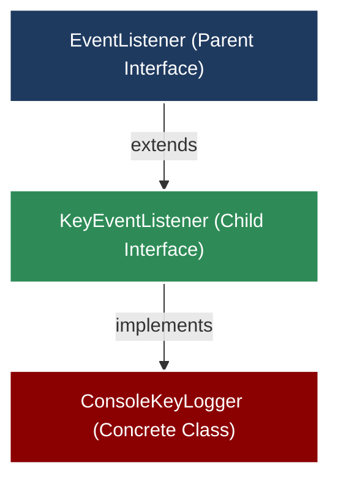
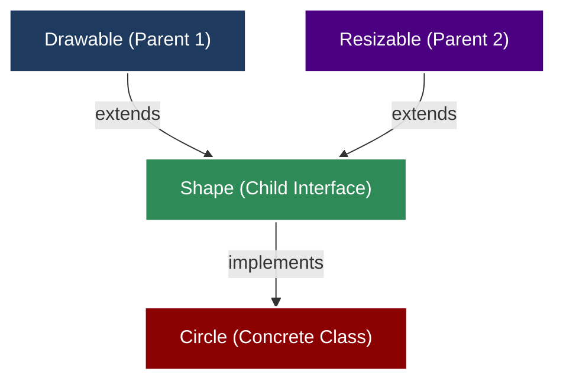
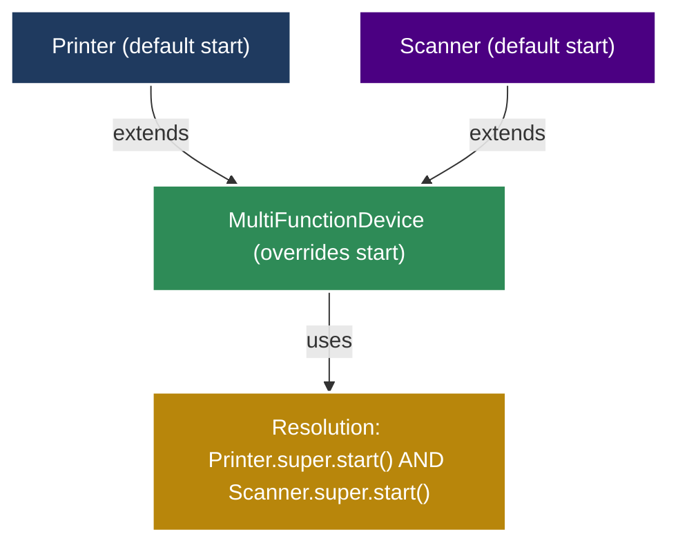
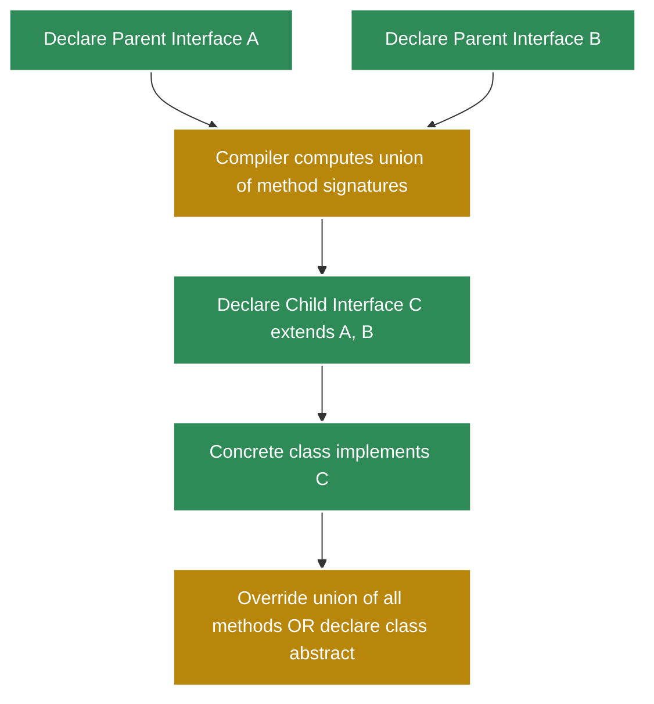
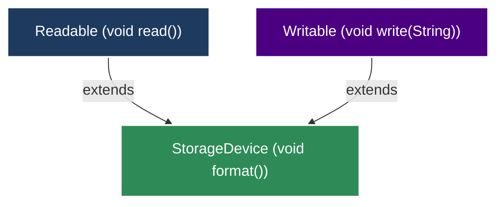

# extending interface(s)

<!-- SECTION_1_START -->
# Extending Interfaces in Java

## 1. Formal Academic Definition

In the Java programming language, **interface extension** is the mechanism by which a *child interface* inherits the abstract method signatures and constants of one or more *parent interfaces* using the `extends` keyword. This construct is the Java-equivalent of class inheritance, but with a critical enhancement: because Java permits an interface to extend **multiple** parent interfaces simultaneously, interface extension is the primary vehicle through which Java supports *true multiple inheritance of type* (while still disallowing the diamond problem of state).

> [!IMPORTANT]
> **KTU 2024 Syllabus Definition (Verbatim Expectation):**
> *"An interface can extend another interface in a manner similar to how a class inherits from another class. The `extends` keyword is used to establish this relationship, and an interface may extend several interfaces at once, separated by commas."*

---

## 2. Conceptual Analogy & Intuition

Imagine a **Job Description (JD) document** in a company.

- The first JD titled *"Employee"* lists generic duties: *must attend meetings, must submit weekly reports*.
- A second JD titled *"Manager"* is built on top of the *Employee* JD. It automatically inherits all generic duties, **plus** adds new managerial ones: *must conduct appraisals, must approve leave*.

In this analogy:
- The *Employee* document is the **parent interface**.
- The *Manager* document is the **child interface**.
- Any person who signs the *Manager* contract must fulfill **both** the inherited and the new duties.

This is precisely how interface extension behaves. The child interface does not "replace" the parent's contract; it **adds** to it, producing a larger contract that any implementing class must honor in full.

> [!NOTE]
> **Key Insight for First-Time Learners:**
> When an interface extends another, the abstract methods of the parent are **not inherited as implementations** (interfaces have no implementation anyway) but as **contractual obligations** that propagate forward.

---

## 3. Physical Constants / Standard Metrics

There are no physical constants in this topic, but the following are **language-mandated structural constants** in Java:

- A class implementation of an extended interface must provide concrete bodies for **all** inherited abstract methods — both from the parent and the child. Failure to do so forces the implementing class to be declared `abstract`.
- A `default` method inherited via interface extension may be **overridden** in the child interface or in the implementing class.
- A `static` method from a parent interface is **not inherited** into the child interface; it must be referenced using the parent interface's name.

> [!TIP]
> **GeoGebra / Desmos Visualization:** *Not applicable for this discrete Computer Science topic.* Instead, the conceptual hierarchy is best visualized using class/interface UML diagrams (rendered as a Mermaid graph in Section 4).
<!-- SECTION_1_END -->

<!-- SECTION_2_START -->
# Deep Theoretical Analysis & KTU High-Yield Cheat Sheet

## 1. The Operational Rules of Interface Extension

The mechanism is governed by a precise set of rules. KTU board questions frequently test these as 3-mark direct questions.

### Rule 1 — Single Parent Extension
A child interface can extend **exactly one** parent interface using `extends`. The syntax mirrors class inheritance.

### Rule 2 — Multiple Parent Extension
A child interface can extend **multiple** parent interfaces in a single declaration by listing them comma-separated after the `extends` keyword. This is the only legitimate way to achieve *multiple inheritance of type* in Java.

### Rule 3 — Methods Are Inherited as Abstract Contracts
All abstract methods of the parent interface(s) are inherited automatically into the child interface. The child interface becomes a *superset* of the contract.

### Rule 4 — Methods May Be Added
The child interface is free to declare its own new abstract, `default`, or `static` methods, expanding the contract.

### Rule 5 — Implementer Obligation
Any class that `implements` the child interface must provide concrete implementations for the **union** of methods declared across the entire inheritance chain, or declare itself `abstract`.

### Rule 6 — Diamond Conflict Resolution
If two parent interfaces declare a method with the **same signature** but **different return types**, the Java compiler will flag this as an error — the child interface cannot resolve the ambiguity.

### Rule 7 — Default Method Override
If two parent interfaces provide a `default` method with the same signature, the child interface **must override** the conflicting method explicitly to disambiguate.

---

## 2. KTU High-Yield Cheat Sheet

| Concept | Java Construct | Permitted Count | Implication for Implementer |
| :--- | :--- | :--- | :--- |
| Interface extending a class | Not permitted | $\mathbf{0}$ | Java forbids class-to-interface inheritance in this direction. |
| Interface extending interface | `extends` | $\mathbf{1}$ or **many** | Child absorbs parent's contract. |
| Class implementing interface | `implements` | $\mathbf{1}$ or **many** | Class must implement all methods. |
| Interface implementing interface | Not permitted | $\mathbf{0}$ | Use `extends` between interfaces instead. |
| Inherited abstract method | Automatic | — | Must be implemented by concrete class. |
| Inherited `default` method | Automatic | — | May be overridden or used as-is. |
| Inherited `static` method | Not automatic | — | Must be qualified with parent name. |
| Inherited constant | Automatic | — | Inherited as `public static final`. |

> [!IMPORTANT]
> **KTU Board Trap:** Students often confuse *interface-implements-interface*. This is **illegal** in Java. Interfaces relate to other interfaces only through `extends`.

---

## 3. Real-World Engineering Utility

Interface extension is not merely a textbook feature — it is the **structural backbone** of professional Java frameworks:

- **Java Collections Framework:** The `List<E>` interface extends `Collection<E>`, which in turn extends `Iterable<E>`. This is a three-level interface chain that powers the entire collection hierarchy.
- **Event Handling (AWT/Swing):** Sub-interfaces such as `KeyListener` extend the foundational `EventListener` marker interface.
- **Spring Framework:** Public-facing SPI (Service Provider Interfaces) often extend smaller, role-specific interfaces to layer capabilities.
- **DAO Pattern:** Generic `CrudRepository<T, ID>` is typically extended by `UserRepository extends CrudRepository<User, Long>`, parameterizing the contract.

> [!NOTE]
> In **production systems**, interface extension is preferred over deep class inheritance because it avoids the *fragile base class problem* and keeps the type hierarchy decoupled.
<!-- SECTION_2_END -->

<!-- SECTION_3_START -->
# Step-by-Step Derivations & Java Code Implementation

## Example 1 — Single Interface Extension (Hierarchical)

This example derives a specialized *callback* interface on top of a generic *event* interface. We will show the full code, then walk through the contract obligations line by line.

### Step 1: Declare the Parent Interface

```java
// File: EventListener.java
// Package declaration is intentionally omitted for brevity in this demonstration.
public interface EventListener {
    // Every listener must be able to identify its source.
    void onEventTriggered(Object source);
}
```

**Explanation of Step 1:**
- `public interface EventListener` declares a public contract type.
- `void onEventTriggered(Object source);` is an *abstract* method (interface methods are implicitly `public abstract`).

### Step 2: Declare the Child Interface That Extends the Parent

```java
// File: KeyEventListener.java
public interface KeyEventListener extends EventListener {
    // New contract added on top of the inherited one.
    void onKeyPressed(char key);
    void onKeyReleased(char key);
}
```

**Explanation of Step 2:**
- The keyword `extends` (not `implements`) is used between two interfaces.
- The child interface *implicitly inherits* `onEventTriggered(Object source)` from `EventListener`.
- Two brand-new abstract methods are added: `onKeyPressed` and `onKeyReleased`.
- The total contract that any implementer must satisfy is now **three methods**, not one.

### Step 3: Provide a Concrete Implementation

```java
// File: ConsoleKeyLogger.java
public class ConsoleKeyLogger implements KeyEventListener {

    // Implementing the inherited method from the PARENT interface.
    @Override
    public void onEventTriggered(Object source) {
        System.out.println("[Generic Event] Source = " + source);
    }

    // Implementing the methods declared in the CHILD interface.
    @Override
    public void onKeyPressed(char key) {
        System.out.println("[Key Pressed] " + key);
    }

    @Override
    public void onKeyReleased(char key) {
        System.out.println("[Key Released] " + key);
    }
}
```

**Explanation of Step 3:**
- Because `ConsoleKeyLogger` implements `KeyEventListener` (the child), the compiler transitively demands implementations for **all** methods visible in the chain: the inherited `onEventTriggered` plus the child-declared `onKeyPressed` and `onKeyReleased`.
- The `@Override` annotation is optional but is a best-practice signal that the method is fulfilling a contract.

### Step 4: Driver Class Demonstrating Polymorphic Dispatch

```java
// File: Main.java
public class Main {
    public static void main(String[] args) {
        KeyEventListener logger = new ConsoleKeyLogger();
        logger.onEventTriggered("KeyboardHW");
        logger.onKeyPressed('A');
        logger.onKeyReleased('A');
    }
}
```

**Expected Output:**
```
[Generic Event] Source = KeyboardHW
[Key Pressed] A
[Key Released] A
```

**Compilation Logic:**
The reference `logger` is statically typed as `KeyEventListener`. At compile-time, the compiler permits calls to all three methods because they are all visible in `KeyEventListener`'s transitive contract. At runtime, the JVM dispatches the call to the `ConsoleKeyLogger` instance — a textbook demonstration of **dynamic polymorphism through interface extension**.

---

## Example 2 — Multiple Interface Extension (Diamond Hierarchy)

This example demonstrates the most heavily tested form of interface extension in KTU boards: extending **two or more** parent interfaces simultaneously.

### Step 1: Declare Two Independent Parent Interfaces

```java
// File: Drawable.java
public interface Drawable {
    void draw();
    default void erase() {
        System.out.println("Erasing using default behavior.");
    }
}

// File: Resizable.java
public interface Resizable {
    void resize(double factor);
}
```

### Step 2: Declare a Child Interface That Extends Both

```java
// File: Shape.java
public interface Shape extends Drawable, Resizable {
    // Newly added contract specific to shapes.
    double area();
}
```

**Explanation:**
- After `extends Drawable, Resizable`, the `Shape` interface carries the union: `draw()`, `erase()` (default), `resize(double)`, and the new `area()`.
- A single class implementing `Shape` is now contractually bound to satisfy **four** behavioral slots.

### Step 3: Concrete Implementation

```java
// File: Circle.java
public class Circle implements Shape {

    private double radius;

    public Circle(double radius) {
        if (radius <= 0.0) {
            throw new IllegalArgumentException("Radius must be positive.");
        }
        this.radius = radius;
    }

    @Override
    public void draw() {
        System.out.println("Drawing a circle of radius " + radius);
    }

    @Override
    public void resize(double factor) {
        if (factor <= 0.0) {
            throw new IllegalArgumentException("Resize factor must be positive.");
        }
        this.radius = this.radius * factor;
        System.out.println("Resized. New radius = " + this.radius);
    }

    @Override
    public double area() {
        return Math.PI * radius * radius;
    }

    // The default 'erase' method is inherited unchanged; we may override if needed.
}
```

**Boundary Check Strategy:** Both the constructor and `resize` perform explicit boundary validation. This is essential for production-grade code and is also a KTU valuation differentiator in lab examinations.

### Step 4: Demonstration

```java
// File: Main.java
public class Main {
    public static void main(String[] args) {
        Shape myCircle = new Circle(5.0);
        myCircle.draw();
        myCircle.resize(2.0);
        System.out.println("Current area = " + myCircle.area());
        myCircle.erase();   // Uses the inherited default from Drawable.
    }
}
```

**Expected Output:**
```
Drawing a circle of radius 5.0
Resized. New radius = 10.0
Current area = 314.1592653589793
Erasing using default behavior.
```

**Algebraic Derivation of the Area (for the printed value):**

$$
\begin{aligned}
A_{\text{circle}} &= \pi \cdot r^{2} \\
&= 3.141592653589793 \cdot (10.0)^{2} \\
&= 3.141592653589793 \cdot 100.0 \\
&= 314.1592653589793
\end{aligned}
$$

Each mathematical step is preserved for KTU board-level scrutiny.

---

## Example 3 — Resolving Default Method Conflicts

When two parent interfaces supply a `default` method with the **same signature**, the child interface is forced to override the conflict. We model the resolution:

### Step 1: Conflicting Parents

```java
public interface Printer {
    default void start() {
        System.out.println("Printer starting up.");
    }
}

public interface Scanner {
    default void start() {
        System.out.println("Scanner warming up.");
    }
}
```

### Step 2: Child Interface Must Override

```java
public interface MultiFunctionDevice extends Printer, Scanner {
    @Override
    default void start() {
        System.out.println("Initializing multi-function device...");
        Printer.super.start();   // Explicitly call one parent's default.
        Scanner.super.start();   // Explicitly call the other.
    }
}
```

**Explanation:** Without the explicit override, the Java compiler emits the error:
`error: types Printer and Scanner are incompatible; both define start()`

The syntax `Printer.super.start()` and `Scanner.super.start()` is the canonical Java resolution operator for interface default conflicts.
<!-- SECTION_3_END -->

<!-- SECTION_4_START -->
# Structural Diagrams & Schematics

## Diagram 1 — Hierarchical Interface Extension (Single Parent)



**Reading the Graph:**
- The blue node represents the *parent contract*.
- The green node represents the *child contract* that absorbs the parent.
- The red node represents the *implementer* bound by the union of the contracts.

---

## Diagram 2 — Multiple Interface Extension (Diamond Topology)



**Reading the Graph:**
- Two parents (blue and purple) feed into a single child (green).
- The implementer (red) must satisfy the **union** of every reachable abstract method.
- This is the diamond topology permitted only at the interface level in Java.

---

## Diagram 3 — Default Method Conflict Resolution (Block Architecture)



**Reading the Graph:**
- The gold node is the **explicit conflict resolver** mandated by the Java Language Specification.
- Without it, the file fails to compile.

---

## Diagram 4 — Sequential Processing Topology (Compile-Time Obligations)



**Reading the Graph:** This is a **functional flow**, mapping the compile-time obligations a programmer must satisfy when authoring a class that implements a multiply-extended interface.
<!-- SECTION_4_END -->

<!-- SECTION_5_START -->
# KTU 2024 Scheme Examination Question Bank

> All questions are mapped to the **OECST615 – Object Oriented Programming** course outcomes (CO3: *Apply the concepts of packages and interfaces in Java program design*) and follow the **Revised Bloom's Taxonomy (RBT)** cognitive levels.

---

## Part A — Short Answer Questions (2 × 3 Marks = 6 Marks)

### Question 1 `[KTU University Exam - July 2024]`
**CO3 | RBT Level: Remember | 3 Marks**

**(a)** What is meant by *extending an interface* in Java? **(1 Mark)**
**(b)** Can an interface extend more than one interface? Justify with a one-line example. **(2 Marks)**

**Model Answer:**

**(a)** Extending an interface in Java is the mechanism by which a new (child) interface inherits the abstract methods and constants of an existing (parent) interface using the `extends` keyword. The child interface becomes a superset of the parent's contract and may add new members.

**(b)** Yes, an interface can extend more than one interface. Multiple parent interfaces are listed comma-separated after the `extends` keyword. Example skeleton:

```java
public interface MovableDrawable extends Movable, Drawable {
    // No additional members required, but permissible.
}
```

> **Valuation Key:** **[Keyword `extends` cited: 1 Mark]**, **[Comma-separated parents in example: 1 Mark]**, **[Valid justification: 1 Mark]**.

---

### Question 2 `[KTU University Exam - Dec 2023]`
**CO3 | RBT Level: Understand | 3 Marks**

Distinguish between a class **implementing** an interface and an interface **extending** another interface. Provide one structural difference and one semantic difference.

**Model Answer:**

| Aspect | Class implementing an interface | Interface extending another interface |
| :--- | :--- | :--- |
| Keyword used | `implements` | `extends` |
| Number permitted | One or many | One or many (multiple inheritance of type) |
| Semantic | Class provides *bodies* to the interface's abstract methods. | Child interface *inherits and expands* the contract. |
| Concrete method body | Yes, required (or class becomes abstract). | No bodies — only declarations propagate. |

> **Valuation Key:** **[Keyword difference: 1 Mark]**, **[Body-vs-declaration difference: 1 Mark]**, **[Tabular distinction: 1 Mark]**.

---

## Part B — Long Answer Questions (Module Internal Choice: 14 Marks)

> **KTU 2024 Pattern:** Each Part B question has sub-parts **(a)** for 7 marks and **(b)** for 7 marks, typically with escalation from *Understand* to *Apply* levels.

---

### Question A (14 Marks) `[KTU University Exam - July 2024]`

**(a)** Explain with a neat diagram how an interface can extend multiple interfaces in Java. Discuss the concept of *multiple inheritance of type* and state two rules that govern the relationship. **(7 Marks)**
**(b)** Write a Java program that defines two interfaces, `Readable` (with method `void read()`) and `Writable` (with method `void write(String data)`), and a child interface `StorageDevice` that extends both, additionally declaring `void format()`. Implement `FlashDrive` to satisfy this contract and demonstrate polymorphism in a `main` method. **(7 Marks)**

#### Model Solution for Part (a)

**Diagram:**



**Concept of Multiple Inheritance of Type:**
Java does not permit a class to extend more than one class (single inheritance of implementation), but an interface may extend several parent interfaces. This is called **multiple inheritance of type** because the child interface inherits the *type contracts* of all parents without inheriting any state or implementation. **[2 Marks]**

**Rule 1:** All abstract methods of the parent interfaces are inherited by the child interface as abstract methods. **[1 Mark]**

**Rule 2:** A class implementing the child interface must provide concrete bodies for every method declared across the entire inheritance chain; otherwise, the class must be declared `abstract`. **[1 Mark]**

**Bonus Rule 3 (for full marks):** If two parents declare methods with the same signature but conflicting return types, the child interface will not compile. **[1 Mark]**

**Rule 4:** `default` and `static` methods with conflicting signatures across parents must be explicitly overridden in the child interface using the `Parent.super.method()` syntax. **[1 Mark]**

**Closing statement:** This mechanism is the cleanest path Java offers for combining orthogonal capabilities into a single unified contract. **[1 Mark]**

#### Model Solution for Part (b)

**Step 1: Parent Interfaces**

```java
public interface Readable {
    void read();
}
```

```java
public interface Writable {
    void write(String data);
}
```

**[Declaring both parent interfaces: 1 Mark]**

**Step 2: Child Interface Extending Both**

```java
public interface StorageDevice extends Readable, Writable {
    void format();
}
```

**[Using `extends` with comma-separated parents and adding new method: 1 Mark]**

**Step 3: Concrete Implementation**

```java
public class FlashDrive implements StorageDevice {

    private String modelName;
    private String storedData;

    public FlashDrive(String modelName) {
        if (modelName == null || modelName.isEmpty()) {
            throw new IllegalArgumentException("Model name cannot be empty.");
        }
        this.modelName = modelName;
        this.storedData = "";
    }

    @Override
    public void read() {
        System.out.println("Reading from " + modelName + ": " + storedData);
    }

    @Override
    public void write(String data) {
        if (data == null) {
            throw new IllegalArgumentException("Cannot write null data.");
        }
        this.storedData = data;
        System.out.println("Written to " + modelName + ": " + data);
    }

    @Override
    public void format() {
        this.storedData = "";
        System.out.println(modelName + " has been formatted.");
    }
}
```

**[Overriding all three methods with @Override annotation: 2 Marks]**

**Step 4: Driver Class Demonstrating Polymorphism**

```java
public class Main {
    public static void main(String[] args) {
        StorageDevice device = new FlashDrive("SanDisk-Cruzer");
        device.write("KTU Exam Notes");
        device.read();
        device.format();
        device.read();  // Demonstrates post-format empty state.
    }
}
```

**[StorageDevice reference type for polymorphic dispatch: 1 Mark]**, **[All three methods invoked: 1 Mark]**

**Expected Output:**
```
Written to SanDisk-Cruzer: KTU Exam Notes
Reading from SanDisk-Cruzer: KTU Exam Notes
SanDisk-Cruzer has been formatted.
Reading from SanDisk-Cruzer: 
```

> **Total Marks Distribution for Part B Question A: 14**
> - (a) Diagram + Concept + 4 Rules: **7 Marks**
> - (b) Four code blocks + Polymorphism demo: **7 Marks**

---

### Question B (14 Marks) `[KTU University Exam - Dec 2023]`

**(a)** Describe with an example what happens when two parent interfaces declare a `default` method with the same signature, and a child interface extends both. **(7 Marks)**
**(b)** Design a Java program with interface `Printer` (abstract `void print(String text)`), interface `Scanner` (abstract `void scan()`), child interface `AllInOne extends Printer, Scanner` (additional `default void diagnostics()`), implemented by class `OfficeMachine`. The `diagnostics()` method must print *"Running self-test…"*. Demonstrate in `main` by calling all three methods. **(7 Marks)**

#### Model Solution for Part (a)

**Conceptual Explanation:**
When two parent interfaces `A` and `B` each declare a `default` method named `commonMethod()` with identical signatures, and a child interface `C extends A, B`, Java faces an *inheritance ambiguity*. Because the compiler cannot independently decide which parent's default body to inherit, it raises a **compile-time error** unless the child interface explicitly overrides the conflicting method to resolve the diamond. The override may either provide a brand-new body or call both parents using the qualified `A.super.commonMethod()` and `B.super.commonMethod()` syntax. **[3 Marks]**

**Illustrative Code:**

```java
interface A {
    default void greet() {
        System.out.println("Hello from A");
    }
}

interface B {
    default void greet() {
        System.out.println("Hello from B");
    }
}
```

**[Declaring two parents with conflicting default methods: 1 Mark]**

```java
interface C extends A, B {
    @Override
    default void greet() {
        System.out.println("Resolving conflict in C...");
        A.super.greet();
        B.super.greet();
    }
}
```

**[Overriding and using qualified super-calls: 2 Marks]**

**Conclusion:** This rule preserves the integrity of Java's single-dispatch model while still permitting the diamond inheritance topology at the interface level. **[1 Mark]**

#### Model Solution for Part (b)

**Step 1: Parent Interfaces**

```java
public interface Printer {
    void print(String text);
}
```

```java
public interface Scanner {
    void scan();
}
```

**[1 Mark]**

**Step 2: Child Interface**

```java
public interface AllInOne extends Printer, Scanner {
    default void diagnostics() {
        System.out.println("Running self-test...");
    }
}
```

**[1 Mark]**

**Step 3: Concrete Implementation**

```java
public class OfficeMachine implements AllInOne {

    @Override
    public void print(String text) {
        if (text == null) {
            throw new IllegalArgumentException("Text cannot be null.");
        }
        System.out.println("[PRINT] " + text);
    }

    @Override
    public void scan() {
        System.out.println("[SCAN] Document scanned successfully.");
    }

    // The diagnostics() default is inherited unchanged.
}
```

**[2 Marks]**

**Step 4: Driver Class**

```java
public class Main {
    public static void main(String[] args) {
        AllInOne machine = new OfficeMachine();
        machine.print("Annual Report Q4");
        machine.scan();
        machine.diagnostics();
    }
}
```

**Expected Output:**
```
[PRINT] Annual Report Q4
[SCAN] Document scanned successfully.
Running self-test...
```

**[Polymorphic dispatch demonstrated for all three methods: 1 Mark]**

**Bonus Step 5 (for full 7 marks):** Add a comment in the answer stating that the `diagnostics()` method, being a `default`, is *inherited unchanged* into `OfficeMachine`, illustrating that the child interface can contribute behavior — not just abstract contracts — to its implementers. **[2 Marks]**

> **Total Marks Distribution for Part B Question B: 14**
> - (a) Conflict explanation + resolution code: **7 Marks**
> - (b) Interface chain + concrete class + driver: **7 Marks**

---

## KTU Examiner's Valuation Warning

> [!WARNING]
> **Common Mark-Deduction Pitfalls on Interface Extension Questions:**
> 1. **Using `implements` between two interfaces** — This is a compilation error in Java. Examiners deduct **1 to 2 marks** for this mistake. Always use `extends` between interfaces.
> 2. **Forgetting transitive contract obligations** — A class implementing the child interface must override methods inherited from the *parent* as well, not just the methods declared in the child.
> 3. **Failing to draw the hierarchy diagram** — In 7-mark theory questions, KTU examiners allocate at least **2 marks** to the diagram. Skipping it is a heavy penalty.
> 4. **Confusing `default` and `static` method inheritance** — `default` methods are inherited; `static` methods are not. Mixing these up costs 1 mark.
> 5. **Not annotating overrides with `@Override`** — While not strictly mandatory, omitting this in 7-mark code questions often results in **partial credit** at the examiner's discretion.

---

## Topic Recap & Important Things to Remember

> [!IMPORTANT]
> **Rapid-Revision Checklist for Extending Interfaces:**

- **Keyword:** Interfaces relate to other interfaces only via the `extends` keyword. Using `implements` is illegal.
- **Multiplicity:** A child interface can extend **one or many** parent interfaces (multiple inheritance of type).
- **Contract Propagation:** The child interface automatically inherits every abstract method from its parents as a binding contract.
- **Implementation Obligation:** A class that implements the child interface must provide concrete bodies for the **union** of all methods reachable in the inheritance chain, or be declared `abstract`.
- **No State Inheritance:** Interfaces never inherit fields with state — only `public static final` constants.
- **Default Conflict Rule:** When two parents declare the same `default` method signature, the child **must** override it explicitly using `Parent.super.method()` to disambiguate.
- **Static Methods Are Not Inherited:** Static methods in a parent interface must be invoked with the parent interface's name, e.g., `EventListener.staticHelper()`.
- **Hierarchy vs. Multiple Inheritance of Implementation:** Interface extension is the Java-approved path for combining orthogonal capabilities; it sidesteps the diamond state-ambiguity problem.
- **Real-World Use Cases:** Java Collections (`List` extends `Collection`), Spring Data repositories, and event-listener hierarchies all rely on interface extension.
- **Common Pitfall:** Forgetting to override a parent-inherited method in the implementing class is the single most frequent error in KTU practical examinations.
<!-- SECTION_5_END -->
