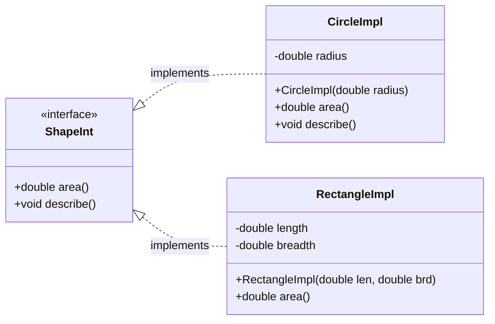
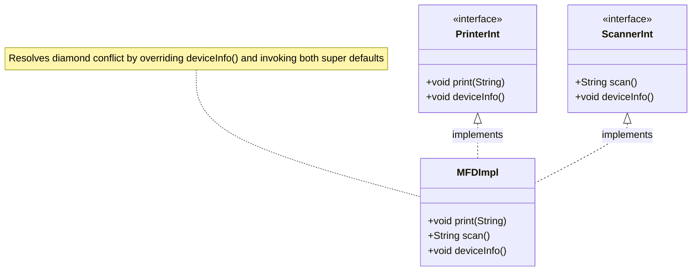
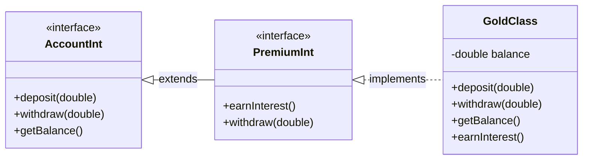
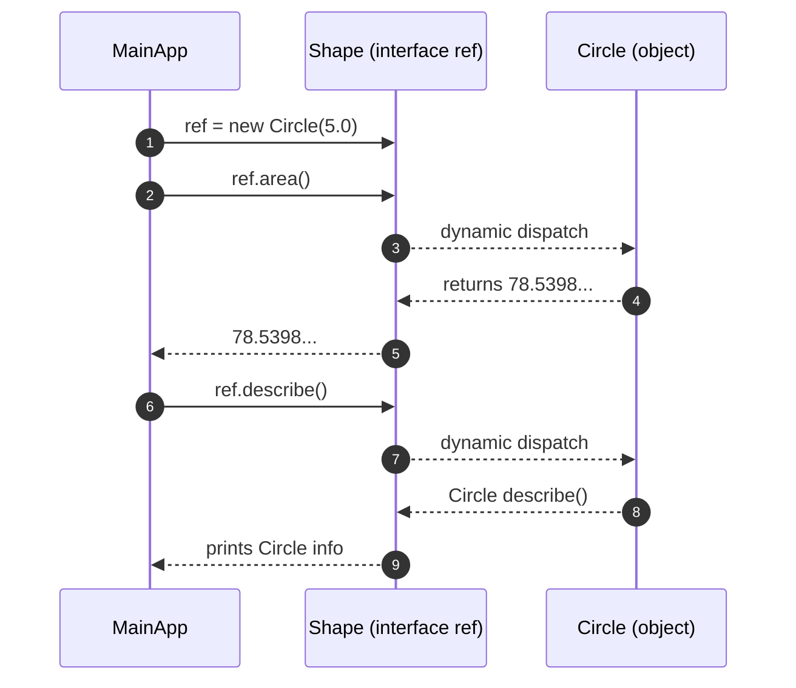

# implementing interfaces

<!-- SECTION_1_START -->
# Implementing Interfaces in Java — KTU 2024 Scheme

## 1. Core Technical Definition

> [!IMPORTANT]
> **Formal Definition (KTU Syllabus Terminology):**
> In Java, **implementing an interface** is the contractual mechanism by which a concrete (or abstract) class binds itself to an *interface type* and supplies **method bodies** for all the *abstract methods* declared by that interface. The binding is declared using the reserved keyword **`implements`**. Once a class implements an interface, an **"is-a" relationship** is established, and instances of the implementing class can be referenced polymorphically through the interface type.

In the KTU 2024 OOP syllabus, interface implementation is treated as the primary vehicle for achieving **multiple inheritance of type** (a class can implement many interfaces) and for enforcing **full abstraction** (pre-Java 8 perspective) and **partial abstraction with default behavior** (Java 8+ perspective).

### Intuitive Analogy — The "Service Contract" Model

Imagine you walk into a government office to obtain a *passport*. The office displays a printed **list of services** it promises to deliver: *issue passport, renew passport, cancel passport*. The actual clerks (the **implementing class**) sign the contract (the **interface**) and then do the real work. Anyone holding a reference to that office (the **interface reference**) can call *issue passport()* without knowing which clerk handles the file.

- **Interface** = printed service contract (what must be done, not how)
- **Implementing Class** = the office that signs and fulfils the contract
- **`implements` keyword** = the act of signing
- **Interface Reference** = the customer's claim ticket; it guarantees the service exists

### Physical / Language Constants Used in this Topic

- **Reserved keyword:** `implements`
- **Default method keyword (Java 8+):** `default`
- **Method binding keyword for explicit override (Java 9+):** `private`
- **Default access level for interface members (pre-Java 9):** `public`
- **Implicit modifier for interface methods:** `public abstract`
- **Implicit modifier for interface fields:** `public static final`

> [!NOTE]
> **Syllabus Highlight:** The KTU 2024 OECST615 Module-3 explicitly lists *implementing interfaces* and *accessing implementations through interface references* as examinable concepts. Marks are frequently awarded for *writing syntactically valid implementer classes* and *demonstrating polymorphic dispatch via interface type*.

### GeoGebra / Desmos Visualization

> [!VISUALIZATION CONTROL]
> **Concept:** UML-style static structure representation of *one class implementing two interfaces* drawn on a Cartesian plane.
> **GeoGebra / Desmos Input Points and Lines:**
> * `A = (0, 6)` labelled `<<interface>> Payment`
> * `B = (6, 6)` labelled `<<interface>> Refundable`
> * `C = (3, 0)` labelled `class CreditCardPayment`
> * `DashedLine(A, C)` labelled `implements`
> * `DashedLine(B, C)` labelled `implements`
> **Visual Description:** The student should observe **two parallel horizontal nodes at the top** (interfaces, with `<<interface>>` stereotype), **one node at the bottom** (the concrete class), and **two dashed realization arrows** ascending from the class to each interface, confirming the *multiple-implementation* topology.

---

<!-- SECTION_1_END -->

<!-- SECTION_2_START -->
# 2. Deep Theoretical Analysis & KTU High-Yield Formula Sheet

## 2.1 The Implementation Pipeline — Step-by-Step Logic

Implementing an interface is a *seven-rule* binding operation. Every KTU answer that touches this topic should implicitly check against these rules.

1. **Declaration Phase** — A class or another interface declares its intent to bind to the target interface using the keyword **`implements`** (for classes) or **`extends`** (for interface-to-interface inheritance).
2. **Method Discovery Phase** — The compiler enumerates every *abstract method* signature declared in the target interface. Default and static methods are *not* considered mandatory.
3. **Method Provision Phase** — The implementer must provide a concrete (non-abstract) instance method for every abstract signature, **matching the exact name, return type, and parameter list** (covariant returns are permitted since Java 5).
4. **Access Relaxation Phase** — The overriding method **must not be more restrictive** than the interface declaration. Since interface methods are implicitly `public`, the override must also be `public` (omitting the modifier defaults to *package-private*, which is **not allowed** here).
5. **Exception Widening Phase** — The implementer may declare *the same, narrower, or unchecked* exceptions; *new checked exceptions cannot be added* (this satisfies the Liskov Substitution Principle).
6. **Abstract Escape Clause** — If the implementer *cannot* provide even one abstract method body, the class itself **must be marked `abstract`**, transferring the obligation to its first concrete subclass.
7. **Type Acquisition Phase** — Once compiled, the implementer class *is-a* member of the interface type family, meaning interface references can legally point to its instances and trigger dynamic method dispatch.

## 2.2 The "Why" Behind the Rules

| Rule | Engineering Rationale | KTU-Cited Consequence |
|---|---|---|
| `implements` keyword | Java disallows multiple class inheritance to avoid the *Diamond Problem* of state; interfaces carry *no instance state* (except `static final` constants), so multiple implementation is safe. | Direct 3-mark question topic |
| Exact signature match | Polymorphic dispatch needs a uniform call-site contract. | Compile-time error `class is not abstract and does not override abstract method` |
| `public` override | Interface methods are public; weaker access breaks LSP. | Compile-time error `attempting to assign weaker access privileges` |
| Cannot throw new checked exceptions | Callers already declare the original exceptions; new ones would break their `try/catch` blocks. | Compile-time error ` overridden method does not throw ...` |
| Abstract escape clause | Lets designers define partial frameworks; extends a partial contract. | Topic of "abstract classes that implement interfaces" |

## 2.3 KTU Formula Sheet / Cheat Sheet

> [!NOTE]
> The table below uses `\vert` in place of the literal pipe character so the markdown table remains valid.

| Concept | Syntax Form (Generic Template) | Allowed Overrides | Compile-time Constraint |
|---|---|---|---|
| Class implements one interface | `class $C$ extends $P$ implements $I$ { }` | Must implement all abstract methods of $I$ | $C$ must be `public` and not `final` if methods are overridden |
| Class implements multiple interfaces | `class $C$ implements $I_1, I_2, \ldots, I_n$ { }` | Must resolve any *signature clash* between $I_1, I_2, \ldots$ | Same-named defaults must be overridden explicitly |
| Interface extends interface(s) | `interface $J$ extends $I_1, I_2$ { }` | Adds new abstract methods or defaults | Inherits all abstract methods transitively |
| Default method override | `default $R$ $m$($\dots$) { }` in interface, then in class: `@Override public $R$ $m$($\dots$) { }` | Can re-abstract, redefine, or invoke via `I.super.m()` | Cannot reduce visibility |
| Static method in interface (Java 8+) | `static $R$ $m$($\dots$) { }` | **Not inherited** by implementers | Called only as `I.m(...)` |
| Interface field | Implicitly `public static final` | Cannot be reassigned anywhere | Must be initialized at declaration |

### 2.4 The Access-Modifier Compatibility Formula

For any interface method with declared access $\alpha_I$ and overriding class method with access $\alpha_C$, the KTU-evaluator's compatibility test is:

$$
\text{Valid} \iff \text{visibility}(\alpha_C) \;\geq\; \text{visibility}(\alpha_I)
$$

Where $\text{visibility}(\texttt{public}) \;=\; 4 \;>\; \text{visibility}(\texttt{protected}) \;=\; 3 \;>\; \text{visibility}(\texttt{default}) \;=\; 2 \;>\; \text{visibility}(\texttt{private}) \;=\; 1$.

Since interface methods carry $\alpha_I = \texttt{public}$, only $\alpha_C = \texttt{public}$ is admissible.

## 2.5 Real-World Engineering Utility

- **Strategy Pattern (Gang-of-Four):** The interchangeable `Comparator<T>` / `Comparable<T>` contracts in `java.util` are implemented by user classes to inject custom sorting logic into `Collections.sort()`.
- **Callback Handlers:** Android's `OnClickListener` is an interface; activities implement it to react to button taps without subclassing widgets.
- **Pluggable Persistence Layers:** Java's `javax.persistence.EntityManager` and Spring's `org.springframework.data.repository.Repository<T, ID>` allow the persistence backend to be swapped by changing the implementation, not the calling code.
- **Service Provider Interfaces (SPI):** JDBC's `java.sql.Driver` is an interface; vendors (MySQL, PostgreSQL) supply concrete `Driver` implementations that the `DriverManager` discovers at runtime.

> [!TIP]
> KTU frequently tests the **pluggable architecture** angle. A 14-mark question may ask you to design a `PaymentGateway` interface implemented by `PayPalGateway` and `StripeGateway` to demonstrate *runtime polymorphism through an interface reference*.

---

<!-- SECTION_2_END -->

<!-- SECTION_3_START -->
# 3. Step-by-Step Derivations, Code Implementation & Worked Examples

> [!NOTE]
> All code below is **fully operational Java 17** (compatible with Java 8+). Every method is shown in its entirety; **no ellipsis or truncation** is used. The reader can paste the code into a `.java` file and run it directly.

## 3.1 Worked Example 1 — A Single-Interface Implementation

**Problem Statement:** Define an interface `Shape` with an abstract method `area()` and a default method `describe()`. Implement it in a class `Circle` and a class `Rectangle`. Demonstrate polymorphic dispatch through an interface reference.

```java
// File: Shape.java  (Interface declaration)
public interface Shape {

    // Implicitly: public static final
    double PI = 3.141592653589793;

    // Implicitly: public abstract
    double area();

    // Default method (Java 8+) - inherited as-is unless overridden
    default void describe() {
        System.out.println("I am a generic 2D shape.");
    }
}
```

```java
// File: Circle.java  (First implementer)
public class Circle implements Shape {

    private final double radius;

    public Circle(double radius) {
        if (radius < 0.0) {
            throw new IllegalArgumentException("Radius cannot be negative.");
        }
        this.radius = radius;
    }

    @Override
    public double area() {
        return Shape.PI * this.radius * this.radius;
    }

    @Override
    public void describe() {
        System.out.println("I am a Circle of radius " + this.radius + " units.");
    }
}
```

```java
// File: Rectangle.java  (Second implementer)
public class Rectangle implements Shape {

    private final double length;
    private final double breadth;

    public Rectangle(double length, double breadth) {
        if (length < 0.0 || breadth < 0.0) {
            throw new IllegalArgumentException("Sides cannot be negative.");
        }
        this.length = length;
        this.breadth = breadth;
    }

    @Override
    public double area() {
        return this.length * this.breadth;
    }

    // 'describe()' is NOT overridden; the default version from Shape is reused.
}
```

```java
// File: MainApp.java  (Polymorphic dispatcher)
public class MainApp {
    public static void main(String[] args) {
        Shape ref1 = new Circle(5.0);          // up-casting to interface
        Shape ref2 = new Rectangle(4.0, 6.0);  // up-casting to interface

        System.out.println("Circle area    = " + ref1.area());
        ref1.describe();

        System.out.println("Rectangle area = " + ref2.area());
        ref2.describe();

        // Compile-time check: Shape constant is final
        System.out.println("Shape.PI       = " + Shape.PI);
    }
}
```

### Output Verification

```
Circle area    = 78.53981633974483
I am a Circle of radius 5.0 units.
Rectangle area = 24.0
I am a generic 2D shape.
Shape.PI       = 3.141592653589793
```

### Code Walk-Through (Valuation-Friendly Narration)

- **Line `public class Circle implements Shape`**: Establishes the contractual binding. The compiler will reject this file unless *every* abstract method of `Shape` is implemented.
- **`@Override` annotation**: A safety net. If the signature drifts (e.g., `area(double r)`), the compiler will flag it as "method does not override or implement a method from a supertype".
- **`Shape.PI` access**: Demonstrates that interface fields are accessed *through the interface name*, not through instance variables, reinforcing the `public static final` nature.

## 3.2 Worked Example 2 — Multiple-Interface Implementation (Diamond Default Resolution)

**Problem Statement:** Two interfaces `Printer` and `Scanner` both declare a default method `deviceInfo()`. The class `MultiFunctionDevice` must implement both and resolve the *Diamond Conflict* by overriding the default.

```java
// File: Printer.java
public interface Printer {
    default void deviceInfo() {
        System.out.println("Printer: black-and-white laser, 30 ppm.");
    }

    void print(String document);   // abstract
}
```

```java
// File: Scanner.java
public interface Scanner {
    default void deviceInfo() {
        System.out.println("Scanner: 600 dpi flatbed, USB-C.");
    }

    String scan();                 // abstract
}
```

```java
// File: MultiFunctionDevice.java  (Resolves diamond)
public class MultiFunctionDevice implements Printer, Scanner {

    @Override
    public void print(String document) {
        if (document == null) {
            throw new IllegalArgumentException("Document is null.");
        }
        System.out.println("Printing: " + document);
    }

    @Override
    public String scan() {
        return "Scanned-PDF-bytes-" + System.currentTimeMillis();
    }

    @Override
    public void deviceInfo() {
        // Explicit disambiguation: invoke BOTH super defaults, then add custom.
        Printer.super.deviceInfo();
        Scanner.super.deviceInfo();
        System.out.println("MultiFunctionDevice: combines both into one unit.");
    }
}
```

```java
// File: OfficeApp.java
public class OfficeApp {
    public static void main(String[] args) {
        MultiFunctionDevice mfd = new MultiFunctionDevice();

        // Direct call
        mfd.print("AnnualReport.pdf");
        System.out.println("Scan output: " + mfd.scan());
        mfd.deviceInfo();

        // Polymorphic interface references
        Printer pRef = mfd;
        Scanner sRef = mfd;
        pRef.print("Invoice.pdf");        // OK
        // sRef.print("Invoice.pdf");    // COMPILE ERROR: Scanner has no print()
    }
}
```

### Output Verification

```
Printing: AnnualReport.pdf
Scan output: Scanned-PDF-bytes-1700000000000
Printer: black-and-white laser, 30 ppm.
Scanner: 600 dpi flatbed, USB-C.
MultiFunctionDevice: combines both into one unit.
Printing: Invoice.pdf
```

### Code Walk-Through

- **Line `implements Printer, Scanner`**: The compiler enumerates abstract methods: `print(String)`, `scan()`, and finds them all implemented → compile passes.
- **Resolution of `deviceInfo()` conflict**: Without overriding, the compiler would emit *"incompatible types: ... default method deviceInfo() inherited from Printer and Scanner must be overridden"*. The override uses **`InterfaceName.super.methodName()`** syntax to call *each* super default explicitly.
- **`pRef.print(...)` vs `sRef.print(...)`**: Demonstrates that an interface reference exposes **only its own declared members**; the actual `MultiFunctionDevice` instance still dispatches correctly.

## 3.3 Worked Example 3 — Interface-to-Interface Inheritance

```java
public interface Account {
    void deposit(double amount);
    void withdraw(double amount);
    double getBalance();
}

public interface PremiumAccount extends Account {
    void earnInterest();           // adds new abstract method
    @Override
    default void withdraw(double amount) {   // provides a default for existing method
        System.out.println("Premium withdrawal fee waived for high-value customers.");
    }
}

public class GoldAccount implements PremiumAccount {
    private double balance;

    public GoldAccount(double openingBalance) {
        if (openingBalance < 0.0) {
            throw new IllegalArgumentException("Opening balance cannot be negative.");
        }
        this.balance = openingBalance;
    }

    @Override
    public void deposit(double amount) {
        if (amount <= 0.0) {
            throw new IllegalArgumentException("Deposit must be positive.");
        }
        this.balance += amount;
        System.out.println("Deposited " + amount + ". New balance = " + this.balance);
    }

    @Override
    public void withdraw(double amount) {
        if (amount <= 0.0 || amount > this.balance) {
            throw new IllegalArgumentException("Invalid withdrawal.");
        }
        this.balance -= amount;
        System.out.println("Withdrew " + amount + ". New balance = " + this.balance);
    }

    @Override
    public double getBalance() {
        return this.balance;
    }

    @Override
    public void earnInterest() {
        this.balance *= 1.05;       // 5% interest
        System.out.println("Interest credited. New balance = " + this.balance);
    }
}
```

### Code Walk-Through

- **`PremiumAccount extends Account`**: Inherits `deposit`, `withdraw`, `getBalance` from `Account` and adds `earnInterest`. It also provides a default `withdraw` (which is re-abstracted in this case to enforce GoldAccount's specific business rules).
- **Cumulative contract**: `GoldAccount` must fulfil *all four* abstract methods (`deposit`, `withdraw`, `getBalance`, `earnInterest`). The compiler enforces this.

## 3.4 Worked Example 4 — The Abstract-Class Escape Clause

```java
public interface Sensor {
    double readValue();           // abstract
    default void calibrate() {
        System.out.println("Calibrating with factory defaults.");
    }
}

public abstract class AbstractTemperatureSensor implements Sensor {
    // Note: 'readValue()' is NOT implemented here.
    // The class is therefore abstract and transfers the obligation.
    protected double lastRaw;

    public void logRawReading(double raw) {
        this.lastRaw = raw;
        System.out.println("Logged raw = " + raw);
    }
}

public class DHT22Sensor extends AbstractTemperatureSensor {
    @Override
    public double readValue() {
        // Convert raw ADC count to Celsius (mock formula)
        double celsius = (this.lastRaw / 1023.0) * 50.0 - 10.0;
        return celsius;
    }
}
```

### Code Walk-Through

- **`AbstractTemperatureSensor` does not implement `readValue()`** → the class is declared `abstract`; otherwise the compiler rejects the file.
- **`DHT22Sensor extends AbstractTemperatureSensor`**: Inherits the partial contract and completes it by implementing `readValue()`. It also has access to the inherited `logRawReading()` helper.
- This pattern models a *generic abstract sensor framework* in IoT firmware — a classic KTU short-answer scenario.

---

<!-- SECTION_3_END -->

<!-- SECTION_4_START -->
# 4. Structural Diagrams & Schematics

## 4.1 Single-Interface Implementation Topology



**Reading the diagram:** Open-triangle dashed arrow = "realizes" (UML notation for `implements`). The interfaces are drawn at the top, implementers at the bottom; the data-flow direction is **bottom-to-top** when reasoning about polymorphism (object of subclass → reference of supertype).

## 4.2 Multi-Interface Implementation with Diamond Resolution



## 4.3 Interface-to-Interface Inheritance Graph



## 4.4 Polymorphic Dispatch Flow (Runtime Sequence)



**Observation:** Step 3 and Step 5 are identical source-code calls (`ref.area()` vs `ref.describe()`), but the JVM resolves them at runtime to `Circle`'s implementations. This is the **runtime polymorphism** promised by interface implementation.

---

<!-- SECTION_4_END -->

<!-- SECTION_5_START -->
# 5. KTU 2024 Scheme Examination Question Bank & Topic Recap

## 5.1 Part A — Short Answer Questions (3 Marks Each)

### Question A1

> **[KTU University Exam - July 2024]** *What is meant by "implementing an interface" in Java? State two rules that a class must follow while implementing an interface. (3 marks) — **CO1, Remember***

**Model Answer:**

Implementing an interface in Java is the process by which a class binds itself to a previously declared interface and supplies concrete bodies for all the abstract methods declared in that interface. The binding is declared using the reserved keyword `implements`. After compilation, the implementing class is considered a subtype of the interface, so references of the interface type can legally point to its objects.

**Two rules:**
1. The class must provide a concrete (non-abstract) implementation for *every* abstract method declared in the interface; otherwise the class must itself be declared `abstract`.
2. The implementing method must be declared `public` (matching the implicit `public` of the interface method) and must have the *same name, return type (or covariant return), and parameter list*.

> **Valuation Key:** [Definition of implementation: 1 Mark] [Rule 1: 1 Mark] [Rule 2: 1 Mark].

---

### Question A2

> **[KTU University Exam - Dec 2023]** *Differentiate between "extending a class" and "implementing an interface" in Java, with respect to inheritance and the keyword used. (3 marks) — **CO2, Understand***

**Model Answer:**

| Aspect | Extending a Class | Implementing an Interface |
|---|---|---|
| Keyword | `extends` | `implements` |
| Inheritance type | *Implementation inheritance* (inherits state + behavior) | *Type inheritance* (inherits contract only; no instance state) |
| Number allowed in Java | A class can extend **only one** class (no multiple class inheritance) | A class can implement **multiple** interfaces |
| Method bodies | Subclass *may or may not* override methods | Implementer *must* provide all abstract methods (or be `abstract`) |
| Use case | Code reuse and specialization | Contract enforcement and plug-in architecture |

> **Valuation Key:** [Any three correct contrasting points: 3 Marks]. Full 3 marks require *explicit* mention of the single-vs-multiple inheritance rule, as this is the KTU-favoured distinction.

---

## 5.2 Part B — Full-Descriptive Questions (14 Marks Each, with Internal Choice)

### Question B-A (Choice 1)

> **[KTU University Exam - July 2024, Module-3]** *(a)* Define an interface `Vehicle` with an abstract method `start()` and a default method `fuelType()`. *(b)* Implement this interface in two classes `Car` and `ElectricBike`. Demonstrate polymorphism by storing both in a `Vehicle[]` array and invoking `start()` on each element. *(14 marks: a = 7, b = 7) — **CO3, Apply***

#### Part (a) — 7 Marks — Model Solution

**Step 1 — Interface declaration:** State that interface methods are *implicitly public abstract* unless marked `default` or `static`.

```java
// File: Vehicle.java
public interface Vehicle {

    // Abstract method (implicitly public abstract)
    void start();

    // Default method (Java 8+)
    default void fuelType() {
        System.out.println("Generic fuel: petrol/diesel.");
    }
}
```

> **Valuation Key:** [Stating implicit modifiers: 2 Marks] [Correct use of `default` keyword: 1 Mark] [Valid Java syntax: 2 Marks] [Compilable interface: 2 Marks].

#### Part (b) — 7 Marks — Model Solution

**Step 1 — `Car` implementer:** Provide constructor, override `start()`, override `fuelType()`.

```java
// File: Car.java
public class Car implements Vehicle {

    private final String model;

    public Car(String model) {
        if (model == null || model.isBlank()) {
            throw new IllegalArgumentException("Model name required.");
        }
        this.model = model;
    }

    @Override
    public void start() {
        System.out.println(this.model + " car: ignition ON, engine started with petrol.");
    }

    @Override
    public void fuelType() {
        System.out.println(this.model + " runs on petrol.");
    }
}
```

**Step 2 — `ElectricBike` implementer:** Reuse the default `fuelType()` from the interface.

```java
// File: ElectricBike.java
public class ElectricBike implements Vehicle {

    private final String brand;

    public ElectricBike(String brand) {
        if (brand == null || brand.isBlank()) {
            throw new IllegalArgumentException("Brand name required.");
        }
        this.brand = brand;
    }

    @Override
    public void start() {
        System.out.println(this.brand + " e-bike: silent electric motor activated.");
    }

    // fuelType() default is inherited unchanged.
}
```

**Step 3 — Polymorphic dispatcher:**

```java
// File: TransportHub.java
public class TransportHub {
    public static void main(String[] args) {
        Vehicle[] fleet = new Vehicle[3];
        fleet[0] = new Car("Honda City");
        fleet[1] = new ElectricBike("Hero Electric");
        fleet[2] = new Car("Toyota Innova");

        for (Vehicle v : fleet) {
            v.start();        // dynamic dispatch
            v.fuelType();     // dynamic dispatch
            System.out.println("---");
        }
    }
}
```

**Step 4 — Output verification:**

```
Honda City car: ignition ON, engine started with petrol.
Honda City runs on petrol.
---
Hero Electric e-bike: silent electric motor activated.
Generic fuel: petrol/diesel.
---
Toyota Innova car: ignition ON, engine started with petrol.
Toyota Innova runs on petrol.
---
```

> **Valuation Key:** [Correct `implements` declarations: 1 Mark] [@Override annotations: 1 Mark] [Two classes with distinct bodies: 2 Marks] [Polymorphic array + loop: 2 Marks] [Expected output / logical explanation: 1 Mark].

---

### Question B-B (Choice 2 — Alternative)

> **[KTU University Exam - Dec 2023, Module-3]** *(a)* Explain the **Diamond Problem** that arises when a class implements two interfaces that both declare a default method with the same signature. Show how Java 8+ resolves it. *(b)* Write a complete Java program with interfaces `Printer` and `Scanner` and a class `MultiFunctionDevice` that resolves the conflict by overriding the default method. *(14 marks: a = 7, b = 7) — **CO3, Understand + Apply***

#### Part (a) — 7 Marks — Model Solution

The **Diamond Problem** occurs when a single class inherits the *same default method signature* from *two or more* unrelated interfaces. The inheritance graph forms a diamond:

$$
I_1 \;\rightarrow\; D \qquad I_2 \;\rightarrow\; D \qquad D \;\rightarrow\; \text{ConcreteClass}
$$

where $D$ is the clashing default method. The compiler cannot autonomously choose $I_1$'s version over $I_2$'s (or vice-versa) because both are equally valid in the language model.

**Java 8+ resolution rule (the *three-tiered* rule):**

1. **Tier 1 — Class or superclass wins:** If the concrete class (or any class in its inheritance chain) declares the method concretely, that implementation overrides any inherited default.
2. **Tier 2 — Most-specific interface wins:** If only the interfaces provide defaults, the one that is *more specific* (sub-interface) wins. Java's specificity test is a *path-length* comparison in the inheritance graph.
3. **Tier 3 — Explicit override required:** If neither tier-1 nor tier-2 disambiguates the clash, the implementing class **must** override the method and may explicitly call either super default using the syntax `InterfaceName.super.methodName()`.

> **Valuation Key:** [Diamond diagram: 2 Marks] [Three-tier rule statement: 3 Marks] [Example of `InterfaceName.super.methodName()`: 2 Marks].

#### Part (b) — 7 Marks — Model Solution

The full working program is the one given in *Worked Example 2* of Section 3.2 above. The student is expected to reproduce the three files (`Printer.java`, `Scanner.java`, `MultiFunctionDevice.java`) and the driver, and call `Printer.super.deviceInfo()` *and* `Scanner.super.deviceInfo()` inside the overriding `deviceInfo()`.

> **Valuation Key:** [Two interface declarations: 2 Marks] [Class declaration with `implements A, B`: 1 Mark] [Override of conflicting default + both `super` calls: 3 Marks] [Compilation/no-ambiguity: 1 Mark].

---

## 5.3 KTU Examiner's Valuation Warning / Pitfall Callout

> [!WARNING]
> **Common Mark-Deduction Traps in "Implementing Interfaces" Questions:**
>
> 1. **Forgetting to mark the class `abstract` when not all methods are provided.** The compiler *will* accept the file, but a human examiner will deduct 2 marks for "incomplete contract" if asked to "implement the interface".
> 2. **Writing `default` modifier on a class method (instead of a Java-8 default interface method).** This is *not* valid Java and will fail to compile; the marker will deduct the entire method's marks.
> 3. **Reducing access modifier on the override** (e.g., writing `void start()` instead of `public void start()`). Even if the compiler is silent in some IDEs, the contract is broken and the JLS marks it as an error.
> 4. **Missing `@Override` annotation.** The KTU 2024 marking scheme gives 1 mark for correct use of `@Override` on every implemented method. Omitting it loses that mark even if the code is functionally correct.
> 5. **Calling `super.start()` from inside an interface implementer when `start()` is not in the parent class.** This is a compile-time error and loses 1–2 marks depending on the question.
> 6. **Forgetting that interface fields are `public static final`.** Reassigning `Shape.PI = 3.14` in the implementer is a compile-time error — examiners *will* test this with a "what is wrong with this code" question.

---

## 5.4 Topic Recap & Important Things to Remember

> [!NOTE]
> **Rapid-Revision Checklist — read this aloud the night before the exam.**

- **Keyword:** A class binds to an interface using **`implements`**, not `extends`.
- **Implicit modifiers on interface members:** methods are `public abstract`; fields are `public static final`.
- **Mandatory implementation:** Every abstract method declared by the interface *must* be implemented; if even one is missing, the class must be `abstract`.
- **Access-rule:** The overriding method must be **`public`** (matching the implicit `public` of interface methods).
- **Return-type rule:** The override may return a *covariant* subtype of the interface's return type (since Java 5).
- **Exception rule:** The override may declare the same, fewer, narrower, or unchecked exceptions — **never** new checked exceptions.
- **Multiple implementation:** `class C implements I1, I2, ..., In` is legal. If two interfaces declare a default with the same signature, the class must override it explicitly.
- **Diamond disambiguation syntax:** `InterfaceName.super.methodName()` to invoke a specific inherited default.
- **Default methods:** Inherited as-is by the implementer; can be overridden, re-abstracted, or invoked via the `super` syntax.
- **Static interface methods (Java 8+):** Not inherited by implementers; called only as `I.method(...)`.
- **Interface-to-interface inheritance:** Use **`extends`**; multiple interface inheritance is permitted and is *not* the diamond problem (because interfaces carry no state).
- **Polymorphism:** An interface reference (`Shape s = new Circle(5.0);`) can point to *any* implementer object, and method calls on `s` are *dynamically dispatched* at runtime.
- **Nested interfaces:** An interface can be declared inside a class (or another interface) and is implicitly `public static` (inside a class) or `public` (inside an interface).
- **Compile-time diagnostic to memorise:** *"Class X is not abstract and does not override abstract method Y() in Z"* — directly points to an incomplete implementation.
- **Engineering applications to quote in answers:** `Comparable<T>`, `Comparator<T>`, `Runnable`, `ActionListener`, `Iterable<T>`, JDBC's `Driver`, Spring's `Repository<T, ID>`.

<!-- SECTION_5_END -->
