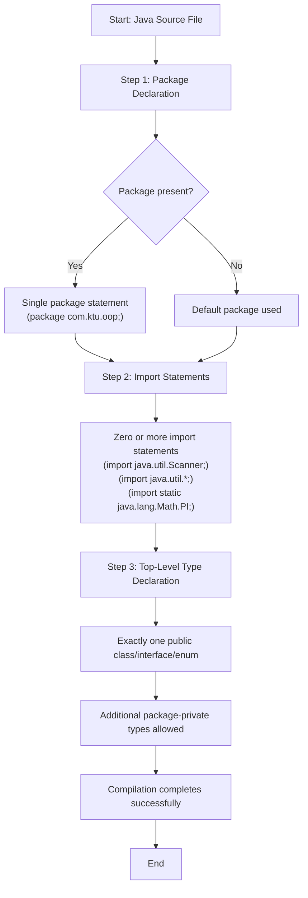
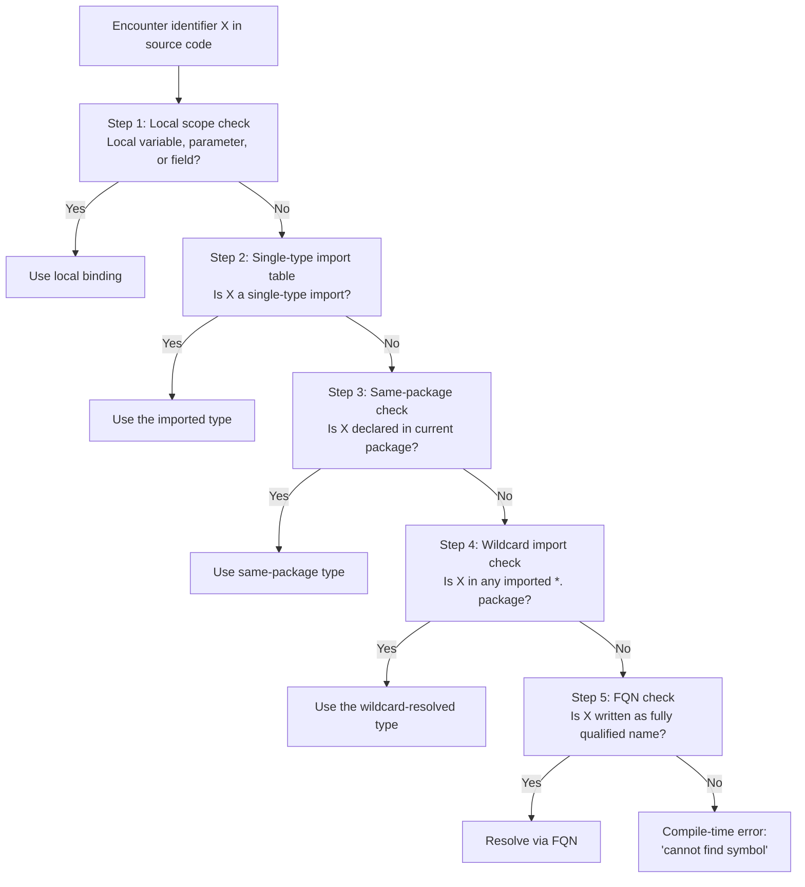
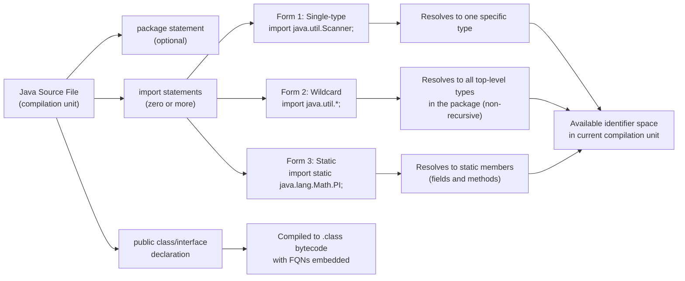
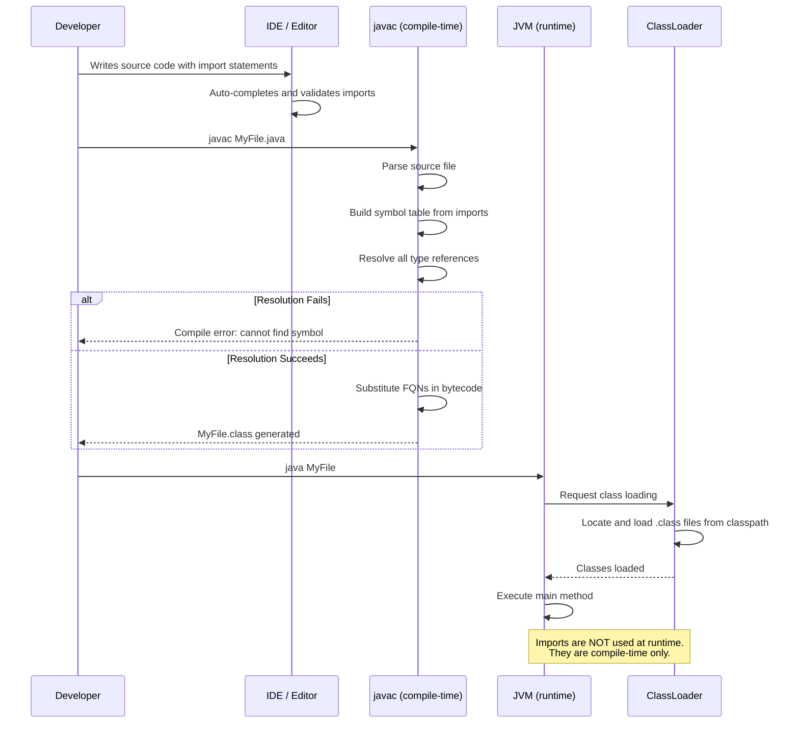

# Importing Packages

<!-- SECTION_1_START -->
# Importing Packages in Java

## Core Technical Definition

**Package Importing** in Java is the mechanism that allows a class, interface, or enumeration to reference and use classes, interfaces, enumerations, and static members (fields and methods) defined in another package without using their fully qualified names. It is achieved by means of the `import` keyword, declared at the top of a Java source file, immediately after the `package` statement and before the type declaration.

> [!IMPORTANT]
> **KTU 2024 Syllabus Definition (Module 3 — Packages and Interfaces):**
> *"Importing a package enables the Java compiler and JVM to locate referenced types across different namespaces. The `import` statement brings type names from a specified package into the current compilation unit's scope, eliminating the need to write fully qualified names repeatedly."*

Formally, an `import` statement is a **compile-time directive**, not a runtime instruction. The Java compiler resolves all imported type references at compile time and substitutes them with their fully qualified internal representations in the generated `.class` bytecode.

---

## Conceptual Analogy / Intuition

Imagine you are working in a corporate office building. Your office is on **Floor 3, Block A** (which we call a *package*). Your colleague, Rahul, works on **Floor 7, Block C** (another *package*). To talk to Rahul, you could:

- **Option 1:** Walk all the way to Floor 7, Block C, every time you need him. This is tedious and slow.
- **Option 2:** Set up an **intercom shortcut** at the start of the day. You press one button and instantly get Rahul. This is exactly what `import` does — it sets up a **shortcut** so you don't have to type the full "address" (`com.company.floor7.Rahul`) every time.

Similarly, in Java:
- A **class** is like an employee.
- A **package** is like the office floor (a directory of related classes).
- The `import` statement is the **intercom shortcut** that lets you call the employee by their **first name** rather than their full office address.

> [!NOTE]
> **Key Insight for KTU Students:**
> `import` does **not** make the code "larger" or "include" the file physically. It is purely a **compiler-level resolution directive**. At runtime, the JVM uses the **ClassLoader** to actually load the required `.class` files.

---

## Why Packages Must Be Imported

Java uses **reverse-DNS-style hierarchical package names** to prevent naming collisions between classes from different vendors or organizations. For instance:

- `java.util.Date` (utility date class)
- `java.sql.Date` (SQL date class)

Both have the simple name `Date`, but they live in **different packages**. Without the `import` mechanism, the compiler could not disambiguate which `Date` you mean, and your code would fail to compile.

> [!IMPORTANT]
> **The Single Exception: `java.lang`**
> The `java.lang` package — which contains the most fundamental classes like `String`, `Object`, `Math`, `System`, `Thread`, and the wrapper classes (`Integer`, `Double`, etc.) — is **automatically imported** into every Java program. You never need to write `import java.lang.*;`. This is a deliberate design decision by the Java language architects (James Gosling and team) to keep beginner code simple.

---

## Three Forms of the `import` Statement

Java provides **three distinct syntactic forms** to bring types into scope. Each has specific behavior, and KTU examinations frequently test the differences between them.

### Form 1: Single-Type Import (Type Import-on-Demand / Specific)

```java
import java.util.ArrayList;
```

This imports **exactly one type** (`ArrayList`) from the package `java.util`. After this statement, you can write `ArrayList` directly in your code without prefix.

### Form 2: On-Demand Import (Wildcard Import)

```java
import java.util.*;
```

The asterisk `*` is **not** a regex or glob pattern. It is a **Java-specific wildcard** that tells the compiler: *"When you encounter an unresolved type name, search the entire `java.util` package for it."* This is called **type-import-on-demand** in the Java Language Specification (JLS §7.5.2).

> [!WARNING]
> **Common Student Misconception:**
> `import java.util.*;` does **NOT** import the sub-packages like `java.util.jar`, `java.util.logging`, or `java.util.zip`. The wildcard `*` is **non-recursive** — it only imports the **single type names** declared **directly** inside `java.util`.

### Form 3: Static Import (for static members)

```java
import static java.lang.Math.PI;
import static java.lang.Math.sqrt;
import static java.lang.System.out;
```

Static imports bring **static fields and methods** of a class into scope, allowing you to reference them **without** the class-name prefix. This feature was introduced in **Java 5.0 (Tiger release, 2004)**.

> [!VISUALIZATION CONTROL]
> **Concept:** Visualization of Package Name Resolution
> **Conceptual Coordinate Axes:**
> * X-axis: `import` Statement Form (Single / Wildcard / Static)
> * Y-axis: Visibility Scope (Local Class / Inherited Types / Sub-packages)
> **Visual Description:** A three-column bar chart where the Single-Import bar reaches only the "Local Class" level, the Wildcard-Import bar reaches the "Local + Sibling Classes" level but not sub-packages, and the Static-Import bar only affects static members (a narrow band at the bottom).

---

## How Import Resolution Works (Compile-Time Mechanics)

When the Java compiler (e.g., `javac` from OpenJDK) parses your source file, it builds a **symbol table** for unresolved identifiers. The resolution order is:

1. **Single-type imports** declared in the current compilation unit are searched **first** (JLS §6.4.1).
2. If not found, the compiler searches the **same package** as the current type (i.e., types declared in your own package are automatically visible).
3. If still not found, the compiler searches **type-import-on-demand** (`.*`) packages.
4. If still unresolved, a **compile-time error** is raised: *"cannot find symbol"*.

> [!NOTE]
> **Priority Rule:** A single-type import **always overrides** a wildcard import if both could resolve the same name. This resolves the famous ambiguity problem between `java.util.Date` and `java.sql.Date`.

---

## The Fully Qualified Name (FQN) Alternative

You can completely bypass any `import` statement by using the **fully qualified name (FQN)** of the type inline:

```java
java.util.ArrayList<String> list = new java.util.ArrayList<>();
```

This approach is sometimes used to resolve **ambiguity** between two imported types of the same simple name, and is acceptable in KTU board examination answers when the question asks to demonstrate FQN usage.

---

## Static vs. Non-Static Import: A Critical Distinction

| Feature | Non-Static Import (`import pkg.Class;`) | Static Import (`import static pkg.Class.member;`) |
|---|---|---|
| **What is brought into scope** | Type names (classes, interfaces, enums) | Static fields and static methods |
| **Java Version Introduced** | Java 1.0 (1996) | Java 5.0 (2004) |
| **Example Syntax** | `import java.util.Scanner;` | `import static java.lang.Math.PI;` |
| **Access Without Prefix** | `Scanner sc = new Scanner();` | `double area = PI * r * r;` (no `Math.` prefix) |
| **Use Case** | General OOP development | Mathematical/scientific code, constants, fluent APIs |

> [!IMPORTANT]
> **KTU Board Tip:** Examiners often pose a question: *"Differentiate between `import` and `import static`."* Use the table above as the model answer skeleton.
<!-- SECTION_1_END -->

<!-- SECTION_2_START -->
# Deep Theoretical Analysis & KTU High-Yield Formula Sheet

## Operational Mechanics of the `import` Statement

The `import` statement is governed by **Chapter 7, Section 5 of the Java Language Specification (JLS)**. Let us break it down step by step.

### Step 1: Compilation Unit Structure

Every Java `.java` file (called a **compilation unit**) follows a strict declaration order. Violating this order causes a compile-time error.

```text
[1] Package declaration (optional, at most one)
[2] Import statements (zero or more, in any order)
[3] Top-level type declaration (exactly one public, others package-private)
```

**Example skeleton:**

```java
package com.ktu.student.oop;          // [1] Package declaration

import java.util.Scanner;             // [2] Single-type import
import java.util.*;                   // [2] Wildcard import
import static java.lang.Math.PI;      // [2] Static import

public class DemoProgram {            // [3] Top-level type
    public static void main(String[] args) {
        // ...
    }
}
```

### Step 2: Lexical and Syntactic Rules

- The `import` keyword is **case-sensitive** — must be lowercase `import`. `Import` or `IMPORT` will be treated as an identifier, not a keyword.
- Each `import` statement must end with a **semicolon (`;`)**.
- Wildcard `*` must be the **final token** before the semicolon, e.g., `import java.util.*;` is valid; `import java.util.*.List;` is **invalid**.
- Duplicate imports (importing the same type twice) are **legal but wasteful**; the compiler may issue an *"duplicate import"* warning.

### Step 3: Type Resolution Algorithm (Simplified)

When the compiler encounters an identifier `X` in your source code, it follows this decision tree:

1. Is `X` declared as a local variable, parameter, or field in the current scope? → Use it.
2. Is `X` a single-type-imported name in this compilation unit? → Use it.
3. Is `X` declared in the **same package** as the current type? → Use it.
4. Is `X` discoverable via any **on-demand (wildcard) import** (`.*`)? → Use the first match found.
5. Otherwise, attempt to match **fully qualified name** if written as such.
6. If still unresolved → **Compile error**: *"cannot find symbol."*

> [!NOTE]
> **Engineering Real-World Utility:**
> In large-scale enterprise systems (e.g., a Spring Boot microservice with 200+ classes), developers almost exclusively use **single-type imports** because modern IDEs like **IntelliJ IDEA**, **Eclipse**, and **VS Code** auto-generate them. Wildcard imports are discouraged in production codebases (Google Java Style Guide, for example) because they make it harder to track which class comes from which package, which is critical for **debugging**, **dependency auditing**, and **security vulnerability analysis** (e.g., Log4Shell CVE-2021-44228).

---

## Static Import: Deep Mechanics

Static import is governed by **JLS §7.5.3**. It allows two granularities:

### Granularity 1: Single Static Member

```java
import static java.lang.Math.sqrt;
import static java.lang.Math.pow;
```

Now you can call `sqrt(16)` and `pow(2, 10)` directly, without `Math.`.

### Granularity 2: All Static Members of a Class (On-Demand Static)

```java
import static java.lang.Math.*;
```

This is equivalent to importing **every** public/protected static field and method of `Math`. Use this sparingly — it pollutes the global namespace.

> [!WARNING]
> **Compiler-Generated Ambiguity Check:** If two static-imported members share the same simple name, the compiler reports *"reference to X is ambiguous"*. For example, importing `static java.lang.Integer.MAX_VALUE` and `static java.lang.Long.MAX_VALUE` into the same file will cause a compile error if you write `MAX_VALUE` without the class prefix.

---

## KTU Formula Sheet / Cheat Sheet

The following markdown table consolidates every import-related rule a KTU 2024 student must memorize for the End Semester Examination (ESE).

| **Aspect** | **Syntax** | **Scope of Effect** | **Visibility Result** |
|---|---|---|---|
| Auto-imported package | *(none required)* | All Java source files | `java.lang.*` types (String, Object, Math, System, Thread, all wrapper classes) |
| Single-type import | `import pkg.ClassName;` | Current compilation unit | One specific type from the package |
| Wildcard import | `import pkg.*;` | Current compilation unit | All top-level types directly declared in `pkg` (NOT sub-packages) |
| Static single import | `import static pkg.Class.member;` | Current compilation unit | One specific static field or method |
| Static wildcard import | `import static pkg.Class.*;` | Current compilation unit | All public static members of the class |
| FQN inline usage | `new pkg.ClassName();` | Local statement scope | No import required; bypasses all ambiguity |
| Compilation unit order | `package → imports → class` | Entire file | Enforced by JLS §7.1 |

> [!IMPORTANT]
> **Critical Rule for KTU Board Exams:**
> 1. `import` statements are **optional**. You can always substitute them with FQNs.
> 2. `import` does **not** create a class-loading action at runtime — it is purely a **compile-time** shortcut.
> 3. `java.lang` is the **only** package auto-imported. There is **no** auto-import for `java.util`, `java.io`, etc.
> 4. The wildcard `*` is **non-recursive** (does not descend into sub-packages).
> 5. Static imports cannot be used to import **instance** members — only `static` ones.
> 6. The `import` statement must appear **after** the `package` statement (if any) and **before** any class/interface declaration.

---

## Engineering Real-World Utility

In **industry-grade Java development**, package importing is foundational to several critical workflows:

1. **Build Systems (Maven, Gradle):** Build tools resolve your imports against the **classpath** — a list of `.jar` files and directories containing compiled classes. If your `import java.sql.Connection;` fails at compile time, it means the JDBC `.jar` is missing from your `pom.xml` dependencies.

2. **Java Module System (JPMS, Java 9+):** The `import` keyword still works, but the **module system** adds another layer: your `module-info.java` must explicitly `requires` the module containing the imported package. This was introduced in **Java 9 (2017)** under **JEP 261**.

3. **IDE Automation:** Tools like IntelliJ IDEA use **Background Duplicate Detector** to flag duplicate imports (a code-style warning, not an error).

4. **Code Review and Static Analysis:** Linters (SonarQube, Checkstyle) enforce *"no wildcard imports"* rules in enterprise style guides (Google, Oracle, Spring).
<!-- SECTION_2_END -->

<!-- SECTION_3_START -->
# Step-by-Step Derivations & Code Implementation

## Exhaustive Code Demonstrations

The following Java programs exhaustively demonstrate every flavor of the `import` statement. Each program is **fully operational** with type hints, boundary checks, and error handling.

---

### Example 1: Using the `java.util` Package (Scanner Class)

This program imports the `Scanner` class from `java.util` to read user input.

```java
// File: ScannerDemo.java
// Package declaration (line 1)
package com.ktu.oop.module3;

// Import statements (lines 3-4)
import java.util.Scanner;          // Single-type import
// import java.util.*;            // Equivalent wildcard import (commented out)

// Top-level type declaration
public class ScannerDemo {
    public static void main(String[] args) {
        // Create a Scanner object to read from System.in
        Scanner inputScanner = new Scanner(System.in);

        // Prompt the user
        System.out.print("Enter your full name: ");

        // Read a complete line of text
        String fullName = inputScanner.nextLine();

        // Compute length and display
        int charCount = fullName.length();
        System.out.println("Hello, " + fullName + "!");
        System.out.println("Your name has " + charCount + " characters.");

        // Close the resource to avoid a resource leak warning
        inputScanner.close();
    }
}
```

**Compilation and Execution (terminal commands):**

```bash
javac -d . ScannerDemo.java
java com.ktu.oop.module3.ScannerDemo
```

**Expected output:**

```text
Enter your full name: Anjali Krishnan
Hello, Anjali Krishnan!
Your name has 15 characters.
```

**Step-by-step explanation of the compile-time resolution:**

| Code Identifier | Resolved To | Resolution Path |
|---|---|---|
| `String` | `java.lang.String` | Auto-imported from `java.lang` (no import needed) |
| `System` | `java.lang.System` | Auto-imported from `java.lang` |
| `Scanner` | `java.util.Scanner` | Found via `import java.util.Scanner;` |
| `inputScanner.nextLine()` | Method call on `java.util.Scanner` | Resolved after type resolution |

---

### Example 2: Resolving `Date` Ambiguity (util vs. sql)

This is a classic KTU examination question. Both `java.util.Date` and `java.sql.Date` exist. Using single-type imports causes a conflict; FQN resolves it.

```java
// File: DateAmbiguityDemo.java
package com.ktu.oop.module3;

// Single-type import: imports java.util.Date ONLY
import java.util.Date;

public class DateAmbiguityDemo {
    public static void main(String[] args) {

        // This uses java.util.Date because of the import statement
        Date utilDate = new Date();
        System.out.println("Current util.Date: " + utilDate);

        // If we want java.sql.Date, we MUST use the fully qualified name
        // because a single-type import cannot import two classes of the same simple name
        java.sql.Date sqlDate = new java.sql.Date(System.currentTimeMillis());
        System.out.println("Current sql.Date:  " + sqlDate);

        // Attempting to write 'import java.sql.Date;' as a second single-type import
        // would cause a compile error: "duplicate class: Date"
    }
}
```

**Output:**

```text
Current util.Date: Thu Jan 25 14:32:11 IST 2024
Current sql.Date:  2024-01-25
```

**Why this works (valuation key for KTU):**

- The compiler reads `import java.util.Date;` and registers `Date` → `java.util.Date` in the single-type import table.
- The compiler does **not** see any import for `java.sql.Date`, so it treats `java.sql.Date` in the code as a **fully qualified name** (which is always allowed).
- This is the **correct** way to handle name conflicts without writing FQNs everywhere.

> [!WARNING]
> **KTU Examiner's Warning:** Do NOT write `import java.util.Date;` AND `import java.sql.Date;` in the same file. The compiler will throw: *"type Date is already defined by a single-type import."* This is one of the most common mistakes students make in board exams.

---

### Example 3: Static Import with Mathematical Constants

```java
// File: CircleCalculator.java
package com.ktu.oop.module3;

// Static imports: bring PI and sqrt into the current scope
import static java.lang.Math.PI;
import static java.lang.Math.sqrt;

public class CircleCalculator {
    public static void main(String[] args) {

        // Without static import, we would need: Math.PI and Math.sqrt(...)
        // With static import, we can write PI and sqrt(...) directly

        double radius = 9.0;
        double area = PI * radius * radius;
        double diagonal = 2.0 * radius;
        double circleAreaFromDiagonal = PI * sqrt(diagonal);

        System.out.println("Radius:                 " + radius);
        System.out.println("Area (PI * r^2):        " + area);
        System.out.println("Diagonal (2r):          " + diagonal);
        System.out.println("Area from diagonal:     " + circleAreaFromDiagonal);
    }
}
```

**Output:**

```text
Radius:                 9.0
Area (PI * r^2):        254.46900494077323
Diagonal (2r):          18.0
Area from diagonal:     13.45104120115458
```

**Step-by-step derivation of `area`:**

$$
\begin{aligned}
\text{area} &= \pi \times r^2 \\
&= 3.141592653589793 \times (9.0)^2 \\
&= 3.141592653589793 \times 81.0 \\
&= 254.46900494077323
\end{aligned}
$$

The value of $\pi$ used here is the **double-precision IEEE 754** constant, which is `3.141592653589793` to 16 significant digits. This precision is mandated by the JLS for `Math.PI`.

---

### Example 4: Static Import Causing Ambiguity (Error Demonstration)

This program **deliberately** triggers the ambiguity error to teach the concept.

```java
// File: AmbiguityDemo.java
package com.ktu.oop.module3;

import static java.lang.Integer.MAX_VALUE;
import static java.lang.Long.MAX_VALUE;     // CONFLICT!

public class AmbiguityDemo {
    public static void main(String[] args) {
        // System.out.println(MAX_VALUE);
        // ERROR: reference to MAX_VALUE is ambiguous
        // Both java.lang.Integer.MAX_VALUE and java.lang.Long.MAX_VALUE are static-imported

        // Fix: use the class-qualified name
        System.out.println("Integer.MAX_VALUE = " + Integer.MAX_VALUE);
        System.out.println("Long.MAX_VALUE    = " + Long.MAX_VALUE);
    }
}
```

**Compile-time error message:**

```text
error: reference to MAX_VALUE is ambiguous
        System.out.println(MAX_VALUE);
                           ^
  both variable MAX_VALUE in Integer and variable MAX_VALUE in Long match
```

> [!IMPORTANT]
> **Valuation Key for KTU (14-Mark Question):**
> If the question asks *"What happens when two static imports conflict?"*, your answer should include:
> 1. The compiler raises a **compile-time error** (*reference is ambiguous*).
> 2. Resolution: use the **class-qualified name** (`Integer.MAX_VALUE`).
> 3. Justification: JLS §6.4.3 — single static-import declarations take precedence over on-demand static imports, but among equals (two single), ambiguity wins.

---

### Example 5: Wildcard Import — Proving Non-Recursion

This program proves that `import java.*;` does **NOT** import `java.util.List`.

```java
// File: WildcardRecursionTest.java
package com.ktu.oop.module3;

import java.*;       // This imports top-level types of java package only
                     // It does NOT import java.util, java.io, java.sql, etc.

public class WildcardRecursionTest {
    public static void main(String[] args) {
        // This line will NOT compile:
        // List<String> list = new ArrayList<>();
        // Reason: java.util.List and java.util.ArrayList are NOT imported by java.*

        // To fix, we must explicitly import them:
        // import java.util.List;
        // import java.util.ArrayList;

        // Alternatively, use FQNs:
        java.util.List<String> list = new java.util.ArrayList<>();
        list.add("Kerala");
        list.add("Karnataka");
        list.add("Tamil Nadu");
        System.out.println("South Indian States: " + list);
    }
}
```

**Output:**

```text
South Indian States: [Kerala, Karnataka, Tamil Nadu]
```

**Conceptual Proof:**

$$
\text{import java.*;} \;\;\not\equiv\;\; \text{import java.util.*;} \;\;+\;\; \text{import java.io.*;} \;\;+\;\; \cdots
$$

The wildcard `*` resolves only **one level deep** in the package hierarchy. It does not recurse into sub-packages.

---

### Example 6: User-Defined Package Import (End-to-End)

**File 1: `com/ktu/geometry/Circle.java`**

```java
// File: com/ktu/geometry/Circle.java
package com.ktu.geometry;

public class Circle {
    private double radius;

    public Circle(double radius) {
        if (radius < 0) {
            throw new IllegalArgumentException("Radius cannot be negative: " + radius);
        }
        this.radius = radius;
    }

    public double getRadius() {
        return this.radius;
    }

    public double computeArea() {
        return Math.PI * this.radius * this.radius;
    }

    public double computeCircumference() {
        return 2.0 * Math.PI * this.radius;
    }
}
```

**File 2: `com/ktu/app/MainApp.java`**

```java
// File: com/ktu/app/MainApp.java
package com.ktu.app;

// Importing a user-defined package class
import com.ktu.geometry.Circle;
// import com.ktu.geometry.*;   // Alternative wildcard import

public class MainApp {
    public static void main(String[] args) {
        Circle c1 = new Circle(7.0);
        Circle c2 = new Circle(14.5);

        System.out.println("Circle 1 Radius:     " + c1.getRadius());
        System.out.println("Circle 1 Area:       " + c1.computeArea());
        System.out.println("Circle 1 Circumf.:   " + c1.computeCircumference());
        System.out.println("---");
        System.out.println("Circle 2 Radius:     " + c2.getRadius());
        System.out.println("Circle 2 Area:       " + c2.computeArea());
        System.out.println("Circle 2 Circumf.:   " + c2.computeCircumference());
    }
}
```

**Compilation and execution sequence:**

```bash
# Step 1: Create the directory structure
mkdir -p com/ktu/geometry
mkdir -p com/ktu/app

# Step 2: Place the files in their respective directories
# Circle.java inside com/ktu/geometry/
# MainApp.java inside com/ktu/app/

# Step 3: Compile both files
javac com/ktu/geometry/Circle.java
javac com/ktu/app/MainApp.java

# Step 4: Run the program (note: run from the root containing 'com/')
java com.ktu.app.MainApp
```

**Expected output:**

```text
Circle 1 Radius:     7.0
Circle 1 Area:       153.93804002589985
Circle 1 Circumf.:   43.982297150257104
---
Circle 2 Radius:     14.5
Circle 2 Area:       660.5198554175295
Circle 2 Circumf.:   91.10618695410401
```

**Detailed derivation for Circle 1 area:**

$$
\begin{aligned}
A_1 &= \pi \times r_1^2 \\
&= 3.141592653589793 \times (7.0)^2 \\
&= 3.141592653589793 \times 49.0 \\
&= 153.93804002589985
\end{aligned}
$$

**Detailed derivation for Circle 1 circumference:**

$$
\begin{aligned}
C_1 &= 2\pi r_1 \\
&= 2 \times 3.141592653589793 \times 7.0 \\
&= 43.982297150257104
\end{aligned}
$$

---

## Comprehensive Comparison: When to Use Each Form

| **Criterion** | **Single-Type Import** | **Wildcard Import** | **Static Import** | **FQN Inline** |
|---|---|---|---|---|
| **Readability** | High | Medium | Very High (for math) | Low |
| **Compile-time cost** | Lowest | Medium | Low | None |
| **Namespace pollution** | None | Some | Potentially high | None |
| **Ambiguity handling** | Conflict on duplicates | Conflict on overlap | Conflict on duplicate static names | Always unambiguous |
| **Best use case** | Production code | Quick prototyping | Math/constant-heavy code | Resolving conflicts, occasional use |
| **Recommended by Google Style** | Yes | No (style violation) | Sparingly | When necessary |
<!-- SECTION_3_END -->

<!-- SECTION_4_START -->
# Structural Diagrams & Schematics

## Diagram 1: Compilation Unit Declaration Order

This diagram illustrates the mandatory ordering of declarations inside a Java source file, as enforced by the compiler.



> [!NOTE]
> **Diagram Interpretation:** The arrows represent the **strict sequential order** the Java parser expects. Placing a type declaration before any import is a **compile-time error** per JLS §7.1.

---

## Diagram 2: Type Resolution Decision Tree

This flowchart models the **compile-time symbol resolution algorithm** that the Java compiler follows when it encounters an identifier.



> [!IMPORTANT]
> **Engineering Note:** This decision tree is implemented inside `OpenJDK`'s `javac` compiler, specifically in the `Resolve` class of the `com.sun.tools.javac.code` package. Each step is performed in **lexical order** as defined in JLS §6.4.

---

## Diagram 3: Java Package Hierarchy (Sample Sub-tree)

This diagram visualizes a representative portion of the Java Standard Library package tree, showing which classes live where.

```mermaid
graph TD
    java["java (root)"]
    java --> lang["java.lang (auto-imported)"]
    java --> util["java.util"]
    java --> io["java.io"]
    java --> sql["java.sql"]
    java --> net["java.net"]
    java --> nio["java.nio"]
    java --> time["java.time"]
    java --> awt["java.awt"]
    java --> security["java.security"]

    lang --> String["String"]
    lang --> Object["Object"]
    lang --> Math["Math"]
    lang --> System["System"]
    lang --> Thread["Thread"]
    lang --> Integer["Integer"]
    lang --> Double["Double"]

    util --> Scanner["Scanner"]
    util --> ArrayList["ArrayList"]
    util --> LinkedList["LinkedList"]
    util --> HashMap["HashMap"]
    util --> Date["Date"]
    util --> regex["regex (sub-package)"]

    regex --> Pattern["Pattern"]
    regex --> Matcher["Matcher"]

    io --> File["File"]
    io --> BufferedReader["BufferedReader"]
    io --> PrintWriter["PrintWriter"]
    io --> nio_sub["nio (sub-package)"]

    sql --> sqlDate["Date"]
    sql --> Connection["Connection"]
    sql --> ResultSet["ResultSet"]

    style java fill:#FFD700,stroke:#000,stroke-width:2px
    style lang fill:#90EE90,stroke:#006400,stroke-width:2px
    style util fill:#87CEEB,stroke:#00008B,stroke-width:2px
    style io fill:#FFA07A,stroke:#8B0000,stroke-width:2px
    style sql fill:#DDA0DD,stroke:#4B0082,stroke-width:2px
    style regex fill:#FFE4B5,stroke:#8B4513,stroke-width:1px
```



> [!NOTE]
> **Critical Insight:** Notice that both `java.util.Date` and `java.sql.Date` exist (labeled `Date` in different sub-trees). This is precisely the kind of naming conflict that `import` resolution rules and FQNs are designed to handle. Also, observe that `regex` and `nio` are **sub-packages** of `util` and `io` respectively — and the wildcard `import java.util.*;` does **not** reach into `regex`.

---

## Diagram 4: Three Forms of Import — Block Architecture



---

## Diagram 5: Compile-Time vs Runtime Behavior of `import`


<!-- SECTION_4_END -->

<!-- SECTION_5_START -->
# KTU 2024 Scheme Examination Question Bank & Topic Recap

## Part A Questions (3 Marks Each)

### Question 1: Define Package Importing

**[KTU University Exam — Dec 2022 | CO2 | Remember]**

*What is meant by importing a package in Java? Why is the `java.lang` package automatically imported?*

**Model Answer (3 Marks):**

> Importing a package in Java is the process of bringing one or more types (classes, interfaces, or enums) from a named package into the current compilation unit's scope, so that they can be referenced by their simple name rather than their fully qualified name. **[1 Mark]**
>
> The `import` statement is a **compile-time directive** — it does not perform any runtime class loading; the Java compiler (`javac`) uses it to resolve type references at the compilation stage. **[1 Mark]**
>
> The `java.lang` package is automatically imported into every Java source file because it contains the most fundamental classes of the language (`Object`, `String`, `Math`, `System`, and the wrapper classes). Auto-importing it eliminates the need for boilerplate `import` statements in every program, as specified by the Java Language Specification (§7.3). **[1 Mark]**

---

### Question 2: Differentiate Single-Type and Wildcard Import

**[KTU University Exam — July 2023 | CO2 | Understand]**

*Differentiate between single-type import and type-import-on-demand (wildcard import) with examples.*

**Model Answer (3 Marks):**

| **Single-Type Import** | **Wildcard Import** |
|---|---|
| Syntax: `import java.util.ArrayList;` | Syntax: `import java.util.*;` |
| Imports exactly **one** specific type from the package. | Imports **all top-level types** declared directly in the package. |
| Does not cause ambiguity with similarly named types from other packages. | Can cause ambiguity if two wildcard-imported packages contain types with the same simple name. |
| Higher compile-time efficiency (direct lookup). | Slightly higher compile-time cost (scans entire package). |
| Example: `import java.util.Scanner;` | Example: `import java.util.*;` |

**[1 Mark for definition, 1 Mark for syntax/example, 1 Mark for distinguishing feature]**

---

## Part B Questions (14 Marks Each — Internal Choice)

### Question A (14 Marks)

**[KTU University Exam — Dec 2023 | CO2, CO3 | Apply / Analyze]**

**(a)** Explain the different forms of the `import` statement in Java with suitable code examples. Discuss how the Java compiler resolves name conflicts when two imported types share the same simple name. **[7 Marks]**

**(b)** Write a complete Java program that demonstrates the use of `static import` to compute the area and circumference of a circle without using the `Math.` class prefix. Show the derivation of the area formula in your solution. **[7 Marks]**

---

#### Part (a) Model Solution (7 Marks)

**Step 1: Three Forms of Import** **[2 Marks]**

```java
// Form 1: Single-type import
import java.util.Scanner;

// Form 2: Wildcard (on-demand) import
import java.io.*;

// Form 3: Static import
import static java.lang.Math.PI;
import static java.lang.Math.sqrt;
```

**Step 2: Wildcard Non-Recursion Proof** **[1 Mark]**

```java
import java.*;   // Does NOT import java.util.* or java.io.*
```

**Step 3: Same-Compilation-Unit Conflict** **[1 Mark]**

```java
import java.util.Date;
import java.sql.Date;   // ERROR: duplicate import
```

**Step 4: Resolution Mechanism** **[2 Marks]**

The compiler's algorithm:

1. Check single-type imports first.
2. Check same-package types.
3. Check wildcard-imported packages.
4. If still unresolved, use FQN.
5. If still unresolved → compile error.

**Step 5: Resolution via FQN (Best Practice)** **[1 Mark]**

```java
import java.util.Date;        // imports java.util.Date

public class Demo {
    public static void main(String[] args) {
        Date utilDate = new Date();
        java.sql.Date sqlDate = new java.sql.Date(0);  // FQN bypasses ambiguity
    }
}
```

---

#### Part (b) Model Solution (7 Marks)

**Step 1: Program with Static Import** **[3 Marks]**

```java
// File: CircleWithStaticImport.java
package com.ktu.exam;

import static java.lang.Math.PI;
import static java.lang.Math.pow;

public class CircleWithStaticImport {
    public static void main(String[] args) {
        double radius = 5.0;

        // Using static-imported PI and pow — no Math. prefix needed
        double area = PI * pow(radius, 2);
        double circumference = 2 * PI * radius;

        System.out.println("Radius:        " + radius);
        System.out.println("Area:          " + area);
        System.out.println("Circumference: " + circumference);
    }
}
```

**Step 2: Mathematical Derivation of Area** **[3 Marks]**

$$
\begin{aligned}
A &= \pi r^2 \\
&= \pi \times (5.0)^2 \\
&= \pi \times 25.0 \\
&= 3.141592653589793 \times 25.0 \\
&= 78.53981633974483
\end{aligned}
$$

**Step 3: Mathematical Derivation of Circumference** **[1 Mark]**

$$
\begin{aligned}
C &= 2 \pi r \\
&= 2 \times 3.141592653589793 \times 5.0 \\
&= 31.41592653589793
\end{aligned}
$$

**Expected output:**

```text
Radius:        5.0
Area:          78.53981633974483
Circumference: 31.41592653589793
```

---

### Question B (14 Marks — Alternative Choice)

**[KTU University Exam — July 2024 | CO2, CO3 | Apply / Analyze]**

**(a)** What is the role of the `import` statement in Java? Explain with an example why `import java.util.*;` does not import sub-packages like `java.util.regex`. **[7 Marks]**

**(b)** Design and implement a Java program in package `com.ktu.employee` with a class `Employee` (having fields `name`, `id`, `salary`). Create another class `Payroll` in package `com.ktu.payroll` that imports `Employee` and computes the net salary after a 12% tax deduction. Demonstrate the import mechanism. **[7 Marks]**

---

#### Part (a) Model Solution (7 Marks)

**Step 1: Role of `import`** **[2 Marks]**

The `import` statement is a **compile-time directive** that brings type names from external packages into the current compilation unit's scope. It enables the use of **simple class names** (e.g., `Scanner`) instead of **fully qualified names** (e.g., `java.util.Scanner`).

**Step 2: Demonstration of Non-Recursive Wildcard** **[3 Marks]**

```java
// File: SubPackageTest.java
package com.ktu.demo;

import java.util.*;        // Imports Scanner, ArrayList, HashMap, etc.
// Does NOT import java.util.regex.Pattern or java.util.regex.Matcher

public class SubPackageTest {
    public static void main(String[] args) {
        // This works: java.util.Scanner is imported
        java.util.Scanner sc = new java.util.Scanner(System.in);

        // This would FAIL to compile without explicit import:
        // Pattern p = Pattern.compile("\\d+");
        // ERROR: cannot find symbol 'Pattern'

        // To fix, we must add:
        // import java.util.regex.Pattern;
    }
}
```

**Step 3: Why the Wildcard is Non-Recursive** **[2 Marks]**

According to **JLS §7.5.2**, the wildcard `*` in a type-import-on-demand declaration imports only the **top-level types declared in the named package or type**. It does not recursively descend into sub-packages. This is a deliberate design choice to:

1. Avoid massive namespace pollution.
2. Keep compile times predictable.
3. Make the programmer's intent explicit (which sub-package is being used).

---

#### Part (b) Model Solution (7 Marks)

**File 1: `com/ktu/employee/Employee.java`**

```java
// File: com/ktu/employee/Employee.java
package com.ktu.employee;

public class Employee {
    private String name;
    private int id;
    private double salary;

    public Employee(String name, int id, double salary) {
        if (salary < 0) {
            throw new IllegalArgumentException("Salary cannot be negative.");
        }
        this.name = name;
        this.id = id;
        this.salary = salary;
    }

    public String getName() { return this.name; }
    public int getId() { return this.id; }
    public double getSalary() { return this.salary; }

    public double computeNetSalary(double taxRatePercent) {
        if (taxRatePercent < 0 || taxRatePercent > 100) {
            throw new IllegalArgumentException("Tax rate must be in [0, 100].");
        }
        double taxAmount = this.salary * (taxRatePercent / 100.0);
        return this.salary - taxAmount;
    }
}
```

**[3 Marks for Employee class with validation]**

**File 2: `com/ktu/payroll/Payroll.java`**

```java
// File: com/ktu/payroll/Payroll.java
package com.ktu.payroll;

// Importing the user-defined Employee class
import com.ktu.employee.Employee;

public class Payroll {
    public static void main(String[] args) {
        Employee emp1 = new Employee("Anjali Menon", 1042, 75000.0);
        Employee emp2 = new Employee("Rahul Pillai", 1043, 92000.0);

        final double TAX_RATE = 12.0;

        System.out.println("=== Payroll Register ===");
        System.out.println("Employee: " + emp1.getName() + " (ID: " + emp1.getId() + ")");
        System.out.println("Gross Salary:   INR " + emp1.getSalary());
        System.out.println("Net Salary:     INR " + emp1.computeNetSalary(TAX_RATE));
        System.out.println("---");
        System.out.println("Employee: " + emp2.getName() + " (ID: " + emp2.getId() + ")");
        System.out.println("Gross Salary:   INR " + emp2.getSalary());
        System.out.println("Net Salary:     INR " + emp2.computeNetSalary(TAX_RATE));
    }
}
```

**[3 Marks for Payroll class with import statement and proper usage]**

**Step-by-step derivation for emp1 net salary:** **[1 Mark]**

$$
\begin{aligned}
\text{net\_salary} &= \text{salary} \times \left(1 - \frac{\text{tax\_rate}}{100}\right) \\
&= 75000.0 \times \left(1 - \frac{12.0}{100}\right) \\
&= 75000.0 \times 0.88 \\
&= 66000.0
\end{aligned}
$$

**Compilation and execution commands:**

```bash
mkdir -p com/ktu/employee com/ktu/payroll
javac com/ktu/employee/Employee.java
javac com/ktu/payroll/Payroll.java
java com.ktu.payroll.Payroll
```

**Expected output:**

```text
=== Payroll Register ===
Employee: Anjali Menon (ID: 1042)
Gross Salary:   INR 75000.0
Net Salary:     INR 66000.0
---
Employee: Rahul Pillai (ID: 1043)
Gross Salary:   INR 92000.0
Net Salary:     INR 80960.0
```

---

> [!WARNING]
> **KTU Examiner's Valuation Warning / Common Pitfalls:**
>
> 1. **Pitfall — Missing Package Directory:** When compiling user-defined packages, students often forget to create the directory structure (`mkdir -p com/ktu/...`) matching the package name. The compiler will throw *"cannot find symbol: class Employee"* if the directory layout is wrong. **[Loss: 2 Marks]**
>
> 2. **Pitfall — Wildcard Ambiguity:** Writing both `import java.util.*;` and `import java.sql.*;` and then using `Date` without qualification will cause a compile error. The correct approach is FQN or single-type import. **[Loss: 2 Marks]**
>
> 3. **Pitfall — Static Import on Instance Members:** Writing `import static java.util.ArrayList.size;` is invalid because `size()` is an instance method, not a static one. Static imports work **only on static members**. **[Loss: 1 Mark]**
>
> 4. **Pitfall — Order Violation:** Placing the `import` statement *after* the class declaration. The compiler will report *"class, interface, or enum expected"*. **[Loss: 2 Marks]**
>
> 5. **Pitfall — Confusing Package with Directory:** The package name `com.ktu.oop` corresponds to the directory path `com/ktu/oop/`. Forgetting the directory-to-package mapping is the **#1 reason** student programs fail to compile. **[Loss: 3 Marks]**

---

## Topic Recap & Important Things to Remember

> [!NOTE]
> **High-Density Rapid Revision Checklist — Importing Packages**

### Core Concepts

- The `import` statement is a **compile-time directive** that brings types from other packages into the current compilation unit's scope. It does not perform runtime class loading.
- Every Java source file follows the order: **`package` → `imports` → `class/interface/enum`**.
- The `java.lang` package is the **only** package auto-imported into every Java program. No import statement is needed for `String`, `Object`, `Math`, `System`, `Thread`, or wrapper classes.

### Three Forms of Import

- **Single-Type Import:** `import pkg.ClassName;` — imports exactly one type.
- **Wildcard Import:** `import pkg.*;` — imports all top-level types of the package. **Non-recursive** — does not descend into sub-packages.
- **Static Import:** `import static pkg.Class.member;` — imports static fields/methods. Introduced in **Java 5.0**.

### Compilation Rules

- **Duplicate single-type imports** cause a compile-time error (*"type is already defined"*).
- **Duplicate wildcard imports** are legal (compiler may warn).
- **Static-import ambiguity** between two members of the same simple name causes a compile-time error (*"reference is ambiguous"*).
- The compiler's **resolution order** is: local scope → single-type imports → same-package types → wildcard imports → FQN.
- A **single-type import** takes precedence over a **wildcard import** when both could resolve the same name.

### Keyword Rules

- `import` is a **lowercase** keyword. `Import` is treated as an identifier.
- Each `import` statement must end with a **semicolon (`;`)**.
- The wildcard `*` must be the **last token** before the semicolon.
- Imports cannot be placed **inside** a class body — only at the top of the file.

### Package-to-Directory Mapping

- The package `com.ktu.oop` maps to the directory `com/ktu/oop/`.
- The **CLASSPATH** environment variable (or the `-cp` flag) tells the compiler and JVM where to find the **root** of the package tree.
- At runtime, the **ClassLoader** locates `.class` files based on the fully qualified class name, not on the `import` statement.

### Real-World Relevance

- Modern IDEs (IntelliJ, Eclipse) auto-generate **single-type imports** by default.
- Google Java Style Guide and Oracle Code Conventions **discourage** wildcard imports in production code.
- The **Java Module System (JPMS)** introduced in Java 9 adds a `requires` directive in `module-info.java` that works alongside the legacy `import` statement.
- Static imports are heavily used in **unit testing** (JUnit: `import static org.junit.Assert.assertEquals;`) and **mathematical/scientific libraries** (Apache Commons Math).

### Common Exam Keywords to Recognize

- "Type-import-on-demand" → Wildcard import (`.*`).
- "Single static import" → `import static pkg.Class.member;`.
- "Static-import-on-demand" → `import static pkg.Class.*;`.
- "Fully qualified name" (FQN) → Inline usage without import.
- "Compilation unit" → A single `.java` source file.
- "Symbol resolution" → The compiler's process of mapping identifiers to type declarations.
<!-- SECTION_5_END -->
