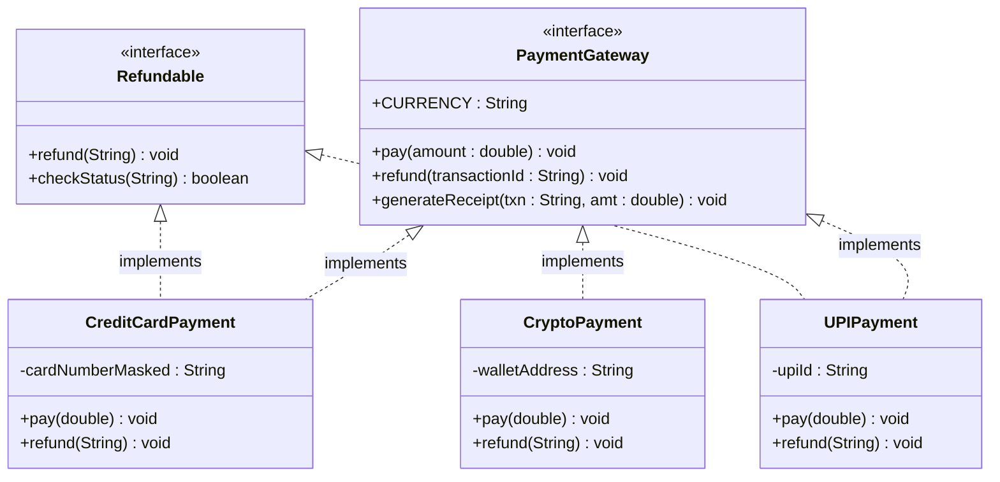
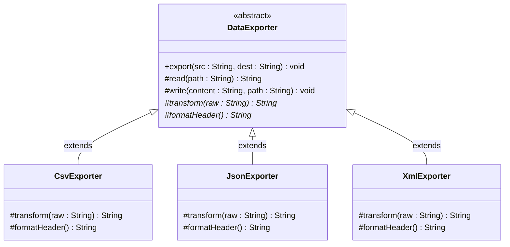
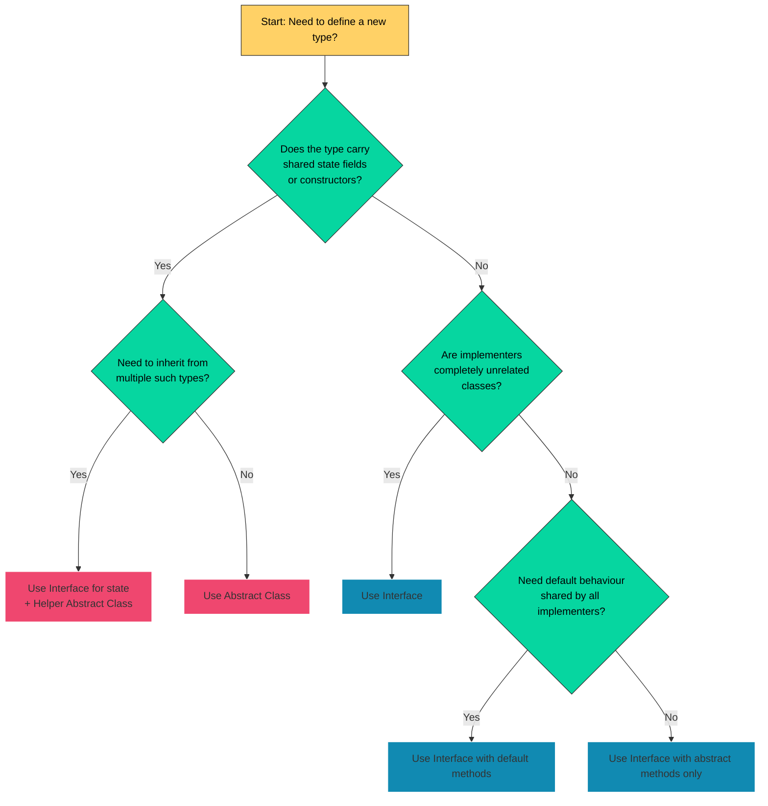
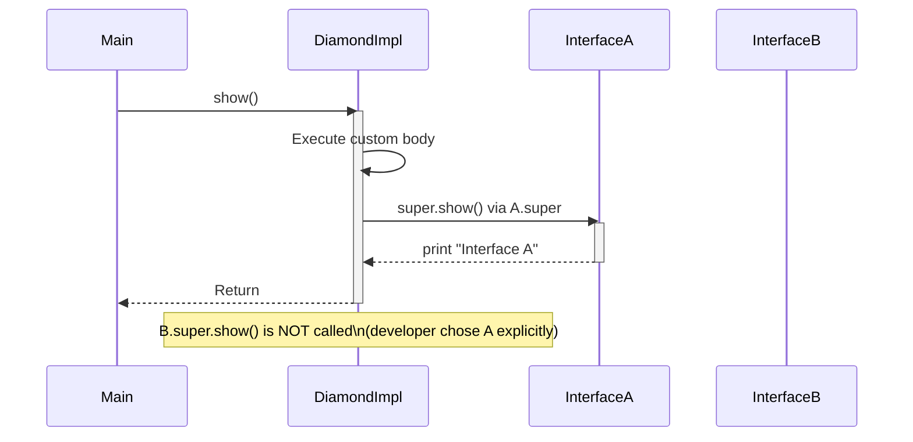

# Interfaces  - Interfaces v/s Abstract classes

<!-- SECTION_1_START -->
# Module 3: Packages and Interfaces
## Topic: Interfaces — Interfaces vs Abstract Classes

> [!IMPORTANT]
> **KTU 2024 Scheme | OECST615 | Module 3 Focus Area**
> This note maps to **CO3: Implement Object Oriented Programming concepts using Java**, aligned with **RBT Levels: Understand (L2) → Apply (L3) → Analyze (L4)**.

---

## 1. Core Technical Definition & Intuitive Overview

### 1.1 What is an Interface?

> [!NOTE]
> **Formal Definition (KTU 2024 Syllabus)**
> An **interface** in Java is a *blueprint of a class* that contains only **abstract methods** (implicitly `public abstract`), **default methods** (with body, marked `default`), **static methods**, and **constants** (implicitly `public static final`). It is declared using the `interface` keyword and represents a *pure specification* of behaviour without any implementation state.

A Java interface defines **what a class must do, but not how it does it**. It is a 100% abstract type that establishes a *contract* — any class that `implements` the interface must provide concrete behaviour for all its abstract methods (or declare itself abstract).

```java
// Canonical Interface Declaration
public interface Drawable {
    // implicit: public static final
    String TOOL = "Pen";

    // implicit: public abstract
    void draw();

    void resize(double factor);

    // Java 8+ default method
    default void show() {
        System.out.println("Drawing on canvas using " + TOOL);
    }

    // Java 8+ static method
    static Drawable noOp() {
        return () -> { };
    }
}
```

---

### 1.2 What is an Abstract Class?

> [!NOTE]
> **Formal Definition (KTU 2024 Syllabus)**
> An **abstract class** in Java is a class declared with the `abstract` keyword that **may contain a mix of abstract methods (without body) and concrete methods (with body)**. It can also hold instance variables, constructors, and `static` members. An abstract class **cannot be instantiated directly** but can be subclassed using `extends`.

```java
// Canonical Abstract Class Declaration
public abstract class Shape {
    protected String color;

    public Shape(String color) {
        this.color = color;
    }

    // Abstract method — must be overridden
    public abstract double area();

    // Concrete method — inherited as-is
    public String getColor() {
        return color;
    }
}
```

---

### 1.3 Conceptual Analogy / Intuition

> [!TIP]
> **Real-world Analogy — The Restaurant Menu vs. The Kitchen**
>
> 🔹 **Interface** ≈ A **restaurant menu card** 🍽️
> It only *lists the dishes* (method signatures) the restaurant promises to serve. It does not tell you the recipe, ingredients, or cooking style. Every branch of the restaurant (implementing class) decides its own recipe for the same dish name.
>
> 🔹 **Abstract Class** ≈ A **partially built kitchen template** 🏗️
> It already has the **stove, oven, and storage shelves installed** (concrete methods, instance fields, constructors). But some stations — like the "Sauce Station" — are left as empty slots (abstract methods) for each branch restaurant to customise.
>
> **Key Takeaway:** Use an **interface** when you are defining a *pure capability contract* that many unrelated classes can fulfil. Use an **abstract class** when you have *shared code + state* across a tight family of related classes.

---

### 1.4 Visual Hierarchy Intuition (Geometric View)

> [!VISUALIZATION CONTROL]
> **Concept:** Type Hierarchy Pyramid of Abstraction in Java
> **Conceptual Layers (from most abstract at top to most concrete at bottom):**
> * **Layer 1 (Apex):** `java.lang.Object` (root of all classes)
> * **Layer 2:** `Abstract Class` — partial implementation
> * **Layer 3:** `Concrete Class` — full implementation
> * **Layer 4 (Parallel to Abstract):** `Interface` — pure contract (no state)
>
> **Visual Description:** Imagine two parallel vertical tracks — the **Interface track** is a thin line of "pure promises" (no state), while the **Abstract Class track** is a thicker bar that carries "shared state + partial promises". Both tracks can be merged/extended by a Concrete Class at the bottom.

---

### 1.5 Key Terminology Quick Glossary

> [!IMPORTANT]
> * **Contract** — A formal agreement that a class will expose specific behaviour.
> * **`implements`** — Java keyword used by a class to inherit an interface's contract.
> * **`extends`** — Java keyword used by a class to inherit another class (abstract or concrete).
> * **`@Override`** — Annotation that ensures the compiler verifies correct method overriding.
> * **Multiple Inheritance (of Type)** — Achieved in Java *only* through interfaces, not abstract classes.

---

<!-- SECTION_1_END -->

<!-- SECTION_2_START -->
# 2. Deep Theoretical Analysis & KTU High-Yield Formula Sheet

## 2.1 Operational Rules of Interfaces (Java 8+ compliant)

> [!NOTE]
> **KTU 2024 Mandatory Rule Set for Interfaces:**
> 1. All top-level interfaces are **implicitly `abstract`** — even if the keyword is omitted.
> 2. All member variables are **implicitly `public static final`** (must be initialised at declaration).
> 3. All non-`default`, non-`static`, non-`private` methods are **implicitly `public abstract`**.
> 4. A class `implements` an interface; an interface `extends` one or more interfaces (multiple allowed).
> 5. From Java 8: `default` methods carry a body; from Java 9: `private` methods are allowed for code reuse inside the interface.
> 6. A class implementing an interface must provide implementations for **all abstract methods**, or itself be declared `abstract`.

## 2.2 Operational Rules of Abstract Classes

> [!NOTE]
> **KTU 2024 Mandatory Rule Set for Abstract Classes:**
> 1. Declared with the `abstract` keyword; **cannot be instantiated** using `new`.
> 2. May contain **any mix** of abstract and concrete methods.
> 3. May declare **instance variables, constructors, `static` blocks, and `final` methods**.
> 4. A subclass must override *all* inherited abstract methods or itself be declared `abstract`.
> 5. Supports **single inheritance only** via the `extends` keyword.

## 2.3 The Master Comparison Table (KTU High-Yield Sheet)

> [!TIP]
> Memorise this table — it is the **#1 most-asked comparison** in KTU University Exams for OOP.

| **Parameter** | **Interface** | **Abstract Class** |
|---|---|---|
| Keyword used | `interface` | `abstract class` |
| Inheritance type | A class **implements**; an interface **extends** | A class **extends** only (single) |
| Method types allowed | Abstract, default, static, private (Java 9+) | Abstract and concrete (any combination) |
| Variable types allowed | Only `public static final` constants | Instance, static, final — any access modifier |
| Constructor allowed | ❌ No | ✅ Yes |
| Access modifiers for methods | Implicitly `public` (only `public`, `default`, `private` allowed) | Any: `public`, `protected`, `private`, package-private |
| Multiple inheritance | ✅ A class can implement *many* interfaces | ❌ A class can extend only *one* abstract class |
| State (instance fields) | ❌ Cannot hold mutable state | ✅ Can hold instance state |
| Implementation speed | Slower (requires indirection for default methods) | Faster (direct method calls) |
| When to use | Define a **capability / role** (e.g., `Serializable`, `Comparable`) | Define a **shared base with partial code** (e.g., `AbstractList`) |
| Runtime polymorphism | Achieved via interface reference | Achieved via abstract class reference |
| Java 8+ feature support | `default`, `static` methods | All Java features including constructors |
| Diamond problem resolution | Solved via **default method override rules** | Not applicable (no multiple inheritance) |

## 2.4 Real-World Engineering Utility

> [!IMPORTANT]
> **Where these concepts are used in production systems:**
> * **`Collection` Framework** — `List`, `Set`, `Map` are interfaces; `AbstractList`, `AbstractSet` are the corresponding abstract skeletons that provide 80% of the boilerplate.
> * **Spring Framework** — Dependency injection works heavily through interfaces (`UserService` interface → `UserServiceImpl` class).
> * **JDBC API** — `Connection`, `Statement`, `ResultSet` are interfaces implemented by database drivers (MySQL, PostgreSQL).
> * **Lambda expressions** — Functional interfaces (single abstract method) like `Runnable`, `Comparator`, `Predicate` are the backbone of functional programming in Java.

## 2.5 The Diamond Problem & Default Methods (Why Interfaces Win for MI)

> [!WARNING]
> **KTU 2024 Hot Topic — Diamond Problem Resolution**
> If a class implements two interfaces that both provide a `default` method with the same signature, Java forces the class to **explicitly override** the conflicting method to disambiguate. Abstract classes avoid this entirely because Java disallows multiple class inheritance.

```text
        InterfaceA (default foo())
              \
               \
        InterfaceB (default foo())
              \   /
               \ /
            MyClass  ← must override foo() OR call InterfaceA.super.foo()
```

## 2.6 The "Template Method" Pattern — Where Abstract Classes Dominate

> [!NOTE]
> The **Template Method** design pattern uses an abstract class to define the skeleton of an algorithm, deferring some steps to subclasses. This is *impossible* with pure interfaces in pre-Java 8 code because interfaces could not carry method bodies.

---
<!-- SECTION_2_END -->

<!-- SECTION_3_START -->
# 3. Step-by-Step Derivations & Code/Symbolic Implementation

## 3.1 Worked Example 1 — Interface Implementation Hierarchy (Full Walk-through)

> [!NOTE]
> **Problem Statement:** Model a payment gateway system where `CreditCardPayment`, `UPIPayment`, and `CryptoPayment` are different payment modes, all of which must support a common `pay()` and `refund()` operation. Also support a default `generateReceipt()` behaviour.

### Step 1 — Declare the Interface

```java
// File: PaymentGateway.java
public interface PaymentGateway {

    // Implicitly public static final — must be initialised
    String CURRENCY = "INR";

    // Implicitly public abstract
    void pay(double amount);

    void refund(String transactionId);

    // Default method (Java 8+)
    default void generateReceipt(String transactionId, double amount) {
        System.out.println("------ RECEIPT ------");
        System.out.println("Txn ID : " + transactionId);
        System.out.println("Amount : " + CURRENCY + " " + amount);
        System.out.println("Status : SUCCESS");
        System.out.println("---------------------");
    }

    // Static utility (Java 8+)
    static boolean isValidAmount(double amount) {
        return amount > 0.0;
    }
}
```

### Step 2 — Implement with a Class

```java
// File: CreditCardPayment.java
public class CreditCardPayment implements PaymentGateway {

    private final String cardNumberMasked;

    public CreditCardPayment(String cardNumber) {
        // Mask all but last 4 digits
        this.cardNumberMasked = "****-****-****-" + cardNumber.substring(cardNumber.length() - 4);
    }

    @Override
    public void pay(double amount) {
        if (!PaymentGateway.isValidAmount(amount)) {
            System.out.println("[CreditCard] Invalid amount: " + amount);
            return;
        }
        System.out.println("[CreditCard] Charged " + amount + " to card " + cardNumberMasked);
        generateReceipt("CC-" + System.currentTimeMillis(), amount);
    }

    @Override
    public void refund(String transactionId) {
        System.out.println("[CreditCard] Refund initiated for txn " + transactionId);
    }
}
```

### Step 3 — Implement with Another Class (Unrelated Type)

```java
// File: UPIPayment.java
public class UPIPayment implements PaymentGateway {

    private final String upiId;

    public UPIPayment(String upiId) {
        this.upiId = upiId;
    }

    @Override
    public void pay(double amount) {
        if (!PaymentGateway.isValidAmount(amount)) {
            System.out.println("[UPI] Invalid amount: " + amount);
            return;
        }
        System.out.println("[UPI] Request sent to VPA " + upiId + " for " + amount);
        generateReceipt("UPI-" + System.currentTimeMillis(), amount);
    }

    @Override
    public void refund(String transactionId) {
        System.out.println("[UPI] Refund will reflect in 2-3 business days for " + transactionId);
    }
}
```

### Step 4 — Driver Class Demonstrating Polymorphism

```java
// File: Checkout.java
public class Checkout {
    public static void main(String[] args) {

        // Interface reference holding different implementations
        PaymentGateway pg1 = new CreditCardPayment("4111111111111234");
        PaymentGateway pg2 = new UPIPayment("student@okhdfcbank");

        pg1.pay(2500.00);
        System.out.println();
        pg2.pay(799.50);

        // Invalid amount — uses static utility of interface
        pg1.pay(-100.00);
    }
}
```

### Step 5 — Expected Output Trace

```text
[CreditCard] Charged 2500.0 to card ****-****-****-1234
------ RECEIPT ------
Txn ID : CC-1719845612345
Amount : INR 2500.0
Status : SUCCESS
---------------------

[UPI] Request sent to VPA student@okhdfcbank for 799.5
------ RECEIPT ------
Txn ID : UPI-1719845612400
Amount : INR 799.5
Status : SUCCESS
---------------------

[CreditCard] Invalid amount: -100.0
```

---

## 3.2 Worked Example 2 — Abstract Class with Template Method Pattern

> [!NOTE]
> **Problem Statement:** Build a `DataExporter` abstract class that defines a fixed export algorithm (`read → transform → formatHeader → write`) but allows subclasses to customise the transformation and the file format.

### Step 1 — Declare the Abstract Class

```java
// File: DataExporter.java
public abstract class DataExporter {

    // Template method — final so subclasses cannot change the algorithm flow
    public final void export(String sourcePath, String destPath) {
        String rawData = read(sourcePath);
        String transformed = transform(rawData);
        String formatted = formatHeader() + transformed;
        write(formatted, destPath);
        System.out.println("[Exporter] Export complete: " + destPath);
    }

    // Concrete helper — same for all subclasses
    protected String read(String path) {
        return "raw,data,from," + path;
    }

    // Concrete helper — same for all subclasses
    protected void write(String content, String path) {
        System.out.println("Writing to " + path + " :: " + content);
    }

    // Abstract steps — must be implemented by subclasses
    protected abstract String transform(String rawData);
    protected abstract String formatHeader();
}
```

### Step 2 — Subclass 1: CSV Exporter

```java
// File: CsvExporter.java
public class CsvExporter extends DataExporter {

    @Override
    protected String transform(String rawData) {
        // Replace commas with semicolons for Excel-EU format
        return rawData.replace(',', ';');
    }

    @Override
    protected String formatHeader() {
        return "COL1;COL2;COL3;COL4\n";
    }
}
```

### Step 3 — Subclass 2: JSON Exporter

```java
// File: JsonExporter.java
public class JsonExporter extends DataExporter {

    @Override
    protected String transform(String rawData) {
        String[] parts = rawData.split(",");
        return "{\"items\":[\"" + String.join("\",\"", parts) + "\"]}";
    }

    @Override
    protected String formatHeader() {
        return "{\n  \"metadata\": \"v1\",\n  \"data\": ";
    }
}
```

### Step 4 — Driver

```java
// File: ExportRunner.java
public class ExportRunner {
    public static void main(String[] args) {
        DataExporter csv = new CsvExporter();
        csv.export("input.txt", "output.csv");

        System.out.println();

        DataExporter json = new JsonExporter();
        json.export("input.txt", "output.json");
    }
}
```

### Step 5 — Expected Output

```text
Writing to output.csv :: COL1;COL2;COL3;COL4
raw;data;from;input.txt
[Exporter] Export complete: output.csv

Writing to output.json :: {
  "metadata": "v1",
  "data": {"items":["raw","data","from","input.txt"]}
[Exporter] Export complete: output.json
```

---

## 3.3 Worked Example 3 — Side-by-Side Hybrid (Interface + Abstract Class)

> [!NOTE]
> **Problem Statement:** Show how an interface and an abstract class are *combined* in real frameworks. Here, `Animal` is an **abstract class** (shared state: name, age) and `Pet` is an **interface** (capability: can be adopted).

```java
// Interface defining a capability
public interface Pet {
    void play();
    String getOwnerName();
}

// Abstract class defining shared state and partial behaviour
public abstract class Animal {
    protected String name;
    protected int age;

    public Animal(String name, int age) {
        this.name = name;
        this.age = age;
    }

    public abstract void speak();

    public String getName() {
        return name;
    }

    public int getAge() {
        return age;
    }
}

// Concrete class extending AND implementing
public class Dog extends Animal implements Pet {

    private String ownerName;

    public Dog(String name, int age, String ownerName) {
        super(name, age);  // Calls abstract class constructor
        this.ownerName = ownerName;
    }

    @Override
    public void speak() {
        System.out.println(name + " says: Woof!");
    }

    @Override
    public void play() {
        System.out.println(name + " fetches the ball.");
    }

    @Override
    public String getOwnerName() {
        return ownerName;
    }
}

// Driver
public class Main {
    public static void main(String[] args) {
        Dog d = new Dog("Bruno", 3, "Alice");
        d.speak();
        d.play();
        System.out.println("Owner: " + d.getOwnerName());

        // Polymorphic references
        Animal a = d;
        a.speak();

        Pet p = d;
        p.play();
    }
}
```

**Output Trace**

```text
Bruno says: Woof!
Bruno fetches the ball.
Owner: Alice
Bruno says: Woof!
Bruno fetches the ball.
```

---

## 3.4 Worked Example 4 — Diamond Problem Resolution (Java 8 Default Methods)

```java
interface A {
    default void show() {
        System.out.println("Interface A");
    }
}

interface B {
    default void show() {
        System.out.println("Interface B");
    }
}

// MUST override to resolve ambiguity
public class DiamondImpl implements A, B {

    @Override
    public void show() {
        // Option 1: Provide own implementation
        System.out.println("DiamondImpl custom show()");

        // Option 2: Call a specific super default
        A.super.show();
    }

    public static void main(String[] args) {
        new DiamondImpl().show();
    }
}
```

**Output**

```text
DiamondImpl custom show()
Interface A
```

> [!WARNING]
> If `show()` is **not overridden** in `DiamondImpl`, compilation fails with:
> *"class DiamondImpl inherits unrelated defaults for show() from types A and B"*.

---
<!-- SECTION_3_END -->

<!-- SECTION_4_START -->
# 4. Structural Diagrams & Schematics

## 4.1 Mermaid Class Diagram — Interface vs Abstract Class Hybrid

> [!NOTE]
> **Diagram 1: UML-style class diagram showing a real-world hybrid hierarchy.**



---

## 4.2 Mermaid Class Diagram — Abstract Class with Template Method

> [!NOTE]
> **Diagram 2: Abstract class hierarchy with the Template Method pattern.**



---

## 4.3 Mermaid Flowchart — Decision Logic for "Interface or Abstract Class?"

> [!NOTE]
> **Diagram 3: KTU examiner-style decision flowchart for choosing between the two.**



---

## 4.4 Mermaid Sequence Diagram — Diamond Problem Resolution

> [!NOTE]
> **Diagram 4: Runtime call flow when a class resolves the diamond problem.**



---

## 4.5 Tabular Feature Mapping (Block-Level Architecture Matrix)

> [!NOTE]
> **Diagram 5: Sequential Processing Topology Matrix — Features across both constructs.**

| **Design Feature** | **Interface (Java 8+)** | **Abstract Class** |
|---|---|---|
| Instance variables | ❌ (only constants) | ✅ |
| Constructors | ❌ | ✅ |
| `private` methods | ✅ (Java 9+) | ✅ |
| `default` methods | ✅ | N/A (use concrete methods) |
| `static` methods | ✅ | ✅ |
| Inheritance nature | A class **implements** | A class **extends** |
| Multiple inheritance | ✅ | ❌ |
| Access modifiers on members | Mostly `public` | Any |
| Type of relationship | "**can-do**" (capability) | "**is-a**" (identity) |
| Best use case | API contracts, mixins | Base class with shared code |
| Real-world Java example | `java.util.List` | `java.util.AbstractList` |

---
<!-- SECTION_4_END -->

<!-- SECTION_5_START -->
# 5. KTU 2024 Scheme Examination Question Bank & Topic Recap

---

## 📘 PART A — Short Answer Questions (2 × 3 = 6 Marks)

### **Question 1** `[KTU University Exam - July 2024]`
> **CO3 | RBT Level: Remember (L1)**
> *Define an interface in Java. List any three differences between an interface and an abstract class.*

**Model Answer (Valuation Key — 3 Marks):**

> [!NOTE]
> **[Definition of interface: 1 Mark]**
> An interface in Java is a reference type, declared with the `interface` keyword, that can contain only abstract methods (implicitly `public abstract`), default methods, static methods, and constants (implicitly `public static final`). It is used to specify a contract that implementing classes must fulfil.
>
> **[Difference 1: 1 Mark]**
> *Interfaces* support **multiple inheritance of type** — a class can implement any number of interfaces. *Abstract classes* allow only **single inheritance** — a class can extend only one abstract class.
>
> **[Difference 2: 1/2 Mark]**
> *Interfaces* cannot have constructors or instance variables. *Abstract classes* can have both constructors and instance variables.
>
> **[Difference 3: 1/2 Mark]**
> *Interfaces* define a "**can-do**" capability (e.g., `Serializable`, `Cloneable`); *abstract classes* define an "**is-a**" relationship (e.g., `Shape` → `Circle`).

---

### **Question 2** `[KTU University Exam - Dec 2023]`
> **CO3 | RBT Level: Understand (L2)**
> *Why is multiple inheritance not allowed with classes in Java but allowed with interfaces? Explain briefly.*

**Model Answer (Valuation Key — 3 Marks):**

> [!NOTE]
> **[Reason 1 — Diamond problem: 1 Mark]**
> Java disallows multiple class inheritance to avoid the **diamond problem** — ambiguity that arises when two parent classes define a method with the same signature, and the compiler cannot decide which version the child class inherits.
>
> **[Reason 2 — Interfaces are stateless: 1 Mark]**
> Interfaces (in their original form) carry **no state and no concrete method bodies**, so the diamond ambiguity rarely arises. With Java 8 `default` methods, the conflict is resolved **explicitly** by forcing the implementing class to override the conflicting method.
>
> **[Reason 3 — Design clarity: 1 Mark]**
> Interfaces express **role/capability** (e.g., a `Student` is also a `Runner`, `Scholar`), which is naturally a "many" relationship. Classes express **identity**, which is naturally "one".

---

## 📗 PART B — Long Answer Questions (Internal Choice) (1 × 14 = 14 Marks)

### **Question 3A** `[KTU University Exam - July 2024]`
> **CO3 | RBT Levels: Understand (L2) + Apply (L3)**
>
> **(a)** With a neat diagram, explain the concept of an **interface** in Java. Discuss the rules for declaring variables and methods inside an interface. **[7 Marks]**
>
> **(b)** Write a Java program to define an interface `BankAccount` with methods `deposit(double)`, `withdraw(double)`, and a default method `displayBalance()`. Implement this interface in a class `SavingsAccount` that maintains a balance. Demonstrate polymorphism by creating an interface reference. **[7 Marks]**

---

#### **Part (a) — Model Solution (7 Marks)**

> [!NOTE]
> **[Definition + Diagram: 2 Marks]**
>
> An **interface** is a reference type in Java declared using the `interface` keyword. It represents a *contract* — a set of method signatures that any implementing class must realise. An interface cannot be instantiated. Classes use the `implements` keyword to inherit an interface, and interfaces use `extends` to inherit other interfaces.
>
> **Diagram (Block Representation):**
>
> ```text
>    <<interface>> BankAccount
>    + MIN_BAL: double = 1000
>    + deposit(amount: double): void
>    + withdraw(amount: double): void
>    + displayBalance(): void   (default)
>                ▲
>                │ implements
>    +---------------------+
>    |  SavingsAccount     |
>    | - balance: double   |
>    | + deposit(double)   |
>    | + withdraw(double)  |
>    | + displayBalance()  |
>    +---------------------+
> ```
>
> **[Rules for variables: 2 Marks]**
> 1. All variables are **implicitly `public static final`** — they are constants and must be initialised at the point of declaration.
> 2. They can be accessed directly using the interface name (e.g., `BankAccount.MIN_BAL`).
> 3. The modifiers `public`, `static`, `final` are redundant but allowed for clarity.
> 4. Non-final instance variables are **not permitted**.
>
> **[Rules for methods: 2 Marks]**
> 1. All non-`default`, non-`static`, non-`private` methods are **implicitly `public abstract`** and have no body.
> 2. From Java 8, `default` methods are allowed and **must** have a body.
> 3. From Java 8, `static` methods are allowed with a body.
> 4. From Java 9, `private` methods are allowed (used for code reuse within the interface).
> 5. The `public` modifier is **redundant** but commonly written for readability.
>
> **[One real-world use case: 1 Mark]**
> The `java.util.List` interface defines the contract; `ArrayList` and `LinkedList` provide distinct implementations — this is interface-driven polymorphism used throughout the Java Collection Framework.

---

#### **Part (b) — Model Solution (7 Marks)**

```java
// File: BankAccount.java
public interface BankAccount {

    // Implicitly public static final
    double MIN_BALANCE = 1000.00;

    void deposit(double amount);
    void withdraw(double amount);

    // Default method (Java 8+)
    default void displayBalance(String accountHolder, double balance) {
        System.out.println("------ Account Snapshot ------");
        System.out.println("Holder  : " + accountHolder);
        System.out.println("Balance : INR " + balance);
        System.out.println("------------------------------");
    }
}
```

```java
// File: SavingsAccount.java
public class SavingsAccount implements BankAccount {

    private double balance;
    private final String accountHolder;

    public SavingsAccount(String accountHolder, double openingBalance) {
        this.accountHolder = accountHolder;
        this.balance = openingBalance;
    }

    @Override
    public void deposit(double amount) {
        if (amount <= 0) {
            System.out.println("[Savings] Deposit amount must be positive.");
            return;
        }
        balance += amount;
        System.out.println("[Savings] Deposited " + amount + ". New balance = " + balance);
    }

    @Override
    public void withdraw(double amount) {
        if (amount <= 0) {
            System.out.println("[Savings] Withdraw amount must be positive.");
            return;
        }
        if (balance - amount < MIN_BALANCE) {
            System.out.println("[Savings] Withdrawal denied. Minimum balance of "
                    + MIN_BALANCE + " must be maintained.");
            return;
        }
        balance -= amount;
        System.out.println("[Savings] Withdrew " + amount + ". New balance = " + balance);
    }

    // Using inherited default method
    public void showSnapshot() {
        displayBalance(accountHolder, balance);
    }
}
```

```java
// File: BankDemo.java
public class BankDemo {
    public static void main(String[] args) {

        // Interface reference (polymorphism)
        BankAccount account = new SavingsAccount("Karthik", 5000.00);

        account.deposit(2000.00);
        account.withdraw(1500.00);
        account.withdraw(5000.00);   // Should be denied

        // Direct concrete call
        ((SavingsAccount) account).showSnapshot();
    }
}
```

**Output Trace**

```text
[Savings] Deposited 2000.0. New balance = 7000.0
[Savings] Withdrew 1500.0. New balance = 5500.0
[Savings] Withdrawal denied. Minimum balance of 1000.0 must be maintained.
------ Account Snapshot ------
Holder  : Karthik
Balance : INR 5500.0
------------------------------
```

> [!NOTE]
> **Incremental Valuation Key — Part (b):**
> * [Correct interface declaration: 2 Marks]
> * [SavingsAccount class correctly implementing interface: 2 Marks]
> * [Validation logic for deposit/withdraw using MIN_BALANCE: 2 Marks]
> * [Polymorphic call via interface reference + output: 1 Mark]

---

### **Question 3B (Alternative Choice)** `[KTU University Exam - Dec 2023]`
> **CO3 | RBT Levels: Understand (L2) + Apply (L3)**
>
> **(a)** Compare **interfaces and abstract classes** in Java using a difference table (at least 6 points). When would you prefer an abstract class over an interface? Give one real-world Java example for each. **[7 Marks]**
>
> **(b)** Design an abstract class `Employee` with fields `name` and `salary`, an abstract method `calculateBonus()`, and a concrete method `displayDetails()`. Create two subclasses `Manager` and `Developer` that override `calculateBonus()`. Write a driver class to demonstrate dynamic method dispatch. **[7 Marks]**

---

#### **Part (a) — Model Solution (7 Marks)**

> [!NOTE]
> **[Difference Table — 6 distinct points, 1 Mark each = 6 Marks]**

| **Sl.** | **Interface** | **Abstract Class** |
|---|---|---|
| 1 | Declared using `interface` keyword | Declared using `abstract class` keyword |
| 2 | Variables are implicitly `public static final` | Variables can be any access modifier and need not be final |
| 3 | Cannot have constructors | Can have constructors (used by subclasses via `super`) |
| 4 | A class **implements** it; multiple interfaces allowed | A class **extends** it; only single inheritance |
| 5 | From Java 8 supports `default` and `static` methods | Supports both abstract and concrete methods natively |
| 6 | Represents a "**can-do**" capability (loose coupling) | Represents an "**is-a**" identity (tight coupling) |

> **[When to prefer abstract class: 1 Mark]**
> Prefer an **abstract class** when related classes share **common state, constructors, or partial implementation**, and a strict hierarchical "is-a" relationship exists. Use it for the **Template Method** design pattern. Example: `java.util.AbstractList` is the abstract base for `ArrayList`, `LinkedList`, etc.
>
> **Interface example:** `java.lang.Comparable` — implemented by `String`, `Integer`, `Date` (unrelated classes sharing a sorting capability).

---

#### **Part (b) — Model Solution (7 Marks)**

```java
// File: Employee.java
public abstract class Employee {

    protected String name;
    protected double salary;

    public Employee(String name, double salary) {
        this.name = name;
        this.salary = salary;
    }

    public abstract double calculateBonus();

    public void displayDetails() {
        System.out.println("------ Employee Details ------");
        System.out.println("Name   : " + name);
        System.out.println("Salary : INR " + salary);
        System.out.println("Bonus  : INR " + calculateBonus());
        System.out.println("------------------------------");
    }
}
```

```java
// File: Manager.java
public class Manager extends Employee {

    private final int teamSize;

    public Manager(String name, double salary, int teamSize) {
        super(name, salary);
        this.teamSize = teamSize;
    }

    @Override
    public double calculateBonus() {
        // 20% of salary + 1000 per team member
        return 0.20 * salary + 1000 * teamSize;
    }
}
```

```java
// File: Developer.java
public class Developer extends Employee {

    private final String programmingLanguage;

    public Developer(String name, double salary, String programmingLanguage) {
        super(name, salary);
        this.programmingLanguage = programmingLanguage;
    }

    @Override
    public double calculateBonus() {
        // 15% of salary + 500 per language mastery
        return 0.15 * salary + 500;
    }
}
```

```java
// File: Payroll.java
public class Payroll {
    public static void main(String[] args) {

        // Dynamic Method Dispatch via abstract class reference
        Employee e1 = new Manager("Anjali", 120000.00, 8);
        Employee e2 = new Developer("Rahul", 85000.00, "Java");

        e1.displayDetails();
        System.out.println();
        e2.displayDetails();
    }
}
```

**Output Trace**

```text
------ Employee Details ------
Name   : Anjali
Salary : INR 120000.0
Bonus  : INR 32000.0
------------------------------

------ Employee Details ------
Name   : Rahul
Salary : INR 85000.0
Bonus  : INR 13250.0
------------------------------
```

> [!NOTE]
> **Incremental Valuation Key — Part (b):**
> * [Abstract class with fields, constructor, abstract + concrete method: 2 Marks]
> * [Manager subclass with override and team-based bonus logic: 2 Marks]
> * [Developer subclass with override and language-based bonus logic: 1.5 Marks]
> * [Driver class demonstrating dynamic dispatch and correct output: 1.5 Marks]

---

## ⚠️ KTU Examiner's Valuation Warning / Pitfall Callout

> [!WARNING]
> **Common mistakes that cost marks in KTU valuation:**
>
> 1. **Forgetting `@Override`** — Examiners deduct 0.5 to 1 mark per method if the annotation is missing in the answer script.
> 2. **Using `extends` with an interface** — Java does not allow a class to `extend` an interface. You must use `implements`. For interface-to-interface inheritance, use `extends`.
> 3. **Claiming "interfaces cannot have method bodies"** — This is **outdated** for Java 7. For Java 8+, interfaces **can** have `default` and `static` methods with bodies. Examiners penalise this outdated statement in the 2024 scheme.
> 4. **Writing `public abstract` redundantly inside an interface** — Not wrong, but examiners prefer you state the rule (*"implicitly public abstract"*) rather than write the modifiers.
> 5. **Confusing the diamond problem direction** — The diamond problem in Java arises with **interfaces and default methods**, not with abstract classes (since Java disallows multiple class inheritance).
> 6. **Not showing the constructor call in abstract class subclass** — When subclassing an abstract class, the `super(...)` call to the parent constructor is **mandatory** and worth a half-mark.

---

## 🧠 Topic Recap & Important Things to Remember

> [!TIP]
> **Rapid-Revision Bullet Checklist — Revise before every KTU test:**
>
> ✅ An **interface** is declared with `interface`; an **abstract class** is declared with `abstract class`.
> ✅ A class `implements` an interface (multiple allowed); a class `extends` an abstract class (single only).
> ✅ Interfaces (Java 8+) can have **abstract, default, static, and private (Java 9+) methods**.
> ✅ Abstract classes can have **abstract + concrete methods, instance variables, constructors, and static blocks**.
> ✅ Interface variables are **implicitly `public static final`**.
> ✅ Abstract classes support **single inheritance**; interfaces support **multiple inheritance of type**.
> ✅ Interfaces define a **"can-do" capability**; abstract classes define an **"is-a" identity**.
> ✅ Use **interfaces** for API contracts, mixins, and unrelated-class polymorphism (e.g., `Comparable`, `Serializable`).
> ✅ Use **abstract classes** for shared code, the Template Method pattern, and constructors (e.g., `AbstractList`).
> ✅ Diamond problem in Java is resolved by **explicit override** of conflicting `default` methods.
> ✅ Interface references enable **runtime polymorphism** just like abstract class references.
> ✅ Default methods are inherited automatically; abstract methods **must be overridden** by the first concrete class in the hierarchy.
> ✅ Java 9 added `private` methods in interfaces for internal helper code reuse.
> ✅ **Constructor rule:** Abstract class → can have constructors; Interface → cannot have constructors.
> ✅ **KTU 2024 favourite questions:** "Difference between interface and abstract class", "When to use which", "Diamond problem with default methods", and "Java 8 features in interfaces".

---
<!-- SECTION_5_END -->
