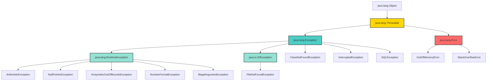
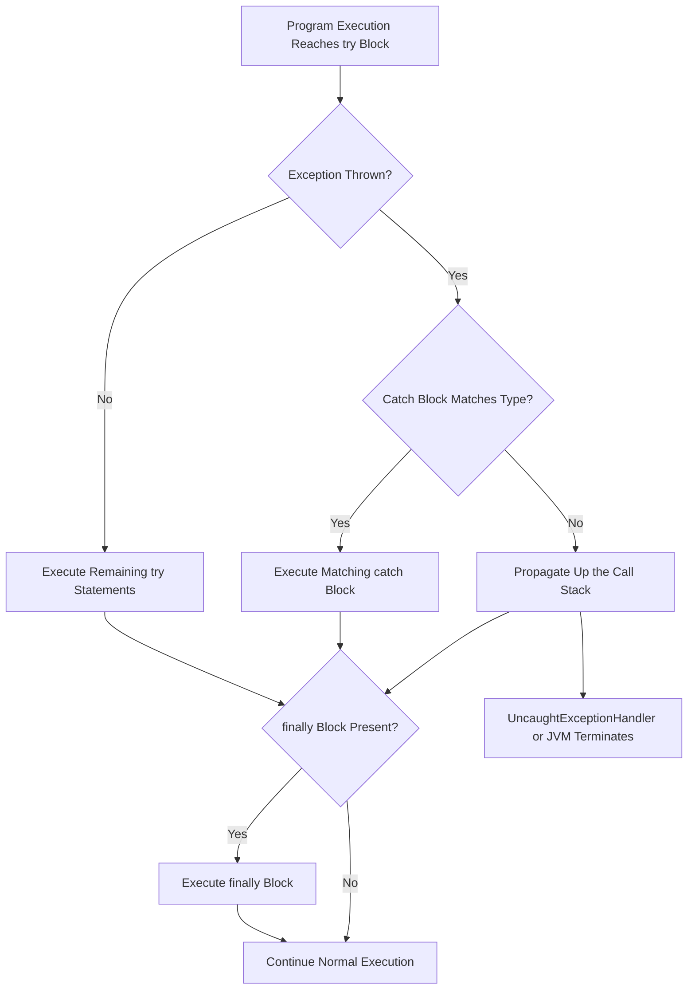
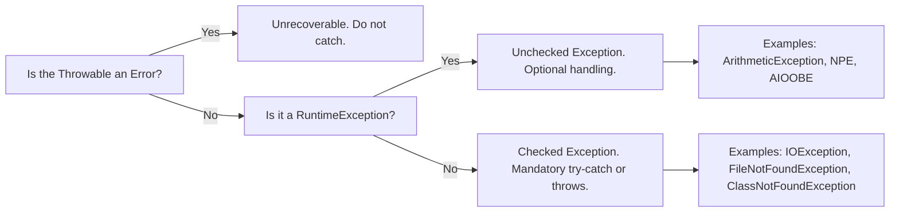
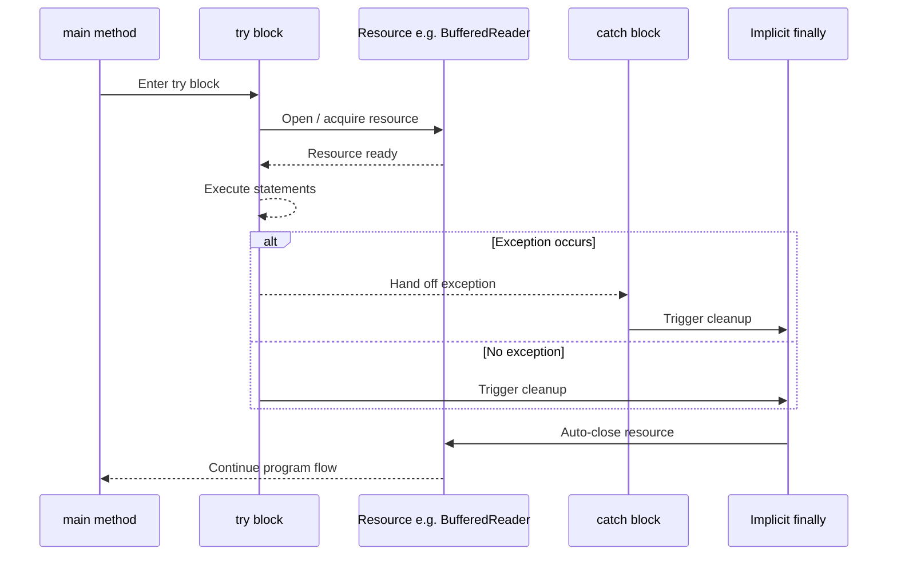

# Java Built-in Exceptions

<!-- SECTION_1_START -->
# Java Built-in Exceptions

## Formal Definition (KTU 2024 Syllabus Terminology)

> [!IMPORTANT]
> **Built-in Exceptions (Predefined Exceptions)** are exception classes that are automatically provided by the Java Development Kit (JDK) under the `java.lang` package (and its sub-packages). These exceptions are designed to handle common runtime and compile-time error conditions that occur during program execution, allowing developers to write robust, fault-tolerant applications without needing to define custom error-handling classes for standard scenarios.

In Java, every exception is an object that descends from the `Throwable` class, forming a strict inheritance hierarchy rooted in `java.lang.Throwable`. Built-in exceptions are the standardized members of this hierarchy that the Java Virtual Machine (JVM) or standard library methods throw automatically when abnormal conditions arise.

## The Throwable Hierarchy (Root Architecture)

The complete class lineage of Java's exception system is:

```
java.lang.Object
        │
        └── java.lang.Throwable  (implements java.io.Serializable)
                │
                ├── java.lang.Error          (unchecked, fatal)
                │       ├── OutOfMemoryError
                │       ├── StackOverflowError
                │       └── VirtualMachineError
                │
                └── java.lang.Exception      (recoverable)
                        │
                        ├── java.io.IOException           (checked)
                        │       ├── FileNotFoundException
                        │       └── EOFException
                        │
                        ├── java.lang.RuntimeException    (unchecked)
                        │       ├── ArithmeticException
                        │       ├── NullPointerException
                        │       ├── ArrayIndexOutOfBoundsException
                        │       ├── NumberFormatException
                        │       ├── IndexOutOfBoundsException
                        │       ├── ClassCastException
                        │       └── IllegalArgumentException
                        │
                        └── java.lang.ClassNotFoundException (checked)
```

## Two Major Categories

> [!NOTE]
> **Category 1 — Checked Exceptions (Compile-Time Exceptions):**
> These are subclasses of `Exception` (but **not** `RuntimeException`). The Java compiler **forces** the programmer to handle them either using a `try-catch` block or by declaring them with the `throws` keyword. Examples: `IOException`, `FileNotFoundException`, `ClassNotFoundException`, `SQLException`, `InterruptedException`.

> [!NOTE]
> **Category 2 — Unchecked Exceptions (Runtime Exceptions):**
> These are subclasses of `RuntimeException`. The compiler does **not** mandate handling. They typically indicate programming bugs (logic errors, API misuse) detected at runtime. Examples: `ArithmeticException`, `NullPointerException`, `ArrayIndexOutOfBoundsException`, `NumberFormatException`.

## Conceptual Analogy / Intuition

Imagine you are driving a car on a highway. The car has a **dashboard** that lights up:

- **Errors** are like the engine literally blowing up — you cannot recover, the program is doomed. The mechanic (JVM) shuts the car down.
- **Checked Exceptions** are like a **mandatory safety check before starting the car** — the dashboard (compiler) refuses to let you drive until you confirm the seatbelt (handle the exception) is fastened or you declare ("throws") that you are aware of the risk.
- **Unchecked Exceptions** are like **flat tires caused by reckless driving** — the car allowed you to start (compiled fine), but during the journey (runtime) something broke because of poor programming. You can fix it mid-journey with a spare (`try-catch`), but ideally you avoid the pothole in the first place.

## Real-World Engineering Utility

In production-grade enterprise systems, built-in exceptions are foundational for:
- **Banking Systems** — Handling `NumberFormatException` when parsing user input amounts.
- **File Servers** — Using `FileNotFoundException` to gracefully inform users that a document is missing.
- **Network APIs** — Catching `IOException` to retry network calls.
- **Database Connectors** — Handling `SQLException` for transaction rollbacks.

> [!VISUALIZATION CONTROL]
> **Concept:** Inheritance tree visualization of the `Throwable` class.
> **GeoGebra / Desmos Input Equations:**
> * A tree graph rooted at the point (0, 0) with branches splitting at y = -1, -2, -3.
> * Plot points representing `Throwable` at (0,0), `Exception` and `Error` at (-2,-1) and (2,-1), and several leaf exceptions at y = -2.
> **Visual Description:** Observe how `RuntimeException` is a sibling of `IOException` under `Exception`, but exceptions like `ArithmeticException` cascade below `RuntimeException` — visually confirming the divide between checked and unchecked categories.
<!-- SECTION_1_END -->

<!-- SECTION_2_START -->
# Deep Theoretical Analysis & KTU High-Yield Formula Sheet

## Theoretical Breakdown — How Java Built-in Exceptions Operate

### Step 1 — The JVM Detects an Anomaly
When a statement encounters an abnormal condition (e.g., division by zero, accessing index 5 of a 3-element array), the JVM internally performs `new <ExceptionClass>(message)` and **throws** the object.

### Step 2 — Stack Unwinding
The exception object propagates **upward** through the call stack. Each method on the call stack is given the opportunity to catch the exception via a `catch` block whose parameter type matches the exception's class (or a superclass).

### Step 3 — The `try-catch-finally` Mechanism

- The **try** block encloses code that might raise an exception.
- The **catch** block handles the exception by type.
- The **finally** block executes regardless of whether an exception was thrown or caught — making it ideal for resource cleanup (closing files, releasing database connections).

### Step 4 — The `throw` and `throws` Keywords

- `throw` — used to **manually** throw an exception object inside a method body.
- `throws` — used in a **method signature** to declare that the method may propagate one or more exception types to its caller.

### Step 5 — Multi-Catch (Java 7+)
A single `catch` block can handle multiple unrelated exception types, reducing code duplication:

```java
catch (IOException | SQLException ex) {
    logger.log(ex.getMessage());
}
```

### Step 6 — Try-with-Resources (Java 7+)
Automatically closes resources implementing `AutoCloseable` at the end of the try block, eliminating the need for explicit `finally` cleanup.

## KTU High-Yield Formula Sheet

| **Concept** | **Rule / Formula** | **Category** | **Key Construct** |
|---|---|---|---|
| Checked Exception | Must be caught or declared | Compile-time | `throws` keyword |
| Unchecked Exception | Optional handling | Runtime | Subclass of `RuntimeException` |
| Error | Non-recoverable, do not catch | JVM fatal | Subclass of `Error` |
| `try` | Encloses risky code | Mandatory | Pairs with `catch` or `finally` |
| `catch` | Handles thrown exception | Type-specific | Parameter must be a `Throwable` subtype |
| `finally` | Always runs (except `System.exit()`) | Optional | Used for cleanup |
| `throw` | Manually throws an object | Inside method | `throw new MyException();` |
| `throws` | Declares propagated exceptions | Method signature | `void read() throws IOException` |
| Stack Trace | `printStackTrace()` | Debugging | Prints method-call chain |
| Exception Chaining | `new Exception(cause)` | Wrapping | Preserves original stack trace |

## Most Frequently Tested Built-in Exceptions

| **Exception** | **Type** | **Triggered When** | **Example** |
|---|---|---|---|
| `ArithmeticException` | Unchecked | Integer division by zero | `int x = 10 / 0;` |
| `NullPointerException` | Unchecked | Accessing member on `null` reference | `str.length();` where `str == null` |
| `ArrayIndexOutOfBoundsException` | Unchecked | Array index ≥ length or < 0 | `arr[10];` on 5-element array |
| `StringIndexOutOfBoundsException` | Unchecked | String index out of range | `"hello".charAt(10);` |
| `IndexOutOfBoundsException` | Unchecked | Parent of array/string index errors | — |
| `NumberFormatException` | Unchecked | Invalid string → number parse | `Integer.parseInt("abc");` |
| `ClassCastException` | Unchecked | Invalid type cast | `Object o = "hi"; Integer i = (Integer) o;` |
| `IllegalArgumentException` | Unchecked | Method receives invalid argument | `Thread.sleep(-1);` |
| `IOException` | Checked | General I/O failure | Reading a disconnected stream |
| `FileNotFoundException` | Checked | File path does not exist | `new FileReader("ghost.txt");` |
| `EOFException` | Checked | Unexpected end-of-file | Reading past stream end |
| `ClassNotFoundException` | Checked | Class loader cannot find class | `Class.forName("NoSuch");` |
| `InterruptedException` | Checked | Thread interrupted while waiting | `Thread.sleep()` while interrupted |
| `SQLException` | Checked | Database access error | Invalid query syntax |
| `NoSuchMethodException` | Checked | Reflective method lookup fails | `getMethod("missing")` |
| `InstantiationException` | Checked | `newInstance()` on abstract class | `AbstractList.class.newInstance()` |
| `IllegalAccessException` | Checked | Access to non-accessible class member | Reflecting on private field |
| `OutOfMemoryError` | Error | JVM heap exhausted | Infinite object allocation |
| `StackOverflowError` | Error | Recursion depth exceeded | Uncontrolled recursion |

## Universal Methods of `Throwable` (Must Know)

| **Method** | **Return Type** | **Purpose** |
|---|---|---|
| `getMessage()` | `String` | Returns detailed message of the exception |
| `toString()` | `String` | Returns class name + message |
| `printStackTrace()` | `void` | Prints stack trace to `System.err` |
| `getCause()` | `Throwable` | Returns underlying cause (for chaining) |
| `getStackTrace()` | `StackTraceElement[]` | Returns array of stack frames |
| `fillInStackTrace()` | `Throwable` | Records stack trace within the catch block |
<!-- SECTION_2_END -->

<!-- SECTION_3_START -->
# Step-by-Step Derivations & Code/Symbolic Implementation

## Worked Example 1 — `ArithmeticException` (Unchecked)

### Problem Statement
Write a Java program that performs integer division and gracefully handles the case when the divisor is zero. Display an appropriate error message.

### Step-by-Step Code

```java
public class ArithmeticExceptionDemo {
    public static void main(String[] args) {
        int numerator = 100;
        int[] denominators = {5, 10, 0, 25};

        for (int d : denominators) {
            try {
                int result = numerator / d;
                System.out.println("100 / " + d + " = " + result);
            } catch (ArithmeticException ex) {
                System.out.println("Caught ArithmeticException: " + ex.getMessage());
                System.out.println("Cannot divide by zero. Skipping this iteration.");
            } finally {
                System.out.println("--- Iteration processed ---\n");
            }
        }
    }
}
```

### Expected Output

```
100 / 5 = 20
--- Iteration processed ---

100 / 10 = 10
--- Iteration processed ---

Caught ArithmeticException: / by zero
Cannot divide by zero. Skipping this iteration.
--- Iteration processed ---

100 / 25 = 4
--- Iteration processed ---
```

### Line-by-Line Logic

1. The `for` loop iterates over each divisor in the array.
2. Inside `try`, integer division is attempted.
3. When `d == 0`, the JVM throws `new ArithmeticException("/ by zero")`.
4. The `catch` block matches by type and extracts the message.
5. The `finally` block always runs, confirming cleanup logic.

## Worked Example 2 — `ArrayIndexOutOfBoundsException` (Unchecked)

```java
public class ArrayBoundsDemo {
    public static void main(String[] args) {
        int[] scores = {85, 90, 78};
        int index = 5;

        try {
            System.out.println("Score at index " + index + " = " + scores[index]);
        } catch (ArrayIndexOutOfBoundsException ex) {
            System.out.println("Invalid index " + index + ". Valid range: 0 to " + (scores.length - 1));
            System.out.println("Exception class: " + ex.getClass().getName());
        }
    }
}
```

### Output
```
Invalid index 5. Valid range: 0 to 2
Exception class: java.lang.ArrayIndexOutOfBoundsException
```

## Worked Example 3 — `NumberFormatException` (Unchecked)

```java
public class NumberFormatDemo {
    static double parseAge(String input) {
        try {
            return Double.parseDouble(input);
        } catch (NumberFormatException ex) {
            System.out.println("Invalid number format: '" + input + "'");
            return -1.0;  // Sentinel value
        }
    }

    public static void main(String[] args) {
        System.out.println("Age: " + parseAge("25"));
        System.out.println("Age: " + parseAge("not_a_number"));
    }
}
```

### Output
```
Age: 25.0
Invalid number format: 'not_a_number'
Age: -1.0
```

## Worked Example 4 — `NullPointerException` (Unchecked)

```java
public class NullPointerDemo {
    public static void printLength(String text) {
        try {
            System.out.println("Length: " + text.length());
        } catch (NullPointerException ex) {
            System.out.println("Error: Cannot invoke method on a null reference.");
            System.out.println("Defaulting to length 0.");
        }
    }

    public static void main(String[] args) {
        printLength("Hello");
        printLength(null);
    }
}
```

### Output
```
Length: 5
Error: Cannot invoke method on a null reference.
Defaulting to length 0.
```

## Worked Example 5 — Checked Exception with `throws` (`IOException`)

```java
import java.io.*;

public class CheckedExceptionDemo {

    // The 'throws' keyword declares the method may propagate IOException
    public static void readFile(String path) throws IOException, FileNotFoundException {
        BufferedReader br = null;
        try {
            br = new BufferedReader(new FileReader(path));
            String line;
            while ((line = br.readLine()) != null) {
                System.out.println(line);
            }
        } finally {
            if (br != null) {
                br.close();
                System.out.println("File handle closed.");
            }
        }
    }

    public static void main(String[] args) {
        try {
            readFile("data.txt");
        } catch (FileNotFoundException ex) {
            System.out.println("File not found: " + ex.getMessage());
        } catch (IOException ex) {
            System.out.println("I/O error: " + ex.getMessage());
        }
    }
}
```

### Logic Trace
1. `main` calls `readFile("data.txt")`.
2. `readFile` declares `throws IOException, FileNotFoundException` — this is the **checked exception** signature rule.
3. Inside `readFile`, `new FileReader(path)` may throw `FileNotFoundException` (a subclass of `IOException`).
4. `readLine()` may throw `IOException`.
5. The `finally` block ensures `br.close()` runs even if an exception occurs.

## Worked Example 6 — Try-with-Resources (Modern Approach)

```java
import java.io.*;

public class TryWithResourcesDemo {
    public static void main(String[] args) {
        String path = "log.txt";

        // try-with-resources auto-closes the BufferedReader
        try (BufferedReader br = new BufferedReader(new FileReader(path))) {
            String line;
            while ((line = br.readLine()) != null) {
                System.out.println(line);
            }
        } catch (FileNotFoundException ex) {
            System.out.println("File missing: " + ex.getMessage());
        } catch (IOException ex) {
            System.out.println("Read error: " + ex.getMessage());
        }
    }
}
```

### Why This Is Better
- No need for an explicit `finally` block.
- Resources implementing `AutoCloseable` are closed **in reverse order of declaration**.
- The compiler-generated bytecode guarantees cleanup even if an exception occurs.

## Worked Example 7 — Manual `throw` with Built-in Exception

```java
public class ThrowDemo {
    public static void validateAge(int age) {
        if (age < 18) {
            throw new IllegalArgumentException("Age " + age + " is not valid for voting.");
        }
        System.out.println("Eligible voter. Age: " + age);
    }

    public static void main(String[] args) {
        try {
            validateAge(25);
            validateAge(12);
        } catch (IllegalArgumentException ex) {
            System.out.println("Validation failed: " + ex.getMessage());
        }
    }
}
```

### Output
```
Eligible voter. Age: 25
Validation failed: Age 12 is not valid for voting.
```

## Worked Example 8 — Multi-Catch Block

```java
import java.io.*;
import java.sql.*;

public class MultiCatchDemo {
    public static void riskyOperation(int mode) {
        try {
            if (mode == 1) {
                throw new IOException("Simulated I/O failure");
            } else if (mode == 2) {
                throw new SQLException("Simulated database failure");
            }
        } catch (IOException | SQLException ex) {
            // Multi-catch (Java 7+)
            System.out.println("Operation failed: " + ex.getClass().getSimpleName()
                    + " -> " + ex.getMessage());
        }
    }

    public static void main(String[] args) {
        riskyOperation(1);
        riskyOperation(2);
    }
}
```

### Output
```
Operation failed: IOException -> Simulated I/O failure
Operation failed: SQLException -> Simulated database failure
```

> [!NOTE]
> The multi-catch parameter `ex` is implicitly `final` — you cannot reassign it inside the block. This prevents accidental loss of the original exception information.

## Worked Example 9 — Exception Chaining

```java
public class ExceptionChainingDemo {
    public static void lowLevel() throws ArithmeticException {
        throw new ArithmeticException("Low-level divide-by-zero");
    }

    public static void highLevel() throws Exception {
        try {
            lowLevel();
        } catch (ArithmeticException cause) {
            // Wrap the original exception as a 'cause' in a new exception
            throw new Exception("High-level operation failed", cause);
        }
    }

    public static void main(String[] args) {
        try {
            highLevel();
        } catch (Exception ex) {
            System.out.println("Message : " + ex.getMessage());
            System.out.println("Cause   : " + ex.getCause());
            ex.printStackTrace();
        }
    }
}
```

### Output
```
Message : High-level operation failed
Cause   : java.lang.ArithmeticException: Low-level divide-by-zero
java.lang.Exception: High-level operation failed
    at ExceptionChainingDemo.highLevel(...)
    ...
Caused by: java.lang.ArithmeticException: Low-level divide-by-zero
    at ExceptionChainingDemo.lowLevel(...)
    ...
```

### Why Chaining Matters
- Preserves the **root cause** of the failure across abstraction layers.
- Critical for debugging large enterprise systems where exceptions bubble through many service tiers.

## Worked Example 10 — `ClassNotFoundException` (Checked)

```java
public class ClassNotFoundDemo {
    public static void main(String[] args) {
        try {
            // Attempting to load a non-existent class
            Class<?> cls = Class.forName("com.nonexistent.MissingClass");
            System.out.println("Loaded: " + cls.getName());
        } catch (ClassNotFoundException ex) {
            System.out.println("Class could not be located: " + ex.getMessage());
        }
    }
}
```

### Output
```
Class could not be located: com.nonexistent.MissingClass
```
<!-- SECTION_3_END -->

<!-- SECTION_4_START -->
# Structural Diagrams & Schematics

## Diagram 1 — Java Exception Class Hierarchy (Block Topology)



**Reading the Diagram:**
- Red node = `Error` family (fatal, do not catch).
- Teal node = `Exception` family (recoverable).
- All green-toned descendants are the most frequently tested built-in exceptions.

## Diagram 2 — Exception Handling Flow (Sequential Processing Topology)



**Reading the Flow:**
- The `try` block is the **risk zone**.
- Type matching is performed by the JVM based on the **class hierarchy** (catching `Exception` catches everything that is an `Exception`).
- `finally` is the **unconditional cleanup** stage.

## Diagram 3 — Checked vs Unchecked Exception Decision Matrix



## Diagram 4 — Try-with-Resources Lifecycle



**Reading the Sequence:**
- The resource is **opened before** the try body executes.
- The `close()` method is **always invoked** (equivalent to a finally block), even on exception.
- This eliminates the classic "leaked file handle" bug in long-running server applications.
<!-- SECTION_4_END -->

<!-- SECTION_5_START -->
# KTU 2024 Scheme Examination Question Bank & Topic Recap

---

## Part A — Short Answer Questions (3 Marks Each)

### Question 1
**[KTU University Exam — July 2023]**
Differentiate between checked and unchecked exceptions in Java. Give two examples of each.

**Model Answer (Board-Standard):**

| **Aspect** | **Checked Exceptions** | **Unchecked Exceptions** |
|---|---|---|
| Compiler Enforcement | Mandatory handling via `try-catch` or `throws` | Compiler does not enforce handling |
| Inheritance Root | Direct subclass of `Exception` (not `RuntimeException`) | Subclass of `RuntimeException` |
| Detection Time | Compile time | Runtime |
| Typical Cause | External resource failures (I/O, network) | Programming logic errors |
| Example 1 | `IOException` | `ArithmeticException` |
| Example 2 | `FileNotFoundException` | `NullPointerException` |

**[Mentioning inheritance root: 1 Mark; giving two examples of each: 2 Marks]**

---

### Question 2
**[KTU University Exam — Dec 2023]**
What is the role of the `finally` block in Java exception handling? Can it be skipped?

**Model Answer:**

The `finally` block in Java contains code that **always executes** after the corresponding `try` (and any `catch`) block, regardless of whether an exception was thrown or caught. Its primary purpose is **resource cleanup** — closing files, releasing database connections, or unlocking threads.

The `finally` block is skipped **only in the following exceptional cases**:
1. The JVM crashes or terminates abnormally.
2. `System.exit()` is invoked inside the `try` or `catch` block.
3. The thread executing the `finally` block is killed or interrupted fatally.
4. An infinite loop or hardware fault occurs inside the `finally` block itself.

**[Stating purpose: 1 Mark; listing skip conditions: 2 Marks]**

---

## Part B — Long Answer Questions (14 Marks Each)

### Question A — `[KTU University Exam — July 2024]`

#### (a) Explain the complete Java exception class hierarchy starting from `Throwable`. Mention at least 6 built-in exceptions with the situations in which they occur. [7 Marks]

**Model Solution:**

The Java exception class hierarchy originates from `java.lang.Throwable`, which has two immediate subclasses:

**1. `java.lang.Error`** — represents severe, unrecoverable problems at the JVM level. Programs should not catch or handle these.

**2. `java.lang.Exception`** — represents recoverable conditions that applications can and should handle.

`Exception` further branches into:

- **`RuntimeException`** (unchecked) — caused by programming logic flaws.
- **Other checked exceptions** like `IOException`, `ClassNotFoundException`, `SQLException`.

**Six Built-in Exceptions Table:**

| **Exception** | **Type** | **Occurs When** |
|---|---|---|
| `ArithmeticException` | Unchecked | An integer is divided by zero |
| `NullPointerException` | Unchecked | A method/field is accessed on a `null` reference |
| `ArrayIndexOutOfBoundsException` | Unchecked | Array index is negative or ≥ length |
| `NumberFormatException` | Unchecked | A string cannot be parsed into a numeric type |
| `FileNotFoundException` | Checked | The specified file path does not exist |
| `ClassNotFoundException` | Checked | The `Class.forName()` call cannot locate the class |

**[Drawing hierarchy with Throwable → Error/Exception split: 2 Marks; Identifying RuntimeException vs other branches: 1 Mark; Six exception entries with situations: 4 Marks — 0.5 each]**

#### (b) Write a Java program that reads an integer from the user using `Scanner` and handles the case when the user enters a non-integer. Use appropriate exception handling constructs. [7 Marks]

**Complete Model Program:**

```java
import java.util.Scanner;

public class SafeIntegerInput {
    public static void main(String[] args) {
        Scanner sc = new Scanner(System.in);
        int number = 0;
        boolean valid = false;

        while (!valid) {
            System.out.print("Enter an integer: ");
            try {
                number = Integer.parseInt(sc.nextLine());
                valid = true;
            } catch (NumberFormatException ex) {
                System.out.println("Invalid input: '" + ex.getMessage().split(":")[0]
                        + "' is not an integer. Try again.");
            }
        }

        System.out.println("You entered: " + number);
        System.out.println("Square  : " + (number * number));
        sc.close();
    }
}
```

**Sample Run:**
```
Enter an integer: 42
You entered: 42
Square  : 1764
```

**Valuation Key Points:**
- **[Importing Scanner and using parseInt: 1 Mark]**
- **[try-catch with NumberFormatException: 2 Marks]**
- **[Loop to re-prompt on invalid input: 1 Mark]**
- **[Final output formatting and Scanner closure: 1 Mark]**
- **[Code compiles and logic is correct: 2 Marks]**

> [!WARNING]
> **Examiner's Pitfall Alert:** Students often forget to use `sc.nextLine()` instead of `sc.nextInt()` because the latter does not consume the newline character, leading to an infinite loop in the re-prompt logic. Always use `nextLine()` and convert manually. Also, do not forget to **close** the Scanner — KTU deducts 0.5 marks for resource leaks.

---

### Question B — `[KTU University Exam — Dec 2024]`

#### (a) Explain the keywords `throw` and `throws` in Java with suitable examples. How are they different from each other? [7 Marks]

**Model Solution:**

| **Aspect** | **`throw`** | **`throws`** |
|---|---|---|
| Purpose | Used to **explicitly throw** an exception object | Used to **declare** exceptions a method may propagate |
| Location | Inside the method body | In the method signature (declaration line) |
| Syntax | `throw new ExceptionType("message");` | `void method() throws ExceptionType` |
| Number | Can throw only **one** exception per statement | Can declare **multiple** exceptions separated by comma |
| Execution | Transfers control to the nearest matching catch block | Forces the caller to handle the declared exceptions |

**Example Demonstrating `throw`:**

```java
public class ThrowExample {
    static void setAge(int age) {
        if (age < 0) {
            throw new IllegalArgumentException("Age cannot be negative");
        }
        System.out.println("Age set to: " + age);
    }

    public static void main(String[] args) {
        try {
            setAge(-5);
        } catch (IllegalArgumentException ex) {
            System.out.println("Caught: " + ex.getMessage());
        }
    }
}
```

**Example Demonstrating `throws`:**

```java
import java.io.*;

public class ThrowsExample {
    static void readFile(String path) throws FileNotFoundException, IOException {
        BufferedReader br = new BufferedReader(new FileReader(path));
        String data = br.readLine();
        System.out.println(data);
        br.close();
    }

    public static void main(String[] args) {
        try {
            readFile("sample.txt");
        } catch (FileNotFoundException ex) {
            System.out.println("File missing.");
        } catch (IOException ex) {
            System.out.println("I/O error.");
        }
    }
}
```

**Valuation Key Points:**
- **[Tabular comparison with at least 4 points: 2 Marks]**
- **[Valid `throw` example with IllegalArgumentException: 1.5 Marks]**
- **[Valid `throws` example with checked exception: 1.5 Marks]**
- **[Compilation and execution correctness: 2 Marks]**

#### (b) Write a Java program that demonstrates try-with-resources for reading a file, with appropriate exception handling for `FileNotFoundException` and `IOException`. [7 Marks]

**Complete Model Program:**

```java
import java.io.*;

public class TryWithResourcesFileRead {
    public static void main(String[] args) {
        String filePath = "report.txt";

        // The BufferedReader is declared inside try(...) — it will be auto-closed
        try (BufferedReader br = new BufferedReader(new FileReader(filePath))) {
            String line;
            int lineNumber = 1;
            System.out.println("--- File Contents ---");
            while ((line = br.readLine()) != null) {
                System.out.println(lineNumber + ": " + line);
                lineNumber++;
            }
        } catch (FileNotFoundException ex) {
            System.out.println("Error: File '" + filePath + "' not found.");
            System.out.println("Please verify the path and try again.");
        } catch (IOException ex) {
            System.out.println("Error reading file: " + ex.getMessage());
        } finally {
            System.out.println("--- End of file operation ---");
        }
    }
}
```

**Expected Behaviour:**
- If `report.txt` exists: prints each line numbered.
- If absent: catches `FileNotFoundException` and prints friendly error.
- If partial read failure: catches `IOException`.
- The `finally` block runs in all three cases.

**Valuation Key Points:**
- **[Correct try-with-resources syntax with `try (...)` parentheses: 2 Marks]**
- **[Two separate catch blocks for FileNotFoundException and IOException: 2 Marks]**
- **[Reading logic using readLine() loop: 1 Mark]**
- **[Finally block for confirmation message: 1 Mark]**
- **[Code compiles and is logically correct: 1 Mark]**

> [!WARNING]
> **Examiner's Pitfall Alert:** Many students write `try { ... } catch (...) { ... } finally { br.close(); }` instead of using the **try-with-resources** syntax. KTU specifically tests this feature — placing the resource inside `try(...)` is mandatory for full marks. Also, **catch order matters**: `FileNotFoundException` must come **before** `IOException` because the former is a subclass; otherwise, the compiler rejects the code.

---

## Topic Recap & Important Things to Remember

- **`Throwable` is the root** of all errors and exceptions in Java. `Error` and `Exception` are its two direct subclasses.
- **`Error` = unrecoverable** (e.g., `OutOfMemoryError`, `StackOverflowError`). Never catch these in production code.
- **`Exception` = recoverable**. The Java compiler mandates handling for checked exceptions.
- **Checked exceptions** include `IOException`, `FileNotFoundException`, `ClassNotFoundException`, `SQLException`, `InterruptedException`.
- **Unchecked exceptions** (subclass of `RuntimeException`) include `ArithmeticException`, `NullPointerException`, `ArrayIndexOutOfBoundsException`, `NumberFormatException`, `ClassCastException`, `IllegalArgumentException`.
- **`try-catch-finally`** is the foundational structure. `finally` always runs except on `System.exit()` or JVM crash.
- **`throw`** is used inside method bodies to manually throw a single exception object.
- **`throws`** is used in method signatures to declare one or more propagated checked exceptions.
- **Multi-catch** (`catch (A | B ex)`) is available from Java 7 onwards — the parameter is implicitly `final`.
- **Try-with-resources** (Java 7+) auto-closes any `AutoCloseable` resource declared in the `try(...)` clause.
- **Catch order is critical**: subclass exceptions must be caught **before** their parent classes (e.g., `FileNotFoundException` before `IOException`).
- **Universal Throwable methods** to remember: `getMessage()`, `toString()`, `printStackTrace()`, `getCause()`, `getStackTrace()`.
- **Exception chaining** (using the `cause` constructor) preserves the original root cause when wrapping exceptions across abstraction layers.
- **Common exam trap**: `int / int` division by zero throws `ArithmeticException`, but `double / 0.0` returns `Infinity` and does **not** throw — KTU frequently tests this distinction.
- **Index out-of-bounds exceptions** can be avoided using enhanced `for` loops, but explicit index access is still expected in KTU exam programs.
<!-- SECTION_5_END -->
