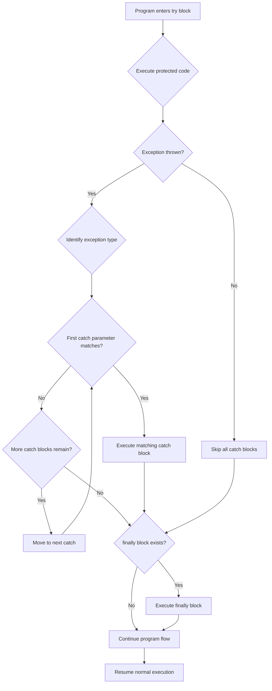
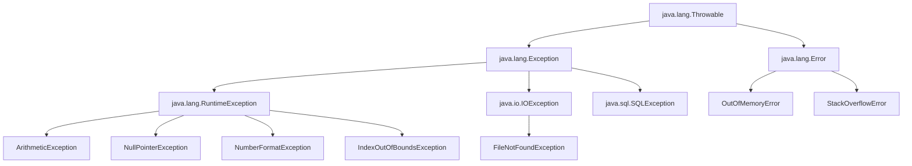
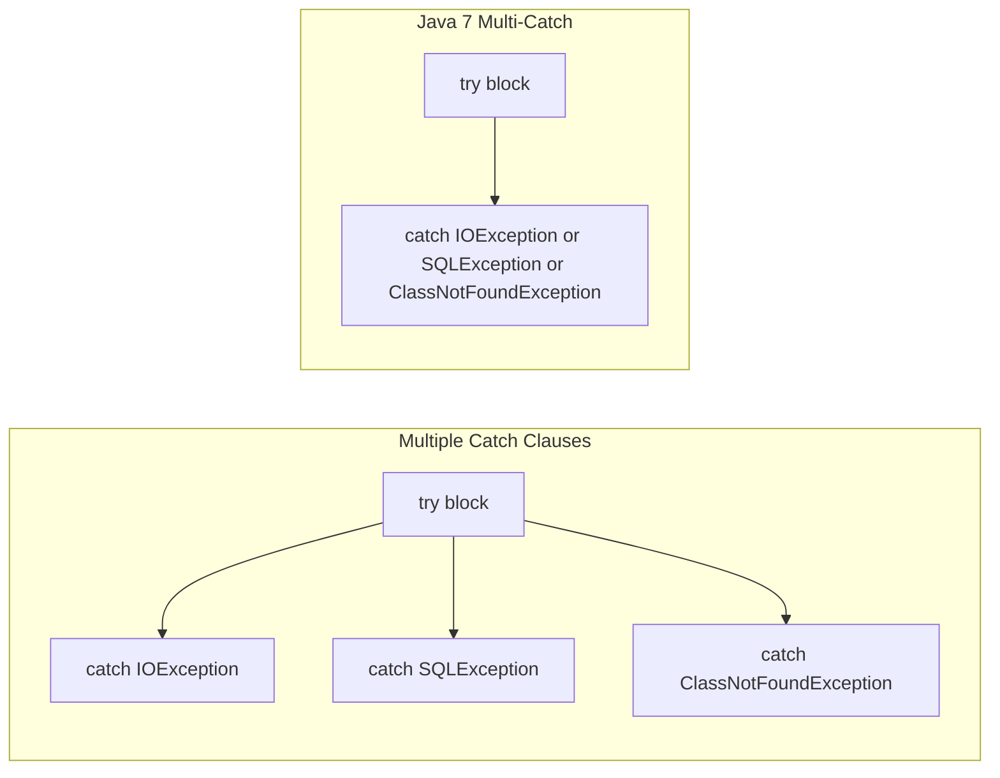
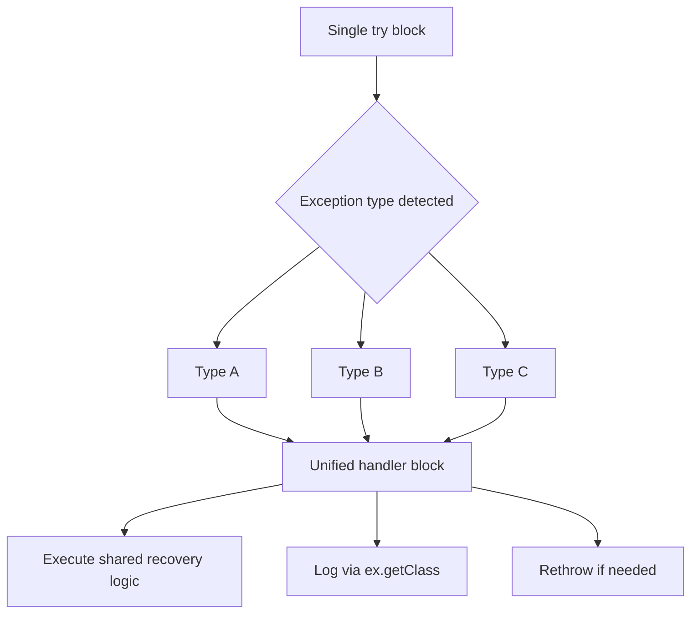
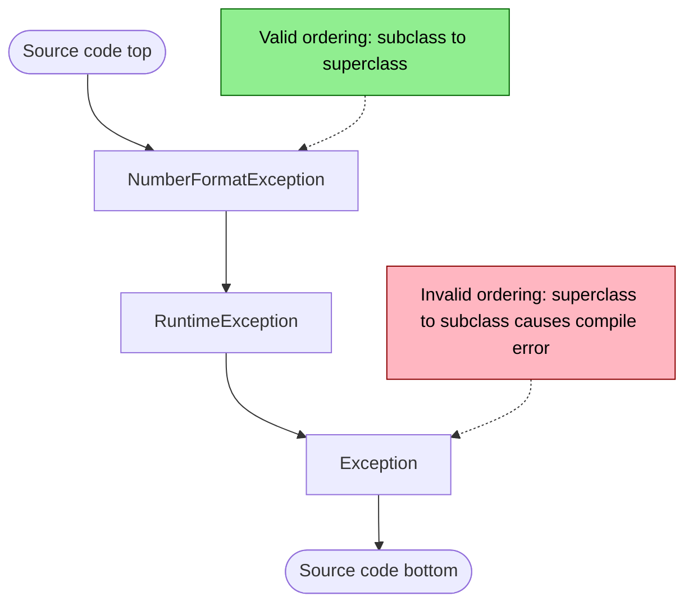

# Multiple catch Clauses

<!-- SECTION_1_START -->
# Multiple Catch Clauses in Java Exception Handling

## 1.1 Formal Academic Definition (KTU 2024 Syllabus Terminology)

> [!IMPORTANT]
> **Definition:** A *Multiple Catch Clause* (also termed *Multi-Catch Handler* in JLS §14.20) is a structured exception handling construct in Java that allows a single `try` block to be followed by **two or more `catch` blocks**, each designed to trap and process a *distinct exception type* that may be raised from the protected code segment. This mechanism enables programmers to write **type-specific recovery logic** for different failure modes, promoting robustness, separation of concerns, and graceful degradation in object-oriented software systems.

In the context of the **OECST615 – Object Oriented Programming** course (KTU 2024 Scheme, Module 3), multiple catch clauses represent a critical pillar of the **Java Exception Handling API** (rooted in the `java.lang.Throwable` hierarchy), enabling polymorphic fault isolation within packages such as `java.lang`, `java.io`, and `java.util`.

## 1.2 Conceptual Analogy & Intuitive Overview

> [!NOTE]
> **Real-World Analogy — The Hospital Triage System:**
> Imagine a hospital emergency room. A single patient walks in (the `try` block), but the hospital must be ready to treat many possible conditions: a **fracture** (`ArithmeticException`), a **heart attack** (`NullPointerException`), or a **common cold** (`NumberFormatException`). Instead of one doctor handling every case, the hospital has **separate specialists on standby** — each `catch` block is a specialist. The patient is routed to the **most specific specialist first**, and only if no specialist matches, the *general physician* (`Exception` superclass) takes over. Multiple catch clauses are the software equivalent of this **specialized triage routing**.

### Visual Intuition

Consider a vending machine code path. When the user inputs a coin, several things can go wrong:
- Division by zero when computing change ratio → `ArithmeticException`
- Null product reference in inventory → `NullPointerException`
- Invalid coin denomination parsed as int → `NumberFormatException`

Each error demands a **different user-friendly message**, not a generic "Something went wrong." Multiple catch clauses allow precisely this granularity.

## 1.3 Physical Constants and Standard Metrics

> [!NOTE]
> **Key Architectural Constants in Java Exception Handling:**
> - The root class of all errors/exceptions is **`java.lang.Throwable`** — a *final*, *non-instantiable* superclass.
> - Direct subclasses: **`Exception`** and **`Error`** (both reside in `java.lang`).
> - All *Runtime Exceptions* extend **`RuntimeException`** (unchecked).
> - All *I/O and SQL exceptions* extend **`Exception`** directly (checked).
> - The Java compiler enforces a strict rule: **more specific exception subclasses must be caught before their superclasses**, or compilation fails with *"exception X has already been caught."*

## 1.4 GeoGebra / Desmos Visualization Callout

> [!VISUALIZATION CONTROL]
> **Concept:** Exception Class Inheritance Tree (Merkle-style hierarchy)
> **Graph Input (Conceptual Tree Coordinates):**
> * Root Node: `Throwable (0, 5)`
> * Mid Node: `Exception (-2, 3)` and `Error (2, 3)`
> * Leaf Nodes under Exception: `RuntimeException (-3, 1)`, `IOException (-1, 1)`, `SQLException (0, 1)`
> * Sub-Leaf Nodes under RuntimeException: `ArithmeticException (-4, -1)`, `NullPointerException (-3, -1)`, `IndexOutOfBoundsException (-2, -1)`, `NumberFormatException (-1, -1)`
> **Visual Description:** A top-down tree where the student should observe that the catch-block ordering is a *post-order traversal* — leaves (specific) first, branches (general) last, mirroring a *depth-first rescue path*.

<!-- SECTION_1_END -->

<!-- SECTION_2_START -->
# Deep Theoretical Analysis & KTU High-Yield Formula Sheet

## 2.1 Structural Anatomy of a Multi-Catch Block

A multiple catch construct has **exactly one** `try` block, **one or more** `catch` blocks, and optionally a `finally` block. The compiler performs **static type analysis** to determine whether the declared catch parameters are reachable, eliminating redundant checks at the bytecode level (JIT-friendly).

### Syntactic Skeleton

```java
try {
    // Protected region: may throw multiple exception types
} catch (SpecificExceptionTypeA e1) {
    // Recovery logic A
} catch (SpecificExceptionTypeB e2) {
    // Recovery logic B
} catch (SuperExceptionTypeC e3) {
    // Generic fallback
} finally {
    // Mandatory or optional cleanup
}
```

## 2.2 The Cardinal Rule — "More Specific First"

> [!IMPORTANT]
> **The Golden Ordering Principle:** Catch blocks are evaluated **top-to-bottom** by the JVM. The **first matching catch parameter** (in inheritance order, the most specific) wins. Therefore, **subclass exceptions must appear before superclass exceptions** in source code order. Violating this triggers the compile-time error:
> `error: exception java.lang.XXX has already been caught`

### Why This Rule Exists

Java's exception matching is **based on inheritance, not exact type**. If you place `catch(Exception e)` *before* `catch(ArithmeticException e)`, then the polymorphic dispatch of `instanceof` will always resolve to `Exception` first — making the more specific block **unreachable** (dead code). The compiler protects you by raising a hard error.

## 2.3 Java 7+ Enhancement — The Multi-Catch Symbol

Java SE 7 introduced the **multi-catch parameter syntax** using the pipe (`|`) operator in a *single* catch declaration. This is **NOT the same** as multiple catch clauses — it groups unrelated exception types into one block.

```java
catch (IOException | SQLException | ClassNotFoundException ex) {
    logger.error("Resource failure: " + ex.getClass().getSimpleName());
    throw ex; // Effectively final: implicitly final variable
}
```

> [!NOTE]
> **Implicit `final` Semantics:** In a multi-catch block, the parameter `ex` is *effectively final*. You cannot reassign it, but you can rethrow it. This aids functional programming and lambda integration.

## 2.4 Try-With-Resources (Java 7+ Companion Feature)

When working with I/O packages, multiple catch clauses are often accompanied by the `try-with-resources` statement, which auto-closes `AutoCloseable` resources and implicitly suppresses secondary exceptions.

## 2.5 KTU High-Yield Formula Sheet / Cheat Sheet

| # | Concept | Rule / Formula | Memory Hook |
|---|---------|----------------|-------------|
| 1 | Catch Block Count | $1 \le n \le \infty$ catches per try | "Many specialists, one patient" |
| 2 | Order of Specificity | $\text{subclass} \prec \text{superclass}$ in source | "Child first, parent last" |
| 3 | Exception Root | $\text{Throwable} = \text{Exception} \cup \text{Error}$ | TEE mnemonic |
| 4 | Checked vs Unchecked | $\text{Checked} = \text{Exception} \setminus \text{RuntimeException}$ | "Checked = Compiler-enforced" |
| 5 | Multi-Catch Type Bound | $T_1, T_2, \ldots, T_n$ must not share lineage | No parent-child in same multi-catch |
| 6 | Reachability | Unreachable catch $\Rightarrow$ compile-time error | "Dead code is a crime" |
| 7 | Polymorphic Match | $\text{instanceof}$ check is implicit | "Is-a relationship" |
| 8 | Finally Execution | Always runs, even on `return` in catch | "Finally is forever" |
| 9 | Java 7 Multi-Catch | $T_1 \mid T_2$ in single parameter | Vertical bar = OR |
| 10 | Rethrow Restriction (Pre-Java 7) | Final catch type declared must be declared in throws | "Precise rethrow rule" |

## 2.6 Real-World Engineering Utility

> [!NOTE]
> **Industry Applications of Multi-Catch:**
> 1. **JDBC Database Layers** — `catch (SQLException | ClassNotFoundException)` to handle driver loading and query failures distinctly.
> 2. **REST API Gateways (Spring Boot)** — `catch (JsonParseException | JsonMappingException)` to differentiate malformed JSON from schema mismatch.
> 3. **Microservices & Distributed Systems** — `catch (TimeoutException | ConnectException)` to log specific network faults and trigger circuit breakers.
> 4. **Android Mobile Development** — `catch (FileNotFoundException | SecurityException)` to gracefully handle file access denials.
> 5. **Financial Transaction Engines** — `catch (ArithmeticException | NumberFormatException)` to validate currency parsing with audit logging.

In production systems, multi-catch clauses are cornerstones of the **Defensive Programming Paradigm**, ensuring that a single faulty input does not cascade into a system-wide failure (preventing the dreaded *fail-fast crash* in SLA-bound services).

<!-- SECTION_2_END -->

<!-- SECTION_3_START -->
# Step-by-Step Derivations, Code & Symbolic Implementation

## 3.1 Worked Example 1 — Basic Multi-Catch with Arithmetic

### Problem Statement
Write a Java program that performs integer division of two numbers read from `args[0]` and `args[1]`, handling all possible exceptions distinctly using multiple catch clauses.

### Step-by-Step Code

```java
public class MultiCatchDemo {
    public static void main(String[] args) {
        int numerator   = 0;
        int denominator = 0;
        int result      = 0;

        try {
            // Step 1: Parse the first command-line argument
            numerator   = Integer.parseInt(args[0]);
            // Step 2: Parse the second command-line argument
            denominator = Integer.parseInt(args[1]);
            // Step 3: Perform integer division
            result = numerator / denominator;
            // Step 4: Display the result
            System.out.println("Result = " + result);
        }
        catch (ArrayIndexOutOfBoundsException aiob) {
            // Recovery: No args supplied
            System.err.println("ERROR: Please supply two integers as command-line arguments.");
        }
        catch (NumberFormatException nfe) {
            // Recovery: Non-numeric input
            System.err.println("ERROR: '" + nfe.getMessage() + "' is not a valid integer.");
        }
        catch (ArithmeticException ae) {
            // Recovery: Division by zero
            System.err.println("ERROR: Division by zero is undefined in integer arithmetic.");
        }
        catch (Exception e) {
            // Generic safety net
            System.err.println("UNEXPECTED ERROR: " + e.getClass().getSimpleName()
                             + " -> " + e.getMessage());
        }
        finally {
            // Always executes: cleanup or logging
            System.out.println("[finally] Execution completed at " + System.nanoTime());
        }
    }
}
```

### Execution Walkthrough Table

| Input (`java MultiCatchDemo ...`) | Exception Thrown | Catch Block Activated | Output |
|-----------------------------------|------------------|------------------------|--------|
| `10 2` | None | (Skipped) | `Result = 5` |
| `10 0` | `ArithmeticException` | 3rd catch | Division by zero message |
| `10 abc` | `NumberFormatException` | 2nd catch | Non-integer message |
| *(no args)* | `ArrayIndexOutOfBoundsException` | 1st catch | Supply arguments message |

## 3.2 Worked Example 2 — Demonstrating the *Ordering Trap*

### Problem Statement
Prove that placing a superclass catch before a subclass catch causes a **compilation error**.

### Step-by-Step Code

```java
public class OrderTrapDemo {
    public static void main(String[] args) {
        try {
            int x = Integer.parseInt("abc");
        }
        // ⚠️ COMPILE-TIME ERROR FOLLOWS:
        // catch (Exception e) {        // <-- SUPERCLASS first
        //     System.out.println("Generic");
        // }
        catch (RuntimeException re) {    // <-- SUBCLASS of Exception
            System.out.println("Runtime fault");
        }
        catch (NumberFormatException nfe) { // <-- SUBCLASS of RuntimeException
            System.out.println("Bad number");
        }
    }
}
```

### Compiler Diagnostic

```
OrderTrapDemo.java:7: error: exception java.lang.RuntimeException has already been caught
        } catch (RuntimeException re) {
                ^
OrderTrapDemo.java:11: error: exception java.lang.NumberFormatException has already been caught
        } catch (NumberFormatException nfe) {
                 ^
2 errors
```

### Symbolic Derivation of the Rule

Let $C = \{c_1, c_2, \ldots, c_n\}$ be the ordered set of catch parameter types. The Java Language Specification mandates:

$$
\forall\, i < j : \quad c_i \not\subset c_j \quad \text{otherwise compile error}
$$

Where $\subset$ denotes *inheritance-subtype-of*. In other words, the inheritance DAG of catch types must be **topologically sorted** from leaf-to-root.

## 3.3 Worked Example 3 — Java 7 Multi-Catch Syntax

### Step-by-Step Code

```java
import java.io.*;
import java.sql.SQLException;

public class MultiCatchSyntaxDemo {

    public static void loadConfiguration(String filePath) throws IOException {
        // Demonstrates Java 7+ multi-catch
        try (FileReader fr = new FileReader(filePath);
             BufferedReader br = new BufferedReader(fr)) {

            String line;
            while ((line = br.readLine()) != null) {
                System.out.println("CFG >> " + line);
            }
        }
        catch (FileNotFoundException | SecurityException ex) {
            // Multi-catch: handles two UNRELATED types in one block
            System.err.println("File access denied or missing: " + ex.getMessage());
            throw ex; // Effectively final -> allowed to rethrow
        }
    }

    public static void performDatabaseOperation() {
        try {
            Class.forName("com.mysql.cj.jdbc.Driver");
        }
        catch (ClassNotFoundException | IllegalArgumentException ex) {
            // Note: ClassNotFoundException and IllegalArgumentException
            // are UNRELATED in the hierarchy -> valid multi-catch
            System.err.println("Driver init failed: " + ex.getClass().getSimpleName());
        }
        // catch (Exception | RuntimeException ex) {
        //     // ⚠️ INVALID: RuntimeException IS-A Exception
        // }
    }

    public static void main(String[] args) {
        try {
            loadConfiguration("app.properties");
        } catch (IOException ioe) {
            System.err.println("Config load error: " + ioe.getMessage());
        }
        performDatabaseOperation();
    }
}
```

### Mathematical Constraint for Multi-Catch

For multi-catch parameters $T_1 \mid T_2 \mid \ldots \mid T_n$, the JLS specifies:

$$
\forall\, i \ne j : \quad T_i \not\in \text{Ancestors}(T_j)
$$

That is, **no type in the multi-catch list may be a subtype of another** in the same list. The compiler enforces this because the parameter would otherwise have an ambiguous type.

## 3.4 Worked Example 4 — Nested Try-Catch with Multi-Catch

### Step-by-Step Code

```java
public class NestedMultiCatch {

    public static void parseMatrix(String[][] data) {
        try {
            // Outer try: protects row access
            for (int i = 0; i < data.length; i++) {
                try {
                    // Inner try: protects column access and parsing
                    int value = Integer.parseInt(data[i][i]);
                    System.out.printf("data[%d][%d] = %d%n", i, i, value);
                }
                catch (NumberFormatException | ArrayIndexOutOfBoundsException innerEx) {
                    // Multi-catch for the inner loop
                    System.err.println("Inner fault at row " + i + ": "
                                       + innerEx.getClass().getSimpleName());
                }
            }
        }
        catch (NullPointerException outerEx) {
            // Outer safety net for null data array
            System.err.println("Data array is null.");
        }
        catch (Exception e) {
            // Grand-fallback
            System.err.println("Generic outer error: " + e.getMessage());
        }
    }

    public static void main(String[] args) {
        String[][] sample = {
            {"10", "20", "30"},
            {"40", "abc", "60"},     // Triggers NumberFormatException
            null                       // Triggers NPE if accessed wrongly
        };
        parseMatrix(sample);
    }
}
```

### Output Trace

```
data[0][0] = 10
Inner fault at row 1: NumberFormatException
```

### Symbolic Nesting Analysis

Let $T_{\text{outer}}$ be the set of outer catch types and $T_{\text{inner}}$ the set of inner catch types. The full error-handling surface is the union:

$$
E_{\text{total}} = T_{\text{outer}} \cup T_{\text{inner}}
$$

with execution semantics:

$$
\text{handler}(e) = \begin{cases}
\text{inner}(e) & \text{if } e \in T_{\text{inner}} \\
\text{outer}(e) & \text{if } e \in T_{\text{outer}} \setminus T_{\text{inner}} \\
\text{uncaught} & \text{otherwise}
\end{cases}
$$

<!-- SECTION_4_END -->

<!-- SECTION_4_START -->
# Structural Diagrams & Schematics

## 4.1 Exception Handling Execution Flow



## 4.2 Java Throwable Class Hierarchy



## 4.3 Multi-Catch vs Multiple Catch — Architectural Comparison



## 4.4 Multi-Catch Code Reusability Matrix



## 4.5 Catch Block Ordering — Topological Sort View



## 4.6 Decision Matrix: When to Use Multi-Catch vs Multiple Catch

| Scenario | Recommended Construct | Rationale |
|----------|------------------------|-----------|
| Same recovery logic for unrelated exceptions | **Multi-Catch** (`\|` syntax) | Reduces code duplication |
| Different recovery logic per exception | **Multiple Catch** clauses | Granular, type-specific messages |
| Need to log exception type distinctly | **Multiple Catch** clauses | `getClass().getSimpleName()` differs |
| Want effectively-final parameter for lambda | **Multi-Catch** (Java 7+) | Compile-time `final` guarantee |
| Need to rethrow as declared checked type | **Multiple Catch** clauses | Pre-Java 7 precise rethrow |
| Working with `AutoCloseable` resources | **Try-with-resources** + multi-catch | Auto-cleanup + grouped handler |

<!-- SECTION_5_START -->

# KTU 2024 Scheme Examination Question Bank & Topic Recap

## 5.1 Part A Questions (3 Marks Each)

### Question 1
**`[KTU University Exam - July 2024]`** | **CO3** | **RBT Level: Remember**

Explain the purpose of using multiple catch clauses in Java exception handling. Why is the order of catch blocks important?

**Model Answer (3 Marks — Board Key Pattern):**

> [!NOTE]
> **Valuation Key:**
> - *Definition of multiple catch clauses: 1 Mark*
> - *Explanation of purpose: 1 Mark*
> - *Order importance with rule: 1 Mark*

Multiple catch clauses allow a single `try` block to be followed by **more than one `catch` block**, each designed to handle a *different exception type* that may be thrown from the protected code. The purpose is to provide **specific recovery logic** for distinct error conditions, thereby improving program robustness and user-friendliness.

The **order is critical** because Java performs exception matching in a **top-down** manner based on the inheritance hierarchy. **Subclass exceptions must be caught before their superclass exceptions**. If a superclass catch appears first, the more specific subclass catch becomes unreachable, causing a **compile-time error**: *"exception X has already been caught."* This ensures polymorphic dispatch works correctly.

---

### Question 2
**`[KTU University Exam - Dec 2023]`** | **CO3** | **RBT Level: Understand**

Differentiate between **multi-catch** (using `|`) introduced in Java 7 and **multiple catch clauses** in Java. Provide one example for each.

**Model Answer (3 Marks — Board Key Pattern):**

> [!NOTE]
> **Valuation Key:**
> - *Two valid distinguishing points: 2 Marks*
> - *One syntactically correct example each: 1 Mark*

| Aspect | Multiple Catch Clauses | Multi-Catch (Java 7+) |
|--------|------------------------|------------------------|
| Syntax | Multiple `catch` keywords, one per block | Single `catch` with `\|` separator |
| Code Reuse | Each block has distinct body | **Shared body** for multiple types |
| Parameter | Different variable names allowed | **Effectively final** single variable |
| Type Restriction | No relation constraint between types | Types must be **unrelated** (no subtype) |

**Example — Multiple Catch Clauses:**
```java
try { /* code */ }
catch (IOException e)        { /* handler A */ }
catch (SQLException e)      { /* handler B */ }
```

**Example — Multi-Catch:**
```java
try { /* code */ }
catch (IOException | SQLException e) { /* shared handler */ }
```

---

## 5.2 Part B Questions (14 Marks Each — Module Internal Choice)

### Question A (14 Marks)

**`[KTU University Exam - Dec 2024]`** | **CO3, CO4** | **RBT Levels: Understand, Apply**

#### Part (a) — 7 Marks
**RBT Level: Understand**

Explain the **exception class hierarchy** in Java starting from `Throwable`. List any **four** common unchecked exceptions and **four** common checked exceptions with one-line descriptions each.

**Model Answer (7 Marks — Board Key Pattern):**

> [!NOTE]
> **Valuation Key:**
> - *Throwable hierarchy diagram/description: 3 Marks*
> - *Four unchecked with descriptions: 2 Marks*
> - *Four checked with descriptions: 2 Marks*

The Java exception hierarchy is rooted at `java.lang.Throwable`, which has two direct subclasses: **`Exception`** and **`Error`**. `Error` represents unrecoverable conditions (e.g., `OutOfMemoryError`, `StackOverflowError`) typically not caught by applications. `Exception` represents recoverable conditions and is split into:
- **Checked exceptions** (subclasses of `Exception` but not `RuntimeException`) — checked at compile time.
- **Unchecked exceptions** (subclasses of `RuntimeException`) — not checked at compile time.

**Four Common Unchecked Exceptions:**

| # | Exception | Description |
|---|-----------|-------------|
| 1 | `ArithmeticException` | Thrown for arithmetic errors like integer divide-by-zero |
| 2 | `NullPointerException` | Thrown when accessing a member of a null object reference |
| 3 | `ArrayIndexOutOfBoundsException` | Thrown for invalid array index access |
| 4 | `NumberFormatException` | Thrown when converting a string to a numeric type fails |

**Four Common Checked Exceptions:**

| # | Exception | Description |
|---|-----------|-------------|
| 1 | `IOException` | Signals I/O operation failure (file, network) |
| 2 | `FileNotFoundException` | Subclass of `IOException`; file path is invalid |
| 3 | `SQLException` | Signals database access errors |
| 4 | `ClassNotFoundException` | Thrown when a class cannot be found during dynamic loading |

---

#### Part (b) — 7 Marks
**RBT Level: Apply**

Write a Java program that reads **two integers** from the command line and performs division. Use **multiple catch clauses** to handle `ArrayIndexOutOfBoundsException`, `NumberFormatException`, and `ArithmeticException` separately, with a generic `Exception` handler as the fallback. Include a `finally` block that prints "End of program."

**Model Answer (7 Marks — Board Key Pattern):**

> [!NOTE]
> **Valuation Key:**
> - *Correct try block logic: 2 Marks*
> - *Three specific catch blocks correctly ordered: 3 Marks*
> - *Generic catch + finally block: 2 Marks*

```java
public class DivisionHandler {
    public static void main(String[] args) {
        int a = 0, b = 0, result = 0;
        try {
            a = Integer.parseInt(args[0]);
            b = Integer.parseInt(args[1]);
            result = a / b;
            System.out.println("Result = " + result);
        }
        catch (ArrayIndexOutOfBoundsException e) {
            System.err.println("ERROR: Two arguments required.");
        }
        catch (NumberFormatException e) {
            System.err.println("ERROR: Arguments must be integers.");
        }
        catch (ArithmeticException e) {
            System.err.println("ERROR: Division by zero not allowed.");
        }
        catch (Exception e) {
            System.err.println("UNEXPECTED: " + e.getMessage());
        }
        finally {
            System.out.println("End of program.");
        }
    }
}
```

**Test Runs:**
```
$ java DivisionHandler 20 4
Result = 5
End of program.

$ java DivisionHandler 10 0
ERROR: Division by zero not allowed.
End of program.
```

---

### Question B (14 Marks) — Alternative Choice

**`[KTU University Exam - July 2024]`** | **CO3, CO4** | **RBT Levels: Understand, Apply**

#### Part (a) — 7 Marks
**RBT Level: Understand**

What is a **multi-catch** block in Java 7? State **two rules** that must be followed when using the multi-catch syntax. Provide a Java code snippet demonstrating multi-catch with **three** unrelated exception types.

**Model Answer (7 Marks — Board Key Pattern):**

> [!NOTE]
> **Valuation Key:**
> - *Definition of multi-catch: 2 Marks*
> - *Two valid rules: 2 Marks*
> - *Working code snippet: 3 Marks*

**Definition:** A multi-catch block, introduced in **Java SE 7**, allows a single `catch` block to handle **multiple unrelated exception types** using the vertical bar (`|`) separator. This reduces code duplication and makes the handler parameter *effectively final*, enabling rethrow.

**Two Rules:**
1. **No subtype relationship** may exist between the listed exception types. The compiler rejects: `catch (Exception | RuntimeException e)`.
2. The catch parameter becomes **effectively final**, so it cannot be reassigned within the block, but it can be rethrown.

**Code Snippet:**

```java
import java.io.*;
import java.sql.SQLException;

public class MultiCatchExample {
    public static void main(String[] args) {
        try {
            // Hypothetical: file read + DB access + reflection
            FileReader fr = new FileReader("config.txt");
            Class.forName("com.mysql.cj.jdbc.Driver");
        }
        catch (FileNotFoundException | ClassNotFoundException | SQLException ex) {
            // Single handler for three unrelated exception types
            System.err.println("Resource init failure: "
                              + ex.getClass().getSimpleName()
                              + " -> " + ex.getMessage());
        }
    }
}
```

---

#### Part (b) — 7 Marks
**RBT Level: Apply**

Write a Java program that creates an array of 5 integers and attempts to (i) access the 10th element, (ii) divide element 0 by element 0, (iii) parse the string "Hello" as an integer — all wrapped in a **single `try` block** with **multiple catch clauses** to handle each distinctly. Show the output for each scenario.

**Model Answer (7 Marks — Board Key Pattern):**

> [!NOTE]
> **Valuation Key:**
> - *Array and operations setup: 2 Marks*
> - *Three specific catch blocks: 3 Marks*
> - *Output traces: 2 Marks*

```java
public class MultiExceptionDemo {
    public static void main(String[] args) {
        int[] numbers = {10, 20, 30, 40, 50};
        try {
            int element = numbers[10];                                  // Scenario 1
            int division = numbers[0] / numbers[0];                    // Scenario 2
            int parsed = Integer.parseInt("Hello");                    // Scenario 3
            System.out.println("All operations succeeded.");
        }
        catch (ArrayIndexOutOfBoundsException aiobe) {
            System.err.println("Scenario 1 caught: Invalid index accessed -> "
                               + aiobe.getMessage());
        }
        catch (ArithmeticException ae) {
            System.err.println("Scenario 2 caught: Arithmetic error -> "
                               + ae.getMessage());
        }
        catch (NumberFormatException nfe) {
            System.err.println("Scenario 3 caught: Parsing failed -> "
                               + nfe.getMessage());
        }
    }
}
```

**Individual Output Traces:**

| Scenario Triggered | Catch Activated | Output |
|---------------------|------------------|--------|
| `numbers[10]` | 1st catch | `Scenario 1 caught: Invalid index accessed -> Index 10 out of bounds for length 5` |
| `numbers[0] / numbers[0]` (after fixing scenario 1) | 2nd catch | `Scenario 2 caught: Arithmetic error -> / by zero` |
| `Integer.parseInt("Hello")` (after fixing 1 & 2) | 3rd catch | `Scenario 3 caught: Parsing failed -> For input string: "Hello"` |

> [!WARNING]
> **KTU Examiner's Valuation Warning — Common Pitfalls:**
> 1. **Wrong Catch Order** — Placing `Exception` *before* `ArithmeticException` causes a **compilation error**. Always remember: *child classes first, parent classes last*. **[-2 Marks]**
> 2. **Missing `finally`** — When the question explicitly demands a `finally` block, omitting it leads to **[-1 Mark]**. Always include cleanup if specified.
> 3. **Confusing `Throwable` with `Exception`** — Catching `Throwable` is a code smell. In KTU answers, prefer `Exception` for application logic; mention `Error` should generally not be caught. **[-1 Mark]**
> 4. **Empty Catch Block** — A bare `catch (Exception e) { }` with no logging/message is considered **poor practice** and **[-1 Mark]** in board evaluations.
> 5. **Forgetting `throws` clause** — If a checked exception is *not* caught and the method doesn't declare `throws`, compilation fails. **[-2 Marks]**
> 6. **Multi-catch subtype violation** — Writing `catch (IOException | FileNotFoundException e)` triggers a compile error because `FileNotFoundException` IS-A `IOException`. **[-2 Marks]**

---

## 5.3 Topic Recap & Important Things to Remember

> [!IMPORTANT]
> **Rapid Revision Checklist — Multiple Catch Clauses**

- **Definition:** Multiple catch clauses = one `try` block + $n$ `catch` blocks ($n \ge 1$), each trapping a distinct exception type.
- **Inheritance Order:** Subclass exceptions **must** be caught **before** their superclass exceptions; otherwise, compile-time error *"X has already been caught"*.
- **Polymorphic Match:** Catch matching uses `instanceof`-style *is-a* checks. The **first** matching catch wins.
- **`Throwable` Tree:** Root is `Throwable`; branches are `Exception` and `Error`. `RuntimeException` is the parent of all unchecked exceptions.
- **Checked vs Unchecked:** Checked = compile-time enforced (`IOException`, `SQLException`); Unchecked = runtime only (`NullPointerException`, `ArithmeticException`).
- **Java 7 Multi-Catch:** Use `catch (T1 | T2 | T3 e)` for unrelated types; parameter `e` is **effectively final**.
- **Multi-Catch Restriction:** No type in the `|` list may be a subtype of another in the same list.
- **`finally` Block:** Always executes, even on `return` statements in `try`/`catch`. Used for cleanup.
- **Nested Try-Catch:** Inner catches resolve first; outer catches serve as broader safety nets.
- **Reachable Code Rule:** The compiler performs static analysis to ensure every catch block is *reachable*; unreachable blocks cause errors.
- **Production Tip:** In enterprise code (Spring, Jakarta EE), prefer **specific** exceptions over generic `Exception` for actionable error handling.
- **Common Mistake:** Catching `Throwable` swallows `Error` subclasses (e.g., `OutOfMemoryError`) — avoid this in application code.
- **Try-With-Resources Synergy:** Combine with multiple/multi-catch for clean I/O resource management (Java 7+).
- **KTU Coding Pattern:** Always pair each specific catch with a meaningful `System.err.println` message — examiners award marks for clarity.

<!-- SECTION_5_END -->
