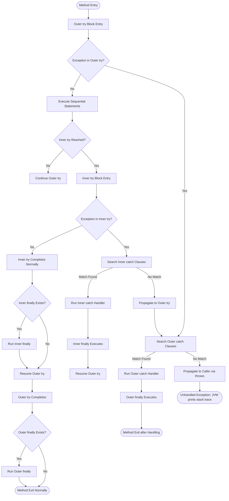
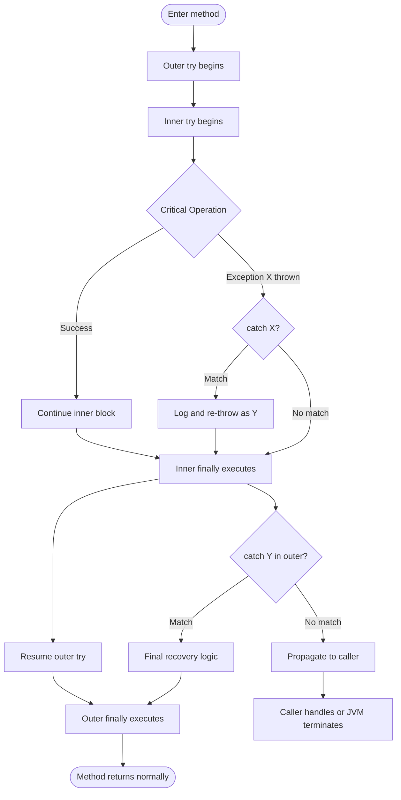

# Nested try Statements

<!-- SECTION_1_START -->

# Nested try Statements in Java

> [!NOTE]
> **Syllabus Highlight (KTU 2024 - OECST615 / Module 3)**
> Nested try statements are a critical OOP concept under *Exception Handling* that allows programmers to handle different types of exceptions that may occur at different *levels of code granularity* within the same method. This topic is a high-frequency question in KTU University Examinations.

## Formal Definition

A **Nested try statement** in Java is an exception-handling construct in which one or more `try-catch` (or `try-catch-finally`) blocks are placed **inside** another `try` block. The inner `try` block is logically enclosed within the outer `try` block, allowing **scoped, hierarchical exception recovery** for distinct logical sub-operations.

When an exception is thrown inside the inner `try` block, the runtime first searches for a matching `catch` clause in the **innermost** `catch` block. If no match is found, the exception **propagates upward** to the enclosing (outer) `try` block, where its `catch` clauses are then inspected.

The formal Java Language Specification (JLS) classifies this as the `TryStatement` production rule where the `Block` body itself may contain another `TryStatement`, creating a recursive syntactic structure.

## Conceptual Analogy / Intuition

> [!TIP]
> **Real-World Analogy: Airport Security Checkpoints 🛫**
>
> Imagine a passenger boarding a flight. The journey involves **multiple security layers**:
> - **Outer Check (Boarding Gate):** General check — "Do you have a valid ticket and passport?" If not, the passenger is **stopped at the gate** (outer catch handles the error).
> - **Inner Check (Security Scanner):** More specific check — "Are there prohibited items in your bag?" If yes, a **specific alarm** rings (inner catch handles that specific exception type).
> - **Innermost Check (Body Scanner):** Most granular check — "Metal detected on your person?" Handled by the deepest security layer.
>
> If a check at any inner layer fails, **only that specific layer's response** is triggered. If the inner layer doesn't know how to handle the issue, it **escalates to the outer layer**.

This is exactly how Java's nested try works:
- The **innermost `catch`** handles the *most specific* exception.
- If it cannot, the exception is **rethrown implicitly** to the outer `try`'s `catch` clauses.
- If the outer `catch` also fails to match, the exception **propagates to the calling method**, eventually reaching the JVM (which terminates the thread and prints the stack trace).

> [!IMPORTANT]
> **Key Term — Exception Propagation:**
> The process by which an uncaught exception in an inner block "bubbles up" to the outer block is called **exception propagation**. In Java, this is governed by the **call-stack unwinding mechanism**, where the JVM walks backward through the method invocation chain until a compatible handler is found.

## GeoGebra / Desmos Integration

> [!VISUALIZATION CONTROL]
> **Concept:** Nested Exception Handling — Scoped Catch Resolution
>
> **GeoGebra / Desmos Input Equations (Conceptual Exception Lookup Tree):**
> * $P(\text{Inner Catch Match}) = \sum_{i=1}^{n} \mathbb{1}_{\{e \in C_i^{inner}\}}$
> * $P(\text{Outer Catch Match}) = \sum_{j=1}^{m} \mathbb{1}_{\{e \in C_j^{outer}\}} \cdot \mathbb{1}_{\{ \text{inner fails} \}}$
> * $P(\text{Propagates to Caller}) = 1 - P(\text{Inner Match}) - P(\text{Outer Match})$
>
> **Visual Description:** Plot three stacked horizontal bands on the y-axis. The bottom band represents the inner `try-catch`, the middle band represents the outer `try-catch`, and the top band represents the caller/JVM. An "exception particle" dropping from $y = +\infty$ will stop at the **first band** whose `catch` clause's exception type matches its type. If it passes through all bands without stopping, it is unhandled.

---

<!-- SECTION_1_END -->

<!-- SECTION_2_START -->

# Deep Theoretical Analysis & KTU High-Yield Formula Sheet

## Operational Mechanics of Nested try

A nested try statement follows a **strict, deterministic execution flow**. Below are the explicit logical rules that govern its behavior.

### Step-by-Step Logic Flow

1. **Entry into Outer `try`:** The JVM begins executing statements inside the outer `try` block sequentially.
2. **Conditional Entry into Inner `try`:** When execution reaches a nested `try` block, the JVM begins executing statements inside it.
3. **Exception Generation (Inner):** If an exception is thrown inside the inner `try`:
   - Step 3a: The JVM immediately **halts execution** of the inner `try` block (statements after the throw point are not executed).
   - Step 3b: The JVM searches the inner `try`'s `catch` clauses in **top-to-bottom order** for a type-compatible handler.
   - Step 3c: If a match is found, the inner `catch` executes, and **the outer `try` continues normally** after the inner block.
   - Step 3d: If no inner `catch` matches, the exception is **transferred to the outer `try`**, and execution jumps to the outer `try`'s `catch` clauses.
4. **Exception Generation (Outer Only):** If an exception is thrown *outside* the inner `try` but still inside the outer `try`, the inner `catch` clauses are **completely bypassed**. The JVM searches the outer `catch` clauses directly.
5. **`finally` Block Execution:** Regardless of whether an exception was caught or not, any associated `finally` blocks execute **before** control flows out of the `try-catch-finally` structure.
6. **Propagation to Caller:** If the exception remains uncaught at all nesting levels, it propagates to the method's caller, repeating this lookup process.

### The "Why" Behind Nesting

> [!IMPORTANT]
> **Why Nest try Statements?**
> 1. **Differentiated Handling:** Different parts of a method may require different exception responses (e.g., array index errors vs. arithmetic errors vs. I/O errors).
> 2. **Resource Granularity:** Inner blocks can manage specific resources (e.g., closing a file) while outer blocks handle broader method-level errors.
> 3. **Localized Recovery:** Allows partial recovery — recover from a minor error and continue with the rest of the method's logic.
> 4. **Cleaner Stack Traces:** When inner catches fail to handle, the propagation is recorded in the stack trace, making debugging easier.

## KTU Formula Sheet / Cheat Sheet

| # | Construct / Rule | Syntax | Notes |
|---|---|---|---|
| 1 | Basic Nested try | `try { ... try { ... } catch(X e) { ... } ... } catch(Y e) { ... }` | Inner `try` is fully inside outer `try` body |
| 2 | Inner `finally` executes first | Inner `finally` → Outer `finally` | `finally` always runs in **reverse nesting order** upon exit |
| 3 | Inner catch rethrow pattern | `catch(X e) { ... throw e; }` | Re-throwing allows outer `catch` to also process it |
| 4 | Loss of variable scope | Inner block variables **shadow** outer | Inner `int i` hides outer `int i` within the inner block |
| 5 | Order of catch resolution | Innermost → Outermost | Top-to-bottom within each level |
| 6 | Method-level `throws` | `void m() throws A, B` | Declares exception types that may propagate to caller |
| 7 | Multi-catch (Java 7+) | `catch(IOException \vert SQLException e)` | Single handler for multiple unrelated types |
| 8 | Try-with-resources | `try(Resource r = new R()) { ... }` | Auto-closes resource; can also be nested |

> [!WARNING]
> **Critical Rule:** A `catch` clause for a **subclass** must appear **before** a `catch` clause for its **superclass**, otherwise it results in a **compile-time error: "Unreachable catch block"**.

---

<!-- SECTION_2_END -->

<!-- SECTION_3_START -->

# Step-by-Step Derivations & Code/Symbolic Implementation

## 1. Exhaustive Walkthrough — Complete Java Implementation

The following program demonstrates **every major scenario** of nested try statements. Each scenario is annotated with the exact output and the reasoning behind it.

```java
import java.util.Scanner;

/**
 * KTU OECST615 - Module 3 Demonstration
 * Topic: Nested try Statements
 * 
 * Demonstrates:
 *  1. Inner catch handles the exception (outer remains undisturbed)
 *  2. Inner catch fails to match -> outer catch handles it
 *  3. Exception occurs OUTSIDE the inner try -> inner catches are bypassed
 *  4. finally blocks in both inner and outer try always execute
 *  5. Method-level propagation via 'throws' clause
 */
public class NestedTryDemo {

    // Outer method that demonstrates exception propagation via 'throws'
    public static void methodA() throws ArithmeticException {
        System.out.println("[methodA] Entering methodA");
        int result = 10 / 0;  // Generates ArithmeticException
        System.out.println("[methodA] This line is NEVER reached");
    }

    public static void main(String[] args) {

        // ============ SCENARIO 1: Inner catch handles the exception ============
        System.out.println("--- SCENARIO 1: Inner catch handles ---");
        try {                                                          // OUTER try
            System.out.println("[Outer] Entering outer try");
            try {                                                      // INNER try
                int[] arr = { 10, 20, 30 };
                System.out.println("[Inner] Accessing arr[5]...");
                System.out.println(arr[5]);  // Throws ArrayIndexOutOfBoundsException
            } catch (ArrayIndexOutOfBoundsException e) {              // INNER catch
                System.out.println("[Inner Catch] Handled array error: " + e.getMessage());
            }
            System.out.println("[Outer] Continuing after inner try-catch");
        } catch (Exception e) {                                        // OUTER catch
            System.out.println("[Outer Catch] Handled: " + e.getMessage());
        }


        // ============ SCENARIO 2: Inner catch fails, outer catch handles it ============
        System.out.println("\n--- SCENARIO 2: Inner fails, outer handles ---");
        try {                                                          // OUTER try
            System.out.println("[Outer] Entering outer try");
            try {                                                      // INNER try
                String text = null;
                System.out.println("[Inner] Calling text.length()...");
                System.out.println(text.length());  // Throws NullPointerException
            } catch (ArrayIndexOutOfBoundsException e) {              // INNER catch (MISMATCH)
                System.out.println("[Inner Catch] This will NEVER run");
            }
            System.out.println("[Outer] This line is NEVER reached");
        } catch (NullPointerException e) {                             // OUTER catch
            System.out.println("[Outer Catch] Handled NPE: " + e.getMessage());
        }


        // ============ SCENARIO 3: Exception OUTSIDE the inner try ============
        System.out.println("\n--- SCENARIO 3: Exception outside inner try ---");
        try {                                                          // OUTER try
            System.out.println("[Outer] Entering outer try");
            try {                                                      // INNER try
                System.out.println("[Inner] Inner try runs cleanly");
                // No exception here
            } catch (ArrayIndexOutOfBoundsException e) {              // INNER catch
                System.out.println("[Inner Catch] Will NOT trigger");
            }
            // Exception generated AFTER exiting the inner try but still in outer try
            int x = 100 / 0;  // Throws ArithmeticException
            System.out.println("[Outer] This line is NEVER reached");
        } catch (ArithmeticException e) {                              // OUTER catch
            System.out.println("[Outer Catch] Handled AE: " + e.getMessage());
        }


        // ============ SCENARIO 4: finally executes regardless ============
        System.out.println("\n--- SCENARIO 4: finally always executes ---");
        try {                                                          // OUTER try
            try {                                                      // INNER try
                System.out.println("[Inner] About to throw...");
                throw new NumberFormatException("Forced NFE");
            } finally {
                System.out.println("[Inner finally] Always runs, even on throw");
            }
        } catch (NumberFormatException e) {                            // OUTER catch
            System.out.println("[Outer Catch] Handled NFE: " + e.getMessage());
        } finally {
            System.out.println("[Outer finally] Always runs");
        }


        // ============ SCENARIO 5: Propagation via 'throws' ============
        System.out.println("\n--- SCENARIO 5: Propagation via throws ---");
        try {
            methodA();   // methodA throws ArithmeticException
        } catch (ArithmeticException e) {
            System.out.println("[main catch] Caught from methodA: " + e.getMessage());
        }
    }
}
```

### Expected Output (Execution Trace)

```
--- SCENARIO 1: Inner catch handles ---
[Outer] Entering outer try
[Inner] Accessing arr[5]...
[Inner Catch] Handled array error: Index 5 out of bounds for length 3
[Outer] Continuing after inner try-catch

--- SCENARIO 2: Inner fails, outer handles ---
[Outer] Entering outer try
[Inner] Calling text.length()...
[Outer Catch] Handled NPE: Cannot invoke "String.length()" because "text" is null

--- SCENARIO 3: Exception outside inner try ---
[Outer] Entering outer try
[Inner] Inner try runs cleanly
[Outer Catch] Handled AE: / by zero

--- SCENARIO 4: finally always executes ---
[Inner] About to throw...
[Inner finally] Always runs, even on throw
[Outer Catch] Handled NFE: Forced NFE
[Outer finally] Always runs

--- SCENARIO 5: Propagation via throws ---
[methodA] Entering methodA
[main catch] Caught from methodA: / by zero
```

### Line-by-Line Logical Conversion (Scenario 2 Walkthrough)

$$\text{Statement: } \texttt{String text = null;}$$
$$\Rightarrow \text{Variable } \texttt{text} \text{ holds a null reference.}$$

$$\text{Statement: } \texttt{System.out.println(text.length());}$$
$$\Rightarrow \text{Calls instance method on null object.}$$
$$\Rightarrow \text{JVM throws } \texttt{NullPointerException} \text{ at runtime.}$$

$$\text{JVM Action: Halts inner try block. Searches inner catch clauses.}$$
$$\Rightarrow \text{Inner catch is for } \texttt{ArrayIndexOutOfBoundsException}.$$
$$\Rightarrow \text{Type mismatch: NPE is NOT an ArrayIndexOutOfBoundsException.}$$
$$\Rightarrow \text{Inner catch is SKIPPED.}$$

$$\text{JVM Action: Propagates exception to outer try.}$$
$$\Rightarrow \text{Searches outer catch clauses.}$$
$$\Rightarrow \text{Outer catch is for } \texttt{NullPointerException}.$$
$$\Rightarrow \text{Type matches!} \rightarrow \text{Outer catch executes.}$$

## 2. Variant — Nested try with Custom Exceptions

```java
// A custom checked exception
class InsufficientFundsException extends Exception {
    public InsufficientFundsException(String msg) { super(msg); }
}

public class NestedTryBanking {

    static void processTransaction(double balance, double amount) 
            throws InsufficientFundsException {
        try {                                              // OUTER
            System.out.println("[Outer] Starting transaction...");
            try {                                          // INNER
                if (balance < amount) {
                    throw new InsufficientFundsException(
                        "Balance " + balance + " < Amount " + amount);
                }
                System.out.println("[Inner] Transaction successful");
            } catch (ArithmeticException e) {              // INNER catch (MISMATCH)
                System.out.println("[Inner] Math error: " + e.getMessage());
                // Re-throw to allow outer handling
                throw e;
            }
        } catch (InsufficientFundsException e) {           // OUTER catch
            System.out.println("[Outer] Transaction failed: " + e.getMessage());
        }
    }

    public static void main(String[] args) {
        processTransaction(100.0, 500.0);   // Triggers InsufficientFundsException
        processTransaction(1000.0, 200.0);  // Successful path
    }
}
```

### Logical Conversion Table

| Step | Code Line | Effect on Stack |
|---|---|---|
| 1 | `processTransaction(100.0, 500.0)` | Pushes frame onto call stack |
| 2 | Enters outer `try` | Registers outer handler |
| 3 | Enters inner `try` | Registers inner handler |
| 4 | `throw new InsufficientFundsException(...)` | Pushes exception object |
| 5 | Inner `catch (ArithmeticException)` | Type mismatch → no match |
| 6 | Exception propagates to outer `try` | Inner `try` is abandoned |
| 7 | Outer `catch (InsufficientFundsException)` | Type matches → handler runs |
| 8 | Stack frame popped | Method returns normally |

---

<!-- SECTION_3_END -->

<!-- SECTION_4_START -->

# Structural Diagrams & Schematics

## 1. Nested try Exception Flow — Top-Level Architecture



## 2. Exception Lookup Resolution — Priority Matrix


## 3. Nested try with Re-throw Pattern — Block Architecture



---

<!-- SECTION_4_END -->

<!-- SECTION_5_START -->

# KTU 2024 Scheme Examination Question Bank & Topic Recap

## Part A — Short Answer Questions (3 Marks Each)

### Question 1: Conceptual Definition `[KTU University Exam - July 2023]`
**Q: Define a nested try statement in Java. Under what circumstances is it useful?**

**Model Answer (Valuation Key):**
A nested try statement in Java is an exception-handling structure where one `try-catch` block is placed inside another `try` block. **[1 Mark]** The inner block handles more specific exceptions locally, while the outer block provides a broader safety net for exceptions not caught inside. **[1 Mark]** It is useful when different statements within the same method can throw different types of exceptions requiring distinct recovery logic, or when a method has distinct logical sub-operations with independent error-handling needs. **[1 Mark]**

### Question 2: Exception Propagation `[KTU University Exam - Dec 2022]`
**Q: What happens if the inner `catch` block is unable to handle the exception thrown inside the inner `try` block?**

**Model Answer (Valuation Key):**
If the inner `catch` block cannot match the exception type, the exception is **propagated** to the enclosing (outer) `try` block. **[1 Mark]** The JVM then searches the outer `try`'s `catch` clauses sequentially for a matching type. **[1 Mark]** If still unhandled, the exception continues to propagate up the call stack to the calling method, and ultimately to the JVM's default uncaught-exception handler. **[1 Mark]**

---

## Part B — Long Answer Questions (14 Marks Each)

### Question A `[KTU University Exam - July 2024]` (Mapped: CO3, Apply)

**(a)** Explain the concept of nested try statements in Java with a suitable diagram. Discuss how exception propagation works between inner and outer `try` blocks. **[7 Marks]**

**(b)** Write a Java program that demonstrates a nested try statement where the inner `try` block handles an `ArithmeticException` and the outer `try` block handles an `ArrayIndexOutOfBoundsException`. Your program should also demonstrate the case where the exception occurs outside the inner `try` but inside the outer `try`. **[7 Marks]**

---

#### Model Solution for (a):

**Conceptual Explanation:**
A nested try statement is a `try-catch` construct placed within the body of another `try` block. This allows a programmer to handle exceptions at multiple levels of granularity within the same method. **[1 Mark]**

**Exception Propagation Mechanism:**

1. When an exception occurs inside the inner `try`, the JVM immediately stops execution of the inner block. **[1 Mark]**
2. The JVM searches the inner `catch` clauses from top to bottom for a type-compatible handler. **[1 Mark]**
3. If a match is found, that `catch` executes. After execution, control resumes **after** the inner `try-catch`, but still inside the outer `try`. **[1 Mark]**
4. If no inner `catch` matches, the exception is re-thrown to the outer `try`. The inner `try` is abandoned, and the outer `catch` clauses are searched. **[1 Mark]**
5. If no outer `catch` matches either, the exception propagates to the method's caller (if declared with `throws`) or to the JVM. **[1 Mark]**
6. Any associated `finally` blocks always execute, regardless of whether an exception was caught. **[1 Mark]**

**Diagram (must be drawn in the answer sheet):**

```
+----------------------------------+
| method()                         |
|  +----------------------------+  |
|  | OUTER try {                |  |
|  |   ...                      |  |
|  |   +--------------------+   |  |
|  |   | INNER try {        |   |  |
|  |   |   ...              |   |  |
|  |   | } catch (AE e) {   |   |  |
|  |   |   // inner handle  |   |  |
|  |   | }                  |   |  |
|  |   | finally { ... }    |   |  |
|  |   +--------------------+   |  |
|  | } catch (AIOBE e) {        |  |
|  |   // outer handle          |  |
|  | }                          |  |
|  | finally { ... }            |  |
|  +----------------------------+  |
+----------------------------------+
```

> `[Drawing labeled nested try architecture with arrows showing propagation paths: 1 Mark]`

---

#### Model Solution for (b):

**Complete Java Program:**

```java
public class NestedTryKtuDemo {
    public static void main(String[] args) {
        // ----- DEMO 1: Inner handles ArithmeticException -----
        System.out.println("=== Demo 1: Inner handles ArithmeticException ===");
        try {                                          // OUTER try
            System.out.println("Outer try entered");
            try {                                      // INNER try
                System.out.println("Inner try: dividing 10 by 0");
                int result = 10 / 0;                   // Throws ArithmeticException
            } catch (ArithmeticException e) {          // INNER catch (MATCH)
                System.out.println("Inner Catch: Handled AE -> " + e.getMessage());
            }
            System.out.println("Outer try continues normally");
        } catch (ArrayIndexOutOfBoundsException e) {   // OUTER catch (not triggered)
            System.out.println("Outer Catch: Handled AIOBE -> " + e.getMessage());
        }

        // ----- DEMO 2: Outer handles ArrayIndexOutOfBoundsException -----
        System.out.println("\n=== Demo 2: Inner fails, outer handles AIOBE ===");
        try {                                          // OUTER try
            System.out.println("Outer try entered");
            try {                                      // INNER try
                System.out.println("Inner try: writing 50 chars to a 10-char array");
                char[] data = new char[10];
                data[15] = 'X';                        // Throws AIOBE
            } catch (ArithmeticException e) {          // INNER catch (MISMATCH)
                System.out.println("Inner Catch: This will NOT run");
            }
            System.out.println("This line is NEVER reached");
        } catch (ArrayIndexOutOfBoundsException e) {   // OUTER catch (MATCH)
            System.out.println("Outer Catch: Handled AIOBE -> " + e.getMessage());
        }

        // ----- DEMO 3: Exception OUTSIDE inner try -----
        System.out.println("\n=== Demo 3: Exception outside inner try ===");
        try {                                          // OUTER try
            System.out.println("Outer try entered");
            try {                                      // INNER try
                System.out.println("Inner try: runs cleanly, no exception");
            } catch (ArithmeticException e) {          // INNER catch (not triggered)
                System.out.println("Inner Catch: Will NOT trigger");
            }
            // Exception generated AFTER inner try block ends
            System.out.println("About to throw AIOBE outside inner try");
            int[] arr = { 1, 2, 3 };
            System.out.println(arr[10]);               // AIOBE — inner catches bypassed
        } catch (ArrayIndexOutOfBoundsException e) {   // OUTER catch (MATCH)
            System.out.println("Outer Catch: Handled AIOBE -> " + e.getMessage());
        }
    }
}
```

**Valuation Key for (b):**
- `[Correct outer-inner try structure with proper nesting: 2 Marks]`
- `[Demo 1: Inner ArithmeticException handled correctly with explanation: 1 Mark]`
- `[Demo 2: Inner catch mismatch + outer catch handles with explanation: 2 Marks]`
- `[Demo 3: Exception outside inner try bypasses inner catches: 1 Mark]`
- `[Output trace and proper formatting: 1 Mark]`

---

### Question B `[KTU University Exam - Dec 2023]` (Mapped: CO3, Apply / Analyze)

**(a)** Differentiate between nested try statements and method-level exception handling using `throws` clause. Provide Java code snippets for both. **[7 Marks]**

**(b)** Write a Java program using nested try statements to perform the following:
- The outer `try` block attempts to parse a string into an integer.
- The inner `try` block attempts to divide the parsed integer by a user-provided divisor.
- Handle `NumberFormatException` in the inner block and `ArithmeticException` in the outer block.
- Include `finally` blocks at both levels that print appropriate messages. **[7 Marks]**

---

#### Model Solution for (a):

**Tabular Comparison:**

| Aspect | Nested try | Method-level `throws` |
|---|---|---|
| Location of handling | Inside the same method | In the calling method |
| Granularity | Multi-level, scoped | Single-level, deferred |
| Code locality | Handler is co-located with code | Handler is in a different method |
| Use case | Differentiated handling per sub-task | Delegating responsibility to caller |
| Compile-time requirement | No method signature change | Method must declare checked exceptions |
| Stack impact | Catch executes in same frame | Stack frame of inner method is popped first |

**Code Snippet — Nested try:**

```java
try {                                          // OUTER
    try {                                      // INNER
        int x = Integer.parseInt("abc");
    } catch (NumberFormatException e) {        // INNER catch
        System.out.println("Inner handled");
    }
} catch (Exception e) {                        // OUTER catch
    System.out.println("Outer handled");
}
```

**Code Snippet — Method with `throws`:**

```java
static void parseInput() throws NumberFormatException {
    int x = Integer.parseInt("abc");           // Exception not caught here
}

public static void main(String[] args) {
    try {
        parseInput();                          // Caller handles
    } catch (NumberFormatException e) {
        System.out.println("Caller handled");
    }
}
```

**Valuation Key for (a):**
- `[Clear comparison table with at least 4 distinguishing points: 3 Marks]`
- `[Correct nested try code with both inner and outer catches: 2 Marks]`
- `[Correct throws-based code with caller handling: 2 Marks]`

---

#### Model Solution for (b):

```java
import java.util.Scanner;

public class NestedTryCalculator {

    public static void main(String[] args) {
        Scanner sc = new Scanner(System.in);

        try {                                                  // OUTER try
            System.out.print("Enter a number string: ");
            String input = sc.nextLine();
            int number = Integer.parseInt(input);              // Step 1: Parse

            try {                                              // INNER try
                System.out.print("Enter divisor: ");
                int divisor = Integer.parseInt(sc.nextLine());
                int result = number / divisor;                 // Step 2: Divide
                System.out.println("Result: " + number + " / " + divisor + " = " + result);
            } catch (ArithmeticException e) {                  // INNER catch
                System.out.println("Inner Catch: Cannot divide by zero -> " + e.getMessage());
            } finally {
                System.out.println("Inner finally: Division operation complete");
            }

        } catch (NumberFormatException e) {                    // OUTER catch
            System.out.println("Outer Catch: Invalid number format -> " + e.getMessage());
        } finally {
            System.out.println("Outer finally: Program execution complete");
            sc.close();
        }
    }
}
```

**Sample Runs:**

| Input String | Divisor | Output Summary |
|---|---|---|
| `"100"` | `5` | `Result: 20` → both finallys run |
| `"100"` | `0` | Inner catch fires, inner finally runs, outer finally runs |
| `"abc"` | `2` | Outer catch fires (inner try not entered), outer finally runs |

**Valuation Key for (b):**
- `[Correct outer-inner try structure for the two-step operation: 2 Marks]`
- `[Proper NumberFormatException handling in inner block: 1 Mark]`
- `[Proper ArithmeticException handling in outer block: 1 Mark]`
- `[finally blocks at both levels with correct messages: 2 Marks]`
- `[Scanner usage and clean code: 1 Mark]`

---

> [!WARNING]
> **KTU Examiner's Valuation Warning / Pitfall Callout:**
> 1. **Order of catch clauses is critical:** Always place more specific (subclass) exception types *before* their parent (superclass) types. A `catch(Exception e)` placed *before* `catch(ArithmeticException e)` will result in a **compile-time error: "Unreachable catch block"**. Many students lose 2 marks here.
> 2. **Do NOT forget the `finally` block placement question:** If asked to show *when* `finally` runs, students often forget that `finally` executes **even when an exception is uncaught** and **even if a `return` statement is inside the try**.
> 3. **Misconception — "Inner catch ALWAYS handles":** The inner `catch` only handles exceptions whose type matches its declared parameter. If mismatched, the exception **silently escapes** to the outer `try` — students often write code assuming the inner catch is a "fallback", which is wrong.
> 4. **Method signature with `throws`:** If you use nested try AND the method declares `throws`, make sure the `throws` clause lists all checked exceptions that might propagate out.

---

## Topic Recap & Important Things to Remember

> [!IMPORTANT]
> **High-Density Revision Checklist — Nested try Statements**

- **Definition:** A `try-catch` (or `try-catch-finally`) block placed inside another `try` block. Used for **multi-level, scoped exception handling**.

- **Search Order:** Exceptions are caught by the **innermost** compatible `catch` first; if no match, they **propagate upward** to the outer `try`.

- **Catch Type Matching:** A `catch(SomeException e)` matches if the thrown exception is of type `SomeException` OR any of its **subclasses**.

- **`finally` Always Runs:** `finally` executes regardless of whether:
  - The `try` block completed normally
  - An exception was caught by any nested `catch`
  - An exception was **uncaught** and is propagating
  - A `return` statement was executed inside `try` (finally still runs before the return completes)

- **Variable Shadowing:** Variables declared inside an inner `try` block **shadow** any same-named variables in the outer scope. This is valid Java but can be confusing.

- **Method-Level `throws`:** If an exception escapes all nested `catch` blocks, it propagates to the caller. The method signature must declare the exception in its `throws` clause (for checked exceptions).

- **Compile-Time Rule — Unreachable Catch:** A subclass exception type's `catch` block must appear **before** its superclass's `catch` block in the same `try-catch` chain.

- **Re-throwing Pattern:** A `catch` block can `throw e;` to allow the outer `catch` to also process the same exception, enabling layered error handling.

- **Common Use Cases:** Array manipulation + parsing, File I/O + database connection, Network calls + timeout handling, Banking transactions + audit logging.

- **Key Difference from `throws`:** Nested try handles exceptions **locally within the same method**, whereas `throws` **defers** handling to the calling method.

- **Finally vs. Final vs. Finalize:** `finally` (exception block, lowercase 'f') is **different** from `final` (keyword for constants) and `finalize()` (GC method). Do not confuse them in exams.

- **Best Practice:** Avoid over-nesting. If nesting goes beyond 2–3 levels, consider **refactoring into separate methods** with `throws` declarations for cleaner code.

---

<!-- SECTION_5_END -->
