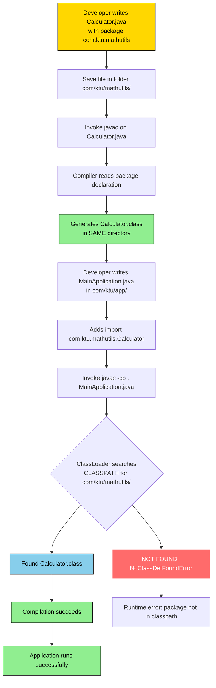
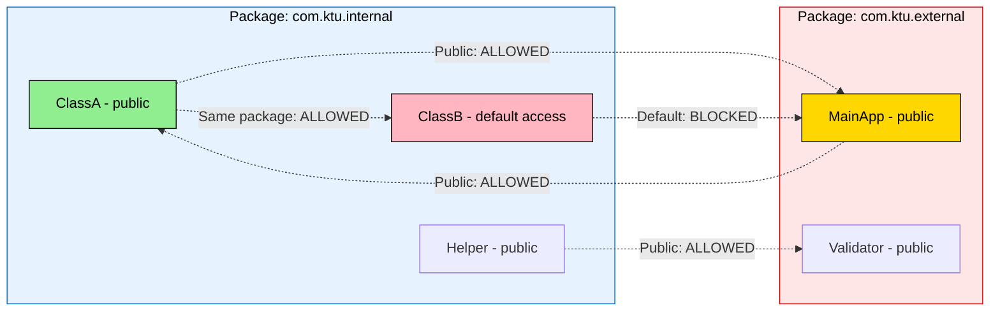
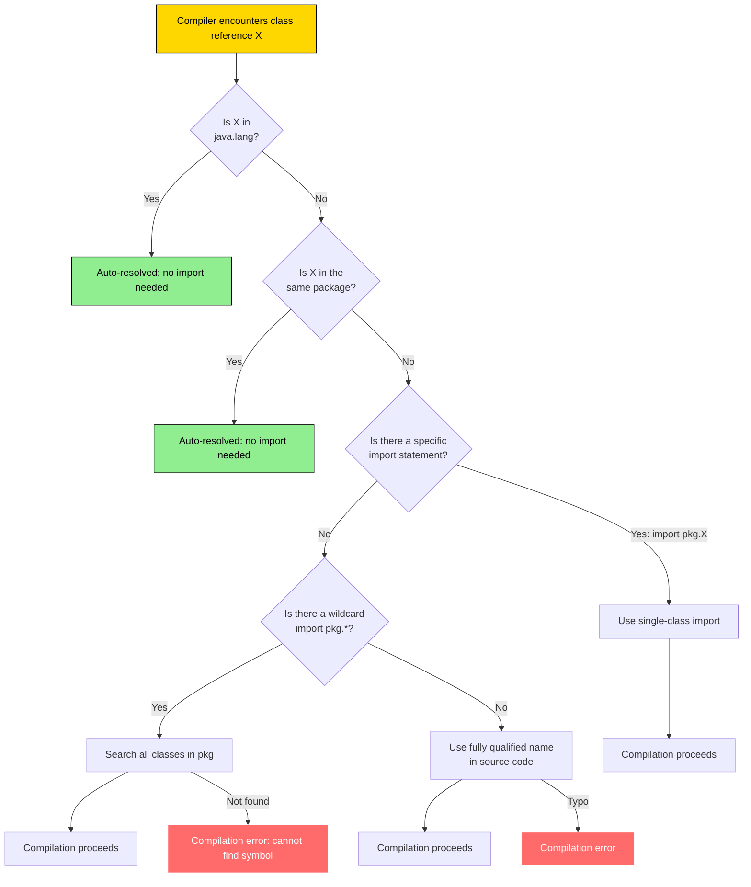
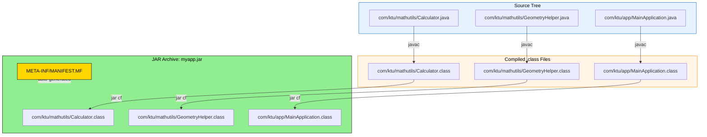

# Packages and Interfaces  – Packages - Defining a Package

<!-- SECTION_1_START -->
# Packages and Interfaces – Defining a Package

## 1.1 Formal Academic Definition (KTU 2024 Syllabus Aligned)

A **package** in Java is a **namespace abstraction** that organizes a set of related classes, interfaces, enumerations, and sub-packages into a single logical unit. Conceptually, a package acts as a **physical directory folder** and a **logical access domain** simultaneously, enabling modularity, encapsulation, name collision avoidance, and access control in large-scale object-oriented software architectures.

> [!IMPORTANT]
> **KTU 2024 Syllabus Definition:** A package is a grouping of related types (classes, interfaces, exceptions, errors, enums, annotations) providing access protection and namespace management. The `package` keyword declares the package membership of a Java compilation unit (`.java` file).

The package mechanism in Java is **purely hierarchical** and is enforced by the **Java Language Specification (JLS §7.1)**. There are three primary motivations for defining a package:

1. **Namespace Management** – Prevents class-name collisions across modules.
2. **Access Control Modulation** – Enables package-private (default) access modifier semantics.
3. **Logical Reusability & Distribution** – Allows bundling related types for JAR/WAR deployment.

## 1.2 Conceptual Analogy / Intuition

> [!NOTE]
> **Real-World Analogy — The Office Filing Cabinet System**
>
> Imagine a large multinational company with thousands of documents. Without organization, finding a single "Invoice.pdf" would be a nightmare. So, the company builds a structured **filing system**:
>
> | Real-World Concept | Java Equivalent |
> |---|---|
> | The whole company building | The **JVM (Java Virtual Machine)** running the application |
> | Each department (HR, Finance, R\&D) | A **Java Package** (`com.company.hr`, `com.company.finance`) |
> | A specific file inside a department | A **Class or Interface** within a package |
> | Folder hierarchy on disk | **Directory structure** mirroring package names |
> | Employee ID card granting entry | **Access modifiers** (`public`, `private`, default) |
> | Department visitor pass | **Import statements** for cross-package access |
>
> Just as departments **isolate** documents and **control** who sees what, packages in Java **isolate** classes and **enforce** access boundaries. Without packages, all classes would be dumped into a single global "room," causing name conflicts and privacy violations.

## 1.3 Physical Constants & Standard Metrics

> [!IMPORTANT]
> **Key Conventions to Remember:**
> - Java package names are conventionally written in **lowercase** (e.g., `java.util`, not `java.Util`).
> - The standard reverse-domain naming convention is enforced: `com.companyname.projectname.module`.
> - The default package (unnamed) has no `package` statement and corresponds to the **current working directory**.
> - A fully qualified class name = **package\_name + "." + class\_name** (e.g., `java.util.ArrayList`).

## 1.4 GeoGebra / Desmos Integration (Conceptual Visualization)

> [!VISUALIZATION CONTROL]
> **Concept:** Hierarchical Package-Tree Structure with Class Nodes
> **GeoGebra / Desmos Input Equations (Tree Layout Coordinate Hints):**
> * Root at coordinate `(0, 5)` representing `com`
> * First level points: `(-4, 3)` = `com.ktu`, `(0, 3)` = `com.ktu.oop`, `(4, 3)` = `com.ktu.utils`
> * Leaf class nodes: `(-4, 1)` = `Student.java`, `(0, 1)` = `Faculty.java`, `(4, 1)` = `Validator.java`
> **Visual Description:** The student should observe a downward-branching tree where the leftmost root is the top-level domain segment, and each downward branch represents a sub-package nesting. Leaf nodes represent actual `.java` files. The horizontal spread indicates **sibling packages** at the same level.

---

<!-- SECTION_1_END -->

<!-- SECTION_2_START -->
# Deep Theoretical Analysis & KTU High-Yield Formula Sheet

## 2.1 Operational Mechanics of Defining a Package

Defining a package in Java is a **two-step physical + logical process**:

### Step 1: Logical Declaration (in the `.java` source file)

The very first non-comment statement in a Java source file must be the `package` declaration if the class belongs to a named package.

### Step 2: Physical Directory Mirroring (on the file system)

The directory structure **must mirror** the package naming hierarchy exactly. Java's class loader relies on this mapping to locate `.class` files at runtime.

## 2.2 The Two Pillars of Java Package Hierarchy

| Pillar Type | Naming Style | Description | Example |
|---|---|---|---|
| **Built-in Packages** (JDK) | `java.*`, `javax.*` | Pre-shipped with JDK; part of standard library | `java.lang`, `java.util`, `java.io`, `java.net` |
| **User-defined Packages** | Custom (e.g., `com.ktu.*`) | Created by developers for their own application modules | `com.ktu.oop.banking`, `edu.kerala.university.registrar` |

> [!NOTE]
> **Automatic Packages:** Every Java program automatically has access to the `java.lang` package — this is the **only package imported implicitly** by the compiler. It contains `System`, `String`, `Object`, `Math`, and other core classes.

## 2.3 KTU Formula Sheet / Cheat Sheet

| # | Concept | Syntax / Rule | Example / Notes |
|---|---|---|---|
| 1 | Package Declaration | `package package_name;` | Must be **first** statement in file |
| 2 | Sub-package Declaration | `package parent.child.grandchild;` | Periods `.` separate levels |
| 3 | Single Class Per File (recommended) | One `public` class per `.java` file | File name must match public class name |
| 4 | Directory Mapping Rule | `com.ktu.oop` → `.../com/ktu/oop/ClassName.class` | Path separators are OS-specific (`/` or `\`) |
| 5 | Reverse-Domain Convention | `com.companyname.projectname` | Industry standard, avoids global conflicts |
| 6 | Default Access Level | No modifier → **package-private** | Accessible only within the same package |
| 7 | Wildcard Import | `import java.util.*;` | Imports all classes from `java.util` (NOT sub-packages) |
| 8 | Specific Import | `import java.util.ArrayList;` | More efficient, preferred in production code |
| 9 | Fully Qualified Name Usage | `java.util.ArrayList list = new java.util.ArrayList();` | No import needed; works in any package |
| 10 | Static Import | `import static java.lang.Math.PI;` | Imports static members; introduced in Java 5 |
| 11 | JAR File Bundling | `jar cf mypackage.jar com/` | Packages can be compressed into `.jar` archives |
| 12 | CLASSPATH Environment Variable | `set CLASSPATH=.;C:\myclasses` | Tells JVM where to search for user packages |

## 2.4 Engineering Utility & Real-World Production Use

> [!IMPORTANT]
> **Why Packages Matter in Production Systems:**
>
> 1. **Microservices & Modular Monoliths** – Each domain (e.g., `billing`, `inventory`, `auth`) lives in its own package boundary, enabling independent deployment and testing.
> 2. **Open-Source Distribution** – Libraries like Spring, Hibernate, and Apache Commons use `org.springframework.*`, `org.hibernate.*` to uniquely namespace their APIs globally.
> 3. **Build Tool Integration** – Maven and Gradle use the package structure to enforce **Java Module System (JPMS)** dependencies in `module-info.java`.
> 4. **Code Reviews & Maintainability** – A well-organized package tree signals architectural maturity; the **"package by feature"** vs. **"package by layer"** debate is a real-world engineering decision.
> 5. **Reflection & Frameworks** – Spring's `@ComponentScan("com.ktu.banking.*")` directly uses package paths to auto-discover beans.

## 2.5 Common Pitfalls in Defining Packages

> [!WARNING]
> **Critical Rules Students Often Miss:**
> - The `package` statement **cannot appear inside a class body** — it must be at the top.
> - There can be **only one `package` statement per file** — multiple packages per file are illegal.
> - The directory name and package name **must match exactly** (case-sensitive on Linux/macOS).
> - Putting `.class` files in the wrong directory causes `NoClassDefFoundError` at runtime.
> - `import` statements are **purely a compile-time convenience** — they generate no runtime code.

---

<!-- SECTION_2_END -->

<!-- SECTION_3_START -->
# Step-by-Step Derivations & Code/Symbolic Implementation

## 3.1 Walkthrough: Defining a Package from Scratch

We will build a complete working example consisting of two packages: `com.ktu.mathutils` (utility classes) and `com.ktu.app` (the main application that consumes them).

### Step 1: Set Up the Physical Directory Structure

Open a terminal and create the following folder hierarchy. The directory path **must literally match** the dotted package name.

```bash
mkdir -p com/ktu/mathutils
mkdir -p com/ktu/app
```

> [!NOTE]
> The `-p` flag creates parent directories automatically. On Windows, use `mkdir com\ktu\mathutils` with backslashes.

### Step 2: Create the First Package — `com.ktu.mathutils`

Create the file `com/ktu/mathutils/Calculator.java` with the following content:

```java
// File: com/ktu/mathutils/Calculator.java
// First non-comment statement MUST be the package declaration
package com.ktu.mathutils;

/**
 * Calculator is a utility class providing basic arithmetic operations.
 * It belongs to the com.ktu.mathutils package, which means its fully
 * qualified name is com.ktu.mathutils.Calculator.
 */
public class Calculator {

    // package-private constant (default access)
    static final double PI_VALUE = 3.14159;

    // public method: accessible from any package that imports this class
    public int add(int operandA, int operandB) {
        return operandA + operandB;
    }

    public int subtract(int operandA, int operandB) {
        return operandA - operandB;
    }

    public double multiply(double operandA, double operandB) {
        return operandA * operandB;
    }

    public double divide(double dividend, double divisor) throws ArithmeticException {
        if (divisor == 0.0) {
            throw new ArithmeticException("Division by zero is undefined in real arithmetic.");
        }
        return dividend / divisor;
    }
}
```

**Line-by-line explanation of the package mechanism:**

| Line | Purpose |
|---|---|
| `package com.ktu.mathutils;` | Declares that this class is a member of the `com.ktu.mathutils` package. Without this, the class would be in the **default package** (unnamed). |
| `public class Calculator` | The class is publicly accessible from any other package that imports or fully qualifies it. |
| `static final double PI_VALUE` | Default (package-private) access — only classes in `com.ktu.mathutils` can reference `PI_VALUE` directly. |
| `public int add(...)` | Public method — usable from any package. |

### Step 3: Create a Helper Class in the Same Package

Create the file `com/ktu/mathutils/GeometryHelper.java`:

```java
// File: com/ktu/mathutils/GeometryHelper.java
package com.ktu.mathutils;

public class GeometryHelper {

    // Uses Calculator from the SAME package — no import needed!
    public double computeCircleArea(double radius) {
        // We can call add() because we are in com.ktu.mathutils
        // But add() takes ints; for a proper area we use the formula directly
        double area = Calculator.PI_VALUE * radius * radius;
        return area;
    }

    public double computeRectangleArea(double length, double width) {
        Calculator calc = new Calculator();
        // Using multiply() from the sibling class within the same package
        return calc.multiply(length, width);
    }
}
```

**Key Insight:** Classes within the **same package** can access each other's package-private members and don't need `import` statements. This is the **encapsulation benefit** of packages.

### Step 4: Create the Consumer Class in a Different Package — `com.ktu.app`

Create the file `com/ktu/app/MainApplication.java`:

```java
// File: com/ktu/app/MainApplication.java
package com.ktu.app;

// Specific (single-class) import — preferred in production
import com.ktu.mathutils.Calculator;
// Wildcard import — imports all classes from the package
import com.ktu.mathutils.GeometryHelper;

public class MainApplication {

    public static void main(String[] args) {
        // Step 4.1: Instantiate the imported Calculator
        Calculator calculator = new Calculator();

        // Step 4.2: Use the imported methods
        int sumResult = calculator.add(45, 55);
        System.out.println("Sum (45 + 55) = " + sumResult);

        double productResult = calculator.multiply(7.5, 2.0);
        System.out.println("Product (7.5 * 2.0) = " + productResult);

        try {
            double quotientResult = calculator.divide(100.0, 4.0);
            System.out.println("Quotient (100.0 / 4.0) = " + quotientResult);
        } catch (ArithmeticException ex) {
            System.err.println("Math error: " + ex.getMessage());
        }

        // Step 4.3: Use the GeometryHelper from the same imported package
        GeometryHelper geometry = new GeometryHelper();
        double circleArea = geometry.computeCircleArea(5.0);
        double rectangleArea = geometry.computeRectangleArea(4.0, 6.0);
        System.out.println("Circle Area (r=5) = " + circleArea);
        System.out.println("Rectangle Area (4x6) = " + rectangleArea);

        // Step 4.4: Demonstrate accessing a package-private member from a different package
        // The line below WILL FAIL to compile — uncomment to test:
        // System.out.println("PI directly = " + Calculator.PI_VALUE);  // ERROR: not public

        // We must use the public multiply() method or expose a public getter
        System.out.println("Program executed successfully.");
    }
}
```

### Step 5: Compile the Code

From the **parent directory** (the one containing the `com/` folder), execute:

```bash
javac com/ktu/mathutils/Calculator.java
javac com/ktu/mathutils/GeometryHelper.java
javac -cp . com/ktu/app/MainApplication.java
```

> [!NOTE]
> The `-cp .` flag sets the **classpath** to the current directory so that the compiler can find `com.ktu.mathutils.*`. Without it, you will get a `package com.ktu.mathutils does not exist` error.

### Step 6: Run the Program

```bash
java -cp . com.ktu.app.MainApplication
```

**Expected Output:**

```text
Sum (45 + 55) = 100
Product (7.5 * 2.0) = 15.0
Quotient (100.0 / 4.0) = 25.0
Circle Area (r=5) = 78.53975
Rectangle Area (4x6) = 24.0
Program executed successfully.
```

## 3.2 Alternative Access Without `import` — Fully Qualified Names

You can bypass the `import` statement entirely by using the **fully qualified name** of a class. This is useful when two imported classes have the **same simple name** (a name collision).

```java
package com.ktu.app;

public class FullyQualifiedDemo {

    public static void main(String[] args) {
        // No import needed — using the full package.class path inline
        com.ktu.mathutils.Calculator calc = new com.ktu.mathutils.Calculator();
        int result = calc.add(10, 20);
        System.out.println("Result using FQN = " + result);
    }
}
```

**Compilation:**

```bash
javac -cp . com/ktu/app/FullyQualifiedDemo.java
java -cp . com.ktu.app.FullyQualifiedDemo
```

## 3.3 Step-by-Step Derivation: Directory-to-Package Mapping Rule

Let us formally derive why the directory structure must mirror the package name. Consider the fully qualified class name:

$$\text{FQN} = \underbrace{\text{com.ktu.mathutils}}_{\text{package part}} \cdot \underbrace{\text{Calculator}}_{\text{simple class name}}$$

Step 1: Split the package part on the period character (`.`):

$$\text{Package segments} = [\text{"com"}, \text{"ktu"}, \text{"mathutils"}]$$

Step 2: Map each segment to a subdirectory, joined by the OS path separator:

$$\text{Filesystem path} = \text{"com"} \oplus \text{"/"} \oplus \text{"ktu"} \oplus \text{"/"} \oplus \text{"mathutils"} \oplus \text{"/"}$$

Step 3: Append the class name with the `.class` extension:

$$\text{Class file path} = \text{"com/ktu/mathutils/Calculator.class"}$$

> [!IMPORTANT]
> This mapping is **enforced by the Java ClassLoader** via the `ClassLoader.loadClass(String name)` method, which internally uses `getResource(name)` to translate the package path into a relative file path. The JVM does NOT search the entire filesystem — it follows this exact mapping rule.

## 3.4 Complete Project File Tree (Final Reference)

```text
project_root/
├── com/
│   ├── ktu/
│   │   ├── mathutils/
│   │   │   ├── Calculator.java
│   │   │   ├── Calculator.class      (generated after javac)
│   │   │   ├── GeometryHelper.java
│   │   │   └── GeometryHelper.class  (generated after javac)
│   │   └── app/
│   │       ├── MainApplication.java
│   │       ├── MainApplication.class (generated)
│   │       └── FullyQualifiedDemo.java
```

> [!WARNING]
> **Compilation Order Matters:** When compiling `MainApplication.java` which depends on `Calculator`, the dependent classes must already be compiled (their `.class` files must exist) OR you must pass both files to `javac` in one invocation. Otherwise, you get a `cannot find symbol` error.

---

<!-- SECTION_3_END -->

<!-- SECTION_4_START -->
# Structural Diagrams & Schematics

## 4.1 Mermaid Block Diagram — Java Package Compilation & Resolution Flow



## 4.2 Mermaid Block Diagram — Package Access Control Matrix



## 4.3 Mermaid Block Diagram — Import Resolution Decision Tree



## 4.4 Mermaid Block Diagram — JAR Packaging Topology



---

<!-- SECTION_4_END -->

<!-- SECTION_5_START -->
# KTU 2024 Scheme Examination Question Bank & Topic Recap

## Part A — Short Answer Questions (3 Marks Each)

### Question 1: Define a Package in Java. Mention its two primary advantages. `[KTU University Exam - Dec 2023]`

**Model Answer (Mapping: CO1, Remember Level):**

A package in Java is a **namespace mechanism** that groups a set of related classes, interfaces, and sub-packages into a single logical module. It is declared using the `package` keyword as the first statement in a source file.

**Two primary advantages:**

1. **Namespace Management:** Prevents naming conflicts between classes with the same simple name in different modules (e.g., `com.ktu.oop.Student` vs. `edu.kerala.university.Student`).

2. **Access Control:** Provides the **package-private (default)** access level, allowing encapsulation across classes within the same module.

> [!NOTE]
> **Valuation Key:** [Defining package: 1 Mark] [First advantage: 1 Mark] [Second advantage: 1 Mark]

---

### Question 2: What is the role of the CLASSPATH environment variable when working with user-defined packages? `[KTU University Exam - July 2024]`

**Model Answer (Mapping: CO1, Understand Level):**

The **CLASSPATH** is an environment variable that tells the **Java compiler (`javac`)** and the **Java Virtual Machine (`java`)** where to search for user-defined `.class` files outside the JDK's standard library. When a program references a class from a custom package like `com.ktu.mathutils`, the JVM uses the CLASSPATH entries (and the current directory `.`) to locate the corresponding `com/ktu/mathutils/*.class` files.

Example setup on Windows:
```bash
set CLASSPATH=.;C:\myprojects\bin
```

If CLASSPATH is not set, the default is the **current working directory only**.

> [!NOTE]
> **Valuation Key:** [Defining CLASSPATH: 1 Mark] [Role in compilation/runtime: 1 Mark] [Example command: 1 Mark]

---

## Part B — Long Answer Questions (14 Marks Each — Internal Choice)

### Question A: Package Creation and Access `[14 Marks]` `[KTU University Exam - Dec 2023]`

**Question:**
*Consider a Java application for a University Result Management System. Answer the following:*

**(a)** Create a user-defined package called `university.results` containing a public class `StudentRecord` with the following members: a private variable `rollNumber` (int), a public variable `studentName` (String), a public method `setRollNumber(int r)` to set the roll number, and a public method `getRollNumber()` to retrieve it. Also, include a **package-private** (default access) method `displayInternalCode()` that prints a fixed string `"INTERNAL-2024"`. **[7 Marks]**

**(b)** Create another package `university.admin` containing a `MainApp` class that imports the `StudentRecord` class, instantiates it, sets a roll number and name, displays the roll number, and attempts to call `displayInternalCode()`. Show the **compilation error** that occurs and explain **why** it occurs using the concept of access control. Then modify the program to use a `public` accessor method instead. **[7 Marks]**

---

#### Part (a) — Model Solution `[7 Marks]`

**File: `university/results/StudentRecord.java`**

```java
package university.results;

public class StudentRecord {
    // Step 1: Declare instance variables with appropriate access modifiers
    private int rollNumber;              // private: accessible ONLY inside this class
    public String studentName;           // public: accessible from any package

    // Step 2: Public setter for private rollNumber
    public void setRollNumber(int rollNumber) {
        this.rollNumber = rollNumber;
    }

    // Step 3: Public getter for private rollNumber
    public int getRollNumber() {
        return this.rollNumber;
    }

    // Step 4: Package-private (default access) method
    void displayInternalCode() {
        System.out.println("INTERNAL-2024");
    }
}
```

**Valuation Key for Part (a):**
| Step | Marks |
|---|---|
| Correct `package` declaration | 1 |
| Class declared `public` with correct name | 1 |
| `private` and `public` variable declarations | 1 |
| `setRollNumber` and `getRollNumber` correctly implemented | 2 |
| `displayInternalCode` with default (no modifier) access | 2 |
| **Total** | **7** |

---

#### Part (b) — Model Solution `[7 Marks]`

**File: `university/admin/MainApp.java`**

```java
package university.admin;

// Step 1: Import the StudentRecord class from another package
import university.results.StudentRecord;

public class MainApp {
    public static void main(String[] args) {
        // Step 2: Instantiate the imported class
        StudentRecord record = new StudentRecord();

        // Step 3: Set values using public methods/fields
        record.setRollNumber(101);
        record.studentName = "Ananya Krishnan";

        // Step 4: Read and display the roll number
        System.out.println("Student Name: " + record.studentName);
        System.out.println("Roll Number  : " + record.getRollNumber());

        // Step 5: Attempt to call the package-private method — THIS FAILS
        // record.displayInternalCode();   // COMPILATION ERROR
    }
}
```

**Compilation Error Produced:**

```text
error: displayInternalCode() is not public in StudentRecord;
       cannot be accessed from outside package
```

**Explanation (Mapping: CO2, Understand Level):**

The method `displayInternalCode()` is declared **without any access modifier**, which in Java means it has **package-private (default) access**. This visibility level restricts the method to **only classes within the same package** (`university.results`). Since `MainApp` is in a different package (`university.admin`), it cannot invoke this method — the compiler enforces this boundary to maintain encapsulation.

**Modified Solution — Adding a Public Accessor:**

In `StudentRecord.java`, add:

```java
public void showInternalCodePublic() {
    displayInternalCode();   // Internal call is allowed (same class)
}
```

Then in `MainApp.java`:

```java
record.showInternalCodePublic();   // Output: INTERNAL-2024
```

**Valuation Key for Part (b):**
| Step | Marks |
|---|---|
| Correct `package` and `import` statements | 1 |
| Object instantiation and method calls | 2 |
| Compilation error message reproduced correctly | 1 |
| Explanation of package-private access | 2 |
| Modified public accessor solution | 1 |
| **Total** | **7** |

---

### Question B (Alternative Choice): Directory Structure and CLASSPATH `[14 Marks]` `[KTU University Exam - July 2024]`

**Question:**
*Answer the following:*

**(a)** Explain the relationship between Java package naming and physical file system directories. Write a step-by-step procedure to create a package `com.ktu.cse.calculator` containing a public class `ScientificCalculator` with methods `power(double base, double exp)` and `squareRoot(double value)`. Show the exact directory structure and the commands needed to compile and run it from the `project_root` directory. **[7 Marks]**

**(b)** Demonstrate with a code example the **three different ways** to use a class from another package: (i) fully qualified name without import, (ii) specific single-class import, and (iii) wildcard import. For each, state one advantage and one disadvantage. **[7 Marks]**

---

#### Part (a) — Model Solution `[7 Marks]`

**Explanation of Package-to-Directory Mapping:**

Java enforces a strict **one-to-one correspondence** between a package's dotted name and the file system directory hierarchy. Each segment of the package name (separated by `.`) becomes a subdirectory. This mapping is mandatory because the Java ClassLoader uses the **package path** to construct the **relative file path** to the `.class` files at runtime.

$$\text{Package: com.ktu.cse.calculator} \iff \text{Path: com/ktu/cse/calculator/}$$

**Step-by-Step Procedure:**

**Step 1: Create the directory tree from `project_root`:**

```bash
mkdir -p com/ktu/cse/calculator
```

**Step 2: Create the file `com/ktu/cse/calculator/ScientificCalculator.java`:**

```java
package com.ktu.cse.calculator;

public class ScientificCalculator {

    public double power(double base, double exponent) {
        return Math.pow(base, exponent);
    }

    public double squareRoot(double value) {
        if (value < 0.0) {
            throw new ArithmeticException("Square root of negative number is imaginary.");
        }
        return Math.sqrt(value);
    }
}
```

**Step 3: Compile the file from `project_root`:**

```bash
javac com/ktu/cse/calculator/ScientificCalculator.java
```

This produces `ScientificCalculator.class` in the **same directory** as the source file.

**Step 4: Create a separate directory for the main app:**

```bash
mkdir -p com/ktu/cse/main
```

**Step 5: Create `com/ktu/cse/main/CalculatorApp.java`:**

```java
package com.ktu.cse.main;

import com.ktu.cse.calculator.ScientificCalculator;

public class CalculatorApp {
    public static void main(String[] args) {
        ScientificCalculator sciCalc = new ScientificCalculator();
        System.out.println("2^10 = " + sciCalc.power(2.0, 10.0));
        System.out.println("sqrt(144) = " + sciCalc.squareRoot(144.0));
    }
}
```

**Step 6: Compile and run with classpath set to project root:**

```bash
javac -cp . com/ktu/cse/main/CalculatorApp.java
java -cp . com.ktu.cse.main.CalculatorApp
```

**Expected Output:**

```text
2^10 = 1024.0
sqrt(144) = 12.0
```

**Valuation Key for Part (a):**
| Step | Marks |
|---|---|
| Explanation of package-directory mapping rule | 1 |
| `mkdir` command and directory structure | 1 |
| Package declaration and public class structure | 1 |
| `power()` and `squareRoot()` method implementation | 2 |
| Correct `javac` and `java` commands with `-cp .` | 2 |
| **Total** | **7** |

---

#### Part (b) — Model Solution `[7 Marks]`

**Three Ways to Use a Class From Another Package:**

**Way (i): Fully Qualified Name (No Import)**

```java
package com.ktu.cse.demo;

public class FQNDemo {
    public static void main(String[] args) {
        // Use the class directly via its fully qualified path
        com.ktu.cse.calculator.ScientificCalculator sci =
            new com.ktu.cse.calculator.ScientificCalculator();
        System.out.println("3^4 = " + sci.power(3.0, 4.0));
    }
}
```

> **Advantage:** No import statement is required — the source file is fully self-contained.
> **Disadvantage:** The code becomes verbose and hard to read when the fully qualified name is long.

**Way (ii): Specific Single-Class Import**

```java
package com.ktu.cse.demo;

import com.ktu.cse.calculator.ScientificCalculator;  // specific import

public class SpecificImportDemo {
    public static void main(String[] args) {
        ScientificCalculator sci = new ScientificCalculator();
        System.out.println("5^2 = " + sci.power(5.0, 2.0));
    }
}
```

> **Advantage:** Clean, readable code; explicitly states dependencies — preferred in production.
> **Disadvantage:** If many classes from the same package are needed, the import list becomes long.

**Way (iii): Wildcard Import**

```java
package com.ktu.cse.demo;

import com.ktu.cse.calculator.*;  // wildcard import

public class WildcardImportDemo {
    public static void main(String[] args) {
        ScientificCalculator sci = new ScientificCalculator();
        System.out.println("sqrt(81) = " + sci.squareRoot(81.0));
    }
}
```

> **Advantage:** A single import statement brings in all classes from the package, reducing boilerplate.
> **Disadvantage:** Reduces code clarity about which classes are actually used; **does NOT import sub-packages** (a common misconception).

**Valuation Key for Part (b):**
| Step | Marks |
|---|---|
| FQN example with no import | 1.5 |
| FQN advantage + disadvantage | 1 |
| Specific import example | 1.5 |
| Specific import advantage + disadvantage | 1 |
| Wildcard import example | 1.5 |
| Wildcard import advantage + disadvantage | 0.5 |
| **Total** | **7** |

---

> [!WARNING]
> **KTU Examiner's Valuation Pitfall Callout — Defining a Package**
> 1. **Forgetting the `package` statement as the first line:** A `package` declaration that appears after an `import` or `class` statement is a **compilation error**. Always place it at the **top**.
> 2. **Mismatched folder and package names:** The compiler does NOT check this — only the JVM at runtime does. So a wrong folder name gives a confusing `NoClassDefFoundError`. **Always verify the directory tree before submission.**
> 3. **Conflating `import java.util.*;` with sub-packages:** Wildcard imports do **not** recursively import sub-packages. `java.util.*` does NOT import `java.util.concurrent.*`.
> 4. **Confusing `protected` with `package-private`:** `protected` allows access to **subclasses** outside the package AND same-package classes. `default` (no modifier) is strictly same-package only.
> 5. **Using `-cp` incorrectly during the lab exam:** Forgetting `.` (current directory) in `-cp .` is the #1 cause of "package does not exist" errors in KTU lab evaluations.

---

## Topic Recap & Important Things to Remember

> [!IMPORTANT]
> **High-Density Revision Checklist — Defining a Package in Java**

- **Definition Recap:** A package is a namespace + directory mechanism that groups related Java types and provides access control.

- **Declaration Rule:** `package` keyword must be the **first** non-comment statement in the source file.

- **Sub-packages:** Period-separated hierarchy (e.g., `com.ktu.cse.semester5.oop`). Each segment is a separate subdirectory.

- **Default Package:** A `.java` file with no `package` statement belongs to the unnamed default package — not recommended for real projects.

- **Two Package Categories:**
  1. **Built-in:** `java.lang` (auto-imported), `java.util`, `java.io`, `java.net`, `javax.swing`.
  2. **User-defined:** Custom packages created using the `package` keyword.

- **Naming Convention:** All-lowercase, reverse-domain, no underscores or hyphens. Example: `org.apache.commons.lang3`.

- **Directory Mapping (Critical):** Package `com.ktu.oop` → folder `com/ktu/oop/`. The path **must match exactly** (case-sensitive on Unix-like systems).

- **Import Statements:**
  - `import pkg.ClassName;` — imports a single class.
  - `import pkg.*;` — imports all classes (not sub-packages) in `pkg`.
  - `import static pkg.ClassName.member;` — imports a static member (Java 5+).
  - `java.lang.*` is **implicitly** imported.

- **Access Control Levels (in increasing restrictiveness):**

  | Modifier | Same Class | Same Package | Subclass (Different Pkg) | Other Packages |
  |---|---|---|---|---|
  | `public` | ✓ | ✓ | ✓ | ✓ |
  | `protected` | ✓ | ✓ | ✓ | ✗ |
  | default (no modifier) | ✓ | ✓ | ✗ | ✗ |
  | `private` | ✓ | ✗ | ✗ | ✗ |

- **Compilation Commands:**
  - `javac -d <output_dir> <source_file>` — compiles and places `.class` in mirror structure.
  - `java -cp <classpath> fully.qualified.MainClass` — runs the program.

- **CLASSPATH:** Environment variable or `-cp` flag that lists root directories or JAR files where the JVM should search for user classes.

- **JAR Files:** Packages can be archived using `jar cf myapp.jar com/` and executed with `java -cp myapp.jar com.ktu.MainClass`.

- **Common Errors to Watch:**
  - `package ... does not exist` — wrong `-cp` setting.
  - `cannot find symbol` — missing import or typo.
  - `displayInternalCode() is not public` — accessing default-access member from outside the package.
  - `NoClassDefFoundError` (runtime) — directory structure does not match package declaration.

- **KTU Exam Tip:** When asked to "define a package" in 3 marks, always include: (1) the `package` keyword, (2) namespace + access control dual purpose, (3) directory-mapping requirement.

- **Production Tip:** "Package by feature, not by layer" is the modern best practice (e.g., `com.banking.loans`, `com.banking.payments` rather than `com.banking.controllers`, `com.banking.models`).

---

<!-- SECTION_5_END -->
