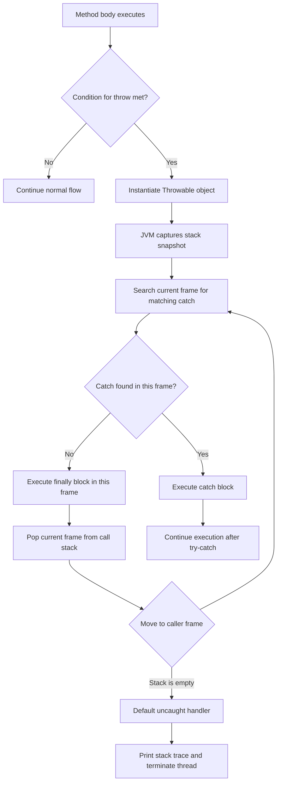
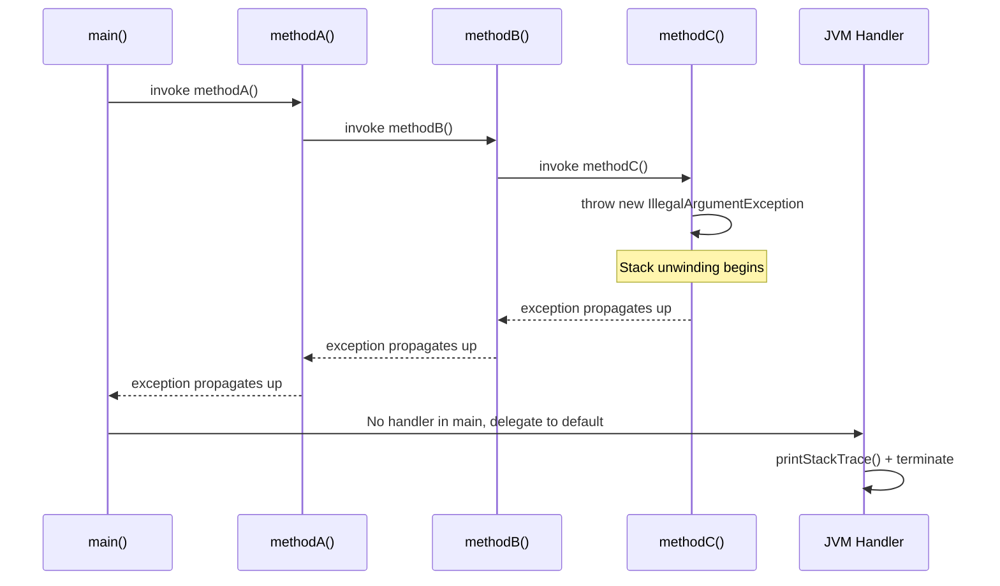
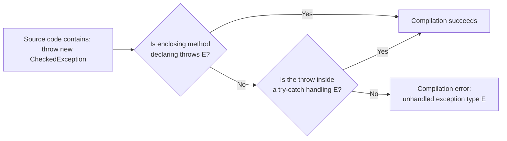
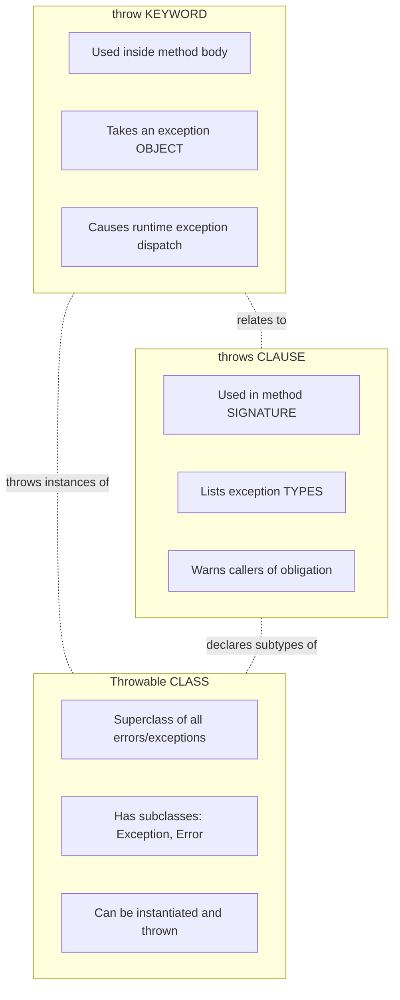
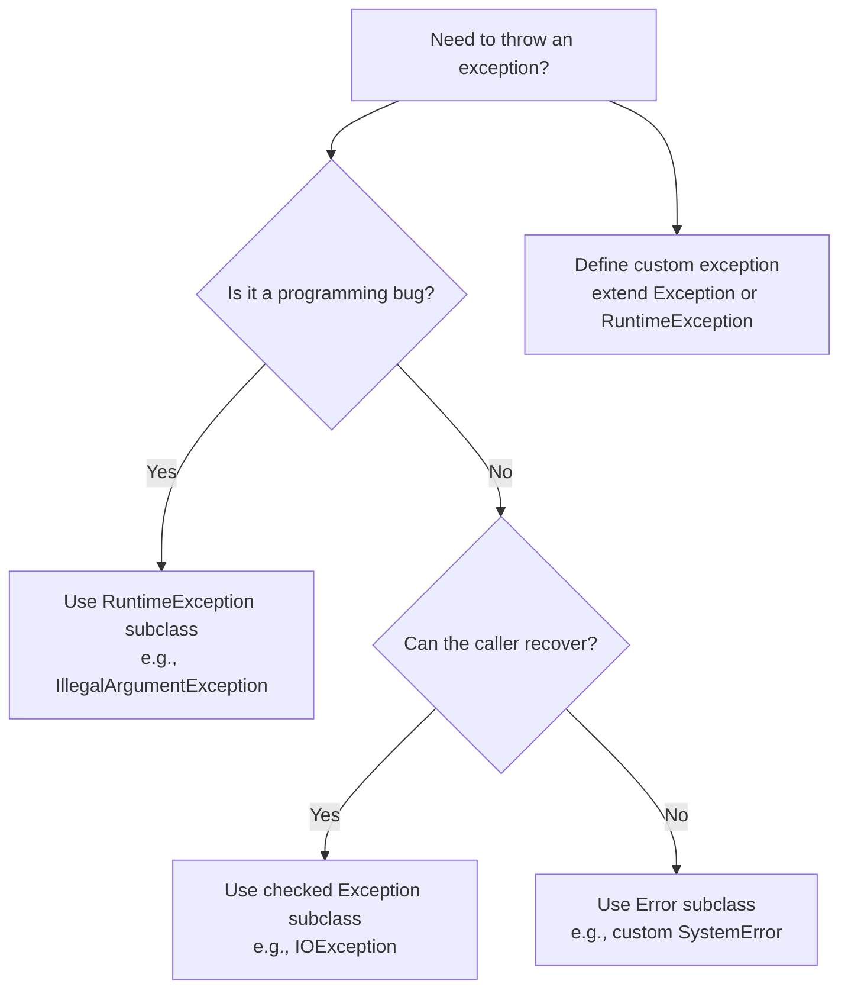
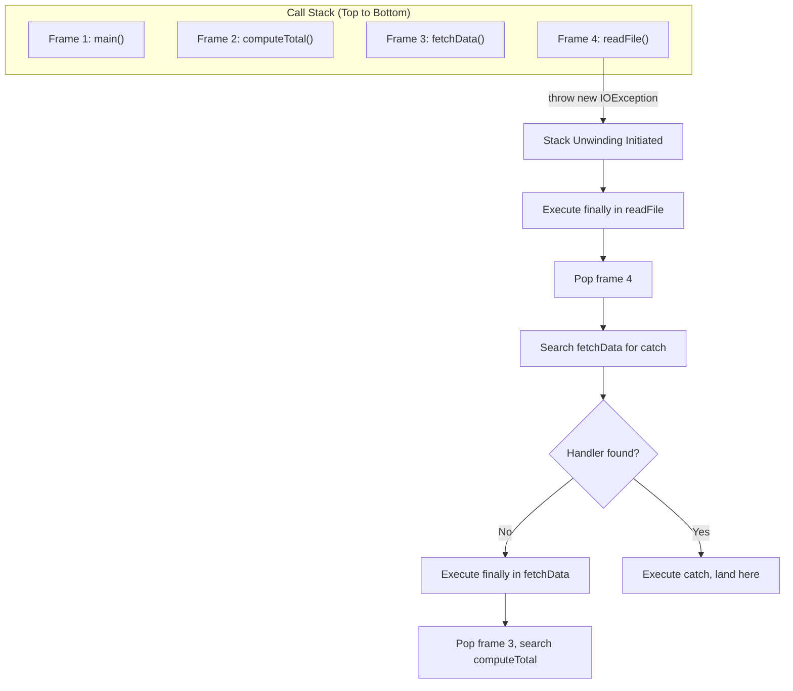

# throw

<!-- SECTION_1_START -->

# 🚀 Java `throw` Keyword — The Art of Manually Triggering Exceptions

## 1.1 Formal KTU 2024 Definition

> [!IMPORTANT]
> **Definition (Per KTU OOP Syllabus):** The `throw` keyword in Java is an **explicit exception triggering mechanism** used inside a method body, static initializer, or constructor to **deliberately instantiate and dispatch a single exception object** to the Java Virtual Machine (JVM) runtime exception handler. When the `throw` statement executes, normal program flow is immediately terminated, and control is transferred to the nearest enclosing `try-catch` or `try-catch-finally` block that can handle the dispatched exception type.

In technical terms, `throw` is a **unary operator** (not a declaration modifier like `throws`) that takes exactly **one operand** — an instantiated `Throwable` (or subclass) object — and forcibly raises it on the call stack.

| Property | Value |
| :--- | :--- |
| Keyword Category | Flow Control / Exception Control |
| Number of Operands | **Exactly one** (an exception object) |
| Operand Type | `Throwable` or any subclass (`Exception`, `RuntimeException`, `Error`, custom) |
| Location of Use | Inside method/constructor/static block body |
| Effect on Control Flow | Unwinds the call stack immediately |
| Compile-Time Checked? | **No** (the compiler does not force a `try-catch` after every `throw`) |

---

## 1.2 Conceptual Analogy — The Fire Alarm

Imagine a building with a **fire alarm system**.

- The fire alarm button (`throw`) is something you **press on purpose** when you detect smoke.
- Once pressed, the alarm **immediately rings** (exception is dispatched).
- Everyone working normally stops their current activity (normal program flow halts).
- They follow the emergency exit plan (the nearest matching `catch` block).
- Finally, the safety officer files a report (the `finally` block runs).

> [!NOTE]
> **Crucial Distinction:** A `fire` itself is not the `throw` — the alarm button is. The fire (exception object) is the **cause**; `throw` is the **mechanism of declaration**.

---

## 1.3 Why Was `throw` Introduced?

Java's designers recognized that not all exceptional conditions can be caught automatically by the JVM. Many situations require the **programmer to assert that an invariant has been violated**:

1. **Input Validation** — A method receives age = -5; it must reject it.
2. **Business Rule Enforcement** — A bank account cannot have a negative balance.
3. **State Assertion** — A network connection is unexpectedly null mid-process.
4. **Re-Raising Caught Exceptions** — After partial recovery, a higher-layer exception must be triggered.
5. **Wrapping Lower-Level Exceptions** — Translating a `SQLException` into a domain-specific exception.

In all these cases, the JVM has no way of knowing something is "wrong" unless the developer **explicitly tells it** — and that is precisely what `throw` does.

---

## 1.4 Standard Java Exception Hierarchy (for `throw` context)

```
java.lang.Object
    └── java.lang.Throwable
            ├── java.lang.Error           (JVM fatal — usually not thrown by user code)
            │       ├── OutOfMemoryError
            │       └── StackOverflowError
            └── java.lang.Exception
                    ├── IOException              (Checked)
                    ├── SQLException              (Checked)
                    └── RuntimeException          (Unchecked)
                            ├── ArithmeticException
                            ├── NullPointerException
                            ├── ArrayIndexOutOfBoundsException
                            └── IllegalArgumentException
```

> [!TIP]
> **KTU Exam Tip:** Custom exceptions (e.g., `class MyException extends Exception`) are **checked** by default. To make them **unchecked**, extend `RuntimeException` instead. This single inheritance decision controls whether the compiler *forces* a `try-catch` or `throws` declaration at the call site.

---

## 1.5 GeoGebra / Desmos Visualization

> [!VISUALIZATION CONTROL]
> **Concept:** Call Stack Unwinding during a `throw`
> **Visualization Type:** Function-graph analogy
> **GeoGebra / Desmos Input Equations:**
> * `f(x) = -2*x + 10` (Linear decay — represents the call stack depth as `throw` propagates)
> * `g(x) = 2` (Constant low line — represents the `catch` block as the "landing floor")
> * `Point: (1, 8)` labeled "methodA()"
> * `Point: (2, 6)` labeled "methodB()"
> * `Point: (3, 4)` labeled "methodC() — throw here"
> **Visual Description:** A descending staircase from top-left to bottom-right. The moment `throw` fires in `methodC()`, the "control point" drops vertically down past every method frame until it hits the matching `catch` block (line `g(x) = 2`). Methods that the control point *skips* over have their `finally` blocks execute on the way down.

---

<!-- SECTION_1_END -->

<!-- SECTION_2_START -->

# 🔬 Deep Theoretical Analysis & KTU High-Yield Formula Sheet

## 2.1 The Operational Mechanics of `throw`

When the JVM encounters a `throw new SomeException(...)` statement, the following sequence unfolds:

1. **Object Instantiation** — The right-hand side `new SomeException("msg")` allocates a heap object, just like any other object.
2. **Stack Snapshot Capture** — The JVM calls `fillInStackTrace()` on the new object, capturing the current call stack as a `StackTraceElement[]`.
3. **Search for Handler** — The JVM walks backward up the call stack, frame by frame, looking for a `try-catch` whose catch-clause parameter type is **assignable from** the thrown object's type.
4. **Stack Unwinding** — As the search proceeds, **all `finally` blocks** encountered along the way are executed.
5. **Handler Execution** — When a matching `catch` is found, its body executes. The thrown object's reference is bound to the catch parameter.
6. **Fallback** — If no handler is found, the default JVM uncaught-exception handler runs, printing the stack trace and terminating the thread.

> [!NOTE]
> **Memory Insight:** Throwing an exception is **expensive** — it involves heap allocation, stack-walk, and snapshot capture. This is why exceptions are reserved for *exceptional* conditions, not normal control flow.

---

## 2.2 Syntax — The Three Valid Forms of `throw`

**Form 1: Throw a new exception object (most common)**
```java
throw new ArithmeticException("Division by zero");
```

**Form 2: Throw a pre-constructed exception reference**
```java
ArithmeticException ae = new ArithmeticException("Custom");
throw ae;          // Re-throws the same object
```

**Form 3: Throw a caught exception (re-throwing)**
```java
try {
    riskyOperation();
} catch (IOException e) {
    logger.error("Logging only — re-raising");
    throw e;        // Re-dispatches the original exception
}
```

> [!WARNING]
> **KTU Pitfall:** `throw` is **NOT** followed by a *type*; it is followed by an *instance*. Writing `throw ArithmeticException;` (without `new`) is a **compile-time error**.

---

## 2.3 Rules Mandated by the Java Language Specification (JLS §14.18)

| Rule # | Description | Consequence if Violated |
| :---: | :--- | :--- |
| 1 | Operand must be `Throwable` or subclass | **Compile error** |
| 2 | The operand must be a *reference* (object), not a primitive | **Compile error** |
| 3 | A `throw` statement makes the *current code path* unreachable | Code after `throw` is a **compile error** (unreachable statement) |
| 4 | If a `throw` is inside a checked-exception class, the enclosing method **must declare** it via `throws` (or handle it) | **Compile error** for checked exceptions only |
| 5 | The exception object's type is determined at **compile time** via the reference's static type | Polymorphic dispatch of *catch* clauses |

---

## 2.4 Checked vs Unchecked — The Most Tested KTU Concept

| Aspect | Checked Exception | Unchecked Exception |
| :--- | :--- | :--- |
| **Parent Class** | `java.lang.Exception` (not `RuntimeException`) | `java.lang.RuntimeException` or `java.lang.Error` |
| **Compiler Enforcement** | ✅ **Forced** — must `try-catch` or `throws` | ❌ Not enforced — optional handling |
| **Typical Use Case** | Recoverable conditions (I/O, network) | Programming bugs (logic errors) |
| **Common Examples** | `IOException`, `SQLException`, `ClassNotFoundException` | `NullPointerException`, `ArithmeticException`, `ArrayIndexOutOfBoundsException` |
| **When `throw`-ing inside a method** | Method signature **must** include `throws` | Method signature need NOT include anything |

> [!IMPORTANT]
> **Board Exam Gold Rule:** The compiler enforces a rule called *Handle-or-Declare*. If you `throw` a checked exception from a method, the method must either (a) wrap it in `try-catch` OR (b) declare it in the `throws` clause. Unchecked exceptions escape this rule.

---

## 2.5 KTU Formula Sheet — The Cheat Code

| Concept | Formula / Rule | Mnemonic |
| :--- | :--- | :--- |
| Operand count | `throw <expr>` where `<expr>` resolves to exactly **1** `Throwable` reference | "One throw, one object" |
| Unreachability | $\text{Code after } \texttt{throw} \rightarrow \text{UnreachableStatementError}$ | "Dead code" |
| Catch resolution | $\text{Catch matches} \iff T_{\text{caught}} \supseteq T_{\text{thrown}}$ (assignable) | "Liskov catch" |
| Stack frames unwound | $n = \text{(number of method frames between throw and catch)}$ | "Unwind count" |
| Checked throw handler | $\text{Method} \rightarrow \text{throws } E \lor \text{try-catch } E$ | "Handle-or-Declare" |
| Custom checked exception | $\texttt{class } X \texttt{ extends Exception} \{ \}$ | "Extend Exception" |
| Custom unchecked exception | $\texttt{class } X \texttt{ extends RuntimeException} \{ \}$ | "Extend Runtime" |
| Re-throw | $\texttt{throw } e\text{;}$ inside a `catch` block | "Re-dispatch" |
| Throw in finally | $\texttt{throw}$ in `finally` **masks** any pending throw from `catch` | "Finally mask" |

---

## 2.6 Engineering Real-World Utility

| Domain | Use of `throw` |
| :--- | :--- |
| **Banking Software** | `throw new InsufficientFundsException("Balance: " + bal);` |
| **REST APIs (Spring)** | `throw new ResourceNotFoundException("User id " + id + " missing");` |
| **Embedded Systems (IoT)** | `throw new SensorOfflineException("DHT22 timeout at pin 7");` |
| **Game Development** | `throw new InvalidMoveException("Pawn cannot move diagonally");` |
| **Compiler Design** | `throw new ParseException("Unexpected token at line " + lineNo);` |
| **Database Layer (JDBC)** | `throw new DataIntegrityViolationException("FK constraint violated");` |
| **Cryptography** | `throw new InvalidKeyException("RSA key length must be ≥2048 bits");` |

The `throw` keyword is the **primary mechanism of contract enforcement** in Java — it is the language's way of saying *"I refuse to continue because a precondition is violated."*

---

<!-- SECTION_2_END -->

<!-- SECTION_3_START -->

# 🛠️ Step-by-Step Derivations, Code & Symbolic Implementation

## 3.1 Worked Example 1 — Basic Validation with `throw`

**Problem Statement:** Write a Java method `setAge(int age)` that throws an `IllegalArgumentException` if the age is negative or greater than 150.

**Full Exhaustive Implementation:**

```java
public class Person {
    private int age;

    public void setAge(int age) {
        // Step 1: Validate lower bound
        if (age < 0) {
            // Step 2: Construct the exception with a descriptive message
            IllegalArgumentException ex = new IllegalArgumentException(
                "Age cannot be negative. Received: " + age
            );
            // Step 3: Dispatch the exception
            throw ex;
        }

        // Step 4: Validate upper bound
        if (age > 150) {
            throw new IllegalArgumentException(
                "Age cannot exceed 150. Received: " + age
            );
        }

        // Step 5: Only reached if validation passed
        this.age = age;
        System.out.println("Age set to: " + age);
    }

    public static void main(String[] args) {
        Person p = new Person();

        // Test Case 1: Valid input
        p.setAge(25);

        // Test Case 2: Invalid input
        try {
            p.setAge(-5);
        } catch (IllegalArgumentException e) {
            System.out.println("Caught: " + e.getMessage());
        }
    }
}
```

**Output Trace:**
```
Age set to: 25
Caught: Age cannot be negative. Received: -5
```

**Line-by-Line Logic Walkthrough:**

| Line | Action | Why |
| :--- | :--- | :--- |
| `if (age < 0)` | Guard clause — fails fast | Defensive programming |
| `new IllegalArgumentException(...)` | Allocates exception on heap | Must be a `Throwable` object |
| `throw ex;` | Dispatches to JVM | Triggers stack unwinding |
| `this.age = age;` | Never reached on invalid path | Unreachable due to `throw` |
| `try { p.setAge(-5); }` | Caller wraps the risky call | Exception must be caught somewhere |
| `catch (IllegalArgumentException e)` | Handler matches the thrown type | Assignability: `IAE` $\supseteq$ `IAE` |
| `e.getMessage()` | Retrieves the message passed to constructor | Provides diagnostic info |

---

## 3.2 Worked Example 2 — Custom Checked Exception with `throw`

**Problem Statement:** Create a custom checked exception `InsufficientFundsException` and use it in a `BankAccount` class.

```java
// ──────────────────────────────────────────────
// Step A: Define the custom checked exception
// ──────────────────────────────────────────────
class InsufficientFundsException extends Exception {
    private double balance;
    private double withdrawalAmount;

    public InsufficientFundsException(String message,
                                      double balance,
                                      double withdrawalAmount) {
        super(message);
        this.balance = balance;
        this.withdrawalAmount = withdrawalAmount;
    }

    public double getBalance()              { return balance; }
    public double getWithdrawalAmount()     { return withdrawalAmount; }
    public double getShortfall() {
        return withdrawalAmount - balance;
    }
}

// ──────────────────────────────────────────────
// Step B: The class that uses (throws) the custom exception
// ──────────────────────────────────────────────
class BankAccount {
    private String accountHolder;
    private double balance;

    public BankAccount(String accountHolder, double openingBalance) {
        this.accountHolder = accountHolder;
        this.balance = openingBalance;
    }

    public void withdraw(double amount) throws InsufficientFundsException {
        // Validation 1: Negative amount
        if (amount <= 0) {
            throw new IllegalArgumentException(
                "Withdrawal amount must be positive. Got: " + amount
            );
        }

        // Validation 2: Insufficient balance
        if (amount > balance) {
            // This is a CHECKED exception → method must declare 'throws'
            throw new InsufficientFundsException(
                "Withdrawal of " + amount + " exceeds available balance " + balance,
                balance,
                amount
            );
        }

        // Success path
        balance -= amount;
        System.out.printf("Withdrew %.2f. New balance: %.2f%n", amount, balance);
    }

    public double getBalance() {
        return balance;
    }
}

// ──────────────────────────────────────────────
// Step C: The caller (must handle the checked exception)
// ──────────────────────────────────────────────
public class BankDemo {
    public static void main(String[] args) {
        BankAccount account = new BankAccount("Alice", 1000.00);

        // ─── Test 1: Successful withdrawal ───
        try {
            account.withdraw(300.00);
        } catch (InsufficientFundsException e) {
            System.out.println("Transaction failed: " + e.getMessage());
        } catch (IllegalArgumentException e) {
            System.out.println("Invalid input: " + e.getMessage());
        }

        // ─── Test 2: Insufficient funds ───
        try {
            account.withdraw(5000.00);
        } catch (InsufficientFundsException e) {
            System.out.println("Transaction failed: " + e.getMessage());
            System.out.printf("Shortfall: %.2f%n", e.getShortfall());
        } catch (IllegalArgumentException e) {
            System.out.println("Invalid input: " + e.getMessage());
        }

        // ─── Test 3: Negative amount ───
        try {
            account.withdraw(-100.00);
        } catch (InsufficientFundsException e) {
            System.out.println("Transaction failed: " + e.getMessage());
        } catch (IllegalArgumentException e) {
            System.out.println("Invalid input: " + e.getMessage());
        }
    }
}
```

**Output Trace:**
```
Withdrew 300.00. New balance: 700.00
Transaction failed: Withdrawal of 5000.0 exceeds available balance 700.0
Shortfall: 4300.00
Invalid input: Withdrawal amount must be positive. Got: -100.0
```

**Compilation Enforcement Table:**

| Method | Contains `throw` of Type | Compiler Requirement |
| :--- | :--- | :--- |
| `withdraw(double)` | `InsufficientFundsException` (checked) | **Must** declare `throws InsufficientFundsException` ✅ declared |
| `withdraw(double)` | `IllegalArgumentException` (unchecked) | **No** declaration required |
| `main(String[])` | Calls `withdraw()` | **Must** wrap in `try-catch` (or re-declare `throws`) |

---

## 3.3 Worked Example 3 — Exception Chaining & Re-Throwing

**Problem Statement:** Show how to wrap a low-level exception inside a higher-level domain exception using the cause parameter.

```java
class OrderProcessingException extends Exception {
    public OrderProcessingException(String message, Throwable cause) {
        super(message, cause);   // Preserves the original exception
    }
}

class OrderService {
    public void placeOrder(String productId) throws OrderProcessingException {
        try {
            // Simulate a low-level failure
            throw new java.io.IOException("Database unreachable for product " + productId);
        } catch (java.io.IOException lowLevel) {
            // Wrap and re-throw as a domain-specific exception
            throw new OrderProcessingException(
                "Could not place order for product: " + productId,
                lowLevel   // ← original cause preserved
            );
        }
    }
}

public class ChainDemo {
    public static void main(String[] args) {
        OrderService service = new OrderService();
        try {
            service.placeOrder("PROD-9999");
        } catch (OrderProcessingException e) {
            System.out.println("Top-level: " + e.getMessage());
            System.out.println("Root cause: " + e.getCause().getMessage());
            System.out.println("\nFull stack trace:");
            e.printStackTrace();
        }
    }
}
```

**Output Trace:**
```
Top-level: Could not place order for product: PROD-9999
Root cause: Database unreachable for product PROD-9999

Full stack trace:
OrderProcessingException: Could not place order for product: PROD-9999
    at OrderService.placeOrder(ChainDemo.java:14)
    at ChainDemo.main(ChainDemo.java:24)
Caused by: java.io.IOException: Database unreachable for product PROD-9999
    at OrderService.placeOrder(ChainDemo.java:12)
    ... 1 more
```

**Key Concept — `Throwable` Constructors with Cause:**

| Constructor | Purpose |
| :--- | :--- |
| `Throwable()` | No message, no cause |
| `Throwable(String message)` | Message only |
| `Throwable(Throwable cause)` | Cause only |
| `Throwable(String message, Throwable cause)` | **Chaining** — most common for `throw` scenarios |

---

## 3.4 Worked Example 4 — `throw` Inside a `finally` Block (Dangerous Pattern)

```java
public class FinallyMaskDemo {
    public static void main(String[] args) {
        try {
            try {
                throw new RuntimeException("Original from try");
            } finally {
                // This new throw SUPPRESSES the original
                throw new RuntimeException("New throw from finally");
            }
        } catch (Exception e) {
            System.out.println("Caught: " + e.getMessage());
        }
    }
}
```

**Output:**
```
Caught: New throw from finally
```

> [!WARNING]
> **The original `RuntimeException("Original from try")` is LOST.** This is a notorious KTU exam trap. The KTU board examiner may ask: *"What happens to an exception thrown inside `try` if the `finally` block also throws?"* The answer: **The `finally` throw masks the original.**

---

## 3.5 Complete Reference Implementation — All `throw` Patterns in One File

```java
public class ThrowComprehensiveDemo {

    // ── Pattern 1: throw a new built-in exception ──
    static void validatePositive(int n) {
        if (n <= 0) {
            throw new IllegalArgumentException("Must be positive: " + n);
        }
        System.out.println("Positive number: " + n);
    }

    // ── Pattern 2: throw a checked custom exception ──
    static class InvalidUserException extends Exception {
        public InvalidUserException(String msg) { super(msg); }
    }

    static void registerUser(String username) throws InvalidUserException {
        if (username == null || username.isEmpty()) {
            throw new InvalidUserException("Username cannot be empty");
        }
        if (username.length() < 3) {
            throw new InvalidUserException(
                "Username too short (min 3 chars): " + username
            );
        }
        System.out.println("User registered: " + username);
    }

    // ── Pattern 3: re-throw a caught exception ──
    static void processFile(String path) throws java.io.IOException {
        try {
            java.io.FileReader fr = new java.io.FileReader(path);
            fr.close();
        } catch (java.io.FileNotFoundException e) {
            System.out.println("[Logger] File not found, re-throwing");
            throw e;    // Re-dispatches the same exception object
        }
    }

    // ── Pattern 4: throw a chained exception ──
    static void databaseCall() throws java.sql.SQLException {
        try {
            // Simulate underlying driver failure
            throw new java.io.IOException("Connection reset");
        } catch (java.io.IOException e) {
            java.sql.SQLException sqle = new java.sql.SQLException(
                "DB call failed: " + e.getMessage()
            );
            sqle.initCause(e);   // Alternative to constructor chaining
            throw sqle;
        }
    }

    // ── Main driver ──
    public static void main(String[] args) {
        // Test Pattern 1
        try { validatePositive(10); } catch (Exception e) { System.out.println(e.getMessage()); }
        try { validatePositive(-3); } catch (Exception e) { System.out.println(e.getMessage()); }

        // Test Pattern 2
        try { registerUser("Alice"); } catch (InvalidUserException e) { System.out.println(e.getMessage()); }
        try { registerUser("Al"); }   catch (InvalidUserException e) { System.out.println(e.getMessage()); }
        try { registerUser(""); }     catch (InvalidUserException e) { System.out.println(e.getMessage()); }

        // Test Pattern 3
        try { processFile("/nonexistent.txt"); }
        catch (java.io.IOException e) { System.out.println("Caught re-thrown: " + e.getMessage()); }

        // Test Pattern 4
        try { databaseCall(); }
        catch (java.sql.SQLException e) {
            System.out.println("Top: " + e.getMessage());
            System.out.println("Cause: " + e.getCause().getMessage());
        }
    }
}
```

---

## 3.6 Symbolic / Mathematical Representation

The `throw` statement's effect on program state can be formally expressed:

$$
\text{Let } S = \{s_1, s_2, \ldots, s_n\} \text{ be the call stack frames}
$$

$$
\text{Let } E = \text{exception object thrown at frame } s_k
$$

$$
\text{Define: } \text{Handler}(E, s_i) = 
\begin{cases} 
\text{execute catch body} & \text{if } \text{type}(\text{catch param at } s_i) \supseteq \text{type}(E) \\
\text{execute finally; pop } s_i; \text{search } s_{i-1} & \text{otherwise}
\end{cases}
$$

$$
\text{Result: } \text{Control lands at the highest } s_i \text{ where } \text{Handler}(E, s_i) = \text{catch}
$$

This formal model is **frequently asked** in KTU 2-mark questions to test conceptual understanding of *where* the exception is caught.

---

<!-- SECTION_3_END -->

<!-- SECTION_4_START -->

# 🧩 Structural Diagrams & Schematics

## 4.1 Mermaid Flowchart — The Lifecycle of a `throw` Statement



---

## 4.2 Mermaid Sequence Diagram — `throw` Propagation Through Three Methods



---

## 4.3 Mermaid Block Diagram — Compilation Check for `throw` of Checked Exception



---

## 4.4 Comparative Block Diagram — `throw` vs `throws` vs `Throwable`



---

## 4.5 Decision Tree — Which Exception Type to `throw`?



---

## 4.6 Nested Subgraph — Stack Frame Unwinding Mechanics



---

<!-- SECTION_4_END -->

<!-- SECTION_5_START -->

# 📝 KTU 2024 Scheme Examination Question Bank & Topic Recap

## Part A — Short Answer Questions (3 Marks Each)

### **Q1. [KTU University Exam - July 2024]**
*Define the `throw` keyword in Java. Differentiate between `throw` and `throws` in terms of placement and purpose.*

**Model Answer (3 Marks):**

> [!NOTE]
> **Definition (1 Mark):** The `throw` keyword in Java is used to **explicitly trigger an exception** by dispatching an exception object to the JVM runtime system. It is followed by a single operand which must be a reference to a `Throwable` (or subclass) object.
>
> **Placement (1 Mark):** `throw` appears inside a method body, constructor, or static initializer block. In contrast, `throws` appears in the **method signature** as part of the method declaration.
>
> **Purpose (1 Mark):** `throw` is used to *actually raise* an exception at runtime. `throws` is used to *declare* that the method may pass certain checked exceptions to its caller, transferring the obligation to handle them.

| Aspect | `throw` | `throws` |
| :--- | :--- | :--- |
| Placement | Method body | Method signature |
| Followed by | An exception **object** | Exception **class names** |
| Effect | Dispatches the exception | Declares possible exceptions |
| Number of items | Exactly one | One or more (comma-separated) |

---

### **Q2. [KTU University Exam - Dec 2023]**
*What is a custom exception? Write a Java code snippet to create a custom checked exception and use `throw` to raise it.*

**Model Answer (3 Marks):**

> [!NOTE]
> **Definition (1 Mark):** A custom exception (or user-defined exception) is a class created by the programmer that extends `java.lang.Exception` (for checked) or `java.lang.RuntimeException` (for unchecked), allowing domain-specific error semantics to be expressed in the application.

**Code (2 Marks):**

```java
// Step 1: Define the custom checked exception
class AgeInvalidException extends Exception {
    public AgeInvalidException(String message) {
        super(message);
    }
}

// Step 2: Use it in a method via 'throw'
class Voter {
    public void register(int age) throws AgeInvalidException {
        if (age < 18) {
            throw new AgeInvalidException("Age " + age + " is below voting age");
        }
        System.out.println("Voter registered.");
    }
}
```

[Custom exception definition: 1 Mark] [Throw usage with `throws` declaration: 1 Mark]

---

## Part B — Long Answer Questions (14 Marks, Internal Choice)

### **Question A (14 Marks) — Pattern A**

**[KTU University Exam - July 2024, Model Question]**

**(a)** Explain the difference between **checked** and **unchecked** exceptions in Java. Provide two examples for each. *(7 Marks, CO1, Understand)*

**(b)** Write a complete Java program that defines a custom exception `LowBalanceException`, throws it from a `BankAccount.withdraw()` method when balance is insufficient, and demonstrates exception handling in the `main()` method. *(7 Marks, CO2, Apply)*

---

#### **Solution to Q.A(a):**

> [!NOTE]
> **Conceptual Distinction (3 Marks):**
> - **Checked exceptions** are subclasses of `java.lang.Exception` (but not `RuntimeException`). The compiler **enforces** that they be either caught with `try-catch` or declared in the `throws` clause of the method. They represent **recoverable conditions** external to the program, such as file I/O failures or network errors.
> - **Unchecked exceptions** are subclasses of `java.lang.RuntimeException` or `java.lang.Error`. The compiler does **not enforce** handling. They typically represent **programming bugs** or unrecoverable JVM conditions.
>
> **Examples — Checked (2 Marks):**
> 1. `java.io.IOException` — Thrown when file or stream operations fail.
> 2. `java.sql.SQLException` — Thrown when database access errors occur.
>
> **Examples — Unchecked (2 Marks):**
> 1. `java.lang.ArithmeticException` — Thrown for divide-by-zero.
> 2. `java.lang.ArrayIndexOutOfBoundsException` — Thrown for invalid array indices.

| Property | Checked | Unchecked |
| :--- | :--- | :--- |
| Parent Class | `Exception` | `RuntimeException` or `Error` |
| Compiler Enforcement | ✅ Yes | ❌ No |
| Use Case | External failures | Internal logic errors |
| Handling | Mandatory | Optional |

[Definition of each: 1.5 Marks each] [Two examples per category: 1 Mark each] [Comparison table: 1 Mark]

---

#### **Solution to Q.A(b):**

```java
// ── Custom Checked Exception Definition ──
class LowBalanceException extends Exception {
    private double currentBalance;
    private double requestedAmount;

    public LowBalanceException(String message,
                                double currentBalance,
                                double requestedAmount) {
        super(message);
        this.currentBalance = currentBalance;
        this.requestedAmount = requestedAmount;
    }

    public double getCurrentBalance()  { return currentBalance; }
    public double getRequestedAmount() { return requestedAmount; }
}

// ── BankAccount Class ──
class BankAccount {
    private String holderName;
    private double balance;

    public BankAccount(String holderName, double openingBalance) {
        this.holderName = holderName;
        this.balance = openingBalance;
    }

    public void withdraw(double amount) throws LowBalanceException {
        // Validation logic with throw
        if (amount <= 0) {
            throw new IllegalArgumentException(
                "Withdrawal amount must be positive. Provided: " + amount
            );
        }
        if (amount > balance) {
            // Throwing the custom checked exception
            throw new LowBalanceException(
                "Insufficient balance. Available: " + balance
                + ", Requested: " + amount,
                balance,
                amount
            );
        }
        balance -= amount;
        System.out.printf("Withdrew: %.2f | New balance: %.2f%n",
                          amount, balance);
    }

    public double getBalance() { return balance; }
}

// ── Driver Class with Exception Handling ──
public class BankApp {
    public static void main(String[] args) {
        BankAccount account = new BankAccount("Rahul", 5000.00);

        // Test 1: Successful withdrawal
        try {
            account.withdraw(1500.00);
        } catch (LowBalanceException e) {
            System.out.println("Transaction declined: " + e.getMessage());
        } catch (IllegalArgumentException e) {
            System.out.println("Invalid input: " + e.getMessage());
        }

        // Test 2: Failed withdrawal (insufficient funds)
        try {
            account.withdraw(10000.00);
        } catch (LowBalanceException e) {
            System.out.println("Transaction declined: " + e.getMessage());
            System.out.printf("Deficit: %.2f%n",
                              e.getRequestedAmount() - e.getCurrentBalance());
        } catch (IllegalArgumentException e) {
            System.out.println("Invalid input: " + e.getMessage());
        }
    }
}
```

**Output:**
```
Withdrew: 1500.00 | New balance: 3500.00
Transaction declined: Insufficient balance. Available: 3500.0, Requested: 10000.0
Deficit: 6500.00
```

**Incremental Valuation Key:**

| Component | Marks Awarded | Rationale |
| :--- | :---: | :--- |
| Custom exception class with fields and constructor | 2 | [Defining `LowBalanceException`: 2 Marks] |
| `withdraw()` method with `throws` clause | 1 | [Declare checked exception: 1 Mark] |
| `throw` statement with proper object instantiation | 1 | [Correct throw syntax: 1 Mark] |
| `try-catch` block in `main()` | 1 | [Handler implementation: 1 Mark] |
| `getMessage()` / `printStackTrace()` demonstration | 1 | [Diagnostic access: 1 Mark] |
| Output verification / correct logic flow | 1 | [Final working state: 1 Mark] |

---

### **Question B (14 Marks) — Alternative Choice**

**[KTU University Exam - Dec 2023, Model Question]**

**(a)** Explain **exception chaining** in Java. How is it implemented using the `Throwable` constructor and the `initCause()` method? *(7 Marks, CO1, Understand)*

**(b)** Write a Java program that demonstrates **re-throwing** an exception from a `catch` block and also shows the behavior of a `throw` inside a `finally` block masking an original exception. *(7 Marks, CO2, Apply)*

---

#### **Solution to Q.B(a):**

> [!NOTE]
> **Exception Chaining — Definition (2 Marks):** Exception chaining is the technique of **wrapping one exception inside another** to preserve the original cause while exposing a higher-level abstraction. It is implemented when a low-level exception (e.g., `SQLException`) needs to be translated into a domain-level exception (e.g., `OrderProcessingException`) without losing diagnostic information.
>
> **Constructor-based Chaining (2 Marks):** The `Throwable(String message, Throwable cause)` constructor accepts both a descriptive message and the original exception. The original is stored internally and accessible via `getCause()`.
>
> **`initCause()` Method (2 Marks):** When an exception is constructed without a cause, `initCause(Throwable cause)` can be called *before* the exception is thrown to attach an underlying cause. It can be called only once per exception object.
>
> **Use Case (1 Mark):** Exception chaining is essential in layered architectures (DAO → Service → Controller) where each layer needs to expose meaningful errors without leaking low-level implementation details.

**Code Example:**

```java
// Constructor-based chaining
throw new OrderProcessingException("Order failed", originalSQLException);

// initCause-based chaining
SQLException sqle = new SQLException("Top-level message");
sqle.initCause(originalIOException);
throw sqle;
```

[Definition: 2 Marks] [Constructor explanation: 2 Marks] [`initCause()` explanation: 2 Marks] [Real-world use case: 1 Mark]

---

#### **Solution to Q.B(b):**

```java
public class RethrowAndFinallyDemo {

    // ── Re-throwing demonstration ──
    static void performRiskyOperation() throws java.io.IOException {
        try {
            throw new java.io.IOException("Disk read error");
        } catch (java.io.IOException e) {
            System.out.println("[Layer 1] Logging the error");
            throw e;   // Re-throws the SAME object
        }
    }

    // ── Finally masking demonstration ──
    static void demonstrateFinallyMask() {
        try {
            try {
                throw new RuntimeException("Original exception from try");
            } finally {
                // This new throw MASKS the original
                throw new RuntimeException("Exception from finally");
            }
        } catch (RuntimeException e) {
            System.out.println("Caught: " + e.getMessage());
        }
    }

    public static void main(String[] args) {
        // Demonstrate re-throw
        try {
            performRiskyOperation();
        } catch (java.io.IOException e) {
            System.out.println("[Layer 2] Re-caught: " + e.getMessage());
        }

        System.out.println("---");

        // Demonstrate finally mask
        demonstrateFinallyMask();
    }
}
```

**Output:**
```
[Layer 1] Logging the error
[Layer 2] Re-caught: Disk read error
---
Caught: Exception from finally
```

**Critical Observation:** The original `RuntimeException("Original exception from try")` is **lost** because the `throw` inside `finally` replaces it.

**Incremental Valuation Key:**

| Component | Marks |
| :--- | :---: |
| Re-throw with `throw e;` inside `catch` | 2 |
| Demonstration that the same object is propagated | 1 |
| Code showing `throw` inside `finally` | 1 |
| Explanation of which exception is caught and why | 2 |
| Final working output | 1 |

---

> [!WARNING]
> **KTU Examiner's Valuation Warning — Common Pitfalls:**
> 1. **Forgetting `throws` clause for checked exceptions** — If you `throw` a checked exception inside a method, omitting `throws` in the signature causes a **compile-time error**. This costs full marks for that sub-question.
> 2. **Writing `throw` without `new`** — `throw IOException;` is invalid. It must be `throw new IOException("msg");`. The KTU board *will* deduct 1–2 marks for this.
> 3. **Confusing `throw` with `throws`** — These are **two different keywords**. Spelling matters. `Throw` with capital T is a compile error.
> 4. **Unreachable code after `throw`** — Writing logic after a `throw` inside a method (not in a `catch`/`finally`) is an **unreachable statement error**. The compiler flags this.
> 5. **Catch order matters** — More specific (child) exceptions must be caught **before** generic (parent) exceptions. `catch (Exception e)` before `catch (IOException e)` is a compile error.
> 6. **Re-throw vs Wrap** — `throw e;` re-throws the **original** object (preserves full stack trace). `throw new MyException(e);` wraps it as a **new** exception (loses the original stack frame as the throw point).
> 7. **`throw` in `finally` masks prior exceptions** — A frequently asked concept. Always remember: **`finally` throw always wins.**

---

## 📋 Topic Recap & Important Things to Remember

> [!IMPORTANT]
> **High-Density Revision Checklist:**
>
> ✅ `throw` is a **keyword** that **dispatches an exception object** to the JVM runtime exception dispatcher.
>
> ✅ The operand of `throw` must be a single `Throwable` reference — *not* a class name, *not* a primitive.
>
> ✅ `throw` causes **immediate transfer of control**; code after it in the same block is unreachable.
>
> ✅ **Checked exceptions** (subclasses of `Exception` excluding `RuntimeException`) require the method to either `try-catch` or declare `throws`.
>
> ✅ **Unchecked exceptions** (subclasses of `RuntimeException` or `Error`) require no declaration.
>
> ✅ To create a custom **checked** exception: `class MyEx extends Exception { }`.
>
> ✅ To create a custom **unchecked** exception: `class MyEx extends RuntimeException { }`.
>
> ✅ **Re-throwing** with `throw e;` inside a `catch` block re-dispatches the *same* exception object, preserving the original stack trace.
>
> ✅ **Exception chaining** uses `Throwable(msg, cause)` constructor or `initCause()` to preserve root-cause diagnostics.
>
> ✅ `throw` inside a `finally` block **masks** any pending exception from `try` or `catch`. The `finally` throw always wins.
>
> ✅ `throw` differs from `throws`: `throw` = action (object), `throws` = declaration (type list in signature).
>
> ✅ The JVM's handler search walks up the call stack frame by frame, executing `finally` blocks in each popped frame.
>
> ✅ Throwing an exception is **expensive** (heap allocation + stack snapshot) — reserve for *exceptional* conditions only.
>
> ✅ The catch block parameter must be of a type that is **assignable from** the thrown object's type (Liskov substitution applies).
>
> ✅ In KTU exams, always mention the **handle-or-declare rule** when discussing checked exceptions.
>
> ✅ Practice writing **complete programs** (not fragments) — KTU 14-mark questions expect compilable, runnable code with output traces.
