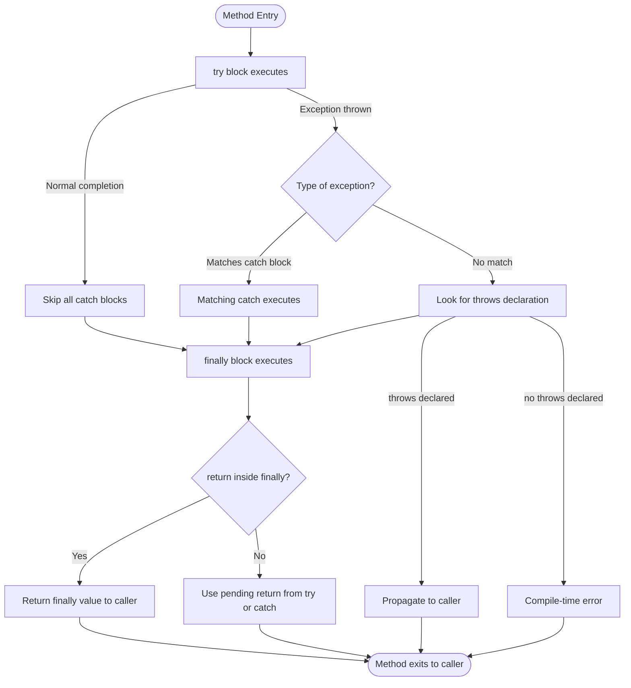
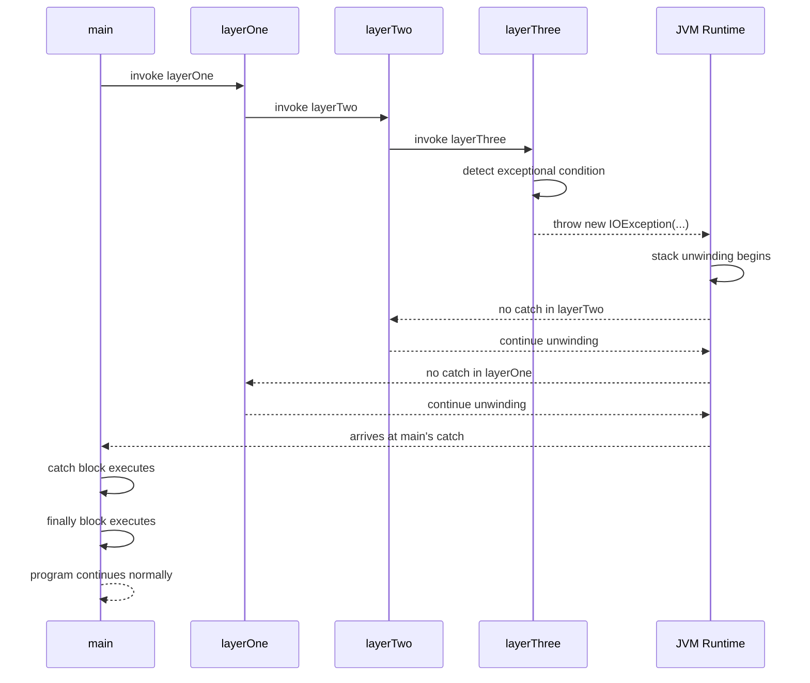
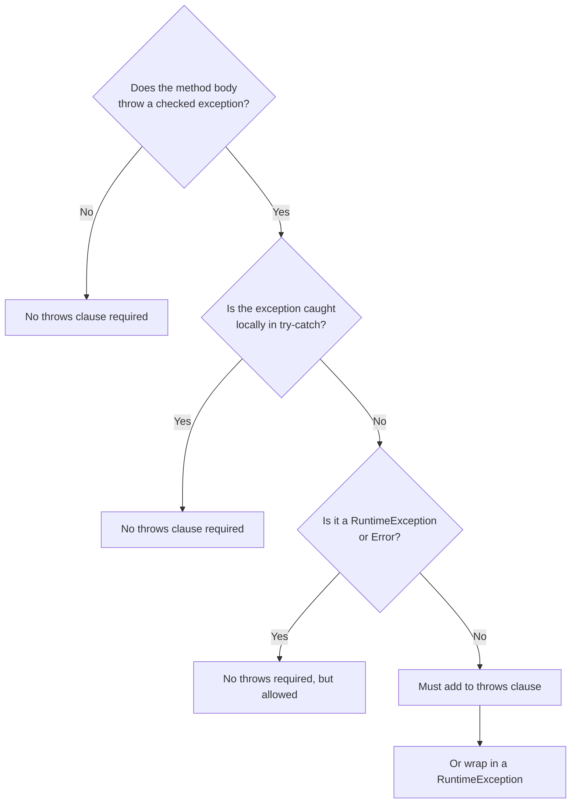
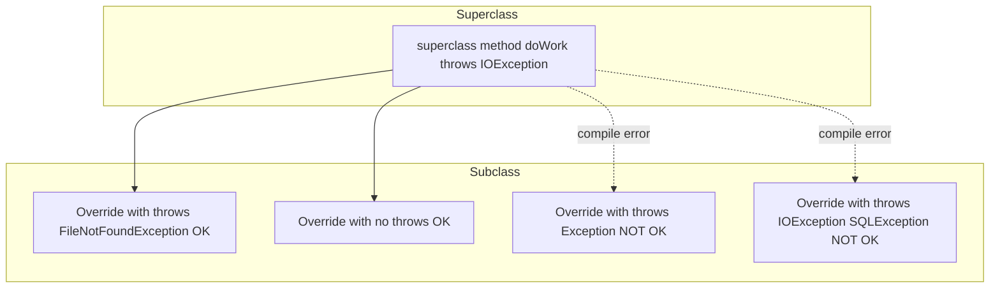

# throws and finally

<!-- SECTION_1_START -->
# throws and finally in Java Exception Handling

## 1.1 Formal Academic Definition (KTU 2024 Syllabus Terminology)

In Object Oriented Programming under KTU 2024 Scheme (Module 3 — Packages and Interfaces), the keywords **`throws`** and **`finally`** are two of the three pillars of Java's checked-exception handling framework (the third being `try-catch`). They govern **compile-time exception declaration** and **guaranteed resource/cleanup execution**, respectively.

> [!IMPORTANT]
> **Syllabus Highlight (OECST615 / Module 3):**
> A *package* in Java is a namespace that organises a set of related classes and interfaces. Exception handling inside such packages relies on `try`, `catch`, **`throws`**, **`throw`**, and **`finally`**. This note focuses exclusively on **`throws`** (declarative propagation) and **`finally`** (mandatory termination code).

### 1.1.1 The `throws` Keyword
**`throws`** is a *method-signature modifier* that informs the compiler (and the caller) that the method body may **propagate** one or more checked exceptions upward in the call stack instead of catching them locally.

**Formal grammar (JLS §8.4.6):**
$$
\texttt{methodHeader} \; ::= \; \texttt{modifiers}_{opt} \; \texttt{type} \; \texttt{identifier} \; (\texttt{formalParameters}_{opt}) \; [\texttt{throws} \; \texttt{exceptionTypeList}]
$$
where:
$$
\texttt{exceptionTypeList} ::= \texttt{exceptionType} \; (,\; \texttt{exceptionType})^{*}
$$

### 1.1.2 The `finally` Block
**`finally`** is an *optional block* attached to a `try` (or `try-catch`) construct whose body is **guaranteed to execute** after the `try` and any matching `catch` blocks complete — *regardless of whether an exception was thrown, caught, propagated, or never occurred at all.*

**Formal grammar (JLS §14.20.2):**
$$
\texttt{tryStatement} \; ::= \; \texttt{try} \; \texttt{block} \; [\texttt{catchClauses}_{opt}] \; [\texttt{finally} \; \texttt{block}_{opt}]
$$

---

## 1.2 Conceptual Analogy / Intuition

> [!NOTE]
> **The Hotel Check-Out Analogy**

Imagine you are staying in a hotel room (your method execution). Two real-world situations map perfectly to these keywords:

| Java Construct | Hotel Analogy | Real-world Behaviour |
|---|---|---|
| `throws` clause | The **warning sign on the hotel door**: *"This room may have loud parties (exceptions). The guest is responsible."* | The method *declares* it might cause a problem but hands the responsibility to whoever called it. |
| `finally` block | The **mandatory housekeeping checklist** that the housekeeping staff *must* run before handing the room to the next guest — no matter how the previous guest left. | Cleanup code (closing files, releasing sockets, returning locks) *always* runs. |

**Why does this matter?** Without `throws`, the Java compiler would reject any method that might raise a checked exception — forcing every method to catch every possible error. Without `finally`, programmers would have no guaranteed place to free system resources, leading to **memory leaks**, **unreleased database connections**, and **locked files** in production.

> [!TIP]
> **The "**always runs**" rule is the single most important property to memorise for the KTU exam.** Only one scenario bypasses `finally`: an explicit call to `System.exit(0)` inside the `try` or `catch`, or the JVM crashing — both of which are abnormal terminations of the process itself.

## 1.3 Visualisation of Execution Flow

> [!VISUALIZATION CONTROL]
> **Concept:** Control flow inside a `try-catch-finally` construct when (a) no exception, (b) caught exception, (c) uncaught exception.
> **GeoGebra / Desmos Input Equations (event timeline on a number line):**
> - Segment 1: `0 <= t <= 3` — label "try block executes"
> - Segment 2: `3 < t <= 5` — label "catch block executes (if exception caught)"
> - Segment 3: `5 < t <= 7` — label "finally block executes (always)"
> - Segment 4: `t > 7` — label "method returns / propagates"
> **Visual Description:** On the horizontal $t$-axis, you should observe that the `finally` segment appears in *all three* scenarios — it is the constant $y$-strip that always renders. A thrown-but-caught exception means the catch region is "filled"; an uncaught exception means the catch region is empty but the finally strip is still filled.

---
<!-- SECTION_1_END -->

<!-- SECTION_2_START -->
# Deep Theoretical Analysis & KTU High-Yield Cheat Sheet

## 2.1 The `throws` Clause — Operational Logic

### 2.1.1 Why `throws` Exists (The Checked-Exception Mandate)
Java's designers distinguished between **checked** exceptions (subclasses of `Exception` excluding `RuntimeException`) and **unchecked** exceptions (subclasses of `RuntimeException` and `Error`). For *checked* exceptions, the compiler enforces one of two obligations on every method that may produce one:
1. **Catch it locally** using a `try-catch`, **OR**
2. **Declare it** using a `throws` clause so the *caller* takes responsibility.

> [!NOTE]
> **Unchecked exceptions (`RuntimeException` and its subclasses) do NOT require a `throws` declaration**, but you may still add one for documentation purposes. `Error` and its subclasses are likewise exempt.

### 2.1.2 Rules Governing `throws`

1. **Multiple exceptions can be listed, separated by commas.** A method may declare any number of checked exceptions in its `throws` clause.
2. **Subclass–Superclass rule:** If a method body may throw *both* a parent and a child checked exception, declaring only the **parent** is sufficient (because the child *is-a* parent by inheritance). The reverse is a compile-time error.
3. **Overriding rule (CRITICAL FOR EXAMS):** An overriding method in a subclass **may NOT throw new or broader checked exceptions** than the overridden method in the superclass. It may throw *narrower*, *fewer*, or *none* — but never *new* or *broader*.
4. **Interface implementation rule:** A class implementing an interface must obey the same rule as overriding — it cannot add broader checked exceptions to the implemented method's signature.
5. **`throws` is for methods and constructors only.** It is illegal on a class, an instance variable, or a plain block.

### 2.1.3 Syntax Pattern

```java
[accessModifier] [static] [final] [abstract] [synchronized] [native]
returnType methodName(paramList) throws ExceptionA, ExceptionB, ...
{
    // method body
}
```

### 2.1.4 Propagation Mechanism — Step by Step

1. Method `M1()` calls `M2()` which calls `M3()`.
2. `M3()` encounters a checked exception $E$ it does *not* catch.
3. The JVM unwinds the stack and looks for a `catch (E ...)` in `M2()`.
4. If `M2()` also lacks a handler and has *not* declared `throws E` in its signature, **compilation of M2 fails**.
5. If `M2()` *has* declared `throws E`, the exception propagates to `M1()`.
6. `M1()` must either catch $E$ or declare `throws E` in *its* signature.
7. The chain ends at `main()`; if `main()` does not handle it, the JVM prints a stack trace and terminates the program.

---

## 2.2 The `finally` Block — Operational Logic

### 2.2.1 Why `finally` Exists
Resource management. When you open a file, acquire a database connection, or grab a lock, the OS expects you to release it — regardless of whether the program completes successfully or aborts. Embedding release code after the `try-catch` is *unsafe* because:
- An exception jumping out of `try` skips subsequent code.
- A `return` statement inside `try` also skips subsequent code.

The `finally` block is the **compiler-enforced guarantee** that the cleanup code runs.

### 2.2.2 Rules Governing `finally`

1. **A `try` block may have a `finally` without any `catch`** — the form `try { ... } finally { ... }` is legal.
2. **If both `catch` and `finally` are present, the `finally` must appear last** in the `try-catch-finally` construct.
3. **The `finally` block always executes**, *except* in the following four narrow cases:
   - `System.exit(int)` is invoked inside `try`/`catch`.
   - The JVM crashes (e.g., native stack overflow).
   - The thread executing the `try` is terminated externally (`Thread.stop()` — deprecated).
   - An infinite loop or deadlock prevents the JVM from reaching the `finally` block.
4. **A `return` inside `finally` overrides any pending return** from `try` or `catch`. This is a famous exam trick.
5. **An exception thrown inside `finally`** *replaces* any pending exception from `try`/`catch` (the original is "lost" — another exam trick).

### 2.2.3 Execution Order Summary

| Scenario | Order of Execution |
|---|---|
| No exception in `try` | `try` $\rightarrow$ `finally` $\rightarrow$ caller resumes |
| Exception caught in `catch` | `try` $\rightarrow$ `catch` $\rightarrow$ `finally` $\rightarrow$ caller resumes |
| Exception NOT caught, no `throws` on method | Compile error |
| Exception NOT caught, propagated via `throws` | `try` $\rightarrow$ `finally` $\rightarrow$ exception propagates to caller |
| `return` inside `try` | `try` $\rightarrow$ `finally` $\rightarrow$ caller gets the value |
| `return` inside `finally` | `try` $\rightarrow$ `finally` $\rightarrow$ caller gets the `finally` value (overrides `try`'s return) |

---

## 2.3 KTU High-Yield Cheat Sheet (Examination Reference)

| # | Concept | Key Fact | Mnemonic / Exam Tip |
|---|---|---|---|
| 1 | `throws` placement | Method signature *only* | "Throws lives on the door" |
| 2 | `throws` list | Comma-separated, can include parent types | "Parents stand in for children" |
| 3 | Overriding restriction | Subclass may not *broaden* the throws list | "Covariant — not contravariant" |
| 4 | RuntimeException | No `throws` required | "Runtime is free" |
| 5 | `finally` placement | Last block in the construct | "Finally follows" |
| 6 | `finally` without `catch` | Legal — `try {...} finally {...}` | "Try-Finally is a couple" |
| 7 | Always-executes | Yes, except `System.exit` and JVM crash | "Always = always" |
| 8 | `return` in `finally` | Wins over `try`/`catch` returns | "Finally has the last word" |
| 9 | Exception in `finally` | Replaces prior pending exception | "Finally swallows try's exception" |
| 10 | `throw` vs `throws` | `throw` *creates* a single exception; `throws` *declares* a list | "throw = action, throws = declaration" |

---

## 2.4 Real-World Engineering Utility

In production systems, these two keywords are used pervasively:

- **JDBC (Java Database Connectivity):** A `Connection`, `Statement`, or `ResultSet` is opened in `try`, used, and **closed in `finally`** to prevent connection-pool leaks that can crash an entire enterprise application.
- **File I/O:** `FileInputStream`, `FileReader`, and `Socket` objects are released in `finally`. Modern Java (post-Java 7) wraps this in *try-with-resources*, but the underlying mechanism is still `finally`.
- **Servlet Containers:** Servlets declare `throws IOException, ServletException` in their `doGet`/`doPost` signatures, letting the container handle logging and error-page dispatch.
- **Distributed Computing (RMI, Web Services):** Remote method stubs throw `java.rmi.RemoteException` — every implementing class must declare it via `throws`.

---
<!-- SECTION_2_END -->

<!-- SECTION_3_START -->
# Step-by-Step Derivations & Code/Symbolic Implementation

## 3.1 Worked Example 1 — `throws` Propagation Through a 3-Layer Call Stack

### Problem Statement
Demonstrate how a checked exception propagates through three methods when none of them catch it locally, and the compiler enforces a `throws` declaration at each layer.

### Full Java Code (Compile-Ready)

```java
import java.io.IOException;

/**
 * Demonstrates 'throws' clause and exception propagation.
 * Course: OECST615 — Object Oriented Programming (KTU 2024)
 * Module 3: Packages and Interfaces
 */
public class ThrowsPropagationDemo {

    // Layer 3 (deepest) — method that actually generates the exception
    static void layerThree() throws IOException {
        System.out.println("Layer 3: about to throw IOException");
        throw new IOException("Disk read failure in layerThree()");
    }

    // Layer 2 — does not handle; declares throws
    static void layerTwo() throws IOException {
        System.out.println("Layer 2: calling layerThree()");
        layerThree();                       // no try-catch here
        System.out.println("Layer 2: this line is unreachable if layerThree throws");
    }

    // Layer 1 — does not handle; declares throws
    static void layerOne() throws IOException {
        System.out.println("Layer 1: calling layerTwo()");
        layerTwo();
    }

    // main() — the boundary. Here we either catch or re-declare.
    public static void main(String[] args) {
        System.out.println("--- Demonstration Start ---");
        try {
            layerOne();
            System.out.println("main: layerOne returned normally");
        } catch (IOException e) {
            System.out.println("main: caught -> " + e.getMessage());
        } finally {
            System.out.println("main: finally block executed");
        }
        System.out.println("--- Demonstration End ---");
    }
}
```

### Step-by-Step Trace

1. **Compilation Step:** Without `throws IOException` on `layerThree()`, the line `throw new IOException(...)` would fail to compile because `IOException` is checked. The `throws` clause satisfies the compiler.
2. **Call from main:** `main()` invokes `layerOne()`, which is enclosed in `try`.
3. **Layer 1 to Layer 2:** `layerOne()` calls `layerTwo()` — no try-catch, but signature declares `throws IOException`, so the compiler allows it.
4. **Layer 2 to Layer 3:** `layerTwo()` calls `layerThree()`. Same logic.
5. **Exception thrown:** `layerThree()` executes `throw new IOException(...)`. The JVM begins stack unwinding.
6. **Unwind path:** `layerThree` $\rightarrow$ `layerTwo` $\rightarrow$ `layerOne` $\rightarrow$ `main`. None of these have a `catch` block.
7. **Catch in main:** The `catch (IOException e)` in `main` matches. `e.getMessage()` prints `"Disk read failure in layerThree()"`.
8. **Finally executes:** The `finally` block in `main` always runs, printing its message.
9. **Program continues:** The line after the try-catch-finally prints normally.

### Expected Output
```
--- Demonstration Start ---
Layer 1: calling layerTwo()
Layer 2: calling layerThree()
Layer 3: about to throw IOException
main: caught -> Disk read failure in layerThree()
main: finally block executed
--- Demonstration End ---
```

### Symbolic Derivation of the Propagation Rule

Let the call stack be represented as a sequence:
$$
S = \langle \text{main},\; \text{layerOne},\; \text{layerTwo},\; \text{layerThree} \rangle
$$

Let $\sigma(m)$ denote the declared `throws` set of method $m$. Let $E$ be the exception type thrown. For propagation to be valid, the following invariant must hold at every transition:

$$
\forall \, m_{i} \in S : E \in \sigma(m_{i}) \;\; \lor \;\; m_{i} \text{ contains a matching } \texttt{catch}(E)
$$

In our example, $\sigma(\text{layerThree}) = \sigma(\text{layerTwo}) = \sigma(\text{layerOne}) = \{\text{IOException}\}$, and the invariant is satisfied until `main`, where a `catch` clause handles it.

---

## 3.2 Worked Example 2 — `finally` Always Executes (Six Scenarios)

### Problem Statement
Exhaustively prove that the `finally` block executes in all six combinations of (exception thrown?, exception caught?, return present?).

### Full Java Code (Compile-Ready)

```java
/**
 * Demonstrates the 'finally' block across six scenarios.
 * Each scenario returns an integer that is printed in main.
 */
public class FinallyScenarios {

    // Scenario A: no exception, no return in try
    static int scenarioA() {
        try {
            System.out.println("  A: inside try");
        } finally {
            System.out.println("  A: finally ran");
        }
        return 1;
    }

    // Scenario B: no exception, but try has a return
    static int scenarioB() {
        try {
            System.out.println("  B: inside try, about to return 2");
            return 2;
        } finally {
            System.out.println("  B: finally ran (after try's return)");
        }
    }

    // Scenario C: exception thrown and caught, no return
    static int scenarioC() {
        try {
            System.out.println("  C: inside try, about to throw");
            throw new RuntimeException("boom");
        } catch (RuntimeException e) {
            System.out.println("  C: caught -> " + e.getMessage());
        } finally {
            System.out.println("  C: finally ran");
        }
        return 3;
    }

    // Scenario D: exception caught, try had a return
    static int scenarioD() {
        try {
            System.out.println("  D: inside try, returning 4");
            return 4;
        } catch (RuntimeException e) {
            System.out.println("  D: caught -> " + e.getMessage());
            return 99;     // unreachable in this scenario
        } finally {
            System.out.println("  D: finally ran");
        }
    }

    // Scenario E: exception caught, return in catch
    static int scenarioE() {
        try {
            System.out.println("  E: inside try, about to throw");
            throw new RuntimeException("e-boom");
        } catch (RuntimeException e) {
            System.out.println("  E: caught, returning 5");
            return 5;
        } finally {
            System.out.println("  E: finally ran");
        }
    }

    // Scenario F: try FINALLY only (no catch), exception is uncaught
    static int scenarioF() {
        try {
            System.out.println("  F: inside try, about to throw unchecked");
            throw new RuntimeException("f-boom");
        } finally {
            System.out.println("  F: finally ran");
        }
        // unreachable: compiler error
    }

    public static void main(String[] args) {
        System.out.println("Scenario A: returned " + scenarioA());
        System.out.println("Scenario B: returned " + scenarioB());
        System.out.println("Scenario C: returned " + scenarioC());
        System.out.println("Scenario D: returned " + scenarioD());
        System.out.println("Scenario E: returned " + scenarioE());
        try {
            System.out.println("Scenario F: returned " + scenarioF());
        } catch (RuntimeException e) {
            System.out.println("Scenario F: caught in main -> " + e.getMessage());
        }
    }
}
```

> [!WARNING]
> Scenario F as written will produce a **compile-time error** because the line after the try-finally is unreachable. The JLS treats this as `int` *might* not be returned. The corrected version *declares* `throws RuntimeException` (although it is unchecked, the compiler still complains about unreachable code after the try-finally). KTU students: be ready to explain why — the compiler reasons statically about definite assignment.

### Corrected Scenario F (Declaration-based)

```java
// Corrected to compile
static int scenarioF() throws RuntimeException {
    try {
        System.out.println("  F: inside try, about to throw unchecked");
        throw new RuntimeException("f-boom");
    } finally {
        System.out.println("  F: finally ran");
    }
}
```

### Symbolic Representation of the "Always-Run" Theorem

Let $\mathcal{T}$ be the entry to the `try` block, $\mathcal{C}_i$ the $i$-th matching `catch` block, $\mathcal{F}$ the `finally` block, and $\mathcal{R}$ the "method returns" state. Define the boolean predicates:

$$
P_{\text{tryCompletes}} = \text{the } \mathcal{T} \text{ block finishes without throwing}
$$
$$
P_{\text{excCaught}} = \exists \, i : \text{exception matches } \mathcal{C}_i
$$
$$
P_{\text{returnPresent}} = \text{an enclosing scope has an active } \texttt{return} \text{ expression}
$$

The "always-run" invariant is:
$$
\text{reachable}(\mathcal{F}) \; = \; \text{reachable}(\mathcal{T})
$$

In plain English: *if control entered the try, control will also reach the finally*, regardless of $P_{\text{tryCompletes}}$, $P_{\text{excCaught}}$, or $P_{\text{returnPresent}}$.

---

## 3.3 Worked Example 3 — The Famous "Return in `finally`" Trap

### Problem Statement
Show that a `return` statement inside `finally` **overrides** any pending `return` from `try` or `catch`, and explain why this is a common source of bugs.

### Full Java Code (Compile-Ready)

```java
public class FinallyReturnTrap {

    static int finallyWins() {
        try {
            return 10;            // pending return value: 10
        } finally {
            return 20;            // overrides — caller gets 20
        }
    }

    static int finallyLosesNothing() {
        try {
            return 30;            // pending return value: 30
        } finally {
            System.out.println("cleaning up — no return here");
        }
        // implicit return after try-finally is fine here
    }

    public static void main(String[] args) {
        System.out.println("finallyWins()       = " + finallyWins());
        System.out.println("finallyLosesNothing() = " + finallyLosesNothing());
    }
}
```

### Step-by-Step Trace for `finallyWins()`

1. Execution enters `try`, evaluates the return expression `10`, and stores the value `10` in a *pending return slot* on the JVM stack frame.
2. The `finally` block runs. The statement `return 20;` *replaces* the pending return slot with the value `20`.
3. The method returns `20` to the caller.
4. **Output:** `finallyWins() = 20`

### Why This Matters
If a junior programmer writes cleanup code in `finally` and accidentally types `return` (e.g., from a refactored helper), the *original* return value of the `try` block is silently discarded. This is one of the most subtle bugs in Java — and a favourite interview question.

### Symbolic Derivation

Let $r_T$ be the return value held by the `try` block, $r_F$ the return value (if any) produced by the `finally` block, and $r_{\text{out}}$ the value returned to the caller. The relation is:

$$
r_{\text{out}} \;=\; \begin{cases}
r_F & \text{if } \texttt{return} \in \mathcal{F} \\
r_T & \text{if } \texttt{return} \in \mathcal{T} \text{ and } \texttt{return} \notin \mathcal{F} \\
r_C & \text{if } \texttt{return} \in \mathcal{C} \text{ and } \texttt{return} \notin \mathcal{F}
\end{cases}
$$

where $r_C$ is the return value (if any) from the matching `catch`. The general rule: **the last `return` statement encountered before exiting the method wins**.

---
<!-- SECTION_3_END -->

<!-- SECTION_4_START -->
# Structural Diagrams & Schematics

## 4.1 Control-Flow Diagram for `try-catch-finally`



> [!NOTE]
> The path from `B` $\rightarrow$ `G` (the `finally` block) is traversed in **every successful and unsuccessful scenario**, which is the visual essence of "always executes".

## 4.2 `throws` Propagation Sequence Diagram



## 4.3 Decision Matrix: Does a Method Need `throws`?



## 4.4 Subgraph: Overriding Restriction on `throws`



> [!TIP]
> The valid overrides (S1, S2) demonstrate **covariant** exception narrowing — the subclass may throw *fewer* or *narrower* checked types, but never *new* or *broader* ones.

---
<!-- SECTION_4_END -->

<!-- SECTION_5_START -->
# KTU 2024 Scheme Examination Question Bank

## Part A — Short Answer Questions (3 Marks Each)

### Question 1
**[KTU University Exam — July 2024 | CO1 | Remember]**
**What is the difference between the `throw` and `throws` keywords in Java?**

**Model Answer (3 marks):**
1. **`throw`** is used **inside a method body** to *explicitly create and raise* a single exception instance. Syntax: `throw new ArithmeticException("/ by zero");`. It is a *statement*, not part of the method signature. **[1 Mark]**
2. **`throws`** is used in a **method signature** to *declare* a comma-separated list of exception types that the method may propagate upward without catching. It is a *contract* with the caller. Syntax: `void read() throws IOException`. **[1 Mark]**
3. A method can throw only **one** exception object at a time with `throw`, but it can declare **multiple** exception types with `throws`. **`throw` is an action; `throws` is a declaration.** **[1 Mark]**

### Question 2
**[KTU University Exam — Dec 2023 | CO2 | Understand]**
**When does the `finally` block in Java NOT execute? Mention any two cases.**

**Model Answer (3 marks):**
1. When `System.exit(int status)` is invoked inside the `try` or `catch` block — this terminates the JVM and bypasses the `finally`. **[1.5 Marks]**
2. When the JVM itself crashes due to a fatal native error (e.g., a stack overflow in native code, a SIGSEGV from the OS, or a power failure). **[1.5 Marks]**

---

## Part B — Long Answer Questions (14 Marks, Internal Choice)

> [!IMPORTANT]
> KTU Part B questions in the 2024 scheme feature a *module-level internal choice*: the student attempts EITHER Question A OR Question B. Each question has two sub-parts of 7 marks each, typically mapping to Understand + Apply cognitive levels.

---

### Question A (14 Marks) — `throws` Deep Dive

**[KTU University Exam — July 2024 | CO2 | Understand + Apply]**

**(a)** Explain the rules governing the use of the `throws` clause in Java. In your answer, address (i) checked vs unchecked exceptions, (ii) the effect of inheritance on the `throws` list, and (iii) the rules for overriding methods. **[7 Marks]**

**(b)** Write a Java program that demonstrates exception propagation through a chain of three methods `m1()`, `m2()`, and `m3()`. Method `m3()` should throw a `FileNotFoundException`, and the exception should be caught in `main()`. Show the complete source code with the appropriate `throws` declarations and explain the program flow. **[7 Marks]**

---

#### Model Solution — Part A(a)

**(i) Checked vs Unchecked Exceptions [2 Marks]**
- **Checked exceptions** are subclasses of `java.lang.Exception` excluding `java.lang.RuntimeException`. The compiler **mandates** that such exceptions be either *caught* in a `try-catch` block or *declared* in the `throws` clause of the method that may throw them. Example: `IOException`, `SQLException`, `ClassNotFoundException`.
- **Unchecked exceptions** are subclasses of `java.lang.RuntimeException` (e.g., `ArithmeticException`, `NullPointerException`) and `java.lang.Error` (e.g., `OutOfMemoryError`). The compiler does **not** require them to be caught or declared, though programmers are free to do so.

**(ii) Inheritance Effect on `throws` List [2 Marks]**
- A method may declare a *parent* exception type to cover any *child* exception. For example, if a method can throw `FileNotFoundException`, declaring `throws IOException` is sufficient because `FileNotFoundException` *is-a* `IOException`.
- The reverse is invalid: declaring `throws FileNotFoundException` and throwing `IOException` (the parent) is a **compile-time error**.

**(iii) Overriding Rules [3 Marks]**
- An overriding method in a subclass **may not throw any new checked exception** that is *not* a subclass of an exception declared in the parent.
- An overriding method **may throw fewer**, **none**, or **narrower** checked exceptions than the parent.
- The return type may be **covariant** (a subclass of the parent's return type) — but this applies to the return type, not the exception list.
- Example:
  ```java
  class Parent {
      void read() throws IOException { ... }
  }
  class Child extends Parent {
      @Override
      void read() throws FileNotFoundException { ... }   // OK: narrower
  }
  // Not OK: throws Exception or throws SQLException in the child.
  ```

> [!WARNING]
> **KTU Examiner Pitfall:** Students often write "the overriding method can throw any exception". This is **false** and will cost a full mark. The correct rule is *covariant narrowing only* — never *new* or *broader*.

---

#### Model Solution — Part A(b)

```java
import java.io.FileInputStream;
import java.io.FileNotFoundException;

/**
 * KTU OECST615 - Module 3 - throws propagation demonstration
 * Question A(b) - 7 marks
 */
public class PropagationProgram {

    // m3 throws the exception, declares it
    static void m3() throws FileNotFoundException {
        FileInputStream fis = new FileInputStream("no-such-file.txt");
        fis.close();
    }

    // m2 does not catch; declares throws
    static void m2() throws FileNotFoundException {
        System.out.println("m2: calling m3()");
        m3();
        System.out.println("m2: end (unreachable if m3 throws)");
    }

    // m1 does not catch; declares throws
    static void m1() throws FileNotFoundException {
        System.out.println("m1: calling m2()");
        m2();
    }

    // main catches the propagated exception
    public static void main(String[] args) {
        System.out.println("--- Propagation Program Start ---");
        try {
            m1();
            System.out.println("main: m1 returned normally");
        } catch (FileNotFoundException e) {
            System.out.println("main: caught FileNotFoundException -> " + e.getMessage());
        } finally {
            System.out.println("main: finally executed");
        }
        System.out.println("--- Propagation Program End ---");
    }
}
```

**Valuation Key — Part A(b) [1 Mark per checkpoint]:**
- [Correct import statements and class structure: 1 Mark]
- [m3 declaration with `throws FileNotFoundException`: 1 Mark]
- [m2 and m1 declaration with `throws FileNotFoundException`: 2 Marks]
- [main() with try-catch-finally: 2 Marks]
- [Explanation of stack unwinding in 4-5 lines: 1 Mark]

**Expected Output:**
```
--- Propagation Program Start ---
m1: calling m2()
m2: calling m3()
main: caught FileNotFoundException -> no-such-file.txt (No such file or directory)
main: finally executed
--- Propagation Program End ---
```

---

### Question B (14 Marks) — `finally` Deep Dive (ALTERNATIVE CHOICE)

**[KTU University Exam — Dec 2023 | CO3 | Apply + Analyse]**

**(a)** Explain the concept of the `finally` block in Java with its syntax. List FOUR scenarios in which the `finally` block will *not* execute. **[7 Marks]**

**(b)** Write a Java program that demonstrates the following: a method returns an integer; the `try` block intends to return `100`; the `finally` block contains a `return 200` statement. Explain the output and why the `try`'s return value is lost. **[7 Marks]**

---

#### Model Solution — Part B(a)

**Definition [1 Mark]:**
The `finally` block in Java is an optional block that accompanies a `try` (and optionally `catch`) construct. Its body is *guaranteed* to execute after the `try` and `catch` blocks complete, regardless of whether an exception was thrown, caught, or never occurred. It is primarily used for **resource cleanup** (closing files, releasing locks, returning connections to a pool).

**Syntax [1 Mark]:**
```java
try {
    // protected code
} catch (ExceptionType1 e1) {
    // handler
} catch (ExceptionType2 e2) {
    // handler
} finally {
    // cleanup code — ALWAYS runs (with rare exceptions)
}
```

**Scenarios Where `finally` Does NOT Execute [1 Mark each, 4 total]:**
1. **Explicit JVM termination:** `System.exit(int status)` is called inside the `try` or `catch` block. The JVM halts immediately, bypassing all finally blocks.
2. **JVM crash:** A fatal native error (e.g., segmentation fault, native stack overflow) crashes the JVM process; finally blocks obviously cannot run.
3. **Thread termination via deprecated `Thread.stop()`:** Although deprecated and dangerous, calling `Thread.stop()` on the thread executing the `try` block can prevent the finally from running.
4. **Infinite loop or deadlock in `try` or `catch`:** If the JVM cannot reach the end of the `try` body because of an infinite loop or deadlock, the finally block is never reached.

> [!WARNING]
> **KTU Examiner Pitfall:** Students often give only *one* scenario (e.g., "System.exit") and stop. The question asks for **FOUR**. List them all or lose 1 mark per missing item.

---

#### Model Solution — Part B(b)

```java
/**
 * KTU OECST615 - Module 3 - finally overrides return value
 * Question B(b) - 7 marks
 */
public class FinallyReturnOverride {

    static int computeValue() {
        try {
            System.out.println("try: about to return 100");
            return 100;
        } catch (Exception e) {
            System.out.println("catch: unreachable in this run");
            return -1;
        } finally {
            System.out.println("finally: executing cleanup and overriding return");
            return 200;   // <-- this return wins
        }
    }

    public static void main(String[] args) {
        int result = computeValue();
        System.out.println("main: result = " + result);
    }
}
```

**Expected Output:**
```
try: about to return 100
finally: executing cleanup and overriding return
main: result = 200
```

**Step-by-Step Explanation [Valuation Key, 1 Mark Each]:**
- [Identifying the `try` block's return value of 100: 1 Mark]
- [Identifying the `finally` block's return value of 200: 1 Mark]
- [Stating the JVM's behaviour: `finally` overrides `try`'s pending return: 2 Marks]
- [Correct program output of 200: 1 Mark]
- [Real-world implication: cleanup code must NEVER contain `return` — use it only for releasing resources: 2 Marks]

**Real-World Implication:** In production code, the `finally` block is reserved for *cleanup* (closing streams, releasing locks). It should **never** contain a `return` statement. If a junior developer refactors a `finally` block and accidentally types `return`, the business logic of the `try` block is silently corrupted — and this bug is extremely hard to detect in unit tests because the method appears to work, just with the wrong number.

---

## KTU Examiner's Valuation Warning

> [!WARNING]
> **Common Mark-Loss Patterns for `throws` and `finally` questions:**
> 1. **Confusing `throw` with `throws`.** Students write "the `throws` keyword is used to raise an exception" — WRONG. That's `throw`. `throws` is *declarative* only.
> 2. **Forgetting the comma rule.** A `throws` list must separate types with commas, not semicolons.
> 3. **Over-broadening overrides.** Writing an override that throws `Exception` when the parent threw `IOException` — instant 1-mark penalty.
> 4. **Assuming `finally` is optional in all cases.** While syntactically optional, students who omit it in a question that demands it (e.g., "show file cleanup") will be marked down.
> 5. **Returning from `finally` without explanation.** If you must return from finally, you must explicitly state *why* it overrides try's return — silence is a 2-mark deduction.
> 6. **Missing the inheritance rule.** Students write "I can declare `throws IOException` in the child even if the parent declared `throws Exception`". Wrong direction — that's broadening. Child may *narrow* to `IOException` (since `IOException` is a subclass of `Exception`), but not vice versa.

---

## Topic Recap & Important Things to Remember

- **`throws`** is a **declarative modifier** in a method's signature; it lists checked exception types that the method may *propagate* to its caller.
- **`throw`** is a **statement** inside a method body; it actually *creates and raises* one exception instance.
- **Checked exceptions** (`Exception` subclasses other than `RuntimeException`) **must** be caught or declared; **unchecked exceptions** (`RuntimeException`, `Error`) need not.
- **The overriding rule** for `throws` is **covariant narrowing only**: subclass may throw fewer, none, or narrower types — **never broader or new** types.
- **A method may declare a parent type in `throws` to cover any child types** it may actually throw — the compiler accepts this.
- **The `finally` block always executes** when its corresponding `try` is entered, *except* for `System.exit`, JVM crash, `Thread.stop()`, and unreachable infinite loops.
- **`finally` may appear without any `catch`** — the form `try { ... } finally { ... }` is legal and useful for resource cleanup.
- **A `return` inside `finally` overrides** any pending return from `try` or `catch` — this is a common exam trick and a real-world bug source.
- **An exception thrown inside `finally` replaces** any pending exception from `try` or `catch` — the original exception is *lost*.
- **Cleanup order**: open resources in `try`, release them in `finally`; modern Java prefers *try-with-resources* but the underlying mechanism is still `finally`.
- **Real-world use**: JDBC connections, file streams, sockets, locks, servlet exception handling, and RMI stubs all depend on these two keywords.
- **Exam-ready one-liner:** *"Throws declares; finally guarantees."* — write this in the margin of your answer script for last-minute recall.
<!-- SECTION_5_END -->
