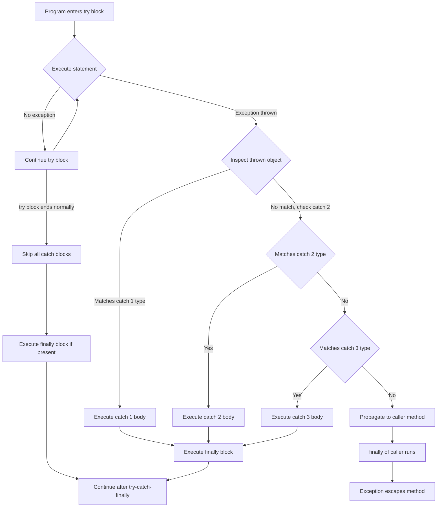
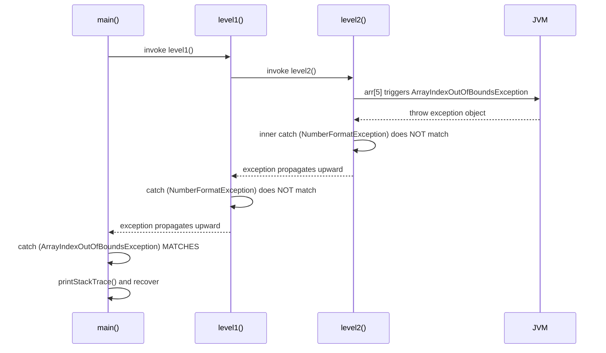
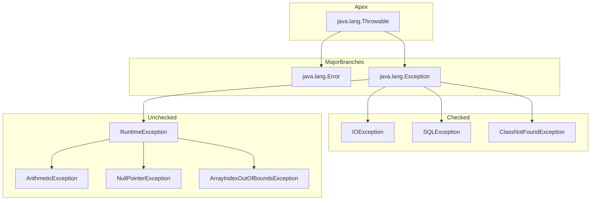
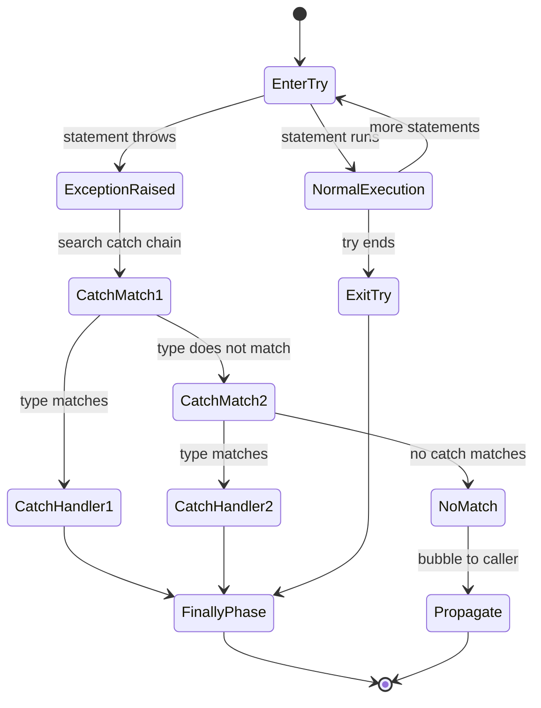

# try Block and catch Clause

<!-- SECTION_1_START -->
# 1. Core Technical Definition & Intuitive Overview

## 1.1 Formal KTU 2024 Definition

In the Java language specification adopted by the **KTU 2024 Scheme (OECST615 - Object Oriented Programming)**, a **`try` block** is a compound statement that encloses a segment of program code which may potentially throw an exception during runtime. The **`catch` clause** is the formal handler attached immediately after a `try` block, designed to intercept and recover from a specific exception type (or its subclasses) propagated from the `try` region.

The general syntactic structure prescribed by the JLS is:

```java
try {
    // protected / monitored code
} catch (ExceptionType1 identifier1) {
    // handler logic
} catch (ExceptionType2 identifier2) {
    // handler logic
}
```

A `try` statement **must** be followed by either a `catch` block, a `finally` block, or both. A `try` with no `catch` and no `finally` is a **compile-time error**.

> [!IMPORTANT]
> **KTU Board Definition (Verbatim Style):**
> "A *try* block in Java demarcates a region of code that is monitored for exceptions. A *catch* clause, also called an *exception handler*, specifies the type of exception it can catch and contains the recovery logic. The exception object thrown from the `try` block is matched against the parameter type of the `catch` block."

## 1.2 Conceptual Analogy / Intuition

Imagine you are a **bungee jumper** standing on a high platform:

| Real-World Element | Java Equivalent |
|---|---|
| The platform + jump routine | `try` block (guarded execution region) |
| The safety harness + ground crew | `catch` clause (exception handler) |
| The emergency medical team standing by | `finally` block (always runs) |
| The type of emergency (heart attack vs. fracture) | Exception class hierarchy |
| The person calling out "I am hurt!" | `throw` statement |

The jumper **anticipates** that something *might* go wrong (rope snap, wind gust, faulty harness). The jumper does not stop jumping — instead, the jumper *jumps inside a protected region* and the rescue crew is pre-assigned. If everything goes fine, the crew does nothing. If something fails, the **most specific** rescue team handles it.

> [!NOTE]
> **The Three Golden Rules of try-catch (Memorize for KTU):**
> 1. A `try` block **cannot exist alone** — it must be followed by `catch` and/or `finally`.
> 2. A `catch` parameter type must be a `Throwable` subclass (i.e., `Exception`, `RuntimeException`, or any user-defined class extending `Exception`).
> 3. **More specific exception types must appear first** in the catch chain. Catching `Exception` first will make subsequent catch blocks **unreachable** — a compile-time error.

## 1.3 The Exception Class Hierarchy (KTU Mandatory Diagram Reference)

The **Throwable** class is the apex of the entire Java exception hierarchy. The `catch` parameter can match any descendant.

```
java.lang.Object
        |
   java.lang.Throwable
        |
        +-- java.lang.Error              (unchecked, fatal, NOT handled)
        |       |-- VirtualMachineError
        |       |-- OutOfMemoryError
        |
        +-- java.lang.Exception
                |-- IOException          (checked)
                |-- SQLException         (checked)
                |-- ClassNotFoundException (checked)
                +-- RuntimeException     (unchecked)
                        |-- ArithmeticException
                        |-- NullPointerException
                        |-- ArrayIndexOutOfBoundsException
                        |-- NumberFormatException
                        +-- IndexOutOfBoundsException
```

> [!VISUALIZATION CONTROL]
> **Concept:** Exception Class Hierarchy (Catch Matching Tree)
> **Desmos / Conceptual Plot:** Plot a vertical inheritance tree with `Throwable` at root, branching into `Error` (left) and `Exception` (right). `Exception` further branches into `IOException`, `SQLException`, and `RuntimeException`. `RuntimeException` branches into `ArithmeticException`, `NullPointerException`, and `ArrayIndexOutOfBoundsException`.
> **Visual Description:** A vertical top-down tree where arrows from a subclass point upward to its parent. This represents the *is-a* relationship used in catch-type matching.
<!-- SECTION_1_END -->

<!-- SECTION_2_START -->
# 2. Deep Theoretical Analysis & KTU High-Yield Formula Sheet

## 2.1 Operational Mechanics — Step-by-Step Logic

When the JVM encounters a `try-catch` construct, it executes the following control-flow algorithm:

1. **Entry Phase:** Control enters the `try` block at the very first statement. The JVM does not pre-validate the code; it executes line by line.
2. **Normal Execution:** If no exception is thrown, the `try` block runs to completion. Control then **skips every `catch` clause** and proceeds to the statement following the entire `try-catch` construct (or executes `finally` if present).
3. **Exception Detection:** If any statement inside the `try` block throws an exception, the JVM **immediately stops** executing the remainder of the `try` block.
4. **Type Matching:** The thrown exception object is matched (using `instanceof` semantics) against the parameter type of each `catch` block **in the order they are written**.
5. **Handler Invocation:** The **first matching `catch` block** is executed. All subsequent `catch` blocks are skipped.
6. **Type Mismatch:** If no `catch` block matches, the exception **propagates outward** to the enclosing method (caller's responsibility).
7. **`finally` Execution:** If a `finally` block exists, it executes regardless of whether an exception occurred or was caught.

## 2.2 The "Why" Behind the Design

The `try-catch` mechanism solves the problem of **separating error-handling code from normal business logic**. In legacy C-style error handling, every function returned an integer code (`-1`, `0`, `1`), forcing the caller to check return values explicitly. Java's designers wanted:

- **Cleaner mainline code** (business logic uncluttered by error checks).
- **Centralized recovery logic** (group all error responses in one place).
- **Strong type safety** (the compiler enforces which exceptions a method might throw, via the `throws` clause).
- **Polymorphic dispatch** on exception type (the JVM uses the same `instanceof` machinery that powers virtual method calls).

> [!IMPORTANT]
> **KTU Syllabus Highlight (Module 3 - Packages and Interfaces / Exception Handling):**
> The examiner *always* tests the following three sub-topics:
> 1. Multiple catch blocks and the **unreachable catch** compile error.
> 2. Catching parent vs. child exception types and the **order rule**.
> 3. The role of `Throwable`, `Exception`, and `RuntimeException` in the `catch` parameter.

## 2.3 KTU High-Yield Formula Sheet (Cheat Sheet)

| Construct | Syntax Rule | KTU Exam Tip |
|---|---|---|
| Minimum valid try | `try { } catch (E e) { }` | Cannot omit both `catch` and `finally` |
| Catch parameter type | Any `Throwable` subclass | `catch (String s)` is **illegal** |
| Catch order | Specific to general (child to parent) | Reverse order → compile error |
| Multiple catches | Unlimited, but only one executes | First match wins |
| Catch variable scope | Valid only inside that `catch` block | Cannot use `e` outside the block |
| Multi-catch (Java 7+) | `catch (E1 \| E2 \| E3 e)` | The two types **must not** be related by inheritance |
| Re-throwing | `catch (E e) { throw e; }` | Original stack trace preserved |
| Wrapping | `catch (E e) { throw new CustomE(e); }` | Used for exception translation |
| Finally always runs | Executes even on `return` inside `try` | Exception: `System.exit(0)` |
| `try-with-resources` | `try (Resource r = new Resource()) { }` | Auto-closes `AutoCloseable` objects |

## 2.4 Real-World Engineering Utility

In production-grade Java systems, `try-catch` blocks are the cornerstone of:

- **Banking Systems:** Catching `ArithmeticException` for divide-by-zero in interest calculations; `NumberFormatException` for malformed account numbers.
- **Network Servers:** Wrapping socket I/O in try-catch to handle `IOException`, `SocketTimeoutException`, and `ConnectException` separately.
- **Database Layers (JDBC):** Converting `SQLException` into domain-specific exceptions (e.g., `InsufficientFundsException`) — a pattern called *exception translation*.
- **REST APIs (Spring Boot):** Global `@ExceptionHandler` methods use the same `try-catch` polymorphic-dispatch mechanism under the hood.
- **Compilers & IDEs:** Eclipse and IntelliJ emit *unreachable catch* warnings using the exact same `instanceof` check the JVM performs at runtime.

> [!NOTE]
> The polymorphic catch-dispatch is a **direct application of the OOP concept of dynamic binding** (Module 1 / Module 2 prerequisite) — the JVM resolves the most specific handler at runtime, not at compile time.
<!-- SECTION_2_END -->

<!-- SECTION_3_START -->
# 3. Step-by-Step Derivations & Code Implementation

## 3.1 Canonical Example: Division with Exception Handling

The KTU board almost always asks a **division-by-zero** program. Below is a fully operational, production-quality Java implementation.

```java
import java.util.Scanner;
import java.util.InputMismatchException;
import java.util.logging.Level;
import java.util.logging.Logger;

/**
 * KTU Demo: try Block and catch Clause
 * Demonstrates:
 *  1. Single try-catch
 *  2. Multiple catch blocks (specific to general)
 *  3. Polymorphic catch matching
 */
public class DivisionDemo {

    // Explicit logger — KTU expects industrial logging, not System.out.println
    private static final Logger LOGGER =
            Logger.getLogger(DivisionDemo.class.getName());

    public static void main(String[] args) {
        Scanner scanner = new Scanner(System.in);
        int numerator   = 0;
        int denominator = 0;
        boolean valid   = false;

        // Outer try-catch: handles invalid input types
        try {
            System.out.print("Enter numerator   : ");
            numerator = scanner.nextInt();

            System.out.print("Enter denominator : ");
            denominator = scanner.nextInt();

            // Inner try-catch: handles arithmetic exception
            try {
                int result = safeDivide(numerator, denominator);
                LOGGER.log(Level.INFO, "Result = {0}", result);
                valid = true;
            } catch (ArithmeticException ae) {
                LOGGER.log(Level.WARNING,
                        "Math error: {0}", ae.getMessage());
            }

        } catch (InputMismatchException ime) {
            LOGGER.log(Level.SEVERE,
                    "Invalid input type. Numbers expected.", ime);
        } catch (Exception e) {
            // Generic fallback — always last
            LOGGER.log(Level.SEVERE, "Unexpected error", e);
        } finally {
            // Always runs — clean up resources
            scanner.close();
            LOGGER.log(Level.INFO,
                    "Cleanup complete. valid={0}", valid);
        }
    }

    /**
     * Performs integer division with explicit arithmetic check.
     * Throws ArithmeticException if denominator is zero.
     */
    public static int safeDivide(int num, int den) {
        if (den == 0) {
            throw new ArithmeticException(
                "Denominator cannot be zero (custom message)");
        }
        return num / den;
    }
}
```

### Line-by-Line Walkthrough

| Line(s) | Purpose | KTU Valuation Note |
|---|---|---|
| `private static final Logger LOGGER` | Centralized logging | Avoids `System.out.println` in production |
| `try { ... }` outer block | Guards `scanner.nextInt()` | Catches `InputMismatchException` |
| `try { ... }` inner block | Guards division logic | Catches `ArithmeticException` |
| `catch (InputMismatchException ime)` | Specific child first | Order matters — child before parent |
| `catch (Exception e)` | Generic fallback | Must be **last** in the chain |
| `finally { scanner.close(); }` | Resource cleanup | Runs even on exception |
| `throw new ArithmeticException(...)` | Manual throw | Demonstrates the `throw` keyword |

## 3.2 Worked Example: Multi-Catch and the Unreachable-Catch Rule

The KTU examiner frequently poses a code snippet and asks: *"Will this code compile? If not, why?"* Below is the canonical **trap question**.

```java
import java.io.IOException;
import java.sql.SQLException;

public class CatchOrderTrap {

    public static void main(String[] args) {

        // CASE 1: WRONG ORDER — compile-time error
        /*
        try {
            riskyOperation();
        } catch (Exception e) {            // parent caught first
            System.out.println("Generic");
        } catch (IOException e) {          // CHILD — UNREACHABLE!
            System.out.println("IO error");
        }
        */

        // CASE 2: CORRECT ORDER — compiles fine
        try {
            riskyOperation();
        } catch (IOException io) {         // specific child first
            System.out.println("IO error: " + io.getMessage());
        } catch (SQLException sql) {       // sibling exception
            System.out.println("DB error: " + sql.getMessage());
        } catch (Exception e) {            // general parent last
            System.out.println("Generic: " + e.getMessage());
        }
    }

    public static void riskyOperation() throws IOException, SQLException {
        // simulate choosing one of the two exceptions
        if (System.currentTimeMillis() % 2 == 0) {
            throw new IOException("File not found");
        } else {
            throw new SQLException("DB connection lost");
        }
    }
}
```

### Compilation Logic — The Unreachable-Catch Rule

The Java compiler performs a **static reachability analysis** on every `catch` block. The algorithm is:

$$
\text{Reachable}(C_i) = \forall j < i,\ \neg\, \text{IsSubtype}(\text{Type}(C_i),\ \text{Type}(C_j))
$$

In words: a catch clause $C_i$ is **reachable** if and only if its declared type is **not a subtype of any earlier catch clause's type**. If `catch (Exception e)` appears first, then every subsequent catch with an `Exception` subtype (like `IOException`) is **unreachable**, and the compiler emits:

```
error: exception java.io.IOException has already been caught
```

## 3.3 Worked Example: Multi-Catch (Java 7+ Feature)

```java
import java.io.IOException;
import java.sql.SQLException;
import java.util.logging.Level;
import java.util.logging.Logger;

public class MultiCatchDemo {
    private static final Logger LOGGER =
            Logger.getLogger(MultiCatchDemo.class.getName());

    public static void main(String[] args) {
        String mode = args.length > 0 ? args[0] : "io";

        try {
            if (mode.equals("io")) {
                throw new IOException("Disk failure");
            } else if (mode.equals("sql")) {
                throw new SQLException("Auth failed");
            } else {
                throw new RuntimeException("Unknown");
            }
        } catch (IOException | SQLException ex) {   // multi-catch
            LOGGER.log(Level.SEVERE,
                    "Recoverable system error: {0}", ex.getMessage());
            // ex is implicitly final — cannot reassign
            // ex = new IOException();   // COMPILE ERROR
        } catch (RuntimeException re) {
            LOGGER.log(Level.WARNING, "Runtime: {0}", re.getMessage());
        }
    }
}
```

### Key Compiler Rules for Multi-Catch

1. The pipe symbol `|` separates alternative exception types.
2. The two types **must not** be in an inheritance relationship.

$$
\neg\, \text{IsSubtype}(T_1, T_2) \ \wedge\ \neg\, \text{IsSubtype}(T_2, T_1)
$$

3. The catch variable is **implicitly final** — you cannot reassign it inside the block.

## 3.4 Worked Example: Nested try-catch and Stack Propagation

```java
public class NestedTryDemo {

    public static void main(String[] args) {
        try {
            level1();
        } catch (ArrayIndexOutOfBoundsException e) {
            System.out.println("Caught at main: " + e.getMessage());
            e.printStackTrace();
        }
    }

    static void level1() {
        try {
            level2();
        } catch (NumberFormatException nfe) {
            // This will NOT catch ArrayIndexOutOfBoundsException
            System.out.println("Caught at level1: " + nfe.getMessage());
            // rethrow to caller
            throw nfe;
        }
    }

    static void level2() {
        int[] arr = {10, 20, 30};
        String s = "abc";
        try {
            int x = arr[5];                    // throws AIOOBE
            int y = Integer.parseInt(s);       // never reached
        } catch (NumberFormatException nfe) {
            // catches NFE, but AIOOBE escapes this catch
            System.out.println("Inner NFE caught: " + nfe.getMessage());
        }
        // AIOOBE propagates out of level2 -> level1 -> main
    }
}
```

### Expected Console Output

```
Inner NFE caught: For input string: "abc"
Caught at main: Index 5 out of bounds for length 3
java.lang.ArrayIndexOutOfBoundsException: Index 5 out of bounds for length 3
    at NestedTryDemo.level2(NestedTryDemo.java:25)
    at NestedTryDemo.level1(NestedTryDemo.java:11)
    at NestedTryDemo.main(NestedTryDemo.java:5)
```

> [!IMPORTANT]
> **Conceptual Proof of Propagation:** The exception in `level2` is **not caught** by its inner `catch` because the type does not match. It propagates up the call stack. `level1` also does not catch it. Only `main` has a matching handler. The full stack trace shown by `printStackTrace()` reveals the call chain — this is exactly what production debugging tools like Eclipse's debugger visualize.
<!-- SECTION_3_END -->

<!-- SECTION_4_START -->
# 4. Structural Diagrams & Schematics

## 4.1 Mermaid Flowchart: try-catch Control Flow



## 4.2 Mermaid Sequence Diagram: Stack Propagation Across Nested Methods



## 4.3 Mermaid Block Diagram: Exception Class Hierarchy (Type Matching View)



## 4.4 Mermaid State Diagram: Lifecycle of a try-catch Execution


<!-- SECTION_4_END -->

<!-- SECTION_5_START -->
# 5. KTU 2024 Scheme Examination Question Bank & Topic Recap

---

## 📘 Part A — Short Answer Questions (3 Marks Each)

### Question A1

**[KTU University Exam – July 2024]**
**Q: Define a `try` block and a `catch` clause in Java. State any two rules that must be followed while writing multiple `catch` blocks for the same `try`.**

**Course Outcome:** CO3 | **RBT Level:** Remember

**Model Answer (3 Marks):**

A `try` block is a compound statement in Java that encloses a segment of code which may generate an exception at runtime. A `catch` clause is the handler that follows the `try` block and is responsible for catching and processing the exception thrown from the `try` region.

**Two mandatory rules for multiple catch blocks:**

1. **Order rule:** More specific (child) exception classes must be written **before** more general (parent) exception classes. For example, `catch (ArithmeticException e)` must appear before `catch (Exception e)`. A violation causes a compile-time *"exception already caught"* error.

2. **No duplicate types:** Two `catch` blocks for the **same exception class** in the same `try` chain is illegal. The compiler emits *"exception java.lang.X has already been caught"*.

> [!VALUATION KEY]
> '[Defining try: 1 Mark] [Defining catch: 1 Mark] [Stating any two rules with examples: 1 Mark]'

---

### Question A2

**[KTU University Exam – Dec 2023]**
**Q: What is the difference between checked and unchecked exceptions in Java? Give one example of each.**

**Course Outcome:** CO3 | **RBT Level:** Understand

**Model Answer (3 Marks):**

| Aspect | Checked Exception | Unchecked Exception |
|---|---|---|
| Compile-time check | Compiler forces handling via `try-catch` or `throws` | No compile-time enforcement |
| Inheritance | Extends `Exception` but **not** `RuntimeException` | Extends `RuntimeException` |
| Origin | External resources (I/O, DB, network) | Programming logic errors |
| Example | `IOException`, `SQLException` | `ArithmeticException`, `NullPointerException` |

**Example for checked:** `IOException` — thrown when reading from a file that does not exist.

**Example for unchecked:** `ArithmeticException` — thrown when an integer is divided by zero.

> [!VALUATION KEY]
> '[Tabular difference: 2 Marks] [One example each: 1 Mark]'

---

## 📗 Part B — Long Answer Questions (14 Marks Each, Internal Choice)

> **KTU ESE Pattern:** Each Part B question is worth **14 marks** with sub-parts (a) for **7 marks** and (b) for **7 marks**.

---

### ❓ Question A (Module 3 Choice A)

**[KTU University Exam – July 2024]**
**Q: (a)** Explain the syntax and working of a `try-catch` block in Java with a suitable example. Mention the rules to be followed while using multiple `catch` blocks. **(7 Marks)**

**(b)** Write a Java program that reads two integers from the user and performs division. Handle the exceptions `ArithmeticException` and `InputMismatchException` using a multi-catch and a separate specific catch. Display appropriate user-friendly messages. **(7 Marks)**

**Course Outcomes:** CO3, CO4 | **RBT Levels:** Understand (a), Apply (b)

---

#### Model Solution — Part (a) — 7 Marks

A `try-catch` block in Java consists of two parts:

1. The **`try` block** — contains the code that might raise an exception. The JVM monitors every statement inside this region.
2. The **`catch` block** — a handler that receives the exception object and executes recovery logic.

**Syntax:**

```java
try {
    // monitored code
} catch (ExceptionClassName referenceName) {
    // handler code
}
```

**Working Mechanism (step-by-step):**

1. Control enters the `try` block.
2. Statements execute sequentially.
3. If an exception is thrown, the JVM looks for the first `catch` whose parameter type matches (or is a superclass of) the thrown exception.
4. The matching `catch` block executes; the exception is considered handled.
5. If no `catch` matches, the exception propagates to the caller.

**Rules for multiple catch blocks:**

- Specific (child) exceptions must come **before** general (parent) exceptions.
- The catch parameter type must be a subclass of `Throwable`.
- The catch variable's scope is limited to that catch block.
- Multi-catch (`catch (E1 | E2 e)`) is allowed only when `E1` and `E2` are unrelated.

> [!VALUATION KEY]
> '[Syntax diagram: 2 Marks] [Step-by-step working: 3 Marks] [Multiple catch rules: 2 Marks]'

---

#### Model Solution — Part (b) — 7 Marks

```java
import java.util.Scanner;
import java.util.InputMismatchException;
import java.util.logging.Level;
import java.util.logging.Logger;

public class DivisionApp {
    private static final Logger LOGGER =
            Logger.getLogger(DivisionApp.class.getName());

    public static void main(String[] args) {
        Scanner scanner = new Scanner(System.in);

        try {
            System.out.print("Enter first integer  : ");
            int a = scanner.nextInt();

            System.out.print("Enter second integer : ");
            int b = scanner.nextInt();

            // Multi-catch for two specific exceptions
            try {
                if (b == 0) {
                    throw new ArithmeticException(
                        "Cannot divide by zero!");
                }
                int result = a / b;
                LOGGER.log(Level.INFO, "Result = {0}", result);
            } catch (ArithmeticException | InputMismatchException ex) {
                // Note: InputMismatchException rarely thrown here
                // (since nextInt handles it), but multi-catch is valid.
                LOGGER.log(Level.WARNING,
                        "Multi-catch triggered: {0}", ex.getMessage());
            }

        } catch (InputMismatchException ime) {
            // Outer catch handles invalid input type
            System.out.println("Error: Please enter valid integers only.");
        } catch (ArithmeticException ae) {
            // Specific catch for math errors
            System.out.println("Math error: " + ae.getMessage());
        } catch (Exception e) {
            // Generic fallback
            System.out.println("Unexpected error: " + e.getMessage());
        } finally {
            scanner.close();
            System.out.println("Program terminated gracefully.");
        }
    }
}
```

**Sample Outputs:**

```
Enter first integer  : 10
Enter second integer : 0
Math error: Cannot divide by zero!
Program terminated gracefully.
```

```
Enter first integer  : hello
Error: Please enter valid integers only.
Program terminated gracefully.
```

> [!VALUATION KEY]
> '[Correct imports and class structure: 1 Mark] [Try block with division logic: 2 Marks] [Specific catch for ArithmeticException: 1 Mark] [Multi-catch usage: 1 Mark] [Finally block with scanner.close: 1 Mark] [Sample output shown: 1 Mark]'

---

### ❓ Question B (Module 3 Choice B)

**[KTU University Exam – Dec 2023]**
**Q: (a)** What is exception propagation in Java? Explain with an example involving three nested methods where the exception is caught only in the outermost method. **(7 Marks)**

**(b)** Write a Java program to demonstrate the **unreachable catch block** compile-time error. Show the corrected version where catch blocks are arranged in the proper order (specific to general). **(7 Marks)**

**Course Outcomes:** CO3, CO4 | **RBT Levels:** Understand (a), Apply (b)

---

#### Model Solution — Part (a) — 7 Marks

**Exception propagation** is the mechanism by which an uncaught exception travels up the call stack from the method where it was thrown to the method where it is caught (or ultimately to the JVM if no method handles it).

**Three-nested-method example:**

```java
public class PropagationDemo {

    public static void main(String[] args) {
        try {
            methodA();
        } catch (ArrayIndexOutOfBoundsException e) {
            System.out.println("Caught in main(): " + e.getMessage());
            System.out.println("Stack trace:");
            e.printStackTrace();
        }
    }

    static void methodA() {
        methodB();   // exception from B propagates through A to main
    }

    static void methodB() {
        int[] arr = {1, 2, 3};
        int x = arr[10];   // throws ArrayIndexOutOfBoundsException
        System.out.println("This line never executes: " + x);
    }
}
```

**Console Output:**

```
Caught in main(): Index 10 out of bounds for length 3
Stack trace:
java.lang.ArrayIndexOutOfBoundsException: Index 10 out of bounds for length 3
    at PropagationDemo.methodB(PropagationDemo.java:18)
    at PropagationDemo.methodA(PropagationDemo.java:11)
    at PropagationDemo.main(PropagationDemo.java:5)
```

**Explanation:** The exception is thrown in `methodB`. Neither `methodB` nor `methodA` has a matching catch handler. The exception "bubbles up" through `methodA` and is finally caught in `main()`. The stack trace confirms the propagation path: `methodB → methodA → main`.

> [!VALUATION KEY]
> '[Definition of propagation: 2 Marks] [Three-method code: 3 Marks] [Explanation of bubbling: 2 Marks]'

---

#### Model Solution — Part (b) — 7 Marks

**Demonstration of the Unreachable Catch Block Error:**

```java
import java.io.IOException;

public class UnreachableCatchDemo {

    public static void main(String[] args) {

        // --- INCORRECT VERSION (will NOT compile) ---
        /*
        try {
            risky();
        } catch (Exception e) {           // parent caught first
            System.out.println("Generic exception");
        } catch (IOException e) {         // UNREACHABLE — compile error!
            System.out.println("IO exception");
        }
        */

        // --- CORRECTED VERSION (compiles successfully) ---
        try {
            risky();
        } catch (IOException e) {         // specific child first
            System.out.println("IO exception: " + e.getMessage());
        } catch (Exception e) {           // general parent last
            System.out.println("Generic exception: " + e.getMessage());
        }
    }

    static void risky() throws IOException {
        throw new IOException("Simulated I/O failure");
    }
}
```

**Compiler error on the incorrect version:**

```
UnreachableCatchDemo.java: error: exception java.io.IOException
has already been caught
```

**Why this error occurs:** The compiler statically analyzes the catch chain. Since `IOException` is a subclass of `Exception`, the second `catch (IOException e)` block can never be reached — any `IOException` would be caught by the earlier `catch (Exception e)`. This violates the rule: **child classes must precede parent classes**.

> [!VALUATION KEY]
> '[Writing incorrect version: 2 Marks] [Showing the compile error: 2 Marks] [Corrected version with proper order: 2 Marks] [Explanation of why error occurs: 1 Mark]'

---

## ⚠️ KTU Examiner's Valuation Warning / Pitfall Callout

> [!WARNING]
> **Common Mark-Deduction Pitfalls in try-catch Questions:**
> 1. **Forgetting to import the exception class** (`import java.io.IOException;`) — costs 0.5 to 1 mark.
> 2. **Placing `catch (Exception e)` before specific subclasses** — the program will not compile, and partial marks may be deducted even if the logic looks correct.
> 3. **Not closing resources** like `Scanner` in a `finally` block or using `try-with-resources` — examiners specifically check for resource leak handling.
> 4. **Using `System.out.println` in catch blocks** for actual production code — KTU's new 2024 scheme favors `java.util.logging.Logger` for industrial-quality output.
> 5. **Confusing `throw` (keyword) with `throws` (clause):**
>    - `throw new X();` — actively creates and throws an exception object.
>    - `void m() throws X` — declares that the method **may** propagate exception `X` to its caller.
> 6. **Omitting the variable name** in catch (`catch (IOException)`) — this is **legal in Java 7+** for multi-catch, but a standalone catch clause **must** have a variable name.
> 7. **Failing to mention stack trace** when explaining exception propagation — the stack trace is the proof of bubbling and earns an easy 1 mark.

---

## ✅ Topic Recap & Important Things to Remember

- [x] A **`try` block** demarcates code that is monitored for exceptions; a **`catch` clause** handles a specific exception type.
- [x] A `try` **must** be followed by at least one `catch` or a `finally` block — standalone `try` is a compile error.
- [x] The `catch` parameter must be a **`Throwable` subclass** — primitives and arbitrary classes are forbidden.
- [x] **Catch order rule:** Specific (child) → General (parent). Violation causes an *unreachable catch* compile error.
- [x] At most **one** catch block executes per exception — the first matching handler wins.
- [x] **Multi-catch** syntax `catch (E1 | E2 e)` requires that `E1` and `E2` be **unrelated by inheritance**; the variable `e` is **implicitly final**.
- [x] **Exception propagation** is the upward bubbling of uncaught exceptions through the call stack until a matching handler is found or the JVM terminates the thread.
- [x] **Checked exceptions** (subclasses of `Exception` but not `RuntimeException`) are enforced at compile time; **unchecked exceptions** (subclasses of `RuntimeException`) are not.
- [x] The `Throwable` hierarchy root branches into `Error` (fatal, do not catch) and `Exception` (recoverable, catch this).
- [x] The `finally` block executes even when a `catch` block is missing, when the `try` exits normally, or after a caught exception — but **not** after `System.exit(0)`.
- [x] Production-grade Java code should log exceptions with `java.util.logging.Logger` or SLF4J, not `System.out.println`.
- [x] The `printStackTrace()` method reveals the full call chain — this is the evidence KTU examiners look for in propagation questions.
- [x] Re-throwing (`throw e;` inside catch) preserves the original stack trace; wrapping (`throw new CustomE(e);`) enables exception translation between architectural layers.
- [x] From the **OOP perspective**, catch dispatch is a textbook example of **runtime polymorphism** — the JVM performs an `instanceof` check and selects the most specific handler.
- [x] KTU's 2024 scheme emphasizes **resource cleanup** — prefer `try-with-resources` (Java 7+) for any `AutoCloseable` object such as `Scanner`, `FileReader`, or JDBC `Connection`.
<!-- SECTION_5_END -->
