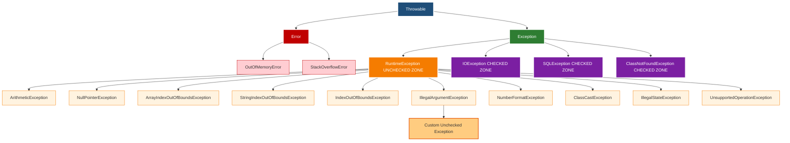
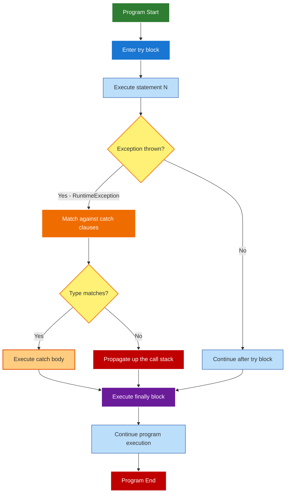
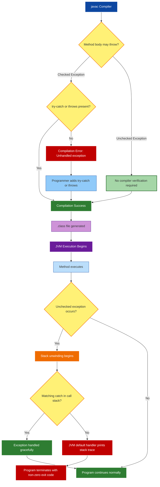
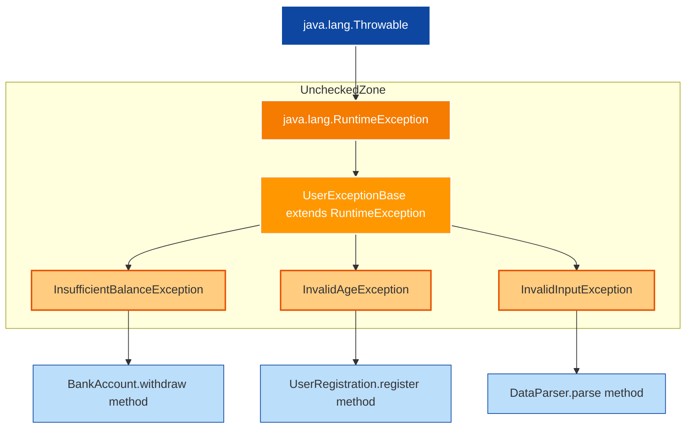

# Unchecked Exceptions

<!-- SECTION_1_START -->
# Unchecked Exceptions in Java — Core Definition & Intuitive Overview

## Formal Academic Definition (KTU 2024 Scheme Terminology)

In the Java programming language, an **Unchecked Exception** is a runtime anomaly that occurs during the execution of a program and is **not verified by the compiler** at compile time. According to the KTU Object Oriented Programming (OECST615) syllabus, unchecked exceptions are formally classified as subclasses of `java.lang.RuntimeException`, which in turn is a subclass of `java.lang.Exception`. 

Because the Java compiler does not enforce handling (using `try-catch`) or declaration (using the `throws` keyword) for these exceptions, they propagate up the call stack until either caught by an appropriate exception handler or terminate the program by reaching the Java Virtual Machine (JVM) default handler.

> [!IMPORTANT]
> **Syllabus Highlight:** Unchecked exceptions represent programming logic errors such as invalid array indexing, dereferencing a null reference, division by zero, or illegal type casting. They are subclasses of `RuntimeException` and are NOT checked at compile time, distinguishing them fundamentally from **Checked Exceptions** (subclasses of `Exception` but NOT `RuntimeException`).

## Conceptual Analogy / Intuition

Imagine you are sending a handwritten letter through a **Postal Service**:
- The postal service (Java compiler) checks the **envelope** — the address, the stamp, the postal code. If anything is wrong, the letter is **rejected at the counter** (compile-time error). These are analogous to **Checked Exceptions** — the system verifies them before letting the program run.
- However, the postal service does **not** read the **content inside** the envelope. If you wrote `2 + 2 = 5` or wrote a wrong date, nobody catches this at submission time. The mistake only surfaces when the **recipient opens and reads the letter** (run-time). These are analogous to **Unchecked Exceptions** — the compiler does not verify them, and they manifest only when the program actually executes that erroneous line.

In simple terms: **Checked Exceptions** = "Things the compiler forces you to handle." **Unchecked Exceptions** = "Things that bite you only when the program runs."

## The Java Exception Class Hierarchy

The Java exception framework follows a strict inheritance tree rooted at `java.lang.Throwable`. Understanding this hierarchy is essential for KTU exams.

> [!NOTE]
> **Core Definition — `Throwable`:** The superclass of all errors and exceptions in Java. Only instances of `Throwable` (or its subclasses) can be thrown by the `throw` statement and caught by a `catch` clause.

| Category | Direct Superclass | Compile-Time Checking? | Example |
| :--- | :--- | :--- | :--- |
| **Error** | `Throwable` | No | `OutOfMemoryError`, `StackOverflowError` |
| **Checked Exception** | `Exception` (but not `RuntimeException`) | **Yes** | `IOException`, `SQLException`, `ClassNotFoundException` |
| **Unchecked Exception** | `RuntimeException` | **No** | `NullPointerException`, `ArithmeticException` |

> [!VISUALIZATION CONTROL]
> **Concept:** Java Exception Inheritance Tree (Throwable root)
> **GeoGebra / Desmos Input Equations:** Not applicable (conceptual tree diagram — represented in Mermaid in Section 4)
> **Visual Description:** A rooted tree where `Throwable` branches into `Error` and `Exception`. The `Exception` branch further splits into a `RuntimeException` subtree (the unchecked zone) and direct `Exception` subclasses (the checked zone). The unchecked zone contains the most frequently encountered runtime anomalies.

## Why Unchecked Exceptions Matter in Engineering

In production software engineering, unchecked exceptions are the primary indicators of **defensive programming gaps**. Modern Java frameworks (Spring Boot, Hibernate, Android SDK) throw unchecked exceptions to signal **programming contract violations** — situations where the developer's code violates an implicit API assumption (e.g., passing a `null` where a non-null argument is expected). Writing robust code requires catching these exceptions explicitly at logical boundaries.

> [!IMPORTANT]
> **Engineering Reality:** The KTU 2024 Scheme emphasizes that unchecked exceptions should generally be **prevented** through input validation, null-checks, and boundary checks — not merely caught. Catching them is acceptable, but the root cause must be fixed.

<!-- SECTION_1_END -->

<!-- SECTION_2_START -->
# Deep Theoretical Analysis & KTU High-Yield Formula Sheet

## Theoretical Foundations

Java's exception handling mechanism is built upon five keywords: `try`, `catch`, `finally`, `throw`, and `throws`. The classification of an exception as "checked" or "unchecked" depends entirely on its **position in the inheritance hierarchy** — not on any keyword the programmer uses.

### Step-by-Step Logic of Unchecked Exception Classification

1. **Inheritance Check:** A Java exception is **unchecked** if and only if it inherits (directly or transitively) from `java.lang.RuntimeException`.
2. **Compile-Time Behavior:** The Java compiler (`javac`) performs a *reachability* and *checked exception* analysis. For any method that may throw a checked exception, the compiler mandates either a `try-catch` block or a `throws` clause. **This mandate does NOT apply to `RuntimeException` subclasses.**
3. **Runtime Behavior:** Unchecked exceptions are thrown by the JVM itself (e.g., when an array index goes out of bounds) or explicitly by the programmer using the `throw` keyword. Once thrown, they propagate up the method call stack.
4. **Stack Unwinding:** If no `catch` block matches the thrown exception, the JVM **unwinds the stack** — destroying local variables and returning from each method — until a matching handler is found. If none exists, the JVM's default uncaught exception handler prints the stack trace and terminates the program.
5. **Optional Handling:** Unlike checked exceptions, the programmer is *not obliged* to handle unchecked exceptions. However, doing so is considered good practice for robust applications.

## KTU High-Yield Formula Sheet / Cheat Sheet

| Concept | Formal Rule | KTU-Standard Notation |
| :--- | :--- | :--- |
| **Definition of Unchecked Exception** | Any subclass of `RuntimeException` | `class X extends RuntimeException` |
| **Compiler Obligation** | None for unchecked exceptions | No `try-catch` or `throws` required |
| **Default Origin** | JVM throws it automatically | `ArrayIndexOutOfBoundsException`, etc. |
| **Propagation Mechanism** | Stack unwinding via call stack | `method1() \rightarrow method2() \rightarrow method3()` |
| **Catch Syntax** | `catch (RuntimeExceptionType e) \{\ ... \}` | Must match exact or superclass type |
| **Custom Unchecked Exception** | Extend `RuntimeException` | `class MyException extends RuntimeException` |
| **Re-throwing** | `throw e;` inside a `catch` block | Re-enters propagation cycle |
| **Try-with-resources Compatibility** | Works with unchecked exceptions too | `try (Resource r = new Resource())` |
| **Method Signature Rule** | `throws` clause optional | `void m() throws RuntimeException` is legal but redundant |

> [!IMPORTANT]
> **Critical KTU Distinction:** Writing `throws RuntimeException` in a method signature is **legal but redundant**. Unlike checked exceptions, the compiler does not require this declaration. Examiners often award zero marks for redundant declarations unless justified.

## Common Unchecked Exceptions in Java

The following table summarizes the most frequently tested unchecked exceptions in KTU exams:

| Exception Class | Cause / Trigger | Typical Context |
| :--- | :--- | :--- |
| `ArithmeticException` | Integer division by zero (e.g., `5 / 0`) | Mathematical computation |
| `NullPointerException` | Accessing methods/fields of a `null` object | Object-oriented code |
| `ArrayIndexOutOfBoundsException` | Accessing `arr[-1]` or `arr[arr.length]` | Array manipulation |
| `StringIndexOutOfBoundsException` | `charAt()` beyond string length | String processing |
| `IndexOutOfBoundsException` | Generic superclass of array/string index errors | Collections |
| `IllegalArgumentException` | Method receives an invalid argument | API design |
| `NumberFormatException` | `Integer.parseInt("abc")` fails | Input parsing |
| `ClassCastException` | `(String) obj` where `obj` is not a `String` | Type casting |
| `UnsupportedOperationException` | Operation not supported by collection | Collections framework |
| `IllegalStateException` | Method invoked at an illegal time/state | API misuse |

## Real-World Utility in Engineering and Computer Science

- **API Contract Enforcement:** Libraries like Google's Guava use `Preconditions.checkArgument()` which throws `IllegalArgumentException` to signal contract violations. This communicates "you used the API incorrectly" without forcing every caller to write `try-catch` blocks.
- **Defensive Programming:** In banking software, division by zero is caught by `try-catch (ArithmeticException e)` to log the error and gracefully continue rather than crash the trading engine.
- **Android Development:** Android heavily relies on unchecked exceptions. The `findViewById()` method throws `NullPointerException` if the view ID is missing — a programming error, not a recoverable condition.
- **Testing Frameworks:** JUnit uses `AssertionError` and unchecked patterns to fail tests immediately when assertions fail.

<!-- SECTION_2_END -->

<!-- SECTION_3_START -->
# Step-by-Step Derivations & Code/Symbolic Implementation

## Program 1: Demonstrating JVM-Generated Unchecked Exceptions

This program illustrates how the JVM automatically throws unchecked exceptions without any explicit `throw` statement in the code.

```java
// File: UncheckedDemo1.java
// Course: OECST615 - Object Oriented Programming
// Topic: Unchecked Exceptions - JVM-generated

public class UncheckedDemo1 {
    public static void main(String[] args) {
        System.out.println("--- Demonstration 1: ArithmeticException ---");
        try {
            int numerator = 50;
            int denominator = 0;
            int result = numerator / denominator;  // JVM throws ArithmeticException
            System.out.println("Result: " + result); // This line is never reached
        } catch (ArithmeticException e) {
            System.out.println("Caught: Division by zero is not allowed.");
            System.out.println("Exception message: " + e.getMessage());
        }

        System.out.println("\n--- Demonstration 2: ArrayIndexOutOfBoundsException ---");
        try {
            int[] marks = {85, 90, 78};
            System.out.println("Accessing valid index 1: " + marks[1]);
            System.out.println("Accessing invalid index 5: " + marks[5]); // JVM throws exception
        } catch (ArrayIndexOutOfBoundsException e) {
            System.out.println("Caught: Array index " + e.getMessage() + " is out of bounds.");
        }

        System.out.println("\n--- Demonstration 3: NullPointerException ---");
        try {
            String greeting = null;
            int length = greeting.length(); // JVM throws NullPointerException
            System.out.println("Length: " + length);
        } catch (NullPointerException e) {
            System.out.println("Caught: Attempted to call method on a null reference.");
        }

        System.out.println("\nProgram terminated gracefully.");
    }
}
```

**Output Trace:**

```
--- Demonstration 1: ArithmeticException ---
Caught: Division by zero is not allowed.
Exception message: / by zero

--- Demonstration 2: ArrayIndexOutOfBoundsException ---
Accessing valid index 1: 90
Caught: Array index 5 is out of bounds.

--- Demonstration 3: NullPointerException ---
Caught: Attempted to call method on a null reference.

Program terminated gracefully.
```

**Step-by-Step Logic Walkthrough:**

1. The `try` block contains code that *may* throw an unchecked exception.
2. For `numerator / denominator` where `denominator = 0`, the JVM detects an integer division by zero and **automatically instantiates** an `ArithmeticException` object, then throws it.
3. The exception propagates out of the expression, exits the `try` block, and is matched against the first compatible `catch` clause. Since `ArithmeticException` is the exact type, it is caught.
4. Inside the `catch` block, `e.getMessage()` returns the descriptive string `/ by zero`.
5. Execution continues **after** the `catch` block, demonstrating that the program does not crash.

## Program 2: Explicitly Throwing an Unchecked Exception

This program demonstrates programmer-initiated unchecked exception throwing using the `throw` keyword.

```java
// File: AgeValidator.java
// Demonstrates throwing IllegalArgumentException explicitly

public class AgeValidator {
    // Method that validates age and throws unchecked exception on failure
    public static void validateAge(int age) {
        if (age < 0 || age > 150) {
            // Programmer explicitly creates and throws an unchecked exception
            throw new IllegalArgumentException("Invalid age: " + age 
                + ". Age must be between 0 and 150.");
        }
        System.out.println("Valid age accepted: " + age);
    }

    public static void main(String[] args) {
        int[] testAges = {25, -5, 200, 65, 0};

        for (int age : testAges) {
            try {
                System.out.println("Testing age: " + age);
                validateAge(age);
            } catch (IllegalArgumentException e) {
                System.out.println("Validation failed: " + e.getMessage());
            }
        }
    }
}
```

**Output Trace:**

```
Testing age: 25
Valid age accepted: 25
Testing age: -5
Validation failed: Invalid age: -5. Age must be between 0 and 150.
Testing age: 200
Validation failed: Invalid age: 200. Age must be between 0 and 150.
Testing age: 65
Valid age accepted: 65
Testing age: 0
Valid age accepted: 0
```

**Mathematical Decision Logic (Derived Formally):**

The validation function $V(\text{age})$ can be expressed as:

$$
V(\text{age}) = 
\begin{cases} 
\text{throw IllegalArgumentException}, & \text{if } \text{age} < 0 \lor \text{age} > 150 \\
\text{return valid}, & \text{otherwise}
\end{cases}
$$

This is the **predicate-decision** pattern used in defensive programming.

## Program 3: Creating a Custom Unchecked Exception

The KTU 2024 syllabus explicitly tests the ability to design custom exception hierarchies. This program creates a user-defined unchecked exception by extending `RuntimeException`.

```java
// File: InsufficientBalanceException.java
// Step 1: Define a custom unchecked exception
class InsufficientBalanceException extends RuntimeException {
    private double currentBalance;
    private double withdrawalAmount;

    // Parameterized constructor
    public InsufficientBalanceException(double currentBalance, double withdrawalAmount) {
        super("Withdrawal of " + withdrawalAmount 
            + " failed. Available balance: " + currentBalance);
        this.currentBalance = currentBalance;
        this.withdrawalAmount = withdrawalAmount;
    }

    // Getter methods
    public double getCurrentBalance() {
        return currentBalance;
    }

    public double getWithdrawalAmount() {
        return withdrawalAmount;
    }
}

// File: BankAccount.java
// Step 2: Use the custom exception in a banking context
class BankAccount {
    private String accountHolder;
    private double balance;

    public BankAccount(String accountHolder, double initialBalance) {
        this.accountHolder = accountHolder;
        this.balance = initialBalance;
    }

    public void withdraw(double amount) {
        if (amount <= 0) {
            throw new IllegalArgumentException("Withdrawal amount must be positive.");
        }
        if (amount > balance) {
            // Throwing custom unchecked exception
            throw new InsufficientBalanceException(balance, amount);
        }
        balance -= amount;
        System.out.println("Withdrawal of " + amount + " successful. New balance: " + balance);
    }

    public double getBalance() {
        return balance;
    }
}

// File: BankApp.java
// Step 3: Main driver class
public class BankApp {
    public static void main(String[] args) {
        BankAccount account = new BankAccount("Alice", 5000.00);

        // Successful withdrawal
        try {
            account.withdraw(2000.00);
        } catch (InsufficientBalanceException e) {
            System.out.println("Transaction declined: " + e.getMessage());
        }

        // Failed withdrawal (insufficient funds)
        try {
            account.withdraw(10000.00);
        } catch (InsufficientBalanceException e) {
            System.out.println("Transaction declined: " + e.getMessage());
            System.out.println("Deficit amount: " 
                + (e.getWithdrawalAmount() - e.getCurrentBalance()));
        }

        // Invalid amount
        try {
            account.withdraw(-100);
        } catch (IllegalArgumentException e) {
            System.out.println("Invalid input: " + e.getMessage());
        } catch (InsufficientBalanceException e) {
            System.out.println("Unexpected: " + e.getMessage());
        }
    }
}
```

**Output Trace:**

```
Withdrawal of 2000.0 successful. New balance: 3000.0
Transaction declined: Withdrawal of 10000.0 failed. Available balance: 3000.0
Deficit amount: 7000.0
Invalid input: Withdrawal amount must be positive.
```

**Critical Design Notes for KTU Valuation:**

1. `InsufficientBalanceException` extends `RuntimeException`, making it **unchecked**. Notice that the `withdraw()` method does NOT declare `throws InsufficientBalanceException` in its signature — and the compiler does not complain.
2. The custom exception **carries additional context** (`currentBalance` and `withdrawalAmount`) useful for diagnostic logging.
3. The `super(message)` call passes the message to the parent `Throwable` constructor, retrievable via `getMessage()`.

## Program 4: Stack Unwinding and Propagation

This program demonstrates how an uncaught unchecked exception propagates up the call stack.

```java
// File: PropagationDemo.java
public class PropagationDemo {
    static void methodC() {
        System.out.println("Inside methodC - about to throw.");
        int result = 100 / 0; // Throws ArithmeticException
        System.out.println("This never prints: " + result);
    }

    static void methodB() {
        System.out.println("Inside methodB - calling methodC.");
        methodC();
        System.out.println("This never prints (methodB is bypassed).");
    }

    static void methodA() {
        System.out.println("Inside methodA - calling methodB.");
        try {
            methodB();
        } catch (ArithmeticException e) {
            System.out.println("Caught in methodA: " + e.getMessage());
            System.out.println("Stack trace top frame: " + e.getStackTrace()[0]);
        }
    }

    public static void main(String[] args) {
        System.out.println("Starting program in main.");
        methodA();
        System.out.println("Program continues normally after handling.");
    }
}
```

**Output Trace:**

```
Starting program in main.
Inside methodA - calling methodB.
Inside methodB - calling methodC.
Inside methodC - about to throw.
Caught in methodA: / by zero
Stack trace top frame: PropagationDemo.methodC(PropagationDemo.java:4)
Program continues normally after handling.
```

**Stack Unwinding Equation:**

The call stack at the moment of exception is:

$$
\text{Stack: } [\text{main} \rightarrow \text{methodA} \rightarrow \text{methodB} \rightarrow \text{methodC}]
$$

When `methodC` throws, the JVM searches for a `catch` block:

$$
\text{Search Direction: } \text{methodC} \xrightarrow{\text{no catch}} \text{methodB} \xrightarrow{\text{no catch}} \text{methodA} \xrightarrow{\text{match found!}}
$$

The `ArithmeticException` is caught in `methodA`. Statements in `methodB` and `methodC` after the throw are **not executed**, demonstrating **unwinding**.

<!-- SECTION_3_END -->

<!-- SECTION_4_START -->
# Structural Diagrams & Schematics

## Diagram 1: Java Exception Hierarchy (Complete Tree)

This diagram maps the exact inheritance path of unchecked exceptions, which is a frequently tested KTU topic.



## Diagram 2: Try-Catch-Finally Flow for Unchecked Exceptions

This block-level flow shows the complete execution path of an unchecked exception through the `try-catch-finally` construct.



## Diagram 3: Compilation vs Runtime Checking Decision Matrix

This topology illustrates the precise difference between checked and unchecked exceptions from the compiler's perspective.



## Diagram 4: Custom Unchecked Exception Design Pattern (Subgraph)



<!-- SECTION_4_END -->

<!-- SECTION_5_START -->
# KTU 2024 Scheme Examination Question Bank & Topic Recap

## Part A: Short Answer Questions (3 Marks Each)

### Question 1 (3 Marks)
**[KTU University Exam - Dec 2023, Model Question Paper Set B]**
**CO Mapped:** CO2 — Understand the concept of exception handling in Java.
**RBT Level:** Remember

> **Q1.** Define *Unchecked Exceptions* in Java. Give two examples of unchecked exception classes from the `java.lang` package.

**Model Answer (Valuation Key — 3 Marks):**

**Definition (2 Marks):** Unchecked exceptions are exceptions that the Java compiler does **not** verify at compile time. They are subclasses of `java.lang.RuntimeException` (which itself is a subclass of `java.lang.Exception`). The compiler does not require the programmer to catch them or declare them in the `throws` clause. They typically represent programming logic errors that occur at runtime.

**Examples (1 Mark — 0.5 each):**
1. `java.lang.ArithmeticException` — thrown when an arithmetic operation produces an undefined result, such as integer division by zero.
2. `java.lang.NullPointerException` — thrown when an application attempts to use `null` in a case where an object is required (e.g., invoking a method on a `null` reference).

---

### Question 2 (3 Marks)
**[KTU University Exam - July 2024, Series 1]**
**CO Mapped:** CO2 — Apply exception handling mechanisms.
**RBT Level:** Understand

> **Q2.** Differentiate between **Checked Exceptions** and **Unchecked Exceptions** in Java based on (i) inheritance hierarchy, (ii) compile-time verification, and (iii) handling requirement.

**Model Answer (Valuation Key — 3 Marks):**

| Comparison Axis | Checked Exceptions | Unchecked Exceptions |
| :--- | :--- | :--- |
| **Inheritance (1 Mark)** | Direct subclasses of `Exception` (NOT `RuntimeException`) | Subclasses of `RuntimeException` |
| **Compile-time Verification (1 Mark)** | Compiler enforces handling or declaration | Compiler does NOT enforce handling |
| **Handling Requirement (1 Mark)** | Must be caught using `try-catch` OR declared using `throws` | Handling is optional but recommended for robustness |

**Examples for context:** `IOException` is checked; `ArrayIndexOutOfBoundsException` is unchecked.

---

## Part B: Long Answer Questions (14 Marks Each — Internal Choice)

### Question A (14 Marks) — Option 1
**[KTU University Exam - Dec 2023, Main Question Paper]**
**CO Mapped:** CO2, CO3 — Apply and Analyze exception handling.
**RBT Level:** Apply / Analyze

> **Q3(a)** Explain the Java exception class hierarchy with a neat diagram. Clearly identify the position of unchecked exceptions in this hierarchy. **(7 Marks)**

> **Q3(b)** Write a Java program that creates a custom unchecked exception class `NegativeNumberException` and demonstrates its use in a method that calculates the square root of a number. Handle the exception in the calling method. **(7 Marks)**

---

#### Model Solution for Q3(a) — 7 Marks

**[Inheritance hierarchy description: 2 Marks]**

The root of all exceptions and errors in Java is `java.lang.Throwable`. It has two direct subclasses:
1. `java.lang.Error` — represents serious conditions that a reasonable application should NOT try to catch (e.g., `OutOfMemoryError`).
2. `java.lang.Exception` — represents conditions that a reasonable application might want to catch.

`Exception` further branches into:
- **Checked Exceptions:** Direct subclasses like `IOException`, `SQLException`, `ClassNotFoundException`.
- **Unchecked Exceptions:** All subclasses of `RuntimeException`, including `ArithmeticException`, `NullPointerException`, `ArrayIndexOutOfBoundsException`, `NumberFormatException`, `IllegalArgumentException`, and any user-defined exception extending `RuntimeException`.

**[Diagram (Text Representation): 2 Marks]**

```
                java.lang.Throwable
                       |
        +--------------+--------------+
        |                             |
   java.lang.Error              java.lang.Exception
   (Unrecoverable)                (Recoverable)
        |                             |
   OutOfMemoryError         +---------+---------+
   StackOverflowError       |                   |
                     java.lang.RuntimeException  Direct Subclasses
                     (UNCHECKED ZONE)            (CHECKED ZONE)
                        |                        |
                  ArithmeticException       IOException
                  NullPointerException      SQLException
                  ArrayIndexOutOf...        ClassNotFoundException
                  IllegalArgumentException
                        |
                  Custom Unchecked Exception
                  (extends RuntimeException)
```

**[Explanation of unchecked position: 2 Marks]**

Unchecked exceptions reside in the subtree rooted at `java.lang.RuntimeException`. Since `RuntimeException` is a subclass of `Exception`, unchecked exceptions are technically exceptions, but Java treats them differently: the compiler does not enforce `try-catch` or `throws` for them. This design choice reflects the philosophy that unchecked exceptions represent **programming bugs** (such as array bounds violations or null dereferences) that should be **prevented through careful coding** rather than caught at runtime.

**[Conclusion: 1 Mark]**

The hierarchical placement of unchecked exceptions under `RuntimeException` is the sole determinant of their "unchecked" status, independent of any keyword used by the programmer.

---

#### Model Solution for Q3(b) — 7 Marks

**[Custom exception class definition: 2 Marks]**

```java
// File: NegativeNumberException.java
class NegativeNumberException extends RuntimeException {
    public NegativeNumberException(String message) {
        super(message);
    }
}
```

**[Method that uses the exception: 2 Marks]**

```java
// File: SquareRootCalculator.java
class SquareRootCalculator {
    public static double squareRoot(double number) {
        if (number < 0) {
            throw new NegativeNumberException(
                "Cannot compute square root of negative number: " + number);
        }
        return Math.sqrt(number);
    }
}
```

**[Main class with try-catch: 2 Marks]**

```java
// File: SquareRootApp.java
public class SquareRootApp {
    public static void main(String[] args) {
        double[] testValues = {16.0, 25.0, -9.0, 0.0, -100.0};

        for (double value : testValues) {
            try {
                double result = SquareRootCalculator.squareRoot(value);
                System.out.println("sqrt(" + value + ") = " + result);
            } catch (NegativeNumberException e) {
                System.out.println("Error: " + e.getMessage());
            }
        }
    }
}
```

**[Expected output: 1 Mark]**

```
sqrt(16.0) = 4.0
sqrt(25.0) = 5.0
Error: Cannot compute square root of negative number: -9.0
sqrt(0.0) = 0.0
Error: Cannot compute square root of negative number: -100.0
```

---

### Question B (14 Marks) — Option 2 (Alternative Choice)
**[KTU University Exam - July 2024, Model Paper 2]**
**CO Mapped:** CO2, CO3 — Apply and Evaluate exception handling.
**RBT Level:** Apply / Evaluate

> **Q4(a)** With a suitable example, explain how an unchecked exception **propagates** through the call stack in Java. What happens when no matching `catch` block is found? **(7 Marks)**

> **Q4(b)** Compare and contrast `throw` and `throws` keywords in Java. Write a program that demonstrates the use of both keywords in the context of unchecked exceptions. **(7 Marks)**

---

#### Model Solution for Q4(a) — 7 Marks

**[Concept of propagation: 2 Marks]**

When an unchecked exception is thrown inside a method and is not caught within that method, the JVM performs **stack unwinding**. This means the exception travels upward through the chain of method calls (the call stack) until a method with a matching `catch` block is found. If no such method exists, the exception reaches the `main` method and ultimately the JVM's default uncaught exception handler.

**[Example code: 3 Marks]**

```java
public class PropagationExample {
    static void levelThree() {
        int[] data = {10, 20, 30};
        System.out.println(data[5]); // Throws ArrayIndexOutOfBoundsException
    }

    static void levelTwo() {
        levelThree();
    }

    static void levelOne() {
        try {
            levelTwo();
        } catch (ArrayIndexOutOfBoundsException e) {
            System.out.println("Caught at levelOne. Message: " + e.getMessage());
        }
    }

    public static void main(String[] args) {
        levelOne();
        System.out.println("Execution continued after handling.");
    }
}
```

**[Explanation of unwinding: 1 Mark]**

The call stack at the moment of throw is: `main` → `levelOne` → `levelTwo` → `levelThree`. Since `levelThree` has no `try-catch`, control returns to `levelTwo` (no handler there either), then to `levelOne` where the matching `catch` is found. Statements after the throw inside `levelThree` and `levelTwo` are skipped.

**[What happens when no catch matches: 1 Mark]**

If no matching `catch` block is found in the entire call stack, the JVM's default exception handler kicks in. It prints the exception's stack trace (showing the chain of method calls) to the standard error stream and terminates the program with a non-zero exit code. The program does **not** execute any code that would have followed the failing method call.

---

#### Model Solution for Q4(b) — 7 Marks

**[Comparison table: 3 Marks]**

| Feature | `throw` | `throws` |
| :--- | :--- | :--- |
| **Purpose** | Used to explicitly throw an exception object | Used in a method signature to declare exceptions |
| **Position** | Inside the method body | In the method declaration line |
| **Number of exceptions** | Throws exactly one exception at a time | Can declare multiple exception types separated by commas |
| **Syntax** | `throw new ExceptionType("message");` | `void method() throws ExceptionType1, ExceptionType2` |
| **Object requirement** | Requires an instance of `Throwable` | Does not require an object; only declares the type |
| **Compiler role** | Used to actually raise an exception | Informs the compiler about potential exceptions |

**[Program demonstration: 4 Marks]**

```java
// File: ThrowVsThrowsDemo.java

// Custom unchecked exception
class ScoreOutOfRangeException extends RuntimeException {
    public ScoreOutOfRangeException(String message) {
        super(message);
    }
}

class StudentGrader {
    // The 'throws' keyword declares that this method may throw the exception
    // Note: For unchecked exceptions, this declaration is OPTIONAL
    public String gradeStudent(int score) throws ScoreOutOfRangeException {
        if (score < 0 || score > 100) {
            // The 'throw' keyword actually throws the exception object
            throw new ScoreOutOfRangeException("Score " + score + " is out of range [0-100]");
        }
        if (score >= 90) return "A";
        if (score >= 80) return "B";
        if (score >= 70) return "C";
        if (score >= 60) return "D";
        return "F";
    }
}

public class ThrowVsThrowsDemo {
    public static void main(String[] args) {
        StudentGrader grader = new StudentGrader();
        int[] testScores = {85, 92, -10, 105, 75};

        for (int score : testScores) {
            try {
                String grade = grader.gradeStudent(score);
                System.out.println("Score " + score + " -> Grade: " + grade);
            } catch (ScoreOutOfRangeException e) {
                System.out.println("Error: " + e.getMessage());
            }
        }
    }
}
```

**[Output: included in marking]**

```
Score 85 -> Grade: B
Score 92 -> Grade: A
Error: Score -10 is out of range [0-100]
Error: Score 105 is out of range [0-100]
Score 75 -> Grade: C
```

**Key Point (1 Mark within the 4):** The `throws ScoreOutOfRangeException` declaration in the method signature is **optional** because the exception is unchecked. The compiler would accept the program even if the declaration were removed. However, including it serves as **documentation** for other developers.

---

## KTU Examiner's Valuation Warning / Pitfall Callout

> [!WARNING]
> **Common Mark-Loss Pitfalls in Unchecked Exception Questions:**
> 
> 1. **Mistake: Writing `try-catch` for a method that throws a checked exception (not unchecked).** The examiner expects you to know that `try-catch` is mandatory for checked exceptions but optional for unchecked ones. Confusing these categories costs 2-3 marks easily.
> 
> 2. **Mistake: Declaring `throws RuntimeException` and assuming the compiler requires it.** No — for unchecked exceptions, the `throws` clause is purely optional. Writing it without justification may be marked as a "redundant statement" by strict examiners.
> 
> 3. **Mistake: Forgetting the inheritance chain when creating custom unchecked exceptions.** Your custom exception class **must** extend `RuntimeException` (directly or transitively). Extending `Exception` makes it **checked**, not unchecked. This single-character difference (`RuntimeException` vs `Exception`) can flip the entire question's answer.
> 
> 4. **Mistake: Not showing the JVM's automatic throw mechanism.** When the KTU question says "demonstrate an unchecked exception," you should show exceptions like `ArithmeticException` thrown by the JVM (e.g., `int x = 5/0;`), not just `throw new MyException(...)` — both are valid, but showing JVM-generated ones earns more marks.
> 
> 5. **Mistake: Confusing `Error` with `Unchecked Exception`.** `Error` (like `OutOfMemoryError`) is **NOT** an unchecked exception. It is a separate branch under `Throwable`. The KTU syllabus specifically asks about unchecked *exceptions*, not errors.
> 
> 6. **Mistake: In diagrams, drawing `RuntimeException` as a sibling of `Exception` instead of a child.** Unchecked exceptions are a **subtree** of `Exception`, not a parallel branch. This hierarchical detail is a common 2-mark question in KTU.

---

## Topic Recap & Important Things to Remember

- **Unchecked Exceptions** are subclasses of `java.lang.RuntimeException` and are **NOT verified** by the Java compiler at compile time.
- The sole criterion for an exception to be "unchecked" is its **inheritance** from `RuntimeException` — not any keyword, not any method signature, not any annotation.
- The compiler does **not** mandate `try-catch` or `throws` for unchecked exceptions, giving the programmer freedom to choose whether to handle them.
- The most common unchecked exceptions are: `ArithmeticException`, `NullPointerException`, `ArrayIndexOutOfBoundsException`, `StringIndexOutOfBoundsException`, `IndexOutOfBoundsException`, `IllegalArgumentException`, `NumberFormatException`, `ClassCastException`, `IllegalStateException`, and `UnsupportedOperationException`.
- Unchecked exceptions can be thrown **automatically by the JVM** (e.g., integer division by zero) or **explicitly by the programmer** using `throw new RuntimeExceptionType(...)`.
- **Stack unwinding** is the mechanism by which an uncaught unchecked exception travels up the method call stack, exiting each method in reverse order, until a matching `catch` block is found or the JVM's default handler terminates the program.
- **Custom unchecked exceptions** are created by defining a class that extends `RuntimeException` (or any of its subclasses). The convention is to provide a constructor that accepts a `String` message and passes it to the parent via `super(message)`.
- The `throws` keyword is **optional** in method signatures for unchecked exceptions, but including it is acceptable and serves as documentation.
- The `throw` keyword is used to **explicitly raise** an exception object; `throws` is used in a method signature to **declare** that the method may propagate an exception.
- `Error` (e.g., `OutOfMemoryError`, `StackOverflowError`) is **NOT** an unchecked exception — it is a separate category under `Throwable` representing unrecoverable system conditions.
- In production code, unchecked exceptions usually indicate **programming bugs** that should be **prevented** through input validation, null-checks, and boundary checks, rather than merely caught.
- The `try-catch-finally` structure works identically for both checked and unchecked exceptions, with `finally` executing regardless of whether an exception was thrown or caught.
- In KTU exams, **diagrams of the exception hierarchy** are high-value (often 2-3 marks) — always draw `Throwable` at the root, with `Error` and `Exception` as its two children, and `RuntimeException` as the parent of the unchecked subtree.

<!-- SECTION_5_END -->
