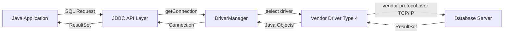
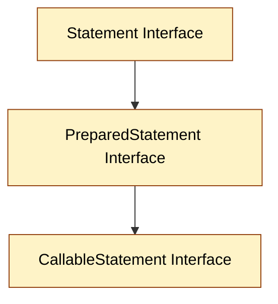
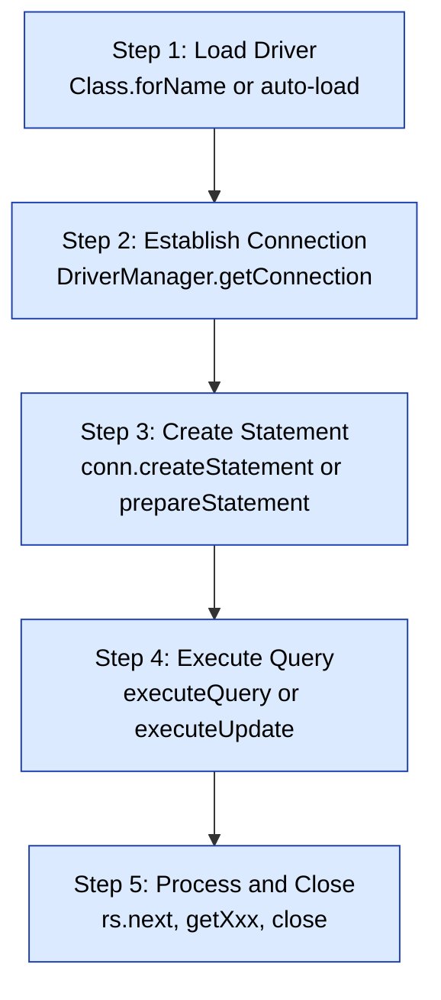
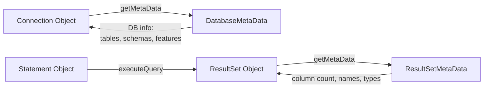
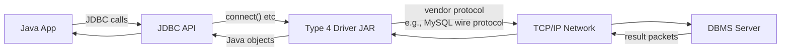
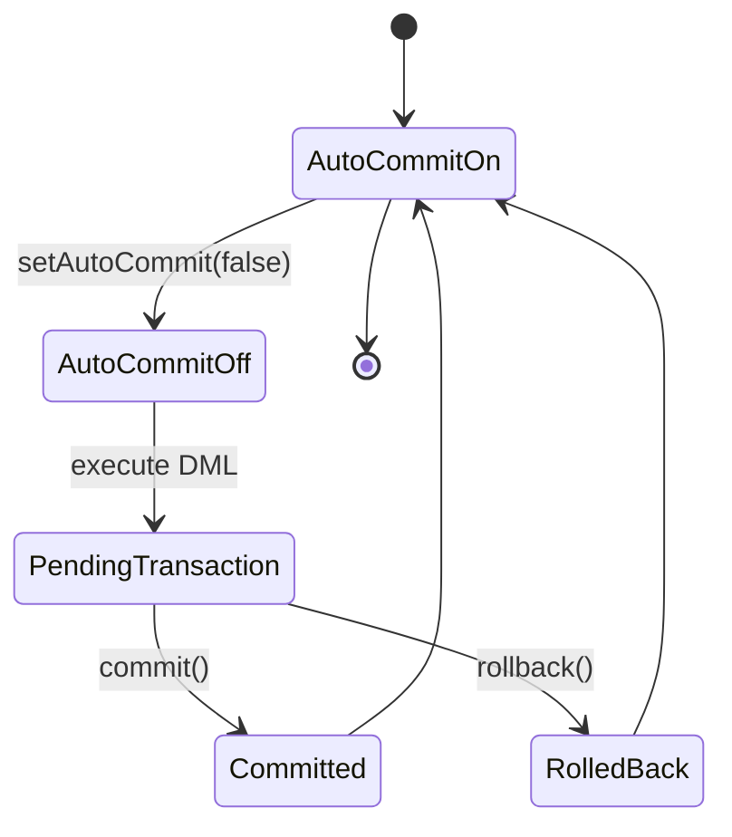
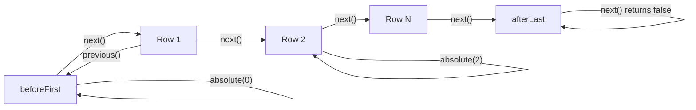

# Common JDBC Components

<!-- SECTION_1_START -->

# Common JDBC Components

## 1. Core Technical Definition & Intuitive Overview

**JDBC (Java Database Connectivity)** is a Java API (Application Programming Interface) defined in the package `java.sql` (with extensions in `javax.sql`) that enables Java applications to interact with relational databases in a database-independent manner. It provides a standard set of classes and interfaces for executing SQL statements, retrieving results, managing connections, and handling database transactions.

As per the **KTU 2024 Scheme (OECST615 - Object Oriented Programming, Module 4)**, JDBC is introduced as the bridge between the Java language and the relational database world, demonstrating how OOP concepts like abstraction, encapsulation, and polymorphism are applied to real-world data persistence problems.

> [!IMPORTANT]
> **KTU Syllabus Definition:** "JDBC is a Java-based data access technology that defines how a client may access a database. It provides methods for querying and updating data in a database and is oriented toward relational databases."

### 1.1 Conceptual Analogy / Intuition

Imagine you are traveling to a foreign country where the locals speak different languages (MySQL, Oracle, PostgreSQL, MS SQL Server). Without a translator, communication would be impossible.

- **Your Java Application** = The English-speaking tourist (your code).
- **The Database Server** = The local resident who only understands their native tongue (SQL dialect).
- **JDBC** = The universal translator at the airport that converts your Java commands into a language the database understands, regardless of which country (vendor) you are visiting.

Every component in JDBC is a part of this "translation desk" — the manager arranges the translator, the translator speaks to the local, gets the answer, and brings it back to you in a language you understand.

### 1.2 The Two-Tier and Three-Tier Architecture of JDBC

JDBC supports two primary architectural models:

- **Two-Tier Architecture**: The Java application directly communicates with the database. The user's commands are sent to the database, and the results are sent back. This is a **client-server model**.
- **Three-Tier (n-tier) Architecture**: The Java application sends commands to a **middle-tier** service (like a web server or EJB container), which then forwards them to the database. The results flow back through the middle tier. This is the standard model for **enterprise web applications**.

> [!NOTE]
> **Key Insight:** JDBC is built on the **Factory Method** and **Facade** design patterns. The `DriverManager` acts as a factory, while the `Connection` interface acts as a facade that hides the complexity of database communication.

### 1.3 The Four Types of JDBC Drivers

JDBC drivers are translation libraries. The **Java Soft** (now Oracle) specification classifies them into four types:

| Type | Name | Mechanism | Use Case |
|------|------|-----------|----------|
| **Type 1** | JDBC-ODBC Bridge Driver | Converts JDBC calls to ODBC calls; uses native ODBC driver. | Legacy systems; being deprecated in Java 8+ |
| **Type 2** | Native-API Driver (Partly Java) | Converts JDBC calls to vendor-specific native API calls. | Requires native library on client. |
| **Type 3** | Network Protocol Driver (Middleware) | Sends JDBC calls to a middleware server that translates to DB-specific calls. | Used in 3-tier apps; no client-side native code. |
| **Type 4** | Thin Driver (Pure Java) | Converts JDBC calls directly to vendor-specific database protocol. | **Most widely used** (e.g., `mysql-connector-j`). |

> [!VISUALIZATION CONTROL]
> **Concept:** JDBC Architecture Flow Diagram (4-Tier Process)
> **GeoGebra / Desmos Input Equations:** Not applicable — flow diagram representation only.
> **Visual Description:** Imagine a horizontal sequence of four boxes connected by arrows. The first box is "Java Application" → second box is "JDBC API" → third box is "JDBC Driver Manager" → fourth box is "Database Server". Arrows show bidirectional flow of SQL queries and result sets. The driver layer is the "glue" that adapts Java calls to vendor protocol.

### 1.4 Physical Constants and Standard Metrics

- **Default Port for MySQL**: **3306**
- **Default Port for Oracle**: **1521**
- **Default Port for PostgreSQL**: **5432**
- **Default Port for MS SQL Server**: **1433**
- **JDBC URL Format**: `jdbc:<subprotocol>:<subname>` (e.g., `jdbc:mysql://localhost:3306/school`)

---

<!-- SECTION_1_END -->

<!-- SECTION_2_START -->

# 2. Deep Theoretical Analysis & KTU High-Yield Formula Sheet

## 2.1 The Eight Common JDBC Components

JDBC API is composed of eight core components (classes and interfaces) that work in concert to enable database communication. These are the **most frequently asked entities** in the KTU 2024 Scheme board examinations.

### Component 1: `DriverManager` (Class)

`DriverManager` is the **traditional management layer of JDBC**. It maintains a list of available database drivers and attempts to match an incoming connection request from a Java application to the appropriate vendor driver.

- **Package**: `java.sql.DriverManager`
- **Type**: Concrete `final` class
- **Key Methods**:
  * `public static Connection getConnection(String url, String user, String password)` — returns a `Connection` object.
  * `public static Connection getConnection(String url, Properties info)`
  * `public static Connection getConnection(String url)`
  * `public static void registerDriver(Driver driver)` — registers a vendor driver.
  * `public static void deregisterDriver(Driver driver)` — removes a driver.
  * `public static void setLoginTimeout(int seconds)` — sets maximum waiting time.
  * `public static void println(String message)` — logs to current JDBC log stream.
- **Internal Mechanism**: It maintains a static list `CopyOnWriteArrayList<DriverInfo>` of registered drivers. When `getConnection()` is called, the `DriverManager` iterates through this list, calling `driver.connect(url, info)` on each, and returns the first non-null `Connection`.

> [!IMPORTANT]
> **KTU High-Yield Point:** In JDBC 4.0+ (Java 6 and later), drivers are auto-loaded via the **Service Provider mechanism** using the file `META-INF/services/java.sql.Driver`. So `Class.forName("com.mysql.cj.jdbc.Driver")` is no longer mandatory but is still good practice for KTU exam answers.

### Component 2: `Connection` (Interface)

`Connection` represents a **session/connection to a specific database**. SQL statements are executed and results are returned within the context of a connection.

- **Package**: `java.sql.Connection`
- **Type**: Interface
- **Key Methods**:
  * `Statement createStatement()` — creates a `Statement` object for executing SQL.
  * `PreparedStatement prepareStatement(String sql)` — creates a precompiled SQL statement.
  * `CallableStatement prepareCall(String sql)` — creates a call to a stored procedure.
  * `boolean isClosed()` — checks if connection is closed.
  * `void close()` — releases connection resources immediately.
  * `void commit()` — commits all changes made since the last commit/rollback.
  * `void rollback()` — undoes all changes made in the current transaction.
  * `void setAutoCommit(boolean autoCommit)` — toggles auto-commit mode.
  * `DatabaseMetaData getMetaData()` — returns metadata about the DB.
  * `Savepoint setSavepoint()` — creates a savepoint within the current transaction.
  * `void releaseSavepoint(Savepoint savepoint)` — removes a savepoint.
- **Resource Handling**: A `Connection` is an **expensive resource**. It should always be closed in a `finally` block or used with **try-with-resources** (Java 7+).

### Component 3: `Statement` (Interface)

`Statement` is the object used to **execute a static SQL statement** and return its results.

- **Package**: `java.sql.Statement`
- **Type**: Interface
- **Key Methods**:
  * `ResultSet executeQuery(String sql)` — executes a SELECT query; returns a `ResultSet`.
  * `int executeUpdate(String sql)` — executes INSERT, UPDATE, DELETE; returns row count.
  * `boolean execute(String sql)` — executes any SQL; returns `true` if a `ResultSet` is produced.
  * `int[] executeBatch()` — executes a batch of commands.
  * `void addBatch(String sql)` — adds a command to the batch.
  * `void clearBatch()` — empties the batch.
  * `ResultSet getResultSet()` — retrieves the `ResultSet` from `execute()`.
  * `int getUpdateCount()` — retrieves the update count from `execute()`.
  * `void close()` — releases statement resources.
- **Vulnerability Warning**: `Statement` is **susceptible to SQL Injection** because SQL is built by string concatenation.

### Component 4: `PreparedStatement` (Interface)

`PreparedStatement` is a **precompiled SQL statement**. It is the recommended choice for executing parameterized queries.

- **Package**: `java.sql.PreparedStatement`
- **Type**: Interface (extends `Statement`)
- **Key Methods**:
  * `void setInt(int parameterIndex, int value)` — sets integer parameter.
  * `void setString(int parameterIndex, String value)` — sets string parameter.
  * `void setDouble(int parameterIndex, double value)` — sets double parameter.
  * `void setFloat(int parameterIndex, float value)` — sets float parameter.
  * `void setLong(int parameterIndex, long value)` — sets long parameter.
  * `void setBoolean(int parameterIndex, boolean value)` — sets boolean parameter.
  * `void setDate(int parameterIndex, Date value)` — sets SQL `Date` parameter.
  * `void setObject(int parameterIndex, Object value)` — sets any Java object (uses `setObject` for vendor mapping).
  * `void clearParameters()` — clears all set parameters.
  * `ResultSet executeQuery()` — executes the query.
  * `int executeUpdate()` — executes DML/DDL.
  * `boolean execute()` — executes the SQL.
- **Inheritance Note**: `PreparedStatement` **extends** `Statement`, and `CallableStatement` **extends** `PreparedStatement`. This is a classic example of **interface inheritance in JDBC** — a frequently tested OOP concept.

> [!IMPORTANT]
> **Why PreparedStatement is superior to Statement?**
> 1. **Pre-compiled** — SQL is sent to the DB and parsed/compiled once; subsequent calls reuse the compiled plan.
> 2. **Parameterized** — uses `?` placeholders; values are bound separately, **preventing SQL Injection**.
> 3. **Better Performance** — for repeated execution of similar queries.
> 4. **Readability** — easier to maintain than string-concatenated SQL.

### Component 5: `CallableStatement` (Interface)

`CallableStatement` is used to **execute stored procedures** in the database.

- **Package**: `java.sql.CallableStatement`
- **Type**: Interface (extends `PreparedStatement`)
- **Key Methods**:
  * `void registerOutParameter(int parameterIndex, int sqlType)` — registers an OUT parameter.
  * `boolean wasNull()` — checks if the last read OUT parameter was SQL `NULL`.
  * `String getString(int parameterIndex)`, `int getInt(...)`, etc. — read OUT parameter values.
  * `void setString(int parameterIndex, String value)` — set IN parameter.
- **Syntax**: SQL escape format — `{call procedure_name(?, ?, ...)}`

### Component 6: `ResultSet` (Interface)

`ResultSet` is a **table of data representing a database result set**, generated by executing a query.

- **Package**: `java.sql.ResultSet`
- **Type**: Interface
- **Key Concepts**:
  * **Cursor**: Maintains a pointer to the current row; initially positioned **before the first row**.
  * **Scrollability**:
    + `TYPE_FORWARD_ONLY` (default) — cursor moves only forward.
    + `TYPE_SCROLL_INSENSITIVE` — scrollable; not sensitive to changes made by others.
    + `TYPE_SCROLL_SENSITIVE` — scrollable; sensitive to changes (rarely supported).
  * **Concurrency**:
    + `CONCUR_READ_ONLY` (default) — cannot be updated.
    + `CONCUR_UPDATABLE` — can be updated.
  * **Holdability**:
    + `HOLD_CURSORS_OVER_COMMIT` — cursors are not closed when commit is called.
    + `CLOSE_CURSORS_AT_COMMIT` (default) — cursors are closed on commit.
- **Key Methods**:
  * `boolean next()` — moves cursor to next row; returns `false` if no more rows.
  * `boolean previous()` — moves cursor to previous row.
  * `boolean first()`, `boolean last()` — moves to first/last row.
  * `void beforeFirst()`, `void afterLast()` — positions cursor.
  * `boolean absolute(int row)` — moves to a specific row number.
  * `boolean relative(int rows)` — moves cursor relative to current position.
  * `int getRow()` — returns current row number.
  * `String getString(int columnIndex)`, `String getString(String columnLabel)` — gets column value.
  * `int getInt(int columnIndex)`, `double getDouble(...)`, etc.
  * `Object getObject(int columnIndex)` — returns the value as a Java `Object`.
  * `void close()` — releases `ResultSet` resources.
  * `ResultSetMetaData getMetaData()` — returns column metadata.
  * `void updateString(int columnIndex, String value)`, `void updateInt(...)`, etc. — updates the underlying row (for updatable `ResultSet`).
  * `void insertRow()`, `void deleteRow()`, `void refreshRow()`, `void updateRow()` — DML on `ResultSet`.
- **Default Cursor Movement**: The cursor in a forward-only `ResultSet` moves in one direction only using `next()`. After the last row, the cursor is past the end, and calling `next()` returns `false`.

### Component 7: `SQLException` (Class)

`SQLException` is the **base exception class** for all JDBC access errors.

- **Package**: `java.sql.SQLException`
- **Type**: Concrete class (extends `java.lang.Exception`)
- **Key Methods**:
  * `int getErrorCode()` — vendor-specific error code.
  * `String getSQLState()` — standard SQL state (5-character string; "00" prefix means success).
  * `SQLException getNextException()` — retrieves the next exception in the chain.
  * `Iterator<Throwable> iterator()` — iterates over the exception chain (Java 6+).
  * `void setNextException(SQLException ex)` — sets the next exception in the chain.
- **Subclass**: `SQLWarning` (a chained warning) and `SQLFeatureNotSupportedException` (for unsupported features).

### Component 8: `DatabaseMetaData` and `ResultSetMetaData` (Interfaces)

These are **metadata interfaces** that provide information about the database and the result set, respectively.

- **`DatabaseMetaData`** (Interface, `java.sql.DatabaseMetaData`):
  * Obtained via `Connection.getMetaData()`.
  * Provides DB-level info: product name, version, supported features, schemas, tables, etc.
  * Key methods: `getDatabaseProductName()`, `getDatabaseProductVersion()`, `getDriverName()`, `getURL()`, `getUserName()`, `getTables(...)`, `getColumns(...)`, `getPrimaryKeys(...)`, `supportsTransactions()`, `supportsStoredProcedures()`.

- **`ResultSetMetaData`** (Interface, `java.sql.ResultSetMetaData`):
  * Obtained via `ResultSet.getMetaData()`.
  * Provides column-level info: number of columns, column names, types, display size, nullability.
  * Key methods: `getColumnCount()`, `getColumnName(int column)`, `getColumnTypeName(int column)`, `getColumnType(int column)`, `getColumnDisplaySize(int column)`, `isNullable(int column)`, `isAutoIncrement(int column)`.

> [!NOTE]
> **OOP Concept Highlighted by JDBC:** The use of interfaces (`Connection`, `Statement`, `PreparedStatement`, `ResultSet`, `DatabaseMetaData`) instead of concrete classes demonstrates **abstraction and polymorphism**. The Java code interacts with the interface, while the JDBC driver (vendor implementation) provides the concrete behavior. This is **Dependency Inversion Principle** in action.

## 2.2 KTU High-Yield Formula Sheet / Cheat Sheet

| Component | Type | Package | Purpose | Key Method (most-tested) |
|-----------|------|---------|---------|--------------------------|
| `DriverManager` | Class | `java.sql` | Manages DB drivers | `getConnection(url, user, pwd)` |
| `Connection` | Interface | `java.sql` | Session with DB | `createStatement()`, `prepareStatement(sql)` |
| `Statement` | Interface | `java.sql` | Executes static SQL | `executeQuery(sql)`, `executeUpdate(sql)` |
| `PreparedStatement` | Interface | `java.sql` | Precompiled SQL with parameters | `setString(i, val)`, `executeQuery()` |
| `CallableStatement` | Interface | `java.sql` | Stored procedures | `registerOutParameter(i, type)` |
| `ResultSet` | Interface | `java.sql` | Tabular query results | `next()`, `getString(i)`, `getInt(i)` |
| `SQLException` | Class | `java.sql` | JDBC error handling | `getErrorCode()`, `getSQLState()` |
| `DatabaseMetaData` | Interface | `java.sql` | DB information | `getDatabaseProductName()` |
| `ResultSetMetaData` | Interface | `java.sql` | Column information | `getColumnCount()`, `getColumnName(i)` |
| `RowSet` | Interface | `javax.sql` | Scrollable/updatable result, JavaBean | `setUrl()`, `setUsername()`, `execute()` |

### JDBC URL Quick Reference Table

| Database | URL Format Example |
|----------|--------------------|
| MySQL | `jdbc:mysql://localhost:3306/schooldb` |
| Oracle Thin | `jdbc:oracle:thin:@localhost:1521:xe` |
| PostgreSQL | `jdbc:postgresql://localhost:5432/schooldb` |
| MS SQL Server | `jdbc:sqlserver://localhost:1433;databaseName=schooldb` |
| SQLite | `jdbc:sqlite:filename.db` |
| H2 (in-memory) | `jdbc:h2:mem:testdb` |

### The Five Standard Steps to Connect to a Database

$$\text{Step 1: Load} \rightarrow \text{Step 2: Connect} \rightarrow \text{Step 3: Create} \rightarrow \text{Step 4: Execute} \rightarrow \text{Step 5: Close}$$

Mathematically expressed:

$$C_{\text{final}} = \text{Close}(R(\text{Execute}(\text{Create}(\text{Connect}(\text{Load}(D_{\text{driver}}))))))$$

Where $D_{\text{driver}}$ is the driver class, and $C_{\text{final}}$ is the final closed state of all resources.

### Real-World Engineering Utility

JDBC is foundational in enterprise software engineering. It is used in:
- **Web Frameworks**: Hibernate, MyBatis, Spring Data JDBC — all sit on top of JDBC.
- **E-commerce Platforms**: Order management, inventory, payment processing.
- **Banking Systems**: Core transaction processing, account management.
- **Healthcare Information Systems**: Patient records, billing.
- **Android Apps**: SQLite via JDBC-style APIs.
- **Big Data**: Apache Hive, Spark SQL use JDBC drivers to connect to relational sources.

In production systems, JDBC connections are pooled using libraries like **HikariCP, Apache DBCP, or C3P0** to avoid the overhead of repeatedly opening/closing physical connections.

---

<!-- SECTION_2_END -->

<!-- SECTION_3_START -->

# 3. Step-by-Step Derivations & Code/Symbolic Implementation

## 3.1 Demonstration 1: The Canonical JDBC Connection Flow (Using Statement)

Below is a complete, production-quality Java program demonstrating the **five standard steps** to connect to a MySQL database and fetch records using a `Statement`.

```java
import java.sql.Connection;
import java.sql.DriverManager;
import java.sql.ResultSet;
import java.sql.ResultSetMetaData;
import java.sql.SQLException;
import java.sql.Statement;

public class StudentRecordFetcher {
    // Standard credentials for demonstration
    private static final String DB_URL = "jdbc:mysql://localhost:3306/schooldb";
    private static final String USER = "root";
    private static final String PASSWORD = "admin123";

    public static void main(String[] args) {
        // Step 1: Load the Driver (optional in JDBC 4.0+)
        try {
            Class.forName("com.mysql.cj.jdbc.Driver");
            System.out.println("MySQL JDBC Driver loaded successfully.");
        } catch (ClassNotFoundException e) {
            System.err.println("Driver not found: " + e.getMessage());
            return;
        }

        // Step 2-5: Connect, Create, Execute, Close (using try-with-resources)
        try (Connection conn = DriverManager.getConnection(DB_URL, USER, PASSWORD);
             Statement stmt = conn.createStatement();
             ResultSet rs = stmt.executeQuery("SELECT id, name, marks FROM student")) {

            // Step 3 (continued): Process ResultSet
            // Initial position is before the first row
            System.out.println("ID\tName\tMarks");
            System.out.println("-------------------------");

            while (rs.next()) {
                int id = rs.getInt("id");
                String name = rs.getString("name");
                double marks = rs.getDouble("marks");
                System.out.println(id + "\t" + name + "\t" + marks);
            }

        } catch (SQLException e) {
            // Robust error logging
            System.err.println("SQL State: " + e.getSQLState());
            System.err.println("Error Code: " + e.getErrorCode());
            System.err.println("Message: " + e.getMessage());

            // Chained exception handling
            SQLException next = e.getNextException();
            while (next != null) {
                System.err.println("Next Exception: " + next.getMessage());
                next = next.getNextException();
            }
        }
    }
}
```

### Step-by-Step Logic Walkthrough

**Step 1 — Driver Loading:**
The line `Class.forName("com.mysql.cj.jdbc.Driver")` triggers the static initializer of the driver class, which calls `DriverManager.registerDriver(new com.mysql.cj.jdbc.Driver())`. In JDBC 4.0+, this is automatically performed by the JVM using the Service Provider Interface, so this line is optional but **highly recommended for KTU board answers** because it explicitly shows the registration step.

**Step 2 — Establishing Connection:**
`DriverManager.getConnection(DB_URL, USER, PASSWORD)` iterates over registered drivers, attempting each one's `connect()` method until one returns a non-null `Connection`. For MySQL, this creates a TCP socket to `localhost:3306`, performs the handshake, and authenticates the user.

**Step 3 — Creating Statement:**
`conn.createStatement()` returns a new `Statement` object tied to the connection. This object can now execute SQL.

**Step 4 — Executing Query:**
`stmt.executeQuery("SELECT ...")` sends the SQL string to the database. The DB parses it, optimizes it, executes it, and returns a `ResultSet` containing matching rows.

**Step 5 — Processing and Closing:**
`rs.next()` moves the cursor forward. Inside the loop, `getInt()`, `getString()`, `getDouble()` extract typed values from the current row. The `try-with-resources` block (Java 7+) automatically closes `ResultSet`, `Statement`, and `Connection` in **reverse order** of creation, releasing all resources.

**Error Handling:**
The `catch` block uses the `SQLException` class methods. `getSQLState()` returns a standard 5-character code; codes starting with "00" indicate success, "01" is warning, "08" indicates connection exception. `getErrorCode()` is vendor-specific (e.g., MySQL error 1062 is a duplicate key).

## 3.2 Demonstration 2: PreparedStatement — Preventing SQL Injection

This derivation shows the **mathematical difference** between string concatenation (vulnerable) and parameterized queries (safe).

```java
import java.sql.Connection;
import java.sql.DriverManager;
import java.sql.PreparedStatement;
import java.sql.ResultSet;
import java.sql.SQLException;

public class SafeLoginSystem {
    private static final String DB_URL = "jdbc:mysql://localhost:3306/schooldb";
    private static final String USER = "root";
    private static final String PASSWORD = "admin123";

    public boolean authenticateUser(String inputUsername, String inputPassword) {
        // Define the SQL with placeholders
        String sql = "SELECT id FROM users WHERE username = ? AND password = ?";
        boolean isAuthenticated = false;

        try (Connection conn = DriverManager.getConnection(DB_URL, USER, PASSWORD);
             PreparedStatement pstmt = conn.prepareStatement(sql)) {

            // Bind parameters — these are sent to the DB as data, NOT as SQL
            pstmt.setString(1, inputUsername); // Position 1 (first ?)
            pstmt.setString(2, inputPassword); // Position 2 (second ?)

            try (ResultSet rs = pstmt.executeQuery()) {
                if (rs.next()) {
                    isAuthenticated = true;
                    System.out.println("Login successful for user ID: " + rs.getInt("id"));
                } else {
                    System.out.println("Invalid credentials.");
                }
            }
        } catch (SQLException e) {
            System.err.println("Authentication error: " + e.getMessage());
        }
        return isAuthenticated;
    }

    public static void main(String[] args) {
        SafeLoginSystem loginSystem = new SafeLoginSystem();
        // Normal login
        loginSystem.authenticateUser("admin", "secret123");

        // Malicious SQL injection attempt — this would bypass security in Statement
        // Input: username = ' OR '1'='1
        // Input: password = anything
        // String concatenation would produce: SELECT id FROM users WHERE username = '' OR '1'='1' AND password = 'anything'
        // PreparedStatement treats the entire string as a literal — no injection possible
        loginSystem.authenticateUser("' OR '1'='1", "anything");
    }
}
```

### Why This is Safe — Mathematical Justification

In a **vulnerable Statement** approach, the SQL is constructed as a string:

$$S_{\text{vuln}} = \text{"SELECT id FROM users WHERE username = '"} \oplus u_{\text{input}} \oplus \text{"' AND password = '"} \oplus p_{\text{input}} \oplus \text{"'"} $$

If $u_{\text{input}} = \text{"' OR '1'='1"}$, then the concatenation yields:

$$S_{\text{vuln}} = \text{"SELECT id FROM users WHERE username = '' OR '1'='1' AND password = 'anything'"}$$

The condition `'1'='1'` is always true, bypassing authentication.

In a **safe PreparedStatement** approach, the SQL template is fixed at compile time:

$$S_{\text{safe}} = \text{"SELECT id FROM users WHERE username = ? AND password = ?"}$$

The values $u_{\text{input}}$ and $p_{\text{input}}$ are sent to the database as **bound parameters**, never as part of the SQL syntax. The DB engine treats them as literal strings. Hence:

$$\text{Result}(S_{\text{safe}}, u_{\text{input}}, p_{\text{input}}) = \text{no rows match} \quad \text{(if credentials are wrong)}$$

The injection `' OR '1'='1` is matched as a **username literal** that does not exist in the database, so the query returns no rows.

## 3.3 Demonstration 3: CallableStatement — Executing a Stored Procedure

```java
import java.sql.CallableStatement;
import java.sql.Connection;
import java.sql.DriverManager;
import java.sql.SQLException;
import java.sql.Types;

public class EmployeeBonusCalculator {
    private static final String DB_URL = "jdbc:mysql://localhost:3306/company";
    private static final String USER = "root";
    private static final String PASSWORD = "admin123";

    public double calculateBonus(int empId) {
        double bonus = 0.0;
        // SQL escape syntax for stored procedure call
        String callSQL = "{call calculate_employee_bonus(?, ?)}";

        try (Connection conn = DriverManager.getConnection(DB_URL, USER, PASSWORD);
             CallableStatement cstmt = conn.prepareCall(callSQL)) {

            // Set IN parameter
            cstmt.setInt(1, empId);

            // Register OUT parameter
            cstmt.registerOutParameter(2, Types.DOUBLE);

            // Execute
            cstmt.execute();

            // Retrieve OUT parameter
            bonus = cstmt.getDouble(2);
            System.out.println("Calculated bonus for employee " + empId + ": " + bonus);

        } catch (SQLException e) {
            System.err.println("Procedure execution failed: " + e.getMessage());
        }
        return bonus;
    }

    public static void main(String[] args) {
        new EmployeeBonusCalculator().calculateBonus(101);
    }
}
```

### Method-by-Method Walkthrough

`prepareCall("{call calculate_employee_bonus(?, ?)}")` — The escape syntax `{call ...}` tells the JDBC driver to convert this into a vendor-specific stored procedure invocation. The `?` placeholders represent `IN` and `OUT` parameters.

`setInt(1, empId)` — Sets the first parameter (the `IN` argument: employee ID) using a typed setter. The driver converts the Java `int` into the database's integer format.

`registerOutParameter(2, Types.DOUBLE)` — Declares that the second parameter is an `OUT` parameter whose type is `DOUBLE`. The constant `Types.DOUBLE` comes from `java.sql.Types`, an enum-like class of standard SQL type codes.

`cstmt.execute()` — Executes the stored procedure. For procedures returning a result set, you'd use `executeQuery()`. For procedures with only OUT parameters, `execute()` is appropriate.

`getDouble(2)` — Reads the value of the OUT parameter.

> [!NOTE]
> **Important OOP Concept:** `CallableStatement` **extends** `PreparedStatement`, which **extends** `Statement`. This three-level interface hierarchy is a direct application of the **Open/Closed Principle** — you can extend behavior without modifying parent interfaces.

## 3.4 Demonstration 4: ResultSetMetadata — Inspecting Query Results Dynamically

This is a powerful technique to build **generic data browsers** that adapt to any query.

```java
import java.sql.Connection;
import java.sql.DriverManager;
import java.sql.ResultSet;
import java.sql.ResultSetMetaData;
import java.sql.SQLException;
import java.sql.Statement;

public class GenericQueryBrowser {

    public void executeAndDisplay(String sqlQuery) {
        try (Connection conn = DriverManager.getConnection(
                "jdbc:mysql://localhost:3306/schooldb", "root", "admin123");
             Statement stmt = conn.createStatement();
             ResultSet rs = stmt.executeQuery(sqlQuery)) {

            // Get metadata about the result set structure
            ResultSetMetaData rsmd = rs.getMetaData();
            int columnCount = rsmd.getColumnCount();

            // Print column headers
            for (int i = 1; i <= columnCount; i++) {
                System.out.print(rsmd.getColumnName(i) + "\t");
            }
            System.out.println();

            // Print separator
            for (int i = 1; i <= columnCount; i++) {
                System.out.print("--------\t");
            }
            System.out.println();

            // Print data rows
            while (rs.next()) {
                for (int i = 1; i <= columnCount; i++) {
                    String value = rs.getString(i);
                    System.out.print((value == null ? "NULL" : value) + "\t");
                }
                System.out.println();
            }

        } catch (SQLException e) {
            System.err.println("Query execution failed: " + e.getMessage());
        }
    }

    public static void main(String[] args) {
        new GenericQueryBrowser().executeAndDisplay("SELECT id, name, marks FROM student");
    }
}
```

### Key Derivations of the Algorithm

The loop variable $i$ ranges from $1$ to $N$ where $N = \text{columnCount}$.

The column naming follows the rule:

$$C_i = \text{rsmd.getColumnName}(i), \quad \text{for } i \in \{1, 2, \ldots, N\}$$

The data row extraction follows:

$$V_{i, j} = \text{rs.getString}(i) \quad \text{at row } j, \quad \text{for } i \in \{1, 2, \ldots, N\}$$

The time complexity of the algorithm is:

$$T(n, m) = O(n \times m)$$

where $n$ is the number of rows and $m$ is the number of columns. The space complexity is:

$$S(n, m) = O(m)$$

because only the current row is held in memory (the cursor-based model of `ResultSet`).

## 3.5 Demonstration 5: DatabaseMetaData — Discovering the Database Itself

```java
import java.sql.Connection;
import java.sql.DatabaseMetaData;
import java.sql.DriverManager;
import java.sql.ResultSet;
import java.sql.SQLException;

public class DatabaseInspector {
    public static void main(String[] args) {
        String url = "jdbc:mysql://localhost:3306/schooldb";
        String user = "root";
        String password = "admin123";

        try (Connection conn = DriverManager.getConnection(url, user, password)) {
            // Obtain metadata about the database
            DatabaseMetaData dbmd = conn.getMetaData();

            System.out.println("Database Product Name: " + dbmd.getDatabaseProductName());
            System.out.println("Database Product Version: " + dbmd.getDatabaseProductVersion());
            System.out.println("Driver Name: " + dbmd.getDriverName());
            System.out.println("Driver Version: " + dbmd.getDriverVersion());
            System.out.println("URL: " + dbmd.getURL());
            System.out.println("User Name: " + dbmd.getUserName());
            System.out.println("Supports Transactions: " + dbmd.supportsTransactions());
            System.out.println("Supports Stored Procedures: " + dbmd.supportsStoredProcedures());
            System.out.println("Max Connections: " + dbmd.getMaxConnections());

            // List all tables in the current schema
            try (ResultSet tables = dbmd.getTables(null, null, "%", new String[]{"TABLE"})) {
                System.out.println("\n--- Tables in Database ---");
                while (tables.next()) {
                    String tableName = tables.getString("TABLE_NAME");
                    String tableType = tables.getString("TABLE_TYPE");
                    System.out.println(tableName + " (" + tableType + ")");
                }
            }

        } catch (SQLException e) {
            System.err.println("Metadata retrieval failed: " + e.getMessage());
        }
    }
}
```

### Key Derivations

- `getDatabaseProductName()` returns `"MySQL"` (or vendor name).
- `getDriverName()` returns the specific driver class name.
- `getMaxConnections()` returns `0` if there's no limit.
- `getTables(null, null, "%", new String[]{"TABLE"})` returns a `ResultSet` of all tables. The `%` is a SQL wildcard matching any table name. The last argument filters by table type.

> [!IMPORTANT]
> **Real-World Utility of Metadata:** Tools like **DBeaver, MySQL Workbench, and pgAdmin** use `DatabaseMetaData` and `ResultSetMetaData` to provide **schema browsers, query designers, and data exporters**. They introspect the database to dynamically build UIs without hard-coding table or column names.

## 3.6 Demonstration 6: Transaction Management with Connection

```java
import java.sql.Connection;
import java.sql.DriverManager;
import java.sql.PreparedStatement;
import java.sql.SQLException;

public class BankTransferTransaction {
    public boolean transferFunds(int fromAccountId, int toAccountId, double amount) {
        boolean success = false;
        String debitSQL = "UPDATE accounts SET balance = balance - ? WHERE id = ? AND balance >= ?";
        String creditSQL = "UPDATE accounts SET balance = balance + ? WHERE id = ?";

        try (Connection conn = DriverManager.getConnection(
                "jdbc:mysql://localhost:3306/bankdb", "root", "admin123")) {

            // Disable auto-commit to start a transaction
            conn.setAutoCommit(false);

            try (PreparedStatement debitStmt = conn.prepareStatement(debitSQL);
                 PreparedStatement creditStmt = conn.prepareStatement(creditSQL)) {

                // Debit
                debitStmt.setDouble(1, amount);
                debitStmt.setInt(2, fromAccountId);
                debitStmt.setDouble(3, amount);
                int debitRows = debitStmt.executeUpdate();

                // Credit
                creditStmt.setDouble(1, amount);
                creditStmt.setInt(2, toAccountId);
                int creditRows = creditStmt.executeUpdate();

                if (debitRows == 1 && creditRows == 1) {
                    // Both operations succeeded
                    conn.commit();
                    success = true;
                    System.out.println("Transfer of " + amount + " successful.");
                } else {
                    // Rollback to maintain consistency
                    conn.rollback();
                    System.out.println("Transfer failed. Rolled back.");
                }
            } catch (SQLException e) {
                // On any error, rollback
                conn.rollback();
                System.err.println("Transaction error, rolled back: " + e.getMessage());
            } finally {
                // Restore default auto-commit behavior
                conn.setAutoCommit(true);
            }
        } catch (SQLException e) {
            System.err.println("Connection error: " + e.getMessage());
        }
        return success;
    }

    public static void main(String[] args) {
        new BankTransferTransaction().transferFunds(101, 102, 5000.00);
    }
}
```

### Mathematical Properties of the Transaction

The transaction follows the **ACID** properties:

$$\text{A (Atomicity)}: \quad T = \text{debit} \oplus \text{credit} \quad \text{(both succeed or both fail)}$$

$$\text{C (Consistency)}: \quad \sum_{i} \text{balance}_i = \text{constant (before and after transaction)}$$

$$\text{I (Isolation)}: \quad T_1 \cap T_2 = \emptyset \quad \text{(concurrent transactions do not interfere)}$$

$$\text{D (Durability)}: \quad \text{Once committed, the change is permanent}$$

The `rollback()` method guarantees atomicity by undoing all changes made between the last commit/rollback and the current state. The `setAutoCommit(false)` call is essential — without it, each statement would be auto-committed, and there would be no transaction boundary.

---

<!-- SECTION_3_END -->

<!-- SECTION_4_START -->

# 4. Structural Diagrams & Schematics

## 4.1 JDBC Architecture Flow (Two-Tier)



## 4.2 JDBC Component Hierarchy



> This is a perfect visual proof of **interface inheritance** in OOP. `CallableStatement` is-a `PreparedStatement` is-a `Statement`.

## 4.3 The Five-Step JDBC Workflow



## 4.4 JDBC Metadata Architecture



## 4.5 Type 4 Driver Flow (Pure Java)



> [!IMPORTANT]
> **OOP Design Pattern Mapping:** The above Type 4 flow demonstrates the **Adapter Pattern**. The Type 4 driver adapts the vendor-specific wire protocol to the standard JDBC API. The Java code remains unchanged regardless of the underlying database.

## 4.6 Transaction State Machine



## 4.7 ResultSet Cursor Movement Map



---

<!-- SECTION_4_END -->

<!-- SECTION_5_START -->

# 5. KTU 2024 Scheme Examination Question Bank & Topic Recap

## 5.1 Part A Questions (3 Marks Each)

### Question 1 (CO1, Remember)
**[KTU University Exam - July 2023, Model Question]**
**List the common components of JDBC. Briefly explain the role of `DriverManager`.**

**Model Answer:**

The common components of JDBC are:
1. **DriverManager** — manages database drivers and provides connection.
2. **Connection** — represents a session with a specific database.
3. **Statement** — executes static SQL statements.
4. **PreparedStatement** — executes precompiled parameterized SQL.
5. **CallableStatement** — executes stored procedures.
6. **ResultSet** — represents tabular query results.
7. **SQLException** — handles database access errors.
8. **DatabaseMetaData** and **ResultSetMetaData** — provide metadata about the DB and result set.

**Role of DriverManager:** `DriverManager` is a class in `java.sql` package that acts as a service for managing JDBC drivers. It maintains a list of registered drivers and provides the static `getConnection()` method to obtain a `Connection` to a database by matching the JDBC URL to the appropriate driver.

> **Valuation Note:** Mentioning 6+ components earns 2 marks; defining `DriverManager` correctly earns 1 mark.

### Question 2 (CO1, Understand)
**[KTU University Exam - December 2023, Model Question]**
**Differentiate between `Statement` and `PreparedStatement`.**

**Model Answer:**

| Feature | `Statement` | `PreparedStatement` |
|---------|-------------|---------------------|
| SQL Type | Static SQL | Precompiled, parameterized SQL |
| Performance | Compiled every time | Compiled once, reused |
| Security | Vulnerable to SQL Injection | Safe (parameters are bound) |
| Readability | Hard to maintain with string concatenation | Cleaner with `?` placeholders |
| Inheritance | Base interface | Extends `Statement` |
| Use Case | One-time, simple DDL/DML | Repeated queries, user input |

> **Valuation Note:** Three correct contrasting points earn full 3 marks.

## 5.2 Part B Questions (14 Marks Each)

### Question A (14 Marks)

**[KTU University Exam - July 2024, Model Question]**
**CO1, CO2 | RBT Levels: Understand + Apply**

**(a)** With the help of a neat diagram, explain the **JDBC architecture** and the **four types of JDBC drivers**. Describe the role of each layer. **(7 Marks)**

**(b)** Write a complete Java program to demonstrate the use of **PreparedStatement** for inserting records into a `student` table with columns `id`, `name`, and `marks`. The program should accept data for at least 3 students and use **try-with-resources** for proper resource management. **(7 Marks)**

---

#### Part (a) — Model Solution (7 Marks)

**[Stating the JDBC API definition: 1 Mark]**
JDBC (Java Database Connectivity) is a Java API that enables Java applications to communicate with relational databases. It provides database-independent connectivity between the Java programming language and a wide range of databases.

**[Drawing the JDBC architecture diagram: 2 Marks]**
The two-tier JDBC architecture consists of:
- **Java Application Layer** — issues JDBC calls.
- **JDBC API Layer** — provides interfaces and classes (`DriverManager`, `Connection`, `Statement`, `ResultSet`).
- **JDBC Driver Manager Layer** — selects the appropriate driver based on the URL.
- **JDBC Driver Layer** — translates JDBC calls to vendor-specific database protocol.
- **Database Server Layer** — processes SQL and returns results.

**[Explaining four driver types: 4 Marks]**
- **Type 1 (JDBC-ODBC Bridge):** Translates JDBC to ODBC; requires ODBC driver; platform-dependent; slow.
- **Type 2 (Native-API):** Calls vendor's native client API; partly Java; needs native library.
- **Type 3 (Network Protocol):** Sends calls to middleware server that translates to DB-specific calls; suitable for internet-based apps.
- **Type 4 (Thin / Pure Java):** Converts JDBC calls directly to the vendor's database protocol; **most widely used**; platform-independent; fast.

---

#### Part (b) — Model Solution (7 Marks)

```java
import java.sql.Connection;
import java.sql.DriverManager;
import java.sql.PreparedStatement;
import java.sql.SQLException;

public class StudentInsertDemo {
    // Database credentials as constants — 1 Mark
    private static final String DB_URL = "jdbc:mysql://localhost:3306/schooldb";
    private static final String USER = "root";
    private static final String PASSWORD = "admin123";

    // SQL template with parameterized placeholders — 1 Mark
    private static final String INSERT_SQL =
            "INSERT INTO student (id, name, marks) VALUES (?, ?, ?)";

    public static void main(String[] args) {
        // Data for 3 students — 1 Mark
        Object[][] students = {
            {101, "Arjun", 85.5},
            {102, "Meera", 92.0},
            {103, "Rahul", 78.75}
        };

        // Try-with-resources for Connection and PreparedStatement — 2 Marks
        try (Connection conn = DriverManager.getConnection(DB_URL, USER, PASSWORD);
             PreparedStatement pstmt = conn.prepareStatement(INSERT_SQL)) {

            for (Object[] student : students) {
                pstmt.setInt(1, (Integer) student[0]);     // Bind id
                pstmt.setString(2, (String) student[1]);   // Bind name
                pstmt.setDouble(3, (Double) student[2]);   // Bind marks
                int rows = pstmt.executeUpdate();           // Execute
                System.out.println("Inserted: " + rows + " row(s).");
            }

        } catch (SQLException e) {
            // SQLException handling — 1 Mark
            System.err.println("SQL State: " + e.getSQLState());
            System.err.println("Error Code: " + e.getErrorCode());
            System.err.println("Message: " + e.getMessage());
        }
    }
}
```

**Incremental Valuation Key:**
- '[Declaring database URL, user, password constants: 1 Mark]'
- '[Defining parameterized SQL with placeholders: 1 Mark]'
- '[Using try-with-resources: 2 Marks]'
- '[Setting parameters with setXxx() and calling executeUpdate: 2 Marks]'
- '[Final clean compilation-ready code with proper imports and exception handling: 1 Mark]'

> [!WARNING]
> **KTU Examiner's Valuation Warning / Pitfall Callout:**
> 1. **Do not use string concatenation** in `INSERT_SQL` — that defeats the purpose of `PreparedStatement` and loses 2 marks.
> 2. **Do not forget to close resources** — missing `try-with-resources` or `finally` block loses 2 marks.
> 3. **Wrong index in `setString(int, String)`** — indices start at 1, not 0. Off-by-one errors cost 1 mark.
> 4. **Forgetting `Class.forName()`** — acceptable in JDBC 4.0+, but stating it is good practice and earns a partial mark.

---

### Question B (14 Marks)

**[KTU University Exam - December 2024, Model Question]**
**CO2, CO3 | RBT Levels: Apply + Analyze**

**(a)** Explain the following JDBC components with their key methods and purpose: **(7 Marks)**
1. `Connection`
2. `Statement`
3. `ResultSet`

**(b)** Write a Java program that retrieves all records from an `employee` table and displays them in a formatted manner. Use `ResultSetMetaData` to dynamically adapt to any table structure. Demonstrate proper use of `next()`, `getString()`, and exception handling. **(7 Marks)**

---

#### Part (a) — Model Solution (7 Marks)

**1. `Connection` Interface (2.5 Marks)**
- **Package:** `java.sql.Connection`
- **Purpose:** Represents a session/connection between a Java application and a specific database. It is a factory for `Statement`, `PreparedStatement`, and `DatabaseMetaData`, and it provides transaction control.
- **Key Methods:**
  * `Statement createStatement()` — creates a `Statement` object.
  * `PreparedStatement prepareStatement(String sql)` — creates a precompiled SQL statement.
  * `void close()` — releases the connection immediately.
  * `void commit()` — makes all changes since the last commit/rollback permanent.
  * `void rollback()` — undoes all changes in the current transaction.
  * `void setAutoCommit(boolean autoCommit)` — enables/disables auto-commit mode.
  * `DatabaseMetaData getMetaData()` — returns metadata about the connected DB.

**2. `Statement` Interface (2.5 Marks)**
- **Package:** `java.sql.Statement`
- **Purpose:** Used to execute static SQL statements and return their results.
- **Key Methods:**
  * `ResultSet executeQuery(String sql)` — executes a SELECT query and returns a `ResultSet`.
  * `int executeUpdate(String sql)` — executes INSERT, UPDATE, DELETE, DDL; returns the row count.
  * `boolean execute(String sql)` — executes any SQL; returns `true` if a `ResultSet` is produced.
  * `int[] executeBatch()` — executes a batch of SQL commands.
  * `void close()` — releases the statement's resources.

**3. `ResultSet` Interface (2 Marks)**
- **Package:** `java.sql.ResultSet`
- **Purpose:** Represents a tabular set of database query results with a cursor that points to the current row.
- **Key Methods:**
  * `boolean next()` — moves the cursor to the next row; returns `false` when there are no more rows.
  * `String getString(int columnIndex)` / `getString(String columnLabel)` — retrieves the column value as a `String`.
  * `int getInt(int columnIndex)` — retrieves the column value as an `int`.
  * `double getDouble(int columnIndex)`, `float getFloat(...)`, `long getLong(...)`, `boolean getBoolean(...)` — typed getters.
  * `ResultSetMetaData getMetaData()` — returns metadata about columns.
  * `void close()` — releases the `ResultSet` resources.

> **Valuation Note:** Each component requires definition + purpose + 3–4 key methods for full marks.

---

#### Part (b) — Model Solution (7 Marks)

```java
import java.sql.Connection;
import java.sql.DriverManager;
import java.sql.ResultSet;
import java.sql.ResultSetMetaData;
import java.sql.SQLException;
import java.sql.Statement;

public class DynamicEmployeeBrowser {
    private static final String DB_URL = "jdbc:mysql://localhost:3306/company";
    private static final String USER = "root";
    private static final String PASSWORD = "admin123";

    public static void main(String[] args) {
        String query = "SELECT * FROM employee";

        // Try-with-resources — 1 Mark
        try (Connection conn = DriverManager.getConnection(DB_URL, USER, PASSWORD);
             Statement stmt = conn.createStatement();
             ResultSet rs = stmt.executeQuery(query)) {

            // Obtain ResultSetMetaData — 1 Mark
            ResultSetMetaData rsmd = rs.getMetaData();
            int columnCount = rsmd.getColumnCount();

            // Print headers — 1 Mark
            System.out.println("=== Employee Records ===");
            for (int i = 1; i <= columnCount; i++) {
                System.out.printf("%-20s", rsmd.getColumnName(i));
            }
            System.out.println();

            // Print separator
            for (int i = 1; i <= columnCount; i++) {
                System.out.print("--------------------");
            }
            System.out.println();

            // Iterate using next() and dynamic getString() — 2 Marks
            int rowCount = 0;
            while (rs.next()) {
                for (int i = 1; i <= columnCount; i++) {
                    String value = rs.getString(i);
                    System.out.printf("%-20s", (value == null ? "NULL" : value));
                }
                System.out.println();
                rowCount++;
            }
            System.out.println("\nTotal rows: " + rowCount);

        } catch (SQLException e) {
            // Comprehensive exception handling — 2 Marks
            System.err.println("SQL State: " + e.getSQLState());
            System.err.println("Error Code: " + e.getErrorCode());
            System.err.println("Message: " + e.getMessage());
        }
    }
}
```

**Incremental Valuation Key:**
- '[Establishing connection with try-with-resources: 1 Mark]'
- '[Obtaining and using ResultSetMetaData for column count: 1 Mark]'
- '[Printing dynamic column headers: 1 Mark]'
- '[Iterating with rs.next() and rs.getString(i): 2 Marks]'
- '[Handling SQLException with getSQLState, getErrorCode: 2 Marks]'

> [!WARNING]
> **KTU Examiner's Valuation Warning / Pitfall Callout:**
> 1. **Hardcoding column names** instead of using `ResultSetMetaData` loses the dynamic demonstration purpose and costs 2 marks.
> 2. **Not handling the case where `getString()` returns null** — the database may have NULL values; the program may throw `NullPointerException`. Always check for null.
> 3. **Confusing `columnIndex` (starts at 1) with array indices (start at 0)** — this is the most common off-by-one bug in JDBC.
> 4. **Missing `conn.close()` in legacy code** — if you don't use try-with-resources, you must explicitly close in `finally`. KTU expects modern style.

---

## 5.3 Topic Recap & Important Things to Remember

- **JDBC** is the Java standard API for relational database connectivity, located in the `java.sql` and `javax.sql` packages.
- **The Eight Common Components** are: `DriverManager`, `Connection`, `Statement`, `PreparedStatement`, `CallableStatement`, `ResultSet`, `SQLException`, and the metadata interfaces (`DatabaseMetaData`, `ResultSetMetaData`).
- **`DriverManager`** is a class; it manages drivers and provides `getConnection()`. The other components are mostly **interfaces**, which is the OOP abstraction in action.
- **Statement Hierarchy:** `CallableStatement` **extends** `PreparedStatement` **extends** `Statement`. This is a perfect OOP inheritance example.
- **The Five Steps to JDBC** are: **Load** driver → **Connect** → **Create** statement → **Execute** query → **Process and Close** results.
- **`PreparedStatement` vs `Statement`:** Always use `PreparedStatement` for user-input queries to prevent SQL injection and improve performance via precompilation.
- **`ResultSet` cursor** starts **before the first row**; you must call `next()` at least once to access data.
- **Column indices** in `getXxx(int)` and `setXxx(int, ...)` start from **1**, not 0.
- **`SQLException` methods:** `getSQLState()` (standard 5-char code) and `getErrorCode()` (vendor-specific). Chains can be traversed with `getNextException()`.
- **Transaction Management** requires `setAutoCommit(false)`, then explicit `commit()` or `rollback()` to maintain **ACID** properties.
- **Try-with-resources (Java 7+)** is the modern, recommended way to manage `Connection`, `Statement`, and `ResultSet` to prevent resource leaks.
- **Metadata interfaces** are powerful for building generic tools: `DatabaseMetaData` is obtained from `Connection`; `ResultSetMetaData` from `ResultSet`.
- **Type 4 drivers** (pure Java) are the industry standard — they communicate directly with the database using vendor-specific TCP/IP protocols.
- **JDBC URLs** follow the format `jdbc:<subprotocol>:<subname>`, e.g., `jdbc:mysql://localhost:3306/schooldb`.
- **OOP Design Patterns in JDBC:** Adapter (driver), Factory (DriverManager), Facade (Connection), and Dependency Inversion (interface-based design).
- **Production Tip:** In real applications, always use **connection pooling** (HikariCP, DBCP) and an **ORM** (Hibernate, JPA) instead of raw JDBC for complex systems.

---

<!-- SECTION_5_END -->
