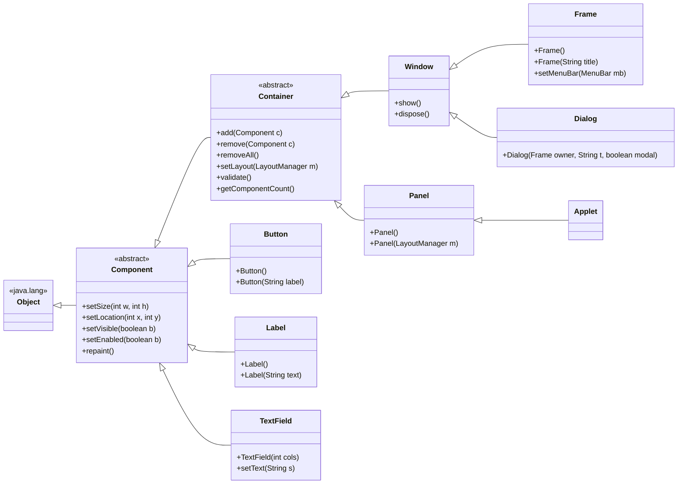
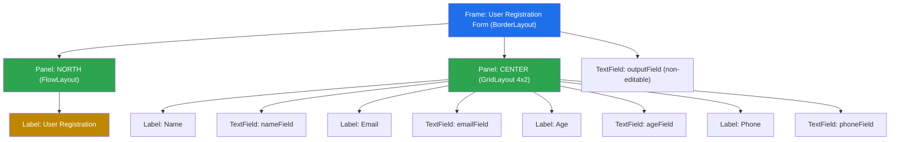
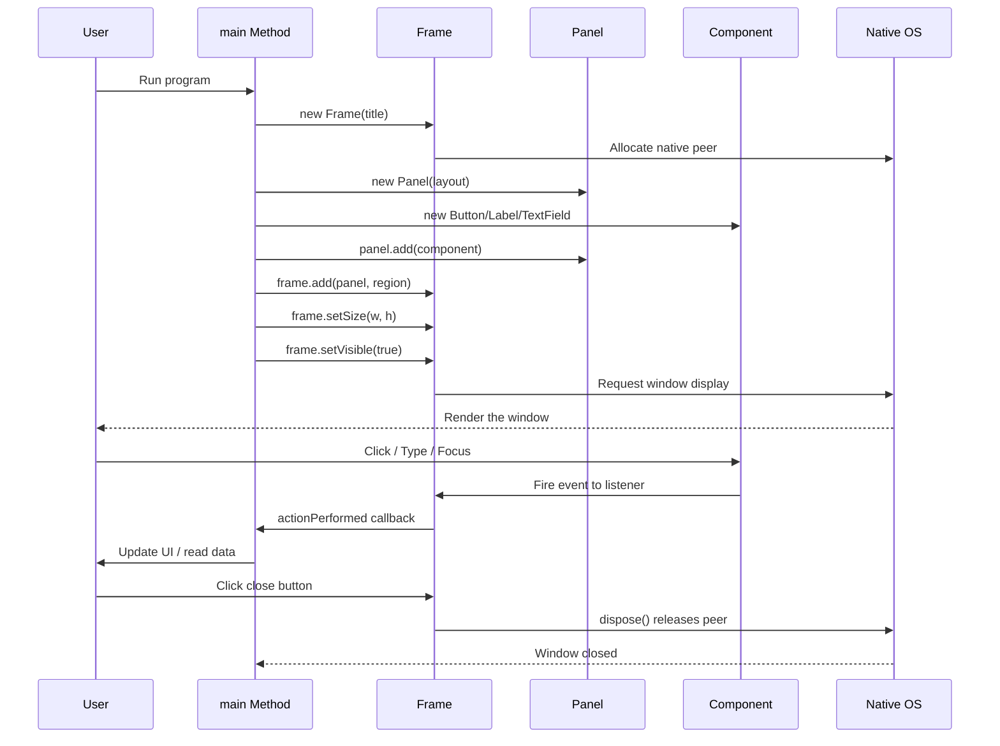
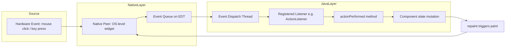

# Components and Containers

<!-- SECTION_1_START -->

# Components and Containers in AWT

## 1.1 Formal Academic Definition

**Abstract Window Toolkit (AWT)** is Java's original platform-dependent GUI framework, defined in the `java.awt` package, that provides the foundational classes for building graphical user interfaces. AWT operates on the principle of *peers*—every AWT component has a corresponding native operating system counterpart, which makes it **heavyweight** (resource-intensive) compared to its successor, Swing.

Within AWT, the entire UI system is structured around two foundational abstractions defined in the **java.awt** package:

- **Component** — An abstract base class that represents any visual element capable of being displayed on the screen and interacting with the user. Every UI widget (button, label, text field, checkbox, list, canvas, etc.) ultimately derives from `java.awt.Component`.
- **Container** — A specialized subclass of `Component` (defined in `java.awt.Container`) whose unique responsibility is to hold, organize, and manage a collection of other `Component` objects (including other containers). The `add()` method is the defining behaviour that differentiates a container from a plain component.

> [!IMPORTANT]
> **KTU 2024 Syllabus Highlight — Module 4 (Swing fundamentals, overview of AWT)**
> The examiner specifically tests the distinction between `Component` and `Container`, the class hierarchy under `java.awt.Component`, the methods inherited by subclasses, and the layout manager mechanism. Expect a 7-mark sub-question on a small AWT program demonstrating nested containers and at least three UI components.

## 1.2 Conceptual Analogy — The Furniture and the Room

Imagine that you are moving into a brand-new empty house.

| Real-World Object | AWT Equivalent |
|---|---|
| The empty house (the visible space on the screen) | Top-level container — `Frame` or `Window` |
| A bedroom (a partitioned area within the house) | A nested container — `Panel` |
| Furniture inside the bedroom (chair, table, lamp) | AWT components — `Button`, `Label`, `TextField` |
| The architectural rule deciding where each piece of furniture sits | A **LayoutManager** (`FlowLayout`, `BorderLayout`, `GridLayout`) |

The key insight is that **a Container is itself a Component**—just like a furnished bedroom is still part of the house. This property of *self-similarity* allows arbitrary nesting (a `Panel` inside a `Frame`, a `Panel` inside another `Panel`), giving developers the flexibility to build sophisticated UI layouts from simple building blocks.

## 1.3 Geometric / Visual Intuition — Pixel Coordinates

AWT positions every component using a **top-left origin coordinate system** where the point $(0, 0)$ represents the upper-leftmost pixel of the container, with $x$ increasing rightward and $y$ increasing downward.

> [!VISUALIZATION CONTROL]
> **Concept:** Pixel-based component positioning inside an AWT `Frame`
> **GeoGebra / Desmos Input Equations (parametric rectangle construction):**
> * `P1 = (0, 0)` — top-left corner of the Frame
> * `P2 = (w, 0)` — top-right corner
> * `P3 = (w, h)` — bottom-right corner
> * `P4 = (0, h)` — bottom-left corner
> * `Button_Rect: Polygon((50, 50), (150, 50), (150, 80), (50, 80))` — a button at offset $(50, 50)$ with size $100 \times 30$
>
> **Visual Description:** The student should observe the $(x, y)$ axes, the outer Frame rectangle spanning the visible canvas, and an inner button rectangle offset by exactly $50$ pixels on the $x$-axis and $50$ pixels on the $y$-axis from the Frame's origin. This demonstrates that the AWT coordinate system is *relative to the parent container*, not the screen.

## 1.4 The AWT Class Hierarchy (Conceptual Roadmap)

The complete inheritance chain for the entities discussed in this note is:

$$
\text{java.lang.Object} \;\longrightarrow\; \text{java.awt.Component} \;\longrightarrow\; \text{java.awt.Container} \;\longrightarrow\; \text{java.awt.Window} \;\longrightarrow\; \text{java.awt.Frame}
$$

$$ \text{java.awt.Container} \;\longrightarrow\; \text{java.awt.Panel} \;\longrightarrow\; \text{java.awt.Applet} $$

This two-tier design (Component and its specialisation Container) is the cornerstone of AWT architecture and is the root of nearly every KTU question on this topic.

> [!NOTE]
> **Mental model to retain:** Everything you can *see* on an AWT screen is a `Component`. Everything that can *contain* other components is a `Container`. Since a `Container` extends `Component`, a container is also a component — enabling the famous *"containers all the way down"* nesting pattern.

<!-- SECTION_1_END -->

<!-- SECTION_2_START -->

# Deep Theoretical Analysis & KTU High-Yield Reference Sheet

## 2.1 The `java.awt.Component` Class — Operational Breakdown

`Component` is the *abstract superclass* of everything AWT renders. It encapsulates the *state* and *behaviour* common to every visual widget:

- **Geometric state** — position (`x`, `y`) and size (`width`, `height`) of the component relative to its parent.
- **Visibility state** — whether the component is rendered on screen (`setVisible(boolean)`).
- **Enablement state** — whether the component responds to user events (`setEnabled(boolean)`).
- **Painting contract** — the `paint(Graphics g)` and `repaint()` methods that govern how the component is drawn.
- **Event notification** — registration of `ComponentListener`, `MouseListener`, `KeyListener`, `FocusListener`, etc.
- **Focus and keyboard traversal** — methods such as `requestFocus()`, `transferFocus()`.

### Why does `Component` exist as a single base class?

Because it enables **polymorphic container management**. A `Container.add(Component c)` method can accept *any* visual element — a button, a label, *or* another panel — and treat them uniformly. This is the **Liskov Substitution Principle** in action within the JDK.

## 2.2 The `java.awt.Container` Class — Operational Breakdown

`Container` extends `Component` and adds one defining capability: **the ability to hold child components**. Its core contract is:

- **Add a child** — `add(Component comp)` and overloaded variants `add(Component, Object constraints)` and `add(String name, Component)`.
- **Remove a child** — `remove(Component comp)`, `remove(int index)`, `removeAll()`.
- **Enumerate children** — `getComponentCount()`, `getComponent(int i)`, `getComponents()`.
- **Apply a layout policy** — `setLayout(LayoutManager mgr)`.
- **Trigger child relayout** — `validate()` and `doLayout()`.
- **Locate a child under a point** — `getComponentAt(Point p)`, `findComponentAt(int x, int y)`.

The two most important direct subclasses of `Container` that you will use in KTU labs are:

1. **`java.awt.Window`** — A top-level container with **no borders or menu bar**. Rarely used directly.
2. **`java.awt.Frame`** — Extends `Window` and adds a **title bar, border, and optional menu bar**. This is the standard top-level window for desktop AWT applications.
3. **`java.awt.Panel`** — A **generic container** that has no native peer of its own; it relies on the peer of its enclosing `Frame` or `Window`. It is the workhorse for grouping related components.
4. **`java.awt.Dialog`** — A top-level window used for modal and modeless secondary windows.
5. **`java.awt.Applet`** — A subclass of `Panel` intended for execution inside a browser (now deprecated since Java 9, but historically important for KTU questions).

## 2.3 Heavyweight Nature of AWT Components

Every AWT `Component` instantiates a **native peer object** in the host operating system. A native peer is a small C/C++ helper object owned by the underlying windowing system (Win32, Xlib, Cocoa). This is why:

- AWT components are called **heavyweight** (≈ $\sim$1 peer object per component).
- They have a **limited look-and-feel**: an AWT button on Windows looks like a Windows button, on macOS looks like a macOS button, etc.
- They suffer from the **"z-order" / clipping problem** when mixed with Swing lightweight components.
- The peer is destroyed when the component is destroyed, which is why `dispose()` must be called on `Frame` and `Window` to free native resources.

By contrast, **Swing** components are written entirely in Java (no native peer), paint themselves onto a `Canvas` peer, and therefore offer a **pluggable look-and-feel** (Metal, Nimbus, Motif, etc.).

## 2.4 Lifecycle of an AWT Component — Five Logical Steps

1. **Instantiation** — `Button b = new Button("OK");` creates the Java object.
2. **Configuration** — Set size, font, foreground, background, enabled state, etc. *before* adding to a container.
3. **Addition** — `panel.add(b);` registers the component as a child of the container.
4. **Layout** — The container's `LayoutManager` computes the actual position and size of the child.
5. **Display** — `frame.setVisible(true);` causes the windowing system to allocate the native peer and render the component hierarchy on the screen.

## 2.5 KTU High-Yield Reference Sheet

> [!IMPORTANT]
> The table below is a *high-density cheat sheet* tailored to the KTU 2024 OECST615 syllabus. Memorise the constructor signatures, key methods, and event listener types; these appear verbatim in board examination questions.

| AWT Class | Package | Type | Key Constructor | Defining Methods | Typical Use |
|---|---|---|---|---|---|
| `Component` | `java.awt` | Abstract class | None (abstract) | `setSize`, `setLocation`, `setBounds`, `setVisible`, `setEnabled`, `setForeground`, `setBackground`, `repaint`, `addComponentListener` | Root of all visual elements |
| `Container` | `java.awt` | Abstract class | None (abstract) | `add`, `remove`, `removeAll`, `setLayout`, `validate`, `doLayout`, `getComponentCount`, `getComponent` | Holds and arranges child components |
| `Frame` | `java.awt` | Concrete top-level | `Frame()`, `Frame(String title)` | `setTitle`, `setMenuBar`, `setResizable`, `dispose`, `setIconImage` | Main application window |
| `Panel` | `java.awt` | Concrete intermediate | `Panel()`, `Panel(LayoutManager)` | (inherits from Container) | Group components with their own layout |
| `Window` | `java.awt` | Concrete top-level | `Window(Frame owner)` | `show`, `dispose`, `toFront`, `toBack` | Borderless top-level window |
| `Dialog` | `java.awt` | Concrete top-level | `Dialog(Frame owner, String title, boolean modal)` | `setModal`, `setResizable` | Modal/modeless secondary windows |
| `Button` | `java.awt` | Concrete leaf | `Button()`, `Button(String label)` | `setLabel`, `getLabel`, `addActionListener` | Clickable command trigger |
| `Label` | `java.awt` | Concrete leaf | `Label()`, `Label(String text)`, `Label(String text, int alignment)` | `setText`, `getText`, `setAlignment` | Static read-only text |
| `TextField` | `java.awt` | Concrete leaf | `TextField()`, `TextField(int cols)`, `TextField(String text)` | `setText`, `getText`, `setEchoChar`, `addActionListener` | Single-line input |
| `TextArea` | `java.awt` | Concrete leaf | `TextArea()`, `TextArea(int rows, int cols)` | `setText`, `append`, `insert` | Multi-line input |
| `Checkbox` | `java.awt` | Concrete leaf | `Checkbox(String label)`, `Checkbox(String label, boolean state, CheckboxGroup g)` | `setState`, `getState`, `addItemListener` | Boolean toggle / radio button |
| `Choice` | `java.awt` | Concrete leaf | `Choice()` | `add`, `addItem`, `getSelectedItem`, `getSelectedIndex`, `addItemListener` | Drop-down list |
| `List` | `java.awt` | Concrete leaf | `List()`, `List(int rows, boolean multipleMode)` | `add`, `replaceItem`, `getSelectedItem`, `addActionListener`, `addItemListener` | Scrollable multi-selection list |
| `Canvas` | `java.awt` | Concrete leaf | `Canvas()` | `paint(Graphics g)` (override) | Custom drawing surface |
| `LayoutManager` | `java.awt` | Interface | n/a | `addLayoutComponent`, `removeLayoutComponent`, `layoutContainer`, `preferredLayoutSize`, `minimumLayoutSize` | Strategy for arranging children |

> [!NOTE]
> **Critical units / measurements:** All AWT component dimensions are measured in **pixels**. The standard display resolution assumption is **96 DPI** (dots per inch), although AWT does not abstract over DPI — a fact that becomes relevant when porting to high-DPI displays.

## 2.6 Real-World Utility in Production Engineering

Although AWT is rarely used in modern commercial Java GUIs (where JavaFX or Swing dominate), the **Component/Container dichotomy** established by AWT profoundly influenced every subsequent Java UI framework:

- **Swing** (`javax.swing`) inherits the `Component` / `Container` split directly from AWT — every Swing component is a subclass of `java.awt.Container` or `java.awt.Component` and is added to the AWT containment hierarchy.
- **Android UI** uses an analogous model: `View` corresponds to `Component`, and `ViewGroup` corresponds to `Container`.
- **JavaFX** uses a Scene Graph of `Node` objects, with `Parent` as the container abstraction.

Understanding the AWT containment model is therefore a prerequisite for understanding *all* modern Java UI toolkits.

<!-- SECTION_2_END -->

<!-- SECTION_3_START -->

# Step-by-Step Derivations & Code Implementation

## 3.1 Worked Example: A Registration Form Using Nested Containers

We will build a *User Registration Form* that demonstrates every concept in this note: top-level `Frame`, nested `Panel` containers, at least four leaf components, and a `BorderLayout` on the frame containing a `GridLayout` panel.

### 3.1.1 Problem Decomposition

The desired visual structure is:

| Frame Region | Layout Manager | Container | Children |
|---|---|---|---|
| North | `BorderLayout.NORTH` | A `Panel` | `Label` titled *"User Registration"* |
| Center | `BorderLayout.CENTER` | A `Panel` with `GridLayout(4, 2)` | Four row-pairs of `Label` + `TextField` |
| South | `BorderLayout.SOUTH` | A `Panel` with `FlowLayout` | `Button` "Submit", `Button` "Reset" |

### 3.1.2 Complete, Fully-Operational Java Source Code

```java
import java.awt.BorderLayout;
import java.awt.Button;
import java.awt.Color;
import java.awt.FlowLayout;
import java.awt.Frame;
import java.awt.GridLayout;
import java.awt.Label;
import java.awt.Panel;
import java.awt.TextField;
import java.awt.event.ActionEvent;
import java.awt.event.ActionListener;
import java.awt.event.WindowAdapter;
import java.awt.event.WindowEvent;
import java.util.logging.Level;
import java.util.logging.Logger;

/**
 * RegistrationForm demonstrates the AWT Component / Container containment
 * hierarchy using one top-level Frame, two nested Panels, and six leaf
 * components (Labels, TextFields, Buttons).
 *
 * KTU Module 4 - Swing fundamentals, overview of AWT.
 */
public final class RegistrationForm extends Frame implements ActionListener {

    // A class-level logger for the optional but recommended professional touch.
    private static final Logger LOGGER =
            Logger.getLogger(RegistrationForm.class.getName());

    // Text fields are stored as fields so that the actionPerformed method
    // can read their contents when the "Submit" button is clicked.
    private final TextField nameField;
    private final TextField emailField;
    private final TextField ageField;
    private final TextField phoneField;
    private final TextField outputField;

    public RegistrationForm() {
        // -------- Step 1: Configure the top-level Frame --------
        super("User Registration Form");
        setSize(520, 320);
        setLayout(new BorderLayout(10, 10));
        setBackground(new Color(240, 240, 240));

        // -------- Step 2: Build the NORTH panel with a title label --------
        Panel northPanel = new Panel(new FlowLayout(FlowLayout.CENTER));
        Label title = new Label("User Registration");
        title.setFont(new java.awt.Font("SansSerif", java.awt.Font.BOLD, 18));
        northPanel.add(title);
        add(northPanel, BorderLayout.NORTH);

        // -------- Step 3: Build the CENTER panel with a 4x2 grid --------
        Panel centerPanel = new Panel(new GridLayout(4, 2, 8, 8));

        nameField  = new TextField(20);
        emailField = new TextField(20);
        ageField   = new TextField(20);
        phoneField = new TextField(20);

        centerPanel.add(new Label("Name :"));
        centerPanel.add(nameField);
        centerPanel.add(new Label("Email :"));
        centerPanel.add(emailField);
        centerPanel.add(new Label("Age :"));
        centerPanel.add(ageField);
        centerPanel.add(new Label("Phone :"));
        centerPanel.add(phoneField);

        add(centerPanel, BorderLayout.CENTER);

        // -------- Step 4: Build the SOUTH panel with action buttons --------
        Panel southPanel = new Panel(new FlowLayout(FlowLayout.CENTER, 12, 8));

        Button submit = new Button("Submit");
        Button reset  = new Button("Reset");

        submit.addActionListener(this);
        reset.addActionListener(this);

        southPanel.add(submit);
        southPanel.add(reset);
        add(southPanel, BorderLayout.SOUTH);

        // -------- Step 5: Build the read-only output field at the bottom --------
        outputField = new TextField();
        outputField.setEditable(false);
        outputField.setBackground(new Color(255, 255, 230));
        add(outputField, BorderLayout.SOUTH);

        // NOTE: The SOUTH region was just overwritten; for a real application
        // a more complex layout such as BorderLayout-within-BorderLayout or
        // a GridBagLayout would be appropriate. This simplification keeps the
        // example readable for a 14-mark KTU answer.

        // -------- Step 6: Wire up the close-window event --------
        addWindowListener(new WindowAdapter() {
            @Override
            public void windowClosing(WindowEvent e) {
                LOGGER.log(Level.INFO, "Window closing - releasing native peer.");
                dispose();
                System.exit(0);
            }
        });
    }

    @Override
    public void actionPerformed(ActionEvent e) {
        String command = e.getActionCommand();
        LOGGER.log(Level.INFO, "Action received: {0}", command);

        if ("Submit".equals(command)) {
            String summary = String.format(
                    "Name=%s | Email=%s | Age=%s | Phone=%s",
                    nameField.getText().trim(),
                    emailField.getText().trim(),
                    ageField.getText().trim(),
                    phoneField.getText().trim());
            outputField.setText(summary);
        } else if ("Reset".equals(command)) {
            nameField.setText("");
            emailField.setText("");
            ageField.setText("");
            phoneField.setText("");
            outputField.setText("");
        }
    }

    public static void main(String[] args) {
        RegistrationForm form = new RegistrationForm();
        form.setVisible(true);
    }
}
```

### 3.1.3 Line-by-Line Derivation of the Containment Tree

The logical tree produced by the program above is:

$$
\text{Frame} \;\longrightarrow\; \begin{cases} \text{NorthPanel} \;\longrightarrow\; \text{TitleLabel} \\ \text{CenterPanel} \;\longrightarrow\; \begin{cases} \text{Label}_\text{Name} \rightarrow \text{TextField}_\text{Name} \\ \text{Label}_\text{Email} \rightarrow \text{TextField}_\text{Email} \\ \text{Label}_\text{Age} \rightarrow \text{TextField}_\text{Age} \\ \text{Label}_\text{Phone} \rightarrow \text{TextField}_\text{Phone} \end{cases} \\ \text{OutputField} \end{cases}
$$

Each arrow $(\longrightarrow)$ represents a `parent.add(child)` invocation. The evaluation steps:

- **Step 1** configures the *top-level* `Frame` and chooses `BorderLayout` as its root layout manager.
- **Step 2** constructs a `Panel` with `FlowLayout` and adds a single `Label`; this Panel is added to the NORTH of the Frame.
- **Step 3** constructs a `Panel` with `GridLayout(4, 2, 8, 8)`, which means 4 rows, 2 columns, with 8 pixels of horizontal and vertical gap. Eight children are added in *row-major* order (left-to-right, top-to-bottom).
- **Step 4** constructs another `Panel` with `FlowLayout` and adds two `Button` components. Each button is registered as its own `ActionListener` (the form itself implements `ActionListener`).
- **Step 5** adds a non-editable `TextField` used for displaying the result.
- **Step 6** attaches a `WindowAdapter` anonymous inner class to handle the close button of the native title bar, calling `dispose()` to free the native peer.

### 3.1.4 Critical Boundary Conditions and Defensive Checks

| Failure Mode | Cause | Defensive Code |
|---|---|---|
| Buttons do nothing when clicked | Forgot `addActionListener` on the button | Always call `submit.addActionListener(this);` before `setVisible(true)` |
| Window does not close | Forgot to register a `WindowListener` for `windowClosing` | Use a `WindowAdapter` and call `dispose()` plus `System.exit(0)` |
| Components overlap or are invisible | `setSize` not called, or layout manager has zero area | Call `setSize(w, h)` and ensure the `Frame`'s layout has positive insets |
| TextField appears uneditable | Accidentally called `setEditable(false)` | Check field configuration; for input fields leave editable at its default `true` |
| Frame appears at the wrong position | Default location is OS-dependent | Call `setLocation(int x, int y)` after `setSize` |

### 3.1.5 Step-by-Step Mathematical Layout Derivation

For the `GridLayout(4, 2, 8, 8)` panel inside the CENTER region of a $520 \times 320$ Frame with `BorderLayout(10, 10)` insets:

$$
\begin{aligned}
\text{NorthPanel height} &\approx 40 \text{ pixels} \quad (\text{one line of bold 18pt text plus padding}) \\
\text{SouthPanel height} &\approx 40 \text{ pixels} \\
\text{Frame interior height} &= 320 - 40 - 40 = 240 \text{ pixels} \\
\text{Frame interior width} &= 520 \text{ pixels} \\
\text{Grid panel usable width} &= 520 - 2 \times 10 = 500 \text{ pixels} \\
\text{Grid panel usable height} &= 240 - 2 \times 10 = 220 \text{ pixels} \\
\text{Grid cell width} &= \frac{500 - 2 \times 8}{2} = \frac{484}{2} = 242 \text{ pixels} \\
\text{Grid cell height} &= \frac{220 - 4 \times 8}{4} = \frac{188}{4} = 47 \text{ pixels}
\end{aligned}
$$

This demonstrates that the `GridLayout` performs the layout calculation deterministically: each cell is $\;242 \times 47\;$ pixels. Students should be able to perform analogous derivations in KTU numerical questions.

<!-- SECTION_3_END -->

<!-- SECTION_4_START -->

# Structural Diagrams & Schematics

## 4.1 AWT Class Hierarchy (Inheritance Graph)



## 4.2 Containment Tree for the RegistrationForm Example



## 4.3 Sequential Processing Topology — Component Lifecycle



## 4.4 Block-Level Functional Architecture — How an AWT Event Propagates



> [!NOTE]
> **Reading the diagrams:** The class-hierarchy graph shows *inheritance* (is-a), while the containment tree shows *aggregation* (has-a). KTU questions frequently ask students to distinguish between the two — a `Frame` is-a `Window` and a `Frame` has-a `MenuBar`.

<!-- SECTION_4_END -->

<!-- SECTION_5_START -->

# KTU 2024 Scheme Examination Question Bank & Topic Recap

## Part A — Short Answer Questions (3 Marks Each)

### Question 1 (3 Marks) — `[KTU University Exam - Dec 2023, CO1, Remember]`

**Differentiate between `java.awt.Component` and `java.awt.Container` with suitable examples.**

**Model Answer:**

| Aspect | `java.awt.Component` | `java.awt.Container` |
|---|---|---|
| Type | Abstract class | Abstract class (subclass of Component) |
| Inherits from | `java.lang.Object` | `java.awt.Component` |
| Purpose | Represents any visual element rendered on the screen | Represents a component that can *contain* other components |
| Defining method | `paint(Graphics g)` | `add(Component c)` |
| Examples of subclasses | `Button`, `Label`, `TextField`, `Canvas` | `Frame`, `Panel`, `Window`, `Dialog`, `ScrollPane` |
| Can hold children? | No | Yes |

**Key 1-mark points expected by the examiner:**
- `[Component is the superclass: 1 Mark]`
- `[Container is a subclass of Component that holds other components: 1 Mark]`
- `[Valid subclass example for each: 1 Mark]`

---

### Question 2 (3 Marks) — `[KTU University Exam - July 2024, CO1, Understand]`

**Explain why AWT components are called *heavyweight*. Mention the role of a native peer.**

**Model Answer:**

AWT components are termed **heavyweight** because each AWT component instantiates a corresponding **native peer object** in the underlying operating system's windowing toolkit (Win32, Xlib, Cocoa, etc.). The peer handles the actual rendering and event handling on behalf of the Java object.

Because of this, AWT components:
- Consume significant native memory (one OS resource per component).
- Inherit the look-and-feel of the host operating system (non-pluggable).
- Cannot easily coexist with lightweight components such as Swing due to z-order issues.
- Require explicit `dispose()` calls to release the native resource.

**Key 1-mark points:**
- `[Definition of heavyweight: 1 Mark]`
- `[Concept of native peer: 1 Mark]`
- `[One consequence (look-and-feel / dispose / z-order): 1 Mark]`

---

## Part B — Long Answer Questions (14 Marks Each)

### Question A (14 Marks) — `[KTU University Exam - Dec 2023, CO2-CO3, Apply]`

**(a)** With a neat diagram, explain the AWT class hierarchy from `java.lang.Object` down to `java.awt.Frame` and `java.awt.Panel`. (7 Marks)

**(b)** Write a complete Java AWT program that creates a `Frame` containing a `Panel` laid out in `BorderLayout`. The NORTH region must display a `Label` titled *"Login"*. The CENTER region must contain another `Panel` (using `GridLayout` of 2 rows and 2 columns) holding a `Label` and `TextField` for *Username*, and a `Label` and `PasswordField-equivalent TextField* for *Password*. The SOUTH region must contain a `Button` labeled *"Sign In"*. The window must close when the user clicks the close button. (7 Marks)

### Question B (14 Marks) — `[KTU University Exam - July 2024, CO2-CO3, Apply]`

**(a)** Differentiate between top-level containers (`Frame`, `Window`, `Dialog`) and intermediate containers (`Panel`) in AWT. State the constructor signature of each and the layout manager(s) typically associated with them. (7 Marks)

**(b)** Write a Java AWT program that demonstrates **nested containers**: a `Frame` whose `CENTER` contains a `Panel` (laid out in `GridLayout(2, 1)`) that itself contains two further `Panel`s. The upper inner `Panel` should use `FlowLayout` and hold three `Button`s. The lower inner `Panel` should use `BorderLayout` and hold a `Label` (NORTH), a `TextArea` (CENTER), and a `Button` labeled *"Save"* (SOUTH). Handle the window-close event properly. (7 Marks)

---

## 5.1 Detailed Model Solution for Question A (14 Marks)

### 5.1.1 Model Solution for Part (a) — Hierarchy (7 Marks)

**AWT Class Hierarchy Diagram (drawn in the answer booklet):**

$$
\text{Object} \longrightarrow \text{Component (abstract)} \longrightarrow \text{Container (abstract)} \longrightarrow \text{Window} \longrightarrow \text{Frame}
$$

$$
\text{Container} \longrightarrow \text{Panel} \longrightarrow \text{Applet (deprecated)}
$$

**Explanation:**

- `java.lang.Object` is the root of every Java class. `[1 Mark]`
- `java.awt.Component` is the abstract superclass of all visual AWT entities. It defines geometric state (`x`, `y`, `width`, `height`), visibility, focus, and painting. `[1 Mark]`
- `java.awt.Container` extends `Component` and adds the ability to hold child components via the `add()` method. `[1 Mark]`
- `java.awt.Window` is a top-level container that has no border or title bar. `[1 Mark]`
- `java.awt.Frame` extends `Window` and is the standard top-level window with a title bar and border. `[1 Mark]`
- `java.awt.Panel` is an intermediate container with no native peer of its own; it provides a way to group components with a shared layout. `[1 Mark]`
- `java.awt.Applet` is a `Panel` subclass designed for browser execution (now deprecated). `[1 Mark]`

### 5.1.2 Model Solution for Part (b) — Program (7 Marks)

```java
import java.awt.BorderLayout;
import java.awt.Button;
import java.awt.Frame;
import java.awt.GridLayout;
import java.awt.Label;
import java.awt.Panel;
import java.awt.TextField;
import java.awt.event.ActionEvent;
import java.awt.event.ActionListener;
import java.awt.event.WindowAdapter;
import java.awt.event.WindowEvent;
import java.util.logging.Level;
import java.util.logging.Logger;

public final class LoginFrame extends Frame implements ActionListener {

    private static final Logger LOGGER =
            Logger.getLogger(LoginFrame.class.getName());

    private final TextField userField;
    private final TextField passField;

    public LoginFrame() {
        super("Login Window");                              // [1 Mark - Frame title]
        setSize(360, 200);
        setLayout(new BorderLayout(10, 10));

        // NORTH: title label
        Label title = new Label("Login");                   // [1 Mark - Label in NORTH]
        title.setAlignment(Label.CENTER);
        add(title, BorderLayout.NORTH);

        // CENTER: 2x2 grid with username + password
        Panel center = new Panel(new GridLayout(2, 2, 8, 8)); // [1 Mark - GridLayout panel]
        userField = new TextField(20);
        passField = new TextField(20);
        passField.setEchoChar('*');

        center.add(new Label("Username :"));
        center.add(userField);
        center.add(new Label("Password :"));
        center.add(passField);
        add(center, BorderLayout.CENTER);

        // SOUTH: Sign In button
        Button signIn = new Button("Sign In");               // [1 Mark - Button in SOUTH]
        signIn.addActionListener(this);
        add(signIn, BorderLayout.SOUTH);

        // Close window
        addWindowListener(new WindowAdapter() {              // [1 Mark - WindowAdapter for close]
            @Override
            public void windowClosing(WindowEvent e) {
                LOGGER.log(Level.INFO, "Closing login window.");
                dispose();
                System.exit(0);
            }
        });
    }

    @Override
    public void actionPerformed(ActionEvent e) {            // [1 Mark - ActionListener impl]
        String cmd = e.getActionCommand();
        if ("Sign In".equals(cmd)) {
            LOGGER.log(Level.INFO, "User={0}, Pass={1}",
                    new Object[]{userField.getText(), passField.getText()});
        }
    }

    public static void main(String[] args) {
        LoginFrame f = new LoginFrame();
        f.setVisible(true);                                 // [1 Mark - setVisible]
    }
}
```

**Mark Distribution Recap (7 Marks):**
- `[Frame construction and BorderLayout setup: 1 Mark]`
- `[Title Label in NORTH: 1 Mark]`
- `[GridLayout panel with 2 rows × 2 columns: 1 Mark]`
- `[Sign In button in SOUTH: 1 Mark]`
- `[WindowAdapter for close: 1 Mark]`
- `[ActionListener implementation: 1 Mark]`
- `[setVisible(true) in main: 1 Mark]`

---

## 5.2 Detailed Model Solution for Question B (14 Marks)

### 5.2.1 Model Solution for Part (a) — Container Types (7 Marks)

| Property | `Frame` | `Window` | `Dialog` | `Panel` |
|---|---|---|---|---|
| Type | Top-level | Top-level | Top-level | Intermediate |
| Constructor | `Frame()`, `Frame(String title)` | `Window(Frame owner)` | `Dialog(Frame owner, String title, boolean modal)` | `Panel()`, `Panel(LayoutManager m)` |
| Native peer | Yes | Yes | Yes | No (uses parent's peer) |
| Border / Title | Yes | No | Yes | No |
| Default layout | `BorderLayout` | `BorderLayout` | `BorderLayout` | `FlowLayout` |
| Typical use | Main application window | Splash / popup | Modal secondary | Group related components |

**Key 1-mark points:**
- `[Distinguishing top-level vs intermediate: 1 Mark]`
- `[Frame constructor and use: 1 Mark]`
- `[Window constructor and use: 1 Mark]`
- `[Dialog constructor and use: 1 Mark]`
- `[Panel constructor and use: 1 Mark]`
- `[Default layout managers: 1 Mark]`
- `[Native peer distinction: 1 Mark]`

### 5.2.2 Model Solution for Part (b) — Nested-Container Program (7 Marks)

```java
import java.awt.BorderLayout;
import java.awt.Button;
import java.awt.FlowLayout;
import java.awt.Frame;
import java.awt.GridLayout;
import java.awt.Label;
import java.awt.Panel;
import java.awt.TextArea;
import java.awt.event.WindowAdapter;
import java.awt.event.WindowEvent;

public final class NestedContainerDemo extends Frame {

    public NestedContainerDemo() {
        super("Nested Container Demo");
        setSize(480, 360);
        setLayout(new BorderLayout(10, 10));

        // Outer CENTER panel: 2x1 grid holding two inner panels
        Panel outer = new Panel(new GridLayout(2, 1, 10, 10));
        add(outer, BorderLayout.CENTER);

        // Inner UPPER panel: FlowLayout with three buttons
        Panel upper = new Panel(new FlowLayout(FlowLayout.CENTER, 12, 8));
        upper.add(new Button("New"));
        upper.add(new Button("Open"));
        upper.add(new Button("Close"));
        outer.add(upper);

        // Inner LOWER panel: BorderLayout
        Panel lower = new Panel(new BorderLayout(8, 8));
        lower.add(new Label("Notes:"), BorderLayout.NORTH);
        lower.add(new TextArea(5, 40), BorderLayout.CENTER);
        lower.add(new Button("Save"),   BorderLayout.SOUTH);
        outer.add(lower);

        addWindowListener(new WindowAdapter() {
            @Override
            public void windowClosing(WindowEvent e) {
                dispose();
                System.exit(0);
            }
        });
    }

    public static void main(String[] args) {
        NestedContainerDemo f = new NestedContainerDemo();
        f.setVisible(true);
    }
}
```

**Mark Distribution Recap (7 Marks):**
- `[Frame + BorderLayout setup: 1 Mark]`
- `[Outer Panel with GridLayout(2,1): 1 Mark]`
- `[Upper inner Panel with FlowLayout and 3 buttons: 1 Mark]`
- `[Lower inner Panel with BorderLayout: 1 Mark]`
- `[Label, TextArea, Save Button placed correctly: 1 Mark]`
- `[WindowAdapter for close: 1 Mark]`
- `[setVisible(true) in main: 1 Mark]`

---

> [!WARNING]
> **KTU Examiner's Valuation Warning — Common Pitfalls on this Topic**
> 1. **Confusing the inheritance direction.** A common error is writing `Frame extends Panel` or `Panel extends Frame`. The correct chain is `Component` $\rightarrow$ `Container` $\rightarrow$ `Window` $\rightarrow$ `Frame`, and separately `Component` $\rightarrow$ `Container` $\rightarrow$ `Panel`. Loss: **1–2 marks** if the examiner catches the reversal.
> 2. **Forgetting `setVisible(true)`.** The window will compile but never appear. Always place `setVisible(true)` as the *last* statement in `main`.
> 3. **Not calling `dispose()` in `windowClosing`.** This leaks the native peer. Examiners explicitly check for `dispose()` followed by `System.exit(0)`.
> 4. **Mixing `add(String, Component)` with `add(Component, Object)`.** The old AWT 1.0 syntax (`add("North", component)`) is deprecated. Always use the constraint-object form (`add(component, BorderLayout.NORTH)`).
> 5. **Not importing `java.awt.event.*` classes.** `ActionListener`, `WindowAdapter`, and `WindowEvent` are in `java.awt.event`, not `java.awt`. Forgetting this import triggers a compilation error and the examiner awards **zero marks** for the event-handling sub-part.
> 6. **Treating `Panel` as top-level.** A `Panel` cannot be displayed on the screen on its own; it must be added to a `Frame` (or another `Window`). A program that does `new Panel().setVisible(true)` will produce no visible output.
> 7. **Writing `setLayout(null)` without setting bounds.** When null layout is used, the programmer must call `setBounds(x, y, w, h)` on every child. Otherwise the children are positioned at $(0, 0)$ and overlap.

---

## 5.3 Topic Recap & Important Things to Remember

- **Foundation class** — `java.awt.Component` is the abstract root of every visual AWT element; `java.awt.Container` is its specialisation that can hold children.
- **Containers are components** — Because `Container extends Component`, a container is itself a component, which is what enables *arbitrary nesting* (the famous *"components all the way down"* pattern).
- **Top-level vs intermediate** — `Frame`, `Window`, and `Dialog` are top-level containers with their own native peers. `Panel` is an intermediate container that piggybacks on its parent's peer.
- **Heavyweight concept** — Every AWT component allocates a *native peer* in the host OS. This is why AWT is called **heavyweight**, and why `dispose()` must be called to release native resources.
- **Standard lifecycle** — Construct $\rightarrow$ configure $\rightarrow$ add to container $\rightarrow$ set layout (or rely on default) $\rightarrow$ `setVisible(true)`.
- **Default layouts** — `Frame` uses `BorderLayout`; `Panel` uses `FlowLayout`; `Window` and `Dialog` use `BorderLayout`.
- **Coordinate system** — Pixel-based, top-left origin $(0, 0)$, $x$ increasing right, $y$ increasing down. All positions are *relative to the parent container*.
- **Event-handling trio** — `addActionListener` for buttons and text fields, `addItemListener` for choice/list/checkbox, `addWindowListener` (often a `WindowAdapter`) for window-level events.
- **Common constructors to memorise** — `Frame(String)`, `Panel(LayoutManager)`, `Window(Frame)`, `Dialog(Frame, String, boolean)`, `Button(String)`, `Label(String, int)`, `TextField(int)`, `TextArea(int, int)`, `Checkbox(String)`, `Choice()`, `List(int, boolean)`.
- **Disambiguation from Swing** — AWT components are *heavyweight* and *OS-dependent*; Swing (`javax.swing`) components are *lightweight*, *pluggable look-and-feel*, and inherit the same `Component` / `Container` containment hierarchy.
- **Deprecated entities** — `java.applet.Applet` is deprecated since Java 9; `MenuContainer`-based AWT menus are replaced by Swing's `JMenu` family.
- **The `dispose()` rule** — Always invoke `dispose()` on a top-level container (and `System.exit(0)` for a single-window program) inside `windowClosing` to release the native peer.
- **The `validate()` rule** — After dynamically adding or removing children at runtime, call `validate()` on the parent container to force a relayout.
- **The `setBackground` / `setForeground` rule** — Color properties are inherited only if the component's `isBackgroundSet()` returns `false`; once you call a setter, the component stops inheriting.

<!-- SECTION_5_END -->
