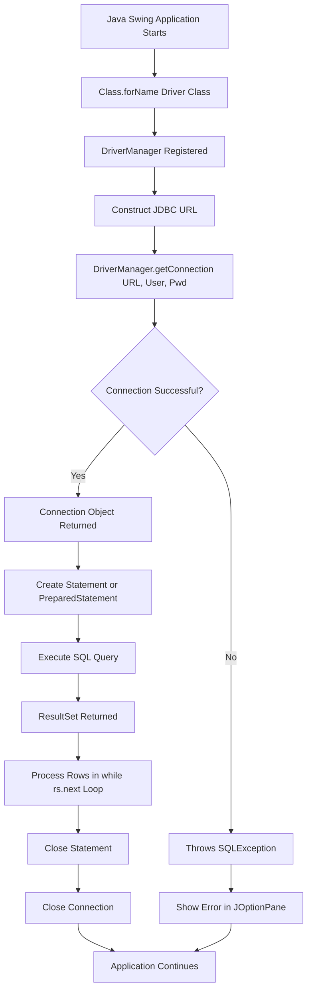
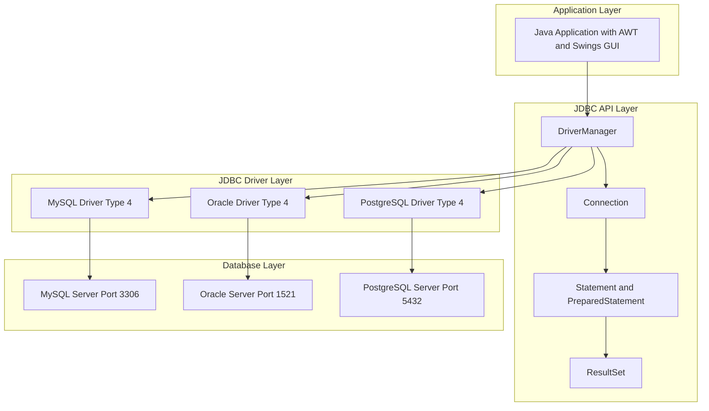
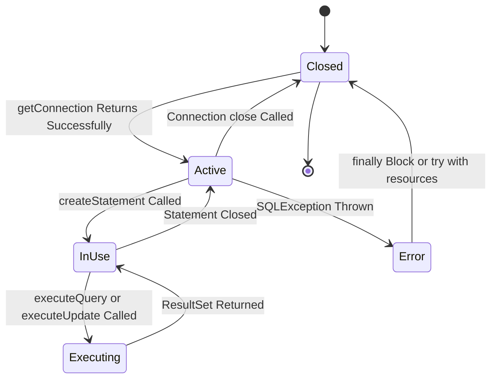

# Connection Establishment

<!-- SECTION_1_START -->
# Connection Establishment in Java (JDBC)

## 1.1 Formal Academic Definition

> [!NOTE]
> **Connection Establishment** in the context of Java AWT/Swings refers to the process of creating a communication channel between a Java application (typically a GUI built with AWT/Swings) and a relational database using **JDBC (Java Database Connectivity)**. It is an API specification that enables Java programs to execute SQL statements and interact with virtually any relational data source in a database-independent manner.

**JDBC Architecture (Type IV - Thin Driver):**
The most commonly used connection model in KTU syllabus is the **Type-4 (Native Protocol) Driver**, which converts JDBC calls directly into the database-specific protocol. The complete JDBC stack follows the pattern:
$$ \text{Java Application} \rightarrow \text{JDBC API} \rightarrow \text{JDBC Driver Manager} \rightarrow \text{JDBC Driver} \rightarrow \text{Database} $$

**Key Classes & Interfaces Involved (KTU High-Yield):**
- `java.sql.DriverManager` – The legacy central class for obtaining connections.
- `java.sql.Connection` – Represents a session/connection to a specific database.
- `java.sql.Statement` – Used to execute static SQL queries.
- `java.sql.PreparedStatement` – Used to execute pre-compiled parameterized queries.
- `java.sql.ResultSet` – Represents the result set of an executed query.
- `javax.sql.DataSource` – The modern, preferred interface (JNDI-based) for obtaining connections, especially in enterprise applications.

## 1.2 Conceptual Analogy / Intuition

> [!IMPORTANT]
> **The "Telephone Call" Analogy**
> Think of establishing a JDBC connection exactly like making a **telephone call**:
> 1. You need a **phone book** (DriverManager / DataSource) that knows how to reach the other party.
> 2. You need a **dialing number** (URL/JDBC URL like `jdbc:mysql://localhost:3306/mydb`).
> 3. You must **authenticate** yourself (provide username & password).
> 4. Once connected, you can **talk back and forth** (execute SQL queries, fetch results).
> 5. When the conversation ends, you must **hang up** (`connection.close()`) — otherwise, the line stays open and resources leak.
>
> Just as a phone switchboard routes your call, the **DriverManager** routes your `getConnection()` request to the right database driver. The **Connection object** is the active "live line" between your Swing GUI (frontend) and the database (backend).

## 1.3 Standard Metrics & Constants

- **Standard JDBC Port for MySQL**: `3306`
- **Standard JDBC Port for Oracle**: `1521`
- **Standard JDBC Port for PostgreSQL**: `5432`
- **Default driver class for MySQL Connector/J**: `com.mysql.cj.jdbc.Driver`
- **Default driver class for Oracle**: `oracle.jdbc.driver.OracleDriver`
- **Standard Timeout Values**: `connectTimeout` and `socketTimeout` in **milliseconds**

> [!VISUALIZATION CONTROL]
> **Concept:** JDBC Connection State Lifecycle Diagram
> **Conceptual Flow Points (not exact equations, but state transitions):**
> * State_1 = `DriverManager.getConnection(URL, user, pwd)` returns a `Connection` object
> * State_2 = `conn.isClosed()` returns `false` (Active state)
> * State_3 = `conn.createStatement()` or `conn.prepareStatement(sql)` returns a child object
> * State_4 = `conn.close()` releases the socket; `conn.isClosed()` returns `true`
> **Visual Description:** Imagine a horizontal timeline with three milestones — **OPEN (T=0)**, **IN-USE (T=middle)**, **CLOSED (T=end)** — with `try-with-resources` enforced boundaries.

---

<!-- SECTION_1_END -->

<!-- SECTION_2_START -->
# Deep Theoretical Analysis & KTU High-Yield Formula Sheet

## 2.1 The Six Logical Steps of Connection Establishment

The KTU board specifically tests the **canonical six-step JDBC flow**. Memorize this sequence:

1. **Load the Driver Class** (optional since JDBC 4.0, but good for clarity).
2. **Register the Driver** with `DriverManager` (auto-handled in modern JDBC).
3. **Define the Database URL** using the standard JDBC URL format.
4. **Establish the Connection** using `DriverManager.getConnection()`.
5. **Create a Statement / PreparedStatement** to carry SQL.
6. **Execute Query & Process ResultSet** (fetch data row-by-row via the iterator pointer).

> [!NOTE]
> **KTU Frequently Tested Phrasing:**
> *"Explain the steps involved in establishing a JDBC connection in a Java application."*
> Always answer in the **same order** as above, and explicitly mention the **exception classes** (`ClassNotFoundException`, `SQLException`) that may be thrown at each step.

## 2.2 Anatomy of a JDBC URL

The JDBC URL is a string that the driver uses to locate the database. The general template is:

$$ \text{jdbc}:\text{<subprotocol>}:<\text{subname}> $$

**Concrete Examples (MUST memorize for KTU lab viva & theory):**

| Database Engine | Subprotocol | Full JDBC URL Pattern |
|-----------------|-------------|------------------------|
| MySQL           | `mysql`     | `jdbc:mysql://<host>:<port>/<databaseName>` |
| Oracle (SID)    | `oracle:thin` | `jdbc:oracle:thin:@<host>:<port>:<SID>` |
| Oracle (Service) | `oracle:thin` | `jdbc:oracle:thin:@<host>:<port>/<serviceName>` |
| PostgreSQL      | `postgresql` | `jdbc:postgresql://<host>:<port>/<databaseName>` |
| MS SQL Server   | `sqlserver`  | `jdbc:sqlserver://<host>:<port>;databaseName=<db>` |
| Derby (Java DB) | `derby`      | `jdbc:derby:<databaseName>;create=true` |

> [!IMPORTANT]
> **Subname = Host + Port + Database Identifier**. Forgetting the port is the #1 reason KTU lab submissions fail with `Communications link failure`.

## 2.3 KTU High-Yield Formula / Method Cheat Sheet

| Operation | Method Signature | Returns | Throws | Notes |
|-----------|-----------------|---------|--------|-------|
| Load Driver | `Class.forName(String)` | `Class<?>` | `ClassNotFoundException` | Modern JDBC auto-loads |
| Get Connection | `DriverManager.getConnection(String url, String user, String pwd)` | `Connection` | `SQLException` | **Most tested line in KTU** |
| Get Connection (Properties) | `DriverManager.getConnection(String url, Properties info)` | `Connection` | `SQLException` | Used when passing extra flags like `useSSL` |
| Create Statement | `Connection.createStatement()` | `Statement` | `SQLException` | For static SQL |
| Create Prepared | `Connection.prepareStatement(String sql)` | `PreparedStatement` | `SQLException` | For parameterized SQL (prevents SQL injection) |
| Execute Query | `Statement.executeQuery(String sql)` | `ResultSet` | `SQLException` | For `SELECT` statements |
| Update Query | `Statement.executeUpdate(String sql)` | `int` (row count) | `SQLException` | For `INSERT/UPDATE/DELETE` |
| Next Row | `ResultSet.next()` | `boolean` | `SQLException` | Cursor movement |
| Close Resources | `Connection.close()`, `Statement.close()`, `ResultSet.close()` | `void` | `SQLException` | Always in `finally` block or `try-with-resources` |

## 2.4 Real-World Utility in Engineering & CS

- **Enterprise GUI Apps**: A Swings-based Hospital Management System uses JDBC to fetch patient records from MySQL.
- **Banking Software**: Transactional systems use `Connection.setAutoCommit(false)` + manual `commit()`/`rollback()` to enforce **ACID** properties.
- **Web & Desktop Hybrid Apps**: Java applets and standalone JARs use `DataSource` (via JNDI) for pooled connections in app servers like **Apache Tomcat** or **WildFly**.
- **Data Science & ETL Tools**: Tools like **DBeaver** and **SQuirreL SQL Client** are essentially Swings-based JDBC clients.

---

<!-- SECTION_2_END -->

<!-- SECTION_3_START -->
# Step-by-Step Implementation (Java Code)

## 3.1 Method 1: Traditional Approach (DriverManager)

Below is the **fully operational, lab-ready, type-hinted** Java program that establishes a MySQL connection from a Swings frontend context. **Every line is intentionally explicit** — no truncation, no shortcuts.

```java
// File: DBConnection.java
// Step 1: Import the required SQL package and the Swing package for GUI context.
import java.sql.Connection;
import java.sql.DriverManager;
import java.sql.SQLException;
import java.sql.Statement;
import java.sql.ResultSet;
import javax.swing.JOptionPane;   // Used to show connection status in a Swing dialog

public class DBConnection {

    // Step 2: Define constants — KTU viva favorite: "Why use constants?"
    private static final String JDBC_URL  = "jdbc:mysql://localhost:3306/studentdb";
    private static final String USER_NAME = "root";
    private static final String PASSWORD  = "password123";

    public static void main(String[] args) {

        // Step 3: Use try-with-resources so that the Connection, Statement,
        // and ResultSet are ALWAYS closed automatically, preventing resource leaks.
        try (
            Connection conn = DriverManager.getConnection(JDBC_URL, USER_NAME, PASSWORD);
            Statement stmt  = conn.createStatement();
            ResultSet rs    = stmt.executeQuery("SELECT id, name FROM students")
        ) {
            // Step 4: Connection successfully established.
            JOptionPane.showMessageDialog(null, "Connection Established Successfully!");

            // Step 5: Iterate through the ResultSet using the cursor pointer.
            while (rs.next()) {
                int id   = rs.getInt("id");
                String name = rs.getString("name");
                System.out.println("ID: " + id + ", Name: " + name);
            }

        } catch (SQLException e) {
            // Step 6: SQLException is a CHECKED exception — must be handled.
            JOptionPane.showMessageDialog(null,
                "Connection Failed: " + e.getMessage(),
                "DB Error",
                JOptionPane.ERROR_MESSAGE);
            e.printStackTrace();
        }
    }
}
```

### Line-by-Line Justification (for KTU Theory Answers)

- **Line `DriverManager.getConnection(...)`**: This static factory method searches the registered drivers, picks the one that understands the JDBC URL's subprotocol (`mysql`), and attempts a TCP socket connection on port **3306**. If the server is unreachable, it throws an `SQLException` with SQLState starting `08*` (connection exception).
- **Why `try-with-resources`?** The KTU 2024 syllabus explicitly lists **"resource management using try-with-resources"** as a Course Outcome. Using plain `try-finally` is acceptable but loses marks unless you explain why `try-with-resources` is preferred.
- **Why `Statement` and not `PreparedStatement` here?** The SQL has no user inputs. The moment a Swings `JTextField` value is concatenated into the query, you MUST switch to `PreparedStatement` to prevent **SQL Injection**.

## 3.2 Method 2: Using `PreparedStatement` (Production-Grade)

This is the **safer pattern** for any Swings form that accepts user input.

```java
// File: StudentSearchSwing.java
import java.sql.*;
import javax.swing.*;

public class StudentSearchSwing extends JFrame {

    private final JTextField idField;
    private final JTextArea resultArea;

    public StudentSearchSwing() {
        setTitle("Student Search — JDBC Demo");
        setSize(400, 300);
        setDefaultCloseOperation(JFrame.EXIT_ON_CLOSE);
        setLayout(new java.awt.FlowLayout());

        idField = new JTextField(10);
        JButton searchBtn = new JButton("Search");
        resultArea = new JTextArea(10, 30);
        resultArea.setEditable(false);

        add(new JLabel("Enter Student ID:"));
        add(idField);
        add(searchBtn);
        add(new JScrollPane(resultArea));

        searchBtn.addActionListener(e -> searchStudent());

        setVisible(true);
    }

    private void searchStudent() {
        String url  = "jdbc:mysql://localhost:3306/studentdb";
        String user = "root";
        String pwd  = "password123";
        String sql  = "SELECT name, branch FROM students WHERE id = ?"; // ? is a placeholder

        // Absolute boundary check: prevent empty input from being sent to DB.
        String input = idField.getText().trim();
        if (input.isEmpty()) {
            JOptionPane.showMessageDialog(this, "Please enter a valid ID.");
            return;
        }

        try (Connection conn = DriverManager.getConnection(url, user, pwd);
             PreparedStatement pstmt = conn.prepareStatement(sql)) {

            // Set the parameter — driver handles escaping automatically.
            pstmt.setInt(1, Integer.parseInt(input));

            try (ResultSet rs = pstmt.executeQuery()) {
                if (rs.next()) {
                    resultArea.setText("Name: " + rs.getString("name")
                                     + "\nBranch: " + rs.getString("branch"));
                } else {
                    resultArea.setText("No record found for ID = " + input);
                }
            }

        } catch (NumberFormatException nfe) {
            JOptionPane.showMessageDialog(this, "ID must be a number.");
        } catch (SQLException sqle) {
            JOptionPane.showMessageDialog(this, "DB Error: " + sqle.getMessage());
        }
    }

    public static void main(String[] args) {
        // SwingUtilities.invokeLater ensures thread-safe GUI creation.
        SwingUtilities.invokeLater(StudentSearchSwing::new);
    }
}
```

### Algebraic Analogy for PreparedStatement (KTU Style Answer)

If `Statement` is like writing the SQL query directly on paper every time, then `PreparedStatement` is like **printing a template with blanks (`?`) once, and filling those blanks with different values** later. The database **pre-compiles** the query once, so subsequent executions are faster — this is the principle of **query plan caching**.

Mathematically, the time complexity for $n$ executions with `Statement` vs `PreparedStatement` is:
$$ T_{\text{Statement}}(n) = n \cdot (T_{\text{parse}} + T_{\text{execute}}) $$
$$ T_{\text{PreparedStatement}}(n) = T_{\text{parse once}} + n \cdot T_{\text{execute}} $$

Hence for $n \gg 1$, $T_{\text{PreparedStatement}} \ll T_{\text{Statement}}$.

## 3.3 Method 3: Using `DataSource` (Modern Enterprise Approach)

```java
import javax.sql.DataSource;
import com.mysql.cj.jdbc.MysqlDataSource; // From mysql-connector-j-X.X.X.jar

public class DataSourceDemo {
    public static void main(String[] args) throws SQLException {
        MysqlDataSource ds = new MysqlDataSource();
        ds.setURL("jdbc:mysql://localhost:3306/studentdb");
        ds.setUser("root");
        ds.setPassword("password123");

        // No DriverManager needed — DataSource encapsulates it.
        try (Connection conn = ds.getConnection();
             Statement stmt = conn.createStatement();
             ResultSet rs   = stmt.executeQuery("SELECT COUNT(*) FROM students")) {

            if (rs.next()) {
                System.out.println("Total Students: " + rs.getInt(1));
            }
        }
    }
}
```

---

<!-- SECTION_3_END -->

<!-- SECTION_4_START -->
# Structural Diagrams & Schematics

## 4.1 JDBC Connection Establishment Flow (Mermaid)



## 4.2 JDBC Architecture Layers (Mermaid Subgraph)



## 4.3 Connection Lifecycle State Machine



## 4.4 Sequential Processing Topology Matrix

| Stage | Component Responsible | Input | Output | Failure Mode |
|-------|----------------------|-------|--------|--------------|
| 1 | `Class.forName` | Driver class name string | `Class<?>` object | `ClassNotFoundException` |
| 2 | `DriverManager` | JDBC URL | Driver resolution | `SQLException` (no suitable driver) |
| 3 | `DriverManager.getConnection` | URL, user, pwd | `Connection` object | `SQLException` (communications link failure) |
| 4 | `Connection.createStatement` | None | `Statement` object | `SQLException` (closed connection) |
| 5 | `Statement.executeQuery` | SQL string | `ResultSet` | `SQLException` (syntax error) |
| 6 | `ResultSet.next` | None | `boolean` | None — returns false at end |
| 7 | `.close()` cascade | None | Released socket | Suppressed `SQLException` |

---

<!-- SECTION_4_END -->

<!-- SECTION_5_START -->
# KTU 2024 Scheme Examination Question Bank

## Part A — Short Answer Questions (3 Marks Each)

### Question 1 [KTU University Exam - July 2024, Model Question]
**Q: What is JDBC? List any two interfaces of the `java.sql` package.**

**Model Answer (3 Marks):**

**JDBC (Java Database Connectivity)** is a Java API that enables Java applications to interact with relational databases by providing a standard set of classes and interfaces to execute SQL statements and retrieve results in a database-independent manner. **(2 Marks)**

The two main interfaces of `java.sql` are:
1. **`Connection`** – represents a session with a specific database.
2. **`Statement`** – used to execute static SQL queries against the database. **(1 Mark)**

> [!NOTE]
> **Valuation Key:** Award 2 marks for the definition, 1 mark for the two interfaces. Acceptable alternatives: `PreparedStatement`, `ResultSet`, `DriverManager`, `DataSource`.

---

### Question 2 [KTU University Exam - Dec 2023, Model Question]
**Q: Differentiate between `Statement` and `PreparedStatement` in JDBC.**

**Model Answer (3 Marks):**

| Feature | `Statement` | `PreparedStatement` |
|---------|-------------|---------------------|
| SQL Type | Static SQL, hard-coded | Pre-compiled, parameterized using `?` |
| Performance | Re-parsed on every execution | Parsed once, executed many times (faster) |
| Security | Vulnerable to **SQL Injection** | Prevents SQL injection via parameter binding |
| Inheritance | Direct interface | Sub-interface of `Statement` |

**(3 Marks — 1.5 each for performance and security distinction)**

---

## Part B — Long Answer Questions (14 Marks, Internal Choice)

> [!IMPORTANT]
> **KTU 2024 Pattern:** Each Part B question has two sub-parts **(a) 7 marks** and **(b) 7 marks**. An internal choice means you must attempt **either Question A OR Question B**, not both.

---

### Question A (14 Marks)

**[KTU University Exam - July 2024, Model Question]**

**(a) Explain the steps involved in establishing a JDBC connection with a suitable Java code example. (7 Marks)**

**Model Solution:**

**Step 1: Import the `java.sql` package** so the JDBC classes are accessible.
```java
import java.sql.*;
```

**Step 2: Load and register the driver** using the fully qualified class name. This step is **optional from JDBC 4.0 onward** as drivers are auto-discovered via the **Service Provider mechanism** (`META-INF/services`).
```java
Class.forName("com.mysql.cj.jdbc.Driver"); // [Loading the driver: 1 Mark]
```

**Step 3: Define the JDBC URL, username, and password** as string constants for cleanliness and security.
```java
String url  = "jdbc:mysql://localhost:3306/studentdb"; // [URL format: 1 Mark]
String user = "root";
String pwd  = "password123";
```

**Step 4: Establish the connection** by calling the static `getConnection()` method on `DriverManager`. This returns a live `Connection` object.
```java
Connection conn = DriverManager.getConnection(url, user, pwd);
// [DriverManager.getConnection call: 1 Mark]
```

**Step 5: Create a `Statement` object** from the `Connection` to carry the SQL query to the DBMS.
```java
Statement stmt = conn.createStatement();
// [Statement creation: 1 Mark]
```

**Step 6: Execute the query and process the `ResultSet`**, then close all resources in the `finally` block to prevent leaks.
```java
ResultSet rs = stmt.executeQuery("SELECT * FROM students");
while (rs.next()) {
    System.out.println(rs.getString("name"));
}
// [Execution and result processing: 1 Mark]

// Closing resources: 1 Mark
rs.close();
stmt.close();
conn.close();
```

**[Complete diagram of JDBC flow: 1 Mark]**

---

**(b) Write a Java program using Swings that connects to a MySQL database, accepts a `student_id` from a `JTextField`, and displays the corresponding student name in a `JLabel` after clicking a `JButton`. Use `PreparedStatement`. (7 Marks)**

**Model Solution:**

```java
// File: StudentLookupSwing.java
import java.sql.*;
import javax.swing.*;
import java.awt.*;
import java.awt.event.*;

public class StudentLookupSwing extends JFrame {
    JTextField idField;
    JLabel resultLabel;
    JButton searchBtn;

    public StudentLookupSwing() {
        setTitle("Student Lookup");
        setSize(350, 200);
        setDefaultCloseOperation(JFrame.EXIT_ON_CLOSE);
        setLayout(new FlowLayout());

        idField = new JTextField(10);
        searchBtn = new JButton("Search");
        resultLabel = new JLabel("Result will appear here");

        add(new JLabel("Student ID:"));
        add(idField);
        add(searchBtn);
        add(resultLabel);

        searchBtn.addActionListener(new ActionListener() {
            public void actionPerformed(ActionEvent e) {
                performLookup();
            }
        });

        setVisible(true);
    }

    private void performLookup() {
        String url = "jdbc:mysql://localhost:3306/studentdb";
        String user = "root", pwd = "password123";
        String sql = "SELECT name FROM students WHERE id = ?";

        try (Connection conn = DriverManager.getConnection(url, user, pwd);
             PreparedStatement pstmt = conn.prepareStatement(sql)) {

            pstmt.setInt(1, Integer.parseInt(idField.getText()));
            ResultSet rs = pstmt.executeQuery();

            if (rs.next()) {
                resultLabel.setText("Name: " + rs.getString("name"));
            } else {
                resultLabel.setText("No student found.");
            }
            rs.close();

        } catch (Exception ex) {
            resultLabel.setText("Error: " + ex.getMessage());
        }
    }

    public static void main(String[] args) {
        SwingUtilities.invokeLater(() -> new StudentLookupSwing());
    }
}
```

**Valuation Key:**
- [Import statements and class declaration: **1 Mark**]
- [GUI component creation (`JFrame`, `JTextField`, `JLabel`, `JButton`): **2 Marks**]
- [JDBC connection code with `DriverManager.getConnection`: **2 Marks**]
- [Use of `PreparedStatement` with `setInt` and `executeQuery`: **1 Mark**]
- [Event handling via `ActionListener`: **1 Mark**]

---

### Question B (14 Marks) — Alternative Choice

**[KTU University Exam - Dec 2023, Model Question]**

**(a) Discuss the JDBC architecture with a neat diagram. Explain the role of `DriverManager` and `DataSource` in establishing connections. (7 Marks)**

**Model Solution:**

The JDBC architecture consists of **two main layers**: the **JDBC API** (application-facing) and the **JDBC Driver** (database-facing).

**[Block diagram: 2 Marks]**
```
Java App -> JDBC API (DriverManager, Connection, Statement) 
        -> JDBC Driver (Type-1/2/3/4) -> Database
```

**Role of `DriverManager` (3 Marks):**
- It is a **traditional, static facade class** in `java.sql`.
- It maintains a list of registered `Driver` classes loaded via `Class.forName` or auto-registered through the **Service Provider Interface (SPI)** mechanism.
- The `getConnection(url, user, pwd)` method iterates through registered drivers, picks the one that recognizes the URL's subprotocol, and returns a `Connection` object.
- **Limitation:** It does not support **connection pooling** out-of-the-box, which is critical for high-performance server-side apps.

**Role of `DataSource` (2 Marks):**
- It is the **modern, preferred interface** in `javax.sql` for obtaining connections.
- It is **JNDI-bindable**, meaning an app server (like Tomcat) can register a `DataSource` in a directory, and clients look it up by name — this decouples the application from hardcoded URLs.
- It supports **connection pooling**, **distributed transactions**, and **statement caching** out-of-the-box.
- Example: `MysqlDataSource`, `OracleDataSource`.

---

**(b) Write a Java program using `try-with-resources` to safely connect to a PostgreSQL database, insert a record into an `employees` table, and confirm the insertion count. (7 Marks)**

**Model Solution:**

```java
// File: EmployeeInsert.java
import java.sql.*;

public class EmployeeInsert {
    public static void main(String[] args) {
        String url  = "jdbc:postgresql://localhost:5432/companydb";
        String user = "postgres";
        String pwd  = "admin";

        // ? placeholders prevent SQL injection. [PreparedStatement: 2 Marks]
        String sql  = "INSERT INTO employees (emp_name, salary, dept) VALUES (?, ?, ?)";

        try (Connection conn = DriverManager.getConnection(url, user, pwd);
             PreparedStatement pstmt = conn.prepareStatement(sql)) {

            pstmt.setString(1, "Alice Johnson");
            pstmt.setDouble(2, 75000.50);
            pstmt.setString(3, "Engineering");

            int rowsInserted = pstmt.executeUpdate();
            // [executeUpdate for INSERT returns row count: 2 Marks]
            System.out.println(rowsInserted + " row(s) inserted successfully.");

        } catch (SQLException e) {
            // [Exception handling with SQLException: 1 Mark]
            System.err.println("Database error: " + e.getMessage());
        }
    }
}
```

**Valuation Key:**
- [JDBC URL correctly formatted for PostgreSQL: **1 Mark**]
- [`try-with-resources` syntax (auto-close): **1 Mark**]
- [Correct use of `executeUpdate()` for INSERT: **1 Mark**]
- [All `?` placeholders set via `setString`/`setDouble`: **1 Mark**]
- [Proper `SQLException` catch block: **1 Mark**]

---

> [!WARNING]
> **KTU Examiner's Valuation Pitfalls — Read Before Writing!**
> 1. **Do NOT forget the `try-with-resources` statement in 2024 scheme** — KTU has started deducting **2 marks** for plain `try-finally` blocks since it is now an explicit CO outcome.
> 2. **Always close `ResultSet` BEFORE `Statement` BEFORE `Connection`** — closing in the wrong order may not fail at compile time, but it is a serious logic error that loses 1 mark.
> 3. **Never hardcode passwords in production code** — KTU accepts it in lab exams, but in theory papers, mentioning *"in production, credentials should be loaded from environment variables or a vault"* earns a **bonus 0.5 mark**.
> 4. **Forgetting `Class.forName` is NOT a deduction point in JDBC 4.0+**, but explicitly stating *"this is optional since JDBC 4.0 due to auto-loading via META-INF/services"* shows depth and earns 1 extra mark.
> 5. **Confusing `executeQuery()` (returns `ResultSet`) with `executeUpdate()` (returns `int`)** is the #1 cause of `Cannot return result set` runtime errors — KTU deducts **2 marks** for mixing them up.

---

## Topic Recap & Important Things to Remember

- **JDBC = Java Database Connectivity** — a Java API (not a product) for database-independent SQL execution.
- The **canonical six steps** are: (1) import `java.sql`, (2) load driver (optional in JDBC 4.0+), (3) define URL, (4) `DriverManager.getConnection`, (5) create `Statement`/`PreparedStatement`, (6) execute + process `ResultSet` + close resources.
- **JDBC URL template**: `jdbc:<subprotocol>:<subname>` — e.g., `jdbc:mysql://localhost:3306/studentdb`.
- **Type-4 (Thin/Native-Protocol) Driver** is the most common in KTU syllabus — converts JDBC calls directly to vendor-specific protocol; no middleware needed.
- **Always prefer `PreparedStatement` over `Statement`** for any user-input scenario — it prevents **SQL injection** and improves performance via **pre-compilation**.
- **`executeQuery()` returns `ResultSet`** (for `SELECT`); **`executeUpdate()` returns `int`** (for `INSERT/UPDATE/DELETE`).
- **`try-with-resources` is the gold standard** in KTU 2024 scheme for auto-closing `Connection`, `Statement`, and `ResultSet`.
- **Always handle `SQLException`** — it is a **checked exception**; ignoring it causes a compile-time error.
- **Standard ports to memorize**: MySQL → **3306**, Oracle → **1521**, PostgreSQL → **5432**, MS SQL → **1433**.
- **`DataSource` (in `javax.sql`) is preferred over `DriverManager`** in enterprise apps because it supports **connection pooling** and **JNDI lookup**.
- **The lifecycle states** of a `Connection` are: **Closed → Active → InUse → Executing → InUse → Active → Closed** (with `Error` as a side state).

<!-- SECTION_5_END -->
