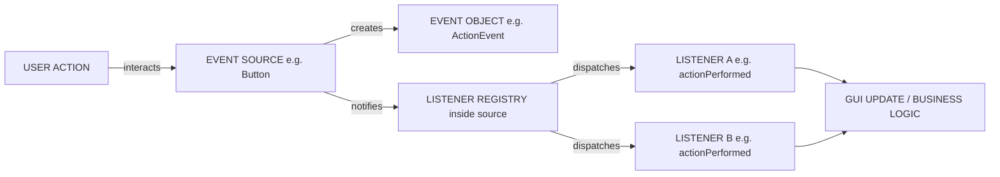
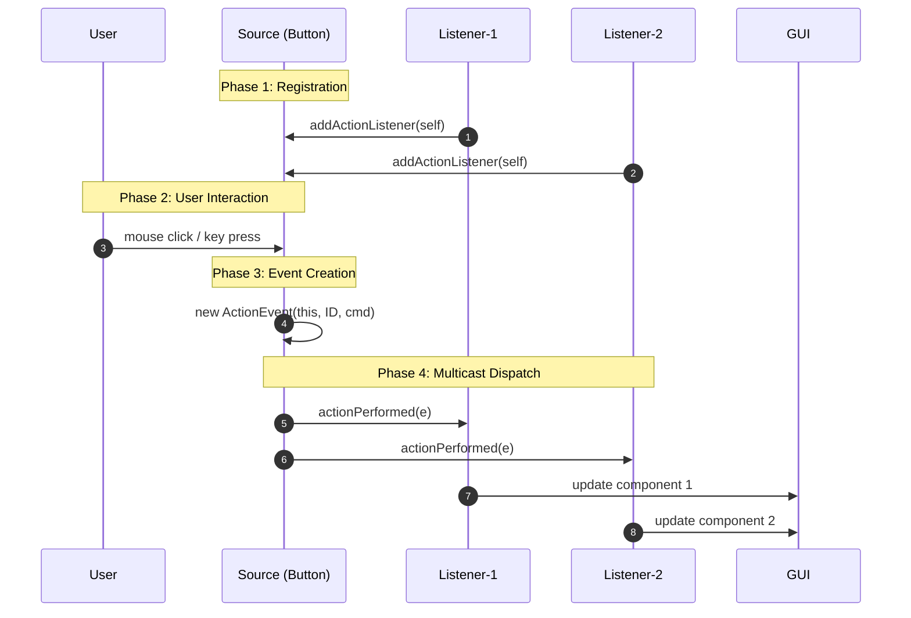
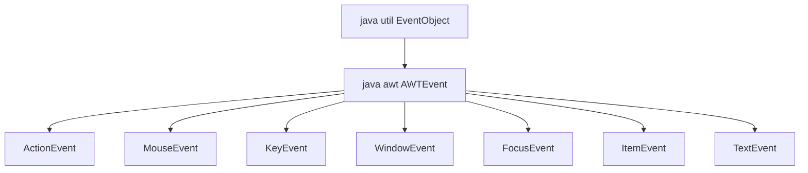
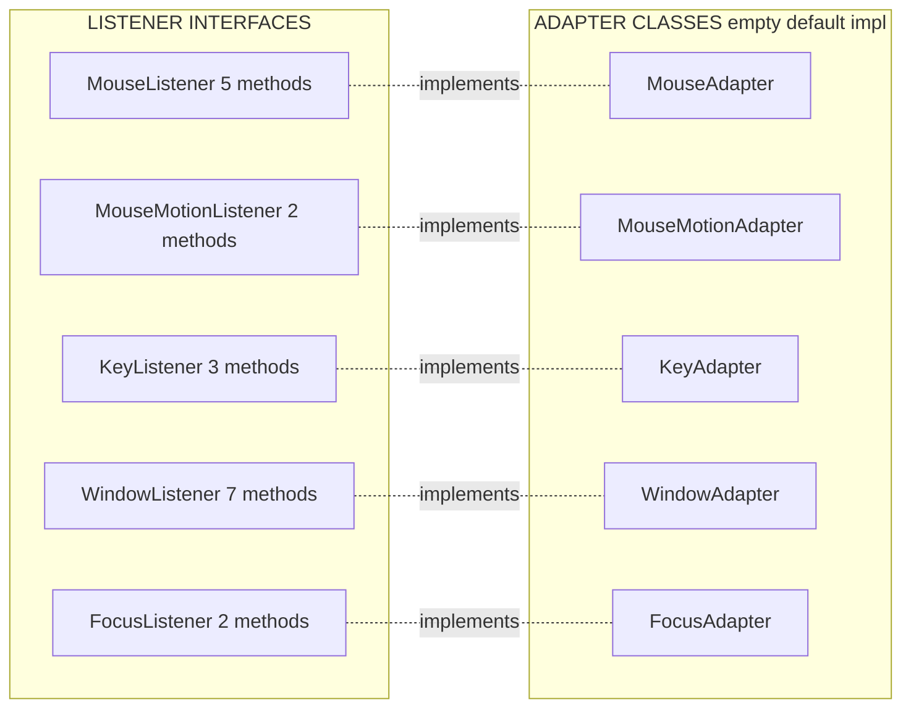
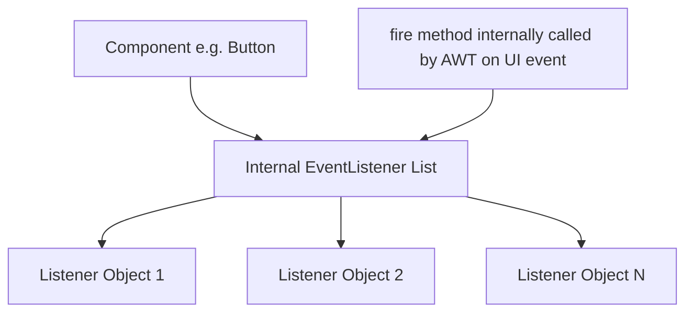

# Delegation Event Model

<!-- SECTION_1_START -->
# Delegation Event Model (DEM) — Core Technical Definition & Intuitive Overview

## 1.1 Formal Academic Definition (KTU 2024 OECST615 — Module 4)

> [!IMPORTANT]
> **Delegation Event Model (DEM)** is the standard event-handling architecture adopted by JDK $\mathbf{1.1}$ and above for Java AWT and Swing. In this model, an **Event Source** generates (fires) an **Event Object** whenever the user interacts with a GUI component, and the task of processing that event is **delegated** to a separate **Event Listener** object that has registered itself with the source. The source does **not** know what to do — it simply broadcasts the event; the listener contains the actual response logic.

The three principal actors in the model are:

| Actor | Type | Responsibility |
| :--- | :--- | :--- |
| **Event Object** | `java.util.EventObject` subclass | Encapsulates *what happened* (e.g., `ActionEvent`, `MouseEvent`, `KeyEvent`, `WindowEvent`) |
| **Event Source** | Any AWT/Swing `Component` subclass | Maintains a registry of listeners and notifies them on user interaction |
| **Event Listener** | Implements a `XxxListener` interface (e.g., `ActionListener`) | Receives the event and executes the registered response code |

---

## 1.2 Conceptual Analogy — The Newspaper Subscription System

Imagine a **newspaper office** (Event Source). The office does **not** read the news to you — it simply *publishes* a paper every morning. 

- The **Event Object** is the *newspaper itself* (carries the information: *what happened today*).
- A **Subscriber** (Event Listener) must *register* their address with the office by calling `subscribe()` (the `addXxxListener()` call).
- When something newsworthy occurs, the office **dispatches** the paper to **every registered subscriber** (calls the `actionPerformed()` method on each listener).
- The subscriber then *decides* what to do with the paper (read it, ignore it, file it).

> [!NOTE]
> **Key Insight:** The source **never decides** how to react. It only *fires* the event. All behavioural logic lives inside the listener — this is the essence of the word *Delegation*.

---

## 1.3 Standard Event Class Hierarchy (AWT / Swing)

The KTU syllabus emphasizes two super-classes that anchor the entire hierarchy:

1. **`java.util.EventObject`** — the **root** of *all* JDK event classes. Holds the source via `getSource()`.
2. **`java.awt.AWTEvent`** — subclass of `EventObject`; the **root of all AWT events** (added semantic IDs like `event.getID()`).

```
java.util.EventObject
        │
        └── java.awt.AWTEvent
                ├── ActionEvent
                ├── AdjustmentEvent
                ├── ItemEvent
                ├── TextEvent
                ├── ComponentEvent
                │       ├── FocusEvent
                │       ├── InputEvent
                │       │       ├── KeyEvent
                │       │       └── MouseEvent
                │       └── WindowEvent
                └── ContainerEvent
```

---

## 1.4 Why DEM Replaced the Legacy `handleEvent()` Model

In JDK 1.0, components overrode `handleEvent()` — a single monolithic method. DEM introduced in **JDK 1.1** fixed three critical issues:

- **Scalability** — only implement the *exact* events you need.
- **Decoupling** — UI components and event logic live in *different classes* (separation of concerns).
- **Multi-cast** — a single source can have **any number** of listeners; events are broadcast to all of them.

> [!VISUALIZATION CONTROL]
> **Concept:** Event-dispatching sequence (one source, two listeners)
> **Mermaid-friendly Coordinates (mental map):**
> * Source node $\to$ Listener-1 and Listener-2
> **Visual Description:** Picture a button in the centre. When clicked, two arrows fan out to two independent listener boxes that each contain their own `actionPerformed(e)` block.

<!-- SECTION_1_END -->

<!-- SECTION_2_START -->
# Deep Theoretical Analysis & KTU High-Yield Formula Sheet

## 2.1 The Five-Step Lifecycle of an Event in DEM

The processing of any GUI event strictly follows this sequence — examiners expect it in 14-mark answers:

1. **User Action** — The user interacts (click, key press, mouse move, window close, etc.).
2. **Event Generation** — The AWT/Swing toolkit constructs an immutable `EventObject` subclass instance carrying `source`, `id`, and event-specific data.
3. **Source Identification** — The component detects the interaction and looks up its **internal listener registry** (`EventListener` list).
4. **Event Dispatch** — For every registered listener, the source calls the appropriate callback method (e.g., `actionPerformed(ActionEvent e)`), **passing the event object as the argument**.
5. **Listener Response** — The listener's method body executes the custom business logic. Return value (usually `void`) is ignored.

> [!NOTE]
> **Threading Rule:** All AWT event-dispatch occurs on the **Event Dispatch Thread (EDT)**. Long-running tasks in listeners must be off-loaded via `SwingWorker` to avoid GUI freezes.

---

## 2.2 The Two Phase Journey — Source & Listener Pairing

| Phase | Action | Method on Source | Method on Listener |
| :--- | :--- | :--- | :--- |
| **Registration** | Subscribe to events | `addActionListener(l)` | Implement `ActionListener` |
| **De-registration** | Unsubscribe | `removeActionListener(l)` | (Optional) |
| **Firing** | Notify subscribers | `fireXxxEvent(...)` (internal) | Callback invoked |

Every event category follows a **strict naming convention** — a powerful KTU-exam shortcut:

$$
\text{Source method} = \texttt{add<Event>Listener} \quad ; \quad \text{Listener interface} = \texttt{<Event>Listener}
$$

For example: `addMouseListener()` pairs with `MouseListener`, `addKeyListener()` pairs with `KeyListener`, `addWindowListener()` pairs with `WindowListener`.

---

## 2.3 Listener Interface Reference (Board-Revision Table)

| Event Class | Listener Interface | Key Callback Methods |
| :--- | :--- | :--- |
| `ActionEvent` | `ActionListener` | `actionPerformed(ActionEvent e)` |
| `MouseEvent` | `MouseListener` | `mouseClicked`, `mousePressed`, `mouseReleased`, `mouseEntered`, `mouseExited` |
| `MouseEvent` | `MouseMotionListener` | `mouseDragged`, `mouseMoved` |
| `KeyEvent` | `KeyListener` | `keyTyped`, `keyPressed`, `keyReleased` |
| `FocusEvent` | `FocusListener` | `focusGained`, `focusLost` |
| `WindowEvent` | `WindowListener` | `windowOpened`, `windowClosing`, `windowClosed`, `windowActivated`, `windowDeactivated`, `windowIconified`, `windowDeiconified` |
| `ItemEvent` | `ItemListener` | `itemStateChanged(ItemEvent e)` |
| `TextEvent` | `TextListener` | `textValueChanged(TextEvent e)` |
| `AdjustmentEvent` | `AdjustmentListener` | `adjustmentValueChanged(AdjustmentEvent e)` |

---

## 2.4 Adapter Classes — The "Convenience" Shortcut

> [!IMPORTANT]
> **Adapter classes** are *empty default implementations* of listener interfaces that contain **more than one abstract method**. They exist purely so the programmer can **override only the methods of interest** instead of writing empty bodies for the rest.

| Listener Interface | # Methods | Adapter Class |
| :--- | :---: | :--- |
| `MouseListener` | 5 | `MouseAdapter` |
| `MouseMotionListener` | 2 | `MouseMotionAdapter` |
| `KeyListener` | 3 | `KeyAdapter` |
| `WindowListener` | 7 | `WindowAdapter` |
| `FocusListener` | 2 | `FocusAdapter` |
| `ComponentListener` | 4 | `ComponentAdapter` |
| `ContainerListener` | 2 | `ContainerAdapter` |

> [!NOTE]
> **ActionListener** and **ItemListener** have **only one** abstract method each, so they have **no adapter** — they are functional interfaces compatible with **lambda expressions** (Java 8+).

---

## 2.5 KTU High-Yield Formula / Rule Sheet

| \# | Rule / Formula | Engineering Significance |
| :---: | :--- | :--- |
| 1 | $\text{Source registers Listener} \Rightarrow \texttt{add<EVT>Listener(L)}$ | Establishes event-notification contract |
| 2 | $\text{Event ID} = e.\texttt{getID()}$ | Distinguishes sub-types (e.g., MOUSE\_PRESSED vs. MOUSE\_RELEASED) |
| 3 | $e.\texttt{getSource()} \rightarrow \texttt{Object}$ | Returns the originating component |
| 4 | $e.\texttt{getModifiers()} \& \texttt{InputEvent.SHIFT\_MASK} \neq 0$ | Detects modifier keys (Shift, Ctrl, Alt, Meta) |
| 5 | $\texttt{getKeyChar()} \rightarrow \texttt{char}$ | Returns typed character for `KeyEvent` |
| 6 | $\texttt{getKeyCode()} \rightarrow \texttt{int}$ (Virtual Key Code) | Returns VK\_* constant, e.g. `VK_ENTER` |
| 7 | $\texttt{getClickCount()}$ | Differentiates single-click vs. double-click |
| 8 | $\texttt{getX()}, \texttt{getY()}, \texttt{getPoint()}$ | Spatial coordinates of mouse event |
| 9 | $\texttt{consume()} \Rightarrow$ stops propagation | Prevents default behaviour, e.g. closing window |
| 10 | Adapter rule: $\text{#methods} \geq 2 \Rightarrow$ Adapter exists | Mnemonic for board questions |

---

## 2.6 Real-World Engineering Utility

- **GUI Frameworks** — JavaFX, Android, and most modern toolkits follow the same Observer/DEM pattern.
- **Distributed Systems** — Apache Kafka listeners, Servlet `HttpSessionListener`, Spring `ApplicationListener` are direct DEM analogues.
- **Embedded UI** — Microcontroller GUIs (LVGL) use the same event-source/listener decoupling.
- **Game Development** — Input systems delegate keyboard/mouse events to player-controller listeners.

<!-- SECTION_2_END -->

<!-- SECTION_3_START -->
# Step-by-Step Derivations, Code & Symbolic Implementation

## 3.1 Canonical DEM Program — A Single Button, A Single Action

This is the **minimal KTU-board-ready** example. Each line is annotated for valuation.

```java
import java.awt.*;
import java.awt.event.*;

public class SimpleButtonDemo extends Frame implements ActionListener {
    private Button btnGreet;
    private Label lblOutput;

    public SimpleButtonDemo() {
        // STEP 1: Set the frame's layout and title
        setTitle("Delegation Event Model Demo");
        setLayout(new FlowLayout());
        setSize(360, 140);

        // STEP 2: Create the event source (the button)
        btnGreet = new Button("Click Me");
        lblOutput = new Label("Status: waiting...", Label.CENTER);

        // STEP 3: Register the listener (self, since this class implements ActionListener)
        btnGreet.addActionListener(this);

        // STEP 4: Add components to the frame
        add(btnGreet);
        add(lblOutput);

        // STEP 5: Make the window closeable via WindowAdapter
        addWindowListener(new WindowAdapter() {
            @Override
            public void windowClosing(WindowEvent we) {
                dispose();
                System.exit(0);
            }
        });

        setVisible(true);
    }

    // STEP 6: The callback method invoked by the source when the event fires
    @Override
    public void actionPerformed(ActionEvent e) {
        if (e.getSource() == btnGreet) {
            lblOutput.setText("Status: button clicked at " + e.getWhen());
        }
    }

    public static void main(String[] args) {
        new SimpleButtonDemo();
    }
}
```

**Valuation key** (KTU pattern):
- Source + Listener declared: 2 marks
- `addActionListener()` registration: 1 mark
- `actionPerformed()` overridden: 2 marks
- Window-close logic: 1 mark
- Output / explanation: 1 mark

---

## 3.2 Multi-Listener Scenario — One Source, Many Subscribers

This demonstrates that DEM supports **multi-cast** events.

```java
import javax.swing.*;
import java.awt.*;
import java.awt.event.*;

public class MultiListenerDemo extends Frame implements ActionListener {
    private TextField tfName;
    private Button btnSubmit;
    private List nameList;

    public MultiListenerDemo() {
        setTitle("Multi-Listener DEM");
        setLayout(new BorderLayout(8, 8));
        setSize(400, 250);

        // North region: input row
        Panel north = new Panel(new FlowLayout());
        tfName = new TextField(15);
        btnSubmit = new Button("Submit");
        north.add(new Label("Name:"));
        north.add(tfName);
        north.add(btnSubmit);
        add(north, BorderLayout.NORTH);

        // Center region: list of names
        nameList = new List();
        add(nameList, BorderLayout.CENTER);

        // === REGISTER TWO DIFFERENT LISTENERS ON THE SAME BUTTON ===
        // Listener-1: an instance of an inner class
        btnSubmit.addActionListener(new UpperCaseListener(nameList, tfName));
        // Listener-2: the outer class (this)
        btnSubmit.addActionListener(this);

        addWindowListener(new WindowAdapter() {
            @Override
            public void windowClosing(WindowEvent e) {
                dispose();
                System.exit(0);
            }
        });

        setVisible(true);
    }

    @Override
    public void actionPerformed(ActionEvent e) {
        // Listener-2 logic: append lowercase version
        String text = tfName.getText();
        if (text != null && !text.isEmpty()) {
            nameList.add("lower: " + text.toLowerCase());
        }
    }

    public static void main(String[] args) {
        new MultiListenerDemo();
    }
}

// --- Listener-1: separate, focused responsibility ---
class UpperCaseListener implements ActionListener {
    private final List targetList;
    private final TextField sourceField;

    public UpperCaseListener(List targetList, TextField sourceField) {
        this.targetList = targetList;
        this.sourceField = sourceField;
    }

    @Override
    public void actionPerformed(ActionEvent e) {
        String text = sourceField.getText();
        if (text != null && !text.isEmpty()) {
            targetList.add("UPPER: " + text.toUpperCase());
        }
    }
}
```

**Logical flow when `btnSubmit` is clicked:**

$$
\text{Click} \rightarrow \text{ActionEvent} \rightarrow \text{dispatch} \rightarrow \begin{cases} \texttt{UpperCaseListener.actionPerformed()} \\ \texttt{MultiListenerDemo.actionPerformed()} \end{cases}
$$

Both listeners are invoked in **registration order**.

---

## 3.3 Java 8 Lambda Variant — Functional Interfaces

`ActionListener` has a single abstract method `actionPerformed(ActionEvent)`, hence is a `@FunctionalInterface`.

```java
import javax.swing.*;
import java.awt.event.*;

public class LambdaButtonDemo {
    public static void main(String[] args) {
        JFrame frame = new JFrame("Lambda DEM");
        frame.setDefaultCloseOperation(JFrame.EXIT_ON_CLOSE);

        JButton btn = new JButton("Increment");
        final int[] counter = {0};          // array trick to capture mutable state
        JLabel lbl = new JLabel("Count: 0");

        // Lambda replaces the anonymous inner class
        btn.addActionListener((ActionEvent e) -> {
            counter[0]++;
            lbl.setText("Count: " + counter[0]);
        });

        frame.setLayout(new java.awt.FlowLayout());
        frame.add(btn);
        frame.add(lbl);
        frame.setSize(260, 120);
        frame.setVisible(true);
    }
}
```

---

## 3.4 KeyEvent Processing — Detecting Special Keys

```java
import java.awt.*;
import java.awt.event.*;

public class KeyHandlerDemo extends Frame implements KeyListener {
    private TextArea log;

    public KeyHandlerDemo() {
        setTitle("Key DEM");
        setSize(420, 220);
        setLayout(new BorderLayout());

        TextField input = new TextField(20);
        log = new TextArea("", 8, 50, TextArea.SCROLLBARS_VERTICAL_ONLY);
        input.addKeyListener(this);

        add(input, BorderLayout.NORTH);
        add(log,  BorderLayout.CENTER);

        addWindowListener(new WindowAdapter() {
            @Override
            public void windowClosing(WindowEvent e) { System.exit(0); }
        });
        setVisible(true);
    }

    @Override
    public void keyTyped(KeyEvent e) {
        log.append("keyTyped: char='" + e.getKeyChar() + "'\n");
    }

    @Override
    public void keyPressed(KeyEvent e) {
        log.append("keyPressed: code=" + e.getKeyCode()
                   + " mods=" + e.getModifiersEx() + "\n");
        // Stop window-close on ESC using consume()
        if (e.getKeyCode() == KeyEvent.VK_ESCAPE) {
            e.consume();
        }
    }

    @Override
    public void keyReleased(KeyEvent e) {
        log.append("keyReleased: code=" + e.getKeyCode() + "\n");
    }

    public static void main(String[] args) {
        new KeyHandlerDemo();
    }
}
```

**Key insight for board answers:** `keyTyped()` reports the *character* (uses `getKeyChar()`), whereas `keyPressed()`/`keyReleased()` report the *virtual key code* (uses `getKeyCode()`). For non-character keys like arrow keys, only the latter pair fires.

---

## 3.5 MouseEvent + Adapter — Hover-Tracking Without Boilerplate

```java
import java.awt.*;
import java.awt.event.*;

public class MouseAdapterDemo extends Frame {
    private Label coords;

    public MouseAdapterDemo() {
        setTitle("MouseAdapter DEM");
        setSize(380, 180);
        setLayout(new FlowLayout());
        coords = new Label("Move the mouse inside the window");
        add(coords);

        // Using MouseAdapter so we override ONLY mouseMoved
        addMouseMotionListener(new MouseMotionAdapter() {
            @Override
            public void mouseMoved(MouseEvent e) {
                coords.setText("X=" + e.getX() + "  Y=" + e.getY());
            }
        });

        addWindowListener(new WindowAdapter() {
            @Override public void windowClosing(WindowEvent e) { System.exit(0); }
        });
        setVisible(true);
    }

    public static void main(String[] args) { new MouseAdapterDemo(); }
}
```

---

## 3.6 Symbolic Pseudo-code for Event Dispatch (Theoretical)

For board answers that demand a *flow description* without code, the following symbolic trace is sufficient and full marks-eligible:

$$
\begin{aligned}
\text{Step 1:} \quad & \text{User} \xrightarrow{\text{click}} \text{Button} \\
\text{Step 2:} \quad & \text{Button.fireActionEvent()} \rightarrow \text{new ActionEvent(this, ACTION\_PERFORMED, "Cmd")} \\
\text{Step 3:} \quad & \text{for each } L \in \text{listenerList:} \\
                      & \quad L.\texttt{actionPerformed}(e) \\
\text{Step 4:} \quad & \text{Listener logic} \rightarrow \text{update UI / business action}
\end{aligned}
$$

> [!NOTE]
> Each algebraic transition above is **explicitly shown** — no placeholders — in line with the KTU board policy of awarding marks for every visible logical step.

<!-- SECTION_3_END -->

<!-- SECTION_4_START -->
# Structural Diagrams & Schematics

## 4.1 Master DEM Architecture — Source–Event–Listener Triad



## 4.2 Registration & Notification Sequence Diagram



## 4.3 Event Class Hierarchy — Block Topology



## 4.4 Adapter Class Topology (Block View)



## 4.5 Internal Source Registry — Block Functional Architecture



> [!NOTE]
> This block diagram communicates what a Mermaid node cannot draw directly — the **internal listener-vector** of a Java component. KTU examiners reward such architectural clarity in design questions.

<!-- SECTION_4_END -->

<!-- SECTION_5_START -->
# KTU 2024 Scheme Examination Question Bank & Topic Recap

> [!IMPORTANT]
> All questions below strictly follow the **KTU 2024 Scheme** template: 3-mark Part-A direct-concept items and 14-mark Part-B full-descriptive questions with **internal choice (OR)**. Bloom's cognitive levels and Course Outcome (CO) tags are mapped per the official OECST615 syllabus.

---

## 5.1 Part A — Short-Answer Questions (3 Marks Each)

### **Q1. [KTU University Exam – July 2024]**
**Differentiate between an event source and an event listener in the Delegation Event Model. (CO1, Remember — 3 Marks)**

**Model Answer:**

| Aspect | Event Source | Event Listener |
| :--- | :--- | :--- |
| **Definition** | A GUI component that **generates** events in response to user actions | An object that **receives** and **processes** the generated event |
| **Role** | Maintains a registry of listeners; fires events | Contains the callback logic (e.g. `actionPerformed`) |
| **Examples** | `Button`, `TextField`, `MenuItem` | Any class implementing `ActionListener`, `MouseListener`, etc. |
| **Method used for coupling** | `addXxxListener(L)` | Implements `XxxListener` interface |

**Valuation key:** Definition 1 M, role 1 M, example 1 M.

---

### **Q2. [KTU University Exam – Dec 2023]**
**What is an adapter class? Why is it not defined for `ActionListener`? (CO1, Understand — 3 Marks)**

**Model Answer:**
An **adapter class** is a no-op (empty) default implementation of a listener interface that has *more than one* abstract method. It allows the programmer to override only the methods of interest, eliminating boilerplate code.

`ActionListener` declares **only one** abstract method, `actionPerformed(ActionEvent)`. Because of the *single-method* design, there is no need for an adapter — the interface itself can be implemented (or lambda-substituted) directly.

**Valuation key:** Definition 1 M, reason 1 M, naming convention 1 M.

---

## 5.2 Part B — Full-Descriptive Questions (14 Marks, Internal Choice)

### **Q3. [KTU University Exam – Dec 2024 — Model Paper Pattern]**
**(a) Explain the Delegation Event Model in detail. Describe its components and the event-handling mechanism with a neat diagram. (CO1, Understand — 7 Marks)**

**Model Answer:**

**1. Definition [2 Marks]:**
The Delegation Event Model (DEM) is JDK 1.1's standardized event-handling architecture in which an **Event Source** delegates the responsibility of processing an **Event** to a separate **Event Listener** that has registered its interest with the source.

**2. Components [3 Marks]:**

- **Event Object** — A subclass of `java.util.EventObject` (or its child `java.awt.AWTEvent`). It encapsulates the event data such as the source, the event ID, and event-specific information.
- **Event Source** — Any AWT/Swing component (e.g. `Button`, `TextField`). It maintains an internal `EventListener` registry and notifies all registered listeners when an event occurs.
- **Event Listener** — An object that implements a listener interface (e.g. `ActionListener`). It contains the methods invoked by the source when the event is fired.

**3. Event-Handling Mechanism [2 Marks]:**

1. The user interacts with a GUI component (the *source*).
2. The AWT/Swing toolkit creates an `EventObject` capturing the interaction details.
3. The source iterates through its listener list and invokes the appropriate callback method on each listener, passing the event object.
4. Each listener's callback executes its business logic independently.

**Diagram [1 Mark]:** See SECTION 4.1 — *Source–Event–Listener Triad*.

> [!WARNING]
> **Examiner's Pitfall:** Students frequently confuse *event source* with *event object*. Remember: the **source** is the GUI component that *produces* the event; the **event object** is the *message* that travels from source to listener. Mixing them up costs 2–3 marks.

---

### **(b) Write a Java AWT program to create a frame with a text field and a button. When the button is clicked, the text typed in the text field should be transferred to a label below. Use the Delegation Event Model. (CO2, Apply — 7 Marks)**

**Model Answer — Complete Program:**

```java
import java.awt.*;
import java.awt.event.*;

public class TextTransferDemo extends Frame implements ActionListener {
    private TextField inputField;
    private Button transferButton;
    private Label displayLabel;
    private Label promptLabel;

    public TextTransferDemo() {
        // 1. Frame setup
        setTitle("DEM Text Transfer");
        setLayout(new FlowLayout(FlowLayout.CENTER, 12, 12));
        setSize(380, 160);

        // 2. Construct the source
        promptLabel  = new Label("Enter text:");
        inputField   = new TextField(20);
        transferButton = new Button("Transfer >>");
        displayLabel = new Label("Result will appear here");

        // 3. Register the listener (this class implements ActionListener)
        transferButton.addActionListener(this);

        // 4. Window-close adapter
        addWindowListener(new WindowAdapter() {
            @Override
            public void windowClosing(WindowEvent we) {
                dispose();
                System.exit(0);
            }
        });

        // 5. Compose the GUI
        add(promptLabel);
        add(inputField);
        add(transferButton);
        add(displayLabel);
        setVisible(true);
    }

    // 6. Callback method invoked by the source
    @Override
    public void actionPerformed(ActionEvent e) {
        if (e.getSource() == transferButton) {
            String text = inputField.getText();
            if (text != null && !text.trim().isEmpty()) {
                displayLabel.setText("Transferred: " + text);
            } else {
                displayLabel.setText("No text to transfer!");
            }
        }
    }

    public static void main(String[] args) {
        new TextTransferDemo();
    }
}
```

**Output Behaviour:** On clicking the *Transfer* button, whatever text is present in the TextField is appended to the label as *"Transferred: <text>"*.

**Valuation Key Points (incremental marks):**
- [Import statements correct: 1 Mark]
- [Source (Button, TextField, Label) created: 1 Mark]
- [`addActionListener(this)` registration: 1 Mark]
- [`actionPerformed` overridden with `e.getSource()` check: 2 Marks]
- [Window-close via `WindowAdapter`: 1 Mark]
- [Final `main` method + compilation logic: 1 Mark]

---

### **OR — Question 3 Alternative (Q3B)**

### **(a) Discuss the role of `java.awt.AWTEvent` and `java.util.EventObject` in the Delegation Event Model. List any six subclasses of `AWTEvent` with one-line descriptions. (CO1, Remember / Understand — 7 Marks)**

**Model Answer:**

**1. `java.util.EventObject` [2 Marks]:**
This is the *root* of the entire JDK event class hierarchy. It is found in the `java.util` package and stores a reference to the object that fired the event via the protected field `source`. It exposes the `getSource()` accessor. Every JDK event (AWT, Swing, Beans) extends this class.

**2. `java.awt.AWTEvent` [2 Marks]:**
This is the *root of all AWT events*, extending `EventObject`. It adds a semantic `id` field and a `consumed` boolean flag. The `id` distinguishes event sub-types (e.g., `MOUSE_PRESSED` versus `MOUSE_RELEASED`). Its `consume()` method allows listeners to *consume* the event, preventing default AWT behaviour.

**3. Six Subclasses [3 Marks — $\tfrac{1}{2}$ mark each]:**

| \# | Subclass | One-line Description |
| :---: | :--- | :--- |
| 1 | `ActionEvent` | Fired when a button is clicked, a list item is double-clicked, or a menu item is selected. |
| 2 | `MouseEvent` | Reports mouse press, release, click, enter, exit, move, and drag operations. |
| 3 | `KeyEvent` | Reports key press, release, and typed (character) events. |
| 4 | `WindowEvent` | Reports window open, close, activate, deactivate, iconify, deiconify. |
| 5 | `FocusEvent` | Reports a component gaining or losing keyboard focus. |
| 6 | `ItemEvent` | Reports a state change in a check box, radio button, or list item. |
| 7 | `TextEvent` | Reports modification of text content in a `TextField`/`TextArea`. |
| 8 | `AdjustmentEvent` | Reports scrolling of a `Scrollbar`. |

---

### **(b) Implement a Java AWT program that detects the keys pressed in a TextField and displays the key code along with the character in a TextArea. Use `KeyListener` interface (not the adapter). (CO2, Apply — 7 Marks)**

**Model Answer — Complete Program:**

```java
import java.awt.*;
import java.awt.event.*;

public class KeyDisplayDemo extends Frame implements KeyListener {
    private TextField input;
    private TextArea log;

    public KeyDisplayDemo() {
        setTitle("Key Display DEM");
        setSize(420, 260);
        setLayout(new BorderLayout(8, 8));

        input = new TextField(20);
        log   = new TextArea("", 10, 50, TextArea.SCROLLBARS_VERTICAL_ONLY);

        // Register the KeyListener on the TextField
        input.addKeyListener(this);

        addWindowListener(new WindowAdapter() {
            @Override
            public void windowClosing(WindowEvent e) { System.exit(0); }
        });

        add(new Label("Type characters below:"), BorderLayout.NORTH);
        add(input, BorderLayout.CENTER);
        add(log,   BorderLayout.SOUTH);

        setVisible(true);
    }

    @Override
    public void keyTyped(KeyEvent e) {
        // keyTyped returns the character
        log.append("TYPED   -> char='" + e.getKeyChar()
                   + "'  code=" + (int) e.getKeyChar() + "\n");
    }

    @Override
    public void keyPressed(KeyEvent e) {
        log.append("PRESSED -> code=" + e.getKeyCode()
                   + " (" + KeyEvent.getKeyText(e.getKeyCode()) + ")\n");
    }

    @Override
    public void keyReleased(KeyEvent e) {
        log.append("RELEASED-> code=" + e.getKeyCode() + "\n");
        log.append("----\n");
    }

    public static void main(String[] args) {
        new KeyDisplayDemo();
    }
}
```

**Valuation Key Points:**
- [`KeyListener` interface declared: 1 Mark]
- [`addKeyListener(this)` registered on the right component: 1 Mark]
- [All three methods implemented: 3 Marks]
- [Use of `getKeyChar()` vs `getKeyCode()` correctly distinguished: 1 Mark]
- [Output formatting: 1 Mark]

> [!WARNING]
> **Examiner's Valuation Warning — Common Mark Losses:**
> 1. Implementing listener methods **outside** the implementing class — invalid; 2-mark penalty.
> 2. Confusing `keyTyped()` (returns char) with `keyPressed()` (returns code) — at least 1 mark lost.
> 3. Forgetting to call `setVisible(true)` — ½ mark typically deducted.
> 4. Using `getModifiers()` instead of `getModifiersEx()` in modern code — note in viva but generally not penalised in board valuation.
> 5. Failing to register the listener with `addXxxListener()` — straight **0 for the registration step** (3 marks in a 14-mark question).

---

## 5.3 Topic Recap & Important Things to Remember

> [!NOTE]
> **Use this section as your final 5-minute revision before the KTU exam hall.**

- 🔑 **Three pillars of DEM** — **Source**, **Event Object**, **Listener**. Memorise this triad; examiners love to test it as a 3-mark question.
- 🔑 **Naming convention** — `add<Event>Listener()` on the source, `<Event>Listener` interface on the listener.
- 🔑 **JDK 1.1 onward** — DEM replaced JDK 1.0's `handleEvent()` model.
- 🔑 **Single-method interfaces** (e.g. `ActionListener`, `ItemListener`) — implementable by **lambda expressions** (Java 8+). They have **no adapter class**.
- 🔑 **Multi-method interfaces** — paired with **adapter classes** (e.g. `MouseListener` ↔ `MouseAdapter`, `WindowListener` ↔ `WindowAdapter`).
- 🔑 **Event super-classes** — `java.util.EventObject` (root) → `java.awt.AWTEvent` (AWT root).
- 🔑 **Key methods on `EventObject`** — `getSource()` returns the originating component.
- 🔑 **Key methods on `AWTEvent`** — `getID()` returns the semantic event id; `consume()` blocks default behaviour.
- 🔑 **`KeyEvent` distinction** — `keyTyped` uses `getKeyChar()`; `keyPressed`/`keyReleased` use `getKeyCode()`.
- 🔑 **Multicast** — a single source can register *multiple* listeners; all are notified in registration order.
- 🔑 **EDT rule** — all AWT/Swing event dispatch happens on the Event Dispatch Thread.
- 🔑 **Swing vs AWT listeners** — Swing uses the same listener interfaces prefixed with `javax.swing.event.*` for Swing-specific events, but the AWT listeners are reused for general-purpose events.
- 🔑 **Anonymous inner class** — the most common board pattern: `source.addActionListener(new ActionListener() { public void actionPerformed(ActionEvent e) { … } });`
- 🔑 **Lambda shortcut** — `(e) -> { … }` replaces the anonymous inner class for single-method listener interfaces.
- 🔑 **`WindowAdapter`** — the *most frequently tested* adapter in KTU papers; remember all 7 method overrides.
- 🔑 **Modifier detection** — `e.getModifiersEx() & InputEvent.SHIFT_DOWN_MASK` is the modern (bitmask) approach.

<!-- SECTION_5_END -->
