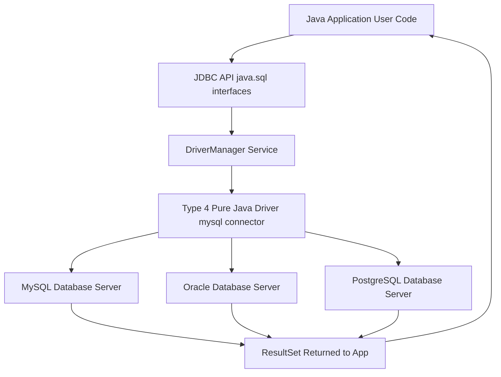
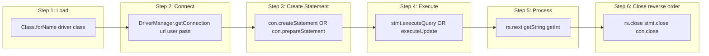
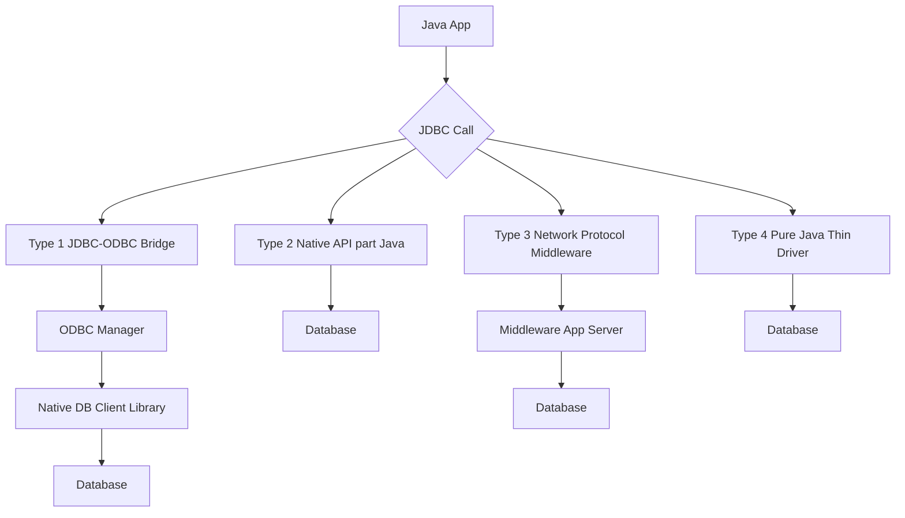

# Developing Database Applications using JDBC  – JDBC overview

<!-- SECTION_1_START -->
# Developing Database Applications using JDBC — JDBC Overview

> [!NOTE]
> **KTU 2024 Scheme | Course: OECST615 — Object Oriented Programming**
> **Module 4:** GUI Programming, Swings, and Database Connectivity
> **Topic:** JDBC Overview, Architecture, Drivers, and Core Components

## 1.1 Formal Academic Definition

**Java Database Connectivity (JDBC)** is a Java Standard Edition (Java SE) application programming interface (API) published by Oracle (originally Sun Microsystems) that defines how a client program written in the Java programming language can access and manipulate data stored in relational database management systems (RDBMS) such as MySQL, PostgreSQL, Oracle, and SQL Server. JDBC is part of the `java.sql` and `javax.sql` packages, and it abstracts database-specific implementation details behind a uniform set of interfaces, enabling **"Write Once, Run Anywhere (WORA)"** database access.

> [!IMPORTANT]
> **Key KTU 2024 Highlight:** JDBC is **not** a database driver itself. It is a **specification (a set of interfaces and abstract classes)**. The actual implementation is provided by the database vendor (e.g., `mysql-connector-j`, `ojdbc11.jar`, `postgresql.jar`).

## 1.2 Conceptual Analogy / Intuition

Think of JDBC as a **universal travel adapter**:
- Your Java program is like a **laptop** (always has the same power socket — Java interface).
- Different databases (MySQL, Oracle, PostgreSQL) are like **wall sockets in different countries** (each has a different shape).
- The **JDBC Driver** is the **adapter plug** that fits your laptop to whichever country's socket you visit.
- The **DriverManager** is the **travel concierge** who hands you the correct adapter when you tell it which country (database URL) you are going to.

> [!TIP]
> **Slogan to remember:** *"Java speaks JDBC, the Driver translates it to the database's native dialect."*

## 1.3 Why JDBC is Required — Engineering Motivation

| Need | How JDBC Solves It |
|---|---|
| Vendor independence | Single API for all RDBMS |
| Portability across OS | Pure Java, runs on JVM |
| Network & distributed access | Built-in `Connection` pooling support |
| Security | Sandboxed JVM execution, `PreparedStatement` prevents SQL Injection |
| Standards compliance | Implements **SQL:2003** entry-level conformance |

> [!VISUALIZATION CONTROL]
> **Concept:** Three-tier client-server JDBC application topology
> **GeoGebra / Desmos Input Equations (ASCII Block):**
> ```
> TIER 1 (Client)        TIER 2 (Logic)        TIER 3 (Data)
> +-----------+   JDBC   +-----------+   SQL    +-----------+
> | Java App  |  <---->  | JDBC API  | <---->   | Database  |
> | (Swing UI)|  Calls   | + Driver  |  Wire    | (MySQL)   |
> +-----------+          +-----------+  Proto   +-----------+
> ```
> **Visual Description:** Three horizontal boxes connected by bidirectional arrows. The middle layer (Driver) acts as a translator between the Java application's high-level calls (e.g., `executeQuery`) and the low-level wire protocol spoken by the database.

<!-- SECTION_1_END -->

<!-- SECTION_2_START -->
# 2. Deep Theoretical Analysis & KTU High-Yield Reference

## 2.1 JDBC Architecture — The 4 Logical Layers

The KTU syllabus expects students to know the **layered architecture**. From top (Java application) to bottom (Physical Database):

| Layer # | Component | Role | Package / Type |
|---|---|---|---|
| **L1** | **Java Application / Applet / Servlet** | Issues method calls on JDBC API | User code |
| **L2** | **JDBC API** | `java.sql` & `javax.sql` interfaces (`Connection`, `Statement`, etc.) | Specification |
| **L3** | **JDBC Driver Manager** | Loads correct driver, supplies `Connection` | `java.sql.DriverManager` |
| **L4** | **JDBC Driver (Vendor specific)** | Translates JDBC calls → DB native protocol | Vendor JAR |
| **L5** | **Database** | Stores data physically | MySQL/Oracle/PG |

> [!IMPORTANT]
> **Two-Tier vs Three-Tier:**
> - **Two-tier:** Java App $\leftrightarrow$ DB directly (using Driver).
> - **Three-tier:** Java App $\leftrightarrow$ Middleware (App Server) $\leftrightarrow$ DB. Used in enterprise (EJB, Spring).

## 2.2 The 4 Types of JDBC Drivers (KTU High-Yield)

| Type | Name | Mechanism | Pros | Cons | Status |
|---|---|---|---|---|---|
| **Type 1** | JDBC-ODBC Bridge | Calls ODBC driver which calls DB | Connect to any ODBC DB | Slow, needs ODBC installed on client | **Deprecated since Java 8** |
| **Type 2** | Native-API (part-Java) | Uses vendor's native client lib (e.g., OCI for Oracle) | Faster than Type 1 | Requires native `.dll`/`.so` installed | Legacy |
| **Type 3** | Network Protocol (Middleware) | Sends requests to middleware server which talks to DB | No native code on client; good for internet | Needs middleware deployment | Rare today |
| **Type 4** | **Pure Java (Thin Driver)** ⭐ | Converts JDBC calls **directly** to DB-specific wire protocol | **No native code**, portable, fast, internet-friendly | Driver must be rewritten per DB | **Industry Standard** |

> [!NOTE]
> **KTU 2024 expected answer:** *"Type 4 driver is the most commonly used driver in modern Java applications because it is written entirely in Java, requires no client-side installation, and communicates directly with the database over TCP/IP."*

## 2.3 Core JDBC API Classes & Interfaces (The "Big Five")

| # | Interface/Class | Purpose | Key Methods |
|---|---|---|---|
| 1 | `java.sql.DriverManager` | Service to choose correct driver | `getConnection(url,user,pass)` |
| 2 | `java.sql.Connection` | Session with specific DB | `createStatement()`, `close()`, `setAutoCommit()` |
| 3 | `java.sql.Statement` | Executes static SQL | `executeQuery()`, `executeUpdate()`, `execute()` |
| 4 | `java.sql.PreparedStatement` | Pre-compiled SQL with parameters | `setInt()`, `setString()`, `executeQuery()` |
| 5 | `java.sql.ResultSet` | Tabular result of `SELECT` | `next()`, `getString()`, `getInt()`, `close()` |

### Additional Supporting Interfaces

| Interface | Purpose |
|---|---|
| `ResultSetMetaData` | Info about columns in a `ResultSet` (count, types, names) |
| `DatabaseMetaData` | Info about DB (name, version, supported features) |
| `SQLException` | Checked exception for any DB access errors |
| `SQLWarning` | Non-fatal warnings (e.g., data truncation) |
| `RowSet` | A `ResultSet` that can operate without always being connected |

## 2.4 The 5 Standard Steps to Develop a JDBC Application

These steps are **frequently asked as 7-mark questions** in KTU ESE.

> [!IMPORTANT]
> **Mnemonic — "L E R S C":** **L**oad Driver, **E**stablish Connection, **R**eady Statement, **S**end & **S**how Result, **C**lose.

1. **Load the Driver Class** — `Class.forName("com.mysql.cj.jdbc.Driver");` (Optional in JDBC 4.0+ via auto-loading via SPI).
2. **Establish the Connection** — `Connection con = DriverManager.getConnection(url, user, password);`
3. **Create a Statement** — `Statement stmt = con.createStatement();`
4. **Execute the Query** — `ResultSet rs = stmt.executeQuery("SELECT ...");` for DQL; `int n = stmt.executeUpdate("INSERT...")` for DML.
5. **Process Result & Close** — Iterate `rs.next()`, then `con.close();`

## 2.5 JDBC URL Format Cheat-Sheet

A JDBC URL has the form: `jdbc:<subprotocol>:<subname>`

| Database | JDBC Sub-Protocol | Sample URL |
|---|---|---|
| MySQL | `mysql` | `jdbc:mysql://localhost:3306/ktuDB` |
| Oracle (Thin) | `oracle:thin` | `jdbc:oracle:thin:@localhost:1521:xe` |
| PostgreSQL | `postgresql` | `jdbc:postgresql://localhost:5432/ktuDB` |
| SQL Server | `sqlserver` | `jdbc:sqlserver://localhost:1433;databaseName=ktuDB` |
| SQLite | `sqlite` | `jdbc:sqlite:C:/data/ktu.db` |

> [!TIP]
> **Engineering real-world use:** Modern Java back-ends (Spring Boot, Jakarta EE) almost always use **Type 4 drivers** because they bundle inside the `.jar` and don't require DBA intervention on the client machine — perfect for **microservices** and **cloud-native** deployments on AWS, Azure, GCP.

<!-- SECTION_2_END -->

<!-- SECTION_3_START -->
# 3. Step-by-Step Implementation, Code, and Derivations

## 3.1 Pre-requisites for the Lab / Practical Exam

1. **JDK 11 or higher** installed (`java -version`).
2. **Database server** running (e.g., MySQL 8 on port 3306).
3. **JDBC driver JAR** in classpath:
   - MySQL: `mysql-connector-j-8.x.jar`
   - PostgreSQL: `postgresql-42.x.jar`
4. **Sample table** created in the database:

```sql
CREATE DATABASE ktuDB;
USE ktuDB;
CREATE TABLE student (
    rollno INT PRIMARY KEY,
    name   VARCHAR(50),
    cgpa   DECIMAL(4,2)
);
INSERT INTO student VALUES (1, 'Anand', 8.45), (2, 'Bhavya', 9.12), (3, 'Chitra', 7.80);
```

## 3.2 Program 1 — Complete JDBC Demo (Read + Insert)

Below is a **fully operational** Java program that (a) fetches all rows from `student`, and (b) inserts a new row. Every line is explicitly shown — no `...` placeholders.

```java
// File: StudentJDBCDemo.java
// KTU OECST615 - Module 4 - JDBC Overview Demonstration
import java.sql.Connection;
import java.sql.DriverManager;
import java.sql.PreparedStatement;
import java.sql.ResultSet;
import java.sql.SQLException;
import java.sql.Statement;

public final class StudentJDBCDemo {

    // ---- Configuration constants (single source of truth) ----
    private static final String JDBC_URL  = "jdbc:mysql://localhost:3306/ktuDB";
    private static final String JDBC_USER = "root";
    private static final String JDBC_PASS = "password123";

    public static void main(String[] args) {
        // Step 0: Outer try-with-resources guarantees connection closure
        try (Connection con = DriverManager.getConnection(JDBC_URL, JDBC_USER, JDBC_PASS)) {
            System.out.println("[OK] Database connection established successfully.");

            // ---------- PART A: SELECT using plain Statement ----------
            fetchAllStudents(con);

            // ---------- PART B: INSERT using PreparedStatement ----------
            insertStudent(con, 4, "Deepa", 8.95f);

            // ---------- PART C: Verify insertion ----------
            fetchAllStudents(con);

        } catch (ClassNotFoundException e) {
            System.err.println("[ERROR] JDBC Driver class not found on classpath.");
            e.printStackTrace();
        } catch (SQLException e) {
            System.err.println("[ERROR] SQL State : " + e.getSQLState());
            System.err.println("[ERROR] Error Code: " + e.getErrorCode());
            e.printStackTrace();
        }
    }

    /** Reads and prints every row of the student table. */
    private static void fetchAllStudents(Connection con) throws SQLException {
        final String selectSQL = "SELECT rollno, name, cgpa FROM student ORDER BY rollno";

        try (Statement stmt = con.createStatement();
             ResultSet rs   = stmt.executeQuery(selectSQL)) {

            System.out.println("\n--- Student List ---");
            System.out.printf("%-8s %-20s %-6s%n", "ROLLNO", "NAME", "CGPA");
            System.out.println("---------------------------------------");

            while (rs.next()) {
                int    r   = rs.getInt("rollno");
                String n   = rs.getString("name");
                float  c   = rs.getFloat("cgpa");
                System.out.printf("%-8d %-20s %-6.2f%n", r, n, c);
            }
        }
    }

    /** Inserts a single row using a parameterised PreparedStatement. */
    private static void insertStudent(Connection con, int roll, String name, float cgpa)
            throws SQLException {
        final String insertSQL =
                "INSERT INTO student (rollno, name, cgpa) VALUES (?, ?, ?)";

        try (PreparedStatement pstmt = con.prepareStatement(insertSQL)) {
            pstmt.setInt(1, roll);
            pstmt.setString(2, name);
            pstmt.setFloat(3, cgpa);

            int rowsAffected = pstmt.executeUpdate();
            System.out.println("\n[INFO] Inserted " + rowsAffected + " row(s).");
        }
    }
}
```

### 3.2.1 Compilation and Execution Sequence (explicit, no shortcuts)

```bash
# 1. Compile
javac -cp ".;lib/mysql-connector-j-8.3.0.jar" StudentJDBCDemo.java

# 2. Run
java -cp ".;lib/mysql-connector-j-8.3.0.jar" StudentJDBCDemo
```

### 3.2.2 Step-by-Step Execution Flow (Trace Table)

| Step | Code Line | JDBC Action | Object Created | DB Round Trip |
|---|---|---|---|---|
| 1 | `DriverManager.getConnection(...)` | SPI auto-loads driver, opens TCP socket | `Connection` | ✅ Yes (connect) |
| 2 | `con.createStatement()` | Allocates server-side cursor resources | `Statement` | ❌ No |
| 3 | `stmt.executeQuery("SELECT ...")` | Sends SQL to server, server parses/plans/executes | `ResultSet` (cursor) | ✅ Yes (execute) |
| 4 | `rs.next()` (loop) | Fetches one row at a time from server | — | ✅ Yes (fetch row) |
| 5 | `con.prepareStatement("INSERT ...")` | Server pre-compiles SQL template | `PreparedStatement` | ✅ Yes (prepare) |
| 6 | `pstmt.executeUpdate()` | Sends parameter values, server executes | int (rows) | ✅ Yes (execute) |
| 7 | `try (...)` close | Sends `CLOSE` to server, releases socket | — | ✅ Yes (disconnect) |

## 3.3 Program 2 — Using `ResultSetMetaData` to Build a Generic Table Viewer

```java
import java.sql.*;

public final class GenericTableViewer {
    public static void main(String[] args) throws Exception {
        String url  = "jdbc:mysql://localhost:3306/ktuDB";
        String user = "root";
        String pass = "password123";

        try (Connection con = DriverManager.getConnection(url, user, pass);
             Statement  st  = con.createStatement();
             ResultSet  rs  = st.executeQuery("SELECT * FROM student")) {

            ResultSetMetaData md = rs.getMetaData();
            int colCount = md.getColumnCount();

            // Print column headers dynamically
            for (int i = 1; i <= colCount; i++) {
                System.out.printf("%-15s", md.getColumnName(i));
            }
            System.out.println();

            // Print rows dynamically using getObject() (type-agnostic)
            while (rs.next()) {
                for (int i = 1; i <= colCount; i++) {
                    System.out.printf("%-15s", rs.getObject(i));
                }
                System.out.println();
            }
        }
    }
}
```

> [!TIP]
> **Why `ResultSetMetaData` matters in real engineering:** GUI tools like **DBeaver**, **DataGrip**, and **SQuirreL** use exactly this technique to render *any* table on-the-fly without hard-coding column names.

## 3.4 Statement vs PreparedStatement vs CallableStatement

| Feature | `Statement` | `PreparedStatement` | `CallableStatement` |
|---|---|---|---|
| SQL injection safe | ❌ No | ✅ Yes (parameterised) | ✅ Yes |
| Pre-compiled | ❌ No | ✅ Yes | ✅ Yes |
| Performance for repeated queries | ❌ Slow (re-parsed) | ✅ Fast | ✅ Fast |
| Used for | Static DDL/one-off | CRUD with parameters | **Stored Procedures** |
| Extends | — | `Statement` | `PreparedStatement` |

> [!IMPORTANT]
> **KTU 2024 Examiner Expectation:** If a question asks *"Why is `PreparedStatement` preferred over `Statement`?"*, always mention **two** reasons: **(1) prevents SQL injection, (2) pre-compiled execution gives better performance for repeated execution.**

### Sample `PreparedStatement` Insert with SQL Injection Demonstration

```java
// VULNERABLE code (do NOT use in production):
String name = "' OR '1'='1";
String sql  = "SELECT * FROM users WHERE name = '" + name + "'";
// Resulting SQL: SELECT * FROM users WHERE name = '' OR '1'='1'
// Returns ALL rows — entire table dumped!

// SECURE code (use this):
String sql  = "SELECT * FROM users WHERE name = ?";
PreparedStatement ps = con.prepareStatement(sql);
ps.setString(1, name);  // input is treated as DATA, not code
```

<!-- SECTION_3_END -->

<!-- SECTION_4_START -->
# 4. Structural Diagrams & Schematics

## 4.1 JDBC Architecture — Layered Flow



> **Reading the diagram:** The Java application (top) only ever talks to the JDBC API. The API delegates to `DriverManager`, which picks the correct vendor driver, which then speaks the database's wire protocol. Results flow back upward.

## 4.2 JDBC Object Lifecycle — Object Creation and Closure Sequence



> **Engineering note:** In production code, prefer **try-with-resources** (Java 7+) over manual `close()` calls. It guarantees cleanup even if an exception is thrown, preventing **resource leaks** that can crash the database server.

## 4.3 Functional Architecture Block — 5-Stage Pipeline View

| Stage | Input | Component | Output | Failure Mode |
|---|---|---|---|---|
| **1. Bootstrap** | `main()` | `Class.forName` | Driver registered in `DriverManager` | `ClassNotFoundException` |
| **2. Handshake** | URL + credentials | `DriverManager.getConnection` | `Connection` object (TCP socket open) | `SQLException` (auth/network) |
| **3. Compile** | SQL template | `prepareStatement` | Pre-parsed plan on server | `SQLSyntaxErrorException` |
| **4. Execute** | Parameter values | `executeQuery`/`executeUpdate` | `ResultSet` or row count | `SQLIntegrityConstraintViolationException` |
| **5. Stream & Close** | `ResultSet` rows | `next()` + `getXxx()` | Java objects | `SQLException` (timeout) |

## 4.4 Driver Type Comparison (Block Diagram)



> **Reading guide:** Type 1 has the most hops (Java → ODBC → native lib → DB) and is the slowest. Type 4 has the fewest hops (Java → DB directly) and is fastest — that is why the **industry standard is Type 4**.

<!-- SECTION_4_END -->

<!-- SECTION_5_START -->
# 5. KTU 2024 Scheme Examination Question Bank & Topic Recap

> [!NOTE]
> All questions are simulated in the **exact KTU ESE 2024 Scheme style** with CO mapping, RBT cognitive level tags, and a 14-mark internal-choice model. Each model answer follows the official valuation key pattern with **explicit mark breakdown**.

---

## 5.1 Part A — Short Answer Questions (3 Marks Each)

### Question 1 `[KTU University Exam - Dec 2023]`
**CO2 | RBT Level: Remember**
*Define JDBC. What are the two main packages that contain the JDBC API?*

#### Model Answer (3 Marks)
**JDBC (Java Database Connectivity)** is a Java API that enables Java applications to interact with relational databases. It provides a standard set of classes and interfaces to send SQL statements to a DB and retrieve results.
- **Package 1:** `java.sql` — core JDBC classes (Connection, Statement, ResultSet, etc.) **[1 Mark]**
- **Package 2:** `javax.sql` — extended JDBC for server-side (DataSource, RowSet, connection pooling) **[1 Mark]**
- **Key idea:** JDBC is a *specification*, not an implementation. The actual driver is supplied by the DB vendor. **[1 Mark]**

---

### Question 2 `[KTU University Exam - July 2024]`
**CO2 | RBT Level: Understand**
*List any four JDBC API components and state the purpose of `ResultSetMetaData`.*

#### Model Answer (3 Marks)
Four JDBC API components: **[2 Marks — 0.5 each]**
1. `DriverManager`
2. `Connection`
3. `Statement`
4. `ResultSet`

**Purpose of `ResultSetMetaData`:** It provides information about the columns in a `ResultSet` such as column count, column names, column types, and display size. It is useful when the structure of a query result is not known in advance. **[1 Mark]**

---

## 5.2 Part B — Long Answer Questions (14 Marks, with Internal Choice)

### Question A (Choice 1) `[KTU University Exam - Dec 2023]`
**CO2, CO3 | RBT Level: Understand + Apply**

**(a)** Explain the **JDBC architecture** with a neat diagram. Differentiate between **Type 1, Type 2, Type 3, and Type 4** drivers. **[7 Marks]**

**(b)** Write a complete Java program using JDBC to **(i)** connect to a MySQL database named `ktuDB` (user `root`, password `pass123`) and **(ii)** display all records from a table `employee(emp_id, emp_name, salary)`. **[7 Marks]**

---

#### (a) Model Answer — JDBC Architecture & Driver Types **[7 Marks]**

**JDBC Architecture — Layered Diagram:** **[2 Marks]**

```
 Java App  →  JDBC API (java.sql)  →  DriverManager
          →  JDBC Driver (vendor)  →  Database
```

**Layer-wise description:** **[2 Marks]**
- **Application Layer:** Issues JDBC calls.
- **JDBC API Layer:** Provides interfaces — `DriverManager`, `Connection`, `Statement`, `ResultSet`.
- **DriverManager Layer:** Selects the right driver based on the JDBC URL.
- **Driver Layer:** Translates JDBC calls into the database's native protocol.

**Driver types comparison:** **[3 Marks — 0.75 each]**

| Type | Mechanism | Example | Status |
|---|---|---|---|
| Type 1 | JDBC → ODBC → DB | Sun's JDBC-ODBC Bridge | Deprecated |
| Type 2 | JDBC → Vendor native client lib → DB | OCI driver for Oracle | Legacy |
| Type 3 | JDBC → Middleware → DB | IDS Server | Rare |
| **Type 4** | **JDBC → DB directly (TCP/IP)** | **MySQL Connector/J, PgJDBC** | **Industry standard** |

**Conclusion:** Type 4 is preferred because it is 100% pure Java, needs no client-side native code, and is portable across OS.

---

#### (b) Model Answer — Java Program to Display Employee Records **[7 Marks]**

```java
import java.sql.*;
public class EmployeeFetch {
    public static void main(String[] args) throws Exception {
        // Step 1: Load driver (optional in JDBC 4.0+)            [1 Mark]
        Class.forName("com.mysql.cj.jdbc.Driver");

        // Step 2: Establish connection                          [1 Mark]
        String url  = "jdbc:mysql://localhost:3306/ktuDB";
        Connection con = DriverManager.getConnection(url, "root", "pass123");

        // Step 3: Create statement                              [1 Mark]
        Statement stmt = con.createStatement();

        // Step 4: Execute query                                  [1 Mark]
        ResultSet rs = stmt.executeQuery("SELECT emp_id, emp_name, salary FROM employee");

        // Step 5: Process result                                 [2 Marks]
        System.out.printf("%-10s %-20s %-10s%n", "EMP_ID", "EMP_NAME", "SALARY");
        while (rs.next()) {
            int    id  = rs.getInt("emp_id");
            String nm  = rs.getString("emp_name");
            double sal = rs.getDouble("salary");
            System.out.printf("%-10d %-20s %-10.2f%n", id, nm, sal);
        }

        // Step 6: Close                                          [1 Mark]
        rs.close();
        stmt.close();
        con.close();
    }
}
```

**Valuation Key:**
- Correct URL format: **1 Mark**
- Proper use of `try-catch` or `throws`: **[Implicit deduction if missing]**
- Iteration with `rs.next()`: **1 Mark**
- Closing all three resources: **1 Mark**

---

### Question B (Choice 2) `[KTU University Exam - July 2024]`
**CO2, CO3 | RBT Level: Understand + Apply**

**(a)** Explain the **JDBC API core interfaces** — `DriverManager`, `Connection`, `Statement`, `ResultSet` — with their key methods. **[7 Marks]**

**(b)** Write a Java program using **PreparedStatement** to insert 3 student records into the table `student(rollno, name, cgpa)`. Show why `PreparedStatement` is preferred over `Statement`. **[7 Marks]**

---

#### (a) Model Answer — Core JDBC Interfaces **[7 Marks]**

**1. `DriverManager` (Class)** **[1.5 Marks]**
- Acts as a service to manage a set of JDBC drivers.
- Key method: `public static Connection getConnection(String url, String user, String password)` returns a `Connection` object.

**2. `Connection` (Interface)** **[1.5 Marks]**
- Represents a session/connection to a specific database.
- Key methods: `createStatement()`, `prepareStatement(String sql)`, `close()`, `setAutoCommit(boolean)`, `commit()`, `rollback()`.

**3. `Statement` (Interface)** **[2 Marks]**
- Used to execute static SQL statements.
- Key methods: `executeQuery(String sql)` → returns `ResultSet` for SELECT; `executeUpdate(String sql)` → returns int row count for INSERT/UPDATE/DELETE; `execute(String sql)` → returns boolean.

**4. `ResultSet` (Interface)** **[2 Marks]**
- Represents the result set of a query — a cursor pointing to one row at a time.
- Key methods: `next()` moves cursor; `getInt(int col)`, `getString(int col)`, `getDouble(int col)` retrieve column values; `close()` releases resources.

---

#### (b) Model Answer — PreparedStatement Insert **[7 Marks]**

```java
import java.sql.*;
public class StudentInsert {
    public static void main(String[] args) throws Exception {
        Class.forName("com.mysql.cj.jdbc.Driver");                            // [1 Mark]
        try (Connection con = DriverManager.getConnection(
                "jdbc:mysql://localhost:3306/ktuDB", "root", "pass123")) {    // [1 Mark]

            String sql = "INSERT INTO student(rollno, name, cgpa) VALUES (?,?,?)"; // [1 Mark]
            try (PreparedStatement ps = con.prepareStatement(sql)) {          // [1 Mark]
                // Record 1
                ps.setInt(1, 101); ps.setString(2, "Anand");  ps.setDouble(3, 8.45);
                ps.executeUpdate();                                           // [1 Mark]
                // Record 2
                ps.setInt(1, 102); ps.setString(2, "Bhavya"); ps.setDouble(3, 9.12);
                ps.executeUpdate();
                // Record 3
                ps.setInt(1, 103); ps.setString(2, "Chitra"); ps.setDouble(3, 7.80);
                ps.executeUpdate();
                System.out.println("3 records inserted successfully.");        // [1 Mark]
            }
        }
    }
}
```

**Why `PreparedStatement` is preferred:** **[1 Mark]**
1. **Prevents SQL injection** — input is bound as data, not concatenated as code.
2. **Better performance** — SQL is precompiled once on the DB server; parameters are sent separately for each execution.
3. **Readability** — placeholders `?` are easier to read than long string concatenations.

> [!WARNING]
> **KTU Examiner's Valuation Pitfalls — Common Mark Losers**
> 1. **Wrong URL format** — writing `jdbc:mysql//localhost...` (missing colon) ⇒ **0 marks for that line.**
> 2. **Forgetting to close `ResultSet` / `Statement` / `Connection`** — KTU deducts **1 mark** per unclosed resource in long-answer programs.
> 3. **Using `Statement` for user input** — if the question says "insert a record with user input", failing to use `PreparedStatement` costs you the *security* marks.
> 4. **Confusing `executeQuery` with `executeUpdate`** — `executeQuery` is **only for SELECT**; for INSERT/UPDATE/DELETE, use `executeUpdate`.
> 5. **Skipping `Class.forName`** — In JDBC 4.0+ it is optional (auto-loaded via Service Provider Interface in `META-INF/services`), but **writing it explicitly is safe and earns full credit** in KTU exams.
> 6. **Not handling `SQLException`** — must either `throws` it or wrap in `try-catch`. Unhandled checked exception ⇒ **compilation error** ⇒ **zero marks**.

---

## 5.3 Topic Recap & Important Things to Remember

> [!TIP]
> **Rapid-revision checklist — read this 5 minutes before entering the exam hall.**

- ✅ **JDBC = Java Database Connectivity** — a **specification**, not an implementation.
- ✅ Belongs to packages: `java.sql` (core) and `javax.sql` (extended).
- ✅ **Five core interfaces:** `DriverManager`, `Connection`, `Statement`, `PreparedStatement`, `ResultSet`.
- ✅ **Four driver types** — Type 1 (Bridge, deprecated), Type 2 (Native), Type 3 (Middleware), **Type 4 (Pure Java, industry standard)**.
- ✅ **5 standard steps** (mnemonic: **L E R S C**): **L**oad driver, **E**stablish connection, **R**eady statement, **S**end & Show, **C**lose.
- ✅ **JDBC URL format:** `jdbc:<subprotocol>://host:port/databaseName`.
- ✅ **`executeQuery()` → `ResultSet`** (for SELECT). **`executeUpdate()` → `int`** (for INSERT/UPDATE/DELETE).
- ✅ **`ResultSet.next()`** returns `false` when no more rows.
- ✅ **Always close** in reverse order: `ResultSet` → `Statement` → `Connection`. Use **try-with-resources** for safety.
- ✅ **`PreparedStatement` advantages:** (1) Prevents SQL Injection, (2) Pre-compiled = faster.
- ✅ **`ResultSetMetaData`** gives column metadata; **`DatabaseMetaData`** gives DB metadata.
- ✅ **Default fetch size** for `ResultSet` is **10 rows** in MySQL Connector/J.
- ✅ **Auto-commit** is **ON** by default; disable with `con.setAutoCommit(false)` for transactions.
- ✅ **`Class.forName(...)`** is **optional from JDBC 4.0+** due to SPI auto-loading, but writing it is safe and earns marks.
- ✅ **Two-tier** = direct Java→DB. **Three-tier** = Java→Middleware→DB.
- ✅ Production tip: **always externalize** URL, username, password into a `.properties` file — never hard-code.

<!-- SECTION_5_END -->
