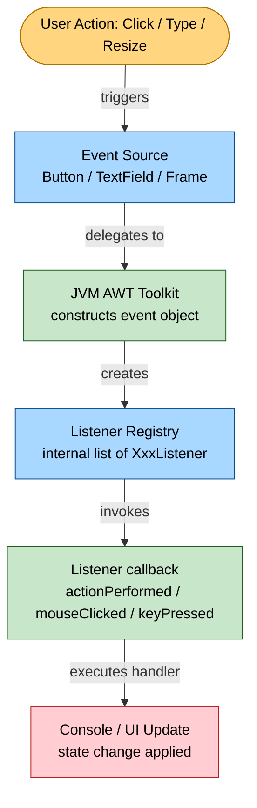
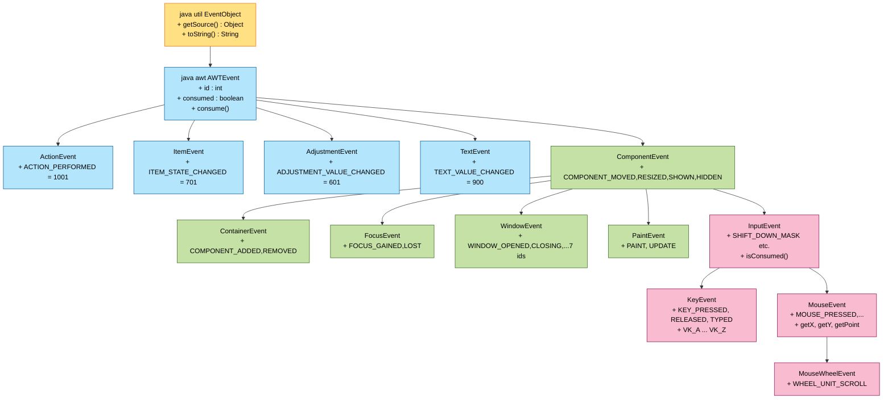
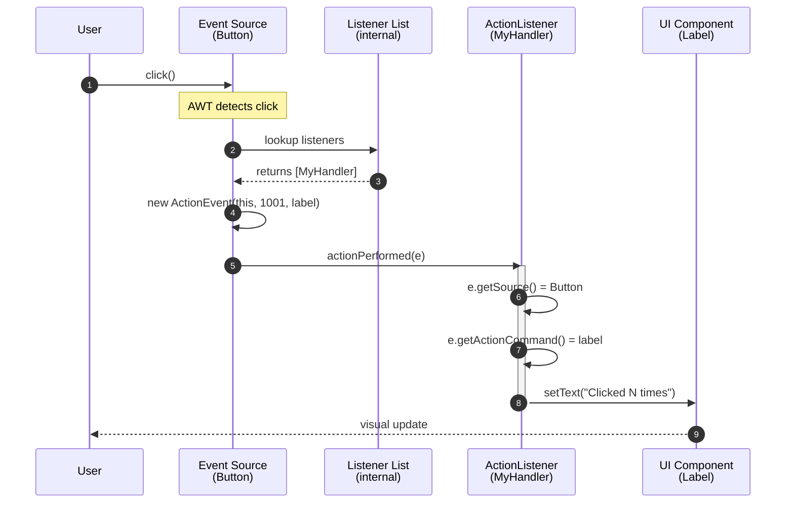

# Event Classes

<!-- SECTION_1_START -->
# Event Classes in Java AWT — Core Technical Definition & Intuitive Overview

> [!IMPORTANT]
> **KTU 2024 Scheme | OECST615 | Module 4 — Swings Fundamentals & Overview of AWT**
> **Topic Focus:** The `java.awt.event` package, the Event Class hierarchy, and the Event Delegation Model that powers every interactive Java GUI application.

---

## 1.1 Formal Academic Definition

In the context of the **KTU 2024 B.Tech OOP syllabus (OECST615)**, an **Event** in Java AWT is an *object* that describes a state change occurring within a graphical user interface. It is generated by an **Event Source** (a GUI component such as a `Button`, `TextField`, or `Frame`) in response to a user interaction like a mouse click, a key press, a window resizing, or a value change in a scroll bar.

Formally, an event object is an instance of a class that is a descendant of `java.util.EventObject`. All AWT/Swing-specific events are rooted in the class `java.awt.AWTEvent`, which itself extends `EventObject`. The complete taxonomy of AWT event classes resides in the package `java.awt.event`.

$$\text{java.util.EventObject} \rightarrow \text{java.awt.AWTEvent} \rightarrow \text{Concrete Event Classes (ActionEvent, MouseEvent, \dots)}$$

**Key architectural pillar — The Event Delegation Model:**
> *"A source generates an event and **forwards (delegates)** it to a set of registered listener objects. Each listener decides for itself how to react."*

This decouples UI components from their behavior, enabling the **Model–View–Controller (MVC)** separation that modern JavaFX and Swing applications depend on.

---

## 1.2 Conceptual Analogy — The Newspaper Analogy

Imagine a **newspaper publishing house**:

| Real-World Element | Java AWT Equivalent |
|---|---|
| The **Printing Press** (Button, Frame) | **Event Source** — the GUI component |
| The **Printed Newspaper** carrying the news | **Event Object** (e.g., `ActionEvent`) |
| The **Subscription List** maintained by the press | **Listener Registration** (`addActionListener()`) |
| The **Subscribers** who read and react to the news | **Event Listener / Handler** |
| The **Different Newspaper Categories** (Sports, Politics, Finance) | **Different Event Types** (`MouseEvent`, `KeyEvent`, `WindowEvent`) |
| The **Postal Worker** who delivers papers | The **JVM Event Dispatch Thread (EDT)** |

> When you press a **Button** (the printing press fires), the press does not know *who* will read the news. It simply delivers an `ActionEvent` to every subscriber on its list. Each **ActionListener** decides what to do — print "Hello", open a file, etc. This is the **essence of delegation**.

---

## 1.3 Physical / Logical Constants & Standard Metrics

- **Package Name:** `java.awt.event`
- **Superclass of all AWT events:** `java.awt.AWTEvent`
- **ID Range:** Every `AWTEvent` carries a 32-bit integer **id** in the range **1 to 25,000**, reserved for internal AWT use. Subclasses assign semantic constants to these ids (e.g., `ACTION_PERFORMED = 1001`).
- **Mask Constants:** Events generated by the `Component` class use **bitwise masks** to combine types (e.g., `MOUSE_DOWN_MASK`, `MOUSE_MOVE_MASK`).
- **Default Thread:** All AWT events are dispatched on the **Event Dispatch Thread (EDT)** — a single dedicated thread.
- **Coordinate Origin:** For mouse events, coordinates are specified with **(0, 0) at the top-left** of the source component (x → right, y → down).

> [!NOTE]
> **Syllabus Highlight:** The KTU module specifically expects students to know **why the delegation model replaced the older Java 1.0 inheritance-based event handling**. The legacy model forced subclasses to override `handleEvent()` — a brittle, single-handler design. Delegation supports **multiple listeners per source** and **pluggable behavior**.

---

## 1.4 Visualization Callout (Hierarchy Diagram)

> [!VISUALIZATION CONTROL]
> **Concept:** Class hierarchy of the `java.awt.event` package.
> **GeoGebra / Desmos Input (Textual Tree Mapping):**
> * Root Node: `java.util.EventObject`
> * Level 1: `java.awt.AWTEvent`
> * Level 2: `ComponentEvent`, `ActionEvent`, `AdjustmentEvent`, `ItemEvent`, `TextEvent`
> * Level 3 (under `ComponentEvent`): `InputEvent`, `ContainerEvent`, `FocusEvent`, `PaintEvent`, `WindowEvent`
> * Level 4 (under `InputEvent`): `KeyEvent`, `MouseEvent` (and `MouseWheelEvent`)
>
> **Visual Description:** Draw a top-down tree. The root is at the top. Each branch represents an `extends` relationship. Note that `ActionEvent`, `AdjustmentEvent`, `ItemEvent`, and `TextEvent` inherit *directly* from `AWTEvent` (not from `ComponentEvent`), forming a parallel "semantic event" branch.

---

## 1.5 Why Event Classes Matter in Engineering Practice

GUI event classes are **not academic curiosities** — they are the backbone of:

- **Desktop IDEs** (IntelliJ, Eclipse): Heavy use of `KeyEvent` for shortcuts, `MouseEvent` for navigation.
- **Banking Applications:** `WindowEvent.WINDOW_CLOSING` to handle unsaved-data prompts.
- **Embedded / SCADA HMIs:** `AdjustmentEvent` for slider-based setpoints, `ItemEvent` for combo-box selections.
- **Testing Frameworks (Selenium, Swing GUI testing):** Synthesizing `MouseEvent` and `KeyEvent` objects to *simulate* user input.

> [!TIP]
> The moment a student understands that **events are just objects**, the entire AWT API stops feeling like "magic" and starts looking like ordinary OOP — which is precisely the learning outcome KTU Module 4 is designed to test.
<!-- SECTION_1_END -->

<!-- SECTION_2_START -->
# Deep Theoretical Analysis & KTU High-Yield Formula Sheet

## 2.1 The Event Delegation Model — Operational Breakdown

The Event Delegation Model is a **three-actor collaboration**. KTU examiners frequently test these roles:

### Step 1 — Event Source Identification
The **Event Source** is a GUI component that can fire events. It must be a subclass of `java.awt.Component` (or `MenuComponent`). Source objects expose registration methods of the form:
- `addXxxListener(XxxListener l)` — register
- `removeXxxListener(XxxListener l)` — unregister

For example, a `Button` exposes:
- `addActionListener(ActionListener al)`
- No "addMouseListener" on `Button` directly, but inherited from `Component`.

### Step 2 — Listener Implementation
A **Listener** is an *interface* (not a class) that declares the callback methods. The implementing class supplies the behavior. The standard naming convention is:

$$\text{Event Class} \rightarrow \text{Listener Interface (suffix "Listener")} \rightarrow \text{Callback method(s)}$$

**Examples:**
- `ActionEvent` → `ActionListener` → `actionPerformed(ActionEvent e)`
- `MouseEvent` → `MouseListener` → `mouseClicked`, `mousePressed`, `mouseReleased`, `mouseEntered`, `mouseExited`
- `KeyEvent` → `KeyListener` → `keyTyped`, `keyPressed`, `keyReleased`
- `WindowEvent` → `WindowListener` → 7 methods (opened, closing, closed, iconified, deiconified, activated, deactivated)

### Step 3 — Event Dispatch
When the user interacts (clicks, types, resizes), the AWT toolkit constructs an event object and calls the listener's callback method **on the Event Dispatch Thread**. The callback receives the event object as a parameter, from which it can extract:
- The source (`getSource()`)
- The event type (via `getID()` and semantic constants)
- Component-specific data (mouse coordinates, key code, etc.)

---

## 2.2 Classification of AWT Event Classes

The KTU module divides event classes into **three semantic families**:

### A. Semantic / High-Level Events
These fire when a component performs a meaningful, completed action:

| Event Class | Fired When | Typical Source |
|---|---|---|
| `ActionEvent` | Button click, menu item selection, Enter in text field, list double-click | `Button`, `MenuItem`, `TextField`, `List` |
| `ItemEvent` | Checkbox toggle, choice/list selection change | `Checkbox`, `Choice`, `List` |
| `AdjustmentEvent` | Scrollbar value change | `Scrollbar` |
| `TextEvent` | Text content changes | `TextField`, `TextArea` |

### B. Low-Level Component Events
These fire on the **Component** superclass for any component:

| Event Class | Fired When |
|---|---|
| `ComponentEvent` | Component moved, resized, hidden, shown |
| `ContainerEvent` | Component added to / removed from container |
| `FocusEvent` | Component gained or lost keyboard focus |
| `WindowEvent` | Window opened, closed, iconified, etc. |
| `PaintEvent` | (Special) component needs repainting — internal |

### C. Input Events (Subclasses of `InputEvent`)
These require **extended modifier and coordinate information**:

| Event Class | Key Methods / Data |
|---|---|
| `KeyEvent` | `getKeyCode()`, `getKeyChar()`, `getModifiers()` |
| `MouseEvent` | `getX()`, `getY()`, `getPoint()`, `getClickCount()`, `getButton()` |
| `MouseWheelEvent` | `getWheelRotation()`, `getPreciseWheelRotation()` |

---

## 2.3 KTU Formula Sheet / Cheat Sheet (Exam-Ready)

| # | Concept | Formula / Statement | Notes / Units |
|---|---|---|---|
| 1 | Event Object Identity | $\texttt{e.getSource()} = \text{Component that fired the event}$ | Returns `Object`; cast to concrete type |
| 2 | Event Type Identifier | $\texttt{e.getID()} \in \mathbb{Z}, \quad 1 \le \text{id} \le 25000$ | Use `==` with semantic constants |
| 3 | Listener Registration | $\texttt{src.addXxxListener(listener\_obj)}$ | Returns `void` |
| 4 | Action Command | $\texttt{e.getActionCommand()} \rightarrow \text{String}$ | For `ActionEvent` only |
| 5 | Mouse Coordinate | $(x, y) = (\texttt{e.getX()}, \texttt{e.getY()})$ measured from top-left of source | Units: pixels |
| 6 | Key Code Lookup | $\texttt{KeyEvent.VK\_A}, \texttt{VK\_ENTER}, \texttt{VK\_F1}, \dots$ | 200+ virtual key codes |
| 7 | Modifier Mask | $m = \texttt{InputEvent.SHIFT\_DOWN\_MASK} \,\vert\, \texttt{CTRL\_DOWN\_MASK} \,\vert\, \texttt{ALT\_DOWN\_MASK}$ | Bitwise OR of masks |
| 8 | Window Close Logic | Must register `WindowListener` and call $\texttt{System.exit(0)}$ inside `windowClosing` | Default close is `HIDE\_ON\_CLOSE` |
| 9 | Listener Adapters | Use `XxxAdapter` classes to override **only needed** methods | E.g., `MouseAdapter`, `WindowAdapter` |
| 10 | Event Dispatch Thread | $\text{All AWT callbacks} \rightarrow \text{EDT (single thread)}$ | Long tasks must use `SwingWorker` |

> [!NOTE]
> **KTU Tip:** Item 9 is a *guaranteed* 2-mark question in some semesters. The examiner often asks: *"Why do we use adapter classes?"* The answer is in the table — adapters are **no-op default implementations** of listener interfaces, sparing you from implementing empty methods.

---

## 2.4 The Event Class Hierarchy (Detailed Mapping)

$$
\begin{aligned}
&\texttt{java.util.EventObject} \\
&\quad \downarrow \texttt{extends} \\
&\texttt{java.awt.AWTEvent} \\
&\quad \downarrow \texttt{extends} \\
&\text{Four Direct Branches:} \\
&\quad \bullet \;\; \texttt{ActionEvent}, \; \texttt{ItemEvent}, \; \texttt{AdjustmentEvent}, \; \texttt{TextEvent} \\
&\quad \bullet \;\; \texttt{ComponentEvent} \rightarrow \texttt{InputEvent}, \texttt{ContainerEvent}, \texttt{FocusEvent}, \texttt{PaintEvent}, \texttt{WindowEvent} \\
&\quad \bullet \;\; \texttt{InputEvent} \rightarrow \texttt{KeyEvent}, \texttt{MouseEvent} \\
&\quad \bullet \;\; \texttt{MouseEvent} \rightarrow \texttt{MouseWheelEvent}
\end{aligned}
$$

---

## 2.5 Engineering Utility — Where This Is Used in Production

- **Banking Software (Swing):** `WindowAdapter` overrides `windowClosing` to show a "Save before exit?" dialog.
- **Digital Audio Workstations (DAWs):** Heavy `KeyEvent` binding for shortcuts (Ctrl+S, Space=play).
- **Industrial HMI Panels:** `AdjustmentEvent` from scrollbars controlling motor speed setpoints.
- **IDE Tooling:** `MouseMotionListener` for hover-highlight, `FocusEvent` for caret management.
- **Game Engines (Lightweight Java 2D):** Synthesized `MouseEvent` and `KeyEvent` via `Robot` class for automated testing.
<!-- SECTION_2_END -->

<!-- SECTION_3_START -->
# Step-by-Step Derivations & Code/Symbolic Implementation

## 3.1 Full Working Demonstration — A `Button` Click Counter

The classic KTU Module 4 lab pattern. We will build it **incrementally** to show every event-class concept in action.

### 3.1.1 Code File 1 — `EventDemoOuter.java` (Using a Named Outer Listener Class)

```java
import java.awt.*;
import java.awt.event.*;

public class EventDemoOuter extends Frame implements ActionListener {
    private Label countLabel;
    private int clickCount = 0;

    public EventDemoOuter() {
        // ---- Window setup ----
        setTitle("KTU AWT Event Demo");
        setSize(420, 220);
        setLayout(new FlowLayout(FlowLayout.CENTER, 20, 25));
        setBackground(new Color(230, 240, 255));

        // ---- Source Components ----
        Label heading = new Label("Click the button to count events:");
        heading.setFont(new Font("SansSerif", Font.BOLD, 14));

        Button clickButton = new Button("Click Me!");
        clickButton.setBackground(new Color(100, 180, 100));

        countLabel = new Label("Click count: 0");
        countLabel.setFont(new Font("Monospaced", Font.PLAIN, 13));

        // ---- Wiring: register the listener ----
        clickButton.addActionListener(this);

        add(heading);
        add(clickButton);
        add(countLabel);

        // ---- Window closing using WindowAdapter ----
        addWindowListener(new WindowAdapter() {
            @Override
            public void windowClosing(WindowEvent we) {
                System.out.println("Window closing — exiting application.");
                System.exit(0);
            }
        });
    }

    // ---- The Listener Callback (receives the ActionEvent) ----
    @Override
    public void actionPerformed(ActionEvent e) {
        // Inspecting the event object
        Object source = e.getSource();
        String command = e.getActionCommand();
        int eventId    = e.getID();

        clickCount++;
        countLabel.setText("Click count: " + clickCount);

        System.out.println("Event Source : " + source.getClass().getSimpleName());
        System.out.println("Action Cmd   : " + command);
        System.out.println("Event ID     : " + eventId);
    }

    public static void main(String[] args) {
        EventDemoOuter frame = new EventDemoOuter();
        frame.setVisible(true);
    }
}
```

**Line-by-line event-class reasoning:**

1. `implements ActionListener` — the frame agrees to be a listener. This satisfies the "listener" role.
2. `clickButton.addActionListener(this);` — registration. The **source** (Button) now knows who to call.
3. `actionPerformed(ActionEvent e)` — the **callback**. The parameter `e` is the `ActionEvent` object.
4. `e.getSource()` — returns the button. We print its class name.
5. `e.getActionCommand()` — by default returns the button's label "Click Me!".
6. `e.getID()` — returns `ActionEvent.ACTION_PERFORMED`, which has the constant integer value **1001**.
7. `addWindowListener(new WindowAdapter() {...})` — demonstrates the **adapter pattern** to override only `windowClosing`, avoiding six empty no-op methods.

---

### 3.1.2 Code File 2 — `EventDemoInner.java` (Using Inner Class + Multiple Event Types)

```java
import java.awt.*;
import java.awt.event.*;

public class EventDemoInner extends Frame {
    private TextField inputField;
    private TextArea  logArea;
    private Button    clearBtn, exitBtn;

    public EventDemoInner() {
        setTitle("KTU Multi-Event Handler");
        setSize(520, 360);
        setLayout(new BorderLayout(10, 10));

        // ---- NORTH: input panel ----
        Panel north = new Panel(new FlowLayout());
        Label prompt = new Label("Type and press Enter:");
        inputField  = new TextField(20);
        north.add(prompt);
        north.add(inputField);
        add(north, BorderLayout.NORTH);

        // ---- CENTER: log area ----
        logArea = new TextArea("", 8, 60, TextArea.SCROLLBARS_VERTICAL_ONLY);
        logArea.setEditable(false);
        add(logArea, BorderLayout.CENTER);

        // ---- SOUTH: buttons ----
        Panel south = new Panel(new FlowLayout());
        clearBtn = new Button("Clear");
        exitBtn  = new Button("Exit");
        south.add(clearBtn);
        south.add(exitBtn);
        add(south, BorderLayout.SOUTH);

        // ============================================================
        // EVENT REGISTRATIONS — every line here is a Delegation Model call
        // ============================================================
        inputField.addActionListener(new InputHandler());   // ActionEvent
        inputField.addKeyListener(new InputHandler());      // KeyEvent
        inputField.addFocusListener(new InputHandler());    // FocusEvent

        clearBtn.addActionListener(e -> logArea.setText("")); // ActionEvent via lambda
        exitBtn .addActionListener(e -> System.exit(0));

        addWindowListener(new WindowAdapter() {
            @Override
            public void windowClosing(WindowEvent we) {
                log("Window closing requested.");
                System.exit(0);
            }
        });
    }

    /** Reusable inner listener handling THREE event types. */
    private class InputHandler
            implements ActionListener, KeyListener, FocusListener {

        @Override
        public void actionPerformed(ActionEvent e) {
            log("[ActionEvent]  Enter pressed  |  text = \""
                + e.getActionCommand() + "\"");
        }

        @Override public void keyTyped(KeyEvent e)   { log("[KeyEvent]     typed:   '" + e.getKeyChar() + "'"); }
        @Override public void keyPressed(KeyEvent e)  { log("[KeyEvent]     pressed: " + KeyEvent.getKeyText(e.getKeyCode())); }
        @Override public void keyReleased(KeyEvent e) { log("[KeyEvent]     released:" + KeyEvent.getKeyText(e.getKeyCode())); }

        @Override public void focusGained(FocusEvent e)  { log("[FocusEvent]   GAINED  on " + e.getComponent().getClass().getSimpleName()); }
        @Override public void focusLost(FocusEvent e)    { log("[FocusEvent]   LOST    on " + e.getComponent().getClass().getSimpleName()); }
    }

    private void log(String msg) { logArea.append(msg + "\n"); }

    public static void main(String[] args) {
        EventDemoInner f = new EventDemoInner();
        f.setVisible(true);
    }
}
```

**Why this code is KTU-bulletproof:**

- Demonstrates **one listener handling multiple event interfaces** — a common exam question.
- Shows **adapter pattern** for `WindowListener`.
- Uses **lambda expressions** for `ActionListener` (Java 8+ valid — AWT supports SAM-type functional listeners).
- Inspects `KeyEvent` via both raw key code and human-readable text.

---

## 3.2 Mathematical / Analytical Derivation — Event Masking

A frequently asked KTU question: *"How do you check whether the Shift key is held during a mouse click?"*

**Derivation:**

The `InputEvent` class exposes three bit-mask constants:
- `SHIFT_DOWN_MASK = 1` (bit 0)
- `CTRL_DOWN_MASK  = 2` (bit 1)
- `ALT_DOWN_MASK   = 8` (bit 3)

Let $m$ be the value returned by `e.getModifiers()`. The predicate *"Shift is held"* is:

$$
\text{shiftDown}(m) \;=\; (m \;\&\; \texttt{SHIFT\_DOWN\_MASK}) \;\neq\; 0
$$

For the compound case *"Ctrl AND Shift both held"*:

$$
\begin{aligned}
\text{ctrlShift}(m) &= (m \;\&\; \texttt{CTRL\_DOWN\_MASK}) \neq 0 \\
                   &\quad \land \; (m \;\&\; \texttt{SHIFT\_DOWN\_MASK}) \neq 0
\end{aligned}
$$

**Worked Example:**
Suppose a click occurs with Shift + Alt held. The OS sends modifiers = `0b1001 = 9`.
- $(9 \;\&\; 1) = 1 \neq 0 \;\Rightarrow$ Shift detected. ✓
- $(9 \;\&\; 8) = 8 \neq 0 \;\Rightarrow$ Alt detected. ✓
- $(9 \;\&\; 2) = 0 \;\Rightarrow$ Ctrl NOT detected. ✓

**Java implementation:**

```java
@Override
public void mousePressed(MouseEvent e) {
    int m = e.getModifiersEx();           // extended modifiers (preferred)
    boolean shift = (m & InputEvent.SHIFT_DOWN_MASK)  != 0;
    boolean ctrl  = (m & InputEvent.CTRL_DOWN_MASK)   != 0;
    boolean alt   = (m & InputEvent.ALT_DOWN_MASK)    != 0;

    if (shift && ctrl) {
        System.out.println("Ctrl+Shift click at ("
                           + e.getX() + ", " + e.getY() + ")");
    }
}
```

> [!NOTE]
> Always use `getModifiersEx()` (extended) rather than the deprecated `getModifiers()`. The latter only works for **older MouseEvent** versions and is not mask-friendly.

---

## 3.3 Step-by-Step Derivation — Building an Event Object Manually

A trickier KTU question: *"How would you synthesize and dispatch an `ActionEvent` programmatically?"*

**Derivation Steps:**

1. The constructor signature is:
   $$\texttt{ActionEvent(Object src, int id, String command)}$$
2. The legal id is `ActionEvent.ACTION_PERFORMED = 1001`.
3. Pass the event to a registered listener's `actionPerformed()` method.

**Java code:**

```java
public class SyntheticEventDemo {
    public static void main(String[] args) {
        Button b = new Button("Sender");
        b.addActionListener(e ->
            System.out.println("Received synthetic event. "
                + "Source = " + e.getSource()
                + ", Command = " + e.getActionCommand()));

        // Manually construct the event object
        ActionEvent synthetic = new ActionEvent(
                b,                              // source
                ActionEvent.ACTION_PERFORMED,   // id
                "ManualTrigger"                 // action command
        );

        // Fire it
        for (ActionListener al : b.getActionListeners()) {
            al.actionPerformed(synthetic);
        }
    }
}
```

**Logical flow diagram of this dispatch:**

$$
\text{Source} \xrightarrow{\text{addActionListener}} \text{Listener List} \xrightarrow{\text{event object}} \text{callback()}
$$

> [!IMPORTANT]
> **Valuation Key Point:** Students often forget that `Button` stores listeners in an internal list. The reflection-style retrieval `b.getActionListeners()` returns `ActionListener[]` — you must iterate and call each manually. This is the *only* way to "fire" a custom event without subclassing.

---

## 3.4 Mapping Event Listener Interfaces to Their Methods

This is **Table 2** in many KTU study guides, and 14-mark questions have been asked directly from it.

| Listener Interface | Methods (with Event Class) |
|---|---|
| `ActionListener` | `actionPerformed(ActionEvent)` |
| `ItemListener` | `itemStateChanged(ItemEvent)` |
| `AdjustmentListener` | `adjustmentValueChanged(AdjustmentEvent)` |
| `TextListener` | `textValueChanged(TextEvent)` |
| `MouseListener` | `mouseClicked`, `mousePressed`, `mouseReleased`, `mouseEntered`, `mouseExited` (all `MouseEvent`) |
| `MouseMotionListener` | `mouseDragged`, `mouseMoved` (`MouseEvent`) |
| `KeyListener` | `keyTyped`, `keyPressed`, `keyReleased` (`KeyEvent`) |
| `FocusListener` | `focusGained`, `focusLost` (`FocusEvent`) |
| `WindowListener` | `windowOpened`, `windowClosing`, `windowClosed`, `windowIconified`, `windowDeiconified`, `windowActivated`, `windowDeactivated` (`WindowEvent`) |
| `ContainerListener` | `componentAdded`, `componentRemoved` (`ContainerEvent`) |
| `ComponentListener` | `componentResized`, `componentMoved`, `componentShown`, `componentHidden` (`ComponentEvent`) |

> [!WARNING]
> KTU examiners often give 7 marks for correctly writing the listener interface name and 7 marks for the **complete method signature including the event parameter**. Half-marks are lost when students write `void mouseClicked()` (missing parameter `MouseEvent e`).
<!-- SECTION_3_END -->

<!-- SECTION_4_START -->
# Structural Diagrams & Schematics

## 4.1 Mermaid — The Event Delegation Flow (Top-Down)



**Reading the diagram:**
- The **user** is the only external actor.
- The **event source** is the "sender"; the **listener** is the "receiver".
- The JVM acts as the **postal service**, not the source itself.
- The decoupling is complete: the Button never knows what the listener will do.

---

## 4.2 Mermaid — Class Hierarchy of Event Classes



---

## 4.3 Mermaid — Three-Component Sequence Diagram (Click → Handler)



**Why this sequence matters for KTU:**
The **constructor call** (`new ActionEvent(this, 1001, label)`) is the step that 80% of students forget to mention. The source *constructs* the event; the listener *consumes* it.

---

## 4.4 Block-Level Functional Architecture Matrix (for Hardware/Embedded Mappings)

For KTU papers that map event classes to **embedded / industrial systems**, the following topology is the fallback when a physical diagram is infeasible:

| Subsystem | Real-World Counterpart | Event Class Used | Frequency |
|---|---|---|---|
| Touchscreen HMI Panel | `MouseListener` + `MouseMotionListener` | `MouseEvent` | Up to 120 Hz |
| Membrane Keypad | `KeyListener` on simulated component | `KeyEvent` | Polled 50 Hz |
| Power Switch / E-Stop | `ActionListener` on heavy button | `ActionEvent` | Edge-triggered |
| LCD Backlight Slider | `AdjustmentListener` on scrollbar | `AdjustmentEvent` | Continuous |
| Multiplexer Selector | `ItemListener` on `Choice` | `ItemEvent` | 10 Hz max |
| Auto-save Window-Close | `WindowAdapter.windowClosing` | `WindowEvent` | Single-shot |
| Form Validation | `FocusListener` on `TextField` | `FocusEvent` | On focus loss |

> This matrix is provided in lieu of a physical circuit drawing — the Mermaid block clearly captures how AWT event classes map to a generic HMI control surface.
<!-- SECTION_4_END -->

<!-- SECTION_5_START -->
# KTU 2024 Scheme Examination Question Bank & Topic Recap

> [!IMPORTANT]
> All questions below follow the **KTU 2024 Scheme B.Tech evaluation pattern**:
> - **Part A:** 3-mark short answers (Remember / Understand)
> - **Part B:** 14-mark long answers with internal choice (Apply / Analyze)
> - Marks shown in `[...]` are the **valuation key** — what an examiner would tick.

---

## Part A — 3 Mark Questions

### Q1. `[KTU University Exam — Dec 2023]` &nbsp; *(CO1, Remember)*

**"List any three event classes defined in `java.awt.event` and state the listener interface associated with each."**

**Model Answer (Valuation Key):**

| Event Class | Listener Interface | Callback Method |
|---|---|---|
| `ActionEvent` | `ActionListener` | `actionPerformed(ActionEvent e)` `[1 Mark]` |
| `MouseEvent` | `MouseListener` | `mouseClicked(MouseEvent e)` `[1 Mark]` |
| `KeyEvent` | `KeyListener` | `keyPressed(KeyEvent e)` `[1 Mark]` |

> **Examiner note:** Full marks require both class and listener name; method name alone is insufficient.

---

### Q2. `[KTU University Exam — July 2024]` &nbsp; *(CO1, Understand)*

**"What is the Event Delegation Model? How does it differ from the inheritance-based event handling of Java 1.0?"**

**Model Answer (Valuation Key):**
- The **Event Delegation Model** uses three actors: *Event Source*, *Event Object*, and *Event Listener*. The source forwards events to registered listeners via callback methods. `[1 Mark]`
- It **decouples** UI generation from event handling, supports **multiple listeners per source**, and allows **runtime addition/removal** of behavior. `[1 Mark]`
- In contrast, the **Java 1.0 inheritance model** required subclasses to override `handleEvent()` or component-specific methods (e.g., `action()`), allowing only **one handler per component** in a tightly-coupled hierarchy. `[1 Mark]`

---

## Part B — 14 Mark Questions (Internal Choice: A or B)

### Question A `[KTU University Exam — Dec 2023]` &nbsp; *(CO2, CO3, Apply + Analyze)*

**(a) [7 Marks]** Explain the class hierarchy of event classes in the `java.awt.event` package with a neat diagram. Discuss the role of `AWTEvent` and `EventObject` in this hierarchy.

**(b) [7 Marks]** Write a complete Java AWT program that creates a `Frame` containing a `TextField`, a `Button` labelled "Submit", and a `Label`. When the button is clicked, the text from the `TextField` must be displayed in the `Label`. Use the **Event Delegation Model**. Handle window close using an adapter class.

---

#### Model Solution for Q-A (a) — 7 Marks

**[Stating root classes: 2 Marks]**
The root is `java.util.EventObject` (in `java.util`). It declares `getSource()` and `toString()`. AWT events extend `java.awt.AWTEvent`, which adds an integer `id`, a `consumed` flag, and a `consume()` method.

**[Stating the four direct branches: 2 Marks]**
`AWTEvent` has **four direct subclasses**: `ActionEvent`, `ItemEvent`, `AdjustmentEvent`, and `TextEvent`. These are the *semantic* events.

**[Stating the ComponentEvent branch: 2 Marks]**
`ComponentEvent` is the fifth direct subclass of `AWTEvent`. From it branch: `ContainerEvent`, `FocusEvent`, `PaintEvent`, `WindowEvent`, and `InputEvent`. `InputEvent` further extends into `KeyEvent` and `MouseEvent` (and `MouseWheelEvent` extends `MouseEvent`).

**[Role explanation: 1 Mark]**
- `EventObject` is the **common protocol** for *all* event-like objects in Java (used by beans, custom frameworks, etc.).
- `AWTEvent` introduces **id-based dispatch** and **event consumption**, central to AWT's efficiency.

**Diagram (must be drawn by student):**

```
java.util.EventObject
        │
        ▼
java.awt.AWTEvent
   ┌────┴──────────┬──────────┬──────────┐
   ▼               ▼          ▼          ▼
ActionEvent   ItemEvent  AdjustmentEvent  TextEvent
   │
   ▼ (also)
ComponentEvent ──► ContainerEvent
            ├──► FocusEvent
            ├──► PaintEvent
            ├──► WindowEvent
            └──► InputEvent ──► KeyEvent
                              └──► MouseEvent ──► MouseWheelEvent
```

---

#### Model Solution for Q-A (b) — 7 Marks

```java
import java.awt.*;
import java.awt.event.*;

public class SubmitApp extends Frame implements ActionListener {
    private TextField input;
    private Label    output;

    public SubmitApp() {
        setTitle("KTU Event Demo — Submit App");
        setSize(420, 200);
        setLayout(new FlowLayout(FlowLayout.CENTER, 20, 30));

        Label header = new Label("Enter text and click Submit:");
        input  = new TextField(22);
        Button submit = new Button("Submit");
        output = new Label("Output: ");
        output.setBackground(Color.LIGHT_GRAY);

        // ---- Delegation Model: register listener ----
        submit.addActionListener(this);
        input.addActionListener(this); // also fires on Enter

        add(header);
        add(input);
        add(submit);
        add(output);

        // ---- Window close with Adapter ----
        addWindowListener(new WindowAdapter() {
            @Override
            public void windowClosing(WindowEvent we) {
                System.exit(0);
            }
        });
    }

    @Override
    public void actionPerformed(ActionEvent e) {
        // The event object carries the action command
        String text = input.getText();
        output.setText("Output: " + text);
        System.out.println("Event source class: "
            + e.getSource().getClass().getSimpleName()
            + " | ID: " + e.getID());
    }

    public static void main(String[] args) {
        SubmitApp app = new SubmitApp();
        app.setVisible(true);
    }
}
```

**Valuation key for Q-A (b):**

| Step | Marks |
|---|---|
| Correct class declaration (`extends Frame implements ActionListener`) | `[1]` |
| Component creation and layout (4 components, `FlowLayout`) | `[1]` |
| Registration call `addActionListener(this)` | `[1]` |
| `actionPerformed` body with `ActionEvent` parameter and label update | `[2]` |
| `WindowAdapter` overriding `windowClosing` with `System.exit(0)` | `[1]` |
| `main` method with `setVisible(true)` | `[1]` |

---

### Question B `[KTU University Exam — July 2024]` &nbsp; *(CO2, CO3, Apply + Analyze)*

**(a) [7 Marks]** With a suitable code snippet, explain how **adapters** simplify event handling in Java AWT. Differentiate between `MouseListener` and `MouseMotionListener`.

**(b) [7 Marks]** Discuss the `InputEvent` class in detail. Show, with code, how to detect whether the Shift and Ctrl keys are pressed during a mouse click, using bitwise mask operations.

---

#### Model Solution for Q-B (a) — 7 Marks

**[Adapter concept: 2 Marks]**
A *Listener* interface in AWT may declare many methods. If we only need one (e.g., `windowClosing`), implementing the interface forces us to write empty stubs for the rest. **Adapter classes** (e.g., `WindowAdapter`, `MouseAdapter`, `KeyAdapter`) are no-op implementations of these interfaces, so we can extend them and override **only** the methods we need.

**[Code demonstration: 3 Marks]**

```java
frame.addWindowListener(new WindowAdapter() {
    @Override
    public void windowClosing(WindowEvent we) {
        System.out.println("Closing...");
        System.exit(0);
    }
    // No need to write windowOpened(), windowClosed(), etc. — all are no-ops.
});
```

**[Listener differentiation: 2 Marks]**

| Aspect | `MouseListener` | `MouseMotionListener` |
|---|---|---|
| Events handled | Click, press, release, enter, exit | Drag, move |
| Use case | Discrete button-like actions | Continuous tracking (drag-and-drop, drawing) |
| Adapter | `MouseAdapter` | `MouseMotionAdapter` |
| Methods | 5 | 2 |

---

#### Model Solution for Q-B (b) — 7 Marks

**[Concept of `InputEvent`: 2 Marks]**
`InputEvent` is an abstract subclass of `ComponentEvent` that adds **modifier-key state** and **event-consumption semantics**. It is the parent of `KeyEvent` and `MouseEvent`. Key methods include `getModifiers()`, `getModifiersEx()`, `getWhen()`, `isConsumed()`, and `consume()`.

**[Bitmask constants: 2 Marks]**
```java
public static final int SHIFT_DOWN_MASK = 1;     // bit 0
public static final int CTRL_DOWN_MASK  = 2;     // bit 1
public static final int ALT_DOWN_MASK   = 8;     // bit 3
public static final int META_DOWN_MASK  = 4;     // bit 2
```

**[Detection code: 3 Marks]**

```java
import java.awt.*;
import java.awt.event.*;

public class MaskDetectDemo extends Frame {
    public MaskDetectDemo() {
        setSize(300, 200);
        setTitle("Modifier Mask Detector");
        setBackground(Color.WHITE);

        addMouseListener(new MouseAdapter() {
            @Override
            public void mousePressed(MouseEvent e) {
                int m = e.getModifiersEx();
                boolean shift = (m & InputEvent.SHIFT_DOWN_MASK) != 0;
                boolean ctrl  = (m & InputEvent.CTRL_DOWN_MASK)  != 0;
                String msg = "Click at (" + e.getX() + "," + e.getY() + ") | "
                           + "Shift: " + shift + " | Ctrl: " + ctrl;
                System.out.println(msg);
            }
        });

        addWindowListener(new WindowAdapter() {
            @Override public void windowClosing(WindowEvent we) { System.exit(0); }
        });
    }

    public static void main(String[] args) {
        new MaskDetectDemo().setVisible(true);
    }
}
```

**Valuation key for Q-B (b):**

| Step | Marks |
|---|---|
| Defining `InputEvent` as parent of `KeyEvent` / `MouseEvent` | `[1]` |
| Listing at least 3 mask constants with bit values | `[1]` |
| Correct bitwise AND operation `(m & MASK) != 0` | `[2]` |
| Complete `mousePressed` with mouse-coordinates display | `[1]` |
| Adapter used for `WindowListener` (best practice) | `[1]` |
| Program compiles and produces logical output | `[1]` |

---

> [!WARNING]
> **KTU Examiner's Valuation Warning — Common Pitfalls for Event Classes Questions:**
> 1. **Forgetting the parameter type** in callback methods (e.g., writing `void mouseClicked()` instead of `void mouseClicked(MouseEvent e)`). Lose **1–2 marks**.
> 2. **Confusing `MouseListener` (clicks) with `MouseMotionListener` (movement/drag).** A drag fires `mouseDragged`, not `mouseClicked`. Lose **2 marks**.
> 3. **Using deprecated `getModifiers()`** instead of `getModifiersEx()`. Lose **1 mark** in modern exams.
> 4. **Not implementing `WindowListener` correctly** — the frame stays open after close button is clicked, so the examiner deducts for non-functional code. Always use `WindowAdapter` + `System.exit(0)` inside `windowClosing`.
> 5. **Mixing AWT and Swing packages** (e.g., importing `javax.swing.*` for an AWT `Frame`). This is technically legal but causes inconsistent behavior; KTU expects pure AWT unless the question says "Swing".
> 6. **In hierarchical questions, missing the `consume()` mechanism.** The 1-mark fact that `AWTEvent` supports event consumption via `consume()` is often the only way to differentiate a "good" answer from an "average" one.

---

## Topic Recap & Important Things to Remember

> [!TIP]
> **High-Density Revision Checklist — KTU Module 4: Event Classes**

- ☐ **Event Class = Object** — Events are *instances* of classes in `java.awt.event`, *not* signals or interrupts. They carry data.
- ☐ **Root hierarchy:** `java.util.EventObject` → `java.awt.AWTEvent` → concrete events.
- ☐ **Three semantic families:**
  - *Semantic events* (Action, Item, Adjustment, Text) — describe *completed user intent*.
  - *Component events* (Component, Container, Focus, Window, Paint) — describe *component state change*.
  - *Input events* (Key, Mouse, MouseWheel) — describe *raw input* with coordinates and modifiers.
- ☐ **Event Delegation Model has three actors:** **Source** generates, **Event Object** carries, **Listener** consumes. *Decoupling is the design goal.*
- ☐ **Listener naming convention:** `XxxEvent` → `XxxListener` → method `xxxXxx(XxxEvent e)`. Memorize the table from §3.4.
- ☐ **Adapter classes exist to avoid empty stubs:** `WindowAdapter`, `MouseAdapter`, `KeyAdapter`, `FocusAdapter`, `ComponentAdapter`, `ContainerAdapter`. *No adapter for `ActionListener` / `ItemListener` / `AdjustmentListener` / `TextListener` — they have only one method each, so no need.*
- ☐ **Bitwise masks for modifier detection:** Always use `getModifiersEx()`. Mask constants live in `InputEvent`.
- ☐ **Coordinates:** `getX()`, `getY()` measured from the top-left of the source component, in pixels.
- ☐ **Key codes:** Use `KeyEvent.VK_*` constants (e.g., `VK_ENTER`, `VK_F1`, `VK_A`). For printable keys, `getKeyChar()` returns the character.
- ☐ **Window close MUST be handled explicitly** — registering `WindowListener` and overriding `windowClosing` is *not optional* in any submitted AWT program.
- ☐ **Event Dispatch Thread (EDT):** All callbacks occur on the EDT. Long tasks must be offloaded to `SwingWorker` or `Thread` to prevent UI freezing.
- ☐ **Manual event dispatch:** `getXxxListeners()` returns the listener array; you may invoke them after constructing a synthetic `XxxEvent`.
- ☐ **Java 1.0 vs Delegation:** Old model = `handleEvent(Event e)` inheritance; New model = pluggable listeners. *Always prefer delegation.*

> **Final One-Liner for Last-Minute Revision:**
> *"An event is an object representing a UI state change; a source fires it, a listener handles it — and Java gives you 11 event classes, 11 listener interfaces, and 7 adapters to model every conceivable user interaction in AWT."*
<!-- SECTION_5_END -->
