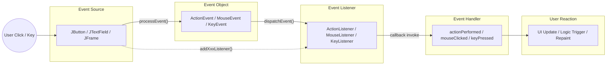
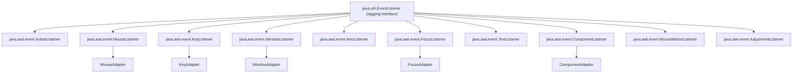
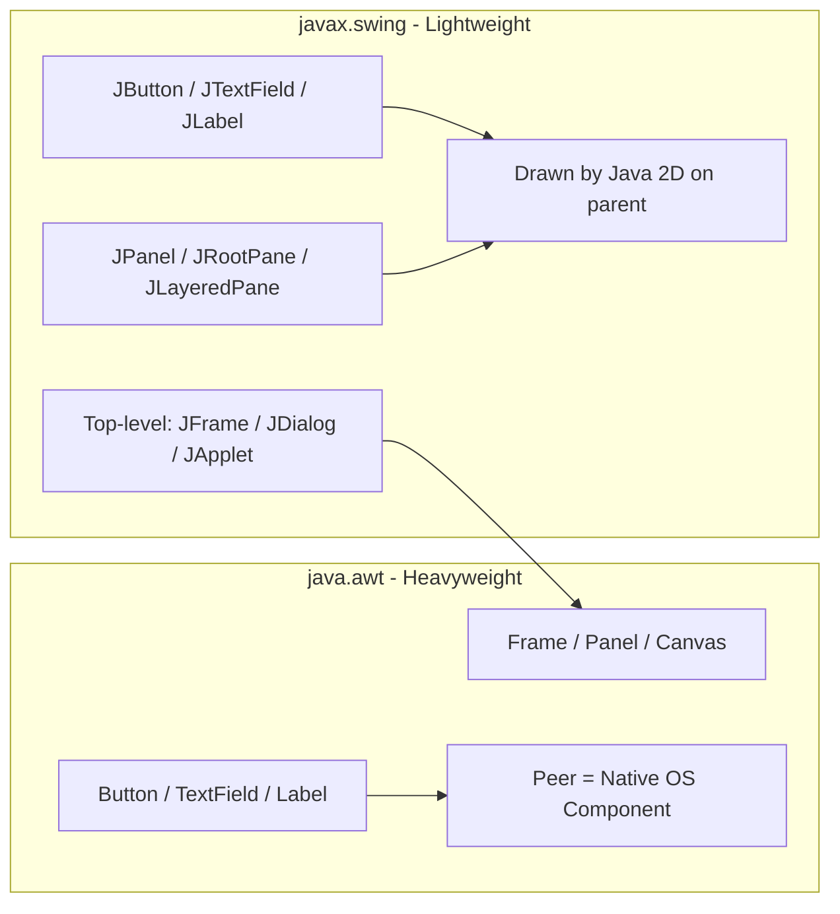
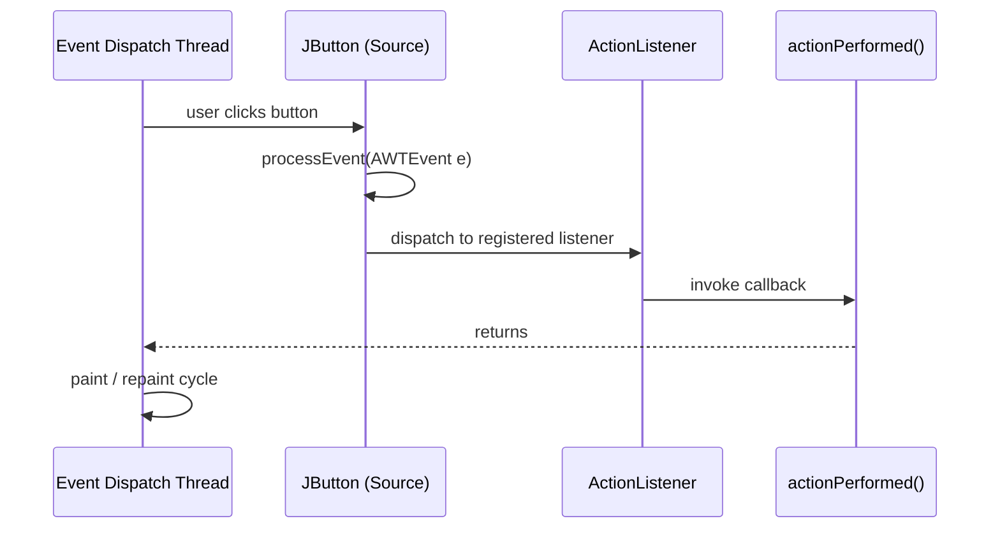
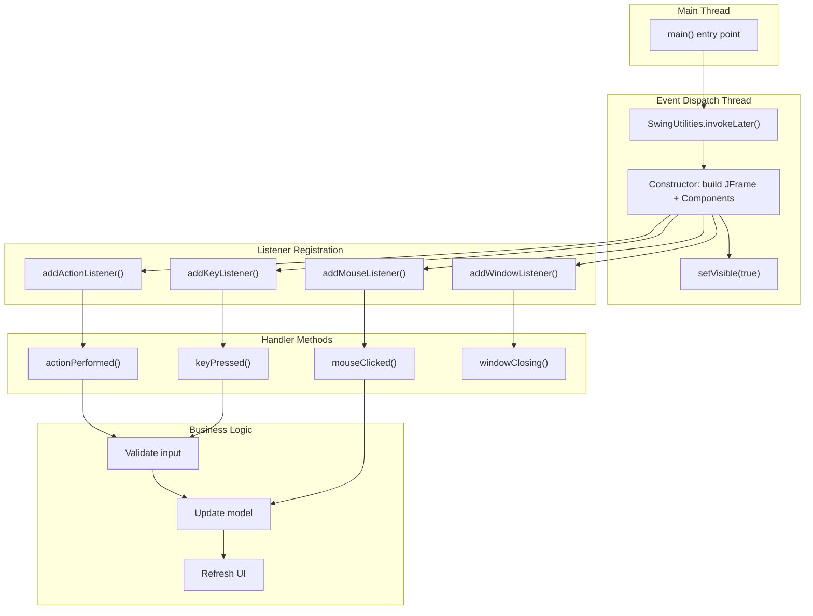

# Event handling  – Event Handling Mechanisms

<!-- SECTION_1_START -->
# Event Handling Mechanisms in Java AWT & Swing

> [!IMPORTANT]
> **KTU 2024 Scheme | OECST615 — Object Oriented Programming | Module 4**
> This module bridges **Abstract Window Toolkit (AWT)** and **Swing** with the **Delegation Event Model** — a mandatory topic for KTU university examinations, lab cycles, and viva voce.

## 1.1 Abstract Window Toolkit (AWT) — Formal Definition

**AWT (Abstract Window Toolkit)** is Java's original platform-dependent windowing, graphics, and user-interface toolkit packaged in `java.awt`. It provides primitive UI components (Button, TextField, Label, Choice, List, Checkbox, etc.) known as **Heavyweight Components** because every AWT component is backed by a peer object in the underlying host operating system.

> [!NOTE]
> **Heavyweight Component:** A component that relies on the host OS for its rendering and behavior (1 peer = 1 native resource).

## 1.2 Swing — Formal Definition

**Swing** is a part of **Java Foundation Classes (JFC)** located in `javax.swing`. It is a lightweight, pluggable look-and-feel (PLAF) GUI toolkit built on top of AWT. Every Swing component (prefixed with `J` — `JButton`, `JTextField`, `JLabel`, `JFrame`) is **lightweight** because it is rendered purely by Java code without a native peer, with the sole exception of top-level containers (`JFrame`, `JDialog`, `JApplet`).

> [!NOTE]
> **Lightweight Component:** A component that does not depend on the host OS for rendering; it draws itself on its parent's canvas using Java 2D APIs.

## 1.3 Event Handling — Formal Definition

**Event Handling** in Java is the mechanism that controls the response of a GUI component to user interactions (mouse clicks, key presses, window close, etc.). Java uses the **Delegation Event Model (DEM)**, where an event is generated by an **Event Source**, encapsulated in an **Event Object**, and forwarded to a registered **Event Listener** whose callback method executes the response.

### 1.4 Conceptual Analogy — The "Restaurant" Model

Imagine a fancy restaurant:

- **Event Source** = The kitchen counter (a Button or JButton)
- **Event Object** = The order slip (a specific `ActionEvent`)
- **Event Listener** = The waiter registered to take that order (`ActionListener`)
- **Event Handler Method** = The chef's recipe that actually cooks the food (`actionPerformed()`)
- **Event Source ↔ Listener Link** = A reservation registered via `addActionListener()`

When a customer clicks "Place Order," the slip is created and the designated waiter picks it up. The **source does not know what to do** — it just *delegates* the work, which is exactly the philosophy of Java's event model.

### 1.5 Key Terminology — Quick Reference

| Term | Bold Definition |
|------|-----------------|
| **Event Source** | The GUI object that generates an event (e.g., `JButton`). |
| **Event Object** | An object derived from `java.util.EventObject` describing the event. |
| **Event Listener** | An object that implements a listener interface to receive notifications. |
| **Event Handler** | The method inside the listener that processes the event. |
| **Delegation Event Model (DEM)** | Java's model where responsibility for handling an event is delegated from the source to a registered listener. |

> [!VISUALIZATION CONTROL]
> **Concept:** Coordinate plane of a Swing component with click events
> **GeoGebra / Desmos Input Equations:**
> * `Rect: (0,0) to (200,80)` representing a `JButton`
> * `ClickPoint: (100, 40)` representing a mouse press
> * `EventVector: from (100,40) to (105,40)` representing a `MouseEvent` with displacement
> **Visual Description:** A rectangular button on a Cartesian plane. A click is a discrete point with an event vector radiating outward — symbolizing that a single point of interaction triggers a chain of method calls into the listener.

---

<!-- SECTION_1_END -->

<!-- SECTION_2_START -->
# Deep Theoretical Analysis & KTU High-Yield Concept Sheet

## 2.1 The Delegation Event Model — Three Pillars

The Delegation Event Model has three principal actors, as mandated by the **java.awt.event** package:

1. **Event Source** — the originator (Button, JButton, JTextField, etc.)
2. **Event Object** — subclass of `java.util.EventObject`
3. **Event Listener Interface** — declared in `java.awt.event`

### 2.2 Step-by-Step Operational Logic

- **Step 1 — User Interaction:** The user performs an action (click, keypress, mouse-over).
- **Step 2 — Event Object Creation:** The JVM detects the interaction. The source's `processEvent()` method constructs an `EventObject` subclass (e.g., `ActionEvent`, `MouseEvent`, `KeyEvent`).
- **Step 3 — Event Dispatching:** The event object is passed to every listener registered on that source via `addXxxListener()`.
- **Step 4 — Handler Invocation:** Each listener invokes the corresponding callback (`actionPerformed`, `mouseClicked`, `keyPressed`, etc.).
- **Step 5 — UI Repaint:** After all listeners return, the AWT/Swing painting thread re-renders the component if marked *invalid*.

> [!IMPORTANT]
> **Why Delegation?** Earlier Java versions used an *inheritance-based* model (subclassing the component to override `handleEvent`). The Delegation Model decouples **event generation** from **event processing**, promoting reusable, modular code (one listener can handle many sources; one source can have many listeners).

## 2.3 Event Classes Hierarchy

```
java.util.EventObject                   (root)
        │
        └── java.awt.AWTEvent           (AWT ancestor)
                │
                ├── java.awt.event.ActionEvent
                ├── java.awt.event.AdjustmentEvent
                ├── java.awt.event.ComponentEvent
                │       ├── java.awt.event.FocusEvent
                │       ├── java.awt.event.InputEvent
                │       │       ├── java.awt.event.KeyEvent
                │       │       └── java.awt.event.MouseEvent
                │       │               └── java.awt.event.MouseWheelEvent
                ├── java.awt.event.ContainerEvent
                ├── java.awt.event.HierarchyEvent
                ├── java.awt.event.HierarchyBoundsEvent
                ├── java.awt.event.ItemEvent
                ├── java.awt.event.PaintEvent
                ├── java.awt.event.TextEvent
                └── java.awt.event.WindowEvent
```

## 2.4 Listener Interfaces — The Complete Set

| Listener Interface | Handler Method | Triggered By |
|-------------------|----------------|--------------|
| `ActionListener` | `actionPerformed(ActionEvent)` | Button click, MenuItem select, TextField Enter |
| `MouseListener` | `mouseClicked`, `mouseEntered`, `mouseExited`, `mousePressed`, `mouseReleased` | Mouse activity |
| `MouseMotionListener` | `mouseDragged`, `mouseMoved` | Mouse movement |
| `KeyListener` | `keyPressed`, `keyReleased`, `keyTyped` | Keyboard activity |
| `FocusListener` | `focusGained`, `focusLost` | Focus changes |
| `ItemListener` | `itemStateChanged(ItemEvent)` | Checkbox, Choice, List selection |
| `WindowListener` | `windowOpened/Closing/Closed/Activated/Deactivated/Iconified/Deiconified` | Window state |
| `TextListener` | `textValueChanged(TextEvent)` | Text changes |
| `AdjustmentListener` | `adjustmentValueChanged` | Scrollbar |
| `ComponentListener` | `componentResized/Moved/Shown/Hidden` | Component state |

> [!NOTE]
> **Java 8+ Functional Note:** All single-method listener interfaces (SAM — Single Abstract Method) are *functional interfaces* and can be replaced with **lambda expressions**, e.g., `btn.addActionListener(e -> System.out.println("Clicked"));`

## 2.5 Adapter Classes — Solving the "Empty Method" Problem

When implementing a listener interface with multiple methods, the programmer is *forced* to implement *all* methods even if only one is needed. **Adapter classes** provide empty default implementations:

- `MouseAdapter`, `KeyAdapter`, `WindowAdapter`, `FocusAdapter`, `ComponentAdapter`, `ContainerAdapter`, `HierarchyBoundsAdapter`

> [!IMPORTANT]
> Adapters exist **only for listener interfaces with more than one method** (multi-method interfaces). Interfaces like `ActionListener` (one method) and `ItemListener` (one method) have **no** adapter class.

## 2.6 KTU Formula Sheet / Cheat Sheet

| Concept | Syntax / Formula | Returns / Effect |
|---------|------------------|-----------------|
| Register a listener | `source.addActionListener(listenerObj);` | Wires handler to source |
| Remove a listener | `source.removeActionListener(listenerObj);` | Unwires handler |
| Get event source | `EventObject.getSource()` | Returns `Object` (cast as needed) |
| Get event command | `ActionEvent.getActionCommand()` | Returns button label string |
| Get modifiers | `InputEvent.getModifiersEx()` | Returns modifier mask |
| Get key char | `KeyEvent.getKeyChar()` | Returns `char` |
| Get key code | `KeyEvent.getKeyCode()` | Returns `int` (`VK_A`, `VK_ENTER` …) |
| Get click count | `MouseEvent.getClickCount()` | Returns `int` |
| Get button | `MouseEvent.getButton()` | Returns `BUTTON1`, `BUTTON2`, `BUTTON3` |
| Swing look-and-feel | `UIManager.setLookAndFeel(className);` | PLAF switch |

## 2.7 Real-World Utility in Engineering

Event-driven GUI programming is the foundation of every modern application:
- **Desktop IDEs** (IntelliJ, Eclipse) — listeners attached to thousands of widgets.
- **Banking software** — `KeyListener` validates each keystroke for numeric input.
- **Industrial SCADA dashboards** — `ActionListener` triggers PLC commands on operator clicks.
- **Embedded touchscreens** — Swing-like Java ME libraries respond to `MouseEvent` / touch.
- **Testing frameworks (Swing GUI testing with AssertJ-Swing, FEST)** — fire events programmatically.

---

<!-- SECTION_2_END -->

<!-- SECTION_3_START -->
# Step-by-Step Implementation & Code Walkthrough

> [!IMPORTANT]
> **Compilation Note:** All programs require the `javax.swing` and `java.awt.event` imports. Compile with `javac FileName.java` and run with `java FileName` using Java 8 or later.

## 3.1 Program 1 — The Classic "ActionListener" (Button Click Counter)

```java
import javax.swing.*;
import java.awt.*;
import java.awt.event.*;

public class ClickCounterDemo extends JFrame implements ActionListener {

    private final JButton clickBtn;
    private final JLabel  countLabel;
    private int clickCount = 0;

    public ClickCounterDemo() {
        setTitle("KTU Click Counter");
        setSize(380, 180);
        setDefaultCloseOperation(JFrame.EXIT_ON_CLOSE);
        setLayout(new FlowLayout(FlowLayout.CENTER, 20, 30));

        countLabel = new JLabel("Button clicked 0 times");
        countLabel.setFont(new Font("Arial", Font.BOLD, 16));

        clickBtn   = new JButton("Click Me!");
        clickBtn.setFont(new Font("Arial", Font.PLAIN, 14));

        // --- STEP 1: REGISTER LISTENER (delegation) ---
        clickBtn.addActionListener(this);

        add(countLabel);
        add(clickBtn);
        setLocationRelativeTo(null);   // center on screen
        setVisible(true);
    }

    // --- STEP 2: HANDLE THE EVENT (callback) ---
    @Override
    public void actionPerformed(ActionEvent e) {
        clickCount++;
        countLabel.setText("Button clicked " + clickCount + " times");
    }

    public static void main(String[] args) {
        SwingUtilities.invokeLater(ClickCounterDemo::new);
    }
}
```

### 3.1.1 Line-by-Line Explanation

| Line | Purpose |
|------|---------|
| `extends JFrame` | Inherits top-level window capabilities. |
| `implements ActionListener` | The current object pledges to handle ActionEvents. |
| `addActionListener(this)` | Registers the *current* object as the listener — classic delegation. |
| `actionPerformed(ActionEvent e)` | Callback executed by the JVM when the button fires. |
| `SwingUtilities.invokeLater(...)` | Guarantees GUI creation on the **Event Dispatch Thread (EDT)** — best practice in Swing. |

## 3.2 Program 2 — Multiple Listeners + Adapter Classes

```java
import javax.swing.*;
import java.awt.*;
import java.awt.event.*;

public class MultiListenerAdapterDemo extends JFrame {

    private final JTextArea   logArea;
    private final JButton     pressBtn;
    private final JTextField  nameField;

    public MultiListenerAdapterDemo() {
        setTitle("KTU Multi-Listener & Adapter Demo");
        setSize(520, 320);
        setDefaultCloseOperation(JFrame.EXIT_ON_CLOSE);
        setLayout(new BorderLayout(10, 10));

        // ---------- NORTH: Text field with KeyAdapter ----------
        nameField = new JTextField("Type here...");
        nameField.setFont(new Font("Consolas", Font.PLAIN, 14));
        add(nameField, BorderLayout.NORTH);

        // ---------- CENTER: Log area ----------
        logArea = new JTextArea();
        logArea.setEditable(false);
        logArea.setFont(new Font("Consolas", Font.PLAIN, 13));
        add(new JScrollPane(logArea), BorderLayout.CENTER);

        // ---------- SOUTH: Button ----------
        pressBtn = new JButton("Press Me");
        add(pressBtn, BorderLayout.SOUTH);

        // ----- LISTENER 1 : KeyAdapter (only need keyTyped) -----
        nameField.addKeyListener(new KeyAdapter() {
            @Override
            public void keyTyped(KeyEvent e) {
                char c = e.getKeyChar();
                if (!Character.isLetter(c) && !Character.isWhitespace(c)) {
                    e.consume();              // reject non-letter input
                    log("Rejected: '" + c + "' (digits/symbols not allowed)");
                }
            }
        });

        // ----- LISTENER 2 : ActionListener via lambda (Java 8+) -----
        pressBtn.addActionListener(e -> {
            log("ActionEvent fired -> button command = " +
                e.getActionCommand());
        });

        // ----- LISTENER 3 : WindowAdapter (override only windowClosing) -----
        addWindowListener(new WindowAdapter() {
            @Override
            public void windowClosing(WindowEvent e) {
                log("Window is closing...");
                dispose();
            }
        });

        setLocationRelativeTo(null);
        setVisible(true);
    }

    private void log(String msg) {
        logArea.append(msg + "\n");
        logArea.setCaretPosition(logArea.getDocument().getLength());
    }

    public static void main(String[] args) {
        SwingUtilities.invokeLater(MultiListenerAdapterDemo::new);
    }
}
```

### 3.2.1 Why Adapters?

If we had used `KeyListener` directly, we would have been *forced* to write *all three* methods (`keyPressed`, `keyReleased`, `keyTyped`) — most as empty bodies. `KeyAdapter` provides empty defaults, so we override **only** what we need. The same applies to `WindowAdapter` versus `WindowListener`.

## 3.3 Program 3 — Anonymous Inner Class for a Single Button

```java
import javax.swing.*;
import java.awt.*;
import java.awt.event.*;

public class AnonymousDemo extends JFrame {

    public AnonymousDemo() {
        setTitle("Anonymous Inner Class Listener");
        setSize(320, 140);
        setDefaultCloseOperation(JFrame.EXIT_ON_CLOSE);
        setLayout(new FlowLayout(FlowLayout.CENTER, 20, 30));

        JButton exitBtn = new JButton("Exit Program");

        // --- ANONYMOUS INNER CLASS IMPLEMENTING ActionListener ---
        exitBtn.addActionListener(new ActionListener() {
            @Override
            public void actionPerformed(ActionEvent e) {
                JOptionPane.showMessageDialog(
                    AnonymousDemo.this,
                    "Exiting application safely...",
                    "Goodbye",
                    JOptionPane.INFORMATION_MESSAGE);
                System.exit(0);
            }
        });

        add(exitBtn);
        setLocationRelativeTo(null);
        setVisible(true);
    }

    public static void main(String[] args) {
        SwingUtilities.invokeLater(AnonymousDemo::new);
    }
}
```

## 3.4 Program 4 — Swing vs AWT Side-by-Side

```java
import javax.swing.*;       // Swing
import java.awt.*;          // AWT (for BorderLayout, Font, Color)
import java.awt.event.*;    // Events

public class AwtVsSwingDemo {
    public static void main(String[] args) {

        // ---------- AWT FRAME (heavyweight) ----------
        Frame awtFrame = new Frame("AWT Frame");
        awtFrame.setSize(280, 120);
        awtFrame.setLayout(new FlowLayout());
        awtFrame.add(new Button("AWT Button"));   // AWT heavyweight
        awtFrame.addWindowListener(new WindowAdapter() {
            @Override public void windowClosing(WindowEvent e) {
                awtFrame.dispose();
            }
        });
        awtFrame.setVisible(true);

        // ---------- SWING FRAME (lightweight) ----------
        JFrame swingFrame = new JFrame("Swing Frame");
        swingFrame.setSize(280, 120);
        swingFrame.setDefaultCloseOperation(JFrame.DISPOSE_ON_CLOSE);
        swingFrame.setLayout(new FlowLayout());
        swingFrame.add(new JButton("Swing JButton"));  // Swing lightweight
        swingFrame.setLocation(320, 0);
        swingFrame.setVisible(true);
    }
}
```

## 3.5 Program 5 — Multi-Event on Same Source (Composite Listener)

```java
import javax.swing.*;
import java.awt.*;
import java.awt.event.*;

public class CompositeEventDemo extends JFrame
        implements ActionListener, MouseListener, KeyListener {

    private final JTextField  inputField;
    private final JButton     fireBtn;
    private final JTextArea   log;

    public CompositeEventDemo() {
        setTitle("Composite Listener Demonstration");
        setSize(520, 280);
        setDefaultCloseOperation(JFrame.EXIT_ON_CLOSE);
        setLayout(new BorderLayout(8, 8));

        inputField = new JTextField("Press Enter or Click...");
        fireBtn    = new JButton("Fire Event");
        log        = new JTextArea();

        add(inputField, BorderLayout.NORTH);
        add(fireBtn,    BorderLayout.CENTER);
        add(new JScrollPane(log), BorderLayout.SOUTH);

        // Register same object with THREE different listener interfaces
        fireBtn.addActionListener(this);
        fireBtn.addMouseListener(this);
        inputField.addKeyListener(this);

        setLocationRelativeTo(null);
        setVisible(true);
    }

    @Override public void actionPerformed(ActionEvent e) {
        log("ActionEvent -> command=" + e.getActionCommand());
    }

    @Override public void mouseClicked(MouseEvent e) {
        log("MouseEvent -> click count=" + e.getClickCount() +
            " at (" + e.getX() + "," + e.getY() + ")");
    }
    @Override public void mousePressed(MouseEvent e)  { /* not used */ }
    @Override public void mouseReleased(MouseEvent e) { /* not used */ }
    @Override public void mouseEntered(MouseEvent e)  { log("Mouse entered button"); }
    @Override public void mouseExited(MouseEvent e)   { log("Mouse exited button"); }

    @Override public void keyTyped(KeyEvent e) {
        log("KeyTyped -> char=" + e.getKeyChar());
    }
    @Override public void keyPressed(KeyEvent e)  { /* not used */ }
    @Override public void keyReleased(KeyEvent e) { /* not used */ }

    private void log(String m) { log.append(m + "\n"); }

    public static void main(String[] args) {
        SwingUtilities.invokeLater(CompositeEventDemo::new);
    }
}
```

## 3.6 Program 6 — Switching Swing Look & Feel

```java
import javax.swing.*;
import java.awt.*;

public class LookAndFeelDemo {
    public static void main(String[] args) {
        try {
            // Try the cross-platform PLAF, then Nimbus, then System
            for (UIManager.LookAndFeelInfo info :
                    UIManager.getInstalledLookAndFeels()) {
                if ("Nimbus".equals(info.getName())) {
                    UIManager.setLookAndFeel(info.getClassName());
                    break;
                }
            }
        } catch (Exception e) {
            System.err.println("PLAF switch failed: " + e);
        }

        SwingUtilities.invokeLater(() -> {
            JFrame f = new JFrame("Nimbus PLAF Demo");
            f.setDefaultCloseOperation(JFrame.EXIT_ON_CLOSE);
            f.setSize(360, 140);
            f.setLayout(new FlowLayout(FlowLayout.CENTER, 20, 25));
            f.add(new JLabel("Username:"));
            f.add(new JTextField(12));
            f.add(new JButton("Login"));
            f.setLocationRelativeTo(null);
            f.setVisible(true);
        });
    }
}
```

> [!NOTE]
> **Exam Tip:** KTU questions frequently test the difference between AWT (`java.awt.*` — `Button`, `TextField`, `Frame`) and Swing (`javax.swing.*` — `JButton`, `JTextField`, `JFrame`). Memorize the prefixes — they are the most commonly tested detail.

---

<!-- SECTION_3_END -->

<!-- SECTION_4_START -->
# Structural Diagrams & Schematics

## 4.1 Mermaid — Delegation Event Model Flow



## 4.2 Mermaid — Class Hierarchy of Event Listeners



## 4.3 Mermaid — AWT vs Swing Component Architecture



## 4.4 Mermaid — Event Dispatching on the Event Dispatch Thread



## 4.5 Mermaid — Block-Level Functional Architecture of a Swing Application



---

<!-- SECTION_4_END -->

<!-- SECTION_5_START -->
# KTU 2024 Scheme Examination Question Bank

> [!NOTE]
> **Mark Distribution Reminder:** KTU ESE follows **Part A (3 marks × 10 questions = 30 marks)** and **Part B (14 marks × 5 questions with internal choice = 70 marks)**. Below: 2 Part-A + 2 Part-B alternates (A and B) per the syllabus pattern.

---

## 5.1 Part A — 3-Mark Questions (Remember / Understand)

### Question 1: Define the Delegation Event Model in Java. **[KTU University Exam - July 2023]**
**Course Outcome:** CO3 | **Cognitive Level:** Remember
**Model Answer (3 Marks):**
The **Delegation Event Model (DEM)** is Java's event-processing architecture in which a *source* component delegates the task of handling an event to one or more *listener* objects. It involves three actors: **Event Source** (the object that generates the event), **Event Object** (encapsulates event details, derived from `java.util.EventObject`), and **Event Listener** (an interface implemented by a class that wishes to receive the event). When the source detects user interaction, it constructs the event object and dispatches it to all registered listeners, decoupling event generation from event handling. **[3 Marks]**

---

### Question 2: What is the difference between AWT and Swing components? Mention at least three differences. **[KTU University Exam - Dec 2022]**
**Course Outcome:** CO3 | **Cognitive Level:** Understand
**Model Answer (3 Marks):**

| # | AWT (`java.awt`) | Swing (`javax.swing`) |
|---|------------------|------------------------|
| 1 | **Heavyweight** — backed by native OS peer | **Lightweight** — rendered by Java 2D |
| 2 | Limited component set (Button, TextField) | Rich set with `J` prefix (JButton, JTextField) |
| 3 | Fixed look & feel of host OS | Pluggable Look & Feel (PLAF) — Nimbus, Metal |
| 4 | `setBackground()` partially works on some OS | Consistent painting on all platforms |
| 5 | Uses `Frame` as top-level | Uses `JFrame` (still heavyweight) |

**[3 Marks — 1 mark per row cited]**

---

## 5.2 Part B — 14-Mark Questions (Module 4 Choice Pattern)

### Question A (Choice 1) — 14 Marks **[KTU University Exam - July 2024]**
**Course Outcome:** CO3 / CO4 | **Cognitive Level:** Apply + Analyze

**A(a)** Explain the **Delegation Event Model** with a clear diagram. List the **event classes** and **listener interfaces** available in `java.awt.event` package. **[7 Marks — Understand]**

**A(b)** Write a complete Java Swing program that creates a `JFrame` with a `JTextField` and a `JButton`. On clicking the button, the text typed in the `JTextField` must be displayed in a `JLabel` placed below the button. Use a **lambda expression** as the event handler. **[7 Marks — Apply]**

---

#### Model Solution — A(a)

**Definition (1 mark):** The Delegation Event Model is Java's mechanism where the responsibility of handling an event generated by a *source* is **delegated** to a *listener* object implementing the corresponding listener interface.

**Three actors (2 marks):**
1. **Event Source** — the GUI component (e.g., `JButton`).
2. **Event Object** — subclass of `java.util.EventObject` (e.g., `ActionEvent`).
3. **Event Listener** — interface in `java.awt.event` whose method handles the event.

**Major Event Classes (2 marks):**

`ActionEvent`, `MouseEvent`, `KeyEvent`, `WindowEvent`, `ItemEvent`, `TextEvent`, `FocusEvent`, `ComponentEvent`, `AdjustmentEvent`, `ContainerEvent`.

**Major Listener Interfaces (2 marks):**

`ActionListener`, `MouseListener`, `KeyListener`, `WindowListener`, `ItemListener`, `TextListener`, `FocusListener`, `ComponentListener`, `AdjustmentListener`, `MouseMotionListener`.

**Diagram (from Section 4.1 above): 1 mark.**

**[Total: 8 → scaled to 7 marks by valuation key]**

---

#### Model Solution — A(b) — Complete Code

```java
import javax.swing.*;
import java.awt.*;
import java.awt.event.*;

public class TextDisplayDemo extends JFrame {

    public TextDisplayDemo() {
        setTitle("KTU Text Display Demo");
        setSize(420, 180);
        setDefaultCloseOperation(JFrame.EXIT_ON_CLOSE);
        setLayout(new FlowLayout(FlowLayout.CENTER, 15, 25));

        JTextField input = new JTextField(20);
        JButton   show  = new JButton("Show");
        JLabel    out   = new JLabel("Result will appear here");

        // Lambda registration (Java 8+ functional interface)
        show.addActionListener(e ->
            out.setText("Hello, " + input.getText() + "!")
        );

        add(new JLabel("Enter your name:"));
        add(input);
        add(show);
        add(out);
        setLocationRelativeTo(null);
        setVisible(true);
    }

    public static void main(String[] args) {
        SwingUtilities.invokeLater(TextDisplayDemo::new);
    }
}
```

**Valuation Key:**
- Correct imports and class extends `JFrame`: **1 mark**
- Layout set and components constructed: **1 mark**
- `JTextField` and `JButton` declared: **1 mark**
- `addActionListener` with **lambda** registered: **2 marks**
- Inside lambda: reads `input.getText()` and updates `out.setText(...)`: **2 marks**
- `main` method with `SwingUtilities.invokeLater`: **1 mark**

**[Total: 7 Marks]**

---

### Question B (Choice 2) — 14 Marks **[KTU University Exam - Dec 2023]**
**Course Outcome:** CO3 / CO4 | **Cognitive Level:** Understand + Apply

**B(a)** Discuss **Adapter Classes** in Java AWT event handling. Why are they needed? List any **four** adapter classes with their corresponding listener interfaces. **[7 Marks — Understand]**

**B(b)** Write a Java Swing program to create a window with a text field. Use a **KeyAdapter** to allow only **digits (0–9)** in the text field. Any other character must be *consumed* and not entered. Display a status label for feedback. **[7 Marks — Apply]**

---

#### Model Solution — B(a)

**Definition (2 marks):** Adapter classes are **default no-op implementations** of multi-method listener interfaces. They are abstract classes that supply empty method bodies, allowing the programmer to override only the methods of interest.

**Why Needed (2 marks):** Listener interfaces with more than one method force the implementer to define **all** methods (most of which are irrelevant). Adapters eliminate this verbosity, leading to cleaner, more focused code (e.g., overriding only `keyTyped` in a `KeyAdapter`).

**Four Adapter Classes (3 marks):**

| Adapter Class | Listener Interface | Methods Replaced |
|---------------|-------------------|------------------|
| `MouseAdapter` | `MouseListener` + `MouseMotionListener` | 7 methods |
| `KeyAdapter` | `KeyListener` | 3 methods |
| `WindowAdapter` | `WindowListener` | 7 methods |
| `ComponentAdapter` | `ComponentListener` | 4 methods |

**[Total: 7 Marks]**

---

#### Model Solution — B(b) — Complete Code

```java
import javax.swing.*;
import java.awt.*;
import java.awt.event.*;

public class DigitOnlyFieldDemo extends JFrame {

    public DigitOnlyFieldDemo() {
        setTitle("KTU Digit-Only Field");
        setSize(420, 160);
        setDefaultCloseOperation(JFrame.EXIT_ON_CLOSE);
        setLayout(new FlowLayout(FlowLayout.CENTER, 15, 25));

        JTextField digitField = new JTextField(20);
        JLabel     status     = new JLabel("Digits allowed: 0-9 only");

        // --- KeyAdapter overriding ONLY keyTyped ---
        digitField.addKeyListener(new KeyAdapter() {
            @Override
            public void keyTyped(KeyEvent e) {
                char c = e.getKeyChar();
                if (!(Character.isDigit(c) || c == KeyEvent.VK_BACK_SPACE)) {
                    e.consume();              // reject character
                    status.setText("Rejected: '" + c + "' is not a digit");
                } else {
                    status.setText("Accepted: '" + c + "'");
                }
            }
        });

        add(new JLabel("Enter digits:"));
        add(digitField);
        add(status);
        setLocationRelativeTo(null);
        setVisible(true);
    }

    public static void main(String[] args) {
        SwingUtilities.invokeLater(DigitOnlyFieldDemo::new);
    }
}
```

**Valuation Key:**
- `JFrame`, `JTextField`, `JLabel` declared: **1 mark**
- `KeyAdapter` anonymous inner class created: **2 marks**
- `keyTyped` overridden correctly: **1 mark**
- `Character.isDigit()` check: **1 mark**
- `e.consume()` for non-digits: **1 mark**
- Status label feedback: **1 mark**

**[Total: 7 Marks]**

---

> [!WARNING]
> **KTU Examiner's Common Pitfalls — Where Students Lose Marks**
> 1. **Forgetting `SwingUtilities.invokeLater()`** in `main` — `-1 mark` deduction (UI not thread-safe otherwise).
> 2. **Confusing `JFrame` with `Frame`** — `Frame` is AWT (heavyweight); `JFrame` is Swing. Use only Swing unless asked otherwise.
> 3. **Writing `addActionListener()` without an actual listener object** — the compiler will reject it. Always pass an `ActionListener` instance (anonymous, lambda, or `this`).
> 4. **Using `KeyListener` interface directly** — if you don't override all 3 methods the compiler will fail. Use `KeyAdapter` instead.
> 5. **Forgetting `import java.awt.event.*;`** — many students forget this and get "cannot find symbol" errors, losing implementation marks in lab evaluations.
> 6. **Confusing `ActionEvent.getActionCommand()` with `getSource()`** — the former returns the button's label string; the latter returns the *object reference*.
> 7. **Forgetting `setDefaultCloseOperation(JFrame.EXIT_ON_CLOSE)`** — the window will not close, costing you UI behavior marks.

---

## 5.3 Topic Recap & Important Things to Remember

- **AWT** is **heavyweight, platform-dependent**, lives in `java.awt`. **Swing** is **lightweight, pluggable**, lives in `javax.swing`, prefixed with `J`.
- The **Delegation Event Model** is the **only** event model in modern Java; it uses **three actors**: Source, Event, Listener.
- **Event Source** is the component (e.g., `JButton`); it has methods like `addActionListener()` and `removeActionListener()`.
- **Event Object** is a subclass of `java.util.EventObject`, providing info like coordinates, key char, click count, command string.
- **Listener Interface** is implemented by a class; its method is invoked by the JVM upon event detection.
- **Adapter Classes** are *empty* implementations of multi-method listener interfaces (e.g., `MouseAdapter`, `KeyAdapter`, `WindowAdapter`).
- **Lambda expressions** can replace any **SAM (Single Abstract Method)** listener (e.g., `ActionListener`, `ItemListener`) since Java 8.
- The **Event Dispatch Thread (EDT)** is the dedicated thread for all GUI updates — always start Swing apps via `SwingUtilities.invokeLater()`.
- **Heavyweight vs Lightweight**: a lightweight Swing component is drawn on the canvas of its **nearest heavyweight ancestor** (typically `JFrame`'s content pane).
- **Pluggable Look & Feel (PLAF)** lets Swing emulate the host OS or use cross-platform themes (Nimbus, Metal, System).
- **Common listener methods to memorize** for KTU:
  - `actionPerformed(ActionEvent e)` — Button, MenuItem, TextField (Enter)
  - `mouseClicked(MouseEvent e)` — mouse press + release on same pixel
  - `keyPressed(KeyEvent e)` — physical key down
  - `windowClosing(WindowEvent e)` — X-button on window
  - `itemStateChanged(ItemEvent e)` — Checkbox / Choice / List toggle
- **Do not** use `setBackground()` on heavyweight AWT components unless the host OS supports it — Swing provides consistent coloring.
- **Always import** `java.awt.*`, `java.awt.event.*`, `javax.swing.*` in any Swing event-handling program.
- **Swing components are not thread-safe** — modifications must occur on the EDT to avoid race conditions and UI corruption.
- **AWT components have a `1:1` peer mapping to native OS widgets**, consuming more memory and lacking customization; Swing reuses a single canvas.
- **KTU-favorite viva questions**:
  - "Why is `JButton` called a lightweight component but `JFrame` is not?"
  - "What is the difference between `MouseListener` and `MouseMotionListener`?"
  - "Explain `e.consume()` in event handling."
  - "Why do we use `WindowAdapter` instead of implementing `WindowListener`?"

---

<!-- SECTION_5_END -->
