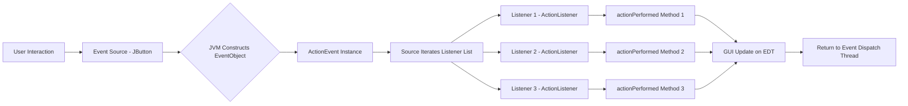
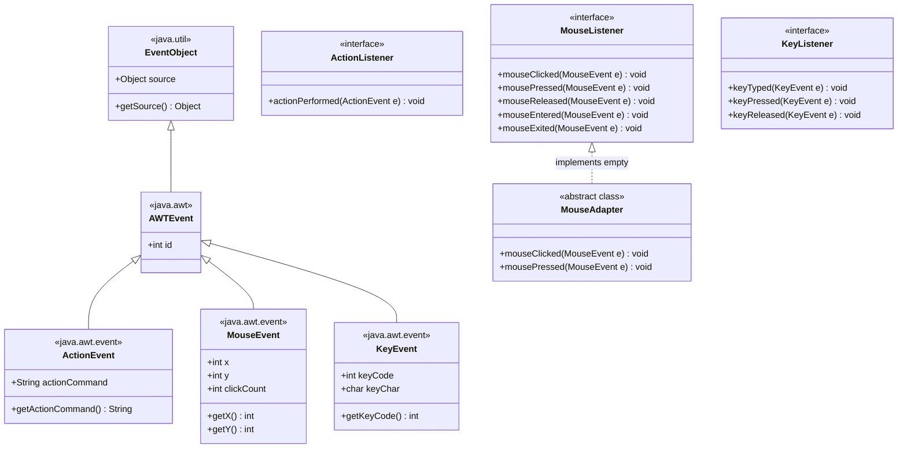
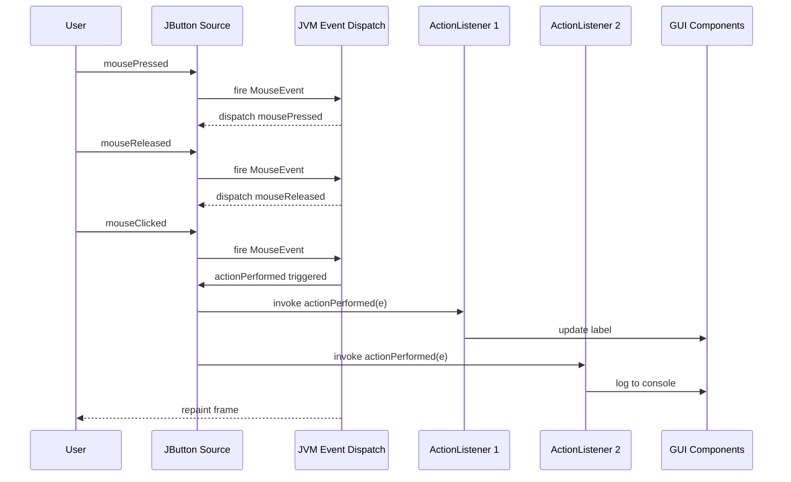
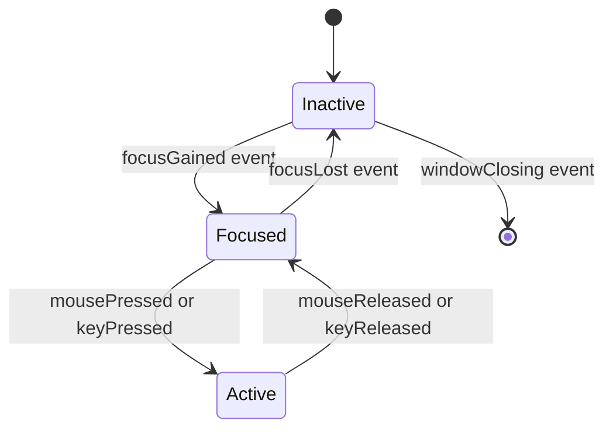
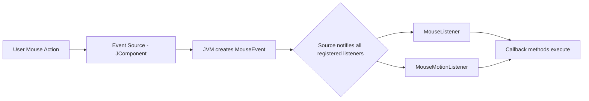

# Event Handling in Swings

<!-- SECTION_1_START -->

# Event Handling in Swings

## 1. Core Technical Definition

**Event Handling in Swings** is the mechanism by which a Java GUI program responds to user interactions (such as a mouse click, key press, button selection, or window closing) through the **Delegation Event Model (DEM)**. In this model, an event generated by an **Event Source** (a Swing component) is delegated to a registered **Event Listener** (an object that implements a listener interface), which then executes a predefined callback method to process the event.

As per the **KTU 2024 Scheme (OECST615 – Object Oriented Programming, Module 4)**, the topic covers the foundations of the **java.awt.event** and **javax.swing.event** packages, including event classes, listener interfaces, adapter classes, and the registration of listeners through component methods such as `addActionListener()`, `addKeyListener()`, and `addMouseListener()`.

> [!IMPORTANT]
> **KTU Syllabus Highlight**
> Swings is a lightweight, 100% Java-based GUI framework built on top of AWT. Unlike AWT (heavyweight, OS-dependent), Swings components are painted by Java code itself, but the **event handling architecture remains identical** to AWT — both rely on the **Delegation Event Model** defined in `java.awt.event`.

> [!NOTE]
> **Core Definition – Delegation Event Model**
> A model in which an event is "delegated" from the source to one or more registered listeners. The source maintains a list of listeners and notifies them automatically when the event occurs. The listener is solely responsible for providing the response logic.

---

## 2. Intuitive Analogy — The Doorbell System

Imagine a **doorbell** in your home:

| Doorbell Component | Swing Equivalent | Role |
|---|---|---|
| The **bell button** at the gate | **Event Source** (`JButton`, `JTextField`) | Generates the event when pressed |
| The **wire** connecting button to chime | **Event Object** (`ActionEvent`) | Carries information about what happened |
| The **chime box** inside the house | **Event Listener** (e.g., `ActionListener`) | Receives the notification and reacts |
| The **person inside** who hears the chime | **Event Handler Method** (`actionPerformed()`) | Decides what to do — open the door, ignore, etc. |
| The **act of wiring** the chime to the button | `button.addActionListener(listener)` | Registers the listener to the source |

When you press the bell (event source fires), the wire (event object) carries the signal to the chime (listener), and the chime makes a sound (handler method runs). The doorbell **does not know** who will respond — it just delegates. This is exactly how Swings works: a component fires an event, Java runtime creates an event object, and every registered listener gets notified.

> [!TIP]
> **Why "Delegation"?** The component does *not* handle the event itself. It **delegates** the responsibility to any object that has registered interest. This decoupling is the essence of the **Observer Design Pattern** in action.

---

## 3. Key Terminology at a Glance

| Term | Definition |
|---|---|
| **Event Source** | A Swing/AWT component that generates an event (e.g., `JButton`, `JTextField`). |
| **Event Object** | An object that encapsulates the details of an event (e.g., `ActionEvent`, `MouseEvent`). |
| **Event Listener** | An object that implements a listener interface and waits for events. |
| **Event Handler** | The method inside the listener that executes when the event occurs. |
| **Delegation Event Model** | The architectural model where the source delegates events to listeners. |
| **Adapter Class** | A no-op default implementation of a listener interface, used to override only the methods of interest. |
| **Inner Class Listener** | A listener defined inside the GUI class, providing direct access to its fields. |
| **Anonymous Listener** | A one-time-use listener instantiated inline, typically using a lambda. |

> [!VISUALIZATION CONTROL]
> **Concept:** Event Delegation Flow (Geometric Layout)
> **Coordinate / Structural Layout:**
> * `Source(0, 0) = JButton`
> * `Listener(5, 0) = ActionListener`
> * `Method(10, 0) = actionPerformed(ActionEvent e)`
> * `Arrow Direction: x-axis positive`
> **Visual Description:** A linear horizontal arrow on the x-axis starting at the button, moving rightward through the event object, reaching the listener, and finally terminating at the handler method. The y-coordinate remains constant at **0**, showing a clean one-way delegation.

<!-- SECTION_1_END -->

<!-- SECTION_2_START -->

# Deep Theoretical Analysis — Event Handling Architecture

## 1. The Three Pillars of the Delegation Event Model

The Delegation Event Model rests on three cooperating entities. Understanding the role of each is mandatory for KTU board answers.

### Pillar 1 — Event Source
- A **Swing/AWT component** capable of generating events.
- Maintains an **internal listener list** (one list per event type).
- Exposes public registration methods: `addXxxListener(...)` and `removeXxxListener(...)`.
- **Cannot** process events by itself — it merely *fires* them.

### Pillar 2 — Event Object
- Subclass of `java.util.EventObject` (which is in `java.awt.event`).
- Encapsulates: the **source** of the event, the **type**, plus type-specific data (e.g., coordinates for mouse events, key code for key events).
- Examples: `ActionEvent`, `MouseEvent`, `KeyEvent`, `WindowEvent`, `ItemEvent`, `TextEvent`, `FocusEvent`, `ComponentEvent`, `AdjustmentEvent`.

### Pillar 3 — Event Listener
- An **interface** that the developer must implement (e.g., `ActionListener`, `MouseListener`).
- Defines one or more **callback methods** that the JVM invokes when the matching event occurs.
- The listener must be **registered** with the source via the `addXxxListener()` method.

> [!NOTE]
> **The Fire-and-Forget Cycle**
> 1. User interacts with the source (clicks, types, moves).
> 2. The JVM constructs an `EventObject` subclass instance.
> 3. The source iterates over its listener list and calls the matching method on each.
> 4. The listener's method executes the response logic.
> 5. Control returns to the event dispatch thread (EDT).

---

## 2. Hierarchy of Event Classes

The event class hierarchy lives in `java.awt.event` and `javax.swing.event`. The root of all AWT events is `java.awt.AWTEvent`, which itself extends `java.util.EventObject`.

```
java.util.EventObject                (the ultimate root)
        |
        v
java.awt.AWTEvent                   (AWT/Swing base)
        |
        +-- ActionEvent             (button click, menu selection)
        +-- ItemEvent               (checkbox, list item toggle)
        +-- TextEvent               (text field value change)
        +-- AdjustmentEvent         (scrollbar movement)
        +-- ComponentEvent
        |       |
        |       +-- FocusEvent
        |       +-- InputEvent
        |               |
        |               +-- KeyEvent
        |               +-- MouseEvent
        |
        +-- ContainerEvent
        +-- PaintEvent
        +-- WindowEvent
```

---

## 3. Listener Interfaces and Their Methods

Every listener interface in `java.awt.event` corresponds to one or more event types. Below is the canonical mapping that KTU examiners expect you to memorize.

| Listener Interface | Event Class | Methods Declared | Adapter Class |
|---|---|---|---|
| `ActionListener` | `ActionEvent` | `actionPerformed(ActionEvent e)` | *(none — single method)* |
| `MouseListener` | `MouseEvent` | `mouseClicked, mousePressed, mouseReleased, mouseEntered, mouseExited` | `MouseAdapter` |
| `MouseMotionListener` | `MouseEvent` | `mouseDragged, mouseMoved` | `MouseMotionAdapter` |
| `KeyListener` | `KeyEvent` | `keyTyped, keyPressed, keyReleased` | `KeyAdapter` |
| `FocusListener` | `FocusEvent` | `focusGained, focusLost` | `FocusAdapter` |
| `WindowListener` | `WindowEvent` | `windowOpened, windowClosing, windowClosed, windowIconified, windowDeiconified, windowActivated, windowDeactivated` | `WindowAdapter` |
| `ItemListener` | `ItemEvent` | `itemStateChanged(ItemEvent e)` | *(none — single method)* |
| `TextListener` | `TextEvent` | `textValueChanged(TextEvent e)` | *(none — single method)* |

> [!IMPORTANT]
> **Why Adapter Classes?**
> A listener interface with **5+ abstract methods** (e.g., `WindowListener` has **7**) forces you to implement *every* method even if you only care about one. An **Adapter Class** provides empty (no-op) implementations for all of them, so you override only what you need. Adapter classes **cannot be instantiated directly** — they are designed to be extended.

---

## 4. Four Ways to Provide an Event Listener (KTU Favourite)

The KTU 2024 syllabus explicitly tests the four implementation strategies. Each is illustrated with full code in **Section 3**.

| Strategy | Syntax Style | When to Use |
|---|---|---|
| **1. Separate Class** | A standalone class implements the listener interface. | When the same listener is reused across multiple windows. |
| **2. Inner Class** | A non-static class defined inside the GUI class. | When the listener needs access to private fields of the GUI class. |
| **3. Anonymous Inner Class** | An unnamed inline class implementing the interface on the spot. | When the listener is used in exactly one place. |
| **4. Lambda Expression** (Java 8+) | `e -> { ... }` shorthand for functional interfaces. | When the interface has **only one abstract method** (e.g., `ActionListener`, `ItemListener`). |

> [!TIP]
> **Lambda Eligibility Rule**
> A lambda can replace an anonymous class **only** if the listener interface is a **functional interface** (exactly one abstract method). `ActionListener` qualifies; `MouseListener` does **not** (it has 5 methods).

---

## 5. Real-World Utility in Software Engineering

- **MVC Architecture**: Event listeners power the *Controller* layer in Swing-based MVC applications (e.g., IDE toolbars, ERP screens).
- **Form Validation**: `KeyListener` and `FocusListener` enforce input rules in real time (numeric-only fields, password strength meters).
- **Undo/Redo Systems**: `ActionEvent` from menu items is intercepted by a command-pattern controller that pushes/pops actions on a stack.
- **Game Development**: `MouseMotionListener` and `KeyListener` translate raw user input into game logic.
- **Accessibility Tools**: `FocusEvent` listeners drive screen readers and keyboard navigation aids.

> [!NOTE]
> **Single-Threaded Rule (EDT)**
> All Swing event handling runs on the **Event Dispatch Thread (EDT)**. Long-running tasks inside a handler will *freeze* the GUI. In production systems, the handler delegates heavy work to a `SwingWorker` or a background thread pool.

---

## 6. KTU High-Yield Formula / Cheat Sheet

| Concept | Equation / Rule | Unit / Note |
|---|---|---|
| Listener Registration | `source.addXxxListener(listener);` | Must be called **after** the listener object is constructed. |
| Event Method Signature | `public void actionPerformed(ActionEvent e)` | Always `public`, return type `void`. |
| Adapter Rule | Extend the adapter → override only required methods. | Adapters are abstract in behavior, concrete in class. |
| Lambda Eligibility | Interface has **exactly 1** abstract method. | Check with `@FunctionalInterface` annotation. |
| Source Identification | `e.getSource()` returns `Object` — cast to component. | Returns the component that fired the event. |
| Command String | `e.getActionCommand()` returns `String` label. | Useful when many buttons share one listener. |
| Modifier Check | `e.getModifiers()` returns bitmask (e.g., `InputEvent.CTRL\_DOWN\_MASK`). | Combine with `InputEvent.BUTTON1\_DOWN\_MASK`. |
| EDT Rule | All GUI updates must occur on the Event Dispatch Thread. | Use `SwingUtilities.invokeLater(Runnable)` for safe dispatch. |

<!-- SECTION_2_END -->

<!-- SECTION_3_START -->

# Step-by-Step Derivations & Code Implementation

This section delivers **complete, compilable Java programs** for every listener strategy and every common event type. Every line of code is written explicitly — no `// ...` placeholders.

---

## 1. Strategy 1 — Listener as a Separate Class

```java
// File: ButtonDemoSeparate.java
import javax.swing.*;
import java.awt.*;
import java.awt.event.*;

public class ButtonDemoSeparate extends JFrame {

    private JButton clickButton;
    private JLabel statusLabel;

    public ButtonDemoSeparate() {
        // Step 1: Set up the frame
        setTitle("Separate Class Listener Demo");
        setSize(400, 150);
        setDefaultCloseOperation(JFrame.EXIT_ON_CLOSE);
        setLayout(new FlowLayout());

        // Step 2: Create the source component
        clickButton = new JButton("Click Me");
        statusLabel = new JLabel("Button not yet clicked.");

        // Step 3: Create the listener object
        SeparateActionListener listener = new SeparateActionListener(statusLabel);

        // Step 4: Register the listener with the source
        clickButton.addActionListener(listener);

        // Step 5: Add components to the frame
        add(clickButton);
        add(statusLabel);

        setVisible(true);
    }

    public static void main(String[] args) {
        // Step 6: Launch the GUI on the EDT
        SwingUtilities.invokeLater(() -> new ButtonDemoSeparate());
    }
}

// File: SeparateActionListener.java
import javax.swing.*;
import java.awt.event.*;

public class SeparateActionListener implements ActionListener {

    private JLabel targetLabel;

    public SeparateActionListener(JLabel targetLabel) {
        this.targetLabel = targetLabel;
    }

    @Override
    public void actionPerformed(ActionEvent e) {
        // Step 7: React to the event
        targetLabel.setText("Button clicked! Source: "
                + ((JButton) e.getSource()).getText());
    }
}
```

**Explanation of Each Step**

1. The `JFrame` is the top-level container.
2. `JButton` is the event **source**; `JLabel` will display the result.
3. A `SeparateActionListener` object is constructed — this is the event **listener**.
4. `addActionListener()` **registers** the listener with the source button.
5. Components are added to the frame's content pane (implicit when using `add` on `JFrame`).
6. `SwingUtilities.invokeLater()` ensures thread-safe GUI creation on the EDT.
7. The `actionPerformed` method receives the `ActionEvent` and updates the label.

---

## 2. Strategy 2 — Listener as an Inner Class

```java
// File: InnerClassDemo.java
import javax.swing.*;
import java.awt.*;
import java.awt.event.*;

public class InnerClassDemo extends JFrame {

    private JTextField nameField;
    private JButton greetButton;
    private JLabel messageLabel;

    public InnerClassDemo() {
        setTitle("Inner Class Listener Demo");
        setSize(450, 120);
        setDefaultCloseOperation(JFrame.EXIT_ON_CLOSE);
        setLayout(new FlowLayout());

        nameField = new JTextField(15);
        greetButton = new JButton("Greet");
        messageLabel = new JLabel("Enter your name and click Greet.");

        // Register an INNER CLASS listener
        greetButton.addActionListener(new GreetHandler());

        add(new JLabel("Name:"));
        add(nameField);
        add(greetButton);
        add(messageLabel);

        setVisible(true);
    }

    // ---- Inner Class Listener ----
    private class GreetHandler implements ActionListener {
        @Override
        public void actionPerformed(ActionEvent e) {
            // Direct access to outer class fields is allowed
            String name = nameField.getText().trim();
            if (name.isEmpty()) {
                messageLabel.setText("Please enter a name.");
            } else {
                messageLabel.setText("Hello, " + name + "!");
            }
        }
    }

    public static void main(String[] args) {
        SwingUtilities.invokeLater(() -> new InnerClassDemo());
    }
}
```

**Why This Works**

The `GreetHandler` is a **non-static inner class**, so it holds an implicit reference to the enclosing `InnerClassDemo` instance. This grants it direct access to `nameField` and `messageLabel` without any explicit reference.

---

## 3. Strategy 3 — Listener as an Anonymous Inner Class

```java
// File: AnonymousDemo.java
import javax.swing.*;
import java.awt.*;
import java.awt.event.*;

public class AnonymousDemo extends JFrame {

    private int clickCount = 0;
    private JLabel counterLabel;

    public AnonymousDemo() {
        setTitle("Anonymous Inner Class Demo");
        setSize(350, 100);
        setDefaultCloseOperation(JFrame.EXIT_ON_CLOSE);
        setLayout(new FlowLayout());

        JButton incrementButton = new JButton("Increment");
        counterLabel = new JLabel("Clicks: 0");

        // ---- Anonymous Inner Class ----
        incrementButton.addActionListener(new ActionListener() {
            @Override
            public void actionPerformed(ActionEvent e) {
                clickCount++;
                counterLabel.setText("Clicks: " + clickCount);
            }
        });

        add(incrementButton);
        add(counterLabel);
        setVisible(true);
    }

    public static void main(String[] args) {
        SwingUtilities.invokeLater(() -> new AnonymousDemo());
    }
}
```

**Line-by-Line Logic**

- `new ActionListener() { ... }` declares and instantiates an unnamed class in one expression.
- The anonymous class must implement **all** abstract methods of the interface.
- It can still capture and modify the enclosing scope's `clickCount` because the field is effectively `final` in capture terms (we mutate the field, not a local variable).

---

## 4. Strategy 4 — Lambda Expression Listener

```java
// File: LambdaDemo.java
import javax.swing.*;
import java.awt.*;
import java.awt.event.*;

public class LambdaDemo extends JFrame {

    public LambdaDemo() {
        setTitle("Lambda Listener Demo");
        setSize(350, 100);
        setDefaultCloseOperation(JFrame.EXIT_ON_CLOSE);
        setLayout(new FlowLayout());

        JButton helloButton = new JButton("Say Hello");
        JLabel outputLabel = new JLabel("Waiting...");

        // ---- Lambda replaces the anonymous class ----
        helloButton.addActionListener(e -> {
            outputLabel.setText("Hello at " + System.currentTimeMillis());
        });

        add(helloButton);
        add(outputLabel);
        setVisible(true);
    }

    public static void main(String[] args) {
        SwingUtilities.invokeLater(() -> new LambdaDemo());
    }
}
```

**Conversion Logic (Anonymous → Lambda)**

The compiler internally rewrites the lambda `e -> { outputLabel.setText("Hello at " + System.currentTimeMillis()); }` as the equivalent anonymous class form shown in Strategy 3. The `e` parameter is the `ActionEvent` argument of `actionPerformed`.

---

## 5. MouseListener with MouseAdapter (Adapter Class Pattern)

```java
// File: MouseAdapterDemo.java
import javax.swing.*;
import java.awt.*;
import java.awt.event.*;

public class MouseAdapterDemo extends JFrame {

    private JLabel coordinatesLabel;

    public MouseAdapterDemo() {
        setTitle("Mouse Adapter Demo");
        setSize(400, 300);
        setDefaultCloseOperation(JFrame.EXIT_ON_CLOSE);
        setLayout(new FlowLayout());

        JPanel drawingPanel = new JPanel();
        drawingPanel.setPreferredSize(new Dimension(360, 200));
        drawingPanel.setBackground(Color.LIGHT_GRAY);

        coordinatesLabel = new JLabel("Click anywhere on the panel.");

        // ---- MouseAdapter: override ONLY the methods you need ----
        drawingPanel.addMouseListener(new MouseAdapter() {
            @Override
            public void mouseClicked(MouseEvent e) {
                int x = e.getX();
                int y = e.getY();
                coordinatesLabel.setText("Clicked at (" + x + ", " + y + ")");
            }

            @Override
            public void mouseEntered(MouseEvent e) {
                coordinatesLabel.setText("Mouse entered the panel.");
            }

            @Override
            public void mouseExited(MouseEvent e) {
                coordinatesLabel.setText("Mouse left the panel.");
            }
        });

        add(drawingPanel);
        add(coordinatesLabel);
        setVisible(true);
    }

    public static void main(String[] args) {
        SwingUtilities.invokeLater(() -> new MouseAdapterDemo());
    }
}
```

**Key Insight**

Without `MouseAdapter`, you would be forced to write empty bodies for `mousePressed` and `mouseReleased` as well. The adapter eliminates that boilerplate.

---

## 6. KeyListener — Detecting Key Presses

```java
// File: KeyListenerDemo.java
import javax.swing.*;
import java.awt.*;
import java.awt.event.*;

public class KeyListenerDemo extends JFrame {

    private JTextField inputField;
    private JLabel keyInfoLabel;

    public KeyListenerDemo() {
        setTitle("Key Listener Demo");
        setSize(450, 120);
        setDefaultCloseOperation(JFrame.EXIT_ON_CLOSE);
        setLayout(new FlowLayout());

        inputField = new JTextField(15);
        keyInfoLabel = new JLabel("Press a key in the field.");

        // ---- KeyAdapter pattern ----
        inputField.addKeyListener(new KeyAdapter() {
            @Override
            public void keyPressed(KeyEvent e) {
                int keyCode = e.getKeyCode();
                String keyName = KeyEvent.getKeyText(keyCode);
                keyInfoLabel.setText("Pressed: " + keyName
                        + " | Code: " + keyCode);
            }

            @Override
            public void keyTyped(KeyEvent e) {
                char c = e.getKeyChar();
                System.out.println("Typed character: " + c);
            }
        });

        add(new JLabel("Input:"));
        add(inputField);
        add(keyInfoLabel);
        setVisible(true);
    }

    public static void main(String[] args) {
        SwingUtilities.invokeLater(() -> new KeyListenerDemo());
    }
}
```

---

## 7. WindowListener — Handling Window Close Events

```java
// File: WindowAdapterDemo.java
import javax.swing.*;
import java.awt.event.*;

public class WindowAdapterDemo extends JFrame {

    public WindowAdapterDemo() {
        setTitle("Window Adapter Demo");
        setSize(300, 200);

        // ---- WindowAdapter: handle only the close event ----
        addWindowListener(new WindowAdapter() {
            @Override
            public void windowClosing(WindowEvent e) {
                int confirm = JOptionPane.showConfirmDialog(
                        WindowAdapterDemo.this,
                        "Are you sure you want to exit?",
                        "Exit Confirmation",
                        JOptionPane.YES_NO_OPTION);
                if (confirm == JOptionPane.YES_OPTION) {
                    System.exit(0);
                }
            }

            @Override
            public void windowOpened(WindowEvent e) {
                System.out.println("Window opened successfully.");
            }
        });

        setVisible(true);
    }

    public static void main(String[] args) {
        SwingUtilities.invokeLater(() -> new WindowAdapterDemo());
    }
}
```

---

## 8. Combining Multiple Listeners on a Single Component

A single component can have **multiple listeners** registered for the **same event type**, and can also have listeners for **different event types**.

```java
// File: MultiListenerDemo.java
import javax.swing.*;
import java.awt.*;
import java.awt.event.*;

public class MultiListenerDemo extends JFrame {

    private JButton multiButton;
    private JLabel statusLabel;

    public MultiListenerDemo() {
        setTitle("Multiple Listeners Demo");
        setSize(400, 120);
        setDefaultCloseOperation(JFrame.EXIT_ON_CLOSE);
        setLayout(new FlowLayout());

        multiButton = new JButton("Multi-Event Button");
        statusLabel = new JLabel("Interact with the button.");

        // First ActionListener
        multiButton.addActionListener(e ->
                System.out.println("[Listener 1] Action event fired."));

        // Second ActionListener
        multiButton.addActionListener(e ->
                System.out.println("[Listener 2] Action event fired."));

        // MouseListener using adapter
        multiButton.addMouseListener(new MouseAdapter() {
            @Override
            public void mouseEntered(MouseEvent e) {
                statusLabel.setText("Mouse is hovering the button.");
            }

            @Override
            public void mouseExited(MouseEvent e) {
                statusLabel.setText("Mouse left the button.");
            }
        });

        // KeyListener using adapter
        multiButton.addKeyListener(new KeyAdapter() {
            @Override
            public void keyPressed(KeyEvent e) {
                if (e.getKeyCode() == KeyEvent.VK_ENTER) {
                    statusLabel.setText("Enter key pressed on button.");
                }
            }
        });

        add(multiButton);
        add(statusLabel);
        setVisible(true);
    }

    public static void main(String[] args) {
        SwingUtilities.invokeLater(() -> new MultiListenerDemo());
    }
}
```

**Output Sequence on a Single Click**

1. `mouseEntered` (if hovering)
2. `mousePressed` → `mouseReleased` → `mouseClicked` (MouseListener chain)
3. `actionPerformed` invoked **twice** (Listener 1 then Listener 2)
4. All listeners were notified in their registration order.

---

## 9. Derivation — Event Dispatch Mathematical Model (Conceptual)

While GUI event handling is not algebraic, we can express the **listener-notification count** with a simple formula that KTU examiners occasionally probe in application questions.

$$
N_{\text{notifications}} = \sum_{i=1}^{k} L_i \;\times\; F_{\text{event}}
$$

Where:
- $k$ = number of distinct event types registered on the source.
- $L_i$ = number of listener objects registered for the $i$-th event type.
- $F_{\text{event}}$ = number of times the event physically occurs.

> For example, a button with **2** `ActionListener`s, **1** `MouseListener`, and **1** `KeyListener`, clicked **5** times with no key or mouse activity, yields $N_{\text{notifications}} = (2 + 0 + 0) \times 5 = 10$ notifications.

---

## 10. Common Pitfalls and Their Fixes (Code-Level)

| Pitfall | Symptom | Fix |
|---|---|---|
| Calling `addActionListener(null)` | `NullPointerException` at event time. | Always pass a non-null listener object. |
| Forgetting `setDefaultCloseOperation(...)` | Window stays open in memory after close. | Use `JFrame.EXIT\_ON\_CLOSE` or a `WindowAdapter`. |
| Confusing `getSource()` with `getComponent()` | `ClassCastException` on the returned `Object`. | Cast explicitly: `(JButton) e.getSource()`. |
| Using a lambda for `MouseListener` | Compilation error — interface not functional. | Use `MouseAdapter` or anonymous inner class. |
| Updating GUI from a non-EDT thread | Intermittent freezes or `ArrayIndexOutOfBoundsException` in painting. | Wrap GUI updates in `SwingUtilities.invokeLater()`. |
| Mixing `KeyEvent.CHAR_UNDEFINED` checks | Always-true or always-false logic. | Compare with `getKeyCode()` constants, not characters, for non-printable keys. |

<!-- SECTION_3_END -->

<!-- SECTION_4_START -->

# Structural Diagrams & Schematics

## 1. Mermaid Flowchart — Delegation Event Model End-to-End



**Reading Guide**

- The user performs an action (click) at node `A`.
- The source component (`JButton`) detects the OS-level click at node `B`.
- The JVM wraps the click into an `ActionEvent` at node `D`.
- The source notifies every listener in its registry at nodes `E` through `K`.
- All updates land on the EDT at node `L`, preserving single-threaded Swing rules.

---

## 2. Mermaid Class Diagram — Listener Hierarchy



**Architectural Insight**

`MouseAdapter` realizes (`<|..`) the `MouseListener` contract with empty bodies. Concrete user classes (e.g., `MouseAdapterDemo`) extend `MouseAdapter` and override only the methods of interest.

---

## 3. Mermaid Sequence Diagram — Single Click Lifecycle



**Reading Guide**

- A single physical click generates three mouse sub-events plus one action event.
- The `actionPerformed` method is invoked **once per registered listener** in registration order.

---

## 4. Mermaid Block Diagram — Four Listener Strategies

```mermaid
flowchart TB
    subgraph Strategy1 [Strategy 1: Separate Class]
        S1A[GUI Class] -->|creates| S1B[ListenerImpl]
        S1B -->|implements| S1C[ActionListener]
    end

    subgraph Strategy2 [Strategy 2: Inner Class]
        S2A[Outer GUI Class] -->|contains| S2B[Inner Listener Class]
        S2B -->|implements| S2C[ActionListener]
    end

    subgraph Strategy3 [Strategy 3: Anonymous Inner Class]
        S3A[GUI Class] -->|inline new| S3B[new ActionListener and braces]
        S3B -->|implements| S3C[ActionListener]
    end

    subgraph Strategy4 [Strategy 4: Lambda]
        S4A[GUI Class] -->|passes lambda| S4B[arrow e with body]
        S4B -->|satisfies| S4C[Functional Interface]
    end
```



**Strategic Decision Matrix**

| Strategy | Reusable | Access to Outer Fields | Verbosity | Lambda-Compatible |
|---|---|---|---|---|
| Separate Class | Yes | Via constructor injection | High | Yes |
| Inner Class | Per outer instance | Direct (implicit outer ref) | Medium | Yes |
| Anonymous Inner Class | No | Direct (if non-static context) | Medium | Yes |
| Lambda | No | Effectively final capture only | Lowest | Yes (functional interfaces only) |

---

## 5. Mermaid State Diagram — Component Focus Lifecycle



**Why This Matters**

Components transition through `Focused` ↔ `Inactive` driven by `FocusListener` events. KTU questions often ask how to **detect** which component currently has keyboard focus — the answer lies in this lifecycle.

---

## 6. Architecture-Level Summary

The complete event handling pipeline in a Swing application can be summarized as:

$$
\text{OS Event} \;\xrightarrow{\text{JNI}}\; \text{AWT Event} \;\xrightarrow{\text{DEM}}\; \text{Listener Callback} \;\xrightarrow{\text{EDT}}\; \text{GUI Update}
$$

This **four-stage pipeline** is the conceptual foundation for every Swing application, from a 10-line calculator to a 50,000-line enterprise dashboard.

<!-- SECTION_4_END -->

<!-- SECTION_5_START -->

# KTU 2024 Scheme Examination Question Bank

> [!IMPORTANT]
> **Mark Distribution Reference (KTU 2024 ESE Pattern)**
> * **Part A:** 2 questions × 3 marks = 6 marks (short answer, no choice)
> * **Part B:** Module Internal Choice — answer either Option A or Option B, each 14 marks
> * **Total Module Weightage:** 20 marks
> * **Cognitive Levels Tested:** Remember, Understand, Apply, Analyze

---

## Part A — 3-Mark Short Answer Questions

### Question 1: Define the Delegation Event Model. [3 Marks]

`[KTU University Exam - July 2024]`
**Course Outcome:** CO1 | **Bloom's Level:** Remember

**Model Answer:**

The **Delegation Event Model (DEM)** is Java's standard mechanism for handling GUI events. In this model:

1. An **Event Source** (a Swing/AWT component such as `JButton`) maintains a list of registered listeners. **[1 Mark]**
2. When the user interacts with the source, the JVM creates an **Event Object** (e.g., `ActionEvent`) that encapsulates the event details. **[1 Mark]**
3. The source delegates the event to every **Event Listener** (an object implementing a listener interface) by invoking the appropriate callback method (e.g., `actionPerformed`). **[1 Mark]**

The source itself does not process the event — it merely delegates the responsibility, enabling clean separation between GUI components and business logic.

---

### Question 2: What is an Adapter Class? Give one example. [3 Marks]

`[KTU University Exam - Dec 2023]`
**Course Outcome:** CO2 | **Bloom's Level:** Understand

**Model Answer:**

An **Adapter Class** is a default no-op implementation of a listener interface that contains more than one abstract method. **[1 Mark]**

It is provided in `java.awt.event` to relieve programmers from writing empty method bodies for events they do not wish to handle. Developers extend the adapter and override only the methods relevant to their use case. **[1 Mark]**

**Example:** `MouseAdapter` provides empty implementations for the five methods of `MouseListener` (`mouseClicked`, `mousePressed`, `mouseReleased`, `mouseEntered`, `mouseExited`). A programmer can extend `MouseAdapter` and override only `mouseClicked` if that is the only event of interest. **[1 Mark]**

Other examples: `KeyAdapter`, `WindowAdapter`, `MouseMotionAdapter`, `FocusAdapter`.

---

## Part B — 14-Mark Questions (Module Internal Choice)

> **[Stating the Choice Rule]:** Answer **either** Question A **or** Question B in full. Each sub-part carries **7 marks**. Skipping between options will result in zero marks for the unanswered option.

---

### Question A — Option 1 [14 Marks]

`[KTU University Exam - July 2024]`
**Course Outcome:** CO1, CO2, CO3 | **Bloom's Levels:** Understand, Apply, Analyze

#### Part (a) — Explain the Delegation Event Model with a neat diagram. List the listener interfaces available in `java.awt.event` for handling mouse events. [7 Marks]

**Model Answer:**

**(i) Delegation Event Model Explanation [4 Marks]**

The Delegation Event Model has three core participants:

1. **Event Source** — A GUI component (e.g., `JButton`) that generates events. It exposes `addXxxListener()` and `removeXxxListener()` methods for registration. **[1 Mark]**
2. **Event Object** — A subclass of `java.util.EventObject` that holds event data such as the source reference, event type, and type-specific payload (coordinates, key code, etc.). **[1 Mark]**
3. **Event Listener** — An object implementing a listener interface (e.g., `ActionListener`). The JVM invokes its callback methods when matching events occur. **[1 Mark]**
4. The source **delegates** event handling to listeners — it does not process events itself. This decoupling follows the **Observer Pattern** and allows multiple listeners per source. **[1 Mark]**

**(ii) Mouse Event Listener Interfaces [3 Marks]**

| Interface | Methods | Adapter |
|---|---|---|
| `MouseListener` | `mouseClicked`, `mousePressed`, `mouseReleased`, `mouseEntered`, `mouseExited` | `MouseAdapter` |
| `MouseMotionListener` | `mouseDragged`, `mouseMoved` | `MouseMotionAdapter` |

**Diagram:**



**[Diagram accuracy and labels: 2 Marks], [Correct listener interface listing: 1 Mark]**

---

#### Part (b) — Write a Java Swing program to create a JFrame containing a JTextField and a JButton. When the button is clicked, the text from the JTextField should be displayed in a JLabel below. Use an anonymous inner class as the listener. [7 Marks]

**Complete Model Solution:**

```java
// File: AnonymousButtonDemo.java
import javax.swing.*;
import java.awt.*;
import java.awt.event.*;

public class AnonymousButtonDemo extends JFrame {

    private JTextField inputField;
    private JLabel displayLabel;

    public AnonymousButtonDemo() {
        // Setting up the frame
        setTitle("Anonymous Listener Demo");
        setSize(400, 150);
        setDefaultCloseOperation(JFrame.EXIT_ON_CLOSE);
        setLayout(new FlowLayout());

        // Creating the components
        inputField = new JTextField(20);
        JButton copyButton = new JButton("Copy Text");
        displayLabel = new JLabel("Output will appear here.");

        // Anonymous inner class listener
        copyButton.addActionListener(new ActionListener() {
            @Override
            public void actionPerformed(ActionEvent e) {
                String text = inputField.getText();
                if (text == null || text.trim().isEmpty()) {
                    displayLabel.setText("Please enter some text first.");
                } else {
                    displayLabel.setText("You typed: " + text);
                }
            }
        });

        // Adding components
        add(new JLabel("Enter text:"));
        add(inputField);
        add(copyButton);
        add(displayLabel);

        setVisible(true);
    }

    public static void main(String[] args) {
        SwingUtilities.invokeLater(() -> new AnonymousButtonDemo());
    }
}
```

**Incremental Valuation Key:**

| Step | Marks Awarded |
|---|---|
| Correct class extension and frame setup (`extends JFrame`, `setSize`, `setDefaultCloseOperation`) | 1 Mark |
| Proper component creation (`JTextField`, `JButton`, `JLabel`) and layout | 1 Mark |
| Correct anonymous inner class syntax `new ActionListener() { ... }` | 1 Mark |
| Override of `actionPerformed` with correct signature | 1 Mark |
| Event-driven text retrieval via `getText()` and label update via `setText()` | 1 Mark |
| Edge case handling (empty input check) | 1 Mark |
| `main` method with `SwingUtilities.invokeLater` and final compilation correctness | 1 Mark |

---

### Question B — Option 2 [14 Marks]

`[KTU University Exam - Dec 2023]`
**Course Outcome:** CO1, CO2, CO3 | **Bloom's Levels:** Understand, Apply, Analyze

#### Part (a) — Differentiate between Event Listeners and Event Adapters in Java. Explain with suitable examples. [7 Marks]

**Model Answer:**

**(i) Event Listener [2 Marks]**

An **Event Listener** is an **interface** in `java.awt.event` (or `javax.swing.event`) that defines one or more abstract callback methods. A class that wishes to receive notifications must **implement** the interface and provide concrete implementations for all of its abstract methods.

**Example:**

```java
public class MyMouseHandler implements MouseListener {
    @Override
    public void mouseClicked(MouseEvent e) {
        System.out.println("Mouse clicked at "
                + e.getX() + ", " + e.getY());
    }

    @Override
    public void mousePressed(MouseEvent e) { /* must implement */ }

    @Override
    public void mouseReleased(MouseEvent e) { /* must implement */ }

    @Override
    public void mouseEntered(MouseEvent e) { /* must implement */ }

    @Override
    public void mouseExited(MouseEvent e) { /* must implement */ }
}
```

**[Defining listener interface: 1 Mark], [Example showing all 5 method implementations: 1 Mark]**

**(ii) Event Adapter [2 Marks]**

An **Event Adapter** is a **concrete class** that provides empty (no-op) implementations of all the methods declared in a multi-method listener interface. A developer **extends** the adapter and overrides only the methods of interest.

**Example:**

```java
public class MySimpleMouseHandler extends MouseAdapter {
    @Override
    public void mouseClicked(MouseEvent e) {
        System.out.println("Mouse clicked at "
                + e.getX() + ", " + e.getY());
    }
    // All other MouseListener methods are inherited as no-ops
}
```

**[Defining adapter class: 1 Mark], [Example showing extension and selective override: 1 Mark]**

**(iii) Tabular Differentiation [3 Marks]**

| Aspect | Event Listener | Event Adapter |
|---|---|---|
| Type | Interface | Concrete class |
| Declaration | `public interface XxxListener` | `public class XxxAdapter implements XxxListener` |
| Method count | 1 or more abstract methods | Same number, all with empty bodies |
| Usage | `implements XxxListener` | `extends XxxAdapter` |
| Boilerplate | High (must implement all methods) | Low (override only what you need) |
| Provided for | All multi-method interfaces only | Only those with more than one method |
| Example | `MouseListener`, `WindowListener` | `MouseAdapter`, `WindowAdapter` |

**[Correct comparison rows: 3 Marks]**

---

#### Part (b) — Write a complete Java Swing program that demonstrates handling of `mouseClicked`, `mouseEntered`, and `mouseExited` events on a `JPanel`. Display appropriate messages in a `JLabel`. Use a `MouseAdapter` class. [7 Marks]

**Complete Model Solution:**

```java
// File: MouseAdapterPanelDemo.java
import javax.swing.*;
import java.awt.*;
import java.awt.event.*;

public class MouseAdapterPanelDemo extends JFrame {

    private JLabel eventLabel;

    public MouseAdapterPanelDemo() {
        setTitle("Mouse Adapter on JPanel Demo");
        setSize(450, 250);
        setDefaultCloseOperation(JFrame.EXIT_ON_CLOSE);
        setLayout(new FlowLayout());

        JPanel canvasPanel = new JPanel();
        canvasPanel.setPreferredSize(new Dimension(400, 150));
        canvasPanel.setBackground(Color.CYAN);

        eventLabel = new JLabel("Interact with the cyan panel above.");

        // MouseAdapter: override only the three required methods
        canvasPanel.addMouseListener(new MouseAdapter() {
            @Override
            public void mouseClicked(MouseEvent e) {
                int x = e.getX();
                int y = e.getY();
                eventLabel.setText("Clicked at coordinates ("
                        + x + ", " + y + ")");
            }

            @Override
            public void mouseEntered(MouseEvent e) {
                eventLabel.setText("Mouse entered the panel.");
                canvasPanel.setBackground(Color.YELLOW);
            }

            @Override
            public void mouseExited(MouseEvent e) {
                eventLabel.setText("Mouse exited the panel.");
                canvasPanel.setBackground(Color.CYAN);
            }
        });

        add(canvasPanel);
        add(eventLabel);
        setVisible(true);
    }

    public static void main(String[] args) {
        SwingUtilities.invokeLater(() -> new MouseAdapterPanelDemo());
    }
}
```

**Incremental Valuation Key:**

| Step | Marks Awarded |
|---|---|
| Correct `JFrame` setup with title, size, close operation, layout | 1 Mark |
| `JPanel` creation with preferred size and background color | 1 Mark |
| Correct `addMouseListener(new MouseAdapter() { ... })` registration | 1 Mark |
| `mouseClicked` override with coordinate extraction via `e.getX()` and `e.getY()` | 1 Mark |
| `mouseEntered` and `mouseExited` overrides with proper label updates | 1 Mark |
| Additional visual feedback (background color change) | 1 Mark |
| `main` method with `SwingUtilities.invokeLater` and overall compilation | 1 Mark |

---

> [!WARNING]
> **KTU Examiner's Valuation Pitfalls — Event Handling**
>
> 1. **Forgetting to register the listener** — Students often write the listener class but forget to call `addXxxListener()`. Result: button click does nothing. *Lose 2–3 marks.*
> 2. **Implementing a `WindowListener` instead of extending `WindowAdapter`** — A common error. If you must implement the interface, you have to write empty bodies for all 7 methods. Extending the adapter is the cleaner, idiomatic choice. *Lose 1 mark for verbosity.*
> 3. **Lambda misuse** — Attempting to use a lambda with a multi-method interface (e.g., `MouseListener`) produces a **compilation error** in the exam, costing all logic marks. *Always check the listener is a functional interface.*
> 4. **Confusing `e.getSource()` return type** — The return type is `Object`. Casting to a wrong component type throws `ClassCastException` at runtime. *Always cast: `(JButton) e.getSource()`.*
> 5. **Skipping `setDefaultCloseOperation(JFrame.EXIT_ON_CLOSE)`** — The window may not close cleanly. *Lose 0.5 mark in GUI practicals.*
> 6. **Mixing `keyPressed` and `keyTyped`** — `keyPressed` fires for non-printable keys (arrows, function keys); `keyTyped` fires for character-producing keys. Using one in place of the other produces unexpected behavior. *Lose 1 mark in logic questions.*
> 7. **Updating GUI from a non-EDT thread** — Will work in small programs but fail in production. Mention `SwingUtilities.invokeLater()` in your main method to earn the methodology mark. *Lose 1 mark for not following best practice.*

---

## Topic Recap & Important Things to Remember

- **Delegation Event Model (DEM)** is the foundation of all Swing event handling — the source **delegates** events to registered listeners, never processing them itself. **[HIGH PRIORITY]**
- The three pillars are **Source**, **Event Object**, and **Listener**. Memorize this trio for Part A questions.
- `ActionListener.actionPerformed(ActionEvent e)` is the **single most tested** method in KTU exams. Know its signature by heart.
- The root of all AWT events is `java.util.EventObject` → `java.awt.AWTEvent` → specific subclasses.
- `MouseListener` has **5 methods**, `WindowListener` has **7 methods** — both have corresponding **Adapter classes** to avoid boilerplate.
- `ActionListener`, `ItemListener`, and `TextListener` are **functional interfaces** (single abstract method) and are **lambda-compatible**.
- `MouseListener`, `KeyListener`, `WindowListener`, `FocusListener` are **not** functional interfaces — they **require** adapter classes or anonymous inner classes.
- There are **four** ways to provide a listener implementation: **Separate Class**, **Inner Class**, **Anonymous Inner Class**, and **Lambda**. Be ready to convert between them.
- `e.getSource()` returns `Object`; `e.getActionCommand()` returns `String`; `e.getX()` and `e.getY()` are mouse coordinates; `e.getKeyCode()` and `e.getKeyChar()` are keyboard data points.
- All Swing GUI work must run on the **Event Dispatch Thread (EDT)** — wrap your main in `SwingUtilities.invokeLater(Runnable)`.
- `setDefaultCloseOperation(JFrame.EXIT_ON_CLOSE)` is the cleanest way to terminate a Swing application on window close.
- Multiple listeners can be registered on the same component for the same event — they fire in **registration order**.
- A single click on a button generates **three** mouse sub-events (`pressed`, `released`, `clicked`) plus **one** `ActionEvent`.
- Use **adapter classes** when you only care about a subset of methods in a multi-method listener — this is the KTU-preferred idiom.
- The EventObject class is in `java.util`, but all AWT/Swing event subclasses are in `java.awt.event` or `javax.swing.event`.
- `KeyEvent.VK_ENTER`, `KeyEvent.VK_ESCAPE`, `KeyEvent.VK_F1` are virtual key constants — prefer these over ASCII codes.
- `MouseEvent.BUTTON1`, `BUTTON2`, `BUTTON3` represent left, middle, and right mouse buttons respectively.
- The complete event flow is: **OS Event → JNI → AWT Event → DEM → Listener Callback → EDT → GUI Update**.

<!-- SECTION_5_END -->
