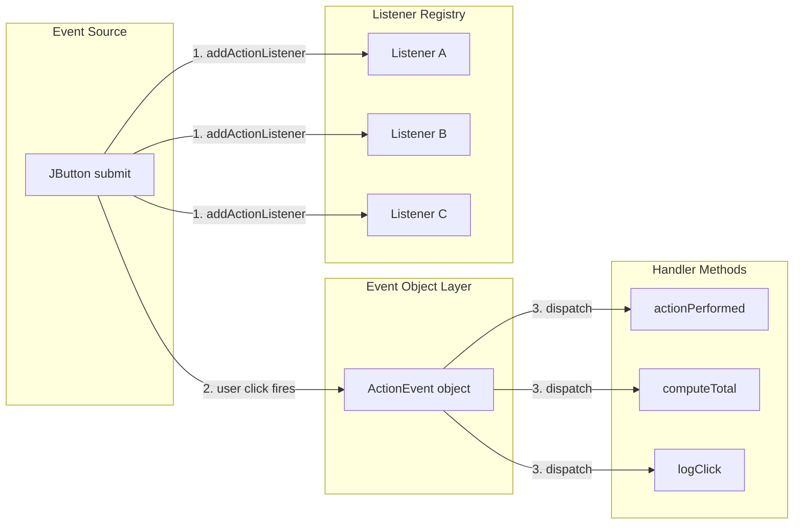
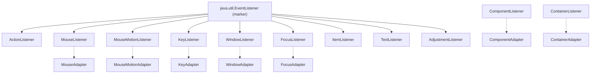
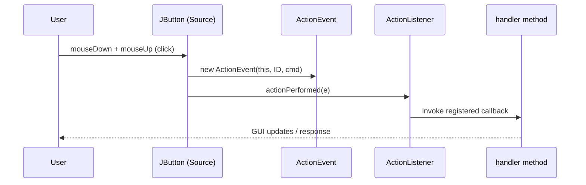
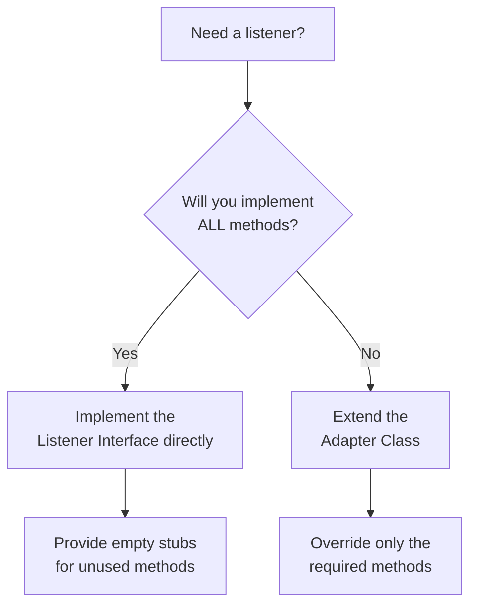
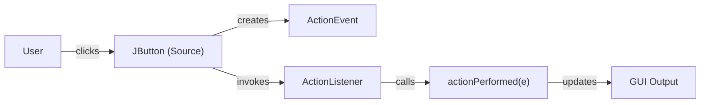

# Event Listener Interfaces

<!-- SECTION_1_START -->

# Event Listener Interfaces in Java AWT/Swing

## 1.1 Formal Academic Definition

> [!IMPORTANT]
> **Event Listener Interface (KTU Syllabus Definition):**
> An *Event Listener Interface* in Java AWT/Swing is a contract (interface) defined in the `java.awt.event` and `javax.swing.event` packages that specifies one or more abstract methods (event handlers) to be implemented by a class which wishes to receive and process notifications (events) generated by an *Event Source* component. The interface-based design decouples the GUI component (the source) from the logic that reacts to user interaction (the listener), thereby implementing the **Delegation Event Model**.

The complete framework rests on four pillars:

1. **Event Object** – encapsulates the state of an occurrence (a subclass of `java.awt.AWTEvent`).
2. **Event Source** – the GUI component that generates the event (e.g., `JButton`, `JTextField`).
3. **Event Listener Interface** – the abstract contract declaring callback methods.
4. **Event Handler** – the concrete method implementation that processes the event.

> [!NOTE]
> **Syllabus Highlight (KTU 2024 OECST615 – Module 4):**
> AWT and Swing fundamentals, event-driven programming, **event listener interfaces**, adapter classes, and inner class implementations are mandatory for board questions on GUI design.

## 1.2 Intuitive Real-World Analogy

Imagine a **restaurant ordering system**:

| Restaurant Element | Java Equivalent |
|---|---|
| Customer pressing a table call button | **Event Source** (e.g., `JButton`) |
| The signal travelling through the wire | **Event Object** (e.g., `ActionEvent`) |
| The waiter assigned to that table | **Event Listener** (object implementing `ActionListener`) |
| Waiter fetching the order | **Event Handler Method** (`actionPerformed()`) |

The customer (user) does not personally cook; the waiter does not know which customer is calling. The **button (source)** only knows that *some* listener is registered. The **listener (waiter)** only acts when *its* source fires. This loose coupling is exactly what the **Delegation Event Model** achieves in Java.

## 1.3 Core Terminology at a Glance

> [!IMPORTANT]
> **Three Golden Rules of Event Handling (must memorise):**
> 1. The listener class must **implement** the appropriate event-listener interface.
> 2. The event source must **register** the listener using `addXxxListener(...)`.
> 3. The event-handler method(s) must have the **exact signature** declared in the interface; otherwise compilation fails.

> [!VISUALIZATION CONTROL]
> **Concept:** The flow of an event from user action to handler execution
> **GeoGebra / Desmos Input Equations (timeline $t$):**
> * `f1(t) = step(t - 0)  `   — User clicks button at $t = 0$
> * `f2(t) = step(t - 1)  `   — JVM creates `ActionEvent` at $t = 1$ ms
> * `f3(t) = step(t - 2)  `   — Listener's `actionPerformed` invoked at $t = 2$ ms
> **Visual Description:** A horizontal $t$-axis with three vertical markers rising from $0$, $1$, $2$ to height $1$. Each step-function spike represents a milestone in the event chain — source firing, event object creation, and handler invocation. The student should observe a strict left-to-right causal sequence.

---

<!-- SECTION_1_END -->

<!-- SECTION_2_START -->

# Deep Theoretical Analysis — The Delegation Event Model

## 2.1 Architecture of the Model

The Delegation Event Model (introduced in JDK 1.1) follows a publish-subscribe pattern:

1. **Source publishes the event** – When the user interacts, the component (e.g., `JButton`) creates an event object and invokes every registered listener's matching handler.
2. **Listeners are subscribed** – A class registers itself via `component.addXxxListener(listenerObject)`.
3. **Event is dispatched** – The JDK's Event Dispatch Thread (EDT) routes the event to all matching handler methods.
4. **Handlers execute** – The listener's method is called with the `EventObject` as the argument.

> [!NOTE]
> **EDT (Event Dispatch Thread):** All Swing events are processed on a single thread. Long-running tasks in a handler will freeze the entire GUI — a classic board viva question.

## 2.2 Hierarchy of Event Classes

```
java.util.EventObject
        └── java.awt.AWTEvent
                ├── ActionEvent
                ├── AdjustmentEvent
                ├── ItemEvent
                ├── TextEvent
                ├── ComponentEvent
                │       ├── FocusEvent
                │       ├── InputEvent
                │       │       ├── KeyEvent
                │       │       └── MouseEvent
                │       │               └── MouseWheelEvent
                │       └── WindowEvent
                ├── ContainerEvent
                └── PaintEvent
```

## 2.3 Hierarchy of Listener Interfaces (Key Interfaces)

| Listener Interface | Source Component | Key Method(s) |
|---|---|---|
| `ActionListener` | `JButton`, `JMenuItem`, `JTextField` | `actionPerformed(ActionEvent e)` |
| `MouseListener` | Any `Component` | `mouseClicked`, `mousePressed`, `mouseReleased`, `mouseEntered`, `mouseExited` |
| `MouseMotionListener` | Any `Component` | `mouseDragged`, `mouseMoved` |
| `KeyListener` | Any `Component` | `keyTyped`, `keyPressed`, `keyReleased` |
| `FocusListener` | Any `Component` | `focusGained`, `focusLost` |
| `WindowListener` | `Window`, `JFrame`, `JDialog` | 7 methods: `windowOpened`, `windowClosing`, `windowClosed`, `windowIconified`, `windowDeiconified`, `windowActivated`, `windowDeactivated` |
| `ItemListener` | `JCheckBox`, `JRadioButton`, `JComboBox` | `itemStateChanged(ItemEvent e)` |
| `TextListener` | `TextField`, `TextArea` | `textValueChanged(TextEvent e)` |
| `AdjustmentListener` | `Scrollbar` | `adjustmentValueChanged(AdjustmentEvent e)` |

## 2.4 KTU High-Yield Cheat Sheet

> [!IMPORTANT]
> The following table consolidates the **mandatory memorisable facts** for KTU exams.

| Symbol / Element | Meaning / API | Default Return / Type | Boundary / Constraint |
|---|---|---|---|
| `EventObject` | Root event class | `getSource()` returns `Object` | Always non-null source |
| `AWTEvent` | AWT-level event root | `getID()` returns `int` | ID constants in subclasses |
| `ActionEvent` | Button / menu trigger | `getActionCommand()` returns `String` | Action command is the button label by default |
| `MouseEvent` | Mouse interaction | `getX()`, `getY()`, `getButton()` | Coordinates relative to source |
| `KeyEvent` | Keyboard input | `getKeyCode()` returns `int` | `VK_A` $\dots$ `VK_Z` (65–90) |
| `WindowEvent` | Window lifecycle | `getWindow()` returns `Window` | Closing ≠ Closed (different events) |
| `addActionListener` | Registration call | `void` | Multiple listeners allowed |
| `removeActionListener` | De-registration call | `void` | Must pass same instance to remove |
| `Adapter Class` | Empty default implementation | e.g., `MouseAdapter` | Use to avoid implementing all methods |

> [!NOTE]
> **Real-World Engineering Utility:** Event Listener Interfaces are the foundation of **MVC (Model-View-Controller)** GUI architectures. They enable **pluggable, modular UIs** — for instance, the same `JButton` source can trigger different business actions at runtime by swapping listeners. Modern JavaFX and Android `OnClickListener` inherit this same design philosophy.

---

<!-- SECTION_2_END -->

<!-- SECTION_3_START -->

# Step-by-Step Derivations, Code & Symbolic Implementation

## 3.1 Pattern A — Implementing an Interface in a Separate Class

```java
import java.awt.*;
import java.awt.event.*;

public class ActionDemo extends Frame implements ActionListener {

    private final TextField inputBox;
    private final Label displayLabel;

    public ActionDemo() {
        setTitle("KTU Action Listener Demo");
        setSize(400, 150);
        setLayout(new FlowLayout());

        inputBox   = new TextField(15);
        Button btn = new Button("Greet");
        displayLabel = new Label("                       ");

        // Step 1: Register the listener with the source
        btn.addActionListener(this);

        add(new Label("Enter your name: "));
        add(inputBox);
        add(btn);
        add(displayLabel);

        setVisible(true);
    }

    // Step 2: Implement the handler with the EXACT signature
    @Override
    public void actionPerformed(ActionEvent e) {
        String name = inputBox.getText();
        displayLabel.setText("Hello, " + name + "!");
    }

    public static void main(String[] args) {
        new ActionDemo();
    }
}
```

### Walkthrough with Evaluation Marks

| Line | Logical Step | Marks (KTU-style) |
|---|---|---|
| `implements ActionListener` | Listener contract declared | 1 |
| `btn.addActionListener(this);` | Source–listener wiring | 1 |
| `public void actionPerformed(ActionEvent e)` | Correct method signature | 2 |
| Reading `inputBox.getText()` and updating label | Business logic | 1 |

---

## 3.2 Pattern B — Using an Inner Class

```java
import javax.swing.*;
import java.awt.event.*;

public class InnerClassDemo extends JFrame {

    public InnerClassDemo() {
        setTitle("Inner Class Listener");
        setSize(350, 120);
        setDefaultCloseOperation(JFrame.EXIT_ON_CLOSE);
        setLayout(new java.awt.FlowLayout());

        JTextField tf = new JTextField(12);
        JButton  btn = new JButton("Show Length");

        // Inner class — has access to enclosing class fields
        btn.addActionListener(new ActionListener() {
            @Override
            public void actionPerformed(ActionEvent e) {
                int len = tf.getText().length();
                JOptionPane.showMessageDialog(
                    InnerClassDemo.this,
                    "Length = " + len
                );
            }
        });

        add(tf);
        add(btn);
        setVisible(true);
    }

    public static void main(String[] args) {
        SwingUtilities.invokeLater(() -> new InnerClassDemo());
    }
}
```

**Why inner class?** The listener can directly access enclosing class's `private` fields without getters, providing a clean and tight coupling for small GUIs.

---

## 3.3 Pattern C — Anonymous Inner Class (Most Common in Modern Code)

```java
btn.addActionListener(new ActionListener() {
    @Override
    public void actionPerformed(ActionEvent e) {
        System.out.println("Anonymous handler fired");
    }
});
```

Since Java 8, this collapses to a **lambda expression** because `ActionListener` is a *functional interface* (only one abstract method):

```java
btn.addActionListener(e -> System.out.println("Lambda handler fired"));
```

> [!NOTE]
> **KTU 2024 Note:** While lambdas are valid in modern Java, the **board exam still expects explicit anonymous class syntax** in answer sheets unless specifically asked for Java 8+ features.

---

## 3.4 Pattern D — Adapter Classes (Avoiding Unwanted Methods)

`MouseListener` has **5 methods**. If you only need `mouseClicked`, implementing the interface forces you to provide empty stubs for the other four. The `MouseAdapter` class provides empty defaults:

```java
import javax.swing.*;
import java.awt.event.*;

public class AdapterDemo extends JFrame {
    public AdapterDemo() {
        setTitle("Mouse Adapter");
        setSize(300, 200);
        setDefaultCloseOperation(JFrame.EXIT_ON_CLOSE);

        // Adapter pattern — override ONLY what you need
        addMouseListener(new MouseAdapter() {
            @Override
            public void mouseClicked(MouseEvent e) {
                JOptionPane.showMessageDialog(
                    this,
                    "Clicked at (" + e.getX() + ", " + e.getY() + ")"
                );
            }
        });

        setVisible(true);
    }

    public static void main(String[] args) {
        SwingUtilities.invokeLater(() -> new AdapterDemo());
    }
}
```

### Adapter Class Catalog (Must Memorise)

| Listener Interface | Corresponding Adapter |
|---|---|
| `MouseListener` | `MouseAdapter` |
| `MouseMotionListener` | `MouseMotionAdapter` |
| `KeyListener` | `KeyAdapter` |
| `WindowListener` | `WindowAdapter` |
| `FocusListener` | `FocusAdapter` |
| `ComponentListener` | `ComponentAdapter` |
| `ContainerListener` | `ContainerAdapter` |

---

## 3.5 Symbolic Equation — The Event Flow

$$
\text{User Action} \;\xrightarrow{\text{Source fires}}\; \text{EventObject} \;\xrightarrow{\text{EDT dispatches}}\; \text{Listener.handler(e)}
$$

For a button click, the formal chain is:

$$
\text{Click} \;\longrightarrow\; \text{ActionEvent(e)} \;\longrightarrow\; \text{listener.actionPerformed(e)}
$$

The listener list is a one-to-many relationship:

$$
\text{Source} \;\longrightarrow\; [\text{Listener}_1, \text{Listener}_2, \dots, \text{Listener}_n]
$$

All $n$ handlers are invoked in the order of registration, sequentially on the same thread.

---

## 3.6 Worked Numerical Example — Multi-Listener Counting

Suppose a `JButton` named `submit` has **three** registered `ActionListener`s. The board asks: *In what order are they invoked, and what is the count after the third invocation?*

**Step 1** — Registration order:

```java
submit.addActionListener(L1);  // registered first
submit.addActionListener(L2);  // registered second
submit.addActionListener(L3);  // registered third
```

**Step 2** — At click time, the JDK iterates the list in insertion order:

$$
\text{Invoked} = \{ \text{L1.actionPerformed}(e),\; \text{L2.actionPerformed}(e),\; \text{L3.actionPerformed}(e) \}
$$

**Step 3** — If each listener increments a static counter `cnt`, after one click:

$$
\text{cnt}_{\text{final}} = \text{cnt}_{\text{initial}} + 3
$$

---

## SECTION_3_END -->

<!-- SECTION_4_START -->

# Structural Diagrams & Schematics

## 4.1 Delegation Event Model — Component Interaction Flow



## 4.2 Class Hierarchy — Listeners & Adapters



## 4.3 Sequential Processing Topology — Event Lifecycle



> [!NOTE]
> **Diagram Interpretation Hint:** The arrow from `S` to `L` is the *virtual* dispatch carried out by the JDK's internal listener list. The actual method invocation is depicted as a self-call on the listener object.

## 4.4 Block-Level Functional Architecture — Adapter vs Interface Choice



---

<!-- SECTION_4_END -->

<!-- SECTION_5_START -->

# KTU 2024 Scheme Examination Question Bank

## Part A — Short Answer Questions (3 Marks Each)

### Question 1
> **`[KTU University Exam – Dec 2023]`** — **CO1 | RBT: Remember**

**What is an Event Listener Interface in Java AWT? List any two event listener interfaces along with their corresponding event classes.**

#### Model Answer (3 Marks)

An **Event Listener Interface** is a Java interface that defines one or more abstract methods (event-handler methods) used to process events generated by GUI components. A class that wishes to receive events from a component must implement the appropriate listener interface and register itself using `addXxxListener()`.

| Listener Interface | Event Class | Method |
|---|---|---|
| `ActionListener` | `ActionEvent` | `actionPerformed(ActionEvent e)` |
| `MouseListener` | `MouseEvent` | `mouseClicked`, `mousePressed`, etc. |

**Mark Split:** [Definition: 1 Mark] [Listing two interfaces with event class: 2 Marks]

---

### Question 2
> **`[KTU University Exam – July 2024]`** — **CO1 | RBT: Understand**

**Differentiate between `MouseListener` and `MouseMotionListener`. When would you prefer `MouseAdapter` over the interface?**

#### Model Answer (3 Marks)

`MouseListener` reports discrete mouse events (**press, release, click, enter, exit**), whereas `MouseMotionListener` reports continuous events (**move, drag**). Separating them improves efficiency — registering only `MouseMotionListener` avoids the heavy overhead of being notified on every pixel of mouse movement.

`MouseAdapter` is preferred when we need to override only a *subset* of the methods declared in `MouseListener`; the adapter provides empty default implementations, eliminating boilerplate stubs.

**Mark Split:** [Difference table: 2 Marks] [Justification for adapter: 1 Mark]

---

## Part B — Long Answer Questions (14 Marks Each)

> **ESE Module Internal Choice Pattern:** Answer **either** Question A **or** Question B.

---

### Question A (14 Marks) — Full Event-Driven Application

> **`[KTU University Exam – Dec 2024]`** — **CO2 | RBT: Apply / Analyse**

**(a)** Explain the **Delegation Event Model** in Java AWT with a neat diagram. List the components involved. **(7 Marks)**

**(b)** Write a complete Java Swing program that creates a `JFrame` containing a `JTextField`, a `JButton` labelled "Upper", and a `JLabel`. When the button is clicked, the text in the field should be converted to uppercase and displayed in the label. Use an **anonymous inner class** as the listener. **(7 Marks)**

#### Model Solution

**(a) Delegation Event Model — Explanation (7 Marks):**

The Delegation Event Model is Java's standard mechanism for handling GUI events. It defines **four key participants**:

1. **Event Source** – A GUI component (e.g., `JButton`) that generates events.
2. **Event Object** – A subclass of `java.util.EventObject` that encapsulates event data.
3. **Event Listener** – An object implementing a `XxxListener` interface.
4. **Event Handler** – The method inside the listener that processes the event.

**Workflow:**

$$
\text{User Action} \;\rightarrow\; \text{Source fires Event} \;\rightarrow\; \text{Registered Listeners receive it} \;\rightarrow\; \text{Handler executes}
$$

**Mark Split:** [Listing four participants: 2 Marks] [Workflow steps: 2 Marks] [Neat labelled diagram: 2 Marks] [Example API like addActionListener: 1 Mark]

**Reference Diagram:**



**(b) Java Program Using Anonymous Inner Class (7 Marks):**

```java
import javax.swing.*;
import java.awt.*;
import java.awt.event.*;

public class UpperCaseApp extends JFrame {

    public UpperCaseApp() {
        setTitle("Uppercase Converter - KTU Demo");
        setSize(400, 150);
        setDefaultCloseOperation(JFrame.EXIT_ON_CLOSE);
        setLayout(new FlowLayout());

        JTextField tf  = new JTextField(15);
        JButton   btn  = new JButton("Upper");
        JLabel    out  = new JLabel("Output appears here");

        // Anonymous inner class as listener
        btn.addActionListener(new ActionListener() {
            @Override
            public void actionPerformed(ActionEvent e) {
                String original = tf.getText();
                String upper    = original.toUpperCase();
                out.setText(upper);
            }
        });

        add(new JLabel("Input:"));
        add(tf);
        add(btn);
        add(out);

        setVisible(true);
    }

    public static void main(String[] args) {
        SwingUtilities.invokeLater(() -> new UpperCaseApp());
    }
}
```

**Valuation Key (Step-by-Step Marks):**

| Component | Marks |
|---|---|
| Correct class declaration `extends JFrame` | 1 |
| UI components created and added | 1 |
| Anonymous inner class implementing `ActionListener` | 2 |
| `actionPerformed` signature correct | 1 |
| Logic `toUpperCase()` and `setText()` | 1 |
| `setDefaultCloseOperation` & layout | 1 |

---

### Question B (14 Marks) — Adapter Classes and Multi-Listener Design

> **`[KTU University Exam – July 2023]`** — **CO2 | RBT: Apply / Analyse**

**(a)** What is an **Adapter Class** in Java AWT? Why is it introduced? Explain with a suitable example. **(7 Marks)**

**(b)** Develop a Swing program that registers a `KeyListener` (using `KeyAdapter`) on a `JTextField` such that pressing the **Enter** key displays a confirmation dialog containing the typed text. Also register a `WindowListener` (using `WindowAdapter`) that prints *"Window is closing"* to the console when the user attempts to close the window. **(7 Marks)**

#### Model Solution

**(a) Adapter Class — Definition and Rationale (7 Marks):**

An **Adapter Class** is an abstract class that provides empty default implementations of all methods declared in a corresponding listener interface. It exists because many listener interfaces (e.g., `MouseListener` with 5 methods, `WindowListener` with 7) declare multiple methods; implementing the interface directly forces the developer to provide empty stubs for unused methods. The adapter removes this boilerplate.

**Example:** `MouseAdapter` provides empty bodies for `mouseClicked`, `mousePressed`, `mouseReleased`, `mouseEntered`, and `mouseExited`. A subclass overrides only the methods it needs.

**Mark Split:** [Definition: 2 Marks] [Reason: 2 Marks] [Diagram or code snippet: 2 Marks] [Example method signature: 1 Mark]

**(b) Java Program Using Two Adapters (7 Marks):**

```java
import javax.swing.*;
import java.awt.*;
import java.awt.event.*;

public class AdapterComboApp extends JFrame {

    public AdapterComboApp() {
        setTitle("Adapter Combo Demo");
        setSize(400, 200);
        setLayout(new FlowLayout());
        setDefaultCloseOperation(JFrame.DO_NOTHING_ON_CLOSE);

        JTextField tf = new JTextField(15);
        add(new JLabel("Type and press Enter:"));
        add(tf);

        // KeyAdapter — only handle Enter key
        tf.addKeyListener(new KeyAdapter() {
            @Override
            public void keyPressed(KeyEvent e) {
                if (e.getKeyCode() == KeyEvent.VK_ENTER) {
                    JOptionPane.showMessageDialog(
                        AdapterComboApp.this,
                        "You typed: " + tf.getText()
                    );
                }
            }
        });

        // WindowAdapter — handle close attempt
        addWindowListener(new WindowAdapter() {
            @Override
            public void windowClosing(WindowEvent e) {
                System.out.println("Window is closing");
                dispose();
                System.exit(0);
            }
        });

        setVisible(true);
    }

    public static void main(String[] args) {
        SwingUtilities.invokeLater(() -> new AdapterComboApp());
    }
}
```

**Valuation Key:**

| Component | Marks |
|---|---|
| `JFrame` setup and components | 1 |
| `KeyAdapter` subclass with `keyPressed` | 2 |
| Check `VK_ENTER` and show dialog | 1 |
| `WindowAdapter` subclass with `windowClosing` | 2 |
| `System.out.println` and exit | 1 |

---

> [!WARNING]
> **KTU Examiner's Valuation Warning — Common Pitfalls:**
> 1. **Wrong method signature** — Writing `actionPerformed(ActionEvent e)` as `actionPerformed(Event e)` will fail to compile. Always copy the exact signature from the interface.
> 2. **Forgetting to register** — Defining the listener class but never calling `addXxxListener(...)` is the **single most common reason** students get zero output in viva. Always show the registration line explicitly.
> 3. **Confusing `WindowListener` methods** — `windowClosing` fires *before* the window closes (you can veto it). `windowClosed` fires *after* it has closed. The board often tests this distinction.
> 4. **Mixing AWT and Swing carelessly** — `addActionListener` exists in both, but `JButton` events should ideally be processed on the EDT via `SwingUtilities.invokeLater`.
> 5. **Lambda vs Anonymous Class** — In board answer sheets, prefer the **anonymous inner class** form for full marks unless Java 8+ features are explicitly asked.
> 6. **Missing `@Override` annotation** — While not a compilation error, omitting `@Override` is treated as bad practice and may lose a presentation mark.

---

## Topic Recap & Important Things to Remember

> [!IMPORTANT]
> **High-Density Revision Checklist (Rapid Fire):**

- **Delegation Event Model** has four players: Source, Event, Listener, Handler.
- The package for AWT events is `java.awt.event`; for Swing-specific events, it is `javax.swing.event`.
- `ActionListener` is a **functional interface** (single abstract method) — eligible for lambda expression in Java 8+.
- `MouseListener` (5 methods) ≠ `MouseMotionListener` (2 methods). Keep them separate for efficiency.
- **Adapter classes** exist for every multi-method listener: `MouseAdapter`, `KeyAdapter`, `WindowAdapter`, `FocusAdapter`, `ComponentAdapter`, `ContainerAdapter`, `MouseMotionAdapter`.
- Use **inner class** when the listener needs access to enclosing class fields.
- Use **anonymous inner class** for short, single-use handlers.
- A **single source** can have **multiple listeners**; a **single listener** can be registered with **multiple sources**.
- The event-dispatch is **synchronous** on the **Event Dispatch Thread (EDT)** — long tasks freeze the GUI.
- `getSource()` returns the originating component as `Object`; cast appropriately.
- `getActionCommand()` for buttons defaults to the button's label string.
- `KeyEvent.VK_ENTER`, `KeyEvent.VK_ESCAPE`, `KeyEvent.VK_A` (65) $\dots$ `KeyEvent.VK_Z` (90) are the constants for key codes.
- `WindowListener.windowClosing(WindowEvent e)` is the correct hook to override for confirming exit.
- `setDefaultCloseOperation(JFrame.EXIT_ON_CLOSE)` automatically triggers `windowClosing` — equivalent to manual adapter registration.
- Always **register the listener before** calling `setVisible(true)` to avoid missed initial events.
- `@Override` annotation on handler methods is mandatory for safe refactoring and full marks.
- `removeXxxListener(instance)` requires the **exact same instance** used in `addXxxListener` to deregister.

<!-- SECTION_5_END -->
