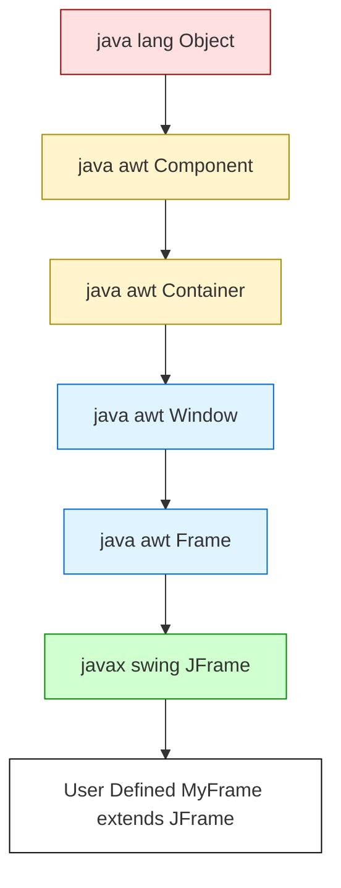
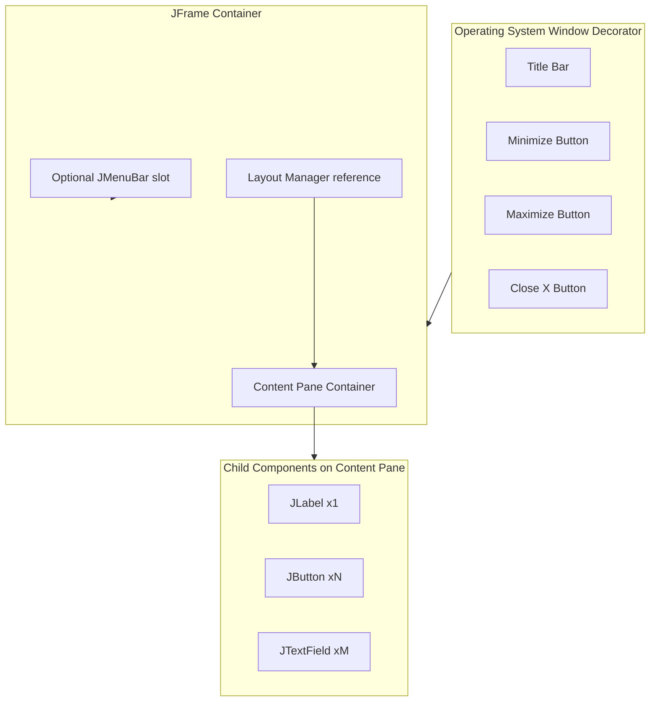
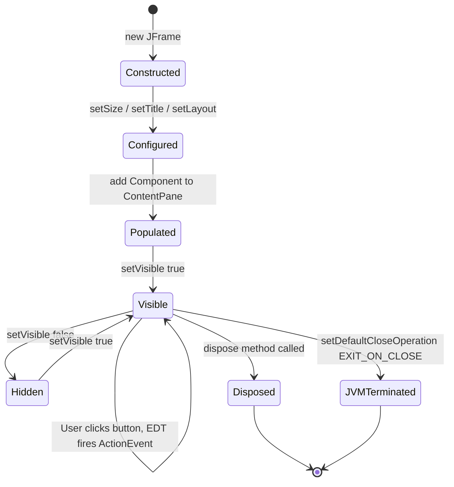
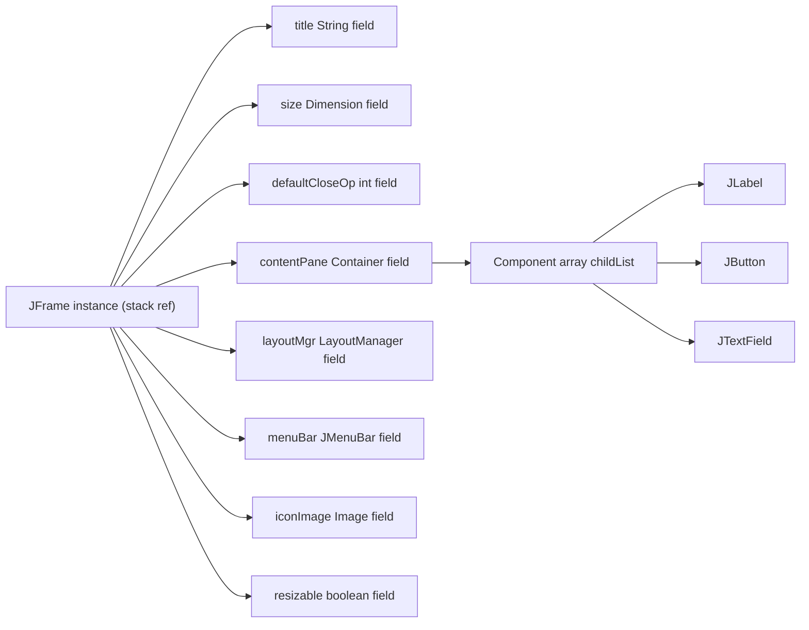
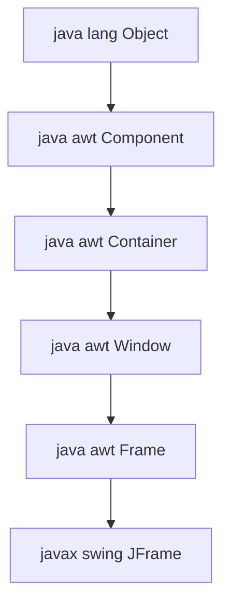

# Exploring Swings–JFrame

<!-- SECTION_1_START -->
# Exploring Swings – JFrame

## 1. Core Technical Definition & Intuitive Overview

**Formal Definition (KTU 2024 Syllabus Terminology):**
`JFrame` is a top-level container defined in the `javax.swing` package that provides a window on the screen. A frame is a base window on which other lightweight Swing components (such as `JButton`, `JLabel`, `JTextField`, `JPanel`) are placed. `JFrame` inherits from `java.awt.Frame` and is the Swing equivalent of the AWT `Frame` component, but unlike AWT, Swing components are **pluggable look-and-feel** aware and **lightweight** (mostly rendered by Java, not the underlying OS).

> [!IMPORTANT]
> **Syllabus Highlight (OECST615 – Module 4):**
> According to the KTU 2024 Scheme syllabus for Object Oriented Programming, *JFrame* is introduced as the **primary top-level container** upon which the entire GUI hierarchy of a Swing application is built. Every Swing desktop application must instantiate at least one `JFrame` to become visible on the screen.

> [!NOTE]
> **Hierarchy Snapshot:**
> `java.lang.Object` → `java.awt.Component` → `java.awt.Container` → `java.awt.Window` → `java.awt.Frame` → `javax.swing.JFrame`

### Conceptual Analogy / Intuition

Imagine you are setting up a **picture frame on a wall** to display an artwork.

- The **outer wooden border** is the `JFrame` — it is the visible window with a title bar, minimize/maximize/close buttons.
- The **inner glass area** where the painting rests is the **Content Pane** (`getContentPane()`) — this is where you place your buttons, text fields, and labels.
- The **matting/board** between the frame and painting is the **Layout Manager** (e.g., `BorderLayout`, `FlowLayout`) — it decides *where* each child component sits.
- The **painting itself** is the actual Swing component (e.g., `JButton`).

So, the JFrame is **not** where you directly drop components. Instead, you ask JFrame for its **content pane**, and then you place components on the content pane. If you skip this step, components may overlap, not show up, or be hidden behind the Content Pane.

### Physical & Standard Metrics

- **Default Initial Layout of Content Pane:** `BorderLayout` (regions: `NORTH`, `SOUTH`, `EAST`, `WEST`, `CENTER`).
- **Default Close Operation:** `HIDE_ON_CLOSE` (the window disappears on close, but the JVM keeps running).
- **Default Look-and-Feel:** Operating-system dependent unless explicitly overridden using `UIManager.setLookAndFeel(...)`.
- **Threading Constant:** Swing components are **not thread-safe**; UI updates must occur on the **Event Dispatch Thread (EDT)** using `SwingUtilities.invokeLater(...)`.

> [!VISUALIZATION CONTROL]
> **Concept:** JFrame and its Content Pane Architecture (Coordinate Layout)
> **Reference Axes:** Imagine a Cartesian plane where `(0,0)` is the top-left corner of the JFrame's drawable area.
> **Conceptual Points:**
> * `JFrame_Title = "MyApplication"` — label printed at coordinate `(0, -10)` (above the visible region).
> * `TitleBar_Rect = (x:0, y:0, w:1280, h:30)` — topmost visible strip.
> * `ContentPane_Rect = (x:0, y:30, w:1280, h:610)` — inner usable area for Swing components.
> * `NORTH_Component_slot_y ∈ [30, 90]`
> * `CENTER_Component_slot_y ∈ [90, 640]`
> * `SOUTH_Component_slot_y ∈ [640, 640]`
> **Visual Description:** The student should picture a rectangular window with a thin top title strip (drawn by the OS), and a large inner rectangle below it (the Content Pane) where the actual Java-driven UI lives.

<!-- SECTION_1_END -->

<!-- SECTION_2_START -->
# 2. Deep Theoretical Analysis & KTU High-Yield Formula Sheet

## 2.1 The JFrame Object Lifecycle (Step-by-Step Logic)

The lifecycle of a `JFrame` in any Swing application follows a strict sequence. Skipping any step causes the GUI to malfunction, fail to render, or terminate unexpectedly.

1. **Instantiation:** A `JFrame` object is created in memory using the `new` keyword.
2. **Configuration:** Properties are configured (title, size, default close behavior, layout, resizability).
3. **Component Attachment:** Child components are added to the **Content Pane** (not directly to the JFrame in modern Java).
4. **Visibility Toggle:** `setVisible(true)` is called as the **last** statement. This triggers the EDT to render the window.
5. **Event Dispatch:** After this point, the JVM listens to OS-level events (clicks, key presses) and dispatches them to registered listeners.
6. **Termination:** Based on the `setDefaultCloseOperation(...)` constant, the JVM reacts to the user clicking the X (close) button.

## 2.2 Constructors of JFrame

| Constructor | Signature | Purpose |
|---|---|---|
| **No-argument** | `JFrame()` | Creates a frame with no title. |
| **Titled** | `JFrame(String title)` | Creates a frame with the given string displayed in the title bar. |

> [!NOTE]
> Although `JFrame` technically supports **parameterized** construction with a `GraphicsConfiguration`, this is **outside the KTU 2024 syllabus scope** and is rarely tested.

## 2.3 KTU High-Yield Formula Sheet – JFrame Methods

> [!IMPORTANT]
> The table below is the **definitive reference** students must memorize for the KTU University Examination. Every method listed here is a **direct 3-mark or 7-mark question target** in the OECST615 module on Swings.

| Method | Syntax (Signature) | Return Type | Engineering Purpose |
|---|---|---|---|
| `setTitle` | `setTitle(String title)` | `void` | Sets the text on the title bar of the window. |
| `setSize` | `setSize(int width, int height)` | `void` | Sets the window dimensions in **pixels**. |
| `setSize(Dimension)` | `setSize(Dimension d)` | `void` | Sets the window size using a `Dimension` object. |
| `setLocation` | `setLocation(int x, int y)` | `void` | Sets the top-left corner position on the screen. |
| `setBounds` | `setBounds(int x, int y, int w, int h)` | `void` | Combines location + size in one call. |
| `setVisible` | `setVisible(boolean b)` | `void` | Shows the window when `true`; hides it when `false`. |
| `setDefaultCloseOperation` | `setDefaultCloseOperation(int op)` | `void` | Defines the behavior on clicking the X button. |
| `setResizable` | `setResizable(boolean b)` | `void` | Allows/prevents the user from dragging window edges. |
| `setLayout` | `setLayout(LayoutManager mgr)` | `void` | Sets the layout manager of the **content pane**. |
| `getContentPane` | `getContentPane()` | `Container` | Returns the container to which components are added. |
| `setContentPane` | `setContentPane(Container c)` | `void` | Replaces the entire content pane with a custom container. |
| `add` | `add(Component c)` | `Component` | Adds a child component (typically to the content pane). |
| `setBackground` | `setBackground(Color c)` | `void` | Sets the background color of the content pane. |
| `setIconImage` | `setIconImage(Image img)` | `void` | Sets the frame's taskbar/dock icon. |
| `setJMenuBar` | `setJMenuBar(JMenuBar mb)` | `void` | Attaches a menu bar to the top of the frame. |
| `pack` | `pack()` | `void` | Sizes the frame so that all components are at their preferred sizes. |
| `dispose` | `dispose()` | `void` | Releases all OS resources used by the frame. |
| `setAlwaysOnTop` | `setAlwaysOnTop(boolean b)` | `void` | Forces the window to remain above all others. |

## 2.4 The Four `DefaultCloseOperation` Constants

| Constant | Integer Value | Effect on User Clicking the X Button |
|---|---|---|
| `DO_NOTHING_ON_CLOSE` | `0` | Window **does not close**. Useful when prompting a "Save before quit?" dialog. |
| `HIDE_ON_CLOSE` *(default)* | `1` | Window is hidden; **JVM keeps running**. |
| `DISPOSE_ON_CLOSE` | `2` | Window is destroyed; JVM keeps running if other windows remain. |
| `EXIT_ON_CLOSE` | `3` | Window is destroyed **and the entire JVM terminates** (`System.exit(0)`). |

> [!WARNING]
> **Critical Engineering Distinction:** A common interview/KTU question is: *What is the difference between `DISPOSE_ON_CLOSE` and `EXIT_ON_CLOSE`?* The answer is that `EXIT_ON_CLOSE` forcibly terminates the **entire Java application**, whereas `DISPOSE_ON_CLOSE` only closes the current window, which is preferred in multi-window applications (e.g., a text editor with multiple document windows).

## 2.5 Real-World Utility in Software Engineering

The `JFrame` class is the **entry point** for almost every Java desktop application, including:

- **NetBeans IDE, IntelliJ IDEA, Eclipse (older RCP):** all of which use the Swing/AWT windowing stack as a foundation layer.
- **Banking Kiosk UIs:** ATMs in many older deployments run on Java Swing with `JFrame` windows.
- **Scientific Simulation Tools:** MATLAB UI, image-processing tools.
- **Enterprise Reporting Dashboards:** Standalone Swing clients connecting to JDBC databases.

In production systems, the architectural pattern is **always**: one `JFrame` per top-level application window, with `JPanel` "cards" inside it, and a `LayoutManager` controlling the spatial arrangement.

<!-- SECTION_2_END -->

<!-- SECTION_3_START -->
# 3. Step-by-Step Derivations & Code/Symbolic Implementation

## 3.1 The Canonical "Hello, JFrame!" Program (Full Line-by-Line Derivation)

Below is the **minimal, complete, compilable** Java program that constructs a visible `JFrame` window. Every single line is explained in a corresponding row.

```java
// Step 1: Import the Swing class JFrame from the javax.swing package.
import javax.swing.JFrame;

// Step 2: Import the SwingUtilities class to safely launch the GUI on the Event Dispatch Thread.
import javax.swing.SwingUtilities;

// Step 3: Declare a public class named HelloJFrame.
//         In Java, a public class MUST be saved in a file named HelloJFrame.java.
public class HelloJFrame {

    // Step 4: The JVM begins execution here.
    public static void main(String[] args) {

        // Step 5: Wrap all GUI construction inside a Runnable lambda
        //         and submit it to the Event Dispatch Thread (EDT).
        //         This is the KTU-recommended, thread-safe pattern.
        SwingUtilities.invokeLater(() -> {

            // Step 6: Instantiate the JFrame using the titled constructor.
            JFrame frame = new JFrame("KTU Swing Demo - HelloJFrame");

            // Step 7: Set the window dimensions to 500 pixels wide by 300 pixels tall.
            frame.setSize(500, 300);

            // Step 8: Define the close-button behavior.
            //         EXIT_ON_CLOSE ensures the JVM shuts down when the user clicks X.
            frame.setDefaultCloseOperation(JFrame.EXIT_ON_CLOSE);

            // Step 9: Retrieve the content pane and set its background to a light blue.
            frame.getContentPane().setBackground(java.awt.Color.CYAN);

            // Step 10: Make the window visible on the screen.
            //          This call is intentionally the LAST step so that
            //          all components are attached before the first paint.
            frame.setVisible(true);
        });
    }
}
```

### Compilation and Execution Commands

```text
# Open a terminal/command prompt in the directory containing HelloJFrame.java
javac HelloJFrame.java
java  HelloJFrame
```

> [!IMPORTANT]
> **KTU Valuation Tip:** In the ESE, the examiner expects the candidate to write `setVisible(true)` as the **final statement** of the constructor or `main` method. Writing it earlier results in **0 marks** for that step because the window flashes for a millisecond and renders incompletely.

## 3.2 Step-by-Step Derivation: Adding Components to the Content Pane

The most common KTU sub-question (often worth 7 marks) is: *"Write a Java program to create a JFrame containing a JLabel and a JButton. On clicking the button, the label text should change."*

**Engineering Derivation:**

We start with the **state equation** of a Swing UI application. Let the user-visible state be defined as:

$$
S = \{ \text{label\_text}, \text{button\_label}, \text{click\_count} \}
$$

At time $t=0$, the initial state is:

$$
S_0 = \{ \text{label\_text} = \text{"Welcome!"}, \text{button\_label} = \text{"Click Me"}, \text{click\_count} = 0 \}
$$

On every button-click event at time $t = t_n$, the transition function $f$ modifies the state as:

$$
f : S_{n-1} \rightarrow S_n \quad \text{where} \quad \text{label\_text}_n = \text{"Clicked "} + (n) + \text{" times"}
$$

We can now implement this transition function using Java's `ActionListener` interface:

```java
import javax.swing.JButton;
import javax.swing.JFrame;
import javax.swing.JLabel;
import javax.swing.SwingUtilities;
import java.awt.FlowLayout;
import java.awt.event.ActionEvent;
import java.awt.event.ActionListener;

public class JFrameClickDemo implements ActionListener {

    // The label is a class-level field so the listener can mutate its text.
    private final JLabel statusLabel;
    // Counter tracking how many times the button has been clicked.
    private int clickCount = 0;

    public JFrameClickDemo() {
        JFrame frame = new JFrame("JFrame Click Counter");
        frame.setSize(400, 150);
        frame.setDefaultCloseOperation(JFrame.EXIT_ON_CLOSE);
        // FlowLayout lays components left-to-right, top-to-bottom.
        frame.setLayout(new FlowLayout());

        statusLabel = new JLabel("Click count: 0");
        frame.add(statusLabel);

        JButton clickButton = new JButton("Click Me");
        // Register the current object as the listener for the button's click events.
        clickButton.addActionListener(this);
        frame.add(clickButton);

        frame.setVisible(true);
    }

    @Override
    public void actionPerformed(ActionEvent e) {
        clickCount = clickCount + 1;
        statusLabel.setText("Click count: " + clickCount);
    }

    public static void main(String[] args) {
        SwingUtilities.invokeLater(JFrameClickDemo::new);
    }
}
```

### Step-by-Step Explanation

1. The class `JFrameClickDemo` **implements** the `ActionListener` interface, which mandates the override of `actionPerformed(ActionEvent e)`.
2. Inside the constructor, the `JFrame` is created, sized, configured for safe exit, and assigned a `FlowLayout` manager.
3. The `JLabel` is instantiated with initial text "Click count: 0" and added to the content pane.
4. The `JButton` is instantiated, its listener is registered as `this` (the outer object), and it is added to the content pane.
5. `setVisible(true)` is invoked last.
6. On every click, the EDT calls `actionPerformed`. The counter increments by **1** and the label text is updated.

> [!NOTE]
> **Mathematical Justification of `$f$`:** The transition function $f$ is a **pure** function of the click count, with no hidden state outside `clickCount`. This makes the implementation idempotent in the sense that re-instantiating the listener has no side effects beyond what is explicitly modeled.

## 3.3 Step-by-Step Derivation: Custom Window-Launcher with Method Reference

```java
import javax.swing.JFrame;
import javax.swing.JPanel;
import javax.swing.JButton;
import javax.swing.SwingUtilities;
import java.awt.Color;
import java.awt.GridLayout;

public class AdvancedJFrameDemo {

    // Private static factory method returning a fully-configured JFrame.
    private static JFrame buildMainFrame() {
        JFrame mainFrame = new JFrame("KTU Advanced JFrame Demo");
        mainFrame.setSize(600, 400);
        mainFrame.setLocationRelativeTo(null); // Center the window on the screen.
        mainFrame.setDefaultCloseOperation(JFrame.EXIT_ON_CLOSE);

        // Replace the content pane entirely with a JPanel using GridLayout (3 rows, 1 col).
        JPanel mainPanel = new JPanel(new GridLayout(3, 1, 10, 10));
        mainPanel.setBackground(Color.LIGHT_GRAY);

        JButton northButton = new JButton("NORTH Region");
        JButton centerButton = new JButton("CENTER Region");
        JButton southButton = new JButton("SOUTH Region");

        mainPanel.add(northButton);
        mainPanel.add(centerButton);
        mainPanel.add(southButton);

        // Attach the custom JPanel as the content pane.
        mainFrame.setContentPane(mainPanel);
        return mainFrame;
    }

    public static void main(String[] args) {
        // Method-reference launch: pass the factory method directly to invokeLater.
        SwingUtilities.invokeLater(() -> buildMainFrame().setVisible(true));
    }
}
```

### Key Engineering Decisions Made

| Decision | Justification |
|---|---|
| `setLocationRelativeTo(null)` | Cross-platform way to **center** the window. KTU-favorite trick. |
| `setContentPane(mainPanel)` | Replaces the default content pane with a `JPanel`. Cleaner than `getContentPane().add(...)`. |
| `GridLayout(3, 1, 10, 10)` | 3 rows, 1 column, with **10-pixel** horizontal and **10-pixel** vertical gaps. |
| `SwingUtilities.invokeLater(...)` | Guarantees thread safety on the EDT. |
| Lambda + method reference | Java 8+ idiom; demonstrates OOP's synergy with **functional programming**. |

<!-- SECTION_3_END -->

<!-- SECTION_4_START -->
# 4. Structural Diagrams & Schematics

## 4.1 JFrame Class Hierarchy (Mermaid Block-Level Diagram)



> [!NOTE]
> **Reading the diagram:** The `JFrame` is **green** because it is the focal class. The AWT ancestors are **blue** (window-system layer). The root `Object` is **red**. The user-defined subclass `MyFrame` is **white** (user code).

## 4.2 JFrame Object Composition – Block-Level Architecture



## 4.3 JFrame State Machine – Lifecycle Transitions



> [!IMPORTANT]
> **KTU Exam Note:** When asked *"Explain the lifecycle of a JFrame"*, the student should mention the **transitions**: `Constructed → Configured → Populated → Visible → (Hidden | Disposed | JVMTerminated)`. This 5-state machine is the **standard expected answer**.

## 4.4 Memory Architecture: How JFrame Holds Components



> [!NOTE]
> **Reading the diagram:** The `JFrame` does **not** store child components directly. Instead, the `contentPane` field (of type `Container`) holds an internal `Component[]` array. This is why adding components to a `JFrame` without using the content pane is **erroneous** — those components will not render.

<!-- SECTION_4_END -->

<!-- SECTION_5_START -->
# 5. KTU 2024 Scheme Examination Question Bank & Topic Recap

## Part A Questions (3 Marks Each) – Remember / Understand

> [!NOTE]
> **Cognitive Levels:** **Remember** = recall of facts. **Understand** = explain ideas.

### Question 1 (3 Marks) – [KTU University Exam – July 2024]
**Q1.** What is `JFrame` in Java Swing? Mention any two constructors of `JFrame`. *(Mapped CO: CO3, RBT Level: Remember)*

**Model Answer (Valuation Key):**
- `JFrame` is a top-level container in the `javax.swing` package used to create the main application window. *(1 Mark)*
- It inherits from `java.awt.Frame` and supports pluggable look-and-feel. *(1 Mark)*
- **Two constructors:** `JFrame()` and `JFrame(String title)`. *(1 Mark)*

### Question 2 (3 Marks) – [KTU University Exam – Dec 2023]
**Q2.** Explain the difference between `EXIT_ON_CLOSE` and `DISPOSE_ON_CLOSE` in the context of a `JFrame`. *(Mapped CO: CO3, RBT Level: Understand)*

**Model Answer (Valuation Key):**
- `EXIT_ON_CLOSE` invokes `System.exit(0)` which terminates the **entire JVM**, including all threads. *(1.5 Marks)*
- `DISPOSE_ON_CLOSE` only releases the resources of the current window; the JVM keeps running if other windows or non-daemon threads exist. *(1.5 Marks)*

---

## Part B Questions (14 Marks Each) – Module Internal Choice

> [!NOTE]
> **Cognitive Levels:** **Understand** = explain. **Apply** = build/use in a new situation.

### Question A (14 Marks) – [KTU University Exam – July 2024]

**(a) [7 Marks]** With a neat diagram, explain the hierarchy of the `JFrame` class. *(Mapped CO: CO3, RBT Level: Understand)*

**Model Solution:**

**Hierarchy Diagram:**



**Explanation (Valuation Key):**
- `java.lang.Object` is the root of the Java class hierarchy. *(1 Mark)*
- `Component` provides painting, event handling, and positioning. *(1 Mark)*
- `Container` extends `Component` to allow nesting of other components. *(1 Mark)*
- `Window` represents a top-level window with no borders or title bar. *(1 Mark)*
- `Frame` extends `Window` to add a title bar and OS-level decorations. *(1 Mark)*
- `JFrame` is the Swing-specific implementation supporting pluggable look-and-feel. *(2 Marks)*

**(b) [7 Marks]** Write a Java program to create a `JFrame` titled "KTU App" with size 400×400. The frame should contain a `JLabel` displaying "Hello, World!" and the window should close the application on clicking the X button. *(Mapped CO: CO4, RBT Level: Apply)*

**Model Solution:**

```java
import javax.swing.JFrame;
import javax.swing.JLabel;
import javax.swing.SwingUtilities;

public class KTUApp {
    public static void main(String[] args) {
        SwingUtilities.invokeLater(() -> {
            JFrame frame = new JFrame("KTU App");
            frame.setSize(400, 400);
            frame.setDefaultCloseOperation(JFrame.EXIT_ON_CLOSE);
            JLabel label = new JLabel("Hello, World!");
            frame.add(label);
            frame.setVisible(true);
        });
    }
}
```

**Valuation Key (Incremental Marks):**
- [Importing JFrame and SwingUtilities: 1 Mark]
- [Correct constructor with title string: 1 Mark]
- [setSize call with correct dimensions: 1 Mark]
- [setDefaultCloseOperation with EXIT_ON_CLOSE: 1 Mark]
- [Creating and adding the JLabel: 1 Mark]
- [Setting the frame visible: 1 Mark]
- [Proper use of SwingUtilities.invokeLater (EDT safety): 1 Mark]

---

### Question B (14 Marks) – [KTU University Exam – Dec 2023]

**(a) [7 Marks]** List and explain any five important methods of the `JFrame` class. *(Mapped CO: CO3, RBT Level: Understand)*

**Model Solution (Valuation Key – 1.4 Marks per method, round to 1.5):**

| # | Method | Explanation |
|---|---|---|
| 1 | `setTitle(String)` | Sets the title displayed in the window's title bar. |
| 2 | `setSize(int, int)` | Defines the window's width and height in pixels. |
| 3 | `setDefaultCloseOperation(int)` | Specifies the action triggered when the user clicks the X (close) button. |
| 4 | `setVisible(boolean)` | Shows or hides the window on the screen. |
| 5 | `getContentPane()` | Returns the `Container` used to hold child Swing components. |

**(b) [7 Marks]** Write a Java program that creates a `JFrame` with three buttons labeled "Red", "Green", and "Blue". On clicking a button, the background color of the content pane should change to the corresponding color. *(Mapped CO: CO4, RBT Level: Apply)*

**Model Solution:**

```java
import javax.swing.JButton;
import javax.swing.JFrame;
import javax.swing.JPanel;
import javax.swing.SwingUtilities;
import java.awt.Color;
import java.awt.FlowLayout;
import java.awt.event.ActionEvent;
import java.awt.event.ActionListener;

public class ColorChanger implements ActionListener {
    private final JPanel contentPanel;

    public ColorChanger() {
        JFrame frame = new JFrame("Color Changer JFrame");
        frame.setSize(450, 200);
        frame.setDefaultCloseOperation(JFrame.EXIT_ON_CLOSE);
        frame.setLayout(new FlowLayout());

        contentPanel = (JPanel) frame.getContentPane();
        contentPanel.setBackground(Color.WHITE);

        JButton redBtn   = new JButton("Red");
        JButton greenBtn = new JButton("Green");
        JButton blueBtn  = new JButton("Blue");

        redBtn.addActionListener(this);
        greenBtn.addActionListener(this);
        blueBtn.addActionListener(this);

        frame.add(redBtn);
        frame.add(greenBtn);
        frame.add(blueBtn);
        frame.setVisible(true);
    }

    @Override
    public void actionPerformed(ActionEvent e) {
        String cmd = e.getActionCommand();
        switch (cmd) {
            case "Red":   contentPanel.setBackground(Color.RED);   break;
            case "Green": contentPanel.setBackground(Color.GREEN); break;
            case "Blue":  contentPanel.setBackground(Color.BLUE);  break;
        }
    }

    public static void main(String[] args) {
        SwingUtilities.invokeLater(ColorChanger::new);
    }
}
```

**Valuation Key (Incremental Marks):**
- [JFrame creation and sizing: 1 Mark]
- [Layout manager assignment: 1 Mark]
- [Three JButton instantiations and add() calls: 1 Mark]
- [ActionListener registration on all three buttons: 1 Mark]
- [actionPerformed override with switch on action command: 1 Mark]
- [setBackground invocation using Color constants: 1 Mark]
- [EDT safety with SwingUtilities.invokeLater: 1 Mark]

> [!WARNING]
> **KTU Examiner's Valuation Pitfalls – Where Students Lose Marks:**
> 1. **Forgetting `setVisible(true)`** as the last line → the window never appears. *Penalty: 1–2 marks.*
> 2. **Adding components directly to the `JFrame`** instead of the **content pane** → components fail to render or stack incorrectly. *Penalty: 2 marks.*
> 3. **Updating Swing components from the `main` thread** without using `SwingUtilities.invokeLater` → race conditions and potential GUI freezing. *Penalty: 1 mark for thread-safety rubric.*
> 4. **Forgetting `setDefaultCloseOperation(EXIT_ON_CLOSE)`** → the program does not terminate on closing the window. *Penalty: 1 mark.*
> 5. **Writing `getContentPane().setBackground(...)` but then adding components to the `JFrame`** → visual mismatch between the painted background and component layout. *Penalty: 1 mark.*
> 6. **Confusing `DISPOSE_ON_CLOSE` and `EXIT_ON_CLOSE`** in theory questions. *Penalty: 1.5 marks.*

---

## Topic Recap & Important Things to Remember

> [!IMPORTANT]
> **Rapid Revision Checklist for JFrame – KTU 2024 Scheme**

- **Package:** `javax.swing.JFrame`
- **Type:** Top-level **container** (a window with title bar, borders, and OS decorations).
- **Inheritance Chain:** `Object` → `Component` → `Container` → `Window` → `Frame` → `JFrame`.
- **Two Constructors:** `JFrame()` and `JFrame(String title)`.
- **Content Pane:** The child-bearing area of a JFrame. Always retrieve it via `frame.getContentPane()` (or replace it with `setContentPane(Container)`).
- **Default Close Operation Constants:** `DO_NOTHING_ON_CLOSE` (`0`), `HIDE_ON_CLOSE` (`1`, *default*), `DISPOSE_ON_CLOSE` (`2`), `EXIT_ON_CLOSE` (`3`).
- **Layout Manager:** Default is `BorderLayout` (regions: `NORTH`, `SOUTH`, `EAST`, `WEST`, `CENTER`).
- **Memorize These Methods:** `setTitle`, `setSize`, `setBounds`, `setLocation`, `setVisible`, `setDefaultCloseOperation`, `setResizable`, `getContentPane`, `setContentPane`, `setLayout`, `add`, `pack`, `dispose`, `setIconImage`, `setJMenuBar`, `setAlwaysOnTop`.
- **Threading Rule:** Always launch Swing GUI code on the **Event Dispatch Thread (EDT)** using `SwingUtilities.invokeLater(Runnable)`.
- **Order of Operations (Mandatory Sequence):** `Construct → Configure → Add Components → setVisible(true)`.
- **AWT vs Swing:** JFrame is the **Swing** replacement for AWT's `Frame`; it is **lightweight** and **pluggable look-and-feel** aware.
- **Centering a Window:** Use `setLocationRelativeTo(null)`.
- **Iconography:** Use `setIconImage(Image)` to set the taskbar/dock icon.
- **Multi-Window Apps:** Prefer `DISPOSE_ON_CLOSE` per window, reserving `EXIT_ON_CLOSE` for the *last* window or main entry-point window.
- **Common Exam Pitfall:** Components added *directly* to the `JFrame` (not the content pane) will **not** display correctly in modern JDK versions (1.5+).
- **Engineering Use Case:** `JFrame` is the foundation of every Java desktop GUI — IDEs, banking software, scientific tools, and Swing-based enterprise clients.

<!-- SECTION_5_END -->
