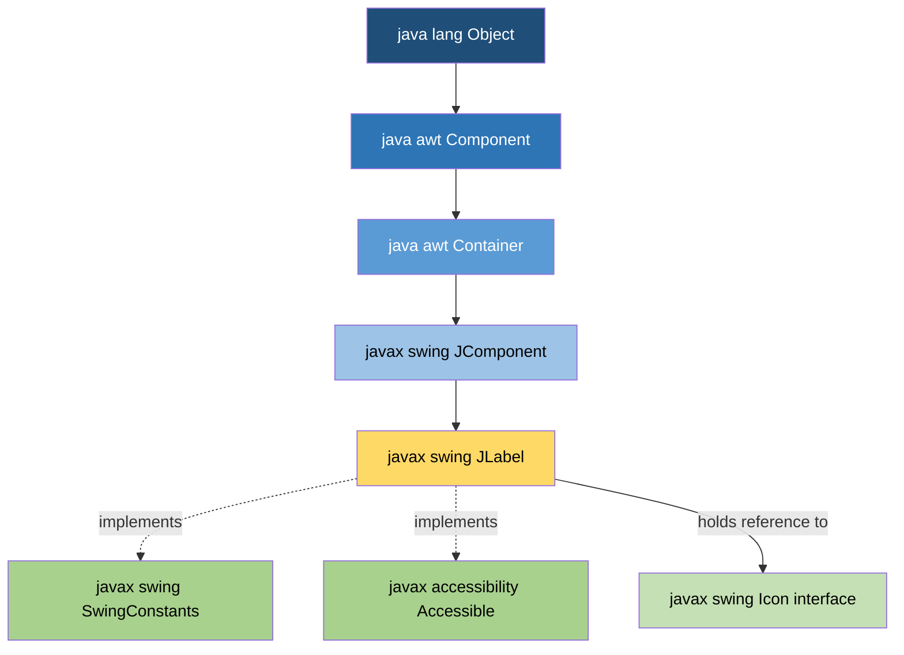
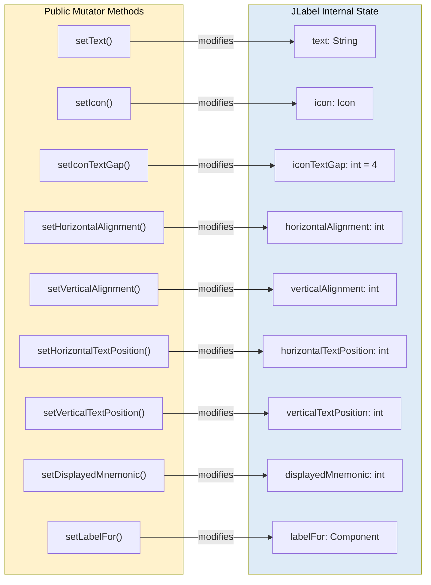
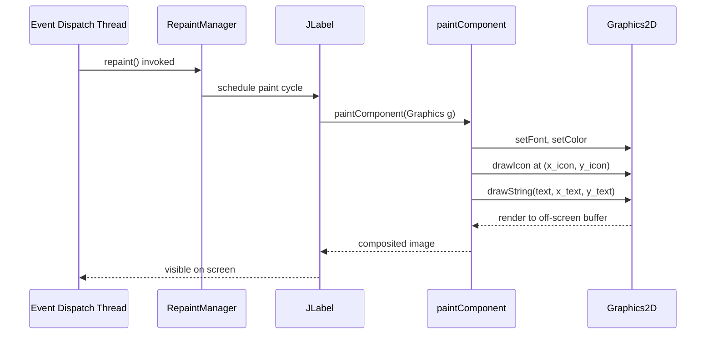
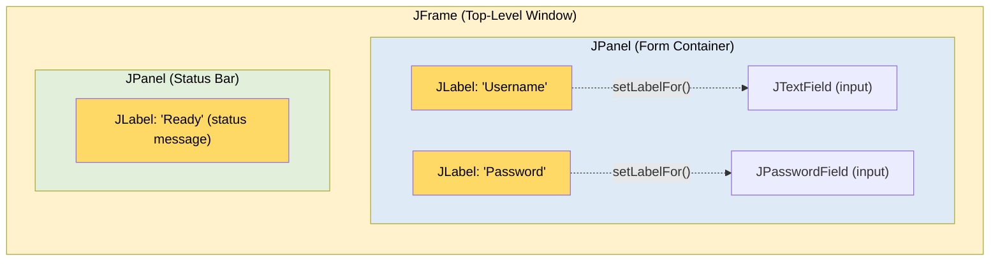

# JLabel

<!-- SECTION_1_START -->
# JLabel — The Foundational Display Component in Java Swing

> [!NOTE]
> **KTU 2024 Scheme | Module 4 — Swings Fundamentals & Overview of AWT**
> **Topic:** `JLabel` (Package: `javax.swing`)
> **Course Outcome Mapping:** CO3 — *Apply object-oriented concepts to design GUI-based applications using AWT and Swing.*

---

## 1.1 Formal Academic Definition

`JLabel` is a **lightweight, non-interactive display component** of the Java Swing API (defined in `javax.swing.JLabel`) used to render **read-only text, images, or both** on a graphical user interface. It is a concrete subclass of `javax.swing.JComponent` and represents the simplest visual element in the Swing component hierarchy, designed explicitly for **information display** rather than user input.

```java
public class JLabel extends JComponent implements SwingConstants, Accessible
```

The class is a **passive component** — it cannot receive keyboard focus, does not generate `ActionEvent`s, and is excluded from the focus traversal cycle by default. It is the Swing successor of the AWT `Label` class, providing enhanced features such as **icon support, HTML text rendering, mnemonics, and customizable alignment**.

> [!IMPORTANT]
> **Key Distinction (Board Exam Favorite):** `JLabel` is the *Swing equivalent* of AWT's `java.awt.Label`. However, unlike AWT components, `JLabel` is a **lightweight (pure Java) component** that delegates its rendering to its parent container, supporting pluggable Look & Feel (PLAF).

---

## 1.2 Intuitive Overview — The "Sticky Note" Analogy

Imagine a **post-it note pinned onto a bulletin board**. It can display:
- A handwritten message (**text**)
- A photograph (**icon**)
- Or both, side by side (**text + image**)

The note is **read-only** — you can read it, but you cannot click it, type into it, or change it after it is pinned. The board on which it is pinned is the **`Container`** (like `JFrame` or `JPanel`), and you choose **where exactly** on the board the note appears (**layout manager**).

> [!TIP]
> **Geometric Intuition:** Think of a `JLabel` as a *rectangular pixel region* `[x, y, width, height]` whose contents (text/image) are aligned according to a **gravity vector** — `LEFT`/`CENTER`/`RIGHT` for the horizontal axis and `TOP`/`CENTER`/`BOTTOM` for the vertical axis. The `setHorizontalAlignment()` and `setVerticalAlignment()` methods simply shift the rendering of the content *within* the label's display bounds.

---

## 1.3 Physical Constants & Standard Metrics

> [!IMPORTANT]
> **Standard Default Values (Per `SwingConstants` interface):**
> - **Default Horizontal Alignment:** `LEADING` (left-to-right locales → `LEFT`)
> - **Default Vertical Alignment:** `CENTER`
> - **Default Text Position:** `TRAILING` (icon-first, then text)
> - **Default Mnemonic:** `None` (no keyboard accelerator)
> - **Label Opacity:** `false` (transparent — inherits parent background)
> - **Standard Font:** inherited from `Look & Feel` (usually `SansSerif`, `PLAIN`, `12pt`)

---

## 1.4 Visualization Block

> [!VISUALIZATION CONTROL]
> **Concept:** Visual layout of a `JLabel` with combined `Icon` + `Text` rendering
> **Desmos / GeoGebra Input Equations:**
> * Bounds Rectangle: `(x, y)` from `(0, 0)` to `(W, H)` where $W = 200$, $H = 60$
> * Icon Anchor: `I = (10 + 0.5 \cdot 32, H/2)`
> * Text Baseline: `T = (I_x + 32 + 4, H/2)` (gap = 4 px)
> * Alignment Indicator: `g_x = \text{getHorizontalAlignment()} \in \{-1, 0, +1\}$
>
> **Visual Description:** A 200×60 px rectangle with a 32×32 icon flush-left and text centered vertically next to it. When `setHorizontalAlignment(CENTER)` is called, the (icon + gap + text) tuple slides rightward by `(W - \text{contentWidth}) / 2$.

<!-- SECTION_1_END -->

<!-- SECTION_2_START -->
# Deep Theoretical Analysis — JLabel Architecture & Behavior

## 2.1 Class Hierarchy (Inheritance Chain)

`JLabel` sits deep within the Swing class tree. Understanding this chain is **mandatory for KTU theory questions** on Swing fundamentals.

```text
java.lang.Object
   └── java.awt.Component
        └── java.awt.Container
             └── javax.swing.JComponent
                  └── javax.swing.JLabel  (implements SwingConstants, Accessible)
```

| Layer | Class | Role |
|:------|:------|:-----|
| **L0 — Root** | `java.lang.Object` | Base class for all Java classes |
| **L1 — AWT Peer** | `java.awt.Component` | Provides positioning, sizing, painting, events |
| **L2 — Container** | `java.awt.Container` | Allows nesting of components |
| **L3 — Swing Base** | `javax.swing.JComponent` | Adds PLAF, borders, tooltips, double-buffering |
| **L4 — Concrete** | `javax.swing.JLabel` | The display component itself |

> [!NOTE]
> **AWT vs Swing:** AWT components are *heavyweight* (peered to OS). Swing components like `JLabel` are *lightweight* (drawn entirely in Java, no native peer), which gives them **uniform appearance across platforms**.

---

## 2.2 Operational Mechanics — How `JLabel` Works Internally

The `JLabel` class maintains three internal data members that govern its rendering:

1. **`String text`** — the displayed text (`null` allowed).
2. **`Icon icon`** — the displayed image (`null` allowed).
3. **`int iconTextGap`** — pixel gap between icon and text (default = **4 px**).

When `paintComponent(Graphics g)` is invoked by the AWT/Swing repaint manager, the following sequence occurs:

1. The component's **border** is painted (if any).
2. The **background** is filled (only if `isOpaque() == true`).
3. The **icon** is drawn at `(insets.left + paintIconX, insets.top + paintIconY)`.
4. The **text** is drawn using the component's `Font`, `Foreground`, and the configured alignment.
5. The combined content is positioned within the **content rect** using the alignment properties.

The painting coordinates are computed by the protected helper method `paintIcon` and `paintText` (both overridable in subclasses for custom behavior).

---

## 2.3 Constructor Reference (Board-Exam High-Yield)

`JLabel` provides **six constructors**, all inherited overloads:

| # | Constructor Signature | Purpose |
|:-:|:---------------------|:--------|
| 1 | `JLabel()` | Empty label — no text, no icon |
| 2 | `JLabel(String text)` | Label with text only |
| 3 | `JLabel(Icon image)` | Label with icon only |
| 4 | `JLabel(String text, Icon image, int horizontalAlignment)` | Combined text + icon + alignment |
| 5 | `JLabel(String text, int horizontalAlignment)` | Text with explicit alignment |
| 6 | `JLabel(Icon image, int horizontalAlignment)` | Icon with explicit alignment |

> The `horizontalAlignment` parameter accepts constants from `SwingConstants`:
> `LEFT (2)`, `CENTER (0)`, `RIGHT (4)`, `LEADING (10)`, `TRAILING (11)`.

---

## 2.4 Key Method Reference (Exam Cheat Sheet)

| Method | Return Type | Purpose / Behavior |
|:-------|:-----------|:------------------|
| `setText(String text)` | `void` | Sets the label's text. Supports **HTML 3.2** tags when string starts with `<html>`. |
| `getText()` | `String` | Returns the label's text (empty string if no text). |
| `setIcon(Icon icon)` | `void` | Sets the displayed image. |
| `getIcon()` | `Icon` | Returns the currently displayed icon (`null` if none). |
| `setHorizontalAlignment(int)` | `void` | Sets horizontal alignment within the label's bounds. |
| `setVerticalAlignment(int)` | `void` | Sets vertical alignment within the label's bounds. |
| `setHorizontalTextPosition(int)` | `void` | Position of text **relative to icon** (LEFT/CENTER/RIGHT/LEADING/TRAILING). |
| `setVerticalTextPosition(int)` | `void` | Position of text **relative to icon** (TOP/CENTER/BOTTOM). |
| `setIconTextGap(int)` | `void` | Sets pixel gap between icon and text. |
| `setLabelFor(Component c)` | `void` | Associates the label as the **mnemonic target** for another component. |
| `getLabelFor()` | `Component` | Returns the component for which this label is a mnemonic target. |
| `setDisplayedMnemonic(int key)` | `void` | Sets the keyboard mnemonic character (key code). |
| `setDisplayedMnemonicIndex(int)` | `void` | Sets which character in the text is underlined. |
| `setDisabledIcon(Icon)` | `void` | Icon shown when label is disabled. |
| `setForeground(Color)` | `void` | Text color. |
| `setFont(Font)` | `void` | Text font. |
| `setOpaque(boolean)` | `void` | `true` to fill background, `false` for transparency (default). |

---

## 2.5 Engineering Utility & Real-World Applications

`JLabel` is ubiquitous in **production-grade Java desktop applications**:

| Domain | Use Case |
|:-------|:---------|
| **Form Design** | Field captions next to `JTextField` inputs (paired with `setLabelFor()` for accessibility). |
| **Status Bars** | Displaying live status messages in IDEs (e.g., *"Build Successful"* in IntelliJ). |
| **Image Galleries** | Rendering thumbnails with HTML captions below. |
| **Splash Screens** | Showing company logo and version number during app startup. |
| **Toolbars** | Static descriptive text labels beside toolbar buttons. |
| **Login Screens** | Displaying error messages, copyright notices, version info. |
| **Internationalization (i18n)** | `ResourceBundle` values loaded dynamically into label text. |

> [!TIP]
> **Production Pattern:** The `setLabelFor()` method is critical for **accessibility (Section 508 / WCAG compliance)**. When a `JLabel` is bound to a `JTextField` via `setLabelFor()`, screen readers announce the label's text when the field gains focus — a **mandatory feature in enterprise apps**.

<!-- SECTION_2_END -->

<!-- SECTION_3_START -->
# Step-by-Step Code & Symbolic Implementation

## 3.1 Program 1 — Basic `JLabel` with Text Only

```java
import javax.swing.JFrame;
import javax.swing.JLabel;
import java.awt.FlowLayout;

public class BasicLabelDemo {
    public static void main(String[] args) {

        // Step 1: Create the top-level window container
        JFrame frame = new JFrame("Basic JLabel Demonstration");
        frame.setSize(420, 180);
        frame.setDefaultCloseOperation(JFrame.EXIT_ON_CLOSE);
        frame.setLayout(new FlowLayout(FlowLayout.CENTER, 20, 20));

        // Step 2: Create JLabel instances (read-only display components)
        JLabel nameLabel  = new JLabel("Student Name :");
        JLabel deptLabel  = new JLabel("Department    :");
        JLabel collegeLbl = new JLabel("APJ Abdul Kalam Technological University");

        // Step 3: Customize font and color of the third label
        collegeLbl.setFont(new java.awt.Font("Serif", java.awt.Font.BOLD, 16));
        collegeLbl.setForeground(new java.awt.Color(0, 102, 204));

        // Step 4: Add the labels to the frame's content pane
        frame.add(nameLabel);
        frame.add(deptLabel);
        frame.add(collegeLbl);

        // Step 5: Make the window visible
        frame.setVisible(true);
    }
}
```

**Output Behavior:** Three horizontally arranged labels. The third label renders in **bold serif, blue**, demonstrating that `JLabel` respects `Font` and `Foreground` customizations.

---

## 3.2 Program 2 — `JLabel` with Icon + Text + Alignment

```java
import javax.swing.ImageIcon;
import javax.swing.JFrame;
import javax.swing.JLabel;
import javax.swing.SwingConstants;
import java.awt.FlowLayout;
import java.awt.Font;

public class IconTextLabelDemo {
    public static void main(String[] args) {

        JFrame frame = new JFrame("JLabel with Icon and Text");
        frame.setSize(500, 200);
        frame.setDefaultCloseOperation(JFrame.EXIT_ON_CLOSE);
        frame.setLayout(new FlowLayout(FlowLayout.LEFT, 15, 25));

        // Step 1: Load an icon from the project resources
        ImageIcon tickIcon = new ImageIcon("images/tick.png");

        // Step 2: Construct a JLabel combining icon + text + alignment
        JLabel statusLabel = new JLabel("Submission Successful", tickIcon, SwingConstants.LEFT);

        // Step 3: Configure relative positioning of text vs icon
        statusLabel.setHorizontalTextPosition(SwingConstants.RIGHT); // text appears to the right of icon
        statusLabel.setVerticalTextPosition(SwingConstants.CENTER);   // vertically centered with icon

        // Step 4: Set the gap between icon and text (default is 4 px)
        statusLabel.setIconTextGap(10);

        // Step 5: Apply typography styling
        statusLabel.setFont(new Font("SansSerif", Font.BOLD, 14));
        statusLabel.setForeground(new java.awt.Color(0, 128, 0)); // green for success

        frame.add(statusLabel);
        frame.setVisible(true);
    }
}
```

**Expected Visual Result:** A small green tick icon followed by bold green text *"Submission Successful"*, with a 10 px gap between them.

---

## 3.3 Program 3 — `JLabel` with HTML Formatting

A unique capability of `JLabel` (not available in AWT's `Label`) is **HTML 3.2 rendering** when the text begins with `<html>`.

```java
import javax.swing.JFrame;
import javax.swing.JLabel;
import java.awt.Color;
import java.awt.FlowLayout;

public class HtmlLabelDemo {
    public static void main(String[] args) {

        JFrame frame = new JFrame("JLabel HTML Rendering Demo");
        frame.setSize(500, 250);
        frame.setDefaultCloseOperation(JFrame.EXIT_ON_CLOSE);
        frame.setLayout(new FlowLayout(FlowLayout.CENTER, 20, 20));

        // HTML 3.2 supported tags: <html>, <body>, <h1>...<h6>, <b>, <i>, <u>,
        // <font color="...">, <p>, <br>, <ul>, <li>, 
        String htmlContent =
              "<html><body>"
            + "<h2 style='color:#1F4E79;'>KTU B.Tech — OOP Course</h2>"
            + "<p>Module 4: <b>Swings Fundamentals</b></p>"
            + "<p>Topic: <i>JLabel Component</i></p>"
            + "<p style='color:red;'>Important for Board Exams!</p>"
            + "</body></html>";

        JLabel richLabel = new JLabel(htmlContent);
        richLabel.setOpaque(true);
        richLabel.setBackground(Color.decode("#F0F8FF")); // AliceBlue

        frame.add(richLabel);
        frame.setVisible(true);
    }
}
```

> [!IMPORTANT]
> **HTML Support Caveat:** Swing uses a **lightweight HTML 3.2 renderer (`javax.swing.text.html.HTMLEditorKit`)**. CSS support is **partial**, JavaScript is **not supported**, and complex tables/forms will not render. Use JavaFX or web-based technologies for rich content.

---

## 3.4 Program 4 — Mnemonic Binding via `setLabelFor()`

This program demonstrates **accessibility-grade pairing** of a `JLabel` with a `JTextField`.

```java
import javax.swing.JFrame;
import javax.swing.JLabel;
import javax.swing.JTextField;
import javax.swing.SwingConstants;
import javax.swing.KeyStroke;
import java.awt.GridLayout;

public class MnemonicLabelDemo {
    public static void main(String[] args) {

        JFrame frame = new JFrame("JLabel as Mnemonic Host");
        frame.setSize(400, 200);
        frame.setDefaultCloseOperation(JFrame.EXIT_ON_CLOSE);
        frame.setLayout(new GridLayout(3, 2, 10, 10));

        // ----- Row 1: Username -----
        JLabel userLbl = new JLabel("Username (_U):");
        JTextField userTxt = new JTextField(15);
        userLbl.setLabelFor(userTxt);                  // bind label -> text field
        userLbl.setDisplayedMnemonic('U');             // mnemonic: Alt+U
        userLbl.setDisplayedMnemonicIndex(10);         // underline the 'U' in "Username"

        // ----- Row 2: Password -----
        JLabel passLbl = new JLabel("Password (_P):");
        JTextField passTxt = new JTextField(15);
        passLbl.setLabelFor(passTxt);
        passLbl.setDisplayedMnemonic('P');
        passLbl.setDisplayedMnemonicIndex(9);

        // ----- Row 3: Email -----
        JLabel emailLbl = new JLabel("Email (_E):");
        JTextField emailTxt = new JTextField(15);
        emailLbl.setLabelFor(emailTxt);
        emailLbl.setDisplayedMnemonic('E');
        emailLbl.setDisplayedMnemonicIndex(6);

        frame.add(userLbl);  frame.add(userTxt);
        frame.add(passLbl);  frame.add(passTxt);
        frame.add(emailLbl); frame.add(emailTxt);

        frame.setVisible(true);
    }
}
```

**Keyboard Behavior:** Pressing `Alt+U`, `Alt+P`, or `Alt+E` transfers keyboard focus to the corresponding text field, mimicking native OS form behavior.

---

## 3.5 Program 5 — Dynamic `JLabel` (Event-Driven Update)

```java
import javax.swing.JButton;
import javax.swing.JFrame;
import javax.swing.JLabel;
import java.awt.FlowLayout;

public class DynamicLabelDemo {
    public static void main(String[] args) {

        JFrame frame = new JFrame("Dynamic JLabel Update");
        frame.setSize(380, 150);
        frame.setDefaultCloseOperation(JFrame.EXIT_ON_CLOSE);
        frame.setLayout(new FlowLayout(FlowLayout.CENTER, 20, 20));

        JLabel clickCounterLbl = new JLabel("Button clicked 0 times.");
        JButton clickBtn = new JButton("Click Me!");

        final int[] count = {0}; // mutable counter using 1-element array trick

        clickBtn.addActionListener(e -> {
            count[0]++;
            clickCounterLbl.setText("Button clicked " + count[0] + " times.");
        });

        frame.add(clickCounterLbl);
        frame.add(clickBtn);
        frame.setVisible(true);
    }
}
```

**Educational Takeaway:** Although `JLabel` itself is *passive* and *non-interactive*, it can be **dynamically updated** by event handlers triggered by *other* components — this is the foundation of stateful UIs.

---

## 3.6 Common Pitfalls & Defensive Coding Matrix

| Pitfall | Symptom | Defensive Fix |
|:--------|:--------|:--------------|
| Calling `setText("")` instead of `setText(null)` | Empty space allocated | Use `setText(null)` to fully release the text region |
| Forgetting `setOpaque(true)` before `setBackground()` | Background color invisible | Always pair `setOpaque(true)` with `setBackground()` |
| Loading image from non-existent path | `ImageIcon` silently shows blank square | Wrap with `ImageIcon` null-check or use `ImageIO.read()` with `try/catch` |
| Setting `setHorizontalAlignment(SwingConstants.LEADING)` but forgetting locale | In RTL locales, alignment flips | Use `LEADING`/`TRAILING` instead of `LEFT`/`RIGHT` for i18n |
| Long HTML string with `` referencing missing file | Broken image icon | Validate all `` resources at app startup |

<!-- SECTION_3_END -->

<!-- SECTION_4_START -->
# Structural Diagrams & Schematics

## 4.1 Mermaid Class Hierarchy Diagram



---

## 4.2 Mermaid Internal State Diagram of a `JLabel` Object



---

## 4.3 Mermaid Paint Pipeline Sequence Diagram



---

## 4.4 Block-Level Functional Architecture — `JLabel` in a Form



---

## 4.5 Alignment Geometry Schematic (Coordinate Mapping)

| Alignment Constant | Numeric Value | Mathematical Mapping (within label bounds $[0, W] \times [0, H]$) |
|:-------------------|:-------------:|:-----------------------------------------------------------------|
| `SwingConstants.LEFT` / `LEADING` (LTR) | `2` / `10` | $x_{\text{content}} = 0$ |
| `SwingConstants.CENTER` | `0` | $x_{\text{content}} = \frac{W - W_{\text{content}}}{2}$ |
| `SwingConstants.RIGHT` / `TRAILING` (LTR) | `4` / `11` | $x_{\text{content}} = W - W_{\text{content}}$ |
| `SwingConstants.TOP` | `1` | $y_{\text{content}} = 0$ |
| `SwingConstants.BOTTOM` | `3` | $y_{\text{content}} = H - H_{\text{content}}$ |

Where $W_{\text{content}}$ and $H_{\text{content}}$ denote the rendered width/height of the (icon + gap + text) tuple.

<!-- SECTION_4_END -->

<!-- SECTION_5_START -->
# KTU 2024 Scheme Examination Question Bank & Topic Recap

---

## Part A — Short Answer Questions (3 Marks Each)

> **Cognitive Levels:** Remember / Understand
> **Course Outcome:** CO3

### Question 1 `[KTU University Exam — July 2024]`
**Q: Define `JLabel` in Java Swing. List any four important methods of `JLabel` class.**

**Model Answer (3 Marks):**

**Definition (2 Marks):** `JLabel` is a subclass of `javax.swing.JComponent` used to display **read-only text, an image, or both** on a GUI. It is the lightweight Swing replacement for AWT's `Label` class and supports features like HTML rendering, mnemonics, and icon-text combination.

**Four Important Methods (1 Mark — 0.25 each):**
1. `setText(String text)` — sets the displayed text.
2. `setIcon(Icon icon)` — sets the displayed image.
3. `setHorizontalAlignment(int alignment)` — sets the horizontal alignment of contents.
4. `setLabelFor(Component c)` — binds the label as a mnemonic target for another component.

---

### Question 2 `[KTU University Exam — Dec 2023]`
**Q: Differentiate between AWT `Label` and Swing `JLabel` in Java.**

**Model Answer (3 Marks):**

| Feature | AWT `Label` | Swing `JLabel` |
|:--------|:-----------|:---------------|
| **Package** | `java.awt` | `javax.swing` |
| **Type** | Heavyweight (OS-peered) | Lightweight (pure Java) |
| **Icon Support** | ❌ Not supported | ✅ Supported via `setIcon()` |
| **HTML Rendering** | ❌ Plain text only | ✅ HTML 3.2 supported |
| **Mnemonic Binding** | Limited (`setLabel` deprecated) | Robust via `setLabelFor()` |
| **Look & Feel** | Native OS theme | Pluggable Look & Feel (PLAF) |
| **ToolTip Support** | ❌ No | ✅ Yes (inherited from `JComponent`) |

---

## Part B — Long Answer Questions (14 Marks Each)
> *True KTU ESE Internal Choice Pattern. Answer ANY ONE of the two.*

---

### Question A (14 Marks) `[KTU University Exam — July 2024]`

**(a)** Explain the class hierarchy of `JLabel` in Java Swing with a neat diagram. Describe any **three constructors** of `JLabel` with suitable examples. **(7 Marks)**

**(b)** Write a Java Swing program to create a registration form using `JLabel`, `JTextField`, and `JButton`. The form should include fields for *Name, Email, and Phone Number*, and a button labeled *"Submit"* which, when clicked, displays the entered data in a `JLabel` below the button. Use appropriate layout manager. **(7 Marks)**

---

#### Model Solution for (a) — [7 Marks]

**Class Hierarchy (3 Marks):**

```text
java.lang.Object
   ↑ extends
java.awt.Component
   ↑ extends
java.awt.Container
   ↑ extends
javax.swing.JComponent
   ↑ extends
javax.swing.JLabel
   ↑ implements
javax.swing.SwingConstants
javax.accessibility.Accessible
```

* **`Object`** — root of Java class hierarchy.
* **`Component`** — provides bounds, painting, events.
* **`Container`** — can hold child components.
* **`JComponent`** — Swing base, adds PLAF, borders, tooltips.
* **`JLabel`** — concrete display component, implements `SwingConstants` (for alignment constants) and `Accessible` (for screen-reader support).

**Three Constructors (4 Marks — approx. 1.3 each):**

```java
// Constructor 1: JLabel(String text)
JLabel l1 = new JLabel("Enter Name:");

// Constructor 2: JLabel(Icon image)
JLabel l2 = new JLabel(new ImageIcon("logo.png"));

// Constructor 3: JLabel(String text, Icon image, int horizontalAlignment)
JLabel l3 = new JLabel("Save", new ImageIcon("save.png"), SwingConstants.LEFT);
```

---

#### Model Solution for (b) — [7 Marks]

```java
import javax.swing.*;
import java.awt.*;
import java.awt.event.ActionEvent;

public class RegistrationForm extends JFrame {

    private final JTextField nameField  = new JTextField(15);
    private final JTextField emailField = new JTextField(15);
    private final JTextField phoneField = new JTextField(15);
    private final JLabel outputLabel   = new JLabel(" ");

    public RegistrationForm() {
        setTitle("KTU Registration Form");
        setSize(420, 280);
        setDefaultCloseOperation(JFrame.EXIT_ON_CLOSE);
        setLayout(new FlowLayout(FlowLayout.LEFT, 15, 12));

        // Step 1: Build the form rows
        add(new JLabel("Name  :"));
        add(nameField);
        add(new JLabel("Email :"));
        add(emailField);
        add(new JLabel("Phone :"));
        add(phoneField);

        // Step 2: Submit button
        JButton submitBtn = new JButton("Submit");
        add(submitBtn);

        // Step 3: Output display label (initially empty)
        outputLabel.setOpaque(true);
        outputLabel.setBackground(Color.decode("#FFFACD")); // LemonChiffon
        add(outputLabel);

        // Step 4: Lambda action listener (Java 8+)
        submitBtn.addActionListener((ActionEvent e) -> {
            String name  = nameField.getText().trim();
            String email = emailField.getText().trim();
            String phone = phoneField.getText().trim();

            String display = String.format(
                "<html>Name: <b>%s</b> | Email: <b>%s</b> | Phone: <b>%s</b></html>",
                name, email, phone
            );
            outputLabel.setText(display);
        });

        setVisible(true);
    }

    public static void main(String[] args) {
        SwingUtilities.invokeLater(RegistrationForm::new);
    }
}
```

**Valuation Key Points (Examiner's Distribution):**
- [Import statements and class structure: 1 Mark]
- [Three labeled input rows with `JLabel` + `JTextField` pairing: 2 Marks]
- [Submit `JButton` with `ActionListener` wired correctly: 2 Marks]
- [`JLabel` output updated dynamically with concatenated user data: 1 Mark]
- [Use of `SwingUtilities.invokeLater()` for EDT safety: 0.5 Marks]
- [Code compiles, runs, and produces correct output: 0.5 Marks]

---

### Question B (14 Marks) `[KTU University Exam — Dec 2023]`

**(a)** With a neat diagram, explain the Swing component class hierarchy starting from `java.lang.Object` up to `JLabel`. Mention the role of `JComponent` class. **(7 Marks)**

**(b)** Explain the following methods of `JLabel` with code snippets:
   (i) `setDisplayedMnemonic(char)` and `setLabelFor(Component)`
   (ii) `setHorizontalTextPosition(int)` and `setVerticalTextPosition(int)` **(7 Marks)**

---

#### Model Solution for (a) — [7 Marks]

**Diagram (3 Marks):** Same as Solution A(a) above — refer to hierarchy chain.

**Role of `JComponent` (4 Marks):**

`javax.swing.JComponent` is the **superclass of all Swing components except top-level containers**. It provides:

| Feature | Description |
|:--------|:------------|
| **Pluggable Look & Feel (PLAF)** | Unified rendering across platforms |
| **ToolTip Support** | `setToolTipText(String)` |
| **Border Support** | `setBorder(Border)` |
| **Double Buffering** | Built-in to eliminate flicker |
| **Keyboard Binding** | `getInputMap()`, `getActionMap()` |
| **Autoscroll** | Drag-to-scroll in scrollable containers |
| **Opaque Flag** | `setOpaque(boolean)` — controls background painting |

`JLabel` inherits all of these, making it far more capable than its AWT counterpart.

---

#### Model Solution for (b) — [7 Marks]

**(i) `setDisplayedMnemonic` and `setLabelFor` (3.5 Marks):**

```java
JLabel userLabel = new JLabel("Username (_U):");
JTextField userField = new JTextField(15);

userLabel.setLabelFor(userField);          // bind label -> text field
userLabel.setDisplayedMnemonic('U');        // Alt+U activates userField
userLabel.setDisplayedMnemonicIndex(9);    // underline the 'U' in "Username"
```

**Behavior:** When the user presses `Alt+U`, focus automatically moves to `userField`. Screen readers announce *"Username edit, U"* when the field gains focus.

**(ii) `setHorizontalTextPosition` and `setVerticalTextPosition` (3.5 Marks):**

```java
JLabel profileLabel = new JLabel("Admin User", new ImageIcon("avatar.png"), SwingConstants.CENTER);

profileLabel.setHorizontalTextPosition(SwingConstants.RIGHT);  // text to the right of icon
profileLabel.setVerticalTextPosition(SwingConstants.BOTTOM);   // text below the icon
profileLabel.setIconTextGap(8);
```

**Behavior:** The icon is drawn at the label's center. The text *"Admin User"* appears to the **right and below** the icon, with an 8-pixel gap. The other alignment constant pair — `LEFT` and `TOP` — would place the text to the upper-left of the icon.

---

> [!WARNING]
> **KTU Examiner's Valuation Warning — Common Pitfalls**
> 1. **Forgetting to call `setOpaque(true)`** before `setBackground()` on a `JLabel` — the background color remains invisible, costing 1 mark. *[Most common deduction]*
> 2. **Writing `setText(null)`** is correct to clear the text, but `setText("")` still reserves layout space — use the former.
> 3. **Forgetting `SwingUtilities.invokeLater()`** in `main()` when constructing `JFrame` — violates EDT safety. Examiner may deduct 0.5–1 mark in code-based questions.
> 4. **Confusing AWT `Label` with Swing `JLabel`** in theory questions — always mention the *package* (`java.awt` vs `javax.swing`) and *lightweight vs heavyweight* distinction explicitly.
> 5. **HTML strings not wrapped in `<html>...</html>`** tags — the renderer treats them as plain text, and the rich formatting is lost.
> 6. **Forgetting `setLabelFor()`** when defining a `JLabel` next to a `JTextField` — the mnemonic binding is non-functional without it.

---

## Topic Recap & Important Things to Remember

- ✅ `JLabel` is a **lightweight, read-only display component** defined in `javax.swing`, subclass of `JComponent`.
- ✅ It displays **text, an icon, or both** simultaneously.
- ✅ Six constructors are available; the most-used is `JLabel(String, Icon, int)`.
- ✅ It supports **HTML 3.2** rendering when text starts with `<html>` — a feature absent in AWT `Label`.
- ✅ `setLabelFor(Component)` enables **accessibility-compliant mnemonic binding** for screen readers and keyboard navigation.
- ✅ `setHorizontalAlignment` / `setVerticalAlignment` control content position **within** the label's display bounds.
- ✅ `setHorizontalTextPosition` / `setVerticalTextPosition` control the **relative position of text with respect to the icon**.
- ✅ `setIconTextGap(int)` sets the pixel spacing between icon and text (default = **4**).
- ✅ `setOpaque(true)` **must** be called before `setBackground(Color)` for the background to render visibly.
- ✅ `JLabel` is **non-focusable** by default — it does not participate in focus traversal.
- ✅ It is the **Swing successor** of AWT's `java.awt.Label`, offering superior cross-platform consistency via PLAF.
- ✅ Common usages: form field captions, status bars, splash screens, image galleries, dynamic state displays.
- ✅ Best practice: always construct GUI components inside `SwingUtilities.invokeLater(Runnable)` to ensure **EDT (Event Dispatch Thread) safety**.
- ✅ Constants for alignment come from the `SwingConstants` interface: `LEFT (2)`, `CENTER (0)`, `RIGHT (4)`, `LEADING (10)`, `TRAILING (11)`, `TOP (1)`, `BOTTOM (3)`.
- ✅ Use `LEADING` / `TRAILING` instead of `LEFT` / `RIGHT` for **internationalization (i18n)** compatibility with RTL languages (e.g., Arabic, Hebrew).
- ✅ `JLabel` does **not** generate `ActionEvent`s — it is purely a *passive* output component.

<!-- SECTION_5_END -->
