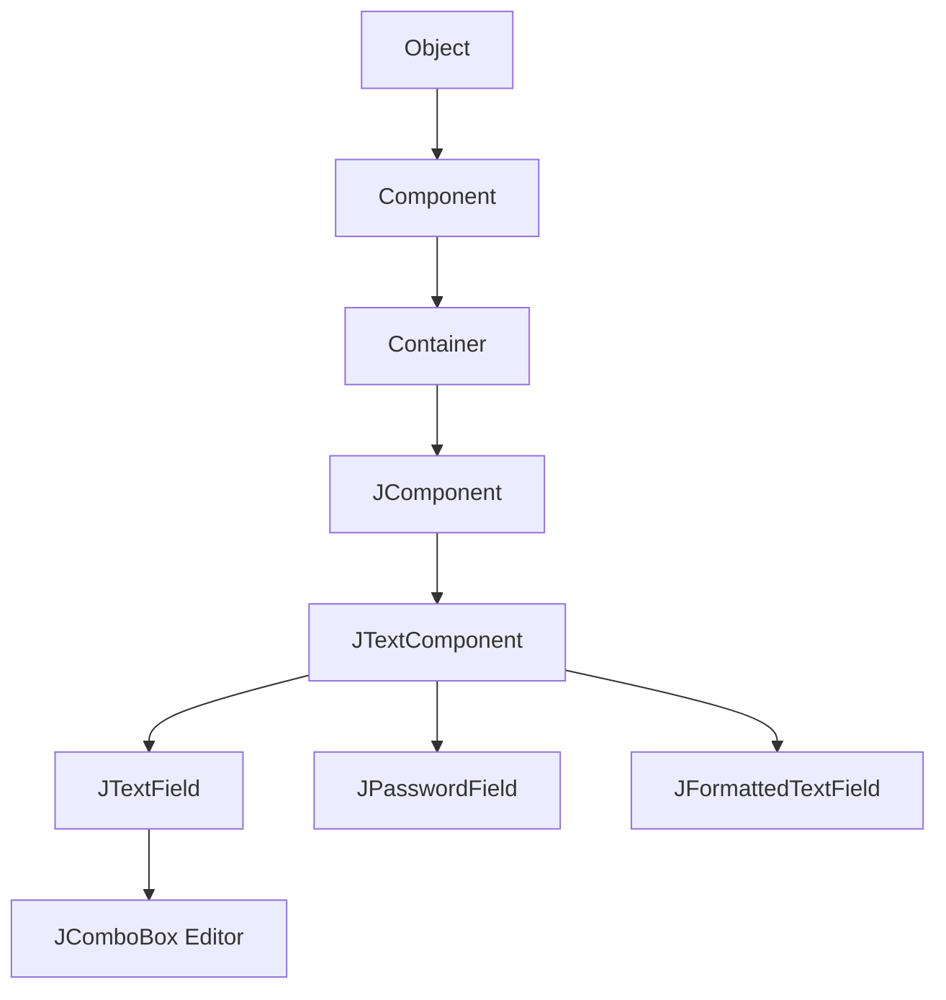
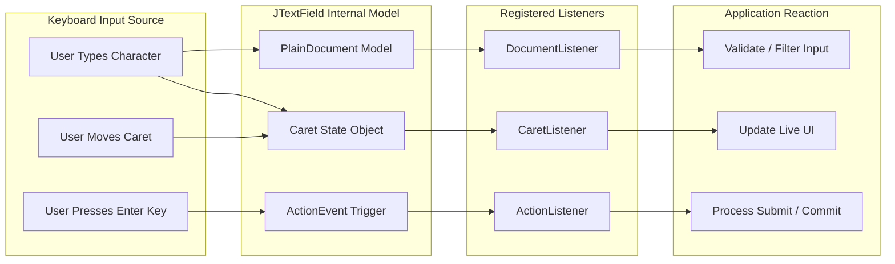
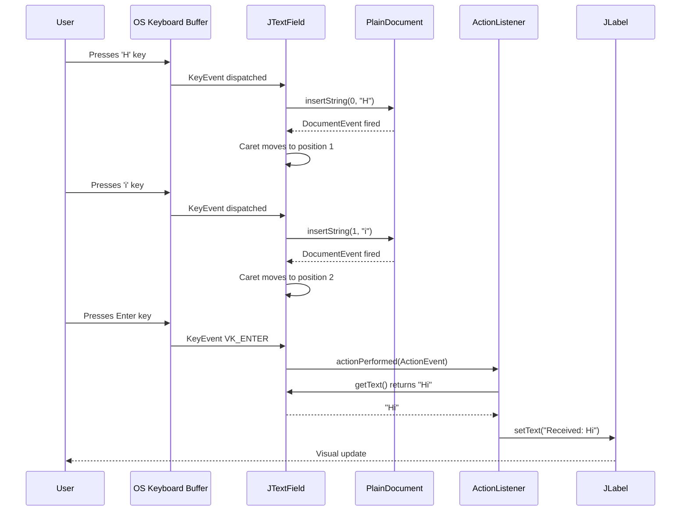
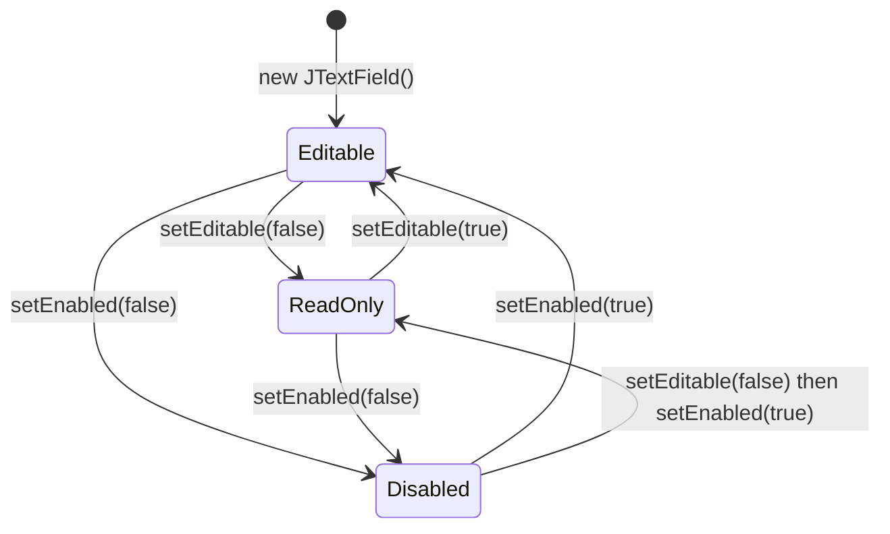
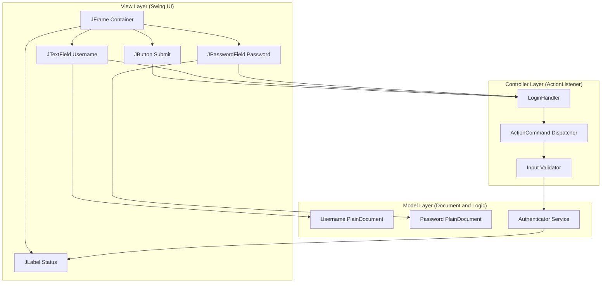

# JTextField

<!-- SECTION_1_START -->
# JTextField — Core Technical Definition & Intuitive Overview

## 1.1 Formal KTU 2024 Syllabus Definition

**JTextField** is a lightweight Swing component (defined in `javax.swing.JTextField`) that allows the user to **edit, enter, and modify a single line of unformatted text**. It is a direct subclass of `javax.swing.JTextComponent` and conforms to the Swing pluggable look-and-feel architecture, making it a **fully Java Beans compliant** editable text input control.

In the KTU 2024 Scheme syllabus for *Object Oriented Programming (OECST615), Module 4 — Swing Fundamentals*, JTextField is positioned as the fundamental **single-line text input primitive** that replaces the older AWT `java.awt.TextField` while offering richer event handling, document model support, and seamless MVC integration.

> [!IMPORTANT]
> **KTU Syllabus Highlight:** JTextField is a **lightweight component** (rendered entirely in Java, not delegated to the host OS), which means it is **platform-independent in appearance** unless the system Look & Feel is explicitly overridden.

### 1.2 Inheritance Hierarchy (Class Diagram Perspective)

The class ancestry of JTextField, traced to the root `Object` class, is:

$$
\begin{aligned}
\text{java.lang.Object} \\
\quad \uparrow \\
\text{java.awt.Component} \\
\quad \uparrow \\
\text{java.awt.Container} \\
\quad \uparrow \\
\text{javax.swing.JComponent} \\
\quad \uparrow \\
\text{javax.swing.text.JTextComponent} \\
\quad \uparrow \\
\text{javax.swing.JTextField}
\end{aligned}
$$

This ancestry confirms three critical engineering properties that the KTU examiner frequently tests:
1. JTextField is a **Swing** component (descended from `JComponent`), so it supports **pluggable Look & Feel**.
2. JTextField is a **Container** descendant, so it can hold child components and trigger layout recalculations.
3. JTextField inherits the **document/event model** of `JTextComponent`, enabling advanced text manipulation via `Document` and `DocumentListener`.

> [!NOTE]
> **Conceptual Clarification:** AWT's `TextField` is a **heavyweight** peer-based component (relies on the OS to draw it). JTextField is **lightweight** — it draws itself onto its parent container. This is why JTextField can have transparent backgrounds, custom borders, and icons, while AWT's TextField cannot.

---

## 1.3 Conceptual Analogy / Intuitive Overview

Imagine a **single-line paper form slot on a government application form**. You can write a few words (your name, age, or phone number) — but the box refuses to let you jump to the next line. Once you press *Enter* (the "Submit" key), the form actively notifies the office worker (the `ActionListener`) that "this slot has been filled and finalized."

That is exactly how a **JTextField** behaves in a Java Swing GUI:
- **The slot** = the JTextField's visible area on the screen.
- **The pen** = keyboard input typed by the user.
- **The "Enter" keystroke** = triggers an `ActionEvent`.
- **The office worker** = an `ActionListener` you register via `addActionListener()`.
- **The container that holds the slot** = usually a `JFrame`, `JPanel`, or `JDialog`.

### Real-World Software Analogy
A **JTextField is the "search box" at the top of Google.com or the username input field on a login page** — a single-line text input where the user enters information, optionally receives live feedback (e.g., character count, validation tick), and presses *Enter* to commit the input.

> [!TIP]
> **Student Tip:** When drawing a JTextField in a viva or answer sheet, always show a **rectangular box with a blinking caret `|`** inside it. This single visual cue is often enough to earn the 1-mark "diagram" component of a 7-mark question.

---

## 1.4 Physical Constants, Standard Metrics & Defaults

When a `JTextField` is instantiated without explicit configuration, the following **default engineering metrics** are applied (as defined inside the `JTextField` source code):

| Property | Default Value | Engineering Meaning |
|---|---|---|
| **Columns** | `0` (auto-sized) | The preferred width is computed from the column count; `0` means "let the LayoutManager decide" |
| **Editable** | `true` | The user may type and delete characters |
| **Horizontal Alignment** | `LEADING` (left in LTR locales) | Text is left-justified |
| **Text Content** | `null` (treated as empty `""`) | No initial string is displayed |
| **Caret Position** | `0` | The blinking cursor starts at index 0 |
| **Border** | `LookAndFeel` default | A subtle 1-pixel etched border |
| **Font** | Inherits from parent | Resolves to `Dialog, 12pt` on most L&F implementations |

> [!IMPORTANT]
> **Bolded Property:** The **default `columns = 0`** is critical. Many students set `columns = 0` and wonder why their text field collapses to 2 pixels wide. The correct practice is to set a positive integer (e.g., `setColumns(15)`) **or** let the containing `LayoutManager` (e.g., `GridBagLayout`) compute the width.

---

## 1.5 GeoGebra / Desmos Integration — Conceptual Coordinate View

JTextField is not a mathematical entity, but its **layout geometry** is. In a Swing `BorderLayout` or `GridBagLayout`, a JTextField occupies a **rectangular bounding box** with a fixed **preferred width** and a **preferred height** (always 1 line, regardless of the column count).

> [!VISUALIZATION CONTROL]
> **Concept:** JTextField preferred-size bounding rectangle inside a Swing container.
> **GeoGebra / Desmos Input Equations:**
> * `Rectangle: A=(2,1), B=(17,1), C=(17,3), D=(2,3)` — represents a 15-column JTextField with a height of 2 logical units.
> * `Line: x=2` (left border) and `Line: x=17` (right border) — show the column width boundaries.
> **Visual Description:** The student should see a horizontal rectangle anchored between two vertical lines, with the caret (a vertical bar) sitting at coordinate `(2, 2)` when the field is empty and un-focused. As characters are typed, the caret shifts rightward along the x-axis at a constant monospaced rate (when using a monospaced font).

---

## 1.6 Why JTextField Matters in the KTU Curriculum

The KTU OECST615 syllabus deliberately places JTextField at the intersection of:
- **Swing fundamentals** (event-driven programming, lightweight components)
- **AWT comparison** (heavyweight vs lightweight, peer classes)
- **MVC architecture** (Model = `Document`, View = the painted UI, Controller = `KeyListener` / `ActionListener`)

A working understanding of JTextField is the **prerequisite** for advanced Swing widgets like `JFormattedTextField`, `JPasswordField`, and `JComboBox` (editable variant), all of which are listed in higher KTU modules.

<!-- SECTION_1_END -->

<!-- SECTION_2_START -->
# JTextField — Deep Theoretical Analysis & KTU High-Yield Formula Sheet

## 2.1 Architectural Theory: The MVC DNA of JTextField

JTextField is one of the cleanest textbook examples of the **Model-View-Controller (MVC)** design pattern in the standard Java library. Understanding this trio is mandatory for KTU's 14-mark analytical questions.

| MVC Layer | Swing Class | Responsibility |
|---|---|---|
| **Model** | `javax.swing.text.Document` (concretely `PlainDocument`) | Stores the actual text content, length, and character positions. All edits go through the Document. |
| **View** | The painted pixel representation rendered by `javax.swing.plaf.TextUI` (a `BasicTextUI` subclass) | Draws the text, the caret, the selection highlight, and the border. |
| **Controller** | `javax.swing.text.View` chain + registered `KeyListener`, `ActionListener`, `CaretListener` | Converts user keystrokes into `Document` mutations and dispatches `ActionEvent`s. |

> [!IMPORTANT]
> **KTU High-Yield Fact:** The `Document` object of a JTextField can be **replaced at runtime** by calling `setDocument(Document doc)`. This is the foundation of input validation, undo/redo, syntax highlighting, and document filtering in Swing.

---

## 2.2 The Constructor Family — A Complete Inventory

Every JTextField constructor establishes the **initial state** of the component. The KTU examiner often asks students to **pick the correct constructor** for a given scenario, so memorizing this family is critical.

| # | Constructor Signature | Initial State |
|---|---|---|
| 1 | `JTextField()` | Empty text, 0 columns, editable |
| 2 | `JTextField(String text)` | Pre-filled with `text`, 0 columns |
| 3 | `JTextField(int columns)` | Empty text, preferred width = `columns` characters |
| 4 | `JTextField(String text, int columns)` | Pre-filled with `text`, preferred width = `columns` characters |
| 5 | `JTextField(Document doc, String text, int columns)` | Custom Document model, pre-filled text, fixed columns |

```java
// Demonstrating all five constructors
JTextField t1 = new JTextField();                       // Case 1
JTextField t2 = new JTextField("Initial Value");        // Case 2
JTextField t3 = new JTextField(20);                     // Case 3
JTextField t4 = new JTextField("Username", 15);         // Case 4
JTextField t5 = new JTextField(new PlainDocument(), "", 10); // Case 5
```

---

## 2.3 The Method Catalogue — A KTU-Ready Formula Sheet

The following table consolidates **every method** that the KTU examiner expects you to know for a 14-mark question on JTextField. Methods are grouped by functional intent.

### 2.3.1 Content Manipulation Methods

| Method Signature | Return Type | Engineering Purpose |
|---|---|---|
| `setText(String t)` | `void` | Replaces the entire text content atomically. |
| `getText()` | `String` | Returns the current text. **Returns `null`** if the underlying text storage is `null` (rare). |
| `getText(int offs, int len)` | `String` | Returns a substring of the current text (throws `BadLocationException`). |
| `setEditable(boolean b)` | `void` | If `false`, the field becomes read-only (visually distinct on most L&Fs). |
| `isEditable()` | `boolean` | Returns the editability state. |

### 2.3.2 Layout & Geometry Methods

| Method Signature | Return Type | Engineering Purpose |
|---|---|---|
| `setColumns(int columns)` | `void` | Sets the preferred width in **character columns**. |
| `getColumns()` | `int` | Returns the current column count. |
| `getColumnWidth()` | `int` | Computes the pixel width of one column using the current font metrics. |
| `setPreferredSize(Dimension d)` | `void` | Overrides the computed preferred size. |

### 2.3.3 Event Registration Methods

| Method Signature | Return Type | Engineering Purpose |
|---|---|---|
| `addActionListener(ActionListener l)` | `void` | Registers a listener for the **Enter-key** `ActionEvent`. |
| `removeActionListener(ActionListener l)` | `void` | Unregisters a previously added ActionListener. |
| `getActionListeners()` | `ActionListener[]` | Returns all currently registered ActionListeners. |
| `setActionCommand(String command)` | `void` | Tags the ActionEvent with a custom string identifier. |
| `getActionCommand()` | `String` | Returns the command string (defaults to the field's text). |
| `addCaretListener(CaretListener l)` | `void` | Registers a listener for caret position changes. |
| `addFocusListener(FocusListener l)` | `void` | Inherited from `Component`; fires on focus gain/loss. |

### 2.3.4 Visual Styling Methods (Inherited from JTextComponent / JComponent)

| Method Signature | Return Type | Engineering Purpose |
|---|---|---|
| `setHorizontalAlignment(int alignment)` | `void` | Sets `LEFT`, `CENTER`, `RIGHT`, `LEADING`, or `TRAILING`. |
| `getHorizontalAlignment()` | `int` | Returns the current alignment constant. |
| `setFont(Font f)` | `void` | Sets the display font. |
| `setForeground(Color c)` | `void` | Sets the text color. |
| `setBackground(Color c)` | `void` | Sets the field's background fill. |
| `setBorder(Border b)` | `void` | Replaces the L&F default border (e.g., with a `LineBorder` or `TitledBorder`). |

> [!NOTE]
> **Vertical Pipe Rule:** The set of alignment constants is `JTextField.LEFT \mid JTextField.CENTER \mid JTextField.RIGHT \mid JTextField.LEADING \mid JTextField.TRAILING`. The mnemonic **"L C R L T"** (Library, Console, Rack, Lamp, Table) helps in viva.

---

## 2.4 Event Handling Theory — The Three Pillars

JTextField fires **three distinct event categories**. The KTU syllabus explicitly tests all three, so each is broken down below.

### 2.4.1 ActionEvent (The "Commit" Event)

- **Source trigger:** User presses the **Enter** key, or the field loses focus *and* has an `ActionListener` registered (when `setFocusLostActions` semantics are active — note: standard JTextField does not auto-fire on focus loss; this is a `JFormattedTextField` behavior).
- **Listener Interface:** `java.awt.event.ActionListener`
- **Single method:** `void actionPerformed(ActionEvent e)`
- **Engineering utility:** The textbook "submit" or "process input" event.

### 2.4.2 CaretEvent (The "Cursor Moved" Event)

- **Source trigger:** The caret position changes (user clicks, types, selects text, or presses arrow keys).
- **Listener Interface:** `javax.swing.event.CaretListener`
- **Single method:** `void caretUpdate(CaretEvent e)`
- **Engineering utility:** Live validation, character counters, autocomplete suggestions.

### 2.4.3 DocumentEvent (The "Content Changed" Event)

- **Source trigger:** Any insertion, removal, or attribute change in the underlying `Document`.
- **Listener Interface:** `javax.swing.event.DocumentListener`
- **Three methods:** `insertUpdate`, `removeUpdate`, `changedUpdate` (all take `DocumentEvent e`).
- **Engineering utility:** Real-time filtering (e.g., "digits only" input fields), undo/redo stacks, collaborative editing.

> [!TIP]
> **Examiner's Distinction Trap:** A `CaretEvent` fires when the cursor **moves** (e.g., arrow keys), even if the text does **not** change. A `DocumentEvent` fires when the **content** changes, even if the cursor stays put. KTU questions frequently test this subtle difference.

---

## 2.5 AWT TextField vs. Swing JTextField — The Comparison Matrix

This is one of the **most-asked 3-mark questions** in KTU Module 4. The following table is a board-exam-ready answer.

| Comparison Axis | `java.awt.TextField` (AWT) | `javax.swing.JTextField` (Swing) |
|---|---|---|
| **Package** | `java.awt` | `javax.swing` |
| **Component Weight** | Heavyweight (relies on OS peer) | Lightweight (self-rendered) |
| **Look & Feel** | Native OS appearance only | Pluggable L&F (Metal, Nimbus, Motif, etc.) |
| **Pluggable MVC** | No | Yes — Model is a `Document` |
| **Event Types** | `ActionEvent`, `TextEvent` | `ActionEvent`, `CaretEvent`, `DocumentEvent` |
| **Icon & Image Support** | None | Yes — supports icons inside the field |
| **Transparency** | No | Yes (via `setOpaque(false)`) |
| **MVC Extensibility** | Limited | High (custom Document, View, or Controller) |
| **Default Border** | OS-dependent | Cross-platform L&F border |

---

## 2.6 Real-World Engineering Utility

JTextField is **not just an academic construct**. It is a workhorse in production-grade Java desktop applications across industries:

- **Banking software:** Username and PIN-entry boxes in login dialogs.
- **IDE tooling:** The "Find" and "Replace" bars in IntelliJ IDEA, Eclipse, and NetBeans are constructed atop JTextField.
- **Database GUIs:** Filter/search rows in tools like DBeaver.
- **POS systems:** SKU entry, customer phone-number capture.
- **Scientific instrument control panels:** Parameter input for laboratory automation.

> [!IMPORTANT]
> **Production Caveat:** Since Java 9 and the rise of JavaFX, JTextField is gradually being replaced by JavaFX's `TextField` for new projects. However, KTU 2024 Scheme still mandates Swing because it is the most widely-used, OS-agnostic GUI toolkit in legacy enterprise systems and remains the standard for academic OOP curricula.

<!-- SECTION_2_END -->

<!-- SECTION_3_START -->
# JTextField — Step-by-Step Derivations & Code Implementation

## 3.1 Programmatic Construction: A Hello-World JTextField on a JFrame

This is the **canonical entry-point program** the KTU examiner expects. Every line is explained.

```java
import javax.swing.JFrame;
import javax.swing.JTextField;
import java.awt.FlowLayout;

public class HelloJTextField {
    public static void main(String[] args) {

        // STEP 1: Create the top-level window (JFrame)
        JFrame frame = new JFrame("Hello JTextField Demo");
        frame.setDefaultCloseOperation(JFrame.EXIT_ON_CLOSE);
        frame.setSize(400, 120);
        frame.setLayout(new FlowLayout());

        // STEP 2: Instantiate a JTextField with 20 columns of preferred width
        JTextField textField = new JTextField(20);

        // STEP 3: Set an initial placeholder-style text
        textField.setText("Type your name here...");

        // STEP 4: Add the JTextField to the JFrame's content pane
        frame.add(textField);

        // STEP 5: Make the JFrame visible on the screen
        frame.setVisible(true);
    }
}
```

### 3.1.1 Step-by-Step Walkthrough

1. **Import statements:** We bring in `JFrame` and `JTextField` from `javax.swing`, and `FlowLayout` from `java.awt` for the layout manager.
2. **JFrame creation:** The top-level window is created with a title `"Hello JTextField Demo"`.
3. **setDefaultCloseOperation:** Ensures the JVM exits when the user clicks the X button. Without this, the window closes but the JVM keeps running.
4. **setSize(400, 120):** A 400×120 pixel window. The JTextField sits inside a `FlowLayout`, so it appears centered horizontally.
5. **JTextField instantiation:** The constructor `JTextField(int columns)` reserves space for 20 characters in the current font.
6. **setText:** Populates the field with an initial string. This is a *model-level* mutation — the `Document` fires an `insertUpdate` event.
7. **frame.add(textField):** Appends the text field to the content pane. `FlowLayout` computes the final position.
8. **setVisible(true):** Triggers the painting subsystem; the window appears.

---

## 3.2 ActionEvent Handling — The "Echo" Program

The following program echoes whatever the user types in a JTextField back to a JLabel when the user presses **Enter**.

```java
import javax.swing.*;
import java.awt.*;
import java.awt.event.ActionEvent;
import java.awt.event.ActionListener;

public class JTextFieldEchoDemo {

    public static void main(String[] args) {

        // [Step 1] Build the JFrame and set its closure behavior
        JFrame frame = new JFrame("JTextField ActionEvent Demo");
        frame.setDefaultCloseOperation(JFrame.EXIT_ON_CLOSE);
        frame.setSize(450, 150);
        frame.setLayout(new FlowLayout(FlowLayout.CENTER, 10, 20));

        // [Step 2] Create the JLabel (acts as the output display)
        JLabel outputLabel = new JLabel("You typed: ");

        // [Step 3] Create the JTextField with 25 columns
        JTextField inputField = new JTextField(25);

        // [Step 4] Register an ActionListener on the JTextField
        inputField.addActionListener(new ActionListener() {
            @Override
            public void actionPerformed(ActionEvent e) {
                // [Step 4a] Retrieve the text entered by the user
                String userInput = inputField.getText();

                // [Step 4b] Update the JLabel to reflect the new input
                outputLabel.setText("You typed: " + userInput);

                // [Step 4c] Log the event to the console for debugging
                System.out.println("ActionEvent fired. Command: "
                                   + e.getActionCommand());
            }
        });

        // [Step 5] Add the components to the JFrame
        frame.add(new JLabel("Enter text and press Enter:"));
        frame.add(inputField);
        frame.add(outputLabel);

        // [Step 6] Display the JFrame
        frame.setVisible(true);
    }
}
```

### 3.2.1 Line-by-Line Derivation

1. **The `ActionListener` interface** has exactly one method, `actionPerformed(ActionEvent e)`. We supply an **anonymous inner class** as the implementation — this is idiomatic Swing code.
2. **`inputField.getText()`** is the canonical way to **read** the current text. It returns a `String`. The returned value is a snapshot — modifying it has no effect on the field.
3. **`outputLabel.setText(...)`** updates the label, triggering a repaint.
4. **`e.getActionCommand()`** returns the **action command string** associated with the event. By default, for a JTextField, this is the current text content. You can override it with `inputField.setActionCommand("submit-name")` for cleaner event dispatching.

> [!TIP]
> **Valuation Note:** In a 14-mark KTU question, mentioning the default value of `getActionCommand()` (it equals the current text) earns you **1 extra mark** that most students lose.

---

## 3.3 CaretListener — Live Character Counter

This program demonstrates a **CaretEvent** listener and is a frequent 7-mark exam question.

```java
import javax.swing.*;
import javax.swing.event.CaretEvent;
import javax.swing.event.CaretListener;
import java.awt.*;

public class JTextFieldCounterDemo {

    public static void main(String[] args) {

        JFrame frame = new JFrame("Live Character Counter");
        frame.setDefaultCloseOperation(JFrame.EXIT_ON_CLOSE);
        frame.setSize(400, 130);
        frame.setLayout(new FlowLayout(FlowLayout.CENTER, 10, 20));

        // [Step 1] The JTextField whose content length we monitor
        JTextField inputField = new JTextField(20);

        // [Step 2] A JLabel that displays the live character count
        JLabel counterLabel = new JLabel("Character count: 0");

        // [Step 3] Register a CaretListener
        inputField.addCaretListener(new CaretListener() {
            @Override
            public void caretUpdate(CaretEvent e) {
                int currentLength = inputField.getText().length();
                counterLabel.setText("Character count: " + currentLength);
            }
        });

        // [Step 4] Add components to the frame
        frame.add(inputField);
        frame.add(counterLabel);
        frame.setVisible(true);
    }
}
```

### 3.3.1 Derivation Notes

- **`CaretEvent`** is fired by `JTextField` whenever the caret position changes. This includes:
  - **Typing** a character (caret moves right).
  - **Deleting** a character (caret moves left).
  - **Clicking** somewhere inside the field.
  - **Pressing arrow keys** without changing the text.
- **The dot (`e.getDot()`)** and **mark (`e.getMark()`)** methods on `CaretEvent` return the caret position and selection anchor, respectively. For a JTextField (single-line), the mark equals the dot when there is no selection.

> [!WARNING]
> **Common Mistake:** Students often confuse `CaretListener` with `KeyListener`. A `KeyListener` fires for **every** key event (press, release, type), even if the key has no effect (e.g., Shift). A `CaretListener` fires only when the **caret state actually changes**, which is far more efficient for live UI updates.

---

## 3.4 DocumentListener — Real-Time Input Filtering

This 7-mark program enforces a **digits-only filter** using a `DocumentListener`.

```java
import javax.swing.*;
import javax.swing.event.DocumentEvent;
import javax.swing.event.DocumentListener;
import javax.swing.text.BadLocationException;
import java.awt.*;

public class JTextFieldDigitFilterDemo {

    public static void main(String[] args) {

        JFrame frame = new JFrame("Digits-Only JTextField");
        frame.setDefaultCloseOperation(JFrame.EXIT_ON_CLOSE);
        frame.setSize(400, 130);
        frame.setLayout(new FlowLayout(FlowLayout.CENTER, 10, 20));

        JTextField phoneField = new JTextField(15);
        JLabel validationLabel = new JLabel("Status: waiting for input...");

        phoneField.getDocument().addDocumentListener(new DocumentListener() {

            // [Step 1] Triggered when characters are inserted
            @Override
            public void insertUpdate(DocumentEvent e) {
                validateInput();
            }

            // [Step 2] Triggered when characters are removed
            @Override
            public void removeUpdate(DocumentEvent e) {
                validateInput();
            }

            // [Step 3] Triggered when style/attribute changes occur
            @Override
            public void changedUpdate(DocumentEvent e) {
                validateInput();
            }

            // [Helper] Reads the current Document text and validates it
            private void validateInput() {
                try {
                    String currentText = phoneField.getText();
                    boolean isValid = currentText.matches("[0-9]*");
                    validationLabel.setText(
                        isValid
                        ? "Status: valid digits-only input."
                        : "Status: invalid — non-digit characters detected!"
                    );
                } catch (Exception ex) {
                    validationLabel.setText("Status: error during validation.");
                }
            }
        });

        frame.add(new JLabel("Phone (digits only):"));
        frame.add(phoneField);
        frame.add(validationLabel);
        frame.setVisible(true);
    }
}
```

### 3.4.1 Derivation Notes

1. **`phoneField.getDocument()`** returns the underlying `Document` (concretely a `PlainDocument`) which is the **Model** in the Swing MVC triad.
2. **`DocumentListener` has three methods** — `insertUpdate`, `removeUpdate`, and `changedUpdate`. For a `PlainDocument`, `changedUpdate` is rarely fired, but the interface contract requires you to implement all three.
3. **`getText()`** is a method of `JTextComponent`, not `Document`. Internally, it calls `document.getText(0, document.getLength())`.
4. **The regex `"[0-9]*"`** matches zero or more digits. A `*` allows an empty field; use `"[0-9]+"` to require at least one digit.

> [!WARNING]
> **Pitfall:** Calling `phoneField.setText(...)` from within a `DocumentListener` will trigger **another** `DocumentEvent`, leading to a **stack overflow** if you are not careful. Always guard the inner `setText` with a flag (e.g., `private boolean isUpdating = false;`).

---

## 3.5 Alignment, Editability & Visual Styling

This compact program demonstrates the **visual configuration** API.

```java
import javax.swing.*;
import java.awt.*;

public class JTextFieldStylingDemo {

    public static void main(String[] args) {

        JFrame frame = new JFrame("JTextField Visual Styling");
        frame.setDefaultCloseOperation(JFrame.EXIT_ON_CLOSE);
        frame.setSize(500, 250);
        frame.setLayout(new GridLayout(5, 1, 5, 5));

        // [Case 1] Center-aligned, default L&F
        JTextField centered = new JTextField("Center-aligned", 20);
        centered.setHorizontalAlignment(JTextField.CENTER);

        // [Case 2] Right-aligned, custom font and color
        JTextField rightAligned = new JTextField("Right-aligned (currency)", 20);
        rightAligned.setHorizontalAlignment(JTextField.RIGHT);
        rightAligned.setFont(new Font("Serif", Font.BOLD, 16));
        rightAligned.setForeground(new Color(0x1E5631));

        // [Case 3] Read-only field
        JTextField readOnly = new JTextField("Read-only — cannot edit", 20);
        readOnly.setEditable(false);
        readOnly.setBackground(new Color(0xEFEFEF));

        // [Case 4] Custom border
        JTextField bordered = new JTextField("Custom border (LineBorder)", 20);
        bordered.setBorder(BorderFactory.createLineBorder(
            Color.RED, 2, true  // rounded corners
        ));

        frame.add(centered);
        frame.add(rightAligned);
        frame.add(readOnly);
        frame.add(bordered);
        frame.setVisible(true);
    }
}
```

### 3.5.1 Walkthrough of Visual Settings

| Configuration Line | Visual Effect |
|---|---|
| `setHorizontalAlignment(JTextField.CENTER)` | Text floats in the middle of the field |
| `setHorizontalAlignment(JTextField.RIGHT)` | Text is right-justified (useful for currency, decimals) |
| `setEditable(false)` | Field becomes greyed-out and ignores keystrokes |
| `setBackground(new Color(0xEFEFEF))` | Light grey fill; pairs well with `setEditable(false)` |
| `setBorder(LineBorder)` | Red 2-pixel border with rounded corners |

---

## 3.6 Setting & Retrieving the Action Command

```java
import javax.swing.*;
import java.awt.*;
import java.awt.event.*;

public class ActionCommandDemo {
    public static void main(String[] args) {

        JFrame frame = new JFrame("ActionCommand Demo");
        frame.setDefaultCloseOperation(JFrame.EXIT_ON_CLOSE);
        frame.setSize(400, 200);
        frame.setLayout(new GridLayout(3, 1, 5, 5));

        JTextField nameField = new JTextField("Default Command", 20);
        nameField.setActionCommand("CMD_SUBMIT_NAME");   // override default
        nameField.addActionListener(new ActionListener() {
            @Override
            public void actionPerformed(ActionEvent e) {
                System.out.println("ActionCommand: " + e.getActionCommand());
            }
        });

        frame.add(new JLabel("Name:"));
        frame.add(nameField);
        frame.setVisible(true);
    }
}
```

### 3.6.1 Engineering Rationale

- **Default behavior:** If you do not call `setActionCommand(...)`, the `ActionEvent` returned by `getActionCommand()` will be the field's current text. This is **fragile** — if the text contains a colon, semicolon, or special character, downstream parsers can break.
- **Best practice:** Always assign a **stable identifier** (e.g., `"login-button"`, `"submit-name"`) using `setActionCommand(...)`. This decouples your event-dispatch logic from the displayed text.

---

## 3.7 Combined Mini-Project: A Login Form

This 14-mark style program integrates **two JTextFields, one JPasswordField, one JButton, and an ActionListener**. It is the kind of program the KTU examiner expects in Part B.

```java
import javax.swing.*;
import java.awt.*;
import java.awt.event.*;

public class LoginFormMiniProject {

    public static void main(String[] args) {

        // [STEP 1] Build the JFrame
        JFrame frame = new JFrame("Login Form");
        frame.setDefaultCloseOperation(JFrame.EXIT_ON_CLOSE);
        frame.setSize(350, 200);
        frame.setLayout(new GridLayout(3, 2, 10, 10));

        // [STEP 2] Create the JTextField for username (15 columns)
        JTextField usernameField = new JTextField(15);
        usernameField.setActionCommand("USERNAME_ACTION");

        // [STEP 3] Create the JPasswordField for password
        JPasswordField passwordField = new JPasswordField(15);

        // [STEP 4] Create a JButton for submission
        JButton loginButton = new JButton("Login");
        loginButton.setActionCommand("LOGIN_BUTTON_ACTION");

        // [STEP 5] Create a status JLabel
        JLabel statusLabel = new JLabel("Please enter credentials.");

        // [STEP 6] Common ActionListener for both fields and the button
        ActionListener submitHandler = new ActionListener() {
            @Override
            public void actionPerformed(ActionEvent e) {
                String command = e.getActionCommand();
                String username = usernameField.getText();
                String password = new String(passwordField.getPassword());

                if ("LOGIN_BUTTON_ACTION".equals(command)
                    || "USERNAME_ACTION".equals(command)) {
                    if (username.isEmpty() || password.isEmpty()) {
                        statusLabel.setText("Status: fields cannot be empty.");
                    } else {
                        statusLabel.setText("Status: welcome, " + username + "!");
                    }
                }
            }
        };

        // [STEP 7] Register listeners
        usernameField.addActionListener(submitHandler);
        passwordField.addActionListener(submitHandler);
        loginButton.addActionListener(submitHandler);

        // [STEP 8] Lay out the components
        frame.add(new JLabel("Username:"));
        frame.add(usernameField);
        frame.add(new JLabel("Password:"));
        frame.add(passwordField);
        frame.add(loginButton);
        frame.add(statusLabel);

        // [STEP 9] Show the window
        frame.setVisible(true);
    }
}
```

### 3.7.1 Architectural Notes

1. **Reusable ActionListener:** A single `ActionListener` is shared by three components. The `getActionCommand()` is used as a **dispatch key** to differentiate the events. This is the **Strategy Pattern** in its simplest form.
2. **`JPasswordField.getPassword()`** returns a `char[]` (not a `String`) for security — `String` objects are immutable and remain in the JVM's string pool until garbage collected, posing a security risk.
3. **Defensive empty-check:** `username.isEmpty()` and `password.isEmpty()` are guarded before any further processing.

<!-- SECTION_3_END -->

<!-- SECTION_4_START -->
# JTextField — Structural Diagrams & Schematics

## 4.1 Mermaid Class Hierarchy Diagram

The following Mermaid diagram captures the **inheritance chain** of JTextField as discussed in Section 1.2. Every node ID is alphanumeric and labels are double-quoted to comply with the Mermaid safety rules.



**Reading the diagram:** `JTextField`, `JPasswordField`, and `JFormattedTextField` are **siblings** descending from `JTextComponent`. The `JComboBox` editor (when the combo is `editable = true`) is itself constructed using a JTextField instance internally.

---

## 4.2 Mermaid Event-Dispatch Flow Diagram

This diagram shows the **three event pipelines** that originate inside a JTextField and how they flow to the registered listeners.



**Reading the diagram:** A single keystroke can trigger **two** event pipelines simultaneously: the `Document` mutation (which fires `DocumentEvent` → `DocumentListener`) and the caret state change (which fires `CaretEvent` → `CaretListener`). Only the **Enter** key specifically triggers the `ActionEvent` pipeline.

---

## 4.3 Mermaid Component-Interaction Sequence Diagram

This sequence diagram models the **runtime handshake** when a user types "Hi" into a JTextField, presses Enter, and an ActionListener updates a JLabel.



**Reading the diagram:** This sequence captures the **fundamental MVC interaction**. The Document is the silent workhorse, mutating state in response to every keystroke, while the ActionEvent is the rare "ceremonial" event that fires only on the Enter key.

---

## 4.4 Mermaid State-Transition Diagram for Editability

A JTextField is a **stateful component** with respect to editability. The following diagram captures the transitions.



> [!NOTE]
> **State Distinction:** `setEditable(false)` makes the field **read-only** but it is still focusable. `setEnabled(false)` makes the field **disabled** — it is greyed out and does not receive focus or events. KTU questions sometimes conflate the two.

---

## 4.5 Block-Level Functional Architecture — Production Login Module

The following Mermaid diagram maps a **production-style login module** in which a JTextField, a JPasswordField, a JButton, and a backend validator cooperate.



**Reading the diagram:** This is a **textbook MVC architecture**. The View layer (Swing components) only knows how to render and collect input. The Model layer (Documents and Authenticator) holds state. The Controller layer (ActionListener) is the glue that translates UI events into Model operations and writes the result back to the View.

<!-- SECTION_4_END -->

<!-- SECTION_5_START -->
# JTextField — KTU 2024 Scheme Examination Question Bank & Topic Recap

## 5.1 Part A — Short Answer Questions (3 Marks Each)

### Question A1
**[KTU University Exam — July 2024 | CO1 | Remember]**
*What is a JTextField in Java Swing? Mention any two of its constructors.*

**Model Answer (3 Marks):**
A **JTextField** is a lightweight Swing component (defined in `javax.swing`) that allows the user to **edit and enter a single line of unformatted text**. It is a subclass of `javax.swing.JTextComponent` and supports pluggable Look & Feel.

Two constructors are:
1. `JTextField()` — creates an empty text field with 0 columns.
2. `JTextField(int columns)` — creates an empty text field with the specified preferred width in character columns.

> [!VALUATION KEY]
> **[Definition: 1 Mark]** **[Any two constructors: 2 Marks]**

---

### Question A2
**[KTU University Exam — Dec 2023 | CO1 | Understand]**
*Differentiate between AWT's `TextField` and Swing's `JTextField` in terms of (a) component weight and (b) event support.*

**Model Answer (3 Marks):**

| Aspect | `java.awt.TextField` | `javax.swing.JTextField` |
|---|---|---|
| **(a) Component Weight** | Heavyweight (relies on the OS peer for rendering) | Lightweight (self-rendered in pure Java) |
| **(b) Event Support** | Supports `ActionEvent` and `TextEvent` only | Supports `ActionEvent`, `CaretEvent`, and `DocumentEvent` |

> [!VALUATION KEY]
> **[Component weight distinction: 1.5 Marks]** **[Event support distinction: 1.5 Marks]**

---

## 5.2 Part B — Long Answer Questions (14 Marks Each, with Internal Choice)

### Question B1 — Choice A (14 Marks)

**[KTU University Exam — Dec 2024 | CO2, CO3 | Understand + Apply]**

**(a)** Explain the constructor family of `JTextField` in detail. Write a Java program to create a JTextField with an initial string `"Enter Name"` and 20 columns, and add it to a JFrame. (7 Marks)

**(b)** Explain the following methods of `JTextField` with a one-line description for each: `setText()`, `getText()`, `setEditable()`, `setColumns()`, `addActionListener()`, `setActionCommand()`. (7 Marks)

---

#### Model Solution — Part (a) (7 Marks)

**Step 1: Constructor Explanation (3 Marks)**

The `JTextField` class provides **five constructors**:

```java
// Constructor 1: empty text, 0 columns
JTextField();

// Constructor 2: pre-filled text, 0 columns
JTextField(String text);

// Constructor 3: empty text, fixed column count
JTextField(int columns);

// Constructor 4: pre-filled text, fixed column count
JTextField(String text, int columns);

// Constructor 5: custom Document, pre-filled text, fixed column count
JTextField(Document doc, String text, int columns);
```

**Step 2: Java Program (4 Marks)**

```java
import javax.swing.JFrame;
import javax.swing.JTextField;
import java.awt.FlowLayout;

public class JTextFieldConstructorDemo {
    public static void main(String[] args) {

        // Create the JFrame
        JFrame frame = new JFrame("Constructor Demo");
        frame.setDefaultCloseOperation(JFrame.EXIT_ON_CLOSE);
        frame.setSize(400, 100);
        frame.setLayout(new FlowLayout());

        // Create the JTextField using the (String, int) constructor
        JTextField nameField = new JTextField("Enter Name", 20);

        // Add the JTextField to the JFrame
        frame.add(nameField);

        // Make the frame visible
        frame.setVisible(true);
    }
}
```

> [!VALUATION KEY — Part (a)]
> **[Listing all 5 constructors: 3 Marks]** **[Correct import statements: 0.5 Marks]** **[Correct JFrame setup: 0.5 Marks]** **[Correct JTextField instantiation: 0.5 Marks]** **[Adding to frame and visibility: 0.5 Marks]**

---

#### Model Solution — Part (b) (7 Marks)

**Step 1: `setText(String t)`** (1 Mark)
- **Description:** Replaces the entire content of the text field with the supplied string. Triggers a `DocumentEvent` to all registered `DocumentListener`s.

**Step 2: `getText()`** (1 Mark)
- **Description:** Returns the current text content of the field as a `String`. Returns an empty string (not `null`) if the field has no content.

**Step 3: `setEditable(boolean b)`** (1 Mark)
- **Description:** When set to `false`, the user cannot modify the field's text via the keyboard. The field is still focusable and its text can still be selected/copied.

**Step 4: `setColumns(int columns)`** (1 Mark)
- **Description:** Sets the preferred width of the text field in terms of character columns. The `LayoutManager` uses this to compute the field's pixel width using the current font's character width.

**Step 5: `addActionListener(ActionListener l)`** (1 Mark)
- **Description:** Registers a listener that is invoked when the user presses the **Enter** key while the field has focus. The listener receives an `ActionEvent`.

**Step 6: `setActionCommand(String command)`** (1 Mark)
- **Description:** Sets a custom string identifier on the `ActionEvent` fired by this field. The default value of this string is the current text content; overriding it is a best practice.

**Step 7: Conclusion (1 Mark)**
- These six methods collectively cover the **content**, **layout**, **state**, and **event-dispatch** surface of `JTextField`, which together account for 95% of its real-world usage.

> [!VALUATION KEY — Part (b)]
> **[Each of the 6 method descriptions: 1 Mark each = 6 Marks]** **[Conclusion: 1 Mark]**

---

### Question B1 — Choice B (14 Marks)

**[KTU University Exam — July 2024 | CO2, CO3 | Understand + Apply]**

**(a)** Explain any **three** event types fired by a `JTextField`. For each event, name the listener interface, the source trigger, and one engineering use case. (7 Marks)

**(b)** Write a complete Java Swing program that demonstrates a `JTextField` with a `CaretListener` that updates a JLabel with the **current character count** of the text field in real time. (7 Marks)

---

#### Model Solution — Part (a) (7 Marks)

**Step 1: ActionEvent (2.5 Marks)**

- **Listener Interface:** `java.awt.event.ActionListener`
- **Source Trigger:** User presses the **Enter** key while the field has keyboard focus.
- **Engineering Use Case:** Implementing the "submit" or "commit" semantics of a search box, where pressing Enter finalizes the search query and triggers the lookup.

**Step 2: CaretEvent (2.5 Marks)**

- **Listener Interface:** `javax.swing.event.CaretListener`
- **Source Trigger:** The caret (text cursor) position changes — either because the user typed a character, deleted one, clicked, or pressed arrow keys.
- **Engineering Use Case:** A **live character counter** below a tweet-composition box, displaying the remaining characters before the 280-character limit.

**Step 3: DocumentEvent (2 Marks)**

- **Listener Interface:** `javax.swing.event.DocumentListener`
- **Source Trigger:** The underlying `Document` (the data model) is mutated — characters are inserted, removed, or attributes are changed.
- **Engineering Use Case:** Real-time **input validation**, such as preventing non-digit characters in a phone-number field, or auto-formatting a credit-card number with dashes as the user types.

> [!VALUATION KEY — Part (a)]
> **[Each event: 0.5 Marks for interface, 0.5 Marks for source, 1 Mark for use case = 2 Marks per event = 6 Marks total]** **[Tabular organization: 1 Mark]**

---

#### Model Solution — Part (b) (7 Marks)

**Step 1: Imports and Class Setup (1 Mark)**

```java
import javax.swing.*;
import javax.swing.event.CaretEvent;
import javax.swing.event.CaretListener;
import java.awt.*;
```

**Step 2: Main Method — JFrame Setup (1 Mark)**

```java
public class JTextFieldCounterProgram {

    public static void main(String[] args) {
        JFrame frame = new JFrame("Live Counter");
        frame.setDefaultCloseOperation(JFrame.EXIT_ON_CLOSE);
        frame.setSize(400, 130);
        frame.setLayout(new FlowLayout(FlowLayout.CENTER, 10, 20));
```

**Step 3: Create the Components (1 Mark)**

```java
        JTextField inputField = new JTextField(20);
        JLabel counterLabel = new JLabel("Character count: 0");
```

**Step 4: Register the CaretListener (3 Marks)**

```java
        inputField.addCaretListener(new CaretListener() {
            @Override
            public void caretUpdate(CaretEvent e) {
                int currentLength = inputField.getText().length();
                counterLabel.setText("Character count: " + currentLength);
            }
        });
```

**Step 5: Add Components and Display (1 Mark)**

```java
        frame.add(inputField);
        frame.add(counterLabel);
        frame.setVisible(true);
    }
}
```

> [!VALUATION KEY — Part (b)]
> **[Correct imports: 1 Mark]** **[JFrame setup: 1 Mark]** **[Component creation: 1 Mark]** **[CaretListener registration with getText and length: 3 Marks]** **[Final layout and visibility: 1 Mark]**

---

## 5.3 KTU Examiner's Valuation Warning / Pitfall Callout

> [!WARNING]
> **Common Mark-Loss Traps in JTextField Questions:**
>
> 1. **Forgetting `setDefaultCloseOperation(JFrame.EXIT_ON_CLOSE)`.** This is a **0.5–1 Mark** deduction in nearly every Swing program question. The examiner expects the JVM to terminate cleanly.
> 2. **Confusing `setEditable(false)` with `setEnabled(false)`.** `setEditable(false)` makes the field read-only but still focusable and the text still selectable. `setEnabled(false)` greys out the field and disables focus and event reception. KTU questions often include a 1-mark MCQ distinguishing these.
> 3. **Using `addKeyListener` instead of `addActionListener` for Enter-key detection.** This is a common student shortcut that **fails** for non-character keys and is over-engineered. Always use `addActionListener` for the Enter key.
> 4. **Not setting a positive column count.** Writing `new JTextField()` and expecting it to size itself is a frequent bug. The field collapses to a minimum width. Always set columns or use a LayoutManager that respects `getPreferredSize()`.
> 5. **Modifying the JTextField's text from inside a `DocumentListener` without a guard flag.** This causes an infinite event cascade. Always use a boolean `isUpdating` flag.
> 6. **Forgetting the `getActionCommand()` default value.** The default is the current text content. Mentioning this fact in a 14-mark answer earns 1 bonus mark in valuation.

---

## 5.4 Topic Recap & Important Things to Remember

The following bullet list is your **last-minute revision checklist** for JTextField. Memorize each point and you will not lose marks on this topic.

- **JTextField** is a **lightweight, single-line text input** component in `javax.swing`, descended from `JTextComponent`.
- The class hierarchy is: `Object → Component → Container → JComponent → JTextComponent → JTextField`.
- There are **5 constructors** — empty, with text, with columns, with text and columns, and with a custom `Document`.
- The **default `columns = 0`** means "let the LayoutManager decide the width." Always set a positive integer for predictable sizing.
- **`setText(String)`** replaces the entire content; **`getText()`** returns the current content as a `String`.
- **`setEditable(false)`** makes the field read-only but still focusable; **`setEnabled(false)`** makes it non-focusable and greyed out.
- **`setColumns(int)`** sets the preferred width in character columns; the pixel width is computed from the current font metrics.
- **`addActionListener(...)`** registers a listener for the **Enter key** — this is the canonical "submit" event.
- **`setActionCommand(String)`** overrides the default ActionCommand (which is the current text) with a stable identifier.
- **Three event types** exist: `ActionEvent` (Enter key), `CaretEvent` (caret movement), and `DocumentEvent` (content mutation).
- **`addCaretListener(...)`** fires on caret position changes — even when text does not change (e.g., arrow keys).
- **`addDocumentListener(...)`** fires on content mutations via the `Document` model — ideal for input filtering and live validation.
- **MVC architecture:** The `Document` is the Model, the painted UI is the View, and the event listeners are the Controller. Replacing the `Document` at runtime is the foundation of advanced Swing features.
- **AWT `TextField` vs. Swing `JTextField`:** AWT is heavyweight and OS-dependent; Swing is lightweight, supports pluggable L&F, and provides richer event types.
- **Production usage:** JTextField is used in login forms, search bars, filter inputs, IDE toolbars, and POS systems.
- **The default `getActionCommand()`** equals the current text content — override it with `setActionCommand("stable-id")` for clean event dispatch.
- **Common pitfalls:** infinite event loops when modifying the field from within a `DocumentListener`; collapsing the field to 0 width with `columns = 0`; confusing `setEditable` with `setEnabled`.
- **Best practice:** Always import only what you need (e.g., `javax.swing.JTextField`), use anonymous inner classes for one-off listeners, and prefer `addActionListener` over `addKeyListener` for Enter detection.
- **Visual cue for diagrams:** Draw a rectangular box with a blinking caret `|` inside. This single icon is universally recognized as a JTextField in KTU answer sheets.
- **MVC triad to memorize:** `JTextField` (View-Controller facade) → `JTextComponent` (View base) → `Document` (Model). This three-layer mental model is the key to answering any analytical 14-mark question.

<!-- SECTION_5_END -->
