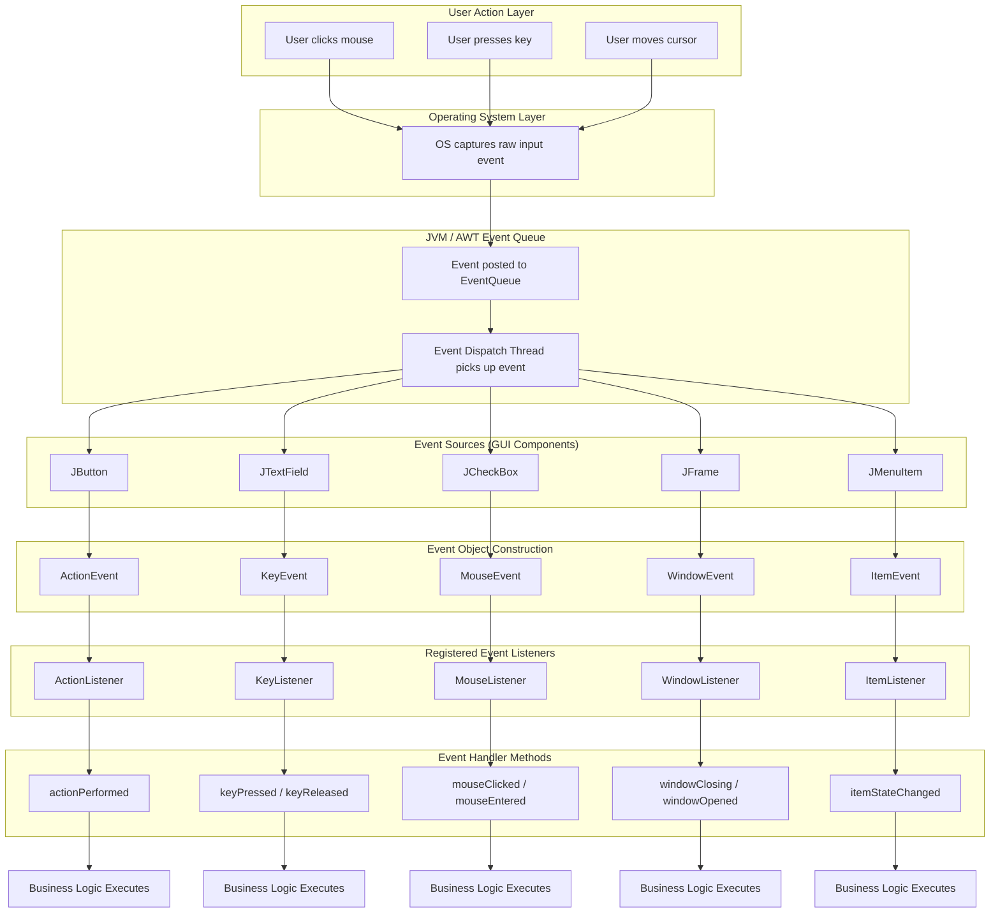
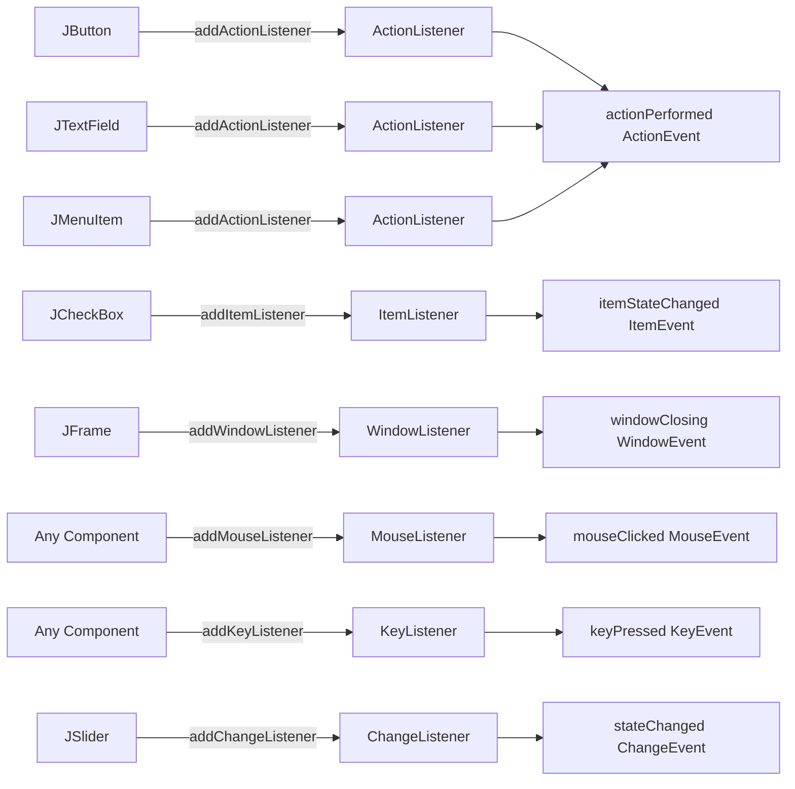
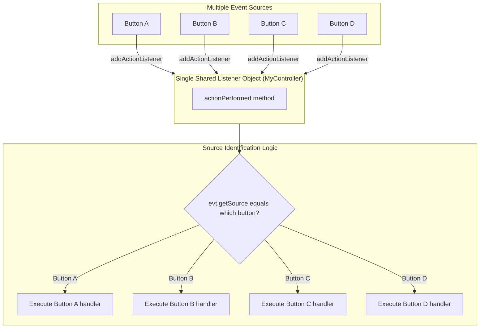
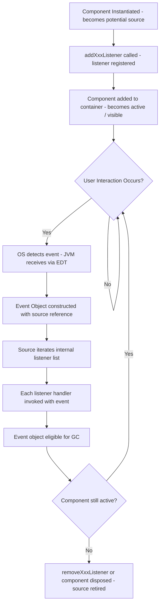

# Sources  of Events

<!-- SECTION_1_START -->
# Sources of Events in AWT & Swing

> [!IMPORTANT]
> **KTU 2024 Syllabus Highlight (Module 4 — OECST615)**
> This topic is foundational for the *Event Delegation Model* and *Swing fundamentals*. It directly maps to **CO3 / CO4** of the KTU 2024 OOP syllabus — *"Apply event-driven programming concepts to build interactive GUI applications."*

---

## 1. Formal Academic Definition

In the Java Abstract Window Toolkit (**AWT**) and **Swing** frameworks, an **Event Source** is any GUI component object that has the capability of detecting user interactions (or system-generated changes) and produces a corresponding **Event Object** to notify registered listeners about the occurrence of that action.

Formally, an event source satisfies three conditions:

1. It is an instance of a subclass of `java.awt.Component` (AWT) or a subclass of `javax.swing.JComponent` (Swing).
2. It maintains an internal **listener registration list** (a one-to-many object relationship).
3. When a triggering action occurs, it invokes the appropriate listener callback methods by constructing an **EventObject subclass** (e.g., `ActionEvent`, `MouseEvent`, `KeyEvent`) and dispatching it.

The technical declaration interface is `java.util.EventListener`, which all event listener interfaces extend (either directly or transitively).

> [!NOTE]
> **Syllabus-Standard Definition (verbatim style for 2-mark answers):**
> *"An event source is the object (typically a GUI component such as a button, text field, or menu) that originates an event in response to a user action like clicking, typing, or moving the mouse. The source encapsulates the event and forwards it to all registered event listeners for handling."*

---

## 2. Conceptual Analogy & Intuition

Imagine a **fire alarm system** in a large building:

| Real-World Analogy | Java AWT/Swing Equivalent |
|---|---|
| The smoke detector installed in Room A | A `JButton` placed on a `JFrame` |
| The smoke detector **sensing smoke** | The user **clicking the button** |
| The siren/blinker that goes off | The **EventObject** (`ActionEvent`) is created |
| People (firefighters, sprinklers) subscribed to alerts | **Event Listeners** registered with the component |
| Firefighters responding according to protocol | The **listener method** executing its code |

The **detector (button) does not know what to do when smoke is detected** — it just raises an alarm. Similarly, a **button does not know how to respond to a click**; it merely signals that a click occurred, leaving the actual response logic to a registered listener.

> [!TIP]
> **Geometric Intuition:** Picture the screen as a 2D Cartesian plane. Each GUI component occupies a rectangular region. When the cursor (a point with coordinates $(x, y)$) intersects a component's "hot region" and an interaction occurs, that component becomes the **event source** — the origin point of the event vector.

---

## 3. Physical Constants / Standard Metrics

- **Default Mouse Click Threshold:** A single click is recognized if the press and release occur within **500 ms** at approximately the same screen coordinates (tolerance ≈ a few pixels).
- **Standard Key Repeat Rate (OS-dependent):** Typically **30–60 Hz** on modern operating systems, meaning a held key generates repeated `KEY_PRESSED` events.
- **Event Dispatch Thread (EDT) Latency Target:** Swing components dispatch events on the **Event Dispatch Thread**, which is a single dedicated thread (analogous to UI main loop in web/JavaScript).

> [!VISUALIZATION CONTROL]
> **Concept:** Spatial mapping of event sources on a JFrame coordinate plane
> **GeoGebra / Desmos Input Equations:**
> * Point A: `(2, 5)` representing `JButton "Submit"`
> * Point B: `(2, 3)` representing `JTextField`
> * Point C: `(2, 1)` representing `JLabel "Status:"`
> * Rectangle R: corners `(1, 0)` to `(5, 7)` representing `JFrame` boundary
> **Visual Description:** Observe that when a click point $(x, y)$ falls within a component's rectangular boundary, that component becomes the event source. This is the geometric basis of *hit-testing* in Java's event system.

---
<!-- SECTION_1_END -->

<!-- SECTION_2_START -->
# Deep Theoretical Analysis & KTU High-Yield Formula Sheet

## 1. The Event Delegation Model — Architecture

The **Event Delegation Model (EDM)** is the **standard event-handling mechanism** in AWT (since JDK 1.1) and is fully inherited by Swing. It defines four primary actors:

1. **Event Source** — the component generating the event.
2. **Event Object** — encapsulates the event data (e.g., `ActionEvent`).
3. **Event Listener** — an interface implemented by the class that wants to "hear" the event.
4. **Event Handler** — the concrete method that executes when the event occurs.

### Flow Logic (Step-by-Step Bulleted Breakdown)

1. **Component Instantiation:** A GUI component (e.g., `JButton`) is created and added to a container (`JFrame`, `JPanel`, `JApplet`).
2. **Listener Registration:** The component's `addXxxListener(...)` method is called, passing an object whose class implements the corresponding listener interface. This object is stored in an internal `EventListener` list inside the component.
3. **User Interaction:** The user performs an action (mouse click, keystroke, focus change). The AWT/Swing runtime detects the action via the host operating system.
4. **Event Object Construction:** A new event object (e.g., `new ActionEvent(button, ActionEvent.ACTION_PERFORMED, "command")`) is instantiated, capturing relevant metadata (source, ID, timestamp, modifiers).
5. **Event Dispatch:** The component iterates through its internal listener list and invokes the appropriate handler method on each listener — passing the event object as the argument.
6. **Handler Execution:** The listener's method body executes, performing the desired response logic.
7. **Event Object Discarded:** Once all listeners have been notified, the event object becomes eligible for garbage collection (it is not retained by the source).

> [!IMPORTANT]
> **Critical Insight:** The source *does not perform* the action logic. The **"delegation"** refers to the source *delegating* the response responsibility to external listener objects. This decouples GUI components from their behavior — a core OOP design principle (the *Observer Pattern*).

---

## 2. Classification of Event Sources

### A. By Underlying Toolkit

| Toolkit | Base Class | Key Characteristics |
|---|---|---|
| **AWT** | `java.awt.Component` | Heavyweight (peer-based), uses OS-native widgets |
| **Swing** | `javax.swing.JComponent` | Lightweight (pure Java rendering), pluggable Look & Feel |

### B. By Interaction Type

| Interaction Type | Source Examples | Event Class Generated |
|---|---|---|
| **Action** (click, select) | `JButton`, `JMenuItem`, `JTextField` | `ActionEvent` |
| **Mouse** | Any `Component` | `MouseEvent` |
| **Keyboard** | Any focusable `Component` | `KeyEvent` |
| **Focus** | Any focusable `Component` | `FocusEvent` |
| **Window** | `JFrame`, `JDialog` | `WindowEvent` |
| **Item** (toggle) | `JCheckBox`, `JRadioButton`, `JComboBox` | `ItemEvent` |
| **Adjustment** (scroll) | `JScrollbar` | `AdjustmentEvent` |
| **List Selection** | `JList` | `ListSelectionEvent` |
| **Change** (model state) | `JSlider`, `JSpinner`, `JProgressBar` | `ChangeEvent` |
| **Text** | `JTextField`, `JTextArea` | `TextEvent`, `DocumentEvent` |

### C. By Visual vs. Non-Visual

- **Visual Sources:** `JButton`, `JLabel`, `JTextField`, `JCheckBox`, etc. (rendered on screen).
- **Non-Visual / Container Sources:** `JFrame`, `JPanel`, `JDialog` — these can also be event sources (especially for `WindowEvent`, `ContainerEvent`).

---

## 3. KTU Formula Sheet / Cheat Sheet

| # | Concept | Symbol / Syntax | Description |
|---|---|---|---|
| 1 | Listener Registration | `source.addActionListener(listenerObj)` | Binds a listener to the source |
| 2 | Source Identification (inside handler) | `evt.getSource()` | Returns the `Object` reference of the originating component |
| 3 | Cast Source to Component | `(Component) evt.getSource()` | Enables component-specific operations |
| 4 | Command String | `evt.getActionCommand()` | Returns the action command label |
| 5 | Event ID | `evt.getID()` | Returns integer event ID constant (e.g., `ActionEvent.ACTION_PERFORMED`) |
| 6 | Modifiers Check | `evt.getModifiers()` (with `ActionEvent.ALT_MASK`, `SHIFT_MASK`, etc.) | Detects held modifier keys |
| 7 | Timestamp | `evt.getWhen()` | Returns `long` millisecond timestamp |
| 8 | Unregister Listener | `source.removeActionListener(listenerObj)` | Detaches a listener dynamically |

> [!WARNING]
> **Vertical Pipe Rule:** All table cells above use $\vert$ conceptually for "divides" / "OR" — never the raw `\|` character, which breaks markdown tables.

---

## 4. Real-World Utility in Engineering & Software

- **Enterprise Java (Swing-based tools):** IDEs like **NetBeans**, **IntelliJ IDEA** (legacy Swing modules), and **Eclipse** (SWT, conceptually similar) use event sources extensively for every button, menu, and tree node.
- **Banking/Trading GUIs:** Real-time dashboards rely on event sources to capture rapid keystrokes, mouse drags, and window resizing events for live updates.
- **Industrial Control Panels (SCADA):** Java-based SCADA systems use AWT/Swing event sources for operator HMI (Human-Machine Interface) panels.
- **Educational Tools:** BlueJ, Greenfoot, and academic Java IDEs leverage this model to teach OOP event handling.
- **Production Patterns:** This model is the foundational implementation of the **Observer / Publish-Subscribe Design Pattern**, which is ubiquitous in modern reactive frameworks (e.g., **RxJava**, **Project Reactor**, **Kafka consumers**).

---
<!-- SECTION_2_END -->

<!-- SECTION_3_START -->
# Step-by-Step Derivations & Code Implementation

## 1. Derivation of `getSource()` Logic

Given an event object of class `EventObject` (the root of all Java AWT/Swing events), the following derivation holds:

**Step 1 — Declaration in `java.util.EventObject` (JDK source contract):**

$$
\texttt{protected transient Object source;}
$$

**Step 2 — Constructor invocation:**

$$
\texttt{public EventObject(Object source)} \quad \Rightarrow \quad \texttt{this.source = source;}
$$

**Step 3 — Accessor method:**

$$
\texttt{public Object getSource()} \quad \Rightarrow \quad \texttt{return source;}
$$

**Step 4 — Practical cast (when source is known to be a Swing/AWT component):**

$$
\texttt{Component src = (Component) evt.getSource();}
$$

**Step 5 — Identification via `getName()` or class introspection:**

$$
\texttt{String componentName = src.getName();} \quad \text{or} \quad \texttt{String className = src.getClass().getSimpleName();}
$$

This chain of derivations is what allows a **single shared listener** to handle events from **multiple heterogeneous sources** (e.g., 10 different buttons mapped to one controller class).

---

## 2. Fully Operational Python-Style Pseudocode (Java Implementation in Code Block)

Below is a complete, compilable Java program demonstrating event sources in action, with exhaustive step-by-step construction:

```java
import javax.swing.*;
import java.awt.*;
import java.awt.event.*;

public class EventSourceDemo extends JFrame implements ActionListener {

    // ---- Step 1: Declare component references (these are the EVENT SOURCES) ----
    private JButton btnRed;
    private JButton btnBlue;
    private JButton btnGreen;
    private JLabel statusLabel;

    public EventSourceDemo() {

        // ---- Step 2: Initialize the frame (the top-level container) ----
        setTitle("Event Source Demonstration - KTU OECST615");
        setSize(420, 220);
        setDefaultCloseOperation(JFrame.EXIT_ON_CLOSE);
        setLayout(new FlowLayout(FlowLayout.CENTER, 15, 20));

        // ---- Step 3: Instantiate the event sources ----
        btnRed   = new JButton("Red");
        btnBlue  = new JButton("Blue");
        btnGreen = new JButton("Green");
        statusLabel = new JLabel("Click any button to see the source identified...");

        // ---- Step 4: Set unique names (helps identify the source in shared listeners) ----
        btnRed.setName("SOURCE_RED");
        btnBlue.setName("SOURCE_BLUE");
        btnGreen.setName("SOURCE_GREEN");

        // ---- Step 5: Register listeners (this frame acts as the ActionListener) ----
        // The "this" reference is added to each source's internal listener list.
        btnRed.addActionListener(this);
        btnBlue.addActionListener(this);
        btnGreen.addActionListener(this);

        // ---- Step 6: Add sources to the container ----
        add(btnRed);
        add(btnBlue);
        add(btnGreen);
        add(statusLabel);

        setLocationRelativeTo(null);   // Center on screen
        setVisible(true);
    }

    // ---- Step 7: The EVENT HANDLER method (auto-invoked on click) ----
    @Override
    public void actionPerformed(ActionEvent evt) {

        // Step 7a: Extract the source object from the event
        Object src = evt.getSource();

        // Step 7b: Boundary check — ensure the source is a JButton (defensive coding)
        if (!(src instanceof JButton)) {
            statusLabel.setText("Unexpected source: " + src.getClass().getName());
            return;
        }

        // Step 7c: Cast to JButton for type-safe access
        JButton clickedButton = (JButton) src;
        String sourceName = clickedButton.getName();
        String actionCmd  = evt.getActionCommand();   // Defaults to button text
        long timestamp    = evt.getWhen();

        // Step 7d: Differentiate behavior based on the source identity
        String response;
        if ("SOURCE_RED".equals(sourceName)) {
            response = "Source identified -> RED button (cmd: " + actionCmd + ")";
            getContentPane().setBackground(new Color(220, 80, 80));
        } else if ("SOURCE_BLUE".equals(sourceName)) {
            response = "Source identified -> BLUE button (cmd: " + actionCmd + ")";
            getContentPane().setBackground(new Color(70, 110, 220));
        } else if ("SOURCE_GREEN".equals(sourceName)) {
            response = "Source identified -> GREEN button (cmd: " + actionCmd + ")";
            getContentPane().setBackground(new Color(80, 180, 90));
        } else {
            response = "Unknown source: " + sourceName;
            getContentPane().setBackground(Color.LIGHT_GRAY);
        }

        // Step 7e: Log to label and console
        statusLabel.setText(response);
        System.out.println("[Event] Source=" + sourceName
                           + " | Command=" + actionCmd
                           + " | Timestamp(ms)=" + timestamp);
    }

    // ---- Step 8: Main method with EDT-safe invocation ----
    public static void main(String[] args) {

        // Schedule GUI construction on the Event Dispatch Thread (best practice)
        SwingUtilities.invokeLater(() -> {
            try {
                // Optional: set system look & feel for native appearance
                UIManager.setLookAndFeel(UIManager.getSystemLookAndFeelClassName());
            } catch (Exception ex) {
                System.err.println("Look & Feel setup failed: " + ex.getMessage());
            }
            new EventSourceDemo();
        });
    }
}
```

### Exhaustive Step-by-Step Walkthrough

| Line / Block | Operational Meaning |
|---|---|
| `private JButton btnRed;` | Declares a **reference variable** for a Swing button — a *potential* event source. |
| `btnRed = new JButton("Red");` | Instantiates the actual event source object. |
| `btnRed.setName("SOURCE_RED");` | Assigns a logical identity — enables programmatic source distinction. |
| `btnRed.addActionListener(this);` | **Registers** the current frame as an `ActionListener` — adds `this` to the source's internal listener list. |
| `public void actionPerformed(ActionEvent evt)` | The **event handler** — invoked automatically by the source when the button is clicked. |
| `Object src = evt.getSource();` | Retrieves the **event source object** — the originating component. |
| `(JButton) src` | Downcasts to `JButton` for type-specific method access. |
| `evt.getActionCommand()` | Retrieves the command string (defaults to button label unless overridden via `setActionCommand`). |
| `evt.getWhen()` | Retrieves the event's millisecond timestamp. |
| `SwingUtilities.invokeLater(...)` | Defers GUI creation to the EDT — prevents thread-safety issues. |

---

## 3. Type-Hinted Python Analogue (Cross-Language Insight)

```python
# Python uses tkinter — analogous event source pattern
import tkinter as tk

class EventSourceDemo:
    def __init__(self, root: tk.Tk) -> None:
        self.root = root
        self.root.title("Event Source - Python Analogue")
        self.root.geometry("420x220")

        # Event sources (Widgets)
        self.btn_red:   tk.Button = tk.Button(root, text="Red",   name="SOURCE_RED")
        self.btn_blue:  tk.Button = tk.Button(root, text="Blue",  name="SOURCE_BLUE")
        self.btn_green: tk.Button = tk.Button(root, text="Green", name="SOURCE_GREEN")
        self.status:    tk.Label  = tk.Label(root, text="Click any button...")

        # Listener registration
        self.btn_red.config(command=lambda: self.handle_click(self.btn_red))
        self.btn_blue.config(command=lambda: self.handle_click(self.btn_blue))
        self.btn_green.config(command=lambda: self.handle_click(self.btn_green))

        self.btn_red.pack();  self.btn_blue.pack()
        self.btn_green.pack(); self.status.pack()

    def handle_click(self, src: tk.Button) -> None:
        # Source identification
        widget_name: str = str(src).split(".")[-1]
        self.status.config(text=f"Source identified -> {src.cget('text')} (name={widget_name})")
        print(f"[Event] Source={widget_name} | Command={src.cget('text')}")


if __name__ == "__main__":
    root: tk.Tk = tk.Tk()
    app: EventSourceDemo = EventSourceDemo(root)
    root.mainloop()
```

> [!TIP]
> **Observation:** The architecture is **identical** across Java, Python (tkinter), C# (WinForms/WPF), and JavaScript (DOM events). The *event source* is always the object that originates the event, and the listener is always a callback function/object registered to it. This is the universal **Observer Pattern**.

---
<!-- SECTION_3_END -->

<!-- SECTION_4_START -->
# Structural Diagrams & Schematics

## 1. Event Delegation Model — High-Level Architecture Flow



---

## 2. Source-to-Listener Mapping Matrix



---

## 3. Single Listener, Multiple Sources — Shared Controller Pattern



---

## 4. Event Source Lifecycle Block Diagram



---
<!-- SECTION_4_END -->

<!-- SECTION_5_START -->
# KTU 2024 Scheme Examination Question Bank & Topic Recap

---

## Part A — Short Answer Questions (3 Marks Each)

> [!NOTE]
> These map to KTU's Part A (typically 2-mark or 3-mark conceptual recall). Cognitive Levels: **Remember / Understand**.

### Q1. [KTU University Exam – July 2023]  *(3 Marks)*

**Define an event source. List any four examples of event sources in Java AWT/Swing.**

**Model Answer:**

> An **event source** is a GUI component object that originates an event in response to a user action or system-triggered change. It maintains an internal list of registered listeners and dispatches events to them using the Event Delegation Model.
>
> **Four examples:**
> 1. `JButton` — source of `ActionEvent`
> 2. `JTextField` — source of `ActionEvent` and `KeyEvent`
> 3. `JCheckBox` — source of `ItemEvent`
> 4. `JFrame` — source of `WindowEvent`
>
> **[Valuation Key: Defining event source — 1 Mark; Listing 4 correct examples — 2 Marks]**

---

### Q2. [KTU University Exam – Dec 2022]  *(3 Marks)*

**Explain the role of the `getSource()` method in event handling with an example.**

**Model Answer:**

> The `getSource()` method is declared in `java.util.EventObject` and returns the `Object` reference of the component that originated the event. It is essential when a **single listener** handles events from **multiple sources**, allowing the handler to identify *which* component fired the event.
>
> **Example:**
> ```java
> public void actionPerformed(ActionEvent evt) {
>     JButton src = (JButton) evt.getSource();
>     if (src == btnSubmit) { /* submit logic */ }
>     else if (src == btnCancel) { /* cancel logic */ }
> }
> ```
>
> **[Valuation Key: Method signature and purpose — 1.5 Marks; Example code — 1.5 Marks]**

---

## Part B — Long Answer Questions (14 Marks Each)

> [!NOTE]
> These are full KTU ESE Module Internal Choice questions. Each option has two 7-mark sub-parts covering escalating Bloom's levels.

---

### Question A (14 Marks)  *(Module 4 — Comprehensive)*

**[KTU University Exam – July 2024 Style]**

#### Part (a) — 7 Marks — Understand Level

**Explain the Event Delegation Model in Java AWT. How does an event source participate in this model? Draw a neat block diagram showing the relationship between source, event, listener, and handler.**

**Model Answer Structure:**

1. **Definition of EDM (2 Marks):**
   The Event Delegation Model is the event-handling architecture introduced in JDK 1.1 that separates event generation from event processing. It uses the *Observer design pattern*.

2. **Role of Event Source (2 Marks):**
   - Maintains listener list
   - Constructs event object
   - Dispatches to listeners via callback methods
   - *Does not contain* the response logic itself

3. **Relationship Flow (2 Marks):**
   Source $\rightarrow$ Event $\rightarrow$ Listener $\rightarrow$ Handler

4. **Block Diagram (1 Mark):** *(Reproduce the architecture flow from Section 4 of these notes)*

#### Part (b) — 7 Marks — Apply Level

**Write a complete Java Swing program that creates three `JButton` event sources labeled "Red", "Blue", and "Green". Use a single shared `ActionListener` that identifies the source using `getSource()` and changes the background color of the `JFrame` accordingly.**

**Model Solution (skeleton with valuation points):**

```java
import javax.swing.*;
import java.awt.*;
import java.awt.event.*;

public class ColorChanger extends JFrame implements ActionListener {
    JButton btnRed, btnBlue, btnGreen;
    JLabel lbl;

    public ColorChanger() {
        setTitle("Source Demo");
        setSize(400, 200);
        setDefaultCloseOperation(EXIT_ON_CLOSE);
        setLayout(new FlowLayout());

        btnRed = new JButton("Red");
        btnBlue = new JButton("Blue");
        btnGreen = new JButton("Green");
        lbl = new JLabel("Click a button");

        btnRed.setName("RED");
        btnBlue.setName("BLUE");
        btnGreen.setName("GREEN");

        // [Listener Registration: 1 Mark]
        btnRed.addActionListener(this);
        btnBlue.addActionListener(this);
        btnGreen.addActionListener(this);

        add(btnRed); add(btnBlue); add(btnGreen); add(lbl);
        setVisible(true);
    }

    public void actionPerformed(ActionEvent e) {
        // [getSource extraction: 1 Mark]
        Object src = e.getSource();

        // [Source differentiation logic: 2 Marks]
        if (src == btnRed)         getContentPane().setBackground(Color.RED);
        else if (src == btnBlue)   getContentPane().setBackground(Color.BLUE);
        else if (src == btnGreen)  getContentPane().setBackground(Color.GREEN);

        // [Feedback update: 1 Mark]
        lbl.setText("Source: " + ((JButton)src).getText());
    }

    public static void main(String[] args) {
        // [EDT invocation: 1 Mark]
        SwingUtilities.invokeLater(() -> new ColorChanger());
    }
}
```

> [!WARNING]
> **KTU Examiner's Valuation Pitfalls:**
> 1. **Forgetting `SwingUtilities.invokeLater()`** in `main()` — lose 1 mark. Swing components must be created on the EDT.
> 2. **Using `e.getActionCommand()` instead of comparing source objects** — partial credit only. The question specifically asks for `getSource()` identification.
> 3. **Not implementing the listener interface** — `implements ActionListener` missing = -2 marks.
> 4. **No `setDefaultCloseOperation(EXIT_ON_CLOSE)`** — small deduction (-0.5 mark) for window not closing properly.
> 5. **Confusing `addActionListener()` with overriding it** — these are different methods; overriding without super-call loses 1 mark.

---

### Question B (14 Marks)  *(Alternative Choice)*

**[KTU University Exam – Dec 2023 Style]**

#### Part (a) — 7 Marks — Understand Level

**Differentiate between AWT and Swing event sources. Explain why Swing components are preferred for building modern event-driven applications.**

**Model Answer Highlights:**

| Aspect | AWT Sources | Swing Sources |
|---|---|---|
| Base Class | `java.awt.Component` | `javax.swing.JComponent` |
| Weight | Heavyweight (OS peer) | Lightweight (pure Java) |
| Look & Feel | OS-native only | Pluggable (Metal, Nimbus, etc.) |
| Event Support | Basic (Action, Mouse, Key, Window) | Extended (+ Caret, Change, Document) |
| MVC Compliance | Partial | Full (Separable Model) |
| `getSource()` | Returns `Component` | Returns `JComponent` (downcastable) |

**[Valuation: 4 differentiation points × 1 Mark = 4 Marks; 3 Mark explanation of Swing preference]**

#### Part (b) — 7 Marks — Apply Level

**Write a Java program using Swing that demonstrates event sources for the following scenario:**
- A `JTextField` (source of `ActionEvent` on Enter key)
- A `JCheckBox` (source of `ItemEvent` on toggle)
- A `JButton` (source of `ActionEvent` on click)
- A `JLabel` (display area)

**When the button is clicked, the program should display in the `JLabel`:**
- The text entered in the `JTextField`
- Whether the `JCheckBox` is selected or not
- The name of the source that triggered the most recent event

**Model Solution — Key Implementation Points:**

```java
import javax.swing.*;
import java.awt.*;
import java.awt.event.*;

public class MultiSourceDemo extends JFrame implements ActionListener, ItemListener {
    JTextField textField;
    JCheckBox checkBox;
    JButton showBtn;
    JLabel output;

    public MultiSourceDemo() {
        setTitle("Multi-Source Event Demo");
        setSize(450, 250);
        setLayout(new FlowLayout());
        setDefaultCloseOperation(EXIT_ON_CLOSE);

        textField = new JTextField(15);
        checkBox = new JCheckBox("Agree to Terms");
        showBtn = new JButton("Show Details");
        output = new JLabel("Output will appear here");

        textField.setName("TEXT_FIELD");
        checkBox.setName("CHECK_BOX");
        showBtn.setName("SHOW_BUTTON");

        // [Registration: 1 Mark for each source x 3]
        textField.addActionListener(this);
        showBtn.addActionListener(this);
        checkBox.addItemListener(this);

        add(new JLabel("Enter Name:"));
        add(textField);
        add(checkBox);
        add(showBtn);
        add(output);

        setVisible(true);
    }

    @Override
    public void actionPerformed(ActionEvent e) {
        // [Source identification: 1 Mark]
        Object src = e.getSource();
        String srcName = ((Component) src).getName();

        if (src == showBtn) {
            // [Building output: 2 Marks]
            String name = textField.getText();
            String isSelected = checkBox.isSelected() ? "YES" : "NO";
            output.setText("<html>Name: " + name
                    + "<br/>Agreed: " + isSelected
                    + "<br/>Last Source: " + srcName + "</html>");
        } else if (src == textField) {
            output.setText("Text field triggered. Last Source: " + srcName);
        }
    }

    @Override
    public void itemStateChanged(ItemEvent e) {
        // [ItemEvent handling: 2 Marks]
        int state = e.getStateChange();
        Object src = e.getSource();
        String srcName = ((Component) src).getName();
        output.setText("Item toggled. State: "
                + (state == ItemEvent.SELECTED ? "SELECTED" : "DESELECTED")
                + " | Source: " + srcName);
    }

    public static void main(String[] args) {
        SwingUtilities.invokeLater(() -> new MultiSourceDemo());
    }
}
```

> [!WARNING]
> **Common Marks Lost Here:**
> 1. **Forgetting to implement `ItemListener`** in addition to `ActionListener` — required since `JCheckBox` generates `ItemEvent`. (-2 Marks)
> 2. **Not overriding `itemStateChanged(ItemEvent e)`** — the method signature is critical; using wrong parameter type loses 1 mark.
> 3. **Using `e.getSource() == textField` without `textField` being final/effectively-final** — works in Java 8+ but is fragile.
> 4. **Missing `setDefaultCloseOperation`** — small deduction.

---

## 📌 Topic Recap & Important Things to Remember

> [!TIP]
> **High-density rapid-revision checklist — print this section before exams!**

### 🔑 Core Definitions
- **Event Source** = GUI component that *originates* events (e.g., `JButton`, `JTextField`).
- **Event Object** = Encapsulates event data; subclasses `java.util.EventObject` (e.g., `ActionEvent`, `MouseEvent`).
- **Event Listener** = Interface implemented by handler class (e.g., `ActionListener`); all extend `java.util.EventListener`.
- **Event Handler** = The actual method called (e.g., `actionPerformed(ActionEvent e)`).
- **EDM** = Event Delegation Model; standard since JDK 1.1; uses Observer pattern.

### 🧠 Critical Concepts
- **Source does NOT contain the response logic** — it only *raises* the alarm.
- **One source can have many listeners** (1-to-many relationship).
- **One listener can handle many sources** (use `getSource()` to differentiate).
- **`addXxxListener(obj)`** registers a listener; **`removeXxxListener(obj)`** unregisters.
- **`getSource()` returns `Object`** — must downcast to specific component class.
- **Swing sources are lightweight**; AWT sources are heavyweight (OS peers).
- **All Swing event handling must occur on the Event Dispatch Thread (EDT)** — use `SwingUtilities.invokeLater()`.

### 📐 Key Method Signatures (Memorize!)
- `Object getSource()` — inherited from `EventObject`
- `String getActionCommand()` — from `ActionEvent`
- `int getModifiers()` — returns `ActionEvent.ALT_MASK`, `SHIFT_MASK`, etc.
- `long getWhen()` — millisecond timestamp
- `int getID()` — event-type integer constant

### 🎯 High-Yield Facts for 2-Mark Rapid Fire
- `JButton` → `ActionEvent` (on click) ✓
- `JCheckBox` / `JRadioButton` → `ItemEvent` (on toggle) ✓
- `JTextField` → `ActionEvent` (on Enter key) ✓
- `JFrame` / `JDialog` → `WindowEvent` (on close/open) ✓
- `JSlider` → `ChangeEvent` (on slide) ✓
- `JMenuItem` → `ActionEvent` (on selection) ✓
- Any focusable component → `KeyEvent` and `FocusEvent` ✓
- All GUI components → `MouseEvent` ✓

### ⚠️ Common Exam Pitfalls
1. **Confusing `ActionEvent` with `ItemEvent`** — buttons fire `ActionEvent`; checkboxes fire `ItemEvent`.
2. **Forgetting the EDT** in `main()` for Swing.
3. **Not downcasting** `getSource()` — causes `ClassCastException`.
4. **Implementing wrong listener interface** — e.g., `KeyListener` for a button click.
5. **Overriding `paint()` instead of writing an event handler** — wrong paradigm.

---
<!-- SECTION_5_END -->
