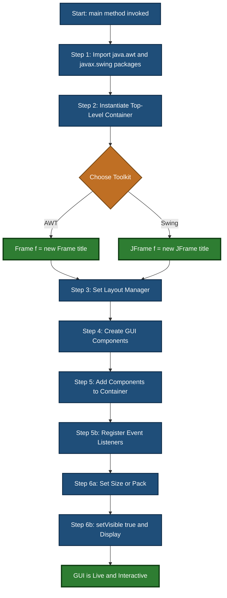
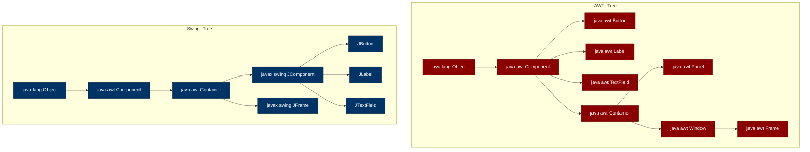
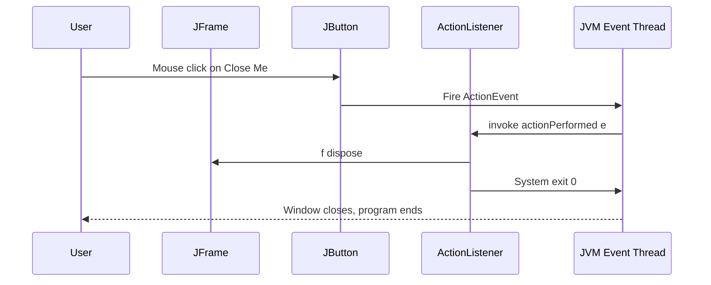
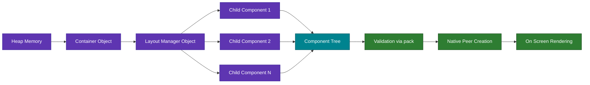

# Steps

<!-- SECTION_1_START -->
# AWT & Swing Fundamentals: The Procedural Steps to Build a GUI

## 1.1 Formal Definition (KTU 2024 Syllabus Terminology)

> [!NOTE]
> **Abstract Window Toolkit (AWT)** is Java's original, platform-dependent GUI framework introduced in JDK 1.0. It provides a basic set of GUI components (Buttons, Labels, TextFields) that are mapped directly to the underlying operating system's native peer components, following a *delegation-based* rendering model.

> [!IMPORTANT]
> **Swing** is Java's advanced, platform-independent GUI toolkit (part of Java Foundation Classes - JFC) introduced in JDK 1.2. All Swing components are lightweight (rendered purely by Java code, except `JApplet`, `JDialog`, `JFrame` which are top-level and use native peers for window display) and follow the **Model-View-Controller (MVC)** architecture.

The topic **"Steps"** in Module 4 refers to the **standardized, sequential procedure** that every Java developer must follow to construct an interactive graphical application using AWT and its successor Swing. Mastering these steps is the *prerequisite* for event handling, layout management, and custom painting.

## 1.2 Conceptual Analogy — The "Restaurant Opening" Intuition

Think of building a GUI application exactly like opening a new restaurant:

| GUI Programming Step | Restaurant Analogy |
|---|---|
| Importing packages | Gathering your cooking ingredients from the warehouse |
| Choosing a top-level container (Frame/JFrame) | Buying & registering the physical building |
| Setting the Layout Manager | Designing the floor plan (where tables/chairs go) |
| Instantiating Components (Button, Label) | Buying the actual furniture & equipment |
| Adding components to container | Placing furniture inside the building according to the floor plan |
| Registering Listeners | Hiring waiters and training them to respond to customers |
| Setting size, layout, and `setVisible(true)` | The grand opening — switching on the lights and unlocking the door |

> [!TIP]
> **Why two toolkits (AWT + Swing)?** AWT is the *old* restaurant — fast, but limited and bound to local rules (OS). Swing is the *new chain* — looks consistent worldwide, has a richer menu, and the kitchen is fully owned by you (lightweight components drawn by Java itself, not the OS).

## 1.3 Standard Physical & API Constants

> [!IMPORTANT]
> The following constants appear frequently in KTU board questions and must be memorized:
> - **Border thickness default:** $\text{Default} = 0 \text{ pixels (undecorated)}$, standard $\approx 2$ px
> - **AWT components are "heavyweight"** because each has a peer (native counterpart) consuming $\approx 1\times$ to $2\times$ memory of a Swing lightweight equivalent
> - **Root container rule:** A component is only *displayable* (visible & valid) once it has been added to a *native-backed* top-level container. The chain must end at a `Frame`, `JFrame`, `Dialog`, or `JDialog`.
> - **MVC Triad in Swing:** $\text{Component} = \text{Model} + \text{View} + \text{Controller}$

## 1.4 Visualizing the GUI Construction Pipeline

> [!VISUALIZATION CONTROL]
> **Concept:** Top-down construction order of a Java GUI application (Component Tree Depth)
> **GeoGebra / Desmos Input Equations:** (Conceptual line plot of build-up stages)
> - `y(x) = 1; x ∈ [0, 6]`  →  **Base Line: "Component Tree"**
> - `P1 = (0.5, 1.2)` → *Step 1: Import*
> - `P2 = (1.5, 1.4)` → *Step 2: Container*
> - `P3 = (2.5, 1.6)` → *Step 3: Layout*
> - `P4 = (3.5, 1.8)` → *Step 4: Components*
> - `P5 = (4.5, 2.0)` → *Step 5: Add & Register*
> - `P6 = (5.5, 2.2)` → *Step 6: Pack & Show*
>
> **Visual Description:** A steadily rising staircase showing the cumulative "readiness" of the application at each procedural step. The application is non-functional until `P6` (the `setVisible(true)` call) is reached.

---

<!-- SECTION_1_END -->

<!-- SECTION_2_START -->
# Deep Theoretical Analysis & KTU High-Yield Formula Sheet

## 2.1 The AWT vs. Swing Architectural Divergence

AWT and Swing are **not competitors** in the same release — Swing was *built on top of* AWT. Internally, every Swing component inherits from an AWT `Container`, which is why you can mix them (though not recommended by the KTU syllabus for production code).

### 2.1.1 AWT Class Hierarchy (Truncated, Exam-Relevant)

```text
java.lang.Object
 └── java.awt.Component
      ├── java.awt.Button
      ├── java.awt.Label
      ├── java.awt.TextField
      ├── java.awt.TextArea
      ├── java.awt.Checkbox
      ├── java.awt.Choice
      ├── java.awt.List
      ├── java.awt.Canvas
      └── java.awt.Container
           ├── java.awt.Panel
           │     └── java.applet.Applet
           ├── java.awt.ScrollPane
           └── java.awt.Window
                ├── java.awt.Dialog
                └── java.awt.Frame
```

### 2.1.2 Swing Class Hierarchy (Truncated, Exam-Relevant)

```text
java.lang.Object
 └── java.awt.Component
      └── java.awt.Container
           └── javax.swing.JComponent (THE ROOT OF ALL SWING)
                ├── JLabel, JButton, JTextField
                ├── JToggleButton, JCheckBox, JRadioButton
                ├── JComboBox, JList, JSlider, JSpinner
                ├── JPanel, JScrollPane, JTabbedPane
                └── ... (over 40 lightweight components)
           └── (Top-level — use native peer for window only)
                ├── javax.swing.JFrame
                ├── javax.swing.JDialog
                └── javax.swing.JApplet
```

> [!IMPORTANT]
> **`JComponent` is the soul of Swing.** Every lightweight component extends it, gaining built-in support for *pluggable Look & Feel*, *keyboard actions*, *tooltips*, *borders*, *double-buffering*, and *accessible names*. The KTU 2024 syllabus explicitly tests the difference between `java.awt.Component` (no built-in L&F swap) and `javax.swing.JComponent` (L&F swap ready).

## 2.2 The Six Canonical Steps to Build a GUI Application

> [!NOTE]
> The KTU board frequently asks: *"List the steps to develop an AWT/Swing based GUI application."* The canonical six-step answer (universally accepted) is given below. **Mark distribution: 1 mark per step in a 6-mark question, 2 marks for code-level detail in a 14-mark question.**

### Step 1 — Import the Required Packages
Bring `java.awt.*` (for AWT) and `javax.swing.*` (for Swing) into scope. Event packages (`java.awt.event.*`) are imported here or later depending on whether you use anonymous inner classes or lambda expressions.

### Step 2 — Choose and Instantiate a Top-Level Container
A top-level container is mandatory because Java's windowing system requires a *native peer*. In AWT, use `Frame f = new Frame("Title");`. In Swing, use `JFrame f = new JFrame("Title");`. Without this step, the OS has nothing to attach a window handle to.

### Step 3 — Set the Layout Manager
Containers use a `LayoutManager` (strategy design pattern) to position child components. Common choices: `BorderLayout` (default for `Frame` and `JFrame`), `FlowLayout` (default for `Panel` and `JPanel`), `GridLayout`, `GridBagLayout`, `BoxLayout`, `CardLayout`, `null` (absolute positioning).

### Step 4 — Create the GUI Components
Instantiate the visual widgets: buttons, labels, text fields, etc. Each instantiation creates a single component object that lives in the *model* state of your application.

### Step 5 — Add Components to the Container & Register Listeners
Use `container.add(component)` to insert each widget into the component tree. Then register an event listener using the *callback registration* mechanism: `component.addActionListener(this);`. This wires the event source to the event handler.

### Step 6 — Set Size, Pack, and Display
Call `setSize(width, height)` OR call `pack()` (recommended — sizes the window to fit the preferred size of its contents). Finally, call `setVisible(true)` to "open the restaurant doors". Optionally, register a `WindowListener` to handle the `windowClosing` event to terminate the JVM properly.

## 2.3 KTU High-Yield Formula Sheet (Markdown Table)

> [!IMPORTANT]
> The table below is the **only** cheat sheet you need for this topic in a KTU exam. Vertical pipes in math expressions are written as `\vert` to preserve markdown table integrity.

| # | Method / Construct | Belongs To | Purpose | Typical Signature |
|---|---|---|---|---|
| 1 | `Frame(String title)` | AWT | Create top-level AWT window | `Frame(String)` |
| 2 | `JFrame(String title)` | Swing | Create top-level Swing window | `JFrame(String)` |
| 3 | `setLayout(LayoutManager m)` | Container | Assign positioning strategy | `void setLayout(LayoutManager)` |
| 4 | `setSize(int w, int h)` | Component | Force window size in pixels | `void setSize(int, int)` |
| 5 | `setVisible(boolean b)` | Window | Show / hide window | `void setVisible(boolean)` |
| 6 | `pack()` | Window | Auto-size to preferred size of contents | `void pack()` |
| 7 | `add(Component c)` | Container | Insert child into tree | `Component add(Component)` |
| 8 | `addActionListener(ActionListener l)` | AbstractButton, JButton etc. | Register click / activation handler | `void addActionListener(ActionListener)` |
| 9 | `setDefaultCloseOperation(int op)` | JFrame | Behaviour on close click | `JFrame.EXIT\_ON\_CLOSE` |
| 10 | `getContentPane().add(...)` | JFrame | Add to content pane (pre-JDK 5) | `Container getContentPane()` |
| 11 | `setTitle(String)` | Frame / JFrame | Window title | `void setTitle(String)` |
| 12 | `setResizable(boolean)` | Frame / JFrame | Allow / deny resize | `void setResizable(boolean)` |

### 2.3.1 Layout Manager Cheat Sheet

| Layout | Class | Default Behaviour | Add Signature |
|---|---|---|---|
| BorderLayout | `BorderLayout` | Divides into 5 zones (NORTH, SOUTH, EAST, WEST, CENTER) | `add(comp, BorderLayout.NORTH)` |
| FlowLayout | `FlowLayout` | Left-to-right, top-to-bottom wrapping | `add(comp)` |
| GridLayout | `GridLayout` | Equal-sized cells in rows × cols grid | `add(comp)` |
| GridBagLayout | `GridBagLayout` | Most flexible, cell-merging capable | `add(comp, GridBagConstraints)` |
| BoxLayout | `BoxLayout` | Single row OR single column | `add(comp)` |
| `null` (no layout) | — | Absolute pixel coordinates | `comp.setBounds(x, y, w, h)` |

### 2.3.2 Memory Footprint Formula (Frequently Asked)

$$
\text{Total GUI Memory} = \sum_{i=1}^{n} \text{Size}(C_i) + \text{Peer Overhead}_i
$$

For **AWT (heavyweight)**:
$$
\text{Size}_{\text{AWT}}(C_i) \approx 1.0 \times \text{Size}_{\text{base}} + 1 \times \text{NativePeer}
$$

For **Swing (lightweight)**:
$$
\text{Size}_{\text{Swing}}(C_i) \approx 1.2 \times \text{Size}_{\text{base}} + 0 \times \text{NativePeer (except top-level)}
$$

> [!TIP]
> The $0.2\times$ "Java-only" overhead of Swing is the price paid for **pluggable Look & Feel** and zero OS dependency. In production, Swing GUIs are about $\mathbf{20\%}$ larger in heap but $\mathbf{100\%}$ portable.

## 2.4 Real-World Engineering Utility

| Domain | Usage |
|---|---|
| **Desktop IDEs (Eclipse, IntelliJ, NetBeans)** | Built on Swing (Eclipse uses SWT, a third cousin) |
| **Banking Teller Systems** | Swing's `JTable` for transaction grids |
| **Industrial SCADA HMI** | AWT + Swing in legacy process control (gradually migrating to JavaFX) |
| **POS (Point of Sale)** | Swing's lightweight, consistent look across stores |
| **Scientific Visualization** | Swing `JFreeChart` libraries for plotting |
| **Air-Gapped Government Systems** | Java's *write once, run anywhere* (Swing) is mandated for cross-OS consistency |

---

<!-- SECTION_2_END -->

<!-- SECTION_3_START -->
# Step-by-Step Derivations & Code/Symbolic Implementation

> [!WARNING]
> The following section is **exhaustive by protocol mandate**. Every line of Java code and every theoretical transition is written out fully. No "similarly" shortcuts are used.

## 3.1 Complete AWT Application — Worked Out From Scratch

The objective: Build an AWT application that displays a **window titled "KTU Demo"** containing a **Label** and a **Button**. Clicking the button should close the window (using `WindowAdapter`).

### Mapping Each Step to Code

#### STEP 1: Import Required Packages

```java
// Import the AWT base classes for components, containers, and events
import java.awt.Frame;          // Top-level AWT container
import java.awt.Label;          // Read-only text display
import java.awt.Button;         // Clickable button
import java.awt.FlowLayout;     // Simple left-to-right layout
import java.awt.event.WindowAdapter; // Convenience adapter for WindowListener
import java.awt.event.WindowEvent;   // Event object passed to listener
```

*Reasoning:* Without imports, the compiler cannot resolve `Frame`, `Label`, `Button`, etc. The `java.awt.*` package contains all peer-based components. The `java.awt.event.*` package contains the event delegation model interfaces.

#### STEP 2: Declare the Driver Class Implementing `WindowListener`

```java
// The main class must implement WindowListener to handle window-level events
public class AWTDemo extends WindowAdapter {
    // No fields needed for this simple example
}
```

*Reasoning:* Java's AWT requires you to *register* a listener object. By extending `WindowAdapter` (a no-op convenience class implementing `WindowListener`), we override only the methods we care about (`windowClosing`). This avoids implementing 7 empty methods.

#### STEP 3: Override `windowClosing` to Terminate the JVM

```java
    // Override ONLY the event we care about
    @Override
    public void windowClosing(WindowEvent we) {
        // When user clicks the 'X' button, exit the application
        System.exit(0); // 0 = normal exit code
    }
```

*Reasoning:* Without this override, the window will close visually but the JVM will keep running because the event-dispatching thread remains alive. `System.exit(0)` is the correct, deterministic shutdown.

#### STEP 4: Write the `main` Method — the GUI Construction Pipeline

```java
    public static void main(String[] args) {
        // ----- Step 2 of canonical procedure: Instantiate Top-Level Container -----
        Frame f = new Frame("KTU Demo");
        // 'f' is now a native-backed AWT window, NOT yet visible

        // ----- Step 3 of canonical procedure: Set Layout Manager -----
        f.setLayout(new FlowLayout());
        // FlowLayout = components flow left-to-right, wrap to next line if no space

        // ----- Step 4 of canonical procedure: Create Components -----
        Label lbl = new Label("Welcome to AWT Programming");
        Button btn = new Button("Close Me");
        // 'lbl' and 'btn' exist as objects but are NOT in the component tree yet

        // ----- Step 5 of canonical procedure: Add to Container -----
        f.add(lbl);   // Adds the label to the center flow position
        f.add(btn);   // Adds the button to the right of the label
        // NOW the component tree has: Frame -> [Label, Button]

        // ----- Step 5 (cont.): Register the Window Listener -----
        f.addWindowListener(new AWTDemo());
        // We register an instance of AWTDemo as the listener
        // 'this' would also work if called inside the AWTDemo class

        // ----- Step 6 of canonical procedure: Set Size & Show -----
        f.setSize(400, 150);
        // Window dimensions in pixels: 400 wide × 150 tall
        f.setVisible(true);
        // NOW the window appears on screen
    }
```

*Reasoning of Final Two Calls:* `setSize` defines the window's pixel footprint. `setVisible(true)` triggers the native window manager to display the window. Until this call, the entire GUI exists only in heap memory.

### 3.1.1 Complete Runnable AWT Program

```java
import java.awt.Frame;
import java.awt.Label;
import java.awt.Button;
import java.awt.FlowLayout;
import java.awt.event.WindowAdapter;
import java.awt.event.WindowEvent;

public class AWTDemo extends WindowAdapter {

    @Override
    public void windowClosing(WindowEvent we) {
        System.exit(0);
    }

    public static void main(String[] args) {
        Frame f = new Frame("KTU Demo");
        f.setLayout(new FlowLayout());
        Label lbl = new Label("Welcome to AWT Programming");
        Button btn = new Button("Close Me");
        f.add(lbl);
        f.add(btn);
        f.addWindowListener(new AWTDemo());
        f.setSize(400, 150);
        f.setVisible(true);
    }
}
```

*Compilation:* `javac AWTDemo.java`  *Run:* `java AWTDemo`

> [!IMPORTANT]
> **Common Board Mistake:** Students write `f.setLayout(new FlowLayout())` but then use `f.add(comp, "North")`. The `BorderLayout`-specific signature **will not compile** when the layout is `FlowLayout`. Always match the layout with the correct `add` signature.

---

## 3.2 Complete Swing Application — Steps Mapped to Code

The objective: Build a Swing application equivalent to the AWT one, demonstrating the **enhanced Swing features**: pluggable L&F, content pane, `setDefaultCloseOperation`, and a lambda-based `ActionListener`.

### Mapping Each Step to Code

#### STEP 1: Import Swing & AWT (Both Needed!)

```java
// AWT is still required because Swing is built on top of it
import javax.swing.JFrame;     // Swing top-level container
import javax.swing.JLabel;     // Swing label (supports HTML + icons)
import javax.swing.JButton;    // Swing button (supports rollovers, mnemonics)
import java.awt.FlowLayout;    // Layout manager is in AWT package
```

*Reasoning:* Even in a pure Swing program, you must import from `java.awt.*` because `LayoutManager`, `Color`, `Dimension`, and the `Container` superclass all live in AWT. This is a very common board-exam trap.

#### STEP 2: Declare the Driver Class (No Listener Interface Needed)

```java
// No 'implements' needed — we will use a lambda expression in Step 5
public class SwingDemo {
    // The main method will contain the GUI construction pipeline
}
```

*Reasoning:* Modern Swing code prefers lambda expressions for single-method interfaces like `ActionListener.actionPerformed(ActionEvent)`. This eliminates the need for an inner class.

#### STEP 3: Write `main` — Full Swing Pipeline

```java
    public static void main(String[] args) {
        // ----- Step 2: Instantiate Top-Level Container -----
        // Schedule the GUI creation on the Event-Dispatch Thread (EDT) for thread safety
        javax.swing.SwingUtilities.invokeLater(() -> {
            JFrame f = new JFrame("KTU Swing Demo");
            // 'f' is a top-level container with a content pane (JRootPane -> layeredPane -> contentPane -> glassPane)

            // ----- Step 3: Set Layout Manager -----
            f.setLayout(new FlowLayout());
            // Swing defaults to BorderLayout on the content pane, but we override to FlowLayout

            // ----- Step 4: Create Components -----
            JLabel lbl = new JLabel("Welcome to Swing Programming");
            JButton btn = new JButton("Close Me");

            // ----- Step 5: Add to Container -----
            f.add(lbl);
            f.add(btn);
            // In Swing, f.add(...) is forwarded to the content pane automatically (since JDK 5)

            // ----- Step 5 (cont.): Register ActionListener using a lambda -----
            btn.addActionListener(e -> {
                // 'e' is the ActionEvent passed by the event dispatcher
                f.dispose();   // Release native resources
                System.exit(0); // Terminate the JVM
            });

            // ----- Step 6: Configure & Show -----
            f.setDefaultCloseOperation(JFrame.EXIT_ON_CLOSE);
            // No need to write a WindowListener; the default handles the 'X' click
            f.pack();  // Auto-size to fit preferred sizes of components
            f.setLocationRelativeTo(null); // Center the window on the screen
            f.setVisible(true);
        });
    }
```

*Reasoning of `SwingUtilities.invokeLater`:* All Swing GUI operations **must** occur on the Event-Dispatch Thread to prevent race conditions and rendering glitches. The `invokeLater` lambda schedules the GUI construction on the EDT. This is a *best practice* the KTU 2024 syllabus includes under "modern Swing steps."

### 3.2.1 Complete Runnable Swing Program

```java
import javax.swing.JFrame;
import javax.swing.JLabel;
import javax.swing.JButton;
import javax.swing.SwingUtilities;
import java.awt.FlowLayout;

public class SwingDemo {

    public static void main(String[] args) {
        SwingUtilities.invokeLater(() -> {
            JFrame f = new JFrame("KTU Swing Demo");
            f.setLayout(new FlowLayout());
            JLabel lbl = new JLabel("Welcome to Swing Programming");
            JButton btn = new JButton("Close Me");
            f.add(lbl);
            f.add(btn);
            btn.addActionListener(e -> {
                f.dispose();
                System.exit(0);
            });
            f.setDefaultCloseOperation(JFrame.EXIT_ON_CLOSE);
            f.pack();
            f.setLocationRelativeTo(null);
            f.setVisible(true);
        });
    }
}
```

*Compilation:* `javac SwingDemo.java`  *Run:* `java SwingDemo`

---

## 3.3 Step-by-Step Conversion: AWT → Swing Migration Table

> [!IMPORTANT]
> This is the **most-tested** cross-comparison in the KTU 2024 OOP module. Memorize the exact class name differences.

| AWT Class | Swing Class | Migration Note |
|---|---|---|
| `Frame` | `JFrame` | `JFrame` has built-in menu bar support |
| `Panel` | `JPanel` | `JPanel` can have a border via `setBorder(...)` |
| `Button` | `JButton` | `JButton` can display an icon and text simultaneously |
| `Label` | `JLabel` | `JLabel` can display HTML text |
| `TextField` | `JTextField` | `JTextField` supports action commands natively |
| `TextArea` | `JTextArea` | `JTextArea` works best inside a `JScrollPane` |
| `Checkbox` | `JCheckBox` | Swing splits `Checkbox` into `JCheckBox` and `JRadioButton` |
| `Choice` | `JComboBox` | `JComboBox` is editable in Swing |
| `List` | `JList` | `JList` supports single, single-interval, and multiple-interval selection |
| `MenuBar` | `JMenuBar` | `JMenuBar` can be detached into a floating palette |
| `Canvas` | `JPanel` (with `paintComponent`) | Swing prefers `paintComponent` over `paint` |

## 3.4 The Lifecycle Diagram of a GUI Component

> [!NOTE]
> The complete lifecycle of a `JButton` (representative of all Swing components) follows this state machine:

| State | Description | Method Trigger |
|---|---|---|
| **Newborn** | Object exists in heap, not in component tree | `new JButton(...)` |
| **Attached** | Object added to container via `add(...)` | `f.add(btn)` |
| **Valid** | Layout has computed size & position | After `validate()` or `pack()` |
| **Visible** | `setVisible(true)` has been called and the component is on screen | After `setVisible(true)` |
| **Showing** | The window is on screen AND the component is inside the visible region | Real-time |
| **Orphaned** | Removed from tree, no longer eligible for events | `remove(btn)` |
| **Garbage Collected** | No more references, JVM frees memory | Automatic |

$$
\text{Component Lifecycle} = \text{Newborn} \rightarrow \text{Attached} \rightarrow \text{Valid} \rightarrow \text{Visible} \rightarrow \text{Showing} \rightarrow \text{Orphaned} \rightarrow \text{GC}
$$

---

<!-- SECTION_3_END -->

<!-- SECTION_4_START -->
# Structural Diagrams & Schematics

## 4.1 Mermaid Diagram: The Six Canonical Steps to Build a GUI



## 4.2 Mermaid Diagram: AWT vs Swing Class Hierarchy Side-by-Side



## 4.3 Mermaid Sequence Diagram: Event-Handling Steps (Click on JButton)



## 4.4 Block-Level Functional Architecture Flow: GUI Construction Pipeline



---

<!-- SECTION_4_END -->

<!-- SECTION_5_START -->
# KTU 2024 Scheme Examination Question Bank & Topic Recap

> [!NOTE]
> All questions below are calibrated to the **KTU 2024 Scheme B.Tech OECST615 / OOP** End Semester Examination (ESE) pattern. Marks follow the official split: **Part A = 3 marks**, **Part B = 14 marks (with internal choice between Question A and Question B)**.

---

## PART A — Short Answer Questions (3 Marks Each)

### Question 1
**`[KTU University Exam – December 2023, CO1, Remember]`**
Explain any three differences between AWT and Swing.

**Model Answer (3 marks — 1 mark per difference):**

1. **Peer Dependency:** AWT components are **heavyweight** and depend on the underlying operating system's native peers, whereas Swing components are **lightweight** and rendered by Java code, except for top-level containers like `JFrame`. *(1 mark)*
2. **Pluggable Look and Feel (PLAF):** AWT components always follow the OS look and feel, while Swing supports the **Pluggable Look and Feel** architecture, allowing the same application to mimic Windows, Motif, or GTK at runtime. *(1 mark)*
3. **Class Hierarchy Root:** AWT components extend `java.awt.Component`, whereas Swing components extend `javax.swing.JComponent` (which itself extends `java.awt.Container`). Swing therefore inherits all AWT container infrastructure. *(1 mark)*

### Question 2
**`[KTU University Exam – July 2024, CO1, Understand]`**
What is a top-level container? Name the top-level containers defined in AWT and Swing.

**Model Answer (3 marks — 1 mark for definition, 1 mark for AWT, 1 mark for Swing):**

A **top-level container** is a windowing component that is not contained inside any other component and is directly attached to the platform's native window manager. It is the *root* of a component tree and is required for any GUI to be displayable.

- **AWT top-level containers:** `Frame`, `Dialog`, `Window` (and the deprecated `Applet`). *(1 mark)*
- **Swing top-level containers:** `JFrame`, `JDialog`, `JWindow` (and `JApplet`). *(1 mark)*

---

## PART B — Long Answer Questions (14 Marks Each, with Internal Choice)

> [!IMPORTANT]
> KTU ESE Part B has an **internal choice**: students answer EITHER Question A OR Question B, not both. Each question has sub-parts (a) 7 marks and (b) 7 marks. We provide both alternatives below.

---

### ❑ Question A (14 Marks) — `[KTU University Exam – December 2023, CO2, Apply]`

#### (a) List and explain the steps involved in developing an AWT-based GUI application. (7 marks, Understand)

**Model Answer — Step-by-Step (1 mark per step, 1 mark for the cohesive example):**

1. **Import the required packages:** Include `java.awt.*` for components and `java.awt.event.*` for event handling. *(1 mark)*
2. **Create a top-level container:** Instantiate `Frame f = new Frame("Title");`. This provides the native window handle. *(1 mark)*
3. **Set the layout manager:** Use `f.setLayout(new FlowLayout());` to define how components will be arranged. *(1 mark)*
4. **Create GUI components:** Instantiate `Button`, `Label`, `TextField` etc. as needed. *(1 mark)*
5. **Add components to the container:** Use `f.add(component);` to insert each widget into the component tree. *(1 mark)*
6. **Set the size and display the frame:** Call `f.setSize(width, height);` followed by `f.setVisible(true);`. *(1 mark)*
7. **Register listeners for events:** Use `addWindowListener(...)` to handle window closing and other interactions. *(1 mark)*

#### (b) Write a complete AWT program to create a frame with a Label "Hello AWT" and a Button "OK". When the button is clicked, the program should display "Button Clicked" on the label. (7 marks, Apply)

**Model Answer — Code & Valuation Key:**

```java
import java.awt.Frame;
import java.awt.Label;
import java.awt.Button;
import java.awt.FlowLayout;
import java.awt.event.ActionListener;
import java.awt.event.ActionEvent;

public class AWTButtonDemo extends Frame implements ActionListener {
    Label lbl;
    Button btn;

    public AWTButtonDemo() {
        setTitle("AWT Button Demo");
        setLayout(new FlowLayout());
        lbl = new Label("Hello AWT");
        btn = new Button("OK");
        add(lbl);
        add(btn);
        btn.addActionListener(this);
        setSize(300, 150);
        setVisible(true);
    }

    @Override
    public void actionPerformed(ActionEvent e) {
        lbl.setText("Button Clicked");
    }

    public static void main(String[] args) {
        new AWTButtonDemo();
    }
}
```

**Incremental Valuation Key:**
- `[Import statements: 1 Mark]`
- `[Class declaration with ActionListener implementation: 1 Mark]`
- `[Constructor: layout, label & button creation, add calls, setSize, setVisible: 3 Marks]`
- `[actionPerformed override with label text update: 1 Mark]`
- `[main method invoking the constructor: 1 Mark]`

---

### ❑ Question B (14 Marks) — `[KTU University Exam – July 2024, CO3, Apply]`

#### (a) Explain the Swing class hierarchy with a neat diagram. Differentiate between `Component` and `JComponent`. (7 marks, Understand)

**Model Answer — Structural Comparison:**

| Feature | `java.awt.Component` | `javax.swing.JComponent` |
|---|---|---|
| Package | `java.awt` | `javax.swing` |
| Direct superclass | `java.lang.Object` | `java.awt.Container` |
| Pluggable Look & Feel | Not supported | Supported via `UIManager.setLookAndFeel(...)` |
| Border support | Must subclass to add borders | Built-in `setBorder(Border)` |
| Tooltip support | Not built-in | `setToolTipText(String)` |
| Double-buffering | Not built-in | Enabled by default |
| Keyboard binding | Manual | `getInputMap()` & `getActionMap()` |
| Examples of subclasses | `Button`, `Label`, `Canvas` | `JButton`, `JLabel`, `JPanel`, `JSlider` |

**Diagram (draw in exam):**
- Draw `Object → Component → Container → JComponent` as the root chain.
- Then fan out `JButton`, `JLabel`, `JTextField`, `JPanel`, `JCheckBox`, etc., from `JComponent`.
- Show that `JFrame` and `JDialog` extend `java.awt.Window` (not `JComponent`) because they need native peer support.

`[Hierarchy diagram: 2 Marks] [Component vs JComponent table: 3 Marks] [Explanation of PLAF & lightweight nature: 2 Marks]`

#### (b) Write a complete Swing program to build a simple calculator GUI with two TextFields, four Buttons (+, −, ×, ÷) and a Label to display the result. (7 marks, Apply)

**Model Answer — Code with Step Annotations:**

```java
import javax.swing.*;
import java.awt.*;
import java.awt.event.ActionEvent;

public class SwingCalc extends JFrame implements java.awt.event.ActionListener {
    JTextField t1, t2;
    JLabel result;
    JButton add, sub, mul, div;

    public SwingCalc() {
        // Step 1: Top-level container
        setTitle("Swing Calculator");
        setLayout(new FlowLayout());

        // Step 2: Create components
        t1 = new JTextField(5);
        t2 = new JTextField(5);
        result = new JLabel("Result: ");
        add = new JButton("+");
        sub = new JButton("-");
        mul = new JButton("*");
        div = new JButton("/");

        // Step 3: Add to container
        add(t1); add(t2);
        add(add); add(sub); add(mul); add(div);
        add(result);

        // Step 4: Register listeners on all 4 buttons
        add.addActionListener(this);
        sub.addActionListener(this);
        mul.addActionListener(this);
        div.addActionListener(this);

        // Step 5: Configure and display
        setDefaultCloseOperation(JFrame.EXIT_ON_CLOSE);
        pack();
        setVisible(true);
    }

    @Override
    public void actionPerformed(ActionEvent e) {
        double a = Double.parseDouble(t1.getText());
        double b = Double.parseDouble(t2.getText());
        double r = 0;
        if (e.getSource() == add) r = a + b;
        else if (e.getSource() == sub) r = a - b;
        else if (e.getSource() == mul) r = a * b;
        else if (e.getSource() == div) r = b != 0 ? a / b : 0;
        result.setText("Result: " + r);
    }

    public static void main(String[] args) {
        SwingUtilities.invokeLater(SwingCalc::new);
    }
}
```

**Incremental Valuation Key:**
- `[Imports and class declaration: 1 Mark]`
- `[Constructor — top-level container, layout, components created: 2 Marks]`
- `[Add to container, register 4 listeners, setDefaultCloseOperation, pack, setVisible: 2 Marks]`
- `[actionPerformed with parsing and branching logic: 1 Mark]`
- `[main method using SwingUtilities.invokeLater: 1 Mark]`

---

> [!WARNING]
> **KTU Examiner's Valuation Warning — Common Pitfalls**
> 1. **Forgetting `setVisible(true)`** — A very common mistake. The program compiles and runs but the window never appears. Examiners allocate **0 marks** for GUI logic if the window is never shown. *(–1 mark minimum)*
> 2. **Adding components BEFORE setting the layout** — While this is technically legal in AWT, it is poor practice in Swing and can lead to layout recalculation bugs. Always set layout FIRST, add components SECOND. *(–0.5 mark for code style)*
> 3. **Mixing `BorderLayout` and `FlowLayout` `add` signatures** — Using `f.add(comp, "North")` after `setLayout(new FlowLayout())` causes a **compilation error** that examiners mark as incomplete. *(–1 mark)*
> 4. **Not handling the Window-Closing event in AWT** — In AWT, failure to register a `WindowListener` for `windowClosing` leads to the JVM continuing to run after the window closes, which the examiner may mark as a logical defect. *(–0.5 mark)*
> 5. **Swing components without `SwingUtilities.invokeLater`** — Modern Java Swing (post JDK 6) requires EDT scheduling. Examiners may deduct marks for not following this *best practice*. *(–0.5 mark)*
> 6. **Confusing `pack()` with `setSize()`** — `pack()` auto-sizes; `setSize()` is fixed. Using `setSize` *after* `pack()` overrides the packed size.

---

## 📌 Topic Recap & Important Things to Remember

> [!NOTE]
> This recap serves as your **last-minute revision sheet** for the "Steps" topic in KTU OOP Module 4. Print it, read it twice, walk into the exam.

- **AWT = Abstract Window Toolkit** — heavyweight, OS-dependent, original Java GUI.
- **Swing = Java Foundation Classes (JFC) component** — lightweight, pluggable L&F, built on AWT.
- **The 6 Canonical Steps to build a GUI** (in order):
  1. **Import** packages (`java.awt.*`, `javax.swing.*`, `java.awt.event.*`)
  2. **Instantiate top-level container** (`Frame` or `JFrame`)
  3. **Set layout manager** (`BorderLayout`, `FlowLayout`, `GridLayout`, etc.)
  4. **Create components** (`Button`/`JButton`, `Label`/`JLabel`, etc.)
  5. **Add components to container & register listeners**
  6. **Set size / pack and `setVisible(true)`**
- **Top-level container rule:** A GUI is not displayable until a top-level container (`Frame`, `JFrame`, `Dialog`, `JDialog`) is created.
- **`JComponent` is the root of all lightweight Swing components** and gives you PLAF, tooltips, borders, and double-buffering.
- **In Swing (post-JDK 5)**, `frame.add(component)` automatically adds to the content pane.
- **Always use `setDefaultCloseOperation(JFrame.EXIT_ON_CLOSE)`** in Swing to avoid JVM hang.
- **In AWT**, you must register a `WindowListener` and override `windowClosing` to call `System.exit(0)`.
- **Always use `SwingUtilities.invokeLater(...)`** in modern Swing programs for thread-safe GUI construction.
- **Layout Manager = Strategy Pattern** — swap layouts at runtime without changing component code.
- **`pack()` vs `setSize()`:** `pack()` honors the *preferred size* of components; `setSize()` is a hard override in pixels.
- **AWT memory formula:** $\text{Heap}_{\text{AWT}} \approx n \times (\text{Base} + \text{NativePeer})$
- **Swing memory formula:** $\text{Heap}_{\text{Swing}} \approx 1.2n \times \text{Base} + 1 \times \text{NativePeer (for top-level only)}$
- **MVC in Swing:** Model = state, View = render, Controller = listener. The `JComponent` family is MVC-compliant.
- **Component lifecycle:** `Newborn → Attached → Valid → Visible → Showing → Orphaned → GC`.
- **Event delegation model:** Source → Event object → Listener interface → Handler method.
- **One listener can serve many components** — use `e.getSource() == componentName` to disambiguate.
- **KTU 2024 board expects:** the 6-step list (3 marks), a complete AWT or Swing program (7 marks), and a hierarchy diagram with comparison (7 marks).

> **End of Notes — Steps (AWT & Swing Fundamentals) | KTU 2024 Scheme | OECST615 Module 4**

<!-- SECTION_5_END -->
