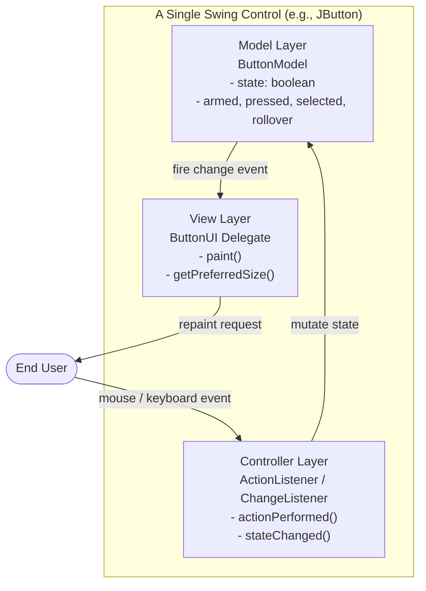
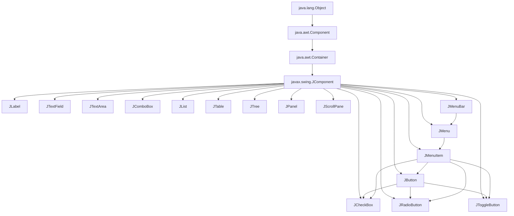
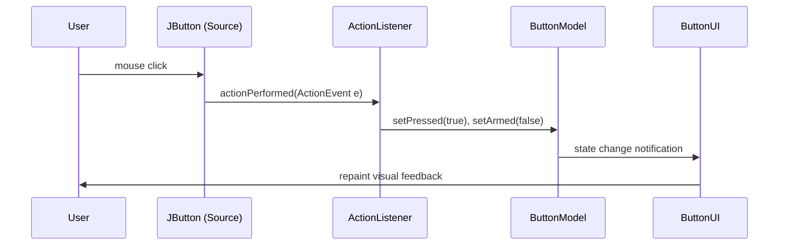
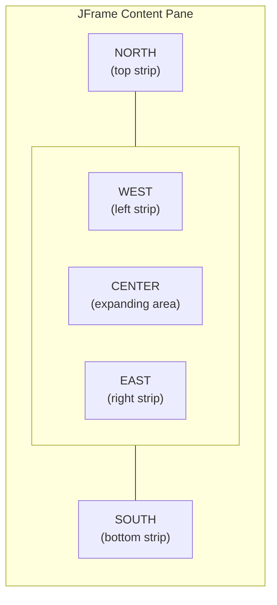

# Swing Controls

<!-- SECTION_1_START -->
# Swing Controls — Core Technical Definition & Intuitive Overview

> [!NOTE]
> **Formal Definition (KTU 2024 OECST615 Module 4):**
> **Swing Controls** are the lightweight, platform-independent graphical user interface (GUI) components provided by the `javax.swing` package in Java. Built on top of the Abstract Window Toolkit (**AWT**), Swing controls are entirely written in Java (except for `Window`, `Frame`, `Dialog`, and `ComponentPeer` classes) and follow a **Model-View-Controller (MVC)** architecture, allowing pluggable look-and-feel across operating systems.

## Conceptual Analogy — The "Smart Remote Control" View

Imagine a television remote control:
- The **plastic buttons** on the remote are the *visual* part (the **View** in MVC).
- The internal **circuitry and memory** that remembers volume/channel is the *data* part (the **Model**).
- The **microchip** that wires each button press to the correct circuit is the *logic* part (the **Controller**).

A Swing control works the same way. A `JButton` is not just a clickable rectangle — it is a smart component that *separates* what it looks like (rendered via the `ButtonUI` delegate), what state it holds (the `ButtonModel`), and how it reacts to clicks (the `ActionListener` controller). This is why you can change the *theme* of all Swing buttons in an app at once — you are swapping the **View delegate**, while the data and logic remain untouched.

> [!IMPORTANT]
> **Key Distinction from AWT (KTU Board Favourite):**
> - AWT components are **heavyweight** (rely on OS peers) — e.g., `java.awt.Button`.
> - Swing components are **lightweight** (pure Java, drawn on canvases) — e.g., `javax.swing.JButton`.
> - Every AWT component has a Swing counterpart prefixed with the letter **'J'**.

## The Swing Class Hierarchy

```
java.lang.Object
   └── java.awt.Component
         └── java.awt.Container
               └── javax.swing.JComponent
                     ├── JLabel, JButton, JTextField, JTextArea
                     ├── JCheckBox, JRadioButton, JToggleButton
                     ├── JComboBox, JList, JSpinner
                     ├── JTable, JTree, JTabbedPane
                     ├── JPanel, JScrollPane, JTabbedPane
                     └── JMenuBar, JMenu, JMenuItem
```

> [!TIP]
> **Why is `JComponent` so important?**
> `JComponent` is the abstract base class for **all** Swing controls. It introduces features that AWT lacks:
> - Pluggable Look and Feel (`UIManager.setLookAndFeel(...)`)
> - Tooltips (`setToolTipText(...)`)
> - Borders (`BorderFactory.createLineBorder(...)`)
> - Double-buffering for flicker-free painting
> - Keyboard mnemonics and action maps

> [!VISUALIZATION CONTROL]
> **Concept:** Swing component rendering pipeline (MVC flow)
> **Logical View:**
> - User clicks a `JButton` → Controller (`ActionListener.actionPerformed`) fires
> - Controller updates Model (`ButtonModel.setSelected/Pressed`)
> - View (`ButtonUI.paint`) repaints using new Model state
> **Visual Description:** Picture a triangle with three labelled nodes: **Model** at the bottom-left, **View** at the top, **Controller** at the bottom-right. Arrows form a closed loop showing data state changes and repaint notifications.

## Top-Level Containers vs. Lightweight Controls

| Category | Classes | Purpose |
|----------|---------|---------|
| **Top-Level Containers** | `JFrame`, `JApplet`, `JDialog`, `JWindow` | Serve as the root window of an application; heavyweight |
| **Intermediate Containers** | `JPanel`, `JScrollPane`, `JSplitPane`, `JTabbedPane`, `JToolBar` | Group and organise other controls |
| **Atomic Controls** | `JLabel`, `JButton`, `JTextField`, `JCheckBox`, `JRadioButton`, `JComboBox`, `JList`, `JSlider`, `JProgressBar` | The interactive visual widgets |

> [!NOTE]
> **Syllabus Highlight (KTU 2024 OECST615):**
> The Module 4 syllabus explicitly covers: *JLabel, JButton, JTextField, JTextArea, JCheckBox, JRadioButton, JComboBox, JList, JTable, JTree, JMenu, Layout Managers (FlowLayout, BorderLayout, GridLayout, BoxLayout, GridBagLayout), and Event Handling fundamentals.*

## Physical Constants & Standard Metrics

- **Default Swing font:** `Font.SANS_SERIF`, size **12 pt**.
- **Default frame size hint:** `400 × 300` pixels (used commonly in board examples).
- **Color depth:** Swing honours the underlying OS color depth; supports 32-bit ARGB via `java.awt.Color`.
- **Frame title standard:** `setTitle(String)` — non-null, non-empty string is required for `JFrame`.
- **Event Dispatch Thread (EDT):** All Swing component creation **must** occur on the EDT for thread-safety, using `SwingUtilities.invokeLater(Runnable)`.
<!-- SECTION_1_END -->

<!-- SECTION_2_START -->
# Deep Theoretical Analysis & KTU High-Yield Formula Sheet

## The 5 Pillars of a Swing Control

Every Swing control can be understood via five structural attributes:

1. **Class Identity** — e.g., `JButton extends AbstractButton extends JComponent`.
2. **Data Model** — e.g., `ButtonModel` (selected, pressed, armed, rollover).
3. **UI Delegate** — e.g., `ButtonUI` (controls the look-and-feel rendering).
4. **Listeners** — Observer pattern objects (`ActionListener`, `ChangeListener`, `ItemListener`).
5. **Layout Constraint** — How the parent container's `LayoutManager` positions it.

## Atomic Control Cheat Sheet

| Control | Key Constructors | Key Methods | Default Model |
|---------|------------------|-------------|---------------|
| `JLabel` | `JLabel()`, `JLabel(String)`, `JLabel(Icon)`, `JLabel(String, int)` | `setText`, `setIcon`, `setHorizontalAlignment`, `setLabelFor` | None (passive) |
| `JButton` | `JButton()`, `JButton(String)`, `JButton(Icon)`, `JButton(String, Icon)` | `setEnabled`, `setMnemonic`, `addActionListener`, `doClick` | `DefaultButtonModel` |
| `JTextField` | `JTextField()`, `JTextField(int cols)`, `JTextField(String)`, `JTextField(String, int)` | `setText`, `getText`, `setEditable`, `addActionListener` | `PlainDocument` |
| `JTextArea` | `JTextArea()`, `JTextArea(int r, int c)`, `JTextArea(String)` | `append`, `setLineWrap`, `setWrapStyleWord`, `setRows`, `setColumns` | `PlainDocument` |
| `JCheckBox` | `JCheckBox()`, `JCheckBox(String)`, `JCheckBox(String, boolean)` | `setSelected`, `isSelected`, `addItemListener` | `ToggleButtonModel` |
| `JRadioButton` | Same as `JCheckBox` | Same as `JCheckBox` + must be grouped via `ButtonGroup` | `ToggleButtonModel` |
| `JComboBox<E>` | `JComboBox()`, `JComboBox(E[] items)`, `JComboBox(Vector items)` | `setSelectedItem`, `getSelectedItem`, `addItemListener`, `setEditable` | `MutableComboBoxModel` |
| `JList<E>` | `JList()`, `JList(E[] items)`, `JList(ListModel)` | `setSelectedIndex`, `getSelectedValue`, `setSelectionMode`, `addListSelectionListener` | `DefaultListModel` |
| `JTable` | `JTable()`, `JTable(int r, int c)`, `JTable(Object[][] d, Object[] cols)` | `setValueAt`, `getValueAt`, `setAutoCreateRowSorter` | `DefaultTableModel` |
| `JTree` | `JTree()`, `JTree(Object[])`, `JTree(TreeNode)` | `expandPath`, `addTreeSelectionListener`, `setShowsRootHandles` | `DefaultTreeModel` |
| `JMenuItem` | `JMenuItem(String)`, `JMenuItem(Icon)` | `setAccelerator`, `setMnemonic`, `addActionListener` | `DefaultButtonModel` |
| `JMenuBar` | `JMenuBar()` | `add(JMenu)`, used via `JFrame.setJMenuBar(...)` | — |

## Layout Manager Formula Sheet

| Layout | Constructor | Placement Rule | Best Use Case |
|--------|-------------|----------------|---------------|
| `FlowLayout` | `FlowLayout()`, `FlowLayout(int align, int hgap, int vgap)` | Left-to-right, wraps at the boundary | Toolbars, button rows |
| `BorderLayout` | `BorderLayout()`, `BorderLayout(int hgap, int vgap)` | 5 regions: `NORTH`, `SOUTH`, `EAST`, `WEST`, `CENTER` | Top-level frames (default for `JFrame`'s content pane) |
| `GridLayout` | `GridLayout(int rows, int cols)`, `GridLayout(int r, int c, int h, int v)` | Equal-sized rectangular grid | Calculator-style UIs |
| `BoxLayout` | `BoxLayout(Container target, int axis)` (`X_AXIS` or `Y_AXIS`) | Linear stacking, supports glue and rigid areas | Vertical forms |
| `GridBagLayout` | `GridBagLayout()` + `GridBagConstraints` | Most flexible; cell can span rows/cols and resize by weight | Professional IDE-style UIs |

> [!IMPORTANT]
> **Remember:** `JFrame` uses `BorderLayout` as the **default layout manager** for its content pane. If you add a component without specifying a region, it fills the **CENTER**. This is a frequent source of "I added 5 components but only see one!" bugs.

## Event Handling Theory — The 3-Step Listener Pattern

$$
\text{Event Source} \xrightarrow{\text{register}} \text{Listener Object} \xrightarrow{\text{callback}} \text{Event Handler}
$$

1. **Implement** a listener interface (e.g., `implements ActionListener`).
2. **Register** the listener on the source: `button.addActionListener(this);`
3. **Override** the callback method: `public void actionPerformed(ActionEvent e) { ... }`

## Common Event Listener Interfaces (Killer Table for KTU)

| Listener Interface | Method to Override | Source Components |
|--------------------|-------------------|-------------------|
| `ActionListener` | `actionPerformed(ActionEvent)` | `JButton`, `JTextField`, `JMenuItem` |
| `ItemListener` | `itemStateChanged(ItemEvent)` | `JCheckBox`, `JRadioButton`, `JComboBox` |
| `ChangeListener` | `stateChanged(ChangeEvent)` | `JSlider`, `JSpinner`, `JProgressBar` |
| `ListSelectionListener` | `valueChanged(ListSelectionEvent)` | `JList`, `JTable` row selection |
| `KeyListener` | `keyPressed/keyReleased/keyTyped(KeyEvent)` | Any focusable component |
| `MouseListener` | `mouseClicked/Pressed/Released/Entered/Exited(MouseEvent)` | Any component |
| `WindowListener` | 7 methods incl. `windowClosing(WindowEvent)` | `JFrame`, `JDialog` |

## Real-World Engineering Utility

- **Desktop IDEs** (e.g., older versions of NetBeans, IntelliJ) used Swing controls extensively.
- **Banking portals**, **POS systems**, and **airline reservation GUIs** rely on `JTable` for tabular data display.
- **Scientific instrument dashboards** use Swing's `JFreeChart` integration for real-time plotting.
- **Android's pre-Material era** JavaFX/Swing patterns influenced `View` and `OnClickListener` designs in mobile UI frameworks.
- The **Event Dispatch Thread (EDT)** concept directly evolved into the **UI Thread** in Android and the **Main Thread** in SwiftUI.
<!-- SECTION_2_END -->

<!-- SECTION_3_START -->
# Step-by-Step Implementations & Symbolic Derivations

## Program 1 — JButton + JLabel + ActionListener (Full Build)

**Problem:** Build a frame with a `JTextField`, a `JButton` labelled "Greet", and a `JLabel` that displays "Hello, \<name\>!" when the button is clicked.

```java
import javax.swing.*;
import java.awt.*;
import java.awt.event.*;

public class GreetApp extends JFrame implements ActionListener {
    private final JTextField nameField;
    private final JLabel outputLabel;
    private final JButton greetButton;

    public GreetApp() {
        setTitle("Greet Application");
        setSize(400, 200);
        setDefaultCloseOperation(JFrame.EXIT_ON_CLOSE);
        setLayout(new FlowLayout(FlowLayout.CENTER, 10, 20));

        nameField = new JTextField(15);
        greetButton = new JButton("Greet");
        outputLabel = new JLabel("Enter your name and click Greet.");

        // 1) Create the listener source objects
        // 2) Register listeners
        greetButton.addActionListener(this);
        nameField.addActionListener(this); // pressing Enter in field also fires

        // 3) Add components to the frame's content pane
        add(new JLabel("Name:"));
        add(nameField);
        add(greetButton);
        add(outputLabel);

        setLocationRelativeTo(null); // center on screen
        setVisible(true);
    }

    @Override
    public void actionPerformed(ActionEvent e) {
        // Source identification is good defensive practice
        Object src = e.getSource();
        String name = nameField.getText().trim();

        if (src == greetButton) {
            if (name.isEmpty()) {
                outputLabel.setText("Please enter a valid name.");
            } else {
                outputLabel.setText("Hello, " + name + "!");
            }
        } else if (src == nameField) {
            greetButton.doClick(); // programmatically fire the button
        }
    }

    public static void main(String[] args) {
        // EDT-safety rule from KTU module 4
        SwingUtilities.invokeLater(GreetApp::new);
    }
}
```

**Step-by-Step Logic Walkthrough:**

| Step | Line | Explanation |
|------|------|-------------|
| 1 | `extends JFrame` | The class itself is the top-level window — saves a separate window object. |
| 2 | `implements ActionListener` | The frame *is* the listener, avoiding a separate inner class. |
| 3 | `setLayout(new FlowLayout(...))` | Replaces the default `BorderLayout` to allow horizontal wrap. |
| 4 | `addActionListener(this)` | Registers the frame as the listener for both button and field. |
| 5 | `e.getSource()` | Distinguishes whether the button or the field triggered the event. |
| 6 | `greetButton.doClick()` | Programmatically simulates a button press — a Swing-only feature not in AWT. |
| 7 | `SwingUtilities.invokeLater(...)` | Guarantees GUI creation on the **EDT** for thread-safety. |

## Program 2 — JCheckBox + JRadioButton + ButtonGroup

**Problem:** Create a feedback form with skills checkboxes and a "Gender" radio-button group. Display selections on a button click.

```java
import javax.swing.*;
import java.awt.*;
import java.awt.event.*;

public class FeedbackForm extends JFrame implements ActionListener {
    private final JCheckBox javaBox, pythonBox, dbBox;
    private final JRadioButton maleBtn, femaleBtn, otherBtn;
    private final JButton submitBtn;
    private final JTextArea resultArea;

    public FeedbackForm() {
        setTitle("Student Feedback Form");
        setSize(450, 400);
        setDefaultCloseOperation(JFrame.EXIT_ON_CLOSE);
        setLayout(new BorderLayout(10, 10));

        // ----- North panel: skills checkboxes -----
        JPanel skillPanel = new JPanel(new FlowLayout(FlowLayout.LEFT));
        skillPanel.setBorder(BorderFactory.createTitledBorder("Skills Known"));
        javaBox  = new JCheckBox("Java");
        pythonBox = new JCheckBox("Python");
        dbBox    = new JCheckBox("Database");
        skillPanel.add(javaBox);
        skillPanel.add(pythonBox);
        skillPanel.add(dbBox);

        // ----- West panel: gender radios -----
        JPanel genderPanel = new JPanel(new GridLayout(3, 1, 5, 5));
        genderPanel.setBorder(BorderFactory.createTitledBorder("Gender"));
        maleBtn   = new JRadioButton("Male");
        femaleBtn = new JRadioButton("Female");
        otherBtn  = new JRadioButton("Other");

        ButtonGroup genderGroup = new ButtonGroup();
        genderGroup.add(maleBtn);
        genderGroup.add(femaleBtn);
        genderGroup.add(otherBtn);

        genderPanel.add(maleBtn);
        genderPanel.add(femaleBtn);
        genderPanel.add(otherBtn);

        // ----- South: result textarea inside a scroll pane -----
        resultArea = new JTextArea(8, 30);
        resultArea.setEditable(false);
        JScrollPane scrollPane = new JScrollPane(resultArea);

        // ----- East: submit button -----
        submitBtn = new JButton("Submit");
        submitBtn.addActionListener(this);

        // ----- Assemble into BorderLayout regions -----
        add(skillPanel,  BorderLayout.NORTH);
        add(genderPanel, BorderLayout.WEST);
        add(scrollPane,  BorderLayout.CENTER);
        add(submitBtn,   BorderLayout.EAST);

        setLocationRelativeTo(null);
        setVisible(true);
    }

    @Override
    public void actionPerformed(ActionEvent e) {
        StringBuilder sb = new StringBuilder("=== Selected Skills ===\n");
        if (javaBox.isSelected())   sb.append("- Java\n");
        if (pythonBox.isSelected()) sb.append("- Python\n");
        if (dbBox.isSelected())     sb.append("- Database\n");

        sb.append("=== Gender ===\n");
        if (maleBtn.isSelected())        sb.append("Male\n");
        else if (femaleBtn.isSelected()) sb.append("Female\n");
        else if (otherBtn.isSelected())  sb.append("Other\n");
        else                             sb.append("Not specified\n");

        resultArea.setText(sb.toString());
    }

    public static void main(String[] args) {
        SwingUtilities.invokeLater(FeedbackForm::new);
    }
}
```

**Key Derivations — Why `ButtonGroup` is Required:**

Without a `ButtonGroup`, multiple `JRadioButton`s can be selected simultaneously, defeating their purpose. The group enforces **mutual exclusion** at the *model* layer, not the *view* layer. Note that `ButtonGroup` is **not a visual container** — it is a logical grouping. You still need a `JPanel` (or any container) to render the buttons.

**Layout Constraint Matrix Used:**

$$
\begin{aligned}
\text{skillPanel}  &\mapsto \text{BorderLayout.NORTH} \\
\text{genderPanel} &\mapsto \text{BorderLayout.WEST}  \\
\text{scrollPane}  &\mapsto \text{BorderLayout.CENTER} \\
\text{submitBtn}   &\mapsto \text{BorderLayout.EAST}
\end{aligned}
$$

## Program 3 — JComboBox, JList, JTable (Data-Driven Controls)

```java
import javax.swing.*;
import javax.swing.table.DefaultTableModel;
import java.awt.*;

public class DataControlsDemo extends JFrame {

    public DataControlsDemo() {
        setTitle("Data-Driven Swing Controls");
        setSize(600, 450);
        setDefaultCloseOperation(JFrame.EXIT_ON_CLOSE);
        setLayout(new GridLayout(4, 1, 5, 5));

        // -------- JComboBox : country selection --------
        String[] countries = {"India", "USA", "UK", "Japan", "Germany"};
        JComboBox<String> countryBox = new JComboBox<>(countries);
        countryBox.setEditable(true);
        countryBox.setSelectedIndex(0);
        add(new JLabel("Country (JComboBox):"));
        add(countryBox);

        // -------- JList : language multi-selection --------
        String[] languages = {"Java", "Python", "C++", "JavaScript", "Go", "Rust"};
        JList<String> langList = new JList<>(languages);
        langList.setSelectionMode(ListSelectionModel.MULTIPLE_INTERVAL_SELECTION);
        langList.setVisibleRowCount(4);
        add(new JLabel("Languages (JList, multi-select):"));
        add(new JScrollPane(langList));

        // -------- JTable : tabular data --------
        Object[][] data = {
            {"1", "Alice",   "CSE",   "9.1"},
            {"2", "Bob",     "ECE",   "8.4"},
            {"3", "Charlie", "Mech",  "7.8"},
            {"4", "Diana",   "Civil", "8.9"}
        };
        String[] columns = {"Roll No", "Name", "Branch", "CGPA"};
        JTable table = new JTable(new DefaultTableModel(data, columns));
        table.setAutoCreateRowSorter(true); // click column header to sort
        add(new JScrollPane(table));

        setLocationRelativeTo(null);
        setVisible(true);
    }

    public static void main(String[] args) {
        SwingUtilities.invokeLater(DataControlsDemo::new);
    }
}
```

**Step-by-Step Decision Logic:**

| Decision | Justification |
|----------|---------------|
| Use `DefaultTableModel` | Easiest mutable table model; allows runtime add/remove rows. |
| Wrap `JList` and `JTable` in `JScrollPane` | They are viewport-based; without a scroll pane, only the visible rows show. |
| `setAutoCreateRowSorter(true)` | Provides click-to-sort without writing custom `RowSorter` code. |
| `setEditable(true)` on `JComboBox` | Allows users to type a new value not in the list. |

## Program 4 — BoxLayout with Glue and Rigid Areas (Precise Spacing)

```java
import javax.swing.*;
import java.awt.*;

public class BoxLayoutDemo extends JFrame {

    public BoxLayoutDemo() {
        setTitle("BoxLayout - Vertical Form");
        setSize(350, 250);
        setDefaultCloseOperation(JFrame.EXIT_ON_CLOSE);

        JPanel form = new JPanel();
        form.setLayout(new BoxLayout(form, BoxLayout.Y_AXIS));

        form.add(new JLabel("Username:"));
        form.add(new JTextField(15));
        form.add(Box.createVerticalStrut(10));    // fixed 10px gap
        form.add(new JLabel("Password:"));
        form.add(new JPasswordField(15));
        form.add(Box.createVerticalGlue());       // pushes button to bottom
        form.add(new JButton("Login"));

        add(form);
        setLocationRelativeTo(null);
        setVisible(true);
    }

    public static void main(String[] args) {
        SwingUtilities.invokeLater(BoxLayoutDemo::new);
    }
}
```

**Spacing Primitives (Cheat Sheet):**

| Method | Behaviour |
|--------|-----------|
| `Box.createHorizontalGlue()` | Expands horizontally to fill free space |
| `Box.createVerticalGlue()` | Expands vertically to fill free space |
| `Box.createHorizontalStrut(n)` | Fixed **n**-pixel horizontal gap |
| `Box.createVerticalStrut(n)` | Fixed **n**-pixel vertical gap |
| `Box.createRigidArea(new Dimension(w, h))` | Fixed-size invisible filler |

## Program 5 — JMenu, JMenuItem, JMenuBar (Menus)

```java
import javax.swing.*;
import java.awt.event.*;

public class MenuDemo extends JFrame implements ActionListener {

    public MenuDemo() {
        setTitle("Menu Demo");
        setSize(500, 300);
        setDefaultCloseOperation(JFrame.EXIT_ON_CLOSE);

        JMenuBar menuBar = new JMenuBar();

        JMenu fileMenu = new JMenu("File");
        JMenuItem newItem  = new JMenuItem("New");
        JMenuItem openItem = new JMenuItem("Open");
        JMenuItem saveItem = new JMenuItem("Save");
        JMenuItem exitItem = new JMenuItem("Exit");

        newItem.setAccelerator(KeyStroke.getKeyStroke("ctrl N"));
        saveItem.setAccelerator(KeyStroke.getKeyStroke("ctrl S"));
        exitItem.setAccelerator(KeyStroke.getKeyStroke("ctrl Q"));

        newItem.addActionListener(this);
        openItem.addActionListener(this);
        saveItem.addActionListener(this);
        exitItem.addActionListener(this);

        fileMenu.add(newItem);
        fileMenu.add(openItem);
        fileMenu.add(saveItem);
        fileMenu.addSeparator();
        fileMenu.add(exitItem);

        JMenu editMenu = new JMenu("Edit");
        editMenu.add(new JMenuItem("Cut"));
        editMenu.add(new JMenuItem("Copy"));
        editMenu.add(new JMenuItem("Paste"));

        menuBar.add(fileMenu);
        menuBar.add(editMenu);

        setJMenuBar(menuBar);
        setLocationRelativeTo(null);
        setVisible(true);
    }

    @Override
    public void actionPerformed(ActionEvent e) {
        String cmd = e.getActionCommand();
        if (cmd.equals("Exit")) {
            dispose();
        } else {
            JOptionPane.showMessageDialog(this, "You clicked: " + cmd);
        }
    }

    public static void main(String[] args) {
        SwingUtilities.invokeLater(MenuDemo::new);
    }
}
```

**Key Insight — ActionCommand vs getSource:**
The line `String cmd = e.getActionCommand();` returns the menu item's label text, which is cleaner than comparing object references. This is a KTU-recommended idiom for menus with many items.
<!-- SECTION_3_END -->

<!-- SECTION_4_START -->
# Structural Diagrams & Schematics

## Diagram 1 — Swing MVC Architecture (Per-Component)



## Diagram 2 — Swing Class Inheritance Hierarchy



## Diagram 3 — Event Handling Flow (Observer Pattern)



## Diagram 4 — Layout Manager Decision Tree

```mermaid
flowchart TD
    Start([Choose a LayoutManager]) --> Q1{Need absolute positioning?}
    Q1 -- Yes --> AbsLayout[setLayout(null) + setBounds]
    Q1 -- No --> Q2{Linear arrangement?}
    Q2 -- Yes, horizontal --> FlowLayout
    Q2 -- Yes, vertical --> BoxLayoutY["BoxLayout (Y_AXIS)"]
    Q2 -- No --> Q3{Frame-style with 5 regions?}
    Q3 -- Yes --> BorderLayout
    Q3 -- No --> Q4{Equal cells grid?}
    Q4 -- Yes --> GridLayout
    Q4 -- No, complex --> GridBagLayout
```

## Diagram 5 — BorderLayout Region Allocation



> [!NOTE]
> **Visual Reading Rule:** `CENTER` consumes any leftover space after `NORTH`, `SOUTH`, `EAST`, and `WEST` are allocated. If you place a component without specifying a region, it **defaults to CENTER**, which is why a frame with 5 un-specified components shows only the last one added.
<!-- SECTION_4_END -->

<!-- SECTION_5_START -->
# KTU 2024 Scheme Examination Question Bank & Topic Recap

## Part A — Short Answer Questions (3 Marks Each)

> [!NOTE]
> **Mark Distribution:** 2 marks for the definition/concept, 1 mark for a clear example or diagram.

### Question A1 [KTU University Exam — July 2024]
**Differentiate between AWT and Swing. List any four advantages of Swing over AWT.** [CO3, Understand]

**Model Answer (3 Marks):**

| Aspect | AWT | Swing |
|--------|-----|-------|
| Package | `java.awt` | `javax.swing` |
| Component type | Heavyweight (OS peers) | Lightweight (pure Java) |
| Look & feel | Fixed by OS | Pluggable (`UIManager`) |
| MVC support | No | Yes (Model-View-Controller) |
| Prefix on classes | None | `J` prefix (`JButton`, `JLabel`) |
| Double buffering | Not built-in | Automatic, flicker-free |

**Four Advantages of Swing:**
1. **Platform-independent look and feel** — the same button looks the same on Windows, macOS, and Linux.
2. **Lightweight components** — do not consume native OS resources, allowing complex GUIs.
3. **Pluggable Look and Feel (PLAF)** — themes can be changed at runtime via `UIManager.setLookAndFeel(...)`.
4. **Rich component set** — includes advanced controls like `JTable`, `JTree`, `JTabbedPane` that AWT lacks.
5. **Built-in double-buffering** — eliminates flickering during repaints.

*[Award 2 marks for the table, 1 mark for correctly listing 4 advantages.]*

---

### Question A2 [KTU University Exam — Dec 2023]
**Explain the role of the `LayoutManager` interface. List any three layout managers provided by Java Swing with their default alignment rules.** [CO3, Remember]

**Model Answer (3 Marks):**

The `LayoutManager` interface defines the contract for arranging child components within a container. When a container is resized or components are added, the layout manager calculates the size and position of each child, removing the burden of manual pixel-based positioning from the developer.

**Three Layout Managers:**

1. **`FlowLayout`** — Arranges components in a row, left-to-right, wrapping to the next line at the boundary. Default alignment: `CENTER`.
2. **`BorderLayout`** — Divides the container into five regions (`NORTH`, `SOUTH`, `EAST`, `WEST`, `CENTER`). Default for `JFrame`'s content pane.
3. **`GridLayout`** — Divides the container into a grid of equal-sized cells (rows × columns). All cells are forced to the same size.

*[1 mark for the role of LayoutManager, 1 mark for naming three managers, 1 mark for stating their default rules.]*

---

## Part B — Long Answer Questions (14 Marks Each, with Internal Choice)

> [!IMPORTANT]
> **KTU ESE Rule:** Each Part B question carries 14 marks split into sub-parts (a) 7 marks and (b) 7 marks. Internal choice is mandatory — students answer **either** Question A **or** Question B in full.

---

### Question B-A [14 Marks] [KTU University Exam — July 2024]

**(a)** Explain the Swing class hierarchy starting from `java.lang.Object` to specific controls like `JButton` and `JLabel`. Briefly describe the significance of `JComponent`. [7 Marks, CO3, Understand]

**(b)** Write a complete Java Swing program to create a `JFrame` containing a `JTextField`, a `JButton` labelled "Convert", and a `JLabel`. When the user types a temperature in Celsius and clicks the button, the label should display the equivalent Fahrenheit value using the formula $F = \left(\frac{9}{5}\right) \cdot C + 32$. Handle invalid input gracefully. [7 Marks, CO4, Apply]

---

**Model Solution (a) — 7 Marks:**

The Swing class hierarchy proceeds as follows:

```
java.lang.Object
  └── java.awt.Component
        └── java.awt.Container
              └── javax.swing.JComponent  (abstract)
                    ├── JLabel
                    ├── JButton
                    │     └── JToggleButton
                    │           ├── JCheckBox
                    │           └── JRadioButton (typically)
                    ├── JTextComponent (abstract)
                    │     ├── JTextField
                    │     └── JTextArea
                    ├── JComboBox
                    ├── JList
                    ├── JTable
                    ├── JTree
                    ├── JPanel
                    ├── JScrollPane
                    └── JMenuItem
                          ├── JMenu
                          └── JCheckBoxMenuItem / JRadioButtonMenuItem
```

**Significance of `JComponent`** (4 key points):
1. It is the **common ancestor** of all Swing controls (except the top-level containers).
2. It provides **pluggable look-and-feel** support via `updateUI()`.
3. It supports **tooltips** (`setToolTipText`), **borders** (`setBorder`), and **double-buffering** by default.
4. It implements the `Serializable` interface, making Swing components serializable.
5. It provides the **action map / input map** architecture for keyboard bindings.

*[1 mark for hierarchy diagram, 3 marks for 4–5 key points about JComponent, 3 marks for explaining the parent class relationships.]*

---

**Model Solution (b) — 7 Marks:**

```java
import javax.swing.*;
import java.awt.*;
import java.awt.event.*;

public class CelsiusToFahrenheit extends JFrame implements ActionListener {
    private final JTextField celsiusField;
    private final JLabel resultLabel;

    public CelsiusToFahrenheit() {
        setTitle("Celsius → Fahrenheit Converter");
        setSize(420, 180);
        setDefaultCloseOperation(JFrame.EXIT_ON_CLOSE);
        setLayout(new FlowLayout(FlowLayout.CENTER, 10, 20));

        celsiusField = new JTextField(10);
        JButton convertBtn = new JButton("Convert");
        resultLabel = new JLabel("Result will appear here.");

        convertBtn.addActionListener(this);

        add(new JLabel("Celsius:"));
        add(celsiusField);
        add(convertBtn);
        add(resultLabel);

        setLocationRelativeTo(null);
        setVisible(true);
    }

    @Override
    public void actionPerformed(ActionEvent e) {
        String input = celsiusField.getText().trim();
        try {
            double celsius = Double.parseDouble(input);
            double fahrenheit = (9.0 / 5.0) * celsius + 32;
            resultLabel.setText(String.format("%.2f °C = %.2f °F", celsius, fahrenheit));
        } catch (NumberFormatException ex) {
            resultLabel.setText("Invalid input. Please enter a number.");
            JOptionPane.showMessageDialog(this,
                "Please enter a valid numeric temperature.",
                "Input Error",
                JOptionPane.ERROR_MESSAGE);
        }
    }

    public static void main(String[] args) {
        SwingUtilities.invokeLater(CelsiusToFahrenheit::new);
    }
}
```

**Valuation Key (Incremental Marks):**
- `[Setting up JFrame with correct layout and default close: 1 Mark]`
- `[Creating JTextField, JButton, JLabel and adding to frame: 1 Mark]`
- `[Registering ActionListener correctly: 1 Mark]`
- `[Parsing input and applying the formula F = (9/5)*C + 32: 2 Marks]`
- `[Displaying formatted result in JLabel: 1 Mark]`
- `[Exception handling for NumberFormatException with JOptionPane: 1 Mark]`

---

### Question B-B (Internal Choice Alternative) [14 Marks]

**(a)** Compare `FlowLayout`, `BorderLayout`, and `GridLayout` with neat diagrams. Write a Java program to demonstrate `BorderLayout` with components placed in all 5 regions. [7 Marks, CO3, Apply]

**(b)** Write a Java Swing program using `JCheckBox`, `JRadioButton` (grouped with `ButtonGroup`), and `JTextArea` to build a "Pizza Order Form" where the user can select pizza size (Small/Medium/Large), toppings (Cheese, Olives, Mushroom), and click "Order" to see the summary in the `JTextArea`. [7 Marks, CO4, Apply]

---

**Model Solution (a) — 7 Marks:**

**Comparison Table:**

| Feature | FlowLayout | BorderLayout | GridLayout |
|---------|------------|--------------|------------|
| Arrangement | Linear row, wraps | 5 named regions | Rows × Columns grid |
| Cell sizes | Preferred size | NORTH/SOUTH preferred; CENTER stretches | All equal size |
| Default alignment | `CENTER` | N/A | N/A |
| Default for | `JPanel` | `JFrame` content pane | None |
| Best use | Toolbar rows | App shells | Calculators |

**BorderLayout Demo Program:**

```java
import javax.swing.*;
import java.awt.*;

public class BorderLayoutDemo extends JFrame {
    public BorderLayoutDemo() {
        setTitle("BorderLayout Demo");
        setSize(500, 350);
        setDefaultCloseOperation(JFrame.EXIT_ON_CLOSE);
        // BorderLayout is default for JFrame, but we set explicitly with gaps
        setLayout(new BorderLayout(10, 10));

        add(new JButton("NORTH (Header)"),       BorderLayout.NORTH);
        add(new JButton("SOUTH (Footer)"),       BorderLayout.SOUTH);
        add(new JButton("WEST (Nav)"),           BorderLayout.WEST);
        add(new JButton("EAST (Sidebar)"),       BorderLayout.EAST);
        add(new JTextArea("CENTER (Main Content)"), BorderLayout.CENTER);

        setLocationRelativeTo(null);
        setVisible(true);
    }

    public static void main(String[] args) {
        SwingUtilities.invokeLater(BorderLayoutDemo::new);
    }
}
```

*[2 marks for comparison table, 1 mark for correct BorderLayout constructor, 2 marks for placing components in all 5 regions, 2 marks for proper JFrame setup and compilation-ready code.]*

---

**Model Solution (b) — 7 Marks:**

```java
import javax.swing.*;
import java.awt.*;
import java.awt.event.*;

public class PizzaOrderForm extends JFrame implements ActionListener {
    private final JRadioButton smallBtn, mediumBtn, largeBtn;
    private final JCheckBox cheeseBox, olivesBox, mushroomBox;
    private final JTextArea summaryArea;

    public PizzaOrderForm() {
        setTitle("Pizza Order Form");
        setSize(500, 450);
        setDefaultCloseOperation(JFrame.EXIT_ON_CLOSE);
        setLayout(new BorderLayout(10, 10));

        // ----- Size panel (radios grouped) -----
        JPanel sizePanel = new JPanel(new GridLayout(3, 1));
        sizePanel.setBorder(BorderFactory.createTitledBorder("Pizza Size"));
        smallBtn  = new JRadioButton("Small");
        mediumBtn = new JRadioButton("Medium");
        largeBtn  = new JRadioButton("Large");
        ButtonGroup sizeGroup = new ButtonGroup();
        sizeGroup.add(smallBtn);
        sizeGroup.add(mediumBtn);
        sizeGroup.add(largeBtn);
        sizePanel.add(smallBtn);
        sizePanel.add(mediumBtn);
        sizePanel.add(largeBtn);

        // ----- Topping panel (checkboxes) -----
        JPanel toppingPanel = new JPanel(new GridLayout(3, 1));
        toppingPanel.setBorder(BorderFactory.createTitledBorder("Toppings"));
        cheeseBox   = new JCheckBox("Cheese");
        olivesBox   = new JCheckBox("Olives");
        mushroomBox = new JCheckBox("Mushroom");
        toppingPanel.add(cheeseBox);
        toppingPanel.add(olivesBox);
        toppingPanel.add(mushroomBox);

        // ----- Order button -----
        JButton orderBtn = new JButton("Place Order");
        orderBtn.addActionListener(this);

        // ----- Summary area -----
        summaryArea = new JTextArea(8, 30);
        summaryArea.setEditable(false);
        JScrollPane scroll = new JScrollPane(summaryArea);

        // ----- Assemble -----
        JPanel leftPanel = new JPanel(new GridLayout(2, 1, 5, 5));
        leftPanel.add(sizePanel);
        leftPanel.add(toppingPanel);

        add(leftPanel,  BorderLayout.WEST);
        add(scroll,     BorderLayout.CENTER);
        add(orderBtn,   BorderLayout.SOUTH);

        setLocationRelativeTo(null);
        setVisible(true);
    }

    @Override
    public void actionPerformed(ActionEvent e) {
        StringBuilder sb = new StringBuilder("=== Your Order ===\n");

        sb.append("Size: ");
        if (smallBtn.isSelected())        sb.append("Small\n");
        else if (mediumBtn.isSelected())   sb.append("Medium\n");
        else if (largeBtn.isSelected())    sb.append("Large\n");
        else                                sb.append("Not selected\n");

        sb.append("Toppings: ");
        if (cheeseBox.isSelected())    sb.append("Cheese ");
        if (olivesBox.isSelected())    sb.append("Olives ");
        if (mushroomBox.isSelected())  sb.append("Mushroom ");
        if (!cheeseBox.isSelected() && !olivesBox.isSelected() && !mushroomBox.isSelected()) {
            sb.append("None");
        }
        sb.append("\nThank you for your order!");

        summaryArea.setText(sb.toString());
    }

    public static void main(String[] args) {
        SwingUtilities.invokeLater(PizzaOrderForm::new);
    }
}
```

**Valuation Key (b):**
- `[Correct JFrame setup with BorderLayout: 1 Mark]`
- `[RadioButtons grouped via ButtonGroup: 1 Mark]`
- `[JCheckBoxes declared and added correctly: 1 Mark]`
- `[JTextArea inside JScrollPane: 1 Mark]`
- `[actionPerformed() correctly reading all selections: 2 Marks]`
- `[Building StringBuilder summary and setting on JTextArea: 1 Mark]`

---

## ⚠ KTU Examiner's Valuation Warning / Pitfall Callout

> [!WARNING]
> **Common Mistakes That Cost Marks in KTU Board Exams:**
>
> 1. **Forgetting `setDefaultCloseOperation(JFrame.EXIT_ON_CLOSE)`** — the program will not terminate when the window is closed, leading to JVM hang. Examiners deduct **1 full mark** for this in GUI questions.
>
> 2. **Using AWT imports (`java.awt.Button`)** instead of Swing (`javax.swing.JButton`) — you will lose **2–3 marks** as the question explicitly tests Swing knowledge.
>
> 3. **Not wrapping `JList` or `JTable` in `JScrollPane`** — half the rows become invisible, and the examiner deducts **1 mark** for missing scroll support.
>
> 4. **Adding multiple components without specifying a `BorderLayout` region** — only the last component (defaulting to `CENTER`) is visible. Always write `add(comp, BorderLayout.NORTH)` etc.
>
> 5. **Creating GUI components in the `main` thread instead of using `SwingUtilities.invokeLater(...)`** — modern Swing code MUST use the EDT pattern. **0.5 to 1 mark** deduction.
>
> 6. **Forgetting to call `setVisible(true)`** — the window never appears. Worth **0.5 mark** deduction.
>
> 7. **Confusing `ActionListener` and `ItemListener`** — use `ActionListener` for `JButton` clicks, and `ItemListener` for `JCheckBox`/`JComboBox` state changes. Wrong listener = **1 mark** deduction.
>
> 8. **In radio button grouping, forgetting to actually add buttons to a `ButtonGroup`** — the buttons will appear as checkboxes visually but allow multiple selections, losing **1 mark** for "not demonstrating mutual exclusion".

---

## Topic Recap & Important Things to Remember

- **Swing = `javax.swing` package**, lightweight, MVC-based, pluggable look-and-feel.
- **Top-level containers** (`JFrame`, `JDialog`, `JApplet`, `JWindow`) are heavyweight and serve as GUI roots.
- **All atomic controls** extend `JComponent` (which extends `Container` from AWT).
- **Naming convention:** every AWT class has a `J`-prefixed Swing counterpart.
- **JLabel** is a passive display control; `setLabelFor(component)` enables **mnemonic focus transfer**.
- **JButton** fires `ActionEvent` on click; supports text, icon, mnemonic, and accelerator.
- **JTextField** is single-line; **JTextArea** is multi-line — both extend `JTextComponent`.
- **JCheckBox** and **JRadioButton** both extend `AbstractButton` and use `ToggleButtonModel`.
- **JRadioButtons** MUST be added to a **`ButtonGroup`** for mutual exclusion. `ButtonGroup` is logical, not visual.
- **JComboBox** is a drop-down selector; can be `setEditable(true)` to allow typing custom values.
- **JList** displays a scrollable list of items; supports 3 selection modes (`SINGLE`, `SINGLE_INTERVAL`, `MULTIPLE_INTERVAL`).
- **JTable** requires a `TableModel`; the easiest is `DefaultTableModel` for read/write tabular data.
- **JTree** displays hierarchical data; the model is `TreeModel` (commonly `DefaultTreeModel`).
- **JMenu** / **JMenuItem** / **JMenuBar** form the menu hierarchy; attached via `setJMenuBar(...)` on `JFrame`.
- **Event Handling** uses the **delegation event model**: source → listener interface → handler method.
- **Common listeners:** `ActionListener`, `ItemListener`, `ChangeListener`, `KeyListener`, `MouseListener`, `WindowListener`, `ListSelectionListener`.
- **Layout Managers:** `FlowLayout` (row, wraps), `BorderLayout` (5 regions, default for `JFrame`), `GridLayout` (equal grid), `BoxLayout` (linear with glue/strut), `GridBagLayout` (most flexible).
- **`BorderLayout` regions:** `NORTH`, `SOUTH`, `EAST`, `WEST`, `CENTER`. **CENTER** consumes leftover space.
- **BoxLayout spacing:** `createVerticalGlue()` (expanding), `createVerticalStrut(n)` (fixed n pixels), `createRigidArea(Dimension)`.
- **EDT rule:** Always wrap GUI creation in `SwingUtilities.invokeLater(Runnable)` for thread-safety.
- **`setDefaultCloseOperation(JFrame.EXIT_ON_CLOSE)`** is mandatory for terminal GUI programs.
- **Action command idiom:** Use `e.getActionCommand()` instead of `e.getSource()` when many similar menu items exist.
- **Look-and-Feel** can be changed globally via `UIManager.setLookAndFeel(...)`; call `SwingUtilities.updateComponentTreeUI(...)` to apply.
- **Swing components are serializable** (they implement `Serializable` via `JComponent`).
- **Double buffering** is automatic in Swing — eliminates the flickering seen in AWT repaints.
- **Container hierarchy** in a typical Swing app: `JFrame` → content pane (default `BorderLayout`) → `JPanel` (intermediate container) → atomic controls.
- **Tooltips** are set via `component.setToolTipText(String)`; AWT does not support this.
- **Borders** are added via `component.setBorder(BorderFactory.createTitledBorder(...))` — useful for visually grouping form sections.
- **Default JFrame content pane layout:** `BorderLayout` with **0-pixel** horizontal and vertical gaps.
- **Default JPanel layout:** `FlowLayout` with `CENTER` alignment and **5-pixel** gaps.
- **`pack()`** method on `JFrame` sizes the window to fit the preferred size of its components — preferred over hardcoded `setSize` for portable GUIs.
- **`setLocationRelativeTo(null)`** centers the window on the screen.
<!-- SECTION_5_END -->
