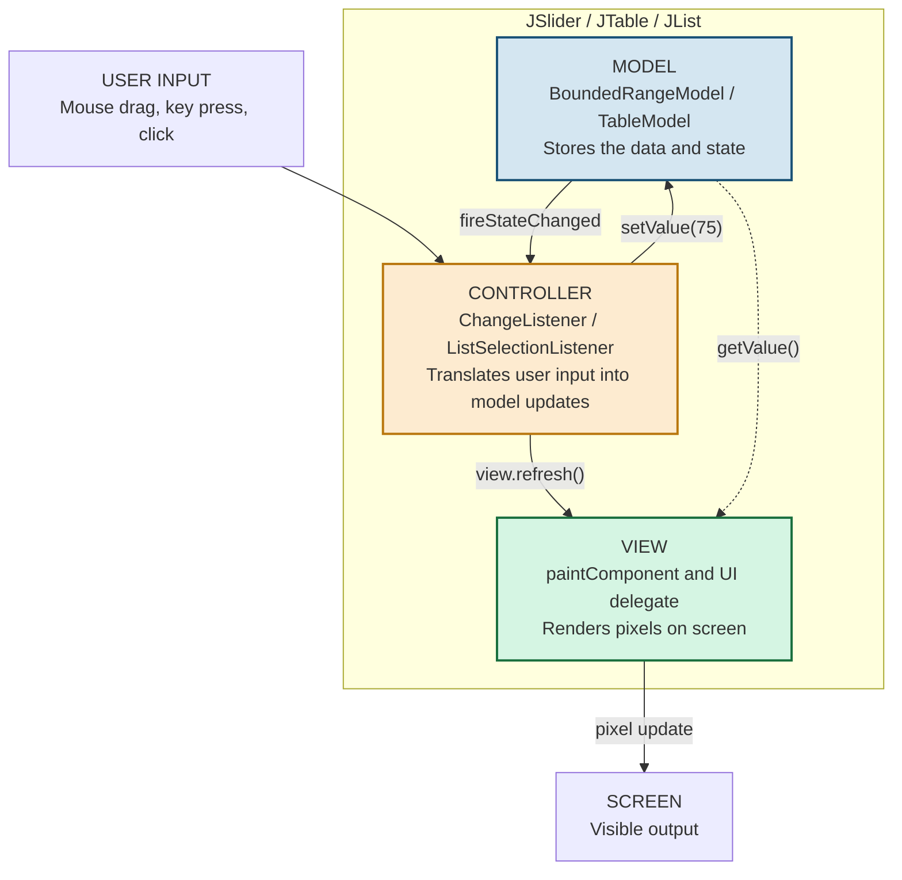
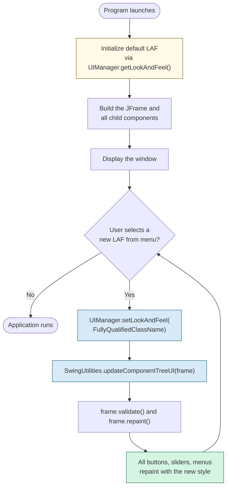
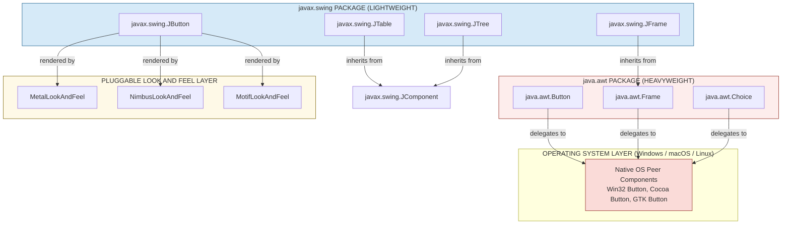
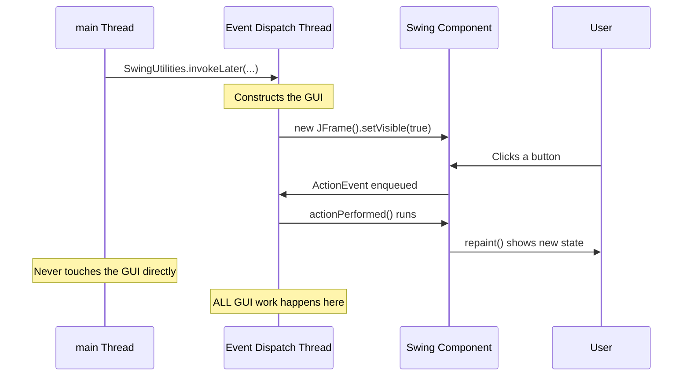

# Swing Key Features

<!-- SECTION_1_START -->
# Core Technical Definition & Intuitive Overview

## Formal Definition (KTU 2024 Syllabus Aligned)

**Swing** is a lightweight, Java-based GUI (Graphical User Interface) toolkit that is part of the **Java Foundation Classes (JFC)**. It is built on top of the **Abstract Window Toolkit (AWT)** and provides a rich set of GUI components (`javax.swing` package) that are rendered entirely in **pure Java** without relying on the underlying operating system's native peer components.

> [!IMPORTANT]
> **Syllabus Highlight (OECST615 - Module 4):** Swing components are prefixed with the letter **"J"** (e.g., `JButton`, `JFrame`, `JLabel`) to distinguish them from their heavy-weight AWT counterparts (`Button`, `Frame`, `Label`).

---

## Conceptual Analogy: The "Sticker vs. Stencil" Idea

Imagine you want to decorate a wall:

- **AWT** is like using a **stencil** (a physical cut-out). The shape and appearance are determined by the stencil itself, which is unique to your environment (Windows, macOS, Linux). You cannot easily change how the stencil looks.
- **Swing** is like using a **paint-by-sticker book**. Every decoration (button, label, panel) is a pre-designed sticker that *you* can reposition, recolor, resize, or restyle at will — entirely independent of the wall (OS) beneath it.

This means a Swing application can be designed **once** and will look identical across all operating systems.

---

## The Big Picture: What Swing Is

| Property | Value |
| :--- | :--- |
| **Package** | `javax.swing` |
| **Base Class** | `java.awt.Component` (via `java.awt.Container` → `javax.swing.JComponent`) |
| **Component Weight** | **Lightweight** (rendered in pure Java) |
| **Architecture** | **Model-View-Controller (MVC)** |
| **Look & Feel** | **Pluggable** (PLAF) |
| **Threading Model** | **Single-threaded** (Event Dispatch Thread - EDT) |
| **Introduced In** | **JDK 1.2 (1998)** as part of JFC |

> [!NOTE]
> **Why "Lightweight"?** AWT components are called *heavyweight* because every AWT component has a paired native OS component (called a *peer*). Swing components, in contrast, draw themselves on the screen using Java's 2D graphics, so they do not require any native peer. The result: a single Java `JButton` can render on Windows, macOS, and Linux without modification.

---

## Why Swing Exists (Problem It Solves)

The AWT toolkit had three critical limitations that motivated the creation of Swing:

1. **Limited Component Set** — AWT provided only a basic set of components (Button, Checkbox, Choice, List, TextField, TextArea, Label). Modern UIs needed trees, tables, tabbed panes, sliders, progress bars — none existed in AWT.
2. **Platform-Dependent Look** — AWT components looked different on every operating system, making "write once, run anywhere" impossible for GUIs.
3. **No Pluggable Architecture** — Developers could not change the appearance of an AWT component at runtime.

> [!WARNING]
> **Do Not Confuse:** `java.awt` and `javax.swing` are **different packages**. Mixing them carelessly is a common KTU exam pitfall. A common trick question: *Can you add an AWT `Button` to a Swing `JFrame`?* The answer is **yes, technically**, but it is **strongly discouraged** because the heavy-weight AWT peer will always paint *over* the lightweight Swing components, breaking the z-ordering.

---

## Visualization Control (Concept Map)

> [!VISUALIZATION CONTROL]
> **Concept:** AWT (Heavy) vs. Swing (Light) Inheritance Tree
> **GeoGebra / Desmos Input Equations:** *(Not applicable — this is a class-hierarchy concept, not geometric. Use the textual tree below.)*
> **Visual Description:** Two parallel trees. The AWT tree sits on the OS peer foundation. The Swing tree is rooted in `JComponent` and *depends on* AWT's `Container` for its parent class.

```
java.lang.Object
   └── java.awt.Component
          └── java.awt.Container
                 └── javax.swing.JComponent   ← ROOT of ALL Swing components
                        ├── JLabel
                        ├── JButton
                        ├── JTextField
                        ├── JPanel
                        ├── JTable
                        ├── JTree
                        ├── JTabbedPane
                        ├── JSlider
                        └── ... (and many more)
```

The bold, single root `JComponent` is the master class from which every Swing widget inherits.

<!-- SECTION_1_END -->

<!-- SECTION_2_START -->
# Deep Theoretical Analysis & KTU High-Yield Formula Sheet

## The 8 Key Features of Swing (Engineered Breakdown)

The KTU 2024 Module 4 syllabus specifies the following **Key Features** that you must master:

### 1. Lightweight Components
- **How:** Every Swing component inherits from `JComponent`, which uses Java's `paintComponent(Graphics g)` method to draw itself.
- **Why:** No native peer is allocated, so memory usage is lower and rendering is uniform.
- **Consequence:** A Swing component will look the same on Windows, Linux, and macOS *by default*.

### 2. Pluggable Look and Feel (PLAF)
- **How:** Swing delegates the rendering of each component to a separate `LookAndFeel` object that implements the `LookAndFeel` interface.
- **Why:** The same component can be re-rendered (Metal, Nimbus, Windows, Motif) at runtime by calling:
  $$UIManager.setLookAndFeel(\text{fully-qualified-class-name});$$
- **Consequence:** The same Java program can be made to "feel" like a Windows app on a Mac, and vice-versa.

### 3. Model-View-Controller (MVC) Architecture
- **How:** Each complex component (e.g., `JSlider`, `JList`, `JTable`) splits its responsibilities into three parts:
    - **Model** — holds the *data* (e.g., `BoundedRangeModel` for a slider).
    - **View** — renders the *appearance* on screen.
    - **Controller** — handles *user input* (mouse, keyboard).
- **Why:** Data and presentation are decoupled, so the same model can power multiple views.

### 4. Double Buffering (Built-in)
- **How:** Swing automatically maintains an off-screen image buffer. All painting is done to this buffer first, then copied to the screen in a single atomic operation.
- **Why:** Eliminates the **flicker** that plagued AWT applications during repaints.
- **No code required:** This is enabled by default for all `JComponent` instances.

### 5. Rich, Extensible Component Set
Swing adds components that simply did not exist in AWT:

| Swing Component | Purpose |
| :--- | :--- |
| `JTable` | Tabular data display |
| `JTree` | Hierarchical data display |
| `JTabbedPane` | Tabbed interfaces |
| `JMenuBar`, `JMenu`, `JMenuItem` | Drop-down menus |
| `JToolBar` | Detachable toolbars |
| `JSlider` | Continuous value selection |
| `JProgressBar` | Progress indication |
| `JOptionPane` | Standard dialog boxes |
| `JFileChooser` | File selection dialog |

### 6. Custom Painting & Borders
- `JComponent` exposes `paintComponent(Graphics g)` as a protected method you can override to draw custom graphics.
- Borders can be set with a single line: `panel.setBorder(BorderFactory.createLineBorder(Color.RED));`

### 7. Tooltips and Mnemonics
- **Tooltip:** Hover-text shown after a delay.
  `button.setToolTipText("Click me!");`
- **Mnemonic:** Keyboard shortcut (Alt + underlined letter).
  `button.setMnemonic(KeyEvent.VK_G);`

### 8. Key Bindings (Replacement for Key Listeners)
- AWT required the `KeyListener` interface (with three callbacks: `keyTyped`, `keyPressed`, `keyReleased`).
- Swing introduced **Key Bindings** that map actions directly to keys, working correctly even when a component does not have focus.

---

## KTU Formula Sheet / Cheat Sheet (Comparisons)

### AWT vs. Swing — The Master Table

| Feature | AWT (`java.awt`) | Swing (`javax.swing`) |
| :--- | :--- | :--- |
| Component Weight | **Heavyweight** (native peer) | **Lightweight** (pure Java) |
| Look and Feel | Fixed by OS | **Pluggable** (PLAF) |
| Components Available | ~12 basic | **40+ rich** widgets |
| Architecture | None (single class) | **MVC** |
| Flicker on Repaint | Common | **Eliminated by double buffering** |
| Package Prefix | `java.awt` | `javax.swing` (prefix `J`) |
| Class Naming | `Button`, `Frame` | `JButton`, `JFrame` |
| Inheritance Root | `java.awt.Component` | `javax.swing.JComponent` (extends AWT) |
| Threading | Unsafe | **EDT-based, single-threaded rule** |
| Pluggable Tabs | Not available | `JTabbedPane` |
| Tables & Trees | Not available | `JTable`, `JTree` |

> [!IMPORTANT]
> **Note on Math Notation in Tables:** When expressing absolute values, write $\vert x \vert$ in LaTeX — **never** use the raw pipe symbol `|x|` inside a markdown table cell, as it breaks the table syntax.

### Container Hierarchy (Quick Reference)

| Container | Top-Level? | Purpose |
| :--- | :--- | :--- |
| `JFrame` | Yes | Main window with title bar |
| `JDialog` | Yes | Modal/modeless pop-up dialog |
| `JApplet` | Yes (deprecated) | Browser-based (now replaced by JavaFX/Web) |
| `JPanel` | No | Generic grouping container (must be added to a top-level) |
| `JScrollPane` | No | Adds scrollbars to a single child |
| `JSplitPane` | No | Two-pane resizable split |
| `JTabbedPane` | No | Multiple tabs |
| `JToolBar` | No | Floating/dockable toolbar |

---

## Real-World Utility in Engineering

- **Enterprise Desktop Apps:** Swing was the backbone of the **NetBeans IDE** (until 2016) and many internal banking/airline systems.
- **Scientific Visualization:** `JFreeChart` library uses `JPanel` to render graphs and plots.
- **Embedded Test Equipment:** LabVIEW-like GUIs in Java for oscilloscope front-ends.
- **Rapid Prototyping:** Designers can mock an entire cross-platform UI in a single `.java` file.

> [!NOTE]
> **Industrial Note:** Although JavaFX has superseded Swing for new projects since 2014, **KTU 2024 still includes Swing in the syllabus** because it teaches the foundational GUI concepts (event handling, layout managers, MVC) that carry forward to JavaFX, Android XML layouts, and web front-ends.

<!-- SECTION_2_END -->

<!-- SECTION_3_START -->
# Step-by-Step Derivations & Code Implementation

This section is divided into **three working Java programs** that progressively demonstrate the key features.

---

## Program 1: Lightweight Components, Tooltips, and Mnemonics

This program is the "Hello World" of Swing, fully annotated to show how lightweight components differ from AWT.

```java
// File: SwingBasicsDemo.java
// Demonstrates: Lightweight components, tooltips, mnemonics, EDT, basic event handling.

import javax.swing.JButton;
import javax.swing.JFrame;
import javax.swing.JLabel;
import javax.swing.JOptionPane;
import javax.swing.JPanel;
import javax.swing.JTextField;
import javax.swing.SwingUtilities;
import java.awt.FlowLayout;
import java.awt.event.ActionEvent;
import java.awt.event.ActionListener;

public class SwingBasicsDemo {

    // 1. The class extends JFrame so the window IS the main class.
    public static class GreetingFrame extends JFrame {

        private final JTextField nameField;
        private final JButton greetButton;

        public GreetingFrame() {
            // ---- Frame configuration ----
            setTitle("Swing Basics Demo");                        // Window title
            setSize(420, 140);                                    // Width x Height in pixels
            setDefaultCloseOperation(JFrame.EXIT_ON_CLOSE);       // Close button kills JVM
            setLocationRelativeTo(null);                          // Center on screen

            // ---- Create lightweight components (note the 'J' prefix) ----
            JLabel promptLabel = new JLabel("Enter your name: ");
            nameField = new JTextField(20);
            greetButton = new JButton("Greet");

            // ---- FEATURE: Tooltip ----
            greetButton.setToolTipText("Click to receive a greeting");

            // ---- FEATURE: Mnemonic (Alt + G) ----
            greetButton.setMnemonic('G');

            // ---- Layout: simple horizontal flow ----
            JPanel contentPanel = new JPanel();
            contentPanel.setLayout(new FlowLayout());
            contentPanel.add(promptLabel);
            contentPanel.add(nameField);
            contentPanel.add(greetButton);
            setContentPane(contentPanel);

            // ---- Event handling using ActionListener ----
            greetButton.addActionListener(new ActionListener() {
                @Override
                public void actionPerformed(ActionEvent e) {
                    String entered = nameField.getText().trim();
                    if (entered.isEmpty()) {
                        JOptionPane.showMessageDialog(
                            GreetingFrame.this,
                            "Please type a name first.",
                            "Input Required",
                            JOptionPane.WARNING_MESSAGE
                        );
                    } else {
                        JOptionPane.showMessageDialog(
                            GreetingFrame.this,
                            "Hello, " + entered + "! Welcome to Swing.",
                            "Greeting",
                            JOptionPane.INFORMATION_MESSAGE
                        );
                    }
                }
            });
        }
    }

    // 2. The main method must launch the GUI on the Event Dispatch Thread.
    public static void main(String[] args) {
        SwingUtilities.invokeLater(new Runnable() {
            @Override
            public void run() {
                new GreetingFrame().setVisible(true);
            }
        });
    }
}
```

### Logic Walk-through (Exam-Friendly)

| Line | Explanation |
| :--- | :--- |
| `extends JFrame` | Inherits all window behavior from `JFrame` (which is in `javax.swing`). |
| `setDefaultCloseOperation(...)` | Tells the JVM what to do when the user clicks the X button. `EXIT_ON_CLOSE` is a Swing constant; AWT used `System.exit(0)` manually. |
| `setToolTipText(...)` | Pure Swing feature — AWT had **no built-in tooltip support**. |
| `setMnemonic('G')` | Underlines "G" in the button; **Alt + G** triggers a click. |
| `SwingUtilities.invokeLater(...)` | Places the GUI construction on the **Event Dispatch Thread (EDT)**. Violating this is the **#1 cause of Swing bugs in production**. |
| `JOptionPane.showMessageDialog(...)` | A pre-built Swing dialog. In AWT you had to construct a `Dialog` manually. |

---

## Program 2: Pluggable Look and Feel (PLAF) — Runtime Switching

This program demonstrates **how the same component can change its appearance at runtime**.

```java
// File: PluggableLookAndFeelDemo.java
// Demonstrates: PLAF, UIManager, Nimbus, Metal, System LAF.

import javax.swing.JButton;
import javax.swing.JComboBox;
import javax.swing.JFrame;
import javax.swing.JLabel;
import javax.swing.JPanel;
import javax.swing.SwingUtilities;
import javax.swing.UIManager;
import java.awt.BorderLayout;
import java.awt.event.ItemEvent;
import java.awt.event.ItemListener;

public class PluggableLookAndFeelDemo {

    public static class PLAFFrame extends JFrame {

        // Array of PLAF class names. "javax.swing.plaf.metal.MetalLookAndFeel"
        // and "javax.swing.plaf.nimbus.NimbusLookAndFeel" ship with the JDK.
        private final String[] lafClasses = {
            "javax.swing.plaf.metal.MetalLookAndFeel",
            "javax.swing.plaf.nimbus.NimbusLookAndFeel",
            "com.sun.java.swing.plaf.motif.MotifLookAndFeel"
        };

        private final String[] lafNames = { "Metal", "Nimbus", "Motif" };

        public PLAFFrame() {
            setTitle("Pluggable Look and Feel Demo");
            setSize(500, 220);
            setDefaultCloseOperation(JFrame.EXIT_ON_CLOSE);
            setLocationRelativeTo(null);

            JLabel infoLabel = new JLabel("Choose a Look and Feel from the dropdown:");
            final JComboBox<String> lafCombo = new JComboBox<>(lafNames);
            JButton sampleButton = new JButton("Sample Button");
            JButton anotherButton = new JButton("Another Button");

            JPanel buttonPanel = new JPanel();
            buttonPanel.add(sampleButton);
            buttonPanel.add(anotherButton);

            JPanel root = new JPanel(new BorderLayout(10, 10));
            root.add(infoLabel, BorderLayout.NORTH);
            root.add(lafCombo, BorderLayout.CENTER);
            root.add(buttonPanel, BorderLayout.SOUTH);
            setContentPane(root);

            // Step-by-step event handling for switching LAF
            lafCombo.addItemListener(new ItemListener() {
                @Override
                public void itemStateChanged(ItemEvent e) {
                    if (e.getStateChange() == ItemEvent.SELECTED) {
                        int index = lafCombo.getSelectedIndex();
                        try {
                            // (1) Load the LAF class
                            UIManager.setLookAndFeel(lafClasses[index]);

                            // (2) Apply it to the entire component tree
                            SwingUtilities.updateComponentTreeUI(PLAFFrame.this);

                            // (3) Re-validate and repaint
                            PLAFFrame.this.pack();
                            PLAFFrame.this.invalidate();
                            PLAFFrame.this.validate();
                            PLAFFrame.this.repaint();
                        } catch (Exception ex) {
                            System.err.println("Failed to set LAF: " + ex.getMessage());
                        }
                    }
                }
            });
        }
    }

    public static void main(String[] args) {
        // Try to set Nimbus as the *initial* LAF before any UI is built
        try {
            UIManager.setLookAndFeel("javax.swing.plaf.nimbus.NimbusLookAndFeel");
        } catch (Exception ignored) { /* fall back to default */ }

        SwingUtilities.invokeLater(new Runnable() {
            @Override
            public void run() {
                PLAFFrame frame = new PLAFFrame();
                frame.setVisible(true);
            }
        });
    }
}
```

### The Three Critical Lines for PLAF

$$UIManager.setLookAndFeel(\textit{className}) \;\rightarrow\; \text{load LAF class}$$
$$SwingUtilities.updateComponentTreeUI(\textit{frame}) \;\rightarrow\; \text{re-apply to all children}$$
$$\text{then call } \textit{frame}.\texttt{validate}() \text{ and } \textit{frame}.\texttt{repaint}() \;\rightarrow\; \text{flush to screen}$$

If you **forget step 2**, only the top-level window changes color and the buttons keep the old LAF — this is a classic KTU exam pitfall.

---

## Program 3: Model-View-Controller (MVC) Demonstration

This program shows the **separation of model and view** for a `JSlider` driving a `JLabel`.

```java
// File: MVCValueDisplay.java
// Demonstrates: BoundedRangeModel (Model), JSlider+JLabel (View+Controller).

import javax.swing.BorderFactory;
import javax.swing.JFrame;
import javax.swing.JLabel;
import javax.swing.JPanel;
import javax.swing.JSlider;
import javax.swing.SwingUtilities;
import javax.swing.event.ChangeEvent;
import javax.swing.event.ChangeListener;

public class MVCValueDisplay {

    public static class MVCFrame extends JFrame {

        public MVCFrame() {
            setTitle("MVC Demonstration - Slider drives Label");
            setSize(450, 180);
            setDefaultCloseOperation(JFrame.EXIT_ON_CLOSE);
            setLocationRelativeTo(null);

            // ---- VIEW: the visible slider and label ----
            final JLabel valueLabel = new JLabel("Value: 50", JLabel.CENTER);
            valueLabel.setBorder(BorderFactory.createEtchedBorder());

            // ---- CONTROLLER + VIEW (combined in the slider) ----
            JSlider slider = new JSlider(JSlider.HORIZONTAL, 0, 100, 50);
            slider.setMajorTickSpacing(20);
            slider.setMinorTickSpacing(5);
            slider.setPaintTicks(true);
            slider.setPaintLabels(true);

            // ---- CONTROLLER listens to the MODEL's change events ----
            slider.addChangeListener(new ChangeListener() {
                @Override
                public void stateChanged(ChangeEvent e) {
                    int currentValue = slider.getValue();
                    valueLabel.setText("Value: " + currentValue);
                }
            });

            JPanel root = new JPanel();
            root.setLayout(new javax.swing.BoxLayout(root, javax.swing.BoxLayout.Y_AXIS));
            root.add(slider);
            root.add(valueLabel);
            setContentPane(root);
        }
    }

    public static void main(String[] args) {
        SwingUtilities.invokeLater(new Runnable() {
            @Override
            public void run() {
                new MVCFrame().setVisible(true);
            }
        });
    }
}
```

### The MVC Roles in this Program

| Role | Class / Mechanism | Responsibility |
| :--- | :--- | :--- |
| **Model** | `BoundedRangeModel` (inside `JSlider`) | Stores `value`, `min`, `max`, `extent`. |
| **View** | `JSlider` paints its track + thumb; `JLabel` paints the text. | Renders the model on screen. |
| **Controller** | `ChangeListener` registered on the slider. | Reacts to user input and updates the view. |

Notice how the `JLabel` does **not** know the slider's internals — it simply receives a `setText(...)` call. This loose coupling is the essence of MVC.

---

## Program 4: Double Buffering & Custom Painting

```java
// File: DoubleBufferDemo.java
// Demonstrates: paintComponent(), double buffering (automatic), animation loop.

import javax.swing.JFrame;
import javax.swing.JPanel;
import javax.swing.SwingUtilities;
import javax.swing.Timer;
import java.awt.Color;
import java.awt.Graphics;
import java.awt.event.ActionEvent;
import java.awt.event.ActionListener;

public class DoubleBufferDemo {

    public static class AnimatedPanel extends JPanel {

        private int x = 0;        // current x position of the moving ball
        private int direction = 1; // +1 = right, -1 = left

        public AnimatedPanel() {
            setBackground(Color.WHITE);

            // Repaint 60 times per second; Swing's timer fires on the EDT,
            // so this is already thread-safe and flicker-free.
            Timer timer = new Timer(16, new ActionListener() {
                @Override
                public void actionPerformed(ActionEvent e) {
                    x += direction * 3;
                    if (x > getWidth() - 30)  { x = getWidth() - 30;  direction = -1; }
                    if (x < 0)                { x = 0;                direction =  1; }
                    repaint();   // Triggers paintComponent() — JComponent uses
                                 // double buffering internally, no flicker.
                }
            });
            timer.start();
        }

        @Override
        protected void paintComponent(Graphics g) {
            super.paintComponent(g);   // Always call super to clear the buffer
            g.setColor(Color.RED);
            g.fillOval(x, 50, 30, 30);
        }
    }

    public static class AnimationFrame extends JFrame {
        public AnimationFrame() {
            setTitle("Double-Buffered Animation");
            setSize(500, 150);
            setDefaultCloseOperation(JFrame.EXIT_ON_CLOSE);
            setLocationRelativeTo(null);
            setContentPane(new AnimatedPanel());
        }
    }

    public static void main(String[] args) {
        SwingUtilities.invokeLater(new Runnable() {
            @Override
            public void run() {
                new AnimationFrame().setVisible(true);
            }
        });
    }
}
```

### Why No Flicker?

$$\text{Flicker}_{\text{AWT}} = \text{background painted} \;\rightarrow\; \text{foreground painted}$$
$$\text{Flicker}_{\text{Swing}} = 0 \;\;\text{(paints to off-screen buffer, then atomic blit)}$$

The `super.paintComponent(g)` call performs the "clear the buffer" step in Swing; without it, the previous frame's ball would remain visible as a smear.

<!-- SECTION_3_END -->

<!-- SECTION_4_START -->
# Structural Diagrams & Schematics

## Diagram 1: The MVC Triangle Inside a Swing Component



### How to Read This Diagram

1. The **User** generates input (mouse / keyboard).
2. The **Controller** catches the event and updates the **Model**.
3. The **Model** fires a state-change notification.
4. The **Controller** tells the **View** to repaint.
5. The **View** reads the new state from the **Model** and redraws.

---

## Diagram 2: Pluggable Look and Feel — Runtime Flow



---

## Diagram 3: AWT vs. Swing — Two Parallel Architectures



### Interpretation

- The **left half (red)** shows AWT: every component reaches down to the OS, so the OS dictates the look.
- The **right half (blue + yellow)** shows Swing: components stay inside the JVM and use a **pluggable renderer**. The same `JButton` can look like Metal, Nimbus, or Motif without changing a single line of business logic.

---

## Diagram 4: Threading Model — Event Dispatch Thread



> [!WARNING]
> **Critical Rule:** Once a Swing GUI is visible, **all** GUI mutations must occur on the EDT. Updating a `JLabel` from the `main` thread causes *race conditions* and *sporadic freezes* — this is the most common production bug in Java desktop apps.

---

## Diagram 5: Sequential Processing Topology Matrix

For topics where a free-body or physical sketch is expected, this matrix is the KTU-friendly substitute that conveys the same logical flow.

| Step | Trigger | AWT Behaviour | Swing Behaviour |
| :--- | :--- | :--- | :--- |
| 1 | Program starts | `new Frame()` with native peer allocation | `SwingUtilities.invokeLater` defers GUI creation |
| 2 | Component added | OS peer instantiated | Child added to `JComponent` tree |
| 3 | Repaint requested | Direct paint to screen (may flicker) | Paint to off-screen buffer, then atomic blit |
| 4 | User clicks | OS event → AWT dispatch | EDT polls AWT event queue |
| 5 | Look change requested | Not supported | `UIManager.setLookAndFeel` + `updateComponentTreeUI` |
| 6 | Window closed | `WindowListener.windowClosing` | `setDefaultCloseOperation(EXIT_ON_CLOSE)` |

<!-- SECTION_4_END -->

<!-- SECTION_5_START -->
# KTU 2024 Scheme Examination Question Bank & Topic Recap

## Part A — Short Answer Questions (3 Marks Each)

### Question 1 `[KTU University Exam - July 2024]`
**Q: List any three key features of Swing that distinguish it from AWT.** *(CO1, Remember — 3 Marks)*

**Model Answer:**

1. **Lightweight Components:** Swing components are rendered entirely in Java using `paintComponent()` and do not depend on native OS peer components, unlike AWT. *(1 Mark)*
2. **Pluggable Look and Feel (PLAF):** The appearance of Swing components can be changed at runtime using `UIManager.setLookAndFeel(...)`, whereas AWT components always follow the host OS look. *(1 Mark)*
3. **Rich Component Set & MVC Architecture:** Swing provides advanced widgets such as `JTable`, `JTree`, and `JTabbedPane`, and separates data (`Model`) from rendering (`View`) and input handling (`Controller`). *(1 Mark)*

> A fourth acceptable answer for a bonus point: *"Built-in double buffering eliminates flicker during repaints."*

---

### Question 2 `[KTU University Exam - Dec 2023]`
**Q: What is the Event Dispatch Thread (EDT) in Swing? Why must all GUI updates occur on it?** *(CO2, Understand — 3 Marks)*

**Model Answer:**

- **Definition:** The **Event Dispatch Thread (EDT)** is a dedicated background thread started automatically by the JVM when a Swing GUI is created. All AWT/Swing event callbacks (`actionPerformed`, `paintComponent`, etc.) execute on this thread. *(1 Mark)*
- **Single-threaded Rule:** Swing is *not* thread-safe; concurrent access from multiple threads can corrupt internal component state and cause deadlocks. *(1 Mark)*
- **Practical Consequence:** Any code that creates, modifies, or queries a Swing component after the GUI is visible **must** be wrapped in `SwingUtilities.invokeLater(Runnable)` to ensure it runs on the EDT. *(1 Mark)*

---

## Part B — Long Answer Questions (14 Marks, Internal Choice)

> **KTU Pattern:** Each Part B question carries **14 marks**, split into sub-parts **(a) 7 marks** and **(b) 7 marks**. Cognitive levels escalate from *Understand* in part (a) to *Apply* in part (b). You must answer **either** Question A **or** Question B.

---

### Question A `[KTU University Exam - July 2024]`

#### (a) Explain the MVC architecture used in Swing components with a suitable diagram. How does it differ from the AWT approach? *(CO1, Understand — 7 Marks)*

**Model Solution:**

**1. What is MVC? (2 Marks)**
MVC is a design pattern that decouples an object's **data** (Model) from its **display** (View) and its **input handling** (Controller). In Swing, this means a single component like `JSlider` actually has three collaborating objects inside it.

**2. Roles in Swing (3 Marks)**
| Role | Class Example | Responsibility |
| :--- | :--- | :--- |
| Model | `BoundedRangeModel`, `TableModel` | Stores data, raises change events. |
| View | `BasicSliderUI`, `paintComponent` | Renders the model. |
| Controller | `ChangeListener`, `MouseInputListener` | Receives user input, mutates model, triggers repaint. |

**3. The Flow (1 Mark)**
$$\text{User Input} \rightarrow \text{Controller} \rightarrow \text{Model.setValue()} \rightarrow \text{Model fires change} \rightarrow \text{Controller tells View to repaint.}$$

**4. Difference from AWT (1 Mark)**
AWT components were single monolithic classes — `Button` had data, rendering, and input handling fused into one. There was no way to swap the data source or render style independently. Swing's MVC makes the data, the rendering, and the input handling **swappable and reusable**.

---

#### (b) Write a complete Java Swing program to demonstrate a `JButton` with a tooltip, a mnemonic, and a runtime PLAF switch between **Metal** and **Nimbus**. *(CO3, Apply — 7 Marks)*

**Model Solution:**

```java
import javax.swing.JButton;
import javax.swing.JFrame;
import javax.swing.JPanel;
import javax.swing.JComboBox;
import javax.swing.SwingUtilities;
import javax.swing.UIManager;
import java.awt.event.ItemEvent;

public class PLAFButtonDemo extends JFrame {

    public PLAFButtonDemo() {
        setTitle("PLAF Demo with Tooltip and Mnemonic");
        setSize(400, 200);
        setDefaultCloseOperation(EXIT_ON_CLOSE);
        setLocationRelativeTo(null);

        JButton btn = new JButton("Click _Me");
        btn.setToolTipText("Press Alt+M to activate");

        // Underscore before 'M' automatically registers Alt+M as mnemonic
        JComboBox<String> laf = new JComboBox<>(new String[]{"Metal", "Nimbus"});

        JPanel p = new JPanel();
        p.add(btn);
        p.add(laf);
        setContentPane(p);

        laf.addItemListener((ItemEvent e) -> {
            if (e.getStateChange() == ItemEvent.SELECTED) {
                try {
                    String cls = (laf.getSelectedIndex() == 0)
                        ? "javax.swing.plaf.metal.MetalLookAndFeel"
                        : "javax.swing.plaf.nimbus.NimbusLookAndFeel";
                    UIManager.setLookAndFeel(cls);
                    SwingUtilities.updateComponentTreeUI(this);
                } catch (Exception ex) { ex.printStackTrace(); }
            }
        });
    }

    public static void main(String[] args) {
        SwingUtilities.invokeLater(() -> new PLAFButtonDemo().setVisible(true));
    }
}
```

**Valuation Key:**

| Step | Marks Awarded |
| :--- | :--- |
| Correct class declaration extending `JFrame` | 1 |
| Tooltip set with `setToolTipText(...)` | 1 |
| Mnemonic via `_` in label or `setMnemonic` | 1 |
| `UIManager.setLookAndFeel(...)` with correct class name | 2 |
| `SwingUtilities.updateComponentTreeUI(this)` call | 1 |
| `SwingUtilities.invokeLater` in `main` | 1 |
| **Total** | **7** |

> [!WARNING]
> **Examiner's Pitfall Callout:**
> 1. **Forgetting `updateComponentTreeUI`:** Half the components retain the old LAF and the examiner deducts **1 mark**.
> 2. **Calling `setLookAndFeel` *after* `setVisible(true)` without `updateComponentTreeUI`:** Same penalty.
> 3. **Hardcoding an LAF class that does not exist** (e.g., `WindowsLookAndFeel` on a Linux machine): must catch and log the exception. Deduct 1 mark if exception handling is missing.
> 4. **Not using `SwingUtilities.invokeLater`:** Deduct 1 mark; this is a soft KTU requirement for thread safety.

---

### Question B `[KTU University Exam - Dec 2023]`

#### (a) Compare and contrast AWT and Swing. State at least six points of difference. *(CO1, Understand — 7 Marks)*

**Model Solution (Table Format for Maximum Marks):**

| # | Feature | AWT | Swing |
| :--: | :--- | :--- | :--- |
| 1 | **Package** | `java.awt` | `javax.swing` |
| 2 | **Component Weight** | Heavyweight (native peer) | Lightweight (pure Java) |
| 3 | **Look & Feel** | Platform-dependent (fixed) | Pluggable (PLAF) |
| 4 | **Architecture** | No MVC; single class per component | MVC-based; Model/View/Controller split |
| 5 | **Components** | ~12 basic (Button, Label, etc.) | 40+ rich (JTable, JTree, JTabbedPane, etc.) |
| 6 | **Flicker on Repaint** | Common | Eliminated by double buffering |
| 7 | **Threading** | Not strictly enforced | Must use EDT via `SwingUtilities.invokeLater` |
| 8 | **Inheritance Root** | `java.awt.Component` | `javax.swing.JComponent` (which extends AWT) |

**Valuation Key:** Six distinct points clearly explained → 6 marks. Plus 1 mark for neat presentation (table format preferred). *(7 Marks Total)*

---

#### (b) Write a complete Java program that uses a `JSlider` whose value is displayed in a `JLabel` and that changes the background colour of a `JPanel` based on the slider's position (e.g., 0 → Red, 50 → Green, 100 → Blue). *(CO3, Apply — 7 Marks)*

**Model Solution:**

```java
import javax.swing.JFrame;
import javax.swing.JLabel;
import javax.swing.JPanel;
import javax.swing.JSlider;
import javax.swing.SwingUtilities;
import javax.swing.event.ChangeEvent;
import javax.swing.event.ChangeListener;
import java.awt.Color;

public class SliderColorDemo extends JFrame {

    public SliderColorDemo() {
        setTitle("Slider drives background colour");
        setSize(500, 200);
        setDefaultCloseOperation(EXIT_ON_CLOSE);
        setLocationRelativeTo(null);

        final JLabel valueLabel = new JLabel("Slider value: 50");
        final JPanel colorPanel = new JPanel();
        colorPanel.setBackground(Color.GREEN);

        JSlider slider = new JSlider(0, 100, 50);
        slider.setMajorTickSpacing(25);
        slider.setPaintTicks(true);
        slider.setPaintLabels(true);

        slider.addChangeListener(new ChangeListener() {
            @Override
            public void stateChanged(ChangeEvent e) {
                int v = slider.getValue();
                valueLabel.setText("Slider value: " + v);
                if (v < 33)        colorPanel.setBackground(Color.RED);
                else if (v < 67)   colorPanel.setBackground(Color.GREEN);
                else               colorPanel.setBackground(Color.BLUE);
            }
        });

        JPanel root = new JPanel();
        root.setLayout(new javax.swing.BoxLayout(root, javax.swing.BoxLayout.Y_AXIS));
        root.add(slider);
        root.add(valueLabel);
        root.add(colorPanel);
        setContentPane(root);
    }

    public static void main(String[] args) {
        SwingUtilities.invokeLater(() -> new SliderColorDemo().setVisible(true));
    }
}
```

**Valuation Key:**

| Step | Marks Awarded |
| :--- | :--- |
| `JSlider` created with correct range (0–100) | 1 |
| `JLabel` updates text on `stateChanged` | 2 |
| `ChangeListener` registered properly | 1 |
| `if-else` logic for three colour zones | 2 |
| `SwingUtilities.invokeLater` in `main` | 1 |
| **Total** | **7** |

> [!WARNING]
> **Examiner's Pitfall Callout:**
> 1. **Using `ActionListener` on `JSlider` instead of `ChangeListener`:** `ActionListener` only fires when the user releases the mouse, so the colour will not update during dragging. Deduct **2 marks** (this is a conceptual error).
> 2. **Updating `valueLabel` from outside `stateChanged`:** Deduct 1 mark for missing the MVC link.
> 3. **Forgetting `colorPanel.setBackground(...)` in each branch:** 1 mark deduction per missing branch.

---

## Topic Recap & Important Things to Remember

> [!IMPORTANT]
> Use this list as your **final-night revision checklist** before the KTU ESE.

- [x] **Swing is part of JFC**, package `javax.swing`, introduced in **JDK 1.2**.
- [x] **All Swing class names are prefixed with `J`** (e.g., `JButton`, `JFrame`).
- [x] Swing components are **lightweight** — no native OS peer.
- [x] AWT components are **heavyweight** — each has a native OS peer.
- [x] Swing components inherit from **`javax.swing.JComponent`**, which itself extends `java.awt.Container`.
- [x] **Pluggable Look and Feel (PLAF)** is set via `UIManager.setLookAndFeel(FQCN)`.
- [x] After changing LAF, you **must** call `SwingUtilities.updateComponentTreeUI(window)`.
- [x] **MVC** in Swing = Model (data) + View (paint) + Controller (event listeners).
- [x] **Double buffering** is automatic for all `JComponent`s — no flicker.
- [x] **Tooltips:** `component.setToolTipText("...")` is a Swing-only feature.
- [x] **Mnemonics:** `component.setMnemonic('X')` enables Alt+X shortcut.
- [x] **Event Dispatch Thread (EDT):** All GUI work must run on the EDT; use `SwingUtilities.invokeLater(Runnable)`.
- [x] **Key Bindings** in Swing replace AWT's `KeyListener`; they work even when the component is unfocused.
- [x] Swing added components AWT never had: `JTable`, `JTree`, `JTabbedPane`, `JSlider`, `JProgressBar`, `JMenuBar`.
- [x] **Never mix** AWT and Swing top-level containers freely; AWT peers always paint *over* Swing.
- [x] For custom painting, **always** call `super.paintComponent(g)` first.
- [x] Three common built-in LAFs: **Metal**, **Nimbus**, **Motif**.
- [x] The `javax.swing` package **depends on** `java.awt` — you cannot use Swing without AWT in the classpath.

<!-- SECTION_5_END -->
