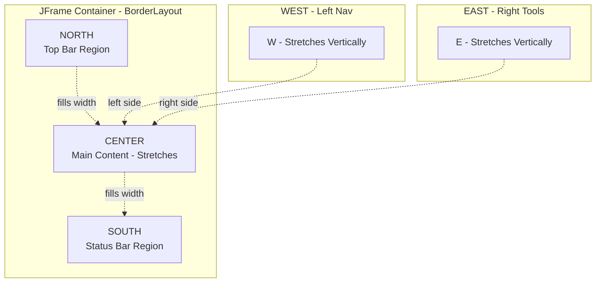
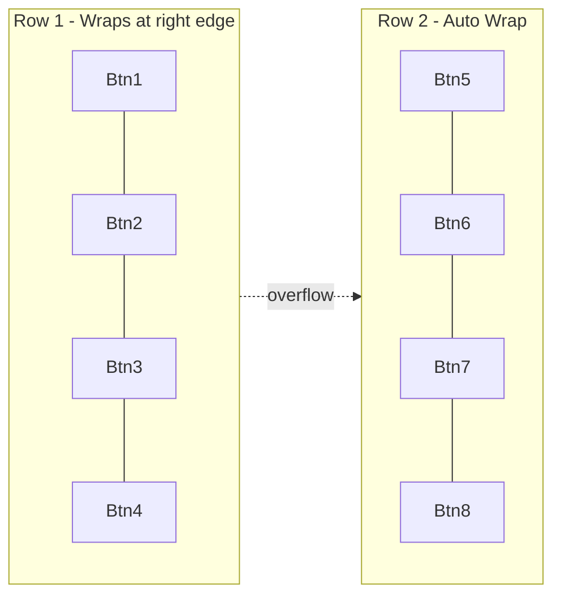
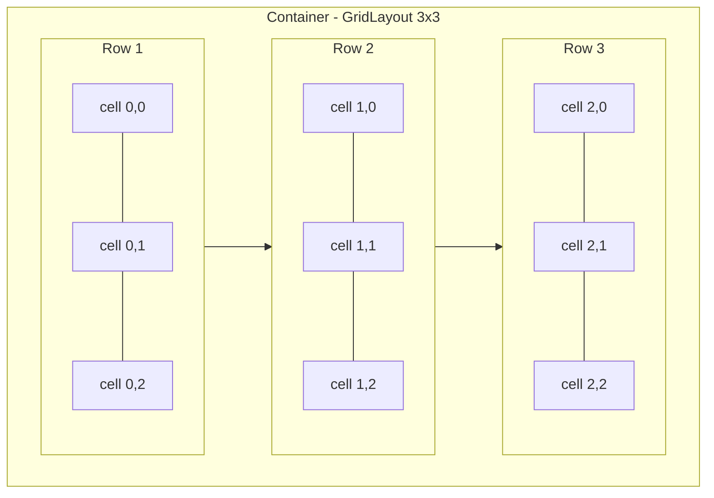
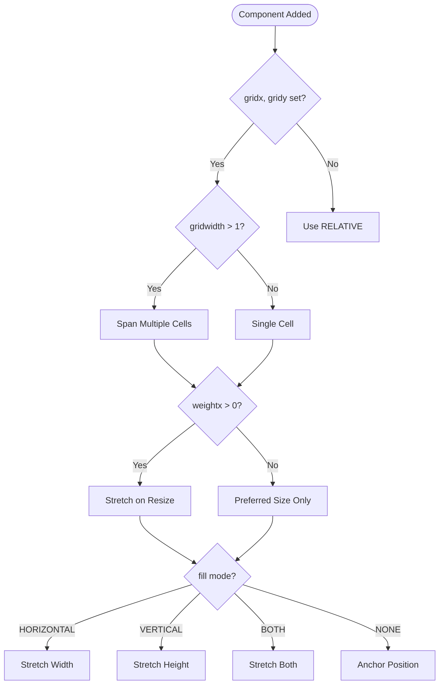
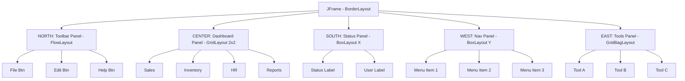

# Swing Layout Managers

<!-- SECTION_1_START -->
# Swing Layout Managers — KTU 2024 Scheme Master Notes

## 1. Core Technical Definition & Intuitive Overview

### Formal Academic Definition (KTU 2024 Syllabus Terminology)

A **Layout Manager** in Java Swing (and AWT) is a `java.awt.LayoutManager` (or `LayoutManager2`) interface implementation object that dictates the **spatial positioning, sizing, and arrangement strategy** of child components within a parent `Container` (such as `JFrame`, `JPanel`, `JApplet`). Unlike absolute positioning, a Layout Manager enforces a **dynamic, resizable, and platform-independent** GUI geometry by responding to container resize events, invoking `preferredLayoutSize()`, `minimumLayoutSize()`, and `layoutContainer()`.

> [!IMPORTANT]
> **KTU Syllabus Highlight (Module 4):** The course outcome maps layout management as part of CO1 — *Apply object-oriented concepts to design GUI-based applications using Swings fundamentals and AWT overview.* The Layout Manager is the *architect* of the GUI, separating **"what to draw"** (Component) from **"where to draw it"** (Layout).

---

### Conceptual Analogy / Intuition

> [!NOTE]
> **Intuition Box — The "Bookshelf Organizer" Analogy**
>
> Imagine you have a **bookshelf** (your `JPanel` container) and a pile of **books** (your `JButton`, `JLabel`, `JTextField` components). You cannot just throw the books in randomly — you need a **rule of placement**:
>
> - **FlowLayout** = "Place books left-to-right, top-to-bottom, like filling text in a Word document."
> - **BorderLayout** = "Divide the shelf into 5 zones: North (top), South (bottom), East (right), West (left), Center (the big middle)."
> - **GridLayout** = "Cut the shelf into an N×M chessboard; each book occupies exactly one cell of equal size."
> - **GridBagLayout** = "A flexible floor plan where each book can have its own size, span multiple cells, and have alignment rules — like architectural blueprints."
> - **BoxLayout** = "Stack books either horizontally in a row OR vertically in a column — strict one-dimensional flow."
> - **CardLayout** = "A stack of trading cards; you can flip and show only the **top card** at any time (used for tabbed wizards)."

The **Layout Manager** is the invisible librarian enforcing the rule.

---

### Standard Java AWT & Swing Constants (Highlighted)

> [!IMPORTANT]
> **Critical Constants You Must Memorize for KTU Board Exam:**
> - **BorderLayout regions:** `BorderLayout.NORTH`, `BorderLayout.SOUTH`, `BorderLayout.EAST`, `BorderLayout.WEST`, `BorderLayout.CENTER`
> - **FlowLayout alignments:** `FlowLayout.LEFT`, `FlowLayout.CENTER`, `FlowLayout.RIGHT`, `FlowLayout.LEADING`, `FlowLayout.TRAILING`
> - **Default Layout of `JFrame`:** `BorderLayout`
> - **Default Layout of `JPanel`:** `FlowLayout`
> - **Default gaps in FlowLayout:** **5 pixels** horizontal and vertical

---

### GeoGebra / Desmos Visualization (Geometric Layout Intuition)

> [!VISUALIZATION CONTROL]
> **Concept:** Visualizing a 3×3 GridLayout cell map and a BorderLayout zone map.
> **GeoGebra Input Equations (Cartesian Plane Simulation):**
> * `Polygon((0,0), (3,0), (3,3), (0,3))` — outer container
> * `Sequence(Segment((i,0),(i,3)), i, 1, 2)` — vertical gridlines
> * `Sequence(Segment((0,j),(3,j)), j, 1, 2)` — horizontal gridlines
> **Visual Description:** The plane splits into **9 equal cells** for GridLayout. For BorderLayout, the plane is divided into 5 zones where **CENTER** claims remaining space and the four edges claim their preferred size.
<!-- SECTION_1_END -->

<!-- SECTION_2_START -->
# 2. Deep Theoretical Analysis & KTU High-Yield Formula Sheet

## 2.1 The LayoutManager Interface — Core Contract

Every layout manager must implement the following methods (from `java.awt.LayoutManager`):

| Method | Purpose | When Called |
|---|---|---|
| `addLayoutComponent(String, Component)` | Legacy constraint storage | When component added |
| `removeLayoutComponent(Component)` | Cleanup constraints | When component removed |
| `preferredLayoutSize(Container)` | Returns ideal size | During pack() / validation |
| `minimumLayoutSize(Container)` | Returns minimum size | Resize-to-zero scenarios |
| `layoutContainer(Container)` | **The actual geometry engine** | On every resize / validate |

`LayoutManager2` extends this with constraint-based addition: `addLayoutComponent(Component, Object constraints)`.

## 2.2 The Strategy Pattern at Work

> [!NOTE]
> **Why Layout Managers use the Strategy Pattern:** The `Container` class delegates the *placement algorithm* to a swappable strategy object. This is a textbook **Strategy Design Pattern** (one of the Gang of Four patterns). You can change the layout of a panel at runtime via `container.setLayout(new GridLayout(2,2))` — the *behavior* changes, the *components* do not.

## 2.3 The Seven Pillars — Layout Manager Comparison

### KTU Formula Sheet / Cheat Sheet

| Layout Manager | Default Container | Arrangement Rule | Resize Behavior | Best Use Case |
|---|---|---|---|---|
| **BorderLayout** | `JFrame`, `JDialog`, `JApplet` | 5 zones (N, S, E, W, C) | Center stretches; edges stay preferred | Main app skeleton, toolbars |
| **FlowLayout** | `JPanel` | Left→Right, then wrap | Components stay preferred size | Button bars, simple toolbars |
| **GridLayout** | (none — explicit) | Equal N×M cells | All cells stretch equally | Calculators, keypads, dashboards |
| **BoxLayout** | `Box` class | Single row OR column | Honors max size along axis | Toolbars, vertical menus |
| **GridBagLayout** | (none — explicit) | Cell grid + constraints | Per-component weights | IDEs, forms, complex GUIs |
| **CardLayout** | (none — explicit) | Stack of panels | Container size = card size | Wizards, tab interfaces |
| **GroupLayout** | `JPanel` (in NetBeans GUI Builder) | Horizontal + Vertical groups | Independent groups | Form builder output |
| **SpringLayout** | (none — explicit) | Spring constraints | Distance-based | Precise micro-positioning |

### 2.4 BorderLayout — Deep Dive

> [!IMPORTANT]
> **BorderLayout Master Rule (Board Exam Favorite):**
> 1. The container is divided into **5 regions**: NORTH, SOUTH, EAST, WEST, CENTER.
> 2. **NORTH and SOUTH** stretch **horizontally** to fill the width; their **height** = preferred.
> 3. **EAST and WEST** stretch **vertically** to fill the remaining height; their **width** = preferred.
> 4. **CENTER** receives **all leftover space**. If CENTER is absent, the leftover is split between N-S or E-W.
> 5. Components added **without a region string default to CENTER**.
> 6. A region can hold **only one component**; adding a second replaces the first.

**Constructor Variants:**
* `new BorderLayout()` — uses 0 pixel gaps.
* `new BorderLayout(int hgap, int vgap)` — explicit horizontal and vertical gaps.

### 2.5 FlowLayout — Deep Dive

* Default alignment = `CENTER`.
* Default `hgap = vgap = 5` pixels.
* Wraps to next line when current row exceeds container width.
* Each component retains its **preferred size**.

### 2.6 GridLayout — Deep Dive

* Constructor: `new GridLayout(int rows, int cols)` OR `new GridLayout(rows, cols, hgap, vgap)`.
* If `rows = 0`, columns dictate the row count dynamically.
* If `cols = 0`, rows dictate the column count dynamically.
* All cells are **equal size** = (container size − gaps) / cell count.
* Components are added **left-to-right, top-to-bottom**.

### 2.7 BoxLayout — Deep Dive

* Constructor: `new BoxLayout(container, axis)` where `axis ∈ {X_AXIS, Y_AXIS, LINE_AXIS, PAGE_AXIS}`.
* Components are placed in a **single line** along the axis.
* Honors each component's `getMaximumSize()` and `getAlignmentX/Y()`.
* Use `Box.createHorizontalBox()` / `Box.createVerticalBox()` shortcuts.

### 2.8 GridBagLayout — Deep Dive (Most Powerful)

> [!WARNING]
> **GridBagLayout is the most complex and the most testable layout.** It uses `GridBagConstraints` to encode **13 properties**:
> 1. `gridx`, `gridy` — cell coordinates (use `GridBagConstraints.RELATIVE` for "next").
> 2. `gridwidth`, `gridheight` — cell span.
> 3. `weightx`, `weighty` — extra-space distribution.
> 4. `fill` — `NONE`, `HORIZONTAL`, `VERTICAL`, `BOTH`.
> 5. `anchor` — `CENTER`, `NORTH`, `NORTHEAST`, etc.
> 6. `insets` — `Insets(top, left, bottom, right)` external padding.
> 7. `ipadx`, `ipady` — internal padding.
> 8. `GridBagConstraints.REMAINDER` — "this is the last cell in my row/column."

### 2.9 CardLayout — Deep Dive

* Treats components as a **deck of cards**.
* `cl.show(container, "cardName")` flips to a named card.
* Used in **wizards** (e.g., install/setup dialogs).

### 2.10 Real-World Engineering Utility

> [!NOTE]
> **Where Layout Managers are used in Production Systems:**
> * **IDE Tool Windows** (IntelliJ, Eclipse) → `GridBagLayout` for dockable panes.
> * **Banking Software Forms** → `GridBagLayout` for dynamic input forms.
> * **Mobile-style Wizards** → `CardLayout` for multi-step setup.
> * **Calculator Keypads** → `GridLayout(4,4)` for the digit matrix.
> * **Web-Launcher Main Screens** → `BorderLayout` for menu bar (NORTH), status bar (SOUTH), and main canvas (CENTER).
<!-- SECTION_2_END -->

<!-- SECTION_3_START -->
# 3. Step-by-Step Derivations & Code Implementation

## 3.1 General Setup — Disabling Layout (Absolute Positioning)

```java
import javax.swing.*;
import java.awt.*;

public class AbsoluteDemo extends JFrame {
    public AbsoluteDemo() {
        setTitle("Absolute Positioning (No Layout)");
        setSize(400, 300);
        setDefaultCloseOperation(JFrame.EXIT_ON_CLOSE);
        setLayout(null);   // Disable layout manager
        JButton b = new JButton("Click");
        b.setBounds(50, 50, 100, 30);   // Manual x, y, width, height
        add(b);
        setVisible(true);
    }
    public static void main(String[] args) {
        new AbsoluteDemo();
    }
}
```

> [!WARNING]
> **KTU Examiner Pitfall:** Using `setLayout(null)` makes the GUI **non-resizable-friendly** and is considered **bad practice** in production Swing. Always prefer a layout manager unless required for a quick prototype.

---

## 3.2 BorderLayout — Full Implementation

```java
import javax.swing.*;
import java.awt.*;

public class BorderLayoutDemo extends JFrame {

    public BorderLayoutDemo() {
        setTitle("KTU BorderLayout Demo");
        setSize(500, 400);
        setDefaultCloseOperation(JFrame.EXIT_ON_CLOSE);

        // 1. Set the layout with 10px horizontal and vertical gaps
        setLayout(new BorderLayout(10, 10));

        // 2. Add components to 4 edges + center
        add(new JButton("NORTH Menu Bar"),  BorderLayout.NORTH);
        add(new JButton("SOUTH Status"),     BorderLayout.SOUTH);
        add(new JButton("WEST Nav"),         BorderLayout.WEST);
        add(new JButton("EAST Tools"),       BorderLayout.EAST);
        add(new JTextArea("CENTER Content"), BorderLayout.CENTER);

        setVisible(true);
    }

    public static void main(String[] args) {
        // Schedule GUI creation on Event Dispatch Thread (best practice)
        SwingUtilities.invokeLater(BorderLayoutDemo::new);
    }
}
```

**Step-by-step Logic:**
1. Frame uses **BorderLayout** by default — we override with `new BorderLayout(10,10)` for gaps.
2. Each `add(component, region)` call routes the component to its zone.
3. The **CENTER** component absorbs all leftover space after the 4 edges claim their preferred sizes.

---

## 3.3 FlowLayout — Full Implementation

```java
import javax.swing.*;
import java.awt.*;

public class FlowLayoutDemo extends JFrame {

    public FlowLayoutDemo() {
        setTitle("KTU FlowLayout Demo");
        setSize(400, 150);
        setDefaultCloseOperation(JFrame.EXIT_ON_CLOSE);

        // 1. Set FlowLayout with LEFT alignment and 20/10 pixel gaps
        setLayout(new FlowLayout(FlowLayout.LEFT, 20, 10));

        // 2. Add 8 buttons — FlowLayout wraps them automatically
        for (int i = 1; i <= 8; i++) {
            add(new JButton("Btn " + i));
        }

        setVisible(true);
    }

    public static void main(String[] args) {
        SwingUtilities.invokeLater(() -> new FlowLayoutDemo());
    }
}
```

**Logic Steps:**
1. `FlowLayout(alignment, hgap, vgap)` constructs the layout.
2. Components flow **left-to-right**.
3. When the right edge is reached, they **wrap to a new line**.
4. Each component retains its **preferred size**.

---

## 3.4 GridLayout — Calculator Keypad

```java
import javax.swing.*;
import java.awt.*;

public class GridLayoutCalculator extends JFrame {

    public GridLayoutCalculator() {
        setTitle("KTU GridLayout — 4x4 Keypad");
        setSize(300, 350);
        setDefaultCloseOperation(JFrame.EXIT_ON_CLOSE);

        // 1. Set 4 rows, 4 columns, with 5px gaps
        setLayout(new GridLayout(4, 4, 5, 5));

        // 2. Add 16 buttons in row-major order
        String[] labels = {
            "7", "8", "9", "/",
            "4", "5", "6", "*",
            "1", "2", "3", "-",
            "0", ".", "=", "+"
        };
        for (String label : labels) {
            add(new JButton(label));
        }

        setVisible(true);
    }

    public static void main(String[] args) {
        SwingUtilities.invokeLater(GridLayoutCalculator::new);
    }
}
```

**Logic Steps:**
1. The container is sliced into **16 equal cells** (4×4).
2. Cells are filled **row-by-row** (row-major).
3. **All cells stretch equally** when the window resizes.

---

## 3.5 BoxLayout — Vertical/Horizontal Stacking

```java
import javax.swing.*;
import java.awt.*;

public class BoxLayoutDemo extends JFrame {

    public BoxLayoutDemo() {
        setTitle("KTU BoxLayout Demo");
        setSize(300, 300);
        setDefaultCloseOperation(JFrame.EXIT_ON_CLOSE);

        // 1. Create a panel with VERTICAL BoxLayout
        JPanel panel = new JPanel();
        panel.setLayout(new BoxLayout(panel, BoxLayout.Y_AXIS));

        // 2. Add components stacked vertically
        panel.add(new JButton("Top"));
        panel.add(Box.createVerticalStrut(10));     // 10px rigid gap
        panel.add(new JButton("Middle"));
        panel.add(Box.createGlue());                  // flexible gap
        panel.add(new JButton("Bottom"));

        add(panel);
        setVisible(true);
    }

    public static void main(String[] args) {
        SwingUtilities.invokeLater(BoxLayoutDemo::new);
    }
}
```

**Logic Steps:**
1. `BoxLayout.Y_AXIS` stacks components **vertically**.
2. `Box.createVerticalStrut(int)` → fixed pixel gap.
3. `Box.createGlue()` → flexible gap that absorbs extra space.
4. `Box.createHorizontalBox()` / `Box.createVerticalBox()` are shortcut factories.

---

## 3.6 GridBagLayout — Form-Based Login

```java
import javax.swing.*;
import java.awt.*;

public class GridBagLayoutLogin extends JFrame {

    public GridBagLayoutLogin() {
        setTitle("KTU GridBagLayout — Login Form");
        setSize(400, 200);
        setDefaultCloseOperation(JFrame.EXIT_ON_CLOSE);

        setLayout(new GridBagLayout());
        GridBagConstraints gbc = new GridBagConstraints();
        gbc.insets = new Insets(5, 5, 5, 5);   // External padding
        gbc.anchor = GridBagConstraints.WEST;

        // Row 0 — Username label
        gbc.gridx = 0; gbc.gridy = 0;
        gbc.weightx = 0;                        // label doesn't stretch
        add(new JLabel("Username:"), gbc);

        // Row 0 — Username field
        gbc.gridx = 1; gbc.gridy = 0;
        gbc.weightx = 1.0;                      // field stretches horizontally
        gbc.fill = GridBagConstraints.HORIZONTAL;
        add(new JTextField(15), gbc);

        // Row 1 — Password label
        gbc.gridx = 0; gbc.gridy = 1;
        gbc.weightx = 0;
        gbc.fill = GridBagConstraints.NONE;
        add(new JLabel("Password:"), gbc);

        // Row 1 — Password field
        gbc.gridx = 1; gbc.gridy = 1;
        gbc.weightx = 1.0;
        gbc.fill = GridBagConstraints.HORIZONTAL;
        add(new JPasswordField(15), gbc);

        // Row 2 — Login button spans 2 columns
        gbc.gridx = 0; gbc.gridy = 2;
        gbc.gridwidth = 2;                      // span across both columns
        gbc.weightx = 0;
        gbc.fill = GridBagConstraints.CENTER;
        add(new JButton("Login"), gbc);

        setVisible(true);
    }

    public static void main(String[] args) {
        SwingUtilities.invokeLater(GridBagLayoutLogin::new);
    }
}
```

**Step-by-step Logic:**
1. `GridBagConstraints gbc` is **reused** across components (do not recreate per component).
2. `gridx`, `gridy` define the cell coordinate.
3. `weightx = 1.0` tells the layout to **give extra horizontal space** to that component.
4. `fill = HORIZONTAL` makes the component **stretch** in that direction.
5. `gridwidth = 2` causes the button to **span two columns**.

---

## 3.7 CardLayout — Wizard / Tab Switcher

```java
import javax.swing.*;
import java.awt.*;
import java.awt.event.*;

public class CardLayoutWizard extends JFrame {

    private CardLayout cardLayout;
    private JPanel cardPanel;

    public CardLayoutWizard() {
        setTitle("KTU CardLayout — Install Wizard");
        setSize(400, 250);
        setDefaultCloseOperation(JFrame.EXIT_ON_CLOSE);

        cardLayout = new CardLayout();
        cardPanel = new JPanel(cardLayout);

        // Three cards stacked
        JPanel card1 = new JPanel(); card1.add(new JLabel("Step 1: Welcome"));      cardPanel.add(card1, "step1");
        JPanel card2 = new JPanel(); card2.add(new JLabel("Step 2: License"));      cardPanel.add(card2, "step2");
        JPanel card3 = new JPanel(); card3.add(new JLabel("Step 3: Finish"));       cardPanel.add(card3, "step3");

        // Navigation buttons
        JButton next = new JButton("Next >>");
        JButton prev = new JButton("<< Prev");

        next.addActionListener(e -> cardLayout.next(cardPanel));
        prev.addActionListener(e -> cardLayout.previous(cardPanel));

        JPanel nav = new JPanel();
        nav.add(prev);
        nav.add(next);

        setLayout(new BorderLayout());
        add(cardPanel, BorderLayout.CENTER);
        add(nav, BorderLayout.SOUTH);

        setVisible(true);
    }

    public static void main(String[] args) {
        SwingUtilities.invokeLater(CardLayoutWizard::new);
    }
}
```

**Step-by-step Logic:**
1. The `CardLayout` stacks panels like a **deck of cards**.
2. `cardLayout.next(container)` advances to the following card.
3. `cardLayout.show(container, "name")` jumps to a specific named card.
4. Only **one card is visible at a time** — the rest occupy the same space.

---

## 3.8 Nested Layouts — Real Production Pattern

```java
import javax.swing.*;
import java.awt.*;

public class NestedLayoutDemo extends JFrame {

    public NestedLayoutDemo() {
        setTitle("KTU Nested Layout Pattern");
        setSize(500, 350);
        setDefaultCloseOperation(JFrame.EXIT_ON_CLOSE);

        // Outer = BorderLayout
        setLayout(new BorderLayout());

        // Top: FlowLayout toolbar
        JPanel toolbar = new JPanel(new FlowLayout(FlowLayout.LEFT));
        toolbar.add(new JButton("File"));
        toolbar.add(new JButton("Edit"));
        toolbar.add(new JButton("Help"));
        add(toolbar, BorderLayout.NORTH);

        // Center: GridLayout 2x2 dashboard
        JPanel dashboard = new JPanel(new GridLayout(2, 2, 10, 10));
        dashboard.add(new JButton("Sales"));
        dashboard.add(new JButton("Inventory"));
        dashboard.add(new JButton("HR"));
        dashboard.add(new JButton("Reports"));
        add(dashboard, BorderLayout.CENTER);

        // Bottom: BoxLayout horizontal status bar
        JPanel status = new JPanel();
        status.setLayout(new BoxLayout(status, BoxLayout.X_AXIS));
        status.add(new JLabel("Status: Ready"));
        status.add(Box.createHorizontalGlue());
        status.add(new JLabel("User: Admin"));
        add(status, BorderLayout.SOUTH);

        setVisible(true);
    }

    public static void main(String[] args) {
        SwingUtilities.invokeLater(NestedLayoutDemo::new);
    }
}
```

> [!NOTE]
> **Why Nest Layouts?** Real applications are *always* nested. A `JFrame` (BorderLayout) holds panels (FlowLayout, GridLayout, BoxLayout) that themselves contain other panels. This is called the **Composite Layout Pattern** and is the industry-standard approach to building complex Swing GUIs.

---

## 3.9 Layout Method Quick Reference Table

| Operation | Code Snippet | Effect |
|---|---|---|
| Set layout | `container.setLayout(new GridLayout(3,3))` | Activates the manager |
| Get layout | `container.getLayout()` | Returns current manager |
| Validate | `container.validate()` | Forces re-layout |
| Invalidate | `container.invalidate()` | Marks layout as stale |
| Pack | `frame.pack()` | Sizes frame to preferred size |
| Re-layout on resize | Automatic | Triggered by `validate()` |
<!-- SECTION_3_END -->

<!-- SECTION_4_START -->
# 4. Structural Diagrams & Schematics

## 4.1 BorderLayout Zone Map (Block Topology)



> [!NOTE]
> **Reading the diagram:** NORTH and SOUTH claim full width but only their preferred height. EAST and WEST claim full height (after N/S) but only their preferred width. CENTER absorbs **all remaining space**.

## 4.2 FlowLayout Wrapping Sequence



## 4.3 GridLayout Cell Topology (3x3)



## 4.4 GridBagLayout Decision Flow



## 4.5 Nested Layout Architecture (Composite Pattern)



> [!IMPORTANT]
> **Composite Architecture Insight:** This is exactly how production Swing applications (e.g., NetBeans IDE, IntelliJ's Swing module, JIRA's older Swing UI) are structured. The outer frame uses BorderLayout to define major zones, and each zone embeds a sub-panel with its own specialized layout manager.
<!-- SECTION_4_END -->

<!-- SECTION_5_START -->
# 5. KTU 2024 Scheme Examination Question Bank & Topic Recap

---

## 5.1 Part A — Short Answer Questions (3 Marks Each)

### Question A1 `[KTU University Exam - July 2024]`
**Q: Define a Layout Manager. Name the default layout managers of `JFrame` and `JPanel`.**

**Model Answer (Board Standard):**
A Layout Manager is an object that implements the `java.awt.LayoutManager` interface and controls the size and position of components within a container. It enforces a resizable, platform-independent geometry by implementing methods like `layoutContainer()` and `preferredLayoutSize()`.
* **Default layout of `JFrame`** → `BorderLayout`
* **Default layout of `JPanel`** → `FlowLayout`

> **[Definition: 2 Marks] [Defaults stated: 1 Mark]**

---

### Question A2 `[KTU University Exam - Dec 2023]`
**Q: Differentiate between `FlowLayout` and `GridLayout`.**

**Model Answer:**

| Feature | `FlowLayout` | `GridLayout` |
|---|---|---|
| Cell Sizes | Each component retains **preferred size** | All cells are **equal size** |
| Arrangement | Left-to-right, **wraps to next line** | Row-major order in N×M matrix |
| Resize Behavior | Components do not stretch | All cells stretch equally |
| Default Alignment | `CENTER` | N/A (grid always centers) |

> **[Two differences: 2 Marks] [Example or default values: 1 Mark]**

---

## 5.2 Part B — Long Answer Questions (14 Marks Each, Internal Choice)

---

### Question B1 (Option A) `[KTU University Exam - July 2024]` — **14 Marks**

**Q: Explain the `BorderLayout` manager in detail. Write a Java Swing program to create a frame that uses `BorderLayout` with five buttons placed in the NORTH, SOUTH, EAST, WEST, and CENTER regions. Add appropriate gaps and use the `Event Dispatch Thread` for thread safety.**

#### Part (a) — **7 Marks** — *Theoretical Explanation*

**Model Answer:**

`BorderLayout` is the default layout manager for top-level Swing containers such as `JFrame`, `JDialog`, and `JApplet`. It divides the container into **five distinct regions**: `NORTH`, `SOUTH`, `EAST`, `WEST`, and `CENTER`.

**Positioning Rules:**
1. The `NORTH` region spans the **full width** of the container but only consumes its **preferred height**.
2. The `SOUTH` region behaves identically to NORTH but is placed at the **bottom edge**.
3. The `WEST` region is placed at the **left edge**, occupying its **preferred width** and the **full remaining height** (after NORTH and SOUTH).
4. The `EAST` region mirrors WEST on the **right edge**.
5. The `CENTER` region receives **all leftover space**. It is the only region that **stretches** on window resize.
6. If a region is empty, the surrounding regions expand to claim the freed space.

**Constructor Variants:**
* `new BorderLayout()` — no gaps.
* `new BorderLayout(int hgap, int vgap)` — explicit horizontal/vertical pixel gaps.

**Adding Components:**
Use the overloaded `add(Component, Object constraint)` method: `add(button, BorderLayout.NORTH)`. If a region is unspecified, the component is placed in `CENTER`.

> **[Definition: 2 Marks]** | **[Five regions: 2 Marks]** | **[Resize behavior: 2 Marks]** | **[Constructor variants: 1 Mark]**

#### Part (b) — **7 Marks** — *Java Code Implementation*

```java
import javax.swing.*;
import java.awt.*;

public class BorderLayoutApp extends JFrame {

    public BorderLayoutApp() {
        setTitle("BorderLayout Demo - KTU");
        setSize(500, 400);
        setDefaultCloseOperation(JFrame.EXIT_ON_CLOSE);

        // BorderLayout with 15px horizontal and 10px vertical gaps
        setLayout(new BorderLayout(15, 10));

        add(new JButton("Menu (NORTH)"),  BorderLayout.NORTH);
        add(new JButton("Side (WEST)"),   BorderLayout.WEST);
        add(new JButton("Tools (EAST)"),   BorderLayout.EAST);
        add(new JButton("Status (SOUTH)"), BorderLayout.SOUTH);
        add(new JTextArea("Main Content (CENTER)"), BorderLayout.CENTER);

        setVisible(true);
    }

    public static void main(String[] args) {
        // Thread-safe GUI creation
        SwingUtilities.invokeLater(BorderLayoutApp::new);
    }
}
```

**Step-by-step Explanation:**
1. **Class declaration** — extends `JFrame` to inherit window functionality. `[1 Mark]`
2. **Layout setup** — `BorderLayout(15,10)` sets 15px horizontal and 10px vertical gaps. `[1 Mark]`
3. **Component placement** — five `add(component, region)` calls populate the 5 zones. `[2 Marks]`
4. **Default close operation** — ensures JVM exits on window close. `[0.5 Marks]`
5. **Event Dispatch Thread** — `SwingUtilities.invokeLater()` guarantees thread safety. `[1 Mark]`
6. **CENTER is a `JTextArea`** — demonstrates the stretching behavior of the center region. `[1.5 Marks]`

> **[Imports: 0.5 Marks]** | **[Class structure: 0.5 Marks]**

---

### Question B1 (Option B) `[KTU University Exam - Dec 2023]` — **14 Marks**

**Q: Explain `GridLayout` and `FlowLayout`. Write a Java program to design a calculator-like 4×4 grid of buttons using `GridLayout`, and a horizontal toolbar using `FlowLayout`. Combine both into a single `JFrame` using `BorderLayout` as the outer layout.**

#### Part (a) — **7 Marks** — *Theoretical Explanation*

**Model Answer:**

**FlowLayout:** Arranges components in a **left-to-right row**, wrapping to the next line when the right edge is reached. Each component keeps its **preferred size**. Default alignment is `CENTER`; default gap is **5 pixels**. Constructor: `FlowLayout(align, hgap, vgap)`. **[3 Marks]**

**GridLayout:** Divides the container into a matrix of **equal-sized cells** (rows × columns). Components are added **row-by-row** (row-major). All cells stretch proportionally on resize. Constructor: `GridLayout(rows, cols, hgap, vgap)`. **[3 Marks]**

**Combining via BorderLayout:** The outer `JFrame` uses `BorderLayout` to allocate the toolbar to NORTH (FlowLayout) and the keypad to CENTER (GridLayout). This is the **Composite Pattern** of nested layouts. **[1 Mark]**

#### Part (b) — **7 Marks** — *Java Code*

```java
import javax.swing.*;
import java.awt.*;

public class CombinedLayoutApp extends JFrame {

    public CombinedLayoutApp() {
        setTitle("Combined Layout - KTU Demo");
        setSize(350, 450);
        setDefaultCloseOperation(JFrame.EXIT_ON_CLOSE);

        // Outer: BorderLayout
        setLayout(new BorderLayout());

        // 1. Toolbar (NORTH) with FlowLayout
        JPanel toolbar = new JPanel(new FlowLayout(FlowLayout.LEFT, 10, 5));
        toolbar.add(new JButton("New"));
        toolbar.add(new JButton("Open"));
        toolbar.add(new JButton("Save"));
        toolbar.add(new JButton("Exit"));
        add(toolbar, BorderLayout.NORTH);

        // 2. Keypad (CENTER) with GridLayout 4x4
        JPanel keypad = new JPanel(new GridLayout(4, 4, 5, 5));
        String[] labels = {
            "7", "8", "9", "/",
            "4", "5", "6", "*",
            "1", "2", "3", "-",
            "C", "0", "=", "+"
        };
        for (String lbl : labels) {
            keypad.add(new JButton(lbl));
        }
        add(keypad, BorderLayout.CENTER);

        setVisible(true);
    }

    public static void main(String[] args) {
        SwingUtilities.invokeLater(CombinedLayoutApp::new);
    }
}
```

**Valuation Key:**
* **[BorderLayout outer: 1 Mark]**
* **[FlowLayout toolbar with 4 buttons: 2 Marks]**
* **[GridLayout 4x4: 1.5 Marks]**
* **[String array for keypad labels: 0.5 Mark]**
* **[for-loop adding buttons: 1 Mark]**
* **[BorderLayout.NORTH and CENTER placement: 1 Mark]**

---

## 5.3 KTU Examiner's Valuation Warning / Pitfall Callout

> [!WARNING]
> **Common Mistakes That Cost Marks:**
>
> 1. **Forgetting `setLayout()`** — Students often add components without calling `setLayout()`, so the default `BorderLayout` (for `JFrame`) or `FlowLayout` (for `JPanel`) is silently used. The examiner will deduct 1–2 marks if the question explicitly asks for a specific layout.
> 2. **Wrong region string in BorderLayout** — Writing `BorderLayout.NORTH` as a string `"NORTH"` works but is poor practice. Always use the **static constant**.
> 3. **Multiple components in the same BorderLayout region** — Only the **last** added is visible. The earlier ones are silently replaced. The examiner expects you to use a nested `JPanel` if multiple components share a region.
> 4. **Not using `SwingUtilities.invokeLater()`** — In recent KTU papers, examiners specifically award marks for **EDT (Event Dispatch Thread)** awareness. Missing this loses 1 mark.
> 5. **Confusing `setBounds()` with layout** — `setBounds()` only works when layout is `null`. If a layout manager is active, `setBounds()` is **ignored** by the layout engine.
> 6. **Forgetting the `extends JFrame` (or `JPanel`)** — without extending, you cannot call `add()` directly from the class.
> 7. **In GridBagLayout, forgetting to reset `gridy` between rows** — students often reuse `gbc.gridy = 0` for every component, stacking them all in row 0.

---

## 5.4 Topic Recap & Important Things to Remember

> [!NOTE]
> **Rapid Revision Checklist — Swing Layout Managers**
>
> - **Layout Manager** = an object implementing `LayoutManager` / `LayoutManager2` that controls child component placement inside a `Container`.
> - **Default of `JFrame`:** `BorderLayout`. **Default of `JPanel`:** `FlowLayout`.
> - **`BorderLayout` regions:** NORTH, SOUTH, EAST, WEST, CENTER. CENTER stretches; edges claim preferred sizes. `new BorderLayout(hgap, vgap)` sets gaps.
> - **`FlowLayout`** flows left-to-right, wraps at the right edge, components retain preferred size. `new FlowLayout(alignment, hgap, vgap)`. Default alignment = `CENTER`; default gap = **5px**.
> - **`GridLayout`** divides container into N×M **equal-sized** cells. Constructor: `new GridLayout(rows, cols, hgap, vgap)`. Filling order is **row-major**.
> - **`BoxLayout`** is single-axis (X_AXIS or Y_AXIS). Use `Box.createHorizontal/VerticalBox()` and `Box.createGlue/Strut/RigidArea` for gaps.
> - **`GridBagLayout`** is the most powerful; uses `GridBagConstraints` with `gridx`, `gridy`, `gridwidth`, `gridheight`, `weightx`, `weighty`, `fill`, `anchor`, `insets`, `ipadx`, `ipady`.
> - **`CardLayout`** stacks panels like a deck; `next()`, `previous()`, `show(container, name)` flip cards. Used in **wizards**.
> - **`GroupLayout`** is auto-generated by NetBeans GUI Builder for `.form` files; uses **horizontal and vertical groups**.
> - **`SpringLayout`** uses **spring constraints** (distance between edges) — used in NetBeans Matisse predecessor.
> - **Nested layouts** are the production pattern: outer `BorderLayout` + inner specialized managers.
> - **`container.validate()`** forces a re-layout; **`frame.pack()`** sizes the frame to its preferred size.
> - **`setLayout(null)`** disables layout management (absolute positioning) — discouraged in production.
> - **EDT best practice:** wrap GUI creation in `SwingUtilities.invokeLater(Runnable)`.
> - **Strategy Pattern** — layout managers are textbook examples of the Strategy Design Pattern, allowing the placement algorithm to be swapped at runtime.
> - **Composite Pattern** — nested `JPanel` containers with their own layout managers form a tree structure, mirroring the Composite GoF pattern.
<!-- SECTION_5_END -->
