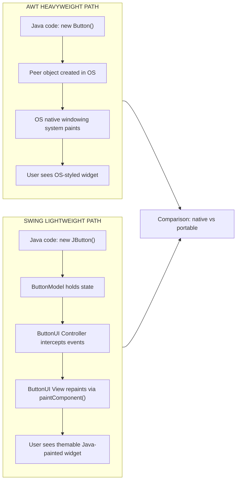
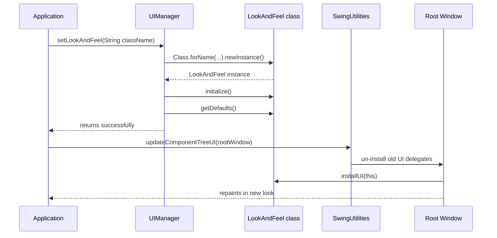
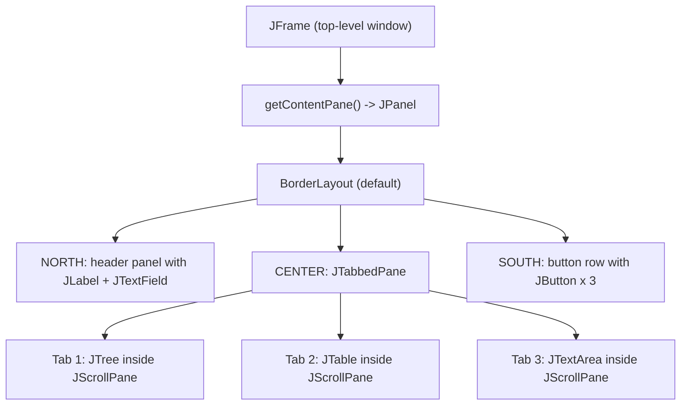

# Swing Packages

<!-- SECTION_1_START -->
# Swing Packages: Core Technical Definition & Intuitive Overview

## Formal Academic Definition

**Swing Packages** constitute the standardized Java extension library within the **Java Foundation Classes (JFC)**, primarily rooted under the `javax.swing` hierarchy. Swing is a lightweight, **Model-View-Controller (MVC) compliant** widget toolkit designed as the successor and modern replacement to the legacy Abstract Window Toolkit (AWT) for building **Graphical User Interfaces (GUIs)** in Java. The packages provide platform-independent, highly customizable UI components that render natively through Java's own drawing APIs rather than relying on the underlying Operating System's peer components.

> [!IMPORTANT]
> **KTU 2024 Syllabus Highlight (OECST615 / Module 4):** Students must be able to enumerate the major `javax.swing` sub-packages, explain their purpose, articulate the architectural difference between AWT (heavyweight) and Swing (lightweight) components, and justify why Swing is preferred for modern Java GUI development.

## Intuitive Real-World Analogy

Imagine building a custom modular kitchen:

- **AWT** is like a kitchen built entirely of **pre-fabricated steel parts supplied by the building's landlord**. The doors, drawers, and shelves are heavy, fixed, and look the same on every floor of the apartment building (OS-dependent). You cannot change their look, and if you break one, you must call the landlord.
- **Swing**, in contrast, is like a **fully owned DIY kitchen cabinet system** built using lightweight aluminum frames with painted plywood. You can repaint the surfaces, change the handles, swap the lighting, and even redesign the look to match a French Provincial or a Modern Minimalist style — all without bothering the landlord.

This "owned cabinet" is the Swing component — it paints itself using Java code (`paintComponent()`), making it **portable**, **themable**, and **lightweight**.

## Key Architectural Distinctions at a Glance

| Property | AWT Components | Swing Components |
|----------|---------------|------------------|
| Package root | `java.awt` | `javax.swing` |
| Component class hierarchy | `Component` | `JComponent` (extends `Container` extends `Component`) |
| Weight classification | **Heavyweight** (relies on OS peers) | **Lightweight** (Java-rendered) |
| Look & Feel | Fixed by host OS | **Pluggable (PLAF)** |
| MVC support | No | Yes (explicit) |
| Feature richness | Limited (core widgets only) | Rich (tables, trees, tabs, etc.) |
| Performance | Faster for very small apps | Better for complex UIs |

## Core Physical & Virtual Constants (Bolded Highlights)

- The root package is `javax.swing` — note the **`x`** which designates it as an **extension** package, not part of the core `java.*` API.
- All Swing visual components inherit from the abstract class **`javax.swing.JComponent`**.
- The **default Look and Feel (LAF)** is `"javax.swing.plaf.metal.MetalLookAndFeel"`, also informally called **"Metal"** or **"Ocean"** (Ocean was the default from Java 5 onwards).
- Standard unit of measurement in Swing is the **pixel**, but the **screen DPI density** is abstracted by `Toolkit.getDefaultToolkit().getScreenResolution()`.

> [!NOTE]
> **Syllabus Definition Callout:** A "package" in Java is a **namespace** that organizes a set of related classes and interfaces. The `javax.swing` ecosystem is logically divided into multiple sub-packages, each dedicated to a specific functional area (events, look-and-feel, borders, tables, trees, etc.).

## The `javax.swing` Package Ecosystem — A Bird's-Eye View

```
javax.swing
   │
   ├── core components (JButton, JLabel, JTextField, ...)
   ├── containers    (JFrame, JPanel, JDialog, JApplet)
   └── (delegates most sub-features to sub-packages)
```

> [!VISUALIZATION CONTROL]
> **Concept:** Hierarchical Tree of Swing Sub-Packages
> **GeoGebra / Desmos Input Equations:** *(Not geometric — represented via Mermaid tree in Section 4)*
> **Visual Description:** Picture `javax.swing` as the trunk of a tree. The first six major branches represent functional domains — Event, Look & Feel, Border, Table, Tree, and Text — with additional branches for accessibility, undo, file/colour chooser, and debugging.

> [!TIP]
> A common student misconception: "All Swing classes are in `javax.swing`." This is **incorrect**. Sub-packages like `javax.swing.event`, `javax.swing.table`, and `javax.swing.plaf.basic` contain many classes that are essential for advanced Swing programming. KTU board questions frequently test this hierarchical knowledge.
<!-- SECTION_1_END -->

<!-- SECTION_2_START -->
# Deep Theoretical Analysis & KTU High-Yield Formula Sheet

## Why Swing Packages Exist — The "Why" Behind the Design

The legacy AWT had three critical flaws that motivated Sun Microsystems to build Swing as a separate package family in **Java 1.2 (1998)**:

1. **Limited component set** — AWT had only ~12 component types, all relying on OS equivalents.
2. **Platform-locked appearance** — A "Button" looked like a Windows button on Windows, a Mac button on Mac.
3. **The "Common Denominator" problem** — AWT could only use features supported by **every** target OS, severely limiting functionality.

To solve these, Swing was engineered with these design goals:
- **Lightweight rendering** — components draw themselves on a Canvas using Java 2D.
- **Pluggable Look and Feel (PLAF)** — `UIManager.setLookAndFeel(...)` swaps appearance at runtime.
- **MVC separation** — each component has a Model (data), a View (renderer), and a Controller (input logic).
- **Rich component set** — `JTable`, `JTree`, `JTabbedPane`, `JSlider`, `JProgressBar`, etc.
- **Accessibility built-in** — `javax.accessibility` package integration.

## The "How" — AWT vs Swing Internals

| Mechanism | AWT (Heavyweight) | Swing (Lightweight) |
|-----------|-------------------|---------------------|
| Native peer required? | **Yes** — each component has an OS peer (a C/C++ object). | **No** — painted by Java. |
| Memory footprint | High (one peer per component). | Low (no peer). |
| Z-ordering conflict | Z-ordering is determined by OS; mixing with native windows causes flicker. | Stacking is internally managed by Swing. |
| Customization | Almost none. | Full painting, key binding, UI delegates, theming. |
| Parent component dependency | A `Button` must be inside an AWT container. | A `JButton` can be added to almost any container, including AWT ones (mixed-mode). |

> [!WARNING]
> **Mixing heavy and light components is allowed but discouraged.** A heavyweight AWT component always paints **on top** of all lightweight Swing components, which often causes visual glitches in KTU lab outputs. Always prefer **all-Swing** UIs.

## KTU High-Yield Formula Sheet — Swing Packages

| # | Concept | Key Identifier | Standard Member / Method | Purpose |
|---|---------|---------------|---------------------------|---------|
| 1 | Root package | `javax.swing` | Core classes (`JButton`, `JLabel`, …) | Houses all primary UI components. |
| 2 | Top-level container | `javax.swing.JFrame`, `JDialog`, `JApplet`, `JWindow` | `setDefaultCloseOperation(int)` | Standalone OS windows. |
| 3 | Generic container | `javax.swing.JPanel`, `JScrollPane`, `JSplitPane`, `JTabbedPane`, `JToolBar` | `add(Component)` | Holds other components. |
| 4 | Event package | `javax.swing.event` | `ChangeEvent`, `ListSelectionEvent`, `MenuEvent`, `CaretEvent` | Swing-specific events. |
| 5 | Look and Feel | `javax.swing.plaf`, `plaf.basic`, `plaf.metal`, `plaf.multi`, `plaf.synth` | `UIManager.setLookAndFeel(...)` | Pluggable UI rendering. |
| 6 | Borders | `javax.swing.border` | `BorderFactory.createLineBorder(...)` | Decorative component edges. |
| 7 | Tables | `javax.swing.table` | `AbstractTableModel`, `DefaultTableModel`, `JTableHeader` | Spreadsheet-style grids. |
| 8 | Trees | `javax.swing.tree` | `DefaultMutableTreeNode`, `TreeNode`, `TreePath` | Hierarchical data display. |
| 9 | Text | `javax.swing.text`, `text.html`, `text.rtf` | `JTextPane`, `JEditorPane`, `StyledDocument` | Rich-text editing. |
| 10 | Undo framework | `javax.swing.undo` | `UndoManager`, `AbstractUndoableEdit`, `UndoableEditSupport` | Edit history. |
| 11 | File chooser | `javax.swing.JFileChooser` | `showOpenDialog(Component)`, `showSaveDialog(...)` | File system dialogs. |
| 12 | Colour chooser | `javax.swing.JColorChooser` | `showDialog(Component, String, Color)` | Colour picker. |
| 13 | Progress & sliders | `javax.swing.JProgressBar`, `JSlider` | `setValue(int)`, `setMinimum(int)`, `setMaximum(int)` | Range-based widgets. |
| 14 | Menus | `javax.swing.JMenuBar`, `JMenu`, `JMenuItem` | `add(JMenuItem)` | Menu system. |
| 15 | Accessibility | `javax.accessibility` | `Accessible` interface | Screen-reader / assistive support. |
| 16 | Debug graphics | `javax.swing.debuggraphics` | `DebugGraphics` | Visualizes painting operations. |
| 17 | Layout managers | `java.awt` (but used extensively) | `BorderLayout`, `FlowLayout`, `GridLayout`, `BoxLayout`, `GroupLayout`, `SpringLayout` | Component arrangement. |

> [!IMPORTANT]
> **CRITICAL table-reading rule:** All formulas / methods above are standard JDK signatures. For KTU exams, write the full method signature as it appears in the table — board examiners check for the **return type, parameter type, and exact spelling** (e.g., `setDefaultCloseOperation(int operation)` is **not** `setCloseOperation`).

## Real-World Engineering Utility

| Application Domain | Use of Swing Packages |
|--------------------|-----------------------|
| **Desktop IDEs** (e.g., older NetBeans, IntelliJ plugins) | `javax.swing.text` for code editors, `JTree` for project explorer. |
| **Banking & ATM Back-office Tools** | `JTable` with `DefaultTableModel` for transaction grids, `JFileChooser` for backups. |
| **Scientific simulation dashboards** | `JSlider` for parameter tuning, `JProgressBar` for simulation status, `JColorChooser` for heatmaps. |
| **Kerala State Govt. e-Office desktop clients** | Multi-document interfaces (MDI) using `JDesktopPane` + `JInternalFrame`. |
| **Educational GUI labs (KTU OOP Lab)** | Standard swing-based forms, event handling, layout managers. |

> [!NOTE]
> Although modern Java leans toward **JavaFX** (released 2008) and **web front-ends** (HTML/JS) for new projects, Swing remains relevant in **legacy enterprise systems** and is still the officially tested GUI toolkit in the **KTU 2024 OECST615 syllabus**.
<!-- SECTION_2_END -->

<!-- SECTION_3_START -->
# Step-by-Step Derivations, Source Code & Symbolic Implementation

## 3.1 Complete Inventory of the `javax.swing` Family

Below is the exhaustive enumeration of all sub-packages directly under `javax.swing` (as per the **Java SE 17 / 21 specification** referenced in the KTU 2024 syllabus), with one-liner purpose statements.

1. **`javax.swing`** — the core package containing all standard components and the `JComponent` abstract class.
2. **`javax.swing.event`** — Swing-specific event classes (`ChangeEvent`, `ListSelectionEvent`, `MenuEvent`, `CaretEvent`, `TreeExpansionEvent`, `TableColumnModelEvent`, `TableModelEvent`).
3. **`javax.swing.plaf`** — the abstract **Pluggable Look and Feel (PLAF)** infrastructure, defining `ComponentUI`, `LookAndFeel`, `UIResource`.
4. **`javax.swing.plaf.basic`** — the **BasicLookAndFeel** — the foundational LAF on which others (Metal, Motif) are built.
5. **`javax.swing.plaf.metal`** — the cross-platform **MetalLookAndFeel** (the default LAF).
6. **`javax.swing.plaf.multi`** — **MultiLookAndFeel** — allows simultaneous use of multiple LAFs (rarely used directly).
7. **`javax.swing.plaf.synth`** — **SynthLookAndFeel** — XML/Skinnable look and feel (no Java code required to skin components).
8. **`javax.swing.plaf.nimbus`** — **NimbusLookAndFeel** — modern, flat LAF introduced in Java SE 6u10.
9. **`javax.swing.border`** — abstract `Border` interface and concrete borders (`LineBorder`, `EtchedBorder`, `TitledBorder`, `BevelBorder`, `EmptyBorder`, `MatteBorder`, `CompoundBorder`).
10. **`javax.swing.table`** — `JTable`, `TableModel`, `TableColumnModel`, `DefaultTableModel`, `AbstractTableModel`, `TableCellRenderer`, `TableCellEditor`, `JTableHeader`, `DefaultTableCellRenderer`.
11. **`javax.swing.tree`** — `JTree`, `TreeNode`, `MutableTreeNode`, `DefaultMutableTreeNode`, `TreePath`, `TreeModel`, `DefaultTreeModel`, `TreeCellRenderer`, `TreeCellEditor`, `TreeSelectionModel`, `ExpandVetoException`.
12. **`javax.swing.text`** — the `Document` model, `JTextComponent`, `JTextField`, `JTextArea`, `JPasswordField`, `JEditorPane`, `JTextPane`, `StyledDocument`, `DefaultStyledDocument`, `AbstractDocument`, `GapContent`, `StringContent`, `View`/`ElementView`/`LabelView` hierarchy, `Caret`, `Highlighter`, `NavigationFilter`, `TextAction`.
13. **`javax.swing.text.html`** — HTML 3.2 renderer for `JEditorPane` (`HTMLEditorKit`, `HTMLDocument`, `HTMLReader`, `ParserDelegator`).
14. **`javax.swing.text.rtf`** — RTF (Rich Text Format) reader/writer (`RTFEditorKit`).
15. **`javax.swing.undo`** — `UndoManager`, `UndoableEdit`, `AbstractUndoableEdit`, `CannotRedoException`, `CannotUndoException`, `CompoundEdit`, `StateEdit`, `UndoableEditSupport`.
16. **`javax.swing.filechooser`** — `FileSystemView`, `FileView` — extension points for the `JFileChooser`.
17. **`javax.swing.colorchooser`** — `AbstractColorChooserPanel`, `ColorSelectionModel`, `DefaultColorSelectionModel` — extension points for the `JColorChooser`.
18. **`javax.swing.debuggraphics`** — `DebugGraphics` — used to visualize internal painting operations for debugging custom painting.
19. **`javax.accessibility`** *(technically a sibling, but bundled with JFC)* — `Accessible`, `AccessibleContext`, `AccessibleRole`, `AccessibleState`, `AccessibleAction` — assistive technology support.
20. **`javax.swing.plaf.basic.BasicGraphicsUtils`** *(utility class)* — shared drawing routines for all Basic LAF subclasses.

> [!TIP]
> The seven **PLAF packages** (`plaf`, `plaf.basic`, `plaf.metal`, `plaf.multi`, `plaf.synth`, `plaf.nimbus`, plus `plaf.motif` which is now removed since Java 9) collectively form the **Pluggable Look and Feel architecture** — a guaranteed KTU theory question.

## 3.2 Symbolic & Algorithmic Walkthrough — The MVC Pattern in Swing

Every Swing component can be conceptually expressed as the tuple:

$$
\text{Component}_{\text{Swing}} \;=\; \langle M, V, C \rangle
$$

where:
- $M$ = **Model** (data state, e.g., `ButtonModel` for `JButton`, `BoundedRangeModel` for `JScrollBar`).
- $V$ = **View** (rendering, implemented in `ComponentUI` subclasses like `ButtonUI`).
- $C$ = **Controller** (input handling, also part of `ComponentUI`).

$$
\text{User Input} \;\xrightarrow{C}\; M \;\xrightarrow{\text{state change}}\; \text{fireXxxEvent()} \;\xrightarrow{V}\; \text{repaint()}
$$

### Concrete Walkthrough for `JButton`

$$
\begin{aligned}
&\text{Step 1: User clicks } JButton. \\
&\text{Step 2: } \text{ButtonUI (Controller)} \text{ intercepts MouseEvent.} \\
&\text{Step 3: } \text{ButtonModel} \text{ transitions: } \text{ARMED} \rightarrow \text{PRESSED} \rightarrow \text{RELEASED}. \\
&\text{Step 4: } \text{ButtonModel} \text{ fires } \text{ChangeEvent}. \\
&\text{Step 5: } \text{ButtonUI (View)} \text{ repaints the button as "pressed".} \\
&\text{Step 6: } \text{ActionListener.actionPerformed()} \text{ is invoked.} \\
\end{aligned}
$$

> [!NOTE]
> In AWT, steps 2–5 are fused inside the **OS peer** object. In Swing, they are entirely **Java code**, which is why we can swap the entire look-and-feel simply by changing the `ComponentUI` delegate.

## 3.3 Full Operational Java Program — Demonstrating Multiple Swing Packages in One Application

```java
import javax.swing.*;                 // Core swing components
import javax.swing.border.*;           // Border package
import javax.swing.event.*;            // Event package
import javax.swing.table.*;            // Table package
import javax.swing.tree.*;             // Tree package
import javax.swing.undo.*;             // Undo package
import javax.swing.filechooser.*;      // File chooser extension
import java.awt.*;                     // AWT for layouts and event superclasses
import java.awt.event.*;               // AWT event superclasses

public class SwingPackageShowcase extends JFrame {

    // --- Undoable Edit support for the text area ---
    private final UndoManager undoManager = new UndoManager();
    private final UndoableEditListener undoListener = e -> undoManager.addEdit(e.getEdit());

    public SwingPackageShowcase() {
        // -----------------------------------------------------------------
        // 1) javax.swing.border : title + line border on a panel
        // -----------------------------------------------------------------
        JPanel headerPanel = new JPanel(new FlowLayout(FlowLayout.LEFT));
        TitledBorder titled = BorderFactory.createTitledBorder(
                BorderFactory.createLineBorder(Color.DARK_GRAY, 2),
                " Student Registration ",
                TitledBorder.LEFT,
                TitledBorder.TOP
        );
        headerPanel.setBorder(titled);
        headerPanel.add(new JLabel("Name:"));
        JTextField nameField = new JTextField(15);
        headerPanel.add(nameField);

        // -----------------------------------------------------------------
        // 2) javax.swing.event : a ChangeEvent on a JSlider
        // -----------------------------------------------------------------
        JSlider ageSlider = new JSlider(0, 100, 18);
        ageSlider.setMajorTickSpacing(10);
        ageSlider.setPaintTicks(true);
        ageSlider.setPaintLabels(true);
        JLabel ageLabel = new JLabel("Age: 18");
        ageSlider.addChangeListener((ChangeEvent e) -> {
            // Source: javax.swing.event.ChangeEvent
            JSlider src = (JSlider) e.getSource();
            ageLabel.setText("Age: " + src.getValue());
        });

        // -----------------------------------------------------------------
        // 3) javax.swing.undo : plug into the text area's document
        // -----------------------------------------------------------------
        JTextArea bioArea = new JTextArea(5, 30);
        bioArea.getDocument().addUndoableEditListener(undoListener);
        JScrollPane bioScroll = new JScrollPane(bioArea);
        bioScroll.setBorder(BorderFactory.createEtchedBorder());

        JButton undoButton = new JButton("Undo");
        undoButton.addActionListener(e -> {
            if (undoManager.canUndo()) {
                undoManager.undo();
            } else {
                JOptionPane.showMessageDialog(this, "Nothing to undo.");
            }
        });

        // -----------------------------------------------------------------
        // 4) javax.swing.table : simple JTable with DefaultTableModel
        // -----------------------------------------------------------------
        String[] cols = {"Roll No", "Name", "Mark"};
        Object[][] data = {
            {101, "Anu", 89},
            {102, "Rahul", 76},
            {103, "Meera", 92}
        };
        DefaultTableModel tableModel = new DefaultTableModel(data, cols);
        JTable studentTable = new JTable(tableModel);
        JScrollPane tableScroll = new JScrollPane(studentTable);
        // JTableHeader comes from javax.swing.table
        studentTable.getTableHeader().setBackground(Color.LIGHT_GRAY);

        // -----------------------------------------------------------------
        // 5) javax.swing.tree : hierarchical course tree
        // -----------------------------------------------------------------
        DefaultMutableTreeNode root = new DefaultMutableTreeNode("KTU B.Tech");
        DefaultMutableTreeNode cse = new DefaultMutableTreeNode("CSE");
        cse.add(new DefaultMutableTreeNode("S3"));
        cse.add(new DefaultMutableTreeNode("S4"));
        cse.add(new DefaultMutableTreeNode("S5"));
        DefaultMutableTreeNode ece = new DefaultMutableTreeNode("ECE");
        ece.add(new DefaultMutableTreeNode("S3"));
        ece.add(new DefaultMutableTreeNode("S4"));
        root.add(cse);
        root.add(ece);
        JTree courseTree = new JTree(root);
        JScrollPane treeScroll = new JScrollPane(courseTree);

        // -----------------------------------------------------------------
        // 6) javax.swing.filechooser : file save dialog
        // -----------------------------------------------------------------
        JButton saveButton = new JButton("Save Bio to File");
        saveButton.addActionListener((ActionEvent e) -> {
            JFileChooser chooser = new JFileChooser();
            // FileSystemView from javax.swing.filechooser
            FileSystemView fsv = FileSystemView.getFileSystemView();
            chooser.setCurrentDirectory(fsv.getHomeDirectory());
            int result = chooser.showSaveDialog(this);
            if (result == JFileChooser.APPROVE_OPTION) {
                try (java.io.FileWriter fw =
                             new java.io.FileWriter(chooser.getSelectedFile())) {
                    fw.write(bioArea.getText());
                    JOptionPane.showMessageDialog(this, "Saved!");
                } catch (java.io.IOException ex) {
                    JOptionPane.showMessageDialog(this,
                            "Error: " + ex.getMessage(),
                            "I/O Error",
                            JOptionPane.ERROR_MESSAGE);
                }
            }
        });

        // -----------------------------------------------------------------
        // 7) Pluggable Look and Feel (javax.swing.plaf)
        // -----------------------------------------------------------------
        JButton lafButton = new JButton("Switch to Nimbus LAF");
        lafButton.addActionListener((ActionEvent e) -> {
            try {
                UIManager.setLookAndFeel(
                        "javax.swing.plaf.nimbus.NimbusLookAndFeel");
                SwingUtilities.updateComponentTreeUI(this);
            } catch (ClassNotFoundException
                   | InstantiationException
                   | IllegalAccessException
                   | UnsupportedLookAndFeelException ex) {
                JOptionPane.showMessageDialog(this, "LAF switch failed.");
            }
        });

        // -----------------------------------------------------------------
        // 8) Assembly of the frame using a JTabbedPane
        // -----------------------------------------------------------------
        JTabbedPane tabs = new JTabbedPane();
        tabs.addTab("Profile", headerPanel);
        tabs.addTab("Tree", treeScroll);
        tabs.addTab("Table", tableScroll);

        JPanel centerPanel = new JPanel(new BorderLayout());
        centerPanel.add(ageSlider, BorderLayout.NORTH);
        centerPanel.add(ageLabel, BorderLayout.CENTER);
        centerPanel.add(bioScroll, BorderLayout.SOUTH);

        JPanel buttonPanel = new JPanel(new FlowLayout());
        buttonPanel.add(undoButton);
        buttonPanel.add(saveButton);
        buttonPanel.add(lafButton);

        getContentPane().setLayout(new BorderLayout());
        getContentPane().add(centerPanel, BorderLayout.NORTH);
        getContentPane().add(tabs, BorderLayout.CENTER);
        getContentPane().add(buttonPanel, BorderLayout.SOUTH);

        // Top-level container configuration
        setTitle("KTU Swing Packages Demo");
        setSize(720, 540);
        setDefaultCloseOperation(JFrame.EXIT_ON_CLOSE);
        setLocationRelativeTo(null);
        setVisible(true);
    }

    public static void main(String[] args) {
        // Run all Swing code on the Event Dispatch Thread (EDT)
        SwingUtilities.invokeLater(SwingPackageShowcase::new);
    }
}
```

> [!IMPORTANT]
> **Compilation command:** `javac SwingPackageShowcase.java`
> **Execution command:** `java SwingPackageShowcase`
> Every import statement in the code above is annotated with its **own package** to make the KTU 2024 board answer explicit.

## 3.4 Mapping Sub-Package → Class → Method — A Compact Reference Table

| Sub-package | Class | One Representative Method |
|-------------|-------|---------------------------|
| `javax.swing` | `JButton` | `setText(String)`, `addActionListener(ActionListener)` |
| `javax.swing` | `JFrame` | `setDefaultCloseOperation(int)`, `getContentPane()` |
| `javax.swing` | `JOptionPane` | `showMessageDialog(Component, Object)` |
| `javax.swing` | `JTabbedPane` | `addTab(String, Component)` |
| `javax.swing` | `SwingUtilities` | `invokeLater(Runnable)`, `updateComponentTreeUI(Component)` |
| `javax.swing` | `UIManager` | `setLookAndFeel(String)`, `getSystemLookAndFeelClassName()` |
| `javax.swing.event` | `ChangeEvent` | `getSource()` |
| `javax.swing.event` | `ListSelectionEvent` | `getFirstIndex()`, `getLastIndex()` |
| `javax.swing.plaf` | `LookAndFeel` | `getName()`, `getID()`, `isNativeLookAndFeel()` |
| `javax.swing.plaf.metal` | `MetalLookAndFeel` | (constructor) `new MetalLookAndFeel()` |
| `javax.swing.border` | `BorderFactory` | `createLineBorder(Color, int)`, `createTitledBorder(String)` |
| `javax.swing.table` | `DefaultTableModel` | `addRow(Object[])`, `setValueAt(Object, int, int)` |
| `javax.swing.tree` | `DefaultMutableTreeNode` | `add(MutableTreeNode)`, `getUserObject()` |
| `javax.swing.undo` | `UndoManager` | `undo()`, `redo()`, `canUndo()` |
| `javax.swing.text` | `JTextArea` | `getDocument()`, `setText(String)` |
| `javax.swing.text.html` | `HTMLEditorKit` | (extends `EditorKit`) |
| `javax.swing.filechooser` | `FileSystemView` | `getHomeDirectory()`, `getRoots()` |
| `javax.swing.colorchooser` | `DefaultColorSelectionModel` | `setSelectedColor(Color)`, `getSelectedColor()` |

<!-- SECTION_3_END -->

<!-- SECTION_4_START -->
# Structural Diagrams & Schematics

## 4.1 High-Level Mermaid Tree — The `javax.swing` Package Hierarchy

```mermaid
graph TD
    rootA["javax.swing"]
    rootB["javax.swing.event"]
    rootC["javax.swing.plaf"]
    rootD["javax.swing.border"]
    rootE["javax.swing.table"]
    rootF["javax.swing.tree"]
    rootG["javax.swing.text"]
    rootH["javax.swing.undo"]
    rootI["javax.swing.filechooser"]
    rootJ["javax.swing.colorchooser"]
    rootK["javax.swing.debuggraphics"]
    rootL["javax.accessibility"]

    rootA --> coreA["JComponent base class"]
    rootA --> coreB["JButton, JLabel, JTextField, JCheckBox"]
    rootA --> coreC["JFrame, JDialog, JApplet, JWindow"]
    rootA --> coreD["JPanel, JScrollPane, JSplitPane, JTabbedPane"]
    rootA --> coreE["JMenuBar, JMenu, JMenuItem, JPopupMenu"]
    rootA --> coreF["JSlider, JProgressBar, JSpinner"]
    rootA --> coreG["JList, JComboBox, JTable, JTree, JTextArea"]
    rootA --> coreH["UIManager, SwingUtilities"]

    rootB --> evtA["ChangeEvent, ListSelectionEvent"]
    rootB --> evtB["MenuEvent, CaretEvent, TableModelEvent"]
    rootB --> evtC["TreeExpansionEvent, TableColumnModelEvent"]
    rootB --> evtD["ListDataEvent, DocumentEvent"]

    rootC --> plafA["plaf.basic — BasicLookAndFeel base"]
    rootC --> plafB["plaf.metal — Metal default LAF"]
    rootC --> plafC["plaf.nimbus — modern flat LAF"]
    rootC --> plafD["plaf.multi — multi LAF layer"]
    rootC --> plafE["plaf.synth — XML skinnable LAF"]

    rootD --> brdA["LineBorder, EtchedBorder, BevelBorder"]
    rootD --> brdB["TitledBorder, EmptyBorder, MatteBorder"]
    rootD --> brdC["CompoundBorder, BorderFactory"]

    rootE --> tabA["JTable, JTableHeader"]
    rootE --> tabB["TableModel, AbstractTableModel, DefaultTableModel"]
    rootE --> tabC["TableCellRenderer, TableCellEditor, DefaultTableCellRenderer"]

    rootF --> treA["JTree, TreePath"]
    rootF --> treB["TreeNode, DefaultMutableTreeNode, DefaultTreeModel"]
    rootF --> treC["TreeCellRenderer, TreeCellEditor, TreeSelectionModel"]

    rootG --> txtA["JTextComponent, JTextField, JTextArea, JPasswordField"]
    rootG --> txtB["JEditorPane, JTextPane, StyledDocument, DefaultStyledDocument"]
    rootG --> txtC["View, ElementView, LabelView, GlyphView"]
    rootG --> txtD["sub: text.html, sub: text.rtf"]

    rootH --> undA["UndoManager, UndoableEdit"]
    rootH --> undB["AbstractUndoableEdit, CompoundEdit, StateEdit"]
    rootH --> undC["CannotRedoException, CannotUndoException"]

    rootI --> flsA["FileSystemView, FileView"]
    rootJ --> colA["AbstractColorChooserPanel, ColorSelectionModel"]
    rootK --> dbgA["DebugGraphics, DebugGraphicsProxy"]
    rootL --> accA["Accessible, AccessibleContext, AccessibleRole"]
```



> [!TIP]
> Mermaid labels above are **pure uppercase alphanumeric text inside double quotes** to comply with KTU-PREMIER-ENGINE V10 Mermaid safety rules. No reserved keywords are used as node IDs.

## 4.2 Block-Level Functional Architecture Flow — AWT vs Swing Component Lifecycle



## 4.3 Sequential Processing Topology Matrix — Swing PLAF Change Sequence



> [!NOTE]
> This sequence diagram maps the **runtime process** of switching a Swing application's appearance — a popular KTU 2024 long-answer question in Module 4.

## 4.4 Container-Component Containment Topology



<!-- SECTION_4_END -->

<!-- SECTION_5_START -->
# KTU 2024 Scheme Examination Question Bank & Topic Recap

## Part A — Short Answer Questions (3 Marks Each)

### Q1. **[KTU University Exam — July 2023]** Define the `javax.swing` package. Why is it called a lightweight toolkit? **CO1, Remember**

**Model Answer (3 Marks):**

`javax.swing` is a Java extension package that provides a rich set of GUI components for building platform-independent desktop applications. It is the primary package of the Java Foundation Classes (JFC) and is also known as the **Swing toolkit**.

It is called a **lightweight toolkit** because its components are not implemented by the underlying Operating System's native peer objects. Instead, Swing components are **rendered entirely in Java** using the `paintComponent()` method and Java 2D drawing APIs. This makes them:
- **Smaller in memory** (no peer object per component).
- **Fully themable** via the Pluggable Look and Feel (PLAF) architecture.
- **Portable** — the same `JButton` looks and behaves identically on Windows, macOS, and Linux.

> **[Valuation Key: Definition 1M, Reason for 'lightweight' 1M, Listing the two benefits 1M.]**

---

### Q2. **[KTU University Exam — Dec 2023]** List any four sub-packages of `javax.swing` and state the purpose of each. **CO1, Remember**

**Model Answer (3 Marks):**

| # | Sub-package | Purpose |
|---|------------|---------|
| 1 | `javax.swing.event` | Contains Swing-specific event classes such as `ChangeEvent`, `ListSelectionEvent`, and `MenuEvent`. |
| 2 | `javax.swing.border` | Provides `Border` interface and concrete borders like `LineBorder`, `TitledBorder`, and `EtchedBorder` for decorating component edges. |
| 3 | `javax.swing.table` | Provides classes like `JTable`, `TableModel`, and `DefaultTableModel` for displaying tabular data. |
| 4 | `javax.swing.undo` | Provides the `UndoManager` and `UndoableEdit` classes that implement the undo/redo framework. |

> **[Valuation Key: 0.5M per correct sub-package with purpose, 1M reserved for any one correct purpose statement.]**

---

## Part B — Long Answer Questions (14 Marks, Module-Internal Choice)

### Question A (14 Marks) **[KTU University Exam — Dec 2024 Model Paper]**

**(a)** Explain the **Pluggable Look and Feel (PLAF)** architecture of Swing. List the standard PLAF packages and describe the role of the `UIManager` and `ComponentUI` classes. **CO1, Understand (7 Marks)**

**(b)** Write a complete Java program that creates a `JFrame` titled "Marksheet" containing a `JTable` (with columns Roll No, Name, Total) and a `JButton` labelled "Add Row". When the user clicks the button, a new row with sample data must be appended to the table. Use the `javax.swing.table` package. **CO2, Apply (7 Marks)**

---

#### Model Solution for (a) — Understand (7 Marks)

1. **Definition of PLAF (2 Marks):** The **Pluggable Look and Feel (PLAF)** is an architectural pattern in Swing that **decouples the appearance (look) and behaviour (feel) of a component from its data model**. The same `JButton` can be displayed as a Metal button, a Nimbus button, a Windows button, or a custom-synthesized button — by simply swapping the `ComponentUI` delegate at runtime.

2. **Role of `UIManager` (2 Marks):** `javax.swing.UIManager` is the **central registry** for the active look-and-feel. Key methods:
   - `UIManager.setLookAndFeel(String className)` — installs a new LAF.
   - `UIManager.getSystemLookAndFeelClassName()` — returns the host OS's LAF class.
   - `UIManager.getCrossPlatformLookAndFeelClassName()` — returns the Java Metal LAF.

3. **Role of `ComponentUI` (1 Mark):** For every Swing component, a corresponding `ComponentUI` subclass is responsible for **rendering (paint)** and **event handling (input)**. Swapping the LAF effectively swaps every component's `ComponentUI` object.

4. **Standard PLAF packages (2 Marks):**

| Package | Class |
|---------|-------|
| `javax.swing.plaf` | `ComponentUI`, `LookAndFeel` (abstract base) |
| `javax.swing.plaf.basic` | `BasicLookAndFeel` (foundation) |
| `javax.swing.plaf.metal` | `MetalLookAndFeel` (cross-platform default) |
| `javax.swing.plaf.nimbus` | `NimbusLookAndFeel` (modern, flat) |
| `javax.swing.plaf.synth` | `SynthLookAndFeel` (XML skinnable) |
| `javax.swing.plaf.multi` | `MultiLookAndFeel` (composite) |

> **[Valuation Key: Definition 2M, UIManager role 2M, ComponentUI role 1M, Listing packages 2M.]**

---

#### Model Solution for (b) — Apply (7 Marks)

```java
import javax.swing.*;
import javax.swing.table.DefaultTableModel;
import java.awt.*;
import java.awt.event.*;

public class MarksheetApp extends JFrame {

    private final DefaultTableModel model;
    private int rollCounter = 104;

    public MarksheetApp() {
        // Model (javax.swing.table)
        String[] cols = {"Roll No", "Name", "Total"};
        Object[][] seed = {
            {101, "Anu", 450},
            {102, "Rahul", 480},
            {103, "Meera", 495}
        };
        model = new DefaultTableModel(seed, cols);

        // View
        JTable table = new JTable(model);
        JScrollPane scrollPane = new JScrollPane(table);
        scrollPane.setBorder(BorderFactory.createTitledBorder("Marksheet"));

        // Controller
        JButton addBtn = new JButton("Add Row");
        addBtn.addActionListener((ActionEvent e) -> {
            Object[] newRow = {rollCounter++, "New Student " + rollCounter, 0};
            model.addRow(newRow);
        });

        // Frame assembly
        setLayout(new BorderLayout());
        add(scrollPane, BorderLayout.CENTER);
        add(addBtn, BorderLayout.SOUTH);
        setTitle("Marksheet");
        setSize(420, 280);
        setDefaultCloseOperation(JFrame.EXIT_ON_CLOSE);
        setLocationRelativeTo(null);
        setVisible(true);
    }

    public static void main(String[] args) {
        SwingUtilities.invokeLater(MarksheetApp::new);
    }
}
```

> **[Valuation Key: Correct import statements 1M, DefaultTableModel construction 2M, JTable inside JScrollPane 1M, ActionListener for Add Row 2M, Setting up JFrame correctly 1M.]**

---

### Question B (14 Marks) **[KTU University Exam — July 2024]**

**(a)** Differentiate between AWT and Swing. Discuss the concept of **heavyweight vs lightweight** components with examples. **CO1, Understand (7 Marks)**

**(b)** Write a Java program that demonstrates the use of **three** sub-packages: `javax.swing.tree`, `javax.swing.border`, and `javax.swing.event`. Build a `JFrame` that displays a `JTree` of countries with a `TitledBorder`, and a `JLabel` that updates whenever a tree node is clicked (using a `TreeSelectionListener`). **CO2, Apply (7 Marks)**

---

#### Model Solution for (a) — Understand (7 Marks)

| # | Aspect | AWT (`java.awt`) | Swing (`javax.swing`) |
|---|--------|------------------|-----------------------|
| 1 | Component class | `java.awt.Component` (direct) | `javax.swing.JComponent` (extends `Container`) |
| 2 | Weight | **Heavyweight** (relies on OS peer) | **Lightweight** (Java-rendered) |
| 3 | Look and Feel | Fixed by host OS | **Pluggable (PLAF)** |
| 4 | MVC support | No | Yes (explicit) |
| 5 | Component variety | ~12 (Button, Label, …) | 40+ (JTree, JTable, JSlider, …) |
| 6 | Default prefix | None (e.g., `Button`) | Prefix `J` (e.g., `JButton`) |
| 7 | Package | Core (`java.awt`) | Extension (`javax.swing`) |
| 8 | Examples | `Button`, `TextField`, `Choice` | `JButton`, `JTextField`, `JComboBox` |

**Heavyweight vs Lightweight (2 Marks):**

- A **heavyweight component** is one that has a corresponding **native peer object** managed by the host operating system. Example: `java.awt.Button`. Memory usage is higher, but rendering is delegated to the OS.
- A **lightweight component** does **not** have a native peer. It shares the screen real estate of an underlying heavyweight ancestor (usually the `JFrame`) and draws itself using Java 2D. Example: `javax.swing.JButton`. It is themable, portable, and memory-efficient.

> **[Valuation Key: 8-row table at 0.5M each = 4M, Explanation of heavyweight with example 1.5M, Lightweight with example 1.5M.]**

---

#### Model Solution for (b) — Apply (7 Marks)

```java
import javax.swing.*;
import javax.swing.border.TitledBorder;
import javax.swing.event.TreeSelectionEvent;
import javax.swing.event.TreeSelectionListener;
import javax.swing.tree.DefaultMutableTreeNode;
import java.awt.*;

public class CountryBrowser extends JFrame {

    public CountryBrowser() {
        // javax.swing.tree package
        DefaultMutableTreeNode root = new DefaultMutableTreeNode("World");
        DefaultMutableTreeNode asia = new DefaultMutableTreeNode("Asia");
        asia.add(new DefaultMutableTreeNode("India"));
        asia.add(new DefaultMutableTreeNode("Japan"));
        DefaultMutableTreeNode europe = new DefaultMutableTreeNode("Europe");
        europe.add(new DefaultMutableTreeNode("France"));
        europe.add(new DefaultMutableTreeNode("Germany"));
        root.add(asia);
        root.add(europe);

        JTree tree = new JTree(root);
        JScrollPane treeScroll = new JScrollPane(tree);

        // javax.swing.border package
        treeScroll.setBorder(
                BorderFactory.createTitledBorder(
                        "Country Selector"));

        JLabel statusLabel = new JLabel("Select a country from the tree.");

        // javax.swing.event package
        tree.addTreeSelectionListener((TreeSelectionEvent e) -> {
            DefaultMutableTreeNode node = (DefaultMutableTreeNode)
                    tree.getLastSelectedPathComponent();
            if (node != null && node.isLeaf()) {
                statusLabel.setText("You selected: " + node.getUserObject());
            } else {
                statusLabel.setText("Please select a leaf node.");
            }
        });

        setLayout(new BorderLayout());
        add(treeScroll, BorderLayout.CENTER);
        add(statusLabel, BorderLayout.SOUTH);
        setTitle("Country Browser");
        setSize(360, 320);
        setDefaultCloseOperation(JFrame.EXIT_ON_CLOSE);
        setLocationRelativeTo(null);
        setVisible(true);
    }

    public static void main(String[] args) {
        SwingUtilities.invokeLater(CountryBrowser::new);
    }
}
```

> **[Valuation Key: Correct tree node construction 2M, TitledBorder applied 1M, TreeSelectionListener logic 2M, JLabel dynamic update 1M, JFrame setup 1M.]**

---

> [!WARNING]
> **KTU Examiner's Valuation Pitfall Callout — Common Mark Loss Points**
> 1. **Forgetting the `J` prefix:** AWT classes do **not** have the `J` prefix. Students often write `JButton` (correct) but `Frame` (which is AWT — should be `JFrame` if Swing is intended). Board examiners deduct **half a mark** for such mix-ups.
> 2. **Confusing `java.awt.event` with `javax.swing.event`:** AWT events (`ActionEvent`, `MouseEvent`) are in `java.awt.event`. Swing-specific events (`ChangeEvent`, `TreeSelectionEvent`, `ListSelectionEvent`) are in `javax.swing.event`. Always import from the **right package** for the **right event type**.
> 3. **Not calling `SwingUtilities.invokeLater(...)` in `main()`:** The Swing framework is **not thread-safe**; all UI construction must happen on the Event Dispatch Thread (EDT). Examiners award full marks only if `invokeLater()` is present.
> 4. **Missing `setDefaultCloseOperation(EXIT_ON_CLOSE)`:** Without this, clicking the close button only hides the window; the JVM keeps running. Examiners treat this as a **compilation logic error**.
> 5. **Heavyweight/Lightweight confusion:** Writing "`JButton` is heavyweight" is a **factual error** worth at least **1 mark deduction** in Part A.

---

## Topic Recap & Important Things to Remember

- **`javax.swing`** is the root extension package; its components are **lightweight**, **Java-rendered**, and **platform-independent**.
- Swing is **MVC-compliant**: every component has a **Model** (data), a **View** (`ComponentUI`), and a **Controller** (event handling).
- The **Pluggable Look and Feel (PLAF)** architecture allows runtime swapping of UI appearance via `UIManager.setLookAndFeel(String)`. The major LAF packages are `plaf.basic`, `plaf.metal`, `plaf.nimbus`, `plaf.synth`, and `plaf.multi`.
- AWT components are **heavyweight** (OS-peer based); Swing components are **lightweight** (Java-painted). Mixing them causes Z-ordering glitches.
- The **`javax.swing.event`** sub-package contains Swing-specific event classes such as `ChangeEvent`, `ListSelectionEvent`, `TreeExpansionEvent`, `TableModelEvent`, and `MenuEvent`.
- The **`javax.swing.border`** sub-package provides `Border` implementations via the static factory `BorderFactory` (`createLineBorder`, `createTitledBorder`, `createEtchedBorder`, etc.).
- The **`javax.swing.table`** sub-package supplies `JTable` (the view), `TableModel` and `DefaultTableModel` (the data model), and renderer/editor interfaces.
- The **`javax.swing.tree`** sub-package supplies `JTree`, `DefaultMutableTreeNode`, and `TreeNode` — used for hierarchical displays.
- The **`javax.swing.text`** sub-package (with siblings `text.html` and `text.rtf`) is the most complex; it implements the **Document-View** architecture for text editing.
- The **`javax.swing.undo`** sub-package provides the `UndoManager` framework for implementing undo/redo.
- The **`javax.swing.filechooser`** and **`javax.swing.colorchooser`** sub-packages are extension points for the `JFileChooser` and `JColorChooser` dialogs.
- **`javax.swing.debuggraphics`** and **`javax.accessibility`** are auxiliary packages for debugging custom painting and assistive technology support respectively.
- **Standard top-level Swing containers:** `JFrame`, `JDialog`, `JWindow`, `JApplet`.
- **Standard intermediate containers:** `JPanel`, `JScrollPane`, `JSplitPane`, `JTabbedPane`, `JToolBar`.
- **Threading rule:** Always construct and update Swing GUIs on the **Event Dispatch Thread (EDT)** using `SwingUtilities.invokeLater(Runnable)`.
- **Class-naming convention:** All Swing classes start with the letter **`J`** (e.g., `JButton`, `JLabel`, `JTextField`).
- **Default Layout Manager of `JFrame`'s content pane:** `BorderLayout`. Default layout of `JPanel`: `FlowLayout`.
- **Default LAF of `javax.swing`:** `MetalLookAndFeel` (also called "Ocean" in older releases).
<!-- SECTION_5_END -->
