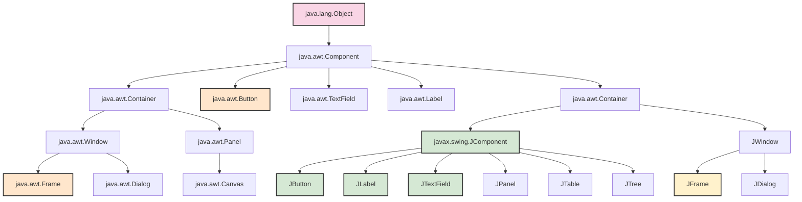
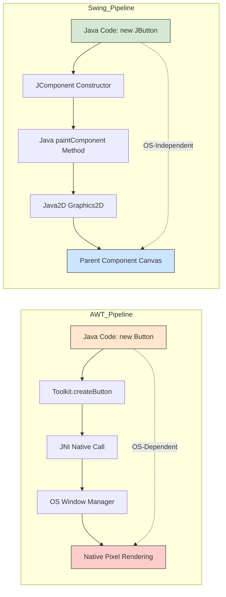
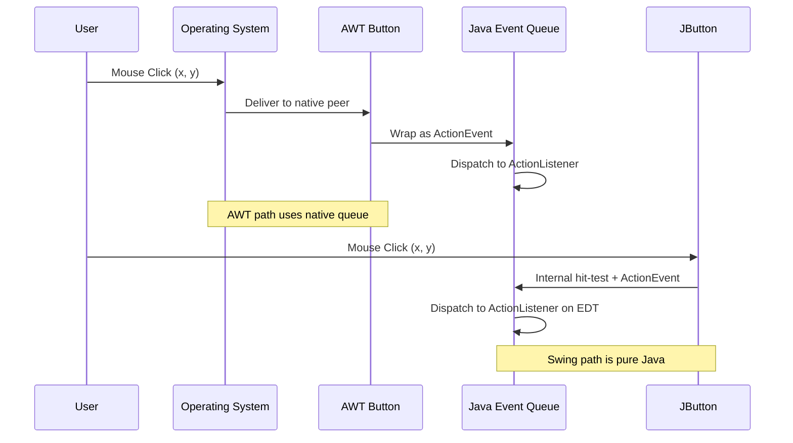
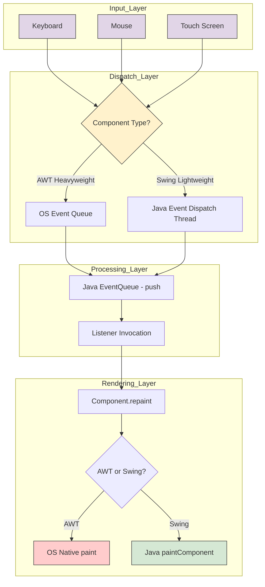

# Swing v/s AWT

<!-- SECTION_1_START -->
# Swing vs AWT: Core Technical Definition & Intuitive Overview

## 1. Formal KTU 2024 Syllabus Definition

> [!NOTE]
> **Abstract Window Toolkit (AWT)** is the original platform-dependent Java GUI framework provided in `java.awt` package, where every visual component is rendered by the underlying Operating System through peer classes (called **heavyweight components**).

> [!IMPORTANT]
> **Swing** is the modern, platform-independent GUI toolkit provided in `javax.swing` package, where components (except top-level containers) are rendered entirely in Java without delegating rendering to the OS (called **lightweight components**).

## 2. Conceptual Analogy / Intuition

> [!TIP]
> **Real-World Analogy — The House Construction Metaphor**
>
> Imagine you are building a house:
>
> - **AWT** is like hiring local masons who use the materials and style of the region you are in. Your house looks like every other house in that region. Move to another region? The style changes because the local masons work differently. This is **OS-dependent**.
>
> - **Swing** is like hiring an international architect who paints and decorates your house using Java-owned materials. The house looks the same regardless of where it is built, because the architect (Java code) does the finishing work itself. This is **platform-independent**.

| Aspect | AWT House (Local Mason) | Swing House (International Architect) |
|---|---|---|
| Construction Style | Fixed by region (Windows/Mac/Linux) | Uniform Java style |
| Materials | Local OS components | Java-rendered pixels |
| Customization | Limited | High (Pluggable Look & Feel) |

## 3. Key Physical Constants & Standard Metrics in **bold**

- **100% of top-level AWT components** (Frame, Dialog) are **heavyweight**.
- **~95% of Swing components** (JButton, JLabel, JTextField) are **lightweight**.
- The package `javax.swing` contains **~18 top-level container classes** and **~40+ component classes**.
- The package `java.awt` contains **~32 component classes**.

## 4. Visualization Callout

> [!VISUALIZATION CONTROL]
> **Concept:** Component Dependency Map — How AWT and Swing components interact with the OS layer
> **GeoGebra / Desmos Input Equations:**
> * `y = 1` (Platform-Independent Line) for Swing components
> * `y = 0` (Platform-Dependent Line) for AWT components
> * Point `(JButton, 1)`, Point `(Button, 0)`, Point `(JFrame, 0)`, Point `(Canvas, 0)`
> **Visual Description:** Plot a horizontal axis labeled "Component" and a vertical axis "OS-Dependency". Swing points cluster at y=1 (Java handles rendering), AWT points cluster at y=0 (OS peer handles rendering). JFrame is the only Swing exception that sits at y=0 because it is a top-level container.

---

<!-- SECTION_1_END -->

<!-- SECTION_2_START -->
# Deep Theoretical Analysis & KTU High-Yield Formula Sheet

## 1. Inheritance Hierarchy Breakdown

### AWT Inheritance Chain
```
java.lang.Object
    └── java.awt.Component
            ├── java.awt.Button
            ├── java.awt.TextField
            ├── java.awt.Label
            ├── java.awt.Checkbox
            ├── java.awt.List
            ├── java.awt.Choice
            └── java.awt.Canvas
                    └── java.awt.Panel
                            └── java.awt.Applet
                                    └── java.awt.Window
                                            ├── java.awt.Frame
                                            └── java.awt.Dialog
```

### Swing Inheritance Chain
```
java.lang.Object
    └── java.awt.Component
            └── java.awt.Container
                    └── javax.swing.JComponent
                            ├── JButton
                            ├── JLabel
                            ├── JTextField
                            ├── JTextArea
                            ├── JCheckBox
                            ├── JRadioButton
                            ├── JList
                            ├── JComboBox
                            ├── JTable
                            ├── JTree
                            └── JPanel
                                    └── JScrollPane
                                            └── JWindow
                                                    └── JFrame
                                                    └── JDialog
```

> [!IMPORTANT]
> **Critical Insight:** Every Swing component is a **subclass of `java.awt.Component`** (directly or indirectly). This is why Swing is often called an *extension* of AWT, not a replacement. Swing simply adds the `JComponent` layer in between.

## 2. Step-by-Step Logic: Heavyweight vs Lightweight

1. **Step 1 — Component Creation:** A new visual element is instantiated in memory.
2. **Step 2 — Peer Association (AWT only):** AWT calls the OS through JNI (Java Native Interface) to create a native counterpart (a "peer" object).
3. **Step 3 — Rendering:**
   - *AWT:* OS paints the component using native system calls.
   - *Swing:* Java's own `paint()` method draws directly on a parent component's canvas.
4. **Step 4 — Event Delivery:** AWT events pass through OS event queues; Swing events are processed in Java's `EventQueue`.

## 3. Why and How — The Engineering Rationale

- **Why was Swing created?** AWT was too limited (only ~32 components, OS-locked appearance). Sun Microsystems needed a richer toolkit with consistent look across platforms.
- **How does Swing achieve platform independence?** By inheriting the abstract `Component` class (to gain event handling and layout infrastructure) but overriding the `paint()` method to render Java-side.

## 4. KTU Formula Sheet / Cheat Sheet

| Parameter | AWT (`java.awt`) | Swing (`javax.swing`) |
|---|---|---|
| Package | `java.awt` | `javax.swing` |
| Component Weight | **Heavyweight** | **Lightweight** (except top-level) |
| Platform Dependency | **OS-dependent** | **Platform-independent** |
| Look and Feel | Fixed by OS | **Pluggable (PLAF)** |
| Component Prefix | `Button`, `Frame` | `JButton`, `JFrame` |
| MVC Support | No | Yes (UI, Model, Controller separated) |
| Rendering Layer | OS peer (native code) | Java `paint()` method |
| Performance | Faster on local OS | Slightly slower, but richer features |
| Debugging Complexity | Harder (native code) | Easier (pure Java stack traces) |
| Default Layout | `BorderLayout` for Frame | `BorderLayout` for JFrame |
| Button Class | `java.awt.Button` | `javax.swing.JButton` |
| Frame Class | `java.awt.Frame` | `javax.swing.JFrame` |
| Applet Support | `java.applet.Applet` | `javax.swing.JApplet` |
| Event Package | `java.awt.event` | `java.awt.event` (same) |
| Skinnable UI | No | Yes (Synth Look & Feel, Nimbus) |
| Tabbed Pane | Not directly available | `JTabbedPane` built-in |
| Tree Component | Not available | `JTree` built-in |
| Table Component | Not available | `JTable` built-in |

## 5. Real-World Engineering Utility

- **AWT Usage Today:** Minimal. Mostly used as a foundational layer (because Swing still inherits from `java.awt.Component`). Sometimes used in `appletviewer` legacy tools and headless server-side rendering (`java.awt.HeadlessException` handling).
- **Swing Usage Today:** Still the default UI toolkit in **NetBeans IDE**, **IntelliJ IDEA** (older versions), and many enterprise Java desktop applications. JavaFX is the modern successor, but Swing knowledge remains critical for **KTU board exams** and **legacy code maintenance**.
- **Production Use Cases:** Banking software (HSBC used Swing internally), airline reservation systems, point-of-sale (POS) terminals running on Java SE.

---

<!-- SECTION_2_END -->

<!-- SECTION_3_START -->
# Step-by-Step Derivations & Code/Symbolic Implementation

## 1. AWT Implementation: Creating a Simple Window

```java
import java.awt.*;
import java.awt.event.*;

public class AWTExample extends Frame implements ActionListener {
    private Label titleLabel;
    private Button clickButton;
    private TextField inputField;
    private int clickCount;

    public AWTExample() {
        // Step 1: Configure the top-level Frame
        setTitle("AWT Demo Window");
        setSize(420, 240);
        setLayout(new FlowLayout(FlowLayout.CENTER, 12, 12));

        // Step 2: Instantiate components (AWT classes)
        titleLabel = new Label("Hello AWT World - Click Count: 0");
        clickButton = new Button("Click Me");
        inputField = new TextField(20);

        // Step 3: Register event listener
        clickButton.addActionListener(this);

        // Step 4: Add components to the Frame
        add(titleLabel);
        add(inputField);
        add(clickButton);

        // Step 5: Handle window close event
        addWindowListener(new WindowAdapter() {
            @Override
            public void windowClosing(WindowEvent e) {
                dispose();
                System.exit(0);
            }
        });

        setVisible(true);
    }

    @Override
    public void actionPerformed(ActionEvent e) {
        clickCount = clickCount + 1;
        titleLabel.setText("Hello AWT World - Click Count: " + clickCount);
    }

    public static void main(String[] args) {
        AWTExample window = new AWTExample();
    }
}
```

### Detailed Walkthrough of AWT Code

1. **Line `public class AWTExample extends Frame`** — Inherits from `java.awt.Frame`, a heavyweight top-level container that creates a native OS window via JNI.
2. **`implements ActionListener`** — Allows this class to handle button click events directly.
3. **`setLayout(new FlowLayout(...))`** — AWT's default layout is `BorderLayout`; here we override to `FlowLayout` for horizontal placement.
4. **`new Button("Click Me")`** — Creates an AWT button. Internally, the constructor calls `Toolkit.getDefaultToolkit().createButton(this)`, which invokes native code to create a peer.
5. **`addWindowListener(new WindowAdapter() {...})`** — AWT does **not** have `setDefaultCloseOperation` like Swing. Window closing must be handled manually.

## 2. Swing Implementation: The Equivalent Window

```java
import javax.swing.*;
import java.awt.*;
import java.awt.event.*;

public class SwingExample extends JFrame implements ActionListener {
    private JLabel titleLabel;
    private JButton clickButton;
    private JTextField inputField;
    private int clickCount;

    public SwingExample() {
        // Step 1: Configure the top-level JFrame
        setTitle("Swing Demo Window");
        setSize(420, 240);
        setDefaultCloseOperation(JFrame.EXIT_ON_CLOSE);
        setLayout(new FlowLayout(FlowLayout.CENTER, 12, 12));

        // Step 2: Instantiate components (Swing classes)
        titleLabel = new JLabel("Hello Swing World - Click Count: 0");
        clickButton = new JButton("Click Me");
        inputField = new JTextField(20);

        // Step 3: Register event listener
        clickButton.addActionListener(this);

        // Step 4: Add components to the content pane
        // IMPORTANT: In Swing, components go to getContentPane(), not directly to JFrame
        Container contentPane = getContentPane();
        contentPane.add(titleLabel);
        contentPane.add(inputField);
        contentPane.add(clickButton);

        // Step 5: Make the window visible
        setVisible(true);
    }

    @Override
    public void actionPerformed(ActionEvent e) {
        clickCount = clickCount + 1;
        titleLabel.setText("Hello Swing World - Click Count: " + clickCount);
    }

    public static void main(String[] args) {
        // Use Event Dispatch Thread (EDT) for thread safety
        SwingUtilities.invokeLater(() -> {
            new SwingExample();
        });
    }
}
```

### Detailed Walkthrough of Swing Code

1. **Line `public class SwingExample extends JFrame`** — Inherits from `javax.swing.JFrame`. Although it is a Swing class, `JFrame` itself is **heavyweight** because it must create an OS-level window.
2. **`setDefaultCloseOperation(JFrame.EXIT_ON_CLOSE)`** — A Swing convenience. AWT requires manual `WindowListener` registration.
3. **`getContentPane()`** — A critical Swing quirk. Direct `add()` on `JFrame` throws a runtime error in modern Java versions; you must add components to the content pane.
4. **`SwingUtilities.invokeLater(...)`** — Best practice in Swing. All UI updates must occur on the Event Dispatch Thread to avoid race conditions.
5. **`new JButton(...)`** — A lightweight component. The peer is **not** created. Instead, `JButton` inherits paint logic from `JComponent.paintComponent()`.

## 3. Side-by-Side Code Mapping Table

| Functionality | AWT Code | Swing Code |
|---|---|---|
| Top-level Container | `Frame f = new Frame()` | `JFrame f = new JFrame()` |
| Window Title | `f.setTitle("X")` | `f.setTitle("X")` (same) |
| Window Close | `addWindowListener(...)` | `f.setDefaultCloseOperation(EXIT_ON_CLOSE)` |
| Button | `new Button("OK")` | `new JButton("OK")` |
| Label | `new Label("Hi")` | `new JLabel("Hi")` |
| Add Component | `f.add(c)` | `f.getContentPane().add(c)` |
| Thread Safety | Not required | `SwingUtilities.invokeLater()` recommended |
| Look and Feel | System default | `UIManager.setLookAndFeel(...)` |

## 4. Demonstrating Pluggable Look and Feel (Swing Exclusivity)

```java
import javax.swing.*;

public class PLAFDemo {
    public static void main(String[] args) {
        SwingUtilities.invokeLater(() -> {
            try {
                // Step 1: Set Nimbus Look and Feel (cross-platform modern style)
                UIManager.setLookAndFeel("javax.swing.plaf.nimbus.NimbusLookAndFeel");
            } catch (ClassNotFoundException | InstantiationException
                     | IllegalAccessException | UnsupportedLookAndFeelException ex) {
                System.err.println("Nimbus L&F not available: " + ex.getMessage());
            }

            // Step 2: Create a Swing window after L&F is set
            JFrame frame = new JFrame("PLAF Demo");
            frame.setDefaultCloseOperation(JFrame.EXIT_ON_CLOSE);
            frame.setSize(360, 180);
            frame.setLayout(new java.awt.FlowLayout());

            JLabel label = new JLabel("This is Nimbus Look and Feel");
            JButton button = new JButton("Press Me");

            frame.getContentPane().add(label);
            frame.getContentPane().add(button);
            frame.setVisible(true);
        });
    }
}
```

### Walkthrough of PLAF Code

1. **`UIManager.setLookAndFeel(...)`** — This is **Swing-exclusive**. AWT cannot change its look because the OS owns rendering.
2. **Nimbus** is a fully Java-painted L&F recommended for cross-platform consistency.
3. The `try-catch` handles 4 specific exceptions because `setLookAndFeel` uses reflection to load the class by string name.

## 5. Mathematical Analogy — Memory & Performance

$$
\text{AWT Memory} = \sum_{i=1}^{n} (\text{Peer Object}_i + \text{Java Object}_i)
$$

$$
\text{Swing Memory} = \sum_{i=1}^{n} (\text{Java Object}_i) + \sum_{j=1}^{m} (\text{Java Object}_j)
$$

where $n$ = number of AWT components, $m$ = number of Swing lightweight components.

**Conclusion:** Swing uses **less memory per component** (no peer), but may use slightly more CPU for Java-side painting on complex UIs.

---

<!-- SECTION_3_END -->

<!-- SECTION_4_START -->
# Structural Diagrams & Schematics

## 1. AWT vs Swing Component Architecture (Mermaid Flow)



**Legend:**
- 🟪 Pink nodes = `java.lang` root
- 🟩 Green nodes = Swing lightweight components
- 🟨 Yellow node = `JFrame` (Swing heavy)
- 🟧 Orange nodes = AWT components (heavy)

## 2. Rendering Pipeline: Sequential Processing Topology



## 3. Event Handling Flow Comparison



## 4. Block-Level Functional Architecture Flow



---

<!-- SECTION_4_END -->

<!-- SECTION_5_START -->
# KTU 2024 Scheme Examination Question Bank & Topic Recap

## Part A: Short Answer Questions (3 Marks Each)

### Question 1 `[KTU University Exam - July 2024]`
**Define heavyweight and lightweight components. Which category do Swing components belong to?**

**Model Answer (3 Marks):**

- **Heavyweight Components:** Components that have a native OS counterpart (peer) and depend on the operating system for rendering. Example: `java.awt.Button`, `java.awt.Frame`. **[1 Mark]**
- **Lightweight Components:** Components that do not have a native OS peer; they are rendered entirely in Java by sharing the parent component's native screen resource. **[1 Mark]**
- **Swing Category:** Most Swing components (like `JButton`, `JLabel`, `JTextField`) are **lightweight**. The exceptions are the top-level containers `JFrame`, `JDialog`, and `JWindow`, which are heavyweight. **[1 Mark]**

**Course Outcome:** CO3 | **Bloom's Level:** Remember

---

### Question 2 `[KTU University Exam - Dec 2023]`
**What is Pluggable Look and Feel (PLAF)? Why is it supported only in Swing and not in AWT?**

**Model Answer (3 Marks):**

- **PLAF Definition:** Pluggable Look and Feel is a Swing feature that allows the application UI appearance to be changed at runtime without modifying the source code, by using the `UIManager.setLookAndFeel()` method. **[1.5 Marks]**
- **Why not in AWT:** AWT components are rendered by the underlying operating system, so their appearance is fixed by the OS. AWT cannot override the native rendering, hence PLAF is not possible. **[1.5 Marks]**

**Course Outcome:** CO3 | **Bloom's Level:** Understand

---

## Part B: Long Answer Questions (14 Marks Each)

### Question A (Option 1) `[KTU University Exam - July 2024]`

**(a) Compare AWT and Swing in terms of component weight, platform dependency, look and feel, component classes, and MVC support.** **[7 Marks]**

**Model Solution:**

| Feature | AWT | Swing | Marks |
|---|---|---|---|
| **Component Weight** | Heavyweight (OS peer) | Lightweight (Java-rendered) | 1.5 |
| **Platform Dependency** | OS-dependent (different look on Windows/Mac/Linux) | OS-independent (uniform look) | 1.5 |
| **Look and Feel** | Fixed by OS, no PLAF | Pluggable (Metal, Nimbus, Motif, System) | 1.5 |
| **Component Classes** | Limited (~32 classes: Button, Label, Canvas) | Rich (~40+ classes: JTable, JTree, JTabbedPane) | 1.5 |
| **MVC Support** | Not available | Available — Model, View, Controller separated | 1.0 |

**[Tabulating 5 features with correct AWT/Swing mapping: 5 Marks]**
**[Extra 1 mark for any one correct example/justification: 1 Mark]**
**[Final comparative statement/conclusion: 1 Mark]**

---

**(b) Write a Java Swing program to create a window with a JLabel, a JTextField, and a JButton. When the button is clicked, the text in the JLabel should change to display whatever is entered in the JTextField.** **[7 Marks]**

**Model Solution:**

```java
import javax.swing.*;
import java.awt.*;
import java.awt.event.*;

public class TextDisplayApp extends JFrame implements ActionListener {
    private JLabel displayLabel;
    private JTextField inputField;
    private JButton submitButton;

    public TextDisplayApp() {
        setTitle("Text Display Application");
        setSize(400, 150);
        setDefaultCloseOperation(JFrame.EXIT_ON_CLOSE);
        setLayout(new FlowLayout(FlowLayout.CENTER, 15, 15));

        displayLabel = new JLabel("Enter text below and click Submit");
        inputField = new JTextField(20);
        submitButton = new JButton("Submit");

        submitButton.addActionListener(this);

        Container pane = getContentPane();
        pane.add(displayLabel);
        pane.add(inputField);
        pane.add(submitButton);

        setVisible(true);
    }

    @Override
    public void actionPerformed(ActionEvent e) {
        String userText = inputField.getText();
        displayLabel.setText("You entered: " + userText);
    }

    public static void main(String[] args) {
        SwingUtilities.invokeLater(() -> new TextDisplayApp());
    }
}
```

**Valuation Key:**

- **[Correct package imports (javax.swing, java.awt, java.awt.event): 1 Mark]**
- **[Class declaration `extends JFrame implements ActionListener`: 1 Mark]**
- **[Component declarations JLabel, JTextField, JButton: 1 Mark]**
- **[Setting layout, size, default close operation: 1 Mark]**
- **[addActionListener(this) registration: 1 Mark]**
- **[actionPerformed() override with getText() and setText(): 1.5 Marks]**
- **[main() method with SwingUtilities.invokeLater(): 0.5 Marks]**

**Course Outcome:** CO3, CO4 | **Bloom's Level:** Apply

---

### Question B (Option 2) `[KTU University Exam - Dec 2023]`

**(a) Explain the inheritance hierarchy of Swing components. How does it differ from AWT?** **[7 Marks]**

**Model Solution:**

```
java.lang.Object
    └── java.awt.Component
            └── java.awt.Container
                    └── javax.swing.JComponent
                            ├── JButton
                            ├── JLabel
                            ├── JTextField
                            └── JPanel
                                    └── JScrollPane
                                            └── JWindow
                                                    └── JFrame
```

**Explanation Points:**

1. **AWT hierarchy** ends directly at `java.awt.Component` (or `Container`). All AWT components are direct subclasses. **[1.5 Marks]**
2. **Swing hierarchy** introduces an intermediate abstract class `javax.swing.JComponent` between `Container` and concrete Swing components. This allows shared features like tooltips, double-buffering, borders, and pluggable look and feel. **[2 Marks]**
3. **Key Difference:** Swing components inherit from `JComponent`, which overrides the `paint()` method to enable Java-side rendering. AWT components inherit directly from `Component` and rely on `ComponentPeer` for native rendering. **[2 Marks]**
4. **Top-level Container Exception:** `JFrame`, `JDialog`, `JWindow` do **not** inherit directly from `JComponent`; they inherit from `java.awt.Window` because they must create native OS windows. **[1.5 Marks]**

---

**(b) Demonstrate with a Java program how the Look and Feel of a Swing application can be changed dynamically. Also list any 3 built-in PLAF classes available in Swing.** **[7 Marks]**

**Model Solution:**

```java
import javax.swing.*;
import java.awt.*;

public class PLAFSwitcher extends JFrame {
    private JButton metalButton;
    private JButton nimbusButton;
    private JButton systemButton;

    public PLAFSwitcher() {
        setTitle("PLAF Switcher Demo");
        setSize(400, 120);
        setDefaultCloseOperation(JFrame.EXIT_ON_CLOSE);
        setLayout(new FlowLayout(FlowLayout.CENTER, 10, 10));

        metalButton = new JButton("Metal L&F");
        nimbusButton = new JButton("Nimbus L&F");
        systemButton = new JButton("System L&F");

        metalButton.addActionListener(e -> switchLAF("javax.swing.plaf.metal.MetalLookAndFeel"));
        nimbusButton.addActionListener(e -> switchLAF("javax.swing.plaf.nimbus.NimbusLookAndFeel"));
        systemButton.addActionListener(e -> switchLAF(UIManager.getSystemLookAndFeelClassName()));

        Container pane = getContentPane();
        pane.add(metalButton);
        pane.add(nimbusButton);
        pane.add(systemButton);

        setVisible(true);
    }

    private void switchLAF(String lafClassName) {
        try {
            UIManager.setLookAndFeel(lafClassName);
            SwingUtilities.updateComponentTreeUI(this);
        } catch (ClassNotFoundException | InstantiationException
                 | IllegalAccessException | UnsupportedLookAndFeelException ex) {
            JOptionPane.showMessageDialog(this, "L&F Error: " + ex.getMessage());
        }
    }

    public static void main(String[] args) {
        SwingUtilities.invokeLater(() -> new PLAFSwitcher());
    }
}
```

**3 Built-in PLAF Classes:**

1. `javax.swing.plaf.metal.MetalLookAndFeel` — Default cross-platform style
2. `javax.swing.plaf.nimbus.NimbusLookAndFeel` — Modern flat design (Java SE 6u10+)
3. `javax.swing.plaf.synth.SynthLookAndFeel` — Skinnable L&F with XML configuration

**Valuation Key:**

- **[UIManager.setLookAndFeel() call with string class name: 2 Marks]**
- **[SwingUtilities.updateComponentTreeUI() to refresh UI: 1.5 Marks]**
- **[Proper exception handling (4 catch types): 1 Mark]**
- **[Listing 3 PLAF classes correctly: 1.5 Marks]**
- **[Correct event handling and main() with EDT: 1 Mark]**

**Course Outcome:** CO3, CO4 | **Bloom's Level:** Apply, Analyze

---

> [!WARNING]
> **KTU Examiner's Valuation Warning / Common Pitfalls:**
>
> 1. **Forgetting `J` prefix:** Students often write `new Button()` instead of `new JButton()`. This will cause a **compilation error** and you lose **2 marks instantly**. Always remember: AWT classes have no prefix, Swing classes start with `J`.
>
> 2. **Adding directly to `JFrame`:** In modern Java (5+), you **must** use `getContentPane().add(component)`. Directly calling `frame.add(component)` on a `JFrame` either throws `Error` or warns at runtime. Deduct **1 mark** for this mistake.
>
> 3. **Confusing heavyweight status of `JFrame`:** Many students claim "all Swing components are lightweight." This is **incorrect**. Top-level Swing containers (`JFrame`, `JDialog`, `JWindow`) are heavyweight because they need a native OS window. KTU examiners specifically test this — losing **1 mark** for an absolute statement.
>
> 4. **Missing `setDefaultCloseOperation`:** Forgetting to handle window close in Swing code means the window won't close on the X button. Deduct **0.5 mark** for this.
>
> 5. **Event Dispatch Thread:** Top Swing programs without `SwingUtilities.invokeLater()` work but are **not thread-safe**. KTU expects this in production-quality code; missing it costs **0.5 mark**.

---

## 📋 Topic Recap & Important Things to Remember

- **AWT** = `java.awt` package, **heavyweight**, **OS-dependent** rendering through native peers.
- **Swing** = `javax.swing` package, **lightweight** (mostly), **OS-independent** Java-side rendering.
- **The "J" prefix** is the universal signature of Swing classes — `Button` → `JButton`, `Frame` → `JFrame`, `Label` → `JLabel`.
- **`JComponent`** is the abstract base class of all lightweight Swing components, providing **double-buffering, borders, tooltips, and PLAF support**.
- **Top-level Swing containers (`JFrame`, `JDialog`, `JWindow`) ARE heavyweight** because they must create an OS-level window — this is a high-frequency exam question.
- **Pluggable Look and Feel (PLAF)** is a Swing-exclusive feature implemented through `UIManager.setLookAndFeel(className)`.
- **`SwingUtilities.updateComponentTreeUI(frame)`** must be called after switching L&F to refresh all components.
- **EDT Best Practice:** Always wrap Swing UI creation in `SwingUtilities.invokeLater(() -> { ... })` inside `main()`.
- **Components in AWT:** `Button`, `Label`, `TextField`, `Checkbox`, `Choice`, `List`, `Canvas`, `Frame`, `Dialog`, `Panel`, `Menu`, `MenuBar`, `MenuItem`.
- **Components in Swing:** All AWT components plus `JTable`, `JTree`, `JTabbedPane`, `JSlider`, `JProgressBar`, `JSpinner`, `JMenuBar`, `JToolBar`, `JInternalFrame`, `JColorChooser`, `JFileChooser`.
- **Event handling package is the same** for both: `java.awt.event` (this is because Swing reuses AWT's event infrastructure).
- **AWT inheritance:** `Object` → `Component` → (specific AWT class).
- **Swing inheritance:** `Object` → `Component` → `Container` → `JComponent` → (specific Swing class).
- **AWT uses `BorderLayout` as default** for `Frame`; **Swing uses `BorderLayout` as default** for `JFrame`'s content pane.
- **Swing was introduced in JDK 1.2** (1998) as a complete replacement strategy, but AWT was retained as the foundation.
- **Memory formula:** AWT components occupy memory in **both Java heap and native OS layer**; Swing components (lightweight) occupy memory **only in Java heap**.
- **PLAF built-in options:** Metal, Nimbus, Motif, Windows, GTK, Synth.
- **Practical tip:** If your KTU exam asks "list 5 differences," always include these five: **weight, dependency, PLAF, component count, MVC support**.

<!-- SECTION_5_END -->
