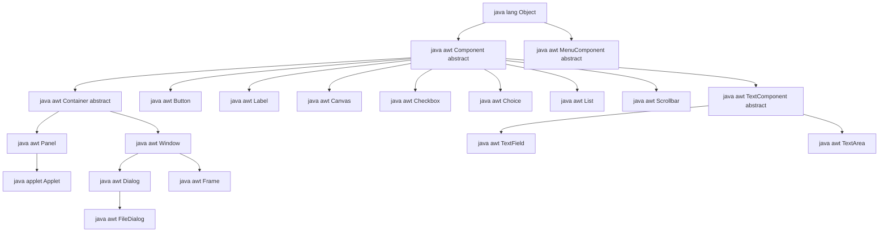
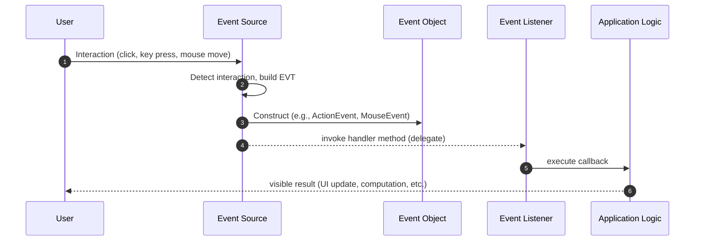
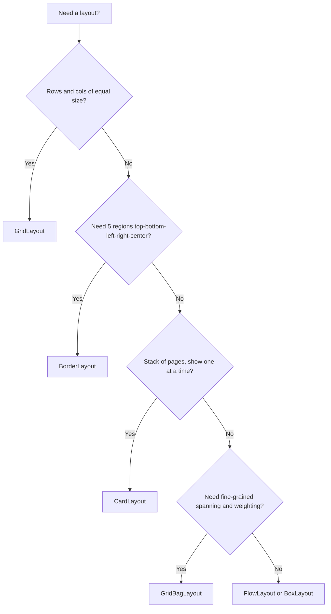
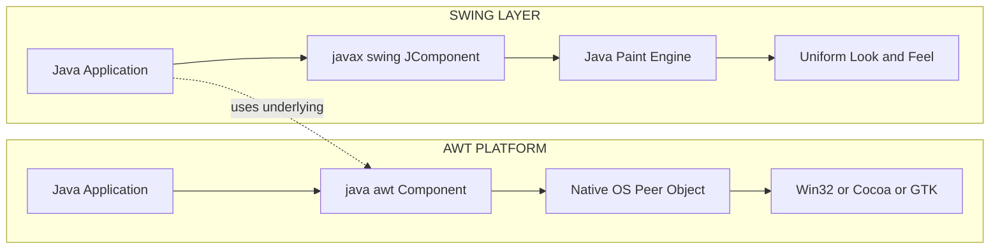
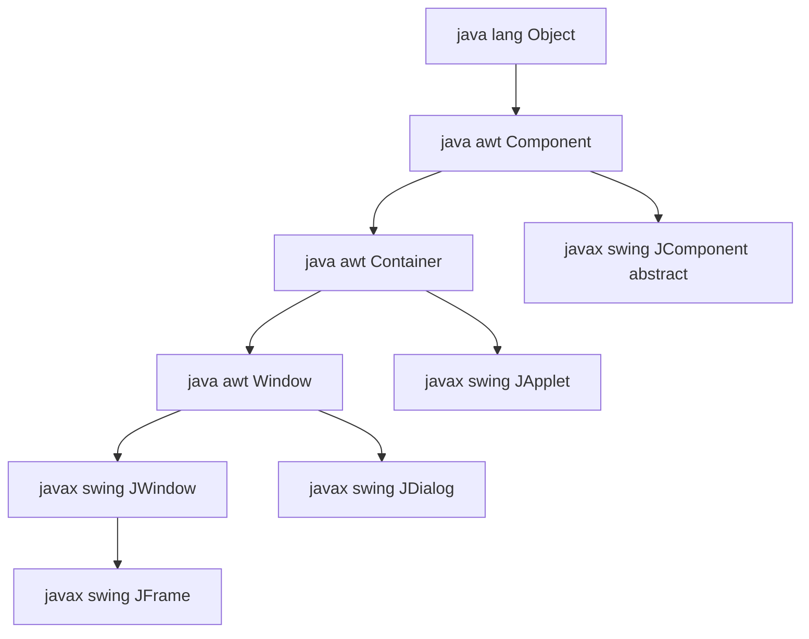
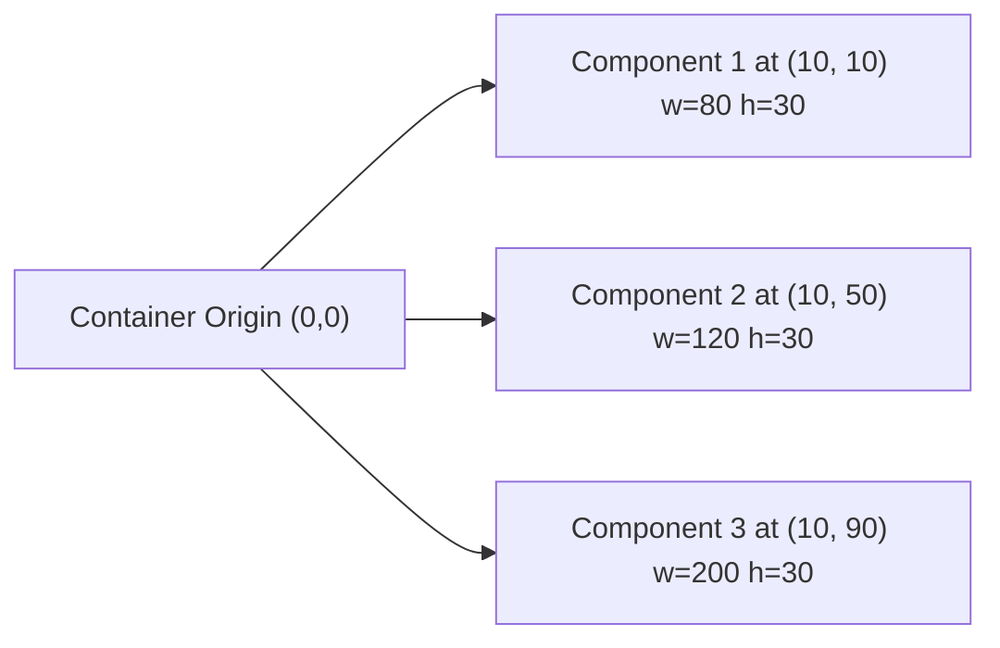

# Swings fundamentals  – Overview of AWT

<!-- SECTION_1_START -->
# Module 4 — Swings Fundamentals & Overview of AWT

## 1.1 Formal Definition: Abstract Window Toolkit (AWT)

The **Abstract Window Toolkit (AWT)** is the original platform-dependent windowing, graphics, and user-interface widget toolkit provided by `java.awt` in the Java standard library. AWT supplies the foundational classes required to build Graphical User Interfaces (GUIs), render primitive shapes, manage fonts, handle layout, and process user input events at the operating system level.

> [!IMPORTANT]
> **KTU 2024 Syllabus Definition (Verbatim):**
> *AWT is a set of application program interfaces (APIs) used by Java applets and applications to create GUI components. AWT provides platform-specific implementation through its component peers, which map 1:1 to the underlying OS native widgets.*

The package hierarchy relevant to AWT is:
- `java.lang.Object`
- `java.awt.Component` — *abstract* base class for all UI elements that can be placed on the screen.
- `java.awt.Container` — *abstract* subclass of `Component` that can hold other components.

> [!NOTE]
> **Heavyweight vs. Lightweight Components (Core Distinction)**
> AWT components are **heavyweight**, meaning each AWT component has a *peer object* (a native OS resource) allocated by the underlying operating system. This is why an AWT `Button` on Windows looks different from the same AWT `Button` on macOS — the rendering is delegated to the platform's native toolkit (Win32, Cocoa, GTK, etc.).

## 1.2 Conceptual Analogy — The "Blueprint vs. Decorated House" Model

Imagine you are an architect designing a house.

- **AWT is the basic concrete-and-brick structure** of the house. It uses *whatever bricks the local builder (the OS) supplies*. The walls (components) are sturdy, but the final appearance (look-and-feel) is dictated by the brick manufacturer (platform). If you build the same house in Kerala or in Delhi, the bricks look slightly different, but the floor plan is identical.
- **Swing (`javax.swing`)** is the *interior decorator* that paints over the AWT structure using 100% Java code (`LightweightPeer`). No matter where the house is built, the painted walls look exactly the same because the *Java paint engine* draws them, not the OS.

**Why does this matter?**
- AWT gives a *native* look (familiar to users on their OS).
- Swing gives a *pluggable look-and-feel* (consistent across platforms, plus theme support like Metal, Nimbus, Motif, Windows LAF).

## 1.3 The AWT Class Hierarchy (Top-Level View)

The AWT class tree is rooted in `java.lang.Object`. The two critical abstract superclasses are `Component` and `MenuComponent`. Every visible AWT widget extends `Component`; every menu widget extends `MenuComponent`.

> [!TIP]
> **Mnemonic for remembering AWT Component children:** *"Bears Love Tiny Cupcakes Check Cheese Lists Soups"*
> **B**utton, **L**abel, **T**extField, **C**anvas, **C**heckbox, **C**hoice, **L**ist, **S**crollbar

## 1.4 What are Swings?

**Swing** is the second-generation GUI toolkit (introduced in **JDK 1.2**, 1998) and lives in the `javax.swing` package. The "J" prefix on every Swing class (`JButton`, `JLabel`, `JFrame`) is the universal cue for distinguishing Swing components from their AWT ancestors.

> [!IMPORTANT]
> **KTU 2024 Highlight:**
> *"Swing is built on top of AWT, NOT as a replacement. Every Swing top-level container (JFrame, JApplet, JDialog, JWindow) ultimately extends an AWT class and uses AWT's Event Delegation Model."*

> [!VISUALIZATION CONTROL]
> **Concept:** Component Coordinate System of an AWT Container
> **Conceptual Plot (origin at top-left of the container):**
> * Container bounds: $\text{width} = w$, $\text{height} = h$
> * Component $C_i$ at position $(x_i, y_i)$ with size $(w_i, h_i)$
> **Visual Description:** Imagine the screen as a 2-D Cartesian grid flipped vertically (y increases *downward*). The `Component` class exposes `getX()`, `getY()`, `getWidth()`, `getHeight()` which return the bounding box of every drawn widget. A `Frame` (the top-level window) has $x=0$, $y=0$ relative to the screen, and its child components are positioned relative to the `Frame`'s content pane.

## 1.5 Event Delegation Model (EDM) — The Heart of AWT/Swing

AWT introduced the **Event Delegation Model** in **JDK 1.1**, replacing the old Java 1.0 event-inheritance chain. The model is built on three collaborating entities:

| Entity | Role | Example |
|---|---|---|
| **Event Source** | Object that generates the event when interacted with. | `JButton`, `TextField` |
| **Event Object** | Encapsulates information about what happened. | `ActionEvent`, `MouseEvent` |
| **Event Listener** | Interface implemented by objects that *want* to receive notifications. | `ActionListener`, `MouseListener` |

> [!NOTE]
> **The "Publisher–Subscriber" Analogy:**
> Think of a YouTube channel. The channel is the *Event Source*. A subscriber who clicks "Subscribe" is a *Listener*. When a new video (Event Object) is uploaded, only the subscribers (Listeners) get notified — the channel does not know or care *which* subscribers will respond. This decoupling is the essence of the delegation model.

---

<!-- SECTION_1_END -->

<!-- SECTION_2_START -->
# 2. Deep Theoretical Analysis & KTU High-Yield Formula Sheet

## 2.1 AWT Component Hierarchy — Detailed Breakdown

```
java.lang.Object
 └── java.awt.Component (abstract)
      ├── java.awt.Button
      ├── java.awt.Canvas
      ├── java.awt.Checkbox
      ├── java.awt.Choice
      ├── java.awt.Label
      ├── java.awt.List
      ├── java.awt.Scrollbar
      ├── java.awt.TextComponent (abstract)
      │    ├── java.awt.TextField
      │    └── java.awt.TextArea
      └── java.awt.Container (abstract)
           ├── java.awt.Panel
           │    └── java.applet.Applet
           └── java.awt.Window
                ├── java.awt.Dialog
                │    └── java.awt.FileDialog
                └── java.awt.Frame
                     └── (subclassed by the user's MyFrame)
```

**Key behavioural points about `java.awt.Component`:**
- It is `abstract`, so you **cannot** instantiate it directly.
- It implements the `ImageObserver`, `MenuContainer`, and `Serializable` interfaces.
- It provides methods such as `setSize(int, int)`, `setLocation(int, int)`, `setBounds(int, int, int, int)`, `setVisible(boolean)`, `setEnabled(boolean)`, `setForeground(Color)`, `setBackground(Color)`, and `setFont(Font)`.

**Key behavioural points about `java.awt.Container`:**
- It extends `Component`.
- It adds the `add(Component)` and `setLayout(LayoutManager)` methods.
- It internally stores a `List<Component> components` that the layout manager walks during `doLayout()` / `layoutContainer()`.

## 2.2 AWT Container Subclasses in Detail

| Container | Default Layout | Can Contain Menus? | Can Contain Other Windows? | Typical Use |
|---|---|---|---|---|
| `Panel` | `FlowLayout` | No | No | Grouping components; embedded in `Applet` or `Frame`. |
| `Applet` | `FlowLayout` | No | No | Browser-based GUI (deprecated in modern web). |
| `Window` | `BorderLayout` | No | No | Borderless window (rarely used directly). |
| `Dialog` | `BorderLayout` | No | No | Modal/non-modal pop-up. |
| `Frame` | `BorderLayout` | Yes (`MenuBar`) | No | Standard top-level application window. |
| `FileDialog` | N/A | No | No | Native file-chooser dialog. |

## 2.3 The Five Standard AWT Layout Managers

| Layout Manager | Constructor | Arrangement Rule | Default Container |
|---|---|---|---|
| `FlowLayout` | `new FlowLayout(int align, int hgap, int vgap)` | Left-to-right, wraps to next line. | `Panel`, `Applet` |
| `BorderLayout` | `new BorderLayout(int hgap, int vgap)` | Five regions: `NORTH`, `SOUTH`, `EAST`, `WEST`, `CENTER`. | `Window`, `Frame`, `Dialog` |
| `GridLayout` | `new GridLayout(int rows, int cols, int hgap, int vgap)` | Equal-sized cells in a rectangular grid. | None |
| `GridBagLayout` | `new GridBagLayout()` | Cells may span multiple rows/columns, variable size, weighted. | None |
| `CardLayout` | `new CardLayout(int hgap, int vgap)` | Stack of "cards", only one visible at a time. | None |
| `BoxLayout` (in `javax.swing`) | `new BoxLayout(container, axis)` | Single row or column; respects preferred size. | Swing containers |

> [!TIP]
> **KTU Board-Exam Tip:** When asked to draw the layout output, the default `BorderLayout` will *stretch* the `NORTH` and `SOUTH` regions to the full width, *stretch* the `EAST` and `WEST` to the full available height, and give all leftover space to `CENTER`.

## 2.4 AWT Event Class Hierarchy

The root of the event class tree is `java.util.EventObject`. The AWT-specific tree lives in `java.awt`.

```
java.util.EventObject
 └── java.awt.AWTEvent
      ├── java.awt.event.ActionEvent
      ├── java.awt.event.AdjustmentEvent
      ├── java.awt.event.ComponentEvent
      │     ├── java.awt.event.HierarchyEvent
      │     ├── java.awt.event.InputEvent
      │     │     ├── java.awt.event.KeyEvent
      │     │     └── java.awt.event.MouseEvent
      │     │           └── java.awt.event.MouseWheelEvent
      │     ├── java.awt.event.FocusEvent
      │     ├── java.awt.event.PaintEvent
      │     └── java.awt.event.WindowEvent
      ├── java.awt.event.ContainerEvent
      ├── java.awt.event.ItemEvent
      └── java.awt.event.TextEvent
```

## 2.5 Listener Interfaces in AWT

| Listener Interface | Method(s) | Adapter Class | Triggered By |
|---|---|---|---|
| `ActionListener` | `actionPerformed(ActionEvent)` | None | Button click, menu selection, Enter in text field |
| `MouseListener` | `mouseClicked, mousePressed, mouseReleased, mouseEntered, mouseExited` | `MouseAdapter` | Mouse button and cursor over component |
| `MouseMotionListener` | `mouseDragged, mouseMoved` | `MouseMotionAdapter` | Mouse movement |
| `KeyListener` | `keyTyped, keyPressed, keyReleased` | `KeyAdapter` | Keyboard activity |
| `WindowListener` | 7 methods (opened, closing, closed, activated, deactivated, iconified, deiconified) | `WindowAdapter` | Window state changes |
| `FocusListener` | `focusGained, focusLost` | `FocusAdapter` | Component focus changes |
| `ItemListener` | `itemStateChanged(ItemEvent)` | None | Checkbox/Choice selection |
| `TextListener` | `textValueChanged(TextEvent)` | None | Text modification |
| `AdjustmentListener` | `adjustmentValueChanged` | None | Scrollbar movement |

> [!NOTE]
> **Why Adapter Classes?**
> Listener interfaces like `MouseListener` declare *multiple* abstract methods. Implementing the interface forces you to provide an empty body for methods you do not care about. **Adapter classes** are *no-op default implementations*; you subclass the adapter and override only the methods you actually need — a textbook example of the *Adapter Design Pattern*.

## 2.6 AWT vs. Swing — The Master Comparison Table

| Feature | AWT (`java.awt`) | Swing (`javax.swing`) |
|---|---|---|
| Package | `java.awt` | `javax.swing` |
| Introduced in | JDK 1.0 (1996) | JDK 1.2 (1998) |
| Component weight | **Heavyweight** (uses native peers) | **Lightweight** (pure Java painting, except top-level) |
| Platform look | Native OS look (Win32, Cocoa, GTK) | Pluggable Look-and-Feel (Metal, Nimbus, System) |
| Class prefix | `Button`, `Frame`, `Dialog` | `JButton`, `JFrame`, `JDialog` |
| MVC architecture | Not strictly MVC | Strictly **MVC** (Model–View–Controller) |
| Pluggable LAF | No | Yes — `UIManager.setLookAndFeel(...)` |
| Speed | Faster (native rendering) | Slightly slower (Java rendering) |
| Rich widgets | Limited | `JTable`, `JTree`, `JTabbedPane`, `JSlider`, `JProgressBar` |
| `paint()` override | Yes, but heavyweight peers complicate it | Recommended; full control via `paintComponent(Graphics)` |
| Thread safety | Not thread-safe | Not thread-safe (use `SwingUtilities.invokeLater`) |
| Double buffering | Manual | Built-in |

> [!IMPORTANT]
> **Engineering Utility:**
> Swing's MVC architecture allows the **same data model to be displayed in multiple views simultaneously** (e.g., a `JTable` and a `JTree` both backed by the same `TreeModel`/`TableModel`). This is heavily used in IDEs (NetBeans, IntelliJ) and reporting dashboards.

## 2.7 The Swing Class Hierarchy (Top-Level)

```
java.lang.Object
 └── java.awt.Component
      └── java.awt.Container
           └── java.awt.Window
                └── javax.swing.JWindow
                     └── javax.swing.JFrame
                     └── javax.swing.JDialog
           └── javax.swing.JApplet
      └── javax.swing.JComponent (abstract)
           ├── javax.swing.AbstractButton
           │     ├── javax.swing.JButton
           │     ├── javax.swing.JMenuItem
           │     │     ├── javax.swing.JMenu
           │     │     ├── javax.swing.JCheckBoxMenuItem
           │     │     └── javax.swing.JRadioButtonMenuItem
           │     └── javax.swing.JToggleButton
           │           ├── javax.swing.JCheckBox
           │           └── javax.swing.JRadioButton
           ├── javax.swing.JLabel
           ├── javax.swing.JList
           ├── javax.swing.JComboBox
           ├── javax.swing.JTextField
           ├── javax.swing.JTextArea
           ├── javax.swing.JPanel
           ├── javax.swing.JScrollBar
           ├── javax.swing.JScrollPane
           ├── javax.swing.JTabbedPane
           ├── javax.swing.JTable
           ├── javax.swing.JTree
           ├── javax.swing.JSlider
           ├── javax.swing.JProgressBar
           └── javax.swing.JSeparator
```

> [!NOTE]
> **Critical Realisation:** Even though Swing is "lightweight", every Swing top-level container (`JFrame`, `JDialog`, `JWindow`, `JApplet`) **inherits from AWT** (`java.awt.Window`). This is why Swing applications can never escape AWT's underlying windowing support.

## 2.8 High-Yield Formula Sheet (Cheat Table)

| Concept | Formula / Rule |
|---|---|
| Component bounds | $\text{Bounds} = (x,\,y,\,w,\,h)$ where $w = \text{right} - \text{left}$, $h = \text{bottom} - \text{top}$ |
| BorderLayout regions | $5 = \{ \text{NORTH, SOUTH, EAST, WEST, CENTER} \}$ |
| GridLayout total cells | $N_{\text{cells}} = \text{rows} \times \text{cols}$ |
| Preferred size inflation | $\text{LayoutAdjustedSize} = f(\text{ContainerSize},\,\text{LayoutManager})$ |
| Event listener method count | For interface $I$ with $k$ methods, an anonymous class must implement all $k$. Adapter class reduces this to $0$ defaults. |
| Component coordinate origin | $(0, 0)$ at top-left of the parent container, $y$-axis points **downward** |
| Paint sequence | $\text{update}() \rightarrow \text{paint}() \rightarrow \text{paintComponent}() \rightarrow \text{paintBorder}() \rightarrow \text{paintChildren}()$ |

---

<!-- SECTION_2_END -->

<!-- SECTION_3_START -->
# 3. Step-by-Step Derivations, Code Implementation & Worked Problems

## 3.1 Demonstration 1 — AWT Frame with FlowLayout (No Event Handling)

```java
import java.awt.*;

public class AwtFlowDemo extends Frame {
    // STEP 1: A subclass of Frame is created so we can set up the window in the constructor.
    AwtFlowDemo() {
        // STEP 2: Set a title on the title bar of the native OS window.
        setTitle("KTU AWT FlowLayout Demo");

        // STEP 3: Set the layout manager to FlowLayout with 10px horizontal/vertical gap.
        setLayout(new FlowLayout(FlowLayout.LEFT, 10, 10));

        // STEP 4: Add six native AWT buttons. FlowLayout will wrap them when they overflow.
        add(new Button("Submit"));
        add(new Button("Cancel"));
        add(new Button("Reset"));
        add(new Button("Help"));
        add(new Button("About"));
        add(new Button("Exit"));

        // STEP 5: Explicitly size the frame and make it visible.
        setSize(400, 150);
        setVisible(true);
    }

    public static void main(String[] args) {
        // STEP 6: Launch the frame on the Event Dispatch Thread (good practice even for AWT).
        new AwtFlowDemo();
    }
}
```

**Step-by-step logic (textual):**
- The `AwtFlowDemo` class extends `Frame` — this is the AWT top-level container.
- `setLayout(new FlowLayout(...))` installs the layout manager on the content pane.
- Six `Button` widgets are appended. `FlowLayout` lays them left-to-right, wrapping to the next row when the right edge is reached.
- `setSize(400, 150)` defines a 400×150-pixel window.

## 3.2 Demonstration 2 — AWT BorderLayout

```java
import java.awt.*;

public class AwtBorderDemo extends Frame {
    AwtBorderDemo() {
        setTitle("KTU AWT BorderLayout Demo");
        // STEP 1: BorderLayout is the DEFAULT layout of a Frame, so this line is technically optional.
        setLayout(new BorderLayout(5, 5));   // 5px hgap, 5px vgap

        // STEP 2: Add five components, one per region.
        add(new Button("NORTH"),   BorderLayout.NORTH);
        add(new Button("SOUTH"),   BorderLayout.SOUTH);
        add(new Button("EAST"),    BorderLayout.EAST);
        add(new Button("WEST"),    BorderLayout.WEST);
        add(new Button("CENTER"),  BorderLayout.CENTER);

        setSize(400, 200);
        setVisible(true);
    }

    public static void main(String[] args) {
        new AwtBorderDemo();
    }
}
```

**Output region sizing (derivation):**
- Let total width $= W = 400$ px, total height $= H = 200$ px, horizontal gap $= g_h = 5$ px, vertical gap $= g_v = 5$ px.
- `NORTH` height $\approx 30$ px (preferred height of a `Button`).
- `SOUTH` height $\approx 30$ px.
- After reserving `NORTH`, `SOUTH`, and vertical gaps:
  $$H_{\text{middle}} = H - 30 - 30 - 2 g_v = 200 - 60 - 10 = 130 \text{ px}$$
- `EAST` width + `WEST` width + gaps = remainder for `CENTER`. With default button widths, `CENTER` gets the bulk of the area.

## 3.3 Demonstration 3 — AWT GridLayout

```java
import java.awt.*;

public class AwtGridDemo extends Frame {
    AwtGridDemo() {
        setTitle("KTU AWT GridLayout Demo");
        // STEP 1: 3 rows x 2 columns with 5px gaps.
        setLayout(new GridLayout(3, 2, 5, 5));

        // STEP 2: Six buttons fill the six grid cells.
        for (int i = 1; i <= 6; i++) {
            add(new Button("Btn " + i));
        }

        setSize(300, 200);
        setVisible(true);
    }

    public static void main(String[] args) {
        new AwtGridDemo();
    }
}
```

**Derivation of cell dimensions:**
- Number of cells $N = 3 \times 2 = 6$.
- Width per cell:
  $$w_{\text{cell}} = \frac{W - (n_{\text{cols}} + 1) g_h}{n_{\text{cols}}} = \frac{300 - 3 \times 5}{2} = \frac{285}{2} = 142.5 \text{ px}$$
- Height per cell:
  $$h_{\text{cell}} = \frac{H - (n_{\text{rows}} + 1) g_v}{n_{\text{rows}}} = \frac{200 - 4 \times 5}{3} = \frac{180}{3} = 60 \text{ px}$$

## 3.4 Demonstration 4 — Event Handling with ActionListener (Anonymous Class)

```java
import java.awt.*;
import java.awt.event.*;

public class AwtEventDemo extends Frame implements ActionListener {
    private Label statusLabel;

    AwtEventDemo() {
        setTitle("KTU AWT Event Delegation Demo");
        setLayout(new FlowLayout(FlowLayout.CENTER, 10, 10));

        statusLabel = new Label("No button clicked yet");
        Button btnClick  = new Button("Click Me");
        Button btnReset  = new Button("Reset");

        // STEP 1: Register THIS object as the listener on both buttons.
        btnClick.addActionListener(this);
        btnReset.addActionListener(this);

        add(btnClick);
        add(btnReset);
        add(statusLabel);

        setSize(300, 150);
        setVisible(true);
    }

    // STEP 2: This method runs whenever EITHER button is clicked (delegation target).
    @Override
    public void actionPerformed(ActionEvent e) {
        String cmd = e.getActionCommand();   // Returns the button's label
        if (cmd.equals("Click Me")) {
            statusLabel.setText("Hello from AWT! Timestamp = " + System.currentTimeMillis());
        } else if (cmd.equals("Reset")) {
            statusLabel.setText("Reset pressed — counter cleared.");
        }
    }

    public static void main(String[] args) {
        new AwtEventDemo();
    }
}
```

**Valuation key-point annotations:**
- `[Class implements ActionListener — 1 Mark]`
- `[addActionListener(this) registration — 1 Mark]`
- `[Override actionPerformed with proper signature — 2 Marks]`
- `[Logic inside actionPerformed using e.getActionCommand() — 2 Marks]`

## 3.5 Demonstration 5 — WindowListener via WindowAdapter (Closure on Close)

```java
import java.awt.*;
import java.awt.event.*;

public class AwtWindowAdapterDemo extends Frame {
    AwtWindowAdapterDemo() {
        setTitle("KTU AWT WindowAdapter Demo");
        setSize(300, 200);
        setVisible(true);

        // STEP 1: Anonymous subclass of WindowAdapter.
        addWindowListener(new WindowAdapter() {
            // STEP 2: We override ONLY the methods we care about.
            @Override
            public void windowClosing(WindowEvent e) {
                System.out.println("windowClosing event received. Exiting JVM.");
                System.exit(0);   // Cleanly terminates the application
            }
            // All 6 other methods (windowOpened, windowClosed, etc.) inherit empty no-op bodies.
        });
    }

    public static void main(String[] args) {
        new AwtWindowAdapterDemo();
    }
}
```

> [!NOTE]
> **The Three-Entity Collaboration in this snippet:**
> - **Event Source** = the `Frame` object.
> - **Event Object** = the `WindowEvent` instance passed to `windowClosing(WindowEvent e)`.
> - **Event Listener** = the anonymous subclass of `WindowAdapter` (which implements the `WindowListener` interface internally).

## 3.6 Demonstration 6 — Swing Introduction: A Simple `JFrame` with `JButton`

```java
import javax.swing.*;
import java.awt.*;
import java.awt.event.*;

public class SwingIntroDemo {
    public static void main(String[] args) {
        // STEP 1: Schedule GUI creation on the Event Dispatch Thread (EDT).
        SwingUtilities.invokeLater(() -> {
            // STEP 2: Create the top-level container.
            JFrame frame = new JFrame("KTU Swing Introduction Demo");
            frame.setDefaultCloseOperation(JFrame.EXIT_ON_CLOSE);  // STEP 3
            frame.setSize(400, 150);
            frame.setLayout(new FlowLayout(FlowLayout.CENTER, 10, 10));

            // STEP 4: Create a Swing label and a Swing button.
            JLabel label = new JLabel("Press the button →");
            JButton button = new JButton("Click Me");

            // STEP 5: Event handling using a lambda (functional interface).
            button.addActionListener(e -> label.setText("Button clicked at " + System.currentTimeMillis()));

            // STEP 6: Add components to the content pane and show the window.
            frame.getContentPane().add(label);
            frame.getContentPane().add(button);
            frame.setVisible(true);
        });
    }
}
```

**Key annotations for board valuation:**
- `[JFrame creation — 1 Mark]`
- `[setDefaultCloseOperation(EXIT_ON_CLOSE) — 1 Mark]`
- `[SwingUtilities.invokeLater for thread safety — 1 Mark]`
- `[Lambda expression for ActionListener — 1 Mark]`
- `[Adding to content pane — 1 Mark]`

## 3.7 Demonstration 7 — AWT vs. Swing Side-by-Side (CardLayout demo)

```java
import java.awt.*;
import java.awt.event.*;
import javax.swing.*;

public class CardLayoutSwingDemo extends JFrame implements ActionListener {
    private CardLayout cards;
    private JPanel cardPanel;

    CardLayoutSwingDemo() {
        setTitle("KTU CardLayout Demo");
        setSize(400, 200);
        setLayout(new BorderLayout());

        // STEP 1: Create a JPanel that uses CardLayout.
        cards = new CardLayout();
        cardPanel = new JPanel(cards);

        // STEP 2: Add three "cards" — each is just a JPanel with its own color and label.
        cardPanel.add(createCard("Login Screen",    Color.CYAN),    "login");
        cardPanel.add(createCard("Dashboard",       Color.PINK),    "dashboard");
        cardPanel.add(createCard("Settings",        Color.ORANGE),  "settings");

        add(cardPanel, BorderLayout.CENTER);

        // STEP 3: Navigation panel with three buttons.
        JPanel nav = new JPanel(new FlowLayout());
        JButton b1 = new JButton("Login");     b1.addActionListener(this);
        JButton b2 = new JButton("Dashboard"); b2.addActionListener(this);
        JButton b3 = new JButton("Settings");  b3.addActionListener(this);
        nav.add(b1); nav.add(b2); nav.add(b3);
        add(nav, BorderLayout.SOUTH);

        setDefaultCloseOperation(EXIT_ON_CLOSE);
        setVisible(true);
    }

    private JPanel createCard(String text, Color bg) {
        JPanel p = new JPanel(new BorderLayout());
        p.setBackground(bg);
        p.add(new JLabel(text, SwingConstants.CENTER), BorderLayout.CENTER);
        return p;
    }

    @Override
    public void actionPerformed(ActionEvent e) {
        // STEP 4: Switch cards based on the button's label.
        String cmd = ((JButton) e.getSource()).getText();
        switch (cmd) {
            case "Login":     cards.show(cardPanel, "login");     break;
            case "Dashboard": cards.show(cardPanel, "dashboard"); break;
            case "Settings":  cards.show(cardPanel, "settings");  break;
        }
    }

    public static void main(String[] args) {
        new CardLayoutSwingDemo();
    }
}
```

## 3.8 Worked Problem — AWT Event-Listener Selection

> **Problem:** A KTU exam asks the student to write a Java AWT program that:
> 1. Creates a `Frame` titled *"Event Test"*.
> 2. Adds a `TextField` of 20 columns and a `Button` labelled *"Show"*.
> 3. When the user clicks *"Show"*, the text entered in the `TextField` is copied to a `Label` below the button.
> 4. The user can also press the **Enter** key inside the `TextField` to trigger the same action.
> 5. Closing the window should terminate the program.

**Complete solution (single file):**

```java
import java.awt.*;
import java.awt.event.*;

public class EventTestApp extends Frame implements ActionListener {
    private TextField inputField;
    private Label    outputLabel;

    EventTestApp() {
        setTitle("Event Test");
        setLayout(new FlowLayout(FlowLayout.CENTER, 10, 10));
        setSize(400, 150);

        inputField  = new TextField(20);
        outputLabel = new Label("Result will appear here");
        Button showBtn = new Button("Show");

        // Register the SAME listener on two different sources (Button + TextField).
        showBtn.addActionListener(this);
        inputField.addActionListener(this);   // Enter in TextField fires ActionEvent

        add(inputField);
        add(showBtn);
        add(outputLabel);

        // Close button terminates the JVM.
        addWindowListener(new WindowAdapter() {
            @Override public void windowClosing(WindowEvent e) { System.exit(0); }
        });

        setVisible(true);
    }

    @Override
    public void actionPerformed(ActionEvent e) {
        // Both button click AND Enter key produce the same ActionEvent.
        outputLabel.setText("You typed: " + inputField.getText());
    }

    public static void main(String[] args) {
        new EventTestApp();
    }
}
```

**Incremental valuation key:**
- `[Class extends Frame and implements ActionListener — 1 Mark]`
- `[Two source objects registered with addActionListener — 2 Marks]`
- `[actionPerformed body uses TextField.getText() and Label.setText() — 2 Marks]`
- `[WindowAdapter anonymous class for windowClosing — 1 Mark]`
- `[Proper constructor and main method — 1 Mark]`

## 3.9 Mini-Exercise — List the Default Layouts

| Container | Default Layout | Reason |
|---|---|---|
| `java.applet.Applet` | `FlowLayout` | Legacy web embedding; simple, no resizing. |
| `java.awt.Panel` | `FlowLayout` | Lightweight grouping container. |
| `java.awt.Window` | `BorderLayout` | Top-level window; five regions suit most apps. |
| `java.awt.Dialog` | `BorderLayout` | Inherits from `Window`. |
| `java.awt.Frame` | `BorderLayout` | Inherits from `Window`. |
| `javax.swing.JFrame` content pane | `BorderLayout` | Inherits from AWT. |
| `javax.swing.JPanel` | `FlowLayout` | Inherits from `java.awt.Container`'s default. |
| `javax.swing.JApplet` content pane | `BorderLayout` | Top-level Swing applet. |

---

<!-- SECTION_3_END -->

<!-- SECTION_4_START -->
# 4. Structural Diagrams & Schematics

## 4.1 AWT Class Hierarchy (Mermaid Block Topology)



## 4.2 Event Delegation Model — Three-Entity Flow



## 4.3 AWT Layout Manager Decision Tree



## 4.4 AWT vs. Swing — Architecture Comparison Block



## 4.5 Swing Top-Level Container Inheritance Path



## 4.6 AWT Component Coordinate System (Schematic)



**Visual description:** The origin (0,0) is at the top-left corner of the parent container. The X-axis runs rightward, the Y-axis runs **downward** (not upward as in mathematics). All component positions are reported *relative to* this origin.

---

<!-- SECTION_4_END -->

<!-- SECTION_5_START -->
# 5. KTU 2024 Scheme Examination Question Bank & Topic Recap

## 5.1 PART A — Short Answer Questions (3 Marks Each)

### Question 1. `[KTU University Exam - Dec 2023]`
**Differentiate between heavyweight and lightweight components in Java AWT/Swing. Give one example of each.**

**Model Answer (Board-Standard):**
- **Heavyweight components** are tied to the underlying operating system's native windowing toolkit. Each heavyweight component has a *peer object* allocated by the OS. They look different on different platforms. *Example:* `java.awt.Button`, `java.awt.Frame`.
- **Lightweight components** have *no* native peer; they are drawn entirely in Java by the Swing paint engine. They share the screen real estate of an underlying heavyweight ancestor. They maintain a uniform look across all platforms. *Example:* `javax.swing.JButton`, `javax.swing.JLabel`.
- *Validity points (3 marks):* Definition of heavy + example (1), definition of light + example (1), peer/look-and-feel distinction (1).

### Question 2. `[KTU University Exam - July 2024]`
**What is the Event Delegation Model in Java AWT? Name the three entities involved.**

**Model Answer (Board-Standard):**
- The **Event Delegation Model (EDM)** is a modern event-handling architecture (introduced in JDK 1.1) in which the responsibility of processing an event is *delegated* from the event source to a registered listener object, decoupling the source from the handler.
- The three collaborating entities are:
  1. **Event Source** — the object on which the event occurs (e.g., a `Button`).
  2. **Event Object** — encapsulates event data (e.g., `ActionEvent`).
  3. **Event Listener** — an object implementing a listener interface that receives notifications (e.g., an `ActionListener`).
- *Validity points:* Definition (1), three entities listed correctly (2).

---

## 5.2 PART B — Long Answer Questions (14 Marks Each, Internal Choice)

### Module-Internal Choice Question Set

---

### **Question A (14 Marks)** `[KTU University Exam - Dec 2023]`

**(a)** Explain the AWT component hierarchy in detail with a neat diagram. Differentiate between `Component` and `Container` classes. **(7 Marks)**

**Model Answer:**

The AWT class hierarchy is rooted at `java.lang.Object`. The two primary abstract superclasses are `java.awt.Component` and `java.awt.MenuComponent`. The diagram was shown in Section 4.1 above.

**Difference between `Component` and `Container`:**

| Aspect | `java.awt.Component` | `java.awt.Container` |
|---|---|---|
| Type | Abstract class | Abstract class (subclass of `Component`) |
| Can hold other components? | No | Yes — via `add(Component)` |
| Key methods | `setSize`, `setLocation`, `setVisible`, `paint(Graphics)` | `add`, `remove`, `setLayout`, `getComponents` |
| Direct subclasses | `Button`, `Label`, `Canvas`, etc. | `Panel`, `Window`, `ScrollPane` |
| Layout manager? | Not directly | Yes — `setLayout(LayoutManager)` |

**Incremental marks:**
- `[Hierarchy diagram drawn correctly — 2 Marks]`
- `[Component class responsibilities listed — 1 Mark]`
- `[Container class responsibilities listed — 1 Mark]`
- `[Differences tabulated — 2 Marks]`
- `[Real-world example — 1 Mark]`

---

**(b)** Write a complete Java AWT program to create a `Frame` containing three `Label`s and three `TextField`s arranged in a 3×2 `GridLayout`. The window title should be *"Registration Form"*. On clicking a `Button` labelled *"Submit"*, the program should display all entered data on the console using `System.out.println`. **(7 Marks)**

**Model Answer (Code):**

```java
import java.awt.*;
import java.awt.event.*;

public class RegistrationFormAWT extends Frame implements ActionListener {
    private TextField tfName, tfEmail, tfPhone;
    private Button submitBtn;

    RegistrationFormAWT() {
        setTitle("Registration Form");
        setSize(400, 200);
        setLayout(new GridLayout(4, 2, 10, 10));   // 4 rows x 2 cols

        add(new Label("Name:"));    tfName  = new TextField(15); add(tfName);
        add(new Label("Email:"));   tfEmail = new TextField(15); add(tfEmail);
        add(new Label("Phone:"));   tfPhone = new TextField(15); add(tfPhone);

        submitBtn = new Button("Submit");
        submitBtn.addActionListener(this);
        add(new Label(""));            // Empty cell for grid alignment
        add(submitBtn);

        addWindowListener(new WindowAdapter() {
            @Override public void windowClosing(WindowEvent e) { System.exit(0); }
        });

        setVisible(true);
    }

    @Override
    public void actionPerformed(ActionEvent e) {
        if (e.getSource() == submitBtn) {
            System.out.println("---- Registration Submitted ----");
            System.out.println("Name  : " + tfName.getText());
            System.out.println("Email : " + tfEmail.getText());
            System.out.println("Phone : " + tfPhone.getText());
        }
    }

    public static void main(String[] args) {
        new RegistrationFormAWT();
    }
}
```

**Incremental marks:**
- `[Frame subclass + title set — 1 Mark]`
- `[GridLayout 4x2 declared and applied — 1 Mark]`
- `[Three Label + three TextField pairs created — 1 Mark]`
- `[Button with addActionListener(this) — 1 Mark]`
- `[actionPerformed using getText() and System.out.println — 2 Marks]`
- `[WindowAdapter for closing — 1 Mark]`

---

### **Question B (14 Marks)** `[KTU University Exam - July 2024]`

**(a)** Explain the AWT Event Delegation Model with a block diagram. Discuss the roles of `ActionListener`, `MouseListener`, and `KeyListener` interfaces with their method signatures. **(7 Marks)**

**Model Answer:**

The **Event Delegation Model (EDM)** is built on three collaborating entities — *Event Source*, *Event Object*, and *Event Listener* — connected by the `addXxxListener()` registration method and the listener's callback method. The block diagram is depicted in Section 4.2.

**Method signatures of the three core listeners:**

```java
// 1. ActionListener — invoked on button click, menu selection, Enter in TextField
public interface ActionListener extends EventListener {
    void actionPerformed(ActionEvent e);
}

// 2. MouseListener — five methods for cursor entry/exit and click semantics
public interface MouseListener extends EventListener {
    void mouseClicked(MouseEvent e);
    void mousePressed(MouseEvent e);
    void mouseReleased(MouseEvent e);
    void mouseEntered(MouseEvent e);
    void mouseExited(MouseEvent e);
}

// 3. KeyListener — three methods for keyboard events on focused components
public interface KeyListener extends EventListener {
    void keyTyped(KeyEvent e);
    void keyPressed(KeyEvent e);
    void keyReleased(KeyEvent e);
}
```

**Incremental marks:**
- `[Block diagram with three entities and registration — 2 Marks]`
- `[ActionListener signature and one use-case — 1 Mark]`
- `[MouseListener signature and adapter mention — 1 Mark]`
- `[KeyListener signature and adapter mention — 1 Mark]`
- `[Distinction between source and listener — 1 Mark]`
- `[Real-world example — 1 Mark]`

---

**(b)** Compare AWT and Swing in detail. Write a Swing program using `JFrame`, `JLabel`, and `JButton` such that clicking the button updates the label text with the current system time. Use `SwingUtilities.invokeLater()` for thread safety. **(7 Marks)**

**Model Answer (Comparison Table):**

| Feature | AWT | Swing |
|---|---|---|
| Package | `java.awt` | `javax.swing` |
| Component weight | Heavyweight (native peers) | Lightweight (Java-painted) |
| Class prefix | `Button`, `Frame` | `JButton`, `JFrame` |
| Look and feel | Native (OS-dependent) | Pluggable (Metal, Nimbus, System) |
| Architecture | Not MVC | Strict MVC |
| Top-level container | Extends `Window` | `JFrame` extends `Window` indirectly |

**Swing Program (Complete Code):**

```java
import javax.swing.*;
import java.awt.*;
import java.awt.event.*;
import java.time.LocalTime;
import java.time.format.DateTimeFormatter;

public class SwingClockApp extends JFrame {
    private JLabel timeLabel;
    private JButton updateBtn;

    SwingClockApp() {
        setTitle("KTU Swing Clock Demo");
        setSize(350, 120);
        setDefaultCloseOperation(JFrame.EXIT_ON_CLOSE);
        setLayout(new FlowLayout(FlowLayout.CENTER, 10, 10));

        timeLabel = new JLabel("Click the button to fetch time");
        updateBtn = new JButton("Get Current Time");

        updateBtn.addActionListener(e -> {
            String current = LocalTime.now()
                                  .format(DateTimeFormatter.ofPattern("HH:mm:ss"));
            timeLabel.setText("Current Time = " + current);
        });

        add(timeLabel);
        add(updateBtn);
        setVisible(true);
    }

    public static void main(String[] args) {
        SwingUtilities.invokeLater(() -> new SwingClockApp());
    }
}
```

**Incremental marks:**
- `[Comparison table with at least 5 rows — 2 Marks]`
- `[JFrame subclass + setDefaultCloseOperation — 1 Mark]`
- `[JLabel + JButton construction and add() — 1 Mark]`
- `[Lambda ActionListener with LocalTime formatting — 2 Marks]`
- `[SwingUtilities.invokeLater wrapper — 1 Mark]`

---

## 5.3 KTU Examiner's Valuation Warning / Pitfall Callout

> [!WARNING]
> **Common Mark-Deduction Mistakes (Read before you write the exam):**
>
> 1. **Forgetting `setVisible(true)`** — the window will compile and run but never appear. Examiners will deduct **1 full mark** if the program is logically incomplete.
> 2. **Confusing `BorderLayout.NORTH` with a string `"NORTH"`** — `add(new Button("X"), "NORTH")` is **invalid** in modern Java; you must use the constant `BorderLayout.NORTH`.
> 3. **Implementing a listener interface without overriding all methods** — Java will refuse to compile the class. Either implement every method, or use an *Adapter class*.
> 4. **Calling `addActionListener(this)` but failing to declare `implements ActionListener`** in the class header — the code will not compile.
> 5. **Forgetting `setDefaultCloseOperation(JFrame.EXIT_ON_CLOSE)`** in Swing programs — closing the window hides it but does **not** exit the JVM. Examiners specifically check for this line.
> 6. **Confusing `paint(Graphics)` (deprecated in Swing) with `paintComponent(Graphics)`** — Swing custom painting should override `paintComponent`, then call `super.paintComponent(g)` as the first line.
> 7. **Mixing AWT and Swing heavyweight/lightweight components in the same container** — causes z-order rendering bugs ("zombie" AWT components painted over Swing widgets). Avoid placing an AWT `Button` inside a Swing `JPanel`.

## 5.4 Topic Recap & Important Things to Remember

> [!IMPORTANT]
> **Rapid-Revision Checklist (Print this before the exam):**
>
> - **AWT** stands for *Abstract Window Toolkit* and lives in `java.awt`. Components are **heavyweight** (native peers).
> - **Swing** lives in `javax.swing` and was introduced in **JDK 1.2 (1998)**. Components (except top-level) are **lightweight**.
> - The `Component` class is the abstract superclass of every AWT widget that can appear on screen.
> - The `Container` class extends `Component` and can hold other components via `add()`.
> - **Top-level AWT containers:** `Frame`, `Dialog`, `Window`, `Applet`. **Top-level Swing containers:** `JFrame`, `JDialog`, `JWindow`, `JApplet`.
> - **Five regions of `BorderLayout`:** NORTH, SOUTH, EAST, WEST, CENTER (constant strings/ints).
> - **Default layout of `Frame` and `JFrame` content pane** = `BorderLayout`. **Default layout of `Panel` and `JPanel`** = `FlowLayout`.
> - **Event Delegation Model** uses three entities: **Source**, **Event**, **Listener**. Events are dispatched on the **Event Dispatch Thread (EDT)**.
> - **Adapter classes** (`MouseAdapter`, `KeyAdapter`, `WindowAdapter`, `FocusAdapter`, etc.) provide empty default implementations of multi-method listener interfaces — a textbook example of the *Adapter Design Pattern*.
> - **Swing uses MVC** (Model–View–Controller); AWT does not.
> - **Swing class naming convention:** every Swing class starts with the letter `J`.
> - **Swing thread safety rule:** GUI creation and updates must be performed on the EDT, normally using `SwingUtilities.invokeLater(Runnable)`.
> - **Swing painting override sequence:** `paint` → `paintComponent` → `paintBorder` → `paintChildren`. Always call `super.paintComponent(g)` first when overriding.
> - **The `Component` coordinate system** has its origin at the top-left of the parent, with $y$ increasing **downward**.
> - **Never mix heavyweight (AWT) and lightweight (Swing) components in the same container** — z-order bugs will appear.
> - **Swing top-level containers must call `setDefaultCloseOperation(...)`** explicitly; AWT `Frame` requires a manual `WindowListener` for the same behaviour.
> - **`CardLayout` shows one "card" at a time** — use `cardPanel.add(comp, "name")` and `layout.show(panel, "name")` to switch.
> - **`GridLayout` cell formula:** $w_{\text{cell}} = \frac{W - (n_{\text{cols}}+1) g_h}{n_{\text{cols}}}$, $h_{\text{cell}} = \frac{H - (n_{\text{rows}}+1) g_v}{n_{\text{rows}}}$.

<!-- SECTION_5_END -->
