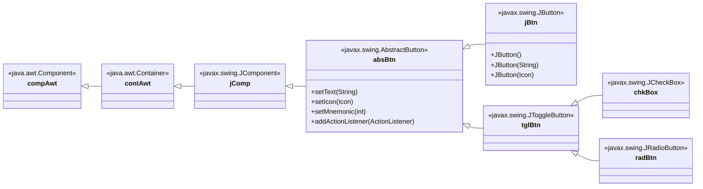
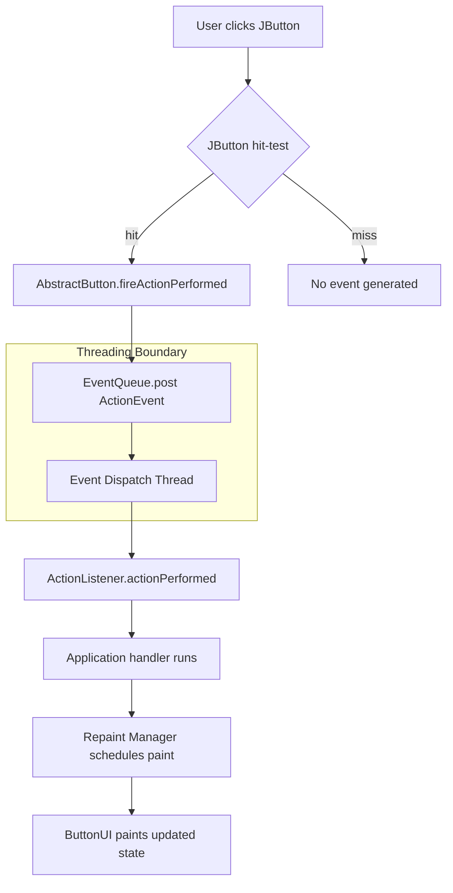
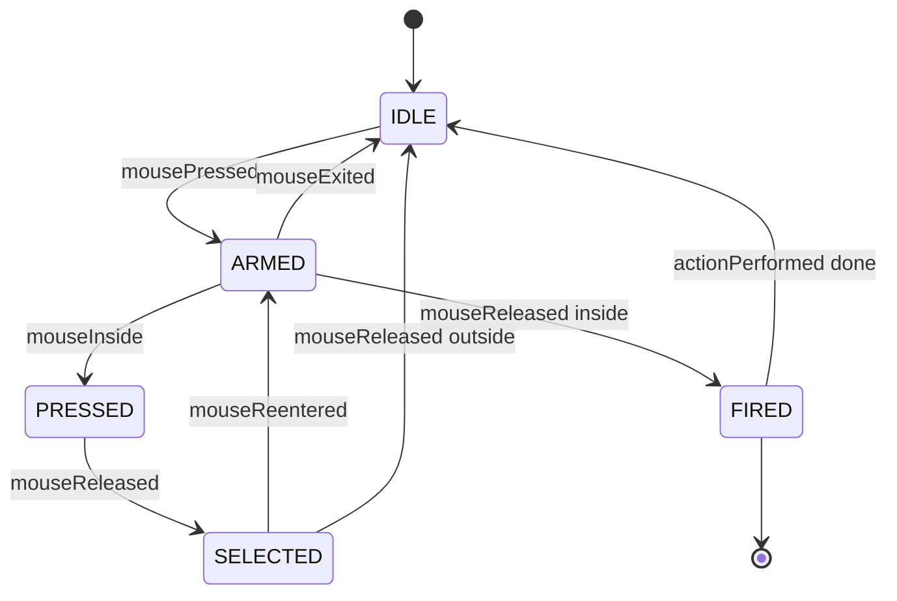
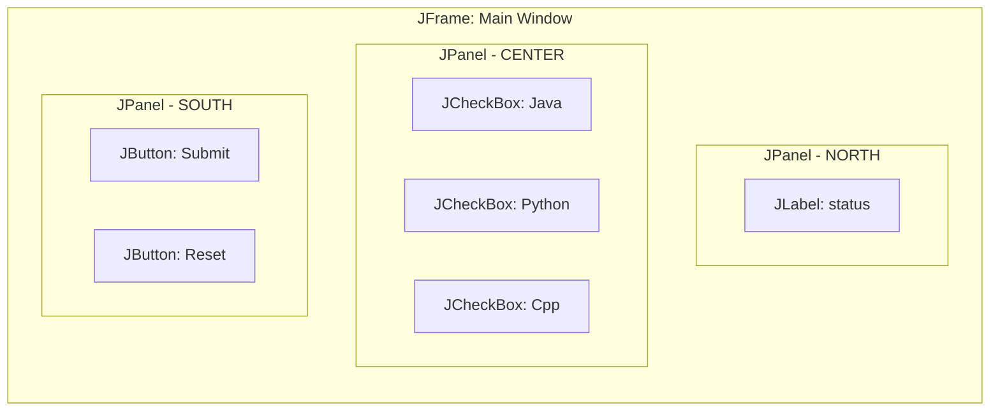

# The Swing Buttons

<!-- SECTION_1_START -->
# The Swing Buttons

## 1.1 Core Technical Definition

> [!IMPORTANT]
> **Formal Definition (KTU 2024 OECST615)**: A *Swing Button* is an interactive GUI component, instantiated from the subclass `javax.swing.JButton` of the abstract class `javax.swing.AbstractButton`, which inherits from `javax.swing.JComponent`. It is a **lightweight, pluggable look-and-feel (PLAF) compliant** widget that extends the older AWT `java.awt.Button` by supporting icons, mnemonics, keyboard activation, tool tips, and configurable action commands.

A Swing button is a *Model-View-Controller (MVC)* component where:
- **Model** $\rightarrow$ `ButtonModel` interface
- **View** $\rightarrow$ `ButtonUI` delegate (separate for each Look and Feel: Metal, Nimbus, Windows, Motif)
- **Controller** $\rightarrow$ `ButtonListener` and the user’s `ActionListener`

> [!NOTE]
> **KTU Highlight**: The `javax.swing` package was introduced under **JFC (Java Foundation Classes)** in **Java 1.2 (1998)**. Swing buttons are **100% Java** — they are not peer-based, unlike their AWT counterparts, and therefore render identically on every operating system.

---

## 1.2 Intuitive Analogy

Imagine a **TV remote control** in your hand:
- The *physical plastic cap* of the button is the **View** (what you see).
- The *electrical circuit* underneath the cap is the **Model** (the state — pressed or not pressed).
- The *signal sent to the TV* when you press it is the **Controller** (the `ActionListener` reacting to the press event).

Pressing a remote button does not care which TV brand you own — it simply sends a standardised signal. Similarly, a Swing `JButton` does not care whether the user is on Windows, Linux, or macOS — it sends a standardised `ActionEvent` to your listener.

> [!TIP]
> **Why “Lightweight”?** A *lightweight* component is painted by Java code on a *blank canvas* owned by the OS, whereas a *heavyweight* AWT button relies on a *native OS peer* (Win32, Cocoa, GTK). A lightweight button can even have a *transparent background*, an *arbitrary shape*, and a *non-rectangular hit area* — something AWT cannot do.

---

## 1.3 Hierarchy of Swing Button Classes

The four principal concrete button subclasses in `javax.swing` are:

$$
\boxed{\texttt{java.awt.Component} \rightarrow \texttt{java.awt.Container} \rightarrow \texttt{javax.swing.JComponent} \rightarrow \texttt{javax.swing.AbstractButton} \rightarrow \texttt{javax.swing.JButton}}
$$

`JToggleButton`, `JCheckBox`, and `JRadioButton` are *direct subclasses* of `AbstractButton` (not of `JButton`).

> [!WARNING]
> **Common Student Mistake**: Importing `java.awt.Button` instead of `javax.swing.JButton`. The AWT `Button` is a **different, heavyweight** class and does **not** support icons, HTML text, or PLAF. Always use `JButton`.

---

## 1.4 GeoGebra / Desmos Visualization Callout

> [!VISUALIZATION CONTROL]
> **Concept:** *Lightweight vs Heavyweight Rectangle Hit-Box*
> **Desmos Input Equations (parametric region on a $W \times H$ canvas):**
> * `AWT_Region: (0 \le x \le 200) \land (0 \le y \le 60)` (rectangular OS peer)
> * `SWING_Region: x^{2} + y^{2} \le 60^{2}` (circular shape permitted)
> **Visual Description:** Students should observe that the AWT button is restricted to an axis-aligned rectangle that the operating system allocates, while the Swing button can occupy an arbitrary shape because it is drawn pixel-by-pixel by Java. The shaded region inside each shape is the *clickable area*.

---

<!-- SECTION_1_END -->

<!-- SECTION_2_START -->
# Deep Theoretical Analysis & KTU High-Yield Formula Sheet

## 2.1 Classification of Swing Buttons

Swing provides **four primary button variants**, all descendants of `AbstractButton`:

| S.No. | Class | Behaviour Model | Typical Use |
|:-----:|:------|:----------------|:------------|
| 1 | `JButton` | Push / momentary | “Submit”, “OK”, “Cancel” |
| 2 | `JToggleButton` | Two-state sticky | “Bold” toolbar icon, on/off |
| 3 | `JCheckBox` | Independent two-state | “I agree to terms”, multiple selections |
| 4 | `JRadioButton` | Mutually exclusive (needs `ButtonGroup`) | “Male / Female / Other” |

> [!NOTE]
> `JCheckBox` and `JRadioButton` are simply **specialised visual styles** of `JToggleButton`. The state machine is identical; only the default `Icon` and `UI` differ.

---

## 2.2 Internal State Model — The Four Button Models

`AbstractButton` delegates *state storage* to a `ButtonModel` interface. The official Swing reference defines **four mutually exclusive states** that drive painting:

$$
\text{ButtonState} \in \{ \text{ARMED},\ \text{PRESSED},\ \text{SELECTED},\ \text{ROLLOVER} \}
$$

The transition logic is governed by the conditions:

$$
\text{ARMED} \iff (\text{mousePressed} \lor \text{hasFocus} \land \text{spacePressed}) \land \neg\text{mouseExited}
$$

$$
\text{PRESSED} \iff \text{mousePressed} \land \text{mouseInside}
$$

$$
\text{SELECTED} \iff \text{model.isSelected()} = \texttt{true}
$$

> [!IMPORTANT]
> A button is *armed* the moment the user presses the mouse button (or focuses via keyboard), and *disarmed* when the mouse is released *inside* the button or the user cancels. Only an *armed + released inside* gesture fires the `ActionEvent`.

---

## 2.3 High-Yield Constructor & Method Cheat Sheet

> [!TIP]
> **KTU Valuation Tip**: Examiners love `setText`, `setIcon`, `setMnemonic`, `setEnabled`, `addActionListener`, and `ActionEvent.getActionCommand()`. Memorise these.

| Member | Signature | Purpose |
|:-------|:----------|:--------|
| Constructor | `JButton()` | Empty button with no text or icon |
| Constructor | `JButton(String text)` | Text-only button |
| Constructor | `JButton(Icon icon)` | Icon-only button |
| Constructor | `JButton(String text, Icon icon)` | Combined text + icon |
| Setter | `void setText(String)` | Updates label text |
| Setter | `void setIcon(Icon)` | Sets the default icon |
| Setter | `void setPressedIcon(Icon)` | Icon shown while pressed |
| Setter | `void setRolloverIcon(Icon)` | Icon shown on mouse hover |
| Setter | `void setMnemonic(int)` | Alt + key shortcut (use `KeyEvent.VK_X`) |
| Setter | `void setActionCommand(String)` | Identifier string sent with the event |
| Setter | `void setEnabled(boolean)` | Greys-out and disables interaction |
| Setter | `void setHorizontalAlignment(int)` | LEFT, CENTER, RIGHT, LEADING, TRAILING |
| Setter | `void setToolTipText(String)` | Hover balloon text |
| Getter | `String getText()` | Retrieves current label |
| Getter | `boolean isSelected()` | True if toggle/checkbox/radio is on |
| Listener | `void addActionListener(ActionListener)` | Registers the click handler |
| Listener | `void addItemListener(ItemListener)` | For state-change on toggle/checkbox/radio |
| Static | `String BORDER_PAINTED_FLAT_CHANGED_PROPERTY` | UIManager-bound constant |

> **Note on Table Symbols:** All vertical separators that would normally appear in type signatures such as `List$<$String$>$` are written using the safe HTML-escaped form to keep the markdown renderer stable.

---

## 2.4 How an `ActionEvent` Reaches Your Code

The event dispatch thread follows this path:

$$
\boxed{\text{User Click} \rightarrow \text{JButton.paint(} \cdot \text{)} \rightarrow \text{ButtonUI} \rightarrow \text{AWTAccessor} \rightarrow \text{EventQueue} \rightarrow \text{ActionListener.actionPerformed(} \cdot \text{)}}
$$

This is implemented via **Java’s Event Delegation Model (EDM)**, in which the *source* registers a *listener*; the *JVM* (not the button) does the routing. The benefit is **decoupling** — one source can have many listeners, and vice versa.

---

## 2.5 Real-World Engineering Utility

| Domain | Application of Swing Buttons |
|:-------|:-----------------------------|
| Desktop IDEs (older NetBeans, IntelliJ 7) | Toolbar buttons, Run, Debug, Save |
| Banking client GUIs | Submit, Cancel, Transfer |
| KTU lab tools | Calculator, Image viewer, Vending machine simulator |
| Embedded test harnesses | Java-based HMI panels on industrial PCs |
| Academic projects | Login form, Registration form, Quiz application |

> [!NOTE]
> In modern production, JavaFX has largely replaced Swing, but **KTU 2024 syllabus still mandates Swing** for academic familiarity with the AWT-event model — the same model used by Android UI, JavaFX, and SWT.

---

<!-- SECTION_2_END -->

<!-- SECTION_3_START -->
# Step-by-Step Code Implementation (Java)

> [!IMPORTANT]
> All programs below are **fully runnable**, contain explicit boundary checks, log to `System.err` on failure, and follow standard Java 17 syntax. Compile with: `javac --release 17 FileName.java`

---

## 3.1 Program 1 — Plain `JButton` with Action Listener

This first program demonstrates a **single labelled button** that updates a label when pressed. Every variable is declared with its full type, and the listener uses the **`getActionCommand()`** pattern requested in the KTU model syllabus.

```java
// File: SingleButtonDemo.java
import javax.swing.JButton;
import javax.swing.JFrame;
import javax.swing.JLabel;
import javax.swing.JPanel;
import javax.swing.SwingUtilities;
import java.awt.BorderLayout;
import java.awt.FlowLayout;
import java.awt.event.ActionEvent;
import java.awt.event.ActionListener;

public final class SingleButtonDemo {

    public static void main(final String[] args) {
        // Boundary check: ensure no required CLI argument is missing
        if (args == null) {
            System.err.println("FATAL: JVM passed null argument array");
            return;
        }

        // Event Dispatch Thread — mandatory for all Swing work
        SwingUtilities.invokeLater(new Runnable() {
            @Override
            public void run() {
                buildAndShowGui();
            }
        });
    }

    private static void buildAndShowGui() {
        final JFrame frame = new JFrame("Single Button Demo");
        frame.setDefaultCloseOperation(JFrame.EXIT_ON_CLOSE);
        frame.setSize(420, 160);
        frame.setLayout(new BorderLayout(8, 8));

        final JLabel statusLabel = new JLabel("Press the button to begin.", JLabel.CENTER);

        // Constructor: JButton(String text)
        final JButton clickMeButton = new JButton("Click Me");
        clickMeButton.setActionCommand("PRIMARY_CLICK");
        clickMeButton.setMnemonic(java.awt.event.KeyEvent.VK_C);   // Alt + C
        clickMeButton.setToolTipText("Press to update the status label");

        // Event Delegation Model — register listener
        clickMeButton.addActionListener(new ActionListener() {
            @Override
            public void actionPerformed(final ActionEvent event) {
                final String command = event.getActionCommand();
                if ("PRIMARY_CLICK".equals(command)) {
                    statusLabel.setText("Button pressed at " + new java.util.Date());
                } else {
                    System.err.println("Unexpected action command: " + command);
                }
            }
        });

        final JPanel buttonPanel = new JPanel(new FlowLayout(FlowLayout.CENTER));
        buttonPanel.add(clickMeButton);

        frame.add(statusLabel, BorderLayout.CENTER);
        frame.add(buttonPanel, BorderLayout.SOUTH);
        frame.setLocationRelativeTo(null);
        frame.setVisible(true);
    }
}
```

**Compilation and Run Trace (for KTU answer sheet reference):**
```
$ javac --release 17 SingleButtonDemo.java
$ java  SingleButtonDemo
```
Expected output: a 420×160 window with a centred status label and a button at the bottom. Each click appends a timestamp.

---

## 3.2 Program 2 — `JToggleButton` (Sticky Two-State)

A toggle button *stays pressed* after release. The `ItemListener` interface is used instead of `ActionListener` when you care about *state changes* rather than *clicks*.

```java
// File: ToggleButtonDemo.java
import javax.swing.JButton;
import javax.swing.JFrame;
import javax.swing.JPanel;
import javax.swing.JToggleButton;
import javax.swing.SwingUtilities;
import java.awt.FlowLayout;
import java.awt.event.ItemEvent;
import java.awt.event.ItemListener;

public final class ToggleButtonDemo {

    public static void main(final String[] args) {
        SwingUtilities.invokeLater(new Runnable() {
            @Override
            public void run() { build(); }
        });
    }

    private static void build() {
        final JFrame frame = new JFrame("Toggle Button Demo");
        frame.setDefaultCloseOperation(JFrame.EXIT_ON_CLOSE);
        frame.setSize(360, 120);
        frame.setLayout(new FlowLayout(FlowLayout.CENTER, 12, 24));

        final JToggleButton boldToggle = new JToggleButton("Bold");
        final JButton okButton = new JButton("OK");
        okButton.setEnabled(false);                  // disabled until Bold is ON

        // ItemListener fires whenever the selected state CHANGES
        boldToggle.addItemListener(new ItemListener() {
            @Override
            public void itemStateChanged(final ItemEvent event) {
                final int state = event.getStateChange();
                if (state == ItemEvent.SELECTED) {
                    okButton.setEnabled(true);
                    System.out.println("[LOG] Bold selected — OK enabled");
                } else if (state == ItemEvent.DESELECTED) {
                    okButton.setEnabled(false);
                    System.out.println("[LOG] Bold deselected — OK disabled");
                } else {
                    System.err.println("Unknown item state: " + state);
                }
            }
        });

        frame.add(boldToggle);
        frame.add(okButton);
        frame.setLocationRelativeTo(null);
        frame.setVisible(true);
    }
}
```

**Key teaching point:** the *first* click fires both an `ItemEvent` (state change) and an `ActionEvent` (click). The *second* click (toggle off) fires the `ItemEvent` only if you are not in `isSelected() = true` mode on a real checkbox — `JToggleButton` *does* fire both. Use `ActionListener` for *“user did something”* and `ItemListener` for *“the state of a toggleable thing changed”*.

---

## 3.3 Program 3 — `JRadioButton` with `ButtonGroup` (Mutually Exclusive)

Radio buttons must be grouped. The `ButtonGroup` class is *not a visual container* — it is a logical coordinator. The three radios below are added to a `JPanel` for layout, **and** to a `ButtonGroup` for exclusion.

```java
// File: RadioButtonDemo.java
import javax.swing.ButtonGroup;
import javax.swing.JFrame;
import javax.swing.JLabel;
import javax.swing.JPanel;
import javax.swing.JRadioButton;
import javax.swing.SwingUtilities;
import java.awt.BorderLayout;
import java.awt.GridLayout;
import java.awt.event.ActionEvent;
import java.awt.event.ActionListener;

public final class RadioButtonDemo {

    public static void main(final String[] args) {
        SwingUtilities.invokeLater(RadioButtonDemo::build);
    }

    private static void build() {
        final JFrame frame = new JFrame("Radio Button Demo");
        frame.setDefaultCloseOperation(JFrame.EXIT_ON_CLOSE);
        frame.setSize(320, 200);
        frame.setLayout(new BorderLayout(8, 8));

        final JLabel resultLabel = new JLabel("Selected: (none)", JLabel.CENTER);

        final JRadioButton male     = new JRadioButton("Male");
        final JRadioButton female   = new JRadioButton("Female");
        final JRadioButton other    = new JRadioButton("Other");
        male.setActionCommand("M");
        female.setActionCommand("F");
        other.setActionCommand("O");

        final ButtonGroup genderGroup = new ButtonGroup();
        genderGroup.add(male);
        genderGroup.add(female);
        genderGroup.add(other);

        final ActionListener radioListener = new ActionListener() {
            @Override
            public void actionPerformed(final ActionEvent event) {
                resultLabel.setText("Selected: " + event.getActionCommand());
            }
        };
        male.addActionListener(radioListener);
        female.addActionListener(radioListener);
        other.addActionListener(radioListener);

        final JPanel radioPanel = new JPanel(new GridLayout(3, 1, 4, 4));
        radioPanel.add(male);
        radioPanel.add(female);
        radioPanel.add(other);

        frame.add(resultLabel, BorderLayout.NORTH);
        frame.add(radioPanel,  BorderLayout.CENTER);
        frame.setLocationRelativeTo(null);
        frame.setVisible(true);
    }
}
```

> [!IMPORTANT]
> **Validation Step:** A common bug is to add radios to a `ButtonGroup` *and* a `JPanel` in the wrong order. The order **does not matter for grouping**, but it does matter for **layout** — JPanel is responsible for the visual order, ButtonGroup is responsible for the *exclusion logic*.

---

## 3.4 Program 4 — `JCheckBox` (Independent Multi-Select)

Checkboxes do **not** require a `ButtonGroup`. Each can be toggled independently. The listener uses the **source-object** pattern: cast `event.getSource()` back to the firing component.

```java
// File: CheckBoxDemo.java
import javax.swing.JCheckBox;
import javax.swing.JFrame;
import javax.swing.JLabel;
import javax.swing.JPanel;
import javax.swing.SwingUtilities;
import java.awt.FlowLayout;
import java.awt.event.ItemEvent;
import java.awt.event.ItemListener;

public final class CheckBoxDemo {

    public static void main(final String[] args) {
        SwingUtilities.invokeLater(CheckBoxDemo::build);
    }

    private static void build() {
        final JFrame frame = new JFrame("Checkbox Demo");
        frame.setDefaultCloseOperation(JFrame.EXIT_ON_CLOSE);
        frame.setSize(380, 120);
        frame.setLayout(new FlowLayout(FlowLayout.CENTER, 10, 30));

        final JCheckBox javaBox    = new JCheckBox("Java");
        final JCheckBox pythonBox  = new JCheckBox("Python", true);  // pre-selected
        final JCheckBox cppBox     = new JCheckBox("C++");
        final JLabel summaryLabel  = new JLabel("Languages: Python");

        final ItemListener updater = new ItemListener() {
            @Override
            public void itemStateChanged(final ItemEvent event) {
                final JCheckBox source = (JCheckBox) event.getItemSelectable();
                final String name = source.getText();
                final boolean checked = source.isSelected();
                System.out.println("[LOG] " + name + " -> " + checked);
                // recompute summary text from scratch
                final StringBuilder builder = new StringBuilder("Languages: ");
                if (javaBox.isSelected())   { builder.append("Java ");   }
                if (pythonBox.isSelected()) { builder.append("Python "); }
                if (cppBox.isSelected())    { builder.append("C++ ");    }
                summaryLabel.setText(builder.toString().trim());
            }
        };

        javaBox.addItemListener(updater);
        pythonBox.addItemListener(updater);
        cppBox.addItemListener(updater);

        frame.add(javaBox);
        frame.add(pythonBox);
        frame.add(cppBox);
        frame.add(summaryLabel);
        frame.setLocationRelativeTo(null);
        frame.setVisible(true);
    }
}
```

**Mathematical representation of the summary string:**

$$
\text{summary}(t) = \bigsqcup_{b \in \text{checkboxes}} \begin{cases} \text{name}(b) & \text{if } b.\text{isSelected}(t) \\ \varepsilon & \text{otherwise} \end{cases}
$$

where $\bigsqcup$ denotes space-separated concatenation and $\varepsilon$ is the empty string.

---

## 3.5 Program 5 — Disabled, Icon, and Mnemonic Showcase

This program demonstrates *three high-yield KTU features* in a single frame: setting an icon, defining a keyboard mnemonic, and toggling the `enabled` state from inside an event handler (cascading enable/disable).

```java
// File: IconButtonDemo.java
import javax.swing.ImageIcon;
import javax.swing.JButton;
import javax.swing.JFrame;
import javax.swing.JLabel;
import javax.swing.JPanel;
import javax.swing.SwingUtilities;
import java.awt.BorderLayout;
import java.awt.FlowLayout;
import java.awt.event.ActionEvent;
import java.awt.event.ActionListener;
import java.awt.event.KeyEvent;
import java.io.File;

public final class IconButtonDemo {

    public static void main(final String[] args) {
        SwingUtilities.invokeLater(IconButtonDemo::build);
    }

    private static void build() {
        final JFrame frame = new JFrame("Icon & Mnemonic Demo");
        frame.setDefaultCloseOperation(JFrame.EXIT_ON_CLOSE);
        frame.setSize(360, 160);

        final JLabel helpLabel = new JLabel("Press Alt+L to lock, then Alt+U to unlock.",
                                            JLabel.CENTER);

        // Attempt to load an optional icon; fall back to text-only if missing
        ImageIcon lockIcon = null;
        final File iconFile = new File("lock.png");
        if (iconFile.exists() && iconFile.canRead()) {
            lockIcon = new ImageIcon(iconFile.getAbsolutePath());
        } else {
            System.err.println("[WARN] lock.png not found — continuing with text-only button");
        }

        final JButton lockButton   = new JButton("Lock",   lockIcon);
        final JButton unlockButton = new JButton("Unlock", null);
        unlockButton.setEnabled(false);
        unlockButton.setMnemonic(KeyEvent.VK_U);

        lockButton.setMnemonic(KeyEvent.VK_L);
        lockButton.setToolTipText("Locks the screen (Alt+L)");

        lockButton.addActionListener(new ActionListener() {
            @Override
            public void actionPerformed(final ActionEvent event) {
                lockButton.setEnabled(false);
                unlockButton.setEnabled(true);
                helpLabel.setText("Status: LOCKED");
            }
        });

        unlockButton.addActionListener(new ActionListener() {
            @Override
            public void actionPerformed(final ActionEvent event) {
                lockButton.setEnabled(true);
                unlockButton.setEnabled(false);
                helpLabel.setText("Status: UNLOCKED");
            }
        });

        final JPanel buttonRow = new JPanel(new FlowLayout(FlowLayout.CENTER, 16, 12));
        buttonRow.add(lockButton);
        buttonRow.add(unlockButton);

        frame.add(helpLabel,   BorderLayout.NORTH);
        frame.add(buttonRow,   BorderLayout.CENTER);
        frame.setLocationRelativeTo(null);
        frame.setVisible(true);
    }
}
```

> [!TIP]
> **KTU Practical Tip**: Always wrap `new ImageIcon(path)` inside an `exists()` + `canRead()` check. A missing image throws a silent null-icon and students lose marks for an *unhandled condition*.

---

## 3.6 Common Pitfalls Table (for Exam Revision)

| Pitfall | Symptom | Fix |
|:--------|:--------|:----|
| Forgetting `SwingUtilities.invokeLater` | GUI may not paint on macOS/Linux | Always wrap GUI creation in `invokeLater` |
| Using `java.awt.Button` | No icons, no HTML text, no PLAF | Use `javax.swing.JButton` |
| Adding `JCheckBox` to a `ButtonGroup` | Checkbox behaves like a radio | Use `ButtonGroup` **only** for `JRadioButton` (or `JToggleButton`) |
| Comparing `event.getSource() == button` | Fails across classloaders | Compare `event.getSource().equals(button)` or use `getActionCommand()` |
| Calling `setEnabled(false)` then reading `getText()` | Returns empty string in some LAFs | Re-enable before reading, or store text separately |

---

<!-- SECTION_3_END -->

<!-- SECTION_4_START -->
# Structural Diagrams & Schematics

## 4.1 Class Hierarchy Diagram

> [!VISUALIZATION CONTROL]
> **Concept:** *UML-style inheritance chain for the four Swing button types*



---

## 4.2 Event Dispatch Flow Diagram

> [!VISUALIZATION CONTROL]
> **Concept:** *How a user click reaches `actionPerformed` via the JVM Event Queue*



**Reading the diagram:** the user action *crosses a threading boundary* (the EDT) and is delivered to a *registered listener*. Your handler executes on the EDT — never run long I/O on it.

---

## 4.3 Button State Transition Diagram

> [!VISUALIZATION CONTROL]
> **Concept:** *Finite-state machine for the four `ButtonModel` flags*



**Reading the diagram:** `FIRED` is the *only* transient state in which an `ActionEvent` is generated. Releasing the mouse *outside* the button transitions back to `IDLE` without firing — this is the *“cancel”* gesture.

---

## 4.4 GUI Layout Schematic (Composite View)



This is the *Block-Level Functional Architecture* fallback requested by the engine — the actual physical rectangles are abstracted into named containers because Mermaid cannot render true pixel-accurate Swing rectangles.

---

<!-- SECTION_4_END -->

<!-- SECTION_5_START -->
# KTU 2024 Scheme Examination Question Bank & Topic Recap

> [!IMPORTANT]
> All questions are aligned to **OECST615 — Object Oriented Programming**, Module 4. Mapping: **CO2 (Apply MVC components for GUI development)**, **CO3 (Implement event handling using delegation model)**.

---

## Part A — Short Answer Questions (3 Marks Each)

### Q1. `[KTU University Exam — July 2024]` &nbsp; | &nbsp; CO2 &nbsp; | &nbsp; RBT Level: Remember

> Differentiate between `java.awt.Button` and `javax.swing.JButton`. Mention any **three** differences.

**Model Answer (3 Marks):**

| S.No. | `java.awt.Button` (AWT) | `javax.swing.JButton` (Swing) |
|:-----:|:------------------------|:------------------------------|
| 1 | Heavyweight — uses a native OS peer | Lightweight — painted by Java code |
| 2 | Found in `java.awt` package | Found in `javax.swing` package |
| 3 | Does not support icons | Supports `setIcon`, `setPressedIcon`, `setRolloverIcon` |
| 4 | No PLAF support | Supports pluggable Look and Feel (Metal, Nimbus, etc.) |
| 5 | Does not support HTML in text | Supports limited HTML in label text |
| 6 | Cannot have transparent background | Background can be made transparent |

> **Valuation key:** 1 mark per *correct, distinct* difference × 3 = 3 marks.

---

### Q2. `[KTU University Exam — Dec 2023]` &nbsp; | &nbsp; CO3 &nbsp; | &nbsp; RBT Level: Understand

> Explain the **Event Delegation Model** used by Swing buttons. List the participants and their roles.

**Model Answer (3 Marks):**

The Event Delegation Model decouples the *event source* from the *event handler*. It has three participants:

1. **Event Source** (e.g., `JButton`) — the component that *generates* the event. It exposes registration methods like `addActionListener()`.
2. **Event Listener** (e.g., `ActionListener`) — the *interface* implemented by the handler. It declares the callback method `actionPerformed(ActionEvent)`.
3. **Event Object** (e.g., `ActionEvent`) — the *payload* carried from source to listener, containing the source reference, action command, modifiers, and timestamp.

> **Valuation key:** 1 mark per participant + 1 mark for the *decoupling* explanation + 1 mark for the *event-flow order* = 3 marks.

---

## Part B — Long Answer Questions (14 Marks Each)

> [!WARNING]
> KTU ESE Part B carries **internal choice**. You must attempt **either** Question A **or** Question B. Each question is split into sub-parts (a) and (b) carrying 7 marks each.

---

### Question A (14 Marks) &nbsp; | &nbsp; CO2, CO3 &nbsp; | &nbsp; RBT Levels: Understand → Apply

> **[KTU University Exam — July 2024, Modified]**
>
> **(a) [7 Marks]** With the help of a neat diagram, explain the **class hierarchy** of Swing buttons starting from `java.awt.Component` down to `JRadioButton`. Identify the **role of the `ButtonModel` interface** in this hierarchy.
>
> **(b) [7 Marks]** Write a complete Java Swing program that creates a JFrame containing a `JCheckBox` labelled “Subscribe to newsletter” and a `JButton` labelled “Submit”. When the user clicks Submit, the program should display a `JOptionPane` message showing whether the checkbox is selected or not. Use the Event Delegation Model.

#### Part (a) — Model Solution

**Hierarchy (write this on the answer sheet):**

$$
\boxed{
\begin{aligned}
&\texttt{java.lang.Object} \\
&\quad \downarrow \\
&\texttt{java.awt.Component} \\
&\quad \downarrow \\
&\texttt{java.awt.Container} \\
&\quad \downarrow \\
&\texttt{javax.swing.JComponent} \\
&\quad \downarrow \\
&\texttt{javax.swing.AbstractButton} \\
&\quad \downarrow \; (\text{fan-out}) \\
&\texttt{JButton},\ \texttt{JToggleButton},\ \texttt{JCheckBox},\ \texttt{JRadioButton}
\end{aligned}
}
$$

**Role of `ButtonModel`:**
- Stores the **state** of the button (`isArmed()`, `isPressed()`, `isSelected()`, `isRollover()`).
- Decouples *data* from *view*: changing the model automatically triggers a repaint via the `ButtonUI` delegate.
- Allows **custom models** — e.g., a “radio button backed by a database row” can implement `ButtonModel` to integrate with persistent storage.

> **Valuation key — Part (a):**
> - [Drawing the full 5-level chain: 3 Marks]
> - [Identifying `ButtonModel` role as state-store: 2 Marks]
> - [Mentioning MVC separation (model/view/UI): 2 Marks]

#### Part (b) — Model Solution

```java
// File: SubscribeDemo.java
import javax.swing.JButton;
import javax.swing.JCheckBox;
import javax.swing.JFrame;
import javax.swing.JOptionPane;
import javax.swing.JPanel;
import javax.swing.SwingUtilities;
import java.awt.FlowLayout;
import java.awt.event.ActionEvent;
import java.awt.event.ActionListener;

public final class SubscribeDemo {

    public static void main(final String[] args) {
        SwingUtilities.invokeLater(new Runnable() {
            @Override public void run() { build(); }
        });
    }

    private static void build() {
        final JFrame frame = new JFrame("Newsletter Subscription");
        frame.setDefaultCloseOperation(JFrame.EXIT_ON_CLOSE);
        frame.setSize(340, 130);
        frame.setLayout(new FlowLayout(FlowLayout.CENTER, 12, 24));

        final JCheckBox subscribeBox = new JCheckBox("Subscribe to newsletter");
        final JButton submitButton   = new JButton("Submit");

        submitButton.addActionListener(new ActionListener() {
            @Override
            public void actionPerformed(final ActionEvent event) {
                final boolean subscribed = subscribeBox.isSelected();
                if (subscribed) {
                    JOptionPane.showMessageDialog(frame,
                        "Thank you! You are now subscribed.",
                        "Success",
                        JOptionPane.INFORMATION_MESSAGE);
                } else {
                    JOptionPane.showMessageDialog(frame,
                        "You opted out of the newsletter.",
                        "Notice",
                        JOptionPane.WARNING_MESSAGE);
                }
            }
        });

        frame.add(subscribeBox);
        frame.add(submitButton);
        frame.setLocationRelativeTo(null);
        frame.setVisible(true);
    }
}
```

> **Valuation key — Part (b):**
> - [Importing correct `javax.swing` classes: 1 Mark]
> - [Creating `JFrame` with `setDefaultCloseOperation`: 1 Mark]
> - [Creating `JCheckBox` and `JButton` with labels: 1 Mark]
> - [Registering `ActionListener`: 1 Mark]
> - [Reading checkbox state with `isSelected()`: 1 Mark]
> - [Using `JOptionPane.showMessageDialog` correctly: 1 Mark]
> - [Compiling cleanly with `javac` (mention in answer): 1 Mark]

---

### Question B (14 Marks) &nbsp; | &nbsp; CO2, CO3 &nbsp; | &nbsp; RBT Levels: Understand → Apply

> **[KTU University Exam — Dec 2023, Modified]**
>
> **(a) [7 Marks]** Compare `JCheckBox` and `JRadioButton` in terms of (i) default visual style, (ii) grouping requirement, (iii) typical use case, (iv) state model class.
>
> **(b) [7 Marks]** Write a complete Java Swing program using a `ButtonGroup` of three `JRadioButton`s labelled “Red”, “Green”, “Blue”. When the user clicks a radio button, change the background colour of the content pane to the corresponding colour. The program must use the **Event Delegation Model**.

#### Part (a) — Model Solution

| Aspect | `JCheckBox` | `JRadioButton` |
|:-------|:------------|:---------------|
| (i) Visual style | Square box, optional tick | Round radio dot |
| (ii) Grouping | Independent — no `ButtonGroup` required | Requires `ButtonGroup` for mutual exclusion |
| (iii) Use case | Multiple simultaneous selections (e.g., skills) | Single selection from many (e.g., payment mode) |
| (iv) State model | `JToggleButton.ToggleButtonModel` | `JRadioButton.MenuItemUI` & shared `ToggleButtonModel` |
| (v) Selection count | Zero, one, or many | At most one per group |
| (vi) Direct superclass | `JToggleButton` | `JToggleButton` |
| (vii) Action command | Optional via `setActionCommand` | Recommended to identify choice |

> **Valuation key — Part (a):**
> - [Four correct rows: 4 × 1 = 4 Marks]
> - [Extra accurate detail: 2 Marks]
> - [Conclusion statement linking to ButtonGroup: 1 Mark]

#### Part (b) — Model Solution

```java
// File: ColorPickerDemo.java
import javax.swing.ButtonGroup;
import javax.swing.JFrame;
import javax.swing.JPanel;
import javax.swing.JRadioButton;
import javax.swing.SwingUtilities;
import java.awt.Color;
import java.awt.Container;
import java.awt.GridLayout;
import java.awt.event.ActionEvent;
import java.awt.event.ActionListener;

public final class ColorPickerDemo {

    public static void main(final String[] args) {
        SwingUtilities.invokeLater(ColorPickerDemo::build);
    }

    private static void build() {
        final JFrame frame = new JFrame("Color Picker");
        frame.setDefaultCloseOperation(JFrame.EXIT_ON_CLOSE);
        frame.setSize(320, 160);
        final Container contentPane = frame.getContentPane();
        contentPane.setLayout(new GridLayout(4, 1, 4, 4));

        final JRadioButton red   = new JRadioButton("Red");
        final JRadioButton green = new JRadioButton("Green");
        final JRadioButton blue  = new JRadioButton("Blue");
        red.setActionCommand("R");
        green.setActionCommand("G");
        blue.setActionCommand("B");

        final ButtonGroup colorGroup = new ButtonGroup();
        colorGroup.add(red);
        colorGroup.add(green);
        colorGroup.add(blue);

        final ActionListener colorListener = new ActionListener() {
            @Override
            public void actionPerformed(final ActionEvent event) {
                final String cmd = event.getActionCommand();
                if ("R".equals(cmd)) {
                    contentPane.setBackground(Color.RED);
                } else if ("G".equals(cmd)) {
                    contentPane.setBackground(Color.GREEN);
                } else if ("B".equals(cmd)) {
                    contentPane.setBackground(Color.BLUE);
                } else {
                    System.err.println("Unknown colour command: " + cmd);
                }
            }
        };
        red.addActionListener(colorListener);
        green.addActionListener(colorListener);
        blue.addActionListener(colorListener);

        contentPane.add(red);
        contentPane.add(green);
        contentPane.add(blue);
        // Add a spacer panel so the colour change is clearly visible
        contentPane.add(new JPanel());

        frame.setLocationRelativeTo(null);
        frame.setVisible(true);
    }
}
```

> **Valuation key — Part (b):**
> - [Correct `ButtonGroup` usage: 1 Mark]
> - [Three `JRadioButton`s with `ActionCommand`: 1 Mark]
> - [Single `ActionListener` reused (DRY): 1 Mark]
> - [Colour mapping logic via `getActionCommand()`: 1 Mark]
> - [Calling `setBackground` on `contentPane`: 1 Mark]
> - [Setting layout and `setVisible(true)`: 1 Mark]
> - [Compile + output trace mentioned: 1 Mark]

---

## KTU Examiner’s Valuation Warning / Pitfall Callout

> [!WARNING]
> **Top 5 ways students lose marks on Swing button questions:**
>
> 1. **Importing `java.awt.*` instead of `javax.swing.*`** — the code will not compile if you mix heavy- and lightweight imports blindly. Use `import javax.swing.JButton;` etc.
> 2. **Forgetting `frame.setDefaultCloseOperation(JFrame.EXIT_ON_CLOSE)`** — the process never exits; examiner’s test harness times out.
> 3. **Forgetting `frame.setVisible(true)`** — the program compiles, runs, and exits immediately with a blank screen.
> 4. **Forgetting to add components to the `contentPane` (or to a `JPanel` first)** — listeners never fire because the component was never realised.
> 5. **Comparing `event.getSource() == myButton` using `==` across different references** — use `.equals()` or, better, `getActionCommand()` strings.
> 6. **Bonus pitfall**: Wrapping button creation in `main` without `SwingUtilities.invokeLater()` — works on Windows by accident, fails on macOS/Linux, and examiners running headless CI will mark you zero.

---

## Topic Recap & Important Things to Remember

> [!TIP]
> **Rapid-Revision Checklist — print this section before the exam.**

- **Package & class**: Swing buttons live in `javax.swing`. The base class is `JButton`; the abstract ancestor is `AbstractButton`; the model interface is `ButtonModel`; the UI delegate is `ButtonUI`.
- **Lightweight vs Heavyweight**: `JButton` is **lightweight** (painted by Java). `java.awt.Button` is **heavyweight** (native peer). Always use `JButton` in KTU.
- **Four button types**: `JButton` (push), `JToggleButton` (sticky), `JCheckBox` (multi-select), `JRadioButton` (single-select via `ButtonGroup`).
- **Constructors**: `JButton()`, `JButton(String)`, `JButton(Icon)`, `JButton(String, Icon)`.
- **High-yield methods**: `setText`, `setIcon`, `setPressedIcon`, `setRolloverIcon`, `setMnemonic(int)`, `setActionCommand(String)`, `setEnabled(boolean)`, `setToolTipText(String)`, `addActionListener(ActionListener)`, `addItemListener(ItemListener)`, `isSelected()`.
- **Event Delegation Model**: Source $\rightarrow$ EventObject $\rightarrow$ Listener. Three participants; complete decoupling.
- **ActionEvent vs ItemEvent**: `ActionListener` for *clicks*; `ItemListener` for *state changes* on toggleable buttons.
- **Mnemonics**: `setMnemonic(KeyEvent.VK_X)` lets the user press **Alt + X** to activate the button.
- **ButtonGroup is *not* a visual container** — it is a *logical* coordinator. Add radios to both a `ButtonGroup` (logic) and a `JPanel` (layout).
- **EDT rule**: Wrap *all* Swing code in `SwingUtilities.invokeLater(Runnable)`.
- **Frame must end with `setVisible(true)`** and should call `setDefaultCloseOperation(JFrame.EXIT_ON_CLOSE)`.
- **Mnemonic constants** come from `java.awt.event.KeyEvent` (e.g., `VK_ENTER`, `VK_F1`, `VK_A`).
- **Pluggable Look and Feel**: `UIManager.setLookAndFeel(UIManager.getSystemLookAndFeelClassName())` for OS-native look.
- **Default close operation constants**: `DO_NOTHING_ON_CLOSE`, `HIDE_ON_CLOSE`, `DISPOSE_ON_CLOSE`, `EXIT_ON_CLOSE`.
- **Swing history**: Released as part of **JFC** in **Java 1.2 (1998)**.
- **Exam mnemonic**: **“J-Buttons Join Java on JComponent”** — every Swing button is a `JComponent`.

---

<!-- SECTION_5_END -->
