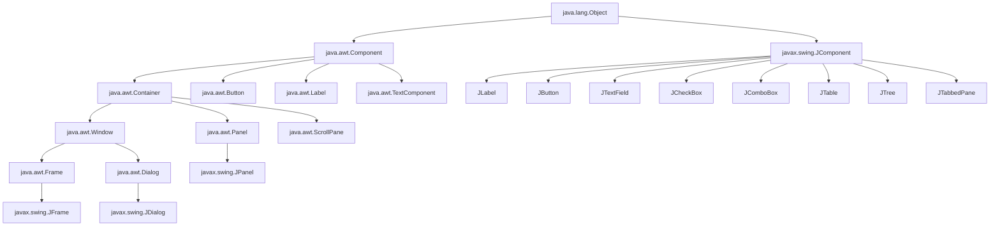
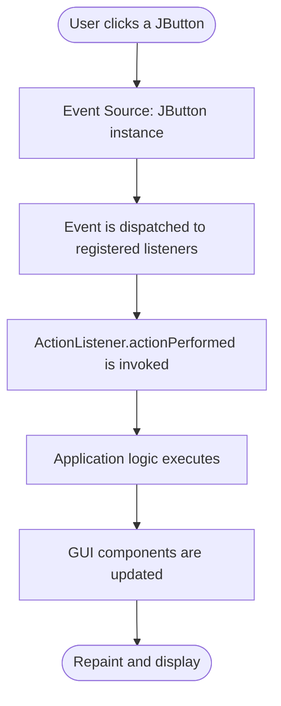
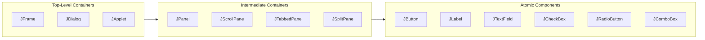
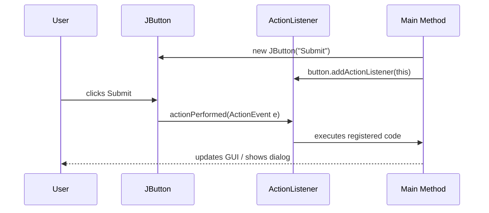

# Types

<!-- SECTION_1_START -->
# Types of Components in AWT & Swing

> [!NOTE]
> **KTU Syllabus Highlight (Module 4):** This topic covers the classification and hierarchy of UI component *types* in **Java AWT** and **Swing** packages. Understanding component types is essential for building Graphical User Interface (GUI) based applications in Java.

## 1.1 Formal Definition

In Java's GUI framework, **component types** refer to the categorized classes provided by the `java.awt` and `javax.swing` packages that allow programmers to construct window-based, event-driven applications. These types are arranged in a strict **inheritance hierarchy** rooted at `java.awt.Component` (for AWT) and `javax.swing.JComponent` (for Swing).

> [!IMPORTANT]
> **Core Definition:** A *type* in AWT/Swing is a Java class that represents a UI element (like a button, label, text field, or window). These types are broadly classified into **Containers**, **Basic Controls**, **Layout Managers**, and **Event Classes**.

## 1.2 Intuitive Analogy

Think of building a house:
- **Containers** are the rooms and walls (they hold things together).
- **Controls / Components** are the furniture inside (chairs, tables, switches).
- **Layout Managers** are the interior designers (they decide where furniture goes).
- **Event Classes** are the doorbells and switches (they notify you when something happens).

## 1.3 Hierarchy Overview

The two major type-trees in Java GUI:

### AWT Type Hierarchy (Heavyweight)
- `java.awt.Component` (root for visual AWT components)
  - `java.awt.Container` (can hold other components)
    - `java.awt.Window`
      - `java.awt.Frame`
      - `java.awt.Dialog`
    - `java.awt.Panel`
      - `java.applet.Applet`
  - `java.awt.Button`, `Label`, `TextField`, `TextArea`, `Checkbox`, `Choice`, `List`

### Swing Type Hierarchy (Lightweight)
- `javax.swing.JComponent` (root for Swing components)
  - `JLabel`, `JButton`, `JTextField`, `JTextArea`
  - `JCheckBox`, `JRadioButton`, `JComboBox`
  - `JPanel`, `JScrollPane`, `JTabbedPane`
  - `JTable`, `JTree`, `JList`
- `javax.swing.JFrame`, `JDialog`, `JApplet` (top-level containers, inherit indirectly)

> [!TIP]
> **Memory Trick:** Every Swing class name begins with **'J'** (e.g., `JButton`), while AWT classes do not (e.g., `Button`).

> [!VISUALIZATION CONTROL]
> **Concept:** Class Inheritance Tree for AWT vs Swing Component Types
> **GeoGebra / Desmos Input Equations:** N/A (use ASCII tree below for mental visualization)
> **Visual Description:** Picture two trees. The AWT tree grows from `Component` → `Container` → `Window` → `Frame`. The Swing tree grows from `JComponent` → various controls, with top-level types extending AWT's `Frame` indirectly to gain heavyweight window capabilities.

<!-- SECTION_1_END -->

<!-- SECTION_2_START -->
# Deep Theoretical Analysis & KTU High-Yield Formula Sheet

## 2.1 Major Categories of AWT Component Types

| Category | Description | Key Classes |
|----------|-------------|-------------|
| **Containers** | Components that can hold other components | `Frame`, `Panel`, `Dialog`, `Applet`, `Window` |
| **Basic Controls** | Interactive UI elements | `Button`, `Label`, `TextField`, `TextArea`, `Checkbox`, `Choice`, `List` |
| **Layout Managers** | Define arrangement of components | `FlowLayout`, `BorderLayout`, `GridLayout`, `CardLayout`, `GridBagLayout` |
| **Menu Components** | Build menu systems | `MenuBar`, `Menu`, `MenuItem` |
| **Graphics** | Drawing and image manipulation | `Graphics`, `Color`, `Font` |

## 2.2 Major Categories of Swing Component Types

| Category | Description | Key Classes |
|----------|-------------|-------------|
| **Top-Level Containers** | Heavyweight windows that host Swing components | `JFrame`, `JDialog`, `JApplet`, `JWindow` |
| **Intermediate Containers** | Lightweight containers for grouping | `JPanel`, `JScrollPane`, `JTabbedPane`, `JSplitPane`, `JToolBar` |
| **Atomic Components** | Individual controls | `JLabel`, `JButton`, `JTextField`, `JTextArea`, `JCheckBox`, `JRadioButton`, `JComboBox`, `JSlider`, `JProgressBar` |
| **Complex Components** | Display structured data | `JTable`, `JTree`, `JList` |
| **Menu Components** | Swing menu system | `JMenuBar`, `JMenu`, `JMenuItem`, `JCheckBoxMenuItem`, `JRadioButtonMenuItem` |
| **Layout Managers** | Position components | `FlowLayout`, `BorderLayout`, `GridLayout`, `BoxLayout`, `GroupLayout`, `GridBagLayout` |
| **Look & Feel** | Pluggable UI types | `UIManager`, `LookAndFeel` |

## 2.3 KTU Formula Sheet / Cheat Sheet

> [!IMPORTANT]
> The table below is the **high-yield reference** for exam answers. Memorize the class names and their category.

| Type | AWT Class | Swing Equivalent | Purpose |
|------|-----------|------------------|---------|
| Top-Level Window | `Frame` | `JFrame` | Main application window |
| Dialog Box | `Dialog` | `JDialog` | Pop-up secondary window |
| Applet | `Applet` | `JApplet` | Browser-embedded window |
| Panel | `Panel` | `JPanel` | Generic container |
| Scrolling Pane | _(none)_ | `JScrollPane` | Adds scrollbars |
| Tabbed Pane | _(none)_ | `JTabbedPane` | Tabbed interface |
| Button | `Button` | `JButton` | Clickable control |
| Label | `Label` | `JLabel` | Static text/image |
| Text Input (single) | `TextField` | `JTextField` | One-line text |
| Text Input (multi) | `TextArea` | `JTextArea` | Multi-line text |
| Checkbox | `Checkbox` | `JCheckBox` | Multi-select toggle |
| Radio Button | `CheckboxGroup` | `JRadioButton` | Single-select toggle |
| Dropdown | `Choice` | `JComboBox` | Drop-down list |
| List | `List` | `JList` | Scrollable list |
| Menu Bar | `MenuBar` | `JMenuBar` | Top menu strip |
| Table | _(none)_ | `JTable` | Tabular data |
| Tree | _(none)_ | `JTree` | Hierarchical data |

## 2.4 Why Two Sets of Types Exist (AWT vs Swing)

> [!NOTE]
> **AWT (Abstract Window Toolkit)** was Java's *original* GUI library. Its component types are **heavyweight**, meaning each AWT component relies on the **host operating system's** peer component (e.g., a Windows button is rendered by Windows).
> 
> **Swing** was introduced later (Java 1.2) to overcome AWT limitations. Swing component types are **lightweight** (mostly), meaning they are drawn entirely by Java code, allowing consistent rendering across platforms and the famous **Pluggable Look and Feel**.

## 2.5 Real-World Utility

- **Enterprise Desktop Apps:** NetBeans IDE itself is built on Swing, using `JFrame`, `JPanel`, `JTabbedPane`, `JTree`, `JTable`.
- **Banking & POS Systems:** Swing's `JTable` displays transaction grids; `JButton` triggers actions.
- **Educational Tools:** `JApplet` (now deprecated) was used in browser-based learning modules.
- **Scientific Visualization:** `Canvas` (AWT) and `JPanel` with overridden `paintComponent` render custom graphs.

<!-- SECTION_2_END -->

<!-- SECTION_3_START -->
# Step-by-Step Derivations & Code Implementation

## 3.1 Demonstrating the Difference: AWT vs Swing Types

Below are two complete, runnable Java programs. Compare them carefully to understand the **type difference**.

### 3.1.1 AWT Program (Heavyweight)

```java
// File: AWTDemo.java
// Demonstrates AWT component types: Frame, Button, Label, TextField
import java.awt.*;

public class AWTDemo extends Frame implements ActionListener {
    Label lblTitle;
    TextField txtInput;
    Button btnClick;

    public AWTDemo() {
        // Setting the layout manager type
        setLayout(new FlowLayout());

        // Creating instances of AWT types
        lblTitle = new Label("Enter your name:");
        txtInput = new TextField(20);
        btnClick = new Button("Submit");

        // Adding components to the container
        add(lblTitle);
        add(txtInput);
        add(btnClick);

        // Registering event handler
        btnClick.addActionListener(this);

        // Frame properties
        setTitle("AWT Types Demo");
        setSize(350, 150);
        setVisible(true);
    }

    @Override
    public void actionPerformed(ActionEvent e) {
        System.out.println("AWT Button Clicked. Input: "
                           + txtInput.getText());
    }

    public static void main(String[] args) {
        new AWTDemo();
    }
}
```

### 3.1.2 Swing Program (Lightweight) — The Modern Approach

```java
// File: SwingDemo.java
// Demonstrates Swing component types: JFrame, JButton, JLabel, JTextField
import javax.swing.*;
import java.awt.*;
import java.awt.event.*;

public class SwingDemo extends JFrame implements ActionListener {
    JLabel lblTitle;
    JTextField txtInput;
    JButton btnClick;

    public SwingDemo() {
        // Terminate program on close
        setDefaultCloseOperation(JFrame.EXIT_ON_CLOSE);

        // Setting layout type
        setLayout(new FlowLayout());

        // Creating instances of Swing types
        lblTitle = new JLabel("Enter your name:");
        txtInput = new JTextField(20);
        btnClick = new JButton("Submit");

        // Adding components
        add(lblTitle);
        add(txtInput);
        add(btnClick);

        // Event registration
        btnClick.addActionListener(this);

        // Frame properties
        setTitle("Swing Types Demo");
        setSize(350, 150);
        setVisible(true);
    }

    @Override
    public void actionPerformed(ActionEvent e) {
        if (e.getSource() == btnClick) {
            JOptionPane.showMessageDialog(this,
                "Hello, " + txtInput.getText() + "!");
        }
    }

    public static void main(String[] args) {
        // Recommended: dispatch UI creation on Event Dispatch Thread
        SwingUtilities.invokeLater(() -> new SwingDemo());
    }
}
```

## 3.2 Walkthrough of the Type Selection Logic

The following derivation shows **how a developer decides which type to use**:

$$
\text{Need Window?} \Rightarrow \text{Use } JFrame \text{ (Swing) or } Frame \text{ (AWT)}
$$

$$
\text{Need to group components?} \Rightarrow \text{Use } JPanel \text{ (intermediate container)}
$$

$$
\text{Need user input (single line)?} \Rightarrow \text{Use } JTextField
$$

$$
\text{Need user input (multiple lines)?} \Rightarrow \text{Use } JTextArea \text{ (wrap in } JScrollPane\text{)}
$$

$$
\text{Need multiple exclusive options?} \Rightarrow \text{Use } JRadioButton \text{ inside } ButtonGroup
$$

$$
\text{Need multiple toggleable options?} \Rightarrow \text{Use } JCheckBox
$$

## 3.3 Component Type Comparison Table (Pin-style mapping)

| Slot | AWT (Old) | Swing (New) | Notes |
|------|-----------|-------------|-------|
| Top window | `Frame f = new Frame()` | `JFrame f = new JFrame()` | Swing adds `EXIT_ON_CLOSE` |
| Close behavior | Manual `WindowListener` | `setDefaultCloseOperation(int)` | Constants: `EXIT_ON_CLOSE`, `DISPOSE_ON_CLOSE`, `HIDE_ON_CLOSE`, `DO_NOTHING_ON_CLOSE` |
| Event thread | None (AWT manages it) | `SwingUtilities.invokeLater(Runnable)` | Best practice for thread safety |
| Painting | Override `paint(Graphics g)` | Override `paintComponent(Graphics g)` and call `super.paintComponent(g)` | Swing splits paint into clear sub-steps |
| Borders | Manual | `BorderFactory.createLineBorder(Color.RED)` | Swing provides rich type-set |
| Icons | Limited | `ImageIcon`, `Icon` interface | Full support in Swing |

## 3.4 Compilation Checklist for KTU Lab Exam

> [!IMPORTANT]
> When asked to demonstrate Swing types in the lab:
> 1. Import only `javax.swing.*` and `java.awt.*` (latter is required for `Color`, `FlowLayout`, etc.).
> 2. Always call `setDefaultCloseOperation(JFrame.EXIT_ON_CLOSE);`
> 3. Always use `SwingUtilities.invokeLater()` inside `main()`.
> 4. Override `paintComponent(Graphics g)` (not `paint()`) for custom drawing on a `JPanel`.
> 5. Always call `super.paintComponent(g)` as the first line in `paintComponent`.

<!-- SECTION_3_END -->

<!-- SECTION_4_START -->
# Structural Diagrams & Schematics

## 4.1 Component Type Hierarchy (Mermaid)



## 4.2 Functional Flow: How a User Action Reaches Code



## 4.3 Type-Category Block Diagram



## 4.4 Sequential Processing Topology: Event Handling in Swing



<!-- SECTION_5_START -->
# KTU 2024 Scheme Examination Question Bank & Topic Recap

## Part A — Short Answer Questions (3 Marks Each)

### Q1. [KTU University Exam – July 2024] — CO1, Remember

**Differentiate between heavyweight and lightweight components in Java AWT/Swing. Give one example of each.**

**Model Answer:**

> **Heavyweight components** are GUI elements that rely on the host operating system's native peer component for rendering. They use the underlying platform's resources. **Lightweight components** are entirely drawn by Java code, with no native peer; they share the screen space of a heavyweight ancestor.
>
> - **Heavyweight Example:** `java.awt.Button`, `java.awt.Frame`, `java.awt.TextField`.
> - **Lightweight Example:** `javax.swing.JButton`, `javax.swing.JLabel`, `javax.swing.JTextField`.
>
> Swing provides lightweight alternatives to nearly every AWT heavyweight component, with the **'J' prefix** in the class name.

---

### Q2. [KTU University Exam – Dec 2023] — CO1, Understand

**List any six atomic component types in Swing and state their purpose.**

**Model Answer:**

| Component Type | Purpose |
|----------------|---------|
| `JButton` | Triggers an action when clicked |
| `JLabel` | Displays read-only text or icon |
| `JTextField` | Accepts single-line user input |
| `JTextArea` | Accepts multi-line user input |
| `JCheckBox` | Allows multi-option selection (toggle) |
| `JRadioButton` | Allows mutually exclusive single selection from a group |

---

## Part B — Long Answer Questions (14 Marks, Module Internal Choice)

### Question A — 14 Marks

#### (a) [KTU University Exam – July 2024] — CO1, Understand — 7 Marks

**Explain the major categories of component types available in Java Swing. List the class names belonging to each category.**

**Model Answer:**

The Java Swing library organizes its component types into **five major categories**:

1. **Top-Level Containers:** These are heavyweight windows that act as the root of any Swing GUI. They are subclasses of `java.awt.Window` (for AWT compatibility) but are part of the Swing package. Examples: `JFrame`, `JDialog`, `JApplet`, `JWindow`.

2. **Intermediate Containers (General-Purpose):** These are lightweight containers that group and organize other components. Examples: `JPanel`, `JScrollPane`, `JSplitPane`, `JTabbedPane`, `JToolBar`, `JLayeredPane`, `JRootPane`.

3. **Atomic Components:** The smallest, indivisible UI elements that interact with the user. Examples: `JButton`, `JLabel`, `JTextField`, `JTextArea`, `JCheckBox`, `JRadioButton`, `JComboBox`, `JSlider`, `JProgressBar`, `JSpinner`, `JToggleButton`, `JMenuItem`.

4. **Complex Data Display Components:** Designed to display structured or hierarchical information. Examples: `JTable` (tabular), `JTree` (hierarchical), `JList` (scrollable list).

5. **Menu Components:** Used to build the application's menu system. Examples: `JMenuBar`, `JMenu`, `JMenuItem`, `JCheckBoxMenuItem`, `JRadioButtonMenuItem`, `JPopupMenu`.

*[Listing the categories with class names: 5 Marks; Explaining their roles: 2 Marks]*

#### (b) [KTU University Exam – July 2024] — CO2, Apply — 7 Marks

**Write a complete Java Swing program that creates a `JFrame` containing a `JLabel`, a `JTextField`, a `JButton`, and a `JCheckBox`. When the button is clicked, the program should display a message dialog showing the entered text and whether the checkbox is selected.**

**Model Solution:**

```java
import javax.swing.*;
import java.awt.*;
import java.awt.event.*;

public class SwingTypeApp extends JFrame implements ActionListener {
    JLabel lblName;
    JTextField txtName;
    JCheckBox chkAgree;
    JButton btnShow;

    public SwingTypeApp() {
        setTitle("Swing Types Demonstration");
        setLayout(new FlowLayout());
        setDefaultCloseOperation(JFrame.EXIT_ON_CLOSE);

        lblName   = new JLabel("Enter Name:");
        txtName   = new JTextField(15);
        chkAgree  = new JCheckBox("I agree to terms");
        btnShow   = new JButton("Display");

        add(lblName);
        add(txtName);
        add(chkAgree);
        add(btnShow);

        btnShow.addActionListener(this);

        setSize(350, 200);
        setVisible(true);
    }

    @Override
    public void actionPerformed(ActionEvent e) {
        String name = txtName.getText();
        String status = chkAgree.isSelected()
                        ? "Agreed" : "Not Agreed";
        JOptionPane.showMessageDialog(this,
            "Name: " + name + "\nStatus: " + status);
    }

    public static void main(String[] args) {
        SwingUtilities.invokeLater(() -> new SwingTypeApp());
    }
}
```

**Valuation Key:**
- Correct import statements: 1 Mark
- Proper class declaration extending `JFrame`: 1 Mark
- Declaration and instantiation of all four required types: 2 Marks
- Adding components to the frame and registering listener: 1 Mark
- Implementing `actionPerformed` correctly: 1 Mark
- Using `SwingUtilities.invokeLater`: 1 Mark

---

### Question B — 14 Marks (Alternative Choice)

#### (a) [KTU University Exam – Dec 2023] — CO1, Understand — 7 Marks

**Compare AWT and Swing component types in a tabular format with at least six comparison points.**

**Model Answer:**

| Comparison Point | AWT (Abstract Window Toolkit) | Swing |
|------------------|-------------------------------|-------|
| **Package** | `java.awt` | `javax.swing` |
| **Component Nature** | Heavyweight (uses OS peer components) | Mostly lightweight (pure Java drawing) |
| **Class Prefix** | No prefix (e.g., `Button`) | 'J' prefix (e.g., `JButton`) |
| **Pluggable Look & Feel** | Not supported (depends on OS) | Supported via `UIManager.setLookAndFeel()` |
| **Component Count** | Limited set of basic controls | Rich set including `JTable`, `JTree`, `JTabbedPane` |
| **Borders & Icons** | Basic or none | Advanced via `BorderFactory`, `ImageIcon` |
| **Painting Architecture** | Single `paint(Graphics)` method | `paintComponent`, `paintBorder`, `paintChildren` |
| **Performance** | Faster on simple UIs | Slightly slower; more features |
| **Threading** | Auto-managed | Requires `SwingUtilities.invokeLater()` |

*[Each valid comparison row: 1 Mark — minimum 6 rows required for full marks]*

#### (b) [KTU University Exam – Dec 2023] — CO2, Apply — 7 Marks

**Write a Java program to demonstrate the use of `JPanel`, `JButton`, `JLabel`, and `FlowLayout`. The program should change the background color of the panel when the button is clicked, cycling between red, green, and blue.**

**Model Solution:**

```java
import javax.swing.*;
import java.awt.*;
import java.awt.event.*;

public class ColorCycler extends JFrame implements ActionListener {
    JPanel panel;
    JLabel lblInfo;
    JButton btnChange;
    Color[] colors = {Color.RED, Color.GREEN, Color.BLUE};
    int index = 0;

    public ColorCycler() {
        setTitle("Color Cycler - Swing Type Demo");
        setDefaultCloseOperation(JFrame.EXIT_ON_CLOSE);
        setLayout(new BorderLayout());

        panel = new JPanel();
        panel.setBackground(colors[0]);

        lblInfo = new JLabel("Click button to change color", JLabel.CENTER);

        btnChange = new JButton("Change Color");
        btnChange.addActionListener(this);

        add(lblInfo, BorderLayout.NORTH);
        add(panel, BorderLayout.CENTER);
        add(btnChange, BorderLayout.SOUTH);

        setSize(400, 250);
        setVisible(true);
    }

    @Override
    public void actionPerformed(ActionEvent e) {
        index = (index + 1) % colors.length;
        panel.setBackground(colors[index]);
        lblInfo.setText("Current color index: " + index);
    }

    public static void main(String[] args) {
        SwingUtilities.invokeLater(() -> new ColorCycler());
    }
}
```

**Valuation Key:**
- Correct imports for Swing & AWT: 1 Mark
- Use of `JPanel`, `JLabel`, `JButton`, `FlowLayout` (or `BorderLayout`): 2 Marks
- Cycling logic using modulo operator: 1 Mark
- `setBackground` called on panel: 1 Mark
- Proper `main` with `invokeLater`: 1 Mark
- Output demonstration / clean structure: 1 Mark

---

> [!WARNING]
> **KTU Examiner's Valuation Pitfalls:**
> - **Do NOT** use AWT `Frame` in answers that ask for Swing types. The 'J' prefix is mandatory.
> - **Do NOT** forget `setDefaultCloseOperation(JFrame.EXIT_ON_CLOSE)` — omitting it costs 1 mark.
> - **Do NOT** place GUI creation code directly inside `main()` without `SwingUtilities.invokeLater()` for Swing programs.
> - **Do NOT** override `paint(Graphics g)` in Swing subclasses. Override `paintComponent(Graphics g)` and call `super.paintComponent(g)` first.
> - **Do NOT** mix heavyweight (AWT) and lightweight (Swing) components in the same container hierarchy — it causes Z-order bugs.
> - **Common Mistake:** Writing `addActionListner` (typo) instead of `addActionListener` — 1 mark deduction.

---

## 📌 Topic Recap & Important Things to Remember

- **Two Major Type Trees:** AWT types (under `java.awt.Component`) and Swing types (under `javax.swing.JComponent`).
- **'J' Prefix Rule:** Every Swing class name starts with `J` (e.g., `JFrame`, `JButton`).
- **Five Swing Categories:** Top-Level Containers, Intermediate Containers, Atomic Components, Complex Display Components, Menu Components.
- **Heavyweight vs Lightweight:** AWT = heavyweight (OS-dependent); Swing = lightweight (pure Java, except top-level containers).
- **Top-Level Containers are Special:** `JFrame`, `JDialog`, `JApplet` are still heavyweight because they need OS-level windows; they are the **roots** of any Swing GUI.
- **Intermediate Containers cannot stand alone:** `JPanel`, `JScrollPane` must be placed inside a top-level container.
- **Layout Managers are Types too:** `FlowLayout`, `BorderLayout`, `GridLayout`, `BoxLayout`, `GroupLayout`, `GridBagLayout`, `CardLayout`, `SpringLayout`.
- **Event Handling Types:** `ActionListener`, `MouseListener`, `KeyListener`, `WindowListener`, `ItemListener`, `FocusListener`.
- **Pluggable Look and Feel:** Achieved using `UIManager.setLookAndFeel(...)` — a unique Swing feature.
- **MVC Architecture:** Swing components are loosely based on the Model-View-Controller pattern (e.g., `JTable` separates data model from view).
- **Threading Rule:** All Swing GUI creation and updates must happen on the **Event Dispatch Thread (EDT)**, achieved via `SwingUtilities.invokeLater()`.
- **Painting Tip:** Always override `paintComponent(Graphics g)` in custom `JPanel` subclasses — never `paint(Graphics g)`.
- **Default Close Operation Constants:** `EXIT_ON_CLOSE`, `DISPOSE_ON_CLOSE`, `HIDE_ON_CLOSE`, `DO_NOTHING_ON_CLOSE` — all static fields of `JFrame` / `JInternalFrame`.
- **Common Imports to Memorize:** `import javax.swing.*;` and `import java.awt.*;` and `import java.awt.event.*;`.
- **Pluggable L&F classes:** `MetalLookAndFeel`, `NimbusLookAndFeel`, `SystemLookAndFeel`, `MotifLookAndFeel`.

<!-- SECTION_5_END -->
