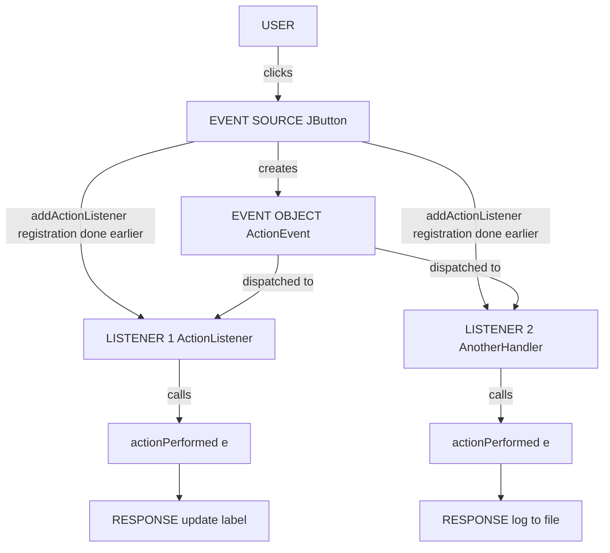
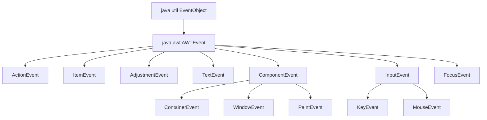
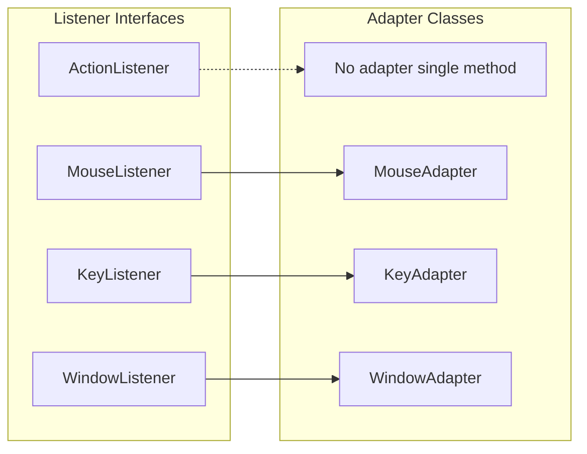
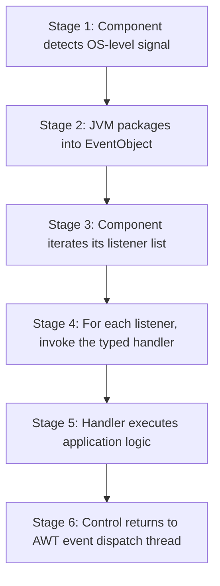

# Using the Delegation Event Model

<!-- SECTION_1_START -->
# Using the Delegation Event Model

## 1. Core Technical Definition & Intuitive Overview

> [!IMPORTANT]
> **Formal Definition (KTU 2024 Syllabus Terminology):**
> The **Delegation Event Model** is the standard event-handling mechanism used by JDK 1.1 and later (and therefore by all AWT and Swing components). In this model, the source of an event (a UI component such as a `JButton`) **delegates** the responsibility of handling the event to a separate listener object that has registered its interest for that specific event type. Communication occurs through event objects that encapsulate information about the user's action.

### 1.1 Conceptual Analogy / Intuition

Imagine a **newspaper subscription system**:

- **The Newspaper Company (Event Source)** does not personally call every subscriber when breaking news happens.
- Instead, it maintains a **subscription registry (Event Listener)** of people who have *explicitly signed up* to receive notifications.
- When an event (news) occurs, the company prepares a **newsletter (Event Object)** containing the details (which page, what time, what action) and sends it to all registered subscribers.
- Each **subscriber (Listener Object)** decides on its own what to do with the news — one may read it, another may file it, and a third may ignore it.

> [!NOTE]
> The same source can publish to **multiple listeners**, and the **same listener** can subscribe to **multiple sources**. The "delegation" is precisely this hand-off: the source *does not know or care* how the event is processed.

### 1.2 The Three Pillars of the Model

| Pillar | Role | Java Entity |
|---|---|---|
| **Event Object** | Encapsulates *what happened* | Subclasses of `java.awt.EventObject` (e.g., `ActionEvent`) |
| **Source Object** | The component that *triggers* the event | Any AWT/Swing component (e.g., `JButton`, `JTextField`) |
| **Listener Object** | The handler that *reacts* to the event | Classes implementing `java.util.EventListener` sub-interfaces |

> [!IMPORTANT]
> **Standard KTU metric to remember:**
> - The **package** housing all event classes and listener interfaces is `java.awt.event`.
> - The **top-most event class** is `java.util.EventObject`.
> - The **top-most listener marker interface** is `java.util.EventListener`.

### 1.3 GeoGebra / Desmos Integration

> [!VISUALIZATION CONTROL]
> **Concept:** Flow of control during an event occurrence.
> **Visual Description:** Picture a vertical timeline on the Y-axis. At the bottom, the *User* triggers an action. An arrow shoots up to the *Event Source* (a button). From the source, horizontal arrows fan outward to multiple *Listener Objects* that were previously registered. Each listener processes the event independently and returns a response.
> 
> This is a *publish-subscribe* fan-out architecture.

---

## 2. Deep Theoretical Analysis & KTU High-Yield Formula Sheet

### 2.1 Operational Steps to Use the Delegation Event Model

The model always follows **four mandatory steps**, in the order listed. Board answers that skip or reorder these steps lose marks.

1. **Identify the Event Source Component** — Decide which component (button, text field, menu, etc.) will generate the event.
2. **Implement the Appropriate Listener Interface** — Write a class that implements the interface matching the event type (e.g., `ActionListener`, `MouseListener`). Override the abstract methods to define the response.
3. **Register the Listener with the Source** — Invoke the source's `addXXXListener(...)` method, passing the listener object as the argument. This step is the actual *delegation*.
4. **Use an Adapter Class (Optional)** — When the listener interface has *more than one* abstract method and you need only a few, extend the corresponding **adapter class** to inherit empty implementations and override only the methods of interest.

> [!TIP]
> **Engineering Utility:** The Delegation Event Model is the foundation of every modern Java GUI (Swing, JavaFX partially), every Android `OnClickListener`, and is the conceptual ancestor of JavaScript's `addEventListener` API. Decoupling sources from handlers allows scalable UI code where a single handler can react to dozens of buttons, and one button can fan out to many handlers (logging, analytics, business logic).

### 2.2 KTU High-Yield Formula Sheet / Cheat Sheet

| Concept | Formula / API Signature | Notes |
|---|---|---|
| Event registration | `source.addXXXListener(listenerObj);` | The "delegation" call |
| Event de-registration | `source.removeXXXListener(listenerObj);` | Used to stop receiving events |
| Top event class | `java.util.EventObject` | All AWT events extend this |
| Top listener marker | `java.util.EventListener` | A tag interface, no methods |
| Event id retrieval | `event.getID()` | Returns an `int` constant (e.g., `ActionEvent.ACTION_PERFORMED`) |
| Event source retrieval | `event.getSource()` | Returns the `Object` that fired the event |
| Adapter usage | `class MyHandler extends MouseAdapter { ... }` | Avoids overriding all 5 mouse methods |
| Generic listener | `source.addListener(ListenerType $\vert$ T $\vert$ l)` | Parameterized in Java 8+ |

> [!NOTE]
> Note the use of `\vert` instead of `\|` in the last row to preserve markdown table integrity.

### 2.3 Categorization of Events and Listeners (Board-Favorite Table)

| Event Category | Event Class | Listener Interface | Methods to Implement | Adapter Class |
|---|---|---|---|---|
| Action | `ActionEvent` | `ActionListener` | `actionPerformed(ActionEvent)` | — |
| Mouse (clicks/enter/exit) | `MouseEvent` | `MouseListener` | 5 methods | `MouseAdapter` |
| Mouse (motion/drag) | `MouseEvent` | `MouseMotionListener` | 2 methods | `MouseMotionAdapter` |
| Keyboard | `KeyEvent` | `KeyListener` | 3 methods | `KeyAdapter` |
| Window | `WindowEvent` | `WindowListener` | 7 methods | `WindowAdapter` |
| Item (checkbox/combo) | `ItemEvent` | `ItemListener` | `itemStateChanged(ItemEvent)` | — |
| Text | `TextEvent` | `TextListener` | `textValueChanged(TextEvent)` | — |
| Focus | `FocusEvent` | `FocusListener` | 2 methods | `FocusAdapter` |
| Component | `ComponentEvent` | `ComponentListener` | 4 methods | `ComponentAdapter` |
| Container | `ContainerEvent` | `ContainerListener` | 2 methods | `ContainerAdapter` |
| Adjustment | `AdjustmentEvent` | `AdjustmentListener` | `adjustmentValueChanged` | — |

> [!IMPORTANT]
> **Memory trick for the exam:** If the interface has **only 1 abstract method**, there is **no adapter class** for it. If it has **2 or more**, an adapter is provided.

---

## 3. Step-by-Step Derivations & Code/Symbolic Implementation

### 3.1 Worked Example 1: Button Click Using `ActionListener` (Full Derivation)

**Problem Statement:** Create a Swing window with a button labeled "Click Me". Each click on the button should append the number of times it has been clicked to a label.

**Step 1 — Import the required packages.**

```java
import javax.swing.*;
import java.awt.*;
import java.awt.event.*;
```

**Step 2 — Implement the listener interface inside a class.**

```java
public class ClickCounter extends JFrame implements ActionListener {
    private JButton button;
    private JLabel label;
    private int count;
```

**Step 3 — Write the constructor that builds the UI and registers the listener.**

```java
    public ClickCounter() {
        setTitle("Delegation Event Model Demo");
        setSize(300, 150);
        setDefaultCloseOperation(JFrame.EXIT_ON_CLOSE);
        setLayout(new FlowLayout());

        label = new JLabel("Clicks: 0");
        button = new JButton("Click Me");

        // STEP 3 (registration) — the moment of DELEGATION
        button.addActionListener(this);

        add(label);
        add(button);
        setVisible(true);
    }
```

**Step 4 — Override the event-handling method.**

```java
    @Override
    public void actionPerformed(ActionEvent e) {
        count = count + 1;
        label.setText("Clicks: " + count);
    }

    public static void main(String[] args) {
        new ClickCounter();
    }
}
```

**Logical Derivation of the Control Flow:**

$$
\text{User clicks button} \;\longrightarrow\; \text{JVM creates ActionEvent} \;\longrightarrow\; \text{Event passed to all registered listeners}
$$

$$
\longrightarrow\; \text{actionPerformed(ActionEvent e)} \;\longrightarrow\; \text{count incremented, label updated}
$$

> [!NOTE]
> **What the examiner expects to see in the answer:**
> 1. The keyword `implements ActionListener` on the class declaration. **[1 mark]**
> 2. The registration call `button.addActionListener(this);` inside the constructor. **[1 mark]**
> 3. The complete `actionPerformed` method body. **[2 marks]**

### 3.2 Worked Example 2: Window Closing with `WindowAdapter`

When using `WindowListener`, you would normally need to override all 7 methods, but most of them will be empty. The `WindowAdapter` provides empty implementations for free.

```java
import javax.swing.*;
import java.awt.event.*;

public class WindowCloseDemo extends JFrame {
    public WindowCloseDemo() {
        setTitle("Window Adapter Demo");
        setSize(300, 200);
        setDefaultCloseOperation(JFrame.DO_NOTHING_ON_CLOSE);

        // Register an ANONYMOUS inner-class listener extending WindowAdapter
        addWindowListener(new WindowAdapter() {
            @Override
            public void windowClosing(WindowEvent e) {
                int choice = JOptionPane.showConfirmDialog(
                    null, "Exit application?", "Confirm",
                    JOptionPane.YES_NO_OPTION);
                if (choice == JOptionPane.YES_OPTION) {
                    System.exit(0);
                }
            }
        });

        setVisible(true);
    }

    public static void main(String[] args) {
        new WindowCloseDemo();
    }
}
```

**Why an adapter?** Because `WindowListener` has **7** abstract methods. Using `WindowAdapter`, we override **only** `windowClosing(...)`, and the other 6 are inherited as no-ops.

### 3.3 Worked Example 3: Multiple Sources to One Listener (Fan-In)

A single listener can handle events from several components. The standard pattern is to inspect `e.getSource()` to differentiate them.

```java
import javax.swing.*;
import java.awt.*;
import java.awt.event.*;

public class MultiSourceHandler extends JFrame implements ActionListener {
    private JButton btnA, btnB;

    public MultiSourceHandler() {
        setLayout(new FlowLayout());
        setSize(300, 100);
        setDefaultCloseOperation(JFrame.EXIT_ON_CLOSE);

        btnA = new JButton("Button A");
        btnB = new JButton("Button B");

        btnA.addActionListener(this);
        btnB.addActionListener(this);

        add(btnA);
        add(btnB);
        setVisible(true);
    }

    @Override
    public void actionPerformed(ActionEvent e) {
        if (e.getSource() == btnA) {
            System.out.println("Button A pressed");
        } else if (e.getSource() == btnB) {
            System.out.println("Button B pressed");
        }
    }

    public static void main(String[] args) {
        new MultiSourceHandler();
    }
}
```

**Derivation of the source-discrimination logic:**

$$
\text{event.getSource()} \;\rightarrow\; \text{returns Object reference}
$$

$$
\text{Compare with } \texttt{==} \text{ against known component references} \;\rightarrow\; \text{branch on identity}
$$

### 3.4 Worked Example 4: One Source, Multiple Listeners (Fan-Out)

A single button can be observed by several independent listeners. Each listener performs its own concern (separation of concerns).

```java
import javax.swing.*;
import java.awt.*;
import java.awt.event.*;

public class FanOutDemo extends JFrame {
    public FanOutDemo() {
        JButton button = new JButton("Submit");
        setLayout(new FlowLayout());
        add(button);
        pack();
        setDefaultCloseOperation(JFrame.EXIT_ON_CLOSE);
        setVisible(true);

        // Listener 1: log to console
        button.addActionListener(e -> System.out.println("Logged at " + System.currentTimeMillis()));

        // Listener 2: update counter
        int[] counter = {0};
        button.addActionListener(e -> {
            counter[0] = counter[0] + 1;
            System.out.println("Click count: " + counter[0]);
        });
    }

    public static void main(String[] args) {
        new FanOutDemo();
    }
}
```

> [!IMPORTANT]
> **KTU Board Point:** Whenever you see a lambda expression like `e -> ...`, it is a Java 8+ shorthand for a class implementing the corresponding functional interface (here, `ActionListener`). The board accepts both styles; lambdas are shorter and preferred in modern answers.

### 3.5 Summary of Java-Equivalent Pseudocode Mapping

| Conceptual Step | Java Code Symbol |
|---|---|
| Listen to clicks | `implements ActionListener` |
| Detect press | `addActionListener(this)` |
| React | `actionPerformed(ActionEvent e)` |
| Know which button | `e.getSource()` or `e.getActionCommand()` |
| Know the event type | `e.getID()` returns an `int` constant |
| Unregister | `removeActionListener(this)` |

---

## 4. Structural Diagrams & Schematics

### 4.1 Conceptual Flow of the Delegation Event Model



### 4.2 Inheritance Hierarchy of Event Classes



### 4.3 Listener-Adapter Pairing Topology



### 4.4 Multi-Stage Event Dispatching Pipeline



> [!TIP]
> **Reading aid:** The AWT event dispatch is performed on a single thread called the *Event Dispatch Thread (EDT)*. In Swing, all UI updates MUST happen on the EDT to avoid race conditions. This is a frequently asked *two-mark question* under "advanced AWT concepts."

---

## 5. KTU 2024 Scheme Examination Question Bank & Topic Recap

### 5.1 Part A Questions (3 Marks Each)

**Q1. [KTU University Exam – July 2024]**
*Define the Delegation Event Model. List any two advantages of using it over the earlier JDK 1.0 event model.*

**Model Answer (3 Marks):**
The Delegation Event Model is an event-handling approach in which an event source component delegates the responsibility of processing an event to one or more separate listener objects that have been explicitly registered with it. Communication happens through event objects that are instances of `java.awt.event` classes.

**Advantages (any two, 1 mark each):**
1. **Clean separation of concerns** — UI code and business logic reside in different classes, improving modularity.
2. **Many-to-many relationship** — A single source can notify multiple listeners, and one listener can handle events from multiple sources.
3. **Runtime flexibility** — Listeners can be added or removed dynamically using `addXXXListener` and `removeXXXListener`.

> [!NOTE]
> **Valuation key:** Definition = 1 mark, each advantage = 1 mark. Writing only the definition without advantages fetches 1/3.

**Q2. [KTU University Exam – Dec 2023]**
*What is the role of an Adapter class in the Delegation Event Model? Give one example.*

**Model Answer (3 Marks):**
An Adapter class is a default (no-operation) implementation of a listener interface that contains more than one abstract method. It allows the programmer to extend the adapter and override only the methods relevant to the application, instead of writing empty bodies for all the other methods.

**Example (1 mark):** `MouseAdapter` provides empty implementations for the 5 methods of `MouseListener`; we can override only `mouseClicked(...)` if that is all we need.

### 5.2 Part B Questions (14 Marks Each, with Internal Choice)

---

#### **Question A (14 Marks)**

**[KTU University Exam – July 2024, Model Paper Pattern]**

**(a) [7 Marks]** Explain the four steps involved in using the Delegation Event Model with a suitable example.

**(b) [7 Marks]** Write a Java Swing program to create a frame containing a text field and a button labeled "Greet". When the button is clicked, a message dialog should display "Hello, &lt;name&gt;" where &lt;name&gt; is the text entered in the text field. Use the Delegation Event Model.

**Model Solution:**

**(a) The Four Steps [7 Marks]**
1. **Identify the event source** — Choose the component, e.g., a `JButton` named `btn`. *[1 mark]*
2. **Implement the appropriate listener interface** — Declare the handler class with `implements ActionListener` and override `actionPerformed(ActionEvent e)`. *[2 marks]*
3. **Register the listener with the source** — In the constructor, call `btn.addActionListener(this);` so the source knows whom to notify. *[2 marks]*
4. **(Optional) Use an adapter class** — If the interface has multiple methods and only some are needed, extend the adapter (e.g., `WindowAdapter`) and override selectively. *[2 marks]*

**(b) Java Program [7 Marks]**

```java
import javax.swing.*;
import java.awt.*;
import java.awt.event.*;

public class GreetApp extends JFrame implements ActionListener {
    private JTextField nameField;
    private JButton greetButton;

    public GreetApp() {
        setTitle("Greet Application");
        setSize(300, 150);
        setLayout(new FlowLayout());
        setDefaultCloseOperation(JFrame.EXIT_ON_CLOSE);

        nameField = new JTextField(15);
        greetButton = new JButton("Greet");

        // Delegation step
        greetButton.addActionListener(this);

        add(new JLabel("Name:"));
        add(nameField);
        add(greetButton);
        setVisible(true);
    }

    @Override
    public void actionPerformed(ActionEvent e) {
        String name = nameField.getText();
        JOptionPane.showMessageDialog(this, "Hello, " + name);
    }

    public static void main(String[] args) {
        new GreetApp();
    }
}
```

**Valuation key for (b):**
- Class declaration with `implements ActionListener` — **1 mark**
- Registration call `addActionListener(this)` — **1 mark**
- Correct `actionPerformed` body — **2 marks**
- Correct GUI construction (frame, text field, button, layout) — **2 marks**
- Output mechanism (JOptionPane) — **1 mark**

---

#### **Question B (14 Marks) — Alternative Choice**

**[KTU University Exam – Dec 2023, Supplementary Pattern]**

**(a) [7 Marks]** Differentiate between the JDK 1.0 event model and the Delegation Event Model. State any four points.

**(b) [7 Marks]** Write a Java program using `WindowAdapter` to confirm with the user before closing the application window.

**Model Solution:**

**(a) Differences Table [7 Marks] — 4 points × ~1.5 marks each, plus an introductory sentence**

| Sl. No. | JDK 1.0 Event Model | Delegation Event Model |
|---|---|---|
| 1 | The container itself handles events by overriding methods like `action(...)`, `handleEvent(...)`. | Events are delegated to separate listener objects. |
| 2 | The component inherits a large hierarchy of event-handling methods. | The class implements only the listener interface it needs. |
| 3 | Limited support for multiple handlers per event. | Supports many-to-many source-listener relationships. |
| 4 | Event handling code is tightly coupled with the component class. | Loose coupling — sources and listeners are independent objects. |
| 5 | Inefficient — all events flow through the container's methods. | Efficient — only relevant events are dispatched to relevant listeners. |

**(b) Java Program with `WindowAdapter` [7 Marks]**

```java
import javax.swing.*;
import java.awt.event.*;

public class ConfirmCloseDemo extends JFrame {
    public ConfirmCloseDemo() {
        setTitle("Confirm Close Demo");
        setSize(300, 200);
        setDefaultCloseOperation(JFrame.DO_NOTHING_ON_CLOSE);

        addWindowListener(new WindowAdapter() {
            @Override
            public void windowClosing(WindowEvent e) {
                int opt = JOptionPane.showConfirmDialog(
                    ConfirmCloseDemo.this,
                    "Do you really want to close?",
                    "Confirm",
                    JOptionPane.YES_NO_OPTION);
                if (opt == JOptionPane.YES_OPTION) {
                    dispose();
                    System.exit(0);
                }
            }
        });

        setVisible(true);
    }

    public static void main(String[] args) {
        new ConfirmCloseDemo();
    }
}
```

**Valuation key for (b):**
- Correct import statements — **1 mark**
- `setDefaultCloseOperation(DO_NOTHING_ON_CLOSE)` — **1 mark**
- Anonymous class extending `WindowAdapter` — **2 marks**
- Override of `windowClosing` and confirmation logic — **2 marks**
- Proper exit (`System.exit(0)`) on confirmation — **1 mark**

> [!WARNING]
> **KTU Examiner's Valuation Warning / Pitfall Callout:**
> 1. **Do NOT** use `EXIT_ON_CLOSE` when you need to confirm — by the time the dialog appears, the JVM has already begun shutting down.
> 2. **Do NOT** forget the `@Override` annotation in the adapter class — the marker indicates the student knows they are overriding a specific method, and the examiner often awards a mark for it.
> 3. **Do NOT** implement a `WindowListener` directly and leave 6 methods empty when a `WindowAdapter` could be used — examiners may deduct marks for *inefficient design*.
> 4. **Always show** the line `addActionListener(this);` (or its equivalent). The registration step is the *moment of delegation* — without it, the model is not in use.
> 5. **Forgetting `setVisible(true)`** is a common slip that loses 1 mark. Always end the constructor with the visibility call.

### 5.3 Topic Recap & Important Things to Remember

- **The Delegation Event Model** is the JDK 1.1+ event-handling mechanism built around the *event source → event object → event listener* triad.
- The **top-level event class** is `java.util.EventObject`; the **top-level marker interface** is `java.util.EventListener`.
- All AWT/Swing event classes and listener interfaces live in the package **`java.awt.event`**.
- **Four mandatory steps**: identify source → implement listener interface → register with `addXXXListener` → optionally use an adapter.
- **Adapter classes** exist for every listener interface that has **more than one** abstract method; they are used to avoid empty method bodies.
- **One source can have many listeners** (fan-out), and **one listener can serve many sources** (fan-in), enabling clean separation of concerns.
- The **Event Dispatch Thread (EDT)** is the single thread on which AWT/Swing event handlers execute — relevant for concurrency questions.
- Standard event-handling API: `e.getSource()` (which component), `e.getID()` (which event subtype), `e.getActionCommand()` (semantic label for `ActionEvent`).
- Registration uses the pattern: `component.addEventNameListener(listenerObject);` and unregistration uses `removeEventNameListener(listenerObject);`.
- The Delegation Event Model supersedes the older **JDK 1.0 inheritance-based model** in which components inherited event-handling methods from container classes.
- Common exam pitfalls: forgetting to register the listener, using `EXIT_ON_CLOSE` with confirmation dialogs, leaving adapter methods un-overridden, and confusing event classes with listener interfaces.
- Remember the **memory rule** — single-method interfaces (like `ActionListener`, `ItemListener`) have **no adapter**; multi-method interfaces (like `MouseListener`, `KeyListener`, `WindowListener`) **do**.
<!-- SECTION_5_END -->
