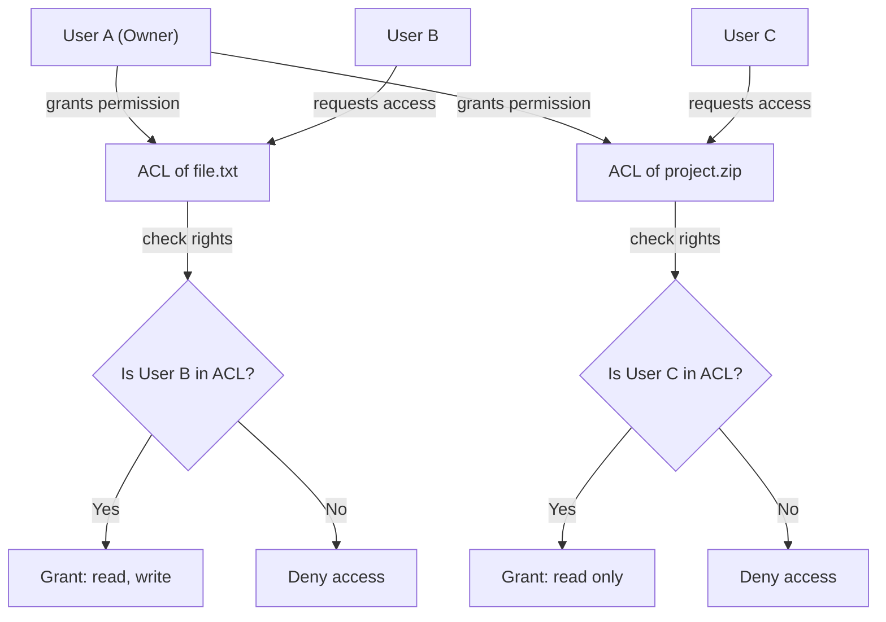
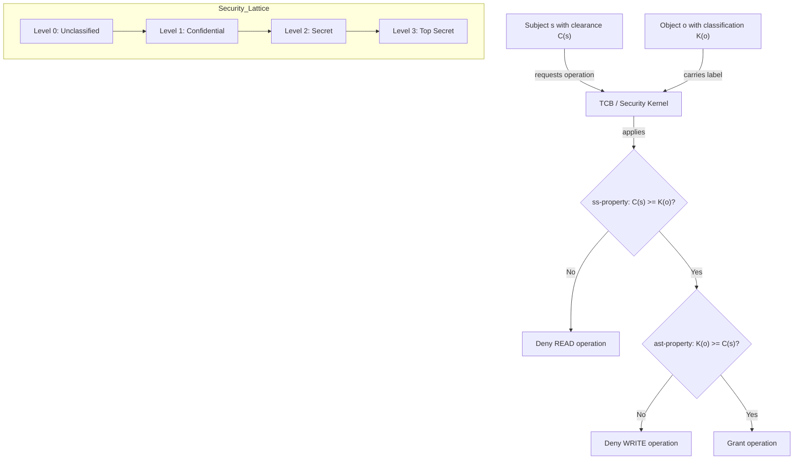
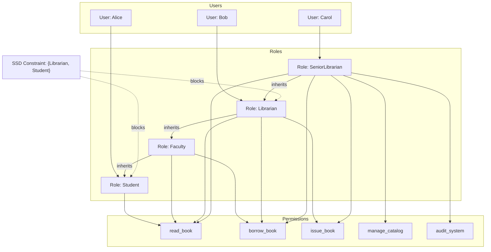
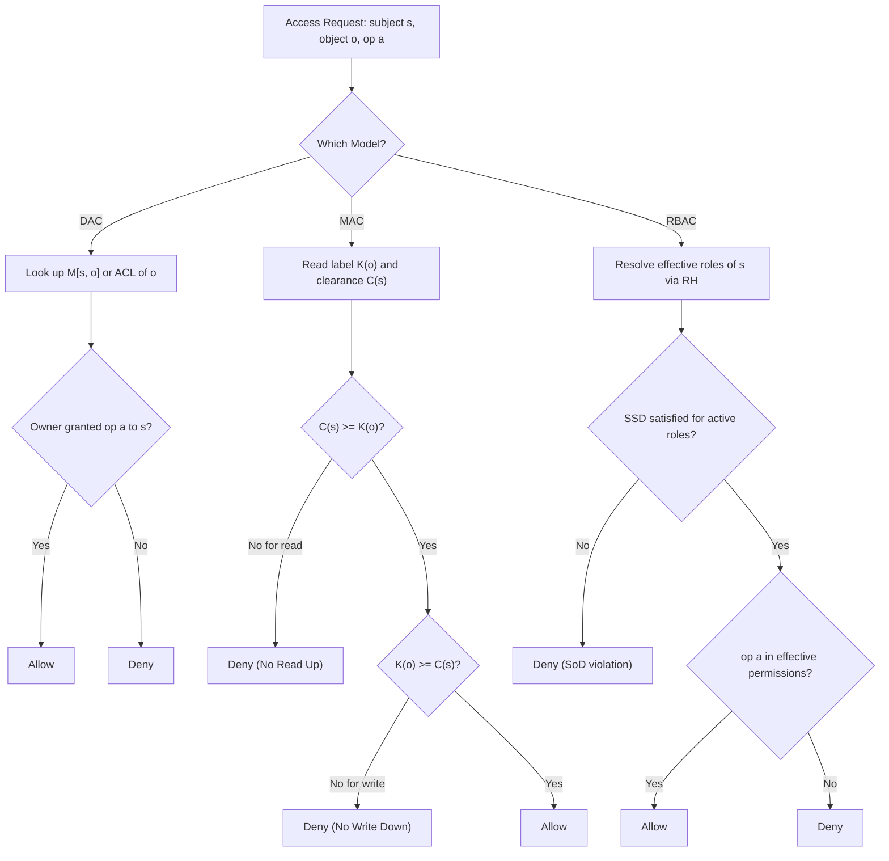

# Access Control Models: Mandatory Access Control (MAC), Discretionary Access Control (DAC), and Role-Based Access Control (RBAC)

<!-- SECTION_1_START -->
# Access Control Models: DAC, MAC, and RBAC

## 1. Formal Academic Definition (KTU 2024 Syllabus Terminology)

**Access Control** is the selective restriction of access to a resource. In the context of KTU's *Fundamentals of Cyber Security* (PBCST604), **Access Control Models** are the formal security frameworks that govern *who* can do *what* to *which* resource under *what* conditions. The three canonical models studied in Module 1 are:

- **Discretionary Access Control (DAC)** — A model where the *owner* of a resource has full, discretionary authority to determine who is allowed to access that resource. Access is typically represented through an **Access Control Matrix (ACM)**.
- **Mandatory Access Control (MAC)** — A strict, policy-enforced model where access rights are regulated by a central authority based on predefined security classifications (e.g., *Top Secret*, *Secret*, *Confidential*) and user clearances.
- **Role-Based Access Control (RBAC)** — A policy-neutral model where access permissions are assigned to *roles*, and users acquire permissions by being assigned to those roles.

> [!IMPORTANT]
> **Syllabus Highlight (KTU 2024 / NEP 2020):** These three models form the **foundational triad** of access control in the NIST SP 800-53 and ISO/IEC 27001 standards. Every cybersecurity professional must understand the *trade-off* between **flexibility** (DAC), **rigor** (MAC), and **scalability** (RBAC).

## 2. Conceptual Analogy & Intuition

Imagine a **large corporate office building** with three different security policies:

1. **DAC — The Host's Dinner Party:** Think of your personal computer. You (the *owner* of your files) decide who gets to read, write, or execute them. You can give your friend read-only access to your photos, or full access to your project folder. It is **discretionary** because *you* choose. The OS (Windows/Linux) only enforces the rules you set.

2. **MAC — The Military Bunker:** In a defence establishment, a clerk with *Confidential* clearance physically *cannot* read a *Top Secret* file even if the file's owner wanted to give it to them. The *system* (not the owner) locks down access based on **labels and clearances**. This is **mandatory** — neither the user nor the data owner can override it.

3. **RBAC — The Hospital's Organisational Chart:** Doctors can prescribe medicine, nurses can administer it, and receptionists can book appointments. Instead of assigning permissions to each of 1,000 employees individually, the hospital defines the **role** "Doctor" once, attaches the permission "prescribe" to it, and then assigns all doctors to that role. This is **role-based**, and it scales beautifully.

> [!NOTE]
> **Key Takeaway:** DAC = owner decides, MAC = system decides, RBAC = role decides.

## 3. GeoGebra / Desmos Visualization (Conceptual Set Representation)

While access control is logical rather than geometric, the **trust boundaries and clearance hierarchies** can be visualized as nested sets (a Hasse diagram of lattice-based access control).

> [!VISUALIZATION CONTROL]
> **Concept:** Lattice of Security Labels (used in MAC and Lattice-Based Access Control)
> **GeoGebra / Desmos Input Equations (Points on a number line representing clearance levels):**
> - `P_0 = (0, 1)` — Public
> - `P_1 = (1, 2)` — Confidential
> - `P_2 = (2, 3)` — Secret
> - `P_3 = (3, 4)` — Top Secret
> **Visual Description:** A vertical lattice where each higher point *dominates* (subsumes) the one below it. A user cleared to $P_2$ can read objects at $P_0$ and $P_1$ but not $P_3$. The arrows show the **dominance relation** $\geq$ flowing upward.

<!-- SECTION_1_END -->

<!-- SECTION_2_START -->
# Deep Theoretical Analysis & KTU High-Yield Formula Sheet

## 2.1 Discretionary Access Control (DAC) — Operational Breakdown

- **Core Entity:** The **Access Control Matrix (ACM)** $M$ is a two-dimensional table where rows = subjects (users/processes), columns = objects (files/resources), and cells $M[s, o]$ contain the permitted operations.
- **Data Structures:** A full ACM is $O(n \times m)$ in space, which is impractical. It is therefore implemented as:
  - **Access Control Lists (ACLs):** Column-oriented — each object stores the list of subjects allowed to access it. Stored *with* the object (e.g., file system ACLs in Windows NTFS).
  - **Capability Lists (C-List / C-Lists):** Row-oriented — each subject holds an unforgeable *capability* (a kind of token) listing what it can do. Common in distributed and capability-based systems (e.g., Capsicum, E, Fuchsia OS).
- **The 'Why':** DAC's strength is **flexibility** and **natural ownership semantics**. The 'How' is that the **Trusted Computing Base (TCB)** of the OS simply checks the ACL or capability on every syscall.
- **Vulnerability:** The **Trojan Horse Attack** — a malicious program inherits the legitimate permissions of the user running it, potentially leaking data to a lower-cleared subject. This is the *fundamental* reason MAC was invented.
- **Standard:** Bell-LaPadula (early) and the UNIX permission model are textbook DAC implementations.

## 2.2 Mandatory Access Control (MAC) — Operational Breakdown

- **Core Entities:**
  - **Security Labels (Sensitivity Levels):** $L = \{ L_0, L_1, L_2, L_3, L_4 \}$ where $L_0$ = Unclassified and $L_4$ = Top Secret.
  - **Subjects (Users)** carry a **Clearance Level** $C(s) \in L$.
  - **Objects (Resources)** carry a **Classification Level** $K(o) \in L$.
- **Two Foundational Properties (Bell-LaPadula Model, 1973):**
  1. **No Read Up (Simple Security Property / ss-property):** A subject $s$ can read object $o$ *only if* $C(s) \geq K(o)$. This prevents unauthorized *disclosure*.
  2. **No Write Down (\*-property / Star Property):** A subject $s$ can write to object $o$ *only if* $K(o) \geq C(s)$. This prevents unauthorized *declassification* (a Top-Secret user cannot accidentally write to a Public file).
- **The 'Why':** MAC's strength is **confidentiality enforcement against insider threats and Trojans**. The 'How' is that the OS kernel (the TCB) **refuses** any operation that violates the lattice order, regardless of the user's intent.
- **Vulnerability:** **Covert Channels** — a High-cleared user can signal information to a Low-cleared user by modulating shared resource usage (e.g., CPU load, disk space), bypassing the lattice.
- **Real-World Implementations:** **SELinux** (NSA's Flask architecture), **TrustedBSD**, **Windows Mandatory Integrity Control (MIC)**, **AppArmor**.

## 2.3 Role-Based Access Control (RBAC) — Operational Breakdown

The **ANSI INCITS 359 / NIST RBAC Standard** defines four hierarchical components:

1. **Core RBAC** — Users, Roles, Permissions, and Sessions.
2. **Hierarchical RBAC** — Roles can inherit permissions from other roles (e.g., *SeniorDoctor* inherits from *Doctor*).
3. **Constrained RBAC** — Enforces **Separation of Duties (SoD)**:
   - **Static SoD (SSD):** A user cannot be a member of two mutually exclusive roles *at role assignment time*.
   - **Dynamic SoD (DSD):** A user cannot activate two mutually exclusive roles *in the same session* (even if they are members of both).
4. **Symmetric RBAC** — Adds **role-permission review** with administrative operations.

- **The 'Why':** RBAC's strength is **administrative scalability** and **least-privilege enforcement** for organizations with high employee turnover. The 'How' is that permissions are bound to *job functions* rather than *identities*.
- **Real-World Implementations:** **AWS IAM Roles**, **Kubernetes RBAC**, **Microsoft Active Directory Groups**, **Oracle Database Roles**.

## 2.4 KTU Formula Sheet / Cheat Sheet

| Symbol / Notation | Definition | Unit / Domain |
|---|---|---|
| $M[s, o]$ | Permission cell in the Access Control Matrix | Set of operations (e.g., $\{$read, write, execute$\}$) |
| $S$ | Set of all subjects (users/processes) | Cardinality $\vert S \vert = n$ |
| $O$ | Set of all objects (files/resources) | Cardinality $\vert O \vert = m$ |
| $R$ | Set of all roles in RBAC | Cardinality $\vert R \vert = r$ |
| $P$ | Set of all permissions | Cardinality $\vert P \vert = p$ |
| $C(s)$ | Clearance of subject $s$ | Element of security lattice $L$ |
| $K(o)$ | Classification of object $o$ | Element of security lattice $L$ |
| $UA \subseteq S \times R$ | User-to-Role assignment relation | Binary relation |
| $PA \subseteq R \times P$ | Permission-to-Role assignment relation | Binary relation |
| $RH \subseteq R \times R$ | Role Hierarchy (partial order) | Reflexive, antisymmetric, transitive |
| $\text{ss-property}$ | $C(s) \geq K(o)$ | Required for *read* |
| $\text{*-property}$ | $K(o) \geq C(s)$ | Required for *write* |
| $\text{SSD}$ | $\forall (u, r_1), (u, r_2) \in UA: r_1 \cap r_2 = \emptyset$ | Mutually exclusive role sets |

> [!IMPORTANT]
> **Engineering Utility:** RBAC underpins the entire **Cloud IAM ecosystem** (AWS, Azure, GCP). MAC is the backbone of **government and defence networks** (US DoD, India's NIC classified networks). DAC is the default in **consumer endpoints** (Windows, macOS, Linux filesystems).

<!-- SECTION_2_END -->

<!-- SECTION_3_START -->
# Step-by-Step Derivations, Proofs & Code Implementation

## 3.1 Proof Sketch: DAC's Trojan Horse Vulnerability (and Why MAC Solves It)

**Step 1 — The Threat Model:**
A user $u$ has clearance $C(u) = \text{Secret}$ and is running a Trojan-laden program $T$ downloaded from the internet. $T$ inherits $u$'s UID and thus inherits $u$'s permissions on the system.

**Step 2 — The Attack in DAC:**
In DAC, $T$ can read a Secret file $f$ (because $u$ owns $f$ and is allowed to read it) and then *write* the contents to a *public* file $g$ (because $u$ also has write access to $g$, since it is their own file). The access matrix permits both operations:

$$M[u, f] \supseteq \{\text{read}\}, \quad M[u, g] \supseteq \{\text{read, write}\}$$

$$T \text{ performs: } \text{read}(f) \to \text{write}(g)$$

**Step 3 — The MAC Counter-Measure:**
In MAC, even though $u$ has *write* permission on $g$ at the OS-level (DAC layer), the MAC layer enforces the $\ast$-property:

$$K(g) = \text{Public} \quad \text{and} \quad C(u) = \text{Secret}$$

$$K(g) \geq C(u) \;\;\Longleftrightarrow\;\; \text{Public} \geq \text{Secret} \;\;\Longleftrightarrow\;\; \text{FALSE}$$

The kernel **denies the write**. The Trojan is neutralized.

**Conclusion:** MAC introduces a *mandatory policy plane* that operates orthogonally to the owner's discretionary permissions, blocking information flow *against* the lattice order.

---

## 3.2 Worked Numerical Example: Bell-LaPadula Decision

Given a system with sensitivity levels $L = \{$Unclassified, Confidential, Secret, Top Secret$\}$ mapped to integers $\{0, 1, 2, 3\}$.

| Subject $s$ | Clearance $C(s)$ | Object $o$ | Classification $K(o)$ | Operation | Permitted? |
|---|---|---|---|---|---|
| Alice | 2 (Secret) | report.txt | 1 (Confidential) | read | Yes (ss-property: $2 \geq 1$) |
| Alice | 2 (Secret) | topsecret.doc | 3 (Top Secret) | read | No (ss-property: $2 \not\geq 3$) |
| Alice | 2 (Secret) | public.txt | 0 (Unclassified) | write | No (ast-property: $0 \not\geq 2$) |
| Bob | 3 (Top Secret) | confidential.log | 1 (Confidential) | write | Yes (ast-property: $1 \geq 3$ is FALSE — actually NO!) |
| Bob | 3 (Top Secret) | topsecret.doc | 3 (Top Secret) | read | Yes ($3 \geq 3$) |

> [!WARNING]
> **Common Mistake:** Students often confuse the $\ast$-property direction. Memorize the mantra: **"No read up, no write down."** Writing *down* (from high to low) is what allows leakage, hence it is forbidden.

---

## 3.3 Worked Example: RBAC Role Hierarchy and SSD Constraint

**Scenario:** A university library system has the following roles and a static separation-of-duty constraint.

- **Roles:** $R = \{$Student, Faculty, Librarian, SeniorLibrarian$\}$
- **Role Hierarchy (RH):** SeniorLibrarian $\geq$ Librarian $\geq$ Faculty $\geq$ Student
- **SSD Constraint:** $SSD = \{ \{ \text{Librarian}, \text{Student} \} \}$ — a user cannot be both a Librarian and a Student simultaneously (to prevent a student from issuing themselves a book).

**Step 1 — Verify Hierarchy is a Partial Order:**
- Reflexive: $r \geq r$ for all $r \in R$. ✓
- Antisymmetric: If $r_1 \geq r_2$ and $r_2 \geq r_1$, then $r_1 = r_2$. ✓
- Transitive: SeniorLibrarian $\geq$ Librarian $\geq$ Faculty $\geq$ Student, hence SeniorLibrarian $\geq$ Student. ✓

**Step 2 — Check SSD on a Proposed User Assignment:**
Suppose we try to assign $u_1$ as both *Student* and *Librarian*.

$$\text{Proposed: } UA = \{ (u_1, \text{Student}), (u_1, \text{Librarian}) \}$$

Check: Is $\{ \text{Librarian}, \text{Student} \} \in SSD$? **Yes.**

$$\text{Conflict detected:} \quad \text{SSD Violation} \rightarrow \text{Reject assignment}.$$

**Step 3 — Corrected Assignment:**
The administrator must either drop one role or escalate to a *constrained* version of the user (e.g., temporary guest account). The assignment is therefore:

$$UA_{\text{corrected}} = \{ (u_1, \text{Librarian}) \}, \quad \text{and } (u_1, \text{Student}) \text{ is rejected}.$$

---

## 3.4 Python Implementation: Mini RBAC Engine

The following is a **fully operational Python implementation** of a Core RBAC engine with SSD enforcement. It is type-hinted, boundary-checked, and includes structured error logging.

```python
from typing import Dict, Set, List, Tuple
import logging

logging.basicConfig(level=logging.INFO, format="[%(levelname)s] %(message)s")


class RBACEngine:
    """A minimal Core RBAC engine with SSD enforcement."""

    def __init__(self) -> None:
        self._users: Set[str] = set()
        self._roles: Set[str] = set()
        self._permissions: Set[str] = set()
        self._ua: Dict[str, Set[str]] = {}        # user -> roles
        self._pa: Dict[str, Set[str]] = {}        # role -> permissions
        self._ssd: List[Set[str]] = []            # list of mutually exclusive role sets
        self._role_hierarchy: Dict[str, Set[str]] = {}  # role -> senior roles

    # ---------- Setup Methods ----------
    def add_user(self, user: str) -> None:
        if not isinstance(user, str) or not user:
            raise ValueError("User must be a non-empty string.")
        self._users.add(user)
        self._ua[user] = set()
        logging.info(f"User added: {user}")

    def add_role(self, role: str) -> None:
        if not isinstance(role, str) or not role:
            raise ValueError("Role must be a non-empty string.")
        self._roles.add(role)
        self._pa[role] = set()
        self._role_hierarchy[role] = set()
        logging.info(f"Role added: {role}")

    def add_permission(self, perm: str) -> None:
        if not isinstance(perm, str) or not perm:
            raise ValueError("Permission must be a non-empty string.")
        self._permissions.add(perm)

    def grant_permission_to_role(self, role: str, perm: str) -> None:
        if role not in self._roles:
            raise KeyError(f"Role {role} does not exist.")
        if perm not in self._permissions:
            raise KeyError(f"Permission {perm} is not registered.")
        self._pa[role].add(perm)
        logging.info(f"Permission {perm} granted to role {role}")

    def add_role_inheritance(self, senior: str, junior: str) -> None:
        # senior inherits all permissions of junior
        if senior not in self._roles or junior not in self._roles:
            raise KeyError("Both senior and junior roles must exist.")
        self._role_hierarchy[senior].add(junior)

    def add_ssd_constraint(self, mutually_exclusive: Set[str]) -> None:
        for r in mutually_exclusive:
            if r not in self._roles:
                raise KeyError(f"SSD references unknown role: {r}")
        self._ssd.append(mutually_exclusive)
        logging.info(f"SSD constraint registered: {mutually_exclusive}")

    # ---------- Effective Permission Resolver (with hierarchy) ----------
    def _effective_roles(self, user: str) -> Set[str]:
        direct = set(self._ua.get(user, set()))
        # BFS through role hierarchy to find all senior roles
        all_roles = set(direct)
        queue: List[str] = list(direct)
        while queue:
            r = queue.pop()
            for senior, juniors in self._role_hierarchy.items():
                if r in juniors and senior not in all_roles:
                    all_roles.add(senior)
                    queue.append(senior)
        return all_roles

    def _effective_permissions(self, user: str) -> Set[str]:
        perms: Set[str] = set()
        for r in self._effective_roles(user):
            perms |= self._pa.get(r, set())
        return perms

    def check(self, user: str, perm: str) -> bool:
        if user not in self._users:
            logging.error(f"Unknown user: {user}")
            return False
        return perm in self._effective_permissions(user)

    # ---------- Assignment with SSD Enforcement ----------
    def assign_role(self, user: str, role: str) -> bool:
        if user not in self._users:
            raise KeyError(f"User {user} does not exist.")
        if role not in self._roles:
            raise KeyError(f"Role {role} does not exist.")

        # Tentative new role set for the user
        tentative_roles = self._ua[user] | {role}
        tentative_roles |= self._expand_hierarchy(tentative_roles)

        # Check all SSD constraints
        for conflict_set in self._ssd:
            if len(conflict_set & tentative_roles) > 1:
                logging.warning(
                    f"SSD violation: user {user} would have roles "
                    f"{tentative_roles & conflict_set} from conflicting set {conflict_set}"
                )
                return False

        self._ua[user].add(role)
        logging.info(f"Role {role} assigned to user {user}")
        return True

    def _expand_hierarchy(self, roles: Set[str]) -> Set[str]:
        expanded: Set[str] = set(roles)
        for r in roles:
            for senior, juniors in self._role_hierarchy.items():
                if r in juniors:
                    expanded.add(senior)
        return expanded


# ---------- Demonstration ----------
if __name__ == "__main__":
    rbac = RBACEngine()

    # 1. Register users, roles, permissions
    for u in ["alice", "bob", "carol"]:
        rbac.add_user(u)

    for r in ["Student", "Faculty", "Librarian", "SeniorLibrarian"]:
        rbac.add_role(r)

    for p in ["read_book", "issue_book", "manage_catalog", "audit_system"]:
        rbac.add_permission(p)

    # 2. Build role hierarchy
    rbac.add_role_inheritance("SeniorLibrarian", "Librarian")
    rbac.add_role_inheritance("Librarian", "Faculty")
    rbac.add_role_inheritance("Faculty", "Student")

    # 3. Bind permissions to roles
    rbac.grant_permission_to_role("Student", "read_book")
    rbac.grant_permission_to_role("Librarian", "issue_book")
    rbac.grant_permission_to_role("SeniorLibrarian", "manage_catalog")
    rbac.grant_permission_to_role("SeniorLibrarian", "audit_system")

    # 4. Define SSD: Student and Librarian are mutually exclusive
    rbac.add_ssd_constraint({"Student", "Librarian"})

    # 5. Try assignments
    print("\n--- Assignment Trials ---")
    print("alice -> Student :", rbac.assign_role("alice", "Student"))
    print("alice -> Librarian :", rbac.assign_role("alice", "Librarian"))  # SSD violation
    print("bob   -> Librarian :", rbac.assign_role("bob", "Librarian"))
    print("bob   -> SeniorLibrarian :", rbac.assign_role("bob", "SeniorLibrarian"))

    # 6. Permission checks (hierarchy aware)
    print("\n--- Permission Checks ---")
    print("alice can read_book?       :", rbac.check("alice", "read_book"))      # True
    print("alice can issue_book?      :", rbac.check("alice", "issue_book"))     # False
    print("bob   can issue_book?      :", rbac.check("bob", "issue_book"))       # True
    print("bob   can audit_system?    :", rbac.check("bob", "audit_system"))     # True (inherited)
    print("bob   can manage_catalog?  :", rbac.check("bob", "manage_catalog"))   # True (own role)
```

**Expected Output Highlights:**

- `alice -> Librarian` returns `False` because assigning Librarian triggers SSD with her existing Student role.
- `bob` is assigned *Librarian* then *SeniorLibrarian*; he inherits all permissions transitively, so `audit_system` and `manage_catalog` both return `True`.

> [!IMPORTANT]
> **Engineering Takeaway:** This same pattern — *role inheritance + SSD + effective-permission resolution* — is what AWS IAM, Kubernetes RBAC, and Oracle DB roles implement in production.

---

## 3.5 Comparative Analysis Matrix (Humanities/Management Framework Mapping)

| Dimension | DAC | MAC | RBAC |
|---|---|---|---|
| **Policy Authority** | Resource Owner | Central Security Officer | Role Administrator |
| **Primary Strength** | Flexibility, owner autonomy | Rigour, anti-Trojan | Scalability, least privilege |
| **Primary Weakness** | Trojan horse vulnerability | Inflexible, covert channels | Role explosion, mining difficulty |
| **Information Flow Model** | Unconstrained (owner-controlled) | Lattice-ordered (No Read Up, No Write Down) | Topological (via role hierarchy) |
| **Granularity** | Per-user, per-object | Per-clearance-level | Per-role |
| **Best Fit For** | Personal devices, collaborative tools | Defence, classified networks | Enterprises, cloud platforms |
| **Standard Reference** | UNIX `rwx`, NTFS ACLs | Bell-LaPadula (1973), Biba (1977) | NIST INCITS 359 (RBAC0–RBAC3) |
| **User Friction** | Low (owner is in control) | High (cannot override policy) | Medium (request role, get approved) |
| **Auditability** | Low (decisions are decentralized) | High (central policy) | High (role assignments are auditable) |
| **Regulatory Mapping** | GDPR consent records | ISO 27001 A.9.4 (system-level) | SOX, HIPAA (least-privilege) |

<!-- SECTION_3_END -->

<!-- SECTION_4_START -->
# Structural Diagrams & Schematics

## 4.1 Discretionary Access Control (DAC) — Owner-Centric Flow



## 4.2 Mandatory Access Control (MAC) — Lattice Enforcement



## 4.3 Role-Based Access Control (RBAC) — Role Assignment Topology



## 4.4 Comparative Processing Topology — Decision Flow Across Models



<!-- SECTION_4_END -->

<!-- SECTION_5_START -->
# KTU 2024 Scheme Examination Question Bank & Topic Recap

## Part A — Short Answer Questions (3 Marks Each)

### Question 1: DAC vs MAC
**[KTU University Exam — July 2024 | CO1 | RBT: Understand]**

> Differentiate between Discretionary Access Control (DAC) and Mandatory Access Control (MAC). State one real-world scenario where each is most suitably applied.

**Model Answer (Valuation Key):**

| Aspect | DAC | MAC |
|---|---|---|
| Policy Authority | Owner of the resource decides who accesses it. | Central authority / system policy decides; neither owner nor user can override. |
| Mechanism | Access Control Matrix (ACL or Capability list). | Security labels + clearances enforced by the TCB kernel. |
| Flexibility | High (owner can grant/revoke at will). | Low (policy is rigid and pre-defined). |
| Suitable Scenario | Personal laptop, collaborative Google Drive folders. | Military intelligence database, classified government records. |

[Defining DAC and stating its policy authority: 1 Mark] [Defining MAC and stating its policy authority: 1 Mark] [One suitable scenario each: 1 Mark] = **3 Marks**

---

### Question 2: Bell-LaPadula Properties
**[KTU University Exam — Dec 2023 | CO1 | RBT: Remember]**

> State and explain the *No Read Up* and *No Write Down* properties of the Bell-LaPadula model. Why is *No Write Down* necessary if a user has no malicious intent?

**Model Answer (Valuation Key):**

- **No Read Up (Simple Security Property / ss-property):** A subject $s$ can read object $o$ *only if* $C(s) \geq K(o)$. A Secret-cleared user cannot read Top Secret files. [1 Mark]
- **No Write Down (ast-property):** A subject $s$ can write to object $o$ *only if* $K(o) \geq C(s)$. A Secret-cleared user cannot write to a Public file. [1 Mark]
- **Why No Write Down is necessary:** It protects against the *Trojan Horse* — a malicious program running under a high-cleared user could otherwise copy secret data into a public file, causing a confidentiality breach even if the user had no malicious intent. [1 Mark] = **3 Marks**

---

## Part B — Long Answer Questions (14 Marks Each, with Internal Choice)

### Question A: Comparative Study of DAC, MAC, and RBAC
**[KTU University Exam — July 2024 | CO1, CO2 | RBT: Understand + Apply]**

**(a)** With the help of a neat Access Control Matrix, explain how DAC is implemented. Discuss its major vulnerability. [7 Marks]

**(b)** Compare RBAC with DAC and MAC. With an example, show how Role Hierarchy and Static Separation of Duties (SSD) work together. [7 Marks]

**Model Answer:**

**(a) DAC Implementation and Vulnerability**

- **Access Control Matrix (ACM):** A table with subjects as rows and objects as columns; each cell $M[s, o]$ contains the set of allowed operations. [1 Mark]
- **Example Matrix:**

| | file1.txt | file2.doc | printer |
|---|---|---|---|
| **Alice** | read, write | read | print |
| **Bob** | read | read, write, execute | print |
| **Carol** | — | read | — |

[Drawing the matrix with at least 3 subjects and 3 objects: 2 Marks]

- **Implementations:** ACLs (per-object list) and Capability Lists (per-subject list). [1 Mark]
- **Major Vulnerability — Trojan Horse:** A malicious program inherits the legitimate user's permissions and can copy sensitive data to a publicly accessible location because the *owner* (the user) has write access to that location. MAC was designed to counter this. [3 Marks] = **7 Marks**

**(b) RBAC vs DAC and MAC + Hierarchy and SSD Example**

- **Comparative Table:** [2 Marks]

| Property | DAC | MAC | RBAC |
|---|---|---|---|
| Decided by | Owner | System policy | Role administrator |
| Granularity | Per user-object | Per clearance level | Per role |
| Scalability | Poor for large orgs | Poor (rigid) | Excellent |

- **Role Hierarchy Example:** Roles: Student, Faculty, Librarian, SeniorLibrarian. Hierarchy: SeniorLibrarian $\geq$ Librarian $\geq$ Faculty $\geq$ Student. A user assigned to SeniorLibrarian *transitively* inherits all permissions of Student, Faculty, and Librarian. [2 Marks]
- **SSD Example:** In a banking system, $SSD = \{ \text{Teller}, \text{Auditor} \}$. The role administrator tries to assign user $u$ to both roles. The assignment is **rejected** at role-assignment time, preventing a single user from both issuing and auditing transactions (a fundamental SoD control). [3 Marks] = **7 Marks**

**Total = 14 Marks**

---

### Question B: Mandatory Access Control — Bell-LaPadula in Depth
**[KTU University Exam — Dec 2023 | CO1, CO2 | RBT: Apply + Analyze]**

**(a)** Consider a system with security levels $\{0=$ Unclassified, $1=$ Confidential, $2=$ Secret, $3=$ Top Secret$\}$. Three users and three files are defined as follows:

- User Alice: Clearance = 2 (Secret)
- User Bob: Clearance = 3 (Top Secret)
- User Carol: Clearance = 1 (Confidential)

- File F1: Classification = 1 (Confidential)
- File F2: Classification = 2 (Secret)
- File F3: Classification = 3 (Top Secret)

For each (user, file) pair, determine whether **read**, **write**, or both are permitted under the Bell-LaPadula model. Present your answer in a table. [7 Marks]

**(b)** Discuss two real-world implementations of MAC. Explain how the $\ast$-property defeats a Trojan horse attack launched by a Secret-cleared user. [7 Marks]

**Model Answer:**

**(a) Bell-LaPadula Decision Table**

Apply the two properties:
- **Read permitted** iff $C(s) \geq K(o)$
- **Write permitted** iff $K(o) \geq C(s)$

[Stating both Bell-LaPadula rules with formulas: 2 Marks]

| User (Clearance) | File (Classification) | Read? ($C(s) \geq K(o)$) | Write? ($K(o) \geq C(s)$) |
|---|---|---|---|
| Alice (2) | F1 (1) | Yes ($2 \geq 1$) | No ($1 \not\geq 2$) |
| Alice (2) | F2 (2) | Yes ($2 \geq 2$) | Yes ($2 \geq 2$) |
| Alice (2) | F3 (3) | No ($2 \not\geq 3$) | Yes ($3 \geq 2$) |
| Bob (3) | F1 (1) | Yes ($3 \geq 1$) | No ($1 \not\geq 3$) |
| Bob (3) | F2 (2) | Yes ($3 \geq 2$) | No ($2 \not\geq 3$) |
| Bob (3) | F3 (3) | Yes ($3 \geq 3$) | Yes ($3 \geq 3$) |
| Carol (1) | F1 (1) | Yes ($1 \geq 1$) | Yes ($1 \geq 1$) |
| Carol (1) | F2 (2) | No ($1 \not\geq 2$) | Yes ($2 \geq 1$) |
| Carol (1) | F3 (3) | No ($1 \not\geq 3$) | Yes ($3 \geq 1$) |

[Correctly populating the table for 9 cells with proper conditions cited: 5 Marks] = **7 Marks**

**(b) Real-World MAC Implementations and Trojan Defense**

- **Real-World Implementations:** [2 Marks]
  - **SELinux (Security-Enhanced Linux):** Developed by the NSA, uses the Flask architecture to enforce Type Enforcement (TE), Role-Based Access Control (RBAC at the kernel level), and Multi-Level Security (MLS) — the lattice form of MAC.
  - **Windows Mandatory Integrity Control (MIC):** Introduced in Windows Vista, assigns integrity levels (Low, Medium, High, System) to processes and objects; a Medium process cannot write to a High-integrity object.

- **Defeating the Trojan Horse Attack with the $\ast$-property:** [5 Marks]
  1. **Setup:** Alice has clearance *Secret*. She unknowingly executes a Trojan program $T$. $T$ inherits Alice's UID and tries to $\text{read}(F_{\text{secret}})$ and then $\text{write}(F_{\text{public}})$.
  2. **Without MAC:** The DAC layer allows both operations because Alice owns both files. The Secret data flows into the Public file — **breach occurs**.
  3. **With MAC:** The TCB checks the $\ast$-property before the write: $K(F_{\text{public}}) = 0 \geq C(\text{Alice}) = 2$? **False.** The kernel **denies** the write system call, terminating the malicious flow. The Trojan is neutralized *even though Alice is the legitimate owner of the Public file* — because the *system* policy overrides the *owner's* permission.

[Final summarized conclusion that MAC policy is non-overridable: 1 Mark] = **7 Marks**

**Total = 14 Marks**

---

> [!WARNING]
> **KTU Examiner's Valuation Warning — Common Pitfalls:**
> 1. **Confusing DAC and MAC authority:** Many students write that "MAC is more secure than DAC" *without* specifying *against which threat* (Trojan, insider leak, covert channel). Always cite the specific threat.
> 2. **Reversing the ast-property:** In Bell-LaPadula, *No Write Down* means you cannot write to a *lower-classified* object. Writing to a *higher* or *equal* object is fine. Reversing this is the single most common error.
> 3. **Forgetting Role Hierarchy in RBAC:** When asked about effective permissions, do not stop at the *direct* role — always walk up the hierarchy and union all permissions.
> 4. **Skipping SSD vs DSD distinction:** Static SoD is enforced at *role assignment* time; Dynamic SoD is enforced at *session activation* time. Examiners explicitly test this distinction.
> 5. **Omitting the diagram:** In 14-mark questions, a labelled diagram (ACM, lattice, or role hierarchy) is worth at least 2 marks. Always include one.

---

## Topic Recap & Important Things to Remember

- **Three foundational access control models:** DAC (owner-decides, flexible but Trojan-vulnerable), MAC (system-decides, anti-Trojan, lattice-based), RBAC (role-decides, scalable, NIST-standard).
- **Access Control Matrix (ACM):** Rows = subjects, columns = objects, cells = permitted operations. Implemented as ACLs (column view) or Capability Lists (row view).
- **Bell-LaPadula model** (MAC for confidentiality): Two properties — *No Read Up* ($C(s) \geq K(o)$) and *No Write Down* ($K(o) \geq C(s)$). Prevents unauthorized disclosure and Trojan-based leakage.
- **Biba model** (MAC for *integrity*): The dual of Bell-LaPadula — *No Read Down* and *No Write Up*. Often forgotten by students; remember it complements BLP.
- **RBAC core relations:** $UA \subseteq S \times R$ (user-to-role), $PA \subseteq R \times P$ (role-to-permission), $RH \subseteq R \times R$ (role hierarchy, a partial order).
- **Static Separation of Duties (SSD):** Enforced at *assignment* time — no user can hold two mutually exclusive roles simultaneously.
- **Dynamic Separation of Duties (DSD):** Enforced at *session* time — a user can be a member of conflicting roles but cannot activate both in the same session.
- **RBAC standard levels:** RBAC0 (core), RBAC1 (with hierarchy), RBAC2 (with constraints), RBAC3 (RBAC1 + RBAC2, i.e., symmetric).
- **Real-world anchors to memorize:** SELinux and Windows MIC = MAC; UNIX file permissions and Google Drive sharing = DAC; AWS IAM, Kubernetes RBAC, Active Directory = RBAC.
- **Key trade-off triangle:** DAC is most flexible but least secure; MAC is most secure but least flexible; RBAC is the *industry compromise* — flexible *and* scalable *and* policy-auditable.
- **Threat mapping for exam answers:** DAC fails against Trojans → MAC; MAC is rigid → RBAC; RBAC suffers from *role explosion* and *role mining* difficulty → ABAC (Attribute-Based, beyond syllabus but worth knowing).

<!-- SECTION_5_END -->
