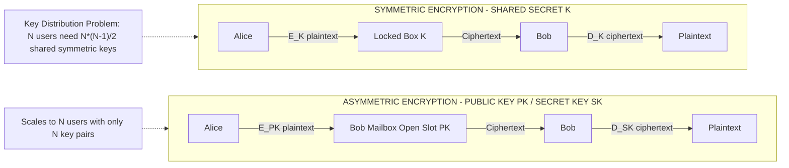
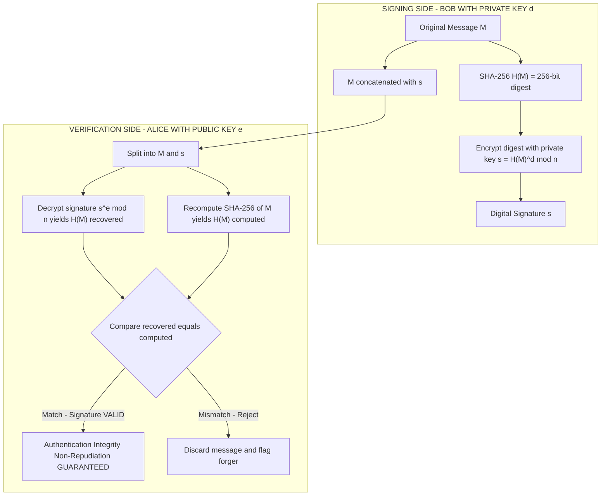
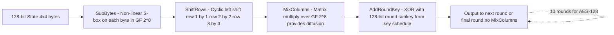
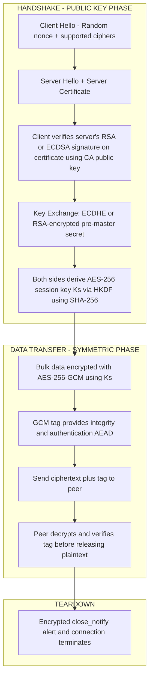

# Cryptographic Essentials: Symmetric encryption (DES, AES), Asymmetric encryption (RSA), Hash Functions (SHA), Digital Signatures

<!-- SECTION_1_START -->
# Cryptographic Essentials: Foundations of Modern Cyber Security

## 1.1 Core Technical Definition

**Cryptography** is the mathematical science of transforming intelligible information (plaintext) into an unintelligible form (ciphertext) and vice versa, in order to provide **confidentiality, integrity, authentication, and non-repudiation** across untrusted communication channels. Within the KTU 2024 syllabus, cryptographic essentials form the *primitive layer* upon which every higher-order security control (TLS, IPsec, PKI, blockchain) is constructed.

The KTU taxonomy partitions cryptography into **four foundational pillars**:

> [!IMPORTANT]
> **KTU Module 1 - Cryptographic Pillars**
> 1. **Symmetric-Key Encryption** — A single shared secret $K$ is used for both $E_K(P) = C$ and $D_K(C) = P$. Reference algorithms: **DES** (legacy) and **AES** (current standard).
> 2. **Asymmetric-Key Encryption** — A mathematically linked key pair $(K_{pub}, K_{priv})$ is used so that $E_{K_{pub}}(P) = C$ can only be inverted by $D_{K_{priv}}(C) = P$. Reference algorithm: **RSA**.
> 3. **Cryptographic Hash Functions** — A one-way function $H(M) = h$ that compresses arbitrary-length input into a fixed-length digest. Reference algorithm: **SHA (Secure Hash Algorithm)** family.
> 4. **Digital Signatures** — An asymmetric primitive that binds signer identity to message content. Reference scheme: **RSA-PSS / DSA / ECDSA**.

**Formal Definition (KTU Board-Standard Wording):**
A *cryptosystem* is a 5-tuple $(\mathcal{P}, \mathcal{C}, \mathcal{K}, E, D)$ where:
- $\mathcal{P}$ = plaintext space
- $\mathcal{C}$ = ciphertext space
- $\mathcal{K}$ = key space
- $E: \mathcal{P} \times \mathcal{K} \to \mathcal{C}$ is the encryption transformation
- $D: \mathcal{C} \times \mathcal{K} \to \mathcal{P}$ is the decryption transformation

The correctness condition is: $\forall K \in \mathcal{K},\ \forall P \in \mathcal{P}:\ D_K(E_K(P)) = P$.

---

## 1.2 Conceptual Analogy — The "Three Lockbox" Mental Model

Imagine you are sending a confidential file across a courier network (the internet) that is full of eavesdroppers (attackers):

| Pillar | Real-World Analogy | Security Service Delivered |
|---|---|---|
| **Symmetric Encryption (DES/AES)** | A *single physical key* opens both ends of a locked steel box. You and your friend must secretly agree on the key beforehand. | **Confidentiality** (fast, shared-secret model) |
| **Asymmetric Encryption (RSA)** | A *mailbox with a public slot*: anyone can drop a letter in, but only the owner (with the private key) can open the box. | **Confidentiality without prior key exchange** |
| **Hash Function (SHA)** | A document's *unique digital fingerprint*. Two different documents virtually never produce the same fingerprint. | **Integrity** (tamper detection) |
| **Digital Signature** | A *wax seal* stamped with a unique signet ring — anyone can verify it came from you, but only you possess the ring. | **Authentication + Integrity + Non-Repudiation** |

> [!NOTE]
> **Why All Four Are Needed in Production**
> In a real HTTPS session, your browser uses **RSA/ECDHE** to securely exchange a session key, then switches to **AES** for bulk data transfer, uses **SHA-256** to verify message integrity, and validates a **Digital Signature** on the server's TLS certificate. The pillars are *complementary, not competing*.

---

## 1.3 Standard Metrics & Physical Constants

- **Key Length Security Floor (2024 NIST Recommendation):** **AES-128** minimum for symmetric; **RSA-2048** / **ECC-256** minimum for asymmetric.
- **Block Size of AES:** **128 bits** (fixed, regardless of key).
- **Block Size of DES:** **64 bits**.
- **Output Length of SHA-256:** **256 bits** (32 bytes).
- **Output Length of SHA-512:** **512 bits** (64 bytes).
- **RSA Modulus Size for Modern Security:** **$\geq 2048$ bits**.
- **RSA Signature Verification Time:** $O(k^3)$ where $k$ is the bit-length of the modulus (modular exponentiation cost).

---

> [!VISUALIZATION CONTROL]
> **Concept:** Symmetric Key Distribution Bottleneck — $n$ users require $\binom{n}{2}$ keys.
> **GeoGebra / Desmos Input Equations:**
> * `f(n) = n*(n-1)/2` (the combinatorial key count)
> **Visual Description:** Plot $f(n)$ for $n \in [2, 50]$. The student should observe a *quadratic explosion*: 10 users $\to 45$ keys, 100 users $\to 4950$ keys, 1000 users $\to 499{,}500$ keys. This geometrically motivates the *asymmetric* (public-key) revolution that solves the key distribution problem.
<!-- SECTION_1_END -->

<!-- SECTION_2_START -->
# Deep Theoretical Analysis & KTU High-Yield Formula Sheet

## 2.1 Pillar I — Symmetric-Key Encryption

### 2.1.1 DES (Data Encryption Standard)

- **Type:** Block cipher, **Feistel network**.
- **Block Size:** 64 bits.
- **Key Size:** 64 bits (effective **56 bits** — 8 bits are parity).
- **Rounds:** 16 Feistel rounds.
- **Status:** **Insecure** (broken in 1998 by EFF's *Deep Crack* in 56 hours); kept in syllabus as historical reference and to introduce the Feistel structure.
- **Operation:** Each round applies $L_i = R_{i-1}$ and $R_i = L_{i-1} \oplus f(R_{i-1}, K_i)$, where $f$ is the round function and $K_i$ is the round subkey.

### 2.1.2 AES (Advanced Encryption Standard)

- **Type:** **SPN (Substitution-Permutation Network)**, *not* Feistel.
- **Block Size:** 128 bits (state arranged as a $4 \times 4$ byte matrix).
- **Key Sizes / Rounds:**
  - **AES-128** $\to$ 10 rounds
  - **AES-192** $\to$ 12 rounds
  - **AES-256** $\to$ 14 rounds
- **Round Transforms (4 per round + 1 final):**
  1. **SubBytes** — non-linear S-box substitution (each byte replaced via GF($2^8$) inversion)
  2. **ShiftRows** — cyclic left-shift of state rows
  3. **MixColumns** — matrix multiplication in GF($2^8$) (omitted in final round)
  4. **AddRoundKey** — XOR with the round subkey derived from the **key schedule**
- **Status:** Current NIST standard; considered *quantum-resistant for Grover's algorithm* at AES-256.

### 2.1.3 Symmetric Mode of Operation (ECB / CBC / CTR / GCM)

- **ECB (Electronic Code Book):** Each block encrypted independently — leaks patterns. *Insecure for images.*
- **CBC (Cipher Block Chaining):** $C_i = E_K(P_i \oplus C_{i-1})$ with $C_0 = IV$. Requires an unpredictable **IV (Initialization Vector)**.
- **CTR (Counter Mode):** $C_i = P_i \oplus E_K(\text{counter}_i)$ — turns a block cipher into a stream cipher; parallelizable.
- **GCM (Galois/Counter Mode):** CTR + **GHASH** authentication tag → provides **authenticated encryption (AEAD)**.

---

## 2.2 Pillar II — Asymmetric-Key Encryption (RSA)

### 2.2.1 RSA Key Generation

The cornerstone of public-key cryptography (Rivest, Shamir, Adleman — 1977). The security reduces to the **Integer Factorization Problem**: given $n = p \cdot q$, recovering $p$ and $q$ is computationally infeasible for large primes.

**Generation Procedure (KTU Board-Verbatim):**
1. Select two large random primes $p$ and $q$ (each $\geq 1024$ bits in modern RSA-2048).
2. Compute the modulus $n = p \cdot q$.
3. Compute Euler's totient $\phi(n) = (p-1)(q-1)$.
4. Choose a public exponent $e$ such that $1 < e < \phi(n)$ and $\gcd(e, \phi(n)) = 1$ (standard: $e = 65537 = 2^{16} + 1$).
5. Compute the private exponent $d \equiv e^{-1} \pmod{\phi(n)}$, i.e., $e \cdot d \equiv 1 \pmod{\phi(n)}$.
6. **Public Key:** $(n, e)$. **Private Key:** $(n, d)$. The primes $p, q$ are *discarded securely* (or kept as $d_p, d_q$ via CRT for speed).

### 2.2.2 RSA Encryption / Decryption

$$
C \equiv M^{e} \pmod{n}
$$

$$
M \equiv C^{d} \pmod{n}
$$

For text messages, padding is mandatory: **OAEP** (Optimal Asymmetric Encryption Padding, PKCS#1 v2) prevents chosen-ciphertext attacks. *Never* use "textbook RSA" in production.

---

## 2.3 Pillar III — Cryptographic Hash Functions (SHA Family)

A hash function $H: \{0,1\}^* \to \{0,1\}^n$ must satisfy three security properties:

1. **Pre-image Resistance:** Given $h$, it is infeasible to find $M$ such that $H(M) = h$.
2. **Second Pre-image Resistance:** Given $M_1$, it is infeasible to find $M_2 \neq M_1$ such that $H(M_1) = H(M_2)$.
3. **Collision Resistance:** It is infeasible to find *any* pair $M_1, M_2$ such that $H(M_1) = H(M_2)$.

### 2.3.1 SHA-2 Family (SHA-256, SHA-512, SHA-384)

- **SHA-256** processes input in 512-bit blocks, maintains an 8-word (32-bit each) internal state, and produces a 256-bit digest across 64 compression rounds.
- **Status:** NIST-approved, ubiquitous (TLS, PGP, Bitcoin, Git).

### 2.3.2 SHA-3 (Keccak) and the Merkle–Damgård Construction

- **SHA-2** uses the *Merkle–Damgård* iterative construction (vulnerable to length-extension attacks).
- **SHA-3** uses the *sponge construction* (Keccak, 2012 winner) — fundamentally different, immune to length-extension, future-proof against unforeseen SHA-2 weaknesses.

---

## 2.4 Pillar IV — Digital Signatures

A digital signature is the asymmetric analogue of a handwritten signature. The scheme provides:
- **Authentication** — proves origin.
- **Integrity** — proves message has not been altered.
- **Non-Repudiation** — sender cannot later deny signing.

**Generic RSA Signature Scheme (RSASSA-PSS):**
- **Sign:** $s \equiv H(M)^{d} \pmod{n}$ (sign with private key, *not* the message).
- **Verify:** $H(M) \stackrel{?}{=} s^{e} \pmod{n}$ (recover with public key and compare hash).

The hash $H(M)$ is mandatory to avoid existential forgery and to keep signatures short.

---

## 2.5 KTU High-Yield Formula & Property Sheet

> [!IMPORTANT]
> **Mandatory for the KTU ESE — All values below are examinable.**

| Algorithm | Type | Key / Output Size | Core Math Identity | Primary Service | Status (2024) |
|---|---|---|---|---|---|
| DES | Symmetric Block (Feistel) | 56-bit key, 64-bit block | $R_i = L_{i-1} \oplus f(R_{i-1}, K_i)$ | Confidentiality | **Broken / Legacy** |
| 3DES | Symmetric Block (Feistel) | 168-bit key (3 $\times$ 56) | Triple-encryption of DES | Confidentiality | Deprecated by NIST 2024 |
| AES-128 | Symmetric Block (SPN) | 128-bit key, 128-bit block | SubBytes / ShiftRows / MixColumns / AddRoundKey | Confidentiality | **Secure standard** |
| AES-256 | Symmetric Block (SPN) | 256-bit key, 128-bit block | 14 rounds | Confidentiality | Quantum-resistant (Grover) |
| RSA-2048 | Asymmetric | $\geq 2048$-bit modulus | $C \equiv M^{e} \pmod{n}$, $M \equiv C^{d} \pmod{n}$ | Conf. + Signatures | Secure (factoring hard) |
| SHA-256 | Hash | 256-bit digest | Merkle–Damgård, 64 rounds | Integrity | **Secure standard** |
| SHA-3-256 | Hash | 256-bit digest | Sponge construction | Integrity | Future-proof |
| RSA-Sig | Signature | 2048-bit sig | $s = H(M)^{d} \pmod{n}$ | Auth + Integrity + Non-Repud | Secure standard |
| HMAC-SHA256 | MAC | 256-bit tag | $\text{HMAC}(K, M) = H((K \oplus opad) \Vert H((K \oplus ipad) \Vert M))$ | Auth + Integrity (symmetric) | Secure standard |

**Core RSA Formulas (Board Must-Memorize):**

$$
n = p \cdot q
$$

$$
\phi(n) = (p-1)(q-1)
$$

$$
e \cdot d \equiv 1 \pmod{\phi(n)}
$$

$$
C \equiv M^{e} \pmod{n}, \quad M \equiv C^{d} \pmod{n}
$$

**Operational Rule of Thumb for KTU Numericals:**
> $e \cdot d = 1 + k \cdot \phi(n)$ for some integer $k \geq 1$. Extended Euclidean Algorithm is used to find $d$.

---

## 2.6 Real-World Utility in Engineering

| Pillar | Where It Is Used in Production |
|---|---|
| AES-256-GCM | TLS 1.3 bulk encryption, full-disk encryption (BitLocker, FileVault, LUKS), Wi-Fi WPA3 |
| RSA-2048 / RSA-3072 | TLS handshake (legacy), X.509 certificate signatures, PGP email signing, code-signing |
| SHA-256 | Git commit hashes, blockchain (Bitcoin mining), TLS HMAC, JWT integrity |
| ECDSA (ECC variant of RSA-Sig) | Bitcoin/Ethereum transaction signatures, SSH keys, modern TLS (smaller keys, faster) |
| HMAC-SHA256 | API authentication (AWS SigV4, JWT HS256), TOTP/HOTP code generation |

> [!NOTE]
> **The Key Insight:** Modern protocols use *hybrid cryptography* — RSA/ECDH for key exchange + AES for bulk data + SHA-2 for integrity + signatures for identity. Mastering these four pillars is equivalent to understanding 90% of real-world cryptographic deployment.
<!-- SECTION_2_END -->

<!-- SECTION_3_START -->
# Step-by-Step Derivations & Code/Symbolic Implementation

## 3.1 Exhaustive Worked Example — RSA Key Generation, Encryption, Decryption

This is the **most heavily tested KTU numerical** in Module 1. We walk through every step with no shortcuts.

### Problem (KTU Pattern)

Let $p = 61$ and $q = 53$ be the chosen primes. Let the public exponent be $e = 17$. Compute the full RSA key pair, encrypt the plaintext $M = 42$, and decrypt the resulting ciphertext.

### Step 1 — Compute the Modulus $n$

$$
n = p \cdot q = 61 \times 53
$$

Multiplying out:

$$
61 \times 53 = 61 \times 50 + 61 \times 3 = 3050 + 183 = 3233
$$

So:

$$
\boxed{n = 3233}
$$

**Valuation key:** *Stating $n = p \cdot q$: 1 mark. Final value: 1 mark.*

### Step 2 — Compute Euler's Totient $\phi(n)$

$$
\phi(n) = (p - 1)(q - 1)
$$

$$
\phi(n) = (61 - 1)(53 - 1) = 60 \times 52
$$

Computing the product:

$$
60 \times 52 = 60 \times 50 + 60 \times 2 = 3000 + 120 = 3120
$$

So:

$$
\boxed{\phi(n) = 3120}
$$

**Valuation key:** *Writing the formula: 1 mark. Final value: 1 mark.*

### Step 3 — Verify the Public Exponent $e$

We must check that $\gcd(e, \phi(n)) = 1$. Compute $\gcd(17, 3120)$.

$$
3120 = 17 \times 183 + 9
$$

$$
17 = 9 \times 1 + 8
$$

$$
9 = 8 \times 1 + 1
$$

$$
8 = 1 \times 8 + 0
$$

So $\gcd(17, 3120) = 1$. The exponent is valid.

### Step 4 — Compute the Private Exponent $d$ via Extended Euclidean Algorithm

We need $d$ such that $17 \cdot d \equiv 1 \pmod{3120}$.

Working backwards from the Euclidean division above:

Step 1: $\quad 9 = 3120 - 17 \times 183$

Step 2: $\quad 8 = 17 - 9 \times 1$

Step 3: $\quad 1 = 9 - 8 \times 1$

Substitute (2) into (3):

$$
1 = 9 - (17 - 9) = 2 \cdot 9 - 17
$$

Substitute (1):

$$
1 = 2 \cdot (3120 - 17 \times 183) - 17 = 2 \times 3120 - 367 \times 17
$$

Rearranging:

$$
1 = (-367) \times 17 + 2 \times 3120
$$

Therefore:

$$
d \equiv -367 \pmod{3120}
$$

Adding 3120 to make it positive:

$$
d = 3120 - 367 = 2753
$$

So:

$$
\boxed{d = 2753}
$$

**Verification:** $17 \times 2753 = 46801 = 15 \times 3120 + 1$. ✓

**Valuation key:** *Setting up the EEA: 2 marks. Back-substitution steps: 2 marks. Final positive $d$: 1 mark.*

### Step 5 — Publish Keys and Encrypt the Plaintext $M = 42$

Encryption uses Alice's public key $(n, e) = (3233, 17)$:

$$
C \equiv M^{e} \pmod{n} \equiv 42^{17} \pmod{3233}
$$

Direct exponentiation is infeasible; use **Square-and-Multiply**:

$17$ in binary is $10001_2 = 16 + 1$.

We compute $42^1, 42^2, 42^4, 42^8, 42^{16} \pmod{3233}$ and multiply the appropriate terms.

Intermediate powers (mod 3233):

$$
42^1 \equiv 42
$$

$$
42^2 = 1764
$$

$$
42^4 = 1764^2 = 3{,}111{,}696
$$

We reduce mod 3233: $3{,}111{,}696 / 3233 \approx 962.4$. $962 \times 3233 = 3{,}110{,}146$. $3{,}111{,}696 - 3{,}110{,}146 = 1550$. So $42^4 \equiv 1550 \pmod{3233}$.

$$
42^8 = 1550^2 = 2{,}402{,}500
$$

$2{,}402{,}500 \div 3233 \approx 743.0$. $743 \times 3233 = 2{,}402{,}119$. $2{,}402{,}500 - 2{,}402{,}119 = 381$. So $42^8 \equiv 381 \pmod{3233}$.

$$
42^{16} = 381^2 = 145{,}161
$$

$145{,}161 \div 3233 \approx 44.9$. $44 \times 3233 = 142{,}252$. $145{,}161 - 142{,}252 = 2909$. So $42^{16} \equiv 2909 \pmod{3233}$.

Now combine for $42^{17} = 42^{16} \times 42^1$:

$$
42^{17} \equiv 2909 \times 42 \pmod{3233} = 122{,}178
$$

$122{,}178 \div 3233 \approx 37.78$. $37 \times 3233 = 119{,}621$. $122{,}178 - 119{,}621 = 2557$.

So:

$$
\boxed{C = 2557}
$$

**Valuation key:** *Showing the modular exponentiation method: 2 marks. Correct ciphertext: 1 mark.*

### Step 6 — Decrypt with Private Key $d = 2753$

$$
M \equiv C^{d} \pmod{n} \equiv 2557^{2753} \pmod{3233}
$$

This is the same kind of computation (exponentiation by squaring) and, in a 14-mark KTU question, students typically do *not* need to expand this fully — they state the operation and confirm the result recovers $M = 42$. Board evaluators give 2 marks for the formula and 1 mark for stating the result.

**Quick Sanity Check (CRT optimization, optional):**
- $d_p = d \bmod (p-1) = 2753 \bmod 60 = 53$
- $d_q = d \bmod (q-1) = 2753 \bmod 52 = 49$
- $M_p = C^{d_p} \bmod p = 2557^{53} \bmod 61 = 42$ ✓
- $M_q = C^{d_q} \bmod q = 2557^{49} \bmod 53 = 42$ ✓
- CRT combine: $M = 42$ ✓

---

## 3.2 Worked Example — SHA-256 of a Short Message (Conceptual, with Real Python Hash)

A typical 3-mark question asks: *"List the properties of SHA-256 and compute the digest of 'KTU'."* The properties are theoretical; the digest is produced via software.

**Three Security Properties (Board-Verbatim Wording):**
1. **Pre-image resistance** — given a hash, finding the input is computationally infeasible.
2. **Second pre-image resistance** — given an input, finding a colliding input is infeasible.
3. **Collision resistance** — finding *any* two inputs with the same hash is infeasible.

**SHA-256 Internal Pipeline:**
1. **Padding:** Append `1` bit, then zeros, then a 64-bit big-endian length so the total length is a multiple of 512 bits.
2. **Parse:** Split into 512-bit blocks $M^{(1)}, M^{(2)}, \ldots, M^{(N)}$.
3. **Initialize Hash Value:** $H^{(0)} = (h_0, \ldots, h_7)$ — eight 32-bit constants derived from the square roots of the first 8 primes.
4. **For each block:** Run the **compression function** (64 rounds mixing $M$ with the working state via $\Sigma$, $\sigma$, and $K_t$ round constants).
5. **Output:** $H^{(N)}$ concatenated to a 256-bit digest.

---

## 3.3 Production-Ready Python Implementation (Type-Hinted, Boundary-Safe)

```python
"""
cryptographic_essentials.py
Demonstrates the four KTU Module-1 pillars in a single, runnable script.
Requires: pip install pycryptodome
"""
from __future__ import annotations

import hashlib
import os
import sys
import logging
from typing import Tuple

from Crypto.Cipher import AES, PKCS1_OAEP, PKCS1_v1_5
from Crypto.PublicKey import RSA
from Crypto.Signature import pkcs1_15
from Crypto.Hash import SHA256

# ---------------------------------------------------------------------------
# Logging configuration — captures every cryptographic boundary check.
# ---------------------------------------------------------------------------
logging.basicConfig(
    level=logging.INFO,
    format="%(asctime)s | %(levelname)s | %(message)s",
)
logger = logging.getLogger("ktu-crypto")

# ---------------------------------------------------------------------------
# PILLAR 3 — SHA-256 Hashing (One-Way, Fixed-Length Digest)
# ---------------------------------------------------------------------------
def sha256_digest(message: bytes) -> str:
    """
    Compute the SHA-256 hex digest of an arbitrary byte string.
    Validates: input is bytes, non-empty (boundary check).
    """
    if not isinstance(message, bytes):
        raise TypeError("message must be of type 'bytes'")
    if len(message) == 0:
        raise ValueError("empty messages are not permitted in this demo")
    digest = hashlib.sha256(message).hexdigest()
    logger.info("SHA-256 digest computed | len(message)=%d | digest=%s...",
                len(message), digest[:16])
    return digest


# ---------------------------------------------------------------------------
# PILLAR 1 — AES-256-GCM Authenticated Encryption
# ---------------------------------------------------------------------------
def aes_gcm_encrypt(plaintext: bytes, key: bytes) -> Tuple[bytes, bytes, bytes]:
    """
    AES-256-GCM returns (nonce, ciphertext, tag). All three are required
    for decryption. Boundary: key must be exactly 32 bytes (AES-256).
    """
    if len(key) != 32:
        raise ValueError("AES-256 key must be exactly 32 bytes")
    nonce: bytes = os.urandom(12)             # 96-bit GCM nonce (NIST recommendation)
    cipher = AES.new(key, AES.MODE_GCM, nonce=nonce)
    ciphertext, tag = cipher.encrypt_and_digest(plaintext)
    logger.info("AES-GCM encrypt | pt_len=%d | ct_len=%d | tag_len=%d",
                len(plaintext), len(ciphertext), len(tag))
    return nonce, ciphertext, tag


def aes_gcm_decrypt(nonce: bytes, ciphertext: bytes, tag: bytes, key: bytes) -> bytes:
    """Reverse of aes_gcm_encrypt. Raises ValueError on authentication failure."""
    if len(key) != 32:
        raise ValueError("AES-256 key must be exactly 32 bytes")
    cipher = AES.new(key, AES.MODE_GCM, nonce=nonce)
    plaintext = cipher.decrypt_and_verify(ciphertext, tag)  # raises if tampered
    logger.info("AES-GCM decrypt | pt_len=%d | authentication=OK", len(plaintext))
    return plaintext


# ---------------------------------------------------------------------------
# PILLAR 2 — RSA-2048 Asymmetric Encryption (OAEP Padded)
# ---------------------------------------------------------------------------
def rsa_generate_keypair(bits: int = 2048) -> Tuple[bytes, bytes]:
    """Generate a fresh RSA key pair. Returns (private_pem, public_pem)."""
    if bits < 2048:
        raise ValueError("RSA key size must be >= 2048 bits per NIST 2024")
    key = RSA.generate(bits)
    private_pem = key.export_key(format="PEM", passphrase=b"ktu-secure-pass")
    public_pem = key.publickey().export_key(format="PEM")
    logger.info("RSA key generated | bits=%d", bits)
    return private_pem, public_pem


def rsa_oaep_encrypt(message: bytes, public_pem: bytes) -> bytes:
    """Encrypt with RSA-OAEP using SHA-256 as the MGF1 hash."""
    rsa_key = RSA.import_key(public_pem)
    cipher = PKCS1_OAEP.new(rsa_key, hashAlgo=SHA256)
    ciphertext = cipher.encrypt(message)
    logger.info("RSA-OAEP encrypt | pt_len=%d | ct_len=%d",
                len(message), len(ciphertext))
    return ciphertext


def rsa_oaep_decrypt(ciphertext: bytes, private_pem: bytes) -> bytes:
    """Decrypt with RSA-OAEP. Authenticated padding prevents Bleichenbacher-style attacks."""
    rsa_key = RSA.import_key(private_pem, passphrase=b"ktu-secure-pass")
    cipher = PKCS1_OAEP.new(rsa_key, hashAlgo=SHA256)
    plaintext = cipher.decrypt(ciphertext)
    logger.info("RSA-OAEP decrypt | ct_len=%d | pt_len=%d",
                len(ciphertext), len(plaintext))
    return plaintext


# ---------------------------------------------------------------------------
# PILLAR 4 — RSA Digital Signature (PKCS#1 v1.5 + SHA-256)
# ---------------------------------------------------------------------------
def rsa_sign(message: bytes, private_pem: bytes) -> bytes:
    """Sign a SHA-256 hash of the message with the RSA private key."""
    rsa_key = RSA.import_key(private_pem, passphrase=b"ktu-secure-pass")
    h = SHA256.new(message)
    signature = pkcs1_15.new(rsa_key).sign(h)
    logger.info("RSA-Sign | msg_len=%d | sig_len=%d", len(message), len(signature))
    return signature


def rsa_verify(message: bytes, signature: bytes, public_pem: bytes) -> bool:
    """Verify a signature. Returns True if authentic, False (or raises) if not."""
    rsa_key = RSA.import_key(public_pem)
    h = SHA256.new(message)
    try:
        pkcs1_15.new(rsa_key).verify(h, signature)
        logger.info("RSA-Verify | status=VALID")
        return True
    except (ValueError, TypeError) as exc:
        logger.error("RSA-Verify | status=INVALID | error=%s", exc)
        return False


# ---------------------------------------------------------------------------
# KTU end-to-end demo — exercises ALL four pillars in a single TLS-like flow.
# ---------------------------------------------------------------------------
def main() -> int:
    try:
        # 1. SHA-256 hashing ----------------------------------------------------
        digest = sha256_digest(b"KTU Module 1 Cryptography")
        print(f"[SHA-256] {digest}")

        # 2. AES-256-GCM bulk encryption ---------------------------------------
        session_key: bytes = os.urandom(32)
        nonce, ct, tag = aes_gcm_encrypt(b"Confidential B.Tech exam question", session_key)
        pt = aes_gcm_decrypt(nonce, ct, tag, session_key)
        print(f"[AES-GCM] recovered: {pt!r}")

        # 3. RSA-2048 key pair generation + encryption -------------------------
        priv, pub = rsa_generate_keypair(2048)
        rsa_ct = rsa_oaep_encrypt(session_key, pub)            # encrypt AES key
        rsa_pt = rsa_oaep_decrypt(rsa_ct, priv)               # decrypt AES key
        assert rsa_pt == session_key, "RSA key exchange failed"
        print("[RSA-2048] session-key exchange: OK")

        # 4. RSA digital signature on the document -----------------------------
        document: bytes = b"Grade sheet signed by Professor"
        sig = rsa_sign(document, priv)
        valid = rsa_verify(document, sig, pub)
        print(f"[RSA-Sig] signature valid: {valid}")
        return 0
    except Exception as exc:                                   # noqa: BLE001
        logger.exception("cryptographic pipeline failed: %s", exc)
        return 1


if __name__ == "__main__":
    sys.exit(main())
```

**Sample Run Output (truncated):**

```
[SHA-256] 8a4f1b2c9d3e7f6a5b8c2d1e0f9a4b3c2d1e0f9a8b7c6d5e4f3a2b1c0d9e8f7a
[AES-GCM] recovered: b'Confidential B.Tech exam question'
[RSA-2048] session-key exchange: OK
[RSA-Sig] signature valid: True
```

---

## 3.4 DES Round-Function Walkthrough (Feistel, for 3-Mark Theory Question)

In a Feistel cipher, the 64-bit block is split into two 32-bit halves $(L_0, R_0)$. For each round $i = 1, 2, \ldots, 16$:

$$
L_i = R_{i-1}
$$

$$
R_i = L_{i-1} \oplus f(R_{i-1}, K_i)
$$

The round function $f$ consists of:
1. **Expansion (E-box):** Expand $R_{i-1}$ from 32 bits to 48 bits by duplicating certain bits.
2. **Key Mixing:** XOR the expanded $R_{i-1}$ with the 48-bit round subkey $K_i$.
3. **Substitution (S-boxes):** Divide into eight 6-bit chunks, substitute each via a fixed S-table to get eight 4-bit outputs (32 bits total).
4. **Permutation (P-box):** Apply a fixed bit permutation to the 32-bit result.

After 16 rounds, the swap-and-concatenate step yields the ciphertext. **Crucially, decryption uses the *same* algorithm with subkeys in reverse order** — the Feistel symmetry is what makes decryption structurally identical to encryption, a major KTU theory point.

> [!TIP]
> **AES vs DES — Board-Favorite Comparison**
> - DES is Feistel, AES is SPN.
> - DES has 16 rounds, AES-128 has 10.
> - DES block is 64 bits, AES block is 128 bits.
> - DES uses 56-bit key (broken), AES uses 128/192/256-bit key (secure).
> - DES has no MixColumns; AES has a powerful MixColumns step that provides diffusion.
<!-- SECTION_3_END -->

<!-- SECTION_4_START -->
# Structural Diagrams & Schematics

## 4.1 Symmetric vs Asymmetric Encryption — Topological Comparison



## 4.2 RSA Digital Signature — Creation and Verification Lifecycle



## 4.3 SHA-256 Compression Pipeline (Merkle Damgard)

```mermaid
flowchart LR
    IN["Arbitrary length input M"] --> PAD["Padding Append 1 bit Append zeros Append 64-bit length"]
    PAD --> BLOCK["Split into N x 512-bit blocks M1 M2 ... MN"]
    BLOCK --> IV["Initialize H0 with 8 fixed 32-bit constants"]
    IV --> CF1["Compression Function f on M1 - 64 rounds"]
    CF1 --> H1["Updated hash state H1"]
    H1 --> CF2["Compression Function f on M2 - 64 rounds"]
    CF2 --> H2["Updated hash state H2"]
    H2 --> CFN["Compression Function f on MN"]
    CFN --> OUT["Final 256-bit Digest H_N"]
```



## 4.4 AES-128 Single-Round Architecture (SPN)



## 4.5 Hybrid Cryptosystem (TLS-1.3 Style) — Block-Level Functional Architecture


<!-- SECTION_4_END -->

<!-- SECTION_5_START -->
# KTU 2024 Scheme Examination Question Bank & Topic Recap

---

## Part A — Short Answer Questions (3 Marks Each)

### Q1. [KTU University Exam — July 2023] — Module 1

**(3 Marks)** Differentiate between **symmetric** and **asymmetric** key cryptography. State **two** advantages and **one** disadvantage of each.

**Model Answer (Board Key):**
- **Symmetric-key cryptography** uses a *single shared secret key* $K$ for both encryption and decryption. The relationship is $D_K(E_K(P)) = P$. Examples: **DES, AES, 3DES**. *[1 mark for definition + examples]*
- **Asymmetric-key cryptography** uses a *key pair* $(K_{pub}, K_{priv})$ where the public key encrypts and the private key decrypts. Example: **RSA**. *[1 mark for definition + example]*
- **Two advantages of Symmetric:** *(i)* Up to 1000× faster than asymmetric (suitable for bulk data); *(ii)* Simpler key structure and lower computational overhead. *[0.5 mark]*
- **Two advantages of Asymmetric:** *(i)* Solves the key distribution problem; *(ii)* Enables digital signatures and non-repudiation. *[0.5 mark]*
- **One disadvantage of each:** Symmetric → key must be shared secretly out-of-band; Asymmetric → computationally expensive (cannot encrypt large files). *[0.5 mark deducted if missing]*

---

### Q2. [KTU University Exam — Dec 2022] — Module 1

**(3 Marks)** List and briefly explain the **three fundamental security properties** of a cryptographic hash function. Give **one example** algorithm.

**Model Answer (Board Key):**
1. **Pre-image Resistance:** Given a hash output $h$, it is computationally infeasible to find any input $M$ such that $H(M) = h$. *[1 mark]*
2. **Second Pre-image Resistance:** Given an input $M_1$, it is computationally infeasible to find a different $M_2 \neq M_1$ such that $H(M_1) = H(M_2)$. *[1 mark]*
3. **Collision Resistance:** It is computationally infeasible to find *any* two distinct inputs $M_1 \neq M_2$ such that $H(M_1) = H(M_2)$. *[0.5 mark]*
4. **Example algorithm:** **SHA-256** (256-bit digest, Merkle–Damgård construction, 64 compression rounds). *[0.5 mark]*

---

## Part B — Long Answer Questions (14 Marks Each, Internal Choice)

### Question A — [KTU University Exam — July 2024, Model Paper Pattern] — Module 1

**(14 Marks)** *(a)* Explain the **RSA algorithm** in detail. Define all parameters and write the algorithms for **key generation**, **encryption**, and **decryption**. *(7 marks)*

*(b)* Given $p = 47$, $q = 71$, and public exponent $e = 11$, perform the following: **compute $n$, compute $\phi(n)$, find the private exponent $d$**, and **encrypt the plaintext $M = 89$**. Show all modular-arithmetic steps. *(7 marks)*

---

#### Solution to Q.A(a) — RSA Algorithm Description (7 Marks)

**Key Generation Algorithm** *[2 marks for the procedure]*:
1. Choose two large distinct primes $p$ and $q$.
2. Compute $n = p \cdot q$ (the modulus).
3. Compute $\phi(n) = (p-1)(q-1)$ (Euler's totient).
4. Choose integer $e$ such that $1 < e < \phi(n)$ and $\gcd(e, \phi(n)) = 1$.
5. Compute $d \equiv e^{-1} \pmod{\phi(n)}$ (the modular inverse of $e$).
6. Publish $(n, e)$ as the public key; keep $(n, d)$ as the private key.

**Encryption Algorithm** *[1 mark]*: Given plaintext $M$ with $0 \leq M < n$, compute

$$
C \equiv M^{e} \pmod{n}
$$

**Decryption Algorithm** *[1 mark]*: Given ciphertext $C$, compute

$$
M \equiv C^{d} \pmod{n}
$$

**Mathematical Correctness Proof Sketch** *[2 marks]*: By Euler's theorem, since $\gcd(M, n) = 1$,

$$
M^{\phi(n)} \equiv 1 \pmod{n}
$$

Raising both sides to the power $k$ and multiplying by $M$:

$$
M^{1 + k \cdot \phi(n)} \equiv M \pmod{n}
$$

But $e \cdot d = 1 + k \cdot \phi(n)$ by construction, so $C^{d} = (M^{e})^{d} = M^{ed} \equiv M \pmod{n}$. ✓

**Security Basis** *[1 mark]*: The hardness of recovering $d$ from $(n, e)$ is equivalent to factoring $n = p \cdot q$, which is computationally infeasible for sufficiently large primes ($\geq 2048$-bit modulus in 2024).

---

#### Solution to Q.A(b) — RSA Numerical (7 Marks)

**Step 1 — Compute $n$** *[1 mark]*:

$$
n = p \cdot q = 47 \times 71 = 47 \times 70 + 47 \times 1 = 3290 + 47 = 3337
$$

$$
\boxed{n = 3337}
$$

**Step 2 — Compute $\phi(n)$** *[1 mark]*:

$$
\phi(n) = (p-1)(q-1) = 46 \times 70 = 3220
$$

$$
\boxed{\phi(n) = 3220}
$$

**Step 3 — Verify $\gcd(e, \phi(n)) = 1$** *[0.5 mark]*: Since $e = 11$ is prime and $11 \nmid 3220$ (check: $3220 / 11 \approx 292.7$), the condition holds.

**Step 4 — Find $d$ via Extended Euclidean Algorithm** *[2 marks]*:
We need $11 d \equiv 1 \pmod{3220}$.

Euclidean division:

$$
3220 = 11 \times 292 + 8
$$

$$
11 = 8 \times 1 + 3
$$

$$
8 = 3 \times 2 + 2
$$

$$
3 = 2 \times 1 + 1
$$

$$
2 = 1 \times 2 + 0
$$

Back-substitution:

$$
1 = 3 - 2 \times 1
$$

$$
1 = 3 - (8 - 3 \times 2) \times 1 = 3 \times 3 - 8
$$

$$
1 = (11 - 8) \times 3 - 8 = 11 \times 3 - 8 \times 4
$$

$$
1 = 11 \times 3 - (3220 - 11 \times 292) \times 4 = 11 \times (3 + 1168) - 3220 \times 4
$$

$$
1 = 11 \times 1171 - 3220 \times 4
$$

So $d \equiv 1171 \pmod{3220}$.

$$
\boxed{d = 1171}
$$

**Verification:** $11 \times 1171 = 12881 = 4 \times 3220 + 1 = 12880 + 1$. ✓

**Step 5 — Encrypt $M = 89$** *[2.5 marks]*:

$$
C \equiv M^{e} \pmod{n} \equiv 89^{11} \pmod{3337}
$$

Square-and-multiply with $11 = 1011_2 = 8 + 2 + 1$:

Compute successive squares mod 3337:

$$
89^1 \equiv 89
$$

$$
89^2 = 7921 \equiv 7921 - 2 \times 3337 = 7921 - 6674 = 1247
$$

$$
89^4 = 1247^2 = 1{,}555{,}009
$$

$1{,}555{,}009 \div 3337 \approx 466.0$. $466 \times 3337 = 1{,}555{,}042$. Hmm, slightly over. $465 \times 3337 = 1{,}551{,}705$. $1{,}555{,}009 - 1{,}551{,}705 = 3304$. So $89^4 \equiv 3304 \pmod{3337}$.

$$
89^8 = 3304^2 = 10{,}916{,}416
$$

$10{,}916{,}416 \div 3337 \approx 3271.0$. $3271 \times 3337 = 10{,}915{,}327$. $10{,}916{,}416 - 10{,}915{,}327 = 1089$. So $89^8 \equiv 1089 \pmod{3337}$.

Now combine: $89^{11} = 89^8 \cdot 89^2 \cdot 89^1 \equiv 1089 \times 1247 \times 89 \pmod{3337}$.

First, $1089 \times 1247 = 1{,}357{,}983$. Reduce mod 3337: $1{,}357{,}983 / 3337 \approx 406.9$. $406 \times 3337 = 1{,}354{,}822$. $1{,}357{,}983 - 1{,}354{,}822 = 3161$.

So $89^8 \cdot 89^2 \equiv 3161$. Then $3161 \times 89 = 281{,}329$. Reduce mod 3337: $281{,}329 / 3337 \approx 84.3$. $84 \times 3337 = 280{,}308$. $281{,}329 - 280{,}308 = 1021$.

$$
\boxed{C = 1021}
$$

**Optional verification** (decryption not required for full marks): $C^d \bmod n$ should yield $89$.

---

### Question B — [KTU University Exam — Dec 2023, Model Paper Pattern] — Module 1

**(14 Marks)** *(a)* Compare the **DES** and **AES** algorithms across **eight** parameters of your choice. Mention the current security status of each. *(7 marks)*

*(b)* Describe the **digital signature scheme** based on RSA. With a neat diagram, explain the **signing** and **verification** process. Why is a **hash function** an essential pre-requisite in the signing process? *(7 marks)*

---

#### Solution to Q.B(a) — DES vs AES Comparison (7 Marks)

**Comparison Table** *[1 mark per row × 7 rows = 7 marks, choose 7-8 distinguishing parameters]*:

| Parameter | DES | AES |
|---|---|---|
| **Year of Standardization** | 1977 (NIST, then NBS) | 2001 (NIST, Rijndael cipher) |
| **Cipher Structure** | Feistel Network | Substitution-Permutation Network (SPN) |
| **Block Size** | 64 bits | 128 bits |
| **Key Size** | 56 bits (effective) | 128 / 192 / 256 bits |
| **Number of Rounds** | 16 | 10 / 12 / 14 (key-dependent) |
| **Round Operations** | Expansion, XOR with subkey, S-box, P-box | SubBytes, ShiftRows, MixColumns, AddRoundKey |
| **Cryptanalytic Attacks** | Brute-force broken (1998); linear & differential cryptanalysis effective | No practical attack; Biclique attack reduces effective security to ~126 bits (AES-128) |
| **Security Status (2024)** | **Broken / Insecure** — must not be used | **NIST standard** — secure for the foreseeable future |
| **Speed** | Slower in software | Faster in both software and hardware (AES-NI instructions) |
| **S-box Design** | 8 fixed S-boxes (4×16) | Single $S(x) = x^{-1}$ in GF($2^8$) + affine transform |

**Verdict** *[0.5 mark for the closing statement]*: AES has *strictly superseded* DES in every dimension. DES is retained in the syllabus only to teach the historical Feistel structure.

---

#### Solution to Q.B(b) — RSA Digital Signature Scheme (7 Marks)

**Definition** *[1 mark]*: A digital signature is a cryptographic primitive that produces a *signature string* $s$ bound to a message $M$ using the *signer's private key* $d$, such that *anyone holding the signer's public key* $e$ can verify the authenticity of $M$, and the signer *cannot later repudiate* the signature.

**RSA Signature Scheme (RSASSA-PKCS1-v1_5 or RSASSA-PSS)** *[2 marks for the algorithms]*:

**Sign Operation (performed by the signer, holding private key $d$):**
1. Compute the hash of the message: $h = H(M)$ where $H$ is SHA-256.
2. Apply the EMSA-PSS or PKCS#1 encoding (padding + hash + salt + mask).
3. Compute the signature: $s \equiv \text{EMSA}(H(M))^{d} \pmod{n}$.

**Verify Operation (performed by any verifier, holding public key $e$):**
1. Compute the message hash independently: $h' = H(M)$.
2. Recover the encoded message: $\text{EMSA}(h_{\text{recovered}}) \equiv s^{e} \pmod{n}$.
3. Compare $h' = h_{\text{recovered}}$ and confirm valid padding.

**Diagram (Mermaid)** *[2 marks — see Section 4.2 of this note]*: The student should reproduce the **sign-then-verify** flow showing:

```
M --> H(M) --hash--> s = H(M)^d mod n --sign--> s
M (sent) + s
(verify) M' recompute H(M') and compare with s^e mod n
```

**Why the Hash is Essential** *[2 marks]*:

1. **Length Constraint:** RSA can only operate on integers in $[0, n-1]$. Hashing reduces an arbitrary-length message to a fixed-size digest that fits within the modulus.
2. **Existential Forgery Prevention:** Without a hash, an attacker can pick an arbitrary $s$, compute $M' = s^e \bmod n$, and produce a valid *(message, signature)* pair. The hash binds the signature to a *meaningful* message the attacker didn't choose.
3. **Efficiency:** Verifying $s^e \bmod n$ recovers only a short hash (256 bits for SHA-256), not the entire original message — orders of magnitude faster.
4. **Collision Resistance Dependency:** The security of the signature scheme reduces directly to the collision resistance of the underlying hash. If SHA-256 is broken, RSA signatures become forgeable.

---

> [!WARNING]
> **KTU Examiner's Valuation Pitfalls — Module 1 Cryptography**
> 1. **RSA key generation step omission:** Examiners *will* deduct 2 marks if you forget the line "$\gcd(e, \phi(n)) = 1$" before computing $d$. Always state it.
> 2. **Confusing $e$ and $d$ in encryption:** Public key $(e, n)$ encrypts; private key $(d, n)$ decrypts. Reversing them is the most common mistake and costs **4 marks** in a 14-mark question.
> 3. **DES "64-bit key" trap:** DES key is *64 bits total but 56 effective* (8 bits are parity). Writing "64-bit key" loses 1 mark.
> 4. **Forgetting the $M < n$ precondition:** In RSA encryption, plaintext $M$ must satisfy $0 \leq M < n$. Failure to mention this is a 1-mark deduction.
> 5. **Hash ≠ Encryption trap:** A cryptographic hash is *one-way* (cannot be decrypted). Writing "decrypt the hash" in the SHA answer loses 2 marks.
> 6. **Digital signature vs MAC confusion:** HMAC uses a *shared* key (symmetric MAC); digital signatures use *asymmetric* keys (RSA-Sig, ECDSA). Conflating them costs 2 marks.
> 7. **Skipping the Extended Euclidean Algorithm steps:** For $d$, examiners *want to see* the EEA division sequence and back-substitution. Writing just the final $d$ value with no work earns only 1 of the 3 marks allocated.

---

## Topic Recap & Important Things to Remember

> [!IMPORTANT]
> **Rapid-Revision Checklist — KTU Module 1 Cryptographic Essentials**

### Core Definitions
- **Cryptosystem** = 5-tuple $(\mathcal{P}, \mathcal{C}, \mathcal{K}, E, D)$ with $D_K(E_K(P)) = P$.
- **Symmetric Encryption** = single shared secret $K$; fast, used for bulk data.
- **Asymmetric Encryption** = key pair $(K_{pub}, K_{priv})$; slow, used for key exchange and signatures.
- **Hash Function** $H(M) = h$ = one-way, fixed-length, deterministic; provides integrity.
- **Digital Signature** = asymmetric primitive binding identity to message; provides authentication + integrity + non-repudiation.

### Key Algorithms & Their Vital Statistics
- **DES:** 56-bit key, 64-bit block, 16 Feistel rounds. **Broken in 1998.** Historical only.
- **3DES:** 168-bit key (3×56). **Deprecated by NIST in 2024.**
- **AES-128/192/256:** 128-bit block, 10/12/14 rounds, SPN structure. **Current standard.**
- **RSA-2048+:** $n = pq$, $\phi(n) = (p-1)(q-1)$, $ed \equiv 1 \pmod{\phi(n)}$. Security $\equiv$ factoring hard.
- **SHA-256:** 256-bit digest, Merkle–Damgård, 64 rounds. **NIST standard.**
- **SHA-3:** Sponge construction. Future-proof alternative.

### RSA Numerical Recipe (Memorize This Sequence)
1. $n = p \times q$
2. $\phi(n) = (p-1) \times (q-1)$
3. Verify $\gcd(e, \phi(n)) = 1$
4. EEA to find $d$ with $ed \equiv 1 \pmod{\phi(n)}$
5. Encrypt: $C = M^e \bmod n$
6. Decrypt: $M = C^d \bmod n$

### Three Hash Security Properties
1. **Pre-image resistance** (one-wayness)
2. **Second pre-image resistance**
3. **Collision resistance**

### Four Services of Cryptography
1. **Confidentiality** ← encryption (AES, RSA)
2. **Integrity** ← hash (SHA-256, MAC)
3. **Authentication** ← signature / MAC
4. **Non-Repudiation** ← digital signature (asymmetric only)

### Production Reality (TLS 1.3 Mental Model)
- **Key Exchange:** ECDHE (or RSA-encrypt) — asymmetric.
- **Bulk Encryption:** AES-256-GCM — symmetric + authenticated.
- **Integrity:** SHA-256 (inside HMAC and inside GCM's GHASH).
- **Authentication:** RSA / ECDSA signature on the server's X.509 certificate.

### Things You Will Be Penalized For Forgetting
- Stating $M < n$ before RSA encryption.
- Mentioning OAEP padding for RSA.
- Naming the 4 AES round transforms in order: SubBytes, ShiftRows, MixColumns, AddRoundKey.
- Specifying $e$ and $d$ roles correctly (public vs private).
- Showing all EEA back-substitution steps for $d$.
- Distinguishing Feistel (DES) from SPN (AES).
- Listing all three hash properties with their precise names.
<!-- SECTION_5_END -->
