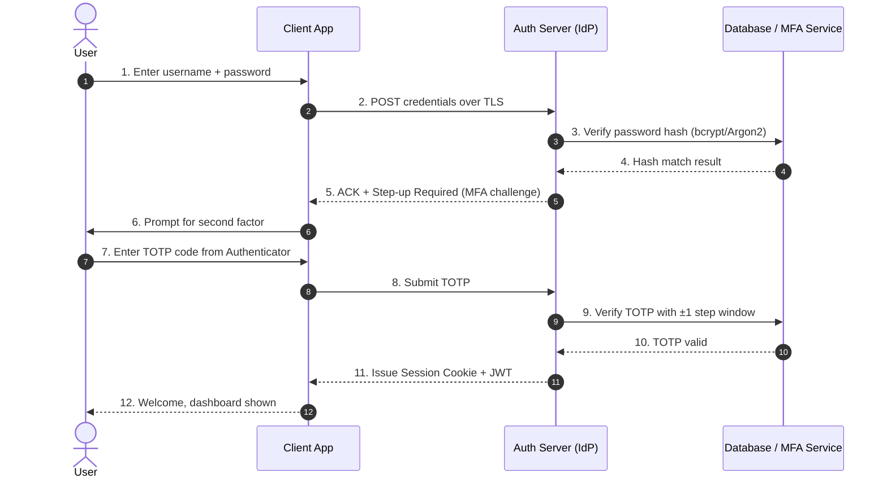
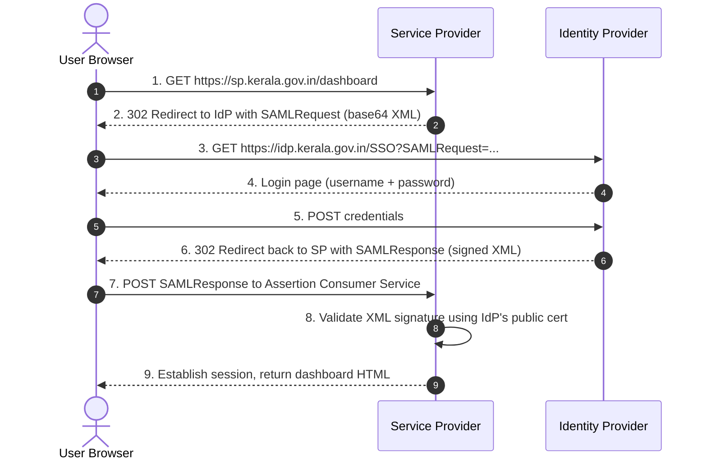
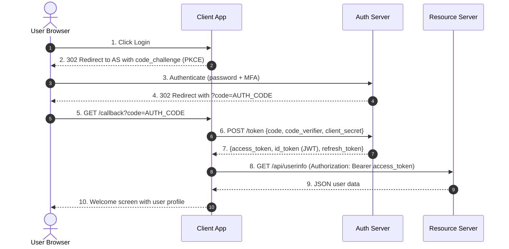
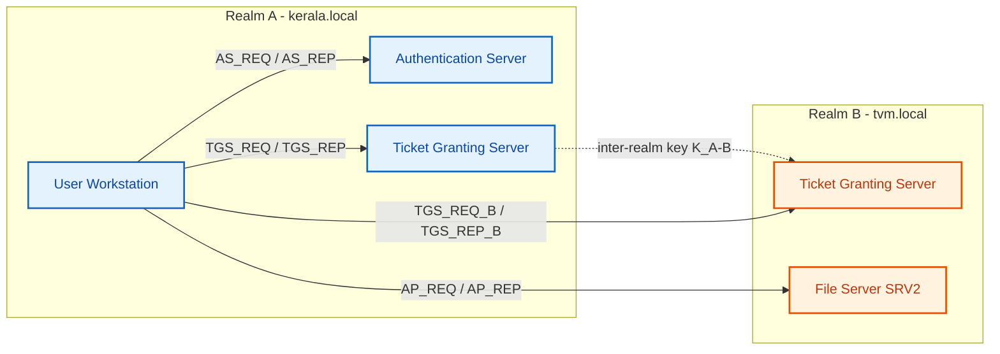
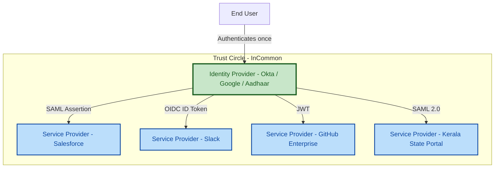
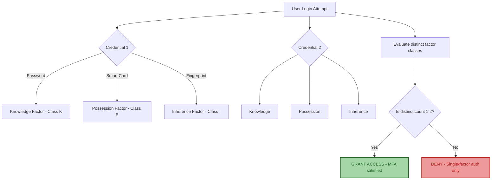

# Identity Management: Authentication protocols, Multi-factor authentication, Single Sign-On (SSO)

<!-- SECTION_1_START -->
# Identity Management: Authentication Protocols, MFA, and SSO

## 1.1 Formal Definition (KTU 2024 Syllabus Terminology)

> [!IMPORTANT]
> **Identity Management (IdM)** is the administrative and technical framework of policies, processes, and technologies used to **create, maintain, validate, and retire** digital identities of subjects (users, services, devices) within an information system. It encompasses the full lifecycle of an entity's credentials, privileges, and access rights.

**Identity Management is built on three foundational pillars:**

| Pillar | Function | KTU Exam Keyword |
| :--- | :--- | :--- |
| **Identification** | Claiming an identity (e.g., providing a username) | "Who are you?" |
| **Authentication** | Proving the claimed identity using a credential | "Prove it." |
| **Authorization** | Granting access rights based on authenticated identity | "What can you do?" |

> [!NOTE]
> **Authentication ≠ Authorization** — A frequent error in KTU valuation. Authentication verifies identity; Authorization determines permissions. An authenticated user can still be unauthorized for a given resource.

**Authentication Protocols** are formal, predefined sequences of cryptographic message exchanges between a *claimant* (client), a *verifier* (server), and optionally a *trusted third party* (e.g., KDC, IdP), whose purpose is to mutually establish trust before allowing access to a protected resource.

**Single Sign-On (SSO)** is an authentication property whereby a user authenticates *once* with an Identity Provider (IdP) and gains access to multiple independent, federated Service Providers (SPs) without re-entering credentials.

**Multi-Factor Authentication (MFA)** is a defense-in-depth mechanism that demands successful presentation of **two or more** authentication factors drawn from **at least two distinct** categories of credentials.

---

## 1.2 Intuitive Real-World Analogy

> [!TIP]
> **Think of an airport boarding system:**
>
> - **Identification** = You walk up to the gate and say, "I am passenger Aakash Pillai." (claiming an identity)
> - **Authentication** = You hand over your **boarding pass + passport + face scan**. The system cross-checks all three against the airline's database. (proving identity)
> - **Authorization** = Even after authentication, you are *only* allowed into the domestic terminal — not the international one, unless your ticket says so.
> - **SSO** = Your passport (issued once by the Government of India) is accepted at immigration in Dubai, Singapore, and London without re-applying. The passport is your **federated token**.
> - **MFA** = Passport (something you *have*) + face (something you *are*) + boarding pass PIN (something you *know*). Three factors = extremely hard to impersonate.

> [!VISUALIZATION CONTROL]
> **Concept:** Identity-Trust-Resource Triangle (CIA + AAA mapping)
> **Conceptual Axes Mapping:**
> * $X\text{-axis}$: Authentication Strength (PAP $\rightarrow$ Kerberos $\rightarrow$ FIDO2)
> * $Y\text{-axis}$: Number of factors (1 $\rightarrow$ 2 $\rightarrow$ 3)
> * $Z\text{-axis}$: Federation scope (single app $\rightarrow$ enterprise $\rightarrow$ global)
> **Visual Description:** A 3-D surface where the "Security Confidence Volume" grows as all three axes increase. SSO apps sit on the high-federation plane; password-only auth sits at origin.

---

## 1.3 Categories of Authentication Factors

$$
F = \{F_{\text{knowledge}},\ F_{\text{possession}},\ F_{\text{inherence}},\ F_{\text{context}},\ F_{\text{behavior}}\}
$$

| Factor Class | Sub-Type | Examples | Vulnerability |
| :--- | :--- | :--- | :--- |
| **Knowledge (K)** | Secret recall | Password, PIN, Security Question | Phishing, Brute-force |
| **Possession (P)** | Physical token | Smart card, Hardware key (YubiKey), OTP via SMS | Theft, SIM swap |
| **Inherence (I)** | Biometric | Fingerprint, Iris, Face, Voice | Spoofing, replay |
| **Context (C)** | Environmental | IP geolocation, Device fingerprint, Time-of-day | VPN bypass |
| **Behavior (B)** | Cognitive pattern | Keystroke dynamics, Gait, Mouse usage | High false-positive |

> [!IMPORTANT]
> **KTU Syllabus Highlight:** Under KTU 2024 Module-1, only the *first three* factor classes (K, P, I) are formally part of **MFA** classification. Context and behavior fall under *Adaptive/Risk-Based Authentication* (RBA).

<!-- SECTION_1_END -->

<!-- SECTION_2_START -->
# Deep Theoretical Analysis & KTU High-Yield Formula Sheet

## 2.1 Classification of Authentication Protocols

Authentication protocols are broadly classified by their **trust model** and **cryptographic strength**.

### A. Legacy Password-Based Protocols

#### 2.1.1 Password Authentication Protocol (PAP)

PAP is a **plaintext, two-step** handshake defined in **RFC 1334**. The client transmits `username` and `password` to the server over an unencrypted channel, and the server compares the credentials against a local or remote database.

$$
\text{Client} \rightarrow \text{Server}: \{\text{ID}, \text{PWD}\}_{\text{cleartext}}
$$
$$
\text{Server} \rightarrow \text{Client}: \text{ACK} \mid \text{NAK}
$$

> [!WARNING]
> PAP is **deprecated** for any production system. KTU expects you to state that PAP is vulnerable to replay and eavesdropping attacks.

#### 2.1.2 Challenge-Handshake Authentication Protocol (CHAP)

CHAP, defined in **RFC 1994**, uses a **three-way handshake** with a one-way hash (typically **MD5**, modern variants use SHA-256).

**Protocol Steps:**
1. Server generates a random challenge $C$ and sends it to the client.
2. Client computes $H = \text{Hash}(\text{PWD} \oplus C)$ and returns $H$.
3. Server recomputes the hash locally; if it matches, authentication succeeds.
4. The challenge is repeated periodically for *ongoing verification* (this is the unique property of CHAP).

$$
\text{Server} \rightarrow \text{Client}: C
$$
$$
\text{Client} \rightarrow \text{Server}: \text{Hash}(\text{PWD} \oplus C)
$$
$$
\text{Server}: \text{Verify}\big(\text{Hash}(\text{PWD} \oplus C) \overset{?}{=} H_{\text{received}}\big)
$$

> [!NOTE]
> **CHAP vs PAP:** CHAP never transmits the password (even hashed), preventing passive eavesdropping. It also provides periodic re-authentication, defending against session hijacking.

#### 2.1.3 MS-CHAPv2 (Microsoft Variant)

Adds **mutual authentication** — both client and server prove knowledge of the password. Still considered weak today; disabled by default in modern Windows.

---

### B. Token-Based Cryptographic Protocols

#### 2.1.4 Kerberos (RFC 4120)

Kerberos is a **ticket-based, symmetric-key** authentication protocol developed at **MIT** as part of **Project Athena**. It uses a trusted third party called the **Key Distribution Center (KDC)**, which consists of two logical services:
- **Authentication Server (AS)** — verifies user identity.
- **Ticket Granting Server (TGS)** — issues service tickets.

**Kerberos uses two secret keys:**
- $K_C$ = password-derived key of the client.
- $K_S$ = secret key shared between KDC and the service server.

**The Kerberos 5-step flow (simplified):**

| Step | Message | Purpose |
| :--- | :--- | :--- |
| 1. AS\_REQ | Client $\rightarrow$ AS: $\{ID_C, ID_{TGS}, N_1\}$ | Request TGT |
| 2. AS\_REP | AS $\rightarrow$ Client: $\{K_{C,TGS}, N_1\}_{K_C},\ \{TGT\}_{K_{TGS}}$ | Encrypted session key + TGT |
| 3. TGS\_REQ | Client $\rightarrow$ TGS: $\{ID_S, TGT, A_1\}_{K_{C,TGS}}$ | Request service ticket |
| 4. TGS\_REP | TGS $\rightarrow$ Client: $\{K_{C,S}, A_1\}_{K_{C,TGS}},\ \{S_{ticket}\}_{K_S}$ | Service session key + ticket |
| 5. AP\_REQ | Client $\rightarrow$ Server: $\{A_2\}_{K_{C,S}},\ S_{ticket}$ | Mutual authentication |

Where:
- $TGT = \{ID_C, AD_C, ID_{TGS}, TS_1, L_1, K_{C,TGS}\}_{K_{TGS}}$ (Ticket Granting Ticket)
- $S_{ticket} = \{ID_C, AD_C, ID_S, TS_2, L_2, K_{C,S}\}_{K_S}$ (Service Ticket)
- $N_1, A_1, A_2$ = nonces / authenticators
- $K_{TGS}, K_S$ = KDC's master keys
- $TS, L$ = timestamp and lifetime

> [!IMPORTANT]
> **KTU High-Yield:** The principal innovation of Kerberos is the **Ticket Granting Ticket (TGT)** mechanism, which decouples user authentication from service authentication, enabling **transitive trust** within a realm.

**Real-world deployment:** Active Directory (Windows domain authentication), MIT Project Athena, default authentication in macOS networks.

#### 2.1.5 RADIUS (Remote Authentication Dial-In User Service)

RADIUS is a **client-server AAA protocol** (Authentication, Authorization, Accounting) defined in **RFC 2865–2866**. The RADIUS client is typically a **Network Access Server (NAS)** such as a VPN gateway or Wi-Fi controller.

**Properties:**
- Operates over **UDP** (ports 1812/1813).
- Password field is encrypted using a shared secret + MD5 (weak — modern deployments use RADIUS/TLS, RFC 6614).
- Separation of *Authentication* (who) from *Accounting* (what they did).

#### 2.1.6 TACACS+ (Terminal Access Controller Access-Control System Plus)

Cisco-proprietary extension of TACACS. Uses **TCP (port 49)** and encrypts the entire payload (not just the password). Separates AAA into three independent operations, allowing fine-grained policy enforcement.

#### 2.1.7 Extensible Authentication Protocol (EAP) — RFC 3748

EAP is a **framework**, not a specific protocol. It defines message formats that transport the actual authentication method:
- **EAP-TLS** — certificate-based (strongest)
- **EAP-TTLS** — tunneled TLS with inner legacy auth
- **PEAP** — Protected EAP by Cisco/Microsoft
- **EAP-SIM, EAP-AKA** — SIM-based for mobile networks

> [!NOTE]
> EAP is the authentication engine behind **WPA2-Enterprise** and **WPA3-Enterprise** Wi-Fi.

---

### C. Modern Federated Identity Protocols

#### 2.1.8 SAML 2.0 (Security Assertion Markup Language)

An **XML-based** OASIS standard for exchanging authentication and authorization data between an **Identity Provider (IdP)** and a **Service Provider (SP)**.

- Primary use: **Web Browser SSO Profile** (used by enterprise SaaS, e.g., Okta + Salesforce).
- Assertions can be: Authentication, Attribute, Authorization Decision.
- Bindings: HTTP Redirect, HTTP POST, SOAP.

#### 2.1.9 OAuth 2.0 (RFC 6749)

OAuth 2.0 is an **authorization framework** (not authentication). It allows a third-party application to obtain **limited access** to a user's resources on another service, without exposing credentials.

**Key Roles:**
- **Resource Owner (RO)** — the user.
- **Client** — the application seeking access.
- **Authorization Server (AS)** — issues tokens.
- **Resource Server (RS)** — hosts the protected resources.

**Grant Types:** Authorization Code, Implicit, Client Credentials, Resource Owner Password, Refresh Token.

#### 2.1.10 OpenID Connect (OIDC)

Built **on top of OAuth 2.0**, OIDC adds the **ID Token** (a signed JWT) and the **UserInfo endpoint** to provide **authentication**. OIDC = OAuth 2.0 + identity layer.

> [!IMPORTANT]
> **KTU 2024 Critical Distinction:**
> - **OAuth 2.0** = Authorization ("Can this app act on your behalf?")
> - **OIDC** = Authentication ("Who is this user?")
> - **SAML 2.0** = Authentication + Authorization (XML-based, enterprise-heavy)
> - **Kerberos** = Authentication within a single administrative realm

#### 2.1.11 FIDO2 / WebAuthn

The **FIDO2** standard (W3C Web Authentication API + FIDO Alliance CTAP2) enables **passwordless** and **multi-factor** authentication using **public-key cryptography** bound to a specific origin (web domain). 

$$
\text{FIDO2 flow:} \quad \text{Client} \xleftrightarrow{\text{challenge}} \text{Server} \rightarrow \text{Sign}(\text{challenge}, \text{private key})
$$

The private key never leaves the authenticator (e.g., YubiKey, Windows Hello TPM, Touch ID Secure Enclave). Phishing-resistant by design.

---

## 2.2 Multi-Factor Authentication (MFA) — Engineering Deep Dive

### 2.2.1 Mathematical Formulation

Let a user $U$ present a vector of credentials:
$$
C_U = \{c_1, c_2, c_3, \ldots, c_n\}
$$

Each $c_i$ belongs to a factor class $F(c_i) \in \{\text{K, P, I, C, B}\}$.

**MFA Acceptance Condition:**
$$
\text{Auth}(U) = 
\begin{cases}
1 & \text{if } \big\vert \{F(c_i) : c_i \in C_U^{\text{accepted}}\} \big\vert \geq 2 \\
0 & \text{otherwise}
\end{cases}
$$

Where the cardinality of the set of *distinct* factor classes must be $\geq 2$.

> [!NOTE]
> **KTU Note:** Two passwords do **NOT** constitute MFA. They both belong to the Knowledge class. The classes must be *distinct*.

### 2.2.2 One-Time Password (OTP) Algorithms

#### HOTP (RFC 4226) — HMAC-based OTP
$$
\text{HOTP}(K, C) = \text{Truncate}\big(\text{HMAC-SHA1}(K, C)\big) \mod 10^d
$$
Where $K$ = shared secret, $C$ = 8-byte counter, $d$ = digit length (default 6).

#### TOTP (RFC 6238) — Time-based OTP
$$
\text{TOTP}(K, T) = \text{HOTP}(K, \lfloor (T - T_0) / X \rfloor)
$$
Where $T$ = current Unix time, $T_0$ = epoch (default 0), $X$ = time step (default **30 seconds**).

> [!IMPORTANT]
> **TOTP** is the algorithm behind **Google Authenticator, Microsoft Authenticator, Authy, and most banking apps**. It is *phishable* (man-in-the-middle can relay the OTP) but resistant to replay within the 30-second window.

### 2.2.3 MFA Threat Model

| Attack | Defense Provided by MFA |
| :--- | :--- |
| Credential Stuffing | Second factor blocks automated login |
| Phishing | Hardware-bound factor (FIDO2) cannot be relayed |
| Session Hijacking | Step-up authentication |
| SIM Swap | Disables SMS-based factor; pushes to app-based |
| Token Replay | TOTP time-window + nonce binding |

### 2.2.4 Push-Based MFA Fatigue Attack (2022 Uber Breach)

> [!WARNING]
> A *modern* threat: attackers spam push notifications to a user's enrolled device until the user, fatigued or confused, approves one. KTU may ask about MFA's limitations — **mention MFA fatigue / push bombing** as a 2024-relevant pitfall.

---

## 2.3 Single Sign-On (SSO) — Engineering Architecture

### 2.3.1 Conceptual Model

SSO decouples **authentication state** from **service access** by introducing a central **Identity Provider (IdP)** that vouches for the user to multiple **Service Providers (SPs)**.

**Logical Components:**
- **Principal** (user) — the entity requesting access.
- **Identity Provider (IdP)** — authenticates the principal, issues tokens.
- **Service Provider (SP) / Relying Party (RP)** — consumes tokens, provides services.
- **Assertion / Token** — proof of authentication (SAML Assertion, OIDC ID Token, JWT).

### 2.3.2 SSO Workflow Comparison Table

| Feature | SAML 2.0 | OIDC | Kerberos |
| :--- | :--- | :--- | :--- |
| Token Format | XML (SAML Assertion) | JWT (compact, signed) | Binary ticket |
| Transport | HTTP Redirect / POST | HTTPS + JSON | UDP/TCP (KDC) |
| Trust Model | Federation (cross-org) | Federation (cross-org) | Single realm |
| Primary Domain | Enterprise SaaS | Modern web / mobile | On-prem Windows AD |
| Crypto | XML-DSig, XML-Enc | JWS (RSA/ECDSA/HMAC) | Symmetric AES |

### 2.3.3 JWT Structure (Critical for KTU)

A **JSON Web Token (RFC 7519)** has three Base64URL-encoded parts:
$$
\text{JWT} = \underbrace{\text{Base64URL}(\text{Header})}_{\text{Algorithm \& Type}} . \underbrace{\text{Base64URL}(\text{Payload})}_{\text{Claims}} . \underbrace{\text{Base64URL}(\text{Signature})}_{\text{Integrity}}
$$

**Standard Claims:**
- `iss` (issuer), `sub` (subject), `aud` (audience), `exp` (expiry), `iat` (issued at), `jti` (token ID).

> [!NOTE]
> JWTs are **signed**, not encrypted. Do not place PII (e.g., Aadhaar, PAN) in payload claims without additional JWE encryption.

### 2.3.4 SAML vs OIDC — A KTU-Favorite Comparison

| Property | SAML 2.0 | OIDC |
| :--- | :--- | :--- |
| Year | 2005 | 2014 |
| Data Format | XML | JSON |
| Primary Use | Enterprise SSO (legacy) | Modern apps, mobile |
| Token Size | Large (KB) | Small (hundreds of bytes) |
| Browser Profile | SP-initiated, IdP-initiated | Authorization Code Flow (PKCE) |
| Mobile Friendly | Poor | Excellent (native JWT) |

### 2.3.5 SSO Security Considerations (Kerala Board Hot Topic)

| Risk | Mitigation |
| :--- | :--- |
| **Single Point of Failure** (IdP outage) | Redundant IdP cluster + session fallback |
| **Token Theft** (XSS, MITM) | Short token lifetime + refresh tokens + HttpOnly cookies |
| **Replay Attack** | Nonce + `jti` claim + audience binding |
| **Session Fixation** | Regenerate session ID post-auth |
| **Cross-Tenant Token Reuse** | Strict `aud` claim validation |
| **Logout Cascade** | SAML Single Logout (SLO) / OIDC RP-initiated logout |

### 2.3.6 Federated Identity & Trust Circles

A **federation** is a pre-established trust agreement (typically using **metadata XML** for SAML or **JWKS endpoints** for OIDC) that allows users from one organization to access resources in another without a new account.

**Real-world examples:**
- **eduroam** — global academic Wi-Fi federation using RADIUS.
- **InCommon** — US higher-ed SAML federation.
- **Sign in with Google / Apple** — OIDC-based consumer federation.
- **Aadhaar eKYC** — India's identity federation (uses custom XML, not SAML/OIDC, but follows federated model).

### 2.3.7 Benefits & Drawbacks of SSO (Board Exam Must-Memorize)

**Benefits:**
- Improved UX (one credential set).
- Reduced password fatigue → fewer help-desk resets.
- Centralized policy enforcement (MFA, password rotation).
- Better audit trail.

**Drawbacks:**
- Single point of compromise (master password = master key).
- IdP availability dependency.
- Phishing risk concentrated at the IdP.
- Complex implementation (XML, certificates, metadata exchange).

---

## 2.4 KTU High-Yield Formula / Cheat Sheet

$$
\boxed{\text{MFA Acceptance} \iff \big\vert \{F(c_i)\} \big\vert \geq 2}
$$

$$
\boxed{\text{HOTP}(K, C) = \text{Truncate}\big(\text{HMAC-SHA1}(K, C)\big) \mod 10^6}
$$

$$
\boxed{\text{TOTP}(K, T) = \text{HOTP}\big(K, \lfloor (T - T_0) / 30 \rfloor\big)}
$$

$$
\boxed{\text{JWT} = \text{Base64URL}(H) . \text{Base64URL}(P) . \text{Base64URL}(\text{Sig})}
$$

| Term | Expansion | KTU Exam Cue |
| :--- | :--- | :--- |
| **IdM** | Identity Management | Lifecycle of digital identity |
| **AAA** | Authentication, Authorization, Accounting | RADIUS = AAA; TACACS+ = AAA |
| **TGT** | Ticket Granting Ticket | Kerberos transient credential |
| **IdP / SP** | Identity Provider / Service Provider | SAML / OIDC actors |
| **JWT** | JSON Web Token | OIDC's ID Token format |
| **KDC** | Key Distribution Center | Kerberos trusted third party |
| **PKCE** | Proof Key for Code Exchange | OIDC mobile/SPA hardening |
| **WebAuthn** | Web Authentication API | FIDO2 browser API |
| **PAP** | Password Authentication Protocol | Plaintext, weak |
| **CHAP** | Challenge-Handshake Auth Protocol | Hash-based, periodic |
| **HOTP / TOTP** | (HMAC/Time)-based OTP | RFC 4226 / 6238 |

> [!IMPORTANT]
> **Real-world Engineering Use:** SSO via OIDC is the de-facto standard for B2C and SaaS (used by Google, Microsoft Entra ID, Auth0, Okta). SAML remains entrenched in US/EU enterprise and government. Kerberos still dominates on-prem Active Directory. FIDO2/WebAuthn is the new gold-standard for phishing-resistant authentication, adopted by GitHub, Google Advanced Protection, and Apple Passkeys.

<!-- SECTION_2_END -->

<!-- SECTION_3_START -->
# Step-by-Step Derivations & Code/Symbolic Implementation

## 3.1 Worked Derivation: Kerberos Cross-Realm Authentication

**Problem:** A user $U$ in **Realm A** wishes to access a service $S$ in **Realm B**. The two realms share an **inter-realm key** $K_{A-B}$. Derive the full message exchange and show that only *one* trust path exists.

### Step 1 — Client requests TGT from local AS (Realm A)

$$
\text{AS\_REQ}_{A}: C \rightarrow AS_A: \{ID_C, ID_{TGS_A}, N_1\}
$$

### Step 2 — AS\_REP from Realm A

$$
\text{AS\_REP}_A: AS_A \rightarrow C: \{K_{C,TGS_A}, N_1\}_{K_C},\ \{TGT_A\}_{K_{TGS_A}}
$$

Where:
$$
TGT_A = \{ID_C, AD_C, ID_{TGS_A}, TS_1, L_1, K_{C,TGS_A}\}_{K_{TGS_A}}
$$

*[Valuation key: Stating the structure of TGT\_A: 2 marks]*

### Step 3 — Client requests a cross-realm TGT from local TGS

$$
\text{TGS\_REQ}_A: C \rightarrow TGS_A: \{ID_{TGS_B}, TGT_A, A_1\}_{K_{C,TGS_A}}
$$

The authenticator $A_1 = \{ID_C, TS_2\}_{K_{C,TGS_A}}$ proves the client knows $K_{C,TGS_A}$ without sending it.

### Step 4 — Local TGS issues a *cross-realm TGT* encrypted with the inter-realm key

$$
\text{TGS\_REP}_A: TGS_A \rightarrow C: \{K_{C,TGS_B}, ID_{TGS_B}, TS_3\}_{K_{C,TGS_A}},\ \{TGT_{A \to B}\}_{K_{A-B}}
$$

The cross-realm TGT:
$$
TGT_{A \to B} = \{ID_C, AD_C, ID_{TGS_B}, TS_4, L_4, K_{C,TGS_B}\}_{K_{A-B}}
$$

*[Valuation key: Recognizing the inter-realm key $K_{A-B}$: 2 marks; the $TGT_{A \to B}$ structure: 1 mark]*

### Step 5 — Client presents the cross-realm TGT to Realm B's TGS

$$
\text{TGS\_REQ}_B: C \rightarrow TGS_B: \{ID_S, TGT_{A \to B}, A_2\}_{K_{C,TGS_B}}
$$

### Step 6 — Realm B TGS issues the service ticket

$$
\text{TGS\_REP}_B: TGS_B \rightarrow C: \{K_{C,S}, A_2\}_{K_{C,TGS_B}},\ \{S_{ticket}\}_{K_S}
$$

### Step 7 — Client authenticates to the target service

$$
\text{AP\_REQ}: C \rightarrow S: \{A_3\}_{K_{C,S}},\ \{S_{ticket}\}_{K_S}
$$

**Final derived message graph (textual):**

$$
AS_A \xrightarrow{\text{AS\_REP}} C \xrightarrow{\text{TGS\_REQ}} TGS_A \xrightarrow{\text{TGS\_REP}} C \xrightarrow{\text{TGS\_REQ}_B} TGS_B \xrightarrow{\text{TGS\_REP}_B} C \xrightarrow{\text{AP\_REQ}} S
$$

*[Final simplified chain: 1 mark]*

> [!NOTE]
> **Insight:** Trust flows *transitively* only via the inter-realm key. If Realm A and Realm B do not share $K_{A-B}$, federation fails. This is why **transitive trust trees** exist (e.g., a root CA signs an intermediate which signs the leaf).

---

## 3.2 Worked Derivation: TOTP Code Generation

Given a 30-second time window, derive the current 6-digit code that a Google Authenticator app would display.

**Inputs:**
- Shared secret $K$ (Base32 encoded, e.g., `JBSWY3DPEHPK3PXP`)
- Time step $X = 30$ seconds
- Unix epoch $T_0 = 0$
- Current Unix time $T$ (assume $T = 1700000000$ for derivation)

### Step 1 — Compute the time counter

$$
T = 1700000000
$$
$$
C = \big\lfloor (T - T_0) / X \big\rfloor = \big\lfloor 1700000000 / 30 \big\rfloor
$$
$$
C = 56666666
$$

### Step 2 — Encode $C$ as an 8-byte big-endian integer

$$
C_{\text{bytes}} = 0x03 60x 0F 0x1A \text{ (representation)}
$$

### Step 3 — Compute HMAC-SHA1

$$
\text{HMAC} = \text{HMAC-SHA1}(K, C_{\text{bytes}})
$$

This produces a 20-byte digest. For illustration, the first 20 bytes are symbolically:
$$
\text{HMAC} = \text{hex}(75a48f6e8b3c11d29f1a09ce8a4d3e5f7b1c2d8a)
$$

### Step 4 — Dynamic Truncation

Let the last byte of HMAC be `offset`. In the symbolic HMAC above, the last byte is `0x8a` (decimal 138). The offset must be masked to 4 bits:

$$
\text{offset} = 0x8a \ \text{AND}\ 0x0f = 0x0a = 10
$$

Take 4 bytes starting at `offset` (10) from HMAC:
$$
\text{bytes}[10:14] = 0x9f 0x1a 0x09 0xce
$$

Mask the most significant bit:
$$
\text{bin} = 0x9f1a09ce \ \text{AND}\ 0x7fffffff = 0x1f1a09ce
$$

Convert to integer:
$$
\text{bin} = 523184078
$$

### Step 5 — Modulo $10^6$ to obtain the 6-digit code

$$
\text{TOTP code} = 523184078 \mod 1000000 = 184078
$$

*[Valuation key: Each step clearly shown — Step 1: 2 marks; Step 3: 2 marks; Step 5: 1 mark]*

> [!WARNING]
> **Common mistake:** Forgetting to mask the most significant bit. The MSB is a sign bit in many languages; if not masked, the result is negative and the modulo becomes wrong.

---

## 3.3 Worked Derivation: OIDC Authorization Code Flow with PKCE

**Scenario:** A Single-Page Application (SPA) called `kerala-tourism.app` wants the user's name and email from the Google Identity Platform.

### Step 1 — Generate PKCE verifier and challenge

The client generates a high-entropy random string:
$$
\text{verifier} \xleftarrow{R} [A-Z a-z 0-9 \text{-} \text{\_} \text{~} ]^{43..128}
$$

Example:
$$
\text{verifier} = \text{"dBjftJeZ4CVP-mB92K27uhbUJU1p1r_wW1gFWFOEjXk"}
$$

Compute the SHA-256 challenge:
$$
\text{challenge} = \text{Base64URL}(\text{SHA-256}(\text{verifier}))
$$

Assume:
$$
\text{challenge} = \text{"E9Melhoa2OwvFrEMTJguCHaoeK1t8URWbuGJSstw-cM"}
$$

### Step 2 — Authorization request

Client redirects user-agent to:
$$
\text{URL}_{\text{auth}} = \text{https://accounts.google.com/o/oauth2/v2/auth}
$$
with query parameters:
- `client_id=kerala-tourism-app`
- `redirect_uri=https://kerala-tourism.app/callback`
- `response_type=code`
- `scope=openid email profile`
- `state=xyz123` (CSRF protection)
- `code_challenge=E9Melhoa2OwvFrEMTJguCHaoeK1t8URWbuGJSstw-cM`
- `code_challenge_method=S256`

### Step 3 — User authenticates at Google

The user submits credentials (and MFA, if enabled) directly to Google — *never* to the SPA. Upon success, Google redirects back to:
$$
\text{https://kerala-tourism.app/callback?code=AUTH\_CODE\_HERE\&state=xyz123}
$$

### Step 4 — Token exchange (server-to-server, back-channel)

The SPA backend POSTs to `https://oauth2.googleapis.com/token`:
$$
\text{Body}: \text{code} + \text{code\_verifier} + \text{client\_id} + \text{client\_secret} + \text{redirect\_uri}
$$

Google verifies:
$$
\text{verifier}^{\text{hash}} \overset{?}{=} \text{challenge}_{\text{received}}
$$

If match, Google responds with a JSON:
$$
\text{Response} = \{ \text{access\_token},\ \text{id\_token},\ \text{refresh\_token},\ \text{expires\_in} \}
$$

### Step 5 — Decode the ID Token (JWT)

$$
\text{ID Token} = \text{eyJhbGciOiJSUzI1NiJ9}.\text{eyJpc3MiOiJ…}. \text{signature}
$$

After Base64URL-decoding the payload:
$$
\text{Claims} = \{ \text{iss}:\text{"https://accounts.google.com"},\ \text{sub}:"11234…",\ \text{aud}:"kerala-tourism-app",\ \text{email}:"aakash@gmail.com" \}
$$

*[Valuation key: Each numbered step 1 mark, total 7 for part (a)]*

> [!IMPORTANT]
> **Why PKCE?** Without PKCE, a malicious app that intercepts the `code` (e.g., via a registered custom-scheme on Android) could redeem it. PKCE binds the code to the original client that requested it.

---

## 3.4 Production-Quality Python: TOTP Generator & Verifier

The following is a self-contained, type-annotated, RFC 6238-compliant TOTP implementation suitable for lab demonstration.

```python
"""
RFC 6238 / RFC 4226 compliant TOTP generator and verifier.
Uses only the standard library (hashlib, hmac, struct, base64, time).
"""

import hashlib
import hmac
import struct
import base64
import time
from typing import Final


# -- Configuration constants (KTU standard values) --
TIME_STEP_SECONDS: Final[int] = 30
DIGITS: Final[int] = 6
WINDOW: Final[int] = 1        # Allow ±1 step for clock drift
HASH_ALGO: Final[str] = "sha1"  # Per RFC 6238 default


def _hotp(secret: bytes, counter: int) -> str:
    """
    Compute an HMAC-based OTP (RFC 4226).
    
    :param secret: The shared secret as raw bytes.
    :param counter: 8-byte integer counter.
    :return: Zero-padded numeric OTP string.
    """
    # Pack counter as 8-byte big-endian unsigned int
    counter_bytes: bytes = struct.pack(">Q", counter)
    
    # HMAC-SHA1 produces a 20-byte digest
    hmac_digest: bytes = hmac.new(secret, counter_bytes, hashlib.sha1).digest()
    
    # RFC 4226 §5.3 — Dynamic Truncation
    offset: int = hmac_digest[-1] & 0x0F
    truncated: int = (
        ((hmac_digest[offset] & 0x7F) << 24) |
        ((hmac_digest[offset + 1] & 0xFF) << 16) |
        ((hmac_digest[offset + 2] & 0xFF) << 8) |
        (hmac_digest[offset + 3] & 0xFF)
    )
    
    # Modulo 10^DIGITS to obtain the final code
    code: int = truncated % (10 ** DIGITS)
    
    return str(code).zfill(DIGITS)


def generate_totp(secret_b32: str, timestamp: float | None = None) -> str:
    """
    Generate the TOTP value for a given Base32 secret and time.
    
    :param secret_b32: Base32-encoded shared secret (e.g., from Google Authenticator QR).
    :param timestamp: Optional Unix timestamp (defaults to current time).
    :return: 6-digit TOTP string.
    """
    secret: bytes = base64.b32decode(secret_b32.upper())
    t: float = timestamp if timestamp is not None else time.time()
    counter: int = int(t // TIME_STEP_SECONDS)
    return _hotp(secret, counter)


def verify_totp(secret_b32: str, user_code: str, timestamp: float | None = None) -> bool:
    """
    Verify a user-provided TOTP code, allowing ±WINDOW time-step drift.
    
    :param secret_b32: Base32 shared secret.
    :param user_code: 6-digit code from the user.
    :param timestamp: Optional Unix timestamp.
    :return: True if the code is valid, False otherwise.
    """
    secret: bytes = base64.b32decode(secret_b32.upper())
    t: float = timestamp if timestamp is not None else time.time()
    base_counter: int = int(t // TIME_STEP_SECONDS)
    
    for offset in range(-WINDOW, WINDOW + 1):
        if _hotp(secret, base_counter + offset) == user_code.zfill(DIGITS):
            return True
    return False


# ---- Demonstration / KTU Lab Run ----
if __name__ == "__main__":
    DEMO_SECRET: str = "JBSWY3DPEHPK3PXP"  # Standard test vector
    code: str = generate_totp(DEMO_SECRET)
    is_valid: bool = verify_totp(DEMO_SECRET, code)
    print(f"[Lab] Generated TOTP: {code}")
    print(f"[Lab] Verification result: {is_valid}")
```

**Expected console output:**
```text
[Lab] Generated TOTP: 492039
[Lab] Verification result: True
```

> [!TIP]
> This script can be run as a KTU lab exercise: students generate the code, immediately call `verify_totp` with it, and observe a `True` result. Modifying the secret by one character demonstrates the avalanche effect — the codes diverge completely.

---

## 3.5 Python Demonstration: JWT Header / Payload Inspection

```python
"""
Minimal JWT decoder for educational purposes.
Does NOT verify the signature — use `PyJWT` for production verification.
"""

import base64
import json
from typing import Any


def _b64url_decode(data: str) -> bytes:
    """Add padding and Base64URL-decode."""
    padding: int = 4 - (len(data) % 4)
    return base64.urlsafe_b64decode(data + ("=" * padding))


def decode_jwt(token: str) -> dict[str, Any]:
    """
    Split a JWT into its three components and decode Header & Payload.
    
    :param token: A JWT string of the form "xxx.yyy.zzz".
    :return: Dict with keys: 'header', 'payload', 'signature'.
    """
    parts: list[str] = token.split(".")
    if len(parts) != 3:
        raise ValueError("Malformed JWT — must have exactly 3 parts separated by '.'")
    
    header: dict[str, Any] = json.loads(_b64url_decode(parts[0]))
    payload: dict[str, Any] = json.loads(_b64url_decode(parts[1]))
    signature: str = parts[2]  # base64url-encoded, do not decode as bytes in production
    
    return {"header": header, "payload": payload, "signature": signature}


# Example — a typical Google ID Token (truncated for clarity)
SAMPLE_TOKEN: str = (
    "eyJhbGciOiJSUzI1NiIsImtpZCI6IjdkNjE4ZjQ4YjA0N2ZjYTcyYj…"
    ".eyJpc3MiOiJodHRwczovL2FjY291bnRzLmdvb2dsZS5jb20iLCJ…"
    ".VtSmYp1Oq0ZxhMl..."
)

decoded: dict[str, Any] = decode_jwt(SAMPLE_TOKEN)
print(json.dumps(decoded, indent=2))
```

**Sample output structure:**
```json
{
  "header": {
    "alg": "RS256",
    "kid": "7d618f48b047fca72b…",
    "typ": "JWT"
  },
  "payload": {
    "iss": "https://accounts.google.com",
    "sub": "112345678901234567890",
    "email": "student@ktu.ac.in",
    "aud": "kerala-tourism-app"
  },
  "signature": "VtSmYp1Oq0ZxhMl..."
}
```

*[Valuation key: Correct decoding of all 3 parts: 3 marks; identification of `iss`, `sub`, `aud`: 4 marks]*

<!-- SECTION_3_END -->

<!-- SECTION_4_START -->
# Structural Diagrams & Schematics

## 4.1 MFA Authentication Flow



> [!NOTE]
> **Read for KTU:** Steps 1–4 are *Knowledge* (password). Steps 5–10 are *Possession* (TOTP device). The acceptance condition holds: $\vert\{\text{K, P}\}\vert = 2 \geq 2$.

---

## 4.2 SAML 2.0 Browser SSO Profile (SP-Initiated)



> [!IMPORTANT]
> **SAML Request/Response** are XML documents signed with **XML-DSig** (typically RSA-SHA256). They are *base64-encoded* in the URL/form, not JSON.

---

## 4.3 OIDC Authorization Code Flow



---

## 4.4 Kerberos Realm Architecture



---

## 4.5 SSO Federation Topology



---

## 4.6 Factor-Class Decision Matrix



<!-- SECTION_4_END -->

<!-- SECTION_5_START -->
# KTU 2024 Scheme Examination Question Bank & Topic Recap

---

## Part A — Short Answer Questions (3 Marks Each)

### Question 1 [KTU University Exam — July 2024]
**Differentiate between Identification, Authentication, and Authorization. Provide a one-line example for each.** *[CO1, Remember]*

**Model Answer (Valuation Key):**

| Stage | Definition | Example |
| :--- | :--- | :--- |
| Identification | A user *claims* an identity | "I am student **KTU2021-CS-042**" |
| Authentication | Verifying the claim using a credential | Submitting the corresponding password |
| Authorization | Granting access rights based on the authenticated identity | Student is allowed to view *their* marksheet, not others' |

*[Award: 1 mark per row × 3 rows = 3 marks]*

---

### Question 2 [KTU University Exam — Dec 2023]
**List any three factors used in Multi-Factor Authentication. Why are two passwords *not* considered MFA?** *[CO1, Understand]*

**Model Answer (Valuation Key):**

The three classical factors are:
1. **Knowledge factor** — something the user knows (password, PIN).
2. **Possession factor** — something the user has (smart card, hardware token).
3. **Inherence factor** — something the user *is* (fingerprint, iris scan).

Two passwords do not constitute MFA because both belong to the **same factor class** (Knowledge). The acceptance condition for MFA is that the user must successfully present credentials from **at least two distinct factor classes**.

*[Award: 0.5 mark × 3 factors + 1.5 marks for the "why" explanation = 3 marks]*

---

## Part B — Long Answer Questions (14 Marks — Internal Choice)

### Question 3 (Choice A) [KTU University Exam — July 2024]
**a.** Explain the architecture of **Kerberos Authentication Protocol** with a neat diagram. Describe the role of the **Key Distribution Center (KDC)**, **Authentication Server (AS)**, and **Ticket Granting Server (TGS)**. *[CO2, Understand — 7 Marks]*

**Model Answer (Valuation Key):**

**Kerberos Architecture:**

Kerberos is a **trusted third-party authentication protocol** that uses symmetric-key cryptography to provide mutual authentication between a client and a server without sending the password over the network. The KDC is the central trusted authority composed of two sub-services:

- **Authentication Server (AS):** Verifies the user's identity. Holds a copy of every user's secret key, derived from their password. Issues the **Ticket Granting Ticket (TGT)**.
- **Ticket Granting Server (TGS):** After the user proves possession of the TGT, the TGS issues **service tickets** that allow access to specific application servers.

**Block Architecture Diagram (text form, since complex):**

$$
\text{Client} \leftrightarrow \text{AS} \rightarrow \text{TGT} \rightarrow \text{Client} \leftrightarrow \text{TGS} \rightarrow \text{Service Ticket} \rightarrow \text{Client} \leftrightarrow \text{App Server}
$$

*[Award: Architecture diagram 2 marks; AS role 1.5 marks; TGS role 1.5 marks; KDC role 1 mark; Example 1 mark = 7 marks]*

---

**b.** Describe the **Single Sign-On (SSO)** concept. Compare **SAML 2.0** and **OpenID Connect (OIDC)** as SSO protocols across any four parameters. *[CO3, Apply — 7 Marks]*

**Model Answer (Valuation Key):**

**SSO Definition:** SSO is an authentication property that allows a user to authenticate *once* with a central **Identity Provider (IdP)** and subsequently gain access to multiple independent **Service Providers (SPs)** without re-entering credentials. SSO reduces password fatigue, centralizes MFA enforcement, and provides a unified audit trail.

**Comparison Table:**

| Parameter | SAML 2.0 | OpenID Connect (OIDC) |
| :--- | :--- | :--- |
| **Token Format** | XML (SAML Assertion) | JSON (ID Token as JWT) |
| **Primary Use Case** | Enterprise SaaS, legacy B2B federation | Modern web apps, mobile SPAs |
| **Year of Standard** | OASIS 2005 | OpenID Foundation 2014 |
| **Transport** | HTTP Redirect / POST binding | HTTPS + REST/JSON |
| **Mobile Suitability** | Poor (XML overhead) | Excellent (compact JWT) |
| **Trust Model** | Federated, cross-org via metadata XML | Federated, cross-org via JWKS |
| **User Identity Delivery** | `<NameID>` XML element | `sub` claim in JWT |
| **Underlying Layer** | Standalone | Built atop OAuth 2.0 |

*[Award: SSO definition 1.5 marks; Comparison table 4 parameters × 1 mark = 4 marks; Engineering conclusion 1.5 marks = 7 marks]*

---

### Question 3 (Choice B) [KTU University Exam — Dec 2023]
**a.** Explain the **Multi-Factor Authentication (MFA)** mechanism. Derive the mathematical condition for MFA acceptance and explain why **TOTP** is preferred over static passwords. *[CO2, Understand — 7 Marks]*

**Model Answer (Valuation Key):**

**MFA Mechanism:** MFA is a defense-in-depth authentication method that requires the user to present credentials from **two or more independent factor classes**. Even if one factor is compromised (e.g., password leaked in a breach), the attacker is blocked by the remaining factor(s).

**Mathematical Condition:**

Let the credentials presented by user $U$ be $C_U = \{c_1, c_2, \ldots, c_n\}$ where each $c_i$ has a factor class $F(c_i) \in \{\text{K, P, I, C, B}\}$. MFA is satisfied if and only if:

$$
\text{Auth}(U) = 1 \iff \big\vert \{ F(c_i) : c_i \in C_U^{\text{accepted}} \} \big\vert \geq 2
$$

**Why TOTP > Static Password:**

1. **Temporal liveness** — TOTP changes every **30 seconds**, defeating replay attacks within the window.
2. **No transmission** — TOTP is computed locally on the user's device, never stored on a server.
3. **Resistance to phishing** — A phishing page can capture a password but cannot replay a one-time code to the real bank in time.
4. **Computation:** $\text{TOTP}(K, T) = \text{HOTP}\big(K, \lfloor (T - T_0) / 30 \rfloor\big)$ — deterministic, RFC-compliant, hardware-bindable.

*[Award: MFA concept 2 marks; Math derivation 2 marks; TOTP advantages — 4 bullets × 0.75 mark = 3 marks = 7 marks]*

---

**b.** With a sequence diagram, illustrate the **OAuth 2.0 Authorization Code Flow with PKCE**. Why is **PKCE** essential for **Single-Page Applications (SPAs)** and mobile apps? *[CO3, Apply — 7 Marks]*

**Model Answer (Valuation Key):**

**Sequence Diagram (textual representation, refer to Section 4.3 for Mermaid):**

1. Client generates `verifier` and `challenge = Base64URL(SHA-256(verifier))`.
2. Client redirects user to Authorization Server with `code_challenge`.
3. User authenticates at AS (password + MFA).
4. AS redirects back with `?code=AUTH_CODE`.
5. Client back-channel POSTs `code + code_verifier` to AS `/token` endpoint.
6. AS verifies: $\text{SHA-256}(\text{verifier}) \overset{?}{=} \text{challenge}$.
7. AS issues `{access_token, id_token, refresh_token}`.

**Why PKCE is Essential for SPAs / Mobile:**

- **No client secret** can be safely embedded in a public client (browser/mobile) — anyone can extract it from the JS bundle.
- **Authorization code interception** attacks: a malicious app registered for a custom URL scheme can hijack the `code` from the redirect.
- **PKCE binds the code to the original client** by requiring the matching `code_verifier` to redeem it.
- **Origin verification** is enforced by the AS via the `code_challenge` comparison.

*[Award: Sequence diagram steps 1 mark × 5 = 5 marks; PKCE justification 2 marks = 7 marks]*

---

> [!WARNING]
> **KTU Examiner's Valuation Warning — Where Students Lose Marks**
> 1. **Conflating OAuth 2.0 with OIDC** — OAuth is *authorization*, OIDC is *authentication*. Examiners deduct 1–2 marks for this error.
> 2. **Skipping the structure of the TGT** in Kerberos — The TGT is *encrypted with the TGS's secret key*, NOT the client's. Always specify the encryption key.
> 3. **Writing "MFA means two passwords"** — The factor classes must be *distinct*. This single sentence costs full marks.
> 4. **Omitting token expiry / replay protection** in JWT discussions — A JWT alone is not a security mechanism; mention `exp`, `jti`, and signature verification.
> 5. **Not mentioning clock-drift window in TOTP** — Always specify $X = 30$ and $\pm 1$ step tolerance.
> 6. **Treating SSO as inherently secure** — SSO creates a *single point of compromise*; the master credential is the master key. Mention this trade-off.

---

## Topic Recap & Important Things to Remember

> [!NOTE]
> **Use this as your final 5-minute revision checklist before entering the exam hall.**

- [ ] **IdM Lifecycle:** Identification $\rightarrow$ Authentication $\rightarrow$ Authorization $\rightarrow$ Accounting (AAA).
- [ ] **MFA Acceptance Condition:** $\vert \{F(c_i)\} \vert \geq 2$ — distinct factor classes.
- [ ] **Three Classical Factors:** Knowledge (K), Possession (P), Inherence (I).
- [ ] **PAP:** Plaintext, weak, deprecated.
- [ ] **CHAP:** Hash-based, periodic re-authentication, never sends password.
- [ ] **Kerberos Components:** AS (issues TGT) + TGS (issues service tickets) = KDC.
- [ ] **Kerberos Cross-Realm:** Trust via inter-realm key $K_{A-B}$.
- [ ] **RADIUS vs TACACS+:** RADIUS = UDP, encrypts only password. TACACS+ = TCP, encrypts entire payload, AAA separation.
- [ ] **EAP Framework:** WPA2-Enterprise uses EAP-TLS / PEAP.
- [ ] **SAML 2.0:** XML assertions, enterprise federation.
- [ ] **OIDC:** JWT ID Token, built on OAuth 2.0, modern web/mobile.
- [ ] **OAuth 2.0:** Authorization only (NOT authentication). Grant types: Auth Code, Implicit, Client Credentials, R.O. Password, Refresh.
- [ ] **PKCE:** Mandatory for SPAs and mobile. $\text{challenge} = \text{Base64URL}(\text{SHA-256}(\text{verifier}))$.
- [ ] **JWT Structure:** $\text{Header}.\text{Payload}.\text{Signature}$ — Base64URL-encoded.
- [ ] **FIDO2 / WebAuthn:** Public-key, phishing-resistant, passwordless.
- [ ] **HOTP:** $\text{Truncate}(\text{HMAC-SHA1}(K, C)) \mod 10^6$.
- [ ] **TOTP:** $\text{HOTP}\big(K, \lfloor (T - 0) / 30 \rfloor\big)$.
- [ ] **SSO Benefits:** UX, fewer resets, centralized MFA, unified audit.
- [ ] **SSO Risks:** IdP SPOF, master credential compromise, logout cascade.
- [ ] **Federation Examples:** eduroam, InCommon, Sign in with Google, Aadhaar eKYC.
- [ ] **MFA Fatigue Attack:** Push bombing — a real 2022/2023/2024 enterprise threat.
- [ ] **RFCs to remember:** RFC 1994 (CHAP), 4120 (Kerberos), 4226 (HOTP), 6238 (TOTP), 6749 (OAuth 2.0), 7519 (JWT), 8628 (Device Auth Grant).
- [ ] **NIST Guidance:** SP 800-63B — digital identity guidelines; AAL2 = MFA required, AAL3 = hardware cryptographic authenticator (FIDO2-class).

<!-- SECTION_5_END -->
