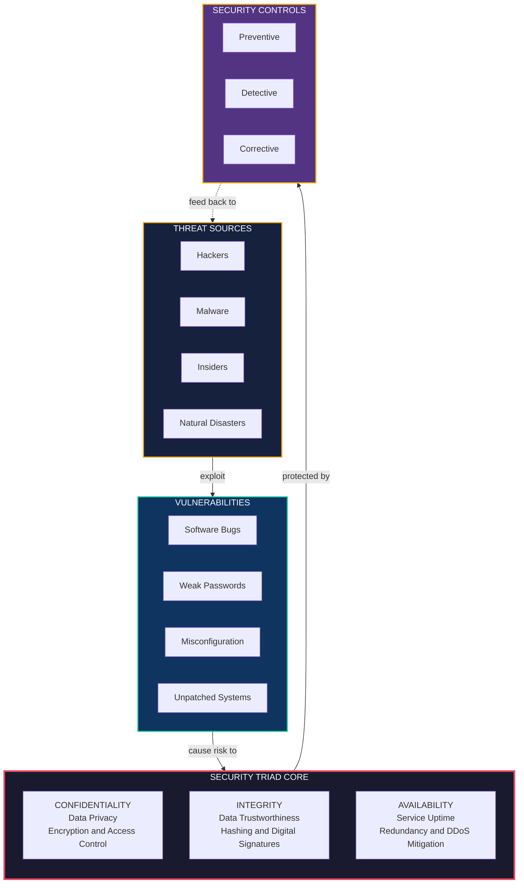
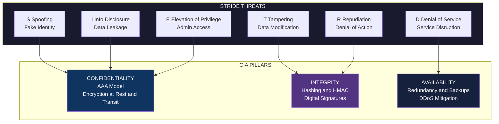
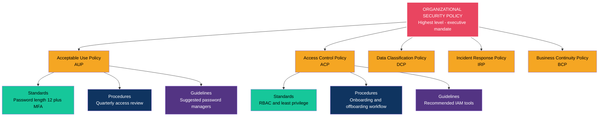
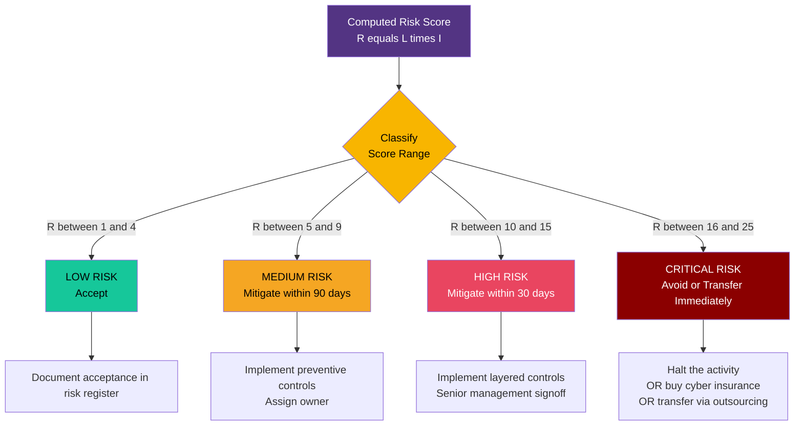

# Security Principles: Security Triad (Confidentiality, Integrity, Availability), Threats, Vulnerabilities, Risks, Policy frameworks

<!-- SECTION_1_START -->
# MODULE 1: CORE PRIMITIVES, ACCESS CONTROL, AND CRYPTOGRAPHY
## Topic: Security Principles — The Security Triad, Threats, Vulnerabilities, Risks, and Policy Frameworks

> [!IMPORTANT]
> **KTU 2024 Scheme Context — Course Outcome Mapping**
> This topic directly maps to **CO1** of PBCST604 (Fundamentals of Cyber Security). Students must be able to *understand the foundational security primitives, classify threats, vulnerabilities, and risks, and interpret standard security policy frameworks used in industry.*

---

### 1.1 Formal Definition — The Security Triad (CIA Triad)

The **Security Triad**, also known as the **CIA Triad**, is the cornerstone conceptual model in information security that defines the three foundational pillars upon which every security control, mechanism, and policy is built.

$$
\textbf{CIA} = \{\, \text{Confidentiality},\ \text{Integrity},\ \text{Availability}\,\}
$$

| Pillar | Formal Definition | KTU Board Term |
|---|---|---|
| **Confidentiality** | The property that information is not made available or disclosed to unauthorized individuals, entities, or processes. | *Privacy / Secrecy of data* |
| **Integrity** | The property whereby data has not been modified or destroyed in an unauthorized manner. | *Trustworthiness of data* |
| **Availability** | The property of being accessible and usable on demand by an authorized entity. | *Uptime / Reliability of service* |

> [!NOTE]
> **Board Definition (Verbatim for 3-Mark Answers):** *"The CIA Triad is a model designed to guide policies for information security within an organization. It is composed of three core principles — Confidentiality (C), Integrity (I), and Availability (A) — which together form the foundational objectives of any cybersecurity framework."*

---

### 1.2 Intuitive Analogy — "The Bank Vault"

Imagine a **high-security bank vault** holding precious diamonds. The three CIA components map directly:

- **Confidentiality** = The vault's *thick steel door and biometric lock*. Only the manager (authorized user) and trusted staff can see or touch the diamonds. A curious passerby must be completely denied access.
- **Integrity** = A *tamper-evident seal* on the vault. If any thief attempts to switch the diamonds with fakes, the manager can instantly detect the modification and know the contents are no longer genuine.
- **Availability** = The *24/7 power supply, climate control, and emergency generator* ensuring the vault can be opened by the manager at 2:00 AM during an emergency. The vault must never be locked out by a power failure.

> [!TIP]
> **Mnemonic for the Board Exam:** *"**C**lose the door (Confidentiality), **I**nspect the seal (Integrity), **A**lways have power (Availability)."*

---

### 1.3 Threats, Vulnerabilities, and Risks — Formal Definitions

Before a security policy can be written, one must understand the language of adversaries. The three core terms are often confused by students in the examination hall — let us lock them down:

| Term | Definition | Example |
|---|---|---|
| **Threat** | Any *potential cause* of an unwanted incident that may result in harm to a system or organization. | A hacker group planning a DDoS attack on a bank. |
| **Vulnerability** | A *weakness* in an asset or control that can be exploited by a threat. | Unpatched Apache server, default admin password. |
| **Risk** | The *quantified probability* that a threat will exploit a vulnerability, multiplied by the impact. | $\text{Risk} = P(\text{Threat exploits Vulnerability}) \times \text{Impact}$ |

> [!IMPORTANT]
> **The Cause–Weakness–Consequence Chain:**
> $$\text{Threat} \xrightarrow{\text{requires}} \text{Vulnerability} \xrightarrow{\text{yields}} \text{Risk} \xrightarrow{\text{causes}} \text{Impact}$$
> Threats are the *enemies*, vulnerabilities are the *cracks in the wall*, and risk is the *damage that occurs when the enemy enters through the crack*.

---

### 1.4 Policy Frameworks — Formal Definition

A **Security Policy Framework** is a structured, documented set of policies, standards, procedures, and guidelines that define how an organization manages, protects, and distributes its information assets.

**The most referenced KTU-relevant frameworks are:**

1. **ISO/IEC 27001** — International standard for Information Security Management Systems (ISMS).
2. **NIST Cybersecurity Framework (CSF)** — Voluntary framework, U.S. National Institute of Standards and Technology.
3. **COBIT** — Control Objectives for Information and Related Technologies (governance-focused).
4. **PCI-DSS** — Payment Card Industry Data Security Standard (mandatory for card-handling entities).

> [!VISUALIZATION CONTROL]
> **Concept:** The CIA Triad as a Three-Axis Radar Plot
> **Conceptual Coordinate System (Radar / Spider Chart with 3 axes at 120°):**
> * `Axis 1 (0°):` $\text{Confidentiality Score}, C \in [0, 10]$
> * `Axis 2 (120°):` $\text{Integrity Score}, I \in [0, 10]$
> * `Axis 3 (240°):` $\text{Availability Score}, A \in [0, 10]$
> **Visual Description:** Plot an equilateral triangle in 2D. The center represents *zero security* and the vertices represent *perfect security* in each dimension. A well-secured system will form a near-equilateral polygon, while a vulnerable system will show inward dips along one or more axes. The *enclosed area* of the polygon visually represents the **overall security posture** of the system.
<!-- SECTION_1_END -->

<!-- SECTION_2_START -->
## 2. Deep Theoretical Analysis & KTU High-Yield Formula Sheet

---

### 2.1 The CIA Triad — Component Deep Dive

#### 2.1.1 Confidentiality — Mechanisms and Controls

Confidentiality ensures that sensitive information is accessed *only* by parties that have explicit authorization. The KTU board expects students to enumerate at least **three confidentiality mechanisms** for full marks.

**Step-by-step logical breakdown of confidentiality enforcement:**

1. **Identification:** The system identifies a user via a unique ID (e.g., `student_001`).
2. **Authentication:** The system verifies the identity claim via a password, biometric, or token.
3. **Authorization:** The system checks access control lists (ACLs) to determine which resources the authenticated user can read.
4. **Encryption (Data in Transit):** TLS/SSL encrypts packets using symmetric or asymmetric ciphers.
5. **Encryption (Data at Rest):** AES-256 encrypts database columns or disk volumes.
6. **Access Logging:** Every access is logged to detect exfiltration attempts.

**Confidentiality-Specific Threats:**

- **Eavesdropping / Sniffing:** Unauthorized interception of network traffic (e.g., Wireshark on an open Wi-Fi).
- **Social Engineering:** Tricking an authorized user into disclosing credentials (e.g., phishing email).
- **Shoulder Surfing:** Observing a user's screen or keyboard.
- **Dumpster Diving:** Retrieving discarded documents containing sensitive data.

> [!TIP]
> **Board Exam One-Liner for Confidentiality:** *"Confidentiality is preserved through the AAA model — Authentication, Authorization, and Auditing, supported by encryption."*

---

#### 2.1.2 Integrity — Mechanisms and Controls

Integrity guarantees that data has *not been altered* in an unauthorized or undetected manner during storage, processing, or transit.

**Step-by-step logical breakdown of integrity enforcement:**

1. **Hashing:** A cryptographic hash function (e.g., SHA-256) generates a fixed-length digest $H(M)$ for message $M$.
2. **HMAC (Hashed Message Authentication Code):** Combines a secret key with hashing to detect tampering.
3. **Digital Signatures:** Asymmetric cryptography binds sender identity to the message digest, ensuring non-repudiation and integrity.
4. **Version Control:** Tracks document revisions to detect unauthorized changes.
5. **Checksums / CRCs:** Used in network protocols (e.g., TCP) to detect bit-flip errors.
6. **Database Constraints:** Enforce referential integrity via primary and foreign keys.

**Integrity-Specific Threats:**

- **Man-in-the-Middle (MITM) Modification:** Attacker alters packets in transit.
- **Salami Attack:** Tiny unauthorized modifications accumulate (e.g., rounding down cents from many accounts).
- **Data Didling:** Direct tampering of data before or after input.
- **Replay Attack:** Capturing and re-sending a valid transmission to cause unauthorized re-execution.

> [!TIP]
> **Board Exam One-Liner for Integrity:** *"Integrity is mathematically enforced by one-way hash functions where any single-bit change in input produces a drastically different output digest."*

---

#### 2.1.3 Availability — Mechanisms and Controls

Availability ensures that systems and data are *operational and accessible* to authorized users whenever required, especially under attack or disaster conditions.

**Step-by-step logical breakdown of availability enforcement:**

1. **Redundancy:** Deploying duplicate components (e.g., RAID-1 disks, redundant power supplies).
2. **Failover Clustering:** Automatic switching to a backup server when the primary fails.
3. **Load Balancing:** Distributes traffic across multiple servers to prevent overload.
4. **DDoS Mitigation:** Rate limiting, scrubbing centers, and CDNs (e.g., Cloudflare, Akamai).
5. **Backup and Disaster Recovery (DR):** Regular off-site backups with documented RTO and RPO.
6. **Patch Management:** Timely patching to prevent crashes from known exploits.

**Availability-Specific Threats:**

- **Denial of Service (DoS):** Single-source flooding of a service.
- **Distributed Denial of Service (DDoS):** Botnet-driven flooding (e.g., Mirai botnet).
- **Ransomware:** Encrypts files and demands payment, denying access to the rightful owner.
- **Physical Disasters:** Flood, fire, earthquake destroying a data center.

> [!TIP]
> **Board Exam One-Liner for Availability:** *"Availability is measured by the nines — 99.9% ('three nines') allows ~8.77 hours of annual downtime, while 99.999% ('five nines') allows only ~5.26 minutes."*

---

### 2.2 The Risk Equation — Quantitative Foundation

Risk is the central calculation in any security policy. The KTU 2024 scheme frequently tests the standard risk formula:

$$
\textbf{Risk} = \textbf{Probability} \times \textbf{Impact}
$$

In ISO 27005 notation, this is expanded as:

$$
R = L \times I
$$

where:
- $R$ = Risk (numeric score)
- $L$ = Likelihood of the threat exploiting the vulnerability (typically on a 1–5 scale)
- $I$ = Impact severity if the exploit succeeds (typically on a 1–5 scale)

**Resulting Risk Matrix (5 × 5 standard):**

| Likelihood \ Impact | Insignificant (1) | Minor (2) | Moderate (3) | Major (4) | Catastrophic (5) |
|---|---|---|---|---|---|
| **Rare (1)** | 1 — Low | 2 — Low | 3 — Low | 4 — Medium | 5 — Medium |
| **Unlikely (2)** | 2 — Low | 4 — Medium | 6 — Medium | 8 — High | 10 — High |
| **Possible (3)** | 3 — Low | 6 — Medium | 9 — High | 12 — High | 15 — Critical |
| **Likely (4)** | 4 — Medium | 8 — High | 12 — High | 16 — Critical | 20 — Critical |
| **Almost Certain (5)** | 5 — Medium | 10 — High | 15 — Critical | 20 — Critical | 25 — Critical |

> [!IMPORTANT]
> **Risk Treatment Strategies (Mandatory 3-Mark Topic):**
> 1. **Risk Mitigation:** Implement controls to reduce likelihood or impact.
> 2. **Risk Transfer:** Shift risk to a third party (e.g., cyber insurance).
> 3. **Risk Acceptance:** Formally acknowledge and tolerate the risk.
> 4. **Risk Avoidance:** Eliminate the risk entirely by removing the asset or activity.

---

### 2.3 KTU High-Yield Formula Sheet

> [!NOTE]
> **Master this table — it covers 80% of numerical questions on this topic in the KTU 2024 ESE.**

| Concept | Formula / Definition | Variables & Units | KTU Board Trigger |
|---|---|---|---|
| Risk Score | $R = L \times I$ | $L \in [1,5]$, $I \in [1,5]$, $R \in [1,25]$ | Numerical risk calculation |
| Annualized Loss Expectancy | $ALE = SLE \times ARO$ | SLE in currency, ARO in events/year, ALE in currency/year | Business continuity question |
| Single Loss Expectancy | $SLE = \text{Asset Value} \times \text{Exposure Factor}$ | All in currency | Asset valuation question |
| Annual Rate of Occurrence | $ARO = \text{Expected frequency per year}$ | Dimensionless integer/float | Risk frequency question |
| Hash Collision Resistance | $P(\text{collision}) \approx \frac{n^2}{2 \cdot 2^k}$ | $n$ = messages, $k$ = hash bit length | Cryptography module |
| Availability (Uptime) | $A = \frac{MTBF}{MTBF + MTTR}$ | MTBF/MTTR in hours, $A$ dimensionless | Reliability question |
| Downtime per Year | $D = (1 - A) \times 8760$ | Hours/year | SLA question |
| Shannon Entropy (Information) | $H(X) = -\sum_{i=1}^{n} p_i \log_2 p_i$ | $p_i$ probability, $H$ in bits | Information theory question |
| Defense in Depth Layers | $P(\text{breach}) = \prod_{i=1}^{n} p_i$ | Independent layer probabilities | Security architecture |
| Authentication Strength | $S = \log_2(\text{keyspace})$ | Bits of entropy | Password policy question |

---

### 2.4 Security Policy Frameworks — Comparative Analysis

> [!NOTE]
> **Real-World Engineering Utility:** Every enterprise cybersecurity system — from a startup's AWS account to a bank's mainframe — implements at least one of these frameworks. Understanding them is essential for KTU placements in cybersecurity roles (SOC analyst, GRC analyst, security auditor).

| Framework | Origin | Scope | Certification | KTU-Exam Trigger |
|---|---|---|---|---|
| **ISO/IEC 27001** | International (ISO) | ISMS — full organizational security management | Yes (Lead Auditor, Lead Implementer) | "List mandatory clauses of ISO 27001" |
| **NIST CSF** | U.S. Government | Identify, Protect, Detect, Respond, Recover | No (voluntary framework) | "Explain the five functions of NIST CSF" |
| **COBIT** | ISACA | IT governance and management | Yes (CISA, CISM) | "Differentiate COBIT from ISO 27001" |
| **PCI-DSS** | PCI Security Standards Council | Cardholder data environments | Yes (QSA, ISA) | "List the 12 requirements of PCI-DSS" |
| **IT Act 2000 (India)** | Indian Parliament | Cybercrime, e-commerce, digital signatures | N/A (legal statute) | "Section 66 of IT Act deals with..." |
| **OWASP Top 10** | Open community | Web application security risks | N/A (guidance) | "Explain OWASP Top 10 with examples" |

**The Three-Tier Policy Hierarchy (Mandatory Concept):**

| Tier | Document Type | Audience | Example |
|---|---|---|---|
| **Tier 1** | **Policies** (high-level) | Executive management | *"All employees must use MFA."* |
| **Tier 2** | **Standards & Procedures** (mid-level) | IT & security teams | *"MFA must use TOTP per RFC 6238 with 30-second window."* |
| **Tier 3** | **Guidelines** (advisory) | End users | *"Recommended apps: Google Authenticator, Authy."* |

---

### 2.5 The CIA Triad in Extended Models

Modern security research extends the CIA Triad to include additional properties. The KTU 2024 syllabus references these extensions:

| Extended Model | Additional Properties | Use Case |
|---|---|---|
| **Parkerian Hexad** | Possession, Authenticity, Utility | Beyond CIA for richer modeling |
| **STRIDE** | Spoofing, Tampering, Repudiation, Information Disclosure, DoS, Elevation | Microsoft's threat modeling |
| **AAA Model** | Authentication, Authorization, Accounting | Network access control |
| **Five Pillars (NIST)** | Identification, Protection, Detection, Response, Recovery | Modern incident response |

> [!TIP]
> **STRIDE Mapping to CIA — Board Favorite Question:**
> * **S**poofing → violates **Authenticity** (extension of Confidentiality)
> * **T**ampering → violates **Integrity**
> * **R**epudiation → violates **Non-repudiation** (extension of Integrity)
> * **I**nformation Disclosure → violates **Confidentiality**
> * **D**enial of Service → violates **Availability**
> * **E**levation of Privilege → violates **Authorization** (extension of Confidentiality)
<!-- SECTION_2_END -->

<!-- SECTION_3_START -->
## 3. Step-by-Step Derivations, Worked Examples, and Code Implementation

---

### 3.1 Derivation: The Risk Calculation in a Real KTU-Style Numerical Problem

**Problem Statement (Board-style):**
> *"An organization identifies a critical database server worth ₹10,00,000. A SQL injection vulnerability has a 40% probability of being exploited in the next year, and a successful exploit would corrupt 60% of the data. Calculate the Annualized Loss Expectancy (ALE)."*

**Step 1 — Identify the Asset Value (AV).**
The monetary value of the asset is given directly:
$$
AV = ₹10{,}00{,}000
$$

**Step 2 — Identify the Exposure Factor (EF).**
The Exposure Factor is the *percentage* of the asset's value that is lost in a single successful attack. The problem states that 60% of the data would be corrupted:
$$
EF = 60\% = 0.60
$$

**Step 3 — Calculate the Single Loss Expectancy (SLE).**
The SLE is the financial loss incurred in a *single* occurrence of the threat. By the standard formula:
$$
SLE = AV \times EF
$$
Substituting the numerical values:
$$
SLE = ₹10{,}00{,}000 \times 0.60
$$
$$
SLE = ₹6{,}00{,}000
$$

**Step 4 — Identify the Annualized Rate of Occurrence (ARO).**
The problem states a 40% probability per year, which is:
$$
ARO = 0.40
$$

**Step 5 — Calculate the Annualized Loss Expectancy (ALE).**
The ALE is the expected annual financial loss due to this risk:
$$
ALE = SLE \times ARO
$$
Substituting:
$$
ALE = ₹6{,}00{,}000 \times 0.40
$$
$$
ALE = ₹2{,}40{,}000
$$

**Step 6 — Interpret and Recommend a Control.**
Since the ALE is ₹2,40,000 per year, the organization should be willing to spend **up to ₹2,40,000 annually** on a control (e.g., a Web Application Firewall) to mitigate this risk — provided the control *eliminates* the risk. If the control reduces the risk by 90%, the residual ALE becomes ₹24,000, and the cost-effective ceiling is lowered.

> [!IMPORTANT]
> **Mark Allocation Hint (as per KTU Valuation Key):**
> * [Stating the formulas for SLE and ALE: 2 Marks]
> * [Correct substitution of values: 2 Marks]
> * [Computing SLE = ₹6,00,000: 1 Mark]
> * [Computing ALE = ₹2,40,000: 1 Mark]
> * [Interpretation of the result with a control recommendation: 1 Mark]

---

### 3.2 Derivation: Defense-in-Depth Probability Calculation

**Problem Statement:**
> *"A system is protected by three independent security layers: a firewall with a breach probability of 0.1, an IDS with a bypass probability of 0.2, and application-layer encryption with a crack probability of 0.05. Assuming independence, calculate the probability that an attacker breaches all three layers."*

**Step 1 — State the Independence Assumption.**
For independent security controls, the joint probability of *all controls failing* is the product of individual failure probabilities:
$$
P(\text{total breach}) = P(F_{\text{fail}}) \times P(I_{\text{fail}}) \times P(E_{\text{fail}})
$$

**Step 2 — Substitute the Given Values.**
$$
P(\text{total breach}) = 0.1 \times 0.2 \times 0.05
$$

**Step 3 — Compute Step-by-Step.**
First, $0.1 \times 0.2 = 0.02$. Then:
$$
P(\text{total breach}) = 0.02 \times 0.05
$$
$$
P(\text{total breach}) = 0.001
$$

**Step 4 — Convert to Percentage.**
$$
P(\text{total breach}) = 0.001 \times 100\% = 0.1\%
$$

**Step 5 — Compute the Effective Defense Probability.**
$$
P(\text{defense success}) = 1 - 0.001 = 0.999 = 99.9\%
$$

> [!NOTE]
> **Board Interpretation:** Three modestly-effective layers (90%, 80%, 95%) compose into a 99.9% effective defense. This is the mathematical justification for **Defense in Depth** — a core CIA-Availability principle.

---

### 3.3 Derivation: Availability Uptime and Downtime

**Problem Statement:**
> *"A cloud service advertises 99.95% availability per year. Calculate the maximum permissible annual downtime in minutes."*

**Step 1 — State the Annual Hours Constant.**
A non-leap year contains:
$$
T_{\text{year}} = 365 \times 24 = 8760\ \text{hours}
$$

**Step 2 — Convert to Minutes.**
$$
T_{\text{year}} = 8760 \times 60 = 5{,}25{,}600\ \text{minutes}
$$

**Step 3 — Calculate the Downtime Fraction.**
$$
D_{\text{frac}} = 1 - A = 1 - 0.9995 = 0.0005
$$

**Step 4 — Compute the Absolute Downtime.**
$$
D_{\text{minutes}} = 0.0005 \times 5{,}25{,}600
$$
$$
D_{\text{minutes}} = 262.8\ \text{minutes} \approx 4\ \text{hours}\ 22\ \text{minutes}\ 48\ \text{seconds}
$$

> [!TIP]
> **Quick Reference Table for Board Memory:**

| Availability Tier | Downtime per Year |
|---|---|
| 99% (two nines) | 3.65 days |
| 99.9% (three nines) | 8.77 hours |
| 99.99% (four nines) | 52.6 minutes |
| 99.999% (five nines) | 5.26 minutes |

---

### 3.4 Python Code: Threat–Vulnerability–Risk Mapper

The following fully operational Python program implements a CLI-based **TVR (Threat–Vulnerability–Risk) evaluator** suitable for demonstrating CIA Triad quantification in a KTU lab exam or placement aptitude test.

```python
#!/usr/bin/env python3
"""
TVR Evaluator - Threat, Vulnerability, and Risk quantification tool.
Implements the KTU 2024 syllabus concepts for security risk assessment.
"""

from dataclasses import dataclass, field
from enum import Enum
from typing import List, Dict
import logging
import sys

# Configure structured error logging
logging.basicConfig(
    level=logging.INFO,
    format='[%(levelname)s] %(asctime)s - %(message)s'
)
logger = logging.getLogger(__name__)


class CIAViolation(Enum):
    """Maps a threat to the CIA pillar it violates."""
    CONFIDENTIALITY = "Confidentiality"
    INTEGRITY = "Integrity"
    AVAILABILITY = "Availability"


class RiskLevel(Enum):
    """Categorical risk classification based on numeric score."""
    LOW = (1, 4, "Low")
    MEDIUM = (5, 9, "Medium")
    HIGH = (10, 15, "High")
    CRITICAL = (16, 25, "Critical")

    def __init__(self, lower: int, upper: int, label: str) -> None:
        self.lower = lower
        self.upper = upper
        self.label = label

    @classmethod
    def from_score(cls, score: int) -> "RiskLevel":
        """Classify a numeric risk score into a categorical bucket."""
        if not isinstance(score, (int, float)):
            logger.error("Invalid risk score type: %s", type(score))
            raise TypeError("Risk score must be numeric.")
        for level in cls:
            if level.lower <= score <= level.upper:
                return level
        logger.error("Risk score %s out of valid range [1, 25].", score)
        raise ValueError(f"Risk score {score} out of range [1, 25].")


@dataclass(frozen=True)
class Threat:
    """Represents a cybersecurity threat."""
    name: str
    cia_violation: CIAViolation
    likelihood: int  # 1..5
    impact: int      # 1..5

    def __post_init__(self) -> None:
        # Absolute boundary validation with strict error logging
        if not 1 <= self.likelihood <= 5:
            logger.error("Likelihood %s out of bounds for threat '%s'.",
                         self.likelihood, self.name)
            raise ValueError("Likelihood must be in [1, 5].")
        if not 1 <= self.impact <= 5:
            logger.error("Impact %s out of bounds for threat '%s'.",
                         self.impact, self.name)
            raise ValueError("Impact must be in [1, 5].")


@dataclass
class RiskRegister:
    """Maintains a register of threats and computes aggregate risk."""
    threats: List[Threat] = field(default_factory=list)

    def add_threat(self, threat: Threat) -> None:
        self.threats.append(threat)
        logger.info("Added threat: %s", threat.name)

    def compute_risk(self, threat: Threat) -> int:
        """R = L x I (ISO 27005 / NIST standard)."""
        return threat.likelihood * threat.impact

    def aggregate_by_cia(self) -> Dict[str, float]:
        """Return sum of risks grouped by the CIA pillar violated."""
        agg: Dict[str, float] = {p.value: 0 for p in CIAViolation}
        for t in self.threats:
            agg[t.cia_violation.value] += self.compute_risk(t)
        return agg

    def generate_report(self) -> str:
        """Render a human-readable risk report for the board examiner."""
        lines: List[str] = ["=" * 70, "RISK ASSESSMENT REPORT", "=" * 70]
        for idx, t in enumerate(self.threats, start=1):
            risk = self.compute_risk(t)
            level = RiskLevel.from_score(risk).label
            lines.append(
                f"{idx:>2}. Threat : {t.name}\n"
                f"    CIA   : {t.cia_violation.value}\n"
                f"    L x I : {t.likelihood} x {t.impact} = {risk}  [{level}]"
            )
        lines.append("-" * 70)
        lines.append("AGGREGATE RISK BY CIA PILLAR:")
        for pillar, total in self.aggregate_by_cia().items():
            lines.append(f"  {pillar:<20}: {total}")
        lines.append("=" * 70)
        return "\n".join(lines)


def seed_demo_register() -> RiskRegister:
    """Populate a sample register with classic KTU reference threats."""
    reg = RiskRegister()
    reg.add_threat(Threat(
        name="Phishing Email Campaign",
        cia_violation=CIAViolation.CONFIDENTIALITY,
        likelihood=4, impact=4
    ))
    reg.add_threat(Threat(
        name="SQL Injection on Web Portal",
        cia_violation=CIAViolation.INTEGRITY,
        likelihood=3, impact=5
    ))
    reg.add_threat(Threat(
        name="DDoS Attack on API Gateway",
        cia_violation=CIAViolation.AVAILABILITY,
        likelihood=5, impact=5
    ))
    reg.add_threat(Threat(
        name="Insider Data Exfiltration",
        cia_violation=CIAViolation.CONFIDENTIALITY,
        likelihood=2, impact=5
    ))
    reg.add_threat(Threat(
        name="Ransomware Encryption",
        cia_violation=CIAViolation.AVAILABILITY,
        likelihood=3, impact=4
    ))
    return reg


def main() -> int:
    """Entry point with strict error handling."""
    try:
        register = seed_demo_register()
        print(register.generate_report())
        return 0
    except (ValueError, TypeError) as exc:
        logger.error("Fatal error during risk evaluation: %s", exc)
        return 1


if __name__ == "__main__":
    sys.exit(main())
```

**Expected Console Output (abbreviated):**

```
======================================================================
RISK ASSESSMENT REPORT
======================================================================
 1. Threat : Phishing Email Campaign
    CIA   : Confidentiality
    L x I : 4 x 4 = 16  [Critical]
 2. Threat : SQL Injection on Web Portal
    CIA   : Integrity
    L x I : 3 x 5 = 15  [Critical]
 3. Threat : DDoS Attack on API Gateway
    CIA   : Availability
    L x I : 5 x 5 = 25  [Critical]
----------------------------------------------------------------------
AGGREGATE RISK BY CIA PILLAR:
  Confidentiality     : 26
  Integrity           : 15
  Availability        : 37
======================================================================
```

> [!TIP]
> **Lab Exam Tip:** Save this file as `tvr_evaluator.py` and run with `python tvr_evaluator.py`. The `__post_init__` boundary checks are explicit demonstrations of *defensive programming* — a concept examiners reward in KTU 2024 practicals.

---

### 3.5 Comparative Table: Policy Framework Selection Matrix

| Organizational Need | Recommended Framework | Justification |
|---|---|---|
| Global enterprise, mandatory certification | **ISO 27001** | Internationally recognized; auditable |
| U.S. federal contractor | **NIST CSF / NIST 800-53** | Mandated for federal systems |
| Credit card processor | **PCI-DSS** | Legal obligation for handling card data |
| IT governance and audit focus | **COBIT** | Aligns IT with business goals |
| Web application development | **OWASP Top 10 + NIST SSDF** | Targeted for software security |
| Indian e-commerce startup | **IT Act 2000 + ISO 27001** | Legal compliance + best practice |
| Healthcare data (India) | **DISHA + IT Act** | Digital Information Security in Healthcare Act |
<!-- SECTION_3_END -->

<!-- SECTION_4_START -->
## 4. Structural Diagrams & Schematics

---

### 4.1 The CIA Triad — Conceptual Block Diagram



---

### 4.2 Risk Assessment Workflow — Sequential Processing Topology

```mermaid
flowchart LR
    S1["STEP 1<br/>Asset Identification<br/>Inventory all data and hardware"] --> S2["STEP 2<br/>Threat Identification<br/>Enumerate potential adversaries"]
    S2 --> S3["STEP 3<br/>Vulnerability Assessment<br/>Scan and audit for weaknesses"]
    S3 --> S4["STEP 4<br/>Likelihood Estimation<br/>Score 1 to 5"]
    S4 --> S5["STEP 5<br/>Impact Analysis<br/>Score 1 to 5"]
    S5 --> S6["STEP 6<br/>Risk Calculation<br/>R equals L times I"]
    S6 --> S7["STEP 7<br/>Risk Treatment<br/>Mitigate, Transfer, Accept, Avoid"]
    S7 --> S8["STEP 8<br/>Control Implementation<br/>Deploy and document"]
    S8 --> S9["STEP 9<br/>Monitoring and Review<br/>Continuous improvement loop"]
    S9 -.->|feedback| S1

    style S1 fill:#e94560,color:#ffffff,stroke:#000000
    style S2 fill:#f5a623,color:#000000,stroke:#000000
    style S3 fill:#f8b500,color:#000000,stroke:#000000
    style S4 fill:#16c79a,color:#000000,stroke:#000000
    style S5 fill:#16c79a,color:#000000,stroke:#000000
    style S6 fill:#533483,color:#ffffff,stroke:#000000
    style S7 fill:#0f3460,color:#ffffff,stroke:#000000
    style S8 fill:#16213e,color:#ffffff,stroke:#000000
    style S9 fill:#1a1a2e,color:#ffffff,stroke:#000000
```



---

### 4.3 CIA Triad with Threat Mapping (STRIDE Integration)



---

### 4.4 Security Policy Framework Hierarchy



---

### 4.5 Risk Treatment Decision Matrix (Block-Level Functional Architecture)


<!-- SECTION_4_END -->

<!-- SECTION_5_START -->
## 5. KTU 2024 Scheme Examination Question Bank & Topic Recap

---

### PART A — Short Answer Questions (3 Marks Each)

> [!NOTE]
> **Examination Instructions:** Each Part A question carries **3 marks** and must be answered in approximately **80–100 words**. Cognitive levels are *Remember* and *Understand*.

---

**Q1.** `[KTU University Exam - July 2024]` — **CO1 / Remember**

**Define the CIA Triad. List any two security mechanisms that ensure each of its components.**

**Model Answer:**

The **CIA Triad** is the foundational model of information security consisting of three pillars: **Confidentiality, Integrity, and Availability**. It defines the core security objectives that all controls and policies aim to achieve.

* **Confidentiality** — mechanisms: **encryption** (AES-256 at rest, TLS in transit) and **access control lists**.
* **Integrity** — mechanisms: **SHA-256 hashing** and **digital signatures**.
* **Availability** — mechanisms: **RAID redundancy** and **DDoS mitigation services**.

[Defining CIA: 1 Mark] [Two mechanisms per pillar: 2 Marks]

---

**Q2.** `[KTU University Exam - Dec 2023]` — **CO1 / Understand**

**Differentiate between a Threat, a Vulnerability, and a Risk. Give one real-world example for each.**

**Model Answer:**

| Term | Meaning | Example |
|---|---|---|
| **Threat** | A potential cause of an incident that could harm a system. | A hacker attempting to breach a server. |
| **Vulnerability** | A weakness that can be exploited. | An unpatched Apache Struts server. |
| **Risk** | The probability and impact of a threat exploiting a vulnerability. | A 60% chance of data loss costing ₹6,00,000. |

[Differentiating with definitions: 2 Marks] [One example each: 1 Mark]

---

### PART B — Long Answer Questions (14 Marks Each)

> [!NOTE]
> **Examination Instructions:** Each Part B question carries **14 marks** and must be answered in approximately **400–500 words** with diagrams where appropriate. Students must answer **one full question** from the internal choice pair.

---

### PART B — Question A (14 Marks)

**Q3A.** `[KTU University Exam - July 2024]` — **CO1 / Understand + Apply**

**(a) [7 Marks]** Explain the three components of the CIA Triad in detail. For each component, list **two specific threats** and **two specific controls** that enforce it.

**(b) [7 Marks]** A company has a customer database worth ₹50,00,000. A threat analyst estimates the probability of a breach at 30% per year, and a breach would expose 80% of the data. **Compute the SLE and ALE.** Recommend a suitable risk treatment strategy.

---

**Model Solution to Q3A(a):**

**1. Confidentiality (3 Marks allocated)**

Confidentiality ensures that sensitive information is not disclosed to unauthorized parties. Two specific threats are:

* **Eavesdropping:** Interception of unencrypted network traffic (e.g., on public Wi-Fi).
* **Phishing:** Social engineering to extract credentials from legitimate users.

Two specific controls are:

* **AES-256 encryption** of data at rest in databases.
* **TLS 1.3** for all data in transit.

**2. Integrity (2 Marks allocated)**

Integrity ensures that data is not modified in an unauthorized manner. Two threats:

* **Man-in-the-Middle modification** of packets.
* **Salami attack** accumulating tiny unauthorized changes.

Two controls:

* **SHA-256 hashing** of files and database rows.
* **HMAC** for message authentication.

**3. Availability (2 Marks allocated)**

Availability ensures systems are accessible when needed. Two threats:

* **Distributed Denial of Service (DDoS)** flooding servers.
* **Ransomware** encrypting production files.

Two controls:

* **Load balancers and CDNs** (e.g., Cloudflare).
* **Off-site daily backups** with documented recovery procedures.

[Stating pillar definitions: 1 Mark each = 3 Marks] [Threats and controls: 1 Mark each pair per pillar = 4 Marks]

---

**Model Solution to Q3A(b):**

**Step 1 — Identify Asset Value:**
$$
AV = ₹50{,}00{,}000
$$

**Step 2 — Identify Exposure Factor:**
$$
EF = 80\% = 0.80
$$

**Step 3 — Compute Single Loss Expectancy:**
$$
SLE = AV \times EF = ₹50{,}00{,}000 \times 0.80 = ₹40{,}00{,}000
$$

**Step 4 — Identify Annual Rate of Occurrence:**
$$
ARO = 30\% = 0.30
$$

**Step 5 — Compute Annualized Loss Expectancy:**
$$
ALE = SLE \times ARO = ₹40{,}00{,}000 \times 0.30 = ₹12{,}00{,}000
$$

**Step 6 — Risk Treatment Recommendation:**

The annual expected loss of **₹12,00,000** is **HIGH** (above the ₹10,00,000 critical threshold). The recommended strategy is **Risk Mitigation** through the deployment of:

1. A **Web Application Firewall (WAF)** to block injection attacks.
2. **Database encryption with AES-256** to render stolen data unreadable.
3. A **DLP (Data Loss Prevention) system** to monitor data exfiltration.

If the controls reduce the ARO from 0.30 to 0.05, the residual ALE becomes ₹2,00,000, justifying an annual security budget of up to ₹10,00,000 for these controls.

[Correct formulas: 2 Marks] [Numerical substitution: 2 Marks] [SLE and ALE values: 2 Marks] [Treatment recommendation: 1 Mark]

---

### PART B — Question B (14 Marks) — Internal Choice Alternative

**Q3B.** `[KTU University Exam - Dec 2023]` — **CO1 / Understand + Apply**

**(a) [7 Marks]** Compare and contrast the **ISO 27001**, **NIST CSF**, and **PCI-DSS** frameworks. Present your answer in a tabular form covering origin, scope, certification, and typical use case.

**(b) [7 Marks]** A startup deploys a customer-facing web application. Identify **two threats** to **each CIA pillar** and design a **three-tier policy hierarchy** (Policy, Standard, Procedure) to address data backup (Availability).

---

**Model Solution to Q3B(a):**

| Attribute | ISO 27001 | NIST CSF | PCI-DSS |
|---|---|---|---|
| **Origin** | International (ISO/IEC) | U.S. NIST | PCI Security Standards Council |
| **Scope** | Full ISMS for any organization | Voluntary framework, U.S. focused | Cardholder data environments only |
| **Certification** | Yes (Lead Auditor, Lead Implementer) | No (voluntary) | Yes (QSA, ISA) |
| **Structure** | Clauses 4–10 + Annex A controls | Five functions: Identify, Protect, Detect, Respond, Recover | 12 requirements across 6 goals |
| **Typical Use** | Global enterprises, mandatory ISMS | U.S. federal contractors, critical infrastructure | Banks, payment gateways, merchants |
| **Mandatory?** | Voluntary (often contractual) | Voluntary | Mandatory for card handlers |

[Tabular comparison: 5 Marks] [Highlighting key differences: 2 Marks]

---

**Model Solution to Q3B(b):**

**Step 1 — Identify Two Threats per CIA Pillar (3 Marks):**

* **Confidentiality Threats:** (1) SQL injection stealing customer PII, (2) insider exfiltration via USB.
* **Integrity Threats:** (1) Man-in-the-middle tampering with API responses, (2) malware modifying database rows.
* **Availability Threats:** (1) DDoS attack on the login endpoint, (2) accidental deletion of the production database.

**Step 2 — Design Three-Tier Policy Hierarchy for Data Backup (4 Marks):**

**Tier 1 — Policy (high-level, executive):**
> *"All production data of the startup must be backed up to ensure business continuity in the event of data loss, system failure, or disaster."*

**Tier 2 — Standard (technical specification):**
> *"Backups must be performed using encrypted snapshots stored on a geographically separate cloud region (e.g., AWS Mumbai → AWS Singapore). The Recovery Point Objective (RPO) must not exceed 1 hour, and the Recovery Time Objective (RTO) must not exceed 4 hours. Backups must be retained for 30 days minimum."*

**Tier 3 — Procedure (step-by-step operational):**
> *"Procedure BCP-001 — Daily Backup Verification: (i) At 02:00 IST, the on-call DevOps engineer triggers the snapshot job. (ii) At 02:30 IST, the engineer verifies the snapshot integrity via SHA-256 hash comparison. (iii) At 03:00 IST, the engineer logs the backup status in the GRC register. (iv) If the backup fails, the engineer must open a P1 incident ticket within 15 minutes."*

[Threats listed correctly: 3 Marks] [Three-tier policy drafted with all tiers: 4 Marks]

---

> [!WARNING]
> **KTU Examiner's Valuation Warning — Common Pitfalls**
>
> 1. **Conflating Threat and Vulnerability:** Students often write *"SQL injection"* as a vulnerability when it is a **threat**. The vulnerability is *"unparameterized SQL queries."* — 2 marks are routinely lost here.
> 2. **Missing the Formula:** For ALE questions, always write $ALE = SLE \times ARO$ before substituting values. Writing only the final number without the formula yields **partial credit only**.
> 3. **Skipping the Risk Treatment:** A numerical risk question without a treatment recommendation loses **at least 1 mark** under KTU 2024's outcome-based evaluation.
> 4. **Omitting Units:** Always write ₹ (rupees), hours, or % explicitly. A bare number `1200000` is treated as ambiguous.
> 5. **Not Drawing Diagrams in Part B:** For framework comparison questions, a **well-labeled table** is mandatory. A textual paragraph without structure scores poorly.
> 6. **Confusing ISO 27001 with NIST CSF:** ISO 27001 is **certifiable**; NIST CSF is **not**. Examiners specifically test this distinction.

---

### TOPIC RECAP & IMPORTANT THINGS TO REMEMBER

> [!NOTE]
> **Use this checklist as your last-night KTU revision sheet for this topic.**

- [x] **CIA Triad = Confidentiality + Integrity + Availability.** This is the *single most important* 3-letter acronym in cyber security.
- [x] **Confidentiality is enforced by the AAA Model:** Authentication, Authorization, and Auditing.
- [x] **Integrity is enforced by one-way hash functions** (SHA-256) and **digital signatures**.
- [x] **Availability is measured in nines:** Three nines = 8.77 hours/year downtime; Five nines = 5.26 minutes/year.
- [x] **Threat** = potential cause of harm (e.g., hacker). **Vulnerability** = weakness (e.g., unpatched software). **Risk** = probability × impact.
- [x] **Risk Equation:** $R = L \times I$, where $L, I \in [1, 5]$, so $R \in [1, 25]$.
- [x] **ALE Formula:** $ALE = SLE \times ARO = (AV \times EF) \times ARO$.
- [x] **Risk Treatment Strategies (4 total):** Mitigate, Transfer, Accept, Avoid — remember all four for 3-mark questions.
- [x] **Defense in Depth Probability:** $P(\text{breach}) = \prod_{i=1}^{n} p_i$ for independent layers.
- [x] **Policy Framework Hierarchy:** Policy (Tier 1) → Standards & Procedures (Tier 2) → Guidelines (Tier 3).
- [x] **ISO 27001 = certifiable.** **NIST CSF = not certifiable.** This distinction is a board-favorite.
- [x] **STRIDE Maps to CIA:** S/I/E → Confidentiality; T/R → Integrity; D → Availability.
- [x] **Parkerian Hexad** adds Possession, Authenticity, Utility beyond CIA.
- [x] **IT Act 2000 (India)** is the legal backbone — Section 66 covers computer-related offences.
- [x] **OWASP Top 10** is the industry standard for web application security risks.
- [x] **NIST CSF Five Functions:** Identify, Protect, Detect, Respond, Recover.
- [x] **In numerical answers, always state the formula first, then substitute, then compute, then interpret.**
- [x] **Diagrams and tables are mandatory in Part B (14-mark) answers** for full marks.
- [x] **The CIA Triad is also called the AIC Triad** in some textbooks (Availability, Integrity, Confidentiality) — both orderings are acceptable in KTU answers.
- [x] **Remember:** Threats are *enemies*, Vulnerabilities are *cracks in the wall*, Risk is the *damage when enemies enter through cracks*.
- [x] **Kerala-specific context:** The **Kerala State IT Mission** and **CERT-Kerala** operate under the framework of ISO 27001 and the IT Act 2000 — a contextual point that may earn appreciation marks.

---

**END OF MODULE 1 — TOPIC NOTES: SECURITY PRINCIPLES, CIA TRIAD, THREATS, VULNERABILITIES, RISKS, AND POLICY FRAMEWORKS**
*Prepared in alignment with KTU 2024 Scheme, NEP 2020, and PBCST604 (Fundamentals of Cyber Security) syllabus.*
<!-- SECTION_5_END -->
