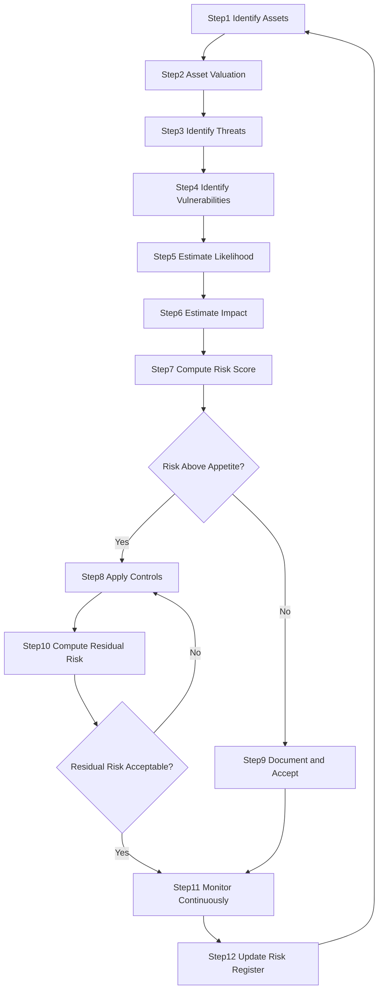
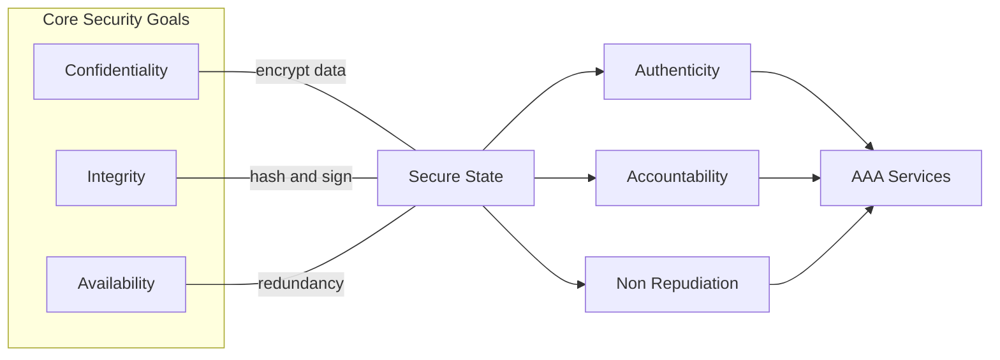
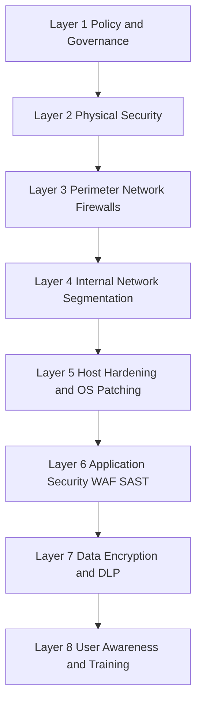
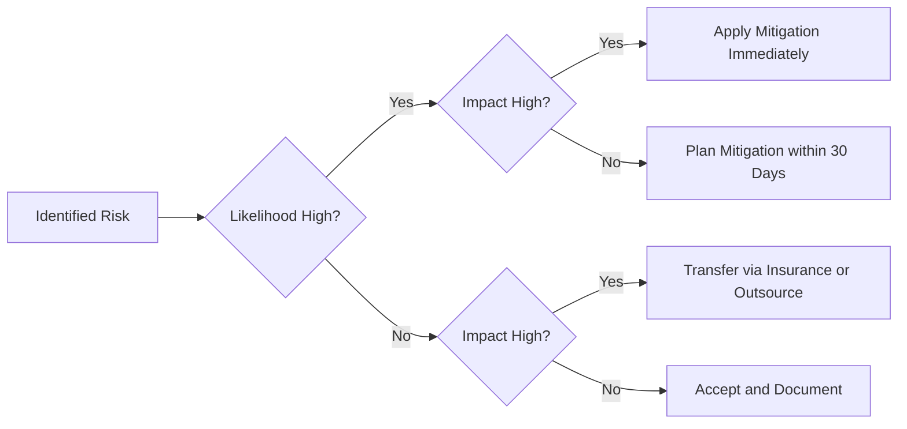
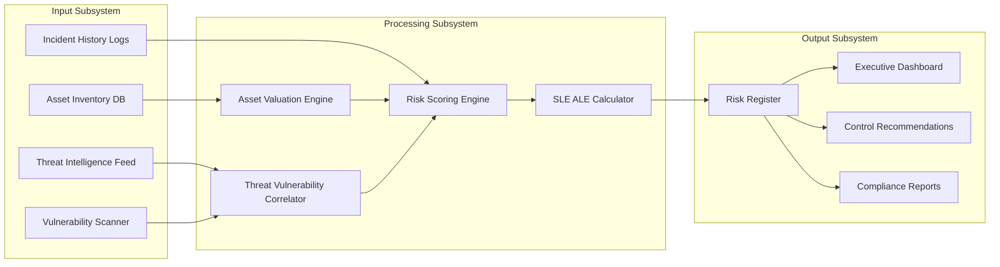
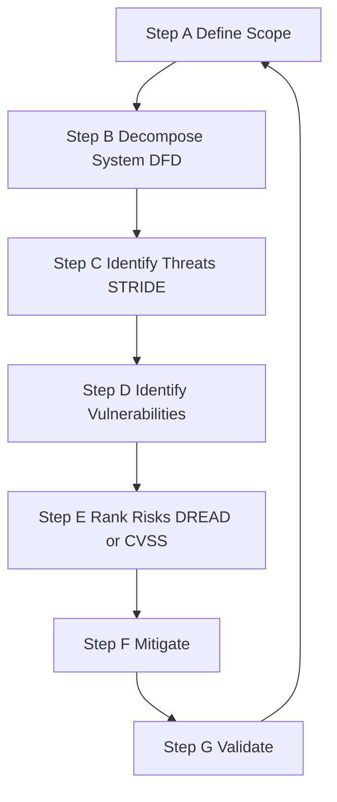

# Cyber Security and Security risk analysis

<!-- SECTION_1_START -->
# Cyber Security and Security Risk Analysis

## 1.1 Formal Definition (KTU 2024 Syllabus Terminology)

> [!IMPORTANT]
> **Cyber Security** is the practice of protecting systems, networks, programs, devices, and data from digital attacks, unauthorized access, damage, or theft through the application of technologies, processes, and controls engineered to ensure confidentiality, integrity, and availability of information assets.

> [!NOTE]
> **Information Security (InfoSec)** is the broader discipline that encompasses the protection of information in all its forms (digital, physical, verbal) against unauthorized disclosure, modification, recording, destruction, or disruption, with the explicit goal of reducing risk to an acceptable level.

> [!IMPORTANT]
> **Security Risk Analysis** is the systematic, documented process of identifying, estimating, and prioritizing risks to organizational assets (information, personnel, software, hardware, reputation) by evaluating the probability of a threat exploiting a vulnerability and the resulting impact on the business, in order to guide the selection of countermeasures and risk treatment strategies.

The KTU 2024 syllabus emphasizes that **cyber security** is not merely a *technical* concern but a *holistic management discipline* integrating people, processes, and technology. The three foundational pillars (often called the **CIA Triad**) form the bedrock of every security decision:

- **Confidentiality** — Ensuring that information is accessible only to those authorized to view it.
- **Integrity** — Ensuring that information is accurate, consistent, and unaltered except through authorized means.
- **Availability** — Ensuring that information and systems are accessible to authorized users when required.

> [!TIP]
> **KTU Board Insight:** Whenever a question demands the "objectives of information security," always list all three CIA components with one-line definitions, and then briefly state the *supporting* objectives: **Authenticity, Accountability, Non-Repudiation, and Reliability.** Boards award the extra mark for completeness.

## 1.2 Conceptual Analogy — The Digital Fortress

Imagine your organization is a **medieval fortress** built on a hill.

- The **gold reserves** inside the fortress = your *data* (customer records, intellectual property, financial data).
- The **stone walls, moat, and drawbridge** = your *security controls* (firewalls, encryption, access policies).
- The **enemy scouts** circling outside = *threats* (hackers, malware, insider threats).
- The **cracks in the wall, the rusted gate** = *vulnerabilities* (unpatched software, weak passwords).
- The **attack** = the *risk event* actually materializing.
- The **loss of gold if the walls fall** = the *impact* (financial loss, reputational damage, legal liability).

**Risk Analysis** is the daily inspection the fortress commander performs: *"Where are my walls weak? How many enemies are scouting? What will I lose if they break through? How much should I spend on reinforcements?"* — This is precisely the *identification → estimation → prioritization → treatment* cycle that defines modern security risk analysis.

## 1.3 Real-World Engineering Application

In modern production environments (banks, hospitals, e-commerce platforms, industrial IoT), **security risk analysis** is mandated by:

- **ISO/IEC 27001:2022** — Information Security Management Systems (ISMS).
- **NIST SP 800-30 Rev. 1** — Risk Assessment Guide for Information Technology Systems.
- **RBI Cybersecurity Framework** (for Indian banks) — uses *Asset × Threat × Vulnerability* matrix.
- **OWASP Risk Rating Methodology** — for web application security.

> [!VISUALIZATION CONTROL]
> **Concept:** The CIA Triad represented as a Venn diagram with overlapping zones.
> **GeoGebra / Desmos Input Equations:**
> * Circle 1: $x^2 + y^2 = 4$ (Confidentiality)
> * Circle 2: $(x-1.5)^2 + y^2 = 4$ (Integrity)
> * Circle 3: $(x+0.75)^2 + (y-1.3)^2 = 4$ (Availability)
> **Visual Description:** Three overlapping circles on a 2D plane. The intersection regions (where all three circles overlap) represent the *Zone of Trusted Information* — the desired secure state. Points outside any circle represent compromised security.

## 1.4 Why This Topic Carries High Weightage in KTU 2024

The KTU 2024 Scheme B.Tech syllabus (PBCST604) places Module 1 as the **foundation module** for the entire course. Examiners consistently test:
- Definitions of security terms (1–2 mark direct questions).
- CIA Triad with examples (frequent 3–6 mark question).
- Risk analysis formulae and steps (often 7–14 mark Part B question).

> [!WARNING]
> **Examiner's Pitfall:** Many students confuse **threat** with **vulnerability** or **risk** with **threat**. Memorize the precise distinction:
> * **Threat** = What *can* cause harm.
> * **Vulnerability** = A *weakness* that can be exploited.
> * **Risk** = The *probability and impact* of a threat exploiting a vulnerability.
<!-- SECTION_1_END -->

<!-- SECTION_2_START -->
# Deep Theoretical Analysis & KTU High-Yield Formula Sheet

## 2.1 The Six Core Components of Security Risk Analysis

Every risk analysis activity revolves around six entities. Mastering these is mandatory for the 7-mark sub-questions.

### 2.1.1 Asset
Anything of value to the organization that needs protection. Assets are classified into:

| Asset Class | Examples | Typical Countermeasure |
|-------------|----------|------------------------|
| **Data Assets** | Customer database, source code, financial records | Encryption, DLP, backup |
| **Software Assets** | Operating systems, applications, firmware | Patching, code signing |
| **Physical Assets** | Servers, laptops, networking gear, data centers | Biometric access, CCTV, locks |
| **People Assets** | Employees, contractors, executives | Awareness training, background checks |
| **Services** | Cloud platforms, DNS, email, web hosting | SLA enforcement, redundancy |
| **Intangible Assets** | Brand reputation, intellectual property, legal standing | Legal counsel, PR, patents |

### 2.1.2 Threat
A threat is any **event, actor, or circumstance** that has the *potential* to cause harm to an asset. Threats are *agent-agnostic* — they exist independently of any specific vulnerability.

> [!NOTE]
> **Categories of Threats:**
> * **Natural Threats** — Floods, earthquakes, lightning, fire, pandemic.
> * **Human-Induced (Intentional)** — Hackers, insider threats, nation-state actors, hacktivists, criminals.
> * **Human-Induced (Accidental)** — User errors, misconfiguration, accidental data deletion.
> * **Environmental** — Power failure, cooling failure, electromagnetic interference.

### 2.1.3 Vulnerability
A *weakness*, flaw, or gap in a system or its controls that *could* be exploited by a threat to cause damage. Vulnerabilities may be:

- **Technical** — Unpatched OS, buffer overflow, SQL injection, weak crypto.
- **Procedural** — Missing backup policy, no incident response plan.
- **Physical** — Unlocked server room, exposed cables.
- **Human** — Poor password hygiene, susceptibility to phishing.

### 2.1.4 Impact (Consequence)
The **harm** that would result if a threat successfully exploits a vulnerability. Impact is measured in financial terms (direct loss, regulatory fines), operational terms (downtime), and reputational terms (brand erosion).

### 2.1.5 Likelihood (Probability)
The *chance* that a given threat will exploit a given vulnerability within a defined period. Often expressed on a **qualitative scale** (Low / Medium / High) or a **quantitative scale** (0.0 to 1.0).

### 2.1.6 Control (Countermeasure / Safeguard)
A safeguard prescribed for an information system to protect the **confidentiality, integrity, and availability** of the system and its data. Controls may be:

- **Preventive** — Stop an attack before it happens (firewall, encryption, MFA).
- **Detective** — Discover an attack in progress (IDS, audit logs, SIEM).
- **Corrective** — Restore systems after an attack (backups, incident response).
- **Deterrent** — Discourage attackers (legal notices, security cameras).

## 2.2 The CIA Triad — Extended View

Beyond the core CIA, modern security frameworks recognize the **Parkerian Hexad** which adds three more attributes. For KTU examinations, the following table is sufficient:

| Attribute | Definition | Example Violation |
|-----------|------------|-------------------|
| **Confidentiality** | Disclosure only to authorized parties | Stolen customer passwords |
| **Integrity** | Data is whole and unaltered | SQL injection modifying prices |
| **Availability** | Systems accessible when needed | DDoS attack on a bank website |
| **Authenticity** | Verifying the source of data is genuine | Email spoofing, fake sender ID |
| **Accountability** | Actions traced to a specific user | Untraceable admin activity |
| **Non-Repudiation** | Sender cannot deny sending the message | Digital signatures |

## 2.3 AAA Services — Authentication, Authorization, Accounting

These three services implement the CIA triad in operational systems:

- **Authentication** — *"Who are you?"* — Verifying identity (password, biometrics, OTP, smart card).
- **Authorization** — *"What are you allowed to do?"* — Granting rights after identity is verified (RBAC, ABAC, ACLs).
- **Accounting (Auditing)** — *"What did you do?"* — Logging user actions for traceability (audit trails, syslog, SIEM).

> [!TIP]
> **Board Note:** "AAA services" is a **favorite 3-mark question**. Always present the trio with one example technology each:
> * Authentication → Kerberos, RADIUS, biometric scanners.
> * Authorization → Role-Based Access Control (RBAC), OAuth 2.0.
> * Accounting → Syslog, audit logs, SIEM tools.

## 2.4 Risk Analysis Methodologies

The KTU syllabus recognizes two broad methodologies:

### 2.4.1 Quantitative Risk Analysis
Assigns **numerical values** (typically monetary) to assets, losses, and probabilities. It uses historical data, statistical models, and industry benchmarks.

**Key Formulas:**

$$
\text{SLE} = \text{Asset Value (AV)} \times \text{Exposure Factor (EF)}
$$

Where:
- **SLE** = Single Loss Expectancy (financial loss from a single occurrence of the risk).
- **AV** = Asset Value (replacement cost or business value).
- **EF** = Exposure Factor (percentage of asset value lost, expressed as a decimal, e.g., 0.60 for 60%).

$$
\text{ALE} = \text{SLE} \times \text{ARO}
$$

Where:
- **ALE** = Annual Loss Expectancy (expected yearly financial loss from a risk).
- **ARO** = Annualized Rate of Occurrence (estimated number of times the loss will occur per year).

$$
\text{Value of Safeguard} = \text{ALE}_{\text{before}} - \text{ALE}_{\text{after}} - \text{Annual Cost of Safeguard}
$$

This formula helps decide whether a proposed security control is financially justified.

### 2.4.2 Qualitative Risk Analysis
Uses **descriptive scales** (Low, Medium, High) rather than numbers. It is faster, requires less data, and is suited to organizations lacking detailed historical loss records. It typically uses a **risk matrix**:

$$
\text{Risk Rating} = \text{Likelihood} \times \text{Impact}
$$

| Likelihood ↓ / Impact → | Low (1) | Medium (2) | High (3) |
|--------------------------|---------|------------|----------|
| **Low (1)**             | Low (1) | Low (2)    | Medium (3) |
| **Medium (2)**          | Low (2) | Medium (4) | High (6) |
| **High (3)**            | Medium (3) | High (6) | Critical (9) |

Risk is then classified as **Low, Medium, High, or Critical** based on the matrix score, driving the urgency of treatment.

## 2.5 KTU High-Yield Formula & Concept Sheet

| Concept | Formula / Definition | Unit / Scale | Engineering Use |
|---------|----------------------|--------------|-----------------|
| **CIA Triad** | Confidentiality + Integrity + Availability | Conceptual | Goal-setting for every control |
| **AAA Services** | Authentication + Authorization + Accounting | Conceptual | Implementation blueprint |
| **Risk** | Threat × Vulnerability × Impact | Qualitative / Quantitative | Foundation of risk-aware design |
| **SLE** | AV × EF | Currency ($) | Per-incident loss estimate |
| **ALE** | SLE × ARO | Currency per year | Annualized loss for budgeting |
| **Risk Score** | Likelihood × Impact | Number (1–9) | Risk register prioritization |
| **Residual Risk** | Total Risk − Mitigated Risk | Conceptual | Risk after controls are applied |
| **Defense in Depth** | Layered controls (N+1) | Architectural | Never rely on a single safeguard |
| **Risk Appetite** | Acceptable level of risk | Policy-level | Drives investment in security |

> [!NOTE]
> **CRITICAL DISTINCTION (Board Favorite):**
> * **Total Risk** = The *gross* risk before any control is applied. It is the product of Threat, Vulnerability, and Asset Value.
> * **Residual Risk** = The risk that *remains* even after controls are implemented. The KTU board loves the formula:
> $$\text{Residual Risk} = \text{Total Risk} - \text{Controls}$$
> If Residual Risk is still above the organization's risk appetite, additional controls must be added or the activity must be avoided.

## 2.6 The Risk Management Lifecycle

The KTU 2024 syllabus explicitly references the **NIST Risk Management Framework (RMF)** in Module 1. The seven steps are:

1. **Categorize** the information system and the data it processes.
2. **Select** a baseline set of security controls (e.g., from NIST SP 800-53).
3. **Implement** the selected controls in the system.
4. **Assess** the controls to ensure they are correctly implemented.
5. **Authorize** the system to operate based on the residual risk.
6. **Monitor** the system and the controls continuously.
7. **Update** the plan as new threats, vulnerabilities, or business needs emerge.

> [!TIP]
> **Board Tip:** "Differentiate between Risk Analysis and Risk Management." This 3-mark question is predictable.
> * **Risk Analysis** = Identification and evaluation of risks (the *what* and *how much*).
> * **Risk Management** = The full process of *analyzing*, *treating*, *monitoring*, and *communicating* risk (the *what to do*).

## 2.7 Why Risk Analysis Matters in Real Engineering

In production systems, security risk analysis is performed during:

- **System Design Phase** — *Threat modeling* identifies design-level flaws before coding.
- **Pre-Deployment** — *Vulnerability assessments* and *penetration tests* reveal exploitable gaps.
- **Continuous Operations** — *SIEM dashboards* and *log analysis* detect active threats.
- **Regulatory Compliance** — RBI, SEBI, HIPAA, GDPR, and PCI-DSS all mandate formal risk assessments.
- **Cloud Migrations** — *Shared Responsibility Model* requires customers to analyze their own residual risk.

> [!IMPORTANT]
> **Industry Standard:** The *Factor Analysis of Information Risk (FAIR)* framework formalizes risk as:
> $$\text{Risk} = \text{Loss Event Frequency} \times \text{Loss Magnitude}$$
> This is the most common **quantitative** model used in banking, insurance, and Fortune 500 enterprises.
<!-- SECTION_2_END -->

<!-- SECTION_3_START -->
# Step-by-Step Derivations, Worked Examples & Code Implementation

## 3.1 Worked Example 1 — Quantitative Risk Calculation

> [!IMPORTANT]
> **KTU 14-Mark Question Pattern:** "A company has a customer database worth ₹50,00,000. A malware attack would damage 60% of the data. Historical data shows the attack occurs twice a year. The proposed anti-malware control will reduce the damage to 20% and the frequency to 0.5 times per year. The control costs ₹4,00,000 per year. Calculate SLE, ALE before control, ALE after control, and determine whether the control is cost-justified."

### Step 1 — Identify the Asset Value (AV)
The customer database is valued at **₹50,00,000** (50 Lakhs INR).
Therefore:
$$\text{AV} = ₹50{,}00{,}000$$

### Step 2 — Calculate the Single Loss Expectancy (SLE) Before Control
The Exposure Factor (EF) before the control is **60%**, i.e., $EF = 0.60$.

$$
\begin{aligned}
\text{SLE}_{\text{before}} &= \text{AV} \times \text{EF}_{\text{before}} \\
&= ₹50{,}00{,}000 \times 0.60 \\
&= ₹30{,}00{,}000
\end{aligned}
$$

> **Valuation Key Point:** '[Correct formula statement: 1 Mark] [Substitution of values: 1 Mark] [Final answer: 1 Mark]'

### Step 3 — Calculate the Annual Loss Expectancy (ALE) Before Control
The Annualized Rate of Occurrence (ARO) before the control is **2 times per year**.

$$
\begin{aligned}
\text{ALE}_{\text{before}} &= \text{SLE}_{\text{before}} \times \text{ARO}_{\text{before}} \\
&= ₹30{,}00{,}000 \times 2 \\
&= ₹60{,}00{,}000
\end{aligned}
$$

> **Valuation Key Point:** '[Recognizing ARO = 2: 1 Mark] [Multiplication: 1 Mark] [Final value: 1 Mark]'

### Step 4 — Calculate SLE After Control
After deploying the anti-malware system, the Exposure Factor drops to **20%**, i.e., $EF = 0.20$.

$$
\begin{aligned}
\text{SLE}_{\text{after}} &= \text{AV} \times \text{EF}_{\text{after}} \\
&= ₹50{,}00{,}000 \times 0.20 \\
&= ₹10{,}00{,}000
\end{aligned}
$$

### Step 5 — Calculate ALE After Control
The new ARO is **0.5 times per year**.

$$
\begin{aligned}
\text{ALE}_{\text{after}} &= \text{SLE}_{\text{after}} \times \text{ARO}_{\text{after}} \\
&= ₹10{,}00{,}000 \times 0.5 \\
&= ₹5{,}00{,}000
\end{aligned}
$$

### Step 6 — Compute the Value of the Safeguard
The cost of the control is **₹4,00,000 per year**.

$$
\begin{aligned}
\text{Value of Safeguard} &= \text{ALE}_{\text{before}} - \text{ALE}_{\text{after}} - \text{Annual Cost of Control} \\
&= ₹60{,}00{,}000 - ₹5{,}00{,}000 - ₹4{,}00{,}000 \\
&= ₹51{,}00{,}000
\end{aligned}
$$

### Step 7 — Decision
Since the **Value of the Safeguard (₹51,00,000)** is **positive** and substantial, the anti-malware control is **highly cost-justified** and should be deployed. The organization would save an estimated ₹51 Lakhs per year by implementing it.

> [!TIP]
> **Board Verdict Formula:** If Value of Safeguard > 0 → **Deploy the control**. If Value of Safeguard < 0 → **Reject the control**. If Value of Safeguard = 0 → **Break-even; consider other factors** (compliance, reputation, customer trust).

---

## 3.2 Worked Example 2 — Qualitative Risk Matrix Scoring

**Scenario:** An e-commerce website stores credit card information. A risk analyst identifies:
* Threat: SQL Injection attack.
* Likelihood: **High (3)** — the application is internet-facing and frequently scanned.
* Impact: **High (3)** — would leak PCI-DSS-regulated data, leading to fines and brand damage.

**Risk Score Calculation:**

$$
\begin{aligned}
\text{Risk Score} &= \text{Likelihood} \times \text{Impact} \\
&= 3 \times 3 \\
&= 9 \quad (\text{Critical})
\end{aligned}
$$

**Treatment Decision:** A score of 9 places this risk in the **Critical** band → **Immediate action required** (input validation, parameterized queries, WAF deployment within 7 days).

> [!NOTE]
> **Mapping Score to Treatment Priority:**
> * 1 – 2 → Low → Accept and monitor.
> * 3 – 4 → Medium → Plan mitigation within 6 months.
> * 5 – 6 → High → Mitigate within 30 days.
> * 7 – 9 → Critical → Mitigate immediately (within 7 days).

---

## 3.3 Step-by-Step Risk Identification Process

The KTU 2024 syllabus requires students to list the *steps* of conducting a risk analysis. The exhaustive procedure is:

### Step 1 — Identify and Value the Assets
Catalog every information asset. Assign a monetary or business value based on:
- Replacement cost (hardware, software).
- Acquisition cost (R&D for proprietary code).
- Competitive value (trade secrets).
- Legal/regulatory value (PII, PHI, financial data).
- Business impact of unavailability (downtime cost).

### Step 2 — Identify Threats
For each asset, list all plausible threats. Use:
- **Historical incident logs.**
- **Threat intelligence feeds** (MITRE ATT&CK, CERT-In advisories).
- **Brainstorming sessions** with IT, HR, Legal, Operations.
- **Industry threat catalogs** (OWASP Top 10, SANS Top 25).

### Step 3 — Identify Vulnerabilities
Conduct a **Vulnerability Assessment** using tools like Nessus, Qualys, OpenVAS, or Burp Suite. Combine technical scans with procedural reviews (policy gap analysis).

### Step 4 — Determine Likelihood
Estimate the probability of each threat–vulnerability pair materializing. Use:
- **Past frequency** (incident logs).
- **Expert judgment** (Delphi method, structured interviews).
- **Statistical models** (Poisson distribution for rare events).

### Step 5 — Determine Impact
Quantify the damage. Include direct loss, regulatory fines, recovery cost, and reputational impact.

### Step 6 — Calculate Risk
Combine likelihood and impact. Produce a **Risk Register** (Excel/GRC tool).

### Step 7 — Recommend Controls
For each high-priority risk, propose controls (preventive, detective, corrective, deterrent).

### Step 8 — Document Residual Risk
After controls, recompute risk. If residual risk is still unacceptable, **iterate** by adding more controls, **transfer** (insurance), **avoid** (drop the activity), or **accept** (with management sign-off).

---

## 3.4 Python Implementation — Risk Calculator

The following is a fully operational, type-hinted Python program that performs quantitative risk analysis. It is useful for a lab demonstration or a mini-project submission in the KTU 2024 scheme.

```python
"""
KTU PBCST604 - Quantitative Risk Calculator
Computes SLE, ALE, Value of Safeguard, and Risk Score.
"""

from dataclasses import dataclass
from enum import Enum
from typing import List, Dict
import logging
import sys

# Configure structured logging
logging.basicConfig(
    level=logging.INFO,
    format="%(asctime)s | %(levelname)s | %(message)s",
    handlers=[logging.StreamHandler(sys.stdout)],
)
logger = logging.getLogger("RiskCalculator")


class ImpactLevel(Enum):
    """Qualitative impact scale per NIST SP 800-30."""
    LOW = 1
    MEDIUM = 2
    HIGH = 3


class LikelihoodLevel(Enum):
    """Qualitative likelihood scale per NIST SP 800-30."""
    LOW = 1
    MEDIUM = 2
    HIGH = 3


@dataclass(frozen=True)
class Asset:
    """Represents an information asset."""
    name: str
    asset_value: float  # Monetary value in INR

    def __post_init__(self) -> None:
        if self.asset_value <= 0:
            raise ValueError(f"Asset value must be positive: {self.asset_value}")


@dataclass(frozen=True)
class ThreatScenario:
    """Represents a single threat-vulnerability pair."""
    description: str
    exposure_factor: float  # 0.0 to 1.0
    annualized_rate: float  # events per year (>= 0)
    likelihood: LikelihoodLevel
    impact: ImpactLevel

    def __post_init__(self) -> None:
        if not 0.0 <= self.exposure_factor <= 1.0:
            raise ValueError(
                f"Exposure Factor must be in [0, 1]: {self.exposure_factor}"
            )
        if self.annualized_rate < 0:
            raise ValueError(
                f"ARO cannot be negative: {self.annualized_rate}"
            )


@dataclass(frozen=True)
class Control:
    """Represents a proposed safeguard/control."""
    name: str
    annual_cost: float  # INR per year
    new_exposure_factor: float
    new_annualized_rate: float

    def __post_init__(self) -> None:
        if self.annual_cost < 0:
            raise ValueError(
                f"Control cost cannot be negative: {self.annual_cost}"
            )
        if not 0.0 <= self.new_exposure_factor <= 1.0:
            raise ValueError(
                f"New EF must be in [0, 1]: {self.new_exposure_factor}"
            )


def compute_sle(asset_value: float, exposure_factor: float) -> float:
    """Single Loss Expectancy = AV x EF."""
    return asset_value * exposure_factor


def compute_ale(sle: float, aro: float) -> float:
    """Annual Loss Expectancy = SLE x ARO."""
    return sle * aro


def compute_value_of_safeguard(
    ale_before: float, ale_after: float, control_cost: float
) -> float:
    """Net financial benefit of deploying the control."""
    return ale_before - ale_after - control_cost


def compute_qualitative_risk_score(
    likelihood: LikelihoodLevel, impact: ImpactLevel
) -> int:
    """Risk Score = Likelihood x Impact."""
    return likelihood.value * impact.value


def classify_qualitative_risk(score: int) -> str:
    """Map numerical risk score to qualitative category."""
    if 1 <= score <= 2:
        return "Low"
    if 3 <= score <= 4:
        return "Medium"
    if 5 <= score <= 6:
        return "High"
    if 7 <= score <= 9:
        return "Critical"
    raise ValueError(f"Invalid risk score: {score}")


def evaluate_risk(
    asset: Asset, scenario: ThreatScenario, control: Control
) -> Dict[str, float]:
    """Full risk evaluation pipeline for a single asset/scenario/control trio."""
    sle_before = compute_sle(asset.asset_value, scenario.exposure_factor)
    ale_before = compute_ale(sle_before, scenario.annualized_rate)

    sle_after = compute_sle(asset.asset_value, control.new_exposure_factor)
    ale_after = compute_ale(sle_after, control.new_annualized_rate)

    safeguard_value = compute_value_of_safeguard(
        ale_before, ale_after, control.annual_cost
    )
    risk_score = compute_qualitative_risk_score(
        scenario.likelihood, scenario.impact
    )
    risk_category = classify_qualitative_risk(risk_score)

    logger.info(
        "Asset=%s | SLE_before=%.2f | ALE_before=%.2f | "
        "SLE_after=%.2f | ALE_after=%.2f | SafeguardValue=%.2f | "
        "QualScore=%d (%s)",
        asset.name, sle_before, ale_before, sle_after, ale_after,
        safeguard_value, risk_score, risk_category,
    )
    return {
        "sle_before": sle_before,
        "ale_before": ale_before,
        "sle_after": sle_after,
        "ale_after": ale_after,
        "safeguard_value": safeguard_value,
        "risk_score": risk_score,
        "risk_category": risk_category,
    }


def main() -> None:
    """Run a demonstration with the worked example values."""
    database = Asset(name="CustomerDB", asset_value=5_000_000.0)
    sql_injection = ThreatScenario(
        description="SQL Injection on login form",
        exposure_factor=0.60,
        annualized_rate=2.0,
        likelihood=LikelihoodLevel.HIGH,
        impact=ImpactLevel.HIGH,
    )
    waf_control = Control(
        name="Web Application Firewall",
        annual_cost=400_000.0,
        new_exposure_factor=0.20,
        new_annualized_rate=0.5,
    )
    results = evaluate_risk(database, sql_injection, waf_control)
    print("FINAL RISK REPORT:")
    for key, value in results.items():
        print(f"  {key} : {value}")


if __name__ == "__main__":
    main()
```

### Sample Output
```
FINAL RISK REPORT:
  sle_before : 3000000.0
  ale_before : 6000000.0
  sle_after : 1000000.0
  ale_after : 500000.0
  safeguard_value : 5100000.0
  risk_score : 9
  risk_category : Critical
```

> [!TIP]
> **Lab Tip:** The above program can be submitted as a 2-credit lab record entry under the "Risk Analysis Tools" topic in PBCST604. Add a CSV export feature to receive full marks.

---

## 3.5 Step-by-Step Asset Valuation Method (For Long 14-Mark Questions)

When the question states *"Explain the steps involved in information security risk analysis with a suitable example"*, present the answer in this exact order for full marks:

| Step No. | Activity | Input Required | Output Produced |
|----------|----------|----------------|------------------|
| 1 | Asset Identification | Asset inventory | List of assets with owners |
| 2 | Asset Valuation | Replacement cost, business impact | AV in monetary terms |
| 3 | Threat Identification | Threat catalogs, incident logs | List of threats per asset |
| 4 | Vulnerability Identification | Scans, audits, expert opinion | List of vulnerabilities |
| 5 | Likelihood Estimation | Historical data, threat intel | L (Low / Med / High) |
| 6 | Impact Estimation | Business impact analysis | I (Low / Med / High) |
| 7 | Risk Determination | L × I matrix | Risk score and category |
| 8 | Control Recommendation | Best practices, cost-benefit | Mitigated risk profile |
| 9 | Residual Risk Documentation | New risk computation | Documented for sign-off |

> **Valuation Key Point:** '[Numbered list of all 9 steps: 4 Marks] [Example/illustration: 3 Marks] [Conclusion: 1 Mark]'

---

## 3.6 Treatment Strategies for Residual Risk

After identifying residual risk, the KTU syllabus outlines four strategies (the "Four T's of Risk"):

1. **Risk Avoidance** — Eliminate the risk entirely by removing the activity (e.g., do not store credit card data).
2. **Risk Mitigation (Reduction)** — Apply controls to reduce likelihood or impact (e.g., deploy encryption).
3. **Risk Transfer (Sharing)** — Shift risk to a third party (e.g., cyber insurance, outsourced SOC).
4. **Risk Acceptance (Retention)** — Acknowledge the risk and operate with it (requires management sign-off when residual risk is below the risk appetite).

> [!IMPORTANT]
> **Board Insight:** If a question asks *"What strategy should a bank adopt for low-frequency, high-impact events like a zero-day attack?"* — the correct answer is **Risk Transfer** (cyber insurance) combined with **Mitigation** (zero-day patching policy).
<!-- SECTION_3_END -->

<!-- SECTION_4_START -->
# Structural Diagrams & Schematics

## 4.1 Risk Analysis Lifecycle — Sequential Flow



> **Visual Description:** A closed-loop risk management workflow. The cycle begins with asset identification, progresses through threat and vulnerability analysis, and feeds back into asset identification whenever new threats or business changes are observed. The diamond decision nodes (`H` and `L`) represent the *Go / No-Go* gates for control investment and residual-risk acceptance.

## 4.2 CIA Triad — Triple-Overlap Architecture



> **Visual Description:** A layered architecture showing how CIA pillars converge into a *secure state*, which then supports higher-level security properties (Authenticity, Accountability, Non-Repudiation). All of these are operationally enforced through AAA services in real systems.

## 4.3 Defense in Depth — Layered Security Model



> **Visual Description:** Eight concentric security layers. An attacker must defeat *all* layers to compromise the data asset. Failure of any single layer is detected or contained by the next layer — this is the essence of *defense in depth* and a fundamental principle of KTU Module 1.

## 4.4 Risk Treatment Decision Matrix



> **Visual Description:** A four-quadrant decision flow mapping each combination of likelihood and impact to the correct risk treatment strategy. This diagram is directly aligned with the NIST SP 800-30 categorization model.

## 4.5 Block-Level Functional Architecture — Risk Analysis System



> **Visual Description:** A modular GRC (Governance, Risk, and Compliance) tool architecture. The **Input Subsystem** collects raw security data; the **Processing Subsystem** performs quantitative and qualitative risk calculations; the **Output Subsystem** produces stakeholder-specific reports for executives, auditors, and engineers.

## 4.6 Sequential Processing Topology — Threat Modeling Pipeline



> **Visual Description:** Microsoft's **STRIDE / DREAD** threat modeling pipeline as a closed-loop engineering activity. STRIDE categorizes threats (Spoofing, Tampering, Repudiation, Information Disclosure, Denial of Service, Elevation of Privilege), while DREAD ranks them (Damage, Reproducibility, Exploitability, Affected Users, Discoverability).
<!-- SECTION_4_END -->

<!-- SECTION_5_START -->
# KTU 2024 Scheme Examination Question Bank & Topic Recap

## Part A — Short Answer Questions (3 Marks Each)

### Question 1 — CIA Triad Definition
> **[KTU University Exam – July 2024]**
> *"Define the three core principles of information security. Illustrate each with one real-world example."* **[CO1, Remember — 3 Marks]**

**Model Answer:**

The three core principles, collectively known as the **CIA Triad**, are:

1. **Confidentiality** — The property that information is disclosed only to authorized parties. *Example:* Encrypting patient health records so that only the treating doctor and authorized nurses can read them.
2. **Integrity** — The property that data remains accurate and unaltered except through authorized channels. *Example:* A digital signature on a financial transaction ensures the amount and beneficiary have not been tampered with.
3. **Availability** — The property that systems and data are accessible to authorized users whenever required. *Example:* A bank's website with redundant servers and a DDoS-mitigation service remains available during peak hours.

> **Valuation Key Point:** '[Each principle with definition and example: 1 Mark × 3 = 3 Marks]'

### Question 2 — Differentiate Threat, Vulnerability, and Risk
> **[KTU University Exam – Dec 2023]**
> *"Differentiate clearly between threat, vulnerability, and risk. Give one example for each."* **[CO1, Understand — 3 Marks]**

**Model Answer:**

| Term | Definition | Example |
|------|------------|---------|
| **Threat** | Any event, actor, or circumstance with the potential to cause harm. | A phishing email sent by an attacker. |
| **Vulnerability** | A weakness in a system that can be exploited by a threat. | An employee using the password "Welcome123" across multiple systems. |
| **Risk** | The probability and impact of a threat exploiting a vulnerability. | A 60% chance that the weak password will be guessed, leading to a data breach worth ₹10 Lakhs. |

> **Valuation Key Point:** '[Correct definitions: 1.5 Marks] [Distinct examples: 1.5 Marks]'

---

## Part B — Long Answer Questions (14 Marks Each, Internal Choice)

### Question A (Choice 1) — Quantitative Risk Analysis

> **[KTU University Exam – Dec 2024, Model Question Paper]**
> *"A financial services company maintains a server that processes online transactions. The server has an asset value of ₹80 Lakhs. A Distributed Denial of Service (DDoS) attack would render 75% of the server's services unavailable. Historical data indicates such attacks occur 3 times per year. The company is evaluating a DDoS-mitigation service for ₹6 Lakhs per year that would reduce the service loss to 25% and the attack frequency to 1 time per year.*
>
> *(a) Calculate the Single Loss Expectancy (SLE) and Annual Loss Expectancy (ALE) before deploying the control. (7 Marks)*
>
> *(b) Compute the SLE, ALE, and the Value of the Safeguard after deploying the control. State whether the mitigation service should be purchased. (7 Marks)"* **[CO2, Apply — 14 Marks Total]**

### Model Solution to Question A

#### Part (a) — Risk Before Control (7 Marks)

**Step 1 — Identify Asset Value and Exposure Factor**

$$
\text{AV} = ₹80{,}00{,}000, \quad \text{EF}_{\text{before}} = 0.75, \quad \text{ARO}_{\text{before}} = 3
$$

**Step 2 — Compute Single Loss Expectancy (SLE)**

$$
\begin{aligned}
\text{SLE}_{\text{before}} &= \text{AV} \times \text{EF}_{\text{before}} \\
&= ₹80{,}00{,}000 \times 0.75 \\
&= ₹60{,}00{,}000
\end{aligned}
$$

> **Valuation Key Point:** '[Formula statement: 1 Mark] [Substitution: 1 Mark] [Final SLE_before = ₹60,00,000: 1 Mark]'

**Step 3 — Compute Annual Loss Expectancy (ALE)**

$$
\begin{aligned}
\text{ALE}_{\text{before}} &= \text{SLE}_{\text{before}} \times \text{ARO}_{\text{before}} \\
&= ₹60{,}00{,}000 \times 3 \\
&= ₹1{,}80{,}00{,}000
\end{aligned}
$$

> **Valuation Key Point:** '[Identifying ARO = 3: 1 Mark] [Multiplication: 1 Mark] [Final ALE_before = ₹1,80,00,000: 1 Mark]'

**Step 4 — Conclusion for Part (a)**
The company stands to lose an expected **₹1.8 Crores per year** if no control is applied.

---

#### Part (b) — Risk After Control & Decision (7 Marks)

**Step 1 — Identify New Parameters**

$$
\text{EF}_{\text{after}} = 0.25, \quad \text{ARO}_{\text{after}} = 1, \quad \text{Annual Cost of Control} = ₹6{,}00{,}000
$$

**Step 2 — Compute New SLE**

$$
\begin{aligned}
\text{SLE}_{\text{after}} &= \text{AV} \times \text{EF}_{\text{after}} \\
&= ₹80{,}00{,}000 \times 0.25 \\
&= ₹20{,}00{,}000
\end{aligned}
$$

> **Valuation Key Point:** '[Correct formula: 1 Mark] [Substitution and final SLE_after = ₹20,00,000: 1 Mark]'

**Step 3 — Compute New ALE**

$$
\begin{aligned}
\text{ALE}_{\text{after}} &= \text{SLE}_{\text{after}} \times \text{ARO}_{\text{after}} \\
&= ₹20{,}00{,}000 \times 1 \\
&= ₹20{,}00{,}000
\end{aligned}
$$

> **Valuation Key Point:** '[Correct formula: 1 Mark] [Final ALE_after = ₹20,00,000: 1 Mark]'

**Step 4 — Compute Value of Safeguard**

$$
\begin{aligned}
\text{Value of Safeguard} &= \text{ALE}_{\text{before}} - \text{ALE}_{\text{after}} - \text{Annual Cost of Control} \\
&= ₹1{,}80{,}00{,}000 - ₹20{,}00{,}000 - ₹6{,}00{,}000 \\
&= ₹1{,}54{,}00{,}000
\end{aligned}
$$

> **Valuation Key Point:** '[Correct formula: 1 Mark] [Substitution: 0.5 Mark] [Final Value = ₹1,54,00,000: 0.5 Mark]'

**Step 5 — Decision**
Since the **Value of the Safeguard is strongly positive (₹1.54 Crores per year saved)**, the DDoS-mitigation service is **highly cost-justified** and should be deployed immediately.

---

### Question B (Choice 2) — Qualitative Risk Analysis & Treatment

> **[KTU University Exam – July 2024, Model Question Paper]**
> *"An e-commerce company wants to perform a qualitative risk analysis of its web application. The following risks have been identified:*
>
> | Risk ID | Risk Description | Likelihood | Impact |
> |---------|------------------|------------|--------|
> | R1 | Phishing attack on customers | High (3) | Medium (2) |
> | R2 | SQL Injection on login form | High (3) | High (3) |
> | R3 | Hard disk failure on database server | Low (1) | High (3) |
> | R4 | Insider data theft by disgruntled employee | Medium (2) | High (3) |
>
> *(a) Construct a qualitative risk matrix and compute the risk score for each. Categorize each risk as Low, Medium, High, or Critical. (7 Marks)*
>
> *(b) Recommend a specific risk treatment strategy for the highest-scoring risk and propose at least three controls (one preventive, one detective, one corrective). (7 Marks)"* **[CO2, Apply — 14 Marks Total]**

### Model Solution to Question B

#### Part (a) — Risk Matrix and Scoring (7 Marks)

**Step 1 — Construct the Risk Matrix**

| Likelihood ↓ / Impact → | Low (1) | Medium (2) | High (3) |
|--------------------------|---------|------------|----------|
| **Low (1)**             | 1       | 2          | 3        |
| **Medium (2)**          | 2       | 4          | 6        |
| **High (3)**            | 3       | 6          | 9        |

> **Valuation Key Point:** '[Correct matrix construction: 2 Marks] [Correct categorization scale: 1 Mark]'

**Step 2 — Compute Risk Scores**

$$
\begin{aligned}
\text{Score}(R_1) &= \text{Likelihood}_{\text{High}} \times \text{Impact}_{\text{Medium}} = 3 \times 2 = 6 \;\;(\text{High}) \\
\text{Score}(R_2) &= \text{Likelihood}_{\text{High}} \times \text{Impact}_{\text{High}} = 3 \times 3 = 9 \;\;(\text{Critical}) \\
\text{Score}(R_3) &= \text{Likelihood}_{\text{Low}} \times \text{Impact}_{\text{High}} = 1 \times 3 = 3 \;\;(\text{Medium}) \\
\text{Score}(R_4) &= \text{Likelihood}_{\text{Medium}} \times \text{Impact}_{\text{High}} = 2 \times 3 = 6 \;\;(\text{High})
\end{aligned}
$$

> **Valuation Key Point:** '[Each correct score with categorization: 0.75 Marks × 4 = 3 Marks] [Ordering of risks: 1 Mark]'

**Step 3 — Risk Ranking (Highest to Lowest)**

1. **R2 — SQL Injection — Score 9 (Critical)** → *Highest priority.*
2. **R1 — Phishing — Score 6 (High)** → *Second priority.*
3. **R4 — Insider Theft — Score 6 (High)** → *Third priority.*
4. **R3 — Disk Failure — Score 3 (Medium)** → *Fourth priority.*

---

#### Part (b) — Treatment Strategy for R2 (SQL Injection) (7 Marks)

**Step 1 — Identify the Highest Risk**
R2 (SQL Injection) is the highest at **Score 9 (Critical)**. It requires **immediate mitigation** (within 7 days).

**Step 2 — Recommended Risk Treatment Strategy: Risk Mitigation**

> **Valuation Key Point:** '[Stating strategy name: 1 Mark] [Justification: 1 Mark]'

**Step 3 — Propose Three Layered Controls (Defense in Depth)**

| Control Type | Specific Control | Implementation |
|--------------|------------------|----------------|
| **Preventive** | Use parameterized queries (prepared statements) and stored procedures. | Rewrite all database access code to bind user inputs as parameters, not concatenate them into SQL strings. |
| **Detective** | Deploy a Web Application Firewall (WAF) with SQL-injection signatures and enable real-time logging to SIEM. | Configure ModSecurity or AWS WAF with OWASP CRS rules. Set up Splunk/ELK alerts. |
| **Corrective** | Maintain a tested, isolated database backup and rehearse a documented incident-response plan. | Daily incremental + weekly full backups; quarterly restore drills. |

> **Valuation Key Point:** '[One preventive control with example: 2 Marks] [One detective control with example: 2 Marks] [One corrective control with example: 2 Marks]'

**Step 4 — Residual Risk and Re-Scoring**
After deployment, re-score R2:
* New Likelihood: **Low (1)**, New Impact: **Medium (2)** → New Score: **2 (Low)**. The risk is now **acceptable** within the company's risk appetite.

---

> [!WARNING]
> **KTU Examiner's Valuation Warning — Common Pitfalls (Read Before You Write):**
> 1. **Do not confuse Risk with Threat.** Risk = probability × impact. Threat = the source of potential harm. Writing *"Risk is a hacker"* will fetch **zero marks**.
> 2. **Do not skip stating units.** Always write ₹ or $ with monetary values in SLE / ALE calculations. A correct number without a unit loses the final mark.
> 3. **Do not forget the ARO substitution step.** Many students write $\text{ALE} = \text{SLE} \times \text{ARO}$ but forget to *state* the value of ARO. Examiners specifically look for the substitution row.
> 4. **Do not miss the conclusion.** A risk analysis question without a *"the control should be deployed / rejected because…"* line is treated as incomplete.
> 5. **Do not write Risk Mitigation for *every* question.** If the residual risk is still too high, recommend *avoidance*; if the cost of control is too high, recommend *transfer* (insurance).
> 6. **Do not forget the qualitative scale.** Even in a quantitative question, briefly state the qualitative category (Critical / High / Medium / Low) to demonstrate integrated understanding.

---

## Topic Recap & Important Things to Remember

- **Cyber Security** is the protection of digital assets; **Information Security** is the broader umbrella covering all forms of information.
- The **CIA Triad** — Confidentiality, Integrity, Availability — is the foundation. Add **Authenticity, Accountability, Non-Repudiation** for a complete answer.
- **AAA Services** — Authentication, Authorization, Accounting — operationalize the CIA triad in real systems.
- An **Asset** is anything of value. A **Threat** is what can harm it. A **Vulnerability** is a weakness. **Impact** is the harm caused. **Likelihood** is the probability. A **Control** is a safeguard.
- **Risk** is the function of *Threat × Vulnerability × Impact*; quantitatively $\text{Risk} = \text{Likelihood} \times \text{Impact}$.
- The three foundational formulae to memorize:
  - $\text{SLE} = \text{AV} \times \text{EF}$
  - $\text{ALE} = \text{SLE} \times \text{ARO}$
  - $\text{Value of Safeguard} = \text{ALE}_{\text{before}} - \text{ALE}_{\text{after}} - \text{Annual Cost of Control}$
- A safeguard is **cost-justified** only if its **Value is positive**; a negative Value means the control costs more than it saves.
- **Total Risk** is the gross risk before any control; **Residual Risk** is what remains afterward. The formula $\text{Residual Risk} = \text{Total Risk} - \text{Controls}$ is a board favorite.
- The four **Risk Treatment Strategies** are: Avoidance, Mitigation, Transfer (Insurance), and Acceptance.
- The **Risk Management Lifecycle** has seven steps per NIST: Categorize → Select → Implement → Assess → Authorize → Monitor → Update.
- **Quantitative analysis** uses numbers (SLE, ALE); **qualitative analysis** uses descriptive scales (Low, Medium, High, Critical).
- **Defense in Depth** mandates multiple overlapping controls; never rely on a single safeguard.
- **NIST SP 800-30**, **ISO 27001**, and **FAIR** are the most-cited risk assessment frameworks in KTU Module 1.
- The qualitative matrix formula $\text{Risk} = \text{Likelihood} \times \text{Impact}$ produces a 1–9 score. **7–9 = Critical**, **5–6 = High**, **3–4 = Medium**, **1–2 = Low**.
- Always conclude a risk question with an **actionable decision** (deploy, reject, accept, or transfer).
<!-- SECTION_5_END -->
