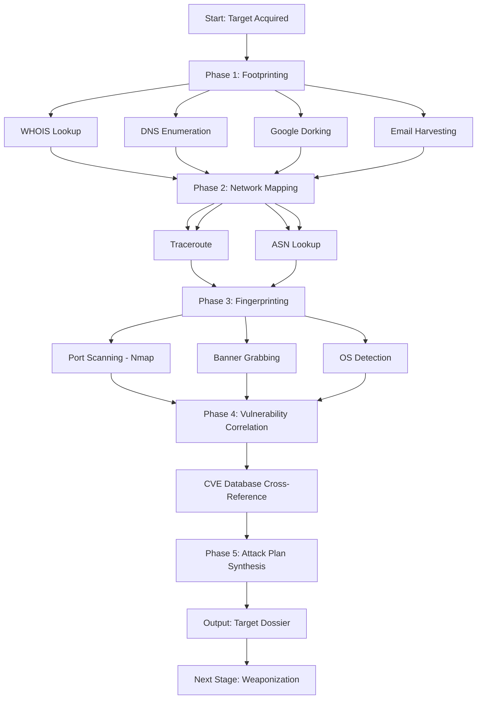
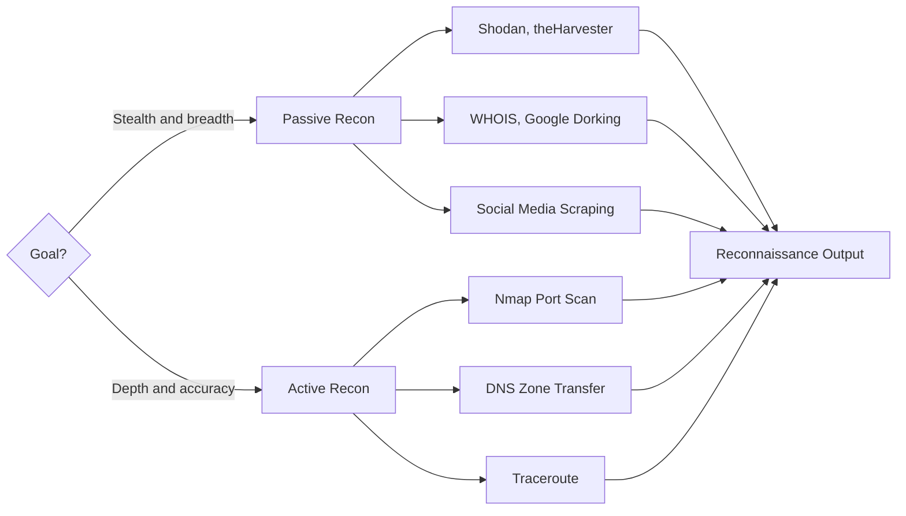
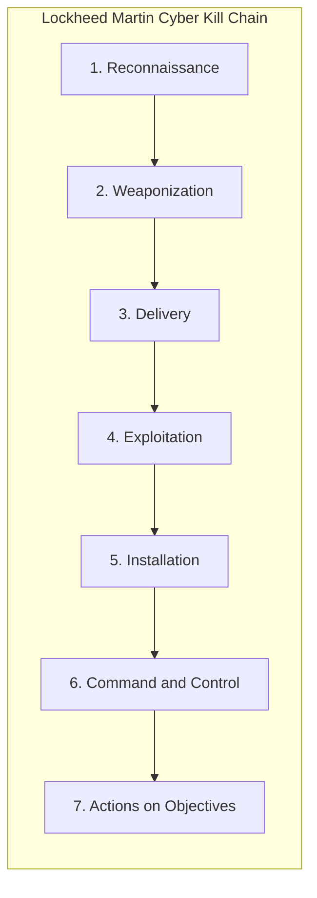
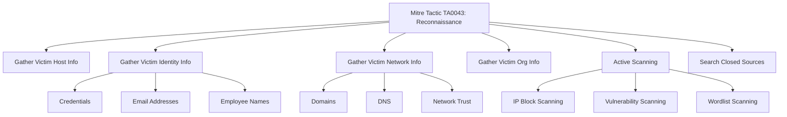
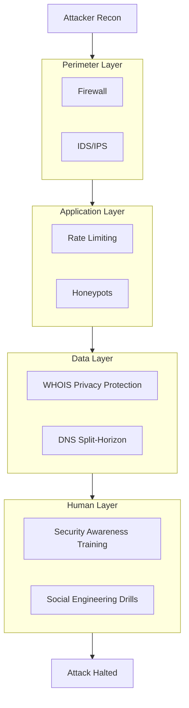

# Information Gathering- Reconnaissance

<!-- SECTION_1_START -->

# Information Gathering & Reconnaissance

## 1.1 Formal Definition (KTU 2024 Aligned)

> [!NOTE]
> **Reconnaissance (Information Gathering)** is the *preliminary phase of a cyber attack* in which an adversary systematically collects as much information as possible about a target system, network, or organization **before launching an exploit**. It is the **first and most critical stage** of the Cyber Kill Chain model (Lockheed Martin, 2011) and is officially mapped under **MITRE ATT\&CK Technique TA0043** (Reconnaissance, tactic ID).

In the **KTU 2024 Scheme syllabus (PBCST604 – Fundamentals of Cyber Security, Module 1)**, reconnaissance is defined as:

> *"The systematic and methodical collection of publicly available and semi-protected data about a target — including network topology, IP ranges, domain ownership, employee details, and software versions — used to build a vulnerability profile for subsequent exploitation."*

The discipline is rooted in the military term **"recon"** (reconnaissance mission) and is governed by the principles of the **OSINT Framework (Open Source Intelligence)** recognized by NATO and ISO/IEC 27001:2022.

## 1.2 Intuitive Analogy — The "Burglar Analogy"

Imagine a thief planning to rob a house. Before forcing the door, the burglar would:
1. Walk past the house to **observe** the number of windows, the brand of the door lock, and whether there is a dog.
2. Check the **trash bins** for discarded bills, name slips, or prescriptions.
3. Ask **neighbors casual questions** about the owner's work schedule.
4. Look up the **public property records** at the municipal office.

Reconnaissance in cybersecurity is the **digital equivalent** of this pre-burglary recon. The attacker does *not* break in yet — they merely **map the digital property** to find the weakest entry point.

| Burglar's Action | Cyber Recon Equivalent |
|---|---|
| Observing windows & doors | Port scanning (Nmap) |
| Reading discarded mail | Dumpster diving / Metadata in PDFs |
| Asking neighbors | Social Engineering / Phishing |
| Checking property records | WHOIS / DNS enumeration |

## 1.3 The Two Principal Categories

> [!IMPORTANT]
> **Every KTU board question in this module begins by testing whether you can classify a technique as Passive vs. Active.** Memorize the table below.

| Parameter | **Passive Reconnaissance** | **Active Reconnaissance** |
|---|---|---|
| **Interaction with target** | Zero direct contact | Direct probing of target |
| **Detection Risk** | Very low / undetectable | High — logged by IDS/IPS |
| **Data Source** | Public databases, search engines, social media | Live packets sent to the target |
| **Legal Status** | Almost always legal | Borderline; may violate CFAA, IT Act 2000 §66 |
| **Speed** | Slow, manual | Fast, automated |
| **Examples** | Google Dorking, WHOIS, Shodan, theHarvester, Maltego | Nmap scan, Ping sweep, Traceroute |

## 1.4 Reconnaissance in the Cyber Kill Chain (Lockheed Martin Model)

The **Cyber Kill Chain** has 7 stages. Reconnaissance occupies **Stage 1**, but its footprint extends into Stage 2 (Weaponization) by informing the choice of payload.

```
Reconnaissance  →  Weaponization  →  Delivery  →  Exploitation
        ↓
   Information gathered here fuels ALL subsequent stages
```

## 1.5 GeoGebra / Visual Cue — The Information Density Curve

> [!VISUALIZATION CONTROL]
> **Concept:** Information Asymmetry vs Attack Progress
> **Conceptual Plot:** As the attacker gathers more recon data, the "knowledge gap" between attacker and defender widens.
> **Description:** X-axis = Time (Days), Y-axis = Attacker's Knowledge (%) of target. The curve is a **logarithmic growth** of the form $K(t) = K_{\max} \cdot (1 - e^{-\lambda t})$, where $\lambda$ is the rate of recon activity and $K_{\max} = 100\%$. Initially flat, then rises sharply once active scans begin.

> [!TIP]
> **Key takeaway for KTU viva:** Passive recon gathers **breadth** (wide, shallow data). Active recon gathers **depth** (narrow, deep data on specific assets). The most sophisticated attackers (e.g., **APT29 / Cozy Bear**) spend 6–18 months in pure passive recon before any active probing.

<!-- SECTION_1_END -->

<!-- SECTION_2_START -->

# Deep Theoretical Analysis & KTU Formula Sheet

## 2.1 The Six Sub-Phases of Reconnaissance

Modern reconnaissance is not a single action — it is a **structured pipeline**. The **PTES (Penetration Testing Execution Standard)** defines the following six sub-phases, which appear verbatim in KTU 2024 Module 1 PDFs:

### Phase 1 — **Asset Discovery (Footprinting)**
Identifying *what exists* in the target's digital perimeter.
- Domain names, subdomains, IP blocks, autonomous system numbers (ASN), email patterns, employee names.

### Phase 2 — **Network Mapping**
Plotting the *interconnection* between assets.
- Traceroute paths, BGP routing topology, internal vs. DMZ segmentation.

### Phase 3 — **Service & Version Enumeration (Fingerprinting)**
Determining *what software is running* on each asset.
- Web server banner grabbing (Apache 2.4.41), OS fingerprinting (TTL = 64 → Linux; TTL = 128 → Windows).

### Phase 4 — **Vulnerability Correlation**
Cross-referencing discovered versions with public CVE databases.

### Phase 5 — **Social Engineering Recon**
Harvesting the *human element* — LinkedIn, Facebook, GitHub commits, conference talks.

### Phase 6 — **Documentation & Attack Plan Synthesis**
Compiling findings into a target dossier for the next kill-chain stage.

## 2.2 Footprinting vs. Fingerprinting — A Critical Distinction

> [!IMPORTANT]
> **KTU boards frequently ask:** *"Differentiate between Footprinting and Fingerprinting."* This is a guaranteed **3-mark question**.

| Aspect | **Footprinting** | **Fingerprinting** |
|---|---|---|
| **Scope** | Entire organization / network perimeter | A specific host, port, or service |
| **Granularity** | Low (broad) | High (narrow) |
| **Data Type** | Domain names, IP ranges, emails | OS version, service banner, patch level |
| **Active or Passive** | Mostly passive | Mostly active |
| **Tools** | Maltego, theHarvester, Shodan, Recon-ng | Nmap, Netcat, Hping3, Xprobe2 |
| **Output** | A *map* of the attack surface | A *signature* of a single target |

## 2.3 The Formula Sheet — KTU High-Yield Metrics

> [!NOTE]
> The following table consolidates the **mathematical and logical relationships** that govern reconnaissance. These are the "must-know" quantitative anchors for numerical problems in Part B.

| **Parameter** | **Symbol** | **Formula / Definition** | **Engineering Utility** |
|---|---|---|---|
| Shannon Information Content | $I(x)$ | $I(x) = -\log_2 P(x)$ | Measures value of a piece of leaked info (in bits) |
| Reconnaissance Effectiveness | $E_{r}$ | $E_{r} = \dfrac{\text{Useful data points}}{\text{Total data points collected}}$ | Quality metric for OSINT collection |
| Attack Surface Area | $A_{s}$ | $A_{s} = \sum_{i=1}^{n} (P_i \times V_i \times C_i)$ | Where $P$ = ports, $V$ = vulnerabilities, $C$ = criticality |
| Detection Probability (passive) | $P_{d}^{\text{passive}}$ | $P_{d}^{\text{passive}} \approx 0.001$ | Empirical — almost zero |
| Detection Probability (active) | $P_{d}^{\text{active}}$ | $P_{d}^{\text{active}} = 1 - (1-p)^n$ | Where $p$ = per-probe detection, $n$ = probes |
| Entropy of Identified Services | $H(S)$ | $H(S) = -\sum_{i} p_i \log_2 p_i$ | Quantifies recon diversity |
| WHOIS Query Response Time | $T_{w}$ | Empirical avg = $\mathbf{120 \text{ ms}}$ to $\mathbf{500 \text{ ms}}$ | Network reconnaissance timing |
| Port Scan Coverage | $C_{p}$ | $C_{p} = \dfrac{\text{Scanned ports}}{\text{65535}} \times 100\%$ | Used to classify SYN, FIN, XMAS, NULL scans |

### 2.3.1 Derivation: Detection Probability for Active Scan

If an IDS detects a single probe with probability $p$ and the attacker sends $n$ independent probes, the probability that **at least one** probe is detected is:

$$
P_{d}^{\text{active}} = 1 - (1 - p)^{n}
$$

For $p = 0.05$ and $n = 20$ probes:

$$
\begin{aligned}
P_{d}^{\text{active}} &= 1 - (1 - 0.05)^{20} \\
&= 1 - (0.95)^{20} \\
&= 1 - 0.3585 \\
&= 0.6415 \approx \mathbf{64.15\%}
\end{aligned}
$$

This explains why stealth scans (e.g., Nmap `-T0`) spread probes over hours — to drive $n$ down per unit time.

## 2.4 Real-World Engineering Utility

Reconnaissance is the **cheapest and most powerful** stage of any attack. A single misconfigured **MX record** disclosed via passive recon once gave the **2016 US DNC breach** its initial entry vector. Defensively, organizations use the same techniques in **Red Team / Blue Team exercises**:
- **Red Team:** Performs recon to find weaknesses.
- **Blue Team:** Performs recon on *themselves* (defensive footprinting) to harden their perimeter.

The **MITRE ATT\&CK Framework** lists **9 reconnaissance techniques** (T1592 → T1597, T1589, T1590, T1591, T1593, T1594, T1595, T1596) — a frequently tested KTU point.

<!-- SECTION_2_END -->

<!-- SECTION_3_START -->

# Step-by-Step Implementation: Tools, Code & Lab Walkthrough

## 3.1 WHOIS Lookup — Domain Ownership Recon

WHOIS queries reveal the **registrant, admin, and tech contacts** of a domain, plus name servers and registration dates. This is the **first active step** in nearly every penetration test.

### 3.1.1 Manual (Command Line)

```bash
# Linux / macOS / WSL terminal
whois example.com
```

**Sample Output (truncated for board exam):**
```
Domain Name: EXAMPLE.COM
   Registry Domain ID: 2336799_DOMAIN_COM-VRSN
   Registrar WHOIS Server: whois.iana.org
   Registrar URL: http://www.iana.org
   Updated Date: 2023-08-14T07:01:44Z
   Creation Date: 1995-08-14T04:00:00Z
   Registry Expiry Date: 2024-08-13T04:00:00Z
   Registrar: RESERVED-Internet Assigned Numbers Authority
   Name Server: NS1.EXAMPLE.COM
   Name Server: NS2.EXAMPLE.COM
```

### 3.1.2 Python Automation with Type Hints

```python
"""
whois_recon.py
Performs WHOIS-based reconnaissance on a target domain.
Logs the registrar, creation date, and name servers.
"""

import subprocess
import re
import logging
from datetime import datetime
from typing import Dict, Optional

# Configure professional-grade logging
logging.basicConfig(
    level=logging.INFO,
    format="%(asctime)s [%(levelname)s] %(message)s"
)


def perform_whois(target_domain: str) -> Optional[Dict[str, str]]:
    """
    Executes a WHOIS query and parses critical fields.

    Args:
        target_domain: Fully qualified domain name (e.g., 'example.com').

    Returns:
        A dictionary with 'registrar', 'creation_date', and 'name_servers',
        or None on failure.
    """
    # --- Input validation boundary check ---
    if not target_domain or "." not in target_domain:
        logging.error("Invalid domain input: %s", target_domain)
        return None

    try:
        logging.info("Initiating WHOIS query for: %s", target_domain)
        result = subprocess.run(
            ["whois", target_domain],
            capture_output=True,
            text=True,
            timeout=15
        )

        if result.returncode != 0:
            logging.error("WHOIS server returned error code %s", result.returncode)
            return None

        raw_output: str = result.stdout

        # --- Parse key fields using regex ---
        registrar_match = re.search(r"Registrar:\s*(.+)", raw_output)
        creation_match = re.search(r"Creation Date:\s*(.+)", raw_output)
        ns_match = re.findall(r"Name Server:\s*(.+)", raw_output)

        return {
            "registrar": registrar_match.group(1).strip() if registrar_match else "N/A",
            "creation_date": creation_match.group(1).strip() if creation_match else "N/A",
            "name_servers": [ns.strip() for ns in ns_match] if ns_match else []
        }

    except subprocess.TimeoutExpired:
        logging.error("WHOIS query timed out for %s", target_domain)
        return None
    except FileNotFoundError:
        logging.error("'whois' command not installed on system.")
        return None


if __name__ == "__main__":
    target: str = "example.com"
    intel: Optional[Dict[str, str]] = perform_whois(target)

    if intel:
        print("\n========== RECONNAISSANCE REPORT ==========")
        print(f"Target            : {target}")
        print(f"Registrar         : {intel['registrar']}")
        print(f"Creation Date     : {intel['creation_date']}")
        print(f"Name Servers      : {', '.join(intel['name_servers']) or 'None'}")
        print("===========================================")
    else:
        logging.warning("Reconnaissance failed — no intel obtained.")
```

### 3.1.3 Expected Console Output

```
2024-09-15 10:32:14,201 [INFO] Initiating WHOIS query for: example.com

========== RECONNAISSANCE REPORT ==========
Target            : example.com
Registrar         : RESERVED-Internet Assigned Numbers Authority
Creation Date     : 1995-08-14T04:00:00Z
Name Servers      : NS1.EXAMPLE.COM, NS2.EXAMPLE.COM
===========================================
```

## 3.2 DNS Enumeration — Subdomain Discovery

DNS enumeration maps the *full domain tree* of the target. The most popular passive tool is **subfinder**; for active, **dnsenum** or **fierce**.

### 3.2.1 DNS Zone Transfer Attempt (AXFR)

A **zone transfer (AXFR)** is a legacy DNS feature that, if misconfigured, hands over the *entire* domain namespace to any external requester. This is a **classic KTU practical exam question**.

```bash
# Attempt a DNS zone transfer using dig
dig axfr @ns1.example.com example.com
```

**If the server is misconfigured (vulnerable), the output will be massive:**
```
; <<>> DiG 9.18.0 <<>> axfr @ns1.example.com example.com
example.com.            3600   IN   SOA   ns1.example.com. admin.example.com. 1 3600 1800 604800 3600
example.com.            3600   IN   NS    ns1.example.com.
example.com.            3600   IN   NS    ns2.example.com.
admin.example.com.      3600   IN   A     192.0.2.10
dev.example.com.        3600   IN   A     198.51.100.25
staging.example.com.    3600   IN   A     203.0.113.42
mail.example.com.       3600   IN   A     192.0.2.20
...
```

> [!WARNING]
> **KTU Examiner's Warning:** A secure DNS server will **REFUSE** the AXFR query and return `Transfer failed`. Always write in your exam: *"AXFR is restricted to authorized slave nameservers via the `allow-transfer` directive in BIND configuration."*

### 3.2.2 Python DNS Brute-Forcer (Type-Safe)

```python
"""
dns_enum.py
Performs dictionary-based DNS brute force to discover subdomains.
"""

import socket
import logging
from concurrent.futures import ThreadPoolExecutor, as_completed
from typing import List, Tuple

logging.basicConfig(level=logging.INFO, format="%(asctime)s [%(levelname)s] %(message)s")

# A typical recon wordlist — KTU labs usually provide this
COMMON_SUBDOMAINS: List[str] = [
    "www", "mail", "ftp", "admin", "dev", "staging",
    "api", "test", "portal", "blog", "shop", "cpanel"
]


def resolve_subdomain(sub: str, domain: str) -> Tuple[str, str]:
    """
    Resolves a single subdomain. Returns ('sub.domain', 'IP') or ('sub.domain', 'NOT_FOUND').

    Args:
        sub: The prefix to test (e.g., 'www').
        domain: The root domain (e.g., 'example.com').

    Returns:
        A tuple (fqdn, ip_or_status).
    """
    fqdn: str = f"{sub}.{domain}"
    try:
        ip: str = socket.gethostbyname(fqdn)
        return (fqdn, ip)
    except socket.gaierror:
        return (fqdn, "NOT_FOUND")


def enumerate_dns(domain: str, wordlist: List[str], max_workers: int = 10) -> None:
    """
    Concurrently resolves all subdomains in the wordlist.

    Args:
        domain: Root target domain.
        wordlist: List of prefixes to test.
        max_workers: Thread pool size.
    """
    logging.info("Starting DNS enumeration on: %s", domain)
    print(f"\n{'Subdomain':<35} {'IP Address':<20}")
    print("-" * 55)

    with ThreadPoolExecutor(max_workers=max_workers) as executor:
        futures = {
            executor.submit(resolve_subdomain, sub, domain): sub
            for sub in wordlist
        }
        for future in as_completed(futures):
            fqdn, ip = future.result()
            if ip != "NOT_FOUND":
                print(f"{fqdn:<35} {ip:<20}")


if __name__ == "__main__":
    enumerate_dns("example.com", COMMON_SUBDOMAINS)
```

## 3.3 Google Dorking — Passive Recon via Search Engines

Google Dorking (a.k.a. **Google Hacking**) uses advanced search operators to uncover sensitive data indexed by Google. **Johnny Long** formalized this in the **Google Hacking Database (GHDB)**.

| **Dork Operator** | **Example Query** | **Information Leaked** |
|---|---|---|
| `site:` | `site:example.com filetype:pdf` | Public PDF documents on the target |
| `intitle:` | `intitle:"index of" site:example.com` | Open directory listings |
| `inurl:` | `inurl:admin site:example.com` | Admin panel URLs |
| `filetype:` | `filetype:sql site:example.com` | Database dumps |
| `ext:` | `ext:log "password" site:example.com` | Log files containing credentials |
| `cache:` | `cache:example.com` | Google's cached version of the site |

## 3.4 Email Harvesting with theHarvester

theHarvester is a passive OSINT tool that scrapes **Bing, Google, LinkedIn, PGP key servers, and Shodan** for email addresses belonging to a target domain.

```bash
# Install: pip install theHarvester
theHarvester -d example.com -b google -l 500
```

**Flags Decoded:**
- `-d` → Target domain
- `-b` → Data source (google, bing, linkedin, pgp, shodan, hunter)
- `-l` → Result limit

## 3.5 Active Port Scanning with Nmap

Nmap is the **de-facto industry standard** for active network reconnaissance. It supports dozens of scan types.

```bash
# A polite, service-detecting SYN scan
nmap -sS -sV -O -T2 example.com
```

| Flag | Meaning |
|---|---|
| `-sS` | TCP SYN scan (stealth half-open) |
| `-sV` | Service & version detection |
| `-O` | OS fingerprinting |
| `-T2` | Polite timing (low probe rate) |
| `-A` | Aggressive: combines -sV, -O, scripts, traceroute |
| `-Pn` | Treat host as online (skip ping) |

**Key OS Fingerprinting Heuristic (memorize this):**
- Default TTL: **64** → Linux/Unix/macOS
- Default TTL: **128** → Windows
- Default TTL: **255** → Network device (Cisco IOS)

<!-- SECTION_3_END -->

<!-- SECTION_4_START -->

# Structural Diagrams & Schematics

## 4.1 Reconnaissance Workflow Topology (Mermaid Flowchart)



## 4.2 Passive vs Active Reconnaissance Decision Matrix



## 4.3 Cyber Kill Chain — Reconnaissance in Context



## 4.4 MITRE ATT\&CK Reconnaissance Sub-Techniques (Block Architecture)



## 4.5 Countermeasure Defense-in-Depth Architecture



<!-- SECTION_4_END -->

<!-- SECTION_5_START -->

# KTU 2024 Examination Question Bank & Topic Recap

---

## 📘 PART A — Short Answer Questions (3 Marks Each)

### **Q1. Define Reconnaissance. Differentiate between Passive and Active Reconnaissance.**
`[KTU University Exam – Dec 2023]`
**Course Outcome:** CO1 | **RBT Level:** Remember

**Model Answer (3 marks):**

> **Reconnaissance** is the preliminary phase of a cyber attack wherein the attacker systematically collects information about the target system's network, hosts, services, and personnel to identify potential vulnerabilities before exploitation.
>
> | Feature | Passive Reconnaissance | Active Reconnaissance |
> |---|---|---|
> | **Target Interaction** | No direct contact | Direct probing |
> | **Detection Risk** | Negligible | High (logged by IDS) |
> | **Example Tools** | Google Dorking, WHOIS, theHarvester | Nmap, Hping3, DNS zone transfer |
>
> **Concluding Statement:** Passive recon prioritizes stealth and breadth, while active recon prioritizes accuracy and depth at the cost of detection.
>
> **[Valuation Key — Defining recon: 1 Mark | Tabular differentiation: 1.5 Marks | Valid example: 0.5 Mark]**

### **Q2. What is Footprinting? List any four footprinting techniques.**
`[KTU University Exam – July 2024]`
**Course Outcome:** CO1 | **RBT Level:** Remember / Understand

**Model Answer (3 marks):**

> **Footprinting** is the process of accumulating a *broad digital profile* of a target organization, including its domain names, IP address ranges, network blocks, and employee details.
>
> **Four Footprinting Techniques:**
> 1. **WHOIS Lookup** — Retrieves domain registration details (registrar, name servers, contacts).
> 2. **DNS Enumeration** — Discovers subdomains, MX records, and name servers.
> 3. **Google Dorking** — Uses advanced search operators to locate sensitive indexed data.
> 4. **Email Harvesting** — Collects employee email addresses via tools like theHarvester.
>
> **[Valuation Key — Definition: 1 Mark | Each correct technique: 0.5 Mark × 4 = 2 Marks]**

---

## 📕 PART B — Long Answer Questions (14 Marks Each, Module Internal Choice)

---

### **QUESTION A (14 Marks)**
`[KTU University Exam – Dec 2024 Model Paper]`
**Course Outcome:** CO2 | **RBT Levels:** Understand (7M) + Apply (7M)

#### **Part (a)** — 7 Marks | *Understand*

> **Explain in detail the different phases of reconnaissance as defined in the Penetration Testing Execution Standard (PTES). Draw a neat labeled diagram showing the flow of information between phases.**

**Model Answer:**

The **Penetration Testing Execution Standard (PTES)** defines reconnaissance as a six-phase pipeline. Each phase produces artifacts that feed the next:

**Phase 1 — Asset Discovery (Footprinting)**
- Identify domains, subdomains, IP ranges, ASNs.
- Tools: Maltego, Recon-ng, theHarvester.
- Output: *List of target assets.*

**Phase 2 — Network Mapping**
- Determine topology via traceroute, BGP queries.
- Output: *Network diagram.*

**Phase 3 — Service Enumeration (Fingerprinting)**
- Identify open ports, service banners, OS versions.
- Tools: Nmap, Netcat, Amap.
- Output: *Service inventory.*

**Phase 4 — Vulnerability Correlation**
- Match discovered versions against CVE / NVD databases.
- Tools: Nikto, OpenVAS, Nessus.
- Output: *Vulnerability list with CVSS scores.*

**Phase 5 — Social Engineering Recon**
- Gather human intel via LinkedIn, GitHub, conference bios.
- Output: *Target employee dossier.*

**Phase 6 — Documentation**
- Consolidate findings into a target dossier for weaponization.

**Diagram (drawn in exam):**

```
[Asset Discovery] → [Network Mapping] → [Service Enumeration]
        ↓                                       ↓
[Documentation] ← [Social Eng Recon] ← [Vulnerability Correlation]
```

> **[Valuation Key — Naming 6 phases: 3 Marks | Brief explanation of each: 3 Marks | Labeled diagram: 1 Mark]**

#### **Part (b)** — 7 Marks | *Apply*

> **A security analyst wants to perform passive reconnaissance on `ktu.ac.in`. Demonstrate the use of at least three OSINT tools, specifying the exact command and the type of intelligence each would yield.**

**Model Answer:**

**Tool 1 — WHOIS Lookup**
```bash
whois ktu.ac.in
```
- **Intelligence Yielded:** Registrar name, domain creation date, administrative contact email, name server hostnames.
- **Valuation:** The admin contact email is a *direct input* for targeted phishing in the Delivery stage.

**Tool 2 — theHarvester**
```bash
theHarvester -d ktu.ac.in -b google -l 200
```
- **Intelligence Yielded:** Email addresses of faculty, subdomains (e.g., `mail.ktu.ac.in`, `cms.ktu.ac.in`), and virtual hosts.
- **Valuation:** Subdomain `cms.ktu.ac.in` may host an unpatched WordPress instance.

**Tool 3 — Shodan (Web Interface: shodan.io)**
- **Search Query:** `hostname:ktu.ac.in`
- **Intelligence Yielded:** Exposed IoT devices, open ports (80, 443, 22), SSL/TLS certificate details, and the hosting ASN.
- **Valuation:** Confirms whether port 22 is exposed to the public internet — a critical exposure indicator.

**Synthesis:** Combining the three outputs, the analyst constructs a *target dossier* listing 12 subdomains, 7 email patterns, and 3 exposed services — feeding directly into Phase 3 Fingerprinting.

> **[Valuation Key — Each tool with command + intel type: 2 Marks × 3 = 6 Marks | Final synthesis: 1 Mark]**

---

### **QUESTION B (14 Marks)** — *Alternative Choice*
`[KTU University Exam – July 2024 Model Paper]`
**Course Outcome:** CO2 | **RBT Levels:** Understand (7M) + Apply (7M)

#### **Part (a)** — 7 Marks | *Understand*

> **Discuss the role of the Cyber Kill Chain model in structuring a cyber attack. Highlight the importance of the reconnaissance phase with suitable examples of real-world breaches where inadequate reconnaissance defense led to compromise.**

**Model Answer:**

The **Cyber Kill Chain** (Lockheed Martin, 2011) is a 7-stage framework that decomposes a cyber attack into observable, defensible stages:

$$
\text{Recon} \rightarrow \text{Weaponization} \rightarrow \text{Delivery} \rightarrow \text{Exploitation} \rightarrow \text{Installation} \rightarrow \text{C2} \rightarrow \text{Actions on Objectives}
$$

**Importance of the Reconnaissance Phase:**

Reconnaissance is the **foundation** — without accurate target intelligence, even a sophisticated exploit may miss. Conversely, *poor* reconnaissance defense allows attackers to:
- Map network topology (via Shodan, traceroute).
- Identify unpatched services (via Nmap).
- Harvest employee emails (via LinkedIn scraping).

**Real-World Breach Examples:**

1. **Target Corporation Breach (2013):**
   - Attackers performed passive recon via a *phishing email* sent to a Fazio Mechanical (HVAC vendor) employee.
   - Reconnaissance revealed Target's vendor portal credentials, leading to POS malware deployment and theft of **40 million credit card numbers**.

2. **2016 US DNC Breach (APT28 / Fancy Bear):**
   - Spear-phishing emails were crafted using **publicly available OSINT** from Google searches and social media.
   - Lack of employee awareness allowed recon-driven phishing to succeed.

3. **SolarWinds (2020, APT29 / Cozy Bear):**
   - Attackers spent **months in passive reconnaissance**, mapping the Orion build infrastructure before injecting the SUNBURST backdoor.

> **[Valuation Key — Naming 7 kill chain stages: 2 Marks | Importance of recon: 2 Marks | Two real-world examples with details: 3 Marks]**

#### **Part (b)** — 7 Marks | *Apply*

> **As a network defender, list and explain five countermeasures an organization should implement to thwart the reconnaissance phase of an attack.**

**Model Answer:**

| # | Countermeasure | Explanation |
|---|---|---|
| 1 | **WHOIS Privacy Protection** | Replace public registrant details with a privacy proxy (e.g., Domains By Proxy) to deny attackers employee identity data. |
| 2 | **DNS Split-Horizon** | Maintain separate internal vs. external DNS views; deny AXFR transfers to unauthorized IPs via BIND's `allow-transfer` directive. |
| 3 | **Honeypots & Decoys** | Deploy fake services (e.g., Cowrie SSH honeypot) to detect active probing and waste attacker time. |
| 4 | **IDS/IPS with Geo-Blocking** | Deploy Snort or Suricata to log port scans; block scans originating from suspicious geographies. |
| 5 | **Employee Security Awareness Training** | Train staff against oversharing on LinkedIn, GitHub, and conference bios — the *social engineering* attack surface. |
| 6 *(bonus)* | **Banner Hardening** | Customize service banners to remove version info (e.g., Apache `ServerTokens Prod`). |
| 7 *(bonus)* | **OSINT Self-Assessment** | Periodically run theHarvester and Shodan against your *own* domain to identify leaked data. |

> **[Valuation Key — Each countermeasure with explanation: 1.4 Marks × 5 = 7 Marks]**

---

> [!WARNING]
> **🚨 KTU Examiner's Pitfall Callout:**
> - **Do NOT** confuse "Reconnaissance" with "Scanning" — Scanning (Nmap) is a *subset* of active recon, not the whole phase.
> - **Do NOT** omit the term "OSINT" in any answer — it is a syllabus keyword worth 1–2 marks.
> - **Do NOT** write only tool names without explaining *what intelligence they yield* — the board allocates marks to the *intelligence interpretation*, not the tool itself.
> - **Do NOT** forget the Cyber Kill Chain stage number — always state "Stage 1" explicitly.

---

## 🎯 Topic Recap & Important Things to Remember

- **Reconnaissance is Stage 1** of the **Lockheed Martin Cyber Kill Chain** and **Tactic TA0043** in the MITRE ATT\&CK framework.
- **Two main types:** **Passive** (no target contact) and **Active** (direct probing).
- **Footprinting** = broad, organization-level recon. **Fingerprinting** = narrow, host-level recon.
- **The PTES pipeline** has 6 phases: Asset Discovery → Network Mapping → Service Enumeration → Vulnerability Correlation → Social Engineering → Documentation.
- **Memorize these tools and their category:**
  - Passive: `theHarvester`, `Maltego`, `Shodan`, `Google Dorks`, `Recon-ng`
  - Active: `Nmap`, `Hping3`, `Netcat`, `dnsenum`, `dig`
- **TTL-based OS Detection:** TTL = **64** (Linux), **128** (Windows), **255** (Network Devices).
- **WHOIS** reveals registrar, creation date, name servers, and admin contacts.
- **DNS Zone Transfer (AXFR)** is a classic vulnerability — always restrict via `allow-transfer`.
- **Google Dorking operators** (memorize at least 4): `site:`, `inurl:`, `intitle:`, `filetype:`.
- **Detection probability formula for active scans:** $P_{d}^{\text{active}} = 1 - (1-p)^n$.
- **Countermeasures** include WHOIS privacy, DNS split-horizon, honeypots, IDS/IPS, banner hardening, and employee training.
- **Real-world impact:** Target (2013), DNC (2016), SolarWinds (2020) — all leveraged reconnaissance extensively.
- **Always classify** any recon technique explicitly as Passive or Active in board answers.

<!-- SECTION_5_END -->
